# Εργασία Εξαμήνου: Σχεδιασμός και Ανάπτυξη Συστήματος Υποστήριξης Αποφάσεων (ΣΥΑ)

## Σκοπός της Εργασίας
Σκοπός αυτής της εργασίας είναι η πρακτική εξοικείωση με τον σχεδιασμό και την ανάπτυξη ενός **ολοκληρωμένου Συστήματος Υποστήριξης Αποφάσεων (ΣΥΑ)**. Καλείστε να συνδυάσετε την Αναπαράσταση Γνώσης (Οντολογίες) με άλλες μεθόδους που διδαχθήκατε (π.χ. Μηχανική Μάθηση, Βελτιστοποίηση, Ασαφής Λογική, Generative AI) για να δημιουργήσετε ένα σύστημα που λύνει ένα πρακτικό πρόβλημα.

## Κεντρική Ιδέα
Καλείστε να αναπτύξετε ένα Σύστημα Υποστήριξης Αποφάσεων που θα έχει ως υποχρεωτικό πυρήνα μια **Βάση Γνώσης (Knowledge Base)** βασισμένη σε οντολογία, και θα την επεκτείνει με **τουλάχιστον μία επιπλέον τεχνική** από αυτές που καλύφθηκαν στο μάθημα.

---

## Μέρος Α: Η Βάση Γνώσης (Υποχρεωτικό)
Για τη δημιουργία της Βάσης Γνώσης, μπορείτε να επιλέξετε **μία** από τις παρακάτω δύο οδούς:

### Επιλογή Α.1: Αξιοποίηση & Επέκταση Υπάρχουσας Οντολογίας
**Στόχος:** Να επεκτείνετε μια υπάρχουσα οντολογία (π.χ. αυτή που δημιουργήσαμε στο εργαστήριο) και να τη χρησιμοποιήσετε ως τη βάση του ΣΥΑ σας.

**Απαιτήσεις:**
1.  **Εμπλουτισμός (Instantiation):**
    *   Προσθέστε τουλάχιστον **15 νέα στιγμιότυπα (Individuals)** στην υπάρχουσα οντολογία.
    *   Φροντίστε να καλύπτουν διαφορετικές κλάσεις και να συνδέονται μεταξύ τους με Object Properties.
2.  **Εξαγωγή Γνώσης (Inference):** Χρησιμοποιήστε έναν Reasoner για να εξάγετε νέα, έμμεση γνώση.
3.  **Ερωτήματα (Querying):** Προετοιμάστε ερωτήματα SPARQL που θα ανακτούν τη γνώση που χρειάζεται το ΣΥΑ σας.

### Επιλογή Α.2: Σχεδιασμός & Ανάπτυξη Νέας Οντολογίας από το Μηδέν
**Στόχος:** Να σχεδιάσετε και να αναπτύξετε μια νέα οντολογία για ένα πεδίο της επιλογής σας (π.χ. E-commerce, Τουρισμός, Υγεία, Logistics).

**Απαιτήσεις:**
1.  **Ιεραρχία Κλάσεων (Class Hierarchy):**
    *   Δημιουργήστε τουλάχιστον **10-15 Κλάσεις (Classes)**.
    *   Πρέπει να έχουν λογική ιεραρχία (Superclasses - Subclasses) και Disjoint κανόνες όπου χρειάζεται.
2.  **Ιδιότητες (Properties):**
    *   Ορίστε τουλάχιστον **7 Object Properties** (π.χ. `works_in`, `has_manager`) με τα αντίστοιχα Domain, Range και Inverse properties.
    *   Ορίστε τουλάχιστον **5 Data Properties** (π.χ. `has_age`, `has_price`).
3.  **Στιγμιότυπα (Individuals):**
    *   Εισάγετε τουλάχιστον **10 ρεαλιστικά στιγμιότυπα** στο σύστημά σας και συνδέστε τα μεταξύ τους.
4.  **Κανόνας SWRL (Προαιρετικό αλλά συνιστάται):**
    *   Δημιουργήστε **τουλάχιστον 1 κανόνα SWRL** τύπου "IF... THEN..." που να εξάγει νέα γνώση ή να ταξινομεί στιγμιότυπα σε μια κλάση.

---

## Μέρος Β: Επέκταση του ΣΥΑ (Επιλογή 1+ ιδέας)
Αφού δημιουργήσετε τη Βάση Γνώσης, καλείστε να την επεκτείνετε ενσωματώνοντας **τουλάχιστον μία** από τις παρακάτω μεθοδολογίες.

### Ιδέα 1: ΣΥΑ με Προβλεπτική Αναλυτική (Machine Learning)
*   **Περιγραφή:** Συνδυάστε την οντολογία με ένα μοντέλο Machine Learning (π.χ. Decision Tree, Random Forest) για να κάνετε προβλέψεις.
*   **Παράδειγμα (Loan Approval):**
    1.  **Οντολογία:** Μοντελοποιεί έννοιες όπως `Customer`, `LoanApplication`, `Collateral`. Ένας Reasoner μπορεί να ταξινομήσει έναν πελάτη ως `LowRiskProfile` βάσει κανόνων (π.χ. έχει σταθερή δουλειά και ακίνητο).
    2.  **ML Model:** Ένα μοντέλο (π.χ. XGBoost) εκπαιδεύεται σε ιστορικά δεδομένα για να προβλέψει την πιθανότητα αθέτησης (`P(default)`).
    3.  **ΣΥΑ:** Το σύστημα παρουσιάζει και τα δύο: "Το ML μοντέλο προβλέπει 85% πιθανότητα αθέτησης. Αυτό συνάδει με τη βάση γνώσης μας, καθώς ο πελάτης ταξινομείται ως `HighRisk` επειδή δεν έχει σταθερή εργασία." Χρησιμοποιήστε **XAI** (SHAP/LIME) για να εξηγήσετε την πρόβλεψη του ML.

### Ιδέα 2: ΣΥΑ με Ασαφή Λογική (Fuzzy Logic)
*   **Περιγραφή:** Χρησιμοποιήστε ένα Σύστημα Ασαφούς Συμπερασμού (Fuzzy Inference System) για να αξιολογήσετε ποιοτικά, ασαφή κριτήρια.
*   **Παράδειγμα (Supplier Selection):**
    1.  **Οντολογία:** Μοντελοποιεί τους προμηθευτές και τα προϊόντα τους με ποσοτικά χαρακτηριστικά (π.χ. `deliveryTime`, `defectRate`).
    2.  **Fuzzy System:** Δημιουργήστε ένα FIS που παίρνει ως είσοδο τις ποσοτικές τιμές και τις μετατρέπει σε ασαφείς όρους ("Κόστος" → `Χαμηλό`, "Αξιοπιστία" → `Υψηλή`). Η έξοδος είναι ένα συνολικό, ασαφές "Supplier Score".
    3.  **ΣΥΑ:** Ο χρήστης ζητά τους καλύτερους προμηθευτές. Το σύστημα ανακτά τους υποψήφιους από την οντολογία, τους "βαθμολογεί" μέσω του FIS και τους παρουσιάζει καταταγμένους.

### Ιδέα 3: ΣΥΑ με Βελτιστοποίηση (Evolutionary Algorithms)
*   **Περιγραφή:** Χρησιμοποιήστε έναν μετα-ευρετικό αλγόριθμο (π.χ. Γενετικό Αλγόριθμο, ACO) για να βρείτε τη βέλτιστη λύση σε ένα συνδυαστικό πρόβλημα.
*   **Παράδειγμα (Vehicle Routing):**
    1.  **Οντολογία:** Μοντελοποιεί τοποθεσίες, οχήματα και περιορισμούς (π.χ. ένα `RefrigeratedTruck` μπορεί να μεταφέρει μόνο `PerishableGoods`).
    2.  **Optimization Algorithm:** Ένας Γενετικός Αλγόριθμος (GA) ή Ant Colony Optimization (ACO) παίρνει μια λίστα από σημεία παράδοσης και βρίσκει τη βέλτιστη διαδρομή (λύση στο TSP/VRP).
    3.  **ΣΥΑ:** Ο χρήστης ορίζει τον στόχο ("παράδωσε όλα τα ευπαθή προϊόντα"). Το σύστημα κάνει query στην οντολογία για να βρει τις σχετικές τοποθεσίες και τα διαθέσιμα οχήματα. Αυτή η λίστα τροφοδοτεί τον GA/ACO, ο οποίος επιστρέφει τον βέλτιστο χάρτη διαδρομής.

### Ιδέα 4: ΣΥΑ με Παραγωγική ΤΝ (Generative AI)
*   **Περιγραφή:** Αξιοποιήστε ένα Large Language Model (LLM) για να παράγετε εξατομικευμένο περιεχόμενο, χρησιμοποιώντας την οντολογία ως πηγή γνώσης (RAG pattern).
*   **Παράδειγμα (Personalized Marketing):**
    1.  **Οντολογία:** Μοντελοποιεί το προφίλ πελατών, το ιστορικό αγορών τους και τα ενδιαφέροντά τους (π.χ. ένας Reasoner ταξινομεί έναν πελάτη ως `TechEnthusiast`).
    2.  **Generative AI:** Ένα LLM (π.χ. μέσω API του GPT ή Claude) χρησιμοποιείται για να συντάξει κείμενα.
    3.  **ΣΥΑ (RAG):** Ο manager θέλει να στείλει ένα email σε όλους τους "Tech Enthusiasts". Το σύστημα ανακτά από την οντολογία τη λίστα αυτών των πελατών και τις πρόσφατες αγορές τους. Στη συνέχεια, κατασκευάζει ένα prompt για το LLM: *"Είσαι ειδικός marketing. Γράψε ένα email για έναν πελάτη που πρόσφατα αγόρασε 'Gaming Laptop' και είναι 'Tech Enthusiast'. Πρότεινέ του ένα 'Μηχανικό Πληκτρολόγιο' που είναι σε προσφορά."*

---

## Πρακτικός Οδηγός & Παραδείγματα Σύνδεσης

Μια κοινή απορία είναι: *"Πώς ακριβώς μιλάει η Οντολογία με τον αλγόριθμο;"*
Η Οντολογία (Protégé) **δεν** εκτελεί κώδικα (ML, Fuzzy, κ.λπ.). Λειτουργεί αποκλειστικά ως η **Έξυπνη Βάση Γνώσης** σας. Ο «Μαέστρος» που τα συνδέει όλα είναι το **Python script** σας.

Ας δούμε ένα **ενοποιημένο παράδειγμα** με θέμα ένα **Ηλεκτρονικό Κατάστημα (E-commerce)**, για να κατανοήσετε πώς εφαρμόζεται η κάθε ιδέα:

**Η Βάση Γνώσης (Οντολογία - Μέρος Α):**
Έχετε κλάσεις `Customer`, `Product` και `Order`. Ο Reasoner έχει κανόνες (SWRL) που αποφασίζουν αυτόματα αν ένας πελάτης είναι `VIP_Customer` βάσει των αγορών του.

**Πώς κουμπώνουν οι Επεκτάσεις (Μέρος Β):**
*   **Ιδέα 1 (Machine Learning - Προβλεπτική):** 
    *   *Προσοχή:* Δεν εκπαιδεύετε το ML μοντέλο στα 15 στιγμιότυπα της Οντολογίας σας (δεν φτάνουν!). 
    *   *Υλοποίηση:* Στο Python script, εκπαιδεύετε ένα μοντέλο (π.χ. Random Forest) χρησιμοποιώντας ένα εξωτερικό CSV dataset (π.χ. "Customer Churn"). Στη συνέχεια, το script "ρωτάει" την οντολογία για τα χαρακτηριστικά ενός νέου `VIP_Customer`. Αυτά τα χαρακτηριστικά δίνονται στο εκπαιδευμένο ML μοντέλο για να κάνει την πρόβλεψη (inference) και το ΣΥΑ προτείνει: *"Ο VIP πελάτης κινδυνεύει να φύγει (Churn=Yes), προτείνεται προσφορά!"*.
*   **Ιδέα 2 (Fuzzy Logic - Ασαφής Λογική):**
    *   *Υλοποίηση:* Τα προϊόντα στην οντολογία έχουν αριθμητικά Data Properties (π.χ. `hasRating`=4.2, `hasPrice`=850€). Η Python διαβάζει αυτά τα νούμερα, τα περνάει σε ένα Σύστημα Ασαφούς Λογικής (π.χ. βιβλιοθήκη `scikit-fuzzy`) το οποίο εφαρμόζει κανόνες (π.χ. *ΑΝ Τιμή=Υψηλή ΚΑΙ Αξιολόγηση=Πολύ Καλή ΤΟΤΕ ValueForMoney=Μέτριο*). Το ΣΥΑ εμφανίζει την ασαφή βαθμολογία στον Manager.
*   **Ιδέα 3 (Optimization - Βελτιστοποίηση):**
    *   *Υλοποίηση:* Η οντολογία περιέχει 15 `Products` με βάρος και αξία. Ο Manager έχει περιορισμένο budget. Η Python αντλεί τη λίστα των διαθέσιμων προϊόντων μέσω SPARQL. Ένας Γενετικός Αλγόριθμος (GA) εκτελείται στην Python για να βρει τον ιδανικό συνδυασμό προϊόντων (Knapsack Problem) που μεγιστοποιεί το κέρδος μιας καμπάνιας.
*   **Ιδέα 4 (Generative AI / RAG):**
    *   *Υλοποίηση:* Το script ρωτάει την οντολογία: *"Τι αγόρασε πρόσφατα ο Πελάτης Χ;"*. Η απάντηση είναι `Gaming_Laptop`. Η Python συνθέτει αυτόματα ένα prompt και καλεί το API ενός LLM (π.χ. OpenAI): *"Γράψε ένα φιλικό email σε έναν VIP πελάτη που αγόρασε Gaming Laptop, προτείνοντάς του ένα Gaming Ποντίκι"*.

**Η Ροή Εκτέλεσης (Workflow στην Python):**
1. **Φόρτωση:** `onto = get_ontology("my_ontology.owl").load()`
2. **Ανάκτηση:** Λήψη των δεδομένων από την οντολογία (π.χ. `onto.Customer.instances()` ή με SPARQL).
3. **Μετασχηματισμός:** Αποθήκευση των δεδομένων σε μεταβλητές, λίστες ή σε ένα Pandas DataFrame.
4. **Εκτέλεση Επέκτασης:** Κλήση της μεθόδου (ML πρόβλεψη / Fuzzy υπολογισμός / LLM API).
5. **Παρουσίαση:** Εκτύπωση της τελικής υποστήριξης απόφασης στην οθόνη για τον τελικό χρήστη.

---

## Γενική Αρχιτεκτονική Συστήματος

Το παρακάτω διάγραμμα απεικονίζει τη γενική αρχιτεκτονική του Συστήματος Υποστήριξης Αποφάσεων που καλείστε να υλοποιήσετε. Ο κεντρικός "εγκέφαλος" είναι το Python script σας, το οποίο ενορχηστρώνει τη ροή δεδομένων μεταξύ της Βάσης Γνώσης και της εξειδικευμένης μεθόδου που θα επιλέξετε.

---

## Παραδοτέα (Και για τις 2 επιλογές)

Πρέπει να παραδώσετε ένα συμπιεσμένο αρχείο `.zip` που θα περιέχει **όλα** τα παρακάτω:

1.  **Το αρχείο της Οντολογίας:** Σε μορφή `.owl` ή `.rdf` εξαγμένο από το Protégé.
2.  **Το Python script/notebook (`.py` ή `.ipynb`):** Ο κώδικας που υλοποιεί το ολοκληρωμένο Σύστημα Υποστήριξης Αποφάσεων.
3.  **Τεχνική Αναφορά (PDF, 4-6 σελίδες):** Μια αναφορά που θα περιλαμβάνει:
    *   **Εισαγωγή:** Περιγραφή του προβλήματος που επιλύει το ΣΥΑ σας και της προσέγγισης που ακολουθήσατε.
    *   **Αρχιτεκτονική Συστήματος:** Ένα διάγραμμα που δείχνει πώς συνδέονται τα επιμέρους στοιχεία (π.χ. Οντολογία, ML Model, Fuzzy System).
    *   **Μοντελοποίηση Γνώσης:** Περιγραφή της οντολογίας (βασικές κλάσεις, ιδιότητες, κανόνες).
    *   **Υλοποίηση Επέκτασης:** Περιγραφή της δεύτερης μεθόδου που χρησιμοποιήσατε (π.χ. εκπαίδευση του ML μοντέλου, σχεδιασμός του FIS).
    *   **Υποστήριξη Απόφασης:** Ένα παράδειγμα χρήσης που δείχνει πώς ένας manager θα χρησιμοποιούσε το σύστημά σας για να πάρει μια απόφαση.
    *   **Συμπεράσματα & Μελλοντικές Βελτιώσεις.**

---

## Κριτήρια Αξιολόγησης

| Κριτήριο | Βαρύτητα | Περιγραφή |
|---|---|---|
| **Ολοκληρωμένη Υλοποίηση ΣΥΑ** | 40% | Η λειτουργικότητα του Python script και η επιτυχής σύνδεση της Βάσης Γνώσης με τη δεύτερη μεθοδολογία. |
| **Ορθότητα Μοντελοποίησης Γνώσης** | 30% | Σωστή σχεδίαση της οντολογίας (ιεραρχία, ιδιότητες, κανόνες). Απουσία λογικών σφαλμάτων. |
| **Ποιότητα Αναφοράς & Τεκμηρίωση** | 20% | Σαφήνεια, δομή, πληρότητα της τεχνικής αναφοράς και του κώδικα. |
| **Πρωτοτυπία & Πολυπλοκότητα** | 10% | Η πρωτοτυπία της ιδέας και η πολυπλοκότητα της τεχνικής υλοποίησης. |

---

## Βαθμολόγηση & Παρουσίαση

Η τελική εργασία αντιστοιχεί στο **40%** του συνολικού βαθμού του μαθήματος. Το υπόλοιπο **60%** θα προκύψει από την τελική γραπτή εξέταση.

Η **παρουσίαση της εργασίας** είναι **υποχρεωτική** και θα πραγματοποιηθεί σε ημερομηνία που θα ανακοινωθεί.