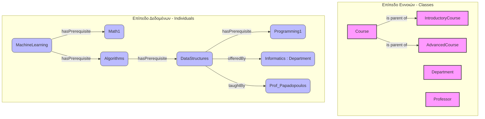

# Εργαστηριακός Οδηγός: Εισαγωγή στο Protégé και τον Reasoner

Αυτός ο οδηγός περιγράφει τα βήματα για τη ζωντανή επίδειξη της δημιουργίας και διαχείρισης Οντολογιών μέσω του εργαλείου Protégé, χρησιμοποιώντας την κλασική **Οντολογία της Πίτσας (Pizza Ontology)**.

---

## 0. Εγκατάσταση του Protégé

Το **Protégé** είναι δωρεάν, ανοιχτού κώδικα desktop εφαρμογή (Java) από το Stanford University.

### Απαιτήσεις

| | Ελάχιστο | Προτεινόμενο |
|---|---|---|
| **Java** | JDK 11 | JDK 17+ |
| **RAM** | 2 GB | 4 GB+ |
| **OS** | Windows / macOS / Linux | — |

> Έλεγχος Java: `java -version` στο terminal. Αν δεν υπάρχει: [adoptium.net](https://adoptium.net)

### Βήματα Εγκατάστασης

1. Κατεβάστε το Protégé από το **[protege.stanford.edu](https://protege.stanford.edu)** → **Download**
2. Επιλέξτε την έκδοση **Protégé Desktop** (όχι το WebProtégé)
3. Αποσυμπιέστε το αρχείο σε φάκελο της επιλογής σας
4. Εκκινήστε:
   - **Windows:** `run.bat`
   - **macOS / Linux:** `run.sh` (ίσως χρειαστεί `chmod +x run.sh`)

### Εγκατάσταση Reasoner (Pellet)

Το Protégé έρχεται με ενσωματωμένο τον **HermiT**. Για τον **Pellet** (ταχύτερος για SWRL):

1. Μέσα στο Protégé: **File > Check for Plugins...**
2. Αναζητήστε **Pellet Reasoner** και εγκαταστήστε το
3. Επανεκκινήστε το Protégé

> 💡 Για τις ανάγκες του εργαστηρίου αρκεί ο **HermiT** που έρχεται προεγκατεστημένος.

---

## 1. Εισαγωγή της Οντολογίας

Για να ξεκινήσουμε την επίδειξη, θα φορτώσουμε την έτοιμη οντολογία απευθείας από το διαδίκτυο:

1. Ανοίξτε το **Protégé**.
2. Στο κεντρικό μενού, επιλέξτε **File > Open from URL...**
3. Επικολλήστε τον παρακάτω σύνδεσμο:
   `http://protege.stanford.edu/ontologies/pizza/pizza.owl`
4. Πατήστε **OK** και περιμένετε να φορτώσουν τα δεδομένα.

---

## 2. Εξερεύνηση Βασικών Στοιχείων

Πριν τρέξουμε τη συλλογιστική μηχανή, εξηγούμε στο κοινό τη δομή της οντολογίας:

* **Κλάσεις (Classes):** Στην καρτέλα **Entities > Classes**, ανοίξτε την ιεραρχία `Thing > Food > Pizza`. Δείξτε πώς κατηγοριοποιούνται οι έννοιες.
* **Ιδιότητες (Object Properties):** Στην καρτέλα **Object Properties**, δείξτε την ιδιότητα `hasTopping` (έχει υλικό) και την αντίστροφή της `isToppingOf` (είναι υλικό της).
* **Αμοιβαία Αποκλειόμενες Κλάσεις (Disjoint Classes):** Δείξτε ότι τα `MeatTopping` (Κρεατικά) και `VegetableTopping` (Λαχανικά) είναι ορισμένα ως Disjoint (το ένα αποκλείει το άλλο).

---

## 3. Η Επίδειξη του Reasoner (Το Παράδειγμα της Μαργαρίτας)

Εδώ θα δείξουμε πώς το σύστημα εξάγει αυτόματα νέα γνώση, χωρίς να την έχουμε εισάγει εμείς ρητά.

### Βήμα 3.1: Ο Κανόνας (Τι είναι Χορτοφαγική Πίτσα;)
1. Πηγαίνετε στην κλάση `VegetarianPizza`.
2. Δείξτε στο πάνελ **Equivalent To** τον κανόνα: Μια πίτσα είναι χορτοφαγική **ΜΟΝΟ** αν έχει υλικά από τις κλάσεις `CheeseTopping` ή `VegetableTopping`.

### Βήμα 3.2: Τα Δεδομένα (Τι είναι η Μαργαρίτα;)
1. Πηγαίνετε στην κλάση `MargheritaPizza` (κάτω από το `NamedPizza`).
2. Δείξτε στο πάνελ **SubClass Of** ότι αποτελείται από `MozzarellaTopping` και `TomatoTopping`.
3. **Σημαντικό:** Τονίστε ότι η Μαργαρίτα **ΔΕΝ** βρίσκεται κάτω από την κλάση `VegetarianPizza` στην ιεραρχία στα αριστερά.

### Βήμα 3.3: Εκτέλεση της Συλλογιστικής Μηχανής
1. Στο κεντρικό μενού πάνω, επιλέξτε **Reasoner**.
2. Βεβαιωθείτε ότι είναι επιλεγμένος ο **HermiT**.
3. Πατήστε **Start reasoner** (ή *Synchronize reasoner*).

### Βήμα 3.4: Η Αποκάλυψη (Ενεργοποίηση Inferred View)
Για να δούμε τα αποτελέσματα που υπολόγισε η μηχανή:
1. Πάνω από το δέντρο των κλάσεων αριστερά, βρείτε το αναπτυσσόμενο μενού που γράφει **Asserted**.
2. Αλλάξτε το σε **Inferred** (ή **Asserted & Inferred**).
3. Ανοίξτε ξανά την κλάση `VegetarianPizza`.
4. **Αποτέλεσμα:** Η `MargheritaPizza` (και η `SohoPizza`) εμφανίζονται πλέον κάτω από την `VegetarianPizza` με **απαλό κίτρινο φόντο**, υποδηλώνοντας ότι το σύστημα εξήγαγε λογικά αυτό το συμπέρασμα!

---

## 4. Σύνοψη

> "Είδαμε στην πράξη τη δύναμη των Οντολογιών και του Σημασιολογικού Ιστού. Δεν χρειάστηκε να χαρακτηρίσουμε τη Μαργαρίτα ως 'Χορτοφαγική' χειροκίνητα. Δώσαμε στη μηχανή τον ορισμό, της δώσαμε τα συστατικά, και εκείνη έκανε τη λογική σύνδεση μόνη της. Οποιαδήποτε νέα πίτσα προστεθεί στο μέλλον με αυτά τα χαρακτηριστικά, θα κατηγοριοποιηθεί αυτόματα."

---

## 5. Δημιουργία Οντολογίας Πανεπιστημίου από Μηδέν

Σε αυτή την ενότητα δημιουργούμε μια νέα οντολογία που αναπαριστά τη δομή ενός Πανεπιστημίου: τμήματα, μαθήματα και τα προαπαιτούμενά τους.

### 5.1 Σχεδιασμός Οντολογίας

Πριν ανοίξουμε το Protégé, σχεδιάζουμε την οντολογία:

| Στοιχείο | Τύπος | Περιγραφή |
|---|---|---|
| `Course` | Class | Ένα ακαδημαϊκό μάθημα |
| `Department` | Class | Τμήμα του Πανεπιστημίου |
| `Professor` | Class | Διδάσκων |
| `hasPrerequisite` | Object Property | Ένα μάθημα απαιτεί άλλο ως προαπαιτούμενο |
| `offeredBy` | Object Property | Το μάθημα ανήκει σε τμήμα |
| `taughtBy` | Object Property | Το μάθημα διδάσκεται από καθηγητή |
| `courseCode` | Data Property | Κωδικός μαθήματος (String) |
| `credits` | Data Property | Πιστωτικές μονάδες (Integer) |
| `semester` | Data Property | Εξάμηνο διδασκαλίας (Integer) |

**Παράδειγμα ιεραρχίας μαθημάτων:**
```
Thing
└── Course
    ├── IntroductoryCourse   (Εισαγωγικά — χωρίς προαπαιτούμενα)
    └── AdvancedCourse       (Προχωρημένα — έχουν προαπαιτούμενα)
```

---

### 5.2 Δημιουργία Νέας Οντολογίας στο Protégé

1. Ανοίξτε το Protégé και επιλέξτε **File > New Ontology...**
2. Στο παράθυρο που εμφανίζεται, ορίστε IRI (Internationalized Resource Identifier):
   `http://www.example.org/university`
3. Πατήστε **Finish**.

> 💡 Το IRI λειτουργεί ως μοναδικό αναγνωριστικό της οντολογίας. Δεν χρειάζεται να είναι πραγματικό URL.

---

### 5.3 Δημιουργία Κλάσεων

1. Πηγαίνετε στην καρτέλα **Entities > Classes**.
2. Κάντε κλικ στο **+** δίπλα στο `owl:Thing` για να προσθέσετε νέα κλάση.
3. Δημιουργήστε τις παρακάτω κλάσεις:
   - `Course`
   - `Department`
   - `Professor`
4. Επιλέξτε την κλάση `Course` και κάντε την **parent class** (υπερκλάση) για:
C   - `IntroductoryCourse` (πατήστε **+** με επιλεγμένη την `Course`)
   - `AdvancedCourse`
5. Ορίστε `IntroductoryCourse` και `AdvancedCourse` ως **Disjoint**: επιλέξτε `IntroductoryCourse`, πηγαίνετε στο πάνελ **Disjoint With**, πατήστε **+** και προσθέστε `AdvancedCourse`.

---

### 5.4 Δημιουργία Object Properties

1. Πηγαίνετε στην καρτέλα **Entities > Object Properties**.
2. Δημιουργήστε τις παρακάτω ιδιότητες (κλικ στο **+** πάνω από την ιεραρχία):

   | Ιδιότητα | Domain | Range | Χαρακτηριστικά |
   |---|---|---|---|
   | `hasPrerequisite` | `Course` | `Course` | Transitive |
   | `offeredBy` | `Course` | `Department` | Functional |
   | `taughtBy` | `Course` | `Professor` | — |

3. Για να ορίσετε Domain/Range μιας ιδιότητας:
   - Κάντε κλικ **πάνω στο όνομα** της ιδιότητας (π.χ. `hasPrerequisite`) στην αριστερή ιεραρχία
   - ⚠️ **Σημαντικό:** Βεβαιωθείτε ότι το **δεξί πάνελ** δείχνει τη συγκεκριμένη ιδιότητα (π.χ. τίτλος `hasPrerequisite`) και **όχι** κάποια Κλάση — αν δείχνει Κλάση, κάντε κλικ αλλού και μετά ξανά στην ιδιότητα
   - Στο δεξί πάνελ, βεβαιωθείτε ότι είστε στην καρτέλα **Description**
   - Θα δείτε διαδοχικά (κυλήστε αν χρειάζεται): **Characteristics**, **Domains (intersection)**, **Ranges (intersection)**
   - Στο **Domains (intersection)** πατήστε **+** → επιλέξτε `Course`
   - Στο **Ranges (intersection)** πατήστε **+** → επιλέξτε `Course`

4. Για να ορίσετε `hasPrerequisite` ως **Transitive**:
   - Με την `hasPrerequisite` επιλεγμένη, στην καρτέλα **Description** του δεξιού πάνελ
   - Στην **κορυφή** της καρτέλας θα δείτε την ενότητα **Characteristics** (Functional, Inverse Functional, Transitive, Symmetric, Asymmetric, Reflexive, Irreflexive)
   - Τσεκάρετε το **Transitive**
   - *(Αν το Α απαιτεί Β και Β απαιτεί Γ, τότε αυτόματα Α απαιτεί Γ)*

---

### 5.5 Δημιουργία Data Properties

1. Πηγαίνετε στην καρτέλα **Entities > Data Properties**.
2. Δημιουργήστε:

   | Ιδιότητα | Domain | Range (Datatype) |
   |---|---|---|
   | `courseCode` | `Course` | `xsd:string` |
   | `credits` | `Course` | `xsd:integer` |
   | `semester` | `Course` | `xsd:integer` |
   | `departmentName` | `Department` | `xsd:string` |

---


### 5.6 Δημιουργία Individuals (Στιγμιότυπα)

> **Σημαντικό για Protégé 5.6.7:**
> Για να δημιουργήσετε σωστά individuals, χρησιμοποιήστε το tab **Individuals by class** (που βρίσκεται δίπλα στο Entities tab). Εκεί εμφανίζονται οι κλάσεις και μπορείτε να επιλέξετε την κλάση που θέλετε και να προσθέσετε individual με το **+**. 
> Το tab **Individuals** κάτω από το Entities tab δεν επιτρέπει να διαλέξετε κλάση για το νέο individual και δεν συνιστάται για τη δημιουργία στιγμιότυπων.

1. Πηγαίνετε στην καρτέλα **Individuals by class** (δίπλα στο Entities tab).
2. Επιλέξτε μια κλάση (π.χ. `Department`) και πατήστε **+** για να προσθέσετε άτομο (individual).
3. Δημιουργήστε τα παρακάτω individuals:

**Departments:**
- `Informatics` (κλάση: `Department`)
  - `departmentName` = "Τμήμα Πληροφορικής"

**Professors:**
- `Prof_Papadopoulos` (κλάση: `Professor`)

**Courses:**

| Individual | Κλάση | courseCode | credits | semester |
|---|---|---|---|---|
| `Math1` | `IntroductoryCourse` | "MAT101" | 5 | 1 |
| `Programming1` | `IntroductoryCourse` | "CS101" | 6 | 1 |
| `DataStructures` | `AdvancedCourse` | "CS201" | 6 | 3 |
| `Algorithms` | `AdvancedCourse` | "CS301" | 6 | 5 |
| `MachineLearning` | `AdvancedCourse` | "CS401" | 6 | 7 |

4. Για κάθε `AdvancedCourse`, ορίστε τα **Object Property Assertions** (προαπαιτούμενα):
   - `DataStructures` → `hasPrerequisite` → `Programming1`
   - `Algorithms` → `hasPrerequisite` → `DataStructures`
   - `MachineLearning` → `hasPrerequisite` → `Algorithms`
   - `MachineLearning` → `hasPrerequisite` → `Math1`
   - Επίσης: `DataStructures` → `offeredBy` → `Informatics`, `taughtBy` → `Prof_Papadopoulos`

5. Επίσης ορίστε **Same Individual** για να ενεργοποιηθεί η Unique Name Assumption: επιλέξτε `Math1`, πηγαίνετε **Same Individual As** πάνελ και βεβαιωθείτε ότι όλα τα individuals είναι διακριτά (ή χρησιμοποιήστε **Edit > Make all individuals different**).

---

### 5.7 Εκτέλεση Reasoner & Επαλήθευση

1. **Reasoner > Start reasoner (HermiT)**
2. Επαληθεύστε ότι η οντολογία είναι **συνεπής** (consistent) — δεν πρέπει να εμφανιστεί κόκκινο `owl:Nothing`.

3. Λόγω του `Transitive` χαρακτηριστικού στο `hasPrerequisite`, ο reasoner θα συναγάγει ότι:
    - το `MachineLearning` έχει (έμμεσα) προαπαιτούμενο και το `Programming1`

#### Πώς να το δεις στο Protégé:

1. Πήγαινε στο μενού **Reasoner** και επίλεξε **Start reasoner** (π.χ. HermiT).
2. Πήγαινε στο tab **Individuals by class** και επίλεξε την κλάση `AdvancedCourse`, μετά το individual `MachineLearning`.
3. Στο δεξί πάνελ, βρες την ενότητα **Object Property Assertions**.
4. Εκεί θα εμφανιστούν οι άμεσες και έμμεσες (inferred) σχέσεις. Αν ο reasoner είναι ενεργός, θα δεις ότι το `MachineLearning` έχει `hasPrerequisite` και το `Programming1` (μέσω transitiveness).
5. Εναλλακτικά, μπορείς να ενεργοποιήσεις το **Inferred** view (πάνω από το δέντρο των individuals) για να δεις τις λογικά συναγόμενες σχέσεις.
6. Αν δεν εμφανίζεται, βεβαιώσου ότι:
    - Έχεις ορίσει το `hasPrerequisite` ως **Transitive**.
    - Έχεις προσθέσει σωστά τα προαπαιτούμενα (Programming1 → DataStructures → Algorithms → MachineLearning).

---


### 5.8 Εξαγωγή σε OWL/XML

1. Επιλέξτε **File > Save As...**
2. Στο παράθυρο διαλόγου επιλέξτε format: **OWL/XML Syntax**
3. Αποθηκεύστε το αρχείο ως `university.owl` σε φάκελο της επιλογής σας.

> Εναλλακτικά, αποθηκεύστε σε **Turtle (.ttl)** ή **RDF/XML** — το `owlready2` (επόμενη ενότητα) τα διαβάζει όλα.

---

## Η χρησιμότητα του Protégé

Το **Protégé** αποτελεί το βασικό εργαλείο για τη δημιουργία, επεξεργασία και οπτικοποίηση οντολογιών OWL. Παρέχει ένα φιλικό γραφικό περιβάλλον όπου ο χρήστης μπορεί να:
- Ορίζει κλάσεις, ιδιότητες και στιγμιότυπα με ευκολία
- Ελέγχει τη λογική συνέπεια της οντολογίας με reasoners
- Εξερευνά τις λογικά συναγόμενες σχέσεις (inferred knowledge)
- Εξάγει την οντολογία σε διάφορες μορφές για χρήση σε εφαρμογές, βάσεις δεδομένων ή προγράμματα (π.χ. Python, Java)

Χάρη στο Protégé, η ανάπτυξη σημασιολογικών μοντέλων γίνεται προσβάσιμη τόσο σε αρχάριους όσο και σε προχωρημένους χρήστες, διευκολύνοντας τη διαμοίραση και επαναχρησιμοποίηση γνώσης σε πολλούς τομείς (επιστήμη, βιοϊατρική, εκπαίδευση, επιχειρήσεις κ.ά.).

---


## 6. Χρήση της Οντολογίας από Python

Θα χρησιμοποιήσουμε τη βιβλιοθήκη **`owlready2`** που επιτρέπει φόρτωση, ερώτηση (query) και τροποποίηση OWL οντολογιών απευθείας από Python.

### 6.1 Εγκατάσταση

```bash
pip install owlready2
```

---

### 6.2 Φόρτωση της Οντολογίας

```python
from owlready2 import get_ontology

# Φόρτωση αρχείου OWL (προσαρμόστε το path)
onto = get_ontology("file:///path/to/university.owl").load()

print("IRI οντολογίας:", onto.base_iri)
```

---

### 6.3 Εξερεύνηση Κλάσεων και Ιδιοτήτων

```python
# Εκτύπωση όλων των κλάσεων
print("=== Κλάσεις ===")
for cls in onto.classes():
    print(" -", cls.name)

# Εκτύπωση όλων των object properties
print("\n=== Object Properties ===")
for prop in onto.object_properties():
    print(" -", prop.name)

# Εκτύπωση όλων των data properties
print("\n=== Data Properties ===")
for prop in onto.data_properties():
    print(" -", prop.name)
```

**Αναμενόμενη έξοδος:**
```
=== Κλάσεις ===
 - Course
 - IntroductoryCourse
 - AdvancedCourse
 - Department
 - Professor

=== Object Properties ===
 - hasPrerequisite
 - offeredBy
 - taughtBy

=== Data Properties ===
 - courseCode
 - credits
 - semester
 - departmentName
```

---

### 6.4 Εξερεύνηση Individuals και Ιδιοτήτων τους

```python
# Εκτύπωση όλων των μαθημάτων με τον κωδικό και τα credits τους
print("=== Μαθήματα ===")
for course in onto.Course.instances():
    code = course.courseCode[0] if course.courseCode else "—"
    cr   = course.credits[0]    if course.credits    else "—"
    sem  = course.semester[0]   if course.semester   else "—"
    print(f"  {course.name:20s}  κωδικός={code}  credits={cr}  εξάμηνο={sem}")
```

---

### 6.5 Ερώτηση Προαπαιτουμένων (Direct)

```python
# Άμεσα (ρητά δηλωμένα) προαπαιτούμενα ενός μαθήματος
ml = onto.search_one(iri="*MachineLearning")

print(f"Άμεσα προαπαιτούμενα του {ml.name}:")
for prereq in ml.hasPrerequisite:
    print(" -", prereq.name)
```

**Αναμενόμενη έξοδος:**
```
Άμεσα προαπαιτούμενα του MachineLearning:
 - Algorithms
 - Math1
```

---

### 6.6 Εξαγωγή Έμμεσων Προαπαιτουμένων (Transitivity με Reasoner)

Η transitivity δηλώθηκε στο Protégé, αλλά για να την αξιοποιήσουμε από Python χρειαζόμαστε τον ενσωματωμένο reasoner **HermiT**:

```python
from owlready2 import sync_reasoner_pellet, sync_reasoner_hermit

# Εκτέλεση reasoner (απαιτεί εγκατεστημένη Java)
with onto:
    sync_reasoner_hermit(infer_property_values=True)

# Τώρα τα inferred προαπαιτούμενα είναι διαθέσιμα
print(f"Όλα τα προαπαιτούμενα (inferred) του {ml.name}:")
for prereq in ml.hasPrerequisite:
    print(" -", prereq.name)
```

**Αναμενόμενη έξοδος (μετά τον reasoner):**
```
Όλα τα προαπαιτούμενα (inferred) του MachineLearning:
 - Algorithms
 - Math1
 - DataStructures   ← inferred (Algorithms → DataStructures)
 - Programming1     ← inferred (DataStructures → Programming1)
```

> 💡 Ο `sync_reasoner_hermit` απαιτεί **Java** εγκατεστημένη στο σύστημα. Ελέγξτε με `java -version`.

---

### 6.7 Εναλλακτικά: Αναδρομική Αναζήτηση χωρίς Reasoner

Αν δεν θέλετε να τρέξετε reasoner, μπορείτε να υλοποιήσετε την αναδρομή στην Python:

```python
def all_prerequisites(course, visited=None):
    """Επιστρέφει το σύνολο ΟΛΩΝ των προαπαιτουμένων (άμεσων και έμμεσων)."""
    if visited is None:
        visited = set()
    for prereq in course.hasPrerequisite:
        if prereq not in visited:
            visited.add(prereq)
            all_prerequisites(prereq, visited)
    return visited

ml = onto.search_one(iri="*MachineLearning")
prereqs = all_prerequisites(ml)
print(f"Όλα τα προαπαιτούμενα του {ml.name}:")
for p in sorted(prereqs, key=lambda x: x.name):
    print(" -", p.name)
```

---

### 6.8 SPARQL Ερωτήματα

Η `owlready2` υποστηρίζει SPARQL μέσω της ενσωματωμένης βάσης δεδομένων (quadstore):

```python
from owlready2 import default_world

# Βρες όλα τα AdvancedCourse με τα προαπαιτούμενά τους
results = default_world.sparql("""
    PREFIX rdf: <http://www.w3.org/1999/02/22-rdf-syntax-ns#>
    PREFIX owl: <http://www.w3.org/2002/07/owl#>
    PREFIX onto: <http://www.example.org/university#>

    SELECT ?course ?prereq
    WHERE {
        ?course rdf:type onto:AdvancedCourse .
        ?course onto:hasPrerequisite ?prereq .
    }
    ORDER BY ?course
""")

print("AdvancedCourse → Προαπαιτούμενο:")
for row in results:
    course_name = row[0].name
    prereq_name = row[1].name
    print(f"  {course_name:20s} → {prereq_name}")
```

---

### 6.9 Δημιουργία Νέου Individual από Python

Μπορούμε να εμπλουτίσουμε δυναμικά την οντολογία:

```python
with onto:
    # Δημιουργία νέου μαθήματος
    new_course = onto.AdvancedCourse("DeepLearning")
    new_course.courseCode = ["CS501"]
    new_course.credits    = [6]
    new_course.semester   = [9]
    # Ορισμός προαπαιτουμένου
    ml = onto.search_one(iri="*MachineLearning")
    new_course.hasPrerequisite.append(ml)

# Αποθήκευση της ενημερωμένης οντολογίας
onto.save(file="university_updated.owl", format="rdfxml")
print("Αποθηκεύτηκε ως university_updated.owl")
```

---

### 6.10 Πλήρες Script

```python
"""
university_ontology.py
Παράδειγμα χρήσης OWL οντολογίας Πανεπιστημίου με owlready2.
Απαιτήσεις: pip install owlready2
             Java εγκατεστημένη (για τον reasoner)
"""

from owlready2 import get_ontology, sync_reasoner_hermit, default_world

OWL_PATH = "file:///path/to/university.owl"   # ← προσαρμόστε

onto = get_ontology(OWL_PATH).load()

# ── Εξερεύνηση ──────────────────────────────────────────────────────────────
print("Κλάσεις:", [c.name for c in onto.classes()])

print("\nΜαθήματα:")
for course in onto.Course.instances():
    code = course.courseCode[0] if course.courseCode else "—"
    cr   = course.credits[0]    if course.credits    else "—"
    print(f"  {course.name:20s}  {code}  {cr} ECTS")

# ── Άμεσα προαπαιτούμενα ────────────────────────────────────────────────────
def all_prerequisites(course, visited=None):
    if visited is None:
        visited = set()
    for prereq in course.hasPrerequisite:
        if prereq not in visited:
            visited.add(prereq)
            all_prerequisites(prereq, visited)
    return visited

print("\nΠροαπαιτούμενα (αναδρομικά):")
for course in onto.AdvancedCourse.instances():
    prereqs = all_prerequisites(course)
    names = ", ".join(sorted(p.name for p in prereqs)) if prereqs else "—"
    print(f"  {course.name:20s} ← {names}")

# ── Reasoner (inferred) ──────────────────────────────────────────────────────
print("\nΕκτέλεση HermiT reasoner...")
with onto:
    sync_reasoner_hermit(infer_property_values=True)
print("Ολοκληρώθηκε. Η οντολογία είναι συνεπής.")

# ── SPARQL ───────────────────────────────────────────────────────────────────
print("\nSPARQL — AdvancedCourse & προαπαιτούμενα:")
rows = default_world.sparql("""
    PREFIX rdf:  <http://www.w3.org/1999/02/22-rdf-syntax-ns#>
    PREFIX onto: <http://www.example.org/university#>
    SELECT ?c ?p WHERE {
        ?c rdf:type onto:AdvancedCourse .
        ?c onto:hasPrerequisite ?p .
    } ORDER BY ?c
""")
for row in rows:
    print(f"  {row[0].name:20s} → {row[1].name}")
```

---

## 7. Σύνοψη Νέας Ενότητας

| Βήμα | Εργαλείο | Αποτέλεσμα |
|---|---|---|
| Σχεδιασμός κλάσεων & ιδιοτήτων | — (χαρτί/whiteboard) | Διάγραμμα οντολογίας |
| Δημιουργία στο Protégé | Protégé Desktop | Δομή + individuals |
| Επαλήθευση λογικής συνέπειας | HermiT Reasoner (Protégé) | Inferred ιεραρχία |
| Εξαγωγή | File > Save As → OWL/XML | `university.owl` |
| Φόρτωση & ερώτηση | `owlready2` (Python) | Προγραμματιστική πρόσβαση |
| Inferred εξαγωγή γνώσης | `sync_reasoner_hermit` | Transitivity, νέα facts |
| SPARQL | `default_world.sparql()` | Δομημένα ερωτήματα |


---

## 8. Οπτική Σύνοψη της Οντολογίας μας

Το παρακάτω διάγραμμα αναπαριστά οπτικά τη βασική δομή αυτού που μόλις δημιουργήσαμε στο Protégé. Αριστερά βλέπουμε την ιεραρχία των **Κλάσεων** (Classes) και δεξιά τα **Στιγμιότυπα** (Individuals) με τις μεταξύ τους σχέσεις (Object Properties).



## 9. Πώς να συνεχίσετε (Προτάσεις Επέκτασης)

Η οντολογία που φτιάξαμε είναι ένα εξαιρετικό σημείο εκκίνησης. Για να κατανοήσετε ακόμα καλύτερα τις δυνατότητες του Σημασιολογικού Ιστού και του Protégé, δοκιμάστε να εμπλουτίσετε το μοντέλο σας με τα εξής:

1. **Προσθήκη Φοιτητών (Students):**
   * Δημιουργήστε μια νέα κλάση `Student`.
   * Δημιουργήστε Object Properties όπως `isEnrolledIn` (συνδέει `Student` με `Course`) και `hasPassed` (μαθήματα που έχει περάσει).
   * **Πρόκληση με Reasoner:** Μπορείτε να φτιάξετε έναν κανόνα (π.χ. με Equivalent Class) που να λέει ότι *"Πτυχιούχος (GraduateStudent) είναι οποιοσδήποτε φοιτητής έχει περάσει τουλάχιστον 40 μαθήματα"*;

2. **Αίθουσες & Πρόγραμμα (Schedules & Rooms):**
   * Προσθέστε κλάσεις `Room` (Αίθουσα) και `TimeSlot` (Χρονική Περίοδος).
   * Συνδέστε τα μαθήματα με τις αίθουσες (`takesPlaceIn`).
   * Προσθέστε Data Properties για τη χωρητικότητα της αίθουσας (`capacity` ως integer).

3. **Περιορισμοί Πληθικότητας (Cardinality Restrictions):**
   * Χρησιμοποιήστε το Protégé για να επιβάλλετε περιορισμούς, όπως: *"Κάθε μάθημα πρέπει να διδάσκεται από **ακριβώς έναν** (exactly 1) καθηγητή"*.
   * Δοκιμάστε να φτιάξετε ένα μάθημα χωρίς καθηγητή ή με δύο καθηγητές, τρέξτε τον Reasoner και δείτε πώς θα χτυπήσει "ασυνέπεια" (Inconsistency).

4. **Διασύνδεση με τον Πραγματικό Κόσμο (Linked Open Data):**
   * Αντί να έχετε τα Τμήματα ως απλά ονόματα, δοκιμάστε να προσθέσετε ιδιότητες (π.χ. `locatedIn`) που να δείχνουν στο πραγματικό IRI της πόλης από την **DBpedia** ή τα **Wikidata** (π.χ. σύνδεση του Πανεπιστημίου με την Αθήνα ή τη Θεσσαλονίκη). 

Αυτές οι προσθήκες θα μετατρέψουν το απλό σας παράδειγμα σε ένα πλήρες Σύστημα Αναπαράστασης Γνώσης!
