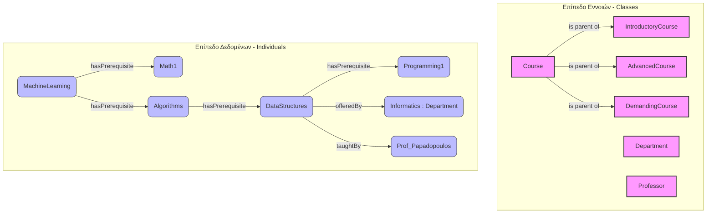

# Lab Guide: Introduction to Protégé and the Reasoner

This guide describes the steps for a live demonstration of creating and managing Ontologies using the Protégé tool, based on the classic **Pizza Ontology**.

---

## 0. Installing Protégé

**Protégé** is a free, open-source desktop application (Java) from Stanford University.

### Requirements

| | Minimum | Recommended |
|---|---|---|
| **Java** | JDK 11 | JDK 17+ |
| **RAM** | 2 GB | 4 GB+ |
| **OS** | Windows / macOS / Linux | — |

> Check Java: `java -version` in the terminal. If not installed: [adoptium.net](https://adoptium.net)

### Installation Steps

1. Download Protégé from **[protege.stanford.edu](https://protege.stanford.edu)** → **Download**
2. Select the **Protégé Desktop** version (not WebProtégé)
3. Extract the archive to a folder of your choice
4. Launch:
   - **Windows:** `run.bat`
   - **macOS / Linux:** `run.sh` (you may need `chmod +x run.sh`)

### Reasoner

Protégé comes with **HermiT** built-in, which is sufficient for this lab.

> **Tip:** **Optional:** If you want **Pellet** (faster for SWRL rules), you can install it via **File > Check for Plugins...** → search for **Pellet Reasoner** → install → restart Protégé.

---

## 1. Loading the Ontology

To begin the demonstration, we will load a ready-made ontology directly from the web:

1. Open **Protégé**.
2. From the main menu, select **File > Open from URL...**
3. Paste the following link:
   `http://protege.stanford.edu/ontologies/pizza/pizza.owl`
4. Click **OK** and wait for the data to load.

---

## 2. Exploring Basic Elements

Before running the reasoning engine, we explain the structure of the ontology to the audience:

* **Classes:** In the **Entities > Classes** tab, expand the hierarchy `Thing > Food > Pizza`. Show how concepts are categorized.
* **Object Properties:** In the **Object Properties** tab, show the property `hasTopping` and its inverse `isToppingOf`.
* **Disjoint Classes:** Show that `MeatTopping` and `VegetableTopping` are defined as Disjoint (mutually exclusive).

---

## 3. The Reasoner Demonstration (The Margherita Example)

Here we will show how the system automatically derives new knowledge, without us having explicitly entered it.

### Step 3.1: The Rule (What is a Vegetarian Pizza?)
1. Navigate to the `VegetarianPizza` class.
2. Show in the **Equivalent To** panel the rule: A pizza is vegetarian **ONLY** if its toppings come from the `CheeseTopping` or `VegetableTopping` classes.

### Step 3.2: The Data (What is a Margherita?)
1. Navigate to the `MargheritaPizza` class (under `NamedPizza`).
2. Show in the **SubClass Of** panel that it consists of `MozzarellaTopping` and `TomatoTopping`.
3. **Important:** Emphasize that Margherita is **NOT** listed under the `VegetarianPizza` class in the hierarchy on the left.

### Step 3.3: Running the Reasoning Engine
1. In the top menu bar, select **Reasoner**.
2. Make sure **HermiT** is selected.
3. Click **Start reasoner** (or *Synchronize reasoner*).

### Step 3.4: The Reveal (Enabling the Inferred View)
To see the results computed by the engine:
1. Above the class tree on the left, find the dropdown menu that says **Asserted**.
2. Change it to **Inferred** (or **Asserted & Inferred**).
3. Expand the `VegetarianPizza` class again.
4. **Result:** `MargheritaPizza` (and `SohoPizza`) now appear under `VegetarianPizza` with a **light yellow background**, indicating that the system logically inferred this conclusion!

---

## 4. Summary

> "We saw in practice the power of Ontologies and the Semantic Web. We didn't need to manually label the Margherita as 'Vegetarian'. We gave the engine the definition, gave it the ingredients, and it made the logical connection on its own. Any new pizza added in the future with these characteristics will be automatically classified."

---

## 5. Building a University Ontology from Scratch

In this section we create a new ontology representing the structure of a University: departments, courses, and their prerequisites.

### 5.1 Ontology Design

Before opening Protégé, we design the ontology:

| Element | Type | Description |
|---|---|---|
| `Course` | Class | An academic course |
| `Department` | Class | University department |
| `Professor` | Class | Instructor |
| `hasPrerequisite` | Object Property | A course requires another as a prerequisite |
| `offeredBy` | Object Property | The course belongs to a department |
| `taughtBy` | Object Property | The course is taught by a professor |
| `courseCode` | Data Property | Course code (String) |
| `credits` | Data Property | Credit units (Integer) |
| `semester` | Data Property | Teaching semester (Integer) |

**Example course hierarchy:**
```
Thing
└── Course
    ├── IntroductoryCourse   (Introductory — no prerequisites)
    └── AdvancedCourse       (Advanced — has prerequisites)
```

---

### 5.2 Creating a New Ontology in Protégé

1. Open Protégé and select **File > New Ontology...**
2. In the dialog that appears, set the IRI (Internationalized Resource Identifier):
   `http://www.example.org/university`
3. Click **Finish**.

> **Tip:** The IRI serves as a unique identifier for the ontology. It does not need to be an actual URL.

---

### 5.3 Creating Classes

1. Go to the **Entities > Classes** tab.
2. Click **+** next to `owl:Thing` to add a new class.
3. Create the following classes:
   - `Course`
   - `Department`
   - `Professor`
4. Select the `Course` class and make it the **parent class** (superclass) for:
   - `IntroductoryCourse` (click **+** with `Course` selected)
   - `AdvancedCourse`
5. Set `IntroductoryCourse` and `AdvancedCourse` as **Disjoint**: select `IntroductoryCourse`, go to the **Disjoint With** panel, click **+** and add `AdvancedCourse`.

---

### 5.4 Creating Object Properties

1. Go to the **Entities > Object Properties** tab.
2. Create the following properties (click **+** above the hierarchy):

   | Property | Domain | Range | Characteristics |
   |---|---|---|---|
   | `hasPrerequisite` | `Course` | `Course` | Transitive |
   | `offeredBy` | `Course` | `Department` | Functional |
   | `taughtBy` | `Course` | `Professor` | — |

3. To set the Domain/Range of a property:
   - Click **on the name** of the property (e.g. `hasPrerequisite`) in the left hierarchy
   - **Warning!** **Important:** Make sure the **right panel** shows the specific property (e.g. title `hasPrerequisite`) and **not** a Class — if it shows a Class, click elsewhere and then click the property again
   - In the right panel, make sure you are on the **Description** tab
   - You will see in sequence (scroll if needed): **Characteristics**, **Domains (intersection)**, **Ranges (intersection)**
   - In **Domains (intersection)** click **+** → select `Course`
   - In **Ranges (intersection)** click **+** → select `Course`

4. To set `hasPrerequisite` as **Transitive**:
   - With `hasPrerequisite` selected, in the **Description** tab of the right panel
   - At the **top** of the tab you will see the **Characteristics** section (Functional, Inverse Functional, Transitive, Symmetric, Asymmetric, Reflexive, Irreflexive)
   - Check **Transitive**
   - *(If A requires B and B requires C, then automatically A requires C)*

### 5.4.1 Explanation: Logical Characteristics of Object Properties

> This section is a **theoretical reference** — you can read it after completing the steps in 5.4.

The OWL standard allows us to add "intelligence" to properties, so that the Reasoner can automatically derive new knowledge. In Protégé, these characteristics are found in the right panel, under the **Characteristics** section.

The most important ones are:

* **Transitive:** If A is connected to B, and B to C, then A is connected to C.
  * *Example (University Ontology):* `hasPrerequisite`. If MachineLearning requires Algorithms, and Algorithms requires DataStructures, the reasoner automatically understands that MachineLearning (indirectly) requires DataStructures.
* **Functional:** A subject (Domain) can have **at most one** such value (Range).
  * *Example:* `offeredBy`. A specific course cannot belong to 2 different departments simultaneously. If we define 2, the Reasoner will raise an Inconsistency (Error). (Other examples: `hasMother`, `hasTaxID`).
* **Symmetric:** If A is connected to B, then necessarily B is also connected to A with the **same** property.
  * *Example:* `isSiblingOf` or `isMarriedTo`.
* **Inverse Of:** Links two **different** properties creating a bidirectional relationship.
  * *Example:* Suppose we create a property `teaches`. We can define it as **Inverse Of** `taughtBy`. If we add the fact "Professor X `teaches` Course Y", the Reasoner will automatically infer "Course Y `taughtBy` Professor X".

---

### 5.5 Creating Data Properties

1. Go to the **Entities > Data Properties** tab.
2. Create:

   | Property | Domain | Range (Datatype) |
   |---|---|---|
   | `courseCode` | `Course` | `xsd:string` |
   | `credits` | `Course` | `xsd:integer` |
   | `semester` | `Course` | `xsd:integer` |
   | `departmentName` | `Department` | `xsd:string` |

---


### 5.6 Creating Individuals

> **Important for Protégé 5.6.7:**
> To correctly create individuals, use the **Individuals by class** tab (located next to the Entities tab). There you can see the classes and select the one you want, then add an individual with **+**.
> The **Individuals** tab under the Entities tab does not allow you to choose a class for the new individual and is not recommended for creating individuals.

1. Go to the **Individuals by class** tab (next to the Entities tab).
2. Select a class (e.g. `Department`) and click **+** to add an individual.
3. Create the following individuals:

**Departments:**
- `Informatics` (class: `Department`)
  - `departmentName` = "Department of Informatics"

**Professors:**
- `Prof_Papadopoulos` (class: `Professor`)

**Courses:**

| Individual | Class | courseCode | credits | semester |
|---|---|---|---|---|
| `Math1` | `IntroductoryCourse` | "MAT101" | 5 | 1 |
| `Programming1` | `IntroductoryCourse` | "CS101" | 6 | 1 |
| `DataStructures` | `AdvancedCourse` | "CS201" | 6 | 3 |
| `Algorithms` | `AdvancedCourse` | "CS301" | 6 | 5 |
| `MachineLearning` | `AdvancedCourse` | "CS401" | 6 | 7 |

4. For each `AdvancedCourse`, set the **Object Property Assertions** (prerequisites):
   - `DataStructures` → `hasPrerequisite` → `Programming1`
   - `Algorithms` → `hasPrerequisite` → `DataStructures`
   - `MachineLearning` → `hasPrerequisite` → `Algorithms`
   - `MachineLearning` → `hasPrerequisite` → `Math1`
   - Also: `DataStructures` → `offeredBy` → `Informatics`, `taughtBy` → `Prof_Papadopoulos`

5. Set the individuals as **distinct** (Different Individuals) to enforce the Unique Name Assumption: use **Edit > Make all individuals different**, or select an individual (e.g. `Math1`), go to the **Different Individuals** panel and add the rest.

---

### 5.7 Running the Reasoner & Verification

1. **Reasoner > Start reasoner (HermiT)**
2. Verify that the ontology is **consistent** — no red `owl:Nothing` should appear.

3. Due to the `Transitive` characteristic on `hasPrerequisite`, the reasoner will infer that:
    - `MachineLearning` has (indirectly) `Programming1` as a prerequisite

#### How to see it in Protégé:

1. Go to the **Reasoner** menu and select **Start reasoner** (e.g. HermiT).
2. Go to the **Individuals by class** tab and select the `AdvancedCourse` class, then the `MachineLearning` individual.
3. In the right panel, find the **Object Property Assertions** section.
4. There you will see the direct and indirect (inferred) relationships. If the reasoner is active, you will see that `MachineLearning` has `hasPrerequisite` for `Programming1` as well (via transitiveness).
5. Alternatively, you can enable the **Inferred** view (above the individual tree) to see the logically inferred relationships.
6. If it doesn't appear, make sure that:
    - You have set `hasPrerequisite` as **Transitive**.
    - You have correctly added the prerequisites (Programming1 → DataStructures → Algorithms → MachineLearning).

---

### 5.8 Writing Logic Rules (SWRL Rules)

**SWRL** (Semantic Web Rule Language) rules allow us to add complex "IF... THEN..." logic that plain OWL does not support, which is a fundamental part of Expert Systems.

**Goal:** Create a rule that will automatically classify as "Demanding" (DemandingCourse) any course with more than 5 credit units (credits > 5).

1. Go to the **Entities > Classes** tab and create a new class named `DemandingCourse` under `Course`.
2. Enable the SWRL tab by going to the main menu: **Window > Tabs > SWRLTab**.
3. In the new **SWRLTab**, click the **New** button to add a rule.
4. Write the following rule in the text box (names must match exactly those you gave in the ontology):
   ```text
   Course(?c) ^ credits(?c, ?cr) ^ swrlb:greaterThan(?cr, 5)  ->  DemandingCourse(?c)
   ```
5. Click **OK**.
6. **Run the Reasoner again:** `Reasoner > Start reasoner`.
7. Enable the **Inferred** view (or check the Individuals by class tab with the reasoner active) and select the `DemandingCourse` class.
8. **Result:** You will see the courses `Programming1`, `DataStructures`, `Algorithms` and `MachineLearning` (which have 6 credits) automatically appear with a yellow background as individuals of the `DemandingCourse` class! `Math1` (with 5 credits) is not included.

---

### 5.9 Running SPARQL Queries in Protégé

We can run structured queries directly in the graphical interface, before moving to Python.

1. Enable the SPARQL tab: **Window > Tabs > SPARQL Query**.
2. In the text box, type the following query:
   ```sparql
   PREFIX rdf: <http://www.w3.org/1999/02/22-rdf-syntax-ns#>
   PREFIX onto: <http://www.example.org/university#>

   SELECT ?course ?credits
   WHERE {
       ?course rdf:type onto:AdvancedCourse .
       ?course onto:credits ?credits .
   }
   ```
3. Click **Execute** at the bottom.
4. The results will display a table with the advanced courses and their corresponding ECTS (credits).

---

### 5.10 Exporting to OWL/XML


1. Select **File > Save As...**
2. In the dialog box select format: **OWL/XML Syntax**
3. Save the file as `university.owl` in a folder of your choice. Note the full path of the file — you will need it in section 6.

> Alternatively, save in **Turtle (.ttl)** or **RDF/XML** — `owlready2` (next section) reads all of them.

---

## The Usefulness of Protégé

**Protégé** is the primary tool for creating, editing, and visualizing OWL ontologies. It provides a user-friendly graphical interface where the user can:
- Define classes, properties, and individuals with ease
- Check the logical consistency of the ontology with reasoners
- Explore logically inferred relationships (inferred knowledge)
- Export the ontology in various formats for use in applications, databases, or programs (e.g. Python, Java)

Thanks to Protégé, the development of semantic models becomes accessible to both beginners and advanced users, facilitating the sharing and reuse of knowledge across many domains (science, biomedicine, education, business, etc.).

---


## 6. Using the Ontology from Python

We will use the **`owlready2`** library which allows loading, querying, and modifying OWL ontologies directly from Python.

### 6.1 Installation

```bash
pip install owlready2
```

---

### 6.2 Loading the Ontology

```python
from owlready2 import get_ontology

# Load OWL file (adjust the path)
onto = get_ontology("file:///path/to/university.owl").load()

print("Ontology IRI:", onto.base_iri)
```

---

### 6.3 Exploring Classes and Properties

```python
# Print all classes
print("=== Classes ===")
for cls in onto.classes():
    print(" -", cls.name)

# Print all object properties
print("\n=== Object Properties ===")
for prop in onto.object_properties():
    print(" -", prop.name)

# Print all data properties
print("\n=== Data Properties ===")
for prop in onto.data_properties():
    print(" -", prop.name)
```

**Expected output:**
```
=== Classes ===
 - Course
 - IntroductoryCourse
 - AdvancedCourse
 - DemandingCourse
 - Department
 - Professor

=== Object Properties ===
 - hasPrerequisite
 - offeredBy
 - taughtBy

=== Data Properties ===
 - courseCode
 - credits
 - semester
 - departmentName
```

---

### 6.4 Exploring Individuals and Their Properties

```python
# Print all courses with their code and credits
print("=== Courses ===")
for course in onto.Course.instances():
    code = course.courseCode[0] if course.courseCode else "—"
    cr   = course.credits[0]    if course.credits    else "—"
    sem  = course.semester[0]   if course.semester   else "—"
    print(f"  {course.name:20s}  code={code}  credits={cr}  semester={sem}")
```

---

### 6.5 Querying Prerequisites (Direct)

```python
# Direct (explicitly stated) prerequisites of a course
ml = onto.search_one(iri="*MachineLearning")

print(f"Direct prerequisites of {ml.name}:")
for prereq in ml.hasPrerequisite:
    print(" -", prereq.name)
```

**Expected output:**
```
Direct prerequisites of MachineLearning:
 - Algorithms
 - Math1
```

---

### 6.6 Extracting Indirect Prerequisites (Transitivity with Reasoner)

Transitivity was declared in Protégé, but to leverage it from Python we need the built-in **HermiT** reasoner:

```python
from owlready2 import sync_reasoner_pellet, sync_reasoner_hermit

# Run reasoner (requires Java installed)
with onto:
    sync_reasoner_hermit(infer_property_values=True)

# Now the inferred prerequisites are available
print(f"All prerequisites (inferred) of {ml.name}:")
for prereq in ml.hasPrerequisite:
    print(" -", prereq.name)
```

**Expected output (after reasoner):**
```
All prerequisites (inferred) of MachineLearning:
 - Algorithms
 - Math1
 - DataStructures   ← inferred (Algorithms → DataStructures)
 - Programming1     ← inferred (DataStructures → Programming1)
```

> **Tip:** `sync_reasoner_hermit` requires **Java** installed on the system. Check with `java -version`.

---

### 6.7 Alternative: Recursive Search without Reasoner

If you don't want to run a reasoner, you can implement the recursion in Python:

```python
def all_prerequisites(course, visited=None):
    """Returns the set of ALL prerequisites (direct and indirect)."""
    if visited is None:
        visited = set()
    for prereq in course.hasPrerequisite:
        if prereq not in visited:
            visited.add(prereq)
            all_prerequisites(prereq, visited)
    return visited

ml = onto.search_one(iri="*MachineLearning")
prereqs = all_prerequisites(ml)
print(f"All prerequisites of {ml.name}:")
for p in sorted(prereqs, key=lambda x: x.name):
    print(" -", p.name)
```

---

### 6.8 SPARQL Queries

`owlready2` supports SPARQL via its built-in database (quadstore):

```python
from owlready2 import default_world

# Find all AdvancedCourses with their prerequisites
results = default_world.sparql("""
    PREFIX rdf: <http://www.w3.org/1999/02/22-rdf-syntax-ns#>
    PREFIX owl: <http://www.w3.org/2002/07/owl#>
    PREFIX onto: <http://www.example.org/university#>

    SELECT ?course ?prereq
    WHERE {
        ?course rdf:type onto:AdvancedCourse .
        ?course onto:hasPrerequisite ?prereq .
    }
    ORDER BY ?course
""")

print("AdvancedCourse → Prerequisite:")
for row in results:
    course_name = row[0].name
    prereq_name = row[1].name
    print(f"  {course_name:20s} → {prereq_name}")
```

---

### 6.9 Creating a New Individual from Python

We can dynamically enrich the ontology:

```python
with onto:
    # Create a new course
    new_course = onto.AdvancedCourse("DeepLearning")
    new_course.courseCode = ["CS501"]
    new_course.credits    = [6]
    new_course.semester   = [9]
    # Set prerequisite
    ml = onto.search_one(iri="*MachineLearning")
    new_course.hasPrerequisite.append(ml)

# Save the updated ontology
onto.save(file="university.owl", format="rdfxml")
print("Saved as university.owl")
```

---

### 6.10 Complete Script

```python
"""
university_ontology.py
Example of using a University OWL ontology with owlready2.
Requirements: pip install owlready2
              Java installed (for the reasoner)
"""

from owlready2 import get_ontology, sync_reasoner_hermit, default_world

OWL_PATH = "file:///path/to/university.owl"   # ← replace with the path from step 5.10

onto = get_ontology(OWL_PATH).load()

# ── Exploration ───────────────────────────────────────────────────────────────
print("Classes:", [c.name for c in onto.classes()])

print("\nCourses:")
for course in onto.Course.instances():
    code = course.courseCode[0] if course.courseCode else "—"
    cr   = course.credits[0]    if course.credits    else "—"
    print(f"  {course.name:20s}  {code}  {cr} ECTS")

# ── Direct prerequisites ─────────────────────────────────────────────────────
def all_prerequisites(course, visited=None):
    if visited is None:
        visited = set()
    for prereq in course.hasPrerequisite:
        if prereq not in visited:
            visited.add(prereq)
            all_prerequisites(prereq, visited)
    return visited

print("\nPrerequisites (recursive):")
for course in onto.AdvancedCourse.instances():
    prereqs = all_prerequisites(course)
    names = ", ".join(sorted(p.name for p in prereqs)) if prereqs else "—"
    print(f"  {course.name:20s} ← {names}")

# ── Reasoner (inferred) ──────────────────────────────────────────────────────
print("\nRunning HermiT reasoner...")
with onto:
    sync_reasoner_hermit(infer_property_values=True)
print("Done. The ontology is consistent.")

# ── SPARQL ────────────────────────────────────────────────────────────────────
print("\nSPARQL — AdvancedCourse & prerequisites:")
rows = default_world.sparql("""
    PREFIX rdf:  <http://www.w3.org/1999/02/22-rdf-syntax-ns#>
    PREFIX onto: <http://www.example.org/university#>
    SELECT ?c ?p WHERE {
        ?c rdf:type onto:AdvancedCourse .
        ?c onto:hasPrerequisite ?p .
    } ORDER BY ?c
""")
for row in rows:
    print(f"  {row[0].name:20s} → {row[1].name}")
```

---

## 7. Lab Summary

| Step | Tool | Result |
|---|---|---|
| Design classes & properties | — (paper/whiteboard) | Ontology diagram |
| Create in Protégé | Protégé Desktop | Structure + individuals |
| Verify logical consistency | HermiT Reasoner (Protégé) | Inferred hierarchy |
| Export | File > Save As → OWL/XML | `university.owl` |
| Load & query | `owlready2` (Python) | Programmatic access |
| Inferred knowledge extraction | `sync_reasoner_hermit` | Transitivity, new facts |
| Writing Rules | SWRLTab | IF-THEN logic (`DemandingCourse`) |
| Built-in SPARQL | SPARQL Query Tab | Queries within the GUI |
| SPARQL (Python) | `default_world.sparql()` | Structured queries via Python |


---

## 8. Visual Summary of Our Ontology

The following diagram visually represents the basic structure of what we just created in Protégé. On the left we see the **Class** hierarchy and on the right the **Individuals** with their relationships (Object Properties).



## 9. How to Continue (Extension Suggestions)

The ontology we built is an excellent starting point. To better understand the capabilities of the Semantic Web and Protégé, try enriching your model with the following:

1. **Adding Students:**
   * Create a new class `Student`.
   * Create Object Properties such as `isEnrolledIn` (connects `Student` to `Course`) and `hasPassed` (courses that have been passed).
   * **Reasoner Challenge:** Can you create a rule (e.g. with Equivalent Class) that states *"A Graduate Student is any student who has passed at least 40 courses"*?

2. **Rooms & Schedules:**
   * Add classes `Room` and `TimeSlot`.
   * Connect courses to rooms (`takesPlaceIn`).
   * Add Data Properties for room capacity (`capacity` as integer).

3. **Cardinality Restrictions:**
   * Use Protégé to enforce restrictions, such as: *"Every course must be taught by **exactly one** (exactly 1) professor"*.
   * Try creating a course without a professor or with two professors, run the Reasoner and see how it raises an "Inconsistency".

4. **Linking to the Real World (Linked Open Data):**
   * Instead of having Departments as simple names, try adding properties (e.g. `locatedIn`) that point to the real IRI of the city from **DBpedia** or **Wikidata** (e.g. linking the University to Athens or Thessaloniki).

These additions will transform your simple example into a complete Knowledge Representation System!

---

