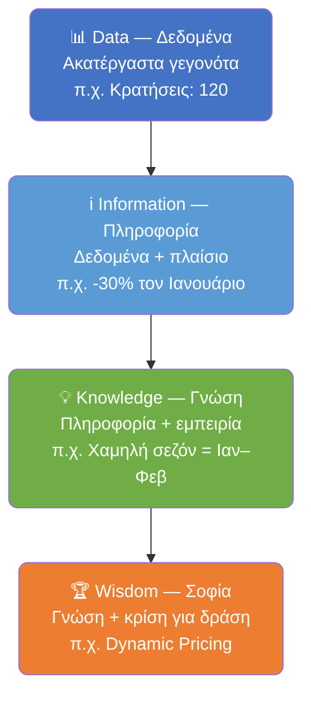
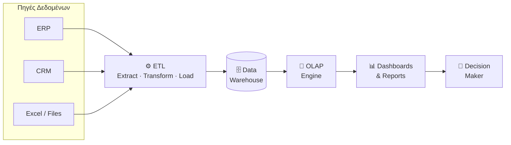
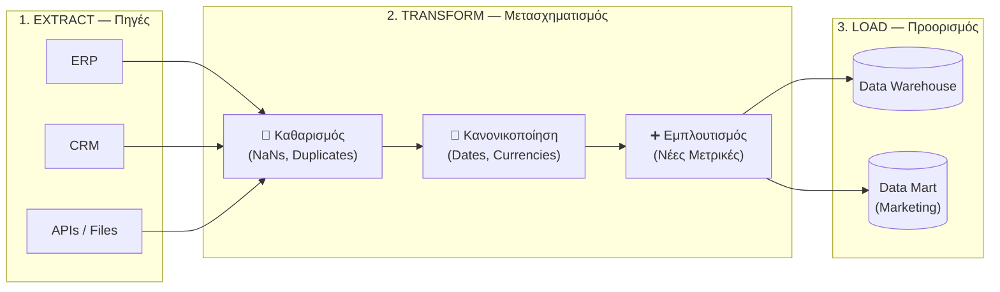
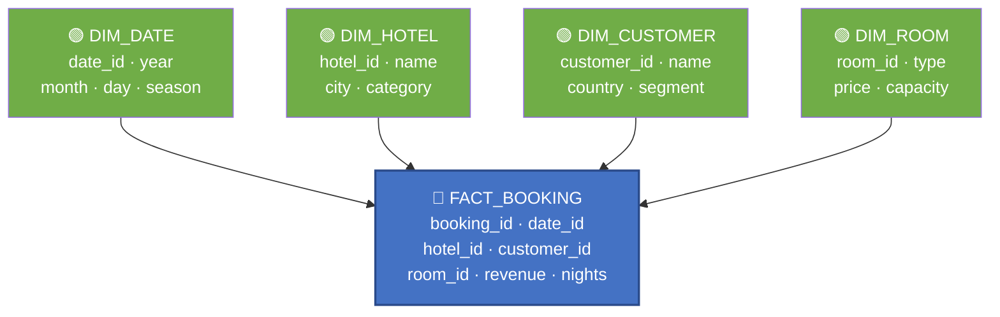
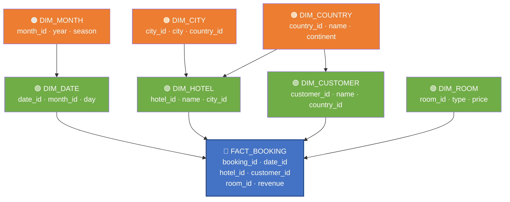
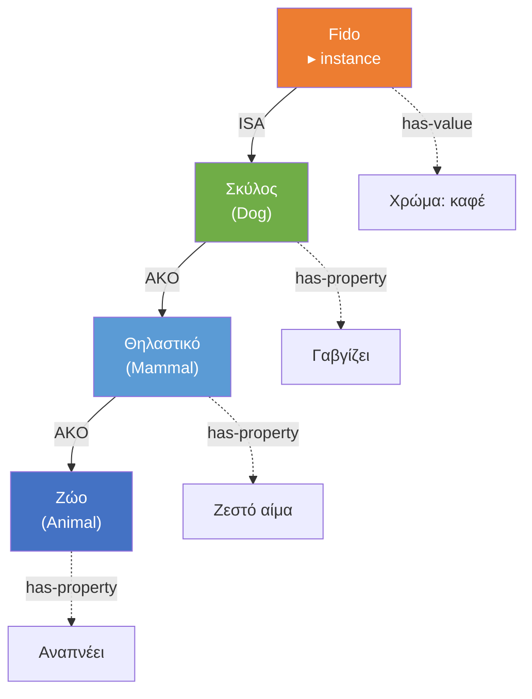
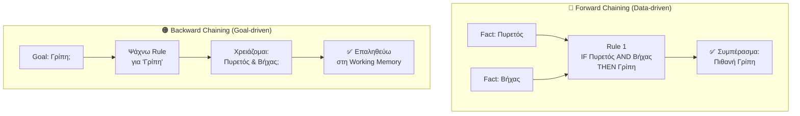
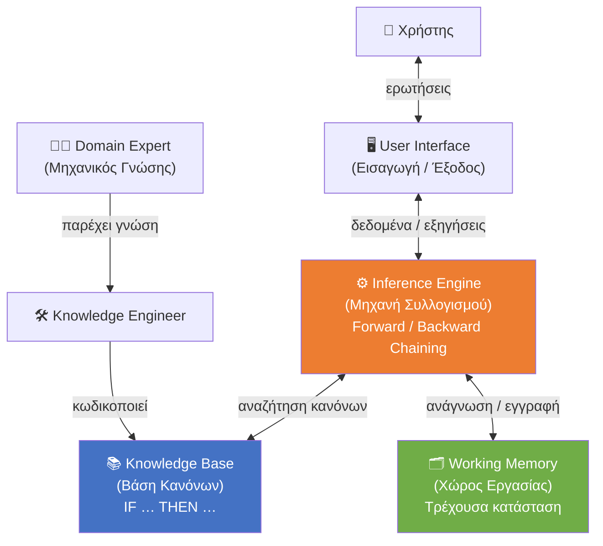

# Ευφυή Συστήματα και Συστήματα Υποστήριξης Αποφάσεων
**Ενότητα 3: Business Intelligence & Αναπαράσταση Γνώσης**
Τμήμα Μηχανικών Πληροφορικής & Υπολογιστών
Πανεπιστήμιο Δυτικής Αττικής

**Διδάσκων:** Ανάργυρος Τσαδήμας (tsadimas@uniwa.gr)

---

# Η Εξέλιξη (Evolution of Decision Support, BI, Analytics & AI)

* **1970s (Θεμελίωση):** Μετάβαση από στατικές αναφορές (MIS) στα Συστήματα Υποστήριξης Αποφάσεων (DSS). Χρήση Επιχειρησιακής Έρευνας.
* **1980s (Ενοποίηση & Γνώση):** Ανάπτυξη Έμπειρων Συστημάτων (Rule-based). Εισαγωγή ERP και RDBMS (ενιαία πηγή αλήθειας).
* **1990s (Οπτικοποίηση & Αποθήκευση):** Δημιουργία Data Warehouses (DW) & Εμφάνιση Dashboards/Scorecards (EIS).
* **2000s (Business Intelligence):** Καθιέρωση του όρου BI. Εξόρυξη γνώσης (Data/Text Mining) και SaaS.
* **2010s (Η Εποχή του Big Data):** Έκρηξη δεδομένων (Social Media, IoT). Νέα εργαλεία (Hadoop, NoSQL).
* **2020s+ (ΑΙ & Αυτοματοποίηση):** Κυριαρχία AI & Deep Learning. Smart Assistants, ChatGPT, προηγμένη ανάλυση.

---

# Οι 3 Τύποι Αναλυτικής (Three Types of Analytics)

**1. Περιγραφική Αναλυτική (Descriptive Analytics):** *Τι συνέβη;*
* *Στόχος:* Κατανόηση της τρέχουσας/παρελθοντικής κατάστασης.
* *Εργαλεία:* Dashboards, Scorecards, Data Warehousing.

**2. Προβλεπτική Αναλυτική (Predictive Analytics):** *Τι θα συμβεί και γιατί;*
* *Στόχος:* Πρόβλεψη μελλοντικών γεγονότων (π.χ. αξιοπιστία πελάτη).
* *Εργαλεία:* Data Mining, Αλγόριθμοι Ταξινόμησης & Ομαδοποίησης.

**3. Προδιαγραφική / Καθοδηγητική (Prescriptive Analytics):** *Τι πρέπει να κάνω;*
* *Στόχος:* Παροχή σύστασης για βέλτιστη δράση.
* *Εργαλεία:* Βελτιστοποίηση, Προσομοίωση, Έμπειρα Συστήματα.

---

# Analytics vs Data Science: Ποια η διαφορά;

* **Data Analyst:** Εστιάζει στην *περιγραφική αναλυτική*. Συλλέγει, καθαρίζει και οπτικοποιεί δεδομένα. (Βασικά εργαλεία: Excel, SQL, BI Tools).
* **Data Scientist:** Εστιάζει στην *προβλεπτική και προδιαγραφική αναλυτική*. Έχει εις βάθος γνώση στατιστικής και Machine Learning. (Βασικά εργαλεία: Python, R, Java).

*Στην πράξη τα όρια είναι θολά! Οι όροι Επιστήμη Δεδομένων, Αναλυτική και Τεχνητή Νοημοσύνη (AI) συχνά χρησιμοποιούνται ως ταυτόσημοι όροι-ομπρέλα.*

---

# Η Ιεραρχία DIKW: Από τα Δεδομένα στη Σοφία

| Επίπεδο | Ορισμός | Παράδειγμα (Ξενοδοχείο) |
|---|---|---|
| **Data (Δεδομένα)** | Ακατέργαστα γεγονότα χωρίς πλαίσιο | `"Κρατήσεις: 120"` |
| **Information (Πληροφορία)** | Δεδομένα με πλαίσιο και νόημα | *"Οι κρατήσεις μειώθηκαν 30% τον Ιανουάριο"* |
| **Knowledge (Γνώση)** | Πληροφορία + εμπειρία & κατανόηση | *"Η χαμηλή σεζόν είναι Ιανουάριος–Φεβρουάριος"* |
| **Wisdom (Σοφία)** | Γνώση + κρίση για δράση | *"Εφαρμόζουμε dynamic pricing στη χαμηλή σεζόν"* |

> Τα BI συστήματα αυτοματοποιούν τα δύο κατώτερα επίπεδα. Η **Γνώση** και η **Σοφία** απαιτούν ανθρώπινη κρίση — ή Έμπειρα Συστήματα!

---

<!-- _class: diagram -->
# Η Ιεραρχία DIKW — Διάγραμμα

---

# Από τα Δεδομένα στην Απόφαση: Ο Ρόλος του BI

Η **Επιχειρηματική Ευφυΐα (Business Intelligence)** μετατρέπει τα ακατέργαστα δεδομένα σε χρήσιμη Πληροφορία και Γνώση, δημιουργώντας μια "ενιαία εικόνα της αλήθειας" (Single Version of the Truth).

**Τα 3 Στάδια του BI:**
1. **Συλλογή (Ingestion):** Άντληση δεδομένων από ERP, CRM, Excel.
2. **Αποθήκευση (Warehousing):** Καθαρισμός και οργάνωση σε μια Αποθήκη Δεδομένων (Data Warehouse).
3. **Παρουσίαση (Reporting):** Προβολή στον χρήστη μέσω Dashboards.

---

# Αρχιτεκτονική BI — Διάγραμμα Pipeline

---

# Αρχιτεκτονική Δεδομένων: OLTP, Data Warehouse & OLAP

**1. OLTP (Online Transaction Processing) - *Η Λειτουργία:***
Τα συστήματα όπου "γεννιούνται" τα δεδομένα (ERP, CRM, e-shops). Εστιάζουν στην ταχύτητα εγγραφής τρεχουσών συναλλαγών.

**2. Data Warehouse - *Η Αποθήκευση:***
Η φυσική βάση (κεντρικό αποθετήριο) που συγκεντρώνει ιστορικά δεδομένα από τα OLTP. Αποτελεί τη "Μοναδική Πηγή Αλήθειας".

**3. OLAP (Online Analytical Processing) - *Η Ανάλυση:***
Η τεχνολογία που τρέχει *πάνω* στο Data Warehouse. Εστιάζει στην ταχύτητα ανάγνωσης (Query Performance) τεράστιου όγκου ιστορικών δεδομένων.

---

# OLTP vs OLAP: Συγκριτικός Πίνακας

| Χαρακτηριστικό | OLTP | OLAP |
|---|---|---|
| **Σκοπός** | Καταχώρηση συναλλαγών | Ανάλυση & αναφορές |
| **Ερωτήματα** | Απλά, γρήγορα (ms) | Σύνθετα, πολλών δευτερολέπτων |
| **Δεδομένα** | Τρέχοντα | Ιστορικά |
| **Χρήστες** | Υπάλληλοι (πολλοί) | Αναλυτές (λίγοι) |
| **Ενέργειες** | INSERT / UPDATE | SELECT / Aggregations |
| **Παράδειγμα** | ERP, e-shop checkout | Power BI dashboard |

> **Κανόνας Χρυσός:** Ποτέ δεν τρέχουμε βαριά analytics queries απευθείας στο OLTP σύστημα — επιβραδύνει τις λειτουργικές συναλλαγές!

**1. OLTP (Online Transaction Processing) - *Η Λειτουργία:***
Τα συστήματα όπου "γεννιούνται" τα δεδομένα (ERP, CRM, e-shops). Εστιάζουν στην ταχύτητα εγγραφής τρεχουσών συναλλαγών.

**2. Data Warehouse - *Η Αποθήκευση:***
Η φυσική βάση (κεντρικό αποθετήριο) που συγκεντρώνει ιστορικά δεδομένα από τα OLTP. Αποτελεί τη "Μοναδική Πηγή Αλήθειας".

**3. OLAP (Online Analytical Processing) - *Η Ανάλυση:***
Η τεχνολογία που τρέχει *πάνω* στο Data Warehouse. Εστιάζει στην ταχύτητα ανάγνωσης (Query Performance) τεράστιου όγκου ιστορικών δεδομένων.

---

# Η Διαδικασία ETL (Extract, Transform, Load)

Είναι η "γέφυρα" που μεταφέρει τα δεδομένα από τις Πηγές (OLTP) στο Data Warehouse:

1. **Extract (Εξαγωγή):** Ανάκτηση δεδομένων από ERP, Cloud, Excel κ.λπ.
2. **Transform (Μετασχηματισμός):** *Το πιο κρίσιμο στάδιο!*
   * *Καθαρισμός:* Διόρθωση λαθών, διαχείριση κενών (Data Cleaning).
   * *Τυποποίηση:* Κοινή μορφή σε ημερομηνίες και ποσά.
   * *Εμπλουτισμός:* Υπολογισμός νέων μετρικών (π.χ. κέρδος).
3. **Load (Φόρτωση):** Εισαγωγή έτοιμων δεδομένων στο Data Warehouse.

*(Σημείωση: Τα Data Marts είναι μικρότερες, θεματικές αποθήκες για συγκεκριμένα τμήματα της επιχείρησης, π.χ. Marketing).*

---

# Η Διαδικασία ETL — Διάγραμμα

---

# Σχήματα Αποθηκών Δεδομένων: Star & Snowflake Schema

**Star Schema (Σχήμα Αστέρα):**
* Ένας **Fact Table** στο κέντρο με μετρήσιμα μεγέθη (π.χ. Sales, Revenue, Quantity).
* Περιβάλλεται από αποκανονικοποιημένους **Dimension Tables** (Date, Product, Customer, Region).
* **Πλεονέκτημα:** Απλή δομή, γρήγορα queries, ιδανικό για BI εργαλεία.

**Snowflake Schema (Σχήμα Χιονονιφάδας):**
* Έχει Dimension Tables που κανονικοποιούνται σε επιπλέον sub-tables.
* **Πλεονέκτημα:** Λιγότερη πλεονάζουσα πληροφορία (redundancy).
* **Μειονέκτημα:** Πολυπλοκότερα JOINs, χαμηλότερη ταχύτητα queries.

| | Star Schema | Snowflake Schema |
|---|---|---|
| **Δομή** | Απλούστερη | Πολυπλοκότερη |
| **Απόδοση Query** | ✅ Υψηλότερη | ❌ Χαμηλότερη |
| **Αποθηκευτικός χώρος** | Περισσότερος | Λιγότερος |
| **Τυπική Χρήση** | OLAP, BI tools | Enterprise DWH |

---

# ⭐ Star Schema — Παράδειγμα (Κρατήσεις Ξενοδοχείου)

---

# ❄️ Snowflake Schema — Παράδειγμα (Κρατήσεις Ξενοδοχείου)

---

# Η Ποιότητα των Δεδομένων & Ο Κανόνας GIGO

**GIGO (Garbage In, Garbage Out):**
Αν τροφοδοτήσουμε το σύστημα με λανθασμένα δεδομένα, οι αποφάσεις θα είναι εξίσου λανθασμένες!

**Προβλήματα που λύνουμε στο στάδιο Transform:**
* **Κενές Τιμές (Missing Values/NaNs):** π.χ. Ο χρήστης ξέχασε να βάλει χώρα.
* **Διπλοεγγραφές (Duplicates):** Πελάτης καταχωρημένος 2 φορές.
* **Ακραίες Τιμές (Outliers):** Κράτηση 50 ατόμων σε 1 δωμάτιο (τυπογραφικό).

*Ο καθαρισμός δεδομένων συχνά καταναλώνει το 80% του χρόνου ενός Data Analyst!*

---

# Κατηγορικές vs Αριθμητικές Μεταβλητές

Τα μοντέλα καταλαβαίνουν μόνο αριθμούς. Πώς χειριζόμαστε τα κείμενα (π.χ. Χώρα = "Ελλάδα");

* **One-Hot Encoding (OHE):** Μετατροπή κατηγορικών δεδομένων σε δυαδικούς αριθμούς (0 ή 1). π.χ. Στήλη `Είναι_Ελλάδα;` (1=Ναι, 0=Όχι).
* **Προσοχή στην Πολυσυγγραμμικότητα (Dummy Variable Trap):** Παραλείπουμε πάντα μία στήλη (Ν-1) για να μην δώσουμε διπλή/πλεονάζουσα πληροφορία στο μοντέλο.
* **Διακριτοποίηση (Binning):** Μετατροπή συνεχών αριθμών σε κατηγορίες (π.χ. Ηλικία 45 -> Κατηγορία "40-50") για ευκολότερη δημιουργία OLAP Cubes.

---

# Πολυδιάστατη Ανάλυση (OLAP Cubes)

Τα δεδομένα οργανώνονται σε **Διαστάσεις (Dimensions)** (π.χ. Χρόνος, Γεωγραφία, Προϊόν). Βασικές λειτουργίες:

1. **Drill-down (Εμβάθυνση):** Ζουμάρουμε (Από Πωλήσεις Έτους -> Πωλήσεις Δεκεμβρίου).
2. **Roll-up (Σύνοψη):** Η μεγάλη εικόνα (Από Πωλήσεις Αθήνας -> Ελλάδας).
3. **Slice & Dice (Τεμαχισμός):** Φιλτράρισμα σε 1 ή πολλές διαστάσεις.
4. **Pivot (Περιστροφή):** Αλλαγή οπτικής γωνίας (Γραμμές <-> Στήλες).

*Εργαλεία:* Power BI, Tableau, Excel Pivot Tables, SSAS.

---

# Dashboards & Data Storytelling

**KPIs (Key Performance Indicators) vs. Απλές Μετρικές:**
* Το KPI είναι πάντα συνδεδεμένο με στρατηγικό στόχο και απαιτεί δράση!
* *Μετρική:* "Είχαμε 5.000 επισκέπτες."
* *KPI:* "Το Conversion Rate έπεσε στο 1%."

**Data Storytelling (Το Τρίπτυχο της Δράσης):**
Τα νούμερα δεν αρκούν. Κάθε καλό Data Story απαντά:
1. *Τι συνέβη;* (Δεδομένα)
2. *Γιατί συνέβη;* (Οπτικοποίηση & Αφήγημα)
3. *Τι προτείνουμε να κάνουμε;*

---

# Η Παγίδα της Οπτικοποίησης: Το Παράδοξο του Simpson

* **Τι είναι:** Στατιστικό φαινόμενο όπου μια τάση φαίνεται ξεκάθαρη στο σύνολο, αλλά αντιστρέφεται εντελώς όταν χωρίσουμε τα δεδομένα σε μικρότερες ομάδες (sub-groups).
* **Το Μάθημα:** Η συσχέτιση ΔΕΝ σημαίνει αιτιότητα (Correlation != Causation). Το σύστημα σου δίνει τα νούμερα, αλλά την τελική Κρίση (Judgment) την έχει ο άνθρωπος!

---

# Τι είναι η Αναπαράσταση Γνώσης;

Το σύνολο των συντακτικών και σημασιολογικών παραδοχών για την περιγραφή ενός κόσμου με μια τυπική γλώσσα κατανοητή από υπολογιστή. Πρέπει να είναι τυποποιημένη και χωρίς ασάφειες.

**Είδη Γνώσης:**
* **Σημασιολογική:** Γενικές έννοιες & οντότητες (π.χ. Τι είναι αυτοκίνητο).
* **Επεισοδιακή:** Προσωπικές εμπειρίες & βιωμένα γεγονότα (χωρικά/χρονικά οργανωμένα).

**Μέθοδοι Αναπαράστασης:** Λογική, Δομημένες Μορφές (Σημασιολογικά Δίκτυα, Οντολογίες), Κανόνες.

---

# Σημασιολογικά Δίκτυα

Γραφική αποτύπωση της γνώσης με μορφή δένδρου.
Αποτελούνται από:
* **Κόμβους (Nodes):** Έννοιες, Περιστατικά, Χαρακτηριστικά, Αξίες.
* **Συνδέσεις & Χαρακτηρισμούς (Links/Labels):** Πώς σχετίζονται οι κόμβοι (π.χ. "είναι", "έχει").

**Σημαντικές Σχέσεις:** `AKO` (a_kind_of), `ISA` (is_a), `INSTANCE_OF`.

**Κληρονομικότητα (Inheritance):** Το πιο ισχυρό χαρακτηριστικό! Ο κόμβος-παιδί κληρονομεί τις ιδιότητες του κόμβου-πατέρα, επιτρέποντας την αυτόματη εξαγωγή νέων συμπερασμάτων (inference).

---

<!-- _class: diagram-sm -->
# Σημασιολογικό Δίκτυο — Παράδειγμα

> 📌 Το **Fido** κληρονομεί αυτόματα τις ιδιότητες `Αναπνέει`, `Ζεστό αίμα` και `Γαβγίζει` χωρίς να χρειαστεί επαναπρογραμματισμός.

---

# Οντολογίες (Ontologies): Η Τυπική Γλώσσα της Γνώσης

**Τι είναι Οντολογία:**
Ένα τυπικό, κοινώς αποδεκτό λεξιλόγιο που ορίζει τις **έννοιες**, τις **σχέσεις** και τους **περιορισμούς** ενός τομέα — κατανοητό τόσο από ανθρώπους όσο και από μηχανές.

**Βασικά Στοιχεία:**
* **Classes (Κλάσεις):** Κατηγορίες εννοιών (π.χ. `Vehicle`, `Person`).
* **Properties (Ιδιότητες):** Σχέσεις μεταξύ κλάσεων (π.χ. `hasDriver`, `hasBrand`).
* **Individuals (Εμφανίσεις):** Συγκεκριμένες περιπτώσεις (π.χ. `myCarIs_BMW_X5`).

**Τεχνολογίες Σημασιολογικού Ιστού (Semantic Web):**
* **RDF:** Αναπαράσταση γνώσης ως τριάδες `Subject – Predicate – Object`
  *(π.χ. `BMW – isA – Car`, `Car – hasPart – Engine`)*
* **OWL (Web Ontology Language):** Πλούσιες εκφραστικές δυνατότητες, βασισμένο σε Description Logics.
* **SPARQL:** Γλώσσα ερωτημάτων για RDF δεδομένα (ανάλογο της SQL για Linked Data).

*Εργαλείο:* **Protégé** — open-source ontology editor (Stanford University).

---

# Συστήματα Βασισμένα σε Κανόνες (Rule-Based Systems)

Χρησιμοποιούν λογικούς συλλογισμούς για επίλυση προβλημάτων. Πλεονεκτούν σε Αρθρωτότητα (Modularity) και Επεκτασιμότητα.

**Τα 3 Είδη Κανόνων:**
1. **Συνεπαγωγικός (Deductive):** `IF` συνθήκες `THEN` συμπέρασμα (Δηλωτική γνώση).
2. **Παραγωγής (Production):** `IF` συνθήκες `THEN` ενέργειες (Διαδικαστική γνώση).
3. **Ενεργός (Active/Event-driven):** `ON` συμβάν `IF` συνθήκες `THEN` ενέργειες.

---

# Αρχιτεκτονική Συστημάτων Παραγωγής & Συλλογιστική

**Βασικά Μέρη:** 1) Βάση Κανόνων, 2) Χώρος Εργασίας (Working Memory), 3) Μηχανισμός Ελέγχου.

**Εξαγωγή Συμπερασμάτων (Chaining):**
* **Ορθή Ακολουθία (Forward Chaining):** Ξεκινά από τα *δεδομένα* και προχωρά προς το συμπέρασμα (Data-driven). Ιδανικό για Συστήματα Διάγνωσης.
* **Ανάστροφη Ακολουθία (Backward Chaining):** Ξεκινά από τον *στόχο* και ψάχνει προς τα πίσω τα δεδομένα (Goal-driven). Ιδανικό για Monitoring.

*(Ταίριασμα Προτύπων/Ενοποίηση: Η διαδικασία όπου μια μεταβλητή ταυτοποιείται στο IF και η τιμή της μεταφέρεται αυτόματα στο THEN).*

---

# Forward vs Backward Chaining — Διάγραμμα

| | Forward | Backward |
|---|---|---|
| **Σημείο εκκίνησης** | Δεδομένα (Facts) | Στόχος (Goal) |
| **Κατεύθυνση** | Facts → Συμπέρασμα | Goal → Facts |
| **Ιδανικό για** | Monitoring, Διάγνωση | Planning, Αναζήτηση |

---

# Ασαφής Λογική (Fuzzy Logic): Πέρα από το Αληθές/Ψευδές

**Το Πρόβλημα της Κλασικής Λογικής:**
Ένας κανόνας `IF temperature > 30 THEN hot` δίνει "ναι" στους 31°C και "όχι" στους 29°C.
Οι άνθρωποι σκεφτόμαστε με **αβεβαιότητα και διαβαθμίσεις**, όχι με δυαδικές τιμές!

**Η Λύση (Zadeh, 1965):**
Αντί για {0, 1}, κάθε στοιχείο έχει **βαθμό συμμετοχής** (membership degree) στο διάστημα [0, 1]:
* 25°C → `warm`: 0.4, `hot`: 0.1
* 35°C → `warm`: 0.2, `hot`: 0.9

**Εφαρμογές:**
* Έλεγχος βιομηχανικών συστημάτων (κλιματισμός, πλυντήρια, ABS στα αυτοκίνητα).
* Αξιολόγηση πιστοληπτικής ικανότητας (creditworthiness scoring).
* Ασαφή Έμπειρα Συστήματα — διαχείριση αβεβαιότητας στις ιατρικές διαγνώσεις.

> Ο συνδυασμός Ασαφούς Λογικής και Νευρωνικών Δικτύων δίνει τα **Neuro-Fuzzy Systems** — ένα από τα θεμέλια της σύγχρονης ΑΙ.

---

# Έμπειρα Συστήματα (Expert Systems)

Αποτυπώνουν την ανθρώπινη γνώση ως σύνολο κανόνων. Επιτυχημένα ιστορικά παραδείγματα:
* **MYCIN:** Διάγνωση βακτηριακών λοιμώξεων αίματος (με χρήση συντελεστών βεβαιότητας).
* **DENDRAL:** Προσδιορισμός μοριακής δομής χημικών ενώσεων.
* **XCON:** Αυτόματη παραμετροποίηση παραγγελιών VAX.

**Αρχιτεκτονική (Separation Principle):**
Ο απόλυτος διαχωρισμός της Βάσης Γνώσης από τη Μηχανή Συλλογισμού (Inference Engine) επιτρέπει την εύκολη αναβάθμιση χωρίς αλλαγή του κώδικα.

---

<!-- _class: diagram -->
# Αρχιτεκτονική Έμπειρου Συστήματος — Διάγραμμα

---

# Συστήματα Διαχείρισης Γνώσεων (EKMS)

Ενσωματώνουν τη γνώση (Δομημένη, Ημιδομημένη και Αφανή) στις επιχειρησιακές διαδικασίες. 

**Κύκλος Ζωής Γνώσης:**
1. **Απόκτηση:** 1Εντοπισμός/ψηφιοποίηση άρρητης γνώσης.
2. **Αποθήκευση:** Κεντρικά αποθετήρια (CMS).
3. **Διάχυση:** Έξυπνα δίκτυα/πύλες.
4. **Εφαρμογή:** Ενσωμάτωση στην καθημερινότητα.

*Η χρήση εργαλείων όπως το **Protégé** βοηθά στη μετατροπή της αφανούς γνώσης σε δομημένη ψηφιακή γνώση μέσω Οντολογιών!*

---

# Οδικός Χάρτης Μαθήματος: Από τη Θεωρία στην Πράξη

| Φάση | Θεωρητικό Υπόβαθρο | Εργαλείο / Εργαστήριο |
|---|---|---|
| **1. Δεδομένα & Πληροφορία** | Ιεραρχία DIKW, KPIs | Python & Pandas (Ανάλυση CSV) |
| **2. Λήψη Αποφάσεων** | Δομημένες & Αδόμητες | Dashboards (Plotly/Seaborn) |
| **3. Διαχείριση Γνώσης** | Ρητή vs. Αφανής Γνώση | Οντολογίες |
| **4. Ευφυή Συστήματα** | Έμπειρα Συστήματα | Protégé & SWRL (Κανόνες Ειδικού) |