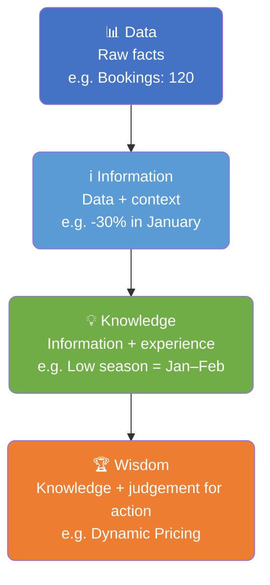
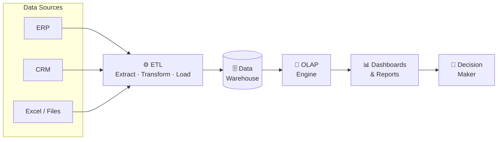
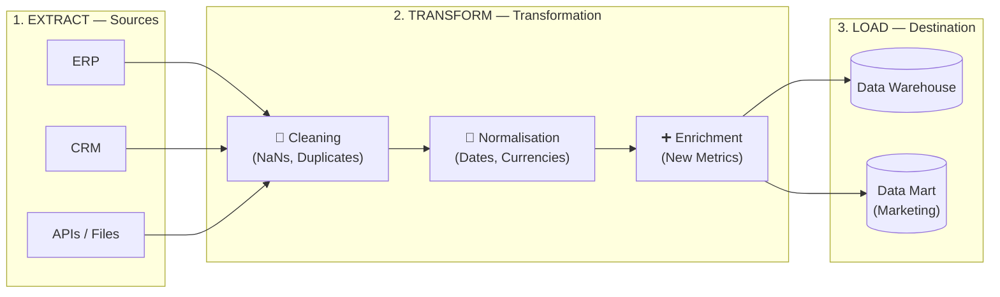
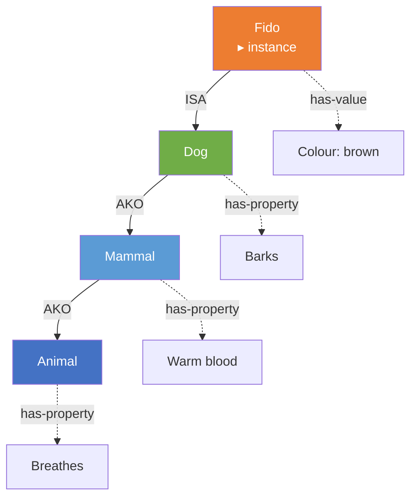
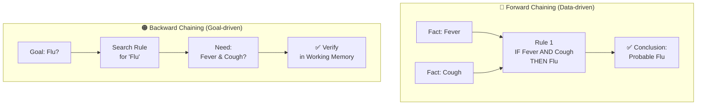
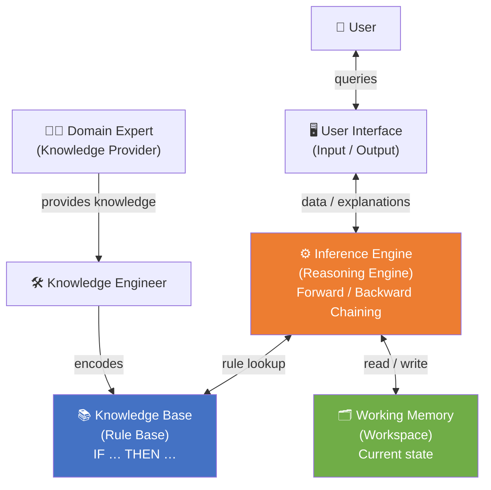

# Intelligent Systems and Decision Support Systems
**Unit 3: Business Intelligence & Knowledge Representation**
Department of Informatics & Computer Engineering
University of West Attica

**Instructor:** Anargyros Tsadimas (tsadimas@uniwa.gr)

---

# The Evolution of Decision Support, BI, Analytics & AI

* **1970s (Foundations):** Shift from static reports (MIS) to Decision Support Systems (DSS). Use of Operations Research.
* **1980s (Integration & Knowledge):** Development of Expert Systems (Rule-based). Introduction of ERP and RDBMS (single source of truth).
* **1990s (Visualisation & Storage):** Emergence of Data Warehouses (DW) & Dashboards/Scorecards (EIS).
* **2000s (Business Intelligence):** Establishment of the BI term. Knowledge discovery (Data/Text Mining) and SaaS.
* **2010s (The Big Data Era):** Data explosion (Social Media, IoT). New tools (Hadoop, NoSQL).
* **2020s+ (AI & Automation):** Dominance of AI & Deep Learning. Smart Assistants, ChatGPT, advanced analytics.

---

# The Three Types of Analytics

**1. Descriptive Analytics:** *What happened?*
* *Goal:* Understand current/past state.
* *Tools:* Dashboards, Scorecards, Data Warehousing.

**2. Predictive Analytics:** *What will happen and why?*
* *Goal:* Forecast future events (e.g. customer creditworthiness).
* *Tools:* Data Mining, Classification & Clustering Algorithms.

**3. Prescriptive Analytics:** *What should I do?*
* *Goal:* Provide recommendations for optimal action.
* *Tools:* Optimisation, Simulation, Expert Systems.

---

# Analytics vs Data Science: What is the Difference?

* **Data Analyst:** Focuses on *descriptive analytics*. Collects, cleans and visualises data. (Core tools: Excel, SQL, BI Tools).
* **Data Scientist:** Focuses on *predictive and prescriptive analytics*. Deep knowledge of statistics and Machine Learning. (Core tools: Python, R, Java).

*In practice the boundaries are blurry! The terms Data Science, Analytics and Artificial Intelligence (AI) are often used interchangeably as umbrella terms.*

---

# The DIKW Hierarchy: From Data to Wisdom

| Level | Definition | Example (Hotel) |
|---|---|---|
| **Data** | Raw facts without context | `"Bookings: 120"` |
| **Information** | Data with context and meaning | *"Bookings dropped 30% in January"* |
| **Knowledge** | Information + experience & understanding | *"Low season is January–February"* |
| **Wisdom** | Knowledge + judgement for action | *"We apply dynamic pricing in low season"* |

> BI systems automate the two lower levels. **Knowledge** and **Wisdom** require human judgement — or Expert Systems!

---

# The DIKW Hierarchy — Diagram

---

# From Data to Decision: The Role of BI

**Business Intelligence (BI)** transforms raw data into useful Information and Knowledge, creating a "Single Version of the Truth".

**The 3 Stages of BI:**
1. **Ingestion:** Extracting data from ERP, CRM, Excel.
2. **Warehousing:** Cleaning and organising data in a Data Warehouse.
3. **Reporting:** Presenting results to users via Dashboards.

---

# BI Architecture — Pipeline Diagram

---

# Data Architecture: OLTP, Data Warehouse & OLAP

**1. OLTP (Online Transaction Processing) — *Operations:***
Systems where data is "born" (ERP, CRM, e-shops). Optimised for fast writes of current transactions.

**2. Data Warehouse — *Storage:***
The central repository that consolidates historical data from OLTP systems. It is the "Single Source of Truth".

**3. OLAP (Online Analytical Processing) — *Analysis:***
The technology that runs *on top of* the Data Warehouse. Optimised for query performance over large volumes of historical data.

---

# OLTP vs OLAP: Comparison Table

| Characteristic | OLTP | OLAP |
|---|---|---|
| **Purpose** | Record transactions | Analysis & reporting |
| **Queries** | Simple, fast (ms) | Complex, multi-second |
| **Data** | Current | Historical |
| **Users** | Staff (many) | Analysts (few) |
| **Operations** | INSERT / UPDATE | SELECT / Aggregations |
| **Example** | ERP, e-shop checkout | Power BI dashboard |

> **Golden Rule:** Never run heavy analytics queries directly against the OLTP system — it slows down live transactions!

---

# The ETL Process (Extract, Transform, Load)

The "bridge" that moves data from sources (OLTP) to the Data Warehouse:

1. **Extract:** Retrieve data from ERP, Cloud, Excel, etc.
2. **Transform:** *The most critical stage!*
   * *Cleaning:* Fix errors, handle missing values (Data Cleaning).
   * *Standardisation:* Common format for dates and amounts.
   * *Enrichment:* Calculate new metrics (e.g. profit margin).
3. **Load:** Insert the prepared data into the Data Warehouse.

*(Note: Data Marts are smaller, subject-oriented stores for specific business units, e.g. Marketing.)*

---

# The ETL Process — Diagram

---

# Data Warehouse Schemas: Star & Snowflake

**Star Schema:**
* One **Fact Table** at the centre with measurable metrics (e.g. Sales, Revenue, Quantity).
* Surrounded by denormalised **Dimension Tables** (Date, Product, Customer, Region).
* **Advantage:** Simple structure, fast queries, ideal for BI tools.

**Snowflake Schema:**
* Dimension Tables are further normalised into sub-tables.
* **Advantage:** Less redundant data storage.
* **Disadvantage:** More complex JOINs, slower query performance.

| | Star Schema | Snowflake Schema |
|---|---|---|
| **Structure** | Simpler | More complex |
| **Query Performance** | ✅ Higher | ❌ Lower |
| **Storage** | More | Less |
| **Typical Use** | OLAP, BI tools | Enterprise DWH |

---

# Data Quality & The GIGO Principle

**GIGO (Garbage In, Garbage Out):**
If we feed the system with incorrect data, decisions will be equally incorrect!

**Problems resolved in the Transform stage:**
* **Missing Values (NaNs):** e.g. A user forgot to enter a country.
* **Duplicates:** A customer recorded twice.
* **Outliers:** A booking for 50 people in 1 room (typo).

*Data cleaning often consumes 80% of a Data Analyst's time!*

---

# Categorical vs Numerical Variables

Models only understand numbers. How do we handle text (e.g. Country = "Greece")?

* **One-Hot Encoding (OHE):** Convert categorical data to binary (0 or 1). e.g. Column `Is_Greece` (1=Yes, 0=No).
* **Beware of Multicollinearity (Dummy Variable Trap):** Always drop one column (N-1) to avoid giving redundant information to the model.
* **Binning (Discretisation):** Convert continuous numbers into categories (e.g. Age 45 → Category "40–50") for easier OLAP Cube creation.

---

# Multidimensional Analysis (OLAP Cubes)

Data is organised into **Dimensions** (e.g. Time, Geography, Product). Core operations:

1. **Drill-down:** Zoom in (from Annual Sales → December Sales).
2. **Roll-up:** The big picture (from Athens Sales → Greece Sales).
3. **Slice & Dice:** Filter on one or multiple dimensions.
4. **Pivot:** Change perspective (Rows ↔ Columns).

*Tools:* Power BI, Tableau, Excel Pivot Tables, SSAS.

---

# Dashboards & Data Storytelling

**KPIs (Key Performance Indicators) vs. Plain Metrics:**
* A KPI is always linked to a strategic goal and demands action!
* *Metric:* "We had 5,000 visitors."
* *KPI:* "The Conversion Rate dropped to 1%."

**Data Storytelling (The Action Triptych):**
Numbers alone are not enough. Every good Data Story answers:
1. *What happened?* (Data)
2. *Why did it happen?* (Visualisation & Narrative)
3. *What do we recommend doing?*

---

# The Visualisation Trap: Simpson's Paradox

* **What it is:** A statistical phenomenon where a trend appears clear in aggregate, but reverses entirely when the data is split into sub-groups.
* **The Lesson:** Correlation does NOT imply causation (Correlation ≠ Causation). The system gives you the numbers, but the final Judgement belongs to the human!

---

# What is Knowledge Representation?

The set of syntactic and semantic conventions for describing a world in a formal language understandable by a computer. It must be standardised and unambiguous.

**Types of Knowledge:**
* **Semantic:** General concepts & entities (e.g. What is a car).
* **Episodic:** Personal experiences & lived events (spatially/temporally organised).

**Representation Methods:** Logic, Structured Forms (Semantic Networks, Ontologies), Rules.

---

# Semantic Networks

Graphical representation of knowledge in tree form.
Composed of:
* **Nodes:** Concepts, Instances, Attributes, Values.
* **Links & Labels:** How nodes relate (e.g. "is", "has").

**Key Relations:** `AKO` (a_kind_of), `ISA` (is_a), `INSTANCE_OF`.

**Inheritance:** The most powerful feature! A child node inherits the properties of its parent node, enabling automatic inference of new conclusions.

---

# Semantic Network — Example

> 📌 **Fido** automatically inherits `Breathes`, `Warm blood` and `Barks` without any reprogramming.

---

# Ontologies: The Formal Language of Knowledge

**What is an Ontology:**
A formal, commonly agreed vocabulary that defines the **concepts**, **relations** and **constraints** of a domain — understandable by both humans and machines.

**Core Components:**
* **Classes:** Categories of concepts (e.g. `Vehicle`, `Person`).
* **Properties:** Relations between classes (e.g. `hasDriver`, `hasBrand`).
* **Individuals:** Specific instances (e.g. `myCarIs_BMW_X5`).

**Semantic Web Technologies:**
* **RDF:** Represent knowledge as triples `Subject – Predicate – Object`
  *(e.g. `BMW – isA – Car`, `Car – hasPart – Engine`)*
* **OWL (Web Ontology Language):** Rich expressive power, based on Description Logics.
* **SPARQL:** Query language for RDF data (the SQL equivalent for Linked Data).

*Tool:* **Protégé** — open-source ontology editor (Stanford University).

---

# Rule-Based Systems

Use logical reasoning to solve problems. Advantages: Modularity and Scalability.

**The 3 Types of Rules:**
1. **Deductive:** `IF` conditions `THEN` conclusion (Declarative knowledge).
2. **Production:** `IF` conditions `THEN` actions (Procedural knowledge).
3. **Active (Event-driven):** `ON` event `IF` conditions `THEN` actions.

---

# Production System Architecture & Reasoning

**Core Components:** 1) Rule Base, 2) Working Memory, 3) Control Mechanism (Inference Engine).

**Inference Chaining:**
* **Forward Chaining:** Starts from *facts* and moves towards a conclusion (Data-driven). Ideal for Diagnosis Systems.
* **Backward Chaining:** Starts from the *goal* and searches backwards for supporting facts (Goal-driven). Ideal for Monitoring.

*(Pattern Matching/Unification: The process where a variable is identified in the IF part and its value is automatically carried into the THEN part.)*

---

# Forward vs Backward Chaining — Diagram

| | Forward | Backward |
|---|---|---|
| **Starting point** | Facts | Goal |
| **Direction** | Facts → Conclusion | Goal → Facts |
| **Ideal for** | Monitoring, Diagnosis | Planning, Search |

---

# Fuzzy Logic: Beyond True / False

**The Problem with Classical Logic:**
A rule `IF temperature > 30 THEN hot` returns "yes" at 31°C and "no" at 29°C.
Humans reason with **uncertainty and gradations**, not binary values!

**The Solution (Zadeh, 1965):**
Instead of {0, 1}, each element has a **membership degree** in the interval [0, 1]:
* 25°C → `warm`: 0.4, `hot`: 0.1
* 35°C → `warm`: 0.2, `hot`: 0.9

**Applications:**
* Control of industrial systems (air conditioning, washing machines, ABS braking).
* Creditworthiness scoring.
* Fuzzy Expert Systems — handling uncertainty in medical diagnosis.

> Combining Fuzzy Logic with Neural Networks produces **Neuro-Fuzzy Systems** — one of the foundations of modern AI.

---

# Expert Systems

Capture human knowledge as a set of rules. Landmark historical examples:
* **MYCIN:** Diagnoses blood bacterial infections (using certainty factors).
* **DENDRAL:** Determines molecular structure of chemical compounds.
* **XCON:** Automatic configuration of VAX computer orders.

**Architecture (Separation Principle):**
The strict separation of the Knowledge Base from the Inference Engine allows easy updates without changing the code.

---

# Expert System Architecture — Diagram

---

# Knowledge Management Systems (EKMS)

Integrate knowledge (Structured, Semi-structured and Tacit) into business processes.

**Knowledge Lifecycle:**
1. **Acquisition:** Identify and digitalise tacit knowledge.
2. **Storage:** Centralised repositories (CMS).
3. **Distribution:** Smart networks / portals.
4. **Application:** Embedding in daily workflows.

*Tools such as **Protégé** help convert tacit knowledge into structured digital knowledge through Ontologies!*

---

# Course Roadmap: From Theory to Practice

| Phase | Theoretical Background | Tool / Lab |
|---|---|---|
| **1. Data & Information** | DIKW Hierarchy, KPIs | Python & Pandas (CSV Analysis) |
| **2. Decision Making** | Structured & Unstructured | Dashboards (Plotly / Seaborn) |
| **3. Knowledge Management** | Explicit vs. Tacit Knowledge | Ontologies |
| **4. Intelligent Systems** | Expert Systems | Protégé & SWRL (Expert Rules) |
