<div style="text-align:center; margin-bottom:16px;">


</div>

# Ευφυή Συστήματα και Συστήματα Υποστήριξης Αποφάσεων
**Ενότητα 4: Έμπειρα Συστήματα & Οντολογίες (Knowledge-Driven DSS)**
Τμήμα Μηχανικών Πληροφορικής & Υπολογιστών
Πανεπιστήμιο Δυτικής Αττικής

**Διδάσκων:** Ανάργυρος Τσαδήμας (tsadimas@uniwa.gr)

---

# Ενότητα 4 — Στόχος & Θέματα

**Στόχος:** Η κατανόηση της μετάβασης από την απλή επεξεργασία δεδομένων **(Data-Driven)** στην αναπαράσταση δομημένης γνώσης **(Knowledge-Driven)**.

Πώς μαθαίνουμε σε ένα υπολογιστικό σύστημα να **"σκέφτεται"**, να κατανοεί έννοιες και να εξάγει λογικά συμπεράσματα σαν ένας ανθρώπινος ειδικός;

**Θέματα:**
1. Έμπειρα Συστήματα & Αρχιτεκτονική
2. Κανόνες Παραγωγής (Production Rules)
3. Μηχανισμοί Εκτέλεσης (Forward / Backward Chaining)
4. Σημασιολογικός Ιστός & Οντολογίες
5. Γράφοι Γνώσης (Knowledge Graphs)
6. Μηχανές Συλλογισμού (Reasoners)
7. Εργαστηριακός Οδηγός: Protégé & SWRL

---

# 1. Κωδικοποίηση Ανθρώπινης Εμπειρίας: Έμπειρα Συστήματα

Τα **Έμπειρα Συστήματα (Expert Systems)** ήταν η πρώτη μεγάλη εμπορική επιτυχία της Τεχνητής Νοημοσύνης (δεκαετία 1980).

**Σκοπός:** Μίμηση της ικανότητας λήψης αποφάσεων ενός ειδικού (π.χ. γιατρού, μηχανικού βλαβών).

**Βασική Αρχή — Διαχωρισμός Γνώσης από Επεξεργασία:**

| Συστατικό | Ρόλος |
|---|---|
| **Βάση Γνώσης (Knowledge Base)** | Γεγονότα (Facts) + Κανόνες (Rules) — όχι απλά δεδομένα SQL |
| **Μηχανή Συμπερασμάτων (Inference Engine)** | Συνδυάζει δεδομένα χρήστη & κανόνες → βρίσκει λύση |
| **Διεπαφή Χρήστη (User Interface)** | Περιβάλλον αλληλεπίδρασης |

**Ιστορικά Παραδείγματα:**
* **MYCIN (Stanford):** Διάγνωση βακτηριακών λοιμώξεων — χρησιμοποιούσε Συντελεστές Βεβαιότητας.
* **DENDRAL (Stanford):** Προσδιορισμός μοριακής δομής χημικών ενώσεων.

---

<!-- _class: diagram -->
# Αρχιτεκτονική Έμπειρου Συστήματος — Διάγραμμα





---

# 1.2 Κανόνες Παραγωγής (Production Rules)

Ο πιο κλασικός τρόπος κωδικοποίησης της **διαδικαστικής γνώσης**.

**Δομή:**
```
IF (Συνθήκη / Προκείμενη)  THEN (Συμπέρασμα / Ενέργεια)
```

**Παράδειγμα:**
```
IF  ασθενής_έχει_πυρετό AND ασθενής_έχει_βήχα
THEN  πιθανή_διάγνωση = "Γρίπη"
```

**Πλεονέκτημα — Explainability (Ερμηνευσιμότητα):**
Το σύστημα μπορεί να **"εξηγήσει"** την απόφασή του δείχνοντας ποιοι κανόνες πυροδοτήθηκαν.

> Σε αντίθεση με τα σύγχρονα **Νευρωνικά Δίκτυα (Black Boxes)** που δεν μπορούν να αιτιολογήσουν τις προβλέψεις τους.

---

# 1.3 Μηχανισμοί Εκτέλεσης (Chaining)

Πώς η Μηχανή Συμπερασμάτων ψάχνει τη λύση;

**Forward Chaining (Ορθή Ακολουθία — Data Driven):**
* Ξεκινάμε από τα *δεδομένα* → εφαρμόζουμε κανόνες → βρίσκουμε συμπέρασμα.
* *Παράδειγμα:* "Ασθενής έχει πυρετό + βήχα" → (Κανόνας) → "Άρα έχει γρίπη".

**Backward Chaining (Ανάστροφη Ακολουθία — Goal Driven):**
* Ξεκινάμε από *στόχο/υπόθεση* → ψάχνουμε τα δεδομένα που τον επιβεβαιώνουν.
* *Παράδειγμα:* "Υποψιάζομαι γρίπη. Για να ισχύει, πρέπει να υπάρχει πυρετός. Ελέγχω..."

| | Forward Chaining | Backward Chaining |
|---|---|---|
| **Αφετηρία** | Δεδομένα (Data) | Υπόθεση/Στόχος (Goal) |
| **Στυλ** | Data-Driven | Goal-Driven |
| **Χρήση** | Παρακολούθηση, Ανίχνευση | Διάγνωση, Πλοήγηση |

---

<!-- _class: diagram -->
# Forward vs Backward Chaining — Διάγραμμα





---

# 2. Σημασιολογικός Ιστός (Semantic Web) & Οντολογίες

**Το Πρόβλημα των Κανόνων:**
* Ένα σύστημα με χιλιάδες `IF-THEN` κανόνες γίνεται **χαοτικό**.
* Οι απλοί κανόνες στερούνται **Σημασιολογίας (Semantics)**.
* Το σύστημα βλέπει "Γιώργος" αλλά δεν ξέρει ότι πρόκειται για **Άνθρωπο**.

---

# 2.1 Τι είναι η Οντολογία;

Ένα ψηφιακό, δομημένο **"λεξικό"** που ορίζει τις έννοιες ενός πεδίου και τις σχέσεις μεταξύ τους.

**3 Πυλώνες:**

| Στοιχείο | Ορισμός | Παράδειγμα |
|---|---|---|
| **Κλάσεις (Classes)** | Κατηγορίες | `Πανεπιστήμιο`, `Φοιτητής` |
| **Ιδιότητες (Properties)** | Σχέσεις | `σπουδάζει_στο` |
| **Στιγμιότυπα (Individuals)** | Συγκεκριμένα αντικείμενα | `Γιώργος`, `ΠΑΔΑ` |

---

# 2.2 Πρότυπα του W3C (Semantic Web)

**RDF (Resource Description Framework):**
Όλη η γνώση αναπαρίσταται σε **Τριάδες (Triples)**:
```
Υποκείμενο  →  Κατηγόρημα  →  Αντικείμενο
```
*Παράδειγμα:* `(Γιώργος) → (σπουδάζει_στο) → (ΠΑΔΑ)`

**OWL (Web Ontology Language):**
* Επεκτείνει το RDF προσθέτοντας **πλούσια λογική**.
* Επιτρέπει περιορισμούς, π.χ.: *"Ένας φοιτητής μπορεί να σπουδάζει σε **ακριβώς ένα** Πανεπιστήμιο"*.

> **RDF** = Η **γλώσσα** αναπαράστασης &nbsp;|&nbsp; **OWL** = Η **λογική** πάνω στη γλώσσα

---

<!-- _class: diagram -->
# RDF Τριάδες — Διάγραμμα





---

# 2.3 Γράφοι Γνώσης (Knowledge Graphs)

Η **σύγχρονη, εμπορική** εφαρμογή των Οντολογιών.

**Παράδειγμα — Google Knowledge Graph:**
* Το κουτάκι στα δεξιά της Google αναζήτησης.
* Ξέρει ότι ο **"Brad Pitt"** (Individual) ανήκει στην κλάση **"Ηθοποιός"** και συνδέεται με τη σχέση **"έπαιξε_στο"** με την ταινία **"Fight Club"**.

**Άλλες εφαρμογές:**
* **Amazon:** Product Knowledge Graph για συστάσεις.
* **LinkedIn:** Professional Knowledge Graph για jobs/skills.
* **Βιοπληροφορική:** Drug-Disease Knowledge Graphs.

---

# 3. Μηχανές Συλλογισμού (Reasoners)

Το σημείο όπου η Οντολογία αποκτά πραγματική **"Ευφυΐα"**.

**Τι είναι το Reasoner;**
Ισχυροί αλγόριθμοι λογικής (π.χ. **Pellet**, **HermiT**, **Fact++**) που διαβάζουν την Οντολογία και εκτελούν δύο βασικές λειτουργίες:

1. **Εξαγωγή Νέας Γνώσης (Inference / Reasoning)**
2. **Έλεγχος Συνέπειας (Consistency Checking)**

---

# 3.1 Εξαγωγή Νέας Γνώσης (Inference)

Μετατρέπει την **Άρρητη (Implicit)** γνώση σε **Ρητή (Explicit)**.

*Το σύστημα μαθαίνει πράγματα που κανείς δεν του πληκτρολόγησε!*

* 📌 *Γεγονός 1:* Η Μαρία είναι μητέρα του Κώστα.
* 📌 *Γεγονός 2:* Ο Γιώργος είναι αδερφός της Μαρίας.
* 📜 *Κανόνας:* `IF (X μητέρα Y) AND (Z αδερφός X) THEN (Z θείος Y)`
* ✅ *Αποτέλεσμα Reasoner:* Προσθέτει αυτόματα: **"Ο Γιώργος είναι θείος του Κώστα"**

---

# 3.2 Έλεγχος Συνέπειας (Consistency Checking)

Εντοπίζει **λογικά σφάλματα** στην Οντολογία.

**Παράδειγμα:**
* Ορίζουμε κλάση `Χορτοφάγος` = άτομο που *δεν τρώει κρέας*.
* Δημιουργούμε στιγμιότυπο `Νίκος` ∈ `Χορτοφάγοι`.
* Του αναθέτουμε σχέση: `Νίκος → τρώει → Μπριζόλα` 🥩

**Αποτέλεσμα:**

> ⚠️ **INCONSISTENCY ERROR!**
> Το Reasoner εντοπίζει τη λογική αντίφαση και αναφέρει σφάλμα.

---

<!-- _class: diagram -->
# Reasoner — Λειτουργία





---

# 4. Εργαστηριακός Οδηγός: Protégé & SWRL

Το **Protégé** είναι το πιο δημοφιλές ανοιχτού κώδικα λογισμικό για τη δημιουργία Οντολογιών και Γράφων Γνώσης.
*(Αναπτύχθηκε από το Stanford University)*

---

# Βήμα 1 & 2: Κλάσεις & Ιδιότητες

**Βήμα 1: Δημιουργία Ιεραρχίας Κλάσεων**
* Πλοήγηση στην καρτέλα `Classes`.
* Κάτω από την `owl:Thing` (ρίζα όλων) δημιουργούμε `Person`.
* Δημιουργούμε τις υπο-κλάσεις (Subclasses): `Adult` και `Minor`.

**Βήμα 2: Δημιουργία Ιδιοτήτων (Properties)**
* **Object Properties:** Σχέσεις μεταξύ αντικειμένων.
  * Δημιουργούμε `hasParent` *(Domain: Person, Range: Person)*.
* **Data Properties:** Σχέσεις με τιμές/αριθμούς.
  * Δημιουργούμε `hasAge` *(Domain: Person, Range: integer)*.

---

# Βήμα 3: Δημιουργία Στιγμιοτύπων (Individuals)

* Στην καρτέλα `Individuals`, δημιουργούμε τον `John`.
* Αναθέτουμε τύπο (Type): `Person`.
* Δίνουμε Data Property: `hasAge = 25`.

---

# Βήμα 4: Συγγραφή Κανόνα SWRL

**SWRL (Semantic Web Rule Language)** — Συνδυάζει OWL με Rules.

**Στόχος:** Το σύστημα να καταλάβει **αυτόματα** αν ο John είναι ενήλικας, χωρίς να του το πούμε εμείς.

* Πάμε στην καρτέλα `SWRL Rules`.
* Γράφουμε τον κανόνα:

```
Person(?p) ^ hasAge(?p, ?age) ^ swrlb:greaterThan(?age, 17)  ->  Adult(?p)
```

*Μετάφραση: Αν υπάρχει άτομο P, με ηλικία AGE > 17, τότε P ταξινομείται ως Adult.*

---

# Βήμα 5: Εκτέλεση του Reasoner (Η Μαγεία! ✨)

* `Reasoner` → Επιλέγουμε `Pellet` (ή `HermiT`) → `Start Reasoner`
* Επιστρέφουμε στο στιγμιότυπο `John`.

**Αποτέλεσμα:**

> ✨ Εμφανίζεται αυτόματα, με **κίτρινο χρώμα (inferred)**, ότι ο John ανήκει ΤΩΡΑ ΚΑΙ στην κλάση `Adult`!

Το σύστημα **"σκέφτηκε"** και έβγαλε το συμπέρασμα μόνο του.

---

<!-- _class: diagram -->
# Συνολικό Pipeline Protégé & SWRL



