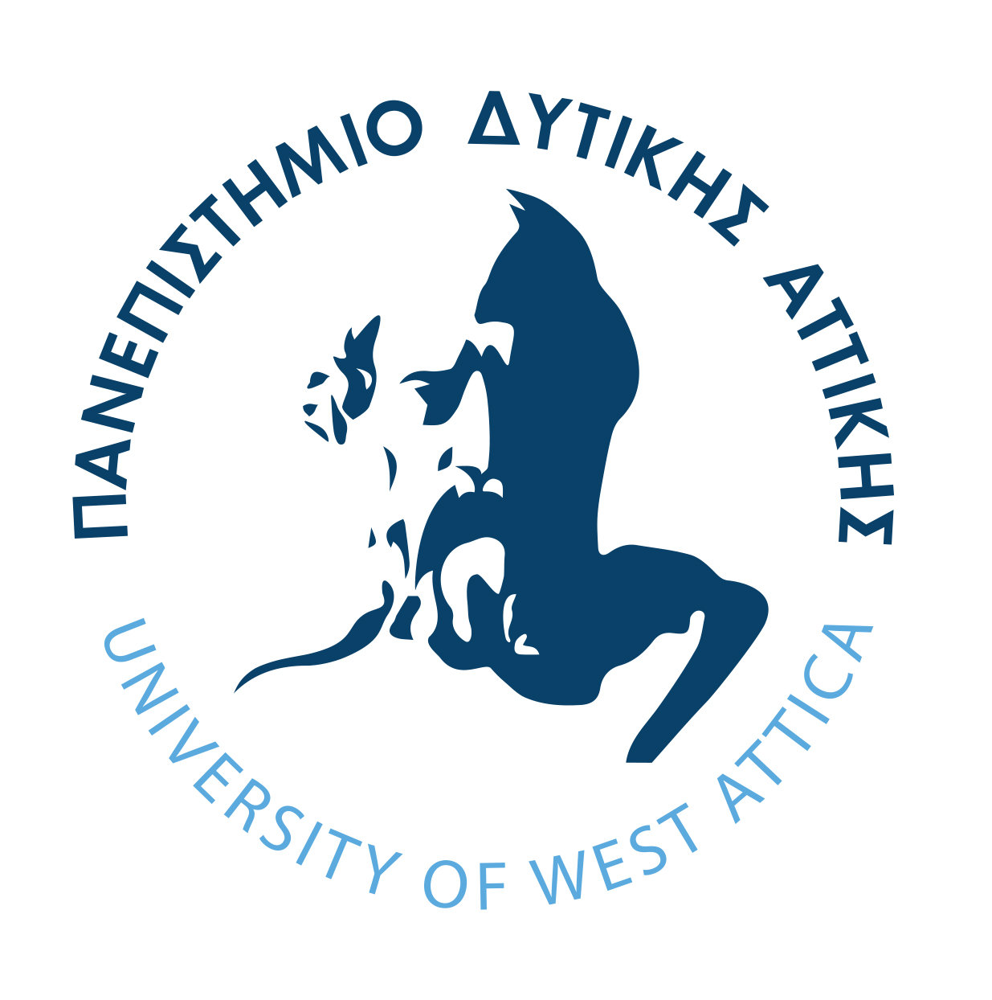

# Ευφυή Συστήματα και Συστήματα Υποστήριξης Αποφάσεων
**Ενότητα 4: Έμπειρα Συστήματα & Οντολογίες (Knowledge-Driven DSS)**
Τμήμα Μηχανικών Πληροφορικής & Υπολογιστών
Πανεπιστήμιο Δυτικής Αττικής

**Διδάσκων:** Ανάργυρος Τσαδήμας (tsadimas@uniwa.gr)

---

# Ενότητα 4 — Στόχος & Θέματα

**Στόχος:** Η κατανόηση της μετάβασης από την απλή επεξεργασία δεδομένων **(Data-Driven)** στην αναπαράσταση δομημένης γνώσης **(Knowledge-Driven)**.

Πώς μαθαίνουμε σε ένα υπολογιστικό σύστημα να **"σκέφτεται"**, να κατανοεί έννοιες και να εξάγει λογικά συμπεράσματα σαν ένας ανθρώπινος ειδικός;

**Θέματα:**
1. Έμπειρα Συστήματα & Αρχιτεκτονική
2. Κανόνες Παραγωγής (Production Rules)
3. Μηχανισμοί Εκτέλεσης (Forward / Backward Chaining)
4. Σημασιολογικός Ιστός & Οντολογίες
5. Γράφοι Γνώσης (Knowledge Graphs)
6. Μηχανές Συλλογισμού (Reasoners)
7. Εργαστηριακός Οδηγός: Protégé & SWRL

---

## 1. Κωδικοποίηση Ανθρώπινης Εμπειρίας: Έμπειρα Συστήματα

Τα **Έμπειρα Συστήματα (Expert Systems)** ήταν η πρώτη μεγάλη εμπορική επιτυχία της Τεχνητής Νοημοσύνης (δεκαετία 1980). Σκοπός τους είναι να μιμηθούν την ικανότητα λήψης αποφάσεων ενός ειδικού (π.χ. ενός γιατρού, ενός μηχανικού βλαβών).

### 1.1 Αρχιτεκτονική ενός Έμπειρου Συστήματος
Η βασική αρχή είναι ο **διαχωρισμός της γνώσης από την επεξεργασία**:
* **Βάση Γνώσης (Knowledge Base):** Δεν περιέχει απλά δεδομένα (όπως μια βάση SQL), αλλά **Γεγονότα (Facts)** και **Κανόνες (Rules)**.
* **Μηχανή Εξαγωγής Συμπερασμάτων (Inference Engine):** Το πρόγραμμα (αλγόριθμος) που συνδυάζει τα δεδομένα του χρήστη με τη Βάση Γνώσης για να βρει τη λύση.
* **Διεπαφή Χρήστη (User Interface):** Το περιβάλλον αλληλεπίδρασης.

*Ιστορικά Παραδείγματα:* * **MYCIN:** Διάγνωση βακτηριακών λοιμώξεων και συνταγογράφηση αντιβιοτικών (χρησιμοποιούσε συντελεστές βεβαιότητας).
* **DENDRAL:** Προσδιορισμός μοριακής δομής χημικών ενώσεων.

### 1.2 Κανόνες Παραγωγής (Production Rules)
Ο πιο κλασικός τρόπος κωδικοποίησης της διαδικαστικής γνώσης.
* **Δομή:** `IF (Συνθήκη / Προκείμενη) THEN (Συμπέρασμα / Ενέργεια)`
* **Πλεονέκτημα (Explainability):** Το σύστημα μπορεί να "εξηγήσει" την απόφασή του δείχνοντας ποιοι κανόνες πυροδοτήθηκαν (κάτι αδύνατο στα σύγχρονα Νευρωνικά Δίκτυα / Black Boxes).

### 1.3 Μηχανισμοί Εκτέλεσης (Chaining)
Πώς η Μηχανή Συμπερασμάτων ψάχνει τη λύση;
* **Forward Chaining (Ορθή Ακολουθία - Data Driven):** Ξεκινάμε από τα *δεδομένα* και εφαρμόζουμε κανόνες μέχρι να βρούμε το συμπέρασμα.
  * *Παράδειγμα:* "Ο ασθενής έχει πυρετό και βήχα" -> (Κανόνας) -> "Άρα έχει γρίπη".
* **Backward Chaining (Ανάστροφη Ακολουθία - Goal Driven):** Ξεκινάμε από έναν *στόχο/υπόθεση* και ψάχνουμε προς τα πίσω τα δεδομένα που τον επιβεβαιώνουν.
  * *Παράδειγμα:* "Υποψιάζομαι ότι έχει γρίπη. Για να ισχύει αυτό, πρέπει να έχει πυρετό. Ας ελέγξω αν έχει πυρετό."

---

## 2. Σημασιολογικός Ιστός (Semantic Web) & Οντολογίες

**Το Πρόβλημα των Κανόνων:** Ένα σύστημα με χιλιάδες `IF-THEN` κανόνες γίνεται χαοτικό. Επιπλέον, οι απλοί κανόνες στερούνται **Σημασιολογίας (Semantics)**. Το σύστημα βλέπει τη λέξη "Γιώργος", αλλά δεν ξέρει ότι πρόκειται για "Άνθρωπο". 

### 2.1 Τι είναι η Οντολογία;
Είναι ένα ψηφιακό, δομημένο "λεξικό" που ορίζει τις έννοιες ενός πεδίου και τις σχέσεις μεταξύ τους. 
Βασίζεται σε 3 πυλώνες:
1. **Κλάσεις (Classes):** Κατηγορίες (π.χ. `Πανεπιστήμιο`, `Φοιτητής`).
2. **Ιδιότητες (Properties):** Σχέσεις (π.χ. `σπουδάζει_στο`).
3. **Στιγμιότυπα (Individuals):** Συγκεκριμένα αντικείμενα (π.χ. `Γιώργος`, `ΠΑΔΑ`).

### 2.2 Πρότυπα του W3C (Semantic Web)
* **RDF (Resource Description Framework):** Όλη η γνώση αναπαρίσταται σε **Τριάδες (Triples)**: `Υποκείμενο -> Κατηγόρημα -> Αντικείμενο`. 
  * *Παράδειγμα:* `(Γιώργος) -> (σπουδάζει_στο) -> (ΠΑΔΑ)`.
* **OWL (Web Ontology Language):** Επεκτείνει το RDF προσθέτοντας πλούσια λογική. Μας επιτρέπει να βάλουμε περιορισμούς, π.χ.: "Ένας φοιτητής μπορεί να σπουδάζει σε *ακριβώς ένα* Πανεπιστήμιο".

### 2.3 Γράφοι Γνώσης (Knowledge Graphs)
Είναι η σύγχρονη, εμπορική εφαρμογή των Οντολογιών. 
* *Παράδειγμα:* Το Google Knowledge Graph (το κουτάκι στα δεξιά της αναζήτησης) ξέρει ότι ο "Brad Pitt" (Individual) ανήκει στην κλάση "Ηθοποιός" και συνδέεται με τη σχέση "έπαιξε_στο" με την ταινία "Fight Club".

---

## 3. Μηχανές Συλλογισμού (Reasoners)

Το σημείο όπου η Οντολογία αποκτά πραγματική "Ευφυΐα". 

* **Τι είναι το Reasoner;** Είναι ισχυροί αλγόριθμοι λογικής (π.χ. Pellet, HermiT, Fact++) που διαβάζουν την Οντολογία (κλάσεις, ιδιότητες, κανόνες) και εκτελούν δύο βασικές λειτουργίες:

1. **Εξαγωγή Νέας Γνώσης (Inference / Reasoning):**
   Μετατρέπουν την *Άρρητη (Implicit)* γνώση σε *Ρητή (Explicit)*. Το σύστημα μαθαίνει πράγματα που κανείς δεν του πληκτρολόγησε!
   * *Γεγονός 1:* Η Μαρία είναι μητέρα του Κώστα.
   * *Γεγονός 2:* Ο Γιώργος είναι αδερφός της Μαρίας.
   * *Λογικός Κανόνας:* `IF (X μητέρα Y) AND (Z αδερφός X) THEN (Z θείος Y)`.
   * *Αποτέλεσμα Reasoner:* Προσθέτει αυτόματα στη βάση το νέο γεγονός: **"Ο Γιώργος είναι θείος του Κώστα"**.

2. **Έλεγχος Συνέπειας (Consistency Checking):**
   Εντοπίζει λογικά σφάλματα. Αν ορίσουμε την κλάση `Χορτοφάγος` (άτομο που δεν τρώει κρέας) και φτιάξουμε το στιγμιότυπο `Νίκος` που ανήκει στους `Χορτοφάγους` αλλά τον βάλουμε να συνδέεται με τη σχέση `τρώει` με το στιγμιότυπο `Μπριζόλα`, το Reasoner θα "χτυπήσει" σφάλμα (Inconsistency).

---

## 4. Εργαστηριακός Οδηγός: Σχεδιασμός στο Protégé & SWRL

Το **Protégé** είναι το πιο δημοφιλές ανοιχτού κώδικα λογισμικό (αναπτύχθηκε από το Stanford) για τη δημιουργία Οντολογιών και Γράφων Γνώσης.

### Βήμα 1: Δημιουργία Ιεραρχίας Κλάσεων (Classes)
* Πλοήγηση στην καρτέλα `Classes`.
* Κάτω από την `owl:Thing` (η ρίζα όλων), δημιουργούμε την κλάση `Person`.
* Δημιουργούμε τις υπο-κλάσεις (Subclasses) `Adult` και `Minor`.

### Βήμα 2: Δημιουργία Ιδιοτήτων (Properties)
* **Object Properties:** Σχέσεις μεταξύ αντικειμένων. Δημιουργούμε την ιδιότητα `hasParent` (Domain: Person, Range: Person).
* **Data Properties:** Σχέσεις με τιμές/αριθμούς. Δημιουργούμε την ιδιότητα `hasAge` (Domain: Person, Range: integer).

### Βήμα 3: Δημιουργία Στιγμιοτύπων (Individuals)
* Στην καρτέλα `Individuals`, δημιουργούμε τον `John`.
* Του αναθέτουμε τύπο (Type) `Person`.
* Του δίνουμε την Data Property: `hasAge = 25`.

### Βήμα 4: Συγγραφή Κανόνα SWRL (Semantic Web Rule Language)
Θέλουμε το σύστημα να καταλάβει αυτόματα αν ο John είναι ενήλικας, χωρίς να του το πούμε εμείς.
* Πάμε στην καρτέλα `SWRL Rules`.
* Γράφουμε τον κανόνα: 
  `Person(?p) ^ hasAge(?p, ?age) ^ swrlb:greaterThan(?age, 17) -> Adult(?p)`
  *(Μετάφραση: Αν υπάρχει κάποιο άτομο P, με ηλικία AGE, και η ηλικία είναι μεγαλύτερη του 17, τότε το P ταξινομείται ως Adult).*

### Βήμα 5: Εκτέλεση του Reasoner (Η Μαγεία!)
* Πηγαίνουμε στο μενού `Reasoner` -> Επιλέγουμε τον `Pellet` (ή τον `HermiT`) -> Πατάμε `Start Reasoner`.
* Πηγαίνουμε ξανά στον `John`. Θα δούμε ότι **εμφανίστηκε αυτόματα, με κίτρινο χρώμα (inferred)**, η πληροφορία ότι ο John ανήκει πλέον ΚΑΙ στην κλάση `Adult`! Το σύστημα "σκέφτηκε" και έβγαλε το συμπέρασμα μόνο του.