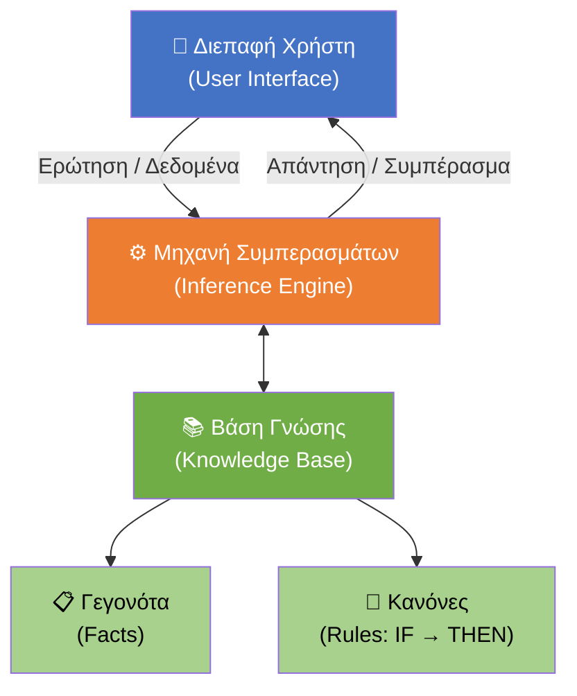
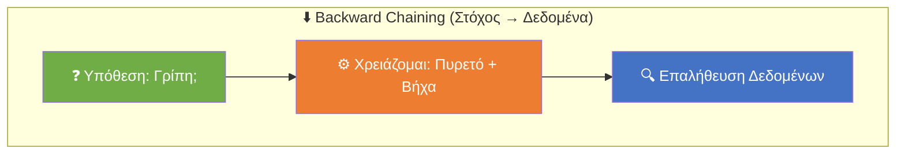
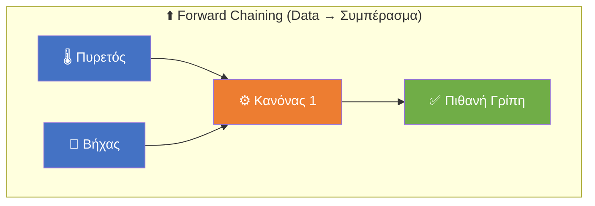
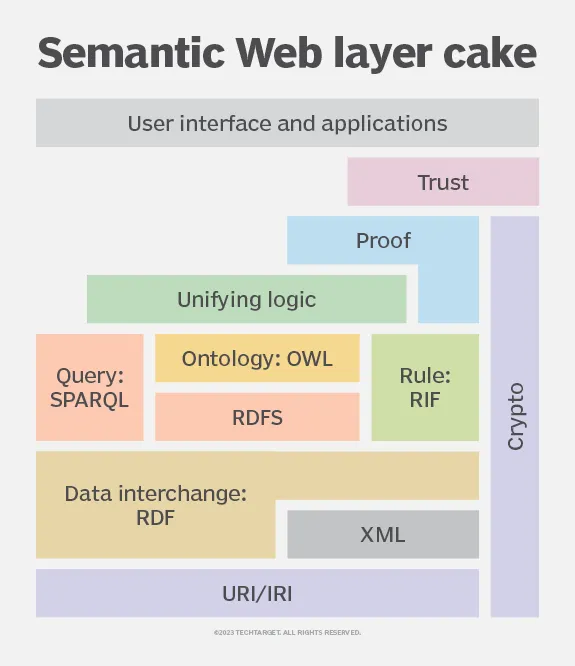
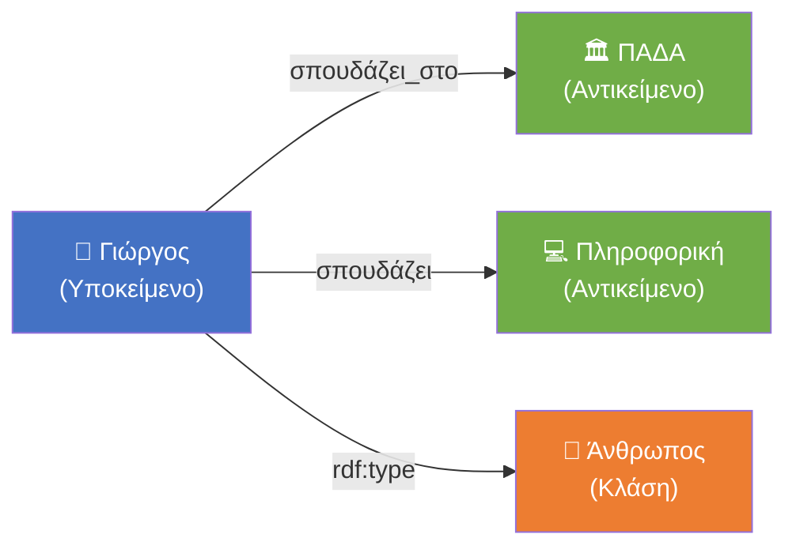
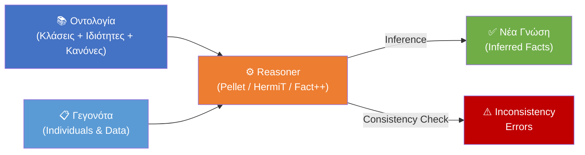
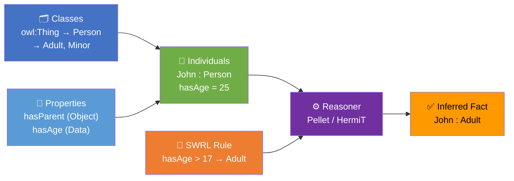

# Ευφυή Συστήματα και Συστήματα Υποστήριξης Αποφάσεων
**Ενότητα 4: Έμπειρα Συστήματα & Οντολογίες (Knowledge-Driven DSS)**
Τμήμα Μηχανικών Πληροφορικής & Υπολογιστών
Πανεπιστήμιο Δυτικής Αττικής

**Διδάσκων:** Ανάργυρος Τσαδήμας (tsadimas@uniwa.gr)

---

# Ενότητα 4 — Στόχος & Θέματα

**Στόχος:** Η κατανόηση της μετάβασης από την απλή επεξεργασία δεδομένων **(Data-Driven)** στην αναπαράσταση δομημένης γνώσης **(Knowledge-Driven)**.

Πώς μαθαίνουμε σε ένα υπολογιστικό σύστημα να **"σκέφτεται"**, να κατανοεί έννοιες και να εξάγει λογικά συμπεράσματα σαν ένας ανθρώπινος ειδικός;

**Θέματα:**
1. Έμπειρα Συστήματα & Αρχιτεκτονική
2. Κανόνες Παραγωγής (Production Rules)
3. Μηχανισμοί Εκτέλεσης (Forward / Backward Chaining)
4. Σημασιολογικός Ιστός — Όραμα & Πρότυπα (RDF, RDFS, OWL, SPARQL)
5. Οντολογίες — Δομή, Μεθοδολογία & Σχεδιαστικές Αποφάσεις
6. Γράφοι Γνώσης & Linked Open Data
7. Μηχανές Συλλογισμού (Reasoners)
8. Εργαστηριακός Οδηγός: Protégé & SWRL

---

<!-- _class: small -->
# 1. Κωδικοποίηση Ανθρώπινης Εμπειρίας: Έμπειρα Συστήματα

Τα **Έμπειρα Συστήματα (Expert Systems)** ήταν η πρώτη μεγάλη εμπορική επιτυχία της Τεχνητής Νοημοσύνης (δεκαετία 1980).

**Σκοπός:** Μίμηση της ικανότητας λήψης αποφάσεων ενός ειδικού (π.χ. γιατρού, μηχανικού βλαβών).

**Βασική Αρχή — Διαχωρισμός Γνώσης από Επεξεργασία:**

| Συστατικό | Ρόλος |
|---|---|
| **Βάση Γνώσης (Knowledge Base)** | Γεγονότα (Facts) + Κανόνες (Rules) — όχι απλά δεδομένα SQL |
| **Μηχανή Συμπερασμάτων (Inference Engine)** | Συνδυάζει δεδομένα χρήστη & κανόνες → βρίσκει λύση |
| **Διεπαφή Χρήστη (User Interface)** | Περιβάλλον αλληλεπίδρασης |

**Ιστορικά Παραδείγματα:**
* **MYCIN (Stanford):** Διάγνωση βακτηριακών λοιμώξεων — χρησιμοποιούσε Συντελεστές Βεβαιότητας.
* **DENDRAL (Stanford):** Προσδιορισμός μοριακής δομής χημικών ενώσεων.

---

<!-- _class: diagram -->
# Αρχιτεκτονική Έμπειρου Συστήματος — Διάγραμμα




---

# 1.2 Κανόνες Παραγωγής (Production Rules)

Ο πιο κλασικός τρόπος κωδικοποίησης της **διαδικαστικής γνώσης**.

**Δομή:**
```
IF (Συνθήκη / Προκείμενη)  THEN (Συμπέρασμα / Ενέργεια)
```

**Παράδειγμα:**
```
IF  ασθενής_έχει_πυρετό AND ασθενής_έχει_βήχα
THEN  πιθανή_διάγνωση = "Γρίπη"
```

**Πλεονέκτημα — Explainability (Ερμηνευσιμότητα):**
Το σύστημα μπορεί να **"εξηγήσει"** την απόφασή του δείχνοντας ποιοι κανόνες πυροδοτήθηκαν.

> Σε αντίθεση με τα σύγχρονα **Νευρωνικά Δίκτυα (Black Boxes)** που δεν μπορούν να αιτιολογήσουν τις προβλέψεις τους.

---

<!-- _class: small -->
# 1.3 Μηχανισμοί Εκτέλεσης (Chaining)

Πώς η Μηχανή Συμπερασμάτων ψάχνει τη λύση;

**Forward Chaining (Ορθή Ακολουθία — Data Driven):**
* Ξεκινάμε από τα *δεδομένα* → εφαρμόζουμε κανόνες → βρίσκουμε συμπέρασμα.
* *Παράδειγμα:* "Ασθενής έχει πυρετό + βήχα" → (Κανόνας) → "Άρα έχει γρίπη".

**Backward Chaining (Ανάστροφη Ακολουθία — Goal Driven):**
* Ξεκινάμε από *στόχο/υπόθεση* → ψάχνουμε τα δεδομένα που τον επιβεβαιώνουν.
* *Παράδειγμα:* "Υποψιάζομαι γρίπη. Για να ισχύει, πρέπει να υπάρχει πυρετός. Ελέγχω..."

| | Forward Chaining | Backward Chaining |
|---|---|---|
| **Αφετηρία** | Δεδομένα (Data) | Υπόθεση/Στόχος (Goal) |
| **Στυλ** | Data-Driven | Goal-Driven |
| **Χρήση** | Παρακολούθηση, Ανίχνευση | Διάγνωση, Πλοήγηση |

---

<!-- _class: twocol -->
# Forward vs Backward Chaining — Διάγραμμα






---

# 2. Σημασιολογικός Ιστός (Semantic Web) & Οντολογίες

**Το Πρόβλημα των Κανόνων:**
* Ένα σύστημα με χιλιάδες `IF-THEN` κανόνες γίνεται **χαοτικό**.
* Οι απλοί κανόνες στερούνται **Σημασιολογίας (Semantics)**.
* Το σύστημα βλέπει "Γιώργος" αλλά δεν ξέρει ότι πρόκειται για **Άνθρωπο**.

---

<!-- _class: small -->
# 2. Προβλήματα Παραδοσιακής Αναζήτησης

Οι κλασικές μηχανές αναζήτησης αντιμετωπίζουν δύο θεμελιώδη σημασιολογικά προβλήματα:

| Πρόβλημα | Ορισμός | Παράδειγμα |
|---|---|---|
| **Synonymy** | Διαφορετικές λέξεις, ίδια έννοια → χαμένα αποτελέσματα | «GR», «Ελλάδα», «Greece», «Hellas» = ίδια χώρα |
| **Polysemy** | Ίδια λέξη, πολλές σημασίες → άσχετα αποτελέσματα | «Java» = νησί ή γλώσσα προγραμματισμού; |

**Επιπλέον περιορισμοί:**
* Δεν γνωρίζουν τους **σημασιολογικούς συνδέσμους** ανάμεσα στους όρους.
* Αδυναμία διαχείρισης ερωτημάτων που απαιτούν γνώση που **δεν υπάρχει ρητά** στα έγγραφα.
* Δεν αποδίδουν καλά όταν απαιτείται **συλλογιστική (reasoning)** πάνω στα δεδομένα.

> **Λύση — Σημασιολογικός Ιστός:** Κάθε έννοια αποκτά μοναδικό αναγνωριστικό URI — το σύστημα «ξέρει» ότι `gr:Greece ≡ el:Ελλάδα`.

---

<!-- _class: small -->
# 2. Το Όραμα του Σημασιολογικού Ιστού

**Tim Berners-Lee, 2001 (Scientific American):**
> *"The Semantic Web is an extension of the current web in which information is given well-defined meaning, better enabling computers and people to work in cooperation."*

**Στόχος:** Μετατροπή του Ιστού από **παγκόσμια βιβλιοθήκη εγγράφων** σε **παγκόσμια βάση γνώσης** κατανοητή από μηχανές.

**Αρχιτεκτονική Στρωμάτων (Layer Cake):**

| Επίπεδο | Τεχνολογία | Ρόλος |
|---|---|---|
| Αναγνώριση | **URI / IRI** | Μοναδικό ID για κάθε πόρο/έννοια |
| Δομή | **RDF** | Αναπαράσταση γνώσης ως Τριάδες |
| Σχήμα | **RDFS** | Ιεραρχίες κλάσεων & ιδιοτήτων |
| Οντολογία | **OWL** | Πλούσια λογική & περιορισμοί |
| Κανόνες | **SWRL** | Κανόνες παραγωγής σε γράφους γνώσης |
| Ερωτήματα | **SPARQL** | Η "SQL" του Semantic Web |

---

<!-- _class: diagram -->
# Semantic Web — Layer Cake (Tim Berners-Lee)



---

<!-- _class: small -->
# Semantic Web — Ανάλυση Επιπέδων

Ο Berners-Lee πρότεινε το μοντέλο **"Layer Cake"** για να απεικονίσει τα επίπεδα τεχνολογίας που χτίζουν το Σημασιολογικό Ιστό (από κάτω προς τα πάνω):

| # | Επίπεδο | Τεχνολογία | Ρόλος |
|---|---|---|---|
| 1 | Αναγνώριση | **URI / IRI** | Μοναδικό αναγνωριστικό για κάθε πόρο — υποστηρίζει μη-λατινικούς χαρακτήρες |
| 2 | Δομή | **XML** | Δομημένη αναπαράσταση δεδομένων αναγνώσιμη από μηχανές |
| 3 | Δεδομένα | **RDF** | Ορίζει οντότητες, ιδιότητες & σχέσεις ως Τριάδες (Subject→Predicate→Object) |
| 4 | Οντολογία | **RDFS + OWL + RIF** | Τυπικοποιεί έννοιες, ιεραρχίες & λογικούς περιορισμούς |
| 5 | Ερωτήματα | **SPARQL** | Αναζήτηση & ανάκτηση δεδομένων από RDF γράφους |
| 6 | Εμπιστοσύνη | **Crypto / Proof** | Ψηφιακές υπογραφές — επαλήθευση προέλευσης & αξιοπιστίας |
| 7 | Διεπαφή | **User Interface** | Εφαρμογές & λογισμικό για τον τελικό χρήστη |

> *"Raw data can be expressed in Unicode text characters and identified through IRI — a system that allows the use of characters and formats suitable for languages other than English."*
> — Understanding the Semantic Web, Medium 2023

---

<!-- _class: small -->
# 2. URI / IRI / URL — Μοναδικές Ταυτότητες

Κάθε κλάση, ιδιότητα ή στιγμιότυπο σε μια οντολογία έχει **μοναδικό αναγνωριστικό** — όπως ο ΑΦΜ για έναν πολίτη.

| | **URI** | **IRI** | **URL** |
|---|---|---|---|
| **Σημαίνει** | Uniform Resource Identifier | Internationalized Resource Identifier | Uniform Resource Locator |
| **Χαρακτήρες** | ASCII μόνο | Unicode (ελληνικά, emoji ✅) | ASCII μόνο |
| **Παράδειγμα** | `…/ontology#Person` | `…/οντολογία#Άνθρωπος` | `https://dbpedia.org/…` |
| **Τοποθεσία;** | Όχι απαραίτητα | Όχι απαραίτητα | ✅ Ναι |

**Κανόνες:**
* `URL ⊆ URI ⊆ IRI` — κάθε URL είναι URI, κάθε URI είναι IRI
* IRI με ελληνικά → αυτόματη μετατροπή σε percent-encoding:
  `Άνθρωπος` → `%CE%8C%CE%BD%CE%B8%CF%81%CF%89%CF%80%CE%BF%CF%82`

> 💡 Στο Protégé κάθε κλάση/ιδιότητα παίρνει IRI στο παρασκήνιο — π.χ. `http://example.org/persons#hasAge`

---

# 2.1 Τι είναι η Οντολογία;

Ένα ψηφιακό, δομημένο **"λεξικό"** που ορίζει τις έννοιες ενός πεδίου και τις σχέσεις μεταξύ τους.

**3 Πυλώνες:**

| Στοιχείο | Ορισμός | Παράδειγμα |
|---|---|---|
| **Κλάσεις (Classes)** | Κατηγορίες | `Πανεπιστήμιο`, `Φοιτητής` |
| **Ιδιότητες (Properties)** | Σχέσεις | `σπουδάζει_στο` |
| **Στιγμιότυπα (Individuals)** | Συγκεκριμένα αντικείμενα | `Γιώργος`, `ΠΑΔΑ` |

> **Ορισμός (Gruber, 1993):** *"An ontology is an explicit formal specification of a shared conceptualization."*

---

<!-- _class: small -->
# 2.1 Τυπικός Ορισμός Οντολογίας — O = ⟨C, R, I, A⟩

Μια οντολογία ορίζεται τυπικά ως **τετράδα**:

$$O = \langle C,\; R,\; I,\; A \rangle$$

| Στοιχείο | Ονομασία | Περιγραφή |
|---|---|---|
| **C** | Classes (Κλάσεις) | Σύνολο εννοιών / κατηγοριών του domain |
| **R** | Relations (Σχέσεις) | Ιδιότητες & κατηγορήματα (predicates) |
| **I** | Instances (Στιγμιότυπα) | Συγκεκριμένα αντικείμενα — συνδέονται με C ή R |
| **A** | Axioms (Αξιώματα) | Λογικές δηλώσεις, κανόνες & περιορισμοί |

**Παράδειγμα:**
```
C: { Product, Vehicle }
R: { Product hasPrice Price,  Vehicle hasHeight Height }
I: { product_2 compatibleWith product_3,  product_2 hasPrice 170 }
A: { αν τιμή_προϊόντος > 150€  →  δωρεάν αποστολή }
```

> Τα **Αξιώματα (A)** αναβαθμίζουν την οντολογία σε **βάση συλλογιστικής** — επιτρέπουν αυτόματη εξαγωγή νέας γνώσης.

---

<!-- _class: small -->
# 2.1 Κατηγορίες Οντολογιών

**Ανά πολυπλοκότητα γλώσσας:**

| Κατηγορία | Περιγραφή |
|---|---|
| **Lightweight** | Απλές ιεραρχίες & ταξινομίες χωρίς λογικούς περιορισμούς |
| **Heavyweight** | Πλούσια λογική, αξιώματα, περιορισμοί — π.χ. OWL DL |

**Ανά τύπο σημασιολογίας:**

| Τύπος | Εξήγηση | Παράδειγμα |
|---|---|---|
| **Schema Ontologies** | Προσανατολισμός ΒΔ: κλάση ≈ πίνακας | Product catalog |
| **Topic Ontologies** | Ταξινομίες θεμάτων & κατηγοριών (hierarchies) | Yahoo! Directory, DMOZ |
| **Lexical Ontologies** | Λεξικογραφικές έννοιες & γλωσσικοί ορισμοί | WordNet, BabelNet |

**Οντολογία vs Γνωσιακή Βάση (Knowledge Base):**
* Η **Βάση Γνώσης** είναι πιο γενική: περιλαμβάνει αξιώματα, κανόνες, γεγονότα, εντολές.
* Επιτρέπει **συλλογιστική**, αλλά δεν στοχεύει στην αναπαράσταση συγκεκριμένου domain.
* **Οντολογία + Στιγμιότυπα = Γνωσιακή Βάση** (ήδη υλοποιήσιμη στο Protégé).

---

<!-- _class: small -->
# 2.1α Γιατί να Αναπτύξουμε Οντολογία;

*(Noy & McGuinness, "Ontology Development 101", Stanford, 2001)*

| Λόγος | Εξήγηση |
|---|---|
| **Κοινή Κατανόηση** | Άνθρωποι & λογισμικό μοιράζονται την ίδια δομή γνώσης |
| **Επαναχρησιμοποίηση** | Η γνώση ενός τομέα χτίζεται μια φορά, χρησιμοποιείται παντού |
| **Ρητές Παραδοχές** | Οι κρυμμένες παραδοχές του κώδικα γίνονται ορατές & τροποποιήσιμες |
| **Διαχωρισμός Γνώσης** | Ο αλγόριθμος παραμένει ανεξάρτητος από το πεδίο εφαρμογής |
| **Ανάλυση Γνώσης** | Δυνατότητα τυπικής ανάλυσης & επαλήθευσης της γνώσης |

**Πρακτικό Παράδειγμα (από το PDF):**
* Ένας αλγόριθμος **"διαμόρφωσης προϊόντος"** αναπτύχθηκε ανεξάρτητα από δεδομένα.
* Τρέχει με οντολογία PC-components → διαμορφώνει υπολογιστές.
* Τρέχει με οντολογία ανελκυστήρων → διαμορφώνει ανελκυστήρες.
* **Ίδιος αλγόριθμος, διαφορετική γνώση.**

---

<!-- _class: small -->
# 2.1β Δομή Γνωσιακής Βάσης (Knowledge Base)

**Τα συστατικά μιας Οντολογίας (Protégé model):**

| Συστατικό | Ονομασίες | Λεπτομέρεια |
|---|---|---|
| **Classes** | Concepts, Types | Περιγράφουν κατηγορίες· υποστηρίζουν ιεραρχία `subClassOf` |
| **Slots** | Properties, Roles | Ιδιότητες κλάσεων — *intrinsic*, *extrinsic*, *parts*, *σχέσεις* |
| **Facets** | Role Restrictions | Περιορισμοί slots: τύπος, cardinality, επιτρεπόμενες τιμές |
| **Individuals** | Instances | Συγκεκριμένα αντικείμενα· γεμίζουν τις τιμές των slots |

> **Οντολογία + Στιγμιότυπα = Γνωσιακή Βάση (Knowledge Base)**

**Τύποι Τιμών Slots (Facet: value-type):**
* `String`, `Integer`, `Float`, `Boolean`
* `Enumerated` — λίστα επιτρεπόμενων τιμών (π.χ. {Κόκκινο, Λευκό, Ροζέ})
* `Instance` — ο ρόλος δείχνει σε άλλο στιγμιότυπο (π.χ. `maker → Winery`)

**Cardinality (Facet: πληθικότητα):**
* *Min cardinality 1:* κάθε κρασί έχει τουλάχιστον ένα σταφύλι.
* *Max cardinality 1:* ένα άτομο έχει ακριβώς ένα ΑΦΜ (`Functional Property` στο OWL).

---

<!-- _class: small -->
# 2.1γ Μεθοδολογία Ανάπτυξης Οντολογίας (7 Βήματα)

*(Noy & McGuinness, 2001 — Επαναληπτική Διαδικασία)*

| Βήμα | Περιγραφή |
|---|---|
| **1. Πεδίο & Σκοπός** | Τι καλύπτει; Ποιος τη χρησιμοποιεί; Ποιες **Competency Questions** πρέπει να απαντά; |
| **2. Επαναχρησιμοποίηση** | Υπάρχουν ήδη οντολογίες που μπορούμε να επεκτείνουμε; |
| **3. Απαρίθμηση Όρων** | Λίστα όλων των εννοιών χωρίς ανησυχία για ιεραρχία |
| **4. Ορισμός Κλάσεων** | Δημιουργία ιεραρχίας (Top-Down / Bottom-Up / Combination) |
| **5. Ορισμός Slots** | Ποιες ιδιότητες έχει κάθε κλάση; |
| **6. Ορισμός Facets** | Τύπος τιμής, cardinality, domain, range |
| **7. Δημιουργία Instances** | Πλήρωση στιγμιοτύπων με πραγματικές τιμές |

> **3 Θεμελιώδεις Κανόνες:**
> 1. Δεν υπάρχει *ένα σωστό μοντέλο* — εξαρτάται από τη χρήση.
> 2. Η ανάπτυξη είναι **επαναληπτική**.
> 3. Οι έννοιες αντιστοιχούν σε **αντικείμενα & σχέσεις** του κόσμου (ουσιαστικά = Classes, ρήματα = Properties).

---

<!-- _class: small -->
# 2.1δ Σχεδιασμός Ιεραρχίας Κλάσεων

**Στρατηγικές Ανάπτυξης:**

| Στρατηγική | Κατεύθυνση | Κατάλληλη για |
|---|---|---|
| **Top-Down** | Γενικό → Ειδικό | Συστηματική θεώρηση τομέα |
| **Bottom-Up** | Ειδικό → Γενικό | Ξεκίνημα από συγκεκριμένα παραδείγματα |
| **Combination** | Μεσαία → Άκρα | Πιο συνηθισμένη πρακτική |

**Κανόνες Σχεδιασμού:**

* **is-a rule:** Κάθε instance κλάσης B *είναι επίσης* instance της υπερκλάσης A — *"kind-of"* σχέση.
* **Transitivity:** Αν `C ⊆ B` και `B ⊆ A`, τότε `C ⊆ A` — αυτόματα.
* **Αποφυγή κύκλων:** Κύκλος `A ⊆ B` και `B ⊆ A` σημαίνει ότι A ≡ B.
* **Αδέλφια στο ίδιο επίπεδο:** Οι υποκλάσεις ίδιας κλάσης πρέπει να είναι στο ίδιο επίπεδο γενικότητας.
* **Πλήθος υποκλάσεων:** Ιδανικά **2–12** απευθείας υποκλάσεις.
* **Νέα κλάση ή property value;** Αν η διάκριση δημιουργεί **διαφορετικές σχέσεις** με άλλες κλάσεις → νέα κλάση. Αλλιώς → property τιμή.
* **Νέα κλάση ή instance;** Τα πιο ειδικά αντικείμενα που απαντούν τις Competency Questions = individuals. Αν υπάρχει φυσική ιεραρχία → κλάσεις.

---

<!-- _class: small -->
# 2.1ε Πολλαπλή Κληρονομικότητα & Αποφάσεις Σχεδιασμού

**Πολλαπλή Κληρονομικότητα (Multiple Inheritance):**
Μια κλάση μπορεί να είναι υποκλάση **πολλών κλάσεων ταυτόχρονα**.

```
Port  isa  RedWine
Port  isa  DessertWine
→ Κληρονομεί: tannin level (από RedWine) + sugar=SWEET (από DessertWine)
```

**Παράδειγμα "Competency Questions" (CQ):**
*Ποιο είναι το σωστό κρασί για ψαρικά;*
* Η οντολογία πρέπει να έχει ιδιότητα `pairsWellWith` μεταξύ κλάσεων `Wine` & `FoodCourse`.
* Αν το CQ δεν απαιτεί τη διάκριση λευκού/κόκκινου, δεν χρειάζονται ξεχωριστές κλάσεις.

**Κανόνας Περιορισμού Πεδίου (Scope):**
> Η οντολογία **δεν** χρειάζεται να περιέχει *όλη* τη δυνατή πληροφορία.
> Εξειδίκευση/γενίκευση: max **1 επιπλέον επίπεδο** από αυτό που χρειάζεται η εφαρμογή.

---

<!-- _class: small -->
# 2.1στ Ανοικτή vs Κλειστή Υπόθεση Κόσμου (OWA / CWA)

Θεμελιώδης διαφορά μεταξύ OWL Οντολογιών και Σχεσιακών Βάσεων Δεδομένων.

**Κλειστή Υπόθεση Κόσμου (Closed World Assumption — CWA):**
* Ό,τι **δεν καταγράφεται ρητά** θεωρείται **ψευδές**.
* Χρησιμοποιείται σε: SQL, Prolog.
* *Παράδειγμα:* `SELECT * FROM flights WHERE passenger='Γιώργος'` → 0 αποτελέσματα → *"Ο Γιώργος ΔΕΝ έχει πτήσεις."*

**Ανοικτή Υπόθεση Κόσμου (Open World Assumption — OWA):**
* Η απουσία πληροφορίας = **"δεν ξέρουμε"** (όχι άρνηση).
* Χρησιμοποιείται σε: OWL, Semantic Web.
* *Παράδειγμα:* Δεν υπάρχει πληροφορία πτήσης → *"Ίσως να υπάρχει κάπου αλλού — απλώς δεν έχουμε τα δεδομένα."*

| | CWA (SQL) | OWA (OWL) |
|---|---|---|
| **Απουσία δεδομένων** | ≡ Ψευδές | ≡ Άγνωστο |
| **Κόσμος** | Κλειστός, πλήρης | Ανοικτός, μερικός |

---

<!-- _class: small -->
# 2.2 Πρότυπα του W3C (Semantic Web)

**RDF (Resource Description Framework):**
Όλη η γνώση αναπαρίσταται σε **Τριάδες (Triples)**:
```
Υποκείμενο  →  Κατηγόρημα  →  Αντικείμενο
```
*Παράδειγμα:* `(Γιώργος) → (σπουδάζει_στο) → (ΠΑΔΑ)`

**OWL (Web Ontology Language):**
* Επεκτείνει το RDF προσθέτοντας **πλούσια λογική**.
* Επιτρέπει περιορισμούς, π.χ.: *"Ένας φοιτητής μπορεί να σπουδάζει σε **ακριβώς ένα** Πανεπιστήμιο"*.

> **RDF** = Η **γλώσσα** αναπαράστασης &nbsp;|&nbsp; **OWL** = Η **λογική** πάνω στη γλώσσα

---

<!-- _class: small -->
# 2.2α RDFS — Σχήμα για το RDF

Το **RDF Schema (RDFS)** εισάγει **ιεραρχίες** και **τύπους** πάνω από το απλό RDF:

| Κατασκευή | Σημασία | Παράδειγμα |
|---|---|---|
| `rdfs:subClassOf` | Υπο-κλάση | `Μεταπτυχιακός rdfs:subClassOf Φοιτητής` |
| `rdfs:subPropertyOf` | Υπο-ιδιότητα | `σπουδάζει_σε rdfs:subPropertyOf ανήκει_σε` |
| `rdfs:domain` | Ποια κλάση «έχει» την ιδιότητα | `hasAge rdfs:domain Person` |
| `rdfs:range` | Τύπος τιμής ιδιότητας | `hasAge rdfs:range xsd:integer` |
| `rdfs:label` | Ανθρωποαναγνώσιμη ετικέτα | `Person rdfs:label "Άνθρωπος"@el` |

**Κληρονομικότητα (Inheritance) στο RDFS:**
```
Μεταπτυχιακός  rdfs:subClassOf  Φοιτητής
Φοιτητής       rdfs:subClassOf  Άνθρωπος
──────────────────────────────────────────────────
→  Reasoner: κάθε Μεταπτυχιακός είναι ΑΥΤΟΜΑΤΑ και Άνθρωπος
```

---

<!-- _class: small -->
# 2.2β OWL — Χαρακτηριστικά Ιδιοτήτων

Το OWL επιτρέπει **λογικά χαρακτηριστικά** σε κάθε ιδιότητα:

| Χαρακτηριστικό | Σημασία | Παράδειγμα |
|---|---|---|
| **Transitive** | A→B, B→C ⟹ A→C | `βρίσκεται_σε`: Αθήνα→Αττική→Ελλάδα ⟹ Αθήνα→Ελλάδα |
| **Symmetric** | A→B ⟹ B→A | `είναι_συνάδελφος_με` |
| **Asymmetric** | A→B ⟹ ¬(B→A) | `είναι_γονέας_του` |
| **Functional** | Μοναδική τιμή | `hasAFM` (1 ΑΦΜ ανά πρόσωπο) |
| **Inverse Of** | Αντίστροφη σχέση | `hasParent` ↔ `isParentOf` |
| **Reflexive** | A→A πάντα ισχύει | `isSameAs` |

> **Πρακτική Αξία:** Ο Reasoner, γνωρίζοντας ότι `βρίσκεται_σε` είναι **Transitive**, **συμπεραίνει αυτόματα** ότι η Αθήνα βρίσκεται στην Ελλάδα — χωρίς αυτό να δηλώνεται ρητά στην Οντολογία.

---

<!-- _class: small -->
# 2.2γ OWL — Εκδόσεις & Εκφραστικότητα

Η OWL ορίζεται σε **τρεις εκδόσεις** με διαφορετικό trade-off μεταξύ εκφραστικότητας & αποφασισιμότητας:

| Έκδοση | Εκφραστικότητα | Χαρακτηριστικά |
|---|---|---|
| **OWL Lite** | Ελάχιστη | Απλές ιεραρχίες & περιορισμοί · εύκολη υλοποίηση εργαλείων |
| **OWL DL** | Μέτρια–Υψηλή | Βασισμένο σε **Description Logic** · **αποφασίσιμο** · πλήρες reasoning |
| **OWL Full** | Μέγιστη | Πλήρης ολοκλήρωση με RDF · **μη αποφασίσιμο** · χωρίς εγγυήσεις reasoning |

> **OWL DL** είναι η πιο χρησιμοποιούμενη έκδοση — προσφέρει **πλούσια αναπαράσταση** με **εγγυημένη συλλογιστική**.

**Τι είναι το «Description Logic» (DL);**
* Τυπική λογική για την περιγραφή εννοιών & ρόλων.
* Επιτρέπει αποφασίσιμους αλγόριθμους για: **ταξινόμηση** (classification), **έλεγχο συνέπειας** (consistency checking) και **εξαγωγή** (realization).

---

<!-- _class: small -->
# 2.2δ SPARQL — Γλώσσα Ερωτημάτων

Το **SPARQL** (SPARQL Protocol and RDF Query Language) είναι η "SQL του Semantic Web" — ερωτά γράφους RDF/OWL.

**Βασικό ερώτημα:**
```sparql
SELECT ?name ?uni
WHERE {
  ?p  rdf:type    :Student .
  ?p  :hasName    ?name .
  ?p  :studiesAt  ?uni .
}
```
*"Βρες τα ονόματα και πανεπιστήμια όλων των Φοιτητών."*

**Τύποι ερωτημάτων:**

| Τύπος | Αποτέλεσμα |
|---|---|
| `SELECT` | Πίνακας τιμών (όπως SQL) |
| `ASK` | `true` / `false` |
| `CONSTRUCT` | Νέος RDF γράφος |
| `DESCRIBE` | Περιγραφή ενός πόρου |

> Live δοκιμή: **[dbpedia.org/sparql](https://dbpedia.org/sparql)** — ερωτά ~580 εκ. RDF triples της Wikipedia

---

<!-- _class: small -->
# 2.2δ SPARQL — Live Παράδειγμα (DBpedia)

Το **DBpedia** εκθέτει όλη τη Wikipedia ως RDF γράφο με ~580 εκ. triples.

```sparql
SELECT ?film ?director WHERE {
  ?film  rdf:type        dbo:Film .
  ?film  dbo:director    ?dirRes .
  ?dirRes rdfs:label     ?director .
  ?film  rdfs:label      "Inception"@en .
  FILTER(LANG(?director) = "en")
} LIMIT 5
```
*Βρες τον σκηνοθέτη της ταινίας "Inception" από τη Wikipedia.*

Δοκίμασέ το live: **[dbpedia.org/sparql](https://dbpedia.org/sparql)** → επικόλλησε το query → **Run Query**.

---

<!-- _class: diagram -->
# RDF Τριάδες — Διάγραμμα




---

# 2.3 Γράφοι Γνώσης (Knowledge Graphs)

Η **σύγχρονη, εμπορική** εφαρμογή των Οντολογιών.

**Παράδειγμα — Google Knowledge Graph:**
* Το κουτάκι στα δεξιά της Google αναζήτησης.
* Ξέρει ότι ο **"Brad Pitt"** (Individual) ανήκει στην κλάση **"Ηθοποιός"** και συνδέεται με τη σχέση **"έπαιξε_στο"** με την ταινία **"Fight Club"**.

**Άλλες εφαρμογές:**
* **Amazon:** Product Knowledge Graph για συστάσεις.
* **LinkedIn:** Professional Knowledge Graph για jobs/skills.
* **Βιοπληροφορική:** Drug-Disease Knowledge Graphs.

---

<!-- _class: small -->
# 2.3α Ανοικτές Βάσεις Γνώσης (Linked Open Data)

**Σημαντικές Ανοικτές Βάσεις Γνώσης του Πραγματικού Κόσμου:**

| Βάση Γνώσης | Μέγεθος | Περιεχόμενο |
|---|---|---|
| **DBpedia** | ~580M triples | Wikipedia σε RDF |
| **Wikidata** | ~15 δισ. triples | Δομημένα δεδομένα Wikimedia |
| **Schema.org** | Universal | Σήμανση ιστοσελίδων (Google, Bing, Yahoo) |
| **SNOMED CT** | ~360K έννοιες | Ιατρική Οντολογία |
| **Gene Ontology** | ~47K όροι | Βιολογία / Γονιδιώματα |
| **WordNet / BabelNet** | ~155K synsets | Γλωσσολογία & NLP |

**Παράδειγμα SPARQL σε DBpedia:**
```sparql
SELECT ?city WHERE {
  ?city  dbo:country  dbr:Greece .
  ?city  rdf:type     dbo:City .
}
```

> Αυτές οι βάσεις **συνδέονται μεταξύ τους** μέσω `owl:sameAs`, δημιουργώντας το **"Linked Data Cloud"**.

---

# 3. Μηχανές Συλλογισμού (Reasoners)

Το σημείο όπου η Οντολογία αποκτά πραγματική **"Ευφυΐα"**.

**Τι είναι το Reasoner;**
Ισχυροί αλγόριθμοι λογικής (π.χ. **Pellet**, **HermiT**, **Fact++**) που διαβάζουν την Οντολογία και εκτελούν δύο βασικές λειτουργίες:

1. **Εξαγωγή Νέας Γνώσης (Inference / Reasoning)**
2. **Έλεγχος Συνέπειας (Consistency Checking)**

---

# 3.1 Εξαγωγή Νέας Γνώσης (Inference)

Μετατρέπει την **Άρρητη (Implicit)** γνώση σε **Ρητή (Explicit)**.

*Το σύστημα μαθαίνει πράγματα που κανείς δεν του πληκτρολόγησε!*

* 📌 *Γεγονός 1:* Η Μαρία είναι μητέρα του Κώστα.
* 📌 *Γεγονός 2:* Ο Γιώργος είναι αδερφός της Μαρίας.
* 📜 *Κανόνας:* `IF (X μητέρα Y) AND (Z αδερφός X) THEN (Z θείος Y)`
* ✅ *Αποτέλεσμα Reasoner:* Προσθέτει αυτόματα: **"Ο Γιώργος είναι θείος του Κώστα"**

---

# 3.2 Έλεγχος Συνέπειας (Consistency Checking)

Εντοπίζει **λογικά σφάλματα** στην Οντολογία.

**Παράδειγμα:**
* Ορίζουμε κλάση `Χορτοφάγος` = άτομο που *δεν τρώει κρέας*.
* Δημιουργούμε στιγμιότυπο `Νίκος` ∈ `Χορτοφάγοι`.
* Του αναθέτουμε σχέση: `Νίκος → τρώει → Μπριζόλα` 🥩

**Αποτέλεσμα:**

> ⚠️ **INCONSISTENCY ERROR!**
> Το Reasoner εντοπίζει τη λογική αντίφαση και αναφέρει σφάλμα.

---

<!-- _class: diagram -->
# Reasoner — Λειτουργία




---

# 4. Εργαστηριακός Οδηγός: Protégé & SWRL

Το **Protégé** είναι το πιο δημοφιλές ανοιχτού κώδικα λογισμικό για τη δημιουργία Οντολογιών και Γράφων Γνώσης.
*(Αναπτύχθηκε από το Stanford University)*

---

<!-- _class: small -->
# 4.0 Σύνδεση με τα Προηγούμενα — Γιατί Protégé;

| Έννοια που μάθαμε | Πού το βλέπουμε στο Protégé |
|---|---|
| **Έμπειρα Συστήματα** (Βάση Γνώσης + Inf. Engine) | Protégé = GUI για τη Βάση Γνώσης· ο Reasoner = Inference Engine |
| **OWL / RDFS** (γλώσσες οντολογιών) | Protégé αποθηκεύει τα πάντα σε **`.owl` (OWL/XML ή Turtle)** |
| **SPARQL** (ερωτήματα σε RDF) | Μπορούμε να εκτελούμε SPARQL απευθείας μέσα από το Protégé |
| **Reasoner** (Pellet / HermiT) | Ενσωματωμένος στο Protégé — τρέχει με ένα κλικ |
| **SWRL** (κανόνες IF→THEN σε γράφους) | Αποκλειστική καρτέλα γραφής & εκτέλεσης SWRL κανόνων |

---

# 4.0 Τι Καλύπτει ο Οδηγός & Τι Παίρνουμε

**Τι καλύπτει ο οδηγός:**
* Δημιουργία κλάσεων, ιδιοτήτων, στιγμιοτύπων (= ολόκληρη οντολογία εξ αρχής)
* Συγγραφή κανόνα SWRL και εκτέλεση Reasoner
* Εξαγωγή αρχείου `.owl` που μπορεί να φορτωθεί σε Python

**Τι παίρνουμε στο τέλος:**
* Αρχείο **`persons.owl`** — πλήρης τυπική περιγραφή της γνώσης
* **Inferred facts** που το σύστημα έβγαλε μόνο του (π.χ. `John : Adult`)
* Έτοιμο αρχείο για χρήση σε Python, SPARQL endpoint ή Knowledge Graph

---

# Βήμα 1 & 2: Κλάσεις & Ιδιότητες

**Βήμα 1: Δημιουργία Ιεραρχίας Κλάσεων**
* Πλοήγηση στην καρτέλα `Classes`.
* Κάτω από την `owl:Thing` (ρίζα όλων) δημιουργούμε `Person`.
* Δημιουργούμε τις υπο-κλάσεις (Subclasses): `Adult` και `Minor`.

**Βήμα 2: Δημιουργία Ιδιοτήτων (Properties)**
* **Object Properties:** Σχέσεις μεταξύ αντικειμένων.
  * Δημιουργούμε `hasParent` *(Domain: Person, Range: Person)*.
* **Data Properties:** Σχέσεις με τιμές/αριθμούς.
  * Δημιουργούμε `hasAge` *(Domain: Person, Range: integer)*.

---

# Βήμα 3: Δημιουργία Στιγμιοτύπων (Individuals)

* Στην καρτέλα `Individuals`, δημιουργούμε τον `John`.
* Αναθέτουμε τύπο (Type): `Person`.
* Δίνουμε Data Property: `hasAge = 25`.

---

# Βήμα 4: Συγγραφή Κανόνα SWRL

**SWRL (Semantic Web Rule Language)** — Συνδυάζει OWL με Rules.

**Στόχος:** Το σύστημα να καταλάβει **αυτόματα** αν ο John είναι ενήλικας, χωρίς να του το πούμε εμείς.

* Πάμε στην καρτέλα `SWRL Rules`.
* Γράφουμε τον κανόνα:

```
Person(?p) ^ hasAge(?p, ?age) ^ swrlb:greaterThan(?age, 17)  ->  Adult(?p)
```

*Μετάφραση: Αν υπάρχει άτομο P, με ηλικία AGE > 17, τότε P ταξινομείται ως Adult.*

---

# Βήμα 5: Εκτέλεση του Reasoner (Η Μαγεία! ✨)

* `Reasoner` → Επιλέγουμε `Pellet` (ή `HermiT`) → `Start Reasoner`
* Επιστρέφουμε στο στιγμιότυπο `John`.

**Αποτέλεσμα:**

> ✨ Εμφανίζεται αυτόματα, με **κίτρινο χρώμα (inferred)**, ότι ο John ανήκει ΤΩΡΑ ΚΑΙ στην κλάση `Adult`!

Το σύστημα **"σκέφτηκε"** και έβγαλε το συμπέρασμα μόνο του.

---

<!-- _class: diagram -->
# Συνολικό Pipeline Protégé & SWRL



---

<!-- _class: small -->
# 4.6 Protégé → Python: `owlready2`

Αφού εξάγουμε `persons.owl` από το Protégé, μπορούμε να το φορτώσουμε απευθείας σε Python (`pip install owlready2`, απαιτεί Java).

```python
from owlready2 import get_ontology, sync_reasoner_pellet

onto = get_ontology("file://persons.owl").load()

john = onto.John
print(john.hasAge)   # → [25]

# Εκτέλεση Reasoner (Pellet)
with onto:
    sync_reasoner_pellet(infer_property_values=True)

print(john.is_a)     # → [persons.Adult]  ← inferred!

# SPARQL ερώτημα
import owlready2
results = list(owlready2.default_world.sparql("""
    SELECT ?p ?age WHERE {
        ?p  a        <http://example.org/persons#Adult> .
        ?p  <http://example.org/persons#hasAge>  ?age .
    }
"""))
print(results)       # → [[john, 25]]
```

---

<!-- _class: small -->
# 4.7 Εναλλακτικά: `rdflib` για SPARQL χωρίς Java

Αν δεν χρειαζόμαστε Reasoner — μόνο ανάγνωση και SPARQL (`pip install rdflib`):

```python
from rdflib import Graph, Namespace, URIRef, Literal, XSD, RDF

g = Graph()
g.parse("persons.owl")

EX = Namespace("http://example.org/persons#")

# SPARQL ερώτημα
for row in g.query("""
    PREFIX ex: <http://example.org/persons#>
    SELECT ?person ?age WHERE { ?person ex:hasAge ?age . } ORDER BY ?age
"""):
    print(f"{row.person.split('#')[-1]} → ηλικία {row.age}")

# Προσθήκη τριπλέτου & αποθήκευση
john = URIRef(EX + "John")
g.add((john, RDF.type, URIRef(EX + "Person")))
g.add((john, URIRef(EX + "hasAge"), Literal(25, datatype=XSD.integer)))
g.serialize("persons_updated.owl")
```

---

# 4.7 `owlready2` vs `rdflib`

| | `owlready2` | `rdflib` |
|---|---|---|
| **Reasoning** | ✅ Pellet / HermiT (Java) | ❌ (χρειάζεται plugin) |
| **SPARQL** | ✅ | ✅ |
| **Εγκατάσταση** | `pip install owlready2` + Java | `pip install rdflib` |
| **Χρήση** | OWL + Inference | Γρήγορη ανάγνωση / γράψιμο RDF |
