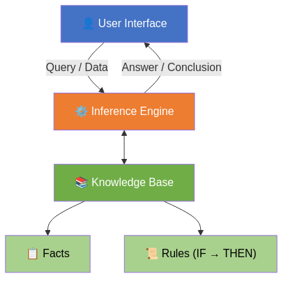
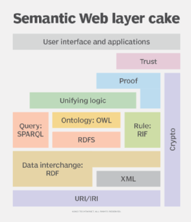
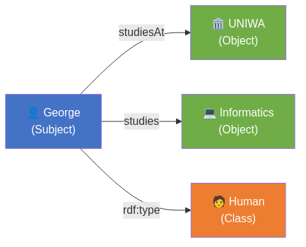
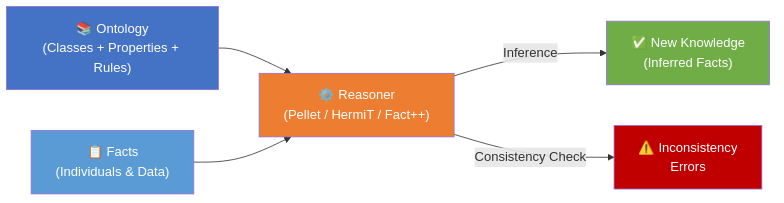
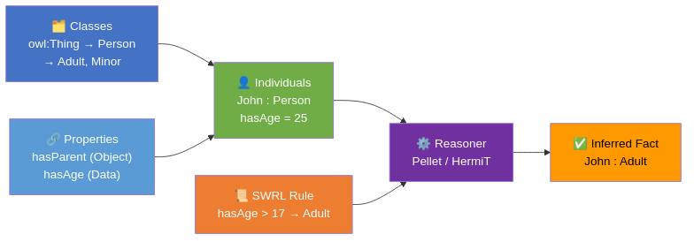

# Intelligent Systems and Decision Support Systems
**Unit 4: Expert Systems & Ontologies (Knowledge-Driven DSS)**
Department of Informatics and Computer Engineering
University of West Attica

**Instructor:** Anargyros Tsadimas (tsadimas@uniwa.gr)

---

# Unit 4 — Goals & Topics

**Goal:** Understand the transition from simple data processing **(Data-Driven)** to structured knowledge representation **(Knowledge-Driven)**.

How do we teach a computer system to **"think"**, understand concepts and draw logical conclusions like a human expert?

**Topics:**
1. Expert Systems & Architecture
2. Production Rules
3. Execution Mechanisms (Forward / Backward Chaining)
4. Semantic Web — Vision & Standards (RDF, RDFS, OWL, SPARQL)
5. Ontologies — Structure, Methodology & Design Decisions
6. Knowledge Graphs & Linked Open Data
7. Reasoning Engines (Reasoners)
8. Lab Guide: Protégé & SWRL

---

<!-- _class: small -->
# 1. Encoding Human Expertise: Expert Systems

**Expert Systems** were the first major commercial success of Artificial Intelligence (1980s).

**Purpose:** Mimic the decision-making ability of a domain expert (e.g. a doctor, a fault engineer).

**Core Principle — Separation of Knowledge from Processing:**

| Component | Role |
|---|---|
| **Knowledge Base** | Facts + Rules — not just SQL data |
| **Inference Engine** | Combines user data & rules → finds solution |
| **User Interface** | Interaction environment |

**Historical Examples:**
* **MYCIN (Stanford):** Diagnosis of bacterial infections — used Certainty Factors.
* **DENDRAL (Stanford):** Identification of molecular structure of chemical compounds.

---

<!-- _class: small -->
# 1.1 The Problem: Knowledge Acquisition Bottleneck

Why did classical rule-based Expert Systems decline in the 1990s, giving way to Machine Learning?

Their main drawback was the **Knowledge Acquisition Bottleneck**:
* **Difficulty extracting knowledge:** Experts struggle to express their "empirical" intuition as strict `IF-THEN` rules.
* **Maintenance cost:** A system with 5,000 rules becomes extremely complex. Adding a new rule can create unpredictable logical contradictions with the old ones.
* **Rigidity:** Inability to adapt to new data without manual rewriting of the code (lack of "learning").

---

<!-- _class: diagram -->
# Expert System Architecture — Diagram




---

# 1.2 Production Rules

The most classical way of encoding **procedural knowledge**.

**Structure:**
```
IF (Condition / Premise)  THEN (Conclusion / Action)
```

**Example:**
```
IF  patient_has_fever AND patient_has_cough
THEN  probable_diagnosis = "Flu"
```

**Advantage — Explainability:**
The system can **"explain"** its decision by showing which rules were fired.

> In contrast to modern **Neural Networks (Black Boxes)** which cannot justify their predictions.

---

<!-- _class: small -->
# White Boxes, Black Boxes & Explainability in Machine Learning (1/2)

**Rules** (and Expert Systems) are _"White Boxes"_: their logic is transparent and explainable.

In contrast, **Deep Neural Networks (Deep Learning)** are _"Black Boxes"_: they learn complex mathematical weights that no one can directly read or explain.

**How do we achieve Explainability in Black Boxes?**

There are two paths:

**1. Inherently Explainable Models (White-Box Models):**
  - **Decision Trees:** Similar to rules, but the tree is built by learning from data. We can follow the "path" to see the _why_ of a decision.
  - **Linear/Logistic Regression:** The equation gives coefficients (weights). If the coefficient for age is large, we know the model emphasises age.

---

<!-- _class: small -->
# White Boxes, Black Boxes & Explainability in Machine Learning (2/2)

**2. Post-Hoc Explainability**

  - **SHAP (SHapley Additive exPlanations):** Based on game theory. Calculates how much each variable contributed to the final decision.
    - _Example:_ "Debt history pushed the decision towards 'NO' by 40%, low salary by 30%, while age tried to push towards 'YES' by 10%."
  - **LIME (Local Interpretable Model-agnostic Explanations):** Makes small "perturbations" to the data and observes how the prediction changes.
    - _Example (Medical):_ If the system says "This patient has flu", LIME removes the fever. If the prediction changes, fever was a critical factor.
  - **Saliency Maps (Grad-CAM):** For images, shows which pixels/regions the network "looked at" (heatmap).
    - _Example:_ The doctor sees an X-ray with a red spot: "I said there is a tumour because I looked here!"

**The "Golden Mean": Neuro-symbolic AI**
Modern trend: combining Neural Networks (that "see" and learn patterns) with Ontologies/Rules (that have logic and semantics). The Neural Network makes the prediction, but is controlled and explained by the Ontology's Rules.

---

# 1.3 Execution Mechanisms (Chaining)

How does the Inference Engine search for a solution?

**Forward Chaining (Data Driven):**
* Start from *data* → apply rules → find conclusion.
* *Example:* "Patient has fever + cough" → (Rule) → "Therefore has flu".

**Backward Chaining (Goal Driven):**
* Start from a *goal/hypothesis* → search for the data that confirms it.
* *Example:* "I suspect flu. For this to hold, there must be fever. I check..."

| | Forward Chaining | Backward Chaining |
|---|---|---|
| **Starting point** | Data | Hypothesis/Goal |
| **Style** | Data-Driven | Goal-Driven |
| **Use** | Monitoring, Detection | Diagnosis, Navigation |

---


# 2. Semantic Web & Ontologies

**The Problem with Rules:**
* A system with thousands of `IF-THEN` rules becomes **chaotic**.
* Simple rules lack **Semantics**.
* The system sees "George" but doesn't know it refers to a **Human**.

---

<!-- _class: small -->
# 2.0 Problems with Traditional Search

Classical search engines face two fundamental semantic problems:

| Problem | Definition | Example |
|---|---|---|
| **Synonymy** | Different words, same meaning → missed results | "GR", "Greece", "Hellas" = same country |
| **Polysemy** | Same word, multiple meanings → unrelated results | "Java" = island or programming language? |

**Additional limitations:**
* They do not know the **semantic links** between terms.
* Inability to handle queries that require knowledge **not explicitly present** in documents.
* Poor performance when **reasoning** over data is required.

> **Solution — Semantic Web:** Every concept gets a unique URI — the system "knows" that `gr:Greece ≡ el:Ελλάδα`.

---

<!-- _class: small -->
# 2. The Vision of the Semantic Web

**[Tim Berners-Lee](https://en.wikipedia.org/wiki/Tim_Berners-Lee), 2001 (Scientific American):**
> *"The Semantic Web is an extension of the current web in which information is given well-defined meaning, better enabling computers and people to work in cooperation."*

**Goal:** Transform the Web from a **global library of documents** into a **global knowledge base** understandable by machines.

**Layer Architecture (Layer Cake):**

| Layer | Technology | Role |
|---|---|---|
| Identification | **URI / IRI** | Unique ID for each resource/concept |
| Structure | **RDF** | Knowledge representation as Triples |
| Schema | **RDFS** | Class & property hierarchies |
| Ontology | **OWL** | Rich logic & constraints |
| Rules | **SWRL** | Production rules in knowledge graphs |
| Queries | **SPARQL** | The "SQL" of the Semantic Web |

---

<!-- _class: diagram -->
# Semantic Web — Layer Cake (Tim Berners-Lee)



---

<!-- _class: small -->
# Semantic Web — Layer Analysis

Berners-Lee proposed the **"Layer Cake"** model to depict the technology layers that build the Semantic Web (from bottom to top):

| # | Layer | Technology | Role |
|---|---|---|---|
| 1 | Identification | **URI / IRI** | Unique identifier for each resource — supports non-Latin characters |
| 2 | Structure | **XML** | Machine-readable structured data representation |
| 3 | Data | **RDF** | Defines entities, properties & relationships as Triples (Subject→Predicate→Object) |
| 4 | Ontology | **RDFS + OWL + RIF** | Formalises concepts, hierarchies & logical constraints |
| 5 | Queries | **SPARQL** | Search & retrieval of data from RDF graphs |
| 6 | Trust | **Crypto / Proof** | Digital signatures — source verification & trust |
| 7 | Interface | **User Interface** | Applications & software for the end user |

> *"Raw data can be expressed in Unicode text characters and identified through IRI — a system that allows the use of characters and formats suitable for languages other than English."*
> — Understanding the Semantic Web, Medium 2023

---

<!-- _class: small -->
# 2. URI / IRI / URL — Unique Identifiers

Every class, property or individual in an ontology has a **unique identifier** — like a tax ID for a citizen.

| | **URI** | **IRI** | **URL** |
|---|---|---|---|
| **Stands for** | Uniform Resource Identifier | Internationalized Resource Identifier | Uniform Resource Locator |
| **Characters** | ASCII only | Unicode (Greek, emoji ✅) | ASCII only |
| **Example** | `…/ontology#Person` | `…/ontology#Άνθρωπος` | `https://dbpedia.org/…` |
| **Has location?** | Not necessarily | Not necessarily | ✅ Yes |

**Rules:**
* `URL ⊆ URI ⊆ IRI` — every URL is a URI, every URI is an IRI
* IRI with non-ASCII characters → automatic percent-encoding:
  `Άνθρωπος` → `%CE%86%CE%BD%CE%B8%CF%81%CF%89%CF%80%CE%BF%CF%82`

> 💡 In Protégé every class/property gets an IRI behind the scenes — e.g. `http://example.org/persons#hasAge`

---

# 2.1 What is an Ontology?

A digital, structured **"dictionary"** that defines the concepts of a domain and the relationships between them.

**3 Pillars:**

| Element | Definition | Example |
|---|---|---|
| **Classes** | Categories | `University`, `Student` |
| **Properties** | Relationships | `studiesAt` |
| **Individuals** | Specific objects | `George`, `UNIWA` |

> **Definition (Gruber, 1993):** *"An ontology is an explicit formal specification of a shared conceptualization."*

---

<!-- _class: small -->
# 2.1 TBox vs ABox: The Knowledge Split

In Description Logic (on which Ontologies are based), the Knowledge Base is strictly divided into two "boxes":

| TBox (Terminological Box) | ABox (Assertional Box) |
|---|---|
| **The Vocabulary / The Schema** | **The Data / The Facts** |
| Defines **Classes** and **Properties** | Contains the **Individuals** |
| Answers *"What are the rules of the world?"* | Answers *"What exists in the world?"* |
| *Example:* "Student is a Subclass of Human" | *Example:* "George is a Student" |

> Think of it in database terms: **TBox** is the table schema (DDL), and **ABox** is the records/rows (DML).

---

<!-- _class: small -->
# 2.1 Formal Ontology Definition — O = ⟨C, R, I, A⟩

An ontology is formally defined as a **4-tuple**:

$$O = \langle C,\; R,\; I,\; A \rangle$$

| Element | Name | Description |
|---|---|---|
| **C** | Classes | Set of concepts / categories of the domain |
| **R** | Relations | Properties & predicates |
| **I** | Instances | Specific objects — linked to C or R |
| **A** | Axioms | Logical statements, rules & constraints |

**Example:**
```
C: { Product, Vehicle }
R: { Product hasPrice Price,  Vehicle hasHeight Height }
I: { product_2 compatibleWith product_3,  product_2 hasPrice 170 }
A: { if product_price > 150€  →  free shipping }
```

> **Axioms (A)** upgrade the ontology to a **reasoning base** — they allow automatic derivation of new knowledge.

---

<!-- _class: small -->
# 2.1 Categories of Ontologies

**By language complexity:**

| Category | Description |
|---|---|
| **Lightweight** | Simple hierarchies & taxonomies without logical constraints |
| **Heavyweight** | Rich logic, axioms, constraints — e.g. OWL DL |

**By semantics type:**

| Type | Explanation | Example |
|---|---|---|
| **Schema Ontologies** | DB-oriented: class ≈ table | Product catalog |
| **Topic Ontologies** | Topic taxonomies & categories (hierarchies) | Yahoo! Directory, DMOZ |
| **Lexical Ontologies** | Lexicographic concepts & linguistic definitions | WordNet, BabelNet |

**Ontology vs Knowledge Base:**
* A **Knowledge Base** is more general: includes axioms, rules, facts, instructions.
* It supports **reasoning**, but does not target a specific domain representation.
* **Ontology + Individuals = Knowledge Base** (already implementable in Protégé).

---

<!-- _class: small -->
# 2.1α Why Develop an Ontology?

*(Noy & McGuinness, "Ontology Development 101", Stanford, 2001)*

| Reason | Explanation |
|---|---|
| **Shared Understanding** | Humans & software share the same knowledge structure |
| **Reusability** | Domain knowledge is built once, used everywhere |
| **Explicit Assumptions** | Hidden assumptions in code become visible & modifiable |
| **Knowledge Separation** | The algorithm remains independent from the application domain |
| **Knowledge Analysis** | Enables formal analysis & verification of knowledge |

**Practical Example:**
* A **"product configuration"** algorithm was developed independently of data.
* Runs with PC-components ontology → configures computers.
* Runs with elevator ontology → configures elevators.
* **Same algorithm, different knowledge.**

---

<!-- _class: small -->
# 2.1β Structure of a Knowledge Base

**The components of an Ontology (Protégé model):**

| Component | Names | Detail |
|---|---|---|
| **Classes** | Concepts, Types | Describe categories; support `subClassOf` hierarchy |
| **Slots** | Properties, Roles | Class properties — *intrinsic*, *extrinsic*, *parts*, *relations* |
| **Facets** | Role Restrictions | Slot constraints: type, cardinality, allowed values |
| **Individuals** | Instances | Specific objects; fill the slot values |

> **Ontology + Individuals = Knowledge Base**

**Slot Value Types (Facet: value-type):**
* `String`, `Integer`, `Float`, `Boolean`
* `Enumerated` — list of allowed values (e.g. {Red, White, Rosé})
* `Instance` — the role points to another individual (e.g. `maker → Winery`)

**Cardinality (Facet):**
* *Min cardinality 1:* every wine has at least one grape variety.
* *Max cardinality 1:* a person has exactly one tax ID (`Functional Property` in OWL).

---

<!-- _class: small -->
# 2.1γ Ontology Development Methodology (7 Steps)

*(Noy & McGuinness, 2001 — Iterative Process)*

| Step | Description |
|---|---|
| **1. Domain & Scope** | What does it cover? Who uses it? What **Competency Questions** must it answer? |
| **2. Reuse** | Are there existing ontologies we can extend? |
| **3. Enumerate Terms** | List all concepts without worrying about hierarchy |
| **4. Define Classes** | Create hierarchy (Top-Down / Bottom-Up / Combination) |
| **5. Define Slots** | What properties does each class have? |
| **6. Define Facets** | Value type, cardinality, domain, range |
| **7. Create Instances** | Populate individuals with real values |

> **3 Fundamental Rules:**
> 1. There is no *single correct model* — it depends on the use.
> 2. Development is **iterative**.
> 3. Concepts correspond to **objects & relations** in the world (nouns = Classes, verbs = Properties).

---

<!-- _class: small -->
# 2.1γ(i) The Role of Competency Questions (CQs)

**Competency Questions (CQs)** are a list of natural language questions that our ontology **must be able to answer** based on its structure.

**Why are they fundamental in design?**
1. **They define scope:** They help us decide what to include and what to leave out. If a concept does not serve in answering any CQ, it is considered unnecessary and is omitted (we do not model "the whole world").
2. **They act as "Test Cases":** They serve as evaluation and success criteria. After completing the ontology, we translate them into SPARQL queries to verify the system works correctly.

**Example (Restaurant Ontology):**
> *"What is the appropriate wine for seafood?"*

This simple question dictates to the Knowledge Engineer that the ontology must contain: the class `Wine`, the class `Seafood` (or `FoodCourse`) and a property `pairsWellWith` connecting them.

---

<!-- _class: small -->
# 2.1δ Class Hierarchy Design

**Development Strategies:**

| Strategy | Direction | Suitable for |
|---|---|---|
| **Top-Down** | General → Specific | Systematic domain overview |
| **Bottom-Up** | Specific → General | Starting from concrete examples |
| **Combination** | Middle → Extremes | Most common practice |

**Design Rules:**

* **is-a rule:** Every instance of class B *is also* an instance of superclass A — *"kind-of"* relationship.
* **Transitivity:** If `C ⊆ B` and `B ⊆ A`, then `C ⊆ A` — automatically.
* **Avoid cycles:** A cycle `A ⊆ B` and `B ⊆ A` means A ≡ B.
* **Disjoint Classes:** Classes that cannot share common individuals (e.g. `Plant` and `Animal`).
* **Siblings at the same level:** Subclasses of the same class must be at the same level of generality.
* **Number of subclasses:** Ideally **2–12** direct subclasses.
* **New class or property value?** If the distinction creates **different relationships** with other classes → new class. Otherwise → property value.
* **New class or individual?** The most specific objects that answer the Competency Questions = individuals. If there is a natural hierarchy → classes.

---

<!-- _class: small -->
# 2.1ε Multiple Inheritance & Design Decisions

**Multiple Inheritance:**
A class can be a subclass of **multiple classes simultaneously**.

```
Port  isa  RedWine
Port  isa  DessertWine
→ Inherits: tannin level (from RedWine) + sugar=SWEET (from DessertWine)
```

**"Competency Questions" (CQ) Example:**
*What is the right wine for seafood?*
* The ontology must have property `pairsWellWith` between classes `Wine` & `FoodCourse`.
* If the CQ does not require the distinction between white/red, separate classes are not needed.

**Scope Restriction Rule:**
> The ontology does **not** need to contain *all* possible information.
> Specialisation/generalisation: max **1 additional level** beyond what the application needs.

---

<!-- _class: small -->
# 2.1στ Open vs Closed World Assumption (OWA / CWA)

Fundamental difference between OWL Ontologies and Relational Databases.

**Closed World Assumption (CWA):**
* Whatever is **not explicitly recorded** is considered **false**.
* Used in: SQL, Prolog.
* *Example:* `SELECT * FROM flights WHERE passenger='George'` → 0 results → *"George has NO flights."*

**Open World Assumption (OWA):**
* Absence of information = **"we don't know"** (not denial).
* Used in: OWL, Semantic Web.
* *Example:* No flight information → *"There may be one somewhere — we simply don't have the data."*

| | CWA (SQL) | OWA (OWL) |
|---|---|---|
| **Absence of data** | ≡ False | ≡ Unknown |
| **World** | Closed, complete | Open, partial |

> ⚠️ **The OWA trap:** If we do not explicitly declare two classes as **Disjoint**, the Reasoner does not assume they differ! An individual could belong to both `Dog` and `Cat` simultaneously if we do not prevent it.

---

<!-- _class: small -->
# 2.2 W3C Standards (Semantic Web)

**RDF (Resource Description Framework):**
All knowledge is represented in **Triples**:
```
Subject  →  Predicate  →  Object
```
*Example:* `(George) → (studiesAt) → (UNIWA)`

**OWL (Web Ontology Language):**
* Extends RDF by adding **rich logic**.
* Allows constraints, e.g.: *"A student can study at **exactly one** University"*.

> **RDF** = The **language** of representation &nbsp;|&nbsp; **OWL** = The **logic** on top of the language

---

<!-- _class: small -->
# 2.2 RDF — Serialization Formats

How do we write and store triples (Subject - Predicate - Object) in real files?

| Format | Description | Example |
|---|---|---|
| **RDF/XML** | The original, official W3C format. Syntactically complex, hard for humans. | `<rdf:Description rdf:about="George">...` |
| **Turtle (.ttl)** | (Terse RDF Triple Language) The most human-friendly and widespread format. | `ex:George ex:studiesAt ex:UNIWA .` |
| **N-Triples (.nt)** | One triple per line. Simple format, ideal for huge files and fast parsing. | `<http.../George> <http.../studiesAt> <http.../UNIWA> .` |
| **JSON-LD** | RDF encoded in JSON. The standard for embedding knowledge in web pages (SEO). | `{ "@id": "George", "studiesAt": "UNIWA" }` |

> 💡 In practice, tools (such as Protégé and `rdflib` in Python) read and write in all these formats interchangeably. **The knowledge stays the same, only the syntax changes!**

---

<!-- _class: small -->
# 2.2α RDFS — Schema for RDF

**RDF Schema (RDFS)** introduces **hierarchies** and **types** on top of plain RDF:

| Construct | Meaning | Example |
|---|---|---|
| `rdfs:subClassOf` | Sub-class | `GraduateStudent rdfs:subClassOf Student` |
| `rdfs:subPropertyOf` | Sub-property | `studiesAt rdfs:subPropertyOf belongsTo` |
| `rdfs:domain` | Which class "has" the property | `hasAge rdfs:domain Person` |
| `rdfs:range` | Value type of property | `hasAge rdfs:range xsd:integer` |
| `rdfs:label` | Human-readable label | `Person rdfs:label "Person"@en` |

**Inheritance in RDFS:**
```
GraduateStudent  rdfs:subClassOf  Student
Student          rdfs:subClassOf  Human
──────────────────────────────────────────────────
→  Reasoner: every GraduateStudent is AUTOMATICALLY also a Human
```

---

<!-- _class: small -->
# 2.2β OWL — Property Characteristics

OWL allows **logical characteristics** on each property:

| Characteristic | Meaning | Example |
|---|---|---|
| **Transitive** | A→B, B→C ⟹ A→C | `locatedIn`: Athens→Attica→Greece ⟹ Athens→Greece |
| **Symmetric** | A→B ⟹ B→A | `isColleagueOf` |
| **Asymmetric** | A→B ⟹ ¬(B→A) | `isParentOf` |
| **Functional** | Unique value | `hasTaxID` (1 tax ID per person) |
| **Inverse Of** | Inverse relationship | `hasParent` ↔ `isParentOf` |
| **Reflexive** | A→A always holds | `isSameAs` |

> **Practical Value:** The Reasoner, knowing that `locatedIn` is **Transitive**, **automatically infers** that Athens is in Greece — without this being explicitly stated in the Ontology.

---

<!-- _class: small -->
# 2.2γ OWL — Versions & Expressiveness

OWL is defined in **three versions** with different trade-offs between expressiveness & decidability:

| Version | Expressiveness | Characteristics |
|---|---|---|
| **OWL Lite** | Minimal | Simple hierarchies & constraints · easy tool implementation |
| **OWL DL** | Moderate–High | Based on **Description Logic** · **decidable** · complete reasoning |
| **OWL Full** | Maximum | Full integration with RDF · **undecidable** · no reasoning guarantees |

> **OWL DL** is the most widely used version — it offers **rich representation** with **guaranteed reasoning**.

**What is "Description Logic" (DL)?**
* Formal logic for describing concepts & roles.
* Enables decidable algorithms for: **classification**, **consistency checking** and **realization**.

---

<!-- _class: small -->
# 2.2δ SPARQL — Query Language

**SPARQL** (SPARQL Protocol and RDF Query Language) is the "SQL of the Semantic Web" — it queries RDF/OWL graphs.

**Basic query:**
```sparql
SELECT ?name ?uni
WHERE {
  ?p  rdf:type    :Student .
  ?p  :hasName    ?name .
  ?p  :studiesAt  ?uni .
}
```
*"Find the names and universities of all Students."*

**Query types:**

| Type | Result |
|---|---|
| `SELECT` | Table of values (like SQL) |
| `ASK` | `true` / `false` |
| `CONSTRUCT` | New RDF graph |
| `DESCRIBE` | Description of a resource |

> Live test: **[dbpedia.org/sparql](https://dbpedia.org/sparql)** — queries ~580M RDF triples from Wikipedia

---

<!-- _class: small -->
# 2.2δ SPARQL — Live Example (DBpedia)

**DBpedia** exposes all of Wikipedia as an RDF graph with ~580M triples.

```sparql
SELECT ?film ?director WHERE {
  ?film  rdf:type        dbo:Film .
  ?film  dbo:director    ?dirRes .
  ?dirRes rdfs:label     ?director .
  ?film  rdfs:label      "Inception"@en .
  FILTER(LANG(?director) = "en")
} LIMIT 5
```
*Find the director of the film "Inception" from Wikipedia.*

Try it live: **[dbpedia.org/sparql](https://dbpedia.org/sparql)** → paste the query → **Run Query**.

---

<!-- _class: diagram -->
# RDF Triples — Diagram




---

# 2.3 Knowledge Graphs

The **modern, commercial** application of Ontologies.

**Example — Google Knowledge Graph:**
* The info box on the right of Google Search.
* Knows that **"Brad Pitt"** (Individual) belongs to the class **"Actor"** and is connected via the relation **"actedIn"** to the film **"Fight Club"**.

**Other applications:**
* **Amazon:** Product Knowledge Graph for recommendations.
* **LinkedIn:** Professional Knowledge Graph for jobs/skills.
* **Bioinformatics:** Drug-Disease Knowledge Graphs.

---

<!-- _class: small -->
# 2.3α Open Knowledge Bases (Linked Open Data)

**Major Real-World Open Knowledge Bases:**

| Knowledge Base | Size | Content |
|---|---|---|
| **DBpedia** | ~580M triples | Wikipedia in RDF |
| **Wikidata** | ~15B triples | Structured Wikimedia data |
| **Schema.org** | Universal | Web page markup (Google, Bing, Yahoo) |
| **SNOMED CT** | ~360K concepts | Medical Ontology |
| **Gene Ontology** | ~47K terms | Biology / Genomes |
| **WordNet / BabelNet** | ~155K synsets | Linguistics & NLP |

**SPARQL example on DBpedia:**
```sparql
SELECT ?city WHERE {
  ?city  dbo:country  dbr:Greece .
  ?city  rdf:type     dbo:City .
}
```

> These bases **are linked to each other** via `owl:sameAs`, forming the **"Linked Data Cloud"**.

---

<!-- _class: small -->
# 2.3β The 4 Principles of Linked Data

To achieve the vision of the Semantic Web, Tim Berners-Lee defined 4 basic rules for publishing data on the Web:

1. **Use URIs:** Use URIs to name all things (entities).
2. **Use HTTP URIs:** URIs must be accessible via the HTTP protocol, so users can look them up (dereferenceable).
3. **Provide Useful Information:** When someone looks up a URI, the server must return useful data using open standards (such as RDF, SPARQL).
4. **Link to Other URIs:** Include links to other related URIs, so machines can discover new knowledge.

> ⭐ **The golden rule of the Semantic Web:**
> The "Web of Documents" (Web 1.0/2.0) links **pages** via HTML (hyperlinks).
> The "Semantic Web" links **concepts and data** (e.g. `owl:sameAs`).

---

# 3. Reasoning Engines (Reasoners)

The point where the Ontology gains real **"Intelligence"**.

**What is a Reasoner?**
Powerful logic algorithms (e.g. **Pellet**, **HermiT**, **Fact++**) that read the Ontology and perform two core functions:

1. **Knowledge Inference**
2. **Consistency Checking**

---

# 3.1 Knowledge Inference

Transforms **Implicit** knowledge into **Explicit** knowledge.

*The system learns things that no one typed in!*

* 📌 *Fact 1:* Mary is the mother of Kostas.
* 📌 *Fact 2:* George is the brother of Mary.
* 📜 *Rule:* `IF (X mother Y) AND (Z brother X) THEN (Z uncle Y)`
* ✅ *Reasoner result:* Automatically adds: **"George is the uncle of Kostas"**

---

# 3.2 Consistency Checking

Detects **logical errors** in the Ontology.

**Example:**
* We define class `Vegetarian` = a person who *does not eat meat*.
* We create individual `Nick` ∈ `Vegetarian`.
* We assign the relation: `Nick → eats → Steak` 🥩

**Result:**

> ⚠️ **INCONSISTENCY ERROR!**
> The Reasoner detects the logical contradiction and reports an error.

---

<!-- _class: diagram -->
# Reasoner — Operation




---

# 4. Lab Guide: Protégé & SWRL

**Protégé** is the most popular open-source software for creating Ontologies and Knowledge Graphs.
*(Developed by Stanford University)*

---

<!-- _class: small -->
# 4.0 Connection to Previous Material — Why Protégé?

| Concept learned | Where we see it in Protégé |
|---|---|
| **Expert Systems** (Knowledge Base + Inf. Engine) | Protégé = GUI for the Knowledge Base; the Reasoner = Inference Engine |
| **OWL / RDFS** (ontology languages) | Protégé stores everything in **`.owl` (OWL/XML or Turtle)** |
| **SPARQL** (queries on RDF) | We can run SPARQL directly inside Protégé |
| **Reasoner** (Pellet / HermiT) | Built-in in Protégé — runs with one click |
| **SWRL** (IF→THEN rules in graphs) | Dedicated tab for writing & running SWRL rules |

---

# 4.0 What the Guide Covers & What We Get

**What the guide covers:**
* Creating classes, properties, individuals (= full ontology from scratch)
* Writing a SWRL rule and running the Reasoner
* Exporting a `.owl` file that can be loaded in Python

**What we get at the end:**
* File **`persons.owl`** — complete formal description of the knowledge
* **Inferred facts** derived by the system on its own (e.g. `John : Adult`)
* Ready file for use in Python, SPARQL endpoint or Knowledge Graph

---

# Steps 1 & 2: Classes & Properties

**Step 1: Creating the Class Hierarchy**
* Navigate to the `Classes` tab.
* Under `owl:Thing` (root of all) create `Person`.
* Create subclasses: `Adult` and `Minor`.

**Step 2: Creating Properties**
* **Object Properties:** Relationships between objects.
  * Create `hasParent` *(Domain: Person, Range: Person)*.
* **Data Properties:** Relationships with values/numbers.
  * Create `hasAge` *(Domain: Person, Range: integer)*.

---

# Step 3: Creating Individuals

* In the `Individuals` tab, create `John`.
* Assign type: `Person`.
* Set Data Property: `hasAge = 25`.

---

# Step 4: Writing a SWRL Rule

**SWRL (Semantic Web Rule Language)** — Combines OWL with Rules.

**Goal:** The system should automatically understand whether John is an adult, without us telling it explicitly.

* Go to the `SWRL Rules` tab.
* Write the rule:

```
Person(?p) ^ hasAge(?p, ?age) ^ swrlb:greaterThan(?age, 17)  ->  Adult(?p)
```

*Translation: If there is a person P, with age AGE > 17, then P is classified as Adult.*

---

# Step 5: Running the Reasoner (The Magic! ✨)

* `Reasoner` → Select `Pellet` (or `HermiT`) → `Start Reasoner`
* Return to the individual `John`.

**Result:**

> ✨ It automatically appears, with **yellow colour (inferred)**, that John NOW ALSO belongs to the class `Adult`!

The system **"thought"** and drew the conclusion on its own.

---

<!-- _class: diagram -->
# Complete Protégé & SWRL Pipeline



---

<!-- _class: small -->
# 4.6 Protégé → Python: `owlready2`

After exporting `persons.owl` from Protégé, we can load it directly in Python (`pip install owlready2`, requires Java).

```python
from owlready2 import get_ontology, sync_reasoner_pellet

onto = get_ontology("file://persons.owl").load()

john = onto.John
print(john.hasAge)   # → [25]

# Run Reasoner (Pellet)
with onto:
    sync_reasoner_pellet(infer_property_values=True)

print(john.is_a)     # → [persons.Adult]  ← inferred!

# SPARQL query
import owlready2
results = list(owlready2.default_world.sparql("""
    SELECT ?p ?age WHERE {
        ?p  a        <http://example.org/persons#Adult> .
        ?p  <http://example.org/persons#hasAge>  ?age .
    }
"""))
print(results)       # → [[john, 25]]
```

---

<!-- _class: small -->
# 4.7 Alternative: `rdflib` for SPARQL without Java

If we don't need a Reasoner — only reading and SPARQL (`pip install rdflib`):

```python
from rdflib import Graph, Namespace, URIRef, Literal, XSD, RDF

g = Graph()
g.parse("persons.owl")

EX = Namespace("http://example.org/persons#")

# SPARQL query
for row in g.query("""
    PREFIX ex: <http://example.org/persons#>
    SELECT ?person ?age WHERE { ?person ex:hasAge ?age . } ORDER BY ?age
"""):
    print(f"{row.person.split('#')[-1]} → age {row.age}")

# Add triple & save
john = URIRef(EX + "John")
g.add((john, RDF.type, URIRef(EX + "Person")))
g.add((john, URIRef(EX + "hasAge"), Literal(25, datatype=XSD.integer)))
g.serialize("persons_updated.owl")
```

---

# 4.7 `owlready2` vs `rdflib`

| | `owlready2` | `rdflib` |
|---|---|---|
| **Reasoning** | ✅ Pellet / HermiT (Java) | ❌ (requires plugin) |
| **SPARQL** | ✅ | ✅ |
| **Installation** | `pip install owlready2` + Java | `pip install rdflib` |
| **Use** | OWL + Inference | Fast RDF read / write |

---
