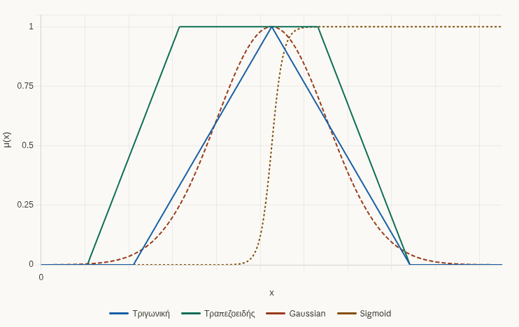
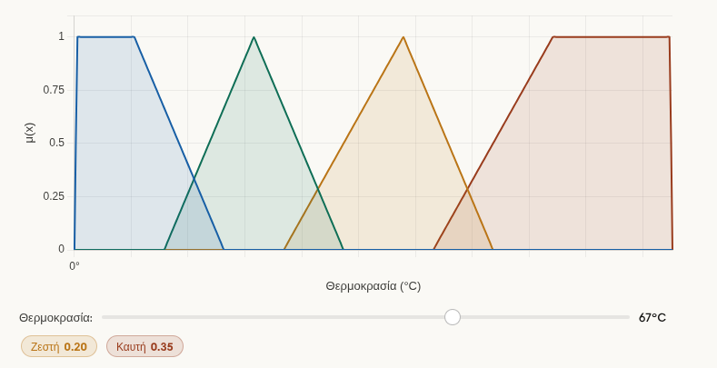
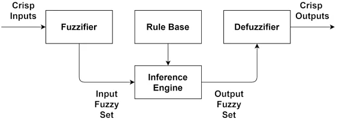
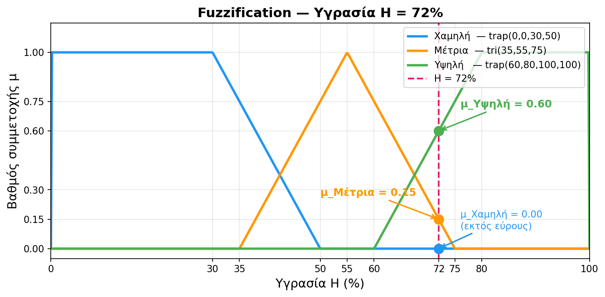
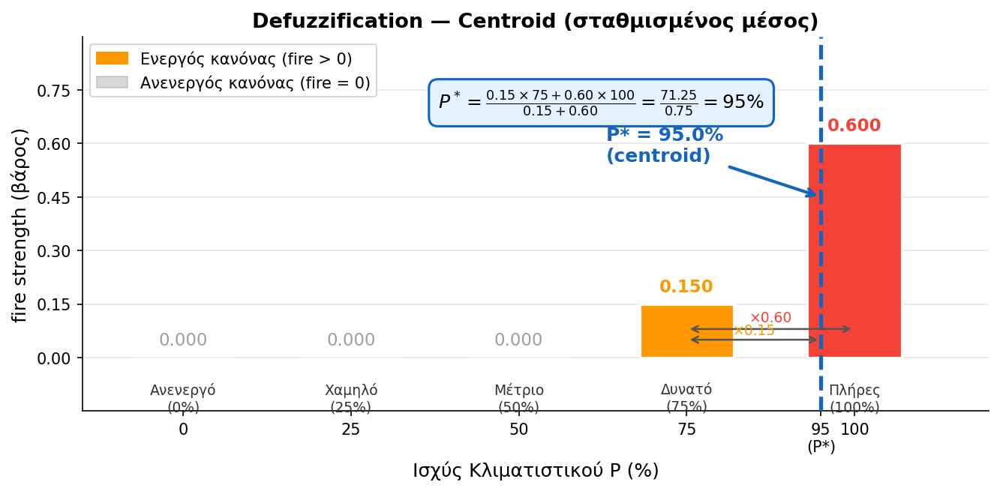
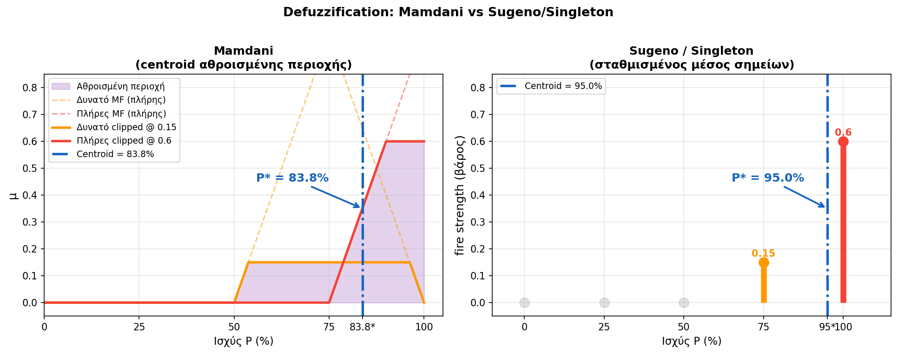
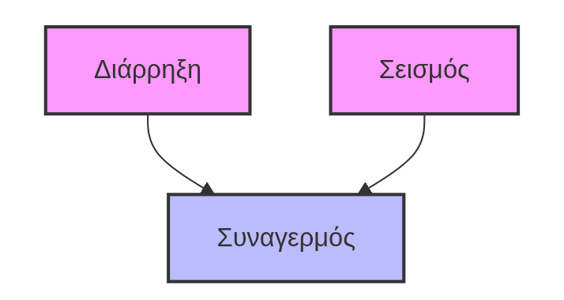
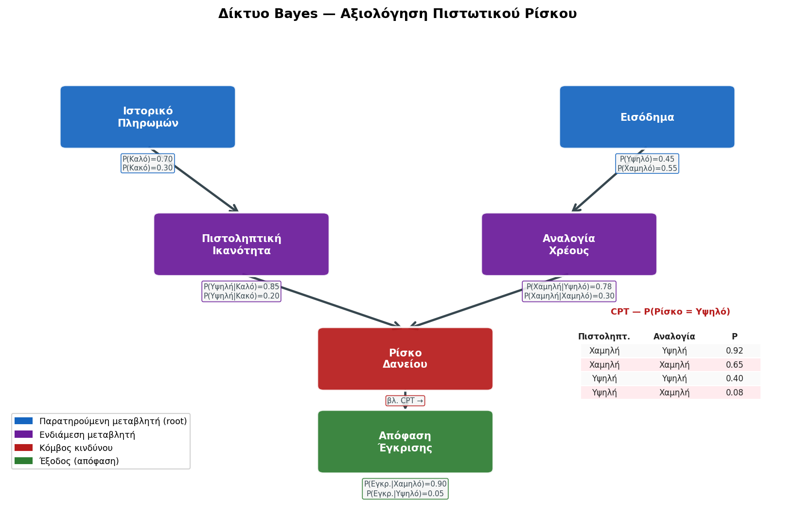
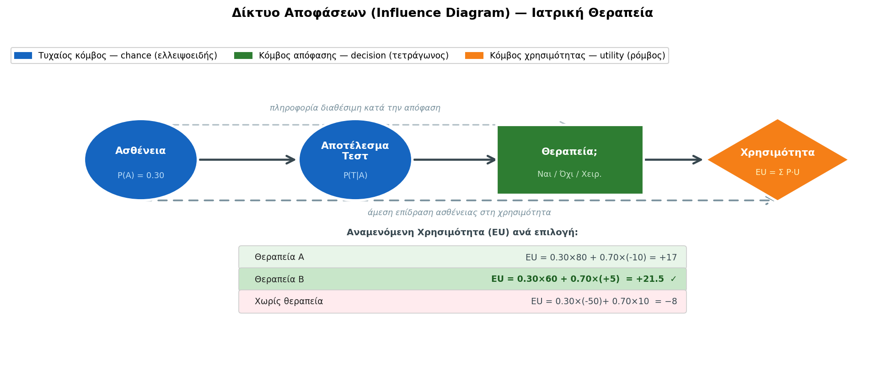

<div style="text-align:center; margin-bottom:16px;">


</div>

# Ευφυή Συστήματα και Συστήματα Υποστήριξης Αποφάσεων
**Ενότητα 5: Διαχείριση Αβεβαιότητας**
Τμήμα Μηχανικών Πληροφορικής & Υπολογιστών
Πανεπιστήμιο Δυτικής Αττικής

**Διδάσκων:** Ανάργυρος Τσαδήμας (tsadimas@uniwa.gr)

---

<!-- _class: xsmall -->
# Ενότητα 5 — Περίληψη

1. Τα όρια της κλασικής λογικής στη λήψη αποφάσεων
2. Τύποι αβεβαιότητας: στοχαστική vs. γλωσσική
3. Ασαφή Σύνολα και Συναρτήσεις Συμμετοχής
4. Γλωσσικές Μεταβλητές (π.χ. «Υψηλό Ρίσκο», «Μέτρια Τιμή»)
5. Ασαφείς Κανόνες και Μηχανισμός Συμπερασμού
6. Αποασαφοποίηση (Defuzzification)
7. Εφαρμογές Ασαφούς Λογικής
8. Θεώρημα Bayes — Ενημέρωση πεποιθήσεων
9. Δίκτυα Bayes: Δομή, Μάθηση και Συμπερασμός
10. Αλγόριθμοι Συμπερασμού (Exact & Approximate)
11. Δίκτυα Αποφάσεων (Influence Diagrams)
12. Εφαρμογές Δικτύων Bayes
13. Σύγκριση: Ασαφής Λογική vs. Δίκτυα Bayes
14. Από Κανόνες σε Δεδομένα — Naive Bayes & Neuro-Fuzzy
15. Knowledge-Driven vs. Data-Driven ΣΥΑ → *Ενότητα 6*

---

# Γιατί η Κλασική Λογική δεν Αρκεί;

Η κλασική (Αριστοτελική) λογική είναι **δυαδική**: κάθε πρόταση είναι είτε Αληθής (1) είτε Ψευδής (0).

**Πρόβλημα:**
> `ΑΝ θερμοκρασία > 38°C ΤΟΤΕ πυρετός`

* Ασθενής με 37,9°C → «Όχι πυρετός»
* Ασθενής με 38,1°C → «Πυρετός»

Η πραγματικότητα λειτουργεί με **βαθμίδες και αποχρώσεις**, όχι με ξεκάθαρα όρια.

**Δύο πηγές αβεβαιότητας στη λήψη αποφάσεων:**
* **Στοχαστική αβεβαιότητα:** Τυχαία γεγονότα με γνωστές (ή εκτιμώμενες) πιθανότητες → *Δίκτυα Bayes*.
* **Γλωσσική αβεβαιότητα:** Ασαφείς, υποκειμενικές έννοιες («υψηλό ρίσκο», «νέος πελάτης») → *Ασαφής Λογική*.

---

# Δύο Τύποι Αβεβαιότητας — Χάρτης της Ενότητας

<div class="columns">

<div>

### Στοχαστική Αβεβαιότητα
Προέρχεται από **τυχαία γεγονότα** — δεν γνωρίζουμε την έκβαση, αλλά γνωρίζουμε (ή εκτιμούμε) τις **πιθανότητές** της.

**Παραδείγματα:**
* Πιθανότητα βροχής αύριο: 70%
* Πιθανότητα ασθένειας δεδομένου συμπτώματος
* Πιθανότητα χρεοκοπίας πελάτη

**Ερώτηση:** *Τι πιθανότητα έχει X;*

**Εργαλείο:** → **Δίκτυα Bayes** *(Ενότητα 5Β)*

</div>

<div>

### Γλωσσική Αβεβαιότητα
Προέρχεται από την **ασάφεια των εννοιών** — οι λέξεις δεν έχουν σαφή όρια, αλλά **βαθμίδες** ανήκειν.

**Παραδείγματα:**
* «Το ρίσκο είναι **υψηλό**»
* «Ο πελάτης είναι **νέος**»
* «Η θερμοκρασία είναι **χαμηλή**»

**Ερώτηση:** *Σε ποιο βαθμό ισχύει X;*

**Εργαλείο:** → **Ασαφής Λογική** *(Ενότητα 5Α)*

</div>

</div>

> Η ενότητα καλύπτει και τους δύο τύπους — ξεκινάμε με την **Ασαφή Λογική**.

---

# Ασαφής Λογική (Fuzzy Logic) — Ιστορικό

**Lotfi Zadeh, 1965** — Πανεπιστήμιο Berkeley:
> *"Fuzzy Sets"* — εισαγωγή της έννοιας των ασαφών συνόλων ως επέκταση της κλασικής θεωρίας συνόλων.

**Βασική ιδέα:**
Αντί για {0, 1}, κάθε στοιχείο ανήκει σε ένα σύνολο με **βαθμό συμμετοχής** στο διάστημα [0, 1].

| Κλασική Λογική | Ασαφής Λογική |
|---|---|
| Ο Γιώργης είναι ψηλός: **Ναι / Όχι** | Ο Γιώργης είναι ψηλός: **0.75** |
| Η τιμή είναι υψηλή: **Ναι / Όχι** | Η τιμή είναι υψηλή: **0.40** |
| Το ρίσκο είναι μεγάλο: **Ναι / Όχι** | Το ρίσκο είναι μεγάλο: **0.85** |

> Η ασαφής λογική **δεν μοντελοποιεί άγνοια** — μοντελοποιεί την εγγενή ασάφεια των ανθρώπινων εννοιών. *(Zadeh, 1965; Kahraman et al., 2022)*

---

# Ασαφή Σύνολα και Συνάρτηση Συμμετοχής

**Ορισμός:**
Ένα **ασαφές σύνολο** A σε ένα σύμπαν X ορίζεται από τη **συνάρτηση συμμετοχής** $μ_A(x) ∈ [0,1]$:

* $μ_A(x) = 1$: το στοιχείο x ανήκει **πλήρως** στο A.
* $μ_A(x) = 0$: το στοιχείο x **δεν ανήκει** στο A.
* $0 < μ_A(x) < 1$: **μερική συμμετοχή** — ο βαθμός ανήκειν.

**Τυπικές μορφές συνάρτησης συμμετοχής:**

| Μορφή | Περιγραφή | Χρήση |
|---|---|---|
| **Τριγωνική** | Τρίγωνο με κορυφή στο κέντρο | Απλές κατηγορίες |
| **Τραπεζοειδής** | Επίπεδη κορυφή | Εύρη τιμών |
| **Σιγμοειδής** | Ομαλή S-καμπύλη | Σταδιακές μεταβάσεις |
| **Γκαουσιανή** | Καμπάνα | Πιο ρεαλιστική κατανομή |

*Αναλυτικά: Ross (2017), κεφ. 2–3*

---
# Συναρτήσεις Συμμετοχής


<!-- _class: small -->
* **Τριγωνική** — η απλούστερη. Ορίζεται από τρία σημεία (a, b, c) και η τιμή 1 επιτυγχάνεται μόνο στην κορυφή b.
* **Τραπεζοειδής** — επέκταση της τριγωνικής με ένα "πλατό" πλήρους συμμετοχής. Χρήσιμη όταν θέλεις μια περιοχή τιμών να θεωρείται "πλήρως μέσα" στο σύνολο (π.χ. "μέτρια θερμοκρασία").
* **Gaussian** — ομαλή και συμμετρική, χωρίς απότομα σημεία. Προτιμάται σε εφαρμογές ελέγχου (fuzzy control) γιατί η συνέχειά της διευκολύνει τα μαθηματικά.
* **Sigmoid** — μονότονα αύξουσα, ιδανική για έννοιες μιας κατεύθυνσης όπως "μεγάλο", "ακριβό", "γρήγορο". Δεν επιστρέφει ποτέ στο 0.


---

<!-- _class: xsmall -->
# Μαθηματικοί Τύποι Συναρτήσεων Συμμετοχής

**Τριγωνική** — παράμετροι: $a < b < c$

$$\mu(x) = \begin{cases} 0, & x \leq a \\ \frac{x - a}{b - a}, & a < x \leq b \\ \frac{c - x}{c - b}, & b < x < c \\ 0, & x \geq c \end{cases}$$

**Τραπεζοειδής** — παράμετροι: $a < b \leq c < d$

$$\mu(x) = \begin{cases} 0, & x \leq a \\ \frac{x - a}{b - a}, & a < x < b \\ 1, & b \leq x \leq c \\ \frac{d - x}{d - c}, & c < x < d \\ 0, & x \geq d \end{cases}$$

**Γκαουσιανή** — παράμετροι: κέντρο $c$, πλάτος $\sigma$

$$\mu(x) = e^{-\frac{(x - c)^2}{2\sigma^2}}$$

**Σιγμοειδής** — παράμετροι: κλίση $a$, κέντρο $c$

$$\mu(x) = \frac{1}{1 + e^{-a(x - c)}}$$

---

<!-- _class: xsmall -->
# Γλωσσικές Μεταβλητές




**Ορισμός:**
Μια **γλωσσική μεταβλητή** είναι μια μεταβλητή της οποίας οι τιμές είναι **λέξεις ή φράσεις** της φυσικής γλώσσας, που αντιστοιχούν σε ασαφή σύνολα. 

* Mια **γλωσσική μεταβλητή** ορίζεται από 4 συστατικά: το όνομά της (π.χ. "Θερμοκρασία"), το **σύμπαν ορισμού** (π.χ. [0°C, 100°C]), το **σύνολο των γλωσσικών τιμών/όρων** (π.χ. {Κρύα, Χλιαρή, Ζεστή, Καυτή}), και τη **συνάρτηση συμμετοχής** για κάθε τιμή.
* Κάθε **γλωσσικός όρος** αντιστοιχεί σε ένα **ασαφές σύνολο** με τη δική του **συνάρτηση συμμετοχής** — έτσι, το "Ζεστή" και το "Καυτή" μπορούν να επικαλύπτονται, ακριβώς όπως στη φυσική γλώσσα.
* Χρησιμοποιούνται ευρέως σε συστήματα ασαφούς ελέγχου (π.χ. κλιματιστικά, αυτόματα πλυντήρια, ρυθμιστές ταχύτητας) καθώς και στη λήψη αποφάσεων και στα ασαφή εμπειρογνωμονικά συστήματα.

---

<!-- _class: small -->
# Ασαφείς Κανόνες (Fuzzy Rules)

Ο ασαφής συλλογισμός εκφράζεται με κανόνες **ΑΝ–ΤΟΤΕ** με γλωσσικές μεταβλητές:

```
ΑΝ (Πιστοληπτική Ικανότητα = Χαμηλή) ΚΑΙ (Εισόδημα = Μέτριο)
ΤΟΤΕ (Ρίσκο Δανείου = Υψηλό)

ΑΝ (Πιστοληπτική Ικανότητα = Υψηλή) ΚΑΙ (Εισόδημα = Υψηλό)
ΤΟΤΕ (Ρίσκο Δανείου = Χαμηλό)
```

Για να συνδυαστούν δύο συνθήκες σε έναν κανόνα, χρειαζόμαστε **πράξεις σε ασαφή σύνολα** → επόμενη διαφάνεια.

> Ένα ασαφές σύστημα μπορεί να έχει **δεκάδες κανόνες** που λειτουργούν ταυτόχρονα, κάθε ένας με διαφορετικό βαθμό ενεργοποίησης.

---

<!-- _class: xxsmall -->
# Πράξεις σε Ασαφή Σύνολα

Στην κλασική λογική AND/OR/NOT επιστρέφουν 0 ή 1. Στην ασαφή λογική επιστρέφουν **οποιαδήποτε τιμή στο [0,1]**.

| Πράξη | Τύπος | Λογική |
|---|---|---|
| **ΚΑΙ (AND / Τομή)** | $\mu_{A \cap B}(x) = \min(\mu_A(x),\ \mu_B(x))$ | «Και τα δύο» — κρατάμε το **χαμηλότερο** |
| **Ή (OR / Ένωση)** | $\mu_{A \cup B}(x) = \max(\mu_A(x),\ \mu_B(x))$ | «Τουλάχιστον ένα» — κρατάμε το **υψηλότερο** |
| **ΌΧΙ (NOT / Συμπλήρωμα)** | $\mu_{\bar{A}}(x) = 1 - \mu_A(x)$ | «Το αντίθετο» — αναστρέφουμε τον βαθμό |

**Παράδειγμα:** δανειολήπτης με εισόδημα 1.400€ → $\mu_A(\text{Μέτριο}) = 0{,}70$ · πιστοληπτική 550 → $\mu_B(\text{Χαμηλή}) = 0{,}40$

| Πράξη | Κανόνας | Υπολογισμός | Αποτέλεσμα |
|---|---|---|---|
| **AND** | Μέτριο **ΚΑΙ** Χαμηλή | $\min(0{,}70,\ 0{,}40)$ | **0,40** ← κυριαρχεί ο αδύναμος |
| **OR** | Μέτριο **Ή** Χαμηλή | $\max(0{,}70,\ 0{,}40)$ | **0,70** ← κυριαρχεί ο ισχυρός |
| **NOT** | **ΌΧΙ** Χαμηλή (= «Καλή») | $1 - 0{,}40$ | **0,60** ← αντιστροφή |

---

# Ο Κύκλος Ασαφούς Συμπερασμού

Ένα **Σύστημα Ασαφούς Συμπερασμού (FIS)** λειτουργεί σε 3 στάδια:

**1. Ασαφοποίηση (Fuzzification):**
Μετατροπή **αριθμητικής εισόδου** σε **βαθμούς συμμετοχής** σε **γλωσσικές τιμές**.
* *Παράδειγμα:* Εισόδημα = 1.200€/μήνα → {Χαμηλό: 0.2, Μέτριο: 0.7, Υψηλό: 0.1}

**2. Εφαρμογή Κανόνων (Inference):**
Κάθε κανόνας ενεργοποιείται με βαθμό ανάλογο των εισόδων του.
* Το αποτέλεσμα κάθε κανόνα είναι ένα **ασαφές σύνολο εξόδου**.

**3. Αποασαφοποίηση (Defuzzification):**
Συνδυασμός όλων των ασαφών εξόδων σε ένα **αριθμητικό αποτέλεσμα**.
* *Μέθοδος Κέντρου Βάρους (Centroid):* η πιο συνηθισμένη.
* *Παράδειγμα:* Σκορ ρίσκου = 72.4 (σε κλίμακα 0–100)

---

# Κύκλος Ασαφούς Συμπερασμού
### Παράδειγμα βήμα-βήμα: Σύστημα Ελέγχου Κλιματιστικού

---

## Σενάριο

> Θέλουμε να φτιάξουμε ένα **ασαφές σύστημα ελέγχου** που αποφασίζει
> την **ισχύ του κλιματιστικού** με βάση δύο αισθητήρες:
> - 🌡️ Θερμοκρασία δωματίου
> - 💧 Σχετική υγρασία

**Δεδομένα εισόδου για το παράδειγμά μας:**

| Μεταβλητή | Τιμή |
|-----------|------|
| Θερμοκρασία | **34 °C** |
| Υγρασία | **72 %** |

---

## Αρχιτεκτονική του FIS



---

## Βήμα 1α — Ορισμός Γλωσσικών Μεταβλητών
<!-- _class: small -->

Πριν από οτιδήποτε άλλο, ορίζουμε **ποιους γλωσσικούς όρους** θα χρησιμοποιήσουμε.

### Μεταβλητή 1: Θερμοκρασία  `T ∈ [0°C, 45°C]`

| Όρος | Τύπος MF | Παράμετροι |
|------|----------|------------|
| Δροσερή | Τραπεζοειδής | a=0, b=0, c=18, d=26 |
| Μέτρια  | Τριγωνική    | a=20, b=27, c=34 |
| Ζεστή   | Τριγωνική    | a=28, b=34, c=40 |
| Καυτή   | Τραπεζοειδής | a=36, b=41, c=45, d=45 |

### Μεταβλητή 2: Υγρασία  `H ∈ [0%, 100%]`

| Όρος | Τύπος MF | Παράμετροι |
|------|----------|------------|
| Χαμηλή | Τραπεζοειδής | a=0, b=0, c=30, d=50 |
| Μέτρια | Τριγωνική    | a=35, b=55, c=75 |
| Υψηλή  | Τραπεζοειδής | a=60, b=80, c=100, d=100 |


---

## Βήμα 1β — Ορισμός Γλωσσικών Μεταβλητών
<!-- _class: small -->


### Μεταβλητή Εξόδου: Ισχύς Κλιματιστικού `P ∈ [0%, 100%]`

| Όρος | Αντιπροσωπευτική τιμή |
|------|----------------------|
| Ανενεργό | 0% |
| Χαμηλό   | 25% |
| Μέτριο   | 50% |
| Δυνατό   | 75% |
| Πλήρες   | 100% |

> **Αρχή σχεδιασμού — Κλειστό Σύμπαν (Closed Universe):**
> Οι ακραίοι όροι («Δροσερή», «Καυτή», «Χαμηλή», «Υψηλή») χρησιμοποιούν **τραπεζοειδή** με επίπεδο πλατό μ=1 στο όριο της κλίμακας: κάθε τιμή έξω από το «λογικό εύρος» είναι *εξίσου* ακραία — δεν έχει νόημα να μειώνεται η συμμετοχή της.
> Οι ενδιάμεσοι όροι («Μέτρια», «Ζεστή») χρησιμοποιούν **τριγωνική**: έχουν μια αιχμή βέλτιστης τιμής και η συμμετοχή μειώνεται και από τις δύο πλευρές.
---

## Βήμα 2 — Κατασκευή Rule Base
<!-- _class: small -->


<div class="columns">
<div>
Οι κανόνες εκφράζουν γνώση εμπειρογνώμονα σε φυσική γλώσσα: 

```
R1: ΑΝ T=Δροσερή ΚΑΙ H=Χαμηλή → P=Ανενεργό
R2: ΑΝ T=Δροσερή ΚΑΙ H=Υψηλή  → P=Χαμηλό
R3: ΑΝ T=Μέτρια  ΚΑΙ H=Χαμηλή → P=Χαμηλό
R4: ΑΝ T=Μέτρια  ΚΑΙ H=Μέτρια → P=Μέτριο
R5: ΑΝ T=Μέτρια  ΚΑΙ H=Υψηλή  → P=Δυνατό
R6: ΑΝ T=Ζεστή   ΚΑΙ H=Μέτρια → P=Δυνατό
R7: ΑΝ T=Ζεστή   ΚΑΙ H=Υψηλή  → P=Πλήρες
R8: ΑΝ T=Καυτή   ΚΑΙ H=Χαμηλή → P=Δυνατό
R9: ΑΝ T=Καυτή   ΚΑΙ H=Υψηλή  → P=Πλήρες
```

</div>
<div>

**Πίνακας κανόνων (Rule Matrix):**

|  | Χαμηλή H | Μέτρια H | Υψηλή H |
|--|----------|----------|---------|
| **Δροσερή T** | Ανενεργό | — | Χαμηλό |
| **Μέτρια T**  | Χαμηλό  | Μέτριο | Δυνατό |
| **Ζεστή T**   | — | Δυνατό | Πλήρες |
| **Καυτή T**   | Δυνατό | — | Πλήρες |

</div>
</div>

> **Σημείωση:** Τα κελιά με «—» αντιστοιχούν σε συνδυασμούς που ο εμπειρογνώμονας θεωρεί αμελητέους ή απίθανους. Ένα **πλήρες** rule base καλύπτει όλους τους συνδυασμούς (εδώ 4×3 = 12), ενώ ένα **ελλιπές** μπορεί να αφήσει εισόδους χωρίς ενεργό κανόνα.

---

## Βήμα 3α — Fuzzification
<!-- _class: xsmall -->

Υπολογίζουμε τον βαθμό συμμετοχής της **σαφούς εισόδου** σε κάθε γλωσσικό όρο.

### Θερμοκρασία T = 34°C

Εφαρμόζουμε κάθε συνάρτηση συμμετοχής για x = 34.

> **Συμβολισμός:** `trap(x; a,b,c,d)` = τραπεζοειδής (ανεβαίνει a→b, πλατό b–c, κατεβαίνει c→d) · `tri(x; a,b,c)` = τριγωνική (ανεβαίνει a→b, κατεβαίνει b→c)

```
μ_Δροσερή(34) = trap(34; 0,0,18,26)  = 0.000  ← εκτός εύρους
μ_Μέτρια(34)  = tri(34;  20,27,34)   = 0.000  ← ακριβώς στο c
μ_Ζεστή(34)   = tri(34;  28,34,40)   = 1.000  ← ακριβώς στην κορυφή!
μ_Καυτή(34)   = trap(34; 36,41,45,45)= 0.000  ← εκτός εύρους
```

**Αποτέλεσμα:** T=34°C ανήκει **πλήρως** στο "Ζεστή" (μ=1.0)

### Υγρασία H = 72%

```
μ_Χαμηλή(72) = trap(72; 0,0,30,50)    = 0.000  ← εκτός εύρους
μ_Μέτρια(72)  = tri(72;  35,55,75)    = 0.150  ← (75−72)/(75−55)
μ_Υψηλή(72)   = trap(72; 60,80,100,100)= 0.600  ← (72−60)/(80−60)
```

**Αποτέλεσμα:** H=72% ανήκει **μερικώς** σε Μέτρια (0.15) και Υψηλή (0.60)

---

## Βήμα 3α — Διάγραμμα Fuzzification Υγρασίας
<!-- _class: xsmall -->




- **μ_Χαμηλή(72) = 0.00** → τελειώνει στο 50%, το 72 είναι **εκτός εύρους**
- **μ_Μέτρια(72) = 0.15** → H=72 βρίσκεται στο **κατερχόμενο σκέλος** (κοντά στο c=75): (75−72)/(75−55)
- **μ_Υψηλή(72) = 0.60** → H=72 βρίσκεται στο **ανερχόμενο σκέλος** (μεταξύ a=60 και b=80): (72−60)/(80−60)

---

## Βήμα 3 — Fuzzification
<!-- _class: small -->


### Υπολογισμός μ_Μέτρια(72) βήμα-βήμα

```
tri(72; a=35, b=55, c=75):
  → 72 > 55 (είμαστε στο δεξί σκέλος)
  → μ = (c − x) / (c − b) = (75 − 72) / (75 − 55) = 3 / 20 = 0.15  ✓
```

### Υπολογισμός μ_Υψηλή(72) βήμα-βήμα

```
trap(72; a=60, b=80, c=100, d=100):
  → 72 < 80 (είμαστε στο αριστερό σκέλος)
  → μ = (x − a) / (b − a) = (72 − 60) / (80 − 60) = 12 / 20 = 0.60  ✓
```

---

## Βήμα 4 — Rule Evaluation
<!-- _class: xsmall -->

Για κάθε κανόνα υπολογίζουμε το **fire strength** με τον τελεστή AND = min. Κανόνας είναι **ενεργός** αν και μόνο αν `fire > 0`:

```
fire_i = min( μ_temp_term(T), μ_hum_term(H) )
```

| Κανόνας | μ_temp | μ_hum | fire = min(·,·) | Έξοδος |
|---------|--------|-------|-----------------|--------|
| R1: Δροσερή ∧ Χαμηλή | 0.000 | 0.000 | **0.000** | Ανενεργό |
| R2: Δροσερή ∧ Υψηλή  | 0.000 | 0.600 | **0.000** | Χαμηλό |
| R3: Μέτρια ∧ Χαμηλή  | 0.000 | 0.000 | **0.000** | Χαμηλό |
| R4: Μέτρια ∧ Μέτρια  | 0.000 | 0.150 | **0.000** | Μέτριο |
| R5: Μέτρια ∧ Υψηλή   | 0.000 | 0.600 | **0.000** | Δυνατό |
| R6: Ζεστή ∧ Μέτρια   | 1.000 | 0.150 | **0.150** ✓ | Δυνατό |
| R7: Ζεστή ∧ Υψηλή    | 1.000 | 0.600 | **0.600** ✓ | Πλήρες |
| R8: Καυτή ∧ Χαμηλή   | 0.000 | 0.000 | **0.000** | Δυνατό |
| R9: Καυτή ∧ Υψηλή    | 0.000 | 0.600 | **0.000** | Πλήρες |

> **Ενεργοί κανόνες: R6 (fire=0.150) και R7 (fire=0.600)**

---

## Βήμα 5 — Aggregation

Κάθε γλωσσικός όρος εξόδου μπορεί να παράγεται από **πολλούς κανόνες**. Κρατάμε το **μέγιστο** fire (= OR ασαφούς λογικής, παραμένει στο [0,1]):

```
μ_agg(Ανενεργό) = max(R1=0.000)                  = 0.000
μ_agg(Χαμηλό)   = max(R2=0.000, R3=0.000)        = 0.000
μ_agg(Μέτριο)   = max(R4=0.000)                  = 0.000
μ_agg(Δυνατό)   = max(R5=0.000, R6=0.150, R8=0.000) = 0.150  ← R6 κυριαρχεί
μ_agg(Πλήρες)   = max(R7=0.600, R9=0.000)        = 0.600  ← R7 κυριαρχεί
```

> **Γιατί max και όχι άθροισμα;** Αρκεί *ένας* κανόνας να υποστηρίζει ισχυρά μια κατηγορία. Το άθροισμα θα έδινε τιμές >1 (εκτός εύρους μ).

**Συνολικό βάρος:** Σ fire = 0.150 + 0.600 = **0.750**

---

## Βήμα 6 — Defuzzification (Centroid)
<!-- _class: xxsmall -->

<div align="center">

</div>

---


## Βήμα 6 — Defuzzification (Centroid)
<!-- _class: small -->

Μετά το aggregation έχουμε **βάρη** (fire strengths) για κάθε κατηγορία εξόδου — όχι ακόμα μία αριθμητική τιμή. Η defuzzification μετατρέπει αυτά τα βάρη σε **έναν αριθμό** με σταθμισμένο μέσο:

$$P^* = \frac{\sum_i \text{fire}_i \times \text{outValue}_i}{\sum_i \text{fire}_i}$$

> **$outValue_i$** — **σχεδιαστική επιλογή (singleton):** Σε αυτό το παράδειγμα οι όροι εξόδου δεν έχουν σχήμα (τρίγωνο/τραπέζιο) — είναι **μεμονωμένα σημεία** τοποθετημένα ισαπέχοντα: 0, 25, 50, 75, 100%. Το 75% για το «Δυνατό» δεν προκύπτει από κορυφή κάποιας συνάρτησης, αλλά από τον ισομερή διαμερισμό της κλίμακας [0,100] σε 4 διαστήματα. Σε **Mamdani** προσέγγιση κάθε όρος εξόδου έχει πραγματική MF (π.χ. τρίγωνο κεντραρισμένο στο 75% για «Δυνατό»), η οποία αποκόπτεται στο fire strength του κανόνα· το centroid υπολογίζεται τότε ως κέντρο βάρους ολόκληρης της αθροισμένης (union) περιοχής — βλ. σύγκριση Mamdani/Singleton παρακάτω.


Αποτέλεσμα

> Για **T = 34°C** και **H = 72%**, το κλιματιστικό θα λειτουργήσει στο **95% της ισχύος του** — το «κέντρο βάρους» κατεβάζει από 100% λόγω της συνεισφοράς του Δυνατό (0.15)

---

## Defuzzification — Mamdani vs Sugeno/Singleton
<!-- _class: xsmall -->



---

## Defuzzification — Mamdani vs Sugeno/Singleton
<!-- _class: xxsmall -->

> **Βασική διαφορά:** Στο **Mamdani** το THEN κάθε κανόνα είναι **ασαφές σύνολο** (σχήμα — τρίγωνο, τραπέζιο). Στο **Sugeno** το THEN είναι **σταθερά ή μαθηματική εξίσωση** (απλός αριθμός, χωρίς σχήμα).

| | **Mamdani** | **Sugeno / Singleton** |
|---|---|---|
| **Έξοδος κανόνα (THEN)** | Ασαφές σύνολο με σχήμα (MF) | Σταθερά ή γραμμική συνάρτηση εισόδων |
| **Defuzzification** | Centroid ολόκληρης αθροισμένης περιοχής | Σταθμισμένος μέσος σημείων |
| **Αποτέλεσμα (παράδειγμα)** | **83.8%** | **95.0%** |
| **Γιατί διαφέρουν** | Το «Δυνατό» έχει εμβαδόν από 50–100% που «τραβά» το centroid αριστερά | Χρησιμοποιεί μόνο δύο σημεία: 75 και 100 |
| **Υπολογιστική πολυπλοκότητα** | Υψηλότερη (ολοκλήρωμα) | Χαμηλή (απλή πράξη) |
| **Ερμηνευσιμότητα** | Πιστή στη γλωσσική σημασία κάθε όρου | Εξαρτάται από σχεδιαστική επιλογή singletons |
| **Κατάλληλο για** | DSS, εφαρμογές όπου η ερμηνεία μετράει | Real-time, embedded, μαθηματικά μοντέλα |

**Ποια προτιμάμε;**
- **Mamdani** → όταν η ερμηνευσιμότητα είναι κεντρική: η έξοδος αντιστοιχεί σε γλωσσικούς όρους με πραγματικό «σχήμα», ο χρήστης μπορεί να εξηγήσει το αποτέλεσμα.
- **Sugeno/Singleton** → όταν χρειαζόμαστε ταχύτητα και απλότητα — αλλά η επιλογή των singletons (π.χ. 75 vs 80 για «Δυνατό») επηρεάζει σημαντικά την έξοδο και πρέπει να αιτιολογείται.

---

## Σύνοψη — Ο Κύκλος Βήμα-Βήμα

| # | Φάση | Τι κάνουμε | Αποτέλεσμα |
|---|------|-----------|-----------|
| 1 | **Ορισμός** | Γλωσσικές μεταβλητές + MFs | Δομή του FIS |
| 2 | **Rule Base** | IF–THEN κανόνες εμπειρογνώμονα | 9 κανόνες |
| 3 | **Fuzzification** | Σαφείς τιμές → βαθμοί συμμετοχής | $μ_{Ζεστή}=1.0$,$μ_{Υψηλή}=0.60$ |
| 4 | **Rule Evaluation** | AND = min, υπολογισμός fire | R6=0.15, R7=0.60 |
| 5 | **Aggregation** | max ανά κατηγορία εξόδου | Δυνατό=0.15, Πλήρες=0.60 |
| 6 | **Defuzzification** | Centroid → σαφή τιμή | **P* = 95%** |

---

## Επιλογή Τελεστή AND

<!-- _class: xxsmall -->

Ο τελεστής AND καθορίζει το **fire strength** κάθε κανόνα. Δύο κύριες επιλογές:

| Μέθοδος | Τύπος | Ερμηνεία | Συνηθίζεται σε |
|---------|-------|----------|---------------|
| **min** (Zadeh AND) | `min(a, b)` | Το αποτέλεσμα δεν μπορεί να είναι ισχυρότερο από τον **αδύναμο κρίκο** | Mamdani (κλασικό) |
| **product** (αλγεβρικό) | `a × b` | Και οι δύο συνθήκες συνεισφέρουν — μικρή τιμή σε έστω μία **μειώνει πολύ** το αποτέλεσμα | Sugeno, neuro-fuzzy |

> Και οι δύο τελεστές μπορούν να χρησιμοποιηθούν σε Mamdani ή Sugeno — δεν ορίζουν την αρχιτεκτονική, μόνο **πόσο αυστηρά** ερμηνεύεται το AND.

**Παράδειγμα** με $μ_{Ζεστή} = 1.0$ και $μ_{Μέτρια} = 0.15$ (από το παράδειγμά μας):

| | min | product |
|--|-----|---------|
| fire R6 | min(1.0, 0.15) = **0.150** | 1.0 × 0.15 = **0.150** |

Με $μ_{Ζεστή} = 0.8$ και $μ_{Μέτρια} = 0.15$:

| | min | product |
|--|-----|---------|
| fire | min(0.8, 0.15) = **0.150** | 0.8 × 0.15 = **0.120** |

> Το **min** αγνοεί το πόσο «δυνατή» είναι η ισχυρή συνθήκη — μόνο η αδύναμη μετράει. Το **product** λαμβάνει υπόψη και τις δύο.

---

## Επιλογή Μεθόδου Defuzzification

<!-- _class: small -->

Έχουμε αθροίσει τα ασαφή αποτελέσματα. Πώς επιλέγουμε **μία σαφή τιμή**;

| Μέθοδος | Λογική | Αποτέλεσμα (Mamdani) |
|---------|--------|----------------------|
| **Centroid** | Κέντρο βάρους *ολόκληρης* της αθροισμένης περιοχής — επηρεάζεται από όλους τους ενεργούς κανόνες | **83.8%** |
| **Mean of Maximum (MoM)** | Βρες όλα τα x όπου μ είναι **μέγιστο** (εδώ μ=0.60, x∈[90,100]) → πάρε τον **μέσο** τους | (90+100)/2 = **95%** |
| **Largest of Maximum (LoM)** | Από τα ίδια x όπου μ είναι μέγιστο → πάρε το **μεγαλύτερο** | max{90…100} = **100%** |

> **Centroid:** ομαλό, συνεχές, αντανακλά όλους τους κανόνες — η πιο διαδεδομένη επιλογή.
> **MoM/LoM:** αγνοούν κανόνες με χαμηλό fire, εστιάζουν μόνο στον κυρίαρχο — πιο «αποφασιστικά» αλλά λιγότερο ευαίσθητα σε υπόλοιπες συνεισφορές.

---


<!-- _class: xsmall -->
# Εφαρμογές Ασαφούς Λογικής

| Τομέας | Εφαρμογή |
|---|---|
| **Χρηματοοικονομικά** | Αξιολόγηση πιστοληπτικής ικανότητας, αξιολόγηση ρίσκου επενδύσεων |
| **Ιατρική** | Διάγνωση ασθενειών με ασαφή συμπτώματα, δοσολογία φαρμάκων |
| **Βιομηχανία** | Έλεγχος κλιματισμού, πλυντήρια, ABS φρένα, ρομποτική |
| **Μάρκετινγκ** | Κατηγοριοποίηση πελατών («Πιστός», «Αδρανής», «Νέος») |
| **ΣΥΑ** | Αξιολόγηση εναλλακτικών με γλωσσικά κριτήρια |

**Πλεονεκτήματα:**
* Χειρίζεται φυσική γλώσσα και ανθρώπινη διαίσθηση.
* Robust σε θόρυβο και ανακριβή δεδομένα.
* Ερμηνεύσιμα αποτελέσματα — ο ειδικός καταλαβαίνει τους κανόνες.

**Περιορισμοί:**
* Οι συναρτήσεις συμμετοχής ορίζονται υποκειμενικά (από ειδικό).
* Δεν μαθαίνει αυτόματα από δεδομένα (σε αντίθεση με ML).

> Ο συνδυασμός Ασαφούς Λογικής με Νευρωνικά Δίκτυα δίνει **Νευρο-Ασαφή Συστήματα (Neuro-Fuzzy)** — μαθαίνουν τις συναρτήσεις συμμετοχής από δεδομένα.

---

# Στοχαστική Αβεβαιότητα & Θεώρημα Bayes

**Θεώρημα Bayes (Thomas Bayes, ~1763):**
Περιγράφει πώς να **ενημερώνουμε την πεποίθησή μας** για ένα γεγονός όταν λαμβάνουμε νέα στοιχεία (evidence).

$$P(A \mid B) = \frac{P(B \mid A) \cdot P(A)}{P(B)}$$

| Όρος | Ερμηνεία |
|---|---|
| **P(A)** | *Prior* — αρχική πιθανότητα του γεγονότος A |
| **P(B\|A)** | *Likelihood* — πιθανότητα να παρατηρήσουμε B, αν ισχύει A |
| **P(A\|B)** | *Posterior* — ενημερωμένη πιθανότητα A μετά την παρατήρηση B |
| **P(B)** | *Evidence* — ολική πιθανότητα του B |

> **Ουσία:** Ξεκινάμε με μια προκαταρκτική εκτίμηση (prior), παρατηρούμε νέα δεδομένα, και καταλήγουμε σε πιο ενημερωμένη εκτίμηση (posterior).

---

<!-- _class: small -->
# Παράδειγμα Bayes: Ιατρικό Τεστ

**Σενάριο:** Τεστ για σπάνια ασθένεια (επιπολασμός* 1%).
* Ευαισθησία τεστ: 95% (αν αρρωσταίνεις, το τεστ είναι θετικό με P=0.95)
* Ψευδώς θετικά: 5% (αν είσαι υγιής, το τεστ είναι θετικό με P=0.05)

**Ερώτηση:** Αν το τεστ βγει θετικό, ποια η πιθανότητα να είσαι πράγματι άρρωστος;

$$P(\text{Άρρωστος} \mid \text{Θετικό}) = \frac{0{,}95 \times 0{,}01}{0{,}95 \times 0{,}01 + 0{,}05 \times 0{,}99} \approx 16{,}1\%$$

**Ερμηνεία:**
* Παρά την υψηλή ακρίβεια του τεστ, μόνο **1 στους 6** με θετικό αποτέλεσμα είναι πράγματι άρρωστος!
* Αυτό συμβαίνει επειδή η ασθένεια είναι σπάνια (χαμηλό prior).

> Το θεώρημα Bayes αποτρέπει **υπεραντίδραση στα δεδομένα** — υπενθυμίζει να σταθμίζουμε πάντα τη βασική πιθανότητα (base rate).

*\*Επιπολασμός (prevalence): το ποσοστό του πληθυσμού που νοσεί σε δεδομένη χρονική στιγμή — αποτελεί το prior P(Άρρωστος) στον τύπο Bayes.*

---

# Δίκτυα Bayes (Bayesian Networks)

**Ορισμός:**
Ένα **Δίκτυο Bayes** είναι ένας κατευθυνόμενος ακυκλικός γράφος (DAG) που αναπαριστά τις **αιτιώδεις σχέσεις** μεταξύ τυχαίων μεταβλητών *(Pearl, 1988)*.

**Δομικά στοιχεία:**

| Στοιχείο | Περιγραφή |
|---|---|
| **Κόμβοι (Nodes)** | Τυχαίες μεταβλητές (γεγονότα, παράγοντες ρίσκου) |
| **Τόξα (Arcs)** | Αιτιώδης επιρροή: A → B σημαίνει «A επηρεάζει B» |
| **CPT** | Πίνακας Δεσμευμένης Πιθανότητας — P(κόμβος \| γονείς) |

**Χαρακτηριστικά:**
* Κωδικοποιούν **εμπειρογνωμοσύνη** (ή μαθαίνονται από δεδομένα).
* Επιτρέπουν **πρόβλεψη** (διάγνωση) και **αντίστροφο συμπερασμό** (εξήγηση).
* Ενσωματώνουν νέα στοιχεία (evidence) αυτόματα μέσω Bayesian updating.


---

# Τι είναι τα Μπαϋεσιανά Δίκτυα (Bayesian Networks);

Τα Μπαϋεσιανά Δίκτυα είναι **γραφικά πιθανοτικά μοντέλα** που αναπαριστούν ένα σύνολο μεταβλητών και τις μεταξύ τους εξαρτήσεις. Χρησιμοποιούνται ευρέως στην Τεχνητή Νοημοσύνη για τη **λήψη αποφάσεων υπό συνθήκες αβεβαιότητας**.

### Η Δομή τους (Πώς σχεδιάζονται)
Αποτελούνται από δύο βασικά συστατικά:

**1. Το Γράφημα (Κατευθυνόμενο Ακυκλικό Γράφημα - DAG):**
* **Κόμβοι (Nodes):** Κάθε κόμβος είναι μια μεταβλητή (π.χ. "Κάπνισμα", "Καρκίνος Πνεύμονα", "Βήχας").
* **Βέλη (Edges):** Δείχνουν την **αιτιώδη σχέση**. Ένα βέλος από το (Α) στο (Β) σημαίνει ότι "Το Α προκαλεί ή επηρεάζει το Β". (Το Α είναι ο *Γονέας* και το Β το *Παιδί*).


**2. Οι Πίνακες Πιθανοτήτων (CPTs - Conditional Probability Tables):**
Κάθε κόμβος συνοδεύεται από έναν πίνακα που μας λέει μαθηματικά ποια είναι η πιθανότητα να συμβεί, *δεδομένης της κατάστασης των γονιών του*.

---

# Γιατί είναι τόσο ισχυρά; (Είδη Συλλογισμού)

Το μεγάλο πλεονέκτημα των Μπαϋεσιανών Δικτύων είναι ότι μας επιτρέπουν να "ταξιδέψουμε" στο γράφημα προς οποιαδήποτε κατεύθυνση, μόλις παρατηρήσουμε ένα νέο δεδομένο (Evidence):

1. **Προς τα Εμπρός (Προβλεπτικός Συλλογισμός / Predictive):**
   * *Αιτία ➔ Αποτέλεσμα:* Ξέρω ότι ο ασθενής καπνίζει. Ποια είναι η πιθανότητα να εμφανίσει βήχα στο μέλλον; (Υπολογισμός Ρίσκου).

2. **Προς τα Πίσω (Διαγνωστικός Συλλογισμός / Diagnostic):**
   * *Αποτέλεσμα ➔ Αιτία:* Ο ασθενής ήρθε με έντονο βήχα. Ποια είναι η πιθανότητα να είναι καπνιστής ή να έχει κάποια νόσο; (Εδώ εφαρμόζεται καθαρά ο κανόνας του Bayes).

3. **Επεξηγηματική Απομάκρυνση (Explaining Away):**
   * Ο ασθενής έχει βήχα, άρα αυξάνεται η πιθανότητα να έχει καρκίνο. Ξαφνικά, μαθαίνουμε ότι έχει ένα απλό κρυολόγημα. Η πιθανότητα για καρκίνο *μειώνεται* αμέσως, διότι το κρυολόγημα "εξηγεί" από μόνο του τον βήχα!

---

# Παράδειγμα: Το Πρόβλημα του Συναγερμού (Judea Pearl)

Ο συναγερμός (Alarm) του σπιτιού ενεργοποιείται από Διάρρηξη (Burglary) ή Σεισμό (Earthquake).

### Βήμα 1: Το Γράφημα (DAG)
Δύο ανεξάρτητες αιτίες (Γονείς) οδηγούν στο ίδιο αποτέλεσμα (Παιδί).



---

# Βήμα 2: Πίνακες Πιθανοτήτων (CPTs)

**1. Αρχικές Πιθανότητες (Priors) Γονέων:**
* Πιθανότητα Διάρρηξης: P(B) = 0.001 (0.1%)
* Πιθανότητα Σεισμού: P(E) = 0.002 (0.2%)

**2. Υπό Συνθήκη Πιθανότητες Παιδιού P(A | B, E):**
* Αν **Διάρρηξη ΚΑΙ Σεισμός** ➔ Συναγερμός = 95%
* Αν **ΜΟΝΟ Διάρρηξη** ➔ Συναγερμός = 94%
* Αν **ΜΟΝΟ Σεισμός** ➔ Συναγερμός = 29%
* Αν **ΤΙΠΟΤΑ** ➔ Συναγερμός = 0.1% (Λάθος/Βραχυκύκλωμα)

---

# Βήμα 3: Συλλογισμός (Inference) στο Δίκτυο

Πώς αναπροσαρμόζονται οι πιθανότητες όταν μαθαίνουμε νέα στοιχεία:

**1. Η Διάγνωση (Diagnostic Reasoning):**
* *Δεδομένο:* Σας παίρνει ο γείτονας και σας λέει **"Χτυπάει ο συναγερμός!"**.
* *Αποτέλεσμα:* Η πιθανότητα Διάρρηξης εκτοξεύεται από το αρχικό 0.1% στο **~37%**. (Όχι 100%, γιατί υπάρχει και η πιθανότητα σεισμού ή λάθους).

**2. Επεξηγηματική Απομάκρυνση (Explaining Away):**
* *Δεδομένο:* Ανοίγετε το ραδιόφωνο και ακούτε: **"Μόλις έγινε Σεισμός!"**.
* *Αποτέλεσμα:* Επειδή ο σεισμός *εξηγεί* γιατί χτύπησε ο συναγερμός, η πιθανότητα να σας κλέβουν ταυτόχρονα πέφτει κατακόρυφα ξανά στο **~0.1%**. 

**Συμπέρασμα:** Το Μπαϋεσιανό δίκτυο μιμείται την ανθρώπινη λογική χρησιμοποιώντας αυστηρά μαθηματικά!

---


# Τι τρέχει στο παρασκήνιο; (Τα Μαθηματικά του Βήματος 3)

<!-- _class: small -->
Πώς υπολόγισε το σύστημα ότι η πιθανότητα Διάρρηξης πήγε στο ~37% όταν χτύπησε ο Συναγερμός; Χρησιμοποίησε τον **Κανόνα του Bayes**!

Ψάχνουμε την πιθανότητα: $P(Διάρρηξη | Συναγερμός)$

Ο μαθηματικός τύπος είναι:
$$P(B|A) = \frac{P(A|B) \cdot P(B)}{P(A)}$$

* **P(B):** Η αρχική πιθανότητα Διάρρηξης = **0.001** (από το Βήμα 2).
* **P(A|B):** Η πιθανότητα να χτυπήσει ο συναγερμός αν γίνει διάρρηξη. Το σύστημα ελέγχει τον πίνακα του Βήματος 2 (λαμβάνοντας υπόψη και την πιθανότητα σεισμού) και βρίσκει ότι είναι περίπου **0.94** (94%).
* **P(A):** Η συνολική πιθανότητα να χτυπήσει ο συναγερμός οποιαδήποτε μέρα (είτε από κλέφτη, είτε από σεισμό, είτε από λάθος). Ο αλγόριθμος υπολογίζει όλους τους συνδυασμούς και βρίσκει ότι είναι περίπου **0.0025** (0.25%).

**Η τελική πράξη του αλγορίθμου:**
$$P(B|A) = \frac{0.94 \cdot 0.001}{0.0025} = 0.376 \text{ ή } 37.6\%$$

Το Μπαϋεσιανό δίκτυο έκανε αυτόν τον υπολογισμό σε κλάσματα του δευτερολέπτου!

---

<!-- _class: small -->
# Παράδειγμα: Δίκτυο Bayes για Πιστωτικό Ρίσκο




---

<!-- _class: xsmall -->
# Ανάγνωση του διαγράμματος

Στο διάγραμμα υπάρχουν τρία είδη τιμών με διαφορετικό ρόλο:

**Prior** — συχνότητα στον πληθυσμό, χωρίς καμία προϋπόθεση:
* P(Καλό Ιστορικό) = 0.70 → από τους αιτούντες της τράπεζας, το 70% έχει καλό ιστορικό
* Χρησιμοποιείται **μόνο αν δεν γνωρίζουμε** την τιμή του κόμβου για τον συγκεκριμένο πελάτη

**CPT** — συχνότητα υπό συνθήκη (το **|** σημαίνει "δεδομένου ότι"):
* P(Υψηλή Πιστοληπτ. | Καλό Ιστορικό) = 0.85 → από όσους έχουν καλό ιστορικό, το 85% έχει υψηλή πιστοληπτική
* P(Ρίσκο Υψηλό | Χαμηλή Πιστοληπτ., Υψηλή Αναλογία) = 0.92 → από όσους έχουν αυτόν τον συνδυασμό, το 92% αξιολογείται ως υψηλού ρίσκου
* Χρησιμοποιείται **πάντα** — είναι οι μαθημένοι κανόνες του μοντέλου

**Posterior** — υπολογίζεται εφαρμόζοντας τις CPT στα δεδομένα του συγκεκριμένου πελάτη:
* P(Ρίσκο Υψηλό), P(Έγκριση) → **δεν δίνονται**, προκύπτουν από τον υπολογισμό

> Αν γνωρίζουμε ότι ο πελάτης έχει Ιστορικό=Κακό, το prior 0.70 **αγνοείται** — χρησιμοποιείται απευθείας η CPT: P(Πιστοληπτ.=Υψηλή | Κακό) = 0.20.

---

<!-- _class: xsmall -->
# Παράδειγμα: Πελάτης Α — Βήμα 1 (Είσοδος → Ενδιάμεσοι)

Θα εξετάσουμε δύο πελάτες για να δούμε πώς αλλάζει η απόφαση:

| | Πελάτης Α | Πελάτης Β |
|---|---|---|
| Ιστορικό Πληρωμών | **Κακό** | **Καλό** |
| Εισόδημα | **Χαμηλό** | **Υψηλό** |

Ακολουθεί ο υπολογισμός για τον **Πελάτη Α** — ο Β θα συγκριθεί στο τέλος.

**Δεδομένα εισόδου (evidence):** Ιστορικό = **Κακό**, Εισόδημα = **Χαμηλό**

Παρατηρούμε αυτές τις τιμές — δεν τις υπολογίζουμε. Το δίκτυο τις χρησιμοποιεί ως αφετηρία.

**Πιστοληπτική Ικανότητα** — εξαρτάται μόνο από το Ιστορικό:

Κοιτάμε στη CPT της Πιστοληπτικής για γονέα = Κακό:
$$P(\text{Πιστοληπτ.} = \text{Υψηλή} \mid \text{Ιστορικό} = \text{Κακό}) = \mathbf{0.20}$$
$$P(\text{Πιστοληπτ.} = \text{Χαμηλή}) = 1 - 0.20 = \mathbf{0.80}$$

**Αναλογία Χρέους** *(= μηνιαίες υποχρεώσεις / μηνιαίο εισόδημα)* — εξαρτάται μόνο από το Εισόδημα:

Κοιτάμε στη CPT της Αναλογίας για γονέα = Χαμηλό:
$$P(\text{Αναλογία} = \text{Χαμηλή} \mid \text{Εισόδημα} = \text{Χαμηλό}) = \mathbf{0.30}$$
$$P(\text{Αναλογία} = \text{Υψηλή}) = 1 - 0.30 = \mathbf{0.70}$$

> Οι δύο ενδιάμεσοι κόμβοι υπολογίζονται **ανεξάρτητα** — ο καθένας έχει έναν μόνο γονέα.

---

<!-- _class: small -->
# Παράδειγμα: Πελάτης Α — Βήμα 2α (γιατί αθροίζουμε;)

Από το Βήμα 1 δεν πήραμε μία σίγουρη τιμή — πήραμε **πιθανότητες**:
* Πιστοληπτική: 80% Χαμηλή, 20% Υψηλή
* Αναλογία: 70% Υψηλή, 30% Χαμηλή

Δεν ξέρουμε σε ποιον από τους 4 συνδυασμούς ανήκει ο πελάτης. Άρα η συνολική πιθανότητα υψηλού ρίσκου είναι το **σταθμισμένο άθροισμα** — κάθε συνδυασμός συνεισφέρει ανάλογα με το πόσο πιθανό είναι να ισχύει.

> Αν γνωρίζαμε με βεβαιότητα π.χ. Πιστοληπτική=Χαμηλή **και** Αναλογία=Υψηλή, κοιτούσαμε απλώς **μία γραμμή** της CPT: P(Ρίσκο=Υψηλό) = 0.92 — τελειωμένο. Επειδή όμως έχουμε πιθανότητες, πρέπει να σταθμίσουμε όλες τις γραμμές.

---

<!-- _class: xsmall -->
# Παράδειγμα: Πελάτης Α — Βήμα 2β (υπολογισμός)

Για κάθε συνδυασμό: *πιθανότητα συνδυασμού* × *CPT ρίσκου για αυτόν τον συνδυασμό*:

| Πιστοληπτ. | Αναλογία | P(Πιστ.) × P(Αναλ.) | × P(Ρίσκο=Υψ \| CPT) | = συνεισφορά |
|---|---|---|---|---|
| Χαμηλή | Υψηλή | 0.80 × 0.70 = 0.56 | 0.92 | **0.5152** |
| Χαμηλή | Χαμηλή | 0.80 × 0.30 = 0.24 | 0.65 | 0.1560 |
| Υψηλή | Υψηλή | 0.20 × 0.70 = 0.14 | 0.40 | 0.0560 |
| Υψηλή | Χαμηλή | 0.20 × 0.30 = 0.06 | 0.08 | 0.0048 |
| | | | **Άθροισμα →** | **0.7320** |

* P(Πιστ.) και P(Αναλ.) → από **Βήμα 1** (CPT με evidence εισόδου)
* 0.92 / 0.65 / 0.40 / 0.08 → **δίνονται** από την CPT του Ρίσκου

Ο πρώτος συνδυασμός κυριαρχεί γιατί είναι και ο πιο πιθανός (56%) και έχει την υψηλότερη CPT (0.92).

$$P(\text{Ρίσκο} = \text{Υψηλό}) = \mathbf{73.2\%}, \quad P(\text{Ρίσκο} = \text{Χαμηλό}) = 26.8\%$$

---

<!-- _class: xsmall -->
# Παράδειγμα: Πελάτης Α — Βήμα 3 (Ρίσκο → Απόφαση)

Από το Βήμα 2 ξέρουμε: P(Ρίσκο=Υψηλό) = **0.732**, P(Ρίσκο=Χαμηλό) = **0.268**

Ο κόμβος Έγκρισης έχει έναν μόνο γονέα (Ρίσκο), οπότε κοιτάμε τη CPT του:
* P(Έγκριση | Ρίσκο=Χαμηλό) = **0.90** — αν το ρίσκο είναι χαμηλό, η τράπεζα εγκρίνει σχεδόν πάντα
* P(Έγκριση | Ρίσκο=Υψηλό) = **0.05** — αν το ρίσκο είναι υψηλό, σπάνια εγκρίνει

Δεν ξέρουμε με βεβαιότητα αν το ρίσκο είναι υψηλό ή χαμηλό — ξέρουμε πιθανότητες. Άρα σταθμίζουμε και τις δύο περιπτώσεις:

$$P(\text{Έγκριση}) = \underbrace{0.90 \times 0.268}_{\text{αν Ρίσκο=Χαμηλό}} + \underbrace{0.05 \times 0.732}_{\text{αν Ρίσκο=Υψηλό}} = 0.241 + 0.037 = \mathbf{0.278 \ (27.8\%)}$$

Το δεύτερο σκέλος (0.037) είναι μικρό παρότι το υψηλό ρίσκο είναι πιο πιθανό (73.2%), γιατί η CPT έγκρισης για υψηλό ρίσκο είναι πολύ χαμηλή (0.05).

**Σύνολο ροής — Πελάτης Α vs Β:**

| | Πελάτης Α (Κακό / Χαμηλό) | Πελάτης Β (Καλό / Υψηλό) |
|---|---|---|
| P(Πιστοληπτ.=Υψηλή) | 0.20 | 0.85 |
| P(Αναλογία=Χαμηλή) | 0.30 | 0.78 |
| P(Ρίσκο=Υψηλό) | 73.2% | 23.4% |
| **P(Έγκριση)** | **27.8%** | **70.1%** |

---

<!-- _class: small -->
# Συμπερασμός σε Δίκτυα Bayes

**Δύο κατευθύνσεις συμπερασμού:**

**Πρόβλεψη (Predictive / Top-Down):**
* Γνωρίζω τις αιτίες → υπολογίζω την πιθανότητα του αποτελέσματος.
* *Παράδειγμα:* Γνωρίζω το ιστορικό πληρωμών → ποιο το ρίσκο δανείου;

**Διάγνωση (Diagnostic / Bottom-Up):**
* Παρατηρώ το αποτέλεσμα → αναζητώ τις πιθανές αιτίες.
* *Παράδειγμα:* Ο δανειολήπτης αθέτησε → ποιο ήταν το πιθανότερο πρόβλημα;

**Εφαρμογές Δικτύων Bayes:**

| Τομέας | Εφαρμογή |
|---|---|
| **Ιατρική** | Δεδομένων συμπτωμάτων → κατάταξη πιθανών ασθενειών κατά πιθανότητα |
| **Χρηματοδότηση** | Αξιολόγηση πιστωτικού ρίσκου, ανίχνευση απάτης |
| **Βιομηχανία** | Διάγνωση βλαβών, προγνωστική συντήρηση |
| **ΣΥΑ** | Λήψη αποφάσεων υπό αβεβαιότητα με ενσωμάτωση νέων πληροφοριών |

---

<!-- _class: xxsmall -->
# Μάθηση Δικτύων Bayes

Για να χρησιμοποιήσουμε ένα BN πρέπει να απαντήσουμε δύο ερωτήματα: **ποιοι κόμβοι συνδέονται;** και **με ποιες τιμές CPT;** Στην πράξη: ο ειδικός ορίζει τη **δομή** (ποιο επηρεάζει τι), τα δεδομένα εκπαιδεύουν τις **παραμέτρους** (κατά πόσο). *(Koller & Friedman, 2009)

**Μάθηση Δομής** — ποιοι κόμβοι συνδέονται και με ποια κατεύθυνση (βέλη):

| Μέθοδος | Ετυμολογία | Πώς λειτουργεί | Πότε χρησιμοποιείται |
|---|---|---|---|
| **Εμπειρογνώμονας** | — | Ο ειδικός σχεδιάζει χειροκίνητα τον γράφο | Όταν η αιτιότητα είναι γνωστή (π.χ. ιατρική) |
| **Score-based** | *score* = βαθμολογία δομής | Δοκιμάζει δομές, κρατά αυτή με τη μεγαλύτερη βαθμολογία (π.χ. BIC = πόσο καλά εξηγεί τα δεδομένα) | Όταν έχουμε πολλά δεδομένα |
| **Constraint-based** | *constraint* = περιορισμός ανεξαρτησίας | Ελέγχει ποιες μεταβλητές είναι στατιστικά ανεξάρτητες και χτίζει τον γράφο χωρίς βέλη μεταξύ τους | Μεγάλα datasets με άγνωστες σχέσεις |

**Μάθηση Παραμέτρων** — εφόσον η δομή είναι γνωστή, εκτίμηση των τιμών CPT από δεδομένα:

| Μέθοδος | Ετυμολογία | Πώς λειτουργεί |
|---|---|---|
| **MLE** | *Maximum Likelihood Estimation* — εκτίμηση μέγιστης πιθανοφάνειας | Μετράει συχνότητες: από 1.000 πελάτες με κακό ιστορικό, οι 200 είχαν υψηλή πιστοληπτική → CPT = 0.20 |
| **Bayesian estimation** | Εκτίμηση με τον κανόνα Bayes | Συνδυάζει τις συχνότητες των δεδομένων με prior εκτίμηση του ειδικού — χρήσιμο όταν τα δεδομένα είναι λίγα |
| **EM algorithm** | *Expectation-Maximization* — εναλλαγή εκτίμησης και μεγιστοποίησης | Συμπληρώνει εκτιμητικά τις ελλιπείς εγγραφές και επαναεκτιμά τις CPT, επαναληπτικά |


---

<!-- _class: xxsmall -->
# Αλγόριθμοι Συμπερασμού σε Δίκτυα Bayes

Στο παράδειγμα πιστωτικού ρίσκου υπολογίσαμε τις posteriors χειροκίνητα (5 κόμβοι, 4 συνδυασμοί). Σε πραγματικά δίκτυα με δεκάδες κόμβους και εκατοντάδες συνδυασμούς αυτό είναι αδύνατο — χρειαζόμαστε αλγορίθμους.

**Ακριβής Συμπερασμός** — δίνει την εξακριβωμένη απάντηση:

| Αλγόριθμος | Ιδέα | Πότε χρησιμοποιείται |
|---|---|---|
| **Variable Elimination** | Αθροίζει τους κόμβους έναν-έναν με τη σωστή σειρά, μειώνοντας βήμα-βήμα το πρόβλημα — ακριβώς αυτό κάναμε χειροκίνητα στο Βήμα 2 | Μικρά/μεσαία δίκτυα, ένα ερώτημα |
| **Junction Tree** | Ανασχηματίζει το δίκτυο σε δέντρο, υπολογίζει μία φορά και επαναχρησιμοποιεί τα ενδιάμεσα αποτελέσματα | Πολλαπλά ερωτήματα στο ίδιο δίκτυο |

Ο ακριβής συμπερασμός γίνεται βαρύς όσο μεγαλώνει το δίκτυο — σε πυκνά δίκτυα ο χρόνος εκτοξεύεται εκθετικά.

**Προσεγγιστικός Συμπερασμός** — καλή εκτίμηση όταν ο ακριβής είναι πρακτικά αδύνατος:

| Αλγόριθμος | Ιδέα |
|---|---|
| **Monte Carlo sampling** | Παράγει χιλιάδες τυχαία σενάρια (τιμές για όλους τους κόμβους) και μετράει πόσο συχνά εμφανίζεται το αποτέλεσμα που ζητάμε |
| **Likelihood weighting** | Όπως το Monte Carlo, αλλά τα σενάρια που συμφωνούν με το evidence λαμβάνουν μεγαλύτερο βάρος — πιο αποδοτικό |
| **Loopy Belief Propagation** | Κάθε κόμβος ανταλλάσει "μηνύματα" με τους γείτονές του επαναληπτικά μέχρι οι εκτιμήσεις να σταθεροποιηθούν |

> Στην πράξη δεν επιλέγουμε αλγόριθμο χειροκίνητα — εργαλεία όπως pgmpy και Netica επιλέγουν αυτόματα. *(Darwiche, 2009)*

---


# Εφαρμογή στην Τεχνητή Νοημοσύνη: Φίλτρα Spam (Naïve Bayes)
<!-- _class: xsmall -->
Πώς το email σας (π.χ. το Gmail) ξέρει ποια μηνύματα πρέπει να πάνε στα "Ανεπιθύμητα"; Δεν έχει "μαγικές" λέξεις, αλλά χρησιμοποιεί το **Θεώρημα του Bayes**!

**1. Η Εκπαίδευση (Training):**
Το σύστημα διαβάζει εκατομμύρια παλιά emails που οι χρήστες έχουν μαρκάρει ως Spam ή Κανονικά (Ham). Υπολογίζει στατιστικά:
* Πόσο συχνά εμφανίζεται η λέξη "ΔΩΡΕΑΝ" στα Spam; (π.χ. $P(\text{ΔΩΡΕΑΝ}|\text{Spam}) = 80\%$)
* Πόσο συχνά εμφανίζεται στα κανονικά emails; (π.χ. $P(\text{ΔΩΡΕΑΝ}|\text{Κανονικό}) = 5\%$)

**2. Η Εφαρμογή (Inference):**
Όταν έρχεται ένα νέο email, το σύστημα ψάχνει την Εκ των Υστέρων Πιθανότητα (Posterior): **Ποια είναι η πιθανότητα το email να είναι Spam, δεδομένων των λέξεων που περιέχει;**
$$P(\text{Spam} | \text{Λέξεις}) = \frac{P(\text{Λέξεις} | \text{Spam}) \cdot P(\text{Spam})}{P(\text{Λέξεις})}$$

**3. Γιατί "Αφελής" (Naïve);**
Ο αλγόριθμος πολλαπλασιάζει τις πιθανότητες κάθε λέξης, κάνοντας την "αφελή" μαθηματική υπόθεση ότι **κάθε λέξη είναι εντελώς ανεξάρτητη από τις άλλες**. Παρά την απλοϊκή αυτή παραδοχή, είναι αστραπιαία γρήγορος και έχει ακρίβεια που ξεπερνά το 95%!

---

<!-- _class: small -->
# Δίκτυα Αποφάσεων (Influence Diagrams)

Ένα BN περιγράφει **τι είναι πιθανό** — αλλά δεν απαντά στο ερώτημα **τι πρέπει να κάνω**. Τα Influence Diagrams επεκτείνουν το BN με δύο νέους τύπους κόμβων:

| Κόμβος | Σχήμα | Ρόλος |
|---|---|---|
| **Τυχαίος** (chance) | Έλλειψη | Αβέβαιο γεγονός — όπως στο κανονικό BN |
| **Απόφασης** (decision) | Ορθογώνιο | Επιλογή που ελέγχει ο αποφασίζων (π.χ. ποια θεραπεία) |
| **Χρησιμότητας** (utility) | Ρόμβος | Αριθμητική αξία κάθε έκβασης (π.χ. ποιότητα ζωής, κόστος) |

Ο στόχος: επιλέξτε την απόφαση που **μεγιστοποιεί την αναμενόμενη χρησιμότητα** (EU = Σ πιθανότητα × αξία).


---

<!-- _class: small -->
# Δίκτυα Αποφάσεων (Influence Diagrams)

 
---

---

<!-- _class: xsmall -->
# Δίκτυα Αποφάσεων — Ανάγνωση του παραδείγματος

**Σενάριο:** Δεν ξέρουμε αν ο ασθενής έχει την ασθένεια. Έχουμε αποτέλεσμα τεστ. Τι θεραπεία επιλέγουμε;

**Τι δίνεται — πίνακας χρησιμότητας** (αξία κάθε συνδυασμού *απόφασης × πραγματικής κατάστασης*):

| | Ασθένεια = T (30%) | Ασθένεια = F (70%) |
|---|---|---|
| Θεραπεία Α | +80 (θεραπεύει αποτελεσματικά) | −10 (παρενέργειες χωρίς λόγο) |
| Θεραπεία Β | +60 (θεραπεύει μέτρια) | +5 (ήπια, σχεδόν ακίνδυνη) |
| Χωρίς θεραπεία | −50 (ασθένεια εξελίσσεται) | +10 (αποφύγαμε περιττή θεραπεία) |

Δεν ξέρουμε σε ποια στήλη ανήκει ο ασθενής — οπότε σταθμίζουμε και τις δύο με τις πιθανότητές τους:

**EU = P(Ασθένεια=T) × U(T) + P(Ασθένεια=F) × U(F)**

| Επιλογή | EU = 0.30 × U(T) + 0.70 × U(F) | Αποτέλεσμα |
|---|---|---|
| Θεραπεία Α | 0.30×(+80) + 0.70×(−10) = 24 − 7 | **+17** |
| Θεραπεία Β | 0.30×(+60) + 0.70×(+5) = 18 + 3.5 | **+21.5** ✓ |
| Χωρίς θεραπεία | 0.30×(−50) + 0.70×(+10) = −15 + 7 | **−8** |

> Επιλέγεται η **Θεραπεία Β** — όχι γιατί είναι η καλύτερη αν ο ασθενής *είναι* σίγουρα άρρωστος (εκεί η Α δίνει +80), αλλά γιατί είναι η ασφαλέστερη επιλογή **υπό αβεβαιότητα**: αν ο ασθενής δεν είναι άρρωστος (70% πιθανότητα), η Α τον βλάπτει (−10) ενώ η Β δεν τον επιβαρύνει (+5).

---

<!-- _class: xsmall -->
# Δίκτυα Αποφάσεων — Τι αλλάζει με το αποτέλεσμα τεστ;

Η ανάλυση προηγουμένως χρησιμοποίησε μόνο το prior (0.30/0.70). Αλλά το διάγραμμα περιέχει κι έναν κόμβο **Αποτέλεσμα Τεστ** — αν το λάβουμε υπόψη, οι πιθανότητες ενημερώνονται μέσω Bayes.

Υποθέτουμε: P(Τεστ=+ | Ασθ.=T) = 0.90,  P(Τεστ=+ | Ασθ.=F) = 0.15

**Αν το τεστ βγει θετικό (+):**
$$P(\text{Ασθ.}=T \mid +) = \frac{0.90 \times 0.30}{0.90 \times 0.30 + 0.15 \times 0.70} = \frac{0.27}{0.375} = \mathbf{0.72}$$

| Επιλογή | EU = 0.72×U(T) + 0.28×U(F) | Αποτέλεσμα |
|---|---|---|
| Θεραπεία Α | 0.72×80 + 0.28×(−10) = 57.6 − 2.8 | **+54.8** ✓ |
| Θεραπεία Β | 0.72×60 + 0.28×5 = 43.2 + 1.4 | **+44.6** |
| Χωρίς θεραπεία | 0.72×(−50) + 0.28×10 | **−33.2** |

**Αν το τεστ βγει αρνητικό (−):** P(Ασθ.=T | −) ≈ 0.05 → η Β παραμένει καλύτερη (EU=+7.6).

> **Συμπέρασμα:** Το Influence Diagram αλλάζει αυτόματα την **βέλτιστη απόφαση** ανάλογα με το evidence: θετικό τεστ → Θεραπεία Α, αρνητικό τεστ → Θεραπεία Β. Αυτό δεν μπορεί να γίνει με απλούς if/else κανόνες.

---

<!-- _class: xsmall -->
# Εφαρμογές Δικτύων Bayes στην Πράξη

| Τομέας | Εφαρμογή | Περιγραφή |
|--------|----------|-----------|
| **Spam Filtering** | Naive Bayes classifier | Κατηγοριοποίηση email βάσει πιθανότητας λέξεων σε spam/ham |
| **Ιατρική Διάγνωση** | Σύστημα QMR-DT | Δίκτυο με 600+ ασθένειες και 4.000+ συμπτώματα |
| **Προγνωστική Συντήρηση** | Predictive maintenance | Πρόβλεψη βλαβών μηχανημάτων βάσει αισθητήρων |
| **Supply Chain** | Εκτίμηση ρίσκου | Μοντελοποίηση εξαρτήσεων προμηθευτών και κινδύνων |
| **Ασφάλεια Δικτύων** | Ανίχνευση εισβολών | Συσχέτιση γεγονότων (logs, traffic) για αναγνώριση απειλών |
| **Αυτοκίνηση** | ADAS / Αυτόνομη οδήγηση | Σύντηξη αισθητήρων (κάμερα, LiDAR, radar) υπό αβεβαιότητα |

**Γιατί είναι δημοφιλή τα BN;**
* **Ερμηνευσιμότητα** — ο γράφος δείχνει ξεκάθαρα τις αιτιώδεις σχέσεις
* **Ενσωμάτωση γνώσης** — συνδυάζουν expert knowledge + δεδομένα
* **Ενημέρωση σε πραγματικό χρόνο** — νέο evidence → αυτόματο update
* **Λειτουργούν με λίγα δεδομένα** — χάρη στα informative priors

*Βλ. Sharda, Delen & Turban (2020), κεφ. 8–9*

---

<!-- _class: small -->
# Σύγκριση: Ασαφής Λογική vs. Δίκτυα Bayes

| Χαρακτηριστικό | Ασαφής Λογική | Δίκτυα Bayes |
|---|---|---|
| **Τύπος αβεβαιότητας** | Γλωσσική / υποκειμενική | Στοχαστική / πιθανοτική |
| **Αναπαράσταση** | Συναρτήσεις συμμετοχής, κανόνες | Γράφος + πίνακες πιθανοτήτων (CPT) |
| **Δεδομένα** | Εμπειρογνωμοσύνη (ορισμός κανόνων) | Ιστορικά δεδομένα ή εμπειρογνωμοσύνη |
| **Ερμηνευσιμότητα** | Πολύ υψηλή (ανθρώπινοι κανόνες) | Υψηλή (γραφική δομή) |
| **Ενσωμάτωση νέων δεδομένων** | Δύσκολη | Αυτόματη (Bayesian updating) |
| **Αιτιώδης συλλογισμός** | Όχι | Ναι |
| **Τυπική χρήση σε ΣΥΑ** | Αξιολόγηση ποιοτικών κριτηρίων | Διάγνωση, πρόβλεψη υπό ρίσκο |

> **Συμπέρασμα:** Οι δύο προσεγγίσεις είναι **συμπληρωματικές**. Ένα σύγχρονο ΣΥΑ μπορεί να χρησιμοποιεί Ασαφή Λογική για την αξιολόγηση ποιοτικών εισόδων και Δίκτυα Bayes για τον υπολογισμό πιθανοτήτων αποτελέσματος.

---

<!-- _class: small -->
# Από Κανόνες σε Δεδομένα — Τα Όρια της Εμπειρογνωμοσύνης

Στην Ενότητα 5 είδαμε δύο **knowledge-driven** προσεγγίσεις:

| | Ασαφής Λογική | Δίκτυα Bayes |
|--|---|---|
| **Πηγή γνώσης** | Εμπειρογνώμονας ορίζει κανόνες | Εμπειρογνώμονας ή/και δεδομένα |
| **Πλεονέκτημα** | Ερμηνεύσιμη, διαφανής | Αυτόματη ενημέρωση με evidence |

**Τι γίνεται όμως όταν:**
* Δεν υπάρχει διαθέσιμος εμπειρογνώμονας;
* Τα δεδομένα είναι χιλιάδες ή εκατομμύρια εγγραφές;
* Τα patterns είναι πολύπλοκα για χειροκίνητη κωδικοποίηση;
* Θέλουμε το σύστημα να **βελτιώνεται αυτόματα** με νέα δεδομένα;

> **Απάντηση → Μηχανική Μάθηση (Machine Learning):** Αντί ο άνθρωπος να γράφει κανόνες, ο αλγόριθμος τους **ανακαλύπτει μόνος του** από τα δεδομένα.

---

<!-- _class: xxsmall -->
# Naive Bayes — Η Γέφυρα από BN σε ML

Ο **Naive Bayes classifier** βασίζεται στον κανόνα Bayes, εφαρμοσμένο σε πολλαπλά χαρακτηριστικά ταυτόχρονα.

Ο κανόνας Bayes για κλάση C και χαρακτηριστικά $x_1, x_2, \ldots, x_n$:
$$P(C \mid x_1,\ldots,x_n) = \frac{P(x_1,\ldots,x_n \mid C)\cdot P(C)}{P(x_1,\ldots,x_n)}$$

Το πρόβλημα: P(x₁, x₂, … xₙ | C) απαιτεί να γνωρίζουμε **όλους τους συνδυασμούς** — αδύνατο για χιλιάδες λέξεις. Η "αφελής" λύση: υποθέτουμε ότι κάθε λέξη είναι **ανεξάρτητη** από τις άλλες:
$$P(x_1,\ldots,x_n \mid C) \approx \prod_{i=1}^{n} P(x_i \mid C)$$

Οπότε ο τύπος γίνεται (αγνοούμε τον παρονομαστή γιατί είναι ίδιος για όλες τις κλάσεις):
$$P(C \mid x_1,\ldots,x_n) \propto P(C) \cdot \prod_{i=1}^{n} P(x_i \mid C)$$

**Παράδειγμα:** email με "δωρεάν" και "κέρδισε", P(Spam)=P(Ham)=0.50:
$$P(\text{Spam} \mid \text{email}) \propto \underbrace{0.50}_{P(\text{Spam})} \cdot \underbrace{0.80}_{P(\text{δωρεάν}|\text{Spam})} \cdot \underbrace{0.70}_{P(\text{κέρδισε}|\text{Spam})} = 0.28$$
$$P(\text{Ham} \mid \text{email}) \propto \underbrace{0.50}_{P(\text{Ham})} \cdot \underbrace{0.05}_{P(\text{δωρεάν}|\text{Ham})} \cdot \underbrace{0.02}_{P(\text{κέρδισε}|\text{Ham})} = 0.0005$$

**Κανονικοποίηση** (ώστε να αθροίζουν σε 1): $P(\text{Spam}) = \frac{0.28}{0.28+0.0005} \approx$ **99.8%** → Spam.


---

<!-- _class: small -->
# Neuro-Fuzzy — Υβριδικά Συστήματα

Τι γίνεται αν θέλουμε **ερμηνευσιμότητα** (fuzzy rules) αλλά και **αυτόματη μάθηση** (neural networks);

**Neuro-Fuzzy = Ασαφής Λογική + Νευρωνικά Δίκτυα**

```
                    ┌──────────────────────────┐
  Δεδομένα ───→     │  Νευρωνικό Δίκτυο        │ ───→  Βελτιστοποιημένες
  εκπαίδευσης       │  (εκπαίδευση παραμέτρων) │       συναρτήσεις συμμετοχής
                    └──────────────────────────┘       & βάρη κανόνων
```

**Πώς λειτουργεί (ANFIS — Adaptive Neuro-Fuzzy Inference System):**
1. Ο ειδικός ορίζει την **αρχική δομή** (γλωσσικές μεταβλητές, κανόνες)
2. Το νευρωνικό δίκτυο **βελτιστοποιεί** τις παραμέτρους (a, b, c τριγωνικής κ.λπ.) από δεδομένα
3. Το αποτέλεσμα παραμένει **ερμηνεύσιμο** — εξακολουθούν να υπάρχουν IF-THEN κανόνες

| Πλεονέκτημα | Μειονέκτημα |
|-------------|-------------|
| Ερμηνεύσιμοι κανόνες | Χρειάζεται αρχική δομή |
| Μαθαίνει από δεδομένα | Κίνδυνος overfitting |
| Καλύτερη ακρίβεια από «καθαρό» FIS | Πιο σύνθετο σε εκπαίδευση |

*(Jang, 1993; Norouzi et al., 2023)*

---

<!-- _class: small -->
# Knowledge-Driven vs. Data-Driven ΣΥΑ

| | **Knowledge-Driven** | **Data-Driven** | **Υβριδικά** |
|--|---|---|---|
| **Παραδείγματα** | Fuzzy Logic, Expert BN | ML (Naive Bayes, Decision Trees, Neural Nets) | Neuro-Fuzzy, BN learned from data |
| **Πηγή γνώσης** | Εμπειρογνώμονας | Ιστορικά δεδομένα | Εμπειρογνώμονας + δεδομένα |
| **Ανάγκη δεδομένων** | Ελάχιστη | Μεγάλη | Μέτρια |
| **Ερμηνευσιμότητα** | Υψηλή | Χαμηλή–Μέτρια | Μέτρια–Υψηλή |
| **Προσαρμοστικότητα** | Χειροκίνητη | Αυτόματη | Αυτόματη |
| **Ακρίβεια** | Εξαρτάται από ειδικό | Αυξάνει με δεδομένα | Καλός συμβιβασμός |
| **Χρήση σε ΣΥΑ** | Κριτήρια ποιότητας, ρυθμιστικά | Πρόβλεψη, κατηγοριοποίηση | Έλεγχος, διάγνωση |

> **Στην Ενότητα 6** θα εξερευνήσουμε τα **Data-Driven ΣΥΑ**: πώς αλγόριθμοι ML (δέντρα αποφάσεων, νευρωνικά δίκτυα, ensemble methods) μαθαίνουν να προβλέπουν και να κατηγοριοποιούν αυτόματα — και πώς ενσωματώνονται σε συστήματα υποστήριξης αποφάσεων.

---

<!-- _class: small -->
# Σύνοψη — Βασικά Συμπεράσματα

| # | Έννοια | Σύντομη υπενθύμιση |
|---|---|---|
| 1 | Γλωσσική αβεβαιότητα | Ασαφής Λογική — μοντελοποίηση ανθρώπινων εννοιών με βαθμούς αλήθειας |
| 2 | Στοχαστική αβεβαιότητα | Δίκτυα Bayes — ενημέρωση πιθανοτήτων (prior → posterior) με νέα δεδομένα |
| 3 | Συνάρτηση συμμετοχής | Βαθμός ανήκειν στο [0,1] — ένα στοιχείο μπορεί να ανήκει μερικώς σε πολλούς όρους |
| 4 | FIS κύκλος | Ασαφοποίηση → Κανόνες (AND=min/product) → Aggregation (max) → Αποασαφοποίηση |
| 5 | Mamdani vs Sugeno | THEN = ασαφές σύνολο (Mamdani) vs σταθερά/εξίσωση (Sugeno) — διαφορετικό αποτέλεσμα |
| 6 | CPT | Πίνακας δεσμευμένων πιθανοτήτων — συχνότητα παρατήρησης κόμβου δεδομένου γονέα |
| 7 | Prior vs Posterior | Prior = συχνότητα πληθυσμού (δίνεται), Posterior = υπολογίζεται για συγκεκριμένο instance |
| 8 | Explaining Away | Νέο evidence «εξηγεί» ήδη γνωστό αποτέλεσμα → μειώνει πιθανότητα άλλης αιτίας |
| 9 | Influence Diagrams | BN + κόμβοι απόφασης + χρησιμότητα → επιλογή που μεγιστοποιεί EU |
| 10 | Naive Bayes | P(C|x₁…xₙ) ∝ P(C)·∏P(xᵢ|C) — αυτόματη μάθηση από labeled δεδομένα |
| 11 | Neuro-Fuzzy | Ερμηνευσιμότητα Fuzzy + αυτόματη βελτιστοποίηση παραμέτρων από δεδομένα |
| 12 | Knowledge vs Data-driven | Συμπληρωματικές — το ένα δεν αντικαθιστά το άλλο |

---

<!-- _class: xxsmall -->
# Βιβλιογραφία & Προτεινόμενη Ανάγνωση

**Κλασικά / θεμελιώδη:**
- Zadeh, L.A. (1965). Fuzzy sets. *Information and Control*, 8(3), 338–353. — Το πρωτότυπο άρθρο που εισήγαγε την ασαφή λογική.
- Pearl, J. (1988). *Probabilistic Reasoning in Intelligent Systems.* Morgan Kaufmann. — Το θεμελιώδες βιβλίο των BN, από τον δημιουργό του παραδείγματος συναγερμού.
- Jang, J.-S.R. (1993). ANFIS: Adaptive-Network-Based Fuzzy Inference System. *IEEE Trans. on Systems, Man, and Cybernetics*, 23(3), 665–685. — Το αρχικό άρθρο για τα Neuro-Fuzzy συστήματα.

**Σύγχρονα εγχειρίδια:**
- Ross, T.J. (2017). *Fuzzy Logic with Engineering Applications* (4th ed.). Wiley. — Πλήρης κάλυψη ασαφούς λογικής με εφαρμογές μηχανικής.
- Darwiche, A. (2009). *Modeling and Reasoning with Bayesian Networks.* Cambridge University Press. — Αλγόριθμοι συμπερασμού σε BN.
- Koller, D. & Friedman, N. (2009). *Probabilistic Graphical Models: Principles and Techniques.* MIT Press. — Εκτενής θεωρία BN και μάθηση παραμέτρων/δομής.
- Kjaerulff, U.B. & Madsen, A.L. (2013). *Bayesian Networks and Influence Diagrams* (2nd ed.). Springer. — Εστίαση στα Influence Diagrams και ΣΥΑ.
- Sharda, R., Delen, D. & Turban, E. (2020). *Analytics, Data Science, & Artificial Intelligence: Systems for Decision Support* (11th ed.). Pearson. — Γενικό εγχειρίδιο ΣΥΑ με κεφάλαια για BN και fuzzy.

**Πρόσφατα άρθρα & surveys:**
- Scanagatta, M. et al. (2019). A survey on Bayesian network structure learning from data. *Progress in AI*, 8, 425–439. — Ανασκόπηση μεθόδων μάθησης δομής BN.
- Kahraman, C. et al. (2022). Fuzzy Sets and Extensions: Where We Stand and Where We Go. *Expert Systems with Applications*, 209, 118272. — Σύγχρονες επεκτάσεις ασαφούς λογικής.
- Norouzi, A. et al. (2023). Neuro-fuzzy systems in engineering: A survey of applications and trends. *Engineering Applications of AI*, 123, 106396. — Εφαρμογές Neuro-Fuzzy σε μηχανική.

