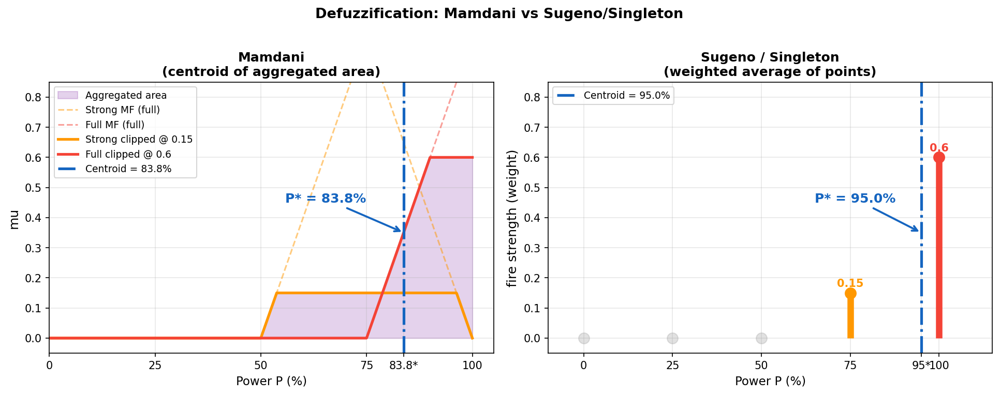

<div style="text-align:center; margin-bottom:16px;">


</div>

# Intelligent Systems and Decision Support Systems
**Unit 5: Uncertainty Management**
Department of Informatics & Computer Engineering
University of West Attica

**Instructor:** Anargyros Tsadimas (tsadimas@uniwa.gr)

---

<!-- _class: xsmall -->
# Unit 5 — Overview

1. The limits of classical logic in decision-making
2. Types of uncertainty: stochastic vs. linguistic
3. Fuzzy Sets and Membership Functions
4. Linguistic Variables (e.g. "High Risk", "Moderate Value")
5. Fuzzy Rules and Inference Mechanism
6. Defuzzification
7. Applications of Fuzzy Logic
8. Bayes' Theorem — Belief updating
9. Bayesian Networks: Structure, Learning and Inference
10. Inference Algorithms (Exact & Approximate)
11. Decision Networks (Influence Diagrams)
12. Applications of Bayesian Networks
13. Comparison: Fuzzy Logic vs. Bayesian Networks
14. From Rules to Data — Naive Bayes & Neuro-Fuzzy
15. Knowledge-Driven vs. Data-Driven DSS → *Unit 6*

---

# Why Is Classical Logic Not Enough?

Classical (Aristotelian) logic is **binary**: every proposition is either True (1) or False (0).

**Problem:**
> `IF temperature > 38°C THEN fever`

* Patient with 37.9°C → "No fever"
* Patient with 38.1°C → "Fever"

Reality operates with **degrees and nuances**, not sharp boundaries.

**Two sources of uncertainty in decision-making:**
* **Stochastic uncertainty:** Random events with known (or estimated) probabilities → *Bayesian Networks*.
* **Linguistic uncertainty:** Vague, subjective concepts ("high risk", "new customer") → *Fuzzy Logic*.

---

# Two Types of Uncertainty — Unit Roadmap

<div class="columns">

<div>

### Stochastic Uncertainty
Arises from **random events** — we don't know the outcome, but we know (or estimate) its **probabilities**.

**Examples:**
* Probability of rain tomorrow: 70%
* Probability of disease given a symptom
* Probability of customer default

**Question:** *What is the probability of X?*

**Tool:** → **Bayesian Networks** *(Unit 5B)*

</div>

<div>

### Linguistic Uncertainty
Arises from the **vagueness of concepts** — words have no sharp boundaries, but **degrees** of membership.

**Examples:**
* "The risk is **high**"
* "The customer is **new**"
* "The temperature is **low**"

**Question:** *To what degree does X hold?*

**Tool:** → **Fuzzy Logic** *(Unit 5A)*

</div>

</div>

> This unit covers both types — we start with **Fuzzy Logic**.

---

# Fuzzy Logic — History

**Lotfi Zadeh, 1965** — University of Berkeley:
> *"Fuzzy Sets"* — introduction of the concept of fuzzy sets as an extension of classical set theory.

**Core idea:**
Instead of {0, 1}, each element belongs to a set with a **degree of membership** in the interval [0, 1].

| Classical Logic | Fuzzy Logic |
|---|---|
| George is tall: **Yes / No** | George is tall: **0.75** |
| The price is high: **Yes / No** | The price is high: **0.40** |
| The risk is large: **Yes / No** | The risk is large: **0.85** |

> Fuzzy logic **does not model ignorance** — it models the inherent vagueness of human concepts. *(Zadeh, 1965; Kahraman et al., 2022)*

---

# Fuzzy Sets and Membership Function

**Definition:**
A **fuzzy set** A in a universe X is defined by the **membership function** $μ_A(x) ∈ [0,1]$:

* $μ_A(x) = 1$: element x belongs **fully** to A.
* $μ_A(x) = 0$: element x **does not belong** to A.
* $0 < μ_A(x) < 1$: **partial membership** — the degree of belonging.

**Typical membership function shapes:**

| Shape | Description | Usage |
|---|---|---|
| **Triangular** | Triangle with peak at centre | Simple categories |
| **Trapezoidal** | Flat top | Value ranges |
| **Sigmoid** | Smooth S-curve | Gradual transitions |
| **Gaussian** | Bell curve | More realistic distribution |

*Details: Ross (2017), ch. 2–3*

---
# Membership Functions


<!-- _class: small -->
* **Triangular** — the simplest. Defined by three points (a, b, c); the value 1 is achieved only at the peak b.
* **Trapezoidal** — an extension of the triangular with a "plateau" of full membership. Useful when you want a range of values to be considered "fully inside" the set (e.g. "moderate temperature").
* **Gaussian** — smooth and symmetric, with no abrupt points. Preferred in fuzzy control applications because its continuity simplifies the mathematics.
* **Sigmoid** — monotonically increasing, ideal for one-directional concepts such as "large", "expensive", "fast". It never returns to 0.


---

<!-- _class: xsmall -->
# Mathematical Formulas for Membership Functions

**Triangular** — parameters: $a < b < c$

$$\mu(x) = \begin{cases} 0, & x \leq a \\ \frac{x - a}{b - a}, & a < x \leq b \\ \frac{c - x}{c - b}, & b < x < c \\ 0, & x \geq c \end{cases}$$

**Trapezoidal** — parameters: $a < b \leq c < d$

$$\mu(x) = \begin{cases} 0, & x \leq a \\ \frac{x - a}{b - a}, & a < x < b \\ 1, & b \leq x \leq c \\ \frac{d - x}{d - c}, & c < x < d \\ 0, & x \geq d \end{cases}$$

**Gaussian** — parameters: centre $c$, width $\sigma$

$$\mu(x) = e^{-\frac{(x - c)^2}{2\sigma^2}}$$

**Sigmoid** — parameters: slope $a$, centre $c$

$$\mu(x) = \frac{1}{1 + e^{-a(x - c)}}$$

---

<!-- _class: xsmall -->
# Linguistic Variables


**Definition:**
A **linguistic variable** is a variable whose values are **words or phrases** from natural language, corresponding to fuzzy sets. 

* A **linguistic variable** is defined by 4 components: its name (e.g. "Temperature"), the **universe of discourse** (e.g. [0°C, 100°C]), the **set of linguistic values/terms** (e.g. {Cold, Lukewarm, Warm, Hot}), and the **membership function** for each value.
* Each **linguistic term** corresponds to a **fuzzy set** with its own **membership function** — so "Warm" and "Hot" can overlap, just as in natural language.
* They are widely used in fuzzy control systems (e.g. air conditioners, automatic washing machines, speed controllers) as well as in decision-making and fuzzy expert systems.

---

<!-- _class: small -->
# Fuzzy Rules

Fuzzy reasoning is expressed with **IF–THEN** rules using linguistic variables:

```
IF (Creditworthiness = Low) AND (Income = Moderate)
THEN (Loan Risk = High)

IF (Creditworthiness = High) AND (Income = High)
THEN (Loan Risk = Low)
```

To combine two conditions in one rule, we need **operations on fuzzy sets** → next slide.

> A fuzzy system can have **dozens of rules** operating simultaneously, each with a different activation degree.

---

<!-- _class: xxsmall -->
# Operations on Fuzzy Sets

In classical logic AND/OR/NOT return 0 or 1. In fuzzy logic they return **any value in [0,1]**.

| Operation | Formula | Logic |
|---|---|---|
| **AND (Intersection)** | $\mu_{A \cap B}(x) = \min(\mu_A(x),\ \mu_B(x))$ | "Both" — keep the **lower** value |
| **OR (Union)** | $\mu_{A \cup B}(x) = \max(\mu_A(x),\ \mu_B(x))$ | "At least one" — keep the **higher** value |
| **NOT (Complement)** | $\mu_{\bar{A}}(x) = 1 - \mu_A(x)$ | "The opposite" — invert the degree |

**Example:** borrower with income 1,400€ → $\mu_A(\text{Moderate}) = 0{.}70$ · credit score 550 → $\mu_B(\text{Low}) = 0{.}40$

| Operation | Rule | Calculation | Result |
|---|---|---|---|
| **AND** | Moderate **AND** Low | $\min(0{.}70,\ 0{.}40)$ | **0.40** ← weak link dominates |
| **OR** | Moderate **OR** Low | $\max(0{.}70,\ 0{.}40)$ | **0.70** ← strong link dominates |
| **NOT** | **NOT** Low (= "Good") | $1 - 0{.}40$ | **0.60** ← inversion |

---

# The Fuzzy Inference Cycle

A **Fuzzy Inference System (FIS)** operates in 3 stages:

**1. Fuzzification:**
Conversion of a **crisp input** into **membership degrees** for **linguistic values**.
* *Example:* Income = 1,200€/month → {Low: 0.2, Moderate: 0.7, High: 0.1}

**2. Rule Application (Inference):**
Each rule fires with a degree proportional to its inputs.
* The output of each rule is a **fuzzy output set**.

**3. Defuzzification:**
Combining all fuzzy outputs into a single **crisp result**.
* *Centroid Method:* the most common.
* *Example:* Risk score = 72.4 (on a scale of 0–100)

---

# Fuzzy Inference Cycle
### Step-by-step example: Air Conditioner Control System

---

## Scenario

> We want to build a **fuzzy control system** that decides
> the **power of the air conditioner** based on two sensors:
> - 🌡️ Room temperature
> - 💧 Relative humidity

**Input data for our example:**

| Variable | Value |
|-----------|------|
| Temperature | **34 °C** |
| Humidity | **72 %** |

---

## FIS Architecture


---

## Step 1a — Defining Linguistic Variables
<!-- _class: small -->

Before anything else, we define **which linguistic terms** we will use.

### Variable 1: Temperature  `T ∈ [0°C, 45°C]`

| Term | MF Type | Parameters |
|------|----------|------------|
| Cool | Trapezoidal | a=0, b=0, c=18, d=26 |
| Moderate | Triangular | a=20, b=27, c=34 |
| Warm | Triangular | a=28, b=34, c=40 |
| Hot | Trapezoidal | a=36, b=41, c=45, d=45 |

### Variable 2: Humidity  `H ∈ [0%, 100%]`

| Term | MF Type | Parameters |
|------|----------|------------|
| Low | Trapezoidal | a=0, b=0, c=30, d=50 |
| Moderate | Triangular | a=35, b=55, c=75 |
| High | Trapezoidal | a=60, b=80, c=100, d=100 |


---

## Step 1b — Defining Linguistic Variables
<!-- _class: small -->


### Output Variable: AC Power `P ∈ [0%, 100%]`

| Term | Representative value |
|------|----------------------|
| Off | 0% |
| Low | 25% |
| Moderate | 50% |
| Strong | 75% |
| Full | 100% |

> **Design principle — Closed Universe:**
> The extreme terms ("Cool", "Hot", "Low", "High") use **trapezoidal** functions with a flat plateau of μ=1 at the boundary of the scale: any value outside the "sensible range" is *equally* extreme — there is no point in reducing its membership.
> The intermediate terms ("Moderate", "Warm") use **triangular**: they have an optimal peak value and their membership decreases on both sides.
---

## Step 2 — Building the Rule Base
<!-- _class: small -->


<div class="columns">
<div>
The rules express expert knowledge in natural language: 

```
R1: IF T=Cool    AND H=Low      → P=Off
R2: IF T=Cool    AND H=High     → P=Low
R3: IF T=Moderate AND H=Low    → P=Low
R4: IF T=Moderate AND H=Moderate → P=Moderate
R5: IF T=Moderate AND H=High   → P=Strong
R6: IF T=Warm    AND H=Moderate → P=Strong
R7: IF T=Warm    AND H=High     → P=Full
R8: IF T=Hot     AND H=Low      → P=Strong
R9: IF T=Hot     AND H=High     → P=Full
```

</div>
<div>

**Rule Matrix:**

|  | Low H | Moderate H | High H |
|--|----------|----------|---------|
| **Cool T** | Off | — | Low |
| **Moderate T** | Low | Moderate | Strong |
| **Warm T** | — | Strong | Full |
| **Hot T** | Strong | — | Full |

</div>
</div>

> **Note:** Cells with "—" correspond to combinations the expert considers negligible or unlikely. A **complete** rule base covers all combinations (here 4×3 = 12), while an **incomplete** one may leave some inputs without an active rule.

---

## Step 3a — Fuzzification
<!-- _class: xsmall -->

We compute the membership degree of the **crisp input** for each linguistic term.

### Temperature T = 34°C

We apply each membership function for x = 34.

> **Notation:** `trap(x; a,b,c,d)` = trapezoidal (rises a→b, plateau b–c, falls c→d) · `tri(x; a,b,c)` = triangular (rises a→b, falls b→c)

```
μ_Cool(34)     = trap(34; 0,0,18,26)   = 0.000  ← out of range
μ_Moderate(34) = tri(34;  20,27,34)    = 0.000  ← exactly at c
μ_Warm(34)     = tri(34;  28,34,40)    = 1.000  ← exactly at the peak!
μ_Hot(34)      = trap(34; 36,41,45,45) = 0.000  ← out of range
```

**Result:** T=34°C belongs **fully** to "Warm" (μ=1.0)

### Humidity H = 72%

```
μ_Low(72)      = trap(72; 0,0,30,50)      = 0.000  ← out of range
μ_Moderate(72) = tri(72;  35,55,75)       = 0.150  ← (75−72)/(75−55)
μ_High(72)     = trap(72; 60,80,100,100)  = 0.600  ← (72−60)/(80−60)
```

**Result:** H=72% belongs **partially** to Moderate (0.15) and High (0.60)

---

## Step 3a — Fuzzification Diagram for Humidity
<!-- _class: xsmall -->


- **μ_Low(72) = 0.00** → ends at 50%; 72 is **out of range**
- **μ_Moderate(72) = 0.15** → H=72 is on the **descending slope** (close to c=75): (75−72)/(75−55)
- **μ_High(72) = 0.60** → H=72 is on the **ascending slope** (between a=60 and b=80): (72−60)/(80−60)

---

## Step 3 — Fuzzification
<!-- _class: small -->


### Computing μ_Moderate(72) step by step

```
tri(72; a=35, b=55, c=75):
  → 72 > 55 (we are on the right slope)
  → μ = (c − x) / (c − b) = (75 − 72) / (75 − 55) = 3 / 20 = 0.15  ✓
```

### Computing μ_High(72) step by step

```
trap(72; a=60, b=80, c=100, d=100):
  → 72 < 80 (we are on the left slope)
  → μ = (x − a) / (b − a) = (72 − 60) / (80 − 60) = 12 / 20 = 0.60  ✓
```

---

## Step 4 — Rule Evaluation
<!-- _class: xsmall -->

For each rule we compute the **fire strength** using the AND operator = min. A rule is **active** if and only if `fire > 0`:


$fire_i = min( μ_{temp\_term(T),} μ_{hum\_term(H)} )$


| Rule | μ_temp | μ_hum | fire = min(·,·) | Output |
|---------|--------|-------|-----------------|--------|
| R1: Cool ∧ Low | 0.000 | 0.000 | **0.000** | Off |
| R2: Cool ∧ High | 0.000 | 0.600 | **0.000** | Low |
| R3: Moderate ∧ Low | 0.000 | 0.000 | **0.000** | Low |
| R4: Moderate ∧ Moderate | 0.000 | 0.150 | **0.000** | Moderate |
| R5: Moderate ∧ High | 0.000 | 0.600 | **0.000** | Strong |
| R6: Warm ∧ Moderate | 1.000 | 0.150 | **0.150** ✓ | Strong |
| R7: Warm ∧ High | 1.000 | 0.600 | **0.600** ✓ | Full |
| R8: Hot ∧ Low | 0.000 | 0.000 | **0.000** | Strong |
| R9: Hot ∧ High | 0.000 | 0.600 | **0.000** | Full |

> **Active rules: R6 (fire=0.150) and R7 (fire=0.600)**

---

## Step 5 — Aggregation

Each output linguistic term can be produced by **multiple rules**. We keep the **maximum** fire (= fuzzy OR, stays in [0,1]):

```
μ_agg(Off)      = max(R1=0.000)                        = 0.000
μ_agg(Low)      = max(R2=0.000, R3=0.000)              = 0.000
μ_agg(Moderate) = max(R4=0.000)                        = 0.000
μ_agg(Strong)   = max(R5=0.000, R6=0.150, R8=0.000)   = 0.150  ← R6 dominates
μ_agg(Full)     = max(R7=0.600, R9=0.000)              = 0.600  ← R7 dominates
```

> **Why max and not sum?** A *single* rule strongly supporting a category is sufficient. Summing would give values >1 (out of μ range).

**Total weight:** Σ fire = 0.150 + 0.600 = **0.750**

---

## Step 6 — Defuzzification (Centroid)
<!-- _class: xxsmall -->

<div align="center">

</div>

---


## Step 6 — Defuzzification (Centroid)
<!-- _class: small -->

After aggregation we have **weights** (fire strengths) for each output category — but not yet a single numeric value. Defuzzification converts these weights into **one number** using a weighted average:

$$P^* = \frac{\sum_i \text{fire}_i \times \text{outValue}_i}{\sum_i \text{fire}_i}$$

> **$outValue_i$** — **design choice (singleton):** In this example the output terms have no shape (triangle/trapezoid) — they are **isolated points** placed equidistantly: 0, 25, 50, 75, 100%. The 75% for "Strong" does not come from the peak of some function but from an equal partition of the [0,100] scale into 4 intervals. In the **Mamdani** approach each output term has a real MF (e.g. a triangle centred at 75% for "Strong"), which is clipped at the rule's fire strength; the centroid is then computed as the centre of gravity of the entire aggregated (union) region — see Mamdani/Singleton comparison below.


Result

> For **T = 34°C** and **H = 72%**, the air conditioner will run at **95% of its power** — the "centre of gravity" is pulled down from 100% due to the contribution of Strong (0.15)

---

## Defuzzification — Mamdani vs Sugeno/Singleton
<!-- _class: xsmall -->



---

## Defuzzification — Mamdani vs Sugeno/Singleton
<!-- _class: xxsmall -->

> **Key difference:** In **Mamdani** the THEN part of each rule is a **fuzzy set** (a shape — triangle, trapezoid). In **Sugeno** the THEN part is a **constant or mathematical equation** (a simple number, without a shape).

| | **Mamdani** | **Sugeno / Singleton** |
|---|---|---|
| **Rule output (THEN)** | Fuzzy set with a shape (MF) | Constant or linear function of inputs |
| **Defuzzification** | Centroid of the entire aggregated region | Weighted average of points |
| **Result (example)** | **83.8%** | **95.0%** |
| **Why they differ** | "Strong" has area from 50–100% that "pulls" the centroid left | Uses only two points: 75 and 100 |
| **Computational complexity** | Higher (integration) | Low (simple arithmetic) |
| **Interpretability** | Faithful to the linguistic meaning of each term | Depends on the design choice of singletons |
| **Suitable for** | DSS, applications where interpretation matters | Real-time, embedded, mathematical models |

**Which do we prefer?**
- **Mamdani** → when interpretability is central: the output corresponds to linguistic terms with a real "shape"; the user can explain the result.
- **Sugeno/Singleton** → when speed and simplicity are needed — but the choice of singletons (e.g. 75 vs 80 for "Strong") significantly affects the output and must be justified.

---

## Summary — The Cycle Step by Step

| # | Phase | What we do | Result |
|---|------|-----------|-----------|
| 1 | **Definition** | Linguistic variables + MFs | FIS structure |
| 2 | **Rule Base** | IF–THEN expert rules | 9 rules |
| 3 | **Fuzzification** | Crisp values → membership degrees | $μ_{Warm}=1.0$, $μ_{High}=0.60$ |
| 4 | **Rule Evaluation** | AND = min, fire computation | R6=0.15, R7=0.60 |
| 5 | **Aggregation** | max per output category | Strong=0.15, Full=0.60 |
| 6 | **Defuzzification** | Centroid → crisp value | **P* = 95%** |

---

## Choosing the AND Operator

<!-- _class: xxsmall -->

The AND operator determines the **fire strength** of each rule. Two main choices:

| Method | Formula | Interpretation | Commonly used in |
|---------|-------|----------|---------------|
| **min** (Zadeh AND) | `min(a, b)` | The result cannot be stronger than the **weakest link** | Mamdani (classical) |
| **product** (algebraic) | `a × b` | Both conditions contribute — a small value in even one **greatly reduces** the result | Sugeno, neuro-fuzzy |

> Both operators can be used in Mamdani or Sugeno — they do not define the architecture, only **how strictly** AND is interpreted.

**Example** with $μ_{Warm} = 1.0$ and $μ_{Moderate} = 0.15$ (from our example):

| | min | product |
|--|-----|---------|
| fire R6 | min(1.0, 0.15) = **0.150** | 1.0 × 0.15 = **0.150** |

With $μ_{Warm} = 0.8$ and $μ_{Moderate} = 0.15$:

| | min | product |
|--|-----|---------|
| fire | min(0.8, 0.15) = **0.150** | 0.8 × 0.15 = **0.120** |

> **min** ignores how "strong" the strong condition is — only the weak one counts. **product** takes both into account.

---

## Choosing the Defuzzification Method

<!-- _class: xsmall -->

We have aggregated the fuzzy results. How do we choose **one crisp value**?

| Method | Logic | Result (Mamdani) |
|---------|--------|----------------------|
| **Centroid** | Centre of gravity of the *entire* aggregated region — influenced by all active rules | **83.8%** |
| **Mean of Maximum (MoM)** | Find the **maximum height μ** of the aggregated region (here μ=0.60 for "Full"). Locate **all x** that reach it (x∈[90,100]). Take their **mean**. | (90+100)/2 = **95%** |
| **Largest of Maximum (LoM)** | Same location step. From that set choose the **largest x**. | max{90…100} = **100%** |

**Why x∈[90,100] for the maximum μ=0.60?**
In Mamdani, "Full" has a trapezoidal MF with a flat top at [90,100]. R7 has fire=0.60, so the MF is clipped horizontally at 0.60 — **the top covers the entire [90,100]**. All x there have μ=0.60, which is the maximum. "Strong" (R6, fire=0.15) does not reach this height → **ignored** by MoM/LoM.

> **Centroid:** reflects all rules — the most widely used choice.
> **MoM:** "centres" between the extreme x values — a balanced decision within the dominant zone.
> **LoM:** selects the extreme right x — a more "aggressive" decision, useful in worst-case scenarios.

---


<!-- _class: xsmall -->
# Applications of Fuzzy Logic

| Domain | Application |
|---|---|
| **Finance** | Creditworthiness assessment, investment risk evaluation |
| **Medicine** | Disease diagnosis with fuzzy symptoms, drug dosage |
| **Industry** | Air conditioning control, washing machines, ABS brakes, robotics |
| **Marketing** | Customer segmentation ("Loyal", "Inactive", "New") |
| **DSS** | Evaluation of alternatives using linguistic criteria |

**Advantages:**
* Handles natural language and human intuition.
* Robust to noise and imprecise data.
* Interpretable results — the expert understands the rules.

**Limitations:**
* Membership functions are defined subjectively (by an expert).
* Does not learn automatically from data (unlike ML).

> Combining Fuzzy Logic with Neural Networks gives **Neuro-Fuzzy Systems** — they learn membership functions from data.

---

# Stochastic Uncertainty & Bayes' Theorem

**Bayes' Theorem (Thomas Bayes, ~1763):**
Describes how to **update our belief** about an event when we receive new evidence.

$$P(A \mid B) = \frac{P(B \mid A) \cdot P(A)}{P(B)}$$

| Term | Interpretation |
|---|---|
| **P(A)** | *Prior* — initial probability of event A |
| **P(B\|A)** | *Likelihood* — probability of observing B, given A holds |
| **P(A\|B)** | *Posterior* — updated probability of A after observing B |
| **P(B)** | *Evidence* — total probability of B |

> **Essence:** We start with a preliminary estimate (prior), observe new data, and arrive at a more informed estimate (posterior).

---

<!-- _class: small -->
# Bayes Example: Medical Test

**Scenario:** Test for a rare disease (prevalence* 1%).
* Test sensitivity: 95% (if you are sick, the test is positive with P=0.95)
* False positives: 5% (if you are healthy, the test is positive with P=0.05)

**Question:** If the test comes back positive, what is the probability of actually being sick?

$$P(\text{Sick} \mid \text{Positive}) = \frac{0{.}95 \times 0{.}01}{0{.}95 \times 0{.}01 + 0{.}05 \times 0{.}99} \approx 16{.}1\%$$

**Interpretation:**
* Despite the high accuracy of the test, only **1 in 6** with a positive result is actually sick!
* This happens because the disease is rare (low prior).

> Bayes' theorem prevents **overreaction to data** — it reminds us to always weigh the base rate.

*\*Prevalence: the proportion of the population that is diseased at a given point in time — this constitutes the prior P(Sick) in Bayes' formula.*

---

# Bayesian Networks

**Definition:**
A **Bayesian Network** is a directed acyclic graph (DAG) that represents the **causal relationships** between random variables *(Pearl, 1988)*.

**Building blocks:**

| Element | Description |
|---|---|
| **Nodes** | Random variables (events, risk factors) |
| **Arcs** | Causal influence: A → B means "A influences B" |
| **CPT** | Conditional Probability Table — P(node \| parents) |

**Characteristics:**
* Encode **expert knowledge** (or learned from data).
* Allow **prediction** (diagnosis) and **inverse inference** (explanation).
* Incorporate new evidence automatically through Bayesian updating.


---

# What Are Bayesian Networks?

Bayesian Networks are **graphical probabilistic models** that represent a set of variables and their dependencies. They are widely used in Artificial Intelligence for **decision-making under uncertainty**.

### Their Structure (How they are designed)
They consist of two basic components:

**1. The Graph (Directed Acyclic Graph - DAG):**
* **Nodes:** Each node is a variable (e.g. "Smoking", "Lung Cancer", "Cough").
* **Edges (Arrows):** Show the **causal relationship**. An arrow from (A) to (B) means "A causes or influences B". (A is the *Parent* and B is the *Child*).


**2. The Probability Tables (CPTs - Conditional Probability Tables):**
Each node is accompanied by a table that tells us mathematically what the probability of it occurring is, *given the state of its parents*.

---

# Why Are They So Powerful? (Types of Reasoning)

The great advantage of Bayesian Networks is that they allow us to "travel" through the graph in any direction, once a new piece of data (Evidence) is observed:

1. **Forward (Predictive Reasoning):**
   * *Cause ➔ Effect:* I know the patient smokes. What is the probability of developing a cough in the future? (Risk Calculation).

2. **Backward (Diagnostic Reasoning):**
   * *Effect ➔ Cause:* The patient came in with a severe cough. What is the probability of being a smoker or having some disease? (Bayes' rule is applied directly here).

3. **Explaining Away:**
   * The patient has a cough, so the probability of cancer increases. Suddenly, we learn they have a simple cold. The probability for cancer *drops* immediately, because the cold "explains" the cough on its own!

---

# Example: The Alarm Problem (Judea Pearl)

The house alarm (Alarm) is triggered by Burglary or Earthquake.

### Step 1: The Graph (DAG)
Two independent causes (Parents) lead to the same effect (Child).


---

# Step 2: Probability Tables (CPTs)

**1. Prior Probabilities of Parents:**
* Probability of Burglary: P(B) = 0.001 (0.1%)
* Probability of Earthquake: P(E) = 0.002 (0.2%)

**2. Conditional Probabilities of Child P(A | B, E):**
* If **Burglary AND Earthquake** ➔ Alarm = 95%
* If **ONLY Burglary** ➔ Alarm = 94%
* If **ONLY Earthquake** ➔ Alarm = 29%
* If **NOTHING** ➔ Alarm = 0.1% (Error/Short circuit)

---

# Step 3: Inference in the Network

How probabilities are updated when new information is learned:

**1. Diagnosis (Diagnostic Reasoning):**
* *Given:* Your neighbour calls you and says **"The alarm is ringing!"**.
* *Result:* The probability of Burglary shoots up from the initial 0.1% to **~37%**. (Not 100%, because there is also the probability of earthquake or error).

**2. Explaining Away:**
* *Given:* You turn on the radio and hear: **"An Earthquake just occurred!"**.
* *Result:* Because the earthquake *explains* why the alarm went off, the probability that you are being robbed simultaneously drops sharply back to **~0.1%**. 

**Conclusion:** The Bayesian network mimics human reasoning using rigorous mathematics!

---


# What Runs in the Background? (The Mathematics of Step 3)

<!-- _class: small -->
How did the system calculate that the probability of Burglary went to ~37% when the Alarm rang? It used **Bayes' Rule**!

We are looking for the probability: $P(\text{Burglary} | \text{Alarm})$

The mathematical formula is:
$$P(B|A) = \frac{P(A|B) \cdot P(B)}{P(A)}$$

* **P(B):** The initial probability of Burglary = **0.001** (from Step 2).
* **P(A|B):** The probability that the alarm rings if a burglary occurs. The system checks the table from Step 2 (taking into account the probability of earthquake) and finds it to be approximately **0.94** (94%).
* **P(A):** The total probability that the alarm rings on any given day (whether from a burglar, earthquake, or error). The algorithm computes all combinations and finds it to be approximately **0.0025** (0.25%).

**The algorithm's final calculation:**
$$P(B|A) = \frac{0.94 \cdot 0.001}{0.0025} = 0.376 \text{ or } 37.6\%$$

The Bayesian network performed this calculation in fractions of a second!

---

<!-- _class: xxsmall -->
# How P(A) = 0.0025 Is Computed

P(A) is the **total probability** that the alarm rings on any given day — from any cause. We sum all **4 possible combinations** of causes (B = Burglary, E = Earthquake), each time multiplying the probability of the alarm ringing *if* we are in that scenario by the probability of that scenario occurring:

$$P(A) = \sum_{b,\,e} P(A \mid b, e)\cdot P(b)\cdot P(e)$$

**How to read each row:**

* **P(A|b,e):** from the CPT table (Step 2) — how likely is the alarm to ring *if* this combination holds.
* **P(b):** the prior probability of Burglary (B=T: 0.001, B=F: 1−0.001=0.999).
* **P(e):** the prior probability of Earthquake (E=T: 0.002, E=F: 1−0.002=0.998).
* **Contribution = P(A|b,e) × P(b) × P(e)**

| Scenario | P(A\|b,e) | P(b) | P(e) | Contribution |
|---|---|---|---|---|
| B=T, E=T (Burglary AND Earthquake) | 0.95 | 0.001 | 0.002 | 0.95×0.001×0.002 ≈ 0.0000019 |
| B=T, E=F (ONLY Burglary) | 0.94 | 0.001 | 0.998 | 0.94×0.001×0.998 ≈ 0.000938 |
| B=F, E=T (ONLY Earthquake) | 0.29 | 0.999 | 0.002 | 0.29×0.999×0.002 ≈ 0.000580 |
| B=F, E=F (NOTHING — error) | 0.001 | 0.999 | 0.998 | 0.001×0.999×0.998 ≈ 0.000997 |

$$P(A) \approx 0.0000019 + 0.000938 + 0.000580 + 0.000997 \approx \mathbf{0.0025}$$

> Interpretation: on a random day, there is a **0.25% probability** that the alarm rings. This number serves as the **denominator** in Bayes' formula — it normalises the result.

---

<!-- _class: small -->
# Example: Bayesian Network for Credit Risk


---

<!-- _class: xsmall -->
# Reading the Diagram

There are three types of values in the diagram, each with a different role:

**Prior** — frequency in the population, with no preconditions:
* P(Good History) = 0.70 → of the bank's applicants, 70% have a good credit history
* Used **only if we do not know** the value of the node for the specific customer

**CPT** — conditional frequency (the **|** means "given that"):
* P(High Creditworthiness | Good History) = 0.85 → of those with a good history, 85% have high creditworthiness
* P(Risk High | Low Creditworthiness, High Ratio) = 0.92 → of those with this combination, 92% are assessed as high risk
* Used **always** — these are the model's learned rules

**Posterior** — computed by applying the CPTs to the specific customer's data:
* P(Risk High), P(Approval) → **not given**, they result from computation

> If we know that the customer has History=Bad, the prior 0.70 is **ignored** — the CPT is used directly: P(Creditworthiness=High | Bad) = 0.20.

---

<!-- _class: xxsmall -->
# Example: Customer A — Step 1 (Input → Intermediate)

We will examine two customers to see how the decision changes:

| | Customer A | Customer B |
|---|---|---|
| Payment History | **Bad** | **Good** |
| Income | **Low** | **High** |


**Input data (evidence):** History = **Bad**, Income = **Low**

We observe these values — we do not compute them. The network uses them as a starting point.

**Creditworthiness** — depends only on History:

We look up the CPT of Creditworthiness for parent = Bad:
$$P(\text{Creditworthiness} = \text{High} \mid \text{History} = \text{Bad}) = \mathbf{0.20}$$
$$P(\text{Creditworthiness} = \text{Low}) = 1 - 0.20 = \mathbf{0.80}$$

**Debt Ratio** *(= monthly obligations / monthly income)* — depends only on Income:

We look up the CPT of Ratio for parent = Low:
$$P(\text{Ratio} = \text{Low} \mid \text{Income} = \text{Low}) = \mathbf{0.30}$$
$$P(\text{Ratio} = \text{High}) = 1 - 0.30 = \mathbf{0.70}$$

> The two intermediate nodes are computed **independently** — each has only one parent.

---

<!-- _class: small -->
# Example: Customer A — Step 2a (why do we sum?)

From Step 1 we did not get a single certain value — we got **probabilities**:
* Creditworthiness: 80% Low, 20% High
* Ratio: 70% High, 30% Low

We do not know which of the 4 combinations the customer belongs to. So the total probability of high risk is the **weighted sum** — each combination contributes in proportion to how likely it is to hold.

> If we knew with certainty e.g. Creditworthiness=Low **and** Ratio=High, we would simply look at **one row** of the CPT: P(Risk=High) = 0.92 — done. But since we have probabilities, we must weight all rows.

---

<!-- _class: xsmall -->
# Example: Customer A — Step 2b (calculation)

For each combination: *probability of the combination* × *CPT risk for that combination*:

| Creditworthiness | Ratio | P(Credit.) × P(Ratio) | × P(Risk=High \| CPT) | = contribution |
|---|---|---|---|---|
| Low | High | 0.80 × 0.70 = 0.56 | 0.92 | **0.5152** |
| Low | Low | 0.80 × 0.30 = 0.24 | 0.65 | 0.1560 |
| High | High | 0.20 × 0.70 = 0.14 | 0.40 | 0.0560 |
| High | Low | 0.20 × 0.30 = 0.06 | 0.08 | 0.0048 |
| | | | **Sum →** | **0.7320** |

* P(Credit.) and P(Ratio) → from **Step 1** (CPT with input evidence)
* 0.92 / 0.65 / 0.40 / 0.08 → **given** by the Risk CPT

The first combination dominates because it is both the most likely (56%) and has the highest CPT (0.92).

$$P(\text{Risk} = \text{High}) = \mathbf{73.2\%}, \quad P(\text{Risk} = \text{Low}) = 26.8\%$$

---

<!-- _class: xsmall -->
# Example: Customer A — Step 3 (Risk → Decision)

From Step 2 we know: P(Risk=High) = **0.732**, P(Risk=Low) = **0.268**

The Approval node has only one parent (Risk), so we look up its CPT:
* P(Approval | Risk=Low) = **0.90** — if the risk is low, the bank almost always approves
* P(Approval | Risk=High) = **0.05** — if the risk is high, approval is rare

We do not know with certainty whether the risk is high or low — we know probabilities. So we weight both cases:

$$P(\text{Approval}) = \underbrace{0.90 \times 0.268}_{\text{if Risk=Low}} + \underbrace{0.05 \times 0.732}_{\text{if Risk=High}} = 0.241 + 0.037 = \mathbf{0.278 \ (27.8\%)}$$

The second term (0.037) is small even though high risk is more likely (73.2%), because the approval CPT for high risk is very low (0.05).

**Full flow — Customer A vs B:**

| | Customer A (Bad / Low) | Customer B (Good / High) |
|---|---|---|
| P(Creditworthiness=High) | 0.20 | 0.85 |
| P(Ratio=Low) | 0.30 | 0.78 |
| P(Risk=High) | 73.2% | 23.4% |
| **P(Approval)** | **27.8%** | **70.1%** |

---

<!-- _class: small -->
# Inference in Bayesian Networks

**Two directions of inference:**

**Prediction (Predictive / Top-Down):**
* I know the causes → I compute the probability of the outcome.
* *Example:* I know the payment history → what is the loan risk?

**Diagnosis (Diagnostic / Bottom-Up):**
* I observe the outcome → I look for the probable causes.
* *Example:* The borrower defaulted → what was the most likely problem?

**Applications of Bayesian Networks:**

| Domain | Application |
|---|---|
| **Medicine** | Given symptoms → rank probable diseases by probability |
| **Finance** | Credit risk assessment, fraud detection |
| **Industry** | Fault diagnosis, predictive maintenance |
| **DSS** | Decision-making under uncertainty with incorporation of new information |

---

<!-- _class: xxsmall -->
# Learning in Bayesian Networks

To use a BN we must answer two questions: **which nodes are connected?** and **with what CPT values?** In practice: the expert defines the **structure** (what influences what), data train the **parameters** (to what degree). *(Koller & Friedman, 2009)*

**Structure Learning** — which nodes are connected and in which direction (arrows):

| Method | Etymology | How it works | When used |
|---|---|---|---|
| **Expert** | — | The expert designs the graph manually | When causality is known (e.g. medicine) |
| **Score-based** | *score* = structure score | Tries structures, keeps the one with the highest score (e.g. BIC = how well it explains the data) | When we have a lot of data |
| **Constraint-based** | *constraint* = independence constraint | Checks which variables are statistically independent and builds the graph without edges between them | Large datasets with unknown relationships |

**Parameter Learning** — once the structure is known, estimating CPT values from data:

| Method | Etymology | How it works |
|---|---|---|
| **MLE** | *Maximum Likelihood Estimation* | Counts frequencies: of 1,000 customers with a bad history, 200 had high creditworthiness → CPT = 0.20 |
| **Bayesian estimation** | Estimation using Bayes' rule | Combines data frequencies with the expert's prior estimate — useful when data are scarce |
| **EM algorithm** | *Expectation-Maximization* | Fills in missing entries by estimation and re-estimates the CPTs, iteratively |


---

<!-- _class: xxsmall -->
# Inference Algorithms in Bayesian Networks

In the credit risk example we computed the posteriors manually (5 nodes, 4 combinations). In real networks with dozens of nodes and hundreds of combinations this is impossible — we need algorithms.

**Exact Inference** — gives the exact answer:

| Algorithm | Idea | When used |
|---|---|---|
| **Variable Elimination** | Sums out nodes one by one in the right order, reducing the problem step by step — exactly what we did manually in Step 2 | Small/medium networks, one query |
| **Junction Tree** | Restructures the network into a tree, computes once and reuses intermediate results | Multiple queries on the same network |

Exact inference becomes expensive as the network grows — in dense networks the time increases exponentially.

**Approximate Inference** — a good estimate when exact inference is practically impossible:

| Algorithm | Idea |
|---|---|
| **Monte Carlo sampling** | Generates thousands of random scenarios (values for all nodes) and counts how often the desired result appears |
| **Likelihood weighting** | Like Monte Carlo, but scenarios that agree with the evidence receive greater weight — more efficient |
| **Loopy Belief Propagation** | Each node exchanges "messages" with its neighbours iteratively until the estimates stabilise |

> In practice we do not choose algorithms manually — tools such as pgmpy and Netica choose automatically. *(Darwiche, 2009)*

---


# AI Application: Spam Filters (Naïve Bayes)
<!-- _class: xsmall -->
How does your email (e.g. Gmail) know which messages should go to "Spam"? It doesn't have "magic" words — it uses **Bayes' Theorem**!

**1. Training:**
The system reads millions of old emails that users have marked as Spam or Normal (Ham). It computes statistics:
* How often does the word "FREE" appear in Spam? (e.g. $P(\text{FREE}|\text{Spam}) = 80\%$)
* How often does it appear in normal emails? (e.g. $P(\text{FREE}|\text{Normal}) = 5\%$)

**2. Inference:**
When a new email arrives, the system looks for the Posterior Probability: **What is the probability that the email is Spam, given the words it contains?**
$$P(\text{Spam} | \text{Words}) = \frac{P(\text{Words} | \text{Spam}) \cdot P(\text{Spam})}{P(\text{Words})}$$

**3. Why "Naive"?**
The algorithm multiplies the probabilities of each word, making the "naive" mathematical assumption that **each word is completely independent of the others**. Despite this simplistic assumption, in practice the algorithm still works exceptionally well.

---

<!-- _class: small -->
# Decision Networks (Influence Diagrams)

A BN describes **what is probable** — but does not answer the question **what should I do**. Influence Diagrams extend the BN with two new types of nodes:

| Node | Shape | Role |
|---|---|---|
| **Chance** | Ellipse | Uncertain event — as in a regular BN |
| **Decision** | Rectangle | Choice controlled by the decision-maker (e.g. which treatment) |
| **Utility** | Diamond | Numerical value of each outcome (e.g. quality of life, cost) |

The goal: choose the decision that **maximises expected utility** (EU = Σ probability × value).


---

<!-- _class: small -->
# Decision Networks (Influence Diagrams)

 
---

---

<!-- _class: xsmall -->
# Decision Networks — Reading the Example

**Scenario:** We do not know whether the patient has the disease. We have a test result. Which treatment do we choose?

**What is given — utility table** (value of each combination of *decision × true state*):

| | Disease = T (30%) | Disease = F (70%) |
|---|---|---|
| Treatment A | +80 (heals effectively) | −10 (side effects without cause) |
| Treatment B | +60 (heals moderately) | +5 (mild, almost harmless) |
| No treatment | −50 (disease progresses) | +10 (avoided unnecessary treatment) |

---

<!-- _class: xsmall -->
# Decision Networks — Reading the Example

**Causal reasoning for each cell** — why the disease *causes* this outcome:

* **A & Dis=T (+80):** Disease exists → Treatment A acts on the cause → effective cure.
* **A & Dis=F (−10):** No cause exists → Treatment A acts without a target → only side effects.
* **B & Dis=T (+60):** Disease exists → Treatment B acts on the cause, but more mildly → moderate cure.
* **B & Dis=F (+5):** No cause exists → Treatment B is mild, does no harm, slightly beneficial.
* **None & Dis=T (−50):** Disease exists → no intervention → the cause progresses uncontrolled.
* **None & Dis=F (+10):** No cause exists → intervention was unnecessary → we avoided needless cost.

We do not know which column the patient belongs to — so we weight both with their probabilities:

**EU = P(Disease=T) × U(T) + P(Disease=F) × U(F)**

| Choice | EU = 0.30 × U(T) + 0.70 × U(F) | Result |
|---|---|---|
| Treatment A | 0.30×(+80) + 0.70×(−10) = 24 − 7 | **+17** |
| Treatment B | 0.30×(+60) + 0.70×(+5) = 18 + 3.5 | **+21.5** ✓ |
| No treatment | 0.30×(−50) + 0.70×(+10) = −15 + 7 | **−8** |

> **Treatment B** is chosen — not because it is the best if the patient is *certainly* sick (Treatment A gives +80 there), but because it is the safest choice **under uncertainty**: if the patient is not sick (70% probability), A harms them (−10) while B does not burden them (+5).

---

<!-- _class: xsmall -->
# Decision Networks — What Changes with the Test Result?

The previous analysis used only the prior (0.30/0.70). But the diagram also contains a **Test Result** node — if we take it into account, the probabilities are updated through Bayes.

Assume: P(Test=+ | Dis.=T) = 0.90,  P(Test=+ | Dis.=F) = 0.15

**If the test comes back positive (+):**
$$P(\text{Dis.}=T \mid +) = \frac{0.90 \times 0.30}{0.90 \times 0.30 + 0.15 \times 0.70} = \frac{0.27}{0.375} = \mathbf{0.72}$$

| Choice | EU = 0.72×U(T) + 0.28×U(F) | Result |
|---|---|---|
| Treatment A | 0.72×80 + 0.28×(−10) = 57.6 − 2.8 | **+54.8** ✓ |
| Treatment B | 0.72×60 + 0.28×5 = 43.2 + 1.4 | **+44.6** |
| No treatment | 0.72×(−50) + 0.28×10 | **−33.2** |

**If the test comes back negative (−):** P(Dis.=T | −) ≈ 0.05 → B remains better (EU=+7.6).

> **Conclusion:** The Influence Diagram automatically changes the **optimal decision** depending on the evidence: positive test → Treatment A, negative test → Treatment B. This cannot be done with simple if/else rules.

---

<!-- _class: xsmall -->
# Applications of Bayesian Networks in Practice

| Domain | Application | Description |
|--------|----------|-----------|
| **Spam Filtering** | Naive Bayes classifier | Email classification based on word probability in spam/ham |
| **Medical Diagnosis** | QMR-DT system | Network with 600+ diseases and 4,000+ symptoms |
| **Predictive Maintenance** | Predictive maintenance | Predicting machine failures based on sensors |
| **Supply Chain** | Risk estimation | Modelling supplier dependencies and risks |
| **Network Security** | Intrusion detection | Correlating events (logs, traffic) to recognise threats |
| **Automotive** | ADAS / Autonomous driving | Sensor fusion (camera, LiDAR, radar) under uncertainty |

**Why are BNs popular?**
* **Interpretability** — the graph clearly shows causal relationships
* **Knowledge integration** — combine expert knowledge + data
* **Real-time updating** — new evidence → automatic update
* **Work with little data** — thanks to informative priors

*See Sharda, Delen & Turban (2020), ch. 8–9*

---

<!-- _class: small -->
# Comparison: Fuzzy Logic vs. Bayesian Networks

| Characteristic | Fuzzy Logic | Bayesian Networks |
|---|---|---|
| **Type of uncertainty** | Linguistic / subjective | Stochastic / probabilistic |
| **Representation** | Membership functions, rules | Graph + probability tables (CPT) |
| **Data** | Expert knowledge (rule definition) | Historical data or expert knowledge |
| **Interpretability** | Very high (human rules) | High (graphical structure) |
| **Incorporation of new data** | Difficult | Automatic (Bayesian updating) |
| **Causal reasoning** | No | Yes |
| **Typical use in DSS** | Evaluation of qualitative criteria | Diagnosis, prediction under risk |

> **Conclusion:** The two approaches are **complementary**. A modern DSS can use Fuzzy Logic to evaluate qualitative inputs and Bayesian Networks to compute outcome probabilities.

---

<!-- _class: small -->
# From Rules to Data — The Limits of Expert Knowledge

In Unit 5 we saw two **knowledge-driven** approaches:

| | Fuzzy Logic | Bayesian Networks |
|--|---|---|
| **Source of knowledge** | Expert defines rules | Expert and/or data |
| **Advantage** | Interpretable, transparent | Automatic updating with evidence |

**But what happens when:**
* No expert is available?
* The data are thousands or millions of records?
* The patterns are too complex for manual encoding?
* We want the system to **improve automatically** with new data?

> **Answer → Machine Learning:** Instead of humans writing rules, the algorithm **discovers them on its own** from the data.

---

<!-- _class: xsmall -->
# Naive Bayes — The Bridge from BN to ML

**From BN to ML:** Bayesian Networks require an expert who manually defines the structure and probability tables. Naive Bayes does the same thing mathematically, but **learns the probabilities automatically from data** — without manual encoding. This is the step towards Machine Learning.

**Idea:** We have an email. We want to decide: Spam or Ham? We look at the words and ask: "How often does this word appear in Spam and how often in Ham?" — we *learn* this from thousands of old emails.

**The "naive" assumption:** Each word counts *independently* of the others. So we simply **multiply** the individual probabilities.

**Example:** email with the words "free" and "won":

| | P(class) | P("free" \| class) | P("won" \| class) | Product |
|---|---|---|---|---|
| **Spam** | 0.50 | 0.80 | 0.70 | 0.50 × 0.80 × 0.70 = **0.280** |
| **Ham** | 0.50 | 0.05 | 0.02 | 0.50 × 0.05 × 0.02 = **0.001** |

Normalisation (so they sum to 1):

$$P(\text{Spam}) = \frac{0.280}{0.280 + 0.001} \approx \mathbf{99.6\%} \rightarrow \text{Spam}$$

> **Why "Naive"?** In reality the words are not independent — "won" and "free" frequently co-occur in spam. The naive assumption ignores this correlation, but in practice the algorithm nonetheless works exceptionally well.


---

<!-- _class: xsmall -->
# Neuro-Fuzzy — Hybrid Systems

What if we want **interpretability** (fuzzy rules) but also **automatic learning** (neural networks)?

**Neuro-Fuzzy = Fuzzy Logic + Neural Networks**

```
                    ┌──────────────────────────┐
  Training ───→     │  Neural Network           │ ───→  Optimised
  data              │  (parameter training)     │       membership functions
                    └──────────────────────────┘       & rule weights
```

**How it works (ANFIS — Adaptive Neuro-Fuzzy Inference System):**
1. The expert defines the **initial structure** (linguistic variables, rules)
2. The neural network **optimises** the parameters (a, b, c of triangular, etc.) from data
3. The result remains **interpretable** — IF-THEN rules still exist

| Advantage | Disadvantage |
|-------------|-------------|
| Interpretable rules | Requires an initial structure |
| Learns from data | Risk of overfitting |
| Better accuracy than "pure" FIS | More complex to train |

*(Jang, 1993; Norouzi et al., 2023)*

---

<!-- _class: small -->
# Knowledge-Driven vs. Data-Driven DSS

| | **Knowledge-Driven** | **Data-Driven** | **Hybrid** |
|--|---|---|---|
| **Examples** | Fuzzy Logic, Expert BN | ML (Naive Bayes, Decision Trees, Neural Nets) | Neuro-Fuzzy, BN learned from data |
| **Source of knowledge** | Expert | Historical data | Expert + data |
| **Data requirement** | Minimal | Large | Moderate |
| **Interpretability** | High | Low–Moderate | Moderate–High |
| **Adaptability** | Manual | Automatic | Automatic |
| **Accuracy** | Depends on expert | Increases with data | Good compromise |
| **Use in DSS** | Quality criteria, regulatory | Prediction, classification | Control, diagnosis |

> **In Unit 6** we will explore **Data-Driven DSS**: how ML algorithms (decision trees, neural networks, ensemble methods) learn to predict and classify automatically — and how they are integrated into decision support systems.

---

<!-- _class: small -->
# Summary — Key Takeaways

| # | Concept | Brief reminder |
|---|---|---|
| 1 | Linguistic uncertainty | Fuzzy Logic — modelling human concepts with degrees of truth |
| 2 | Stochastic uncertainty | Bayesian Networks — updating probabilities (prior → posterior) with new data |
| 3 | Membership function | Degree of belonging in [0,1] — an element can partially belong to multiple terms |
| 4 | FIS cycle | Fuzzification → Rules (AND=min/product) → Aggregation (max) → Defuzzification |
| 5 | Mamdani vs Sugeno | THEN = fuzzy set (Mamdani) vs constant/equation (Sugeno) — different result |
| 6 | CPT | Conditional probability table — frequency of observing a node given its parent |
| 7 | Prior vs Posterior | Prior = population frequency (given), Posterior = computed for a specific instance |
| 8 | Explaining Away | New evidence "explains" an already known outcome → reduces probability of another cause |
| 9 | Influence Diagrams | BN + decision nodes + utility → choice that maximises EU |
| 10 | Naive Bayes | P(C|x₁…xₙ) ∝ P(C)·∏P(xᵢ|C) — automatic learning from labelled data |
| 11 | Neuro-Fuzzy | Fuzzy interpretability + automatic parameter optimisation from data |
| 12 | Knowledge vs Data-driven | Complementary — one does not replace the other |

---

<!-- _class: xxsmall -->
# Bibliography & Recommended Reading

**Classic / foundational:**
- Zadeh, L.A. (1965). Fuzzy sets. *Information and Control*, 8(3), 338–353. — The original paper that introduced fuzzy logic.
- Pearl, J. (1988). *Probabilistic Reasoning in Intelligent Systems.* Morgan Kaufmann. — The foundational book on BNs, by the creator of the alarm example.
- Jang, J.-S.R. (1993). ANFIS: Adaptive-Network-Based Fuzzy Inference System. *IEEE Trans. on Systems, Man, and Cybernetics*, 23(3), 665–685. — The original paper on Neuro-Fuzzy systems.

**Modern textbooks:**
- Ross, T.J. (2017). *Fuzzy Logic with Engineering Applications* (4th ed.). Wiley. — Full coverage of fuzzy logic with engineering applications.
- Darwiche, A. (2009). *Modeling and Reasoning with Bayesian Networks.* Cambridge University Press. — Inference algorithms in BNs.
- Koller, D. & Friedman, N. (2009). *Probabilistic Graphical Models: Principles and Techniques.* MIT Press. — Extensive theory on BNs and parameter/structure learning.
- Kjaerulff, U.B. & Madsen, A.L. (2013). *Bayesian Networks and Influence Diagrams* (2nd ed.). Springer. — Focus on Influence Diagrams and DSS.
- Sharda, R., Delen, D. & Turban, E. (2020). *Analytics, Data Science, & Artificial Intelligence: Systems for Decision Support* (11th ed.). Pearson. — General DSS textbook with chapters on BNs and fuzzy logic.

**Recent articles & surveys:**
- Scanagatta, M. et al. (2019). A survey on Bayesian network structure learning from data. *Progress in AI*, 8, 425–439. — Review of BN structure learning methods.
- Kahraman, C. et al. (2022). Fuzzy Sets and Extensions: Where We Stand and Where We Go. *Expert Systems with Applications*, 209, 118272. — Modern extensions of fuzzy logic.
- Norouzi, A. et al. (2023). Neuro-fuzzy systems in engineering: A survey of applications and trends. *Engineering Applications of AI*, 123, 106396. — Applications of Neuro-Fuzzy in engineering.
