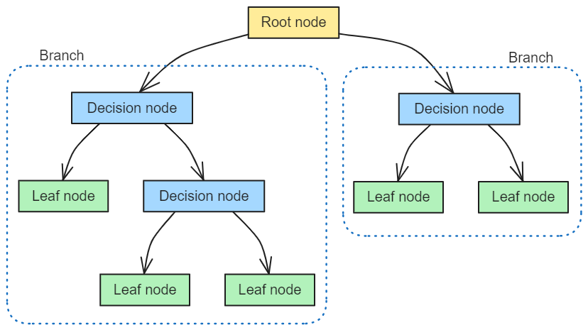
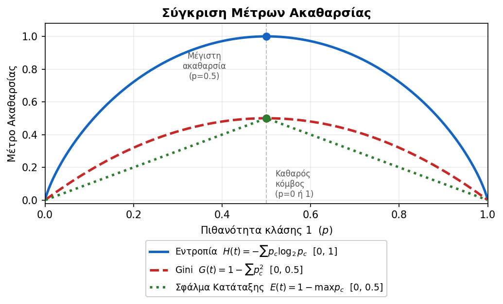
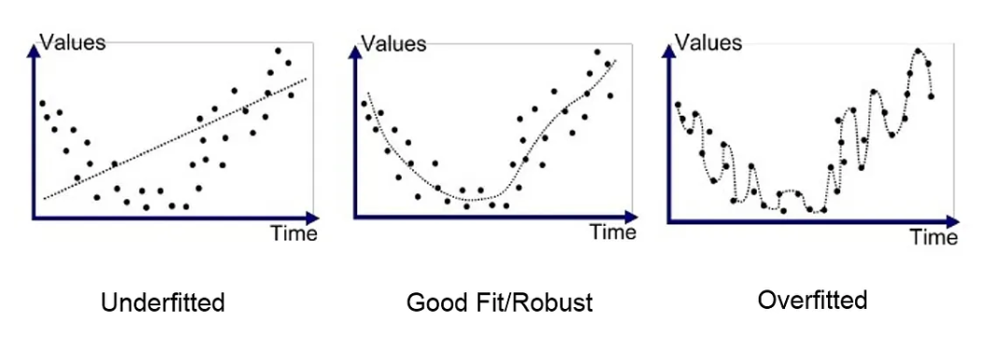
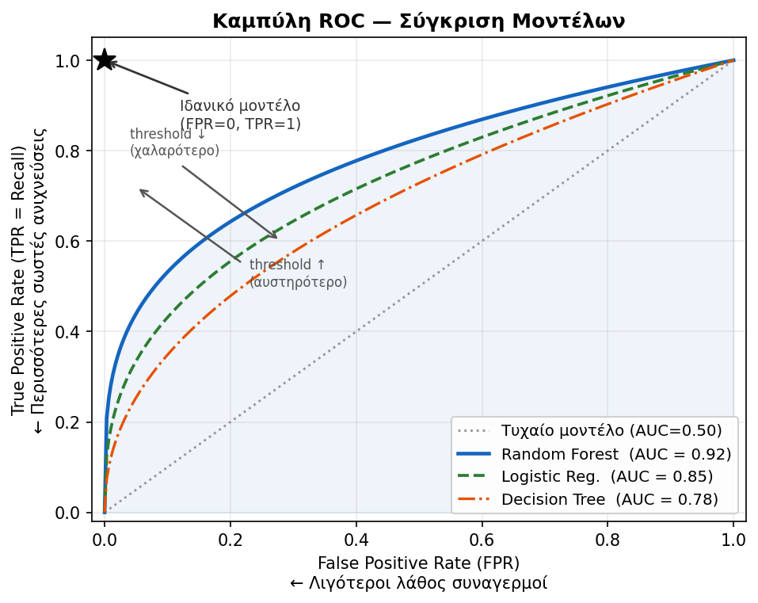
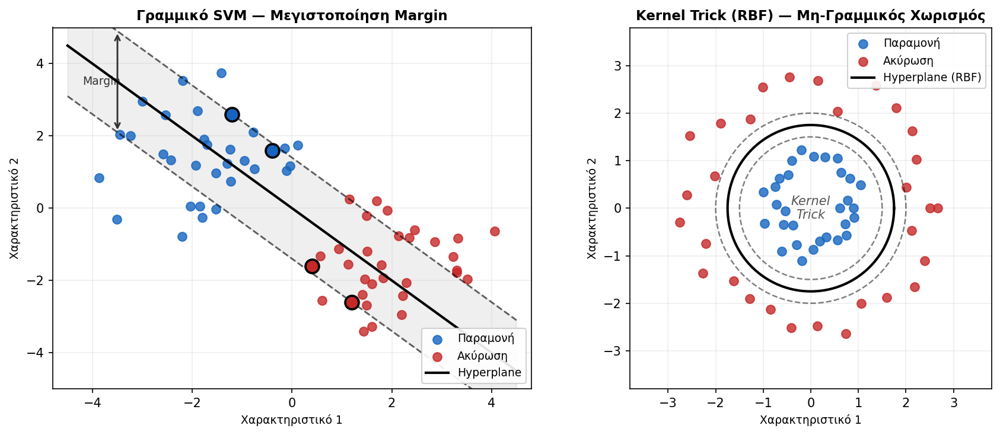
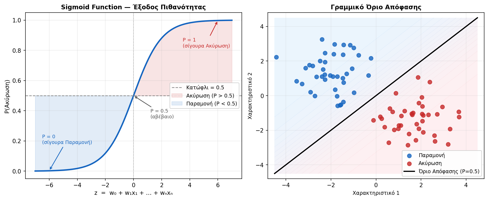
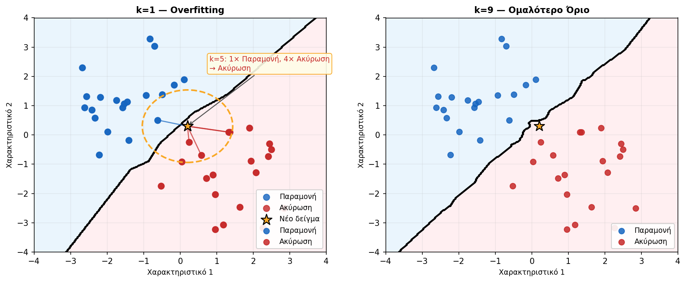
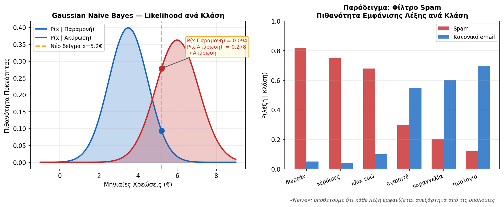
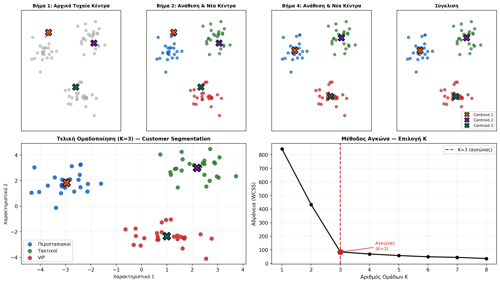

<div style="text-align:center; margin-bottom:16px;">


</div>

# Ευφυή Συστήματα και Συστήματα Υποστήριξης Αποφάσεων
**Ενότητα 6: Προβλεπτική Αναλυτική (Predictive Analytics)**
Τμήμα Μηχανικών Πληροφορικής & Υπολογιστών
Πανεπιστήμιο Δυτικής Αττικής

**Διδάσκων:** Ανάργυρος Τσαδήμας (<tsadimas@uniwa.gr>)

---

<!-- _class: small -->
# Τι είναι η Μηχανική Μάθηση;

Ο άνθρωπος κατανοεί το περιβάλλον του παρατηρώντας το και δημιουργώντας μια απλοποιημένη αναπαράσταση — ένα **μοντέλο (model)**. Αυτή η διαδικασία ονομάζεται **επαγωγική μάθηση (inductive learning)**.

Όταν ένα **υπολογιστικό σύστημα** δημιουργεί μοντέλα ή ανακαλύπτει πρότυπα (patterns) από δεδομένα, μιλάμε για **Μηχανική Μάθηση (Machine Learning)**.

**Βασικοί ορισμοί:**

> *«Η μελέτη υπολογιστικών μεθόδων για την απόκτηση νέας γνώσης, νέων δεξιοτήτων και νέων τρόπων οργάνωσης της υπάρχουσας γνώσης.»*
> — Carbonell (1987)

> *«Ένα πρόγραμμα μαθαίνει από εμπειρία **E** για εργασίες **T** και μετρική **P**, αν η απόδοσή του στις T βελτιώνεται με την E.»*
> — Mitchell (1997)

---

<!-- _class: xsmall -->
# Ενότητα 6 — Περίληψη

**Μέρος Α — Δέντρα Απόφασης σε Βάθος**
1. Προβλεπτική Αναλυτική & Κατηγορίες Μηχανικής Μάθησης
2. Δέντρα Απόφασης — Δομή, Αλγόριθμος Hunt, Τύποι Splits
3. Κριτήρια Διαχωρισμού: Gini, Εντροπία / Information Gain, Gain Ratio (C4.5), Σφάλμα Κατάταξης
4. Αλγόριθμοι: ID3, C4.5, CART — Πλεονεκτήματα & Μειονεκτήματα
5. Κλάδεμα (Pruning), Overfitting, Cross-Validation & Hyperparameter Tuning (Grid Search)
6. Αξιολόγηση: Confusion Matrix, Precision/Recall, F1, ROC/AUC, Διαστήματα Εμπιστοσύνης
7. Δέντρα Παλινδρόμησης — Variance Reduction & Αξιολόγηση (MAE, RMSE, R²)

**Μέρος Β — Ευρύτερη Εικόνα**
8. Άλλοι Αλγόριθμοι: Random Forests, Gradient Boosting (XGBoost/LightGBM), SVM, Logistic Regression, k-NN, Naive Bayes
9. Μη Εποπτευόμενη Μάθηση: K-Means Clustering
10. Προεπεξεργασία: Feature Scaling (StandardScaler) & One-Hot Encoding κατηγορικών
11. Σύγκριση Αλγορίθμων & Εργαστήριο: Churn Analysis

---
<!-- _class: xxsmall -->

# Τι είναι η Προβλεπτική Αναλυτική;


<div class="columns">


<div>

Η **Προβλεπτική Αναλυτική (Predictive Analytics)** απαντά στο ερώτημα: *«Τι είναι πιθανό να συμβεί στο μέλλον;»*

Ανήκει στο **3ο επίπεδο** της ιεραρχίας της Αναλυτικής:

| Επίπεδο | Τύπος | Ερώτηση | Εργαλεία |
| --- | --- | --- | --- |
| 1 | **Descriptive** (Περιγραφική) | *Τι έγινε;* | Dashboards, Reports |
| 2 | **Diagnostic** (Διαγνωστική) | *Γιατί έγινε;* | Drill-down, Correlations |
| **3** | **Predictive** (Προβλεπτική) | *Τι θα γίνει;* | **ML, Regression** |
| 4 | **Prescriptive** (Συνταγογραφική) | *Τι να κάνουμε;* | Optimization, RL |

> Στόχος: ο εντοπισμός **μοτίβων (patterns)** για πρόβλεψη μελλοντικών γεγονότων, συμπεριφορών και τάσεων — πριν αυτά συμβούν.

---

<!-- _class: small -->
# Κατηγορίες Μηχανικής Μάθησης

**Πώς «μαθαίνει» ένας αλγόριθμος;** Εξαρτάται από το αν έχουμε **ετικέτες** — τις «σωστές απαντήσεις» για κάθε παράδειγμα.

| Κατηγορία | Δεδομένα | Στόχος | Παραδείγματα χρήσης | Αλγόριθμοι |
|---|---|---|---|---|
| **Εποπτευόμενη** (Supervised) | Με ετικέτες | Ταξινόμηση ή Παλινδρόμηση | Churn, spam, τιμή ακινήτου | Decision Tree, SVM, k-NN |
| **Μη Εποπτευόμενη** (Unsupervised) | Χωρίς ετικέτες | Εύρεση δομής / ομάδων | Segmentation πελατών, fraud | K-Means, PCA, DBSCAN |
| **Ενισχυτική** (Reinforcement Learning) | Χωρίς ετικέτες | Βέλτιστη στρατηγική μέσω δοκιμής-λάθους | AlphaGo, αυτόνομα οχήματα | Q-Learning, PPO |

> **RLHF (ChatGPT):** παραλλαγή Ενισχυτικής — οι ανταμοιβές δίνονται από **ανθρώπους αξιολογητές** αντί από περιβάλλον, ώστε το μοντέλο να ευθυγραμμίζεται με ανθρώπινες προτιμήσεις.

---

<!-- _class: small -->
# Κατηγορίες Μηχανικής Μάθησης — Λεπτομέρειες

<div class="columns">

<div>

**Εποπτευόμενη (Supervised)**
Εκπαιδεύουμε με παραδείγματα που έχουν ετικέτα.

- **Ταξινόμηση:** πρόβλεψη κατηγορίας — *«θα ακυρώσει;» → Ναι/Όχι*
- **Παλινδρόμηση:** πρόβλεψη αριθμού — *«πόσο θα κοστίσει;»*

Απαιτεί labeled dataset (ιστορικά δεδομένα με γνωστή έκβαση).

</div>

<div>

**Μη Εποπτευόμενη (Unsupervised)**
Χωρίς ετικέτες — ανακαλύπτει δομή μόνος του.

- **Clustering:** φυσικές ομάδες — *segmentation πελατών*
- **Μείωση διαστάσεων:** μετατρέπει πολλά features σε λίγα νέα, διατηρώντας τη μέγιστη πληροφορία — *PCA: 100 μεταβλητές → 2–3 άξονες για οπτικοποίηση*
- **Ανίχνευση ανωμαλιών:** outliers — *fraud detection*

</div>

<div>

**Ενισχυτική (Reinforcement Learning)**
Πράκτορας μαθαίνει μέσω **ανταμοιβής/ποινής**.

- Κύκλος: **Κατάσταση → Ενέργεια → Ανταμοιβή**
- Στόχος: μεγιστοποίηση συνολικής ανταμοιβής
- *AlphaGo, αυτόνομα οχήματα, ρομποτική*

> **RLHF:** ανταμοιβή από ανθρώπους αξιολογητές → ChatGPT.

</div>

</div>

---

# Εποπτευόμενη Μάθηση: Δέντρα Απόφασης
<!-- _class: small -->

Ένα **Δέντρο Απόφασης** κάνει διαδοχικές ερωτήσεις μέχρι να φτάσει σε μια πρόβλεψη — ακολουθείτε τους κλάδους από τη ρίζα μέχρι ένα φύλλο.

<div class="columns"><div>

**Δομή:**
* **Ρίζα (Root):** η πρώτη — πιο χρήσιμη — ερώτηση για ολόκληρο το dataset
* **Εσωτερικοί κόμβοι:** ερωτήσεις που εξειδικεύουν το υποσύνολο
* **Φύλλα (Leaves):** η τελική πρόβλεψη (π.χ. ΑΚΥΡΩΣΗ / ΠΑΡΑΜΟΝΗ)

</div><div>

**Γιατί είναι χρήσιμα:**
* **White-box:** βλέπεις *γιατί* έβγαλε κάθε πρόβλεψη — εξηγήσιμο σε πελάτη ή διευθυντή
* Δουλεύουν με αριθμούς **και** κατηγορίες ταυτόχρονα
* Δεν χρειάζονται κανονικοποίηση δεδομένων

</div></div>

> **Ορολογία:** «Δέντρο Απόφασης» είναι ο γενικός όρος — καλύπτει το **Δέντρο Ταξινόμησης** (πρόβλεψη κατηγορίας) και το **Δέντρο Παλινδρόμησης** (πρόβλεψη αριθμού). Στο Μέρος Α εστιάζουμε στην ταξινόμηση — τα δέντρα παλινδρόμησης καλύπτονται στο τέλος της ενότητας.

> **Βασικός κίνδυνος — Overfitting:** αν το δέντρο μεγαλώσει χωρίς όριο, «απομνημονεύει» τα training data αντί να γενικεύει. Λύση: Pruning & `max_depth`.

---

<!-- _class: xxsmall -->
# Δέντρο Απόφασης — Τυπικός Ορισμός & Φάσεις Κατασκευής

**Τυπικός Ορισμός:** Ένα Δέντρο Απόφασης είναι ένα **κατευθυνόμενο δέντρο** όπου:

* **Εσωτερικοί κόμβοι** → αντιπροσωπεύουν **χαρακτηριστικά (attributes)** του dataset. Κάθε εσωτερικός κόμβος του δένδρου ονοματίζεται με το όνομα ενός νέου χαρακτηριστικού που δεν έχει ήδη χρησιμοποιηθεί στο συγκεκριμένο κλαδί του δένδρου
* **Ακμές** → αντιπροσωπεύουν **τιμές ή συνθήκες** (predicates) του χαρακτηριστικού
* **Φύλλα (leaves)** → αντιπροσωπεύουν **κλάσεις** (ή τιμές στην παλινδρόμηση)

Ένα νέο παράδειγμα ταξινομείται ακολουθώντας τις ακμές από τη ρίζα έως ένα φύλλο.

**Κατασκευή — δύο φάσεις:**

<div class="columns">

<div>

**Φάση 1: Ανάπτυξη (Growing)**
* Ξεκινά από τη ρίζα
* Επιλέγει το **καλύτερο χαρακτηριστικό** για κάθε κόμβο (Gini, Εντροπία κ.ά.)
* Συνεχίζει αναδρομικά μέχρι τα φύλλα να γίνουν **καθαρά** ή να εφαρμοστεί **κριτήριο στάσης**

</div>

<div>

**Φάση 2: Κλάδεμα (Pruning)**
* Το μεγάλο δέντρο κάνει **Overfitting**
* Αφαιρούμε κλάδους που δεν βελτιώνουν την απόδοση σε νέα δεδομένα
* Στόχος: **απλούστερο δέντρο** με καλύτερη γενίκευση

</div>

</div>

> **Καθαρό φύλλο:** Κόμβος που περιέχει παραδείγματα *μίας μόνο κλάσης* — π.χ. 10 Ακυρώσεις, 0 Παραμονές. Δεν χρειάζεται άλλο split, η απάντηση είναι σίγουρη.

> **Κριτήριο στάσης:** Κανόνας που σταματά την ανάπτυξη *νωρίτερα* ακόμα κι αν τα φύλλα δεν είναι καθαρά — π.χ. «μέγιστο βάθος 5» ή «κόμβος με λιγότερα από 10 παραδείγματα δεν σπάει». Αποτρέπει το Overfitting.

> Οι πιο γνωστοί αλγόριθμοι: **ID3** (Shannon, 1948 / Quinlan, 1986), **C4.5** (Quinlan, 1993), **CART** (Breiman et al., 1984).

---

# Όροι 



---
<!-- _class: xsmall -->
# Αλγόριθμος Hunt — Αναδρομική Κατασκευή

Ο **Αλγόριθμος Hunt** είναι η θεμελιώδης διαδικασία στην οποία βασίζονται ID3, C4.5 και CART. Λειτουργεί **αναδρομικά** από τη ρίζα προς τα φύλλα:

<div class="columns">
<div>

**Ψευδοκώδικας `Hunt(Dt, t)`:**

```
αν Dt = ∅:
  → φύλλο: κλάση πλειοψηφίας γονέα
  ⚑ fallback για άγνωστες τιμές στα νέα δεδομένα
αν όλα στην ίδια κλάση c:
  → φύλλο με c  (καθαρό φύλλο)
αλλιώς:
  επέλεξε καλύτερο split (A, v)
  χώρισε Dt → Dt_left, Dt_right
  t.left  ← Hunt(Dt_left,  t.left)
  t.right ← Hunt(Dt_right, t.right)
```

</div>
<div>

**Παράδειγμα — 8 πελάτες (Churn):**

| Βήμα | Κόμβος | Σύνθεση | Ενέργεια |
|---|---|---|---|
| 1 | Ρίζα | 5✗ 3✓ | Split → MC > 70 |
| 2 | MC > 70 | 4✗ 0✓ | **Φύλλο 🔴 Ακύρωση** |
| 3 | MC ≤ 70 | 1✗ 3✓ | Split → Tenure < 12 |
| 4 | + Tenure < 12 | 1✗ 0✓ | **Φύλλο 🔴 Ακύρωση** |
| 5 | + Tenure ≥ 12 | 0✗ 3✓ | **Φύλλο 🟢 Παραμονή** |

</div>
</div>

> **Βασική αρχή:** «Διαίρει και βασίλευε» (*divide & conquer*) — κάθε αναδρομή λύνει ένα απλούστερο υπο-πρόβλημα. Ο αλγόριθμος είναι **greedy**: επιλέγει το καλύτερο split *εκείνη τη στιγμή*, χωρίς να κοιτά μπροστά.

---

<!-- _class: xxsmall -->
# Τύποι Διαχωρισμών (Splits)

Σε κάθε κόμβο, ο αλγόριθμος αποφασίζει **πώς θα χωρίσει** τα δεδομένα. Εξαρτάται από τον τύπο του χαρακτηριστικού:

**Διακριτά (Κατηγορικά) Χαρακτηριστικά:**

| Τύπος | Περιγραφή | Παράδειγμα |
| --- | --- | --- |
| **Πολυδύναμη διάσπαση** | Ένας κλάδος ανά τιμή | Contract: {Μηνιαίο, Ετήσιο, Διετές} → 3 κλάδοι |
| **Δυαδική διάσπαση** | Συγκεντρώνει τιμές σε 2 ομάδες | {Μηνιαίο} vs {Ετήσιο, Διετές} |

**Συνεχή (Αριθμητικά) Χαρακτηριστικά:**

* Πάντα **δυαδική διάσπαση** με κατώφλι: $A < v$ (ΝΑΙ/ΟΧΙ)
* Ο αλγόριθμος δοκιμάζει πολλαπλά κατώφλια $v$ και επιλέγει το καλύτερο
* Π.χ. Tenure: δοκιμάζει $v \in \{3, 6, 12, 24, ...\}$ μήνες

**Πλεονεκτήματα δυαδικής vs πολυδύναμης:**

| | Δυαδική | Πολυδύναμη |
| --- | --- | --- |
| Βάθος δέντρου | Μεγαλύτερο | Μικρότερο |
| Πολυπλοκότητα κόμβου | Απλή | Πολύπλοκη |
| Χρήση σε | CART, C4.5 | ID3 |


---

<!-- _class: xsmall -->
# Πώς Βρίσκεται το Κατώφλι σε Αριθμητικές Μεταβλητές;

**Ερώτηση:** Στο παράδειγμα Churn το δέντρο έκανε split στο `MonthlyCharges > 70€`. Πώς προέκυψε το **70**;

**Απάντηση:** Ο CART δοκιμάζει *όλες* τις ενδιάμεσες τιμές και επιλέγει αυτή με το χαμηλότερο Gini.

<div class="columns"><div>

**Αλγόριθμος για κάθε αριθμητική μεταβλητή:**

1. Ταξινόμησε τις μοναδικές τιμές στα training data
2. Υπολόγισε τα **midpoints** μεταξύ διαδοχικών τιμών
3. Για κάθε midpoint υπολόγισε:

$$\text{Gini}_\text{split} = \frac{n_L}{n}G(L) + \frac{n_R}{n}G(R)$$

4. Επέλεξε το threshold με το **ελάχιστο** $\text{Gini}_\text{split}$

</div><div>

**Παράδειγμα — MonthlyCharges:**

Ταξινομημένες τιμές στα data:
`20, 35, 50, 65, 70, 80, 90`

Υποψήφια thresholds (midpoints):
`27.5, 42.5, 57.5, 67.5, 75.0, 85.0`

| Threshold | Gini split | |
|---|---|---|
| 27.5€ | 0.47 | ❌ |
| 42.5€ | 0.44 | ❌ |
| 57.5€ | 0.38 | ❌ |
| **67.5€** | **0.29** | ✅ καλύτερο |
| 75.0€ | 0.31 | ❌ |

→ Το «70» είναι το midpoint που **πραγματικά** χώρισε καλύτερα τους churners στα data.

> Αν έχεις 5 features × 1.000 τιμές → ~5.000 δοκιμές **ανά κόμβο**.

</div></div>

---

<!-- _class: small -->
# Πώς Βρίσκεται το Καλύτερο Split σε Κατηγορικές Μεταβλητές;

Για κατηγορικές μεταβλητές ο CART δοκιμάζει **όλους τους δυνατούς διαχωρισμούς σε 2 ομάδες**.

<div class="columns"><div>

**Παράδειγμα — Contract (3 τιμές):**

| Split | Αριστερά | Δεξιά |
|---|---|---|
| 1 | {Month-to-month} | {One year, Two year} |
| 2 | {One year} | {Month-to-month, Two year} |
| 3 | {Two year} | {Month-to-month, One year} |

Για κάθε partition → weighted Gini → επιλέγει το καλύτερο.

Γενικά για $k$ κατηγορίες: $2^{k-1} - 1$ δοκιμές
* k=3 → **3** δοκιμές
* k=5 → **15** δοκιμές
* k=10 → **511** δοκιμές

</div><div>

**Γιατί το sklearn απαιτεί αριθμητική κωδικοποίηση;**

Το sklearn δεν χειρίζεται κατηγορικές τιμές απευθείας — γι' αυτό χρησιμοποιούμε `LabelEncoder`:

```python
Month-to-month → 0
One year       → 1
Two year       → 2
```

Ο CART τις αντιμετωπίζει ως αριθμητικές και δοκιμάζει thresholds `< 0.5` και `< 1.5`, που αντιστοιχούν σε:
* `< 0.5` → {M-t-m} vs {One year, Two year}
* `< 1.5` → {M-t-m, One year} vs {Two year}

> ⚠️ Η σειρά κωδικοποίησης επηρεάζει ποιοι συνδυασμοί δοκιμάζονται. Για πλήρη αντιμετώπιση: `OneHotEncoder`.

</div></div>

---

<!-- _class: small -->
# Κριτήριο Διαχωρισμού: Gini Impurity & Gini Gain

Για να επιλέξουμε **ποιο feature χωρίζει καλύτερα**, μετράμε την **καθαρότητα** κάθε κόμβου με το **Gini Impurity** και την **βελτίωση** κάθε split με το **Gini Gain**:

$$G(t) = 1 - \sum_c p_c^2 \qquad \text{Gini Gain} = G(\text{γονέας}) - \sum_v \frac{n_v}{n}\,G(v)$$

| Κόμβος | Σύνθεση | Gini | Ερμηνεία |
|---|---|---|---|
| Α | 50% ✗ / 50% ✓ | **0,50** | μέγιστη αναμείξη — χρειάζεται split |
| Β | 80% ✗ / 20% ✓ | **0,32** | σχεδόν καθαρός |
| Γ | 100% ✗ / 0% ✓ | **0,00** | απόλυτα καθαρός — φύλλο |

> **Κανόνας:** επιλέγουμε το feature με το **μεγαλύτερο Gini Gain** — αυτό που μειώνει περισσότερο την ακαθαρσία. Στις επόμενες διαφάνειες βλέπουμε πώς εφαρμόζεται βήμα-βήμα.

---

<!-- _class: xxsmall -->
# Δέντρο Απόφασης — Customer Churn (Εγκατάλειψη Πελάτη)

**Πλαίσιο:** Εταιρεία τηλεπικοινωνιών θέλει να προβλέψει ποιοι πελάτες κινδυνεύουν να ακυρώσουν τη σύνδεσή τους (*churn*), ώστε να επέμβει προληπτικά με προσφορά.

**Το μοντέλο εκπαιδεύτηκε** από ιστορικά δεδομένα χιλιάδων πελατών με γνωστή έκβαση (ακύρωσε / έμεινε). Τώρα ταξινομεί αυτόματα κάθε νέο πελάτη.

**Χρήστης:** τμήμα Retention Marketing — στέλνει στοχευμένη προσφορά μόνο στους πελάτες που το μοντέλο σημαιοδοτεί ως «υψηλό κίνδυνο ακύρωσης».

**Ενδεικτικές εγγραφές του dataset:**

| CustomerID | Tenure (μήνες) | MonthlyCharges (€) | Contract | TechSupport | **Churn** |
|---|---|---|---|---|---|
| C001 | 3 | 85 | Month-to-month | Όχι | **Ναι** |
| C002 | 48 | 60 | Two year | Ναι | **Όχι** |
| C003 | 8 | 92 | Month-to-month | Όχι | **Ναι** |
| C004 | 24 | 45 | One year | Ναι | **Όχι** |
| C005 | 6 | 52 | Month-to-month | Όχι | **Ναι** |
| C006 | 24 | 79 | Month-to-month | Όχι | **Ναι** |
| C007 | 36 | 88 | Month-to-month | Όχι | **Ναι** |
| C008 | 60 | 55 | Two year | Ναι | **Όχι** |

> Το **Churn** (στήλη-στόχος) είναι γνωστό μόνο για ιστορικά δεδομένα. Το μοντέλο μαθαίνει ποιοι συνδυασμοί χαρακτηριστικών οδηγούν σε ακύρωση. **5 ακυρώσεις, 3 παραμονές.**

---

<!-- _class: xxsmall -->
# Χτίζοντας το Δέντρο — Βήμα 1: Εύρεση Ρίζας

Δοκιμάζουμε κάθε split — επιλέγουμε το **μεγαλύτερο Gini Gain**. &nbsp; **Αρχικό Gini:** $1 - (5/8)^2 - (3/8)^2 = \mathbf{0{,}469}$

<div class="columns">

<div>

**Split A — Tenure < 12**

| Κλάδος | Σύνθεση | Gini |
|---|---|---|
| ΝΑΙ | C001✗ C003✗ C005✗ → 3 ΝAI/0 OXI | $0{,}00$ |
| ΟΧΙ | C002✓ C004✓ C006✗ C007✗ C008✓ → 2 ΝAI/3 OXI | $0{,}48$ |

$$\tfrac{3}{8}{\cdot}0 + \tfrac{5}{8}{\cdot}0{,}48 = 0{,}30 \;\Rightarrow\; \textbf{Gain A = 0,169}$$

</div>

<div>

**Split B — MonthlyCharges > 70**

| Κλάδος | Σύνθεση | Gini |
|---|---|---|
| ΝΑΙ | C001✗ C003✗ C006✗ C007✗ → 4 ΝAI/0 ΟΧΙ | $0{,}00$ |
| ΟΧΙ | C005✗ C002✓ C004✓ C008✓ → 1 ΝAI/3 ΟΧΙ | $0{,}375$ |

$$\tfrac{4}{8}{\cdot}0 + \tfrac{4}{8}{\cdot}0{,}375 = 0{,}1875 \;\Rightarrow\; \textbf{Gain B = 0,281}$$

> **Νικητής: MC > 70** — Gain 0,281 > 0,169 → γίνεται **ρίζα**.

</div>

</div>

---

<!-- _class: xxsmall -->
# Χτίζοντας το Δέντρο — Βήμα 2: Επόμενα Splits

Μετά τη ρίζα **MC > 70**, κάθε κλάδος εξετάζεται ξεχωριστά.

<div class="columns">

<div>

**Αριστερός (MC > 70):** C001✗ C003✗ C006✗ C007✗ → 4Ναι, 0Όχι
**Gini = 0,00** → Καθαρό! 🔴 **ΑΚΥΡΩΣΗ**

**Δεξιός (MC ≤ 70):** C005✗ C002✓ C004✓ C008✓ → 1Ναι, 3Όχι
**Gini = 0,375** → Χρειάζεται 2ο split. Δοκιμάζουμε **Tenure < 12:**

| Κλάδος | Περιεχόμενο | Gini |
|---|---|---|
| ΝΑΙ | C005(T=6) ✗ → 1Ναι, 0Όχι | $0{,}00$ |
| ΟΧΙ | C002✓ C004✓ C008✓ → 0Ναι, 3Όχι | $0{,}00$ |

**Gini Gain = 0,375** → Τέλειο split!
🔴 **ΝΑΙ: ΑΚΥΡΩΣΗ** · 🟢 **ΟΧΙ: ΠΑΡΑΜΟΝΗ**

</div>

<div>

**Τελικό δέντρο (2 επίπεδα):**

```
MC > 70;
├── ΝΑΙ → 🔴 ΑΚΥΡΩΣΗ
│         (C001, C003, C006, C007)
└── ΟΧΙ → Tenure < 12;
           ├── ΝΑΙ → 🔴 ΑΚΥΡΩΣΗ (C005)
           └── ΟΧΙ → 🟢 ΠΑΡΑΜΟΝΗ
                     (C002, C004, C008)
```

**Ερμηνεία:**
* MC > 70 → ακύρωση ανεξαρτήτως διάρκειας
* MC ≤ 70 + νέος (T < 12) → πιθανή ακύρωση
* MC ≤ 70 + παλιός (T ≥ 12) → παραμονή

> Το πλήρες dataset (επόμενη διαφάνεια) δίνει ρίζα **Tenure < 12** — η κατανομή αλλάζει με χιλιάδες εγγραφές.

</div>

</div>

---

<!-- _class: xxsmall -->
# Δέντρο Απόφασης — Customer Churn (πλήρες dataset)

> Το δέντρο εκπαιδεύτηκε σε πραγματικό dataset χιλιάδων πελατών. Με περισσότερα δεδομένα κανένα χαρακτηριστικό δεν χωρίζει τέλεια από μόνο του — ο αλγόριθμος προσθέτει επίπεδα και αναδεικνύει διαφορετική ρίζα (εδώ: **Tenure < 12**).


---

<!-- _class: xsmall -->
# Δέντρα Απόφασης: Ταξινόμηση Νέου Δεδομένου

**Φάση Εκπαίδευσης (Training):** Το μοντέλο χτίστηκε από ιστορικά δεδομένα. Τώρα έρχεται ένας **νέος πελάτης** που δεν τον έχει ξαναδεί — πώς τον ταξινομούμε;

**Νέος πελάτης:**

| Χαρακτηριστικό | Τιμή |
| --- | --- |
| Tenure | **5 μήνες** |
| MonthlyCharges | **55€** |
| Contract | **«Month-to-month»** |
| TechSupport | Όχι |

**Διαδρομή μέσα στο δέντρο (2 επίπεδα):**


1. **[1] Tenure < 12;** → 5 < 12 → **ΝΑΙ** *(νέος πελάτης)*
2. **[2] MonthlyCharges > 70€;** → 55 ≤ 70 → **ΟΧΙ** *(φτηνό πακέτο)*
3. Φτάνουμε σε φύλλο: **✗ ΑΚΥΡΩΣΗ**

> Η πρόβλεψη είναι άμεσα εξηγήσιμη: «*Φτηνό πακέτο αλλά νέος πελάτης χωρίς δέσμευση — συνήθως δοκιμαστικός, υψηλός κίνδυνος ακύρωσης.*»

**Μειονέκτημα — Overfitting:** Αν αφήσουμε το δέντρο να μεγαλώσει χωρίς όριο, φτιάχνει έναν κόμβο για κάθε παράδειγμα εκπαίδευσης — «απομνημονεύει» αντί να γενικεύει.

---

<!-- _class: small -->
# Δέντρα Απόφασης → Κανόνες IF-THEN

Κάθε **μονοπάτι** από τη ρίζα ως ένα φύλλο μετατρέπεται αυτόματα σε κανόνα IF-THEN:

```
ΑΝ Tenure < 12 ΚΑΙ MonthlyCharges > 70€
ΤΟΤΕ → ΑΚΥΡΩΣΗ  (κανόνας R1)

ΑΝ Tenure < 12 ΚΑΙ MonthlyCharges ≤ 70€ ΚΑΙ Contract = Μηνιαίο
ΤΟΤΕ → ΑΚΥΡΩΣΗ  (κανόνας R2)

ΑΝ Tenure ≥ 12 ΚΑΙ Contract ≠ Μηνιαίο
ΤΟΤΕ → ΠΑΡΑΜΟΝΗ  (κανόνας R3)
```

**Γιατί είναι σημαντικό:**
* Οι κανόνες είναι **ανεξάρτητοι** — μπορείς να τους εφαρμόσεις χωρίς το δέντρο
* Εξηγούν **γιατί** βγήκε η απόφαση σε γλώσσα επιχείρησης
* Μπορείς να **κλαδέψεις** κανόνες που καλύπτουν ελάχιστα παραδείγματα

> **Στη sklearn:** `export_text(dt, feature_names=[...])` εκτυπώνει το δέντρο ως κανόνες — το κάνουμε στο εργαστήριο.

---

<!-- _class: small -->
# Αλγόριθμοι Δέντρων Απόφασης — ID3, CART, C4.5

Όλοι λειτουργούν **greedy top-down** — δοκιμάζουν κάθε feature και επιλέγουν τη διάσπαση με το μεγαλύτερο Gain:

| Αλγόριθμος | Κριτήριο | Παλινδρόμηση | Pruning | sklearn |
|---|---|---|---|---|
| **ID3** (Quinlan, 1986) | Εντροπία / Info Gain | ❌ | ❌ | — |
| **C4.5** (Quinlan, 1993) | Εντροπία / GainRatio | ❌ | ❌ | — |
| **CART** (Breiman, 1984) | Gini Impurity | ✅ | ✅ | ✅ |

**Γιατί η sklearn χρησιμοποιεί CART:** δυαδικές διασπάσεις (βάση για Random Forest/Boosting), υποστηρίζει παλινδρόμηση, ενσωματωμένο pruning, ελεύθερη άδεια χρήσης.

> `criterion='gini'` ή `criterion='entropy'` επιλέγει μόνο το **μέτρο** — ο αλγόριθμος παραμένει πάντα CART.

---

<!-- _class: xxsmall -->
# Εντροπία & Information Gain — Αριθμητικό Παράδειγμα

Ίδιο dataset (8 πελάτες, 5 ✗ Ακύρωση / 3 ✓ Παραμονή). Τώρα χρησιμοποιούμε **Εντροπία** αντί για Gini — αυτό κάνει ο **ID3**:

$$H(t) = -\sum_c p_c \log_2 p_c \qquad \textbf{Αρχικό:}\; H = -\tfrac{5}{8}\log_2\tfrac{5}{8} - \tfrac{3}{8}\log_2\tfrac{3}{8} = 0{,}954$$

<div class="columns">
<div>

**Split A — MC > 70:**

| Κλάδος | Σύνθεση | Εντροπία |
|---|---|---|
| ΝΑΙ (n=4) | 4✗ 0✓ | $H = 0{,}000$ |
| ΟΧΙ (n=4) | 1✗ 3✓ | $H = -\tfrac{1}{4}\log_2\tfrac{1}{4} - \tfrac{3}{4}\log_2\tfrac{3}{4} = 0{,}811$ |

$$\text{Gain(MC>70)} = 0{,}954 - \left(\tfrac{4}{8}{\cdot}0 + \tfrac{4}{8}{\cdot}0{,}811\right) = \mathbf{0{,}548}$$

</div>
<div>

**Split B — Tenure < 12:**

| Κλάδος | Σύνθεση | Εντροπία |
|---|---|---|
| ΝΑΙ (n=3) | 3✗ 0✓ | $H = 0{,}000$ |
| ΟΧΙ (n=5) | 2✗ 3✓ | $H = -\tfrac{2}{5}\log_2\tfrac{2}{5} - \tfrac{3}{5}\log_2\tfrac{3}{5} = 0{,}971$ |

$$\text{Gain(Tenure<12)} = 0{,}954 - \left(\tfrac{3}{8}{\cdot}0 + \tfrac{5}{8}{\cdot}0{,}971\right) = \mathbf{0{,}347}$$

</div>
</div>

> **Νικητής: MC > 70** (Gain = 0,548 > 0,347) — ίδια απόφαση με Gini. Στην πράξη, Gini και Εντροπία **σπάνια διαφέρουν** στην επιλογή split — η πιο κρίσιμη παράμετρος είναι το βάθος του δέντρου.

---

<!-- _class: xsmall -->
# Gain Ratio — Η Βελτίωση του C4.5

**Πρόβλημα με το Information Gain:** ευνοεί attributes με **πολλές διακριτές τιμές** — π.χ. το `CustomerID` δίνει τέλεια εντροπία 0 σε κάθε κόμβο, άρα πάντα «νικά», αλλά είναι άχρηστο για γενίκευση.

**Λύση (C4.5):** διαιρούμε το Gain με τον **SplitInfo** — μια ποινή για splits με πολλούς κλάδους:

$$\text{GainRatio}(A) = \frac{\Delta\text{Info}(A)}{\text{SplitInfo}(A)} \qquad \text{SplitInfo}(A) = -\sum_i \frac{N(v_i)}{N}\log_2\frac{N(v_i)}{N}$$

<div class="columns">
<div>

**Παράδειγμα — CustomerID (8 μοναδικές τιμές):**

Κάθε κόμβος έχει 1 εγγραφή → Gain = 0,954 (τέλειο), αλλά:

$$\text{SplitInfo} = -8 \cdot \tfrac{1}{8}\log_2\tfrac{1}{8} = 3{,}000$$

$$\text{GainRatio} = \frac{0{,}954}{3{,}000} = \mathbf{0{,}318}$$

</div>
<div>

**Παράδειγμα — MC > 70 (2 κλάδοι, n=4 ο καθένας):**

$$\text{SplitInfo} = -2 \cdot \tfrac{4}{8}\log_2\tfrac{4}{8} = 1{,}000$$

$$\text{GainRatio} = \frac{0{,}548}{1{,}000} = \mathbf{0{,}548}$$

</div>
</div>

> **Αποτέλεσμα:** MC > 70 (0,548) >> CustomerID (0,318) — το GainRatio **τιμωρεί** attributes που δημιουργούν πολλούς, μικρούς κλάδους. Μεγαλύτερο SplitInfo → μικρότερο GainRatio.

---

# Μέτρα Ακαθαρσίας: Εντροπία, Gini, Σφάλμα Κατάταξης

<!-- _class: xsmall -->
$$H(t) = -\sum_c p_c \log_2 p_c \qquad G(t) = 1 - \sum_c p_c^2 \qquad E(t) = 1 - \max_c\, p_c$$




> **Σφάλμα Κατάταξης** $E(t)$: η πιθανότητα να κάνουμε λάθος αν προβλέπουμε πάντα την πλειοψηφική κλάση — μέγιστο 0,5 όταν οι κλάσεις ισοκατανέμονται, 0 σε καθαρό κόμβο. Στην πράξη χρησιμοποιείται λιγότερο από Gini/Εντροπία γιατί είναι λιγότερο ευαίσθητο στη σύνθεση των κόμβων.

---

<!-- _class: small -->
# Δέντρα Απόφασης — Πλεονεκτήματα & Μειονεκτήματα

<div class="columns"><div>

**Πλεονεκτήματα**

- **Ερμηνευσιμότητα (white-box):** η λογική φαίνεται απευθείας στο δέντρο / στους κανόνες IF-THEN — εξηγήσιμο σε μη-τεχνικούς
- **Αριθμητικά & κατηγορικά δεδομένα:** δεν απαιτεί κανονικοποίηση — για κατηγορικά features αρκεί Label Encoding, χωρίς ανάγκη για one-hot encoding
- **Ελάχιστη προεπεξεργασία:** χειρίζεται missing values, αντεπεξέρχεται σε outliers
- **Φυσική επιλογή χαρακτηριστικών:** σημαντικά features εμφανίζονται ψηλά στο δέντρο
- **Θεμέλιο ensemble μεθόδων:** Random Forests, Gradient Boosting βασίζονται σε δέντρα

</div><div>

**Μειονεκτήματα**

- **Overfitting:** το δέντρο «απομνημονεύει» τα training data — λύση: κλάδεμα (pruning) ή `max_depth`
- **Αστάθεια:** μικρές αλλαγές στα δεδομένα αλλάζουν δραστικά τη δομή — λύση: ensemble methods
- **Greedy αλγόριθμος:** σε κάθε κόμβο επιλέγει το καλύτερο split *εκείνη τη στιγμή*, χωρίς να κοιτά πώς θα επηρεαστούν οι επόμενοι κόμβοι — ένα «χειρότερο» τώρα split μπορεί να οδηγεί σε καλύτερο δέντρο συνολικά, αλλά δεν το εξετάζει
- **Μεροληψία σε ανισόρροπα datasets:** τείνει να προβλέπει την πλειοψηφική κλάση — λύση: `class_weight='balanced'`

</div></div>

---

<!-- _class: small -->
# Κλάδεμα Δέντρου (Pruning)

Ένα δέντρο που αναπτύσσεται ελεύθερα μέχρι να γίνουν καθαρά όλα τα φύλλα **απομνημονεύει** τα training data. Το Pruning μειώνει την πολυπλοκότητα.

**Δύο στρατηγικές:**

<div class="columns">

<div>

**Προ-κλάδεμα (Pre-pruning)**
Σταματάμε την ανάπτυξη *νωρίς* με κριτήρια:
* Μέγιστο βάθος δέντρου (π.χ. `max_depth=5`)
* Ελάχιστος αριθμός παραδειγμάτων σε κόμβο (`min_samples_split`)
* Το Gain πέφτει κάτω από κατώφλι

✓ Γρήγορο — ✗ Μπορεί να σταματήσει πολύ νωρίς

</div>

<div>

**Μετα-κλάδεμα (Post-pruning)**
Πρώτα αναπτύσσουμε πλήρως, μετά αφαιρούμε:

* **Αντικατάσταση υπο-δέντρου** *(Subtree Replacement)*: Αντικαθιστούμε έναν κλάδο με φύλλο που αντιπροσωπεύει την πλειοψηφία
* **Ανύψωση υπο-δέντρου** *(Subtree Raising)*: Ανεβάζουμε ένα παιδικό υπο-δέντρο να αντικαταστήσει τον γονέα

✓ Ακριβέστερο — ✗ Υπολογιστικά βαρύτερο

</div>

</div>

**Πώς αξιολογούμε αν αξίζει το κλάδεμα;** Με **validation set**: αφαιρούμε κλάδο → μετράμε αν η ακρίβεια σε δεδομένα εκτός εκπαίδευσης βελτιώνεται ή επιδεινώνεται.

> **Κανόνας:** Κλαδεύουμε αν η απλούστερη εκδοχή έχει **ίδια ή καλύτερη** απόδοση στο validation set. Αρχή της λιτότητας: το απλούστερο μοντέλο που εξηγεί τα δεδομένα είναι το προτιμότερο.

---

<!-- _class: xsmall -->


# Overfitting, Underfitting & Cross-Validation

Κάθε μοντέλο πρέπει να **γενικεύει** — να τα πάει καλά όχι μόνο στα δεδομένα που είδε, αλλά και σε νέα δεδομένα που δεν έχει ξαναδεί.

> **Train data:** Τα δεδομένα με τα οποία εκπαιδεύουμε το μοντέλο. **Test data:** Νέα δεδομένα που κρατάμε κρυφά για να ελέγξουμε αν το μοντέλο γενικεύει.

<div class="columns">

<div>

**Underfitting — «Πολύ απλό»:**

* Το μοντέλο δεν μαθαίνει ούτε τα βασικά μοτίβα
* Κάνει λάθη ακόμα και στα train data
* Π.χ. μοντέλο που λέει πάντα «Παραμονή» ανεξαρτήτως

**Overfitting — «Πολύ ειδικό»:**

* Το μοντέλο απομνημονεύει τα train data σαν «παπαγαλία»
* Αδυνατεί να γενικεύσει σε νέα δεδομένα
* Π.χ. δέντρο με 500 κόμβους που αντιγράφει κάθε παράδειγμα

</div>

<div>

**K-Fold Cross-Validation — αξιόπιστη μέτρηση:**

Αντί να ελέγξουμε μία φορά, ελέγχουμε $K$ φορές με διαφορετικά test data κάθε φορά:

1. Χώρισε τα δεδομένα σε $K$ ίσα τμήματα (π.χ. $K=5$)
2. Κάθε φορά: 1 τμήμα = test, τα υπόλοιπα 4 = train
3. Επανέλαβε 5 φορές — πήρε τον **μέσο όρο** των 5 αποτελεσμάτων

Έτσι αξιοποιούμε *όλα* τα δεδομένα για αξιολόγηση.

</div>

</div>

| | Σφάλμα στα Train data | Σφάλμα στα Test data |
| --- | --- | --- |
| **Underfitting** | Υψηλό | Υψηλό |
| **Ιδανικό** | Χαμηλό | Χαμηλό |
| **Overfitting** | Χαμηλό | **Υψηλό** |

---

# Fitting





---

<!-- _class: xsmall -->
# Hyperparameter Tuning — Grid Search

**Υπερπαράμετρος:** τιμή που **εμείς ορίζουμε** πριν την εκπαίδευση (π.χ. `max_depth`, `k` στο k-NN) — δεν μαθαίνεται από τα δεδομένα. Πώς βρίσκουμε την ιδανική τιμή;

<div class="columns">
<div>

**Grid Search — δοκίμασε τα πάντα:**

```python
from sklearn.model_selection import GridSearchCV

param_grid = {
    'max_depth':        [3, 5, 10, None],
    'min_samples_leaf': [1, 5, 10],
    'criterion':        ['gini', 'entropy']
}  # → 4 × 3 × 2 = 24 συνδυασμοί

gs = GridSearchCV(DecisionTreeClassifier(),
                  param_grid, cv=5,  # 5-fold CV
                  scoring='f1')
gs.fit(X_train, y_train)
print(gs.best_params_)
```

Κάθε συνδυασμός αξιολογείται με **5-Fold CV** → 24×5 = 120 εκπαιδεύσεις.

</div>
<div>

**Παράδειγμα αποτελέσματος:**

| max_depth | k (k-NN) | CV F1 |
|---|---|---|
| 3 | — | 0,81 |
| 5 | — | **0,87** ← best |
| 10 | — | 0,84 (overfitting) |
| — | 3 | 0,79 |
| — | 7 | 0,85 |
| — | 15 | 0,82 |

**Τι δίνει ο υπολογιστής:** το βέλτιστο `max_depth=5` — χωρίς να το μαντέψουμε.

> **Προσοχή:** Grid Search γίνεται **μόνο στο train set** (με CV). Το test set παραμένει κλειδωμένο μέχρι την τελική αξιολόγηση — αλλιώς «μολύνουμε» την αξιολόγηση.

</div>
</div>

---

<!-- _class: xsmall -->

# Αξιολόγηση Μοντέλων: Πίνακας Σύγχυσης

**Πρώτα: τι σημαίνει "Positive";** Σε αυτό το πρόβλημα, **Positive = Ακύρωση** (το γεγονός που θέλουμε να εντοπίσουμε). Negative = Παραμονή.

> *Φανταστείτε ότι εκπαιδεύσαμε το μοντέλο σε **500 πελάτες** (πλήρες dataset, όχι το mini-παράδειγμα των 8). Τα παρακάτω νούμερα είναι οι προβλέψεις του σε test set.*

<div class="columns"><div>

| | **Μοντέλο: Ακύρωση** | **Μοντέλο: Παραμονή** |
|---|---|---|
| **Πραγματ.: Ακύρωση** | ✅ **TP** = 80 | ❌ **FN** = 20 |
| **Πραγματ.: Παραμονή** | ❌ **FP** = 10 | ✅ **TN** = 390 |

> **Ανάγνωση:** Σειρά = η αλήθεια · Στήλη = η πρόβλεψη

</div><div>

**Πώς να θυμάστε τους όρους:**

| Όρος | True/False | Positive/Negative | Δηλαδή... |
|---|---|---|---|
| **TP** | ✅ Σωστή | Είπαμε Ακύρωση | Ακύρωσε ✓ |
| **TN** | ✅ Σωστή | Είπαμε Παραμονή | Έμεινε ✓ |
| **FP** | ❌ Λάθος | Είπαμε Ακύρωση | Έμεινε ✗ |
| **FN** | ❌ Λάθος | Είπαμε Παραμονή | Ακύρωσε ✗ |

- **FP** = «Λάθος Συναγερμός» → στείλαμε άσκοπη προσφορά
- **FN** = «Η Χασούρα» → χάσαμε πελάτη χωρίς να το ξέρουμε

> Σε Churn, **κοστος(FN) > κοστος(FP)**: καλύτερα μία άσκοπη προσφορά παρά ένας χαμένος πελάτης.

</div></div>

---

<!-- _class: xsmall -->
# Αξιολόγηση Μοντέλων: Βασικές Μετρικές

Από τον Πίνακα Σύγχυσης, εξάγουμε κρίσιμες μετρικές (χρησιμοποιώντας τα αριθμητικά παραδείγματα: TP=80, TN=390, FP=10, FN=20):

* **Ακρίβεια (Accuracy):** Ποσοστό σωστών προβλέψεων στο σύνολο.
  $$\text{Accuracy} = \frac{TP + TN}{TP + TN + FP + FN} = \frac{80 + 390}{500} = 94\%$$

  ⚠️ **Παραπλανητικό σε ανισόρροπα datasets.** Στο Churn, μόνο ~26% των πελατών ακυρώνουν (Positive). Ένα μοντέλο που λέει **πάντα «Παραμονή»** — χωρίς να μαθαίνει τίποτα — έχει accuracy 74%. Αν το dataset ήταν 95/5, θα είχε 95% accuracy. Ο αριθμός φαίνεται εντυπωσιακός, αλλά το μοντέλο έχει **TP=0** — δεν εντοπίζει κανέναν churner. Γι' αυτό χρειαζόμαστε Precision, Recall & F1.

* **Precision:** Από όσους *προβλέψαμε* ότι θα ακυρώσουν, πόσοι πραγματικά ακύρωσαν;
  $$\text{Precision} = \frac{TP}{TP + FP} = \frac{80}{90} \approx 88{,}9\%$$

* **Recall (Sensitivity):** Από όλους που *πραγματικά* ακύρωσαν, πόσους «πιάσαμε»;
  $$\text{Recall} = \frac{TP}{TP + FN} = \frac{80}{100} = 80\%$$

* **F1-Score:** Αρμονικός μέσος Precision & Recall — ισορροπεί και τα δύο.
  $$F_1 = 2 \cdot \frac{\text{Precision} \times \text{Recall}}{\text{Precision} + \text{Recall}} = 2 \cdot \frac{0{,}889 \times 0{,}80}{0{,}889 + 0{,}80} \approx 84{,}2\%$$

---

<!-- _class: xsmall -->
# Αξιολόγηση: Πόσο Αξιόπιστη είναι η Accuracy;

**Το πρόβλημα:** Μετρήσαμε 94% accuracy — αλλά αυτό εξαρτάται από το *συγκεκριμένο* test set που τύχαινε να έχουμε. Με διαφορετικό test set θα παίρναμε ίσως 91% ή 97%. Πόσο «σταθερή» είναι η μέτρηση;

**Η διαίσθηση — ψήφος σε δημοσκόπηση:**
> Όπως μια δημοσκόπηση σε 50 άτομα δίνει αναξιόπιστο αποτέλεσμα (+10%), ενώ σε 1000 άτομα είναι αξιόπιστο (±3%) — το ίδιο ισχύει για την accuracy: **μεγαλύτερο test set = στενότερο εύρος αβεβαιότητας**.

<div class="columns">
<div>

**Εύρος αβεβαιότητας ανά μέγεθος test set (accuracy ≈ 94%):**

| n (μέγεθος test set) | Εύρος αβεβαιότητας |
|---|---|
| 50 | ± 6,6% → [87,4%, 100%] ❌ |
| 100 | ± 4,7% → [89,3%, 98,7%] ⚠️ |
| 500 | ± 2,1% → [91,9%, 96,1%] ✅ |
| 1000 | ± 1,5% → [92,5%, 95,5%] ✅ |

> **Κανόνας:** χρειάζονται τουλάχιστον **n ≈ 500** για αξιόπιστη εκτίμηση (εύρος ±2%).

</div>
<div>

**Πρακτική χρήση — σύγκριση μοντέλων (n=500):**

| Μοντέλο | Accuracy | Εύρος 95% |
|---|---|---|
| Decision Tree | 94% | [91,9% — 96,1%] |
| Logistic Reg. | 92% | [89,6% — 94,4%] |

Τα εύρη **επικαλύπτονται** → δεν μπορούμε να πούμε με βεβαιότητα ότι ένα είναι καλύτερο — η διαφορά 2% μπορεί να είναι τύχη.

**Για τους λάτρεις των μαθηματικών:**
$$\text{CI}_{95\%} = \hat{p} \pm 1{,}96 \cdot \sqrt{\frac{\hat{p}(1-\hat{p})}{n}}$$

</div>
</div>

---

# Ανισόρροπα Datasets

**Το πρόβλημα:** Στο Churn dataset, μόνο 26% των πελατών ακυρώνουν. Αν το μοντέλο λέει **πάντα «Παραμονή»**, έχει 74% accuracy — αλλά δεν εντοπίζει κανέναν churner (TP=0). Η accuracy είναι παραπλανητική.

**Τρεις τρόποι αντιμετώπισης:**

| Τεχνική | Τι κάνει | Πότε |
|---|---|---|
| **Undersampling** | Αφαιρεί δείγματα πλειοψηφίας | Μεγάλο dataset, γρήγορη λύση |
| **Oversampling / SMOTE** | Προσθέτει (συνθετικά) δείγματα μειοψηφίας | Μικρό dataset, θέλουμε πληροφορία |
| **`class_weight='balanced'`** | Δίνει μεγαλύτερο βάρος στη μειοψηφική κλάση | Απλή λύση χωρίς αλλαγή στα δεδομένα |

> ⚠️ Οποιοδήποτε resampling εφαρμόζεται **μόνο στα training data** — ποτέ στα test data.

---

<!-- _class: small -->
# Το Δίλημμα Precision–Recall

**Πρώτα: τι είναι το κατώφλι (threshold);**
Ένας ταξινομητής δεν λέει απλώς «Ακύρωση/Παραμονή» — δίνει μια **πιθανότητα**, π.χ. $P(\text{Ακύρωση}) = 0{,}65$. Εμείς επιλέγουμε ένα **κατώφλι $t$**: αν $P > t$ → Ακύρωση, αλλιώς → Παραμονή. Προεπιλογή sklearn: $t = 0{,}5$.

<div class="columns"><div>

**Κατεβάζουμε το threshold ($t=0{,}3$):**
* «Ακύρωση» για κάθε πελάτη με $P > 0{,}3$
* Ταξινομούμε **περισσότερους** ως «Ακύρωση»
* **Recall ↑** — πιάνουμε περισσότερες πραγματικές ακυρώσεις
* **Precision ↓** — περισσότεροι λάθος συναγερμοί (FP ↑)

*Κατάλληλο όταν το FN κοστίζει πολύ* (Churn, ιατρική διάγνωση)

</div><div>

**Ανεβάζουμε το threshold ($t=0{,}7$):**
* «Ακύρωση» μόνο για πελάτες με $P > 0{,}7$
* Ταξινομούμε **λιγότερους** ως «Ακύρωση»
* **Precision ↑** — όταν λέμε «θα φύγει», σχεδόν πάντα έχουμε δίκιο
* **Recall ↓** — χάνουμε πολλές πραγματικές ακυρώσεις (FN ↑)

*Κατάλληλο όταν το FP κοστίζει πολύ* (spam, νομικές αποφάσεις)

</div></div>

> **Business decision:** Η επιλογή του $t$ δεν είναι τεχνική — είναι επιχειρηματική. Εξαρτάται από το **κόστος κάθε λάθους**. Στο sklearn: `dt.predict_proba(X)[:, 1] > t`.

---


<!-- _class: xxsmall diagram-sm -->
# Καμπύλη ROC & AUC

<div class="columns">

<div>



</div>

<div>

**ROC** *(Receiver Operating Characteristic)* — δείχνει πώς αλλάζουν TPR και FPR για **κάθε δυνατό threshold** ταυτόχρονα. Κάθε σημείο = ένα $t$. Στόχος: καμπύλη κοντά στην **πάνω αριστερή γωνία**.

**Άξονες:**
* **TPR (= Recall)** $= \frac{TP}{TP+FN}$ — ποσοστό πραγματικών ακυρώσεων που πιάσαμε *(θέλουμε ↑)*
* **FPR** $= \frac{FP}{FP+TN}$ — ποσοστό παραμονών που σημαιοδοτήσαμε λανθασμένα *(θέλουμε ↓)*

**AUC** — ένας **μοναδικός αριθμός** ανεξάρτητος από threshold:

| AUC | Αξιολόγηση |
|---|---|
| 1.00 | Τέλειο ★ |
| > 0.90 | Εξαιρετικό |
| **0.82** ← διάγραμμα | **Καλό** ✓ |
| 0.70–0.80 | Αποδεκτό |
| 0.50 | Τυχαία μαντεψιά (διαγώνιος) |

</div>

</div>

---

<!-- _class: xsmall -->
# Δέντρο Παλινδρόμησης — Ταξινόμηση vs Παλινδρόμηση

Το ίδιο δέντρο, διαφορετικός στόχος: αντί για κατηγορία, προβλέπουμε **αριθμό**.

<div class="columns">

<div>

**Δέντρο Ταξινόμησης**

* Στόχος: «Θα ακυρώσει;» → **Ναι / Όχι**
* Κριτήριο split: **Gini / Εντροπία**
* Φύλλο δίνει: **κλάση πλειοψηφίας**
* Αξιολόγηση: Accuracy, F1, ROC

**Παράδειγμα φύλλου:**
→ 8 Ακυρώσεις, 2 Παραμονές → **ΑΚΥΡΩΣΗ** (80%)

</div>

<div>

**Δέντρο Παλινδρόμησης**

* Στόχος: «Πόσο χρεώνεται;» → **αριθμός €**
* Κριτήριο split: **Variance Reduction** (μείωση διασποράς)
* Φύλλο δίνει: **μέσο όρο** τιμών του υποσυνόλου
* Αξιολόγηση: RMSE, MAE

**Παράδειγμα φύλλου:**
→ Tenure ≥ 12 & Contract = TwoYear
→ MonthlyCharges: 48, 45 → **πρόβλεψη: 46,5€**

</div>

</div>

> **Κοινά:** δομή δέντρου, greedy top-down ανάπτυξη, pruning, overfitting — **όλα ίδια**. Διαφέρει μόνο το κριτήριο split και η έξοδος του φύλλου. Στη sklearn: `DecisionTreeClassifier` vs `DecisionTreeRegressor`.

---

<!-- _class: xsmall -->
# Δέντρο Παλινδρόμησης — Κριτήριο Split: Variance Reduction

**Ερώτηση:** Πώς επιλέγουμε σε ποιο feature και τιμή να κάνουμε split;

Αντί για Gini, μετράμε πόσο **μειώνεται η διασπορά (MSE)** μετά τη διάσπαση:

$$\text{Variance Reduction} = \mathrm{MSE}_{\text{parent}} - \left(\frac{n_L}{n}\,\mathrm{MSE}_L + \frac{n_R}{n}\,\mathrm{MSE}_R\right)$$

Όπου $\mathrm{MSE} = \frac{1}{n}\sum_{i=1}^{n}(y_i - \bar{y})^2$, δηλαδή η **μέση τετραγωνική απόκλιση** των τιμών στόχου από τον μέσο όρο τους.

**Αντιστοιχία με ταξινόμηση:**

| | Ταξινόμηση | Παλινδρόμηση |
|---|---|---|
| Μέτρο «ακαθαρσίας» | Gini Impurity | Variance (MSE) |
| Κριτήριο επιλογής | Gini Gain | Variance Reduction |
| Τιμή φύλλου | Κλάση πλειοψηφίας | Μέσος όρος ($\bar{y}$) |

> **Στόχος:** επιλέγουμε το split που **μεγιστοποιεί** το Variance Reduction — δηλαδή τα υποσύνολα να είναι όσο πιο ομοιογενή γίνεται.

---

<!-- _class: xxsmall -->
# Δέντρο Παλινδρόμησης — Βήμα-βήμα Παράδειγμα

**Στόχος:** Πρόβλεψη `MonthlyCharges` (€) από `Tenure` και `Contract`.

<div class="columns">

<div>

**Dataset (6 πελάτες):**

| ID | Tenure | Contract | MC (€) |
|---|---|---|---|
| P1 | 3 | Monthly | 75 |
| P2 | 6 | Monthly | 72 |
| P3 | 12 | Annual | 55 |
| P4 | 24 | Annual | 50 |
| P5 | 36 | TwoYear | 48 |
| P6 | 30 | TwoYear | 45 |

$\bar{y} = 57{,}5€$, $\text{MSE}_{\text{πριν}} = 137{,}6$

</div>

<div>

**Βήμα 1 — Δοκιμάζουμε split: Tenure < 12**

* **Αριστερά (P1, P2):** τιμές 75, 72
  $\bar{y}_L = \frac{75+72}{2} = 73{,}5$ &nbsp;·&nbsp; $\mathrm{MSE}_L = \frac{(75-73{,}5)^2+(72-73{,}5)^2}{2} = \frac{2{,}25+2{,}25}{2} = 2{,}25$
* **Δεξιά (P3–P6):** τιμές 55, 50, 48, 45
  $\bar{y}_R = \frac{55+50+48+45}{4} = 49{,}5$ &nbsp;·&nbsp; $\mathrm{MSE}_R = 13{,}25$
* Σταθμισμένο MSE: $\frac{2}{6}(2{,}25)+\frac{4}{6}(13{,}25) = 9{,}6$
* **Variance Reduction = 137,6 − 9,6 = 128,0** ✅

**Βήμα 2 — Δεξιός κλάδος (Tenure ≥ 12), split: Contract**

* Annual (P3, P4): $\bar{y} = 52{,}5$, $\text{MSE} = 6{,}25$
* TwoYear (P5, P6): $\bar{y} = 46{,}5$, $\text{MSE} = 2{,}25$
* **Variance Reduction = 9,0** ✅

**Τελικό δέντρο:**
```
Tenure < 12
├── ΝΑΙ → 73,5€  (P1, P2)
└── ΟΧΙ → Contract = Annual?
           ├── ΝΑΙ → 52,5€  (P3, P4)
           └── ΟΧΙ → 46,5€  (P5, P6)
```

</div>

</div>

---

<!-- _class: xxsmall -->
# Δέντρο Παλινδρόμησης — Πρόβλεψη Νέου Δεδομένου

**Νέος πελάτης:**

| Χαρακτηριστικό | Τιμή |
|---|---|
| Tenure | **18 μήνες** |
| Contract | **Annual** |

**Διαδρομή μέσα στο δέντρο:**

1. **Tenure < 12;** → 18 ≥ 12 → **ΟΧΙ** *(παλαιός πελάτης)*
2. **Contract = Annual;** → Ναι → **Φύλλο: 52,5€**

**Πρόβλεψη: `MonthlyCharges ≈ 52,5€`**

> Το φύλλο δεν δίνει κατηγορία — δίνει τον **μέσο όρο** των τιμών εκπαίδευσης που έφτασαν εκεί. Για νέες τιμές-στόχου εκτός του εύρους εκπαίδευσης, το δέντρο παλινδρόμησης **δεν εξωπολεί** — επιστρέφει πάντα μέσο όρο υπάρχοντος φύλλου.

**Αξιολόγηση μοντέλου:**

| Μέτρο | Τύπος | Ερμηνεία |
|---|---|---|
| **MAE** | $\frac{1}{n}\sum\lvert y_i - \hat{y}_i\rvert$ | Μέσο απόλυτο σφάλμα σε € |
| **RMSE** | $\sqrt{\frac{1}{n}\sum(y_i-\hat{y}_i)^2}$ | Τιμωρεί μεγάλα σφάλματα περισσότερο |
| **R²** | $1 - \frac{\mathrm{MSE}_{\text{model}}}{\mathrm{MSE}_{\text{baseline}}}$ | 1 = τέλειο, 0 = μέσος όρος baseline |

---
<!-- _class: section -->

# Μέρος Β: Άλλοι Αλγόριθμοι — Ευρύτερη Εικόνα

Κατακτήσαμε τα **Δέντρα Απόφασης** σε βάθος — δομή, κριτήρια, pruning, αξιολόγηση.

Τώρα βλέπουμε άλλους αλγορίθμους **σε επίπεδο κατανόησης**: τι κάνουν, πότε τα χρησιμοποιούμε, ποια είναι τα πλεονεκτήματά τους.

> Δεν απαιτείται εξίσου βαθιά γνώση μαθηματικών — αρκεί να ξέρετε **ποιον αλγόριθμο να επιλέξετε** και **γιατί**.

---
<!-- _class: xsmall -->

# Εποπτευόμενη Μάθηση: Random Forests

Ένα μόνο δέντρο κάνει Overfitting. Η λύση: **«Σοφία του Πλήθους»** — φτιάχνουμε εκατοντάδες διαφορετικά δέντρα και ψηφίζουν μαζί.

**Πώς λειτουργεί — Bagging (Bootstrap Aggregating):**

> **Bagging:** Αντί να δούμε *όλα* τα δεδομένα, κάθε δέντρο εκπαιδεύεται σε ένα **τυχαίο δείγμα** από αυτά. Έτσι κάθε δέντρο «μαθαίνει» λίγο διαφορετικά πράγματα.

1. Πάρε τυχαίο δείγμα από τα δεδομένα → εκπαίδευσε ένα δέντρο
2. Επανέλαβε $N$ φορές (π.χ. 100 ή 500 δέντρα)
3. Νέο δεδομένο: κάθε δέντρο ψηφίζει → κερδίζει η **πλειοψηφία**

<div class="columns">

<div>

**Γιατί εξαλείφει το Overfitting;**

* Κάθε δέντρο κάνει διαφορετικά λάθη
* Στη ψηφοφορία τα λάθη **αλληλοακυρώνονται**
* Το σωστό σήμα ενισχύεται, ο «θόρυβος» εξαφανίζεται

</div>

<div>

**Bonus — Feature Importance:**
Το Random Forest μετράει αυτόματα **ποια χαρακτηριστικά χρησιμοποίησε περισσότερο** για να πάρει αποφάσεις. Π.χ.: «Η μηνιαία χρέωση επηρεάζει περισσότερο από την ηλικία».

</div>

</div>

---

<!-- _class: xsmall -->
# Εποπτευόμενη Μάθηση: Gradient Boosting (XGBoost / LightGBM)

Το Random Forest φτιάχνει δέντρα **παράλληλα** και ψηφίζουν. Το Boosting φτιάχνει δέντρα **σειριακά** — κάθε νέο δέντρο επικεντρώνεται στα **λάθη** του προηγούμενου:

<div class="columns">
<div>

**Random Forest (Bagging):**
```
Δέντρο 1: μαθαίνει από τυχαίο δείγμα
Δέντρο 2: μαθαίνει από τυχαίο δείγμα
Δέντρο 3: μαθαίνει από τυχαίο δείγμα
         ↓
    ψηφίζουν μαζί (πλειοψηφία)
```
Στόχος: **μείωση Variance** (overfitting)

</div>
<div>

**Gradient Boosting:**
```
Δέντρο 1: μαθαίνει από τα δεδομένα
Δέντρο 2: μαθαίνει από τα ΛΑΘΗ του 1
Δέντρο 3: μαθαίνει από τα ΛΑΘΗ του 2
         ↓
    αθροίζονται σταδιακά
```
Στόχος: **μείωση Bias** (underfitting)

</div>
</div>

**Γιατί κυριαρχεί στη βιομηχανία για tabular data:**

| | Random Forest | XGBoost / LightGBM |
|---|---|---|
| Ακρίβεια σε tabular data | ⭐⭐⭐ | ⭐⭐⭐⭐ |
| Ταχύτητα εκπαίδευσης | Παράλληλη → γρήγορη | Σειριακή → πιο αργή* |
| Υπερπαράμετροι | Λίγοι, εύκολοι | Περισσότεροι, ισχυρότεροι |
| Χρήση στη βιομηχανία | Ισχυρό baseline | **De facto πρότυπο** |

*\*LightGBM: εξαιρετικά γρήγορο ακόμα και σε μεγάλα datasets*

> **Kaggle competitions & επιχειρηματικά προβλήματα (fraud, churn, credit scoring):** XGBoost / LightGBM κερδίζουν σχεδόν πάντα έναντι άλλων αλγορίθμων σε δομημένα δεδομένα. Δεν χρειάζονται Feature Scaling (βασίζονται σε δέντρα).

---

# Εποπτευόμενη Μάθηση: Support Vector Machines (SVM)

**Ιδέα:** Φαντάσου ότι τα δεδομένα είναι κουκκίδες σε ένα επίπεδο — κόκκινες (Ακύρωση) και μπλε (Παραμονή). Θέλουμε να τραβήξουμε μια γραμμή που τις χωρίζει με τη **μεγαλύτερη δυνατή απόσταση** από τις πιο «δύσκολες» κουκκίδες.

<div class="columns">

<div>

**Βασικές Έννοιες:**

* **Hyperplane:** Η γραμμή διαχωρισμού (σε 2D: γραμμή, σε 3D: επίπεδο, σε ND: υπερεπίπεδο)
* **Margin:** Η «ζώνη ασφαλείας» εκατέρωθεν της γραμμής — όσο πλατύτερη, τόσο καλύτερη γενίκευση
* **Support Vectors:** Οι κουκκίδες που βρίσκονται *ακριβώς στα όρια* της ζώνης — αυτές και μόνο καθορίζουν τη γραμμή

</div>

<div>

**Kernel Trick — Όταν δεν υπάρχει ευθεία γραμμή:**

Μερικές φορές τα δεδομένα δεν χωρίζονται γραμμικά. Ο **kernel** τα «ανεβάζει» σε περισσότερες διαστάσεις όπου ο διαχωρισμός γίνεται εφικτός.

| Kernel | Πότε |
| --- | --- |
| **Linear** | Απλός γραμμικός χωρισμός |
| **RBF (Gaussian)** | Πολύπλοκα σχήματα — συχνότερος |

> **Black-box:** Σε αντίθεση με το Decision Tree, το SVM δεν εξηγεί εύκολα *γιατί* έβγαλε μια πρόβλεψη.

</div>

</div>

---

<!-- _class: xsmall -->

# Εποπτευόμενη Μάθηση: SVM — Οπτική Απεικόνιση



> **Αριστερά:** Γραμμικό SVM — η γραμμή μεγιστοποιεί την απόσταση (margin) από τα **support vectors** (σημεία με μαύρο περίγραμμα).
> **Δεξιά:** Kernel Trick (RBF) — δεδομένα που δεν χωρίζονται με ευθεία γραμμή «ανεβαίνουν» σε υψηλότερη διάσταση όπου ο διαχωρισμός είναι εφικτός.

---
<!-- _class: xsmall -->

# Εποπτευόμενη Μάθηση: Logistic Regression

**Ιδέα:** Παρά το όνομα, η Logistic Regression χρησιμοποιείται για **ταξινόμηση** (όχι παλινδρόμηση). Μετρά την *πιθανότητα* ενός δείγματος να ανήκει σε μια κλάση.

<div class="columns">

<div>

**Πώς λειτουργεί:**

Αντί για ευθεία γραμμή $y = ax + b$, χρησιμοποιεί τη **sigmoid function**:

$$P(y=1) = \frac{1}{1 + e^{-(w_0 + w_1 x_1 + \ldots + w_n x_n)}}$$

* Η έξοδος είναι πάντα στο $[0, 1]$ — ερμηνεύεται ως **πιθανότητα**
* Αν $P > 0.5$ → κλάση 1, αλλιώς κλάση 0
* Το κατώφλι (threshold) μπορεί να αλλάξει

</div>

<div>

**Χαρακτηριστικά:**

| | |
|---|---|
| **Ταχύτητα** | Πολύ γρήγορη εκπαίδευση |
| **Ερμηνεία** | Τα βάρη $w_i$ δείχνουν σημαντικότητα |
| **Γραμμικότητα** | Λειτουργεί καλά μόνο με γραμμικά διαχωρίσιμα δεδομένα |
| **Έξοδος** | Πιθανότητα (calibrated) |

> **Πότε να χρησιμοποιείται:** Baseline μοντέλο, ταξινόμηση με ερμηνεύσιμα αποτελέσματα (π.χ. πιστοληπτική ικανότητα, ιατρική διάγνωση).

</div>

</div>

---

# Εποπτευόμενη Μάθηση: Logistic Regression — Οπτική Απεικόνιση

<!-- _class: xsmall -->



> **Αριστερά:** Η sigmoid function μετατρέπει οποιοδήποτε αριθμό σε πιθανότητα $[0,1]$. Κάτω από 0.5 → Παραμονή, άνω → Ακύρωση.
> **Δεξιά:** Στο 2D χώρο χαρακτηριστικών, το μοντέλο χαράζει μια **ευθεία γραμμή** ως όριο απόφασης — το χρώμα δείχνει την προβλεπόμενη πιθανότητα.

---

# Εποπτευόμενη Μάθηση: k-Nearest Neighbors (k-NN)

**Ιδέα:** «Πες μου ποιοι είναι οι φίλοι σου και θα σου πω ποιος είσαι» — ένα νέο δείγμα ταξινομείται με βάση τους $k$ **πλησιέστερους γείτονές** του στα training data.

<div class="columns">

<div>

**Αλγόριθμος:**

1. Λάβε νέο δείγμα $x$
2. Βρες τους $k$ πιο κοντινούς γείτονες (με Euclidean distance ή άλλη μετρική)
3. Ψηφοφορία πλειοψηφίας → η πιο συχνή κλάση κερδίζει

**Επιλογή $k$:**
* Μικρό $k$ (π.χ. 1) → Overfitting
* Μεγάλο $k$ → Underfitting, «θολή» απόφαση
* Συνήθως δοκιμάζουμε $k = \sqrt{n}$ ως αφετηρία

</div>

<div>

**Χαρακτηριστικά:**

| | |
|---|---|
| **Εκπαίδευση** | Καμία — αποθηκεύει τα δεδομένα |
| **Πρόβλεψη** | Αργή σε μεγάλα datasets |
| **Ερμηνεία** | Διαισθητική |
| **Κλιμάκωση** | Απαιτεί normalization χαρακτηριστικών |

> **Lazy learner:** Ο k-NN δεν «μαθαίνει» ένα μοντέλο — κάνει όλη τη δουλειά κατά την πρόβλεψη. Κατάλληλος όταν τα δεδομένα δεν αλλάζουν συχνά.

</div>

</div>

---

# Εποπτευόμενη Μάθηση: k-NN — Οπτική Απεικόνιση



> **Αριστερά (k=1):** Το μοντέλο «αγκαλιάζει» κάθε σημείο — πολύπλοκο όριο, overfitting. Η πορτοκαλί ζώνη δείχνει τους 5 κοντινότερους γείτονες του νέου δείγματος (★).
> **Δεξιά (k=9):** Με μεγαλύτερο k, το όριο ομαλοποιείται — καλύτερη γενίκευση.

---

# Εποπτευόμενη Μάθηση: Naive Bayes

**Ιδέα:** Χρησιμοποιεί το **Θεώρημα Bayes** για να υπολογίσει την πιθανότητα κάθε κλάσης δεδομένων των χαρακτηριστικών. «Naive» γιατί υποθέτει ότι τα χαρακτηριστικά είναι **ανεξάρτητα** μεταξύ τους.

<div class="columns">

<div>

**Θεώρημα Bayes:**

$$P(\text{κλάση} \mid \mathbf{x}) = \frac{P(\mathbf{x} \mid \text{κλάση}) \cdot P(\text{κλάση})}{P(\mathbf{x})}$$

* $P(\text{κλάση})$: Prior — πόσο συχνή είναι η κλάση στα δεδομένα
* $P(\mathbf{x} \mid \text{κλάση})$: Likelihood — πόσο πιθανό είναι να δούμε τα χαρακτηριστικά $\mathbf{x}$ αν η κλάση είναι αυτή
* Επιλέγουμε την κλάση με τη **μέγιστη posterior πιθανότητα**

</div>

<div>

**Χαρακτηριστικά:**

| | |
|---|---|
| **Ταχύτητα** | Εξαιρετικά γρήγορος |
| **Δεδομένα** | Αποδίδει καλά με λίγα δεδομένα |
| **Υπόθεση** | Ανεξαρτησία — συχνά παραβιάζεται |
| **Εφαρμογές** | Spam filter, ανάλυση κειμένου |

> **Παράδειγμα:** Φίλτρο spam — υπολογίζει την πιθανότητα ένα email να είναι spam δεδομένης της παρουσίας λέξεων όπως «δωρεάν», «κέρδισες», κ.λπ.

</div>

</div>

---

# Εποπτευόμενη Μάθηση: Naive Bayes — Οπτική Απεικόνιση

<!-- _class: small -->



> **Αριστερά:** Για κάθε τιμή χαρακτηριστικού, το μοντέλο συγκρίνει P(x|Παραμονή) vs P(x|Ακύρωση) — επιλέγει την κλάση με την υψηλότερη πιθανότητα.
> **Δεξιά:** Φίλτρο spam — λέξεις όπως «δωρεάν» εμφανίζονται πολύ πιο συχνά σε spam, ενώ «τιμολόγιο» σε κανονικά email.

---

<!-- _class: small -->

# Μη Εποπτευόμενη Μάθηση: K-Means Clustering

**Ιδέα:** Χώρισε τα δεδομένα σε $K$ ομάδες έτσι ώστε τα μέλη κάθε ομάδας να **μοιάζουν μεταξύ τους** όσο το δυνατόν περισσότερο.

**Πώς λειτουργεί — βήμα προς βήμα:**

> **Centroid (κέντρο ομάδας):** Το «κέντρο βάρους» όλων των σημείων μιας ομάδας — ο μέσος όρος τους.

1. **Έναρξη:** Τοποθέτησε $K$ τυχαία κέντρα (centroids) στο χώρο
2. **Ανάθεση:** Κάθε σημείο πηγαίνει στην ομάδα του **πλησιέστερου** centroid
3. **Ενημέρωση:** Υπολόγισε νέο centroid = μέσος όρος των σημείων της ομάδας
4. **Επανάληψη** έως ότου τα κέντρα σταματήσουν να αλλάζουν

**Πώς επιλέγουμε το K; — Μέθοδος Αγκώνα (Elbow Method):**

Δοκίμασε $K=1,2,...,10$ και μέτρα το **άθροισμα αποστάσεων** κάθε σημείου από το centroid του. Βρες το $K$ όπου η βελτίωση «κοπάζει» (το σημείο αγκώνα στο γράφημα).

> **Εφαρμογή (Customer Segmentation):** K=3 → «Περιστασιακοί» / «Τακτικοί» / «VIP» — χωρίς να έχουμε δώσει ετικέτες από πριν!

---

# Μη Εποπτευόμενη Μάθηση: K-Means — Οπτική Απεικόνιση

<!-- _class: xxsmall -->



> **Πάνω:** 4 βήματα σύγκλισης — τα κέντρα (✕) μετακινούνται μέχρι να σταθεροποιηθούν.
> **Κάτω αριστερά:** Τελική ομαδοποίηση σε 3 segments. **Κάτω δεξιά:** Μέθοδος Αγκώνα — στο K=3 η βελτίωση «κοπάζει».

---

<!-- _class: xsmall -->
# ⚠️ Κανονικοποίηση Features (Feature Scaling)

**Το πρόβλημα:** Αλγόριθμοι βασισμένοι σε **αποστάσεις** (k-NN, SVM, K-Means) μετράνε πόσο «κοντά» είναι δύο σημεία:

$$d = \sqrt{(\Delta\text{Ηλικία})^2 + (\Delta\text{Εισόδημα})^2} = \sqrt{(25-30)^2 + (20000-80000)^2} \approx 60000$$

Η **Ηλικία εξαφανίζεται** — το Εισόδημα κυριαρχεί εντελώς στην απόσταση.

<div class="columns">
<div>

**Χωρίς Scaling — λανθασμένη απόσταση:**

| Πελάτης | Ηλικία | Εισόδημα | «Απόσταση» από Α |
|---|---|---|---|
| **Α** | 25 | 20.000 | — |
| Β | 30 | 20.500 | ≈ **500** (κοντά) |
| Γ | 26 | 80.000 | ≈ **60.000** (μακριά) |

Το μοντέλο λέει ότι ο Β είναι πολύ πιο «όμοιος» με τον Α — παρόλο που ο Γ έχει σχεδόν ίδια ηλικία.

</div>
<div>

**Με StandardScaler — σωστή απόσταση:**

Κάθε feature → μέση τιμή 0, τυπική απόκλιση 1:

$$x' = \frac{x - \mu}{\sigma}$$

Τώρα Ηλικία και Εισόδημα συνεισφέρουν **ισότιμα** στην απόσταση.

```python
from sklearn.preprocessing import StandardScaler
scaler = StandardScaler()
X_train = scaler.fit_transform(X_train)
X_test  = scaler.transform(X_test)  # ίδιος scaler!
```

</div>
</div>

| Αλγόριθμος | Χρειάζεται Scaling; |
|---|---|
| Decision Tree, Random Forest | ❌ Όχι — αποφασίζει με κατώφλια, όχι αποστάσεις |
| **k-NN, SVM, K-Means**, Logistic Reg., Neural Networks | ✅ **Ναι — χωρίς scaling το μοντέλο καταστρέφεται** |

---

<!-- _class: xsmall -->
# ⚠️ Κωδικοποίηση Κατηγορικών Δεδομένων (One-Hot Encoding)

**Το πρόβλημα:** Αλγόριθμοι όπως Logistic Regression, SVM, k-NN δέχονται **μόνο αριθμούς**. Τι κάνουμε με κατηγορικά features όπως `Συμβόλαιο: {"Μηνιαίο", "Ετήσιο", "Διετές"}`?

<div class="columns">
<div>

**❌ Λάθος: Label Encoding για nominal features**

```
Μηνιαίο  → 0
Ετήσιο   → 1
Διετές   → 2
```

Ο αλγόριθμος «νομίζει» ότι Διετές > Ετήσιο > Μηνιαίο — μια **ψεύτικη αριθμητική σχέση** που δεν υπάρχει.

*Label Encoding ΟΚ μόνο για ordinal features: Μικρό < Μεσαίο < Μεγάλο*

</div>
<div>

**✅ Σωστό: One-Hot Encoding**

Κάθε κατηγορία γίνεται ξεχωριστή στήλη 0/1:

| | is_Μηνιαίο | is_Ετήσιο | is_Διετές |
|---|---|---|---|
| Πελάτης Α | 1 | 0 | 0 |
| Πελάτης Β | 0 | 1 | 0 |
| Πελάτης Γ | 0 | 0 | 1 |

```python
pd.get_dummies(df, columns=['Συμβόλαιο'],
               drop_first=True)  # αποφυγή dummy trap
```

</div>
</div>

| Αλγόριθμος | Κατηγορικά features |
|---|---|
| Decision Tree, Random Forest, XGBoost | ✅ Χειρίζεται απευθείας (ή με Label Encoding) |
| **Logistic Reg., SVM, k-NN, K-Means** | ✅ **Απαιτείται One-Hot Encoding** |

---

<!-- _class: xxsmall -->
# Σύγκριση Αλγορίθμων

| Αλγόριθμος | Ερμηνευσιμότητα | Ταχύτητα | Ακρίβεια | Overfitting | Scaling |
| --- | --- | --- | --- | --- | --- |
| **Decision Tree** | ⭐⭐⭐ Υψηλή | ⭐⭐⭐ Γρήγορο | ⭐⭐ Μέτρια | Υψηλό | ❌ |
| **Random Forest** | ⭐⭐ Μέτρια | ⭐⭐ Μέτριο | ⭐⭐⭐ Υψηλή | Χαμηλό | ❌ |
| **XGBoost/LightGBM** | ⭐⭐ Μέτρια | ⭐⭐ Μέτριο | ⭐⭐⭐⭐ Πολύ Υψηλή | Χαμηλό | ❌ |
| **Logistic Reg.** | ⭐⭐⭐ Υψηλή | ⭐⭐⭐ Γρήγορο | ⭐⭐ Μέτρια | Χαμηλό | ✅ |
| **SVM** | ⭐ Χαμηλή | ⭐ Αργό | ⭐⭐⭐ Υψηλή | Χαμηλό | ✅ |
| **k-NN** | ⭐⭐ Μέτρια | ⭐ Αργό (predict) | ⭐⭐ Μέτρια | Μέτριο | ✅ |
| **Naive Bayes** | ⭐⭐⭐ Υψηλή | ⭐⭐⭐ Γρήγορο | ⭐ Χαμηλή | Χαμηλό | ❌ |
| **K-Means** | ⭐⭐ Μέτρια | ⭐⭐⭐ Γρήγορο | — (unsupervised) | — | ✅ |

**Πότε να επιλέξω τι;**

* **Decision Tree:** Εξηγησιμότητα κρίσιμη (ιατρική, νομική απόφαση)
* **Random Forest:** «Ασφαλής» επιλογή για tabular data — εξαιρετική ισορροπία
* **XGBoost / LightGBM:** De facto πρότυπο βιομηχανίας για tabular data — υψηλότερη ακρίβεια από Random Forest, κερδίζει σχεδόν πάντα σε Kaggle & επιχειρηματικά προβλήματα (fraud, churn, credit scoring)
* **Logistic Reg.:** Baseline & όταν χρειάζεται calibrated πιθανότητα (π.χ. πιστοληπτική ικανότητα)
* **SVM:** Υψηλοδιάστατα δεδομένα (text classification), μικρά datasets
* **k-NN:** Απλή baseline, μικρά datasets, όταν τα δεδομένα δεν αλλάζουν συχνά
* **Naive Bayes:** Ανάλυση κειμένου, spam filtering, πολύ λίγα δεδομένα
* **K-Means:** Εξερεύνηση, segmentation, όταν δεν έχουμε labels

> Δεν υπάρχει «καλύτερος» αλγόριθμος — **No Free Lunch Theorem** (Wolpert, 1996): κάθε αλγόριθμος υπερέχει σε κάποια προβλήματα και υστερεί σε άλλα.


