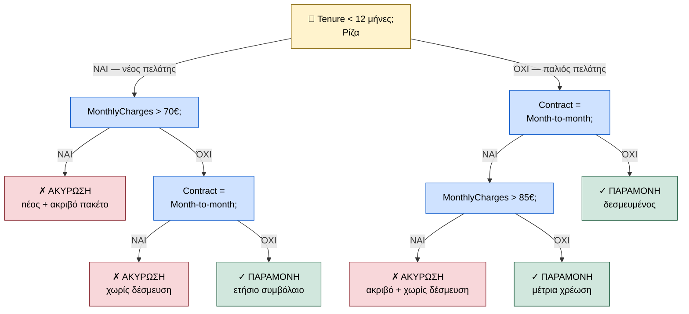

<div style="text-align:center; margin-bottom:16px;">


</div>

# Ευφυή Συστήματα και Συστήματα Υποστήριξης Αποφάσεων
**Ενότητα 6: Προβλεπτική Αναλυτική (Predictive Analytics)**
Τμήμα Μηχανικών Πληροφορικής & Υπολογιστών
Πανεπιστήμιο Δυτικής Αττικής

**Διδάσκων:** Ανάργυρος Τσαδήμας (<tsadimas@uniwa.gr>)

---

<!-- _class: xsmall -->
# Ενότητα 6 — Περίληψη

1. Τι είναι η Προβλεπτική Αναλυτική; — Τα 4 επίπεδα αναλυτικής
2. Κατηγορίες Μηχανικής Μάθησης
3. Εποπτευόμενη Μάθηση: Δέντρα Απόφασης (Decision Trees)
4. Δέντρο Απόφασης — Διάγραμμα
5. Δέντρα Απόφασης: Ταξινόμηση Νέου Δεδομένου
6. Κριτήριο Διαχωρισμού: Gini Impurity
7. Εποπτευόμενη Μάθηση: Random Forests & Bagging
8. Εποπτευόμενη Μάθηση: Support Vector Machines (SVM)
9. Μη Εποπτευόμενη Μάθηση: K-Means Clustering
10. Overfitting, Underfitting & Cross-Validation
11. Αξιολόγηση Μοντέλων: Πίνακας Σύγχυσης (Confusion Matrix)
12. Βασικές Μετρικές: Accuracy, Precision, Recall, F1
13. Το Δίλημμα Precision–Recall
14. Καμπύλη ROC & AUC
15. Σύγκριση Αλγορίθμων
16. Εργαστήριο: Πρόβλεψη Ακυρώσεων & Churn Analysis

---

# Τι είναι η Προβλεπτική Αναλυτική;

Η **Προβλεπτική Αναλυτική (Predictive Analytics)** απαντά στο ερώτημα: *«Τι είναι πιθανό να συμβεί στο μέλλον;»*

Ανήκει στο **4ο επίπεδο** της ιεραρχίας της Αναλυτικής:

| Επίπεδο | Τύπος | Ερώτηση | Εργαλεία |
| --- | --- | --- | --- |
| 1 | **Descriptive** (Περιγραφική) | *Τι έγινε;* | Dashboards, Reports |
| 2 | **Diagnostic** (Διαγνωστική) | *Γιατί έγινε;* | Drill-down, Correlations |
| **3** | **Predictive** (Προβλεπτική) | *Τι θα γίνει;* | **ML, Regression** |
| 4 | **Prescriptive** (Συνταγογραφική) | *Τι να κάνουμε;* | Optimization, RL |

> Στόχος: ο εντοπισμός **μοτίβων (patterns)** για πρόβλεψη μελλοντικών γεγονότων, συμπεριφορών και τάσεων — πριν αυτά συμβούν.

---

# Κατηγορίες Μηχανικής Μάθησης

<!-- _class: small -->

Το κεντρικό ερώτημα: **πώς «μαθαίνει» ένας αλγόριθμος από δεδομένα;** Εξαρτάται από το αν έχουμε ετικέτες.

> **Ετικέτα (label):** Η «σωστή απάντηση» για κάθε παράδειγμα. Π.χ. για κάθε πελάτη στο ιστορικό, ξέρουμε αν τελικά ακύρωσε ή όχι — αυτό είναι η ετικέτα.

<div class="columns">

<div>

### Εποπτευόμενη Μάθηση (Supervised)
Εκπαιδεύουμε το μοντέλο **με παραδείγματα που έχουν ετικέτα** — σαν να διορθώνουμε τις απαντήσεις ενός μαθητή.

**Δύο τύποι προβλημάτων:**

* **Ταξινόμηση (Classification):** Η απάντηση είναι **κατηγορία** (π.χ. «Ακύρωσε;» → Ναι/Όχι)
* **Παλινδρόμηση (Regression):** Η απάντηση είναι **αριθμός** (π.χ. «Πόσο θα κοστίζει;»)

</div>

<div>

### Μη Εποπτευόμενη Μάθηση (Unsupervised)
**Δεν έχουμε ετικέτες.** Ο αλγόριθμος αναλύει τα δεδομένα και ψάχνει μόνος του ομοιότητες και μοτίβα.

**Κύρια εφαρμογή:**

* **Ομαδοποίηση (Clustering):** Βρες φυσικές ομάδες μέσα στα δεδομένα (π.χ. «ποιοι πελάτες μοιάζουν μεταξύ τους;»)

</div>

</div>

> Υπάρχει και **Ενισχυτική Μάθηση (Reinforcement Learning)**: ένας «πράκτορας» κάνει ενέργειες και μαθαίνει μέσω **ανταμοιβής και ποινής** — σαν να εκπαιδεύουμε σκύλο (π.χ. AlphaGo, αυτόνομα αυτοκίνητα).

---

# Εποπτευόμενη Μάθηση: Δέντρα Απόφασης

Ένα Δέντρο Απόφασης λειτουργεί σαν παιχνίδι «20 ερωτήσεων»: κάνει διαδοχικές ερωτήσεις ΝΑΙ/ΌΧΙ μέχρι να φτάσει σε μια απάντηση.

* **Ρίζα (Root):** η πρώτη — και πιο χρήσιμη — ερώτηση για ολόκληρο το dataset
* **Εσωτερικοί κόμβοι:** κάθε επόμενη ερώτηση που εξειδικεύει το υποσύνολο
* **Φύλλα (Leaves):** τα τελικά «κουτιά» — η πρόβλεψη (π.χ. ΑΚΥΡΩΣΗ / ΠΑΡΑΜΟΝΗ)

**Γιατί είναι χρήσιμα:**

* **White-box μοντέλο:** βλέπεις ακριβώς *γιατί* έβγαλε κάθε πρόβλεψη — εξηγήσιμο σε πελάτη ή διευθυντή
* Δουλεύουν με αριθμούς και κατηγορίες ταυτόχρονα
* Δεν χρειάζονται κανονικοποίηση δεδομένων

**Μειονέκτημα — Overfitting:** Αν αφήσουμε το δέντρο να μεγαλώσει χωρίς όριο, φτιάχνει έναν κόμβο για κάθε παράδειγμα εκπαίδευσης — «απομνημονεύει» αντί να γενικεύει.

> Στις επόμενες διαφάνειες: το διάγραμμα του δέντρου και πώς ταξινομούμε έναν νέο πελάτη.

---

# Δέντρο Απόφασης — Διάγραμμα (Customer Churn)



---

<!-- _class: small -->
# Δέντρα Απόφασης: Ταξινόμηση Νέου Δεδομένου

**Φάση Εκπαίδευσης (Training):** Το μοντέλο χτίστηκε από ιστορικά δεδομένα. Τώρα έρχεται ένας **νέος πελάτης** που δεν τον έχει ξαναδεί — πώς τον ταξινομούμε;

**Νέος πελάτης:**

| Χαρακτηριστικό | Τιμή |
| --- | --- |
| Tenure | **5 μήνες** |
| MonthlyCharges | **78€** |
| Contract | **«Month-to-month»** |
| TechSupport | Όχι |

**Διαδρομή μέσα στο δέντρο:**

1. **[1] Tenure < 12;** → 5 < 12 → **ΝΑΙ** *(νέος πελάτης)*
2. **[2] MonthlyCharges > 70€;** → 78 > 70 → **ΝΑΙ** *(ακριβό πακέτο)*
3. Φτάνουμε σε φύλλο: **✗ ΑΚΥΡΩΣΗ**

> Η πρόβλεψη είναι άμεσα εξηγήσιμη: «*Προβλέπουμε ακύρωση γιατί ο πελάτης είναι νέος (5 μήνες) και πληρώνει υψηλό πακέτο (78€).*»

**Μειονέκτημα — Overfitting:** Αν αφήσουμε το δέντρο να μεγαλώσει χωρίς όριο, φτιάχνει έναν κόμβο για κάθε παράδειγμα εκπαίδευσης — «απομνημονεύει» αντί να γενικεύει.

---

<!-- _class: small -->
# Κριτήριο Διαχωρισμού: Gini Impurity

Σε κάθε κόμβο, το δέντρο πρέπει να επιλέξει **ποιο χαρακτηριστικό** δίνει την πιο χρήσιμη διάσπαση. Το κάνει μετρώντας πόσο «ανακατεμένες» είναι οι κλάσεις σε κάθε κόμβο — αυτό λέγεται **ακαθαρσία (impurity)**.

> **Intuition:** Ένας κόμβος με 100% Ακυρώσεις είναι **καθαρός** (ξέρουμε αμέσως την απάντηση). Ένας με 50% Ακυρώσεις / 50% Παραμονές είναι **πλήρως ανακατεμένος** (δεν μας λέει τίποτα).

**Gini Impurity** — το πιο συνηθισμένο μέτρο ακαθαρσίας:

$$Gini(t) = 1 - \sum_{i=1}^{C} p_i^2 \quad \text{όπου } p_i = \text{αναλογία κλάσης } i \text{ στον κόμβο}$$

| Κόμβος | Σύνθεση | Gini | Ερμηνεία |
| --- | --- | --- | --- |
| A | 50 Ακυρώσεις + 50 Παραμονές | $1-(0{,}5^2+0{,}5^2) = 0{,}50$ | Μέγιστη αναμείξη |
| B | 90 Ακυρώσεις + 10 Παραμονές | $1-(0{,}9^2+0{,}1^2) = 0{,}18$ | Σχεδόν καθαρός |

> Το δέντρο επιλέγει πάντα το χαρακτηριστικό που **μειώνει περισσότερο** το Gini — δηλαδή κάνει τους κόμβους-παιδιά όσο πιο «καθαρούς» γίνεται.

---

# Εποπτευόμενη Μάθηση: Random Forests

Ένα μόνο δέντρο κάνει Overfitting. Η λύση: **«Σοφία του Πλήθους»** — φτιάχνουμε εκατοντάδες διαφορετικά δέντρα και ψηφίζουν μαζί.

**Πώς λειτουργεί — Bagging (Bootstrap Aggregating):**

> **Bagging:** Αντί να δούμε *όλα* τα δεδομένα, κάθε δέντρο εκπαιδεύεται σε ένα **τυχαίο δείγμα** από αυτά. Έτσι κάθε δέντρο «μαθαίνει» λίγο διαφορετικά πράγματα.

1. Πάρε τυχαίο δείγμα από τα δεδομένα → εκπαίδευσε ένα δέντρο
2. Επανέλαβε $N$ φορές (π.χ. 100 ή 500 δέντρα)
3. Νέο δεδομένο: κάθε δέντρο ψηφίζει → κερδίζει η **πλειοψηφία**

<div class="columns">

<div>

**Γιατί εξαλείφει το Overfitting;**

* Κάθε δέντρο κάνει διαφορετικά λάθη
* Στη ψηφοφορία τα λάθη **αλληλοακυρώνονται**
* Το σωστό σήμα ενισχύεται, ο «θόρυβος» εξαφανίζεται

</div>

<div>

**Bonus — Feature Importance:**
Το Random Forest μετράει αυτόματα **ποια χαρακτηριστικά χρησιμοποίησε περισσότερο** για να πάρει αποφάσεις. Π.χ.: «Η μηνιαία χρέωση επηρεάζει περισσότερο από την ηλικία».

</div>

</div>

---

# Εποπτευόμενη Μάθηση: Support Vector Machines (SVM)

**Ιδέα:** Φαντάσου ότι τα δεδομένα είναι κουκκίδες σε ένα επίπεδο — κόκκινες (Ακύρωση) και μπλε (Παραμονή). Θέλουμε να τραβήξουμε μια γραμμή που τις χωρίζει με τη **μεγαλύτερη δυνατή απόσταση** από τις πιο «δύσκολες» κουκκίδες.

<div class="columns">

<div>

**Βασικές Έννοιες:**

* **Hyperplane:** Η γραμμή διαχωρισμού (σε 2D: γραμμή, σε 3D: επίπεδο, σε ND: υπερεπίπεδο)
* **Margin:** Η «ζώνη ασφαλείας» εκατέρωθεν της γραμμής — όσο πλατύτερη, τόσο καλύτερη γενίκευση
* **Support Vectors:** Οι κουκκίδες που βρίσκονται *ακριβώς στα όρια* της ζώνης — αυτές και μόνο καθορίζουν τη γραμμή

</div>

<div>

**Kernel Trick — Όταν δεν υπάρχει ευθεία γραμμή:**

Μερικές φορές τα δεδομένα δεν χωρίζονται γραμμικά. Ο **kernel** τα «ανεβάζει» σε περισσότερες διαστάσεις όπου ο διαχωρισμός γίνεται εφικτός.

| Kernel | Πότε |
| --- | --- |
| **Linear** | Απλός γραμμικός χωρισμός |
| **RBF (Gaussian)** | Πολύπλοκα σχήματα — συχνότερος |

> **Black-box:** Σε αντίθεση με το Decision Tree, το SVM δεν εξηγεί εύκολα *γιατί* έβγαλε μια πρόβλεψη.

</div>

</div>

---

# Μη Εποπτευόμενη Μάθηση: K-Means Clustering

**Ιδέα:** Χώρισε τα δεδομένα σε $K$ ομάδες έτσι ώστε τα μέλη κάθε ομάδας να **μοιάζουν μεταξύ τους** όσο το δυνατόν περισσότερο.

**Πώς λειτουργεί — βήμα προς βήμα:**

> **Centroid (κέντρο ομάδας):** Το «κέντρο βάρους» όλων των σημείων μιας ομάδας — ο μέσος όρος τους.

1. **Έναρξη:** Τοποθέτησε $K$ τυχαία κέντρα (centroids) στο χώρο
2. **Ανάθεση:** Κάθε σημείο πηγαίνει στην ομάδα του **πλησιέστερου** centroid
3. **Ενημέρωση:** Υπολόγισε νέο centroid = μέσος όρος των σημείων της ομάδας
4. **Επανάληψη** έως ότου τα κέντρα σταματήσουν να αλλάζουν

**Πώς επιλέγουμε το K; — Μέθοδος Αγκώνα (Elbow Method):**

Δοκίμασε $K=1,2,...,10$ και μέτρα το **άθροισμα αποστάσεων** κάθε σημείου από το centroid του. Βρες το $K$ όπου η βελτίωση «κοπάζει» (το σημείο αγκώνα στο γράφημα).

> **Εφαρμογή (Customer Segmentation):** K=3 → «Περιστασιακοί» / «Τακτικοί» / «VIP» — χωρίς να έχουμε δώσει ετικέτες από πριν!

---

# Overfitting, Underfitting & Cross-Validation

Κάθε μοντέλο πρέπει να **γενικεύει** — να τα πάει καλά όχι μόνο στα δεδομένα που είδε, αλλά και σε νέα δεδομένα που δεν έχει ξαναδεί.

> **Train data:** Τα δεδομένα με τα οποία εκπαιδεύουμε το μοντέλο. **Test data:** Νέα δεδομένα που κρατάμε κρυφά για να ελέγξουμε αν το μοντέλο γενικεύει.

<div class="columns">

<div>

**Underfitting — «Πολύ απλό»:**

* Το μοντέλο δεν μαθαίνει ούτε τα βασικά μοτίβα
* Κάνει λάθη ακόμα και στα train data
* Π.χ. μοντέλο που λέει πάντα «Παραμονή» ανεξαρτήτως

**Overfitting — «Πολύ ειδικό»:**

* Το μοντέλο απομνημονεύει τα train data σαν «παπαγαλία»
* Αδυνατεί να γενικεύσει σε νέα δεδομένα
* Π.χ. δέντρο με 500 κόμβους που αντιγράφει κάθε παράδειγμα

</div>

<div>

**K-Fold Cross-Validation — αξιόπιστη μέτρηση:**

Αντί να ελέγξουμε μία φορά, ελέγχουμε $K$ φορές με διαφορετικά test data κάθε φορά:

1. Χώρισε τα δεδομένα σε $K$ ίσα τμήματα (π.χ. $K=5$)
2. Κάθε φορά: 1 τμήμα = test, τα υπόλοιπα 4 = train
3. Επανέλαβε 5 φορές — πήρε τον **μέσο όρο** των 5 αποτελεσμάτων

Έτσι αξιοποιούμε *όλα* τα δεδομένα για αξιολόγηση.

</div>

</div>

| | Σφάλμα στα Train data | Σφάλμα στα Test data |
| --- | --- | --- |
| **Underfitting** | Υψηλό | Υψηλό |
| **Ιδανικό** | Χαμηλό | Χαμηλό |
| **Overfitting** | Χαμηλό | **Υψηλό** |

---

# Αξιολόγηση Μοντέλων: Πίνακας Σύγχυσης

Το βασικότερο εργαλείο αξιολόγησης ταξινομητή. Μας δείχνει τη **λεπτομερή εικόνα** των σωστών και λανθασμένων προβλέψεων.

| | **Προβλέψαμε: Ακύρωση** | **Προβλέψαμε: Παραμονή** |
| --- | --- | --- |
| **Πραγματικά: Ακύρωση** | **TP** = 80 ✓ | **FN** = 20 ✗ |
| **Πραγματικά: Παραμονή** | **FP** = 10 ✗ | **TN** = 390 ✓ |

* **True Positives (TP) = 80:** Προβλέψαμε ακύρωση → και ακύρωσε. *Σωστό!*
* **True Negatives (TN) = 390:** Προβλέψαμε παραμονή → και έμεινε. *Σωστό!*
* **False Positives (FP) = 10** *(«Λάθος Συναγερμός»)*: Προβλέψαμε ακύρωση, αλλά έμεινε. *Κόστος: άσκοπη προσφορά.*
* **False Negatives (FN) = 20** *(«Η μεγάλη χασούρα»)*: Προβλέψαμε παραμονή, αλλά έφυγε. *Κόστος: χαμένος πελάτης!*

> Σε προβλήματα Churn, το **FN είναι συνήθως πιο ακριβό** από το FP — προτιμάμε να «χάσουμε» λίγα χρήματα σε άσκοπες προσφορές παρά να χάσουμε έναν πελάτη.

---

<!-- _class: small -->
# Αξιολόγηση Μοντέλων: Βασικές Μετρικές

Από τον Πίνακα Σύγχυσης, εξάγουμε κρίσιμες μετρικές (χρησιμοποιώντας τα αριθμητικά παραδείγματα: TP=80, TN=390, FP=10, FN=20):

* **Ακρίβεια (Accuracy):** Ποσοστό σωστών προβλέψεων στο σύνολο.
  $$\text{Accuracy} = \frac{TP + TN}{TP + TN + FP + FN} = \frac{80 + 390}{500} = 94\%$$
  *(Προσοχή: Παραπλανητικό σε ανισόρροπα datasets — π.χ. 95% accuracy αν πούμε πάντα «Παραμονή»!)*

* **Precision:** Από όσους *προβλέψαμε* ότι θα ακυρώσουν, πόσοι πραγματικά ακύρωσαν;
  $$\text{Precision} = \frac{TP}{TP + FP} = \frac{80}{90} \approx 88{,}9\%$$

* **Recall (Sensitivity):** Από όλους που *πραγματικά* ακύρωσαν, πόσους «πιάσαμε»;
  $$\text{Recall} = \frac{TP}{TP + FN} = \frac{80}{100} = 80\%$$

* **F1-Score:** Αρμονικός μέσος Precision & Recall — ισορροπεί και τα δύο.
  $$F_1 = 2 \cdot \frac{\text{Precision} \times \text{Recall}}{\text{Precision} + \text{Recall}} = 2 \cdot \frac{0{,}889 \times 0{,}80}{0{,}889 + 0{,}80} \approx 84{,}2\%$$

---

# Το Δίλημμα Precision–Recall

Στον ταξινομητή, επιλέγουμε ένα **κατώφλι (threshold)** $t$ για την πιθανότητα: αν $P(\text{Ακύρωση}) > t$ → προβλέπουμε Ακύρωση.

**Κατεβάζουμε το threshold (π.χ. $t=0{,}3$):**

* Ταξινομούμε **περισσότερους** ως «Ακύρωση»
* **Recall ↑** (πιάνουμε περισσότερες πραγματικές ακυρώσεις)
* **Precision ↓** (περισσότεροι λάθος συναγερμοί)

**Ανεβάζουμε το threshold (π.χ. $t=0{,}7$):**

* Ταξινομούμε **λιγότερους** ως «Ακύρωση»
* **Precision ↑** (όταν λέμε «θα φύγει», σχεδόν πάντα έχουμε δίκιο)
* **Recall ↓** (χάνουμε πολλές πραγματικές ακυρώσεις)

> **Business decision:** Η επιλογή του threshold εξαρτάται από το **κόστος κάθε λάθους**. Για Churn: χαμηλό threshold → επιθετική παρακράτηση. Για ιατρική διάγνωση: χαμηλό threshold → λιγότερα FN (να μην χάσουμε ασθένεια).

---

<!-- _class: small -->
# Καμπύλη ROC & AUC

Η καμπύλη ROC απεικονίζει **όλες τις δυνατές επιλογές threshold** ταυτόχρονα.

<div class="columns">

<div>

**Ορισμοί:**
* **True Positive Rate (TPR) = Recall** = $\frac{TP}{TP + FN}$
* **False Positive Rate (FPR)** = $\frac{FP}{FP + TN}$

**Η καμπύλη:** Κάθε σημείο = ένα threshold. Ιδανικό μοντέλο → πάνω-αριστερά.

**AUC — Area Under the Curve:**
* AUC = 0.5 → τυχαία μαντεψιά (διαγώνιος)
* AUC = 0.7–0.8 → αποδεκτό μοντέλο
* AUC = 0.8–0.9 → καλό μοντέλο
* AUC > 0.9 → εξαιρετικό μοντέλο

</div>

<div>

**Σύγκριση Μοντέλων:**

| Μοντέλο | AUC |
| --- | --- |
| Random Forest | **0.92** |
| SVM (RBF) | 0.89 |
| Decision Tree | 0.78 |
| Logistic Reg. | 0.85 |
| Τυχαίο | 0.50 |

> AUC: θεωρητικά ερμηνεύεται ως η πιθανότητα το μοντέλο να κατατάξει υψηλότερα ένα τυχαίο θετικό παράδειγμα από ένα τυχαίο αρνητικό.

</div>

</div>

---

<!-- _class: small -->
# Σύγκριση Αλγορίθμων

| Αλγόριθμος | Ερμηνευσιμότητα | Ταχύτητα | Ακρίβεια | Overfitting |
| --- | --- | --- | --- | --- |
| **Decision Tree** | ⭐⭐⭐ Υψηλή | ⭐⭐⭐ Γρήγορο | ⭐⭐ Μέτρια | Υψηλό |
| **Random Forest** | ⭐⭐ Μέτρια | ⭐⭐ Μέτριο | ⭐⭐⭐ Υψηλή | Χαμηλό |
| **SVM** | ⭐ Χαμηλή | ⭐ Αργό | ⭐⭐⭐ Υψηλή | Χαμηλό |
| **K-Means** | ⭐⭐ Μέτρια | ⭐⭐⭐ Γρήγορο | — (unsupervised) | — |

**Πότε να επιλέξω τι;**

* **Decision Tree:** Όταν η **εξηγησιμότητα** είναι κρίσιμη (π.χ. ιατρική, νομική απόφαση)
* **Random Forest:** Ο «ασφαλής» αλγόριθμος για τα περισσότερα tabular datasets — εξαιρετική ισορροπία
* **SVM:** Υψηλοδιάστατα δεδομένα (π.χ. text classification), μικρά datasets
* **K-Means:** Εξερεύνηση δεδομένων, segmentation, όταν δεν έχουμε labels

> Δεν υπάρχει «καλύτερος» αλγόριθμος — **No Free Lunch Theorem** (Wolpert, 1996): κάθε αλγόριθμος υπερέχει σε κάποια προβλήματα και υστερεί σε άλλα.

---

# Εργαστήριο: Πρόβλεψη Ακυρώσεων & Churn Analysis

**Το Σενάριο (Business Problem):**
Μια εταιρεία τηλεπικοινωνιών χάνει πελάτες. Στόχος: να προβλέψουμε **ποιοι** πελάτες θα φύγουν, *πριν* φύγουν, ώστε το τμήμα Marketing να τους κάνει μια προσφορά παραμονής.

**Το Dataset (Telco Customer Churn):**

| Χαρακτηριστικό | Τύπος | Παράδειγμα |
| --- | --- | --- |
| `tenure` | Αριθμητικό | 12 (μήνες) |
| `MonthlyCharges` | Αριθμητικό | 65.5€ |
| `Contract` | Κατηγορικό | «Month-to-month» |
| `InternetService` | Κατηγορικό | «Fiber optic» |
| **`Churn`** | **Target (0/1)** | **1 = Ακύρωσε** |

**Τα Εργαλεία (Python Stack):** `Pandas` · `Scikit-learn` · `Matplotlib / Seaborn`

---

# Εργαστήριο: Τα Βήματα της Υλοποίησης

<div class="columns">

<div>

**Βήμα 1 — Φόρτωση & Καθαρισμός:**

```python
df = pd.read_csv('telco_churn.csv')
df.dropna(inplace=True)
df = pd.get_dummies(df,
    columns=['Contract',
             'InternetService'])
```

* Χειρισμός Missing Values
* **One-Hot Encoding** κατηγορικών

**Βήμα 2 — Train/Test Split:**

```python
X_train, X_test, y_train, y_test = \
  train_test_split(X, y,
    test_size=0.2,
    random_state=42)
```

</div>

<div>

**Βήμα 3 — Εκπαίδευση:**

```python
rf = RandomForestClassifier(
    n_estimators=100)
rf.fit(X_train, y_train)
```

**Βήμα 4 — Αξιολόγηση:**

```python
y_pred = rf.predict(X_test)
print(classification_report(
    y_test, y_pred))
# → Precision, Recall, F1
ConfusionMatrixDisplay\
    .from_predictions(
        y_test, y_pred)
```

</div>

</div>

> **Αναμενόμενα αποτελέσματα:** Random Forest AUC ≈ 0.85, F1 (Churn) ≈ 0.62 — λόγω **class imbalance** (~26% churn rate).
