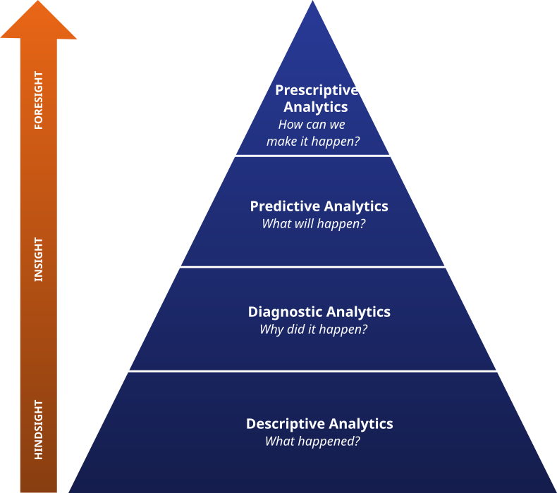
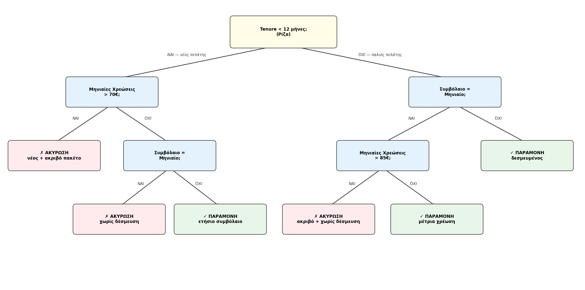

<div style="text-align:center; margin-bottom:16px;">


</div>

# Ευφυή Συστήματα και Συστήματα Υποστήριξης Αποφάσεων
**Ενότητα 6: Προβλεπτική Αναλυτική (Predictive Analytics)**
Τμήμα Μηχανικών Πληροφορικής & Υπολογιστών
Πανεπιστήμιο Δυτικής Αττικής

**Διδάσκων:** Ανάργυρος Τσαδήμας (<tsadimas@uniwa.gr>)

---

<!-- _class: xsmall -->
# Ενότητα 6 — Περίληψη

**Μέρος Α — Δέντρα Απόφασης σε Βάθος**
1. Προβλεπτική Αναλυτική & Κατηγορίες Μηχανικής Μάθησης
2. Δέντρα Απόφασης — Δομή, Παράδειγμα, Αλγόριθμοι & Κριτήρια Διαχωρισμού
3. Κλάδεμα (Pruning)
4. Overfitting, Underfitting & Cross-Validation
5. Αξιολόγηση Μοντέλων (Confusion Matrix, Precision, Recall, ROC)

**Μέρος Β — Ευρύτερη Εικόνα**
6. Άλλοι Αλγόριθμοι: Random Forests, SVM, Logistic Regression, k-NN, Naive Bayes
7. Μη Εποπτευόμενη Μάθηση: K-Means Clustering
8. Σύγκριση Αλγορίθμων & Εργαστήριο: Churn Analysis

---
<!-- _class: xxsmall -->

# Τι είναι η Προβλεπτική Αναλυτική;


<div class="columns">



<div>

Η **Προβλεπτική Αναλυτική (Predictive Analytics)** απαντά στο ερώτημα: *«Τι είναι πιθανό να συμβεί στο μέλλον;»*

Ανήκει στο **4ο επίπεδο** της ιεραρχίας της Αναλυτικής:

| Επίπεδο | Τύπος | Ερώτηση | Εργαλεία |
| --- | --- | --- | --- |
| 1 | **Descriptive** (Περιγραφική) | *Τι έγινε;* | Dashboards, Reports |
| 2 | **Diagnostic** (Διαγνωστική) | *Γιατί έγινε;* | Drill-down, Correlations |
| **3** | **Predictive** (Προβλεπτική) | *Τι θα γίνει;* | **ML, Regression** |
| 4 | **Prescriptive** (Συνταγογραφική) | *Τι να κάνουμε;* | Optimization, RL |

> Στόχος: ο εντοπισμός **μοτίβων (patterns)** για πρόβλεψη μελλοντικών γεγονότων, συμπεριφορών και τάσεων — πριν αυτά συμβούν.

---

# Κατηγορίες Μηχανικής Μάθησης

<!-- _class: xxsmall -->


**Πώς «μαθαίνει» ένας αλγόριθμος;** Εξαρτάται από το αν έχουμε **ετικέτες** (labels) — τις «σωστές απαντήσεις» για κάθε παράδειγμα.

<div class="columns">

<div>

### Εποπτευόμενη (Supervised)
Εκπαιδεύουμε με παραδείγματα **που έχουν ετικέτα**.

* **Ταξινόμηση:** κατηγορία (Ναι/Όχι)
* **Παλινδρόμηση:** αριθμός

*π.χ.* Decision Trees, SVM, k-NN

</div>

<div>

### Μη Εποπτευόμενη (Unsupervised)
**Χωρίς ετικέτες** — ψάχνει μόνος του δομή.

* **Clustering:** φυσικές ομάδες
* **Μείωση διαστάσεων**

*π.χ.* K-Means, PCA

</div>

<div>

### Ενισχυτική (Reinforcement Learning)
**Χωρίς labels.** Ένας *πράκτορας* μαθαίνει μέσω **ανταμοιβής / ποινής** — ανακαλύπτει στρατηγική μέσω δοκιμής-λάθους.

*π.χ.* AlphaGo, αυτόνομα οχήματα

</div>

</div>

> **RLHF (ChatGPT):** Παραλλαγή Ενισχυτικής όπου οι ανταμοιβές δεν έρχονται από περιβάλλον αλλά από **ανθρώπους αξιολογητές** που κατατάσσουν απαντήσεις — έτσι το μοντέλο «ευθυγραμμίζεται» με ανθρώπινες προτιμήσεις.

---

# Εποπτευόμενη Μάθηση: Δέντρα Απόφασης
<!-- _class: small -->


Ένα Δέντρο Απόφασης κάνει διαδοχικές ερωτήσεις μέχρι να φτάσει σε μια απάντηση. Κάθε ερώτηση μπορεί να έχει δύο απαντήσεις (ΝΑΙ/ΌΧΙ για δυαδικές διασπάσεις) ή περισσότερες (για κατηγορικές μεταβλητές με πολλές τιμές).

* **Ρίζα (Root):** η πρώτη — και πιο χρήσιμη — ερώτηση για ολόκληρο το dataset
* **Εσωτερικοί κόμβοι:** κάθε επόμενη ερώτηση που εξειδικεύει το υποσύνολο
* **Φύλλα (Leaves):** τα τελικά «κουτιά» — η πρόβλεψη (π.χ. ΑΚΥΡΩΣΗ / ΠΑΡΑΜΟΝΗ)

**Γιατί είναι χρήσιμα:**

* **White-box μοντέλο:** βλέπεις ακριβώς *γιατί* έβγαλε κάθε πρόβλεψη — εξηγήσιμο σε πελάτη ή διευθυντή
* Δουλεύουν με αριθμούς και κατηγορίες ταυτόχρονα
* Δεν χρειάζονται κανονικοποίηση δεδομένων

**Μειονέκτημα — Overfitting:** Αν αφήσουμε το δέντρο να μεγαλώσει χωρίς όριο, φτιάχνει έναν κόμβο για κάθε παράδειγμα εκπαίδευσης — «απομνημονεύει» αντί να γενικεύει.

> Στις επόμενες διαφάνειες: τυπικός ορισμός, τύποι διαχωρισμών, το διάγραμμα και πώς ταξινομούμε έναν νέο πελάτη.

---

<!-- _class: small -->
# Δέντρο Απόφασης — Τυπικός Ορισμός & Φάσεις Κατασκευής

**Τυπικός Ορισμός:** Ένα Δέντρο Απόφασης είναι ένα **κατευθυνόμενο δέντρο** όπου:

* **Εσωτερικοί κόμβοι** → αντιπροσωπεύουν **χαρακτηριστικά (attributes)** του dataset
* **Ακμές** → αντιπροσωπεύουν **τιμές ή συνθήκες** (predicates) του χαρακτηριστικού
* **Φύλλα (leaves)** → αντιπροσωπεύουν **κλάσεις** (ή τιμές στην παλινδρόμηση)

Ένα νέο παράδειγμα ταξινομείται ακολουθώντας τις ακμές από τη ρίζα έως ένα φύλλο.

**Κατασκευή — δύο φάσεις:**

<div class="columns">

<div>

**Φάση 1: Ανάπτυξη (Growing)**
* Ξεκινά από τη ρίζα
* Επιλέγει το **καλύτερο χαρακτηριστικό** για κάθε κόμβο (Gini, Εντροπία κ.ά.)
* Συνεχίζει αναδρομικά μέχρι τα φύλλα να γίνουν **καθαρά** ή να εφαρμοστεί κριτήριο στάσης

</div>

<div>

**Φάση 2: Κλάδεμα (Pruning)**
* Το μεγάλο δέντρο κάνει **Overfitting**
* Αφαιρούμε κλάδους που δεν βελτιώνουν την απόδοση σε νέα δεδομένα
* Στόχος: **απλούστερο δέντρο** με καλύτερη γενίκευση

</div>

</div>

> Οι πιο γνωστοί αλγόριθμοι: **ID3** (Shannon, 1948 / Quinlan, 1986), **C4.5** (Quinlan, 1993), **CART** (Breiman et al., 1984).

---

<!-- _class: xxsmall -->
# Τύποι Διαχωρισμών (Splits)

Σε κάθε κόμβο, ο αλγόριθμος αποφασίζει **πώς θα χωρίσει** τα δεδομένα. Εξαρτάται από τον τύπο του χαρακτηριστικού:

**Διακριτά (Κατηγορικά) Χαρακτηριστικά:**

| Τύπος | Περιγραφή | Παράδειγμα |
| --- | --- | --- |
| **Πολυδύναμη διάσπαση** | Ένας κλάδος ανά τιμή | Contract: {Μηνιαίο, Ετήσιο, Διετές} → 3 κλάδοι |
| **Δυαδική διάσπαση** | Συγκεντρώνει τιμές σε 2 ομάδες | {Μηνιαίο} vs {Ετήσιο, Διετές} |

**Συνεχή (Αριθμητικά) Χαρακτηριστικά:**

* Πάντα **δυαδική διάσπαση** με κατώφλι: $A < v$ (ΝΑΙ/ΌΧΙ)
* Ο αλγόριθμος δοκιμάζει πολλαπλά κατώφλια $v$ και επιλέγει το καλύτερο
* Π.χ. Tenure: δοκιμάζει $v \in \{3, 6, 12, 24, ...\}$ μήνες

**Πλεονεκτήματα δυαδικής vs πολυδύναμης:**

| | Δυαδική | Πολυδύναμη |
| --- | --- | --- |
| Βάθος δέντρου | Μεγαλύτερο | Μικρότερο |
| Πολυπλοκότητα κόμβου | Απλή | Πολύπλοκη |
| Χρήση σε | CART, C4.5 | ID3 |

> **Λοξά Δέντρα (Oblique Trees):** Χρησιμοποιούν **πολλαπλά χαρακτηριστικά ταυτόχρονα** ($w_1 A_1 + w_2 A_2 > v$), δημιουργώντας διαγώνια όρια — ισχυρότερα αλλά δυσκολότερα στην ερμηνεία.

---

<!-- _class: xxsmall -->
# Δέντρο Απόφασης — Customer Churn (Εγκατάλειψη Πελάτη)

**Πλαίσιο:** Εταιρεία τηλεπικοινωνιών θέλει να προβλέψει ποιοι πελάτες κινδυνεύουν να ακυρώσουν τη σύνδεσή τους (*churn*), ώστε να επέμβει προληπτικά με προσφορά.

**Το μοντέλο εκπαιδεύτηκε** από ιστορικά δεδομένα χιλιάδων πελατών με γνωστή έκβαση (ακύρωσε / έμεινε). Τώρα ταξινομεί αυτόματα κάθε νέο πελάτη.

**Χρήστης:** τμήμα Retention Marketing — στέλνει στοχευμένη προσφορά μόνο στους πελάτες που το μοντέλο σημαιοδοτεί ως «υψηλό κίνδυνο ακύρωσης».

**Ενδεικτικές εγγραφές του dataset:**

| CustomerID | Tenure (μήνες) | MonthlyCharges (€) | Contract | TechSupport | **Churn** |
|---|---|---|---|---|---|
| C001 | 3 | 85 | Month-to-month | Όχι | **Ναι** |
| C002 | 48 | 60 | Two year | Ναι | **Όχι** |
| C003 | 8 | 92 | Month-to-month | Όχι | **Ναι** |
| C004 | 24 | 45 | One year | Ναι | **Όχι** |
| C005 | 1 | 78 | Month-to-month | Όχι | **Ναι** |
| C006 | 60 | 55 | Two year | Ναι | **Όχι** |
| C007 | 10 | 55 | Month-to-month | Όχι | **Όχι** |
| C008 | 36 | 90 | Month-to-month | Όχι | **Ναι** |

> Το **Churn** (στήλη-στόχος) είναι γνωστό μόνο για ιστορικά δεδομένα. Το μοντέλο μαθαίνει ποιοι συνδυασμοί χαρακτηριστικών οδηγούν σε ακύρωση.

---

<!-- _class: xsmall -->
# Χτίζοντας το Δέντρο — Βήμα 1: Εύρεση Ρίζας

**Ερώτηση:** Ποιο χαρακτηριστικό να βάλουμε στην κορυφή; Δοκιμάζουμε κάθε υποψήφιο split και μετράμε το **Gini Impurity**.

**Αρχικό dataset:** 4 Ναι + 4 Όχι → $\text{Gini} = 1 - \left(\tfrac{4}{8}\right)^2 - \left(\tfrac{4}{8}\right)^2 = 0{,}50$

<div class="columns">

<div>

**Υποψήφιο split A: Tenure < 12;**

| Κλάδος | Περιεχόμενο | Gini |
|---|---|---|
| ΝΑΙ | C001✗ C003✗ C005✗ C007✓ → 3Ναι, 1Όχι | $1-(\tfrac{3}{4})^2-(\tfrac{1}{4})^2 = 0{,}375$ |
| ΟΧΙ | C002✓ C004✓ C006✓ C008✗ → 1Ναι, 3Όχι | $1-(\tfrac{1}{4})^2-(\tfrac{3}{4})^2 = 0{,}375$ |

$\text{Gini}_{\text{weighted}} = \tfrac{4}{8}{\cdot}0{,}375 + \tfrac{4}{8}{\cdot}0{,}375 = \mathbf{0{,}375}$
**Μείωση: 0,50 − 0,375 = 0,125** ✓

</div>

<div>

**Υποψήφιο split B: MonthlyCharges > 70;**

| Κλάδος | Περιεχόμενο | Gini |
|---|---|---|
| ΝΑΙ | C001✗ C003✗ C005✗ C008✗ → 4Ναι, 0Όχι | $0{,}00$ |
| ΟΧΙ | C002✓ C004✓ C006✓ C007✓ → 0Ναι, 4Όχι | $0{,}00$ |

$\text{Gini}_{\text{weighted}} = 0{,}00$
**Μείωση: 0,50 − 0,00 = 0,50** ✓✓

> **Νικητής: MonthlyCharges > 70;** — η μεγαλύτερη μείωση Gini. Αυτό γίνεται η **ρίζα** του δέντρου.

</div>

</div>

---

<!-- _class: xsmall -->
# Χτίζοντας το Δέντρο — Βήμα 2: Επόμενα Splits

Μετά τη ρίζα **MonthlyCharges > 70**, κάθε κλάδος εξετάζεται ξεχωριστά.

<div class="columns">

<div>

**Αριστερός κλάδος (MC > 70):** C001✗ C003✗ C005✗ C008✗
→ 4 Ναι, 0 Όχι — **Gini = 0,00** → Καθαρό φύλλο!
🔴 **Φύλλο: ΑΚΥΡΩΣΗ**

---

**Δεξιός κλάδος (MC ≤ 70):** C002✓ C004✓ C006✓ C007✓
→ 0 Ναι, 4 Όχι — **Gini = 0,00** → Καθαρό φύλλο!
🟢 **Φύλλο: ΠΑΡΑΜΟΝΗ**

</div>

<div>

**Δέντρο από τα 8 δείγματά μας (απλοποιημένο):**

```
MonthlyCharges > 70;
├── ΝΑΙ → 🔴 ΑΚΥΡΩΣΗ
│         (C001, C003, C005, C008)
└── ΟΧΙ → 🟢 ΠΑΡΑΜΟΝΗ
          (C002, C004, C006, C007)
```

> ⚠️ **Γιατί η εικόνα είναι διαφορετική;** Τα 8 δείγματα είναι υποδειγματικά — τυχαία «τέλεια» χωρίζονται από ένα μόνο χαρακτηριστικό. Σε πραγματικό dataset χιλιάδων πελατών καμία μεταβλητή δεν χωρίζει τέλεια: τα φύλλα δεν είναι καθαρά, οπότε ο αλγόριθμος συνεχίζει να σπάει κόμβους — και μπορεί να αναδείξει διαφορετική ρίζα (π.χ. Tenure). Το τελικό δέντρο της επόμενης διαφάνειας προέκυψε από εκπαίδευση σε **μεγαλύτερο dataset**.

</div>

</div>

---

<!-- _class: xxsmall -->
# Δέντρο Απόφασης — Customer Churn (πλήρες dataset)

> Το δέντρο εκπαιδεύτηκε σε πραγματικό dataset χιλιάδων πελατών. Με περισσότερα δεδομένα κανένα χαρακτηριστικό δεν χωρίζει τέλεια από μόνο του — ο αλγόριθμος προσθέτει επίπεδα και αναδεικνύει διαφορετική ρίζα (εδώ: **Tenure < 12**).




---

<!-- _class: xsmall -->
# Δέντρα Απόφασης: Ταξινόμηση Νέου Δεδομένου

**Φάση Εκπαίδευσης (Training):** Το μοντέλο χτίστηκε από ιστορικά δεδομένα. Τώρα έρχεται ένας **νέος πελάτης** που δεν τον έχει ξαναδεί — πώς τον ταξινομούμε;

**Νέος πελάτης:**

| Χαρακτηριστικό | Τιμή |
| --- | --- |
| Tenure | **5 μήνες** |
| MonthlyCharges | **78€** |
| Contract | **«Month-to-month»** |
| TechSupport | Όχι |

**Διαδρομή μέσα στο δέντρο:**

1. **[1] Tenure < 12;** → 5 < 12 → **ΝΑΙ** *(νέος πελάτης)*
2. **[2] MonthlyCharges > 70€;** → 78 > 70 → **ΝΑΙ** *(ακριβό πακέτο)*
3. Φτάνουμε σε φύλλο: **✗ ΑΚΥΡΩΣΗ**

> Η πρόβλεψη είναι άμεσα εξηγήσιμη: «*Προβλέπουμε ακύρωση γιατί ο πελάτης είναι νέος (5 μήνες) και πληρώνει υψηλό πακέτο (78€).*»

**Μειονέκτημα — Overfitting:** Αν αφήσουμε το δέντρο να μεγαλώσει χωρίς όριο, φτιάχνει έναν κόμβο για κάθε παράδειγμα εκπαίδευσης — «απομνημονεύει» αντί να γενικεύει.

---

<!-- _class: small -->
# Αλγόριθμοι Δέντρων Απόφασης — ID3, CART, C4.5

Όλοι λειτουργούν **greedy top-down**: σε κάθε κόμβο επιλέγουν το χαρακτηριστικό που μεγιστοποιεί ένα **κριτήριο καθαρότητας**. Διαφέρουν στο *τι* μετρούν:

| Αλγόριθμος | Κριτήριο | Βασίζεται σε | Διάσπαση | sklearn |
| --- | --- | --- | --- | --- |
| **ID3** (1986) | Information Gain | Εντροπία | Πολυδύναμη | `'entropy'` |
| **CART** (1984) | Gini Gain | Gini Impurity | Πάντα δυαδική | `'gini'` |
| **C4.5** (1993) | GainRatio | Εντροπία + διόρθωση | Πολυδύναμη | — |

**Κοινή λογική:** $\text{Gain} = \text{Ακαθαρσία(γονέα)} - \sum_{\text{κλάδοι}} \tfrac{n_v}{n} \cdot \text{Ακαθαρσία}(v)$

> Διαφέρει μόνο το *τι ονομάζουμε* «ακαθαρσία». **Στη sklearn:** `DecisionTreeClassifier` είναι πάντα CART — το `criterion` αλλάζει μόνο το μέτρο ακαθαρσίας.

---

<!-- _class: small -->
# Κριτήρια Διαχωρισμού — Η Ιδέα Πίσω από Κάθε Μέτρο

Και τα τρία απαντούν στο ίδιο ερώτημα: **«Ποια διάσπαση καθαρίζει περισσότερο τις κλάσεις;»** — αλλά με διαφορετική ερμηνεία του «καθαρίζει».

<div class="columns">

<div>

**Information Gain (ID3)**
*Πόση αβεβαιότητα εξαλείφεται;*

Αν ο κόμβος έχει 50/50 mix, χρειαζόμαστε **1 bit** για να περιγράψουμε κάθε παράδειγμα. Αν μετά τη διάσπαση οι κλάδοι είναι σχεδόν καθαροί, χρειαζόμαστε σχεδόν **0 bits**.

$$\text{Gain} = H(\text{γονέας}) - \sum_v \tfrac{n_v}{n} H(v)$$

⚠ **Πρόβλημα:** Ένα attribute με 7.000 μοναδικές τιμές (π.χ. ID πελάτη) δίνει Gain → max, γιατί κάθε φύλλο έχει 1 παράδειγμα → $H=0$. Αλλά είναι άχρηστο για νέα δεδομένα.

</div>

<div>

**Gini Gain (CART)**
*Πόσο μειώνεται η πιθανότητα λάθους;*

$Gini(t) = 1-\sum p_i^2$ = η πιθανότητα να ταξινομήσεις λάθος ένα τυχαίο δείγμα του κόμβου (αν επιλέγεις κλάση τυχαία με βάση τις αναλογίες). Καθαρός κόμβος → $Gini=0$ → μηδέν λάθη.

Χωρίς `log` → **γρηγορότερο** από Entropy. Πάντα **δυαδικές** διασπάσεις → αποφεύγει το πρόβλημα πολλών κλάδων.

**GainRatio (C4.5)**
*Gain διορθωμένο για το «πόσο διασπά»:*

$$\text{GainRatio} = \frac{\text{Gain}}{SplitInfo} \quad \text{όπου } SplitInfo = -\sum_v \tfrac{n_v}{n}\log_2\tfrac{n_v}{n}$$

$SplitInfo$ = εντροπία της *ίδιας της διάσπασης*. Πολλοί κλάδοι → μεγάλο $SplitInfo$ → μικρό $GainRatio$ → **αποθαρρύνεται**. Λύνει το πρόβλημα του ID3.

</div>

</div>

---

<!-- _class: xxsmall -->
# Κριτήριο Διαχωρισμού: Gini Impurity (CART)

Σε κάθε κόμβο, ο **CART** μετράει πόσο «ανακατεμένες» είναι οι κλάσεις με το **Gini Impurity**:

$$Gini(t) = 1 - \sum_{i=1}^{C} p_i^2 \quad \text{όπου } p_i = \text{αναλογία κλάσης } i \text{ στον κόμβο}$$

| Κόμβος | Σύνθεση | Gini | Ερμηνεία |
| --- | --- | --- | --- |
| Α | 50 ✗ + 50 ✓ | **0.50** | μέγιστη αναμείξη |
| Β | 90 ✗ + 10 ✓ | **0.18** | σχεδόν καθαρός |
| Γ | 100 ✗ + 0 ✓ | **0.00** | απόλυτα καθαρός (φύλλο) |

**Gini κόμβου vs Gini Gain διάσπασης — δύο διαφορετικές έννοιες:**

| | Gini κόμβου $Gini(t)$ | Gini Gain διάσπασης |
| --- | --- | --- |
| **Μετράει** | ακαθαρσία ενός κόμβου | πόσο καθάρισε η διάσπαση |
| **Τύπος** | $1 - \sum p_i^2$ | $Gini(\text{γονέας}) - \sum \frac{n_v}{n} Gini(v)$ |
| **Θέλουμε** | όσο **μικρότερο** τόσο καλύτερο | όσο **μεγαλύτερο** τόσο καλύτερο |

> Το δέντρο **δεν επιλέγει τον κόμβο με το μικρότερο Gini** — επιλέγει τη διάσπαση που **μεγιστοποιεί το Gini Gain**.

---

<!-- _class: xxsmall -->
# Gini Impurity — Επιλογή Χαρακτηριστικού (Παράδειγμα)

**Γονικός κόμβος:** 100 πελάτες — 60 ✗ Ακυρώσεις, 40 ✓ Παραμονές
$$Gini(\text{γονέας}) = 1-(0{,}6^2+0{,}4^2) = 1-0{,}36-0{,}16 = \mathbf{0{,}48}$$

Το δέντρο δοκιμάζει δύο υποψήφια χαρακτηριστικά:

**Χαρακτηριστικό Α — Tenure < 12 μήνες:**

| Κλάδος | Πελάτες | ✗ / ✓ | Gini |
| --- | --- | --- | --- |
| ΝΑΙ (νέοι) | 70 | 56 ✗ / 14 ✓ | $1-(0{,}80^2+0{,}20^2)=\mathbf{0{,}32}$ |
| ΌΧΙ (παλιοί) | 30 | 4 ✗ / 26 ✓ | $1-(0{,}13^2+0{,}87^2)=\mathbf{0{,}23}$ |

$$Gini_{\text{σταθμ.}}(A) = \tfrac{70}{100}\times0{,}32 + \tfrac{30}{100}\times0{,}23 = \mathbf{0{,}293} \quad \Rightarrow \quad \text{Gini Gain} = 0{,}48 - 0{,}293 = \mathbf{0{,}187}$$

**Χαρακτηριστικό Β — MonthlyCharges > 70€:**

| Κλάδος | Πελάτες | ✗ / ✓ | Gini |
| --- | --- | --- | --- |
| ΝΑΙ (ακριβό) | 40 | 36 ✗ / 4 ✓ | $1-(0{,}90^2+0{,}10^2)=\mathbf{0{,}18}$ |
| ΌΧΙ (φθηνό) | 60 | 24 ✗ / 36 ✓ | $1-(0{,}40^2+0{,}60^2)=\mathbf{0{,}48}$ |

$$Gini_{\text{σταθμ.}}(B) = \tfrac{40}{100}\times0{,}18 + \tfrac{60}{100}\times0{,}48 = \mathbf{0{,}360} \quad \Rightarrow \quad \text{Gini Gain} = 0{,}48 - 0{,}360 = \mathbf{0{,}120}$$

> **Απόφαση:** Επιλέγεται το χαρακτηριστικό με το **μεγαλύτερο Gini Gain** — αυτό που μειώνει περισσότερο την ακαθαρσία. Το Α (0.187) > Β (0.120) → **Tenure < 12 γίνεται η ρίζα.** *(Το 0.187 δεν είναι το Gini του κόμβου — είναι η βελτίωση που προσφέρει ο διαχωρισμός.)*

---

<!-- _class: xxsmall -->
# Κριτήριο Διαχωρισμού: Εντροπία (ID3)

Ο **ID3** χρησιμοποιεί **Εντροπία** (Shannon) αντί για Gini — μετράει «αβεβαιότητα» στον κόμβο:

$$H(S) = -\sum_{i=1}^{C} p_i \log_2 p_i \quad \text{(bits)}$$

**Με απλά λόγια — τι κάνει κάθε κομμάτι:**

| Κομμάτι | Τι σημαίνει |
|---|---|
| $p_i$ | Η αναλογία παραδειγμάτων της κλάσης $i$ — π.χ. 6 Ναι από 10 → $p = 0{,}6$ |
| $\log_2 p_i$ | Πάντα αρνητικός (αφού $0 < p \leq 1$) — μεγαλύτερος σε απόλυτη τιμή όταν η κλάση είναι σπάνια |
| $-p_i \log_2 p_i$ | Το «μερίδιο έκπληξης» της κλάσης $i$ — μέγιστο όταν $p=0{,}5$, μηδέν όταν $p=0$ ή $p=1$ |
| $\sum$ | Αθροίζουμε για όλες τις κλάσεις |

**Παράδειγμα (5 Ναι, 5 Όχι) — μέγιστη αβεβαιότητα:**
$$H = -0{,}5\cdot\log_2 0{,}5 - 0{,}5\cdot\log_2 0{,}5 = -0{,}5\cdot(-1) - 0{,}5\cdot(-1) = \mathbf{1{,}0 \text{ bit}}$$

**Παράδειγμα (10 Ναι, 0 Όχι) — απόλυτη βεβαιότητα:**
$$H = -1\cdot\log_2 1 = 0 = \mathbf{0{,}0 \text{ bits}}$$

> **Διαισθητικά:** Εντροπία = «πόσο ανακατεμένο είναι το κουτί». 1 bit = πετάμε νόμισμα, δεν ξέρουμε τίποτα. 0 bits = μία μόνο κλάση, σίγουρη απάντηση.

---

<!-- _class: xsmall -->
# Κέρδος Πληροφορίας (Information Gain) & Gini vs Εντροπία

**Το Gain μετράει πόση αβεβαιότητα εξαλείφει ένα split:**

$$\text{Gain}(S,A) = H(S) - \sum_{v} \frac{|S_v|}{|S|} H(S_v)$$

* $H(S)$: εντροπία πριν το split · $\sum_v \frac{|S_v|}{|S|} H(S_v)$: σταθμισμένη εντροπία μετά
* Επιλέγουμε το χαρακτηριστικό $A$ που **μεγιστοποιεί** το Gain → **ρίζα** του δέντρου

**Gini vs Εντροπία — ίδιο παράδειγμα (Tenure < 12, 60/40):**

| Κριτήριο | Γονέας | Σταθμ. παιδιά | Gain | Αποτέλεσμα |
| --- | --- | --- | --- | --- |
| **Gini** (CART) | 0.480 | 0.293 | **0.187** | Tenure = ρίζα ✓ |
| **Εντροπία** (ID3) | 0.971 bits | 0.665 bits | **0.306 bits** | Tenure = ρίζα ✓ |

Και τα δύο επιλέγουν **την ίδια ρίζα** — οι τιμές Gain δεν συγκρίνονται μεταξύ τους (διαφορετικές κλίμακες), αλλά η **κατάταξη** των χαρακτηριστικών συμπίπτει.

> **Πρακτικά:** Gini = χωρίς `log` → γρηγορότερο. Εντροπία → ελαφρώς πιο ισορροπημένες διασπάσεις. Στη sklearn: `criterion='gini'` ή `criterion='entropy'`.

---

<!-- _class: xsmall -->
# Κριτήριο Διαχωρισμού: GainRatio (C4.5)

**Πρόβλημα με το Information Gain:** Ευνοεί χαρακτηριστικά με **πολλές τιμές** — π.χ. ένα μοναδικό αναγνωριστικό (ID πελάτη) δίνει τέλειο Gain αλλά είναι άχρηστο για γενίκευση.

**Λύση — GainRatio (Quinlan, C4.5):**

$$\text{GainRatio}(S, A) = \frac{\text{Gain}(S, A)}{\text{SplitInfo}(S, A)}$$

όπου το **SplitInfo** ποινοποιεί χαρακτηριστικά που δημιουργούν πολλούς κλάδους:

$$\text{SplitInfo}(S, A) = -\sum_{v} \frac{|S_v|}{|S|} \log_2 \frac{|S_v|}{|S|}$$

**Παράδειγμα — γιατί χρειάζεται:**

| Χαρακτηριστικό | Gain | SplitInfo | GainRatio |
| --- | --- | --- | --- |
| ID Πελάτη (μοναδικό) | **0.971** | 9.97 | **0.097** — απορρίπτεται |
| Tenure < 12 μήνες | 0.306 | 0.88 | **0.348** — προτιμάται |
| Contract | 0.245 | 1.58 | 0.155 |

> **Ο C4.5** χρησιμοποιεί GainRatio και υποστηρίζει και **συνεχή χαρακτηριστικά** (διαχωρισμός με κατώφλι). Είναι ο απευθείας διάδοχος του ID3.

---

<!-- _class: small -->
# Κλάδεμα Δέντρου (Pruning)

Ένα δέντρο που αναπτύσσεται ελεύθερα μέχρι να γίνουν καθαρά όλα τα φύλλα **απομνημονεύει** τα training data. Το Pruning μειώνει την πολυπλοκότητα.

**Δύο στρατηγικές:**

<div class="columns">

<div>

**Προ-κλάδεμα (Pre-pruning)**
Σταματάμε την ανάπτυξη *νωρίς* με κριτήρια:
* Μέγιστο βάθος δέντρου (π.χ. `max_depth=5`)
* Ελάχιστος αριθμός παραδειγμάτων σε κόμβο (`min_samples_split`)
* Το Gain πέφτει κάτω από κατώφλι

✓ Γρήγορο — ✗ Μπορεί να σταματήσει πολύ νωρίς

</div>

<div>

**Μετα-κλάδεμα (Post-pruning)**
Πρώτα αναπτύσσουμε πλήρως, μετά αφαιρούμε:

* **Αντικατάσταση υπο-δέντρου** *(Subtree Replacement)*: Αντικαθιστούμε έναν κλάδο με φύλλο που αντιπροσωπεύει την πλειοψηφία
* **Ανύψωση υπο-δέντρου** *(Subtree Raising)*: Ανεβάζουμε ένα παιδικό υπο-δέντρο να αντικαταστήσει τον γονέα

✓ Ακριβέστερο — ✗ Υπολογιστικά βαρύτερο

</div>

</div>

**Πώς αξιολογούμε αν αξίζει το κλάδεμα;** Με **validation set**: αφαιρούμε κλάδο → μετράμε αν η ακρίβεια σε δεδομένα εκτός εκπαίδευσης βελτιώνεται ή επιδεινώνεται.

> **Κανόνας:** Κλαδεύουμε αν η απλούστερη εκδοχή έχει **ίδια ή καλύτερη** απόδοση στο validation set. Αρχή της λιτότητας: το απλούστερο μοντέλο που εξηγεί τα δεδομένα είναι το προτιμότερο.

---

<!-- _class: xsmall -->


# Overfitting, Underfitting & Cross-Validation

Κάθε μοντέλο πρέπει να **γενικεύει** — να τα πάει καλά όχι μόνο στα δεδομένα που είδε, αλλά και σε νέα δεδομένα που δεν έχει ξαναδεί.

> **Train data:** Τα δεδομένα με τα οποία εκπαιδεύουμε το μοντέλο. **Test data:** Νέα δεδομένα που κρατάμε κρυφά για να ελέγξουμε αν το μοντέλο γενικεύει.

<div class="columns">

<div>

**Underfitting — «Πολύ απλό»:**

* Το μοντέλο δεν μαθαίνει ούτε τα βασικά μοτίβα
* Κάνει λάθη ακόμα και στα train data
* Π.χ. μοντέλο που λέει πάντα «Παραμονή» ανεξαρτήτως

**Overfitting — «Πολύ ειδικό»:**

* Το μοντέλο απομνημονεύει τα train data σαν «παπαγαλία»
* Αδυνατεί να γενικεύσει σε νέα δεδομένα
* Π.χ. δέντρο με 500 κόμβους που αντιγράφει κάθε παράδειγμα

</div>

<div>

**K-Fold Cross-Validation — αξιόπιστη μέτρηση:**

Αντί να ελέγξουμε μία φορά, ελέγχουμε $K$ φορές με διαφορετικά test data κάθε φορά:

1. Χώρισε τα δεδομένα σε $K$ ίσα τμήματα (π.χ. $K=5$)
2. Κάθε φορά: 1 τμήμα = test, τα υπόλοιπα 4 = train
3. Επανέλαβε 5 φορές — πήρε τον **μέσο όρο** των 5 αποτελεσμάτων

Έτσι αξιοποιούμε *όλα* τα δεδομένα για αξιολόγηση.

</div>

</div>

| | Σφάλμα στα Train data | Σφάλμα στα Test data |
| --- | --- | --- |
| **Underfitting** | Υψηλό | Υψηλό |
| **Ιδανικό** | Χαμηλό | Χαμηλό |
| **Overfitting** | Χαμηλό | **Υψηλό** |

---

<!-- _class: small -->

# Αξιολόγηση Μοντέλων: Πίνακας Σύγχυσης

Το βασικότερο εργαλείο αξιολόγησης ταξινομητή. Μας δείχνει τη **λεπτομερή εικόνα** των σωστών και λανθασμένων προβλέψεων.

| | **Προβλέψαμε: Ακύρωση** | **Προβλέψαμε: Παραμονή** |
| --- | --- | --- |
| **Πραγματικά: Ακύρωση** | **TP** = 80 ✓ | **FN** = 20 ✗ |
| **Πραγματικά: Παραμονή** | **FP** = 10 ✗ | **TN** = 390 ✓ |

* **True Positives (TP) = 80:** Προβλέψαμε ακύρωση → και ακύρωσε. *Σωστό!*
* **True Negatives (TN) = 390:** Προβλέψαμε παραμονή → και έμεινε. *Σωστό!*
* **False Positives (FP) = 10** *(«Λάθος Συναγερμός»)*: Προβλέψαμε ακύρωση, αλλά έμεινε. *Κόστος: άσκοπη προσφορά.*
* **False Negatives (FN) = 20** *(«Η μεγάλη χασούρα»)*: Προβλέψαμε παραμονή, αλλά έφυγε. *Κόστος: χαμένος πελάτης!*

> Σε προβλήματα Churn, το **FN είναι συνήθως πιο ακριβό** από το FP — προτιμάμε να «χάσουμε» λίγα χρήματα σε άσκοπες προσφορές παρά να χάσουμε έναν πελάτη.

---

<!-- _class: small -->
# Αξιολόγηση Μοντέλων: Βασικές Μετρικές

Από τον Πίνακα Σύγχυσης, εξάγουμε κρίσιμες μετρικές (χρησιμοποιώντας τα αριθμητικά παραδείγματα: TP=80, TN=390, FP=10, FN=20):

* **Ακρίβεια (Accuracy):** Ποσοστό σωστών προβλέψεων στο σύνολο.
  $$\text{Accuracy} = \frac{TP + TN}{TP + TN + FP + FN} = \frac{80 + 390}{500} = 94\%$$
  *(Προσοχή: Παραπλανητικό σε ανισόρροπα datasets — π.χ. 95% accuracy αν πούμε πάντα «Παραμονή»!)*

* **Precision:** Από όσους *προβλέψαμε* ότι θα ακυρώσουν, πόσοι πραγματικά ακύρωσαν;
  $$\text{Precision} = \frac{TP}{TP + FP} = \frac{80}{90} \approx 88{,}9\%$$

* **Recall (Sensitivity):** Από όλους που *πραγματικά* ακύρωσαν, πόσους «πιάσαμε»;
  $$\text{Recall} = \frac{TP}{TP + FN} = \frac{80}{100} = 80\%$$

* **F1-Score:** Αρμονικός μέσος Precision & Recall — ισορροπεί και τα δύο.
  $$F_1 = 2 \cdot \frac{\text{Precision} \times \text{Recall}}{\text{Precision} + \text{Recall}} = 2 \cdot \frac{0{,}889 \times 0{,}80}{0{,}889 + 0{,}80} \approx 84{,}2\%$$

---

# Το Δίλημμα Precision–Recall

Στον ταξινομητή, επιλέγουμε ένα **κατώφλι (threshold)** $t$ για την πιθανότητα: αν $P(\text{Ακύρωση}) > t$ → προβλέπουμε Ακύρωση.

**Κατεβάζουμε το threshold (π.χ. $t=0{,}3$):**

* Ταξινομούμε **περισσότερους** ως «Ακύρωση»
* **Recall ↑** (πιάνουμε περισσότερες πραγματικές ακυρώσεις)
* **Precision ↓** (περισσότεροι λάθος συναγερμοί)

**Ανεβάζουμε το threshold (π.χ. $t=0{,}7$):**

* Ταξινομούμε **λιγότερους** ως «Ακύρωση»
* **Precision ↑** (όταν λέμε «θα φύγει», σχεδόν πάντα έχουμε δίκιο)
* **Recall ↓** (χάνουμε πολλές πραγματικές ακυρώσεις)

> **Business decision:** Η επιλογή του threshold εξαρτάται από το **κόστος κάθε λάθους**. Για Churn: χαμηλό threshold → επιθετική παρακράτηση. Για ιατρική διάγνωση: χαμηλό threshold → λιγότερα FN (να μην χάσουμε ασθένεια).

---

<!-- _class: small -->
# Καμπύλη ROC & AUC

Η καμπύλη ROC απεικονίζει **όλες τις δυνατές επιλογές threshold** ταυτόχρονα.

<div class="columns">

<div>

**Ορισμοί:**
* **True Positive Rate (TPR) = Recall** = $\frac{TP}{TP + FN}$
* **False Positive Rate (FPR)** = $\frac{FP}{FP + TN}$

**Η καμπύλη:** Κάθε σημείο = ένα threshold. Ιδανικό μοντέλο → πάνω-αριστερά.

**AUC — Area Under the Curve:**
* AUC = 0.5 → τυχαία μαντεψιά (διαγώνιος)
* AUC = 0.7–0.8 → αποδεκτό μοντέλο
* AUC = 0.8–0.9 → καλό μοντέλο
* AUC > 0.9 → εξαιρετικό μοντέλο

</div>

<div>

**Σύγκριση Μοντέλων:**

| Μοντέλο | AUC |
| --- | --- |
| Random Forest | **0.92** |
| SVM (RBF) | 0.89 |
| Decision Tree | 0.78 |
| Logistic Reg. | 0.85 |
| Τυχαίο | 0.50 |

> AUC: θεωρητικά ερμηνεύεται ως η πιθανότητα το μοντέλο να κατατάξει υψηλότερα ένα τυχαίο θετικό παράδειγμα από ένα τυχαίο αρνητικό.

</div>

</div>

---
<!-- _class: section -->

# Μέρος Β: Άλλοι Αλγόριθμοι — Ευρύτερη Εικόνα

Κατακτήσαμε τα **Δέντρα Απόφασης** σε βάθος — δομή, κριτήρια, pruning, αξιολόγηση.

Τώρα βλέπουμε άλλους αλγορίθμους **σε επίπεδο κατανόησης**: τι κάνουν, πότε τα χρησιμοποιούμε, ποια είναι τα πλεονεκτήματά τους.

> Δεν απαιτείται εξίσου βαθιά γνώση μαθηματικών — αρκεί να ξέρετε **ποιον αλγόριθμο να επιλέξετε** και **γιατί**.

---
<!-- _class: xsmall -->

# Εποπτευόμενη Μάθηση: Random Forests

Ένα μόνο δέντρο κάνει Overfitting. Η λύση: **«Σοφία του Πλήθους»** — φτιάχνουμε εκατοντάδες διαφορετικά δέντρα και ψηφίζουν μαζί.

**Πώς λειτουργεί — Bagging (Bootstrap Aggregating):**

> **Bagging:** Αντί να δούμε *όλα* τα δεδομένα, κάθε δέντρο εκπαιδεύεται σε ένα **τυχαίο δείγμα** από αυτά. Έτσι κάθε δέντρο «μαθαίνει» λίγο διαφορετικά πράγματα.

1. Πάρε τυχαίο δείγμα από τα δεδομένα → εκπαίδευσε ένα δέντρο
2. Επανέλαβε $N$ φορές (π.χ. 100 ή 500 δέντρα)
3. Νέο δεδομένο: κάθε δέντρο ψηφίζει → κερδίζει η **πλειοψηφία**

<div class="columns">

<div>

**Γιατί εξαλείφει το Overfitting;**

* Κάθε δέντρο κάνει διαφορετικά λάθη
* Στη ψηφοφορία τα λάθη **αλληλοακυρώνονται**
* Το σωστό σήμα ενισχύεται, ο «θόρυβος» εξαφανίζεται

</div>

<div>

**Bonus — Feature Importance:**
Το Random Forest μετράει αυτόματα **ποια χαρακτηριστικά χρησιμοποίησε περισσότερο** για να πάρει αποφάσεις. Π.χ.: «Η μηνιαία χρέωση επηρεάζει περισσότερο από την ηλικία».

</div>

</div>

---

# Εποπτευόμενη Μάθηση: Support Vector Machines (SVM)

**Ιδέα:** Φαντάσου ότι τα δεδομένα είναι κουκκίδες σε ένα επίπεδο — κόκκινες (Ακύρωση) και μπλε (Παραμονή). Θέλουμε να τραβήξουμε μια γραμμή που τις χωρίζει με τη **μεγαλύτερη δυνατή απόσταση** από τις πιο «δύσκολες» κουκκίδες.

<div class="columns">

<div>

**Βασικές Έννοιες:**

* **Hyperplane:** Η γραμμή διαχωρισμού (σε 2D: γραμμή, σε 3D: επίπεδο, σε ND: υπερεπίπεδο)
* **Margin:** Η «ζώνη ασφαλείας» εκατέρωθεν της γραμμής — όσο πλατύτερη, τόσο καλύτερη γενίκευση
* **Support Vectors:** Οι κουκκίδες που βρίσκονται *ακριβώς στα όρια* της ζώνης — αυτές και μόνο καθορίζουν τη γραμμή

</div>

<div>

**Kernel Trick — Όταν δεν υπάρχει ευθεία γραμμή:**

Μερικές φορές τα δεδομένα δεν χωρίζονται γραμμικά. Ο **kernel** τα «ανεβάζει» σε περισσότερες διαστάσεις όπου ο διαχωρισμός γίνεται εφικτός.

| Kernel | Πότε |
| --- | --- |
| **Linear** | Απλός γραμμικός χωρισμός |
| **RBF (Gaussian)** | Πολύπλοκα σχήματα — συχνότερος |

> **Black-box:** Σε αντίθεση με το Decision Tree, το SVM δεν εξηγεί εύκολα *γιατί* έβγαλε μια πρόβλεψη.

</div>

</div>

---
<!-- _class: xsmall -->

# Εποπτευόμενη Μάθηση: Logistic Regression

**Ιδέα:** Παρά το όνομα, η Logistic Regression χρησιμοποιείται για **ταξινόμηση** (όχι παλινδρόμηση). Μετρά την *πιθανότητα* ενός δείγματος να ανήκει σε μια κλάση.

<div class="columns">

<div>

**Πώς λειτουργεί:**

Αντί για ευθεία γραμμή $y = ax + b$, χρησιμοποιεί τη **sigmoid function**:

$$P(y=1) = \frac{1}{1 + e^{-(w_0 + w_1 x_1 + \ldots + w_n x_n)}}$$

* Η έξοδος είναι πάντα στο $[0, 1]$ — ερμηνεύεται ως **πιθανότητα**
* Αν $P > 0.5$ → κλάση 1, αλλιώς κλάση 0
* Το κατώφλι (threshold) μπορεί να αλλάξει

</div>

<div>

**Χαρακτηριστικά:**

| | |
|---|---|
| **Ταχύτητα** | Πολύ γρήγορη εκπαίδευση |
| **Ερμηνεία** | Τα βάρη $w_i$ δείχνουν σημαντικότητα |
| **Γραμμικότητα** | Λειτουργεί καλά μόνο με γραμμικά διαχωρίσιμα δεδομένα |
| **Έξοδος** | Πιθανότητα (calibrated) |

> **Πότε να χρησιμοποιείται:** Baseline μοντέλο, ταξινόμηση με ερμηνεύσιμα αποτελέσματα (π.χ. πιστοληπτική ικανότητα, ιατρική διάγνωση).

</div>

</div>

---

# Εποπτευόμενη Μάθηση: k-Nearest Neighbors (k-NN)

**Ιδέα:** «Πες μου ποιοι είναι οι φίλοι σου και θα σου πω ποιος είσαι» — ένα νέο δείγμα ταξινομείται με βάση τους $k$ **πλησιέστερους γείτονές** του στα training data.

<div class="columns">

<div>

**Αλγόριθμος:**

1. Λάβε νέο δείγμα $x$
2. Βρες τους $k$ πιο κοντινούς γείτονες (με Euclidean distance ή άλλη μετρική)
3. Ψηφοφορία πλειοψηφίας → η πιο συχνή κλάση κερδίζει

**Επιλογή $k$:**
* Μικρό $k$ (π.χ. 1) → Overfitting
* Μεγάλο $k$ → Underfitting, «θολή» απόφαση
* Συνήθως δοκιμάζουμε $k = \sqrt{n}$ ως αφετηρία

</div>

<div>

**Χαρακτηριστικά:**

| | |
|---|---|
| **Εκπαίδευση** | Καμία — αποθηκεύει τα δεδομένα |
| **Πρόβλεψη** | Αργή σε μεγάλα datasets |
| **Ερμηνεία** | Διαισθητική |
| **Κλιμάκωση** | Απαιτεί normalization χαρακτηριστικών |

> **Lazy learner:** Ο k-NN δεν «μαθαίνει» ένα μοντέλο — κάνει όλη τη δουλειά κατά την πρόβλεψη. Κατάλληλος όταν τα δεδομένα δεν αλλάζουν συχνά.

</div>

</div>

---

# Εποπτευόμενη Μάθηση: Naive Bayes

**Ιδέα:** Χρησιμοποιεί το **Θεώρημα Bayes** για να υπολογίσει την πιθανότητα κάθε κλάσης δεδομένων των χαρακτηριστικών. «Naive» γιατί υποθέτει ότι τα χαρακτηριστικά είναι **ανεξάρτητα** μεταξύ τους.

<div class="columns">

<div>

**Θεώρημα Bayes:**

$$P(\text{κλάση} \mid \mathbf{x}) = \frac{P(\mathbf{x} \mid \text{κλάση}) \cdot P(\text{κλάση})}{P(\mathbf{x})}$$

* $P(\text{κλάση})$: Prior — πόσο συχνή είναι η κλάση στα δεδομένα
* $P(\mathbf{x} \mid \text{κλάση})$: Likelihood — πόσο πιθανό είναι να δούμε τα χαρακτηριστικά $\mathbf{x}$ αν η κλάση είναι αυτή
* Επιλέγουμε την κλάση με τη **μέγιστη posterior πιθανότητα**

</div>

<div>

**Χαρακτηριστικά:**

| | |
|---|---|
| **Ταχύτητα** | Εξαιρετικά γρήγορος |
| **Δεδομένα** | Αποδίδει καλά με λίγα δεδομένα |
| **Υπόθεση** | Ανεξαρτησία — συχνά παραβιάζεται |
| **Εφαρμογές** | Spam filter, ανάλυση κειμένου |

> **Παράδειγμα:** Φίλτρο spam — υπολογίζει την πιθανότητα ένα email να είναι spam δεδομένης της παρουσίας λέξεων όπως «δωρεάν», «κέρδισες», κ.λπ.

</div>

</div>

---

<!-- _class: small -->

# Μη Εποπτευόμενη Μάθηση: K-Means Clustering

**Ιδέα:** Χώρισε τα δεδομένα σε $K$ ομάδες έτσι ώστε τα μέλη κάθε ομάδας να **μοιάζουν μεταξύ τους** όσο το δυνατόν περισσότερο.

**Πώς λειτουργεί — βήμα προς βήμα:**

> **Centroid (κέντρο ομάδας):** Το «κέντρο βάρους» όλων των σημείων μιας ομάδας — ο μέσος όρος τους.

1. **Έναρξη:** Τοποθέτησε $K$ τυχαία κέντρα (centroids) στο χώρο
2. **Ανάθεση:** Κάθε σημείο πηγαίνει στην ομάδα του **πλησιέστερου** centroid
3. **Ενημέρωση:** Υπολόγισε νέο centroid = μέσος όρος των σημείων της ομάδας
4. **Επανάληψη** έως ότου τα κέντρα σταματήσουν να αλλάζουν

**Πώς επιλέγουμε το K; — Μέθοδος Αγκώνα (Elbow Method):**

Δοκίμασε $K=1,2,...,10$ και μέτρα το **άθροισμα αποστάσεων** κάθε σημείου από το centroid του. Βρες το $K$ όπου η βελτίωση «κοπάζει» (το σημείο αγκώνα στο γράφημα).

> **Εφαρμογή (Customer Segmentation):** K=3 → «Περιστασιακοί» / «Τακτικοί» / «VIP» — χωρίς να έχουμε δώσει ετικέτες από πριν!

---

<!-- _class: small -->
# Σύγκριση Αλγορίθμων

| Αλγόριθμος | Ερμηνευσιμότητα | Ταχύτητα | Ακρίβεια | Overfitting |
| --- | --- | --- | --- | --- |
| **Decision Tree** | ⭐⭐⭐ Υψηλή | ⭐⭐⭐ Γρήγορο | ⭐⭐ Μέτρια | Υψηλό |
| **Random Forest** | ⭐⭐ Μέτρια | ⭐⭐ Μέτριο | ⭐⭐⭐ Υψηλή | Χαμηλό |
| **SVM** | ⭐ Χαμηλή | ⭐ Αργό | ⭐⭐⭐ Υψηλή | Χαμηλό |
| **K-Means** | ⭐⭐ Μέτρια | ⭐⭐⭐ Γρήγορο | — (unsupervised) | — |

**Πότε να επιλέξω τι;**

* **Decision Tree:** Όταν η **εξηγησιμότητα** είναι κρίσιμη (π.χ. ιατρική, νομική απόφαση)
* **Random Forest:** Ο «ασφαλής» αλγόριθμος για τα περισσότερα tabular datasets — εξαιρετική ισορροπία
* **SVM:** Υψηλοδιάστατα δεδομένα (π.χ. text classification), μικρά datasets
* **K-Means:** Εξερεύνηση δεδομένων, segmentation, όταν δεν έχουμε labels

> Δεν υπάρχει «καλύτερος» αλγόριθμος — **No Free Lunch Theorem** (Wolpert, 1996): κάθε αλγόριθμος υπερέχει σε κάποια προβλήματα και υστερεί σε άλλα.

---
<!-- _class: xsmall -->

# Class Imbalance & SMOTE

**Πρόβλημα — Class Imbalance:** Στο Churn dataset μόνο ~26% των πελατών ακυρώνουν. Ένα μοντέλο που λέει *πάντα «Παραμονή»* έχει Accuracy 74% — αλλά είναι άχρηστο.

<div class="columns">

<div>

**Τι κάνει το SMOTE:**
*(Synthetic Minority Over-sampling Technique)*

1. Βρίσκει παραδείγματα της **μειοψηφικής κλάσης** (Churn=Ναι)
2. Για κάθε παράδειγμα, βρίσκει τους $k$ πλησιέστερους γείτονές του (ίδιας κλάσης)
3. Δημιουργεί **συνθετικά νέα δείγματα** σε τυχαία σημεία *ανάμεσα* στα υπάρχοντα

Αποτέλεσμα: ισορροπημένο dataset χωρίς απλή αντιγραφή (oversampling).

</div>

<div>

```
Πριν SMOTE:
  Churn=Ναι  ████░░░░░░░░  26%
  Churn=Όχι  ████████████  74%

Μετά SMOTE:
  Churn=Ναι  ██████████░░  50% (συνθετικά)
  Churn=Όχι  ████████████  50%
```

> ⚠️ Εφαρμόζεται **μόνο στα training data** — ποτέ στα test data, γιατί θέλουμε να αξιολογούμε σε πραγματική κατανομή.

</div>

</div>

---

<!-- _class: xsmall -->

# Εργαστήριο: Πρόβλεψη Ακυρώσεων & Churn Analysis

**Το Σενάριο (Business Problem):**
Μια εταιρεία τηλεπικοινωνιών χάνει πελάτες. Στόχος: να προβλέψουμε **ποιοι** πελάτες θα φύγουν, *πριν* φύγουν, ώστε το τμήμα Marketing να τους κάνει μια προσφορά παραμονής.

**Το Dataset (Telco Customer Churn — IBM, 7.043 πελάτες):**

| Χαρακτηριστικό | Τύπος | Παράδειγμα |
| --- | --- | --- |
| `tenure` | Αριθμητικό | 12 (μήνες) |
| `MonthlyCharges` | Αριθμητικό | 65.5€ |
| `TotalCharges` | Αριθμητικό | 786€ |
| `Contract` | Κατηγορικό | «Month-to-month» |
| `InternetService` | Κατηγορικό | «Fiber optic» |
| `TechSupport`, `OnlineSecurity` | Κατηγορικό | «Yes» / «No» |
| `PaymentMethod`, `PaperlessBilling` | Κατηγορικό | «Electronic check» |
| **`Churn`** | **Target (0/1)** | **1 = Ακύρωσε** |

**Τα Εργαλεία:** `pandas` · `scikit-learn` · `matplotlib` · `seaborn`

---

<!-- _class: small -->
# Εργαστήριο: Τα Βήματα της Υλοποίησης

<div class="columns">

<div>

**Βήμα 1 — Φόρτωση & EDA:**

```python
URL = 'https://raw.githubusercontent.com/IBM/...'
df = pd.read_csv(URL)
df.info()                    # τύποι & missing
df['Churn'].value_counts()   # ~26% churn
```

**Βήμα 2 — Προεπεξεργασία:**

```python
df['TotalCharges'] = pd.to_numeric(
    df['TotalCharges'], errors='coerce')
df.dropna(inplace=True)

le = LabelEncoder()
for col in cat_cols:
    df[col] = le.fit_transform(df[col])
```

* `TotalCharges` ήταν string → μετατροπή
* **LabelEncoder** για κατηγορικά

</div>

<div>

**Βήμα 3 — Εκπαίδευση:**

```python
dt = DecisionTreeClassifier(
    criterion='gini',
    max_depth=4,
    min_samples_leaf=20,
    random_state=42)
dt.fit(X_train, y_train)
```

**Βήμα 4 — Αξιολόγηση & Οπτικοποίηση:**

```python
plot_tree(dt, feature_names=FEATURES,
    class_names=['Παραμονή','Ακύρωση'],
    filled=True)

y_pred = dt.predict(X_test)
print(classification_report(y_test, y_pred))
ConfusionMatrixDisplay.from_predictions(...)
```

</div>

</div>

> **Αναμενόμενα αποτελέσματα:** Accuracy ≈ 79%, F1 (Churn) ≈ 0.55 — λόγω **class imbalance** (~26% churn). Στις ασκήσεις: δοκιμή `criterion='entropy'`, πλήρες δέντρο, Random Forest, SMOTE.
