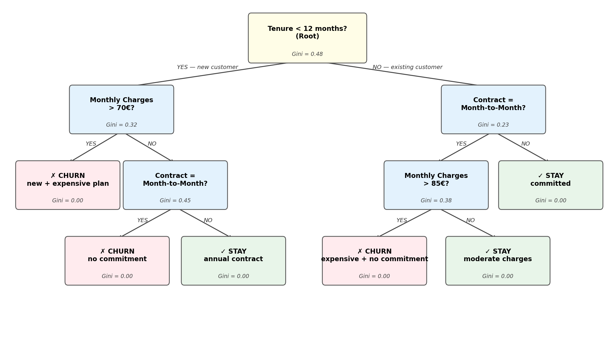
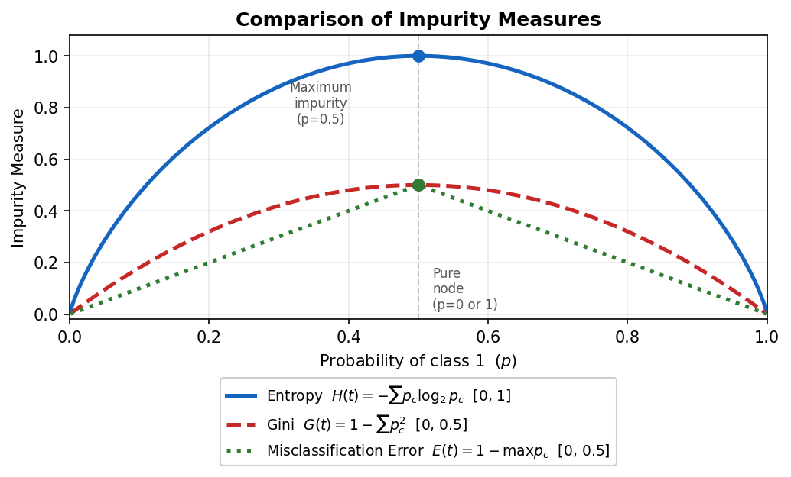
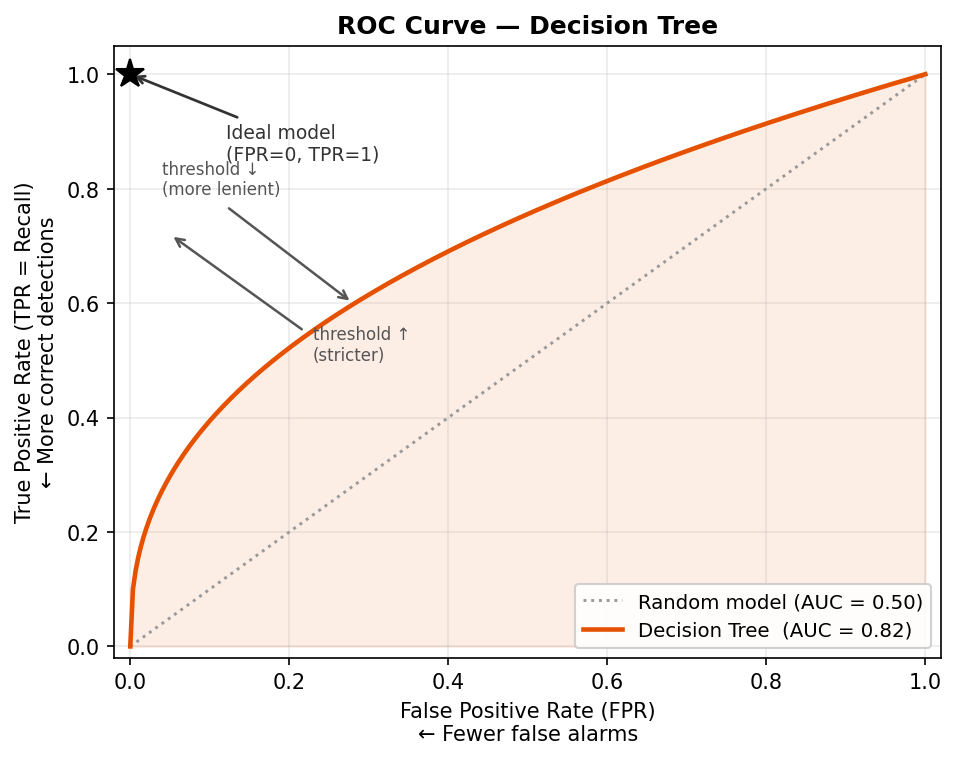
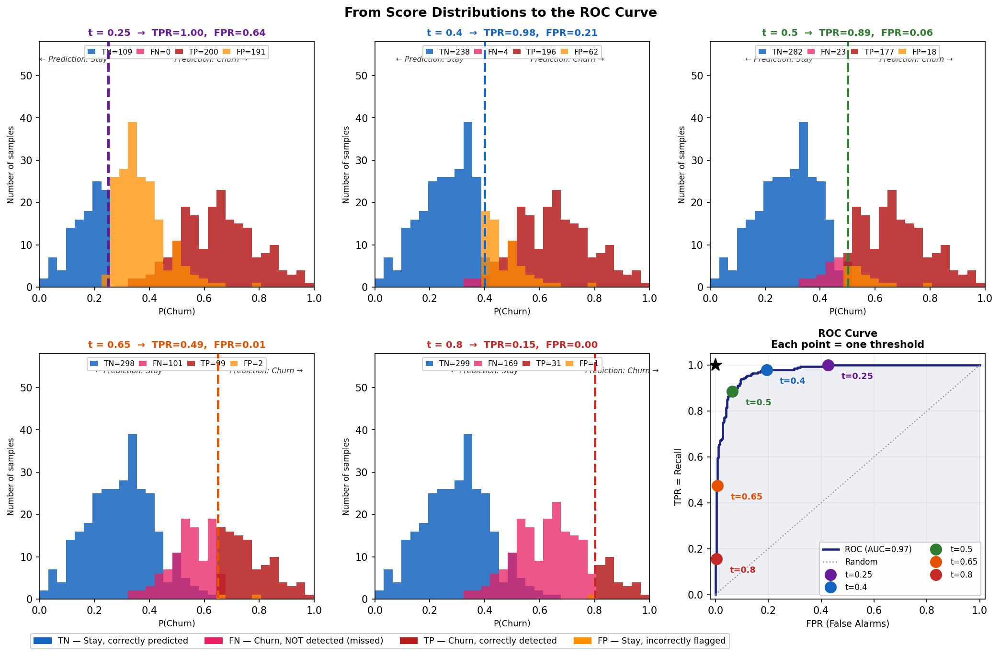
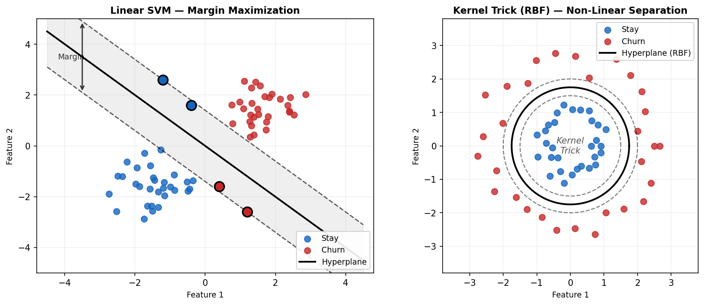
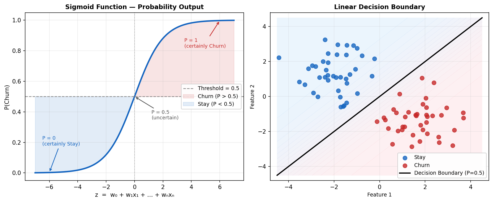
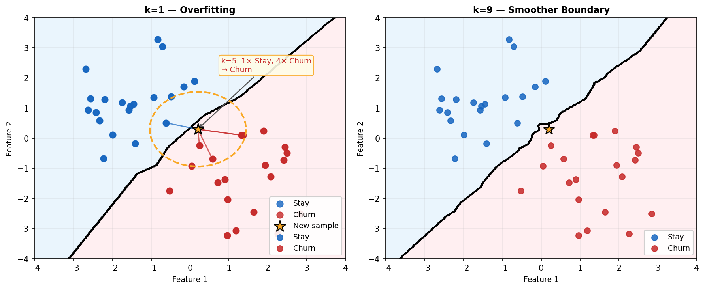
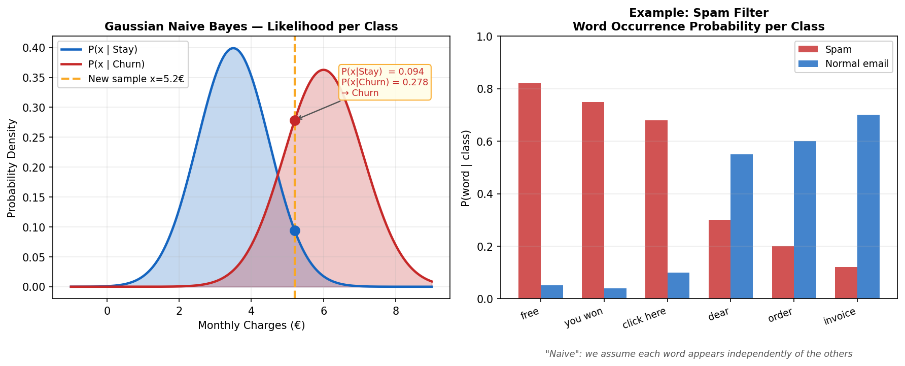
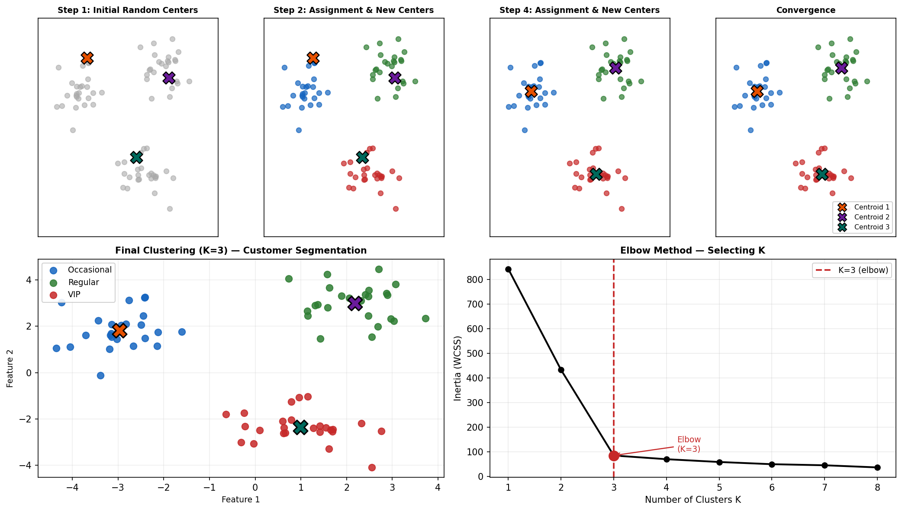

<div style="text-align:center; margin-bottom:16px;">


</div>

# Intelligent Systems and Decision Support Systems
**Unit 6: Predictive Analytics**
Department of Informatics & Computer Engineering
University of West Attica

**Instructor:** Anargyros Tsadimas (<tsadimas@uniwa.gr>)

---

<!-- _class: small -->
# What is Machine Learning?

Humans understand their environment by observing it and creating a simplified representation — a **model**. This process is called **inductive learning**.

When a **computational system** creates models or discovers patterns from data, we speak of **Machine Learning**.

**Key definitions:**

> *"The study of computational methods for acquiring new knowledge, new skills, and new ways of organising existing knowledge."*
> — Carbonell (1987)

> *"A program learns from experience **E** with respect to tasks **T** and performance measure **P**, if its performance on T improves with E."*
> — Mitchell (1997)

---

<!-- _class: xsmall -->
# Unit 6 — Overview

**Part A — Decision Trees in Depth**
1. Predictive Analytics & Categories of Machine Learning
2. Decision Trees — Structure, Hunt's Algorithm, Types of Splits
3. Split Criteria: Gini, Entropy / Information Gain, Gain Ratio (C4.5), Classification Error
4. Algorithms: ID3, C4.5, CART — Advantages & Disadvantages
5. Pruning, Overfitting, Cross-Validation & Hyperparameter Tuning (Grid Search)
6. Evaluation: Confusion Matrix, Precision/Recall, F1, ROC/AUC, Confidence Intervals
7. Regression Trees — Variance Reduction & Evaluation (MAE, RMSE, R²)

**Part B — The Broader Picture**
8. Other Algorithms: Random Forests, Gradient Boosting (XGBoost/LightGBM), SVM, Logistic Regression, k-NN, Naive Bayes
9. Unsupervised Learning: K-Means Clustering
10. Preprocessing: Feature Scaling (StandardScaler) & One-Hot Encoding of categorical features
11. Algorithm Comparison & Lab: Churn Analysis

---
<!-- _class: xxsmall -->

# What is Predictive Analytics?


<div class="columns">


<div>

**Predictive Analytics** answers the question: *"What is likely to happen in the future?"*

It belongs to the **3rd level** of the Analytics hierarchy:

| Level | Type | Question | Tools |
| --- | --- | --- | --- |
| 1 | **Descriptive** | *What happened?* | Dashboards, Reports |
| 2 | **Diagnostic** | *Why did it happen?* | Drill-down, Correlations |
| **3** | **Predictive** | *What will happen?* | **ML, Regression** |
| 4 | **Prescriptive** | *What should we do?* | Optimization, RL |

> Goal: identifying **patterns** to predict future events, behaviours and trends — before they occur.

---

<!-- _class: small -->
# Categories of Machine Learning

**How does an algorithm "learn"?** It depends on whether we have **labels** — the "correct answers" for each example.

| Category | Data | Goal | Use cases | Algorithms |
|---|---|---|---|---|
| **Supervised** | With labels | Classification or Regression | Churn, spam, property price | Decision Tree, SVM, k-NN |
| **Unsupervised** | Without labels | Finding structure / groups | Customer segmentation, fraud | K-Means, PCA, DBSCAN |
| **Reinforcement Learning** | Without labels | Optimal strategy through trial and error | AlphaGo, autonomous vehicles | Q-Learning, PPO |

> **RLHF (ChatGPT):** a variant of Reinforcement Learning — rewards are given by **human evaluators** instead of the environment, so the model aligns with human preferences.

---

<!-- _class: small -->
# Categories of Machine Learning — Details

<div class="columns">

<div>

**Supervised**
We train with labelled examples.

- **Classification:** predict a category — *"will they cancel?" → Yes/No*
- **Regression:** predict a number — *"how much will it cost?"*

Requires a labelled dataset (historical data with known outcomes).

</div>

<div>

**Unsupervised**
Without labels — discovers structure on its own.

- **Clustering:** natural groups — *customer segmentation*
- **Dimensionality reduction:** transforms many features into a few new ones, preserving maximum information — *PCA: 100 variables → 2–3 axes for visualisation*
- **Anomaly detection:** outliers — *fraud detection*

</div>

<div>

**Reinforcement Learning**
An agent learns through **reward/penalty**.

- Cycle: **State → Action → Reward**
- Goal: maximise total reward
- *AlphaGo, autonomous vehicles, robotics*

> **RLHF:** reward from human evaluators → ChatGPT.

</div>

</div>

---

# Supervised Learning: Decision Trees
<!-- _class: small -->

A **Decision Tree** asks successive questions until it reaches a prediction — you follow the branches from the root to a leaf.

<div class="columns"><div>

**Structure:**
* **Root:** the first — most informative — question about the entire dataset
* **Internal nodes:** questions that specialise on a subset
* **Leaves:** the final prediction (e.g. CHURN / STAY)

</div><div>

**Why they are useful:**
* **White-box:** you can see *why* each prediction was made — explainable to a customer or manager
* Work with both numbers **and** categories simultaneously
* Do not require data normalisation

</div></div>

> **Terminology:** "Decision Tree" is the general term — it covers the **Classification Tree** (predicting a category) and the **Regression Tree** (predicting a number). In Part A we focus on classification — regression trees are covered at the end of the unit.

> **Key risk — Overfitting:** if the tree grows without limit, it "memorises" the training data instead of generalising. Solution: Pruning & `max_depth`.

---

<!-- _class: xxsmall -->
# Decision Tree — Formal Definition & Construction Phases

**Formal Definition:** A Decision Tree is a **directed tree** where:

* **Internal nodes** → represent **attributes (features)** of the dataset. Each internal node of the tree is labelled with the name of a new attribute that has not already been used on that particular branch of the tree
* **Edges** → represent **values or conditions** (predicates) of the attribute
* **Leaves** → represent **classes** (or values in regression)

A new example is classified by following the edges from the root to a leaf.

**Construction — two phases:**

<div class="columns">

<div>

**Phase 1: Growing**
* Starts from the root
* Selects the **best attribute** for each node (Gini, Entropy, etc.)
* Continues recursively until the leaves become **pure** or a **stopping criterion** is applied

</div>

<div>

**Phase 2: Pruning**
* A large tree **overfits**
* We remove branches that do not improve performance on new data
* Goal: a **simpler tree** with better generalisation

</div>

</div>

> **Pure leaf:** A node that contains examples of *only one class* — e.g. 10 Cancellations, 0 Stays. No further split is needed; the answer is certain.

> **Stopping criterion:** A rule that stops growth *earlier*, even if the leaves are not pure — e.g. "maximum depth 5" or "a node with fewer than 10 examples is not split". Prevents Overfitting.

> The most well-known algorithms: **ID3** (Shannon, 1948 / Quinlan, 1986), **C4.5** (Quinlan, 1993), **CART** (Breiman et al., 1984).

---

# Terminology


---
<!-- _class: xsmall -->
# Hunt's Algorithm — Recursive Construction

**Hunt's Algorithm** is the fundamental procedure on which ID3, C4.5, and CART are based. It operates **recursively** from the root towards the leaves:

<div class="columns">
<div>

**Pseudocode `Hunt(Dt, t)`:**

```
if Dt = ∅:
  → leaf: majority class of parent
  ⚑ fallback for unknown values in new data
if all in the same class c:
  → leaf with c  (pure leaf)
else:
  select best split (A, v)
  split Dt → Dt_left, Dt_right
  t.left  ← Hunt(Dt_left,  t.left)
  t.right ← Hunt(Dt_right, t.right)
```

</div>
<div>

**Example — 8 customers (Churn):**

| Step | Node | Composition | Action |
|---|---|---|---|
| 1 | Root | 5✗ 3✓ | Split → MC > 70 |
| 2 | MC > 70 | 4✗ 0✓ | **Leaf 🔴 Churn** |
| 3 | MC ≤ 70 | 1✗ 3✓ | Split → Tenure < 12 |
| 4 | + Tenure < 12 | 1✗ 0✓ | **Leaf 🔴 Churn** |
| 5 | + Tenure ≥ 12 | 0✗ 3✓ | **Leaf 🟢 Stay** |

</div>
</div>

> **Core principle:** "Divide and conquer" — each recursion solves a simpler sub-problem. The algorithm is **greedy**: it selects the best split *at that moment*, without looking ahead.

---

<!-- _class: xxsmall -->
# Types of Splits

At each node, the algorithm decides **how to split** the data. This depends on the type of attribute:

**Discrete (Categorical) Attributes:**

| Type | Description | Example |
| --- | --- | --- |
| **Multi-way split** | One branch per value | Contract: {Monthly, Annual, Two-year} → 3 branches |
| **Binary split** | Groups values into 2 sets | {Monthly} vs {Annual, Two-year} |

**Continuous (Numerical) Attributes:**

* Always a **binary split** with a threshold: $A < v$ (YES/NO)
* The algorithm tries multiple thresholds $v$ and selects the best one
* E.g. Tenure: tries $v \in \{3, 6, 12, 24, ...\}$ months

**Advantages of binary vs multi-way:**

| | Binary | Multi-way |
| --- | --- | --- |
| Tree depth | Greater | Smaller |
| Node complexity | Simple | Complex |
| Used in | CART, C4.5 | ID3 |


---

<!-- _class: xsmall -->
# How is the Threshold Found for Numerical Variables?

**Question:** In the Churn example the tree split on `MonthlyCharges > 70€`. How was **70** obtained?

**Answer:** CART tries *all* intermediate values and selects the one with the lowest Gini.

<div class="columns"><div>

**Algorithm for each numerical variable:**

1. Sort the unique values in the training data
2. Compute the **midpoints** between consecutive values
3. For each midpoint compute:

$$\text{Gini}_\text{split} = \frac{n_L}{n}G(L) + \frac{n_R}{n}G(R)$$

4. Select the threshold with the **minimum** $\text{Gini}_\text{split}$

</div><div>

**Example — MonthlyCharges:**

Sorted values in the data:
`20, 35, 50, 65, 70, 80, 90`

Candidate thresholds (midpoints):
`27.5, 42.5, 57.5, 67.5, 75.0, 85.0`

| Threshold | Gini split | |
|---|---|---|
| 27.5€ | 0.47 | ❌ |
| 42.5€ | 0.44 | ❌ |
| 57.5€ | 0.38 | ❌ |
| **67.5€** | **0.29** | ✅ best |
| 75.0€ | 0.31 | ❌ |

→ The "70" is the midpoint that **actually** best separated churners in the data.

> If you have 5 features × 1,000 values → ~5,000 trials **per node**.

</div></div>

---

<!-- _class: small -->
# How is the Best Split Found for Categorical Variables?

For categorical variables, CART tries **all possible splits into 2 groups**.

<div class="columns"><div>

**Example — Contract (3 values):**

| Split | Left | Right |
|---|---|---|
| 1 | {Month-to-month} | {One year, Two year} |
| 2 | {One year} | {Month-to-month, Two year} |
| 3 | {Two year} | {Month-to-month, One year} |

For each partition → weighted Gini → selects the best.

In general for $k$ categories: $2^{k-1} - 1$ trials
* k=3 → **3** trials
* k=5 → **15** trials
* k=10 → **511** trials

</div><div>

**Why does sklearn require numerical encoding?**

sklearn does not handle categorical values directly — that is why we use `LabelEncoder`:

```python
Month-to-month → 0
One year       → 1
Two year       → 2
```

CART treats them as numerical and tries thresholds `< 0.5` and `< 1.5`, which correspond to:
* `< 0.5` → {M-t-m} vs {One year, Two year}
* `< 1.5` → {M-t-m, One year} vs {Two year}

> ⚠️ The encoding order affects which combinations are tried. For full treatment: `OneHotEncoder`.

</div></div>

---

<!-- _class: small -->
# Split Criterion: Gini Impurity & Gini Gain

To select **which feature splits best**, we measure the **purity** of each node with the **Gini Impurity** and the **improvement** of each split with the **Gini Gain**:

$$G(t) = 1 - \sum_c p_c^2 \qquad \text{Gini Gain} = G(\text{parent}) - \sum_v \frac{n_v}{n}\,G(v)$$

| Node | Composition | Gini | Interpretation |
|---|---|---|---|
| A | 50% ✗ / 50% ✓ | **0.50** | maximum mix — split needed |
| B | 80% ✗ / 20% ✓ | **0.32** | nearly pure |
| C | 100% ✗ / 0% ✓ | **0.00** | perfectly pure — leaf |

> **Rule:** we select the feature with the **greatest Gini Gain** — the one that reduces impurity the most. In the following slides we see how this is applied step by step.

---

<!-- _class: xxsmall -->
# Decision Tree — Customer Churn

**Context:** A telecommunications company wants to predict which customers are at risk of cancelling their subscription (*churn*), so it can intervene proactively with an offer.

**The model was trained** on historical data from thousands of customers with known outcomes (cancelled / stayed). It now automatically classifies each new customer.

**User:** the Retention Marketing department — sends a targeted offer only to customers the model flags as "high churn risk".

**Sample records from the dataset:**

| CustomerID | Tenure (months) | MonthlyCharges (€) | Contract | TechSupport | **Churn** |
|---|---|---|---|---|---|
| C001 | 3 | 85 | Month-to-month | No | **Yes** |
| C002 | 48 | 60 | Two year | Yes | **No** |
| C003 | 8 | 92 | Month-to-month | No | **Yes** |
| C004 | 24 | 45 | One year | Yes | **No** |
| C005 | 6 | 52 | Month-to-month | No | **Yes** |
| C006 | 24 | 79 | Month-to-month | No | **Yes** |
| C007 | 36 | 88 | Month-to-month | No | **Yes** |
| C008 | 60 | 55 | Two year | Yes | **No** |

> **Churn** (target column) is known only for historical data. The model learns which combinations of features lead to cancellation. **5 cancellations, 3 stays.**

---

<!-- _class: xxsmall -->
# Building the Tree — Step 1: Finding the Root

We try each split — we select the one with the **greatest Gini Gain**. &nbsp; **Initial Gini:** $1 - (5/8)^2 - (3/8)^2 = \mathbf{0{,}469}$

<div class="columns">

<div>

**Split A — Tenure < 12**

| Branch | Composition | Gini |
|---|---|---|
| YES | C001✗ C003✗ C005✗ → 3 YES/0 NO | $0{,}00$ |
| NO | C002✓ C004✓ C006✗ C007✗ C008✓ → 2 YES/3 NO | $0{,}48$ |

$$\tfrac{3}{8}{\cdot}0 + \tfrac{5}{8}{\cdot}0{,}48 = 0{,}30 \;\Rightarrow\; \textbf{Gain A = 0.169}$$

</div>

<div>

**Split B — MonthlyCharges > 70**

| Branch | Composition | Gini |
|---|---|---|
| YES | C001✗ C003✗ C006✗ C007✗ → 4 YES/0 NO | $0{,}00$ |
| NO | C005✗ C002✓ C004✓ C008✓ → 1 YES/3 NO | $0{,}375$ |

$$\tfrac{4}{8}{\cdot}0 + \tfrac{4}{8}{\cdot}0{,}375 = 0{,}1875 \;\Rightarrow\; \textbf{Gain B = 0.281}$$

> **Winner: MC > 70** — Gain 0.281 > 0.169 → becomes the **root**.

</div>

</div>

---

<!-- _class: xxsmall -->
# Building the Tree — Step 2: Next Splits

After the root **MC > 70**, each branch is examined separately.

<div class="columns">

<div>

**Left branch (MC > 70):** C001✗ C003✗ C006✗ C007✗ → 4 Yes, 0 No
**Gini = 0.00** → Pure! 🔴 **CHURN**

**Right branch (MC ≤ 70):** C005✗ C002✓ C004✓ C008✓ → 1 Yes, 3 No
**Gini = 0.375** → A 2nd split is needed. We try **Tenure < 12:**

| Branch | Content | Gini |
|---|---|---|
| YES | C005(T=6) ✗ → 1 Yes, 0 No | $0{,}00$ |
| NO | C002✓ C004✓ C008✓ → 0 Yes, 3 No | $0{,}00$ |

**Gini Gain = 0.375** → Perfect split!
🔴 **YES: CHURN** · 🟢 **NO: STAY**

</div>

<div>

**Final tree (2 levels):**

```
MC > 70;
├── YES → 🔴 CHURN
│         (C001, C003, C006, C007)
└── NO  → Tenure < 12;
           ├── YES → 🔴 CHURN (C005)
           └── NO  → 🟢 STAY
                     (C002, C004, C008)
```

**Interpretation:**
* MC > 70 → churn regardless of tenure
* MC ≤ 70 + new customer (T < 12) → likely churn
* MC ≤ 70 + long-standing (T ≥ 12) → stay

> The full dataset (next slide) yields root **Tenure < 12** — the distribution changes with thousands of records.

</div>

</div>

---

<!-- _class: xxsmall -->
# Decision Tree — Customer Churn (full dataset)

> The tree was trained on a real dataset of thousands of customers. With more data no single attribute splits perfectly on its own — the algorithm adds levels and surfaces a different root (here: **Tenure < 12**).




---

<!-- _class: xsmall -->
# Decision Trees: Classifying a New Data Point

**Training Phase:** The model was built from historical data. Now a **new customer** arrives that it has never seen — how do we classify them?

**New customer:**

| Feature | Value |
| --- | --- |
| Tenure | **5 months** |
| MonthlyCharges | **55€** |
| Contract | **"Month-to-month"** |
| TechSupport | No |

**Path through the tree (2 levels):**


1. **[1] Tenure < 12;** → 5 < 12 → **YES** *(new customer)*
2. **[2] MonthlyCharges > 70€;** → 55 ≤ 70 → **NO** *(cheap package)*
3. We reach a leaf: **✗ CHURN**

> The prediction is immediately explainable: "*Cheap package but new customer with no commitment — typically exploratory, high churn risk.*"

**Drawback — Overfitting:** If we let the tree grow without limit, it creates a node for every training example — it "memorises" rather than generalises.

---

<!-- _class: small -->
# Decision Trees → IF-THEN Rules

Every **path** from the root to a leaf is automatically converted into an IF-THEN rule:

```
IF Tenure < 12 AND MonthlyCharges > 70€
THEN → CHURN  (rule R1)

IF Tenure < 12 AND MonthlyCharges ≤ 70€ AND Contract = Monthly
THEN → CHURN  (rule R2)

IF Tenure ≥ 12 AND Contract ≠ Monthly
THEN → STAY  (rule R3)
```

**Why this matters:**
* The rules are **independent** — you can apply them without the tree
* They explain **why** a decision was made in business language
* You can **prune** rules that cover very few examples

> **In sklearn:** `export_text(dt, feature_names=[...])` prints the tree as rules — we do this in the lab.

---

<!-- _class: small -->
# Decision Tree Algorithms — ID3, CART, C4.5

All operate **greedy top-down** — they try every feature and select the split with the greatest Gain:

| Algorithm | Criterion | Regression | Pruning | sklearn |
|---|---|---|---|---|
| **ID3** (Quinlan, 1986) | Entropy / Info Gain | ❌ | ❌ | — |
| **C4.5** (Quinlan, 1993) | Entropy / GainRatio | ❌ | ❌ | — |
| **CART** (Breiman, 1984) | Gini Impurity | ✅ | ✅ | ✅ |

**Why sklearn uses CART:** binary splits (basis for Random Forest/Boosting), supports regression, built-in pruning, open licence.

> `criterion='gini'` or `criterion='entropy'` selects only the **measure** — the algorithm always remains CART.

---

<!-- _class: xxsmall -->
# Entropy & Information Gain — Numerical Example

Same dataset (8 customers, 5 ✗ Churn / 3 ✓ Stay). Now we use **Entropy** instead of Gini — this is what **ID3** does:

$$H(t) = -\sum_c p_c \log_2 p_c \qquad \textbf{Initial:}\; H = -\tfrac{5}{8}\log_2\tfrac{5}{8} - \tfrac{3}{8}\log_2\tfrac{3}{8} = 0{,}954$$

<div class="columns">
<div>

**Split A — MC > 70:**

| Branch | Composition | Entropy |
|---|---|---|
| YES (n=4) | 4✗ 0✓ | $H = 0{,}000$ |
| NO (n=4) | 1✗ 3✓ | $H = -\tfrac{1}{4}\log_2\tfrac{1}{4} - \tfrac{3}{4}\log_2\tfrac{3}{4} = 0{,}811$ |

$$\text{Gain(MC>70)} = 0{,}954 - \left(\tfrac{4}{8}{\cdot}0 + \tfrac{4}{8}{\cdot}0{,}811\right) = \mathbf{0{,}548}$$

</div>
<div>

**Split B — Tenure < 12:**

| Branch | Composition | Entropy |
|---|---|---|
| YES (n=3) | 3✗ 0✓ | $H = 0{,}000$ |
| NO (n=5) | 2✗ 3✓ | $H = -\tfrac{2}{5}\log_2\tfrac{2}{5} - \tfrac{3}{5}\log_2\tfrac{3}{5} = 0{,}971$ |

$$\text{Gain(Tenure<12)} = 0{,}954 - \left(\tfrac{3}{8}{\cdot}0 + \tfrac{5}{8}{\cdot}0{,}971\right) = \mathbf{0{,}347}$$

</div>
</div>

> **Winner: MC > 70** (Gain = 0.548 > 0.347) — same decision as Gini. In practice, Gini and Entropy **rarely differ** in split selection — the most critical parameter is the tree depth.

---

<!-- _class: xsmall -->
# Gain Ratio — The Improvement in C4.5

**Problem with Information Gain:** it favours attributes with **many distinct values** — e.g. `CustomerID` gives perfect entropy 0 at every node, so it always "wins", but it is useless for generalisation.

**Solution (C4.5):** divide the Gain by the **SplitInfo** — a penalty for splits with many branches:

$$\text{GainRatio}(A) = \frac{\Delta\text{Info}(A)}{\text{SplitInfo}(A)} \qquad \text{SplitInfo}(A) = -\sum_i \frac{N(v_i)}{N}\log_2\frac{N(v_i)}{N}$$

<div class="columns">
<div>

**Example — CustomerID (8 unique values):**

Each node has 1 record → Gain = 0.954 (perfect), but:

$$\text{SplitInfo} = -8 \cdot \tfrac{1}{8}\log_2\tfrac{1}{8} = 3{,}000$$

$$\text{GainRatio} = \frac{0{,}954}{3{,}000} = \mathbf{0{,}318}$$

</div>
<div>

**Example — MC > 70 (2 branches, n=4 each):**

$$\text{SplitInfo} = -2 \cdot \tfrac{4}{8}\log_2\tfrac{4}{8} = 1{,}000$$

$$\text{GainRatio} = \frac{0{,}548}{1{,}000} = \mathbf{0{,}548}$$

</div>
</div>

> **Result:** MC > 70 (0.548) >> CustomerID (0.318) — GainRatio **penalises** attributes that create many small branches. Larger SplitInfo → smaller GainRatio.

---

# Impurity Measures: Entropy, Gini, Classification Error

<!-- _class: xsmall -->
$$H(t) = -\sum_c p_c \log_2 p_c \qquad G(t) = 1 - \sum_c p_c^2 \qquad E(t) = 1 - \max_c\, p_c$$




> **Classification Error** $E(t)$: the probability of making a mistake if we always predict the majority class — maximum 0.5 when classes are equally distributed, 0 at a pure node. In practice it is used less than Gini/Entropy because it is less sensitive to node composition.

---

<!-- _class: small -->
# Decision Trees — Advantages & Disadvantages

<div class="columns"><div>

**Advantages**

- **Interpretability (white-box):** the logic is visible directly in the tree / IF-THEN rules — explainable to non-technical stakeholders
- **Numerical & categorical data:** no normalisation required — for categorical features Label Encoding suffices, with no need for one-hot encoding
- **Minimal preprocessing:** handles missing values, robust to outliers
- **Natural feature selection:** important features appear near the top of the tree
- **Foundation of ensemble methods:** Random Forests, Gradient Boosting are built on trees

</div><div>

**Disadvantages**

- **Overfitting:** the tree "memorises" training data — solution: pruning or `max_depth`
- **Instability:** small changes in the data drastically alter the structure — solution: ensemble methods
- **Greedy algorithm:** at each node it selects the best split *at that moment*, without considering how later nodes will be affected — a "worse" split now might lead to a better tree overall, but this is not examined
- **Bias towards imbalanced datasets:** tends to predict the majority class — solution: `class_weight='balanced'`

</div></div>

---

<!-- _class: small -->
# Decision Tree Pruning

A tree that grows freely until all leaves are pure **memorises** the training data. Pruning reduces complexity.

**Two strategies:**

<div class="columns">

<div>

**Pre-pruning**
We stop growth *early* with criteria:
* Maximum tree depth (e.g. `max_depth=5`)
* Minimum number of examples per node (`min_samples_split`)
* The Gain falls below a threshold

✓ Fast — ✗ May stop too early

</div>

<div>

**Post-pruning**
First grow fully, then remove:

* **Subtree Replacement:** Replace a branch with a leaf representing the majority
* **Subtree Raising:** Raise a child subtree to replace its parent

✓ More accurate — ✗ Computationally heavier

</div>

</div>

**How do we assess whether pruning is worthwhile?** With a **validation set**: remove a branch → measure whether accuracy on out-of-training data improves or degrades.

> **Rule:** We prune if the simpler version has **equal or better** performance on the validation set. Principle of parsimony: the simplest model that explains the data is preferred.

---

<!-- _class: xsmall -->


# Overfitting, Underfitting & Cross-Validation

Every model must **generalise** — perform well not only on the data it has seen, but also on new, unseen data.

> **Train data:** The data we use to train the model. **Test data:** New data we keep hidden to check whether the model generalises.

<div class="columns">

<div>

**Underfitting — "Too simple":**

* The model does not learn even the basic patterns
* Makes errors even on the training data
* E.g. a model that always says "Stay" regardless

**Overfitting — "Too specific":**

* The model memorises the training data by rote
* Unable to generalise to new data
* E.g. a tree with 500 nodes that copies every example

</div>

<div>

**K-Fold Cross-Validation — reliable measurement:**

Instead of testing once, we test $K$ times with different test data each time:

1. Split the data into $K$ equal parts (e.g. $K=5$)
2. Each time: 1 part = test, the remaining 4 = train
3. Repeat 5 times — take the **average** of the 5 results

This way we use *all* data for evaluation.

</div>

</div>

| | Error on Train data | Error on Test data |
| --- | --- | --- |
| **Underfitting** | High | High |
| **Ideal** | Low | Low |
| **Overfitting** | Low | **High** |

---

# Fitting


---

<!-- _class: xsmall -->
# Hyperparameter Tuning — Grid Search

**Hyperparameter:** a value that **we set** before training (e.g. `max_depth`, `k` in k-NN) — it is not learned from the data. How do we find the ideal value?

<div class="columns">
<div>

**Grid Search — try everything:**

```python
from sklearn.model_selection import GridSearchCV

param_grid = {
    'max_depth':        [3, 5, 10, None],
    'min_samples_leaf': [1, 5, 10],
    'criterion':        ['gini', 'entropy']
}  # → 4 × 3 × 2 = 24 combinations

gs = GridSearchCV(DecisionTreeClassifier(),
                  param_grid, cv=5,  # 5-fold CV
                  scoring='f1')
gs.fit(X_train, y_train)
print(gs.best_params_)
```

Each combination is evaluated with **5-Fold CV** → 24×5 = 120 training runs.

</div>
<div>

**Example result:**

| max_depth | k (k-NN) | CV F1 |
|---|---|---|
| 3 | — | 0.81 |
| 5 | — | **0.87** ← best |
| 10 | — | 0.84 (overfitting) |
| — | 3 | 0.79 |
| — | 7 | 0.85 |
| — | 15 | 0.82 |

**What the computer gives us:** the optimal `max_depth=5` — without having to guess.

> **Caution:** Grid Search is done **only on the train set** (with CV). The test set remains locked until the final evaluation — otherwise we "contaminate" the evaluation.

</div>
</div>

---

<!-- _class: xsmall -->

# Model Evaluation: Confusion Matrix

**First: what does "Positive" mean?** In this problem, **Positive = Churn** (the event we want to detect). Negative = Stay.

> *Imagine we trained the model on **500 customers** (full dataset, not the mini-example of 8). The numbers below are its predictions on the test set.*

<div class="columns"><div>

| | **Model: Churn** | **Model: Stay** |
|---|---|---|
| **Actual: Churn** | ✅ **TP** = 80 | ❌ **FN** = 20 |
| **Actual: Stay** | ❌ **FP** = 10 | ✅ **TN** = 390 |

> **Reading:** Row = the truth · Column = the prediction

</div><div>

**How to remember the terms:**

| Term | True/False | Positive/Negative | Meaning... |
|---|---|---|---|
| **TP** | ✅ Correct | We predicted Churn | Churned ✓ |
| **TN** | ✅ Correct | We predicted Stay | Stayed ✓ |
| **FP** | ❌ Wrong | We predicted Churn | Stayed ✗ |
| **FN** | ❌ Wrong | We predicted Stay | Churned ✗ |

- **FP** = "False Alarm" → we sent a pointless offer
- **FN** = "The Miss" → we lost a customer without knowing

> In Churn, **cost(FN) > cost(FP)**: a pointless offer is better than a lost customer.

</div></div>

---

<!-- _class: xsmall -->
# Model Evaluation: Key Metrics

From the Confusion Matrix, we derive critical metrics (using the numerical examples: TP=80, TN=390, FP=10, FN=20):

* **Accuracy:** Percentage of correct predictions overall.
  $$\text{Accuracy} = \frac{TP + TN}{TP + TN + FP + FN} = \frac{80 + 390}{500} = 94\%$$

  ⚠️ **Misleading on imbalanced datasets.** In Churn, only ~26% of customers cancel (Positive). A model that always says **"Stay"** — without learning anything — has 74% accuracy. If the dataset were 95/5, it would have 95% accuracy. The number looks impressive, but the model has **TP=0** — it detects no churners at all. That is why we need Precision, Recall & F1.

* **Precision:** Of all those we *predicted* would churn, how many actually did?
  $$\text{Precision} = \frac{TP}{TP + FP} = \frac{80}{90} \approx 88{,}9\%$$

* **Recall (Sensitivity):** Of all those who *actually* churned, how many did we "catch"?
  $$\text{Recall} = \frac{TP}{TP + FN} = \frac{80}{100} = 80\%$$

* **F1-Score:** Harmonic mean of Precision & Recall — balances both.
  $$F_1 = 2 \cdot \frac{\text{Precision} \times \text{Recall}}{\text{Precision} + \text{Recall}} = 2 \cdot \frac{0{,}889 \times 0{,}80}{0{,}889 + 0{,}80} \approx 84{,}2\%$$

---

<!-- _class: xsmall -->
# Evaluation: How Reliable is Accuracy?

**The problem:** We measured 94% accuracy — but this depends on the *specific* test set we happened to have. With a different test set we might get 91% or 97%. How "stable" is the measurement?

**The intuition — a polling analogy:**
> Just as a poll of 50 people gives an unreliable result (±10%), while one of 1,000 people is reliable (±3%) — the same applies to accuracy: **a larger test set = a narrower uncertainty range**.

<div class="columns">
<div>

**Uncertainty range by test set size (accuracy ≈ 94%):**

| n (test set size) | Uncertainty range |
|---|---|
| 50 | ± 6.6% → [87.4%, 100%] ❌ |
| 100 | ± 4.7% → [89.3%, 98.7%] ⚠️ |
| 500 | ± 2.1% → [91.9%, 96.1%] ✅ |
| 1000 | ± 1.5% → [92.5%, 95.5%] ✅ |

> **Rule:** at least **n ≈ 500** is needed for a reliable estimate (range ±2%).

</div>
<div>

**Practical use — comparing models (n=500):**

| Model | Accuracy | 95% range |
|---|---|---|
| Decision Tree | 94% | [91.9% — 96.1%] |
| Logistic Reg. | 92% | [89.6% — 94.4%] |

The ranges **overlap** → we cannot say with certainty that one is better — the 2% difference may be due to chance.

**For the mathematically inclined:**
$$\text{CI}_{95\%} = \hat{p} \pm 1{,}96 \cdot \sqrt{\frac{\hat{p}(1-\hat{p})}{n}}$$

</div>
</div>

---

# Imbalanced Datasets

**The problem:** In the Churn dataset, only 26% of customers cancel. If the model always says **"Stay"**, it has 74% accuracy — but it detects no churners (TP=0). Accuracy is misleading.

**Three ways to handle it:**

| Technique | What it does | When |
|---|---|---|
| **Undersampling** | Removes majority-class samples | Large dataset, quick fix |
| **Oversampling / SMOTE** | Adds (synthetic) minority-class samples | Small dataset, we want more information |
| **`class_weight='balanced'`** | Gives greater weight to the minority class | Simple solution without changing the data |

> ⚠️ Any resampling is applied **only to the training data** — never to the test data.

---

<!-- _class: small -->
# The Precision–Recall Trade-off

**First: what is the threshold?**
A classifier does not simply say "Churn/Stay" — it outputs a **probability**, e.g. $P(\text{Churn}) = 0{,}65$. We choose a **threshold $t$**: if $P > t$ → Churn, otherwise → Stay. sklearn default: $t = 0{,}5$.

<div class="columns"><div>

**Lowering the threshold ($t=0{,}3$):**
* "Churn" for every customer with $P > 0{,}3$
* We classify **more** as "Churn"
* **Recall ↑** — we catch more real churners
* **Precision ↓** — more false alarms (FP ↑)

*Appropriate when the cost of FN is high* (Churn, medical diagnosis)

</div><div>

**Raising the threshold ($t=0{,}7$):**
* "Churn" only for customers with $P > 0{,}7$
* We classify **fewer** as "Churn"
* **Precision ↑** — when we say "they will leave", we are almost always right
* **Recall ↓** — we miss many real churners (FN ↑)

*Appropriate when the cost of FP is high* (spam, legal decisions)

</div></div>

> **Business decision:** The choice of $t$ is not technical — it is a business decision. It depends on the **cost of each type of error**. In sklearn: `dt.predict_proba(X)[:, 1] > t`.

---


<!-- _class: xxsmall diagram-sm -->
# ROC Curve & AUC

<div class="columns">

<div>



</div>

<div>

**ROC** *(Receiver Operating Characteristic)* — shows how TPR and FPR change for **every possible threshold** simultaneously. Each point = one $t$. Goal: curve close to the **top-left corner**.

**Axes:**
* **TPR (= Recall)** $= \frac{TP}{TP+FN}$ — fraction of actual churners we caught *(want ↑)*
* **FPR** $= \frac{FP}{FP+TN}$ — fraction of stayers we incorrectly flagged *(want ↓)*

**AUC** — a **single number** independent of threshold:

| AUC | Assessment |
|---|---|
| 1.00 | Perfect ★ |
| > 0.90 | Excellent |
| **0.82** ← diagram | **Good** ✓ |
| 0.70–0.80 | Acceptable |
| 0.50 | Random guessing (diagonal) |

</div>

</div>

---

# From Score Distributions to the ROC Curve

<!-- _class: xxsmall -->



> **Each panel:** blue = Stay, red = Churn. The threshold (vertical line) defines the 4 regions: **TN** (blue left), **TP** (red right), **FN** (red left — missed), **FP** (blue right — false alarm).
> **Bottom right:** each threshold gives a point (FPR, TPR) — the ROC is the collection of **all** of them.

---

<!-- _class: xsmall -->
# Regression Tree — Classification vs Regression

The same tree, a different goal: instead of a category, we predict **a number**.

<div class="columns">

<div>

**Classification Tree**

* Goal: "Will they cancel?" → **Yes / No**
* Split criterion: **Gini / Entropy**
* Leaf gives: **majority class**
* Evaluation: Accuracy, F1, ROC

**Leaf example:**
→ 8 Churns, 2 Stays → **CHURN** (80%)

</div>

<div>

**Regression Tree**

* Goal: "How much is charged?" → **a number €**
* Split criterion: **Variance Reduction**
* Leaf gives: **mean** of subset values
* Evaluation: RMSE, MAE

**Leaf example:**
→ Tenure ≥ 12 & Contract = TwoYear
→ MonthlyCharges: 48, 45 → **prediction: 46.5€**

</div>

</div>

> **In common:** tree structure, greedy top-down growth, pruning, overfitting — **all the same**. Only the split criterion and the leaf output differ. In sklearn: `DecisionTreeClassifier` vs `DecisionTreeRegressor`.

---

<!-- _class: xsmall -->
# Regression Tree — Split Criterion: Variance Reduction

**Question:** How do we choose which feature and value to split on?

Instead of Gini, we measure how much the **variance (MSE)** is reduced after the split:

$$\text{Variance Reduction} = \mathrm{MSE}_{\text{parent}} - \left(\frac{n_L}{n}\,\mathrm{MSE}_L + \frac{n_R}{n}\,\mathrm{MSE}_R\right)$$

Where $\mathrm{MSE} = \frac{1}{n}\sum_{i=1}^{n}(y_i - \bar{y})^2$, i.e. the **mean squared deviation** of target values from their mean.

**Correspondence with classification:**

| | Classification | Regression |
|---|---|---|
| "Impurity" measure | Gini Impurity | Variance (MSE) |
| Selection criterion | Gini Gain | Variance Reduction |
| Leaf value | Majority class | Mean ($\bar{y}$) |

> **Goal:** we select the split that **maximises** Variance Reduction — i.e. the subsets should be as homogeneous as possible.

---

<!-- _class: xxsmall -->
# Regression Tree — Step-by-Step Example

**Goal:** Predict `MonthlyCharges` (€) from `Tenure` and `Contract`.

<div class="columns">

<div>

**Dataset (6 customers):**

| ID | Tenure | Contract | MC (€) |
|---|---|---|---|
| P1 | 3 | Monthly | 75 |
| P2 | 6 | Monthly | 72 |
| P3 | 12 | Annual | 55 |
| P4 | 24 | Annual | 50 |
| P5 | 36 | TwoYear | 48 |
| P6 | 30 | TwoYear | 45 |

$\bar{y} = 57{,}5€$, $\text{MSE}_{\text{before}} = 137{,}6$

</div>

<div>

**Step 1 — Try split: Tenure < 12**

* **Left (P1, P2):** values 75, 72
  $\bar{y}_L = \frac{75+72}{2} = 73{,}5$ &nbsp;·&nbsp; $\mathrm{MSE}_L = \frac{(75-73{,}5)^2+(72-73{,}5)^2}{2} = \frac{2{,}25+2{,}25}{2} = 2{,}25$
* **Right (P3–P6):** values 55, 50, 48, 45
  $\bar{y}_R = \frac{55+50+48+45}{4} = 49{,}5$ &nbsp;·&nbsp; $\mathrm{MSE}_R = 13{,}25$
* Weighted MSE: $\frac{2}{6}(2{,}25)+\frac{4}{6}(13{,}25) = 9{,}6$
* **Variance Reduction = 137.6 − 9.6 = 128.0** ✅

**Step 2 — Right branch (Tenure ≥ 12), split: Contract**

* Annual (P3, P4): $\bar{y} = 52{,}5$, $\text{MSE} = 6{,}25$
* TwoYear (P5, P6): $\bar{y} = 46{,}5$, $\text{MSE} = 2{,}25$
* **Variance Reduction = 9.0** ✅

**Final tree:**
```
Tenure < 12
├── YES → 73.5€  (P1, P2)
└── NO  → Contract = Annual?
           ├── YES → 52.5€  (P3, P4)
           └── NO  → 46.5€  (P5, P6)
```

</div>

</div>

---

<!-- _class: xxsmall -->
# Regression Tree — Predicting a New Data Point

**New customer:**

| Feature | Value |
|---|---|
| Tenure | **18 months** |
| Contract | **Annual** |

**Path through the tree:**

1. **Tenure < 12;** → 18 ≥ 12 → **NO** *(long-standing customer)*
2. **Contract = Annual;** → Yes → **Leaf: 52.5€**

**Prediction: `MonthlyCharges ≈ 52.5€`**

> The leaf does not give a category — it gives the **mean** of the training values that reached it. For target values outside the training range, the regression tree **does not extrapolate** — it always returns the mean of an existing leaf.

**Model evaluation:**

| Measure | Formula | Interpretation |
|---|---|---|
| **MAE** | $\frac{1}{n}\sum\lvert y_i - \hat{y}_i\rvert$ | Mean absolute error in € |
| **RMSE** | $\sqrt{\frac{1}{n}\sum(y_i-\hat{y}_i)^2}$ | Penalises large errors more |
| **R²** | $1 - \frac{\mathrm{MSE}_{\text{model}}}{\mathrm{MSE}_{\text{baseline}}}$ | 1 = perfect, 0 = mean baseline |

---
<!-- _class: section -->

# Part B: Other Algorithms — The Broader Picture

We have mastered **Decision Trees** in depth — structure, criteria, pruning, evaluation.

Now we look at other algorithms **at the level of understanding**: what they do, when to use them, what their advantages are.

> An equally deep mathematical knowledge is not required — it is enough to know **which algorithm to choose** and **why**.

---
<!-- _class: xsmall -->

# Supervised Learning: Random Forests

A single tree overfits. The solution: **"Wisdom of the Crowd"** — we build hundreds of different trees and they vote together.

**How it works — Bagging (Bootstrap Aggregating):**

> **Bagging:** Instead of seeing *all* the data, each tree is trained on a **random sample** of them. This way each tree "learns" slightly different things.

1. Take a random sample from the data → train a tree
2. Repeat $N$ times (e.g. 100 or 500 trees)
3. New data point: each tree votes → **majority** wins

<div class="columns">

<div>

**Why does it eliminate Overfitting?**

* Each tree makes different errors
* In the vote the errors **cancel each other out**
* The correct signal is amplified, the "noise" disappears

</div>

<div>

**Bonus — Feature Importance:**
Random Forest automatically measures **which features it used most** to make decisions. E.g.: "Monthly charge influences more than age".

</div>

</div>

---

<!-- _class: xxsmall -->
# Supervised Learning: Gradient Boosting (XGBoost / LightGBM)

Random Forest builds trees **in parallel** and they vote. Boosting builds trees **sequentially** — each new tree focuses on the **errors** of the previous one:

<div class="columns">
<div>

**Random Forest (Bagging):**
```
Tree 1: learns from a random sample
Tree 2: learns from a random sample
Tree 3: learns from a random sample
         ↓
    vote together (majority)
```
Goal: **reduce Variance** (overfitting)

</div>
<div>

**Gradient Boosting:**
```
Tree 1: learns from the data
Tree 2: learns from the ERRORS of Tree 1
Tree 3: learns from the ERRORS of Tree 2
         ↓
    summed incrementally
```
Goal: **reduce Bias** (underfitting)

</div>
</div>

**Why it dominates industry for tabular data:**

| | Random Forest | XGBoost / LightGBM |
|---|---|---|
| Accuracy on tabular data | ⭐⭐⭐ | ⭐⭐⭐⭐ |
| Training speed | Parallel → fast | Sequential → slower* |
| Hyperparameters | Few, easy | More, more powerful |
| Industry use | Strong baseline | **De facto standard** |

*\*LightGBM: extremely fast even on large datasets*

> **Kaggle competitions & business problems (fraud, churn, credit scoring):** XGBoost / LightGBM win almost always against other algorithms on structured data. They do not require Feature Scaling (tree-based).

---

# Supervised Learning: Support Vector Machines (SVM)

**Idea:** Imagine the data as dots on a plane — red (Churn) and blue (Stay). We want to draw a line that separates them with the **maximum possible distance** from the most "difficult" dots.

<div class="columns">

<div>

**Key Concepts:**

* **Hyperplane:** The separating line (in 2D: a line, in 3D: a plane, in ND: a hyperplane)
* **Margin:** The "safety zone" on either side of the line — the wider it is, the better the generalisation
* **Support Vectors:** The dots that lie *exactly on the boundaries* of the zone — these and only these define the line

</div>

<div>

**Kernel Trick — When there is no straight line:**

Sometimes the data cannot be separated linearly. The **kernel** "lifts" them into more dimensions where separation becomes feasible.

| Kernel | When |
| --- | --- |
| **Linear** | Simple linear separation |
| **RBF (Gaussian)** | Complex shapes — most common |

> **Black-box:** Unlike Decision Trees, SVM does not easily explain *why* it made a prediction.

</div>

</div>

---

<!-- _class: xsmall -->

# Supervised Learning: SVM — Visual Illustration



> **Left:** Linear SVM — the line maximises the distance (margin) from the **support vectors** (points with a black outline).
> **Right:** Kernel Trick (RBF) — data that cannot be separated with a straight line are "lifted" into a higher dimension where separation is feasible.

---
<!-- _class: xsmall -->

# Supervised Learning: Logistic Regression

**Idea:** Despite the name, Logistic Regression is used for **classification** (not regression). It measures the *probability* of a sample belonging to a class.

<div class="columns">

<div>

**How it works:**

Instead of a straight line $y = ax + b$, it uses the **sigmoid function**:

$$P(y=1) = \frac{1}{1 + e^{-(w_0 + w_1 x_1 + \ldots + w_n x_n)}}$$

* The output is always in $[0, 1]$ — interpreted as a **probability**
* If $P > 0.5$ → class 1, otherwise class 0
* The threshold can be changed

</div>

<div>

**Characteristics:**

| | |
|---|---|
| **Speed** | Very fast training |
| **Interpretability** | Weights $w_i$ show importance |
| **Linearity** | Works well only with linearly separable data |
| **Output** | Probability (calibrated) |

> **When to use:** Baseline model, classification with interpretable results (e.g. creditworthiness, medical diagnosis).

</div>

</div>

---

# Supervised Learning: Logistic Regression — Visual Illustration

<!-- _class: xsmall -->



> **Left:** The sigmoid function converts any number to a probability $[0,1]$. Below 0.5 → Stay, above → Churn.
> **Right:** In the 2D feature space, the model draws a **straight line** as the decision boundary — the colour shows the predicted probability.

---

# Supervised Learning: k-Nearest Neighbors (k-NN)

**Idea:** "Tell me who your friends are and I'll tell you who you are" — a new sample is classified based on its $k$ **nearest neighbours** in the training data.

<div class="columns">

<div>

**Algorithm:**

1. Receive new sample $x$
2. Find the $k$ nearest neighbours (using Euclidean distance or another metric)
3. Majority vote → the most frequent class wins

**Choosing $k$:**
* Small $k$ (e.g. 1) → Overfitting
* Large $k$ → Underfitting, "blurred" decision
* We typically try $k = \sqrt{n}$ as a starting point

</div>

<div>

**Characteristics:**

| | |
|---|---|
| **Training** | None — stores the data |
| **Prediction** | Slow on large datasets |
| **Interpretability** | Intuitive |
| **Scaling** | Requires feature normalisation |

> **Lazy learner:** k-NN does not "learn" a model — it does all the work at prediction time. Suitable when the data do not change frequently.

</div>

</div>

---

# Supervised Learning: k-NN — Visual Illustration



> **Left (k=1):** The model "hugs" every point — complex boundary, overfitting. The orange zone shows the 5 nearest neighbours of the new sample (★).
> **Right (k=9):** With a larger k, the boundary smooths out — better generalisation.

---

# Supervised Learning: Naive Bayes

**Idea:** Uses **Bayes' Theorem** to compute the probability of each class given the features. "Naive" because it assumes that features are **independent** of one another.

<div class="columns">

<div>

**Bayes' Theorem:**

$$P(\text{class} \mid \mathbf{x}) = \frac{P(\mathbf{x} \mid \text{class}) \cdot P(\text{class})}{P(\mathbf{x})}$$

* $P(\text{class})$: Prior — how frequent the class is in the data
* $P(\mathbf{x} \mid \text{class})$: Likelihood — how probable it is to observe features $\mathbf{x}$ given the class
* We select the class with the **maximum posterior probability**

</div>

<div>

**Characteristics:**

| | |
|---|---|
| **Speed** | Extremely fast |
| **Data** | Performs well with little data |
| **Assumption** | Independence — often violated |
| **Applications** | Spam filter, text analysis |

> **Example:** Spam filter — computes the probability that an email is spam given the presence of words such as "free", "you won", etc.

</div>

</div>

---

# Supervised Learning: Naive Bayes — Visual Illustration

<!-- _class: small -->



> **Left:** For each feature value, the model compares P(x|Stay) vs P(x|Churn) — it selects the class with the higher probability.
> **Right:** Spam filter — words like "free" appear much more often in spam, while "invoice" appears in normal emails.

---

<!-- _class: small -->

# Unsupervised Learning: K-Means Clustering

**Idea:** Split the data into $K$ groups such that the members of each group **resemble one another** as much as possible.

**How it works — step by step:**

> **Centroid (group centre):** The "centre of gravity" of all points in a group — their mean.

1. **Initialise:** Place $K$ random centroids in the space
2. **Assign:** Each point goes to the group of its **nearest** centroid
3. **Update:** Compute the new centroid = mean of the group's points
4. **Repeat** until the centroids stop changing

**How do we choose K? — Elbow Method:**

Try $K=1,2,...,10$ and measure the **sum of distances** of each point from its centroid. Find the $K$ where the improvement "levels off" (the elbow point in the graph).

> **Application (Customer Segmentation):** K=3 → "Occasional" / "Regular" / "VIP" — without having given any labels beforehand!

---

# Unsupervised Learning: K-Means — Visual Illustration

<!-- _class: xxsmall -->



> **Top:** 4 convergence steps — the centroids (✕) move until they stabilise.
> **Bottom left:** Final grouping into 3 segments. **Bottom right:** Elbow Method — at K=3 the improvement "levels off".

---

<!-- _class: xsmall -->
# ⚠️ Feature Scaling

**The problem:** Algorithms based on **distances** (k-NN, SVM, K-Means) measure how "close" two points are:

$$d = \sqrt{(\Delta\text{Age})^2 + (\Delta\text{Income})^2} = \sqrt{(25-30)^2 + (20000-80000)^2} \approx 60000$$

**Age disappears** — Income completely dominates the distance.

<div class="columns">
<div>

**Without Scaling — incorrect distance:**

| Customer | Age | Income | "Distance" from A |
|---|---|---|---|
| **A** | 25 | 20,000 | — |
| B | 30 | 20,500 | ≈ **500** (close) |
| C | 26 | 80,000 | ≈ **60,000** (far) |

The model says B is much more "similar" to A — even though C has almost the same age.

</div>
<div>

**With StandardScaler — correct distance:**

Each feature → mean 0, standard deviation 1:

$$x' = \frac{x - \mu}{\sigma}$$

Now Age and Income contribute **equally** to the distance.

```python
from sklearn.preprocessing import StandardScaler
scaler = StandardScaler()
X_train = scaler.fit_transform(X_train)
X_test  = scaler.transform(X_test)  # same scaler!
```

</div>
</div>

| Algorithm | Needs Scaling? |
|---|---|
| Decision Tree, Random Forest | ❌ No — decides with thresholds, not distances |
| **k-NN, SVM, K-Means**, Logistic Reg., Neural Networks | ✅ **Yes — without scaling the model is destroyed** |

---

<!-- _class: xsmall -->
# ⚠️ Encoding Categorical Data (One-Hot Encoding)

**The problem:** Algorithms such as Logistic Regression, SVM, k-NN accept **only numbers**. What do we do with categorical features like `Contract: {"Monthly", "Annual", "Two-year"}`?

<div class="columns">
<div>

**❌ Wrong: Label Encoding for nominal features**

```
Monthly  → 0
Annual   → 1
Two-year → 2
```

The algorithm "thinks" Two-year > Annual > Monthly — a **false numerical relationship** that does not exist.

*Label Encoding OK only for ordinal features: Small < Medium < Large*

</div>
<div>

**✅ Correct: One-Hot Encoding**

Each category becomes a separate 0/1 column:

| | is_Monthly | is_Annual | is_TwoYear |
|---|---|---|---|
| Customer A | 1 | 0 | 0 |
| Customer B | 0 | 1 | 0 |
| Customer C | 0 | 0 | 1 |

```python
pd.get_dummies(df, columns=['Contract'],
               drop_first=True)  # avoid dummy trap
```

</div>
</div>

| Algorithm | Categorical features |
|---|---|
| Decision Tree, Random Forest, XGBoost | ✅ Handles directly (or with Label Encoding) |
| **Logistic Reg., SVM, k-NN, K-Means** | ✅ **One-Hot Encoding required** |

---

<!-- _class: xxsmall -->
# Algorithm Comparison

| Algorithm | Interpretability | Speed | Accuracy | Overfitting | Scaling |
| --- | --- | --- | --- | --- | --- |
| **Decision Tree** | ⭐⭐⭐ High | ⭐⭐⭐ Fast | ⭐⭐ Moderate | High | ❌ |
| **Random Forest** | ⭐⭐ Moderate | ⭐⭐ Moderate | ⭐⭐⭐ High | Low | ❌ |
| **XGBoost/LightGBM** | ⭐⭐ Moderate | ⭐⭐ Moderate | ⭐⭐⭐⭐ Very High | Low | ❌ |
| **Logistic Reg.** | ⭐⭐⭐ High | ⭐⭐⭐ Fast | ⭐⭐ Moderate | Low | ✅ |
| **SVM** | ⭐ Low | ⭐ Slow | ⭐⭐⭐ High | Low | ✅ |
| **k-NN** | ⭐⭐ Moderate | ⭐ Slow (predict) | ⭐⭐ Moderate | Moderate | ✅ |
| **Naive Bayes** | ⭐⭐⭐ High | ⭐⭐⭐ Fast | ⭐ Low | Low | ❌ |
| **K-Means** | ⭐⭐ Moderate | ⭐⭐⭐ Fast | — (unsupervised) | — | ✅ |

**When to choose what?**

* **Decision Tree:** Explainability is critical (medical, legal decisions) - * **Random Forest:** "Safe" choice for tabular data — excellent balance
* **XGBoost / LightGBM:** De facto industry standard for tabular data — higher accuracy than Random Forest, wins almost always in Kaggle & business problems (fraud, churn, credit scoring) - * **Logistic Reg.:** Baseline & when a calibrated probability is needed (e.g. creditworthiness)
* **SVM:** High-dimensional data (text classification), small datasets
* **k-NN:** Simple baseline, small datasets, when data do not change frequently
* **Naive Bayes:** Text analysis, spam filtering, very little data - * **K-Means:** Exploration, segmentation, when we have no labels

> There is no "best" algorithm — **No Free Lunch Theorem** (Wolpert, 1996): every algorithm excels at some problems and underperforms at others.

