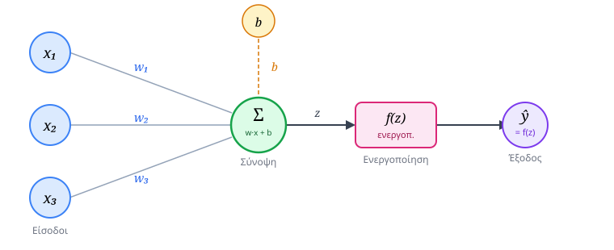
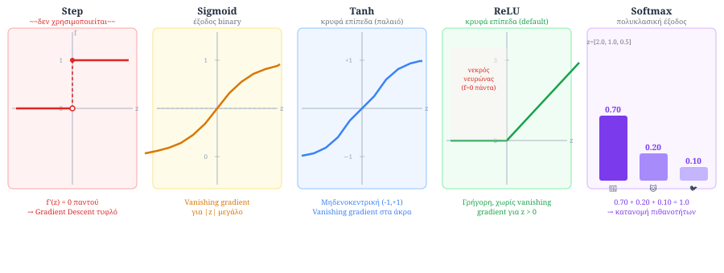
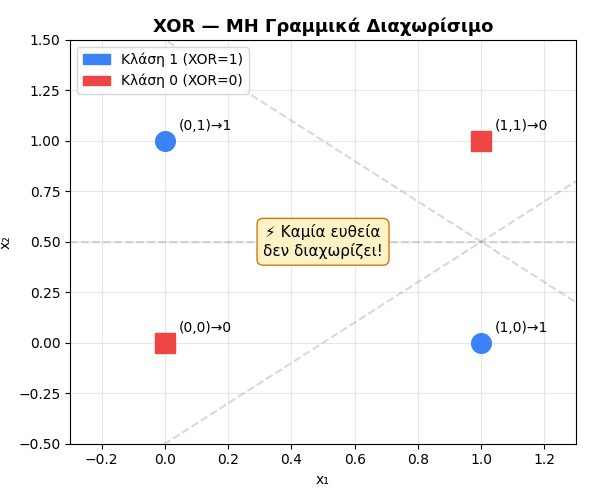
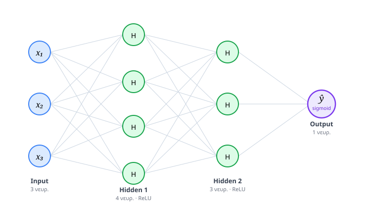
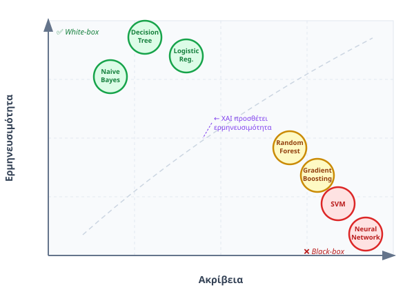

<div style="text-align:center; margin-bottom:16px;">


</div>

# Ευφυή Συστήματα και Συστήματα Υποστήριξης Αποφάσεων
**Ενότητα 7: Νευρωνικά Δίκτυα, Generative AI & Εξηγησιμότητα (XAI)**
Τμήμα Μηχανικών Πληροφορικής & Υπολογιστών
Πανεπιστήμιο Δυτικής Αττικής

**Διδάσκων:** Ανάργυρος Τσαδήμας (<tsadimas@uniwa.gr>)

---

# Περιεχόμενα Ενότητας

1. **Εισαγωγή:** Η Εξέλιξη της Μηχανικής Μάθησης
2. **Βασικές Αρχές Deep Learning** — Perceptron, MLP *(Multi-Layer Perceptron)*, Backpropagation, Overfitting, Transfer Learning
3. **Generative AI & LLMs** *(Large Language Models)* — Transformer, Attention, Prompt Engineering, ChatGPT, Copilot
4. **Explainable AI (XAI)** — Feature Importance, LIME, SHAP, Counterfactual, Εργαλεία XAI, EU AI Act
5. **Σύνοψη & Συμπεράσματα**

---

# Σύνδεση με την Προηγούμενη Ενότητα


<!-- _class: xsmall -->
# Εισαγωγή
<div class="columns">

<div>

**Τι μάθαμε στην Ενότητα 6:**

* Δέντρα Απόφασης — **white-box**, εξηγήσιμα
* Random Forests — **black-box**, πιο ακριβή
* Αξιολόγηση: Confusion Matrix, ROC *(Receiver Operating Characteristic)*, AUC *(Area Under Curve)*
* Αλγόριθμοι: SVM *(Support Vector Machine)*, k-NN *(k-Nearest Neighbors)*, Naive Bayes, K-Means

</div>

<div>

**Τι προσθέτει η Ενότητα 7:**

| | Κλασική ΜΜ *(Μηχανική Μάθηση)* | Deep Learning |
|---|---|---|
| **Δεδομένα** | Δομημένα (πίνακες) | Μη-δομημένα (εικόνα, κείμενο) |
| **Χαρακτηριστικά** | Χειροκίνητα | Αυτόματα |
| **Ερμηνεία** | Συχνά εφικτή | Δύσκολη → XAI |
| **Υπολογιστικό κόστος** | Χαμηλό | Υψηλό |

</div>

</div>

> **Κεντρικό δίλημμα:** Ακρίβεια vs Ερμηνευσιμότητα — πότε χρειαζόμαστε το ένα ή το άλλο;

> **Σημείωση:** Τα νευρωνικά δίκτυα (Deep Learning) ανήκουν στην **Προβλεπτική AI** — τα παρουσιάζουμε εδώ γιατί αποτελούν το **αρχιτεκτονικό θεμέλιο** των LLMs *(Large Language Models)* και της Generative AI.

---

<!-- _class: small -->
# Τεχνητά Νευρωνικά Δίκτυα (ΤΝΔ) — Τι Είναι

Ένα **ΤΝΔ** *(Artificial Neural Network — ANN)* είναι ένας παράλληλος κατανεμημένος επεξεργαστής εμπνευσμένος από τον εγκέφαλο — αποθηκεύει γνώση στα **βάρη** των συνδέσεών του.

<div class="columns">

<div>

**ΤΝΔ vs Κλασικός Προγραμματισμός:**

| | ΤΝΔ | Κλασικός κώδικας |
|---|---|---|
| **Λογική** | Μαθαίνει από δεδομένα | Προγραμματίζεται IF/THEN |
| **Επεξεργασία** | Παράλληλη | Σειριακή |
| **Ανοχή σφαλμάτων** | ✅ (θόρυβος ok) | ❌ (ακριβή δεδομένα) |
| **Ερμηνεία** | ❌ Black-box | ✅ Ιχνηλατήσιμη |

</div>

<div>

**Πλεονέκτημα:** Ανοχή σε δεδομένα με θόρυβο — λάθη καταχώρησης, ακραίες τιμές, ελλιπή δεδομένα δεν καταστρέφουν τη μάθηση.

**Μειονέκτημα:** Αδυνατεί να εξηγήσει ποιοτικά τη γνώση που μοντελοποιεί — γι' αυτό χρειαζόμαστε **XAI** *(Explainable AI)*. *(Ενότητα 4 αυτού του μαθήματος)*

**Δύο είδη μάθησης:**
* **Supervised** *(υπό επίβλεψη)*: δίνουμε ζεύγη (είσοδος, σωστή απάντηση) — αυτό χρησιμοποιούμε σε αυτή την ενότητα
* **Unsupervised** *(χωρίς επίβλεψη)*: δίνουμε μόνο εισόδους — το δίκτυο βρίσκει μοτίβα μόνο του *(π.χ. K-Means, Ενότητα 6)*

</div>

</div>

---

# Predictive vs Generative AI

<div class="columns">

<div>

**Προβλεπτική AI** *(Ενότητα 6)*

* **Ερώτηση:** «Θα ακυρώσει ο πελάτης;»
* **Έξοδος:** Κατηγορία ή αριθμός
* **Εκπαίδευση:** Με labeled data
* **Παραδείγματα:** Churn prediction, spam filter, τιμή ακινήτου

</div>

<div>

**Παραγωγική AI** *(Ενότητα 7)*

* **Ερώτηση:** «Γράψε email για να μην ακυρώσει ο πελάτης»
* **Έξοδος:** Νέο περιεχόμενο (κείμενο, εικόνα, κώδικας)
* **Εκπαίδευση:** Με τεράστια unlabeled data
* **Παραδείγματα:** ChatGPT, DALL-E, GitHub Copilot

</div>

</div>

> **Στο DSS** *(Decision Support System — Σύστημα Υποστήριξης Αποφάσεων)*: Οι δύο προσεγγίσεις συμπληρώνουν η μία την άλλη — η προβλεπτική εντοπίζει τον κίνδυνο, η παραγωγική διαμορφώνει την απόκριση.

---
<!-- _class: small -->
# Πότε Χρειαζόμαστε Deep Learning;

Σε δομημένα δεδομένα (πίνακες) τα Decision Trees και Random Forests αποδίδουν εξαιρετικά. Αποτυγχάνουν όμως σε **μη-δομημένα δεδομένα**:

<div class="columns">

<div>

**Παραδείγματα μη-δομημένων:**

* 📷 **Εικόνα:** Διάγνωση από ακτινογραφία
* 🎙️ **Ήχος:** Αναγνώριση ομιλίας
* 📝 **Κείμενο:** Ανάλυση συναισθήματος
* 🎥 **Βίντεο:** Ανίχνευση αντικειμένων

</div>

<div>

**Γιατί αποτυγχάνουν οι κλασικοί αλγόριθμοι;**

* **Εκατομμύρια χαρακτηριστικά** (pixels) → αδύνατη χειροκίνητη επιλογή
* **Δεν αναγνωρίζουν χωρικές/χρονικές σχέσεις** μεταξύ χαρακτηριστικών
* Χρειάζεται **αυτόματη εξαγωγή** χαρακτηριστικών

> **Deep Learning** = νευρωνικά δίκτυα με πολλά επίπεδα. Είναι **οικογένεια αρχιτεκτονικών** (MLP, CNN, RNN, Transformer) — όχι ένα μοντέλο. Η βασική χρήση είναι **Προβλεπτική AI**, αλλά η αρχιτεκτονική Transformer οδήγησε και στη **Generative AI** (LLMs).

</div>

</div>

---

<!-- _class: small -->
# Γιατί Αποτυγχάνουν οι Κλασικοί Αλγόριθμοι; (Αναλυτικά)

<div class="columns">

<div>

**Πρόβλημα 1 — Εκατομμύρια χαρακτηριστικά**

Μια εικόνα 224×224 pixels = **150.528 χαρακτηριστικά**.  
Ένα Random Forest αξιολογεί κάθε feature ξεχωριστά — αδύνατο στατιστικά.

Στο κείμενο: κάθε λέξη του λεξιλογίου (50.000+) είναι ξεχωριστό feature.

**Λύση DL:** τα πρώτα επίπεδα εντοπίζουν απλά μοτίβα (ακμές, ήχους), τα επόμενα τα συνδυάζουν σε πιο σύνθετα (μάτια → πρόσωπο).

</div>

<div>

**Πρόβλημα 2 — Χωρικές/χρονικές σχέσεις**

Ένα Random Forest βλέπει κάθε feature **ανεξάρτητα** — δεν «ξέρει» ότι pixel (10,10) και (10,11) είναι διπλανά.

| Δεδομένα | Σχέση που χάνεται | Παράδειγμα |
|---|---|---|
| **Εικόνα** | Χωρική | Η μύτη είναι *ανάμεσα* σε μάτια και στόμα |
| **Κείμενο** | Σειρά λέξεων | «δεν είναι καλό» ≠ «είναι καλό» |
| **Ήχος/Βίντεο** | Χρονική | «τράπεζα» αλλάζει νόημα ανάλογα με context |

**Λύση DL:** εξειδικευμένες αρχιτεκτονικές για κάθε τύπο δεδομένων:
- **CNN** *(Convolutional Neural Network)*: σαρώνει τοπικά μοτίβα — ιδανικό για εικόνες
- **RNN** *(Recurrent Neural Network)*: θυμάται προηγούμενες εισόδους — για ακολουθίες
- **Transformer**: αντικατέστησε το RNN — βλέπει ολόκληρη την ακολουθία ταυτόχρονα

</div>

</div>

---

<!-- _class: small -->
# Χειροκίνητα vs Αυτόματα Χαρακτηριστικά

<div class="columns">

<div>

**Χειροκίνητα (Hand-crafted features)**

Ο ειδικός αποφασίζει *ποια* χαρακτηριστικά είναι σημαντικά και τα υπολογίζει ρητά.

| Πεδίο | Παράδειγμα |
|---|---|
| Εικόνα προσώπου | Απόσταση ματιών, γωνία μύτης |
| Κείμενο | Αριθμός αρνητικών λέξεων |
| Ήχος | Συχνότητα, ρυθμός ομιλίας |

**Πρόβλημα:** απαιτεί domain expertise, δεν κλιμακώνεται σε εκατομμύρια features.

</div>

<div>

**Αυτόματα (Learned features)**

Το νευρωνικό δίκτυο *μαθαίνει* ποια χαρακτηριστικά είναι χρήσιμα απευθείας από τα δεδομένα.

```
Pixel → ακμές → σχήματα → μάτια → πρόσωπο
```

Κάθε επίπεδο εξάγει ολοένα πιο αφηρημένα χαρακτηριστικά — χωρίς ανθρώπινη παρέμβαση.

> **Αυτό είναι το κλειδί του Deep Learning:** η ιεραρχική, αυτόματη εξαγωγή χαρακτηριστικών που επιτρέπει επεξεργασία εικόνας, κειμένου και ήχου σε πρακτική κλίμακα.

</div>

</div>

---

<!-- _class: xsmall -->
# Ο Τεχνητός Νευρώνας (Perceptron)

<div class="columns">

<div>

**Ο νευρώνας ως εργοστάσιο ρεύματος:**

| Βιολογία | Αναλογία | Τεχνητό δίκτυο |
|---|---|---|
| Δενδρίτες | Είσοδος σήματος | Είσοδοι $x_i$ |
| **Σύναψη** | **Ρυθμιστής** — πόσο περνά | **Βάρη $w_i$** |
| Σώμα (πυρήνας) | Αθροιστής + κατώφλι | Σύνοψη $\Sigma$ + $f(z)$ |
| **Νευροάξονας** | **Καλώδιο** — μεταφέρει έξοδο | **Έξοδος $\hat{y}$** |

> **Σύναψη = Βάρος:** η μάθηση στον εγκέφαλο είναι η ενίσχυση/αποδυνάμωση συνάψεων — ακριβώς αυτό κάνει το Gradient Descent με τα $w_i$.

$$z = \underbrace{\mathbf{w}^\top \mathbf{x}}_{\text{διανυσματικό γινόμενο } \sum w_i x_i} + b, \qquad \hat{y} = f(z)$$

*($\mathbf{w}, \mathbf{x}$: διανύσματα βαρών/εισόδων — συντομογραφία για $w_1x_1 + w_2x_2 + \ldots + w_nx_n$)*

</div>

<div>

**Η πλήρης διαδρομή:**

$$\underbrace{x_i}_{\text{δενδρίτες}} \xrightarrow{\times\, w_i}_{\text{σύναψη}} \underbrace{\Sigma + f(z)}_{\text{πυρήνας}} \xrightarrow{\hat{y}}_{\text{νευροάξονας}} \text{επόμενος νευρώνας}$$




</div>

</div>

---

<!-- _class: xsmall -->
# Συναρτήσεις Ενεργοποίησης — Γιατί Χρειάζονται

Κάθε νευρώνας υπολογίζει $z = \mathbf{w}^\top\mathbf{x} + b$ και εφαρμόζει μια **συνάρτηση ενεργοποίησης** $f(z)$.

> Χωρίς $f(z)$, το δίκτυο — όσα επίπεδα κι αν έχει — λύνει μόνο **γραμμικά** προβλήματα. Οι συναρτήσεις ενεργοποίησης δίνουν την ικανότητα να μαθαίνει **μη-γραμμικά μοτίβα**.

<div class="columns">

<div>

**Gradient Descent** *(Κάθοδος Κλίσης)*

Η εκπαίδευση γίνεται ρωτώντας: «αν αλλάξω λίγο το βάρος $w$, πόσο αλλάζει το σφάλμα;» Η απάντηση είναι η **παράγωγος** (κλίση). Το δίκτυο ακολουθεί την κλίση «προς τα κάτω» για να μειώσει το σφάλμα.

> **Αναλογία — Τυφλός Ορειβάτης:** νιώθει το έδαφος με το πόδι και κάνει ένα βήμα προς τα κάτω. Αν το έδαφος είναι **επίπεδο** (παράγωγος = 0), δεν ξέρει πού να πάει.

Για να δουλέψει, η $f(z)$ **πρέπει** η παράγωγός της να είναι **διαφορετική από 0**.

</div>

<div>

**Vanishing Gradient** *(Εξαφάνιση Κλίσης)*

Σε συναρτήσεις όπως Sigmoid/Tanh, για μεγάλα $|z|$ η καμπύλη γίνεται **εντελώς επίπεδη** → παράγωγος ≈ 0.

Κατά την εκπαίδευση, όταν το δίκτυο κάνει λάθος, στέλνει ένα **σήμα διόρθωσης** (παράγωγος) από το τελευταίο επίπεδο **πίσω** στα προηγούμενα — αυτό είναι το Backpropagation. Σε κάθε επίπεδο, αυτό το σήμα **πολλαπλασιάζεται** με την παράγωγο της $f(z)$:

$$\underbrace{0.1}_{\text{επίπ. 4}} \times \underbrace{0.1}_{\text{επίπ. 3}} \times \underbrace{0.1}_{\text{επίπ. 2}} = 0.001$$

Αν η παράγωγος είναι μικρή (π.χ. 0.1), μετά από 3 πολλαπλασιασμούς το σήμα γίνεται **1000× μικρότερο** — τα πρώτα επίπεδα λαμβάνουν ελάχιστη πληροφορία και ουσιαστικά **σταματούν να μαθαίνουν**.

> **Λύση:** Η **ReLU** — παράγωγος = 1 για $z > 0$, δεν εξασθενεί.

</div>

</div>

---

<!-- _class: small -->
# Συναρτήσεις Ενεργοποίησης — Οι Βασικές

<div class="columns">

<div>

**🔴 Βηματική (Step)** — ~~Δεν χρησιμοποιείται~~

Εκπέμπει 1 αν $z>0$, αλλιώς 0. Παράγωγος = 0 παντού → Gradient Descent τυφλό.

**🟡 Sigmoid** *(Σιγμοειδής)* — Έξοδος binary

Καμπύλη S, συμπιέζει $z$ στο $(0,1)$ → πιθανότητα.  
Πρόβλημα: vanishing gradient για μεγάλα $|z|$.

**🟣 Softmax** — Πολυκλασική έξοδος

Παίρνει διάνυσμα $z$ → πιθανότητες που αθροίζουν στο 1.  
Π.χ.: $[z_{\text{σκύλος}}, z_{\text{γάτα}}, z_{\text{πουλί}}] \rightarrow [0.70,\ 0.20,\ 0.10]$

</div>

<div>

**🟢 ReLU** *(Rectified Linear Unit)* — Κρυφά επίπεδα **(default)**

$\max(0,z)$: αν $z>0$ περνά αναλλοίωτο, αλλιώς 0.  
Παράγωγος = 1 για $z>0$ → **λύνει το vanishing gradient**.  
Πρόβλημα: «νεκροί νευρώνες» αν πάντα $z<0$.

**🔵 Tanh** *(Υπερβολική Εφαπτομένη)* — Κρυφά επίπεδα (παλαιότερα)

Ίδιο σχήμα S, αλλά έξοδος στο $(-1,1)$ — **μηδενοκεντρική**.  
Ίδιο vanishing gradient πρόβλημα → αντικαταστάθηκε από ReLU.

**Κανόνας επιλογής:**
> Κρυφά επίπεδα → **ReLU** · Έξοδος binary → **Sigmoid** · Multi-class → **Softmax**

</div>

</div>

---
<!-- _class: xsmall -->

# Συναρτήσεις Ενεργοποίησης — Γραφική Παράσταση



---

<!-- _class: small -->
# Perceptron με Αριθμούς — Βήμα-Βήμα

**Σενάριο:** Πρόβλεψη Churn. Ένας πελάτης έχει:

<div class="columns">

<div>

**Βήμα 1 — Είσοδοι & Βάρη (από εκπαίδευση)**

| Feature | Τιμή $x_i$ | Βάρος $w_i$ | Ερμηνεία |
|---|---|---|---|
| tenure (μήνες, normalized) | $x_1 = 0.8$ | $w_1 = -0.9$ | Παλιός πελάτης → ↓ churn |
| monthly_charges (norm.) | $x_2 = 0.6$ | $w_2 = +0.7$ | Ακριβό πλάνο → ↑ churn |
| num_tickets (norm.) | $x_3 = 0.2$ | $w_3 = +0.4$ | Λίγα παράπονα → ↑ λίγο |
| bias | — | $b = +0.1$ | — |

**Βήμα 2 — Γραμμικός συνδυασμός $z$:**

$$z = (-0.9)(0.8) + (0.7)(0.6) + (0.4)(0.2) + 0.1 = \mathbf{-0.12}$$

</div>

<div>

**Βήμα 3 — Συνάρτηση Ενεργοποίησης (Sigmoid):**

Χρησιμοποιούμε Sigmoid γιατί θέλουμε **πιθανότητα** P(Churn) ∈ (0,1):

$$\hat{y} = \sigma(-0.12) = \frac{1}{1+e^{0.12}} \approx \mathbf{0.47}$$

**Απόφαση:** $0.47 < 0.5$ → **No Churn** ✅

> Το αρνητικό $z$ οφείλεται στο **tenure**: ο παλιός πελάτης ($w_1 = -0.9$) «νικά» τα υπόλοιπα features.

**Τι αποθηκεύεται στο μοντέλο:** μόνο τα $w_1, w_2, w_3, b$ — όχι τα δεδομένα εκπαίδευσης.

</div>

</div>

---

<!-- _class: xsmall -->
# Συναρτήσεις Ενεργοποίησης — Ίδια Είσοδος, Διαφορετική Έξοδος

Χρησιμοποιούμε το $z = -0.12$ από το παράδειγμά μας και άλλες τιμές:

<div class="columns">

<div>

| $z$ | Step | Sigmoid | Tanh | ReLU | Leaky ReLU |
|---|---|---|---|---|---|
| $-3$ | 0 | 0.05 | −0.99 | 0 | −0.03 |
| $-1$ | 0 | 0.27 | −0.76 | 0 | −0.01 |
| $\mathbf{-0.12}$ | **0** | **0.47** | **−0.12** | **0** | **−0.001** |
| $0$ | 0 | 0.50 | 0 | 0 | 0 |
| $+1$ | 1 | 0.73 | +0.76 | 1 | 1 |
| $+3$ | 1 | 0.95 | +0.99 | 3 | 3 |

**Softmax** — χρειάζεται διάνυσμα (multi-class):

$$\mathbf{z} = [2.0,\ 1.0,\ 0.5] \xrightarrow{\text{softmax}} [0.63,\ 0.23,\ 0.14]$$

</div>

<div>

**Τι παρατηρούμε για $z = -0.12$:**

| Συνάρτηση | Έξοδος | Ερμηνεία |
|---|---|---|
| **Step** | 0 | Binary: "No Churn" — καμία απόχρωση |
| **Sigmoid** | 0.47 | "47% πιθανότητα" — χρήσιμο |
| **Tanh** | −0.12 | Κεντραρισμένο γύρω από 0, όχι πιθανότητα |
| **ReLU** | 0 | Χάνει πληροφορία για $z<0$ — ακατάλληλο ως έξοδος |
| **Leaky ReLU** | −0.001 | Κρατά μικρό σήμα για $z<0$ |

</div>

</div>

---

<!-- _class: xsmall -->
# Από τον Perceptron στο Πολυεπίπεδο Δίκτυο (MLP)

**Ένας perceptron δεν αρκεί** — μπορεί να βρει μόνο **γραμμικές** επιφάνειες διαχωρισμού. Η λύση: **πολλά επίπεδα νευρώνων**.

<div class="columns">

<div>

**Γιατί αποτυγχάνει ο perceptron — το πρόβλημα XOR:**

Ο perceptron βρίσκει μια **ευθεία γραμμή** (υπερεπίπεδο) που χωρίζει τις δύο κλάσεις. Αυτό λειτουργεί μόνο αν τα δεδομένα είναι **γραμμικά διαχωρίσιμα**.



Δεν υπάρχει ευθεία που να χωρίζει σωστά και τα 4 σημεία — το XOR είναι **μη γραμμικά διαχωρίσιμο**. Ο perceptron αποτυγχάνει.

**Λύση — MLP:** Πολλαπλά επίπεδα δημιουργούν **μη-γραμμικές** επιφάνειες διαχωρισμού. Το πρώτο κρυφό επίπεδο μαθαίνει γραμμικούς διαχωρισμούς, τα επόμενα τους **συνδυάζουν** σε καμπύλες.


</div>

<div>



**Πλήθος παραμέτρων (churn prediction):**
$10 \times 64 + 64 \times 32 + 32 \times 1 = 2.720$ βάρη

**Αρχιτεκτονική:**
* **Input Layer:** ένας νευρώνας ανά χαρακτηριστικό
* **Hidden Layers:** μη-γραμμικοί μετασχηματισμοί (ReLU)
* **Output Layer:** τελική πρόβλεψη

</div>

</div>

---

<!-- _class: xsmall -->
# Ποια Συνάρτηση Πού; — Παράδειγμα Δικτύου

Κάθε **επίπεδο** χρησιμοποιεί μία συνάρτηση (όχι κάθε νευρώνας ξεχωριστά):



> **Κανόνας:** Όλα τα κρυφά → **ReLU** (ίδια παντού). Μόνο η έξοδος αλλάζει ανάλογα τι θέλουμε: **Sigmoid** (πιθανότητα 0-1), **Softmax** (πολλές κλάσεις), ή **καμία** (regression).

---

<!-- _class: xxsmall -->
# Συναρτήσεις Ενεργοποίησης — ReLU ως Προεπιλογή & Εξαιρέσεις

Η ReLU **δεν είναι υποχρεωτική** στα κρυφά επίπεδα — είναι **υπερπαράμετρος** (απόφαση του Data Scientist). Είναι όμως η πιο συνηθισμένη επιλογή για δύο λόγους:

<div class="columns">

<div>

**Γιατί η ReLU κυριαρχεί:**

* **Λύνει το Vanishing Gradient:** κλίση = 1 για $z>0$ → το σήμα σφάλματος περνά ατόφιο προς τα πίσω, επιτρέποντας εκπαίδευση βαθιών δικτύων
* **Υπολογιστική ταχύτητα:** $\max(0,z)$ είναι αστραπιαία πράξη έναντι του $e^{-z}$ της Sigmoid/Tanh

**Πότε ΔΕΝ χρησιμοποιούμε ReLU:**

**1. Dying ReLU (Νεκροί Νευρώνες)**

Αν το $z$ ενός νευρώνα γίνει αρνητικό για όλα τα δεδομένα → έξοδος = 0, κλίση = 0 → δεν μαθαίνει ποτέ ξανά.

* **Leaky ReLU:** αφήνει μικρή «διαρροή» ($0.01 \cdot z$) για $z<0$ → ο νευρώνας μπορεί να «ξυπνήσει»
* **ELU (Exponential Linear Unit) / SELU (Scaled Exponential Linear Unit):** πιο ομαλές παραλλαγές με θεωρητικά πλεονεκτήματα, υψηλότερο υπολογιστικό κόστος

</div>

<div>

**2. Ρηχά δίκτυα ή παλαιότερη βιβλιογραφία**

Σε δίκτυα με 1-2 κρυφά επίπεδα, το Vanishing Gradient δεν είναι κρίσιμο. Συχνά βλέπουμε **Tanh** — είναι μηδενοκεντρική (έξοδος στο $(-1,1)$), κάτι που βοηθά το Gradient Descent.

**3. Συγκεκριμένες αρχιτεκτονικές**

Στα **RNN** (προκάτοχοι Transformer για κείμενο/χρονοσειρές), η **Tanh** ήταν σχεδόν ο κανόνας στον πυρήνα λόγω του τρόπου ελέγχου της «μνήμης».

**Επίπεδο Εξόδου — ο αυστηρός κανόνας:**

| Ζητούμενο | Συνάρτηση |
|---|---|
| Πιθανότητα Ναι/Όχι (Churn) | **Sigmoid** → $(0,1)$ |
| Πολυκλασική (Σκύλος/Γάτα/Πουλί) | **Softmax** → άθροισμα = 1 |
| Αριθμός / Παλινδρόμηση (τιμή σπιτιού) | **Καμία** (Linear) ή ReLU αν έξοδος $\geq 0$ |

> Στο output layer **ποτέ** ReLU για ταξινόμηση — χάνουμε την ερμηνεία ως πιθανότητα.

</div>

</div>

---

<!-- _class: small -->
# Τι «Βλέπουν» τα Κρυφά Επίπεδα;

Κάθε κρυφό επίπεδο μαθαίνει **πιο αφηρημένες αναπαραστάσεις** από το προηγούμενο.

<div class="columns">

<div>

**Αναγνώριση προσώπου (CNN):**



**Ανάλυση κειμένου (Transformer):**



</div>

<div>

**Γιατί χρειαζόμαστε πολλά επίπεδα;**

Ένα μόνο επίπεδο μπορεί θεωρητικά να αναπαραστήσει οποιαδήποτε συνάρτηση — αλλά θα χρειαστεί **εκθετικά περισσότερους** νευρώνες.

Τα πολλά επίπεδα επιτρέπουν **ιεραρχική σύνθεση** πολύπλοκων χαρακτηριστικών από απλά — με πολύ λιγότερες παραμέτρους.

> **Αναλογία:** Όπως ένα λεξικό ορίζει σύνθετες λέξεις χρησιμοποιώντας απλούστερες — δεν γράφει ξανά την Ελληνική Γραμματική από την αρχή.

</div>

</div>

---

# Το Μεγάλο Άλμα: Από Κανόνες σε Ελαχιστοποίηση Σφάλματος

<div class="columns">

<div>

**Κλασικός Προγραμματισμός:**
> Ο άνθρωπος γράφει τους κανόνες (IF/THEN) → ο υπολογιστής τους εκτελεί τυφλά.

**Machine Learning:**
> «Δεν ξέρω ποιοι είναι οι κανόνες. Ξεκίνα να μαντεύεις, και **μείωνε το σφάλμα** σε κάθε προσπάθεια μέχρι να βρεις τα τέλεια βάρη.»

Όλα τα νευρωνικά δίκτυα — από τον απλό Perceptron μέχρι τα LLMs με δισεκατομμύρια παραμέτρους — κάνουν **ακριβώς αυτό**.

</div>

<div>

**Το παιχνίδι «ζεστό-κρύο» σε μαθηματική μορφή:**

$$\underbrace{\text{Πρόβλεψη}}_{\hat{y}} \xrightarrow{\text{Loss}} \underbrace{\text{Σφάλμα}}_{\mathcal{L}} \xrightarrow{\text{Backprop}} \underbrace{\text{Ευθύνη κάθε } w}_{\frac{\partial\mathcal{L}}{\partial w}} \xrightarrow{\text{GD}} \underbrace{\text{Διόρθωση}}_{w \leftarrow w - \eta\frac{\partial\mathcal{L}}{\partial w}}$$

Επαναλαμβάνεται εκατομμύρια φορές — μέχρι το σφάλμα να **πιάσει πάτο**.

> **Paradigm shift:** Η «νοημοσύνη» αυτών των συστημάτων δεν είναι μαγεία — είναι ένα γιγάντιο μαθηματικό παιχνίδι ελαχιστοποίησης σφάλματος.

</div>

</div>

---

<!-- _class: small -->
# Πώς Μαθαίνουν τα Δίκτυα — Οι 4 Ρόλοι

<div class="columns">

<div>

**1. Forward Propagation**

Τα δεδομένα «ρέουν» από την είσοδο προς την έξοδο — το δίκτυο κάνει μια πρόβλεψη $\hat{y}$.

**2. Loss Function — ο «Κριτής»** ⚖️

Μετράει την απόσταση πρόβλεψης–πραγματικότητας:

$$\mathcal{L} = -\frac{1}{n}\sum_i \left[ y_i \log\hat{y}_i + (1-y_i)\log(1-\hat{y}_i) \right]$$

*Π.χ. είπες 0.2, η αλήθεια είναι 1 → σφάλμα 0.8.*

**Σύνδεση:** Το Gini Impurity του Decision Tree και το Loss Function έχουν τον ίδιο στόχο.

</div>

<div>

**3. Backpropagation — ο «Αγγελιοφόρος»** 📨

Παίρνει το σφάλμα από την έξοδο και τρέχει **προς τα πίσω**, λέγοντας σε κάθε βάρος: «εσύ φταις κατά 10%, εσύ κατά 2%...»

**4. Gradient Descent — το «Τιμόνι»** 🎯

$$w \leftarrow w - \eta \cdot \frac{\partial \mathcal{L}}{\partial w}$$

Στρίβει τα βάρη ελαφρώς προς τη σωστή κατεύθυνση ώστε **την επόμενη φορά το σφάλμα να είναι μικρότερο**.

> **Τυφλός Ορειβάτης:** Νιώθει την κλίση του εδάφους και κάνει ένα βήμα κάτω. $\eta$ μεγάλο → πηδά στο απέναντι βουνό· $\eta$ μικρό → αιώνες να κατέβει.

> **Epochs:** Ο κύκλος Forward→Loss→Backprop→Update επαναλαμβάνεται εκατοντάδες φορές.

</div>

</div>

---

<!-- _class: xxsmall -->

# Overfitting & Regularization στα Neural Networks

Τα NN με πολλές παραμέτρους **απομνημονεύουν** τα training data — το ίδιο πρόβλημα με τα Decision Trees, αλλά πολύ πιο έντονο.

**Το ίδιο pattern, διαφορετική λύση:**

| | Decision Trees (Διάλ. 6) | Neural Networks (Διάλ. 7) |
|---|---|---|
| **Πρόβλημα** | Δέντρο πολύ βαθύ → απομνημονεύει | Εκατ. παράμετροι → απομνημονεύει |
| **Λύση 1** | Pruning (κλαδεύουμε) | **Dropout** (σβήνουμε νευρώνες) |
| **Λύση 2** | Random Forests (πολλά δέντρα) | **Early Stopping** (σταματάμε έγκαιρα) |
| **Κοινή λογική** | Μείωση πολυπλοκότητας | Μείωση πολυπλοκότητας |

**Dropout** *(αποσύνδεση)*:
Σε κάθε κύκλο εκπαίδευσης «σβήνουμε» τυχαία ~20–30% νευρώνων → το δίκτυο δεν «βολεύεται» στηριζόμενο σε συγκεκριμένους «έξυπνους» κόμβους· αναγκάζεται να **μοιράσει τη γνώση παντού**. Ίδια λογική με τα Random Forests: αντί για ένα δέντρο-«ειδικό», πολλά δέντρα-«γενικά».

```python
model.add(Dense(64, activation='relu'))
model.add(Dropout(0.3))  # 30% νευρώνες OFF
```

**Early Stopping:** Σταματάμε την εκπαίδευση όταν το validation loss αρχίζει να ανεβαίνει — ακόμα και αν το training loss συνεχίζει να πέφτει.

**Άλλες τεχνικές:**
* **L2 Regularization (Weight Decay):** τιμωρεί μεγάλα βάρη — αποτρέπει υπερβολική εξάρτηση από λίγα features
* **Batch Normalization:** κανονικοποιεί τις εξόδους κάθε επιπέδου — σταθεροποιεί τη μάθηση και επιτρέπει υψηλότερο learning rate
* **Data Augmentation:** δημιουργεί τεχνητά νέα δεδομένα από υπάρχοντα (εικόνες: περιστροφή, zoom, αντιστροφή) — αυξάνει την ποικιλία χωρίς νέες μετρήσεις

---

<!-- _class: xxsmall -->
# Overfitting — Ανάγνωση του Διαγράμματος

<div class="columns">

<div>



</div>

<div>

Δύο παράλληλες διαδρομές — **Training** (μπλε) και **Validation** (κόκκινο) — σε τρία σημεία εκπαίδευσης:

| Epoch | Training Loss | Validation Loss |
|---|---|---|
| 1 | 0.8 | 0.8 |
| 20 | 0.3 | 0.35 ← βέλτιστο ⛔ |
| 50 | 0.1 ↘ | 0.6 ↑ |

Στο **Epoch 20** το validation loss φτάνει στο ελάχιστό του — **εκεί σταματάμε** (Early Stopping).

Στο **Epoch 50** το training loss συνεχίζει να πέφτει (0.1), αλλά το validation **ανεβαίνει** (0.6): το μοντέλο **απομνημονεύει** τα training data αντί να γενικεύει.

> **Κλειδί:** Χρειαζόμαστε πάντα ξεχωριστό **validation set** — χωρίς αυτό δεν μπορούμε να εντοπίσουμε το overfitting.

</div>

</div>

---

<!-- _class: small -->
# Transfer Learning — «Μαθαίνω από Άλλους»

**Ιδέα:** Αντί να εκπαιδεύσουμε ένα NN από μηδέν (απαιτεί τεράστια δεδομένα & υπολογιστικό κόστος), ξεκινάμε από ένα **ήδη εκπαιδευμένο μοντέλο** και το προσαρμόζουμε στο δικό μας πρόβλημα.

<div class="columns">

<div>

**Πώς λειτουργεί:**

```
Προεκπαιδευμένο μοντέλο
(π.χ. ResNet σε 1M εικόνες)
         ↓
  Παγώνουμε τα κατώτερα
  επίπεδα (γενικά features)
         ↓
  Fine-tune μόνο τα ανώτερα
  επίπεδα στα δικά μας data
         ↓
  Αποτέλεσμα με λίγα δεδομένα!
```

</div>

<div>

**Παραδείγματα:**

| Βάση | Εφαρμογή |
|---|---|
| **ResNet/VGG** | Ιατρικές εικόνες (X-ray, MRI) |
| **BERT/RoBERTa** | Ανάλυση κειμένου (reviews, emails) |
| **Whisper** | Αναγνώριση ομιλίας |
| **GPT-4** | Εξατομικευμένο chatbot εταιρείας |

> **Πρακτικά:** Τα περισσότερα σύγχρονα DL projects ξεκινάνε από transfer learning — σπάνια από μηδέν. Ακόμα και με 1.000 δείγματα μπορεί να δώσει εξαιρετικά αποτελέσματα.

</div>

</div>

---

<!-- _class: xxsmall -->
# Embeddings — Πώς «Μπαίνουν» οι Λέξεις στο Νευρωνικό Δίκτυο

**Το πρόβλημα:** Τα νευρωνικά δίκτυα δέχονται **μόνο αριθμούς** — δεν καταλαβαίνουν λέξεις.

**Η λύση — Word Embeddings:** Μετατρέπουμε κάθε λέξη σε ένα **διάνυσμα αριθμών** (λίστα από δεκαδικούς).

<div class="columns">

<div>

**Η βασική ιδέα:**

```
"βασιλιάς"  → [0.91, 0.23, 0.70, ...]
"βασίλισσα" → [0.89, 0.21, 0.68, ...]
"αυτοκίνητο"→ [0.12, 0.78, 0.05, ...]
```

Λέξεις με **παρόμοιο νόημα** → **παρόμοιοι αριθμοί** → κοντινά σημεία στον χώρο.

Λέξεις άσχετες → διαφορετικοί αριθμοί → μακρινά σημεία.

> Δεν ορίζουμε εμείς αυτούς τους αριθμούς — το μοντέλο τους **μαθαίνει μόνο του** από εκατομμύρια κείμενα.

</div>

<div>

**Γιατί είναι σημαντικό:**

| Τεχνική | Είσοδος |
|---|---|
| Κλασικό MLP | Αριθμοί (π.χ. ηλικία, εισόδημα) |
| MLP + Embeddings | **Λέξεις → αριθμοί → MLP** |
| Transformer (LLM) | Embeddings + Attention |

**Διάσημο παράδειγμα (Word2Vec):**

```
"βασιλιάς" − "άντρας" + "γυναίκα"
           ≈ "βασίλισσα"
```

Η αριθμητική των vectors αντικατοπτρίζει **σχέσεις νοήματος** — το μοντέλο έχει «μάθει» ότι το φύλο είναι μια διάσταση του νοήματος.

> **Συνδετικός κρίκος:** Αυτά τα διανύσματα γίνονται η **Είσοδος** ($x_1, x_2, \ldots$) για τα βαθιά κρυφά επίπεδα του δικτύου — έτσι η γλώσσα «μπαίνει» στα μαθηματικά.

</div>

</div>

---

<!-- _class: xsmall -->
# Generative AI & Large Language Models (LLMs)

**Τι είναι τα LLMs:** Δεν είναι «έξυπνα» με την ανθρώπινη έννοια — είναι εξαιρετικά στο να **προβλέπουν την επόμενη λέξη** βασισμένα σε δισεκατομμύρια παραμέτρους.

<div class="columns">

<div>

**Αρχιτεκτονική Transformer (2017):**

* **Attention Mechanism:** το μοντέλο «προσέχει» ποιες λέξεις σχετίζονται με ποιες — ανεξαρτήτως απόστασης στο κείμενο
* **Pre-training:** εκπαίδευση σε τεράστιο corpus (διαδίκτυο, βιβλία) — next-token prediction
* **Fine-tuning + RLHF** *(Reinforcement Learning from Human Feedback)*: εξειδίκευση για διάλογο — ανθρώπινοι αξιολογητές βαθμολογούν απαντήσεις και το μοντέλο μαθαίνει να τις προτιμά

**Κλίμακα:**

| Μοντέλο | Παράμετροι |
|---|---|
| GPT-2 (2019) | 1,5 δισ. |
| GPT-3 (2020) | 175 δισ. |
| GPT-4 (2023) | ~1 τρισ. (εκτίμηση) |

</div>

<div>

**Εφαρμογές στο DSS:**

* **Brainstorming στρατηγικής:** «Ποιες είναι οι 5 κύριες αιτίες churn στον κλάδο τηλεπικοινωνιών;»
* **Περίληψη αναφορών:** Αυτόματη σύνοψη εκθέσεων 50 σελίδων
* **Ανάλυση συναισθήματος:** Κατηγοριοποίηση reviews πελατών σε πραγματικό χρόνο
* **Σύνταξη κώδικα:** Αυτόματη δημιουργία SQL queries, Python scripts
* **Εξατομίκευση:** «Γράψε email κράτησης για πελάτη με tenure 3 μήνες και υψηλές χρεώσεις»

> **Το AI ως Copilot:** Δεν αντικαθιστά τον Manager — λειτουργεί ως «συγκυβερνήτης» που επιταχύνει αποφάσεις και μειώνει γνωστικό φόρτο.

</div>

</div>

---

<!-- _class: xxsmall -->
# Attention Mechanism — Η Καρδιά του Transformer

**Πρόβλημα RNN:** Διαβάζει λέξη-λέξη και «ξεχνά» ό,τι είπε νωρίς — δεν μπορεί να συνδέσει λέξεις που απέχουν πολύ.

**Λύση Transformer:** Βλέπει **ολόκληρη την πρόταση ταυτόχρονα** και αποφασίζει ποιες λέξεις σχετίζονται με ποιες.

<div class="columns">

<div>

**Παράδειγμα — αναφορά αντωνυμίας:**

> «Ο **πελάτης** είπε ότι δεν θέλει να ακυρώσει, αλλά **αυτός** τελικά έφυγε.»

Για να καταλάβει το «**αυτός**», το μοντέλο πρέπει να κοιτάξει **πίσω** στο «πελάτης» — ανεξαρτήτως απόστασης. Το RNN το «ξεχνά». Το Transformer το βλέπει αμέσως.

**Πώς το κάνει — με βαθμολογία:**

Για κάθε λέξη, το μοντέλο βαθμολογεί πόσο «σχετίζεται» με κάθε άλλη λέξη της πρότασης:

```
«αυτός» ←→ «πελάτης»  : 0.85  ✅ υψηλή προσοχή
«αυτός» ←→ «θέλει»    : 0.10
«αυτός» ←→ «ακυρώσει» : 0.05
```

Η βαθμολογία προκύπτει από το **γινόμενο των διανυσμάτων** κάθε λέξης — διανύσματα που μαθαίνονται αυτόματα κατά την εκπαίδευση, ώστε λέξεις με σχέση (αντωνυμία ↔ ουσιαστικό) να αποκτούν παρόμοιες τιμές.

Το αποτέλεσμα: η αναπαράσταση του «αυτός» **ενσωματώνει** πληροφορία από το «πελάτης».

</div>

<div>

**Αναλογία — Google Search:**

| Βήμα | Search | Attention |
|---|---|---|
| Τι ψάχνω | «Μηχανική Μάθηση» | λέξη-στόχος («αυτός») |
| Τι συγκρίνω | Τίτλοι αποτελεσμάτων | Όλες οι λέξεις της πρότασης |
| Τι παίρνω | Περιεχόμενο σελίδας | Νόημα της σχετικής λέξης |

**Multi-Head Attention:**

Αντί για μία «ματιά», το μοντέλο κοιτάζει **ταυτόχρονα από πολλές οπτικές**:
* Head 1 → ποιο υποκείμενο αντιστοιχεί στο ρήμα;
* Head 2 → ποιες λέξεις είναι αντίθετες σε νόημα;
* Head 3 → ποιες λέξεις εμφανίζονται συχνά μαζί;

> Αυτό είναι που επιτρέπει στο ChatGPT να «κατανοεί» ένα email 500 λέξεων και να απαντά συνεκτικά.

</div>

</div>

---

<!-- _class: xxsmall -->
# Prompt Engineering — Η Τέχνη της Ερώτησης

**Ο τρόπος που ρωτάμε** ένα LLM επηρεάζει δραματικά την ποιότητα της απάντησης.

<div class="columns">

<div>

**Βασικές τεχνικές:**

**Zero-shot:** Απευθείας ερώτηση χωρίς παραδείγματα
> «Κατηγοριοποίησε αυτό το review ως θετικό/αρνητικό.»

**Few-shot:** Δίνεις 2-3 παραδείγματα πρώτα
> «"Εξαιρετικό!" → Θετικό
> "Απαράδεκτο" → Αρνητικό
> "Καλή εξυπηρέτηση αλλά αργή παράδοση" → ?»

**Chain-of-Thought:** Ζητάς εξήγηση βήμα-βήμα
> «Σκέψου βήμα-βήμα και μετά απάντησε...»

</div>

<div>

**Για το DSS — πρακτικά παραδείγματα:**

```
❌ Κακό prompt:
"Ανάλυσε τα δεδομένα μου"

✅ Καλό prompt:
"Είσαι αναλυτής churn σε εταιρεία
τηλεπικοινωνιών. Έχω 7.000 πελάτες με
tenure, MonthlyCharges και Contract.
Ποιες 3 υποθέσεις να ελέγξω πρώτα για
να μειώσω το churn κατά 10%; Δώσε
συγκεκριμένες μετρικές αξιολόγησης."
```

> **Κανόνας:** Όσο πιο συγκεκριμένο το **ρόλο**, **πλαίσιο** και **μορφή απάντησης**, τόσο καλύτερο το αποτέλεσμα.

</div>

</div>

**Θερμοκρασία (Temperature) — Ρυθμίζω τη «Δημιουργικότητα»:**

| Temperature | Συμπεριφορά | Ιδανικό για |
|---|---|---|
| **= 0.0** | Ντετερμινιστικό, αυστηρό, προβλέψιμο | Ανάλυση δεδομένων, κώδικας, νομικά κείμενα |
| **≥ 0.8** | Δημιουργικό — επιλέγει λιγότερο πιθανές λέξεις | Brainstorming, marketing, παραγωγή ιδεών |

> ⚠️ Υψηλό temperature → μεγαλύτερος κίνδυνος **hallucinations** (το μοντέλο «εφευρίσκει» πληροφορίες).

---

<!-- _class: xsmall -->
# Temperature — Μπορώ να το Ρυθμίσω;

Εξαρτάται από το εργαλείο — τα consumer interfaces συνήθως **δεν** εκθέτουν τη ρύθμιση.

<div class="columns">

<div>

**Απευθείας chat (ChatGPT, Claude.ai) — ΌΧΙ**

Χρησιμοποιούν προεπιλεγμένη τιμή (~0.7–1.0) χωρίς να την εμφανίζουν στον χρήστη.

**Μέσω API — ΝΑΙ**

```python
client.messages.create(
    model="claude-sonnet-4-6",
    temperature=0.0,   # ντετερμινιστικό
    messages=[...]
)
```

</div>

<div>

**Εργαλεία με ρυθμίσεις:**

| Εργαλείο | Temperature |
|---|---|
| ChatGPT API Playground | ✅ ρυθμιζόμενο |
| Claude.ai | ❌ κρυφό |
| Ollama *(local models)* | ✅ ρυθμιζόμενο |
| LM Studio | ✅ ρυθμιζόμενο |
| OpenWebUI | ✅ ρυθμιζόμενο |

> **Πρακτική εναλλακτική:** Αντί να ρυθμίσεις temperature, περίγραψέ το στο prompt:
> * «Απάντησε αυστηρά χωρίς εικασίες» → συμπεριφορά low temperature
> * «Δώσε μου 5 δημιουργικές ιδέες» → συμπεριφορά high temperature

</div>

</div>

---

<!-- _class: small -->
# Κίνδυνοι και Περιορισμοί των LLMs

<div class="columns">

<div>

**Hallucinations (Ψευδαισθήσεις):**
Το μοντέλο παράγει **πειστικά αλλά λανθασμένα** αποτελέσματα — επινοεί γεγονότα, παραπομπές, νόμους.

> «Cite me 3 papers on churn prediction» → το LLM μπορεί να επινοήσει τίτλους και συγγραφείς που δεν υπάρχουν.

**Bias (Προκατάληψη):**
Αντικατοπτρίζει προκαταλήψεις που υπάρχουν στα training data — φύλο, εθνικότητα, κοινωνική τάξη.

</div>

<div>

**Data Privacy:**

⚠️ **Τι δεν ανεβάζουμε ποτέ** σε δημόσια LLMs (ChatGPT, Gemini):

* Προσωπικά δεδομένα πελατών (GDPR)
* Εμπιστευτικά οικονομικά στοιχεία
* Εσωτερικές στρατηγικές εταιρείας
* Πηγαίος κώδικας με εμπορικά μυστικά

**Λύσεις:**
* Ιδιωτικές αναπτύξεις (on-premise LLMs)
* Anonymization πριν την υποβολή
* Enterprise εκδόσεις με data isolation

</div>

</div>

---

<!-- _class: xsmall -->
# RAG — Retrieval-Augmented Generation

**Το πρόβλημα:** Αν ρωτήσουμε ένα LLM «από μνήμης» για εσωτερικά δεδομένα της εταιρείας, παράγει **hallucinations** — δεν τα γνωρίζει.

**Η λύση:** Δεν ρωτάμε το LLM «τι ξέρεις;». Του δίνουμε πρώτα τα σωστά έγγραφα και μετά του λέμε «συντάξε απάντηση βάσει *αυτών*».

<div class="columns">

<div>

**Αρχιτεκτονική RAG:**

```
Ερώτηση χρήστη
      ↓
 [Retrieval] Αναζήτηση στα
 εσωτερικά δεδομένα
 (PDF, DB, ERP, Wiki, emails)
      ↓
 Σχετικές παράγραφοι / γραμμές
      ↓
 [Augmentation] Δίνουμε τα
 αποσπάσματα + ερώτηση στο LLM
      ↓
 [Generation] LLM συντάσσει
 απάντηση βασισμένη ΣΕ ΑΥΤΑ
```

</div>

<div>

**Σύγκριση για εταιρικό DSS:**

| | Χωρίς RAG | Με RAG |
|---|---|---|
| Πηγή γνώσης | Εκπαίδευση (2021–) | Τρέχοντα έγγραφα |
| Hallucinations | Πιθανές | Σχεδόν μηδενικές |
| Data Privacy | Κίνδυνος | Δεδομένα τοπικά |
| Εξηγησιμότητα | «Δεν ξέρω πηγή» | Αναφέρει την πηγή |
| Ενημέρωση | Ακριβό retraining | Απλά νέα αρχεία |

**Παράδειγμα DSS:**

> «Ποιες ήταν οι πωλήσεις του Q3 στην Αττική;»
> → Retrieval αναζητά στα εσωτερικά reports
> → LLM συντάσσει απάντηση με **πραγματικά νούμερα**

> **Χρήση στην πράξη:** Το RAG είναι η αρχιτεκτονική πίσω από εταιρικά chatbots τύπου «ρώτα το handbook μας» ή «ρώτα τα contracts σου».

</div>

</div>

---

# Explainable AI (XAI): Ανοίγοντας το «Μαύρο Κουτί»

**Το πρόβλημα:** Τα πιο ακριβή μοντέλα (Neural Networks, Random Forests, SVM) είναι **black-boxes** — δεν εξηγούν *γιατί* έβγαλαν μια πρόβλεψη.

<div class="columns">

<div>

**White-box vs Black-box:**

| | White-box | Black-box |
|---|---|---|
| **Παράδειγμα** | Decision Tree | Neural Network |
| **Ερμηνεία** | Κανόνες IF-THEN | Αδύνατη άμεσα |
| **Ακρίβεια** | Μέτρια | Υψηλή |
| **Νομική χρήση** | ✅ | ⚠️ |

</div>

<div>

**Το δίλημμα του Manager:**

> «Το νευρωνικό δίκτυο μου λέει να μην δώσω δάνειο στον πελάτη. Γιατί; Αν δεν μπορώ να το εξηγήσω στον πελάτη ή στην Τράπεζα της Ελλάδος, δεν μπορώ νόμιμα να το χρησιμοποιήσω.»

**Κανονισμός EU AI Act** *(Ευρωπαϊκός Κανονισμός Τεχνητής Νοημοσύνης, 2024)*: Για υψηλού κινδύνου εφαρμογές (δάνεια, ιατρική, πρόσληψη) απαιτείται **εξηγήσιμη απόφαση**.

</div>

</div>

---

<!-- _class: xsmall -->
# Γιατί το Random Forest είναι Black-Box; (Το Παράδοξο)

**Απορία:** Το Decision Tree είναι white-box. Το Random Forest βασίζεται σε Decision Trees. Γιατί είναι black-box;

<div class="columns">

<div>

**Decision Tree = White-box** ✅

Ακολουθείς ένα μονοπάτι root → leaf:
> tenure < 6 **ΚΑΙ** contract = monthly
> → P(Churn) = 0.82

Η λογική είναι πλήρως ιχνηλατήσιμη.

**Random Forest = 500 τέτοια δέντρα** ❌

| Λόγος | Επεξήγηση |
|---|---|
| **Bootstrap sampling** | Κάθε δέντρο εκπαιδεύεται σε διαφορετικό υποσύνολο δεδομένων |
| **Feature subsampling** | Κάθε split βλέπει τυχαία υποσύνολο features |
| **Majority voting** | Η πρόβλεψη = πλειοψηφία 500 διαφορετικών λογικών |

</div>

<div>

**Η αναλογία:**

> Φαντάσου 500 ανθρώπους που ψηφίζουν. Κάθε άτομος έχει απλό συλλογισμό — αλλά το «**γιατί** κέρδισε η πλειοψηφία» απαιτεί να κατανοήσεις και τους 500 ταυτόχρονα.

**Το κλειδί:**
Δεν είναι η πολυπλοκότητα *κάθε* δέντρου — είναι ο **μηχανισμός συνδυασμού**.

**Συνέπεια για XAI:**

| | Εκ κατασκευής | Εκ των υστέρων |
|---|---|---|
| Decision Tree | ✅ White-box | — |
| Random Forest | ❌ Black-box | ✅ SHAP |
| Neural Network | ❌ Black-box | ✅ SHAP / LIME |

</div>

</div>

---

<!-- _class: small -->
# XAI: LIME — Τοπική Εξήγηση

**LIME** *(Local Interpretable Model-agnostic Explanations)*

**Ιδέα:** Αντί να εξηγήσουμε ολόκληρο το μοντέλο, εξηγούμε **μία συγκεκριμένη πρόβλεψη** χτίζοντας ένα απλό τοπικό μοντέλο γύρω της.

<div class="columns">

<div>

**Αλγόριθμος:**

1. Πάρε ένα δείγμα $x$ που θέλεις να εξηγήσεις
2. Δημιούργησε παραλλαγές του $x$ (μικρές αλλαγές στα χαρακτηριστικά)
3. Πέρασε τις παραλλαγές από το black-box μοντέλο
4. Προσάρμοσε ένα **απλό γραμμικό μοντέλο** στις παραλλαγές (σταθμισμένο από την απόσταση)
5. Τα βάρη του γραμμικού μοντέλου = **εξήγηση**

> **Model-agnostic:** λειτουργεί με οποιοδήποτε μοντέλο — Neural Network, Random Forest, SVM.

</div>

<div>

**Παράδειγμα — Spam filter:**

Email: «Κερδίσατε €500! Κάντε κλικ εδώ τώρα!»
→ Μοντέλο: **Spam** (P=0.97)

LIME εξηγεί:

| Λέξη | Συνεισφορά |
|---|---|
| «Κερδίσατε» | +0.42 → Spam |
| «κλικ» | +0.31 → Spam |
| «τώρα» | +0.18 → Spam |
| «€500» | +0.06 → Spam |

→ Βλέπουμε **ποιες λέξεις έγειραν τη ζυγαριά**.

</div>

</div>

---

<!-- _class: xsmall -->
# XAI: SHAP — Δίκαιη Κατανομή Συνεισφοράς

**SHAP** *(SHapley **Additive** exPlanations)*

Βασισμένο στη **Θεωρία Παιγνίων** (Shapley values, 1953): πώς μοιράζουμε *δίκαια* τα κέρδη μιας ομάδας στους παίκτες;

<div class="columns">

<div>

**Ιδέα:** Κάθε χαρακτηριστικό είναι «παίκτης» — το SHAP μετρά πόσο **συνέβαλε** κάθε χαρακτηριστικό στη διαφορά της πρόβλεψης από τη μέση πρόβλεψη του μοντέλου.

$$\hat{y} = \underbrace{\phi_0}_{\text{base}} + \underbrace{\sum_{i=1}^n \phi_i}_{\text{SHAP values}} $$

* $\phi_0$: βασική πρόβλεψη (μέση τιμή του μοντέλου)
* $\phi_i$: συνεισφορά χαρακτηριστικού $i$

> **Additivity:** Το άθροισμα **κλείνει ακριβώς** — πάντα.

**Global vs Local:**
* **Local:** γιατί αυτός ο πελάτης → Ακύρωση;
* **Global:** ποια features έχουν γενικά σημασία;

</div>

<div>

**Παράδειγμα — Churn (Πελάτης 123):**

| | |
|---|---|
| Βασική πιθανότητα | 20% |
| Παράπονο χθες | **+40%** |
| Λήξη συμβολαίου | **+25%** |
| Υψηλές χρεώσεις | **+10%** |
| Μεγάλο tenure | -15% |
| **Τελική πρόβλεψη** | **80%** |

$$20\% + 40\% + 25\% + 10\% - 15\% = \mathbf{80\%}\ \checkmark$$

→ Ξέρουμε ακριβώς **πού να επέμβουμε**: προσφορά ανανέωσης + επίλυση παραπόνου.

> **SHAP vs LIME — κρίσιμη διαφορά:** Το SHAP **εγγυάται** ότι base value + SHAP values = τελική πρόβλεψη. Το LIME δεν έχει αυτή την εγγύηση. Για Managers και νομικά/κανονιστικά πλαίσια αυτό δίνει **τεράστια εμπιστοσύνη**: οι εξηγήσεις είναι ελέγξιμες.

</div>

</div>

---

<!-- _class: xxsmall -->
# Σύγκριση XAI Μεθόδων

**Feature Importance** *(Σπουδαιότητα Χαρακτηριστικών)* — η απλούστερη μέθοδος: μετράει πόσο συνέβαλε κάθε feature στις αποφάσεις του μοντέλου **συνολικά**, σε όλο το dataset. Στα Decision Trees/Random Forests υπολογίζεται από το Gini Impurity (πόσο «καθαρίζει» το σύνολο κάθε feature όταν χρησιμοποιείται για split). Δεν εξηγεί *μεμονωμένες* προβλέψεις — μόνο τη γενική συμπεριφορά του μοντέλου.

```python
rf.feature_importances_  # → [0.45, 0.30, 0.15, 0.10]
# tenure: 45%, MonthlyCharges: 30%, ...
```

| | LIME | SHAP | Feature Importance |
|---|---|---|---|
| **Τύπος** | Local | Local + Global | Global |
| **Βάση** | Τοπικό γραμμικό μοντέλο | Θεωρία Παιγνίων | Gini / Permutation |
| **Μοντέλα** | Οποιοδήποτε | Οποιοδήποτε | Κυρίως tree-based |
| **Ταχύτητα** | Γρήγορο | Αργό | Πολύ γρήγορο |
| **Συνέπεια** | Ασταθές | Σταθερό | Σταθερό |
| **Sklearn** | `lime` library | `shap` library | `.feature_importances_` |

**Πότε να χρησιμοποιώ τι;**

* **Feature Importance:** Γρήγορη επισκόπηση — ποια features έχουν γενικά σημασία
* **SHAP:** Όταν χρειάζεται αξιόπιστη, δίκαιη εξήγηση — για κανονιστικά/νομικά πλαίσια
* **LIME:** Γρήγορη εξήγηση μεμονωμένης πρόβλεψης — για debugging

---

<!-- _class: xsmall -->
# XAI — Αντιπαραδειγματικές Εξηγήσεις (Counterfactual)

**Ερώτηση που ενδιαφέρει τον τελικό χρήστη:** όχι «γιατί απορρίφθηκα» αλλά «**τι πρέπει να αλλάξω** για να εγκριθώ;»

<div class="columns">

<div>

**SHAP / LIME (για data scientists):**
> «Το tenure συνέβαλε −0.3 στην απόφαση»

**Counterfactual (για τον Manager / πελάτη):**
> «Αν το tenure ήταν ≥ 12 μήνες **ή** οι μηνιαίες χρεώσεις < €40, η πρόβλεψη θα ήταν No Churn»

Ο χρήστης λαμβάνει **συγκεκριμένη οδηγία δράσης** — όχι απλώς εξήγηση.

**Παράδειγμα — Πιστοληπτική αξιολόγηση:**

| Χαρακτηριστικό | Τρέχουσα τιμή | Απαιτούμενη αλλαγή |
|---|---|---|
| Εισόδημα | €1.200/μήνα | ≥ €1.500 |
| Ληξιπρόθεσμα | 2 | 0 |
| Διάρκεια σχέσης | 4 μήνες | ≥ 12 μήνες |

</div>

<div>

**Σύνδεση με EU AI Act:**

Το άρθρο 86 απαιτεί για high-risk AI (δάνεια, πρόσληψη, ιατρική) το δικαίωμα σε **«meaningful explanation»** — counterfactuals είναι η πιο αποδεκτή μορφή γιατί:
* Είναι κατανοητά από μη-ειδικούς
* Δείχνουν τι μπορεί να αλλάξει ο χρήστης
* Δεν αποκαλύπτουν εμπορικά μυστικά του μοντέλου

> **Βιβλιοθήκη:** `alibi` (Python) — `CounterfactualProto`, `CEM`

```python
from alibi.explainers import CounterfactualProto
cf = CounterfactualProto(model, shape)
explanation = cf.explain(instance)
# → τι πρέπει να αλλάξει για διαφορετική απόφαση
```

</div>

</div>

---

<!-- _class: xsmall -->
# XAI — Εργαλεία & Βιβλιοθήκες

<div class="columns">

<div>

| Εργαλείο | Εταιρεία | Τι κάνει |
|---|---|---|
| **SHAP** | Open-source | SHAP values για οποιοδήποτε μοντέλο |
| **LIME** | Open-source | Τοπικές εξηγήσεις model-agnostic |
| **InterpretML** | Microsoft | SHAP + EBM (Explainable Boosting Machine) |
| **Captum** | Meta (PyTorch) | XAI για νευρωνικά δίκτυα |
| **Alibi** | Seldon | Counterfactuals, anchors, concept drift |
| **What-If Tool** | Google | Διαδραστική οπτικοποίηση με TensorFlow |
| **ELI5** | Open-source | Απλές εξηγήσεις για sklearn μοντέλα |

</div>

<div>

**Επίπεδα ωριμότητας:**

```
Production-ready:
  SHAP ──────────────── ✅ de facto standard
  InterpretML ────────── ✅ enterprise support

Research / Experimental:
  Alibi ──────────────── 🔬 counterfactuals
  Captum ─────────────── 🔬 deep learning
  What-If Tool ───────── 🔬 visual exploration
```

**Για το εργαστήριο μας:** `shap` — εγκατάσταση με `pip install shap`, ενσωμάτωση με sklearn σε 3 γραμμές κώδικα.

> **Πρακτική συμβουλή:** Ξεκίνα πάντα με SHAP — καλύπτει το 80% των αναγκών. Πήγαινε σε Alibi/Captum μόνο αν χρειάζεσαι counterfactuals ή εξηγήσεις νευρωνικών.

</div>

</div>

---

<!-- _class: xsmall -->
# XAI σε Πραγματικά Συστήματα

<div class="columns">

<div>

**FICO Explainable AI — Credit Scoring**

Η FICO (εταιρεία πιστοληπτικής αξιολόγησης) ενσωμάτωσε XAI στο σύστημα FICO Score. Για κάθε απόρριψη δανείου εκδίδει αυτόματα **«reason codes»**:
> «Απόρριψη λόγω: (1) υψηλό ποσοστό χρήσης πίστωσης, (2) σύντομο ιστορικό, (3) πολλές πρόσφατες αιτήσεις»

**IBM OpenScale (Watson)**

Platform για monitoring και XAI production μοντέλων — ανιχνεύει bias, drift και παράγει εξηγήσεις αυτόματα για κάθε πρόβλεψη.

**Google — Explainable AI Platform (Vertex AI)**

Ενσωματωμένο SHAP και Integrated Gradients για μοντέλα στο Google Cloud — παράγει feature attributions σε κάθε API call.

</div>

<div>

**Κλινικές Εφαρμογές**

Νοσοκομεία στις ΗΠΑ (π.χ. Beth Israel Deaconess) χρησιμοποιούν XAI για πρόβλεψη sepsis — το μοντέλο εξηγεί ποιοι δείκτες οδήγησαν στην προειδοποίηση, ώστε ο γιατρός να αποφασίσει αν θα παρέμβει.

**Νομικό πλαίσιο στην ΕΕ:**

| Κανονισμός | Απαίτηση |
|---|---|
| **GDPR Art. 22** | Δικαίωμα εξήγησης σε αυτοματοποιημένες αποφάσεις |
| **EU AI Act (2024)** | Εξηγήσιμη απόφαση για high-risk AI |
| **PSD2 (τράπεζες)** | Αιτιολόγηση απόρριψης πίστωσης |

> **Συμπέρασμα για DSS:** Το XAI δεν είναι προαιρετικό χαρακτηριστικό — για πολλές εφαρμογές είναι **νομική υποχρέωση**.

</div>

</div>

---

# Ακρίβεια vs Ερμηνευσιμότητα

**Το κεντρικό δίλημμα της Μηχανικής Μάθησης στην πράξη:**

<div class="columns">

<div>



</div>

<div>

**Ο ρόλος του XAI:**

Το XAI δεν κάνει ένα black-box μοντέλο white-box — δίνει **εκ των υστέρων εξηγήσεις** που είναι:
* Πάντα **προσεγγίσεις** (όχι η «αλήθεια» του μοντέλου)
* Χρήσιμες για debugging, επικοινωνία, κανονιστική συμμόρφωση

> **Κανόνας:** Επίλεξε πρώτα το απλούστερο μοντέλο που ικανοποιεί τις απαιτήσεις ακρίβειας — μην πηγαίνεις σε Neural Network αν αρκεί ένα Decision Tree.

</div>

</div>

---

<!-- _class: small -->

# Σύνοψη Ενότητας 7

<div class="columns">

<div>

**Deep Learning:**
* Perceptron → MLP → Deep Networks (ReLU, Softmax, Sigmoid)
* Forward Propagation, Loss, Backpropagation, Gradient Descent
* Overfitting → Dropout, Early Stopping, Regularization
* Transfer Learning — fine-tune αντί εκπαίδευσης από μηδέν

**Generative AI:**
* LLMs: next-token prediction — Transformer & Attention Mechanism
* Prompt Engineering: zero-shot, few-shot, chain-of-thought
* Temperature: ντετερμινιστικό (0.0) vs δημιουργικό (≥0.8)
* Κίνδυνοι: hallucinations, bias, data privacy

</div>

<div>

**Explainable AI:**
* White-box vs Black-box — ακρίβεια vs ερμηνευσιμότητα
* Feature Importance: γρήγορη καθολική επισκόπηση
* LIME: τοπική εξήγηση μέσω απλού μοντέλου
* SHAP: δίκαιη κατανομή βάσει Θεωρίας Παιγνίων
* Counterfactual: «τι πρέπει να αλλάξω;» — απαίτηση EU AI Act
* Εργαλεία: SHAP, InterpretML, Alibi, Captum

**Κεντρικό μήνυμα:**

> Δεν υπάρχει «καλύτερο» μοντέλο — η επιλογή εξαρτάται από το **πρόβλημα**, τα **δεδομένα**, και τις **απαιτήσεις εξηγησιμότητας**. Για high-risk AI, η εξηγησιμότητα είναι **νομική υποχρέωση**.

</div>

</div>

---

<!-- _class: xxsmall -->
# Εργαστήριο: XAI με SHAP στο Churn Dataset

**Στόχος:** Σύγκριση Feature Importance → SHAP → LIME για ερμηνεία προβλέψεων churn.

<div class="columns">

<div>

**Βήμα 1 — Εκπαίδευση μοντέλου:**

```python
pip install shap lime

from sklearn.ensemble import RandomForestClassifier
rf = RandomForestClassifier(
    n_estimators=100, random_state=42)
rf.fit(X_train, y_train)
```

**Βήμα 2 — Feature Importance (baseline):**

```python
import pandas as pd
fi = pd.Series(rf.feature_importances_,
               index=FEATURES).sort_values()
fi.plot(kind='barh')
# Ερώτηση: ποια features «μετράνε» γενικά;
```

**Βήμα 3 — SHAP (global + local):**

```python
import shap
explainer = shap.TreeExplainer(rf)
shap_values = explainer.shap_values(X_test)

shap.summary_plot(shap_values[1], X_test,
                  feature_names=FEATURES)
shap.waterfall_plot(shap.Explanation(
    values=shap_values[1][0],
    base_values=explainer.expected_value[1],
    data=X_test.iloc[0]))
```

</div>

<div>

**Βήμα 4 — LIME (σύγκριση με SHAP):**

```python
from lime.lime_tabular import LimeTabularExplainer
lime_exp = LimeTabularExplainer(
    X_train.values,
    feature_names=FEATURES,
    class_names=['No Churn','Churn'],
    mode='classification')

exp = lime_exp.explain_instance(
    X_test.iloc[0].values,
    rf.predict_proba)
exp.show_in_notebook()
```

**Ερωτήματα σύγκρισης:**

| Ερώτηση | Εργαλείο |
|---|---|
| Ποια features έχουν γενικά σημασία; | Feature Importance |
| Γιατί αυτός ο πελάτης ακυρώνει; | SHAP waterfall |
| Ποιες λέξεις/τιμές έγειραν τη ζυγαριά; | LIME |
| Συμφωνούν SHAP & LIME για τον ίδιο πελάτη; | Σύγκριση |

**Αναμενόμενα αποτελέσματα:**
* `tenure` και `MonthlyCharges` → κορυφαία features και στις 3 μεθόδους
* SHAP & LIME συχνά συμφωνούν στα top-2, διαφέρουν σε μικρότερα features

</div>

</div>

---

<!-- _class: small -->
# AI-based DSS στη Βιομηχανία 4.0

> Soori et al. (2026). *AI-based decision support systems in Industry 4.0, a review.* [ScienceDirect](https://www.sciencedirect.com/science/article/pii/S2949948824000374)

**Βασικά ευρήματα:**

* Τα AI-based DSS είναι κρίσιμα για την ενσωμάτωση και επεξεργασία δεδομένων από **IoT και αισθητήρες** στη βιομηχανική παραγωγή
* Βασικές εφαρμογές: **προγνωστική συντήρηση**, **ποιοτικός έλεγχος** (οπτική επιθεώρηση), **βελτιστοποίηση εφοδιαστικής αλυσίδας** και **ενεργειακή διαχείριση**
* Τα μοντέλα **Machine Learning και Deep Learning**, σε συνδυασμό με NLP, επιτρέπουν αυτόνομη λήψη αποφάσεων σε πραγματικό χρόνο
* Τα AI-driven DSS μειώνουν κόστος, αυξάνουν την αξιοπιστία και βελτιώνουν την αποδοτικότητα της παραγωγής

**Προκλήσεις υλοποίησης:**

* Ποιότητα δεδομένων και τεχνική ενσωμάτωση σε υφιστάμενα συστήματα
* Ανθρώπινοι παράγοντες — αποδοχή και εμπιστοσύνη από τους χρήστες
