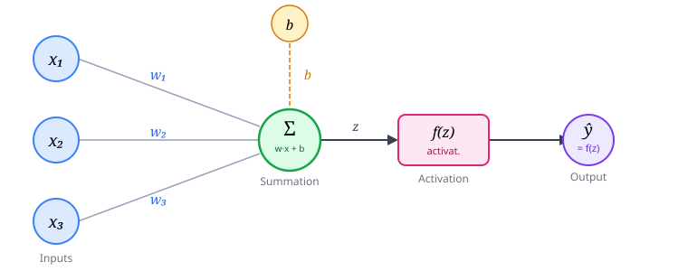
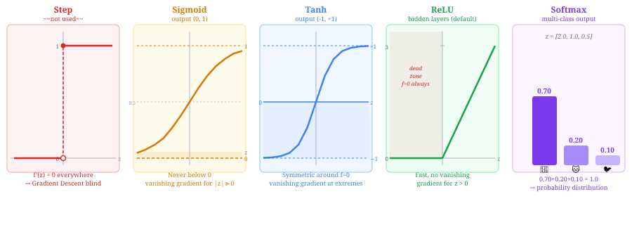
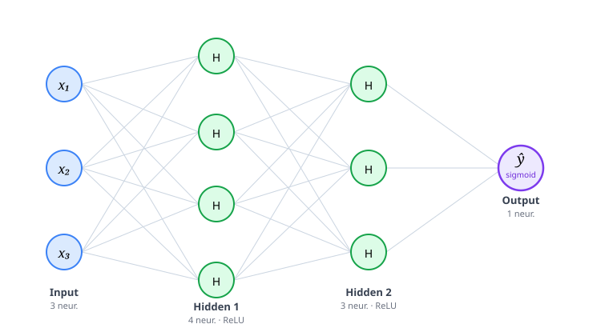
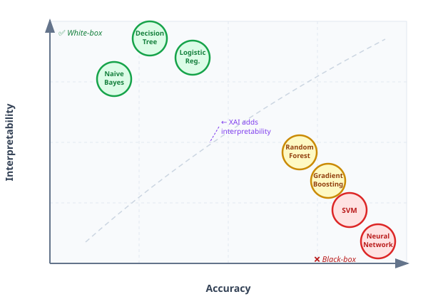

<div style="text-align:center; margin-bottom:16px;">


</div>

# Intelligent Systems and Decision Support Systems
**Unit 7: Neural Networks, Generative AI & Explainability (XAI)**
Department of Informatics & Computer Engineering
University of West Attica

**Instructor:** Anargyros Tsadimas (<tsadimas@uniwa.gr>)

---

# Unit Contents

1. **Introduction:** The Evolution of Machine Learning
2. **Deep Learning Fundamentals** — Perceptron, MLP *(Multi-Layer Perceptron)*, Backpropagation, Overfitting, Transfer Learning
3. **Generative AI & LLMs** *(Large Language Models)* — Transformer, Attention, Prompt Engineering, ChatGPT, Copilot
4. **Explainable AI (XAI)** — Feature Importance, LIME, SHAP, Counterfactual, XAI Tools, EU AI Act
5. **Summary & Conclusions**

---

# Connection to the Previous Unit


<!-- _class: xsmall -->
# Introduction
<div class="columns">

<div>

**What we learned in Unit 6:**

* Decision Trees — **white-box**, explainable
* Random Forests — **black-box**, more accurate
* Evaluation: Confusion Matrix, ROC *(Receiver Operating Characteristic)*, AUC *(Area Under Curve)*
* Algorithms: SVM *(Support Vector Machine)*, k-NN *(k-Nearest Neighbors)*, Naive Bayes, K-Means

</div>

<div>

**What Unit 7 adds:**

| | Classical ML *(Machine Learning)* | Deep Learning |
|---|---|---|
| **Data** | Structured (tables) | Unstructured (image, text) |
| **Features** | Manual | Automatic |
| **Interpretation** | Often feasible | Difficult → XAI |
| **Computational cost** | Low | High |

</div>

</div>

> **Central dilemma:** Accuracy vs Interpretability — when do we need one or the other?

> **Note:** Neural networks (Deep Learning) belong to **Predictive AI** — we present them here because they form the **architectural foundation** of LLMs *(Large Language Models)* and Generative AI.

---

<!-- _class: small -->
# Artificial Neural Networks (ANNs) — What They Are

An **ANN** *(Artificial Neural Network)* is a parallel distributed processor inspired by the brain — it stores knowledge in the **weights** of its connections.

<div class="columns">

<div>

**ANN vs Classical Programming:**

| | ANN | Classical code |
|---|---|---|
| **Logic** | Learns from data | Programmed IF/THEN |
| **Processing** | Parallel | Sequential |
| **Fault tolerance** | ✅ (noise ok) | ❌ (exact data) |
| **Interpretation** | ❌ Black-box | ✅ Traceable |

</div>

<div>

**Advantage:** Tolerance for noisy data — entry errors, outliers, and missing data do not destroy learning.

**Disadvantage:** Unable to qualitatively explain the knowledge it models — that is why we need **XAI** *(Explainable AI)*. *(Section 4 of this lecture)*

**Two types of learning:**
* **Supervised**: we provide pairs (input, correct answer) — this is what we use in this unit
* **Unsupervised**: we provide only inputs — the network finds patterns on its own *(e.g. K-Means, Unit 6)*

</div>

</div>

---

# Predictive vs Generative AI

<div class="columns">

<div>

**Predictive AI** *(Unit 6)*

* **Question:** "Will the customer churn?"
* **Output:** Category or number
* **Training:** With labeled data
* **Examples:** Churn prediction, spam filter, property price

</div>

<div>

**Generative AI** *(Unit 7)*

* **Question:** "Write an email to prevent the customer from churning"
* **Output:** New content (text, image, code)
* **Training:** With enormous unlabeled data
* **Examples:** ChatGPT, DALL-E, GitHub Copilot

</div>

</div>

> **In the DSS** *(Decision Support System)*: The two approaches complement each other — predictive identifies the risk, generative formulates the response.

---
<!-- _class: small -->
# When Do We Need Deep Learning?

For structured data (tables), Decision Trees and Random Forests perform excellently. However, they fail on **unstructured data**:

<div class="columns">

<div>

**Examples of unstructured data:**

* 📷 **Image:** Diagnosis from X-ray
* 🎙️ **Audio:** Speech recognition
* 📝 **Text:** Sentiment analysis
* 🎥 **Video:** Object detection

</div>

<div>

**Why do classical algorithms fail?**

* **Millions of features** (pixels) → manual selection is impossible
* **Cannot recognize spatial/temporal relationships** between features
* **Automatic feature extraction** is required

> **Deep Learning** = neural networks with many layers. It is a **family of architectures** (MLP, CNN, RNN, Transformer) — not a single model. The primary use is **Predictive AI**, but the Transformer architecture also led to **Generative AI** (LLMs).

</div>

</div>

---

<!-- _class: small -->
# Why Do Classical Algorithms Fail? (In Detail)

<div class="columns">

<div>

**Problem 1 — Millions of features**

An image of 224×224 pixels = **150,528 features**.  
A Random Forest evaluates each feature separately — statistically impossible.

For text: each word in the vocabulary (50,000+) is a separate feature.

**DL solution:** the first layers detect simple patterns (edges, sounds), the next ones combine them into more complex ones (eyes → face).

</div>

<div>

**Problem 2 — Spatial/temporal relationships**

A Random Forest sees each feature **independently** — it does not "know" that pixel (10,10) and (10,11) are adjacent.

| Data | Relationship lost | Example |
|---|---|---|
| **Image** | Spatial | The nose is *between* eyes and mouth |
| **Text** | Word order | "not good" ≠ "good" |
| **Audio/Video** | Temporal | "bank" changes meaning depending on context |

**DL solution:** specialized architectures for each data type:
- **CNN** *(Convolutional Neural Network)*: scans local patterns — ideal for images
- **RNN** *(Recurrent Neural Network)*: remembers previous inputs — for sequences
- **Transformer**: replaced RNN — sees the entire sequence at once

</div>

</div>

---

<!-- _class: small -->
# Manual vs Automatic Features

<div class="columns">

<div>

**Manual (Hand-crafted features)**

The expert decides *which* features are important and computes them explicitly.

| Domain | Example |
|---|---|
| Face image | Distance between eyes, nose angle |
| Text | Number of negative words |
| Audio | Frequency, speech rate |

**Problem:** requires domain expertise, does not scale to millions of features.

</div>

<div>

**Automatic (Learned features)**

The neural network *learns* which features are useful directly from the data.

```
Pixel → edges → shapes → eyes → face
```

Each layer extracts increasingly abstract features — without human intervention.

> **This is the key of Deep Learning:** the hierarchical, automatic feature extraction that allows processing of images, text, and audio at practical scale.

</div>

</div>

---

<!-- _class: xsmall -->
# The Artificial Neuron (Perceptron)

<div class="columns">

<div>

**The neuron as a current factory:**

| Biology | Analogy | Artificial network |
|---|---|---|
| Dendrites | Signal input | Inputs $x_i$ |
| **Synapse** | **Regulator** — how much passes | **Weights $w_i$** |
| Body (nucleus) | Accumulator + threshold | Sum $\Sigma$ + $f(z)$ |
| **Axon** | **Cable** — carries output | **Output $\hat{y}$** |

> **Synapse = Weight:** learning in the brain is the strengthening/weakening of synapses — exactly what Gradient Descent does with $w_i$.

$$z = \underbrace{\mathbf{w}^\top \mathbf{x}}_{\text{dot product } \sum w_i x_i} + b, \qquad \hat{y} = f(z)$$

*($\mathbf{w}, \mathbf{x}$: weight/input vectors — shorthand for $w_1x_1 + w_2x_2 + \ldots + w_nx_n$)*

</div>

<div>

**The complete path:**

$$\underbrace{x_i}_{\text{dendrites}} \xrightarrow{\times\, w_i}_{\text{synapse}} \underbrace{\Sigma + f(z)}_{\text{nucleus}} \xrightarrow{\hat{y}}_{\text{axon}} \text{next neuron}$$




</div>

</div>

---

<!-- _class: xsmall -->
# Activation Functions — Why They Are Needed

Each neuron computes $z = \mathbf{w}^\top\mathbf{x} + b$ and applies an **activation function** $f(z)$.

> Without $f(z)$, the network — however many layers it has — can only solve **linear** problems. Activation functions give it the ability to learn **non-linear patterns**.

<div class="columns">

<div>

**Gradient Descent**

Training works by asking: "if I change weight $w$ slightly, how much does the error change?" The answer is the **derivative** (gradient). The network follows the gradient "downward" to reduce the error.

> **Analogy — Blind Mountaineer:** feels the ground with their foot and takes one step downward. If the ground is **flat** (derivative = 0), they don't know where to go.

For this to work, the derivative of $f(z)$ **must** be **different from 0**.

</div>

<div>

**Vanishing Gradient**

In functions like Sigmoid/Tanh, for large $|z|$ the curve becomes **completely flat** → derivative ≈ 0.

During training, when the network makes an error, it sends a **correction signal** (derivative) from the last layer **backward** through the previous ones — this is Backpropagation. At each layer, this signal is **multiplied** by the derivative of $f(z)$:

$$\underbrace{0.1}_{\text{layer 4}} \times \underbrace{0.1}_{\text{layer 3}} \times \underbrace{0.1}_{\text{layer 2}} = 0.001$$

If the derivative is small (e.g. 0.1), after 3 multiplications the signal becomes **1000× smaller** — the early layers receive minimal information and effectively **stop learning**.

> **Solution:** **ReLU** — derivative = 1 for $z > 0$, does not attenuate.

</div>

</div>

---

<!-- _class: small -->
# Activation Functions — The Main Ones

<div class="columns">

<div>

**🔴 Step** — ~~Not used~~

Outputs 1 if $z>0$, else 0. Derivative = 0 everywhere → Gradient Descent is blind.

**🟡 Sigmoid** — Binary output

S-curve, compresses $z$ into $(0,1)$ → probability.  
Problem: vanishing gradient for large $|z|$.

**🟣 Softmax** — Multi-class output

Takes vector $z$ → probabilities that sum to 1.  
E.g.: $[z_{\text{dog}}, z_{\text{cat}}, z_{\text{bird}}] \rightarrow [0.70,\ 0.20,\ 0.10]$

</div>

<div>

**🟢 ReLU** *(Rectified Linear Unit)* — Hidden layers **(default)**

$\max(0,z)$: if $z>0$ passes unchanged, else 0.  
Derivative = 1 for $z>0$ → **solves the vanishing gradient**.  
Problem: "dead neurons" if always $z<0$.

**🔵 Tanh** *(Hyperbolic Tangent)* — Hidden layers (older)

Same S-shape, but output in $(-1,1)$ — **zero-centered**.  
Same vanishing gradient problem → replaced by ReLU.

**Selection rule:**
> Hidden layers → **ReLU** · Binary output → **Sigmoid** · Multi-class → **Softmax**

</div>

</div>

---
<!-- _class: xsmall -->

# Activation Functions — Graph



---

<!-- _class: small -->
# Perceptron with Numbers — Step by Step

**Scenario:** Churn Prediction. A customer has:

<div class="columns">

<div>

**Step 1 — Inputs & Weights (from training)**

| Feature | Value $x_i$ | Weight $w_i$ | Interpretation |
|---|---|---|---|
| tenure (months, normalized) | $x_1 = 0.8$ | $w_1 = -0.9$ | Long-tenured customer → ↓ churn |
| monthly_charges (norm.) | $x_2 = 0.6$ | $w_2 = +0.7$ | Expensive plan → ↑ churn |
| num_tickets (norm.) | $x_3 = 0.2$ | $w_3 = +0.4$ | Few complaints → ↑ slightly |
| bias | — | $b = +0.1$ | — |

**Step 2 — Linear combination $z$:**

$$z = (-0.9)(0.8) + (0.7)(0.6) + (0.4)(0.2) + 0.1 = \mathbf{-0.12}$$

</div>

<div>

**Step 3 — Activation Function (Sigmoid):**

We use Sigmoid because we want **probability** P(Churn) ∈ (0,1):

$$\hat{y} = \sigma(-0.12) = \frac{1}{1+e^{0.12}} \approx \mathbf{0.47}$$

**Decision:** $0.47 < 0.5$ → **No Churn** ✅

> The negative $z$ is due to **tenure**: the long-tenured customer ($w_1 = -0.9$) "wins" over the other features.

**What is stored in the model:** only $w_1, w_2, w_3, b$ — not the training data.

</div>

</div>

---

<!-- _class: xsmall -->
# Activation Functions — Same Input, Different Output

We use $z = -0.12$ from our example and other values:

<div class="columns">

<div>

| $z$ | Step | Sigmoid | Tanh | ReLU | Leaky ReLU |
|---|---|---|---|---|---|
| $-3$ | 0 | 0.05 | −0.99 | 0 | −0.03 |
| $-1$ | 0 | 0.27 | −0.76 | 0 | −0.01 |
| $\mathbf{-0.12}$ | **0** | **0.47** | **−0.12** | **0** | **−0.001** |
| $0$ | 0 | 0.50 | 0 | 0 | 0 |
| $+1$ | 1 | 0.73 | +0.76 | 1 | 1 |
| $+3$ | 1 | 0.95 | +0.99 | 3 | 3 |

**Softmax** — requires a vector (multi-class):

$$\mathbf{z} = [2.0,\ 1.0,\ 0.5] \xrightarrow{\text{softmax}} [0.63,\ 0.23,\ 0.14]$$

</div>

<div>

**What we observe for $z = -0.12$:**

| Function | Output | Interpretation |
|---|---|---|
| **Step** | 0 | Binary: "No Churn" — no nuance |
| **Sigmoid** | 0.47 | "47% probability" — useful |
| **Tanh** | −0.12 | Centered around 0, not a probability |
| **ReLU** | 0 | Loses information for $z<0$ — unsuitable as output |
| **Leaky ReLU** | −0.001 | Retains small signal for $z<0$ |

</div>

</div>

---

<!-- _class: xsmall -->
# From Perceptron to Multi-Layer Network (MLP)

**A single perceptron is not enough** — it can only find **linear** decision boundaries. The solution: **many layers of neurons**.

<div class="columns">

<div>

**Why the perceptron fails — the XOR problem:**

The perceptron finds a **straight line** (hyperplane) that separates the two classes. This only works if the data is **linearly separable**.


There is no line that correctly separates all 4 points — XOR is **non-linearly separable**. The perceptron fails.

**Solution — MLP:** Multiple layers create **non-linear** decision boundaries. The first hidden layer learns linear separations, the next ones **combine** them into curves.


</div>

<div>



**Number of parameters (churn prediction):**
$10 \times 64 + 64 \times 32 + 32 \times 1 = 2,720$ weights

**Architecture:**
* **Input Layer:** one neuron per feature
* **Hidden Layers:** non-linear transformations (ReLU)
* **Output Layer:** final prediction

</div>

</div>

---

<!-- _class: xsmall -->
# Which Function Where? — Network Example

Each **layer** uses one function (not each neuron separately):



> **Rule:** All hidden layers → **ReLU** (same everywhere). Only the output changes depending on what we want: **Sigmoid** (probability 0-1), **Softmax** (multiple classes), or **none** (regression).

---

<!-- _class: xxsmall -->
# Activation Functions — ReLU as Default & Exceptions

ReLU is **not mandatory** in hidden layers — it is a **hyperparameter** (a decision for the Data Scientist). However, it is the most common choice for two reasons:

<div class="columns">

<div>

**Why ReLU dominates:**

* **Solves the Vanishing Gradient:** gradient = 1 for $z>0$ → the error signal passes through unchanged, allowing training of deep networks
* **Computational speed:** $\max(0,z)$ is a lightning-fast operation compared to $e^{-z}$ in Sigmoid/Tanh

**When NOT to use ReLU:**

**1. Dying ReLU (Dead Neurons)**

If the $z$ of a neuron becomes negative for all data → output = 0, gradient = 0 → never learns again.

* **Leaky ReLU:** allows a small "leak" ($0.01 \cdot z$) for $z<0$ → the neuron can "wake up"
* **ELU (Exponential Linear Unit) / SELU (Scaled Exponential Linear Unit):** smoother variants with theoretical advantages, higher computational cost

</div>

<div>

**2. Shallow networks or older literature**

In networks with 1-2 hidden layers, the Vanishing Gradient is not critical. We often see **Tanh** — it is zero-centered (output in $(-1,1)$), which helps Gradient Descent.

**3. Specific architectures**

In **RNN** (predecessors of Transformer for text/time series), **Tanh** was almost the rule in the core due to the way memory is controlled.

**Output Layer — the strict rule:**

| Goal | Function |
|---|---|
| Yes/No probability (Churn) | **Sigmoid** → $(0,1)$ |
| Multi-class (Dog/Cat/Bird) | **Softmax** → sum = 1 |
| Number / Regression (house price) | **None** (Linear) or ReLU if output $\geq 0$ |

> In the output layer **never** ReLU for classification — we lose the interpretation as probability.

</div>

</div>

---

<!-- _class: small -->
# What Do the Hidden Layers "See"?

Each hidden layer learns **more abstract representations** than the previous one.

<div class="columns">

<div>

**Face recognition (CNN):**



**Text analysis (Transformer):**


</div>

<div>

**Why do we need many layers?**

A single layer can theoretically represent any function — but it would require **exponentially more** neurons.

Multiple layers allow **hierarchical composition** of complex features from simple ones — with far fewer parameters.

> **Analogy:** Like a dictionary that defines complex words using simpler ones — it doesn't rewrite the entire grammar from scratch.

</div>

</div>

---

# The Great Leap: From Rules to Error Minimization

<div class="columns">

<div>

**Classical Programming:**
> The human writes the rules (IF/THEN) → the computer executes them blindly.

**Machine Learning:**
> "I don't know what the rules are. Start guessing, and **reduce the error** on each attempt until you find the perfect weights."

All neural networks — from the simple Perceptron to LLMs with billions of parameters — do **exactly this**.

</div>

<div>

**The "hot-cold" game in mathematical form:**

$$\underbrace{\text{Prediction}}_{\hat{y}} \xrightarrow{\text{Loss}} \underbrace{\text{Error}}_{\mathcal{L}} \xrightarrow{\text{Backprop}} \underbrace{\text{Responsibility of each } w}_{\frac{\partial\mathcal{L}}{\partial w}} \xrightarrow{\text{GD}} \underbrace{\text{Correction}}_{w \leftarrow w - \eta\frac{\partial\mathcal{L}}{\partial w}}$$

Repeated millions of times — until the error **hits rock bottom**.

> **Paradigm shift:** The "intelligence" of these systems is not magic — it is a gigantic mathematical game of error minimization.

</div>

</div>

---

<!-- _class: small -->
# How Networks Learn — The 4 Roles

<div class="columns">

<div>

**1. Forward Propagation**

Data "flows" from input to output — the network makes a prediction $\hat{y}$.

**2. Loss Function — the "Judge"** ⚖️

Measures the distance between prediction and reality:

$$\mathcal{L} = -\frac{1}{n}\sum_i \left[ y_i \log\hat{y}_i + (1-y_i)\log(1-\hat{y}_i) \right]$$

*E.g. you said 0.2, the truth is 1 → error 0.8.*

**Connection:** The Gini Impurity of Decision Trees and the Loss Function have the same goal.

</div>

<div>

**3. Backpropagation — the "Messenger"** 📨

Takes the error from the output and runs **backward**, telling each weight: "you are responsible for 10%, you for 2%..."

**4. Gradient Descent — the "Steering Wheel"** 🎯

$$w \leftarrow w - \eta \cdot \frac{\partial \mathcal{L}}{\partial w}$$

Adjusts the weights slightly in the right direction so that **next time the error is smaller**.

> **Blind Mountaineer:** Feels the slope of the ground and takes one step down. Large $\eta$ → jumps to the opposite mountain; small $\eta$ → takes ages to descend.

> **Epochs:** The cycle Forward→Loss→Backprop→Update is repeated hundreds of times.

</div>

</div>

---

<!-- _class: xxsmall -->

# Overfitting & Regularization in Neural Networks

NNs with many parameters **memorize** the training data — the same problem as with Decision Trees, but much more pronounced.

**The same pattern, different solution:**

| | Decision Trees (Lec. 6) | Neural Networks (Lec. 7) |
|---|---|---|
| **Problem** | Tree too deep → memorizes | Millions of parameters → memorizes |
| **Solution 1** | Pruning | **Dropout** (deactivate neurons) |
| **Solution 2** | Random Forests (many trees) | **Early Stopping** (stop early) |
| **Common logic** | Reduce complexity | Reduce complexity |

**Dropout**:
In each training cycle we randomly "turn off" ~20–30% of neurons → the network doesn't "get comfortable" relying on specific "smart" nodes; it is forced to **distribute knowledge everywhere**. Same logic as Random Forests: instead of one "specialist" tree, many "generalist" trees.

```python
model.add(Dense(64, activation='relu'))
model.add(Dropout(0.3))  # 30% neurons OFF
```

**Early Stopping:** We stop training when the validation loss starts rising — even if the training loss continues to fall.

**Other techniques:**
* **L2 Regularization (Weight Decay):** penalizes large weights — prevents excessive dependence on a few features
* **Batch Normalization:** normalizes the outputs of each layer — stabilizes learning and allows higher learning rate
* **Data Augmentation:** artificially creates new data from existing ones (images: rotation, zoom, flipping) — increases diversity without new measurements

---

<!-- _class: xxsmall -->
# Overfitting — Reading the Diagram

<div class="columns">

<div>



</div>

<div>

Two parallel curves — **Training** (blue) and **Validation** (red) — at three training points:

| Epoch | Training Loss | Validation Loss |
|---|---|---|
| 1 | 0.8 | 0.8 |
| 20 | 0.3 | 0.35 ← optimal ⛔ |
| 50 | 0.1 ↘ | 0.6 ↑ |

At **Epoch 20** the validation loss reaches its minimum — **this is where we stop** (Early Stopping).

At **Epoch 50** the training loss continues to fall (0.1), but the validation **rises** (0.6): the model **memorizes** the training data instead of generalizing.

> **Key:** We always need a separate **validation set** — without it we cannot detect overfitting.

</div>

</div>

---

<!-- _class: small -->
# Transfer Learning — "Learning from Others"

**Idea:** Instead of training a NN from scratch (requires enormous data & computational cost), we start from an **already trained model** and adapt it to our own problem.

<div class="columns">

<div>

**How it works:**

```
Pre-trained model
(e.g. ResNet on 1M images)
         ↓
  Freeze the lower
  layers (general features)
         ↓
  Fine-tune only the upper
  layers on our own data
         ↓
  Results with little data!
```

</div>

<div>

**Examples:**

| Base | Application |
|---|---|
| **ResNet/VGG** | Medical images (X-ray, MRI) |
| **BERT/RoBERTa** | Text analysis (reviews, emails) |
| **Whisper** | Speech recognition |
| **GPT-4** | Customized company chatbot |

> **In practice:** Most modern DL projects start from transfer learning — rarely from scratch. Even with 1,000 samples it can deliver excellent results.

</div>

</div>

---

<!-- _class: xxsmall -->
# Embeddings — How Words "Enter" the Neural Network

**The problem:** Neural networks accept **only numbers** — they do not understand words.

**The solution — Word Embeddings:** We convert each word into a **vector of numbers** (a list of decimals).

<div class="columns">

<div>

**The basic idea:**

```
"king"   → [0.91, 0.23, 0.70, ...]
"queen"  → [0.89, 0.21, 0.68, ...]
"car"    → [0.12, 0.78, 0.05, ...]
```

Words with **similar meaning** → **similar numbers** → nearby points in space.

Unrelated words → different numbers → distant points.

> We don't define these numbers ourselves — the model **learns them on its own** from millions of texts.

</div>

<div>

**Why it matters:**

| Technique | Input |
|---|---|
| Classical MLP | Numbers (e.g. age, income) |
| MLP + Embeddings | **Words → numbers → MLP** |
| Transformer (LLM) | Embeddings + Attention |

**Famous example (Word2Vec):**

```
"king" − "man" + "woman"
       ≈ "queen"
```

The arithmetic of vectors reflects **semantic relationships** — the model has "learned" that gender is a dimension of meaning.

> **Connecting link:** These vectors become the **Input** ($x_1, x_2, \ldots$) for the deep hidden layers of the network — this is how language "enters" the mathematics.

</div>

</div>

---

<!-- _class: xsmall -->
# Generative AI & Large Language Models (LLMs)

**What LLMs are:** They are not "intelligent" in the human sense — they are exceptionally good at **predicting the next word** based on billions of parameters.

<div class="columns">

<div>

**Transformer Architecture (2017):**

* **Attention Mechanism:** the model "pays attention" to which words relate to which — regardless of distance in the text
* **Pre-training:** training on a massive corpus (internet, books) — next-token prediction
* **Fine-tuning + RLHF** *(Reinforcement Learning from Human Feedback)*: specialization for dialogue — human evaluators rate answers and the model learns to prefer them

**Scale:**

| Model | Parameters |
|---|---|
| GPT-2 (2019) | 1.5 billion |
| GPT-3 (2020) | 175 billion |
| GPT-4 (2023) | ~1 trillion (estimate) |

</div>

<div>

**Applications in DSS:**

* **Strategy brainstorming:** "What are the 5 main causes of churn in the telecommunications sector?"
* **Report summarization:** Automatic summary of 50-page reports
* **Sentiment analysis:** Classification of customer reviews in real time
* **Code generation:** Automatic generation of SQL queries, Python scripts
* **Personalization:** "Write a retention email for a customer with 3 months tenure and high charges"

> **AI as Copilot:** Does not replace the Manager — functions as a "co-pilot" that accelerates decisions and reduces cognitive load.

</div>

</div>

---

<!-- _class: xxsmall -->
# Attention Mechanism — The Heart of the Transformer

**RNN problem:** Reads word-by-word and "forgets" what was said early — cannot connect words that are far apart.

**Transformer solution:** Sees the **entire sentence at once** and decides which words relate to which.

<div class="columns">

<div>

**Example — pronoun reference:**

> "The **customer** said he does not want to cancel, but **he** ultimately left."

To understand "**he**", the model must look **back** at "customer" — regardless of distance. The RNN "forgets" it. The Transformer sees it immediately.

**How it does it — with scoring:**

For each word, the model scores how "related" it is to every other word in the sentence:

```
"he" ←→ "customer"  : 0.85  ✅ high attention
"he" ←→ "wants"     : 0.10
"he" ←→ "cancel"    : 0.05
```

The score comes from the **dot product of vectors** for each word — vectors that are learned automatically during training, so that related words (pronoun ↔ noun) acquire similar values.

The result: the representation of "he" **incorporates** information from "customer".

</div>

<div>

**Analogy — Google Search:**

| Step | Search | Attention |
|---|---|---|
| What I search for | "Machine Learning" | target word ("he") |
| What I compare | Result titles | All words in the sentence |
| What I get | Page content | Meaning of the related word |

**Multi-Head Attention:**

Instead of one "look", the model looks **from multiple perspectives simultaneously**:
* Head 1 → which subject corresponds to the verb?
* Head 2 → which words are opposite in meaning?
* Head 3 → which words frequently appear together?

> This is what allows ChatGPT to "understand" a 500-word email and respond coherently.

</div>

</div>

---

<!-- _class: xxsmall -->
# Prompt Engineering — The Art of Asking

**The way we ask** an LLM dramatically affects the quality of the answer.

<div class="columns">

<div>

**Basic techniques:**

**Zero-shot:** Direct question without examples
> "Classify this review as positive/negative."

**Few-shot:** You give 2-3 examples first
> "Excellent!" → Positive
> "Unacceptable" → Negative
> "Good service but slow delivery" → ?»

**Chain-of-Thought:** You ask for step-by-step reasoning
> "Think step by step and then answer..."

</div>

<div>

**For the DSS — practical examples:**

```
❌ Bad prompt:
"Analyze my data"

✅ Good prompt:
"You are a churn analyst at a
telecommunications company. I have 7,000
customers with tenure, MonthlyCharges and
Contract. What 3 hypotheses should I check
first to reduce churn by 10%? Give
specific evaluation metrics."
```

> **Rule:** The more specific the **role**, **context** and **answer format**, the better the result.

</div>

</div>

**Temperature — Adjusting "Creativity":**

| Temperature | Behavior | Ideal for |
|---|---|---|
| **= 0.0** | Deterministic, strict, predictable | Data analysis, code, legal texts |
| **≥ 0.8** | Creative — selects less probable words | Brainstorming, marketing, idea generation |

> ⚠️ High temperature → greater risk of **hallucinations** (the model "invents" information).

---

<!-- _class: xsmall -->
# Temperature — Can I Adjust It?

It depends on the tool — consumer interfaces usually **do not** expose this setting.

<div class="columns">

<div>

**Direct chat (ChatGPT, Claude.ai) — NO**

They use a default value (~0.7–1.0) without showing it to the user.

**Via API — YES**

```python
client.messages.create(
    model="claude-sonnet-4-6",
    temperature=0.0,   # deterministic
    messages=[...]
)
```

</div>

<div>

**Tools with settings:**

| Tool | Temperature |
|---|---|
| ChatGPT API Playground | ✅ adjustable |
| Claude.ai | ❌ hidden |
| Ollama *(local models)* | ✅ adjustable |
| LM Studio | ✅ adjustable |
| OpenWebUI | ✅ adjustable |

> **Practical alternative:** Instead of adjusting temperature, describe it in the prompt:
> * "Answer strictly without speculation" → low temperature behavior
> * "Give me 5 creative ideas" → high temperature behavior

</div>

</div>

---

<!-- _class: small -->
# Risks and Limitations of LLMs

<div class="columns">

<div>

**Hallucinations:**
The model produces **convincing but incorrect** results — it invents facts, citations, laws.

> "Cite me 3 papers on churn prediction" → the LLM may invent titles and authors that do not exist.

**Bias:**
Reflects biases present in the training data — gender, ethnicity, social class.

</div>

<div>

**Data Privacy:**

⚠️ **What we never upload** to public LLMs (ChatGPT, Gemini):

* Personal customer data (GDPR)
* Confidential financial information
* Internal company strategies
* Source code with trade secrets

**Solutions:**
* Private deployments (on-premise LLMs)
* Anonymization before submission
* Enterprise versions with data isolation

</div>

</div>

---

<!-- _class: xsmall -->
# RAG — Retrieval-Augmented Generation

**The problem:** If we ask an LLM "from memory" about internal company data, it produces **hallucinations** — it doesn't know them.

**The solution:** We don't ask the LLM "what do you know?". We first give it the correct documents and then say "draft an answer based on *these*".

<div class="columns">

<div>

**RAG Architecture:**

```
User question
      ↓
 [Retrieval] Search in the
 internal data
 (PDF, DB, ERP, Wiki, emails)
      ↓
 Relevant paragraphs / rows
      ↓
 [Augmentation] We give the
 excerpts + question to the LLM
      ↓
 [Generation] LLM drafts
 answer based ON THESE
```

</div>

<div>

**Comparison for enterprise DSS:**

| | Without RAG | With RAG |
|---|---|---|
| Knowledge source | Training (2021–) | Current documents |
| Hallucinations | Possible | Nearly zero |
| Data Privacy | Risk | Data local |
| Explainability | "Don't know source" | Cites the source |
| Update | Expensive retraining | Simply new files |

**DSS Example:**

> "What were Q3 sales in Attica?"
> → Retrieval searches internal reports
> → LLM drafts answer with **real numbers**

> **In practice:** RAG is the architecture behind enterprise chatbots of the type "ask our handbook" or "ask your contracts".

</div>

</div>

---

# Explainable AI (XAI): Opening the "Black Box"

**The problem:** The most accurate models (Neural Networks, Random Forests, SVM) are **black-boxes** — they do not explain *why* they made a prediction.

<div class="columns">

<div>

**White-box vs Black-box:**

| | White-box | Black-box |
|---|---|---|
| **Example** | Decision Tree | Neural Network |
| **Interpretation** | IF-THEN rules | Impossible directly |
| **Accuracy** | Moderate | High |
| **Legal use** | ✅ | ⚠️ |

</div>

<div>

**The Manager's dilemma:**

> "The neural network tells me not to give the customer a loan. Why? If I can't explain it to the customer or to the Bank of Greece, I can't legally use it."

**EU AI Act Regulation** *(European Artificial Intelligence Regulation, 2024)*: For high-risk applications (loans, healthcare, hiring) an **explainable decision** is required.

</div>

</div>

---

<!-- _class: xsmall -->
# Why Is the Random Forest a Black-Box? (The Paradox)

**Question:** The Decision Tree is white-box. The Random Forest is based on Decision Trees. Why is it a black-box?

<div class="columns">

<div>

**Decision Tree = White-box** ✅

You follow a path root → leaf:
> tenure < 6 **AND** contract = monthly
> → P(Churn) = 0.82

The logic is fully traceable.

**Random Forest = 500 such trees** ❌

| Reason | Explanation |
|---|---|
| **Bootstrap sampling** | Each tree is trained on a different subset of data |
| **Feature subsampling** | Each split sees a random subset of features |
| **Majority voting** | Prediction = majority of 500 different logics |

</div>

<div>

**The analogy:**

> Imagine 500 people voting. Each person has simple reasoning — but understanding "**why** the majority won" requires understanding all 500 simultaneously.

**The key:**
It is not the complexity of *each* tree — it is the **combination mechanism**.

**Consequence for XAI:**

| | By design | Post-hoc |
|---|---|---|
| Decision Tree | ✅ White-box | — |
| Random Forest | ❌ Black-box | ✅ SHAP |
| Neural Network | ❌ Black-box | ✅ SHAP / LIME |

</div>

</div>

---

<!-- _class: small -->
# XAI: LIME — Local Explanation

**LIME** *(Local Interpretable Model-agnostic Explanations)*

**Idea:** Instead of explaining the entire model, we explain **one specific prediction** by building a simple local model around it.

<div class="columns">

<div>

**Algorithm:**

1. Take a sample $x$ you want to explain
2. Create variations of $x$ (small changes in features)
3. Pass the variations through the black-box model
4. Fit a **simple linear model** to the variations (weighted by distance)
5. The weights of the linear model = **explanation**

> **Model-agnostic:** works with any model — Neural Network, Random Forest, SVM.

</div>

<div>

**Example — Spam filter:**

Email: "You won €500! Click here now!"
→ Model: **Spam** (P=0.97)

LIME explains:

| Word | Contribution |
|---|---|
| "won" | +0.42 → Spam |
| "click" | +0.31 → Spam |
| "now" | +0.18 → Spam |
| "€500" | +0.06 → Spam |

→ We see **which words tipped the scales**.

</div>

</div>

---

<!-- _class: xsmall -->
# XAI: SHAP — Fair Distribution of Contribution

**SHAP** *(SHapley **Additive** exPlanations)*

Based on **Game Theory** (Shapley values, 1953): how do we *fairly* distribute the gains of a team among the players?

<div class="columns">

<div>

**Idea:** Each feature is a "player" — SHAP measures how much each feature **contributed** to the difference between the prediction and the model's average prediction.

$$\hat{y} = \underbrace{\phi_0}_{\text{base}} + \underbrace{\sum_{i=1}^n \phi_i}_{\text{SHAP values}} $$

* $\phi_0$: base prediction (model's average value)
* $\phi_i$: contribution of feature $i$

> **Additivity:** The sum **closes exactly** — always.

**Global vs Local:**
* **Local:** why does this customer → Churn?
* **Global:** which features generally matter?

</div>

<div>

**Example — Churn (Customer 123):**

| | |
|---|---|
| Base probability | 20% |
| Complaint yesterday | **+40%** |
| Contract expiry | **+25%** |
| High charges | **+10%** |
| Long tenure | -15% |
| **Final prediction** | **80%** |

$$20\% + 40\% + 25\% + 10\% - 15\% = \mathbf{80\%}\ \checkmark$$

→ We know exactly **where to intervene**: renewal offer + complaint resolution.

> **SHAP vs LIME — critical difference:** SHAP **guarantees** that base value + SHAP values = final prediction. LIME does not have this guarantee. For Managers and legal/regulatory frameworks this provides **enormous confidence**: the explanations are auditable.

</div>

</div>

---

<!-- _class: xxsmall -->
# Comparison of XAI Methods

**Feature Importance** — the simplest method: measures how much each feature contributed to the model's decisions **overall**, across the entire dataset. In Decision Trees/Random Forests it is computed from Gini Impurity (how much each feature "cleans" the set when used for a split). It does not explain *individual* predictions — only the general behavior of the model.

```python
rf.feature_importances_  # → [0.45, 0.30, 0.15, 0.10]
# tenure: 45%, MonthlyCharges: 30%, ...
```

| | LIME | SHAP | Feature Importance |
|---|---|---|---|
| **Type** | Local | Local + Global | Global |
| **Basis** | Local linear model | Game Theory | Gini / Permutation |
| **Models** | Any | Any | Mainly tree-based |
| **Speed** | Fast | Slow | Very fast |
| **Consistency** | Unstable | Stable | Stable |
| **Sklearn** | `lime` library | `shap` library | `.feature_importances_` |

**When to use what?**

* **Feature Importance:** Quick overview — which features generally matter
* **SHAP:** When reliable, fair explanation is needed — for regulatory/legal contexts
* **LIME:** Quick explanation of an individual prediction — for debugging

---

<!-- _class: xsmall -->
# XAI — Counterfactual Explanations

**The question that interests the end user:** not "why was I rejected" but "**what do I need to change** to be approved?"

<div class="columns">

<div>

**SHAP / LIME (for data scientists):**
> "Tenure contributed −0.3 to the decision"

**Counterfactual (for the Manager / customer):**
> "If tenure were ≥ 12 months **or** monthly charges < €40, the prediction would be No Churn"

The user receives a **specific action directive** — not just an explanation.

**Example — Credit scoring:**

| Feature | Current value | Required change |
|---|---|---|
| Income | €1,200/month | ≥ €1,500 |
| Overdue | 2 | 0 |
| Relationship duration | 4 months | ≥ 12 months |

</div>

<div>

**Connection to EU AI Act:**

Article 86 requires for high-risk AI (loans, hiring, healthcare) the right to a **"meaningful explanation"** — counterfactuals are the most accepted form because:
* They are understandable by non-experts
* They show what the user can change
* They do not reveal trade secrets of the model

> **Library:** `alibi` (Python) — `CounterfactualProto`, `CEM`

```python
from alibi.explainers import CounterfactualProto
cf = CounterfactualProto(model, shape)
explanation = cf.explain(instance)
# → what needs to change for a different decision
```

</div>

</div>

---

<!-- _class: xsmall -->
# XAI — Tools & Libraries

<div class="columns">

<div>

| Tool | Company | What it does |
|---|---|---|
| **SHAP** | Open-source | SHAP values for any model |
| **LIME** | Open-source | Local model-agnostic explanations |
| **InterpretML** | Microsoft | SHAP + EBM (Explainable Boosting Machine) |
| **Captum** | Meta (PyTorch) | XAI for neural networks |
| **Alibi** | Seldon | Counterfactuals, anchors, concept drift |
| **What-If Tool** | Google | Interactive visualization with TensorFlow |
| **ELI5** | Open-source | Simple explanations for sklearn models |

</div>

<div>

**Maturity levels:**

```
Production-ready:
  SHAP ──────────────── ✅ de facto standard
  InterpretML ────────── ✅ enterprise support

Research / Experimental:
  Alibi ──────────────── 🔬 counterfactuals
  Captum ─────────────── 🔬 deep learning
  What-If Tool ───────── 🔬 visual exploration
```

**For our lab:** `shap` — install with `pip install shap`, integration with sklearn in 3 lines of code.

> **Practical advice:** Always start with SHAP — it covers 80% of needs. Move to Alibi/Captum only if you need counterfactuals or neural network explanations.

</div>

</div>

---

<!-- _class: xsmall -->
# XAI in Real Systems

<div class="columns">

<div>

**FICO Explainable AI — Credit Scoring**

FICO (credit scoring company) integrated XAI into the FICO Score system. For every loan rejection it automatically issues **"reason codes"**:
> "Rejection due to: (1) high credit utilization rate, (2) short history, (3) many recent applications"

**IBM OpenScale (Watson)**

Platform for monitoring and XAI of production models — detects bias, drift, and automatically generates explanations for each prediction.

**Google — Explainable AI Platform (Vertex AI)**

Integrated SHAP and Integrated Gradients for models on Google Cloud — generates feature attributions on every API call.

</div>

<div>

**Clinical Applications**

Hospitals in the US (e.g. Beth Israel Deaconess) use XAI for sepsis prediction — the model explains which indicators led to the alert, so the doctor can decide whether to intervene.

**Legal framework in the EU:**

| Regulation | Requirement |
|---|---|
| **GDPR Art. 22** | Right to explanation in automated decisions |
| **EU AI Act (2024)** | Explainable decision for high-risk AI |
| **PSD2 (banks)** | Justification of credit rejection |

> **Conclusion for DSS:** XAI is not an optional feature — for many applications it is a **legal obligation**.

</div>

</div>

---

# Accuracy vs Interpretability

**The central dilemma of Machine Learning in practice:**

<div class="columns">

<div>



</div>

<div>

**The role of XAI:**

XAI does not make a black-box model white-box — it provides **post-hoc explanations** that are:
* Always **approximations** (not the "truth" of the model)
* Useful for debugging, communication, regulatory compliance

> **Rule:** First choose the simplest model that meets accuracy requirements — don't go to a Neural Network if a Decision Tree suffices.

</div>

</div>

---

<!-- _class: small -->

# Unit 7 Summary

<div class="columns">

<div>

**Deep Learning:**
* Perceptron → MLP → Deep Networks (ReLU, Softmax, Sigmoid)
* Forward Propagation, Loss, Backpropagation, Gradient Descent
* Overfitting → Dropout, Early Stopping, Regularization
* Transfer Learning — fine-tune instead of training from scratch

**Generative AI:**
* LLMs: next-token prediction — Transformer & Attention Mechanism
* Prompt Engineering: zero-shot, few-shot, chain-of-thought
* Temperature: deterministic (0.0) vs creative (≥0.8)
* Risks: hallucinations, bias, data privacy

</div>

<div>

**Explainable AI:**
* White-box vs Black-box — accuracy vs interpretability
* Feature Importance: fast global overview
* LIME: local explanation via simple model
* SHAP: fair distribution based on Game Theory
* Counterfactual: "what do I need to change?" — EU AI Act requirement
* Tools: SHAP, InterpretML, Alibi, Captum

**Central message:**

> There is no "best" model — the choice depends on the **problem**, the **data**, and the **explainability requirements**. For high-risk AI, explainability is a **legal obligation**.

</div>

</div>

---

<!-- _class: xxsmall -->
# Lab: XAI with SHAP on the Churn Dataset

**Goal:** Comparison of Feature Importance → SHAP → LIME for interpreting churn predictions.

<div class="columns">

<div>

**Step 1 — Train the model:**

```python
pip install shap lime

from sklearn.ensemble import RandomForestClassifier
rf = RandomForestClassifier(
    n_estimators=100, random_state=42)
rf.fit(X_train, y_train)
```

**Step 2 — Feature Importance (baseline):**

```python
import pandas as pd
fi = pd.Series(rf.feature_importances_,
               index=FEATURES).sort_values()
fi.plot(kind='barh')
# Question: which features "count" in general?
```

**Step 3 — SHAP (global + local):**

```python
import shap
explainer = shap.TreeExplainer(rf)
shap_values = explainer.shap_values(X_test)

shap.summary_plot(shap_values[1], X_test,
                  feature_names=FEATURES)
shap.waterfall_plot(shap.Explanation(
    values=shap_values[1][0],
    base_values=explainer.expected_value[1],
    data=X_test.iloc[0]))
```

</div>

<div>

**Step 4 — LIME (comparison with SHAP):**

```python
from lime.lime_tabular import LimeTabularExplainer
lime_exp = LimeTabularExplainer(
    X_train.values,
    feature_names=FEATURES,
    class_names=['No Churn','Churn'],
    mode='classification')

exp = lime_exp.explain_instance(
    X_test.iloc[0].values,
    rf.predict_proba)
exp.show_in_notebook()
```

**Comparison questions:**

| Question | Tool |
|---|---|
| Which features generally matter? | Feature Importance |
| Why does this customer churn? | SHAP waterfall |
| Which words/values tipped the scales? | LIME |
| Do SHAP & LIME agree for the same customer? | Comparison |

**Expected results:**
* `tenure` and `MonthlyCharges` → top features in all 3 methods
* SHAP & LIME often agree on the top-2, differ on smaller features

</div>

</div>

---

<!-- _class: small -->
# AI-based DSS in Industry 4.0

> Soori et al. (2026). *AI-based decision support systems in Industry 4.0, a review.* [ScienceDirect](https://www.sciencedirect.com/science/article/pii/S2949948824000374)

**Key findings:**

* AI-based DSS are critical for the integration and processing of data from **IoT and sensors** in industrial production
* Key applications: **predictive maintenance**, **quality control** (visual inspection), **supply chain optimization** and **energy management**
* **Machine Learning and Deep Learning** models, combined with NLP, enable autonomous real-time decision-making
* AI-driven DSS reduce cost, increase reliability and improve production efficiency

**Implementation challenges:**

* Data quality and technical integration into existing systems
* Human factors — user acceptance and trust


---

<!-- _class: xxsmall -->
# An Industry 4.0 predictive maintenance decision support system based on IoT and machine learning 


source: [From knowledge-based to big data analytic model: a novel IoT and machine learning based decision support system for predictive maintenance in Industry 4.0](https://link.springer.com/article/10.1007/s10845-022-01960-x?utm_source=getftr&utm_medium=getftr&utm_campaign=getftr_pilot&getft_integrator=sciencedirect_contenthosting)
