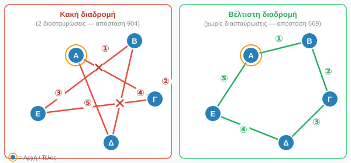
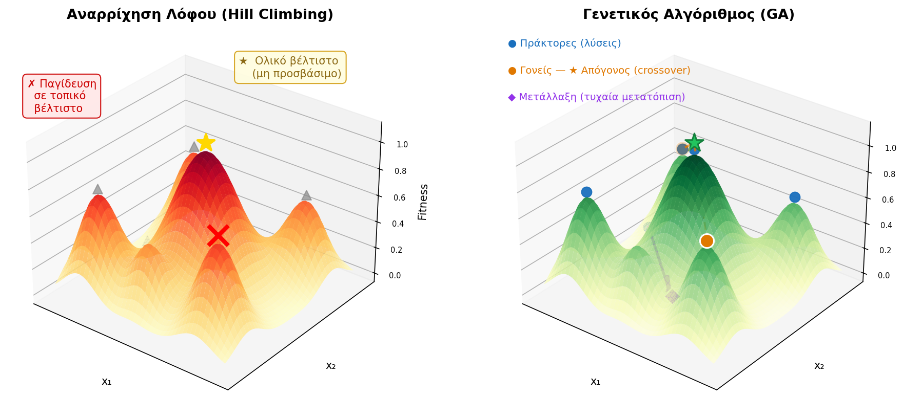
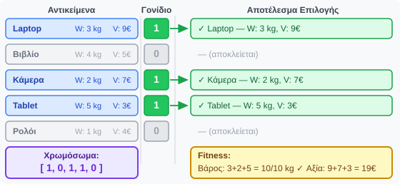
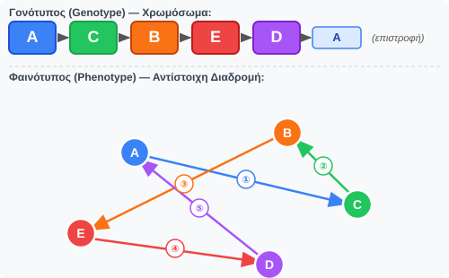
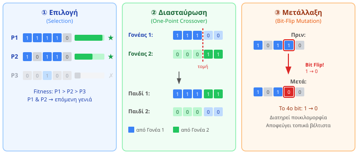
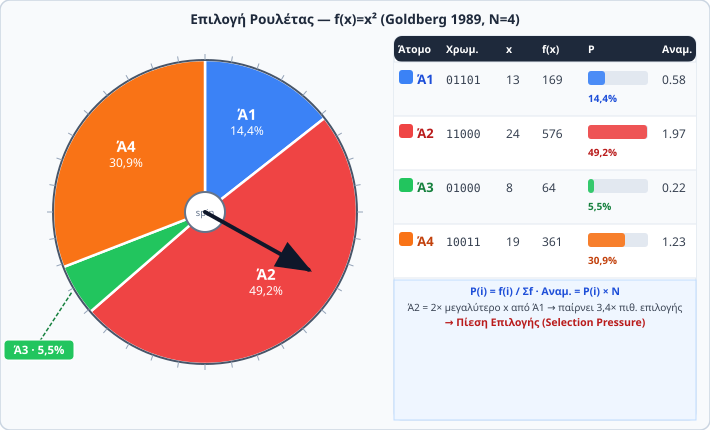
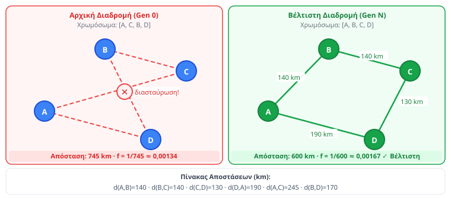
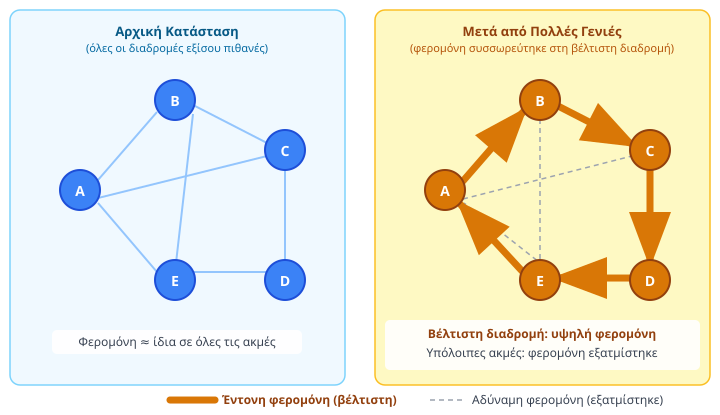
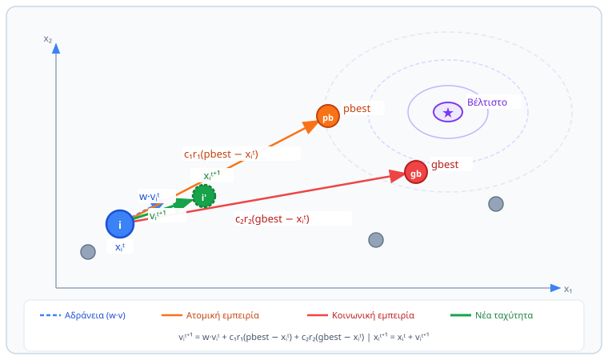

<div style="text-align:center; margin-bottom:16px;">


</div>

# Ευφυή Συστήματα και Συστήματα Υποστήριξης Αποφάσεων
**Ενότητα 8: Εξελικτικοί Αλγόριθμοι, Νοημοσύνη Σμήνους & Βελτιστοποίηση**
Τμήμα Μηχανικών Πληροφορικής & Υπολογιστών
Πανεπιστήμιο Δυτικής Αττικής

**Διδάσκων:** Ανάργυρος Τσαδήμας (<tsadimas@uniwa.gr>)

---

<!-- _class: small -->
# Περιεχόμενα Ενότητας

1. **Εισαγωγή** — Η ανάγκη για βελτιστοποίηση, TSP, ευρετικοί αλγόριθμοι
2. **Εξελικτικοί Αλγόριθμοι (Evolutionary Algorithms)**
   - Γενετικοί Αλγόριθμοι: Κύκλος, Τελεστές (Selection, Crossover, Mutation), Αριθμητικό Παράδειγμα, Σύγκλιση
   - Παράδειγμα: Επίλυση TSP με Γενετικό Αλγόριθμο
3. **Νοημοσύνη Σμήνους (Swarm Intelligence)**
   - Βελτιστοποίηση Αποικίας Μυρμηγκιών (ACO)
   - Βελτιστοποίηση Σμήνους Σωματιδίων (PSO)
4. **Άλλες Μετα-ευρετικές Μέθοδοι** — Προσομοιωμένη Ανόπτηση (Simulated Annealing)
5. **Εφαρμογές σε DSS** — Logistics, Scheduling, Hyperparameter Tuning
6. **Σύνοψη** — Πλεονεκτήματα/Μειονεκτήματα, Πότε διαλέγουμε τι, Βιβλιοθήκες Python

---

<!-- _class: xsmall -->
# Εισαγωγή — Η Ανάγκη για Βελτιστοποίηση

**Σύνδεση με τα προηγούμενα**

Η **Μηχανική Μάθηση** (Ενότητες 6 & 7) κάνει *προβλέψεις*. Η **Βελτιστοποίηση** παίρνει αποφάσεις για την *καλύτερη δυνατή ενέργεια*:

> «Ποια είναι η πιο φθηνή διαδρομή για να επισκεφθώ 20 πόλεις;»

## Το Πρόβλημα του Πλανόδιου Πωλητή (Travelling Salesman Problem — TSP)

Ένας πωλητής ξεκινά από **βάση**, επισκέπτεται $n$ πόλεις **ακριβώς μία φορά** και επιστρέφει στη βάση.
Στόχος: **ελαχιστοποίηση της συνολικής απόστασης** (ή κόστους μετακίνησης).

Η **σειρά επίσκεψης** καθορίζει το κόστος — και υπάρχουν $(n-1)!$ πιθανές σειρές:

| Πόλεις | Διαδρομές | Brute-force @ $10^{12}$ δρ./δευτ. |
|:---:|:---:|:---:|
| **5** | $4! = 24$ | < 1 μs |
| **10** | $9! = 362.880$ | < 1 ms |
| **20** | $19! \approx 1{,}2 \times 10^{17}$ | ~1 ημέρα |
| **25** | $24! \approx 6{,}2 \times 10^{23}$ | **~20.000 χρόνια** |

Ανήκει στην κατηγορία **NP-Hard** — η εξαντλητική αναζήτηση γίνεται αδύνατη πολύ γρήγορα.

---

<!-- _class: diagram-sm -->
# TSP — Γιατί η Σειρά Επίσκεψης Μετράει



Ίδιες **5 πόλεις**, δύο διαφορετικές σειρές επίσκεψης → διαφορά **+59% στην απόσταση**.
Διαδρομές με **διασταυρώσεις** είναι πάντα υπο-βέλτιστες — αλλά με 20+ πόλεις δεν μπορούμε να ελέγξουμε όλες τις επιλογές.

---

<!-- _class: small -->
# Ευρετικοί & Μετα-ευρετικοί Αλγόριθμοι — Γιατί;

<div class="columns">
<div>

**Το Πρόβλημα της Πολυπλοκότητας**
Σε προβλήματα όπως το TSP (NP-Hard), ο χώρος αναζήτησης αυξάνεται παραγοντικά (Combinatorial Explosion). Η brute-force — η εξαντλητική εξέταση όλων των πιθανών λύσεων — γίνεται πρακτικά αδύνατη καθώς μεγαλώνει το πρόβλημα.

**Η Λύση: Ο Συμβιβασμός**
Θυσιάζουμε την *εγγύηση της απόλυτα βέλτιστης λύσης* για να κερδίσουμε *ταχύτητα υπολογισμού*. Χρειαζόμαστε αλγόριθμους που βρίσκουν μια **«αρκετά καλή»** (ικανοποιητική) λύση σε εύλογο χρόνο.

</div>
<div>

**Η Έμπνευση από τη Φύση (Bio-inspired AI)**
Πώς η φύση λύνει πολύπλοκα προβλήματα βελτιστοποίησης εδώ και εκατομμύρια χρόνια;
- Η εξέλιξη των ειδών (επιβίωση του ικανότερου)
- Η αναζήτηση τροφής από σμήνη (μυρμήγκια, πουλιά, μέλισσες)

> **Βασική αρχή:** Απλοί τοπικοί κανόνες σε ατομικό επίπεδο παράγουν **έξυπνη συλλογική συμπεριφορά** και λύνουν σύνθετα προβλήματα χωρίς κεντρικό έλεγχο.

</div>
</div>

---

<!-- _class: xsmall -->
# Ευρετικοί Αλγόριθμοι (Heuristics)

Σε NP-Hard προβλήματα (π.χ. TSP) δεν μπορούμε να βρούμε **απόλυτα βέλτιστη** λύση σε λογικό χρόνο.
Οι ευρετικοί αλγόριθμοι θυσιάζουν την εγγύηση βελτιστότητας για να κερδίσουν **ταχύτητα**.

Βασίζονται σε **κανόνες εμπειρίας (rules of thumb)** — απλές, πρακτικές στρατηγικές που είναι συνήθως **εξαρτώμενες από το πρόβλημα (problem-specific)**.

- **Στόχος:** Ικανοποιητική λύση σε εύλογο χρόνο — χωρίς εγγύηση βέλτιστου.
- **Πλεονέκτημα:** Ταχύτητα και απλότητα.
- **Μειονέκτημα:** Κινδυνεύουν να εγκλωβιστούν σε **τοπικά βέλτιστα (local optima)** — βρίσκουν μια καλή λύση, αλλά όχι απαραίτητα την καλύτερη.

> **Παράδειγμα — Nearest Neighbor για TSP:** ξεκίνα από μια πόλη και πήγαινε πάντα στην πλησιέστερη που δεν έχεις επισκεφθεί. Γρήγορο, αλλά δεν εγγυάται βέλτιστο αποτέλεσμα.

---

<!-- _class: xsmall -->
# Μετα-ευρετικοί Αλγόριθμοι (Meta-heuristics)

Οι μετα-ευρετικοί είναι **στρατηγικές υψηλού επιπέδου** που καθοδηγούν έναν απλούστερο ευρετικό αλγόριθμο, βοηθώντας τον να εξερευνήσει τον χώρο των λύσεων πιο έξυπνα και να **αποφύγει την παγίδευση σε τοπικά βέλτιστα**.

**Ο Κύριος Στόχος: Η Ισορροπία**
Η επιτυχία τους βασίζεται στην ισορροπία μεταξύ δύο αντικρουόμενων στόχων:

<div class="columns">
<div>

**Εκμετάλλευση (Exploitation)**
- **Τι είναι:** Εντατική, τοπική αναζήτηση γύρω από τις καλές λύσεις που έχουμε ήδη βρει.
- **Στόχος:** Να βελτιώσουμε τις υπάρχουσες καλές λύσεις.
- **Αναλογία:** "Βαθαίνω το πηγάδι που βρήκα νερό".

</div>
<div>

**Εξερεύνηση (Exploration)**
- **Τι είναι:** Μεταπήδηση σε νέες, ανεξερεύνητες περιοχές του χώρου λύσεων.
- **Στόχος:** Να ανακαλύψουμε νέες, δυνητικά καλύτερες περιοχές και να ξεφύγουμε από τα τοπικά βέλτιστα.
- **Αναλογία:** "Σκάβω σε ένα εντελώς νέο σημείο".

</div>
</div>

| Κατηγορία | Περιγραφή | Παράδειγμα |
|---|---|---|
| **Ακριβής** | Εγγυάται βέλτιστο — αργεί εκθετικά | Brute-force, Branch & Bound |
| **Ευρετικός** | Γρήγορος, problem-specific, μπορεί να κολλήσει | Nearest Neighbor |
| **Μετα-ευρετικός** | Καθοδηγεί αναζήτηση, ξεπερνά τοπικά βέλτιστα | Εξελικτικοί (π.χ. GA), Νοημοσύνη Σμήνους (ACO, PSO), SA |

---

<!-- _class: diagram-sm xxsmall -->
# Το Πρόβλημα: Τοπικά vs Ολικό Βέλτιστο

<div style="margin-top:-20px; margin-bottom: 10px;">



</div>

<div class="columns" style="font-size:16px;">
<div>

**Αριστερά: Απλός Ευρετικός (π.χ. Αναρρίχηση Λόφου)**
- Ξεκινά από **μία** τυχαία λύση.
- Σε κάθε βήμα, κινείται προς την **καλύτερη γειτονική λύση** (καθαρή εκμετάλλευση).
- **Πρόβλημα:** Αν η αρχική λύση βρίσκεται στη λεκάνη ενός "χαμηλού λόφου", ο αλγόριθμος θα βρει την κορυφή αυτού του λόφου (τοπικό βέλτιστο) και θα **παγιδευτεί** εκεί, χωρίς να μπορεί να δει ότι υπάρχει ένας ψηλότερος λόφος (το ολικό βέλτιστο) παραπέρα.

</div>
<div>

**Δεξιά: Γενετικός Αλγόριθμος (Μετα-ευρετικός)**
- Ξεκινά με έναν **πληθυσμό** από πολλές λύσεις, διάσπαρτες σε όλο τον χώρο.
- **Επιλογή & Διασταύρωση (Crossover):** Συνδυάζει καλές λύσεις (γονείς) για να εστιάσει την αναζήτηση σε υποσχόμενες περιοχές (**εκμετάλλευση**).
- **Μετάλλαξη (Mutation):** Εισάγει τυχαίες αλλαγές που επιτρέπουν στα "παιδιά" να "πηδήξουν" σε εντελώς νέες περιοχές του χώρου, ξεφεύγοντας από τα τοπικά βέλτιστα (**εξερεύνηση**).
- **Αποτέλεσμα:** Ο GA εξερευνά παράλληλα πολλούς "λόφους", αυξάνοντας δραματικά την πιθανότητα να εντοπίσει το ολικό βέλτιστο.

</div>
</div>

---

<!-- _class: small -->
# 2. Εξελικτικοί Αλγόριθμοι (Evolutionary Algorithms) — Η Βασική Ιδέα

Οι **Εξελικτικοί Αλγόριθμοι (ΕΑ)** αποτελούν μια ευρεία κατηγορία μετα-ευρετικών αλγορίθμων βελτιστοποίησης, των οποίων η λειτουργία είναι **εμπνευσμένη από τη βιολογική εξέλιξη** και τις αρχές της φυσικής επιλογής.

Στόχος τους είναι η εύρεση βέλτιστων ή σχεδόν βέλτιστων λύσεων σε πολύπλοκα προβλήματα, ισορροπώντας την **εξερεύνηση** (αναζήτηση νέων περιοχών) και την **εκμετάλλευση** (βελτίωση υπαρχουσών καλών λύσεων).

**Κοινά Χαρακτηριστικά:**
- **Πληθυσμός (Population):** Διατηρούν ένα σύνολο από υποψήφιες λύσεις, όχι μόνο μία.
- **Επιλογή (Selection):** Οι καλύτερες λύσεις έχουν μεγαλύτερη πιθανότητα να «επιβιώσουν» και να αναπαραχθούν.
- **Αναπαραγωγή (Reproduction):** Δημιουργούν νέες λύσεις (παιδιά) συνδυάζοντας τις υπάρχουσες (γονείς) μέσω τελεστών όπως η **Διασταύρωση (Crossover)** και η **Μετάλλαξη (Mutation)**.

> Η κεντρική ιδέα είναι ότι ένας **πληθυσμός υποψήφιων λύσεων εξελίσσεται** διαδοχικά, από γενιά σε γενιά, μέσω μηχανισμών επιλογής και αναπαραγωγής, με στόχο τη σταδιακή σύγκλιση προς βέλτιστες ή σχεδόν βέλτιστες λύσεις στον χώρο αναζήτησης.

**Οι Γενετικοί Αλγόριθμοι (Genetic Algorithms - GAs) είναι ο πιο γνωστός και ευρέως χρησιμοποιούμενος τύπος Εξελικτικού Αλγορίθμου.** Άλλοι τύποι περιλαμβάνουν τις Εξελικτικές Στρατηγικές (ES) και τον Γενετικό Προγραμματισμό (GP).

---

<!-- _class: xsmall -->
# Γενετικοί Αλγόριθμοι — Βιολογική Έμπνευση

Οι Γενετικοί Αλγόριθμοι είναι μια ισχυρή μέθοδος για την επίλυση δύο βασικών κατηγοριών προβλημάτων: της **μαθηματικής βελτιστοποίησης** (εύρεση βέλτιστων παραμέτρων μιας συνάρτησης) και της **συνδυαστικής βελτιστοποίησης** (εύρεση της καλύτερης διάταξης, όπως στα NP-hard προβλήματα).

**Ο Κάρολος Δαρβίνος στην Πληροφορική**

> «Επιβίωση του ικανότερου» — οι καλύτερες λύσεις επιβιώνουν και αναπαράγονται.

**Ιστορικά Ορόσημα**
- **1958** — Friedberg: πρώτο αυτο-βελτιούμενο πρόγραμμα σε FORTRAN
- **1975** — Holland: «Adaptation in Natural and Artificial Systems» — θεμέλιο θεωρίας με bit strings

**Το Λεξιλόγιο της Εξέλιξης**

| Βιολογία | Αλγόριθμος | Σημασία |
|---|---|---|
| Χρωμόσωμα | Άτομο (Individual) | Μια πιθανή λύση του προβλήματος |
| Γονίδιο | Γονίδιο (Gene) | Μια παράμετρος της λύσης |
| Πληθυσμός | Πληθυσμός (Population) | Το σύνολο των λύσεων που εξετάζουμε |
| Καταλληλότητα | Fitness Function | Η «βαθμολογία» κάθε λύσης — πόσο καλά επιλύει το πρόβλημα |

> Σε αντίθεση με το **Loss Function** των Νευρωνικών που *μειώνουμε*, το **Fitness** θέλουμε να το *μεγιστοποιήσουμε*.

---

<!-- _class: diagram -->
# Γενετικοί Αλγόριθμοι — Ο Κύκλος της Εξέλιξης


---

<!-- _class: xxsmall -->
# Πώς Δουλεύουν οι Γενετικοί Αλγόριθμοι (Βήμα-Βήμα)

Ο αλγόριθμος προσομοιώνει την εξέλιξη μέσα από έναν επαναληπτικό κύκλο (γενεές):

**1. Αρχικοποίηση (Initialization):**
Δημιουργείται τυχαίος πληθυσμός $N$ ατόμων (χρωμοσωμάτων) — εξασφαλίζει αρχική *γενετική ποικιλομορφία*.

**2. Αξιολόγηση Fitness (Evaluation):**
Υπολογίζεται το fitness κάθε ατόμου. Αν ικανοποιείται το **κριτήριο τερματισμού** (π.χ. μέγιστες γενιές ή αρκετά καλό fitness) → ο αλγόριθμος σταματά και επιστρέφει το καλύτερο άτομο.

**3. Επιλογή (Selection):**
Εδώ αποφασίζουμε ποια άτομα θα γίνουν «γονείς». Η επιλογή **δεν είναι απλώς η επιλογή των καλύτερων (greedy approach)**, αλλά είναι **πιθανοτική**: τα άτομα με υψηλότερο fitness έχουν *μεγαλύτερη πιθανότητα* να επιλεγούν, αλλά δεν είναι εγγυημένο. Αυτό γίνεται για έναν κρίσιμο λόγο: αν παίρναμε πάντα μόνο τους καλύτερους, ο αλγόριθμος θα σύγκλινε πολύ γρήγορα σε ένα τοπικό βέλτιστο, χάνοντας την ευκαιρία να εξερευνήσει άλλες, δυνητικά καλύτερες, περιοχές του χώρου λύσεων. Δίνοντας μια μικρή ευκαιρία και στις πιο αδύναμες λύσεις, διατηρούμε τη **γενετική ποικιλομορφία**.

**4. Διασταύρωση (Crossover):**
Δύο γονείς ανταλλάσσουν τμήματα του χρωμοσώματός τους, παράγοντας παιδιά που κληρονομούν χαρακτηριστικά και από τους δύο.

**5. Μετάλλαξη (Mutation):**
Τυχαίες, μικρές αλλαγές σε γονίδια των παιδιών — διατηρεί τη γενετική ποικιλομορφία και αποτρέπει την πρόωρη σύγκλιση σε τοπικό βέλτιστο.

**6. Αντικατάσταση (Replacement):**
Τα παιδιά αντικαθιστούν μερικώς ή ολικώς τον παλιό πληθυσμό, σχηματίζοντας τη **νέα γενιά**. Επιστροφή στο βήμα 2.

> 💡 **Παράδειγμα Βιομηχανίας 4.0:** Σε ένα εργοστάσιο, ένα «άτομο» είναι ένα *πρόγραμμα παραγωγής* (scheduling). Το fitness μετράει τις *καθυστερήσεις*. Η διασταύρωση συνδυάζει κομμάτια από δύο καλά προγράμματα, ελπίζοντας να παράγει ένα ακόμη πιο γρήγορο!

---

<!-- _class: xsmall -->
# Γενετικοί Αλγόριθμοι — Κωδικοποίηση (Encoding)

Ας το ξεκαθαρίσουμε με μια αναλογία: σκεφτείτε το σαν μια **μετάφραση**. Ο Γενετικός Αλγόριθμος δεν καταλαβαίνει έννοιες του πραγματικού κόσμου, όπως "διαδρομές πόλεων" ή "αντικείμενα σε σακίδιο". Λειτουργεί χειριζόμενος δομές δεδομένων, συνήθως συμβολοσειρές ή λίστες αριθμών.

Επομένως, πρέπει να «μεταφράσουμε» κάθε πιθανή λύση από τη μορφή που έχει στο πρόβλημα σε μια μορφή που καταλαβαίνει ο αλγόριθμος.
- Η **πραγματική λύση** (π.χ. η διαδρομή `Αθήνα → Πάτρα → Θεσσαλονίκη`) ονομάζεται **φαινότυπος (phenotype)**.
- Η **κωδικοποιημένη αναπαράσταση** (π.χ. η λίστα `[1, 3, 2]`) ονομάζεται **γονότυπος (genotype)** ή **χρωμόσωμα**.

Ο αλγόριθμος εφαρμόζει τους τελεστές (διασταύρωση, μετάλλαξη) πάνω στους **γονότυπους**. Όταν χρειάζεται να αξιολογήσει πόσο καλή είναι μια λύση (να βρει το fitness), κάνει την αντίστροφη μετάφραση (αποκωδικοποίηση) για να υπολογίσει το κόστος στον πραγματικό κόσμο.


<div class="columns">
<div>

**Το Πρόβλημα του Σακιδίου (Knapsack Problem)**
**Πρόβλημα:** Έχοντας ένα σακίδιο με όριο βάρους και μια λίστα αντικειμένων (με βάρος και αξία), ποια αντικείμενα να επιλέξουμε για να μεγιστοποιήσουμε τη συνολική αξία, χωρίς να ξεπεράσουμε το όριο;
**Κωδικοποίηση:** δυαδικό διάνυσμα — `1` = μέσα, `0` = έξω.

| Χρωμόσωμα | Αντικείμενα |
|---|---|
| `[1, 0, 1, 0, 0]` | 1ο και 3ο |
| `[0, 1, 1, 1, 0]` | 2ο, 3ο και 4ο |

</div>
<div>

**Το Πρόβλημα του Πλανόδιου Πωλητή (TSP)**
**Πρόβλημα:** Δεδομένης μιας λίστας πόλεων, ποια είναι η συντομότερη διαδρομή που επισκέπτεται κάθε πόλη ακριβώς μία φορά και επιστρέφει στην αρχική;
**Κωδικοποίηση:** μετάθεση (permutation).

| Χρωμόσωμα | Σειρά επίσκεψης |
|---|---|
| `[A, C, B, E, D]` | A→C→B→E→D→A |
| `[B, D, A, C, E]` | B→D→A→C→E→B |

</div>
</div>

> Η επιλογή κωδικοποίησης είναι το **πιο κρίσιμο βήμα** στο σχεδιασμό ενός Γενετικού Αλγορίθμου.

---

<!-- _class: small -->
# Κωδικοποίηση — Οπτικοποίηση

<div class="columns">
<div>

**Knapsack — δυαδικό διάνυσμα**
Κάθε γονίδιο `1`/`0` αντιστοιχεί σε ένα αντικείμενο (μέσα / έξω).



</div>
<div>

**TSP — μετάθεση (permutation)**
Η σειρά των γονιδίων ορίζει τη σειρά επίσκεψης πόλεων.



</div>
</div>

---

<!-- _class: xsmall -->
# Κανόνες Κωδικοποίησης (Rules of Thumb)

Αν και δεν υπάρχουν απόλυτοι νόμοι, υπάρχουν ισχυρές συμβάσεις για το ποια κωδικοποίηση ταιριάζει σε κάθε τύπο προβλήματος. Η επιλογή εξαρτάται από τη φύση των μεταβλητών απόφασης του προβλήματός σας.

| Τύπος Μεταβλητών / Προβλήματος | Προτεινόμενη Κωδικοποίηση | Παραδείγματα & Σημειώσεις |
| :--- | :--- | :--- |
| **Αποφάσεις Ναι/Όχι** (Επιλογή) | **Δυαδική (Binary)** | **Knapsack Problem:** Το αντικείμενο είναι μέσα (1) ή έξω (0);<br>**Feature Selection:** Χρησιμοποιούμε το χαρακτηριστικό (1) ή όχι (0); |
| **Προβλήματα Σειράς/Διάταξης** | **Μετάθεσης (Permutation)** | **TSP:** Ποια είναι η σειρά επίσκεψης των πόλεων;<br>**Job-Shop Scheduling:** Με ποια σειρά εκτελούνται οι εργασίες; |
| **Συνεχείς Παράμετροι** | **Πραγματικών Αριθμών (Real-Valued)** | **Βελτιστοποίηση Συνάρτησης:** Εύρεση του min/max της $f(x,y)$ όπου $x, y \in \mathbb{R}$.<br>**Hyperparameter Tuning:** Εύρεση του learning rate (π.χ. 0.015) ενός νευρωνικού. |
| **Διακριτές Παράμετροι** | **Ακεραίων (Integer)** | **Βελτιστοποίηση Πόρων:** Πόσα φορτηγά (π.χ. 3, 4, 5) να στείλουμε;<br>Πόσες βάρδιες (π.χ. 2, 3) να έχει το εργοστάσιο; |

> **Σημείωση για Μαθηματική Βελτιστοποίηση:** Ιστορικά, για τη βελτιστοποίηση συνεχών συναρτήσεων (π.χ. $f(x)$), χρησιμοποιούνταν συχνά η **δυαδική κωδικοποίηση**, όπου ο συνεχής χώρος τιμών "τεμαχιζόταν" (discretization) σε δυαδικές συμβολοσειρές. Σήμερα, η απευθείας κωδικοποίηση πραγματικών αριθμών (real-valued) είναι πιο συνηθισμένη και συχνά πιο αποτελεσματική.

---

<!-- _class: small -->
# Γενετικοί Αλγόριθμοι — Οι 3 Τελεστές (Operators)

Οι Γενετικοί Αλγόριθμοι μιμούνται την εξέλιξη χρησιμοποιώντας τρεις βασικούς τελεστές που εφαρμόζονται διαδοχικά σε κάθε γενιά για να δημιουργήσουν έναν νέο, δυνητικά καλύτερο, πληθυσμό.

**① Επιλογή (Selection) — *Εκμετάλλευση (Exploitation)***

- **Σκοπός:** Να επιλέξει τους «γονείς» για την επόμενη γενιά. Η επιλογή είναι **πιθανοτική**, δίνοντας στα άτομα με υψηλότερο fitness μεγαλύτερη πιθανότητα να αναπαραχθούν. Αυτό κατευθύνει την αναζήτηση προς τις πιο υποσχόμενες περιοχές του χώρου λύσεων.
- **Μέθοδοι:**
  - **Ρουλέτα (Roulette Wheel):** Κάθε άτομο παίρνει ένα «κομμάτι» σε έναν τροχό ρουλέτας, ανάλογο με το fitness του. Για να επιλεγεί ένας γονέας, ο τροχός περιστρέφεται. Τα άτομα με υψηλότερο fitness έχουν μεγαλύτερα κομμάτια και άρα μεγαλύτερη πιθανότητα να επιλεγούν.
  - **Τουρνουά (Tournament):** Επιλέγονται τυχαία *k* άτομα από τον πληθυσμό (π.χ. k=3). Το άτομο με το υψηλότερο fitness από αυτή τη μικρή ομάδα κερδίζει το «τουρνουά» και επιλέγεται ως γονέας. Η διαδικασία επαναλαμβάνεται. Είναι μια πολύ συνηθισμένη και αποτελεσματική μέθοδος.

---

<!-- _class: small -->
# Γενετικοί Αλγόριθμοι — Τελεστής ②: Crossover

**② Διασταύρωση (Crossover) — *Συνδυασμός & Εκμετάλλευση***

- **Σκοπός:** Να δημιουργήσει «παιδιά» (νέες λύσεις) συνδυάζοντας το γενετικό υλικό δύο γονέων. Ο συνδυασμός καλών χαρακτηριστικών από δύο καλές λύσεις μπορεί να οδηγήσει σε μια ακόμα καλύτερη.
- **Μέθοδοι (για δυαδική κωδικοποίηση):**
  - **One-Point Crossover (Διασταύρωση Ενός Σημείου):** Επιλέγεται ένα τυχαίο σημείο κοπής στα χρωμοσώματα. Το 1ο παιδί παίρνει το πρώτο μέρος από τον Γονέα Α και το δεύτερο από τον Γονέα Β. Αντίστοιχα, το 2ο παιδί παίρνει το πρώτο μέρος από τον Γονέα Β και το δεύτερο από τον Γονέα Α. Παράδειγμα: Γονείς `[111|00]` & `[000|11]` → Παιδιά `[111|11]` & `[000|00]`.
  - **Uniform Crossover:** Για κάθε γονίδιο, ρίχνουμε ένα «νόμισμα» για να αποφασίσουμε από ποιον γονέα θα το κληρονομήσει το παιδί. Αυτό επιτρέπει μεγαλύτερη ανάμειξη του γενετικού υλικού.
- *Σημείωση:* Για μεταθέσεις (π.χ. TSP) χρησιμοποιούνται ειδικοί τελεστές (π.χ. Ordered Crossover).

---

<!-- _class: small -->
# Γενετικοί Αλγόριθμοι — Τελεστής ③: Mutation

**③ Μετάλλαξη (Mutation) — *Εξερεύνηση (Exploration)***

- **Σκοπός:** Να εισάγει τυχαίες, μικρές αλλαγές στα χρωμοσώματα, αποτρέποντας την πρόωρη σύγκλιση σε τοπικά βέλτιστα.
- **Μέθοδοι:**
  - **Bit Flip (για δυαδική κωδικοποίηση):** Επιλέγεται ένα τυχαίο bit στο χρωμόσωμα και αντιστρέφεται (από 0 σε 1 ή από 1 σε 0). Παράδειγμα: `[10110]` → `[10010]`.
  - **Swap (για κωδικοποίηση μετάθεσης):** Επιλέγονται δύο τυχαίες θέσεις (γονίδια) στο χρωμόσωμα και οι τιμές τους ανταλλάσσονται. Παράδειγμα: `[A, B, C, D, E]` → `[A, D, C, B, E]`.

> Η ισορροπία μεταξύ **Διασταύρωσης** (εκμετάλλευση) και **Μετάλλαξης** (εξερεύνηση) είναι το κλειδί για την επιτυχία ενός Γενετικού Αλγορίθμου.

---

<!-- _class: small -->
# Γενετικοί Αλγόριθμοι — Τελεστής ④: Αντικατάσταση (Replacement)

**④ Αντικατάσταση (Replacement) — *Δημιουργία Νέας Γενιάς***

- **Σκοπός:** Αφού δημιουργηθούν τα «παιδιά» μέσω διασταύρωσης και μετάλλαξης, πρέπει να αποφασίσουμε πώς θα σχηματίσουν τη νέα γενιά.
- **Κοινές Στρατηγικές:**
  - **Πλήρης Αντικατάσταση (Generational Replacement):** Ολόκληρος ο πληθυσμός των γονέων αντικαθίσταται από τα παιδιά. Είναι απλό, αλλά μπορεί να χάσει καλές λύσεις.
  - **Μερική Αντικατάσταση (Steady-State Replacement):** Τα νέα παιδιά αντικαθιστούν μόνο τα *χειρότερα* μέλη του παλιού πληθυσμού.

**Ελιτισμός (Elitism):**
> Είναι μια εξαιρετικά σημαντική και συνηθισμένη τεχνική, όπου **το καλύτερο άτομο (ή τα *k* καλύτερα) της τρέχουσας γενιάς μεταφέρεται αυτόματα και χωρίς αλλαγές στην επόμενη**.

**Γιατί είναι κρίσιμος ο Ελιτισμός;** Εξασφαλίζει ότι η καλύτερη λύση που έχει βρεθεί μέχρι στιγμής δεν θα χαθεί ποτέ από τη στοχαστική φύση της επιλογής ή της διασταύρωσης.

---

<!-- _class: diagram -->
# Γενετικοί Αλγόριθμοι — Τελεστές Οπτικά



---

<!-- _class: diagram-sm -->
# Αριθμητικό Παράδειγμα — Επιλογή Ρουλέτας



**Αποκωδικοποίηση:** `01101` $= 13$, $f(13)=169$ · `11000` $= 24$, $f(24)=576$ · $P(i) = f(i)/\Sigma f$

> **Πίεση Επιλογής:** Το Ά2 είναι 2× καλύτερο από το Ά1 σε τιμή x, αλλά παίρνει **3,4× περισσότερες πιθανότητες** λόγω της μη-γραμμικής $f(x){=}x^2$ — αυτό επιταχύνει τη σύγκλιση.

---

<!-- _class: xsmall -->
# Γενετικοί Αλγόριθμοι — Σύγκλιση & Παράμετροι

**Σύγκλιση Πληθυσμού (Population Convergence)**

Στη διάρκεια της εξέλιξης, ο πληθυσμός τείνει να γίνεται όλο και πιο ομοιογενής, καθώς οι καλύτερες λύσεις κυριαρχούν. Αυτό ονομάζεται **σύγκλιση**. Λέμε ότι ένα γονίδιο **έχει συγκλίνει** όταν η ίδια τιμή εμφανίζεται σε ένα πολύ μεγάλο ποσοστό (π.χ. > 95%) των ατόμων του πληθυσμού.

> ⚠️ **Πρόωρη Σύγκλιση (Premature Convergence):** Είναι ο μεγαλύτερος κίνδυνος. Συμβαίνει όταν ο πληθυσμός χάνει τη γενετική του ποικιλομορφία πολύ γρήγορα και συγκλίνει σε μια **τοπικά βέλτιστη** λύση, αντί για την καθολικά βέλτιστη. Ο αλγόριθμος «κολλάει» γιατί δεν έχει πλέον το γενετικό υλικό για να εξερευνήσει άλλες περιοχές. Η **μετάλλαξη** είναι η κύρια άμυνα απέναντι σε αυτό το φαινόμενο.

**Κύριες Υπερ-παράμετροι του Αλγορίθμου**

| Παράμετρος | Τυπική Τιμή | Επίδραση στην Ισορροπία (Εξερεύνηση vs. Εκμετάλλευση) |
|---|---|---|
| **Μέγεθος Πληθυσμού (N)** | 50–200 | Μεγαλύτερος πληθυσμός αυξάνει τη γενετική ποικιλομορφία (**καλύτερη εξερεύνηση**), αλλά επιβραδύνει κάθε γενιά. Μικρότερος πληθυσμός κινδυνεύει από πρόωρη σύγκλιση. |
| **Πιθανότητα Διασταύρωσης (r)** | 0.6–0.9 | Υψηλή τιμή επιταχύνει τη σύγκλιση συνδυάζοντας γρήγορα λύσεις (**εκμετάλλευση**). Αν είναι πολύ υψηλή, μπορεί να διασπάσει χρήσιμους συνδυασμούς γονιδίων. |
| **Πιθανότητα Μετάλλαξης (m)** | 0.001–0.05 | Χαμηλή τιμή είναι κρίσιμη για την εισαγωγή νέου υλικού (**εξερεύνηση**) και την αποφυγή τοπικών βέλτιστων. Αν είναι πολύ υψηλή, ο αλγόριθμος μετατρέπεται σε τυχαία αναζήτηση. |

---

<!-- _class: xsmall -->
# Παράδειγμα TSP — Κωδικοποίηση & Fitness

**Πρόβλημα:** Για 4 πόλεις (A,B,C,D), ποια **σειρά επίσκεψης** δίνει τη συντομότερη κυκλική διαδρομή;
**Κωδικοποίηση:** Permutation chromosome — κάθε χρωμόσωμα είναι μια σειρά επίσκεψης.
**Fitness:** $f = 1/\text{(συνολική απόσταση)}$ — όσο μικρότερη η διαδρομή, τόσο **υψηλότερο** το fitness.

<div class="columns">
<div>



</div>
<div>

**Αρχικός Πληθυσμός (Gen 0):**

| Χρωμόσωμα | Υπολογισμός | Fitness $f$ | $P$ |
| :--- | :--- | :---: | :---: |
| `[A,B,C,D]` | 140+140+130+190=**600 km** | 0,00167 | **37,4%** |
| `[A,B,D,C]` | 140+170+130+245=**685 km** | 0,00146 | **32,7%** |
| `[A,C,B,D]` | 245+140+170+190=**745 km** | 0,00134 | **30,0%** |

Για `[A,B,C,D]`:
$$f = \frac{1}{140+140+130+190} = \frac{1}{600} \approx 0{,}00167$$

**Υπολογισμός Πιθανότητας Επιλογής (P):**
Η πιθανότητα επιλογής κάθε χρωμοσώματος (για τη μέθοδο της ρουλέτας) υπολογίζεται διαιρώντας το fitness του με το **άθροισμα των fitness όλου του πληθυσμού**.
Σύνολο Fitness = $0,00167 + 0,00146 + 0,00134 = 0,00447$
Για `[A,B,C,D]`: $P = 0,00167 / 0,00447 \approx 37,4\%$

</div>
</div>

---

<!-- _class: xxsmall -->
# Παράδειγμα TSP: Από Γενιά 0 σε Γενιά 1 (Μέρος 1)

**1. Αρχικός Πληθυσμός (Γενιά 0) & Επιλογή**
Έστω ο παρακάτω πληθυσμός. Με βάση το Fitness, η επιλογή ρουλέτας διαλέγει τους δύο καλύτερους ως γονείς (P1, P2).

| Χρωμόσωμα | Απόσταση | Fitness $f$ | $P$ |
| :--- | :---: | :---: | :---: |
| P1: **`[A,B,C,D]`** | **600 km** | **0,00167** | **37,4%** |
| P2: `[A,B,D,C]` | 685 km | 0,00146 | 32,7% |
| `[A,C,B,D]` | 745 km | 0,00134 | 30,0% |

**2. Διασταύρωση (Ordered Crossover - OX)**
Για να δημιουργήσουμε τα παιδιά, εφαρμόζουμε τον τελεστή OX:
- **Για το Παιδί 1:** Αντιγράφουμε τις θέσεις 0-1 από τον P1 (`[A,B]`) και συμπληρώνουμε με τις υπόλοιπες πόλεις από τον P2 με τη σειρά που εμφανίζονται (`D, C`).
- **Για το Παιδί 2:** Κάνουμε το αντίστροφο: αντιγράφουμε τις θέσεις 0-1 από τον P2 (`[A,B]`) και συμπληρώνουμε με τις υπόλοιπες πόλεις από τον P1 (`C, D`).

> **Σημείωση:** Σε αυτό το παράδειγμα, επειδή οι γονείς είναι πολύ όμοιοι, τα παιδιά που προκύπτουν είναι ίδια με τους γονείς. Αυτό είναι ένα πιθανό αποτέλεσμα της διασταύρωσης, ειδικά σε μικρούς πληθυσμούς. Η πραγματική δύναμη του αλγορίθμου φαίνεται σε μεγαλύτερους, πιο ποικιλόμορφους πληθυσμούς.

| | Θέση 0 | Θέση 1 | Θέση 2 | Θέση 3 |
| :---: | :---: | :---: | :---: | :---: |
| P1 | **A** | **B** | C | D |
| P2 | A | B | D | C |
| Παιδί 1 | **A** | **B** | D | C |
| Παιδί 2 | **A** | **B** | C | D |

---

<!-- _class: xxsmall -->
# Παράδειγμα TSP: Από Γενιά 0 σε Γενιά 1 (Μέρος 2)

**3. Μετάλλαξη (Swap)**
Έστω ότι το Παιδί 1 υφίσταται τυχαία ανταλλαγή (swap) στις θέσεις 2 και 3.
- Πριν: `[A, B, D, C]` (685 km) → Μετά: `[A, B, C, D]` (**600 km**) ✓

**4. Αντικατάσταση (με Ελιτισμό) & Νέα Γενιά (Γενιά 1)**
Για να σχηματίσουμε τη Γενιά 1, εφαρμόζουμε την τεχνική του **Ελιτισμού**: το καλύτερο άτομο από την τρέχουσα γενιά (Γενιά 0) μεταφέρεται αυτόματα στη νέα γενιά. Τα υπόλοιπα μέλη της Γενιάς 1 συμπληρώνονται από τα νέα παιδιά που προέκυψαν από τη διασταύρωση και τη μετάλλαξη.

> Ο Ελιτισμός διασφαλίζει ότι η καλύτερη λύση που έχει βρεθεί μέχρι στιγμής δεν χάνεται ποτέ, ακόμα κι αν οι τελεστές διασταύρωσης και μετάλλαξης παράγουν προσωρινά χειρότερες λύσεις.

| Χρωμόσωμα | Πηγή | Απόσταση |
| :--- | :--- | :---: |
| `[A,B,C,D]` | Καλύτερο Γενιάς 0 (Ελιτισμός) | 600 km |
| `[A,B,C,D]` | Παιδί 2 (από Διασταύρωση) | 600 km |
| `[A,B,C,D]` | Παιδί 1 (από Μετάλλαξη) | 600 km |

**Αποτέλεσμα:** Ο πληθυσμός της Γενιάς 1 έχει πλέον συγκλίνει στη βέλτιστη λύση. Στην πράξη, αυτό απαιτεί πολλές γενιές.

---

<!-- _class: xsmall -->
# Νοημοσύνη Σμήνους — Η Βασική Ιδέα

Η **Νοημοσύνη Σμήνους (Swarm Intelligence - SI)** μελετά τη **συλλογική ευφυΐα** που προκύπτει από τη συνεργασία απλών, αποκεντρωμένων μονάδων (agents).

**Βασικές Αρχές:**
- **Αποκέντρωση (Decentralization):** Δεν υπάρχει κεντρικός έλεγχος ή «αρχηγός». Κάθε μονάδα δρα αυτόνομα.
- **Τοπική Πληροφόρηση:** Κάθε μονάδα γνωρίζει μόνο την άμεση γειτονιά της.
- **Απλοί Κανόνες:** Οι μονάδες ακολουθούν ένα πολύ μικρό σύνολο απλών κανόνων.
- **Αναδυόμενη Συμπεριφορά (Emergence):** Από τις απλές, τοπικές αλληλεπιδράσεις αναδύεται μια πολύπλοκη και «έξυπνη» παγκόσμια συμπεριφορά.

| Σύστημα | Τοπικός κανόνας | Συλλογικό αποτέλεσμα |
|---|---|---|
| Μυρμήγκια | Ακολούθα φερομόνη | Συντομότερη διαδρομή |
| Πουλιά σε σμήνος | Ταίριαξε ταχύτητα & κράτα απόσταση | Συντονισμένη πτήση (flocking) |
| Μέλισσες | Χορός για τροφή | Εντοπισμός καλύτερης πηγής |

> **Στιγμεργία (Stigmergy):** Μια μορφή έμμεσης επικοινωνίας όπου οι μονάδες αλληλεπιδρούν αλλάζοντας το περιβάλλον τους (π.χ. η φερομόνη των μυρμηγκιών).

---

<!-- _class: xsmall -->
# Εξελικτικοί Αλγόριθμοι vs. Νοημοσύνη Σμήνους

Και οι δύο είναι πληθυσμιακοί μετα-ευρετικοί αλγόριθμοι, αλλά η φιλοσοφία τους διαφέρει σημαντικά.

| Χαρακτηριστικό | Εξελικτικοί Αλγόριθμοι (π.χ. GA) | Νοημοσύνη Σμήνους (π.χ. PSO, ACO) |
| :--- | :--- | :--- |
| **Βασική Φιλοσοφία** | **Ανταγωνισμός** (Επιβίωση του ικανότερου) | **Συνεργασία** (Συλλογική ευφυΐα) |
| **Ροή Πληροφορίας** | Κεντρικοποιημένη (η επιλογή βλέπει όλο τον πληθυσμό) | Αποκεντρωμένη (τοπικές αλληλεπιδράσεις) |
| **Μηχανισμός** | **Αναπαραγωγή** (Διασταύρωση, Μετάλλαξη) | **Αλληλεπίδραση** (Κίνηση, Επικοινωνία) |
| **Μνήμη** | Ο πληθυσμός ως σύνολο είναι η μνήμη | Κάθε άτομο έχει μνήμη (`pbest`) & υπάρχει παγκόσμια μνήμη (`gbest`) ή στο περιβάλλον (φερομόνη) |
| **Διαχείριση Πληθυσμού** | Τα άτομα "πεθαίνουν" και αντικαθίστανται (generational) | Ο πληθυσμός συνήθως παραμένει σταθερός, τα άτομα απλώς κινούνται |

> Οι Γενετικοί Αλγόριθμοι είναι σαν να εξελίσσεις ένα είδος, ενώ η Νοημοσύνη Σμήνους είναι σαν να παρατηρείς τη συμπεριφορά μιας κοινωνίας.

---

<!-- _class: xxsmall -->
# Βελτιστοποίηση Αποικίας Μυρμηγκιών (ACO)

**Έμπνευση:** Η ικανότητα των μυρμηγκιών να βρίσκουν τη συντομότερη διαδρομή από τη φωλιά στην τροφή, χρησιμοποιώντας **φερομόνη** ως μέσο έμμεσης επικοινωνίας (στιγμεργία).

**Πώς Λειτουργεί ο Αλγόριθμος:**

1.  **Κατασκευή Λύσεων (Ants build paths):**
    - Ένα σύνολο από «τεχνητά μυρμήγκια» (agents) κατασκευάζει λύσεις ταυτόχρονα. Για το TSP, κάθε μυρμήγκι χτίζει μια διαδρομή, επιλέγοντας την επόμενη πόλη πιθανοτικά.
    - Η πιθανότητα επιλογής μιας πόλης εξαρτάται από δύο παράγοντες:
        - **Ένταση Φερομόνης:** Ισχυρότερη φερομόνη σε μια διαδρομή την κάνει πιο ελκυστική.
        - **Ευρετική Πληροφορία:** Η απόσταση μέχρι την επόμενη πόλη (προτιμώνται οι πιο κοντινές).

2.  **Ενημέρωση Φερομόνης (Pheromone Update):**
    - Αφού όλα τα μυρμήγκια ολοκληρώσουν τις διαδρομές τους, η φερομόνη ενημερώνεται σε δύο φάσεις:
        - **Εξάτμιση (Evaporation):** Η φερομόνη σε *όλες* τις διαδρομές μειώνεται ελαφρώς. Αυτό βοηθά στο να «ξεχαστούν» οι μη βέλτιστες επιλογές.
        - **Ενίσχυση (Reinforcement):** Κάθε μυρμήγκι αφήνει νέα φερομόνη στις διαδρομές που ακολούθησε. Η ποσότητα της φερομόνης είναι **αντιστρόφως ανάλογη του μήκους της διαδρομής** (οι καλύτερες λύσεις αφήνουν περισσότερη φερομόνη).

> Αυτός ο κύκλος **θετικής ανάδρασης** (καλές λύσεις προσελκύουν περισσότερα μυρμήγκια) και **αρνητικής ανάδρασης** (εξάτμιση) οδηγεί σταδιακά το σμήνος να συγκλίνει σε μια άριστη λύση.

**Εφαρμογές:** Ιδανικό για προβλήματα δρομολόγησης σε γράφους (TSP, Vehicle Routing Problem, δίκτυα τηλεπικοινωνιών).

---

<!-- _class: diagram -->
# ACO — Οπτικοποίηση Φερομόνης



---

<!-- _class: xsmall -->
# Βελτιστοποίηση Σμήνους Σωματιδίων (PSO)

**Έμπνευση:** Η συλλογική κίνηση ενός σμήνους πουλιών (flocking) ή ψαριών που αναζητούν τροφή. Κάθε μέλος προσαρμόζει την πορεία του με βάση τη δική του εμπειρία και την επιτυχία ολόκληρου του σμήνους.

**Πώς Λειτουργεί ο Αλγόριθμος:**
Ένα σμήνος από «σωματίδια» (agents) «πετάει» μέσα στον χώρο αναζήτησης. Κάθε σωματίδιο έχει:
- **Θέση (Position):** Μια υποψήφια λύση στο πρόβλημα.
- **Ταχύτητα (Velocity):** Την κατεύθυνση και το μέγεθος της κίνησής του.

Σε κάθε επανάληψη (iteration), κάθε σωματίδιο ενημερώνει τη θέση και την ταχύτητά του με βάση δύο κομμάτια πληροφορίας:
1.  **Το Προσωπικό Καλύτερο (`pbest`):** Η καλύτερη θέση (λύση) που έχει βρει *το ίδιο το σωματίδιο* μέχρι τώρα.
2.  **Το Παγκόσμιο Καλύτερο (`gbest`):** Η καλύτερη θέση (λύση) που έχει βρεθεί από *οποιοδήποτε σωματίδιο* στο σμήνος.

---

# PSO — Εξίσωση Κίνησης

Η νέα ταχύτητα κάθε σωματιδίου είναι ένας συνδυασμός τριών δυνάμεων:
$$v_{i}^{t+1} = \underbrace{w \cdot v_i^t}_{\text{Αδράνεια}} + \underbrace{c_1 r_1 (pbest_i - x_i^t)}_{\text{Ατομική Εμπειρία}} + \underbrace{c_2 r_2 (gbest - x_i^t)}_{\text{Κοινωνική Εμπειρία}}$$
- **Αδράνεια (Inertia):** Η τάση να συνεχίσει στην ίδια κατεύθυνση (εξερεύνηση).
- **Ατομική Εμπειρία (Cognitive):** Η έλξη προς την καλύτερη λύση που έχει βρει το ίδιο (εκμετάλλευση).
- **Κοινωνική Εμπειρία (Social):** Η έλξη προς την καλύτερη λύση που έχει βρει όλο το σμήνος (σύγκλιση).

| Παράμετρος | Σημασία | Ρόλος |
| :--- | :--- | :--- |
| $w$ | **Συντελεστής Αδράνειας** | Ελέγχει την επίδραση της προηγούμενης ταχύτητας. Μεγάλο $w$ ευνοεί την **εξερεύνηση**, μικρό $w$ την **εκμετάλλευση**. |
| $c_1, c_2$ | **Συντελεστές Επιτάχυνσης** | Ελέγχουν το "βάρος" της ατομικής και κοινωνικής εμπειρίας. Συνήθως $c_1 \approx c_2$. |
| $r_1, r_2$ | **Τυχαίοι Αριθμοί** | Εισάγουν στοχαστικότητα στην κίνηση, βοηθώντας στην εξερεύνηση. Τιμές στο $[0,1]$. |

Μετά την ταχύτητα, ενημερώνεται η θέση: $x_{i}^{t+1} = x_i^t + v_{i}^{t+1}$

**Εφαρμογές:** Εξαιρετικά αποτελεσματικό για προβλήματα **συνεχούς βελτιστοποίησης**, όπως η εύρεση ιδανικών υπερ-παραμέτρων (hyperparameter tuning) σε μοντέλα Machine Learning.

---

<!-- _class: diagram -->
# PSO — Οπτικοποίηση Κίνησης Σωματιδίου



---

<!-- _class: xxsmall -->
# PSO — Αριθμητικό Παράδειγμα

**Πρόβλημα:** Ελαχιστοποίηση της $f(x) = (x-5)^2$. Βέλτιστο στο $x=5$.

**Δεδομένα Σωματιδίου (σε χρόνο t):**
- Τρέχουσα θέση: $x_i^t = 8.0$
- Τρέχουσα ταχύτητα: $v_i^t = -1.0$
- Καλύτερη προσωπική θέση: $pbest_i = 9.0$
- Καλύτερη παγκόσμια θέση: $gbest = 6.0$

**Παράμετροι Αλγορίθμου:**
- $w = 0.8$, $c_1 = 0.5$, $c_2 = 0.5$
- Τυχαίοι αριθμοί για αυτό το βήμα: $r_1 = 0.3$, $r_2 = 0.7$

**Βήμα 1: Υπολογισμός νέας ταχύτητας $v_{i}^{t+1}$**
$$v_{i}^{t+1} = w \cdot v_i^t + c_1 r_1 (pbest_i - x_i^t) + c_2 r_2 (gbest - x_i^t)$$
$$v_{i}^{t+1} = (0.8 \cdot -1.0) + (0.5 \cdot 0.3 \cdot (9.0 - 8.0)) + (0.5 \cdot 0.7 \cdot (6.0 - 8.0))$$
$$v_{i}^{t+1} = -0.8 + (0.15 \cdot 1.0) + (0.35 \cdot -2.0) = -0.8 + 0.15 - 0.70 = \mathbf{-1.35}$$

**Βήμα 2: Υπολογισμός νέας θέσης $x_{i}^{t+1}$**
$$x_{i}^{t+1} = x_i^t + v_{i}^{t+1} = 8.0 + (-1.35) = \mathbf{6.65}$$

**Παρατήρηση:** Το σωματίδιο κινήθηκε από το 8.0 στο 6.65, πλησιάζοντας το παγκόσμιο βέλτιστο (6.0) και το πραγματικό βέλτιστο (5.0). Η ταχύτητά του έγινε πιο αρνητική, δείχνοντας ισχυρότερη "έλξη" προς τα αριστερά.

---

<!-- _class: xxsmall -->
# 4. Προσομοιωμένη Ανόπτηση (Simulated Annealing)

**Έμπνευση:** Η διαδικασία ανόπτησης (annealing) στη μεταλλουργία. Ένα μέταλλο θερμαίνεται, επιτρέποντας στα άτομά του να κινηθούν ελεύθερα. Καθώς ψύχεται *αργά*, τα άτομα τακτοποιούνται σε μια κατάσταση ελάχιστης ενέργειας (τέλειος κρύσταλλος).

**Αλγοριθμική Αναλογία:**
- **Ενέργεια συστήματος** ↔️ **Συνάρτηση κόστους (Cost Function)** της λύσης.
- **Θερμοκρασία (T)** ↔️ Μια παράμετρος που ελέγχει την πιθανότητα αποδοχής χειρότερων λύσεων.

**Πώς Λειτουργεί ο Αλγόριθμος:**
1.  **Αρχικοποίηση:** Ξεκινάμε με μια τυχαία λύση $S$ και μια υψηλή αρχική θερμοκρασία $T$.
2.  **Επανάληψη:**
    a. Δημιουργούμε μια «γειτονική» λύση $S_{new}$ (π.χ., στο TSP, αλλάζουμε τη σειρά δύο πόλεων).
    b. Υπολογίζουμε τη διαφορά στο κόστος: $\Delta E = Cost(S_{new}) - Cost(S)$.
    c. **Απόφαση Αποδοχής:**
        - Αν $\Delta E < 0$ (η νέα λύση είναι **καλύτερη**), την αποδεχόμαστε πάντα.
        - Αν $\Delta E \ge 0$ (η νέα λύση είναι **χειρότερη**), την αποδεχόμαστε με πιθανότητα $P = e^{-\Delta E / T}$.
3.  **Ψύξη (Cooling):** Μειώνουμε ελαφρώς τη θερμοκρασία $T$ (π.χ., $T = T \times 0.99$).
4.  **Τερματισμός:** Επαναλαμβάνουμε το βήμα 2 μέχρι η $T$ να γίνει πολύ χαμηλή.

**Ο Ρόλος της Θερμοκρασίας:**
- **Υψηλή T (αρχή):** Η πιθανότητα $P$ είναι υψηλή. Ο αλγόριθμος μπορεί να «πηδήξει» έξω από τοπικά βέλτιστα (**Exploration**).
- **Χαμηλή T (τέλος):** Η πιθανότητα $P$ πλησιάζει το μηδέν. Ο αλγόριθμος γίνεται «άπληστος» και συγκλίνει (**Exploitation**).

---

<!-- _class: small -->
# Εφαρμογές σε Συστήματα Υποστήριξης Αποφάσεων

**Logistics & Βελτιστοποίηση Δρομολογίων**

Το **Vehicle Routing Problem (VRP)**: πώς εταιρείες όπως η Amazon ή η FedEx ελαχιστοποιούν καύσιμα και χρόνο παράδοσης με στόλο οχημάτων.

**Χρονοπρογραμματισμός (Scheduling)**
- Κατάρτιση πανεπιστημιακού προγράμματος μαθημάτων (αποφυγή συγκρούσεων αιθουσών/καθηγητών)
- Προγραμματισμός βαρδιών νοσηλευτών σε νοσοκομεία
- Job-Shop Scheduling σε γραμμές παραγωγής εργοστασίων

**Machine Learning & Βελτιστοποίηση**

Γενετικοί Αλγόριθμοι για **Hyperparameter Tuning** νευρωνικών δικτύων — αντί να δοκιμάζουμε εξαντλητικά όλους τους συνδυασμούς (Grid Search), εξελίσσουμε πληθυσμό από υποψήφιες ρυθμίσεις.

---

<!-- _class: xsmall -->
# Εφαρμογές στη Βιομηχανία 4.0 (Industry 4.0)

Οι μετα-ευρετικοί αλγόριθμοι είναι κεντρικής σημασίας για τη λήψη αποφάσεων σε έξυπνα εργοστάσια, όπου τα δεδομένα από αισθητήρες (IoT) πρέπει να μεταφραστούν σε βέλτιστες ενέργειες. [1]

<div class="columns">
<div>

**Προγνωστική Συντήρηση (Predictive Maintenance)**
- **Πρόβλημα:** Ποια είναι η βέλτιστη στιγμή για να συντηρήσουμε μια μηχανή, ώστε να ελαχιστοποιήσουμε το κόστος από βλάβες και ταυτόχρονα να μην κάνουμε περιττές συντηρήσεις;
- **Λύση:** Αλγόριθμοι (π.χ. PSO, GA) βελτιστοποιούν το πρόγραμμα συντήρησης με βάση προβλέψεις φθοράς από μοντέλα ML. [5, 8]

**Βελτιστοποίηση Εφοδιαστικής Αλυσίδας**
- **Πρόβλημα:** Βελτιστοποίηση αποθεμάτων, επιλογή προμηθευτών και δρομολόγηση οχημάτων σε πραγματικό χρόνο.
- **Λύση:** Το ACO χρησιμοποιείται για δυναμική δρομολόγηση (VRP), ενώ οι Γενετικοί Αλγόριθμοι για την βελτιστοποίηση των επιπέδων αποθεμάτων σε όλη την αλυσίδα. [1]

</div>
<div>

**Δυναμικός Χρονοπρογραμματισμός Παραγωγής**
- **Πρόβλημα:** Πώς αναδιατάσσουμε τη γραμμή παραγωγής όταν μια μηχανή χαλάσει ή μια παραγγελία αλλάξει προτεραιότητα;
- **Λύση:** Ευρετικοί αλγόριθμοι βρίσκουν γρήγορα ένα «αρκετά καλό» νέο πρόγραμμα (Job-Shop Scheduling) για να ελαχιστοποιήσουν τις καθυστερήσεις.

**Βελτιστοποίηση Ποιότητας & Ενέργειας**
- **Πρόβλημα:** Εύρεση των ιδανικών παραμέτρων μιας μηχανής (π.χ. θερμοκρασία, πίεση, ταχύτητα) που μεγιστοποιούν την ποιότητα του προϊόντος και ελαχιστοποιούν την κατανάλωση ενέργειας. [1]
- **Λύση:** Το PSO είναι εξαιρετικά αποτελεσματικό στην εύρεση βέλτιστων ρυθμίσεων σε συνεχείς χώρους παραμέτρων.

</div>
</div>

---

<!-- _class: small -->
# 6. Πλεονεκτήματα & Μειονεκτήματα

<div class="columns">
<div>

**Πλεονεκτήματα**
- **Ευελιξία:** Εφαρμόζονται σε μεγάλη γκάμα προβλημάτων (διακριτά, συνεχή, μικτά).
- **Αποφυγή Τοπικών Βέλτιστων:** Η στοχαστική φύση τους (μετάλλαξη, θερμοκρασία) επιτρέπει ευρύτερη εξερεύνηση.
- **Παραλληλοποίηση:** Οι πληθυσμιακοί αλγόριθμοι (GA, PSO) είναι εγγενώς παράλληλοι.
- **Δεν απαιτούν παραγώγους:** Λειτουργούν σε προβλήματα όπου η συνάρτηση στόχου δεν είναι παραγωγίσιμη.

</div>
<div>

**Μειονεκτήματα**
- **Χωρίς εγγύηση βέλτιστου:** Δεν υπάρχει εγγύηση εύρεσης της απόλυτα καλύτερης λύσης.
- **Ρύθμιση Υπερπαραμέτρων:** Η απόδοση εξαρτάται πολύ από τις παραμέτρους (π.χ. πιθανότητα μετάλλαξης, μέγεθος πληθυσμού).
- **Υπολογιστικό Κόστος:** Μπορεί να απαιτούν πολλές αξιολογήσεις της συνάρτησης fitness.
- **Στοχαστικότητα:** Δύο εκτελέσεις με τους ίδιους παραμέτρους μπορεί να δώσουν διαφορετικά αποτελέσματα.

</div>
</div>

---

<!-- _class: xsmall -->
# 6.1 Σύνοψη Ενότητας 8

| Θέμα | Βασική Ιδέα |
|---|---|
| **TSP / NP-Hard** | Κάποια προβλήματα δεν λύνονται ακριβώς σε εύλογο χρόνο |
| **Ευρετικοί αλγόριθμοι** | «Αρκετά καλή» λύση γρήγορα — χωρίς εγγύηση βέλτιστου |
| **Γενετικοί Αλγόριθμοι** | Εξέλιξη πληθυσμού λύσεων: επιλογή, διασταύρωση, μετάλλαξη |
| **ACO** | Φερομόνη ως έμμεση επικοινωνία — βέλτιστες διαδρομές σε γράφους |
| **PSO** | Σμήνος σωματιδίων — προσωπική + κοινωνική εμπειρία |
| **Εφαρμογές DSS** | Logistics, Scheduling, Hyperparameter Tuning |

**No Free Lunch Theorem**

> Δεν υπάρχει αλγόριθμος που να υπερέχει σε *όλα* τα προβλήματα.
> Η επιλογή εξαρτάται από τη δομή του προβλήματος.

| | Γενετικοί Αλγόριθμοι | ACO | PSO |
|---|---|---|---|
| **Κατάλληλο για** | Διακριτός χώρος (π.χ. TSP, Knapsack) | Δρομολόγηση σε γράφο | Συνεχής χώρος παραμέτρων (π.χ. tuning νευρωνικών) |
| **Αναζήτηση** | Παράλληλη, βασισμένη σε πληθυσμό | Συνεργατική, βασισμένη σε μονοπάτια | Συνεργατική, βασισμένη σε τροχιές |

---

<!-- _class: xsmall -->
# 6.2 Βιβλιοθήκες Python

| Βιβλιοθήκη | Αλγόριθμοι | Σύνδεσμος |
|---|---|---|
| **DEAP** | Γενετικοί Αλγόριθμοι (GA), Evolutionary Strategies (ES) | deap.readthedocs.io |
| **pyswarm** | Particle Swarm Optimization (PSO) | pyswarm.readthedocs.io |
| **scikit-opt** | GA, PSO, ACO, Simulated Annealing και άλλα | scikit-opt.github.io |
| **mealpy** | Τεράστια συλλογή μετα-ευρετικών αλγορίθμων | mealpy.readthedocs.io |
| **Optuna** | Βελτιστοποίηση υπερπαραμέτρων (Hyperparameter Tuning) | optuna.org |

```python
# Παράδειγμα με DEAP για Γενετικό Αλγόριθμο
from deap import base, creator, tools, algorithms
# ... ορισμός fitness, toolbox, κ.λπ.
algorithms.eaSimple(population, toolbox, cxpb=0.5, mutpb=0.2, ngen=40)
```
