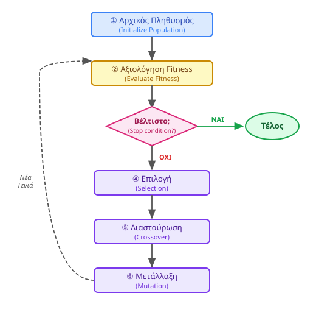

<div style="text-align:center; margin-bottom:16px;">


</div>

# Ευφυή Συστήματα και Συστήματα Υποστήριξης Αποφάσεων
**Ενότητα 8: Εξελικτικοί Αλγόριθμοι, Νοημοσύνη Σμήνους & Βελτιστοποίηση**
Τμήμα Μηχανικών Πληροφορικής & Υπολογιστών
Πανεπιστήμιο Δυτικής Αττικής

**Διδάσκων:** Ανάργυρος Τσαδήμας (<tsadimas@uniwa.gr>)

---

<!-- _class: small -->
# Περιεχόμενα Ενότητας

1. **Εισαγωγή** — Η ανάγκη για βελτιστοποίηση, TSP, ευρετικοί αλγόριθμοι
2. **Εξελικτικοί Αλγόριθμοι (Evolutionary Algorithms)**
   - Γενετικοί Αλγόριθμοι: Κύκλος, Τελεστές (Selection, Crossover, Mutation)
   - Παράδειγμα: Επίλυση TSP με Γενετικό Αλγόριθμο
3. **Νοημοσύνη Σμήνους (Swarm Intelligence)**
   - Βελτιστοποίηση Αποικίας Μυρμηγκιών (ACO)
   - Βελτιστοποίηση Σμήνους Σωματιδίων (PSO)
4. **Άλλες Μετα-ευρετικές Μέθοδοι** — Προσομοιωμένη Ανόπτηση (Simulated Annealing)
5. **Εφαρμογές σε DSS** — Logistics, Scheduling, Hyperparameter Tuning
6. **Σύνοψη** — Πλεονεκτήματα/Μειονεκτήματα, Πότε διαλέγουμε τι, Βιβλιοθήκες Python

---

<!-- _class: small -->
# Εισαγωγή — Η Ανάγκη για Βελτιστοποίηση

**Σύνδεση με τα προηγούμενα**

Η **Μηχανική Μάθηση** (Ενότητες 6 & 7) κάνει *προβλέψεις*. Η **Βελτιστοποίηση** παίρνει αποφάσεις για την *καλύτερη δυνατή ενέργεια*:

> «Ποια είναι η πιο φθηνή διαδρομή για να επισκεφθώ 20 πόλεις;»

**Το πρόβλημα του Πλανόδιου Πωλητή (TSP)**

Βρες τη συντομότερη διαδρομή που επισκέπτεται κάθε πόλη **ακριβώς μία φορά** και επιστρέφει στην αρχή.

- **10 πόλεις** → $9! = 362.880$ πιθανές διαδρομές
- **20 πόλεις** → $19! \approx 1{,}2 \times 10^{17}$ πιθανές διαδρομές
- **25 πόλεις** → $24! \approx 6{,}2 \times 10^{23}$ πιθανές διαδρομές

Ανήκει στην κατηγορία **NP-Hard** — κανένας γνωστός αλγόριθμος δεν λύνει μεγάλες περιπτώσεις σε εύλογο χρόνο.

---

<!-- _class: small -->
# Ευρετικοί & Μετα-ευρετικοί Αλγόριθμοι — Γιατί;

Η «ωμή βία» (brute-force) είναι αδύνατη. Χρειαζόμαστε αλγόριθμους που βρίσκουν **«αρκετά καλή»** λύση γρήγορα.

> Εμπνευσμένοι από τη **φύση** (εξέλιξη, μυρμήγκια, σμήνη) — απλοί κανόνες σε κάθε μονάδα παράγουν έξυπνη συλλογική συμπεριφορά.

---

<!-- _class: small -->
# Ευρετικοί & Μετα-ευρετικοί Αλγόριθμοι

| Κατηγορία | Περιγραφή | Παράδειγμα |
|---|---|---|
| **Ακριβής αλγόριθμος** | Εγγυάται τη βέλτιστη λύση — αλλά αργεί εκθετικά | Brute-force, Branch & Bound |
| **Ευρετικός (Heuristic)** | Γρήγορος, καλή λύση, χωρίς εγγύηση βέλτιστου | Nearest Neighbor για TSP |
| **Μετα-ευρετικός** | Πλαίσιο που καθοδηγεί ευρετικό — αποφεύγει τοπικά βέλτιστα | Γενετικοί, ACO, PSO, SA |

---

<!-- _class: small -->
# Γενετικοί Αλγόριθμοι — Βιολογική Έμπνευση

**Ο Κάρολος Δαρβίνος στην Πληροφορική**

> «Επιβίωση του ικανότερου» — οι καλύτερες λύσεις επιβιώνουν και αναπαράγονται.

**Το Λεξιλόγιο της Εξέλιξης**

| Βιολογία | Αλγόριθμος | Σημασία |
|---|---|---|
| Χρωμόσωμα | Άτομο (Individual) | Μια πιθανή λύση του προβλήματος |
| Γονίδιο | Γονίδιο (Gene) | Μια παράμετρος της λύσης |
| Πληθυσμός | Πληθυσμός (Population) | Το σύνολο των λύσεων που εξετάζουμε |
| Καταλληλότητα | Fitness Function | Η «βαθμολογία» κάθε λύσης |

> Σε αντίθεση με το **Loss Function** των Νευρωνικών που *μειώνουμε*, το **Fitness** θέλουμε να το *μεγιστοποιήσουμε*.

---

<!-- _class: diagram -->
# Γενετικοί Αλγόριθμοι — Ο Κύκλος της Εξέλιξης



---

<!-- _class: xsmall -->
# Γενετικοί Αλγόριθμοι — Κωδικοποίηση (Encoding)

Πριν ξεκινήσει ο αλγόριθμος, πρέπει να αναπαραστήσουμε κάθε λύση ως **χρωμόσωμα**.

<div class="columns">
<div>

**Knapsack Problem**
Μεγιστοποίηση αξίας χωρίς υπέρβαση βάρους.
**Κωδικοποίηση:** δυαδικό διάνυσμα — `1` = μέσα, `0` = έξω.

| Χρωμόσωμα | Αντικείμενα |
|---|---|
| `[1, 0, 1, 0, 0]` | 1ο και 3ο |
| `[0, 1, 1, 1, 0]` | 2ο, 3ο και 4ο |

</div>
<div>

**TSP**
Συντομότερη διαδρομή σε 5 πόλεις (A–E).
**Κωδικοποίηση:** μετάθεση (permutation).

| Χρωμόσωμα | Σειρά επίσκεψης |
|---|---|
| `[A, C, B, E, D]` | A→C→B→E→D→A |
| `[B, D, A, C, E]` | B→D→A→C→E→B |

</div>
</div>

> Η επιλογή κωδικοποίησης είναι το **πιο κρίσιμο βήμα** στο σχεδιασμό ενός Γενετικού Αλγορίθμου.

---

<!-- _class: xsmall -->
# Γενετικοί Αλγόριθμοι — Οι 3 Τελεστές

**Οι 3 Πυλώνες**

1. **Επιλογή (Selection)**
   Διαλέγουμε τους «καλύτερους» γονείς — λύσεις με υψηλό Fitness έχουν μεγαλύτερη πιθανότητα να επιλεγούν.
   - **Ρουλέτα (Roulette Wheel):** Κάθε λύση παίρνει «κομμάτι» ανάλογο με το fitness της.
   - **Τουρνουά (Tournament):** Επιλέγονται τυχαία k άτομα — το καλύτερο γίνεται γονέας.

2. **Διασταύρωση (Crossover)**
   Συνδυάζουμε χαρακτηριστικά δύο γονέων για να δημιουργήσουμε παιδιά (νέες λύσεις).
   - **One-Point:** `[111|00]` + `[000|11]` → `[111|11]`
   - **Two-Point:** `[11|10|0]` + `[00|01|1]` → `[11|01|0]`

3. **Μετάλλαξη (Mutation)**
   Τυχαίες, μικρές αλλαγές στα παιδιά.
   - **Bit Flip:** `[10110]` → `[10010]` (το 3ο bit άλλαξε)
   *Γιατί;* Για να αποφύγουμε τοπικά βέλτιστα — διατηρεί την ποικιλομορφία του πληθυσμού.

> Ο κύκλος επαναλαμβάνεται για πολλές **γενιές (generations)** μέχρι να βρεθεί ικανοποιητική λύση.

---

<!-- _class: diagram -->
# Γενετικοί Αλγόριθμοι — Τελεστές Οπτικά


---

<!-- _class: xxsmall -->
# Παράδειγμα: Επίλυση TSP με Γενετικό Αλγόριθμο

**Πρόβλημα:** Βρες τη συντομότερη διαδρομή για 4 πόλεις (A, B, C, D).

<div class="columns">
<div>

**1. Αρχικός Πληθυσμός (Generation 0)**
- P1: `[A, B, C, D]` (Fitness: 1/150km)
- P2: `[D, A, B, C]` (Fitness: 1/120km) ← Καλύτερος
- P3: `[C, D, A, B]` (Fitness: 1/180km)

**2. Επιλογή (Selection)**
Επιλέγουμε P2 και P1 ως γονείς (υψηλότερο fitness).

**3. Διασταύρωση (Crossover — Ordered)**
- Γονέας 1: `[D, |A, B|, C]`
- Γονέας 2: `[A, |B, C|, D]`
- Παιδί 1: `[D, |B, C|, A]`

</div>
<div>

**4. Μετάλλαξη (Mutation — Swap)**
- Παιδί 1: `[D, B, C, A]` → `[D, C, B, A]` (swap B και C)

**5. Νέος Πληθυσμός (Generation 1)**
- Υπολογίζουμε το fitness του νέου παιδιού.
- Αν είναι καλύτερο, αντικαθιστά τη χειρότερη λύση (P3).
- Επανάληψη για 100+ γενιές.

**Αποτέλεσμα:** Μετά από πολλές γενιές, ο πληθυσμός συγκλίνει σε μια πολύ καλή (αν όχι βέλτιστη) λύση.

</div>
</div>

---

<!-- _class: small -->
# Νοημοσύνη Σμήνους — Η Βασική Ιδέα

**Συλλογική Ευφυΐα Αποκεντρωμένων Συστημάτων**

Μονάδες χωρίς κεντρικό έλεγχο (μυρμήγκια, πουλιά, μέλισσες) λύνουν πολύπλοκα προβλήματα συνεργατικά — ακολουθώντας απλούς τοπικούς κανόνες.

| Σύστημα | Τοπικός κανόνας | Συλλογικό αποτέλεσμα |
|---|---|---|
| Μυρμήγκια | Ακολούθα φερομόνη | Συντομότερη διαδρομή |
| Πουλιά σε σμήνος | Κράτα απόσταση από γείτονες | Συντονισμένη πτήση |
| Μέλισσες | Χορός για τροφή | Εντοπισμός καλύτερης πηγής |

> **Κλειδί:** Κανείς δεν «ξέρει» τη λύση — η ευφυΐα αναδύεται από την αλληλεπίδραση.

---

<!-- _class: small -->
# Βελτιστοποίηση Αποικίας Μυρμηγκιών (ACO)

**Πώς τα τυφλά μυρμήγκια βρίσκουν πάντα τον πιο σύντομο δρόμο;**

**Ο ρόλος της Φερομόνης:**
- Κάθε μυρμήγκι αφήνει φερομόνη στη διαδρομή που ακολουθεί
- Κοντινές διαδρομές διανύονται πιο γρήγορα → συσσωρεύουν φερομόνη πιο γρήγορα
- Τα επόμενα μυρμήγκια προτιμούν διαδρομές με **περισσότερη φερομόνη**
- Η φερομόνη **εξατμίζεται** με τον χρόνο → αποτρέπει κλείδωμα σε κακές λύσεις

**Εφαρμογή σε DSS:**
- Ιδανικό για προβλήματα δρομολόγησης σε γράφους
- Vehicle Routing Problem, δίκτυα τηλεπικοινωνιών

---

<!-- _class: diagram -->
# ACO — Οπτικοποίηση Φερομόνης


---

<!-- _class: small -->
# Βελτιστοποίηση Σμήνους Σωματιδίων (PSO)

**Εμπνευσμένο από τα σμήνη πουλιών (flocking) που ψάχνουν τροφή**

Κάθε **σωματίδιο** = μια πιθανή λύση που κινείται στον χώρο παραμέτρων.

**Κανόνες κίνησης — η ταχύτητα κάθε σωματιδίου ενημερώνεται με βάση:**

1. **Personal Best** — η καλύτερη θέση που έχει βρει το ίδιο μέχρι τώρα
2. **Global Best** — η καλύτερη θέση που έχει βρει *οποιοδήποτε* σωματίδιο του σμήνους

$$v_{i}^{t+1} = w \cdot v_i^t + c_1 r_1 (pbest_i - x_i^t) + c_2 r_2 (gbest - x_i^t)$$

| Όρος | Σημασία |
|---|---|
| $w \cdot v_i^t$ | Αδράνεια — διατηρεί την τρέχουσα κατεύθυνση |
| $c_1 r_1 (pbest_i - x_i^t)$ | Ατομική εμπειρία — έλξη προς προσωπικό καλύτερο |
| $c_2 r_2 (gbest - x_i^t)$ | Κοινωνική εμπειρία — έλξη προς καλύτερο σμήνους |

---

<!-- _class: diagram -->
# PSO — Οπτικοποίηση Κίνησης Σωματιδίου


---

<!-- _class: small -->
# 4. Προσομοιωμένη Ανόπτηση (Simulated Annealing)

**Έμπνευση:** Η διαδικασία ανόπτησης (annealing) στη μεταλλουργία — ένα μέταλλο θερμαίνεται και ψύχεται αργά για να μειωθούν οι ατέλειές του.

**Αλγόριθμος:**
1. Ξεκίνα με μια τυχαία λύση και υψηλή «θερμοκρασία» (T).
2. Δημιούργησε μια γειτονική λύση.
3. Αν είναι καλύτερη, αποδέξου την.
4. Αν είναι **χειρότερη**, αποδέξου την με πιθανότητα που εξαρτάται από τη θερμοκρασία.
5. Μείωσε σταδιακά τη θερμοκρασία.

> **Γιατί αποδεχόμαστε χειρότερες λύσεις;** Για να «πηδήξουμε» έξω από τοπικά βέλτιστα, ειδικά στην αρχή (υψηλή T). Καθώς η T πέφτει, ο αλγόριθμος γίνεται πιο «άπληστος» (greedy) και συγκλίνει.

---

<!-- _class: small -->
# Εφαρμογές σε Συστήματα Υποστήριξης Αποφάσεων

**Logistics & Βελτιστοποίηση Δρομολογίων**

Το **Vehicle Routing Problem (VRP)**: πώς εταιρείες όπως η Amazon ή η FedEx ελαχιστοποιούν καύσιμα και χρόνο παράδοσης με στόλο οχημάτων.

**Χρονοπρογραμματισμός (Scheduling)**
- Κατάρτιση πανεπιστημιακού προγράμματος μαθημάτων (αποφυγή συγκρούσεων αιθουσών/καθηγητών)
- Προγραμματισμός βαρδιών νοσηλευτών σε νοσοκομεία
- Job-Shop Scheduling σε γραμμές παραγωγής εργοστασίων

**Machine Learning & Βελτιστοποίηση**

Γενετικοί Αλγόριθμοι για **Hyperparameter Tuning** νευρωνικών δικτύων — αντί να δοκιμάζουμε εξαντλητικά όλους τους συνδυασμούς (Grid Search), εξελίσσουμε πληθυσμό από υποψήφιες ρυθμίσεις.

---

<!-- _class: small -->
# 6. Πλεονεκτήματα & Μειονεκτήματα

<div class="columns">
<div>

**Πλεονεκτήματα**
- **Ευελιξία:** Εφαρμόζονται σε μεγάλη γκάμα προβλημάτων (διακριτά, συνεχή, μικτά).
- **Αποφυγή Τοπικών Βέλτιστων:** Η στοχαστική φύση τους (μετάλλαξη, θερμοκρασία) επιτρέπει ευρύτερη εξερεύνηση.
- **Παραλληλοποίηση:** Οι πληθυσμιακοί αλγόριθμοι (GA, PSO) είναι εγγενώς παράλληλοι.
- **Δεν απαιτούν παραγώγους:** Λειτουργούν σε προβλήματα όπου η συνάρτηση στόχου δεν είναι παραγωγίσιμη.

</div>
<div>

**Μειονεκτήματα**
- **Χωρίς εγγύηση βέλτιστου:** Δεν υπάρχει εγγύηση εύρεσης της απόλυτα καλύτερης λύσης.
- **Ρύθμιση Υπερπαραμέτρων:** Η απόδοση εξαρτάται πολύ από τις παραμέτρους (π.χ. πιθανότητα μετάλλαξης, μέγεθος πληθυσμού).
- **Υπολογιστικό Κόστος:** Μπορεί να απαιτούν πολλές αξιολογήσεις της συνάρτησης fitness.
- **Στοχαστικότητα:** Δύο εκτελέσεις με τους ίδιους παραμέτρους μπορεί να δώσουν διαφορετικά αποτελέσματα.

</div>
</div>

---

<!-- _class: small -->
# 6.1 Σύνοψη Ενότητας 8

| Θέμα | Βασική Ιδέα |
|---|---|
| **TSP / NP-Hard** | Κάποια προβλήματα δεν λύνονται ακριβώς σε εύλογο χρόνο |
| **Ευρετικοί αλγόριθμοι** | «Αρκετά καλή» λύση γρήγορα — χωρίς εγγύηση βέλτιστου |
| **Γενετικοί Αλγόριθμοι** | Εξέλιξη πληθυσμού λύσεων: επιλογή, διασταύρωση, μετάλλαξη |
| **ACO** | Φερομόνη ως έμμεση επικοινωνία — βέλτιστες διαδρομές σε γράφους |
| **PSO** | Σμήνος σωματιδίων — προσωπική + κοινωνική εμπειρία |
| **Εφαρμογές DSS** | Logistics, Scheduling, Hyperparameter Tuning |

**No Free Lunch Theorem**

> Δεν υπάρχει αλγόριθμος που να υπερέχει σε *όλα* τα προβλήματα.
> Η επιλογή εξαρτάται από τη δομή του προβλήματος.

| | Γενετικοί Αλγόριθμοι | ACO | PSO |
|---|---|---|---|
| **Κατάλληλο για** | Διακριτός χώρος (π.χ. TSP, Knapsack) | Δρομολόγηση σε γράφο | Συνεχής χώρος παραμέτρων (π.χ. tuning νευρωνικών) |
| **Αναζήτηση** | Παράλληλη, βασισμένη σε πληθυσμό | Συνεργατική, βασισμένη σε μονοπάτια | Συνεργατική, βασισμένη σε τροχιές |

---

<!-- _class: xsmall -->
# 6.2 Βιβλιοθήκες Python

| Βιβλιοθήκη | Αλγόριθμοι | Σύνδεσμος |
|---|---|---|
| **DEAP** | Γενετικοί Αλγόριθμοι (GA), Evolutionary Strategies (ES) | deap.readthedocs.io |
| **pyswarm** | Particle Swarm Optimization (PSO) | pyswarm.readthedocs.io |
| **scikit-opt** | GA, PSO, ACO, Simulated Annealing και άλλα | scikit-opt.github.io |
| **mealpy** | Τεράστια συλλογή μετα-ευρετικών αλγορίθμων | mealpy.readthedocs.io |
| **Optuna** | Βελτιστοποίηση υπερπαραμέτρων (Hyperparameter Tuning) | optuna.org |

```python
# Παράδειγμα με DEAP για Γενετικό Αλγόριθμο
from deap import base, creator, tools, algorithms
# ... ορισμός fitness, toolbox, κ.λπ.
algorithms.eaSimple(population, toolbox, cxpb=0.5, mutpb=0.2, ngen=40)
```
