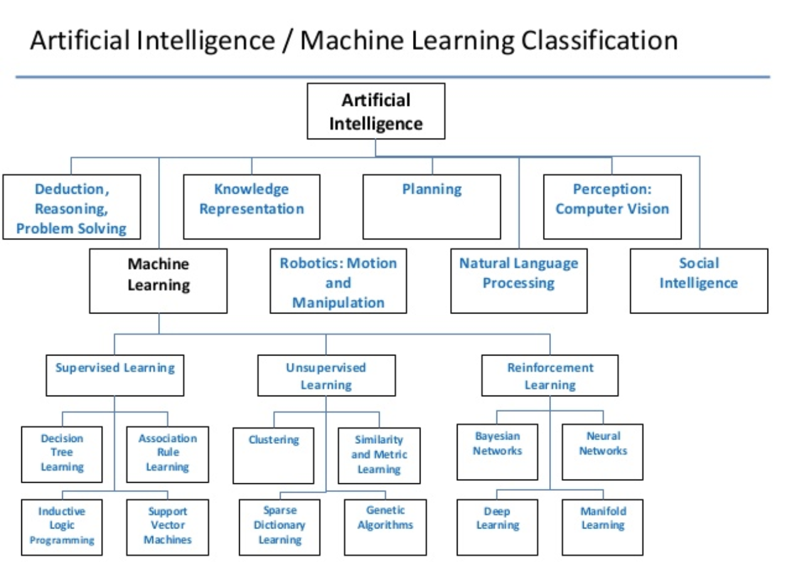
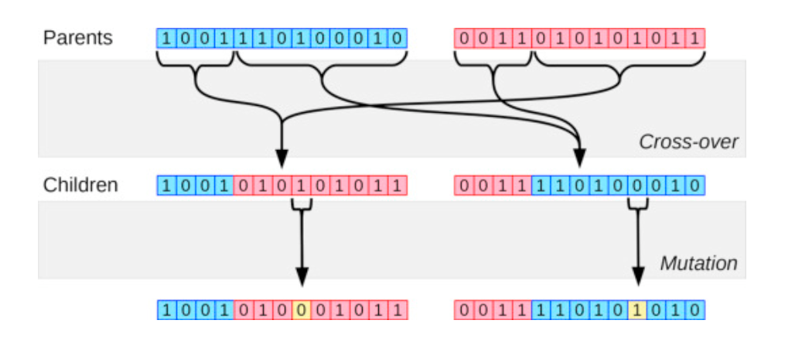
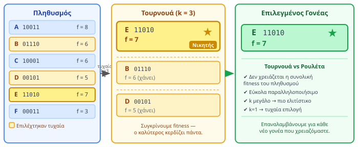
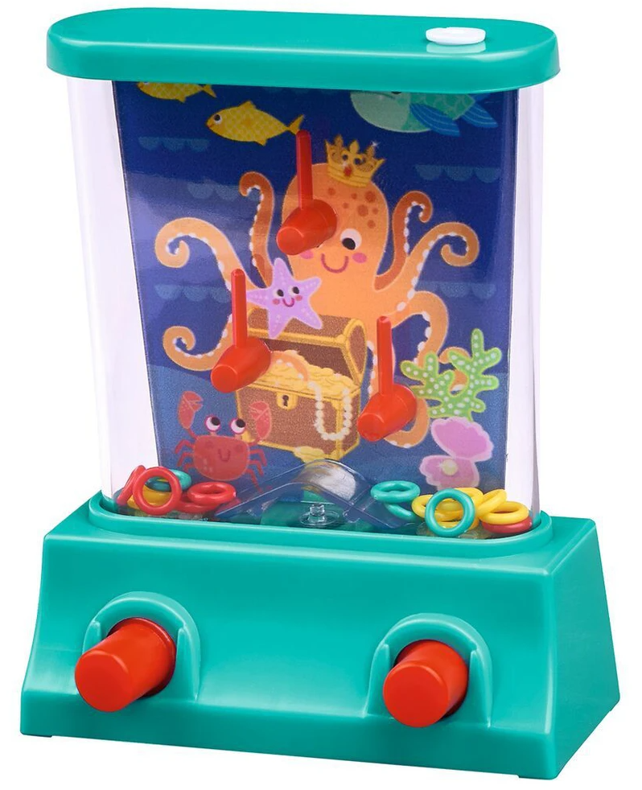

<div style="text-align:center; margin-bottom:16px;">


</div>

# Intelligent Systems and Decision Support Systems
**Unit 8: Evolutionary Algorithms, Swarm Intelligence & Optimization**
Department of Informatics & Computer Engineering
University of West Attica

**Instructor:** Anargyros Tsadimas (<tsadimas@uniwa.gr>)

---

<!-- _class: small -->
# Unit Contents

1. **Introduction** — The need for optimization, TSP, heuristic algorithms
2. **Evolutionary Algorithms**
   - Genetic Algorithms: Cycle, Operators (Selection, Crossover, Mutation, Replacement), Numerical Example, Convergence
   - Example: Solving TSP with a Genetic Algorithm
3. **Swarm Intelligence**
   - Ant Colony Optimization (ACO)
   - Particle Swarm Optimization (PSO)
4. **Other Meta-heuristic Methods** — Simulated Annealing
5. **Applications in DSS** — Logistics, Scheduling, Hyperparameter Tuning
6. **Summary** — Advantages/Disadvantages, When to choose what, Python Libraries

---

<!-- _class: diagram xxsmall -->
# Artificial Intelligence Map — Where Are We?



Unit 8 focuses on **Evolutionary Algorithms** and **Swarm Intelligence** — nature-inspired methods that do not fall neatly into the classical categories of Machine Learning.

---

<!-- _class: xsmall -->
# Introduction — The Need for Optimization

**Connection to previous material**

**Machine Learning** (Units 6 & 7) makes *predictions*. **Optimization** makes decisions about the *best possible action*:

> "What is the cheapest route to visit 20 cities?"

## The Travelling Salesman Problem (TSP)

A salesman starts from a **base**, visits $n$ cities **exactly once**, and returns to the base.
Goal: **minimize total distance** (or travel cost).

The **order of visits** determines the cost — and there are $(n-1)!$ possible orderings:

| Cities | Routes | Brute-force @ $10^{12}$ routes/sec |
|:---:|:---:|:---:|
| **5** | $4! = 24$ | < 1 μs |
| **10** | $9! = 362,880$ | < 1 ms |
| **20** | $19! \approx 1{,}2 \times 10^{17}$ | ~1 day |
| **25** | $24! \approx 6{,}2 \times 10^{23}$ | **~20,000 years** |

It belongs to the **NP-Hard** category — exhaustive search becomes infeasible very quickly.

---

<!-- _class: diagram-sm -->
# TSP — Why the Order of Visits Matters


Same **5 cities**, two different visiting orders → **+59% difference in distance**.
Routes with **crossings** are always sub-optimal — but with 20+ cities we cannot check all options.

---

<!-- _class: xsmall -->
# Heuristic & Meta-heuristic Algorithms — Why?

<div class="columns">
<div>

**The Complexity Problem**
In problems like TSP (NP-Hard), the search space grows factorially (Combinatorial Explosion). Brute-force — exhaustively examining all possible solutions — becomes practically impossible as the problem grows.

**The Solution: The Trade-off**
We sacrifice the *guarantee of the absolutely optimal solution* in order to gain *computational speed*. We need algorithms that find a **"good enough"** (satisfactory) solution in reasonable time.

</div>
<div>

**Inspiration from Nature (Bio-inspired AI)**
How does nature solve complex optimization problems over millions of years?
- The **evolution** of species (survival of the fittest)
- **Foraging by swarms** (ants, birds, bees)

**The Principle of Emergence:**
"Smart" behaviour is not programmed into any single individual, but **emerges** from the interactions of many individuals following simple, local rules.

- **Simple Local Rules:** Each individual (e.g. a bird in a flock) has no "big picture". It follows 2–3 simple rules: (1) Don't collide with your neighbours, (2) Match your speed with your neighbours, (3) Move towards the centre of your neighbours.
- **No Central Control:** There is no "leader" issuing commands. The organisation is decentralised.
- **Smart Collective Behaviour:** The result is the coordinated, fluid movement of the entire flock, which can collectively avoid obstacles. This behaviour does not exist in any single bird.

</div>
</div>

---

<!-- _class: xsmall -->
# Heuristic Algorithms

In NP-Hard problems (e.g. TSP) we cannot find an **absolutely optimal** solution in reasonable time.
Heuristic algorithms sacrifice the optimality guarantee in order to gain **speed**.

They are based on **rules of thumb** — simple, practical strategies that are usually **problem-specific**.

- **Goal:** A satisfactory solution in reasonable time — with no guarantee of optimality.
- **Advantage:** Speed and simplicity.
- **Disadvantage:** They risk getting trapped in **local optima** — they find a good solution, but not necessarily the best one.

> **Example — Nearest Neighbor for TSP:** start from a city and always go to the nearest unvisited city. Fast, but does not guarantee an optimal result.

---

<!-- _class: xxsmall -->
# Meta-heuristic Algorithms

Meta-heuristics are **high-level strategies** that guide a simpler heuristic algorithm, helping it explore the solution space more intelligently and **avoid getting trapped in local optima**.

**The Main Goal: The Art of Balance**
Their success is based on intelligently managing the balance between two opposing forces:

<div class="columns">
<div>

**Exploitation — *Depth***
- **What it is:** Intensive, local search around the good solutions already found. Focuses on improving existing good solutions.
- **Goal:** To reach the top of the "hill" we are currently on.
- **How it is achieved:**
    - **GA:** The **Crossover** operator that combines good parents.
    - **PSO:** The attraction of the particle towards **`pbest`** and **`gbest`**.
    - **SA:** Accepting only better solutions when temperature is low.

</div>
<div>

**Exploration — *Breadth***
- **What it is:** Searching in new, unexplored regions of the solution space, even if this means temporarily accepting worse solutions.
- **Goal:** To discover new, potentially higher "hills".
- **How it is achieved:**
    - **GA:** The **Mutation** operator that introduces randomness.
    - **PSO:** Inertia ($w$) and randomness ($r_1, r_2$) in movement.
    - **SA:** Accepting worse solutions when temperature is high.

</div>
</div>

| Category | Description | Example |
|---|---|---|
| **Exact Algorithm** | Guarantees optimum — exponentially slow | Brute-force, Branch & Bound |
| **Heuristic Algorithm** | Fast, problem-specific, may get stuck | Nearest Neighbor |
| **Meta-heuristic Algorithm** | Guides search, overcomes local optima | Evolutionary (e.g. GA), Swarm Intelligence (ACO, PSO), SA |

---

<!-- _class: diagram-sm xxsmall -->
# The Problem: Local vs. Global Optimum

<div style="margin-top:-20px; margin-bottom: 10px;">


</div>

<div class="columns" style="font-size:16px;">
<div>

**Left: Simple Heuristic (e.g. Hill Climbing)**
- Starts from **one** random solution.
- At each step, moves towards the **best neighbouring solution** (pure exploitation).
- **Problem:** If the initial solution lies in the basin of a "low hill", the algorithm will find the top of that hill (local optimum) and **get trapped** there, unable to see that there is a higher hill (the global optimum) further away.

</div>
<div>

**Right: Genetic Algorithm (Meta-heuristic)**
- Starts with a **population** of many solutions, scattered across the entire space.
- **Selection & Crossover:** Combines good solutions (parents) to focus the search on promising regions (**exploitation**).
- **Mutation:** Introduces random changes that allow "children" to "jump" to entirely new regions of the space, escaping local optima (**exploration**).
- **Result:** The GA explores many "hills" in parallel, dramatically increasing the probability of finding the global optimum.

</div>
</div>

---

<!-- _class: small -->
# 2. Evolutionary Algorithms — The Basic Idea

**Evolutionary Algorithms (EA)** constitute a broad category of meta-heuristic optimization algorithms whose operation is **inspired by biological evolution** and the principles of natural selection.

Their goal is to find optimal or near-optimal solutions to complex problems, balancing **exploration** (searching new regions) and **exploitation** (improving existing good solutions).

**Common Characteristics:**
- **Population:** They maintain a set of candidate solutions, not just one.
- **Selection:** Better solutions have a higher probability of "surviving" and reproducing.
- **Reproduction:** They create new solutions (children) by combining existing ones (parents) through operators such as **Crossover** and **Mutation**.

> The central idea is that a **population of candidate solutions evolves** successively, from generation to generation, through selection and reproduction mechanisms, with the aim of gradually converging towards optimal or near-optimal solutions in the search space.

**Genetic Algorithms (GAs) are the most well-known and widely used type of Evolutionary Algorithm.** Other types include Evolutionary Strategies (ES) and Genetic Programming (GP).

---

<!-- _class: xsmall -->
# Mathematical vs. Combinatorial Optimization

Genetic Algorithms are a powerful method for solving two main categories of problems: **mathematical optimization** (finding optimal parameters of a function) and **combinatorial optimization** (finding the best arrangement, as in NP-hard problems).

<div class="columns">
<div>

**Mathematical (Continuous) Optimization**
- **Goal:** Finding the minimum/maximum of a function where the variables are **continuous** (real numbers).
- **Solution Space:** Infinite and continuous.
- **Example 1 (Hyperparameter Tuning):** Find the ideal `learning_rate` (e.g. 0.0153) and `momentum` (e.g. 0.92) of a neural network to minimize the loss.
- **Example 2 (Engineering):** Find the dimensions (length, width) of a beam that minimize its weight while maintaining its strength.
- **Analogy:** You are looking for the lowest point on a smooth, wavy surface.

</div>
<div>

**Combinatorial (Discrete) Optimization**
- **Goal:** Finding the best solution from a **finite (but huge)** set of possible combinations or arrangements.
- **Solution Space:** Discrete.
- **Example 1 (TSP):** Find the best **order** for visiting 20 cities. The solution is a permutation.
- **Example 2 (Knapsack):** Find the best **combination** of items to maximize value. The solution is a selection (yes/no).
- **Analogy:** You are looking for the best path through a maze or the best combination in a chess game.

</div>
</div>

> Meta-heuristic algorithms can be applied to both categories, but the **encoding** of the solution (the chromosome) is completely different.

---

<!-- _class: xxsmall -->
# Genetic Algorithms — Biological Inspiration

Genetic Algorithms (GAs) are a category of Evolutionary Algorithms that mimic the process of Darwin's **natural selection**. The central idea is simple: a population of candidate solutions "evolves" through generations, with better solutions surviving and reproducing, gradually leading to improved results.


| Biology | Algorithm | Meaning |
|---|---|---|
| **Individual** | **Candidate Solution** | A possible, complete solution to the problem (e.g. a route in TSP). |
| **Population** | **Set of Solutions** | A collection of different candidate solutions. |
| **Chromosome** | **Solution Encoding (Genotype)** | The representation of the solution in a form understood by the algorithm (e.g. `[A,C,B,D]`). |
| **Gene** | **Solution Parameter** | A single element of the encoded solution (e.g. city `C`). |
| **Environment** | **Fitness Function** | A function that "scores" each solution. The better the solution, the higher the fitness. |
| **Reproduction** | **Crossover & Mutation** | The mechanisms that create new solutions (children) from existing ones (parents). |

> **Fitness vs. Loss:** In contrast to the **Loss Function** of Neural Networks that we want to *minimize*, **Fitness** is something we want to *maximize*.

**Historical Milestones**
- **1975** — John Holland: "Adaptation in Natural and Artificial Systems" — Establishes the theory of GAs.
- **1989** — David Goldberg: "Genetic Algorithms in Search, Optimization, and Machine Learning" — Popularises and spreads their use.

---

<!-- _class: diagram -->
# Genetic Algorithms — The Cycle of Evolution


---

<!-- _class: xxsmall -->
# How Genetic Algorithms Work (Step by Step)

The algorithm simulates evolution through an iterative cycle (generations):

**1. Initialization:**
A random population of $N$ individuals (chromosomes) is created — ensuring initial *genetic diversity*.

**2. Fitness Evaluation & Termination Check:**
The fitness of each individual is computed. If the **termination criterion** is satisfied (e.g. maximum generations or sufficiently good fitness) → the algorithm stops and returns the best individual.

**3. Selection:**
Here we decide which individuals will become "parents". Selection is **not simply choosing the best (greedy approach)**, but is **probabilistic**: individuals with higher fitness have a *greater probability* of being selected, but it is not guaranteed. This is done for a critical reason: if we always took only the best, the algorithm would converge very quickly to a local optimum, missing the opportunity to explore other, potentially better, regions of the solution space. By giving even the weaker solutions a small chance, we maintain **genetic diversity**.

**4. Crossover:**
Two parents exchange parts of their chromosome, producing children that inherit characteristics from both.

**5. Mutation:**
Random, small changes to genes in the children — maintains genetic diversity and prevents premature convergence to a local optimum.

**6. Replacement:**
The children partially or fully replace the old population, forming the **new generation**. Return to step 2.

> 💡 **Industry 4.0 Example:** In a factory, an "individual" is a *production schedule*. Fitness measures *delays*. Crossover combines pieces from two good schedules, hoping to produce an even faster one!

---

<!-- _class: xsmall -->
# Genetic Algorithms — Encoding

Let us clarify this with an analogy: think of it as a **translation**. The Genetic Algorithm does not understand real-world concepts such as "city routes" or "items in a backpack". It operates by manipulating data structures, usually strings or lists of numbers.

Therefore, we must "translate" each possible solution from its form in the problem into a form understood by the algorithm.
- The **real-world solution** (e.g. the route `Athens → Patras → Thessaloniki`) is called the **phenotype**.
- The **encoded representation** (e.g. the list `[1, 3, 2]`) is called the **genotype** or **chromosome**.

The algorithm applies operators (crossover, mutation) to the **genotypes**. When it needs to evaluate how good a solution is (to find its fitness), it performs the reverse translation (decoding) to compute the cost in the real world.


<div class="columns">
<div>

**The Knapsack Problem**
**Problem:** Given a backpack with a weight limit and a list of items (with weight and value), which items should we select to maximize total value without exceeding the limit?
**Encoding:** binary vector — `1` = in, `0` = out.

| Chromosome | Items |
|---|---|
| `[1, 0, 1, 0, 0]` | 1st and 3rd |
| `[0, 1, 1, 1, 0]` | 2nd, 3rd and 4th |

</div>
<div>

**The Travelling Salesman Problem (TSP)**
**Problem:** Given a list of cities, what is the shortest route that visits each city exactly once and returns to the origin?
**Encoding:** permutation.

| Chromosome | Visit order |
|---|---|
| `[A, C, B, E, D]` | A→C→B→E→D→A |
| `[B, D, A, C, E]` | B→D→A→C→E→B |

</div>
</div>

> The choice of encoding is the **most critical step** in designing a Genetic Algorithm.

---

<!-- _class: small -->
# Encoding — Visualisation

<div class="columns">
<div>

**Knapsack — binary vector**
Each `1`/`0` gene corresponds to an item (in / out).


</div>
<div>

**TSP — permutation**
The order of the genes defines the order in which cities are visited.


</div>
</div>

---

<!-- _class: xsmall -->
# Encoding Types — Analysis

<div class="columns">
<div>

**Binary Encoding**
- **What it is:** A vector of 0s and 1s.
- **When used:** In **selection** (yes/no) problems.
- **Example (Knapsack):** Each gene corresponds to an item. `1` means "take it", `0` means "leave it".
- **Characteristics:**
    - Genes are **independent**. Changing one gene (mutation) does not affect the validity of the others.
    - Allows simple crossover operators (One-Point, Uniform) because any combination of 0s and 1s is a valid encoding.

</div>
<div>

**Permutation Encoding**
- **What it is:** A rearrangement (ordering) of a set of elements.
- **When used:** In **ordering/sequencing** problems.
- **Example (TSP):** Each gene is a city, and their order in the chromosome defines the route.
- **Characteristics:**
    - Genes are **dependent**. Each element must appear **exactly once**.
    - Requires special crossover operators (e.g. Ordered Crossover, PMX) to ensure that children remain valid permutations (no duplicates or missing elements). A simple swap would destroy the solution.

</div>
</div>

---

<!-- _class: xsmall -->
# Encoding Rules of Thumb

Although there are no absolute rules, there are strong conventions for which encoding fits each type of problem. The choice depends on the nature of the decision variables in your problem.

| Variable / Problem Type | Recommended Encoding | Examples & Notes |
| :--- | :--- | :--- |
| **Yes/No Decisions** (Selection) | **Binary** | **Knapsack Problem:** Is the item in (1) or out (0)?<br>**Feature Selection:** Do we use the feature (1) or not (0)? |
| **Ordering/Sequencing Problems** | **Permutation** | **TSP:** What is the order of visiting cities?<br>**Job-Shop Scheduling:** In what order are jobs executed? |
| **Continuous Parameters** | **Real-Valued** | **Function Optimization:** Find the min/max of $f(x,y)$ where $x, y \in \mathbb{R}$.<br>**Hyperparameter Tuning:** Find the learning rate (e.g. 0.015) of a neural network. |
| **Discrete Parameters** | **Integer** | **Resource Optimization:** How many trucks (e.g. 3, 4, 5) to send?<br>How many shifts (e.g. 2, 3) should the factory have? |

> **Note on Mathematical Optimization:** Historically, for optimizing continuous functions (e.g. $f(x)$), **binary encoding** was often used, where the continuous value space was "discretized" into binary strings. Today, direct real-valued encoding is more common and often more effective.

---

<!-- _class: small -->
# Genetic Algorithms — The 3 Operators

Genetic Algorithms mimic evolution using three basic operators applied sequentially in each generation to create a new, potentially better, population.

**① Selection — *Exploitation***

- **Purpose:** To select the "parents" for the next generation. Selection is **probabilistic**, giving individuals with higher fitness a greater probability of reproducing. This directs the search towards the most promising regions of the solution space.
- **Methods:**
  - **Roulette Wheel:** Each individual gets a "slice" of a roulette wheel proportional to its fitness. To select a parent, the wheel is spun. Individuals with higher fitness have larger slices and therefore a greater probability of being selected.
  - **Tournament:** *k* individuals are randomly selected from the population (e.g. k=3). The individual with the highest fitness from this small group wins the "tournament" and is selected as a parent. The process is repeated. This is a very common and effective method.

---

<!-- _class: xsmall -->
# Genetic Algorithms — Operator ②: Crossover

**② Crossover — *Combination & Exploitation***

- **Purpose:** To create "children" (new solutions) by combining the genetic material of two parents. Combining good characteristics from two good solutions may lead to an even better one.
- **Methods (for binary encoding):**
  - **One-Point Crossover:** First, based on the **crossover probability**, it is decided whether crossover will occur. If yes, a random cut point is selected in the chromosomes. The 1st child takes the first part from Parent A and the second from Parent B. Correspondingly, the 2nd child takes the first part from Parent B and the second from Parent A. Example: Parents `[111|00]` & `[000|11]` → Children `[111|11]` & `[000|00]`.
  - **Two-Point Crossover:** Two random cut points are selected. The 1st child takes the first and third segments from Parent A and the middle segment from Parent B. The 2nd child does the reverse. Example: Parents `[11|10|0]` & `[00|01|1]` with points 2 & 4 → Children `[11|01|0]` & `[00|10|1]`.
  - **Uniform Crossover:** For each gene, a "coin" is tossed (e.g. 50% probability) to decide from which parent the child will inherit it. Example: Parents `[1111]` & `[0000]` with "coins" `H,T,H,H` → Child `[1011]`. Allows greater mixing of genetic material.
 - **Methods (for permutation encoding — e.g. TSP):**
  - **Ordered Crossover (OX):** A random segment from Parent A is selected. The remainder of Child 1 is filled with the genes of Parent B in the order they appear, skipping those already present in the selected segment. Example: Parents `[A B C D E F G H]` & `[D E A F B G H C]`. We select segment `[C D E]` from Parent A. Child 1 starts with `[ _ _ C D E _ _ _ ]`. We fill from Parent B: `[F B G H A]` (skipping D, E, A). So Child 1: `[F B C D E G H A]`.

---

<!-- _class: small -->
# Choosing a Crossover Operator — When to Use What?

The choice of the appropriate crossover operator is critical and depends directly on the **encoding type** of the chromosomes, i.e. how a problem solution is represented.

| Encoding Type | Suitable Crossover Operators | Notes |
|---|---|---|
| **Binary** | One-Point, Two-Point, Multi-Point, Uniform | Simple and effective for binary chromosomes. |
| **Permutation** | Ordered Crossover (OX), Partially Mapped Crossover (PMX), Cycle Crossover (CX) | Special operators that preserve the validity of the permutation (e.g. each element appears once). |
| **Real-Valued** | Arithmetic Crossover, Blend Crossover (BLX-α), Simulated Binary Crossover (SBX) | Combine gene values arithmetically, e.g. average or linear combination. |
| **Integer** | Like binary operators (if genes are small integers) or real-valued (if they are large integers) | Depends on the range and meaning of the integers. |

> **Basic principle:** The crossover operator must ensure that the children produced are **valid solutions** to the problem. For example, in permutation problems (such as TSP), a simple One-Point Crossover could create children with duplicate elements or missing ones, which is not a valid route.

---

<!-- _class: small -->
# Genetic Algorithms — Operator ③: Mutation

**③ Mutation — *Exploration***

- **Purpose:** To introduce random, small changes to chromosomes, preventing premature convergence to local optima.
 - **Mechanism:** Mutation is applied based on the **mutation probability (pm)**, a small number (e.g. 0.01).
 - **Methods:**
  - **Bit Flip (for binary encoding):** This is the most common method. The algorithm iterates through **each gene (bit) of the chromosome**. For each bit, it generates a random number. If this number is less than `pm`, the bit is flipped (0 → 1, 1 → 0).
    *Example:* If `pm = 0.01`, then on average 1 in every 100 bits in the population will change each generation.
  - **Swap (for permutation encoding):** Two random positions (genes) in the chromosome are selected and their values are swapped. Example: `[A, B, C, D, E]` → `[A, D, C, B, E]`.

> The balance between **Crossover** (exploitation) and **Mutation** (exploration) is the key to a Genetic Algorithm's success.

---

<!-- _class: small -->
# Genetic Algorithms — Operator ④: Replacement

**④ Replacement — *Creating a New Generation***

- **Purpose:** Once "children" have been created through crossover and mutation, we must decide how they will form the new generation.
- **Common Strategies:**
  - **Generational Replacement:** The entire parent population is replaced by the children. It is simple, but may lose good solutions.
  - **Steady-State Replacement:** New children replace only the *worst* members of the old population.

**Elitism:**
> This is an extremely important and common technique, where **the best individual (or the *k* best) of the current generation is automatically and unchanged carried over to the next**.

**Why is Elitism critical?** It ensures that the best solution found so far will never be lost due to the stochastic nature of selection or crossover.

---

## Crossover and Mutation



---

<!-- _class: diagram -->
# Genetic Algorithms — Operators Visually


---

<!-- _class: diagram-sm xxsmall-->
# Numerical Example — Roulette Selection

<div class="columns">
<div>


</div>
<div>

**Goal:** Maximization of $f(x) = x^2$

**How is each individual's "share" calculated?**

1. **Decoding** (Genotype → Phenotype):
   * **Ind1:** `01101` → $x = 13$
   * **Ind2:** `11000` → $x = 24$
2. **Fitness:** $f(\text{Ind1}) = 13^2 = 169$, $f(\text{Ind2}) = 24^2 = 576$
3. **Probability:** $P(i) = f(i) / \Sigma f$ — the individual with the highest fitness gets a larger "slice" on the roulette wheel.

> **Selection Pressure:**
> **Selection Pressure** is a measure of how strongly the algorithm "prefers" better solutions during the selection process.
>
> - **High Pressure:** Better solutions dominate quickly, leading to faster convergence (**exploitation**). Risk: premature convergence to a local optimum.
> - **Low Pressure:** Even the weakest solutions have a chance, maintaining genetic diversity (**exploration**). Risk: slow convergence.
>
> In our example, the function $f(x)=x^2$ creates high pressure. While $x=24$ is less than twice $x=13$, its fitness is **3.4 times greater**. This means that Individual 2 will be selected much more frequently, "pushing" the population to move quickly towards its region.

</div>
</div>

---

<!-- _class: diagram -->
# Tournament Selection — Visually



---

<!-- _class: xsmall -->
# Genetic Algorithms — Convergence & Parameters

**Population Convergence**

During evolution, the population tends to become increasingly homogeneous as better solutions dominate. This is called **convergence**. We say that a gene **has converged** when the same value appears in a very high proportion (e.g. > 95%) of the individuals in the population.

> ⚠️ **Premature Convergence:** This is the greatest risk. It occurs when the population loses its genetic diversity too quickly and converges to a **locally optimal** solution instead of the globally optimal one. The algorithm "gets stuck" because it no longer has the genetic material to explore other regions. **Mutation** is the primary defence against this phenomenon.

**Main Hyperparameters of the Algorithm**

| Parameter | Typical Value | Effect on Balance (Exploration vs. Exploitation) |
|---|---|---|
| **Population Size (N)** | 50–200 | A larger population increases genetic diversity (**better exploration**), but slows each generation. A smaller population risks premature convergence. |
| **Crossover Probability (r)** | 0.6–0.9 | A high value accelerates convergence by quickly combining solutions (**exploitation**). If too high, it may break useful gene combinations. |
| **Mutation Probability (m)** | 0.001–0.05 | A low value is critical for introducing new material (**exploration**) and avoiding local optima. If too high, the algorithm degenerates into random search. |

---

<!-- _class: xsmall -->
# TSP Example — Encoding & Fitness

**Problem:** For 4 cities (A,B,C,D), which **visit order** gives the shortest circular route?
**Encoding:** Permutation chromosome — each chromosome is a visit order.
**Fitness:** $f = 1/\text{(total distance)}$ — the shorter the route, the **higher** the fitness.

<div class="columns">
<div>


</div>
<div>

**Initial Population (Gen 0):**

| Chromosome | Calculation | Fitness $f$ | $P$ |
| :--- | :--- | :---: | :---: |
| `[A,B,C,D]` | 140+140+130+190=**600 km** | 0.00167 | **37.4%** |
| `[A,B,D,C]` | 140+170+130+245=**685 km** | 0.00146 | **32.7%** |
| `[A,C,B,D]` | 245+140+170+190=**745 km** | 0.00134 | **30.0%** |

For `[A,B,C,D]`:
$$f = \frac{1}{140+140+130+190} = \frac{1}{600} \approx 0{,}00167$$

**Calculating the Selection Probability (P):**
The selection probability of each chromosome (for the roulette method) is calculated by dividing its fitness by the **sum of the fitness of the entire population**.
Total Fitness = $0.00167 + 0.00146 + 0.00134 = 0.00447$
For `[A,B,C,D]`: $P = 0.00167 / 0.00447 \approx 37.4\%$

</div>
</div>

---

<!-- _class: xsmall -->
# TSP Example: From Generation 0 to Generation 1 (Part 1)

<div class="columns">
<div>

**1. Initial Population (Generation 0) & Selection**
Based on Fitness, roulette selection picks the two best as parents (P1, P2).

| Chromosome | Distance | Fitness $f$ | $P$ |
| :--- | :---: | :---: | :---: |
| P1: **`[A,B,C,D]`** | **600 km** | **0.00167** | **37.4%** |
| P2: `[A,B,D,C]` | 685 km | 0.00146 | 32.7% |
| `[A,C,B,D]` | 745 km | 0.00134 | 30.0% |

</div>
<div>

**2. Crossover (Ordered Crossover - OX)**
- **Child 1:** Copy positions 0–1 from P1 (`[A,B]`), fill with the remaining cities from P2 in their order (`D, C`).
- **Child 2:** Reverse: positions 0–1 from P2 (`[A,B]`), remaining cities from P1 (`C, D`).

| | Position 0 | Position 1 | Position 2 | Position 3 |
| :---: | :---: | :---: | :---: | :---: |
| P1 | **A** | **B** | C | D |
| P2 | A | B | D | C |
| Child 1 | **A** | **B** | D | C |
| Child 2 | **A** | **B** | C | D |

> **Note:** Because the parents are very similar, the resulting children are identical to the parents. This is expected in small populations — the power of the algorithm becomes apparent in larger, more diverse populations.

</div>
</div>

---

<!-- _class: xsmall -->
# TSP Example: From Generation 0 to Generation 1 (Part 2)

**3. Mutation (Swap)**
Suppose Child 1 undergoes a random swap at positions 2 and 3.
- Before: `[A, B, D, C]` (685 km) → After: `[A, B, C, D]` (**600 km**) ✓

**4. Replacement (with Elitism) & New Generation (Generation 1)**
To form Generation 1, we apply **Elitism**: the best individual from the current generation (Generation 0) is automatically carried over to the new generation. The remaining members of Generation 1 are filled from the new children produced by crossover and mutation.

> Elitism ensures that the best solution found so far is never lost, even if the crossover and mutation operators temporarily produce worse solutions.

| Chromosome | Source | Distance |
| :--- | :--- | :---: |
| `[A,B,C,D]` | Best of Generation 0 (Elitism) | 600 km |
| `[A,B,C,D]` | Child 2 (from Crossover) | 600 km |
| `[A,B,C,D]` | Child 1 (from Mutation) | 600 km |

**Result:** The population of Generation 1 has now converged to the optimal solution. In practice, this requires many generations.

---

<!-- _class: xsmall -->
# Swarm Intelligence — The Basic Idea

**Swarm Intelligence (SI)** studies the **collective intelligence** that emerges from the cooperation of simple, decentralised agents.

**Basic Principles:**
- **Decentralisation:** There is no central control or "leader". Each agent acts autonomously.
- **Local Information:** Each agent knows only its immediate neighbourhood.
- **Simple Rules:** Agents follow a very small set of simple rules.
- **Emergent Behaviour:** From simple, local interactions a complex and "intelligent" global behaviour emerges.

| System | Local rule | Collective result |
|---|---|---|
| Ants | Follow pheromone | Shortest path |
| Birds in a flock | Match speed & keep distance | Coordinated flight (flocking) |
| Bees | Dance for food | Location of best source |

> **Stigmergy:** A form of indirect communication where agents interact by modifying their environment (e.g. ant pheromone).

---

<!-- _class: small -->
# Evolutionary Algorithms vs. Swarm Intelligence

Both are population-based meta-heuristic algorithms, but their philosophy differs significantly.

| Characteristic | Evolutionary Algorithms (e.g. GA) | Swarm Intelligence (e.g. PSO, ACO) |
| :--- | :--- | :--- |
| **Basic Philosophy** | **Competition** (Survival of the fittest) | **Cooperation** (Collective intelligence) |
| **Information Flow** | Centralised (selection sees the entire population) | Decentralised (local interactions) |
| **Mechanism** | **Reproduction** (Crossover, Mutation) | **Interaction** (Movement, Communication) |
| **Memory** | The population as a whole is the memory | Each individual has memory (`pbest`) & there is global memory (`gbest`) or in the environment (pheromone) |
| **Population Management** | Individuals "die" and are replaced (generational) | The population usually remains constant, individuals simply move |

> Genetic Algorithms are like evolving a species, while Swarm Intelligence is like observing the behaviour of a society.

---

<!-- _class: small -->
# Ant Colony Optimization (ACO) — 1/2

**Inspiration:** The ability of ants to find the shortest path from the nest to food. When an ant moves, it leaves behind a chemical substance, **pheromone**. Other ants tend to follow paths with stronger pheromone. On a shorter route, ants complete the journey (back and forth) faster, so pheromone accumulates faster on that path, making it even more attractive.

**Step 1 — Building Solutions (Ants build paths):**

- A set of "artificial ants" (agents) is placed randomly at cities (nodes).
- Each ant builds a solution (a TSP route) step by step. At each step, it selects the next city to visit based on a **probabilistic decision**.
- The probability $P_{ij}$ of moving from city $i$ to city $j$ depends on two factors:
    - **Pheromone Intensity ($\tau_{ij}$):** How strong the pheromone is on path $(i, j)$.
    - **Heuristic Information ($\eta_{ij}$):** How "attractive" city $j$ is on its own (usually the inverse of the distance, $1/d_{ij}$).
- The formula is: $P_{ij} \propto (\tau_{ij})^\alpha \cdot (\eta_{ij})^\beta$, where the exponents $\alpha$ and $\beta$ control the relative importance of pheromone versus heuristic information.

---

<!-- _class: small -->
# Ant Colony Optimization (ACO) — 2/2

**Step 2 — Pheromone Update:**

After all ants have completed their routes, the pheromone is updated in two phases:
- **Evaporation:** The pheromone on *all* paths decreases slightly (e.g. by 10%). This is the **element of forgetting** and is critical for **exploration**, as it prevents premature convergence to a sub-optimal solution.
- **Reinforcement:** The ants (or only the best of them) deposit new pheromone on the paths they followed. The amount of pheromone they deposit is **inversely proportional to the total length of their route**.

> **The Exploitation / Exploration Balance:**
> - **Positive Feedback (Exploitation):** Good solutions are reinforced, attracting more ants.
> - **Negative Feedback (Exploration):** Evaporation reduces pheromone everywhere, allowing ants to explore new, potentially better paths.
>
> This balance gradually leads the swarm to converge on an optimal solution.

**Applications:** Ideal for routing problems on graphs (TSP, Vehicle Routing Problem, telecommunications networks).

---

<!-- _class: diagram -->
# ACO — Pheromone Visualisation


> 🔗 Interactive simulation: [poolik.github.io/visual-aco](https://poolik.github.io/visual-aco/#/visualisation)

---

<!-- _class: small -->
# Particle Swarm Optimization (PSO) — The Intuition

**PSO** = **P**article **S**warm **O**ptimization

**The Analogy:** Imagine you and your friends (a "swarm") in an unknown city, searching for the best coffee (the optimal solution). You have no map. How will you find it?

**The Swarm's Strategy:**
1.  **Initialization:** Everyone starts from a random point in the city.
2.  **Individual Memory (`pbest`):** Each person, as they wander, remembers the best coffee place they have found **themselves** so far. This is their **Personal Best (`pbest`)**.
3.  **Social Knowledge (`gbest`):** Everyone communicates with each other. At any moment, everyone knows what is the best place found by **anyone in the swarm**. This is the **Global Best (`gbest`)**.

**The Decision for the Next Move:**
To decide where to move next, each person combines three forces:
- **Inertia:** "I will continue in the direction I was already going."
- **Individual Experience:** "I will move a little towards the place where I found good coffee (`pbest`)."
- **Social Experience:** "But I will also move towards the place where my friend found *even better* coffee (`gbest`)."

> This combination of individual and social experience guides the entire swarm to explore the city, gradually converging towards the area with the best coffee.

---

<!-- _class: xxsmall -->
# PSO — Movement Equation: In Detail (1/2)

The new velocity of each particle is a combination of three forces, like a person searching for the best coffee in an unknown city:

$$v_{i}^{t+1} = \underbrace{w \cdot v_i^t}_{\text{Inertia}} + \underbrace{c_1 r_1 (pbest_i - x_i^t)}_{\text{Individual Experience}} + \underbrace{c_2 r_2 (gbest - x_i^t)}_{\text{Social Experience}}$$

*   **$v_{i}^{t+1}$ (New Velocity):** How fast and in which direction particle $i$ will move in the next step.

*   **$\underbrace{w \cdot v_i^t}_{\text{Inertia}}$ (Previous movement):**
    *   **$v_i^t$ (Current Velocity):** The velocity the particle had in the previous step.
    *   **$w$ (Inertia Coefficient):** A number (usually between 0 and 1) that says how important it is for the particle to continue in the same direction.
    *   **Analogy:** If you are searching for coffee and have already been walking in one direction, you have a tendency to continue that way. A large $w$ means you "stick" to your previous course (more exploration), while a small $w$ means you change direction easily.

*   **$\underbrace{c_1 r_1 (pbest_i - x_i^t)}_{\text{Individual Experience}}$ (Its own best experience):**
    *   **$x_i^t$ (Current Position):** Where the particle is now.
    *   **$pbest_i$ (Personal Best):** The best point (solution) that *the particle itself* has found so far.
    *   **$(pbest_i - x_i^t)$:** The distance and direction from the particle's current position to its personal best.
    *   **$c_1$ (Acceleration Coefficient):** A number that says how strongly the particle is "attracted" to its own best point.
    *   **$r_1$ (Random Number):** A random number (between 0 and 1) that introduces a small degree of randomness.
    *   **Analogy:** If you have found a good coffee at a certain spot, you have a tendency to go back there.

---

<!-- _class: xxsmall -->
# PSO — Movement Equation: In Detail (2/2)

*   **$\underbrace{c_2 r_2 (gbest - x_i^t)}_{\text{Social Experience}}$ (The swarm's best experience):**
    *   **$gbest$ (Global Best):** The best point (solution) found by *any particle* in the entire swarm so far.
    *   **$(gbest - x_i^t)$:** The distance and direction from the particle's current position to the global best.
    *   **$c_2$ (Acceleration Coefficient):** A number that says how strongly the particle is "attracted" to the best point found by the swarm.
    *   **$r_2$ (Random Number):** A random number (between 0 and 1) that introduces a small degree of randomness.
    *   **Analogy:** If a friend found *even better* coffee somewhere else, you have a tendency to go there.

**In summary:** The equation says: "My new movement will be a combination of where I was going before, where I found the best coffee myself, and where my best friend found the best coffee."

After computing the new velocity, the position is updated: $x_{i}^{t+1} = x_i^t + v_{i}^{t+1}$

**Applications:** Extremely effective for **continuous optimization** problems, such as finding ideal hyperparameters (hyperparameter tuning) in Machine Learning models.

---

<!-- _class: diagram -->
# PSO — Visualisation of Particle Movement


---

<!-- _class: xxsmall -->
# PSO — Numerical Example

**Problem:** Minimization of $f(x) = (x-5)^2$. Optimum at $x=5$.

**Particle Data (at time t):**
- Current position: $x_i^t = 8.0$
- Current velocity: $v_i^t = -1.0$
- Personal best position: $pbest_i = 9.0$
- Global best position: $gbest = 6.0$

**Algorithm Parameters:**
- $w = 0.8$, $c_1 = 0.5$, $c_2 = 0.5$
- Random numbers for this step: $r_1 = 0.3$, $r_2 = 0.7$

**Step 1: Compute new velocity $v_{i}^{t+1}$**
$$v_{i}^{t+1} = w \cdot v_i^t + c_1 r_1 (pbest_i - x_i^t) + c_2 r_2 (gbest - x_i^t)$$
$$v_{i}^{t+1} = (0.8 \cdot -1.0) + (0.5 \cdot 0.3 \cdot (9.0 - 8.0)) + (0.5 \cdot 0.7 \cdot (6.0 - 8.0))$$
$$v_{i}^{t+1} = -0.8 + (0.15 \cdot 1.0) + (0.35 \cdot -2.0) = -0.8 + 0.15 - 0.70 = \mathbf{-1.35}$$

**Step 2: Compute new position $x_{i}^{t+1}$**
$$x_{i}^{t+1} = x_i^t + v_{i}^{t+1} = 8.0 + (-1.35) = \mathbf{6.65}$$

**Observation:** The particle moved from 8.0 to 6.65, approaching the global best (6.0) and the true optimum (5.0). Its velocity became more negative, indicating a stronger "pull" to the left.

---

# 4. Simulated Annealing (SA) — The Intuition



---
<!-- _class: xxsmall -->
# Simulated Annealing (SA) — The Intuition

**The Analogy:** Imagine a mountaineer trying to find the **highest peak** (optimal solution) in a mountain range covered by **dense fog**. Due to the fog, they can only see their steps and the immediate slope of the ground.

**The Problem:** If the mountaineer follows the simple strategy "always go upwards" (Hill Climbing), they will reach the top of the first hill they find, but may **get trapped** there (local optimum), not knowing that next to it there is a much higher peak (global optimum).

**The Simulated Annealing Strategy:**
The mountaineer adopts a smarter strategy, which depends on their "energy" (the **Temperature**):

1.  **At the start of the day (High Temperature):**
    - The mountaineer is full of energy and eager to **explore**.
    - If a step takes them upwards (better solution), they always take it.
    - If a step takes them **downwards** (worse solution), they are willing to take the risk! They think: "Maybe this small downhill will lead me to the foot of a much higher mountain."

2.  **At the end of the day (Low Temperature):**
    - The mountaineer is tired and wants to consolidate the altitude they have gained (**exploitation**).
    - From now on, they take a step **only if it goes upwards**. They are very reluctant to lose altitude.

> **The Decision for the "Risk":** The probability of taking a downward step depends on two things:
> - **How steep the downhill is:** A small downhill is more likely to be risked.
> - **How much energy they have (the temperature):** The more rested they are (high T), the more easily they take the risk.
>
> This controlled acceptance of worse solutions allows the algorithm to "unstick" from local optima and explore the entire search space.

---

<!-- _class: xxsmall -->
# 4. Simulated Annealing (SA) — Cooling & Role of Temperature

**Algorithm (continued):**

3.  **Cooling:** We reduce the temperature $T$ according to the cooling schedule (e.g., $T_{new} = T_{old} \times 0{,}99$).
4.  **Termination:** We repeat steps 2–3 until $T$ approaches zero or a termination criterion is met (e.g. maximum number of iterations).

**The Role of Temperature:**

| Phase | Temperature $T$ | Probability $P = e^{-\Delta E/T}$ | Behaviour |
|---|---|---|---|
| Start | High | High | "Jumps" out of local optima — **Exploration** |
| End | Low | → 0 | Becomes "greedy", converges — **Exploitation** |

> Slow cooling is the key: too fast cooling → getting trapped in a local optimum.

> 🔗 Interactive simulation: [cse442-17f.github.io/simulated-annealing](https://cse442-17f.github.io/simulated-annealing/)

---

<!-- _class: xxsmall -->
# Applications in Decision Support Systems

Meta-heuristic algorithms are a central tool for decision support across a wide range of domains, where finding optimal solutions is computationally demanding.

**Logistics & Route Optimization**

*   The **Vehicle Routing Problem (VRP)** and its variants (e.g. VRP with time windows — VRPTW, dynamic VRP) are critical for companies such as Amazon or FedEx. The goal is to minimize fuel, delivery time and cost, while simultaneously improving customer satisfaction.
*   **Example:** An ACO algorithm can find the optimal routes for a fleet of vehicles that must visit hundreds of delivery points.

**Scheduling**

*   Problems such as **Job-Shop Scheduling** in factories, drawing up university course timetables (avoiding room/instructor conflicts), or scheduling nurse shifts in hospitals.
*   **Goal:** Optimizing resource utilization, minimizing delays and costs, while considering multiple constraints.

**Resource Management**

*   Optimizing the allocation of limited resources (e.g. human resources, budget, equipment) to maximize efficiency or minimize cost.
*   **Example:** A Genetic Algorithm can find the ideal allocation of tasks in a project team, taking into account members' skills and deadlines.

**Machine Learning & Optimization**

*   Meta-heuristic algorithms are used for **Hyperparameter Tuning** in Machine Learning models (e.g. neural networks). Instead of exhaustively trying all combinations (Grid Search), we evolve a population of candidate configurations to find the optimal ones more efficiently.

---

<!-- _class: xsmall -->
# Applications in Industry 4.0

Meta-heuristic algorithms are central to decision-making in smart factories, where sensor (IoT) data must be translated into optimal actions. [1]

<div class="columns">
<div>

**Predictive Maintenance**
- **Problem:** What is the optimal time to maintain a machine, so as to minimize the cost of breakdowns while not performing unnecessary maintenance?
- **Solution:** Algorithms (e.g. PSO, GA) optimize the maintenance schedule based on wear predictions from ML models. [5, 8]

**Supply Chain Optimization**
- **Problem:** Optimizing inventory, supplier selection and vehicle routing in real time.
- **Solution:** ACO is used for dynamic routing (VRP), while Genetic Algorithms are used for optimizing inventory levels throughout the chain. [1]

</div>
<div>

**Dynamic Production Scheduling**
- **Problem:** How do we reschedule the production line when a machine breaks down or an order changes priority?
- **Solution:** Heuristic algorithms quickly find a "good enough" new schedule (Job-Shop Scheduling) to minimize delays.

**Quality & Energy Optimization**
- **Problem:** Finding the ideal parameters of a machine (e.g. temperature, pressure, speed) that maximize product quality and minimize energy consumption. [1]
- **Solution:** PSO is extremely effective at finding optimal settings in continuous parameter spaces.

</div>
</div>

---

<!-- _class: small -->
# 6. Advantages & Disadvantages

<div class="columns">
<div>

**Advantages**
- **Flexibility:** Applicable to a wide range of problems (discrete, continuous, mixed).
- **Avoiding Local Optima:** Their stochastic nature (mutation, temperature) allows broader exploration.
- **Parallelism:** Population-based algorithms (GA, PSO) are inherently parallel.
- **No derivatives required:** They work on problems where the objective function is not differentiable.

</div>
<div>

**Disadvantages**
- **No optimality guarantee:** There is no guarantee of finding the absolutely best solution.
- **Hyperparameter Tuning:** Performance depends heavily on the parameters (e.g. mutation probability, population size).
- **Computational Cost:** May require many evaluations of the fitness function.
- **Stochasticity:** Two runs with the same parameters may yield different results.

</div>
</div>

---

<!-- _class: xsmall -->
# 6.1 Unit 8 Summary

| Topic | Key Idea |
|---|---|
| **TSP / NP-Hard** | Some problems cannot be solved exactly in reasonable time |
| **Heuristic algorithms** | "Good enough" solution quickly — no optimality guarantee |
| **Genetic Algorithms** | Evolution of a solution population: selection, crossover, mutation |
| **ACO** | Pheromone as indirect communication — optimal paths on graphs |
| **PSO** | Particle swarm — personal + social experience |
| **DSS Applications** | Logistics, Scheduling, Hyperparameter Tuning |

**No Free Lunch Theorem**

> There is no algorithm that outperforms on *all* problems. The choice depends on the structure of the problem.

| | Genetic Algorithms | ACO | PSO |
|---|---|---|---|
| **Suitable for** | Discrete space (e.g. TSP, Knapsack) | Graph routing | Continuous parameter space (e.g. neural network tuning) |
| **Search** | Parallel, population-based | Cooperative, path-based | Cooperative, trajectory-based |

---

<!-- _class: xsmall -->
# 6.2 Python Libraries

| Library | Algorithms | Link |
|---|---|---|
| **DEAP** | Genetic Algorithms (GA), Evolutionary Strategies (ES) | deap.readthedocs.io |
| **pyswarm** | Particle Swarm Optimization (PSO) | pyswarm.readthedocs.io |
| **scikit-opt** | GA, PSO, ACO, Simulated Annealing and others | scikit-opt.github.io |
| **mealpy** | Huge collection of meta-heuristic algorithms | mealpy.readthedocs.io |
| **Optuna** | Hyperparameter Optimization (Hyperparameter Tuning) | optuna.org |

```python
# Example with DEAP for Genetic Algorithm
from deap import base, creator, tools, algorithms
# ... define fitness, toolbox, etc.
algorithms.eaSimple(population, toolbox, cxpb=0.5, mutpb=0.2, ngen=40)
```

---

<!-- _class: small -->
# Further Reading

<div class="columns">
<div>


</div>
<div>

**Richard Dawkins — "The Blind Watchmaker"**
*(The Blind Watchmaker, 1986)*

The book explains how **natural selection** — without design and without purpose — produces the impressive complexity of life. Dawkins refutes the logic of the "intelligent designer": you do not need a designer when you have **cumulative selection**.

**Connection to Unit 8:**
- "Cumulative selection" is exactly the mechanism behind **Genetic Algorithms**
- Dawkins implemented the **"Biomorphs"** — one of the first visual examples of evolutionary optimization on a computer (1986!)
- Explains why GAs are *not* random search: randomness + selection = directed evolution

> "If something looks designed, that does not mean it *was* designed."

</div>
</div>
