<div style="text-align:center; margin-bottom:16px;">


</div>

# Ευφυή Συστήματα και Συστήματα Υποστήριξης Αποφάσεων
**Ενότητα 9: Ευφυείς Πράκτορες & Πολυπρακτορικά Συστήματα**
Τμήμα Μηχανικών Πληροφορικής & Υπολογιστών
Πανεπιστήμιο Δυτικής Αττικής

**Διδάσκων:** Ανάργυρος Τσαδήμας (<tsadimas@uniwa.gr>)

---

<!-- _class: small -->
# Περιεχόμενα Ενότητας

1. **Ταξινόμηση & Ορισμοί Πρακτόρων** — Ιεραρχική κατηγοριοποίηση, ορισμοί, μοντέλο PEAS
2. **Χαρακτηριστικά Πρακτόρων** — Κύρια, δευτερεύοντα, ορθολογικοί πράκτορες
3. **Περιβάλλοντα Πρακτόρων** — Είδη και ιδιότητες (6 διαστάσεις)
4. **Αρχιτεκτονικές — Αντιδραστικοί** — Απλός, με μοντέλο, βασισμένος σε στόχο, βασισμένος σε χρησιμότητα, αρχιτεκτονική υπαγωγής
5. **Αρχιτεκτονικές — BDI, Μαθαίνουν, Υβριδικοί, Κινητοί** — Beliefs/Desires/Intentions, RL, πολυεπίπεδα, mobile agents
6. **Πολυπρακτορικά Συστήματα (MAS)** — Χαρακτηριστικά, μοντέλα διασύνδεσης, επικοινωνία
7. **Αλληλεπίδραση & Εφαρμογές** — Συνεργασία (Contract Net Protocol), Διαπραγμάτευση, Ανταγωνισμός, Interface/ATC/shopping agents
8. **Group DSS (GDSS)** — Συστήματα Υποστήριξης Ομαδικών Αποφάσεων
9. **Σύγχρονοι AI Agents** — LLMs, ReAct, Tools, Memory, Copilot→SE Agent, Agentic Workflows (Ng), Μοτίβα Ενορχήστρωσης (Router, Swarm), GraphRAG
10. **Επίλυση Συγκρούσεων** — Μηχανισμοί σε MAS και GDSS
11. **Σύνοψη & Συμπεράσματα**

---

<!-- _class: xsmall -->
# 1. Ταξινόμηση Πρακτόρων

**Βασικές Κατηγορίες (Franklin & Graesser):**

**Βιολογικοί Πράκτορες** — Άνθρωποι & ζώα. Η εξέλιξη τους «σχεδίασε» για ευφυή δράση στον φυσικό κόσμο.

**Τεχνητοί Πράκτορες (Artificial Agents):**
- **Ρομποτικοί (Robots):** Αλληλεπιδρούν με τον *φυσικό* κόσμο μέσω αισθητήρων (κάμερες, Lidar) & ενεργοποιητών (κινητήρες). *Π.χ. ρομπότ αποθήκης, αυτόνομα οχήματα.*
- **Λογισμικοί (Softbots):** Δρουν εξ ολοκλήρου στον *ψηφιακό* χώρο — δίκτυα, OS, APIs. *Π.χ. Web crawlers, trading bots, spam filters.*
- **Υβριδικοί / Cyber-Physical:** Λογισμικό (cloud AI) + φυσική δράση (IoT). *Π.χ. έξυπνες εργοστασιακές γραμμές.*

---

<!-- _class: xsmall -->
# Θεωρήσεις Νοημοσύνης (Wooldridge & Jennings)

Οι Wooldridge και Jennings (1995) πρότειναν δύο προσεγγίσεις για το πώς αποδίδουμε νοημοσύνη (agency) σε έναν πράκτορα:

<div class="columns">
<div>

**Α) Χαλαρή Θεώρηση (Weak Notion)**
Εστιάζει αποκλειστικά στη **συμπεριφορά**. Ο πράκτορας είναι ένα υπολογιστικό σύστημα που ικανοποιεί 4 ιδιότητες:
1. **Αυτονομία:** Ελέγχει τις πράξεις και την κατάστασή του χωρίς άμεση ανθρώπινη καθοδήγηση.
2. **Κοινωνικότητα:** Αλληλεπιδρά με άλλους (πράκτορες/ανθρώπους) μέσω κάποιας γλώσσας επικοινωνίας.
3. **Αντιδραστικότητα:** Αντιλαμβάνεται το περιβάλλον του και αντιδρά εγκαίρως στις αλλαγές του.
4. **Προνοητικότητα:** Δεν αντιδρά απλώς (reactive)· αναλαμβάνει πρωτοβουλίες βάσει στόχων (pro-active).

*Παράδειγμα: Ένα έξυπνο φίλτρο Spam ή ένας αυτόνομος Web crawler.*

</div>
<div>

**Β) Ισχυρή Θεώρηση (Strong Notion)**
Εστιάζει στις **νοητικές καταστάσεις (mental states)**. Ο πράκτορας αντιμετωπίζεται με "ανθρώπινους" όρους (mentalistic notions):
- **Γνώση & Πεποιθήσεις (Beliefs):** Τι θεωρεί αληθές για τον κόσμο γύρω του.
- **Επιθυμίες (Desires):** Τι θέλει να πετύχει (στόχοι).
- **Προθέσεις (Intentions):** Σε ποιους από τους στόχους του δεσμεύεται να δράσει.
- **Υποχρεώσεις (Commitments):** Ηθικοί κανόνες και δεσμεύσεις προς άλλους πράκτορες/ανθρώπους.
- **Συναισθήματα:** Μεταγενέστερη επέκταση του μοντέλου προς την **Affective Computing** — δεν αποτελούν μέρος του αυστηρού BDI πυρήνα (Wooldridge & Jennings, 1995).

*Παράδειγμα: BDI πράκτορες, προηγμένα NPCs σε βιντεοπαιχνίδια (π.χ. The Sims).*

</div>
</div>

> 💡 Η **Ισχυρή Θεώρηση** δεν είναι τεχνολογικά «καλύτερη». Επιλέγεται για συστήματα που πρέπει να **μιμηθούν την ανθρώπινη συλλογιστική** (π.χ. σε διαπραγματεύσεις ή ηθικά διλήμματα), ενώ η Χαλαρή αρκεί για τα περισσότερα λογισμικά συστήματα.


---

<!-- _class: xsmall -->
# Θεωρήσεις Ανάλυσης Πρακτόρων (Dennett)

Για να κατανοήσουμε, να εξηγήσουμε και να προβλέψουμε τη συμπεριφορά πολύπλοκων ευφυών συστημάτων, ο φιλόσοφος **Daniel Dennett (1987)** πρότεινε τρία διαφορετικά επίπεδα αφαίρεσης (stances):

<div class="columns">
<div>

**1. Φυσική Προσέγγιση (Physical Stance)**
- **Εστίαση:** Υλικό (hardware), φυσική κατασκευή και νόμοι της φυσικής.
- **Λογική:** Το σύστημα δρα έτσι λόγω των φυσικών ιδιοτήτων των εξαρτημάτων του.
- **Παράδειγμα (AI Σκάκι):** "Η κίνηση έγινε επειδή το ρεύμα πέρασε από τα κυκλώματα του επεξεργαστή."
- **Περιορισμός:** Είναι εντελώς άχρηστη για να εξηγήσει το *γιατί* επιλέχθηκε η συγκεκριμένη στρατηγική παιχνιδιού.

**2. Σχεδιαστική Προσέγγιση (Design Stance)**
- **Εστίαση:** Κώδικας, αλγόριθμοι και προδιαγραφές συστήματος.
- **Λογική:** Το σύστημα δρα έτσι γιατί *έχουν προγραμματιστεί* αυτοί οι κανόνες λειτουργίας.
- **Παράδειγμα (AI Σκάκι):** "Μετακίνησε το πιόνι επειδή ο αλγόριθμος Minimax αξιολόγησε το δέντρο αποφάσεων."

</div>
<div>

**3. Προθεσιαρχική Προσέγγιση (Intentional Stance)**
- **Εστίαση:** Στις νοητικές καταστάσεις. Αντιμετωπίζουμε το σύστημα σαν να έχει *γνώση* και *προθέσεις*.
- **Λογική:** Το σύστημα δρα με βάση όσα «πιστεύει» (beliefs) για να πετύχει όσα «θέλει» (desires).
- **Παράδειγμα (AI Σκάκι):** "Το πρόγραμμα μετακίνησε τον ίππο επειδή *θέλει* να προστατέψει τη βασίλισσα."

> 💡 **Η Αξία της Προθεσιαρχικής:** Όταν ένα σύστημα γίνεται υπερβολικά πολύπλοκο (π.χ. τα σύγχρονα LLMs), το να διαβάσουμε τον κώδικα (Design Stance) δεν βοηθά άμεσα στην πρόβλεψη. Η απόδοση "προθέσεων" είναι ο μόνος πρακτικός τρόπος να κατανοήσουμε και να κατευθύνουμε τη συμπεριφορά του!

</div>
</div>

---

<!-- _class: xxsmall -->
# Θεωρήσεις Ανάλυσης (Dennett) — Πρακτική Σύνδεση

Πώς αυτές οι θεωρήσεις επηρεάζουν τον τρόπο που δουλεύουμε με Ευφυή Συστήματα (DSS & Agents):


**Ποιο επίπεδο επιλέγουμε ανάλογα με τον Στόχο;**

| Στόχος / Εργασία | Κατάλληλη Προσέγγιση | Γιατί; |
|---|---|---|
| **Αποσφαλμάτωση** (Hardware) | **Φυσική** | Αναζητούμε καμένα κυκλώματα, προβλήματα δικτύου ή αστοχίες αισθητήρων. |
| **Ανάπτυξη** (Software Dev) | **Σχεδιαστική** | Ασχολούμαστε με bugs στον κώδικα, βελτιστοποίηση αλγορίθμων και rules. |
| **Πρόβλεψη & Αλληλεπίδραση** | **Προθεσιαρχική** | Θέλουμε να συνεργαστούμε με το AI (π.χ. prompt engineering), περιγράφοντάς του "τι θέλουμε να καταλάβει". |


**Σύνδεση με Αρχιτεκτονικές Πρακτόρων (Agents):**

Το επίπεδο αφαίρεσης που απαιτείται αντανακλά την εσωτερική δομή του πράκτορα:
- **Αντιδραστικοί Πράκτορες (Reactive):** Αρκεί η **Σχεδιαστική** προσέγγιση. Οι πράκτορες αυτοί εκτελούν σκληρά κωδικοποιημένους κανόνες IF-THEN (δεν έχουν δικές τους προθέσεις).
- **BDI Πράκτορες (Belief-Desire-Intention):** Είναι δομημένοι εξ ολοκλήρου πάνω στην **Προθεσιαρχική** προσέγγιση. Οι μεταβλητές του κώδικά τους αντιπροσωπεύουν κυριολεκτικά τις πεποιθήσεις και τις επιθυμίες τους!

> ⚠️ **Trade-off:** Καθώς ανεβαίνουμε από το Φυσικό στο Προθεσιαρχικό επίπεδο, η *μαθηματική ακρίβεια* μειώνεται, αλλά η *δυνατότητα περιγραφής και επικοινωνίας* αυξάνεται ραγδαία.


---

<!-- _class: xsmall -->
# Ιεραρχική Ταξινόμηση Πρακτόρων (Franklin & Graesser)

**Δένδρο Ταξινόμησης (Οπτικά):**

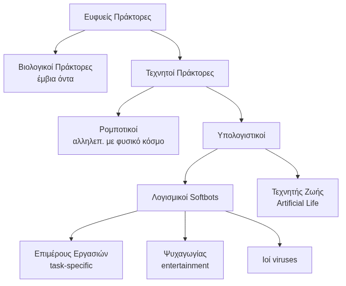

*Η ταξινόμηση διαχωρίζει τους πράκτορες αρχικά με βάση τη "σάρκα" τους (βιολογικοί, ρομποτικοί, υπολογιστικοί) και στη συνέχεια με βάση τον σκοπό τους.*

---

<!-- _class: small -->
# Ιεραρχική Ταξινόμηση Πρακτόρων — Επεξήγηση Κατηγοριών

**Επεξήγηση Βασικών Υπο-Κατηγοριών:**

| Κατηγορία (Softbots) | Κύριο Χαρακτηριστικό | Παράδειγμα |
|---|---|---|
| **Εργασιών** (Task-specific) | Εξειδικευμένοι σε στενό domain. Εκτελούν χρήσιμες λειτουργίες. | Web crawlers, trading bots. |
| **Ψυχαγωγικοί** (Entertainment) | Σχεδιασμένοι για διάδραση και παιχνίδι — προσομοιώνουν προσωπικότητα. | NPCs σε games, companions. |
| **Ιοί** (Viruses / Malware) | Αυτόνομοι, αυτο-αναπαραγόμενοι. Εκτελούν ενέργειες κρυφά. | Computer worms, botnets. |

**Τεχνητή Ζωή (Artificial Life):**
Λογισμικά συστήματα που προσομοιώνουν βιολογικές διεργασίες (αναπαραγωγή, εξέλιξη, θάνατος) για να μελετήσουν τη δυναμική των πληθυσμών. *(Συγγενής με, αλλά διακριτή από τους Softbots).*

> ⚠️ **Το Παράδοξο των Ιών:** Οι ιοί υπολογιστών πληρούν όλα τα κριτήρια της "χαλαρής" νοημοσύνης (αυτονομία, αντιδραστικότητα), αποτελώντας μια από τις πιο επιτυχημένες μορφές αυτόνομων πρακτόρων, παρότι ο σκοπός τους είναι **κακόβουλος**!

---

<!-- _class: xsmall -->
# Ορισμοί Πρακτόρων (1/2)

> **Βασική αρχή** (κοινός παρονομαστής): Ένας πράκτορας **αντιλαμβάνεται** το περιβάλλον (μέσω αισθητήρων λογισμικού ή φυσικών) και **δρα** για να το αλλάξει βάσει στόχων — με ελάχιστη εμπλοκή χρήστη.

<div class="columns">
<div>

**1. Russell & Norvig** *(διάδραση με περιβάλλον)*
> «Πράκτορας είναι οτιδήποτε που αντιλαμβάνεται το περιβάλλον μέσω **αισθητήρων** και αντιδρά μέσω **μηχανισμών δράσης**.»


</div>
<div>

**2. Maes** *(αυτονομία + στόχοι)*
> «Υπολογιστικά συστήματα σε **πολύπλοκο περιβάλλον**, δρουν **αυτόνομα** πετυχαίνοντας **στόχους**.»

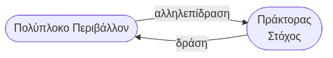

</div>
</div>

---

<!-- _class: xsmall -->
# Ορισμοί Πρακτόρων (2/2)

<div class="columns">
<div>

**3. Hayes-Roth** *(συλλογιστική)*
> «Αντιλαμβάνονται, **δρουν** και **συλλογίζονται** για να ερμηνεύσουν, να λύσουν προβλήματα και να καθορίσουν δράση.»

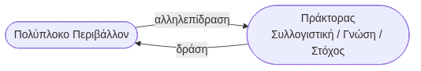

</div>
<div>

**4. Coen** *(επικοινωνία & διαπραγμάτευση)*
> «Προγράμματα που **διενεργούν διάλογο**, διαπραγματεύονται και **συντονίζουν τη ροή πληροφοριών**.»

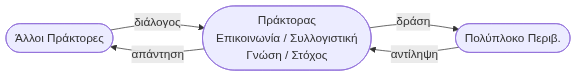

</div>
</div>

---

<!-- _class: xsmall -->
# Σύγκριση Ορισμών: Η Εξέλιξη του Πράκτορα

Καθώς τα συστήματα Τεχνητής Νοημοσύνης εξελίσσονταν, ο ορισμός του πράκτορα εμπλουτιζόταν. Κάθε προσέγγιση προσθέτει νέα χαρακτηριστικά ανάλογα με το επιστημονικό της υπόβαθρο:

| Ορισμός (Συγγραφείς) | Επιστημονικό Πεδίο | Η «Αναβάθμιση» — Τι νέο προσθέτει στον ορισμό; |
|---|---|---|
| **1. Russell & Norvig** | Κλασική ΤΝ | Ορίζει τη βάση: **Αισθητήρες** (για αντίληψη) και **Μηχανισμούς Δράσης** (για επίδραση στο περιβάλλον). |
| **2. Maes** | Κατανεμημένα Συστήματα | Προσθέτει την **Αυτονομία** και τους **Στόχους** μέσα σε ένα πολύπλοκο και δυναμικό περιβάλλον. |
| **3. Hayes-Roth** | Έμπειρα Συστήματα | Προσθέτει τη **Γνώση** και τη **Συλλογιστική** (ο πράκτορας πλέον «σκέφτεται» λογικά πριν δράσει). |
| **4. Coen** | Επικοινωνία Ανθρ.-Μηχανής| Προσθέτει την **Κοινωνικότητα** (επικοινωνία, διάλογο και διαπραγμάτευση με άλλους). |

<div class="columns">
<div>

**Πράκτορας ≠ Απλό Πρόγραμμα**
Ένα απλό πρόγραμμα εκτελεί τυφλά προκαθορισμένες εντολές.
Ένας πράκτορας **επιδιώκει στόχους**, προσαρμόζοντας δυναμικά τη συμπεριφορά του στο περιβάλλον του.

</div>
<div>

$$\text{Περιβάλλον} \underset{\text{μηχανισμοί δράσης}}{\overset{\text{αισθητήρες}}{\rightleftharpoons}} \text{Πράκτορας}$$

</div>
</div>

---

<!-- _class: xsmall -->
# Μοντέλο PEAS — Πλαίσιο Σχεδιασμού Πράκτορα


Το **PEAS** (Russell & Norvig) ορίζει τις τέσσερις διαστάσεις για τον σχεδιασμό ορθολογικού πράκτορα:

| Διάσταση | Ερώτηση | Παράδειγμα: Taxi Agent |
|---|---|---|
| **P**erformance | Πώς αξιολογείται η επιτυχία; | Ασφαλής άφιξη, χρόνος, κόστος |
| **E**nvironment | Ποιος είναι ο «κόσμος» του; | Δρόμοι, πεζοί, αυτοκίνητα |
| **A**ctuators | Πώς επιδρά στο περιβάλλον; | Τιμόνι, φρένο, γκάζι |
| **S**ensors | Πώς αντιλαμβάνεται τον κόσμο; | Κάμερες, GPS, ραντάρ |

> Το PEAS αποτελεί το **πρώτο βήμα** σχεδιασμού — πριν επιλεγεί αρχιτεκτονική.


**Παραδείγματα PEAS:**

| Πράκτορας | Performance | Environment | Actuators | Sensors |
|---|---|---|---|---|
| **Spam filter** | % ταξινόμησης | Email inbox | Spam/inbox φάκελος | Κείμενο, headers |
| **Trading agent** | Κέρδος | Χρηματιστήριο | Εντολές αγοράς/πώλησης | Τιμές, νέα |
| **Ιατρικός** | Ακρίβεια διάγνωσης | Ασθενής, εξετάσεις | Θεραπεία, παραπομπές | Συμπτώματα |


---

<!-- _class: xsmall -->
# 2. Χαρακτηριστικά Πρακτόρων

<div class="columns">
<div>

**Κύρια Χαρακτηριστικά** *(Wooldridge & Jennings)*
Αυτά που **πρέπει** να έχει κάθε πράκτορας:

- **Αυτονομία (Autonomy):** Λειτουργεί χωρίς άμεση ανθρώπινη παρέμβαση, ελέγχει τις δράσεις και την εσωτερική κατάστασή του
- **Κοινωνικότητα (Social ability):** Αλληλεπιδρά με άλλους πράκτορες ή ανθρώπους μέσω γλώσσας επικοινωνίας
- **Αντιδραστικότητα (Reactiveness):** Αντιλαμβάνεται το περιβάλλον και ανταποκρίνεται στις αλλαγές εγκαίρως
- **Προνοητικότητα (Pro-activeness):** Δεν αντιδρά μόνο — αναλαμβάνει πρωτοβουλίες για την επίτευξη στόχων

> Η προνοητικότητα & η αντιδραστικότητα απαιτούν **δυνατότητα συλλογισμού** (reasoning).

</div>
<div>

**Δευτερεύοντα Χαρακτηριστικά**
Δεν εμφανίζονται σε όλες τις κατηγορίες:

- **Κινητικότητα (Mobility):** Δυνατότητα μετακίνησης σε δίκτυο
- **Προσαρμοστικότητα (Adaptivity):** Μαθαίνει από την εμπειρία
- **Ειλικρίνεια (Veracity):** Δεν μεταδίδει εσκεμμένα ψευδείς πληροφορίες
- **Αγαθή προαίρεση (Benevolence):** Επιδιώκει να βοηθήσει τους άλλους
- **Λογικότητα (Rationality):** Επιλέγει τη βέλτιστη δράση βάσει πεποιθήσεων & στόχων

**Άξονες χαρακτηρισμού:**
- **Νοημοσύνη:** κανόνες (αντιδραστικότητα) → σχεδιασμός πλάνων → μάθηση
- **Κινητικότητα:** στατικός → εκτέλεση εξ αποστάσεως → μετανάστευση
- **Συνεργασία:** αλληλεπίδραση με χρήστη → επικοινωνία → διαπραγμάτευση

</div>
</div>

---

<!-- _class: small -->
# Ορθολογικοί Πράκτορες (Rational Agents)

<div class="columns">
<div>

**Τι είναι ορθολογικός πράκτορας;**
Ένας πράκτορας που επιλέγει πάντα τη **βέλτιστη ενέργεια** βάσει των πεποιθήσεών του και των στόχων του.

**Δομή ορθολογικού πράκτορα:**
- **Βάση Γνώσης (Knowledge Base):**
  Σύνολο λογικών τύπων που αναπαριστούν γνώση για τον κόσμο
- **Κανόνες Συμπερασμού (Inference Rules):**
  Μηχανισμός για εξαγωγή νέας γνώσης από υπάρχουσα
- **Μηχανισμός Συμπερασμού (Inference Engine):**
  Εφαρμόζει κανόνες στη βάση γνώσης

**Τυπικά:**
$$KB \vdash \phi \quad \Rightarrow \quad \text{action}(\phi)$$

</div>
<div>

**Παράδειγμα (Ιατρική Διάγνωση):**

```
Βάση γνώσης:
  Πυρετός(x) ∧ Βήχας(x) → Λοίμωξη(x)
  Λοίμωξη(x) → Αντιβιοτικό(x)

Γεγονότα:
  Πυρετός(ασθενής_Α)
  Βήχας(ασθενής_Α)

Συμπέρασμα:
  Αντιβιοτικό(ασθενής_Α)  ✓
```

**Σχέση με άλλες αρχιτεκτονικές:**

| Τύπος | Βάση Γνώσης | Συμπερασμός |
|---|---|---|
| **Ορθολογικός** | ✓ Λογικοί τύποι | ✓ Πλήρης |
| **BDI** | ✓ Beliefs | ✓ Μερικός |
| **Αντιδραστικός** | ✗ | ✗ |

> Οι ορθολογικοί πράκτορες είναι **εκφραστικά ισχυροί** αλλά υπολογιστικά ακριβοί.

</div>
</div>

---

<!-- _class: xsmall -->
# 3. Είδη Περιβαλλόντων Πρακτόρων — Οι 6 Διαστάσεις

Το περιβάλλον καθορίζει τη δυσκολία του προβλήματος και την αρχιτεκτονική του πράκτορα. Ταξινομείται βάσει 6 κριτηρίων (Russell & Norvig):

<div class="columns">
<div>

**1. Παρατηρησιμότητα (Observability)**
- **Πλήρως Παρατηρήσιμο:** Ο πράκτορας βλέπει *όλη* την κατάσταση του κόσμου ανά πάσα στιγμή (π.χ. Σκάκι).
- **Μερικώς Παρατηρήσιμο:** Οι αισθητήρες δίνουν ελλιπή ή θορυβώδη εικόνα (π.χ. Ομίχλη στην οδήγηση, Πόκερ).

**2. Αιτιοκρατία (Determinism)**
- **Αιτιοκρατικό:** Μια ενέργεια έχει 100% προβλέψιμο και σίγουρο αποτέλεσμα (π.χ. Σκάκι).
- **Στοχαστικό:** Το αποτέλεσμα μιας ενέργειας εμπεριέχει τύχη/αβεβαιότητα (π.χ. Ρίψη ζαριού, Οδήγηση).

**3. Επεισοδιακότητα (Episodic vs Sequential)**
- **Επεισοδιακό:** Κάθε ενέργεια είναι ανεξάρτητη. Το παρελθόν δεν επηρεάζει το μέλλον.
- **Ακολουθιακό:** Η σημερινή απόφαση αλλάζει δραστικά τις μελλοντικές επιλογές (π.χ. Σκάκι).

</div>
<div>

**4. Δυναμισμός (Dynamism)**
- **Στατικό:** Ο κόσμος *σταματά* και περιμένει τον πράκτορα να σκεφτεί (π.χ. Σταυρόλεξο).
- **Δυναμικό:** Το περιβάλλον αλλάζει *ενώ* ο πράκτορας σκέφτεται. Απαιτείται ταχύτητα! (π.χ. Οδήγηση).

**5. Συνέχεια (Continuity)**
- **Διακριτό:** Πεπερασμένες, ξεκάθαρες καταστάσεις και ενέργειες (π.χ. Τα 64 τετράγωνα στο σκάκι).
- **Συνεχές:** Άπειρες καταστάσεις και χρόνος (π.χ. Γωνία τιμονιού, ταχύτητα ανέμου).

**6. Πλήθος Πρακτόρων (Agents)**
- **Μονοπρακτορικό:** Ένας μόνο πράκτορας λύνει ένα πρόβλημα (π.χ. Sudoku).
- **Πολυπρακτορικό:** Συνεργασία ή ανταγωνισμός με άλλους (π.χ. Trading).

</div>
</div>

---

<!-- _class: small -->
# Περιβάλλοντα στην Πράξη: Συγκριτικά Παραδείγματα

Η πολυπλοκότητα ενός πράκτορα εξαρτάται από το πόσα «δύσκολα» χαρακτηριστικά έχει το περιβάλλον του. 

| Περιβάλλον | Παρατηρήσιμο | Αιτιοκρατικό | Επεισοδιακό | Δυναμικό | Συνεχές | Πράκτορες |
|---|---|---|---|---|---|---|
| **Σταυρόλεξο** | Πλήρως | Αιτιοκρατικό | Ακολουθιακό | Στατικό | Διακριτό | Ένας |
| **Σκάκι (με χρόνο)**| Πλήρως | Αιτιοκρατικό | Ακολουθιακό | Ημι-Δυναμικό | Διακριτό | Πολλοί |
| **Πόκερ** | Μερικώς | Στοχαστικό | Ακολουθιακό | Στατικό | Διακριτό | Πολλοί |
| **Ταξινόμηση Εικόνων**| Πλήρως | Αιτιοκρατικό | **Επεισοδιακό** | Στατικό | Συνεχές | Ένας |
| **Αυτόνομη Οδήγηση** | Μερικώς | Στοχαστικό | Ακολουθιακό | Δυναμικό | Συνεχές | Πολλοί |

> 💡 **Επεισοδιακό vs Ακολουθιακό (Sequential):** Στην ταξινόμηση εικόνων, η αναγνώριση της 1ης εικόνας (γάτα) δεν επηρεάζει καθόλου την αναγνώριση της 2ης (σκύλος). Κάθε «επεισόδιο» είναι κλειστό και ανεξάρτητο. Αντίθετα, στο Σκάκι (ακολουθιακό), μια κακή κίνηση στην αρχή σε ακολουθεί μέχρι το τέλος της παρτίδας — το παρελθόν επηρεάζει άμεσα το μέλλον!

---

<!-- _class: xxsmall -->
# 4. Αρχιτεκτονικές Πρακτόρων — Επισκόπηση

**Η Τυπική (Μαθηματική) Αναπαράσταση:** Ορίζει τον καθολικό «σκελετό» κάθε πράκτορα, ανεξαρτήτως κώδικα, χρησιμοποιώντας σύνολα και συναρτήσεις:
- **Αντίληψη:** $\text{see}: S \rightarrow P$ (Από την κατάσταση του περιβάλλοντος $S$, ο πράκτορας εξάγει μια αντίληψη $P$)
- **Εσωτερική Κατάσταση (Μνήμη):** Το σύνολο $I$ (όλα όσα θυμάται/γνωρίζει ο πράκτορας)
- **Ενημέρωση:** $\text{update}: I \times P \rightarrow I$ (Συνδυάζει την παλιά μνήμη $I$ με τη νέα αντίληψη $P$ για να ενημερώσει τη μνήμη)
- **Απόφαση:** $\text{action}: I \times P \rightarrow A$ (Επιλέγει την ενέργεια $A$ βάσει μνήμης και αντίληψης)

**Τρεις κύριες γενικές αρχιτεκτονικές:**
Η τυπική αναπαράσταση "κόβεται και ράβεται" (απλοποιείται ή περιπλέκεται) ανάλογα με την αρχιτεκτονική:

| Αρχιτεκτονική | Μνήμη | Πώς εφαρμόζεται η Τυπική Αναπαράσταση | Ιδανική για |
|---|---|---|---|
| **Αντιδραστικοί** (Reactive) | ✗ | **Απουσία του $I$**. Η συνάρτηση $\text{update}$ δεν υπάρχει. Η απόφαση είναι τυφλή αντιστοίχιση $P \rightarrow A$. | Γρήγορη απόκριση, απλά περιβάλλοντα |
| **Με Κατάσταση** | ✓ | Ενεργοποιείται το $I$ και η συνάρτηση $\text{update}$. Η απόφαση βασίζεται στον συνδυασμό $I \times P \rightarrow A$. | Περιβάλλοντα που απαιτούν ιστορικό |
| **BDI** | ✓ | Το $I$ γίνεται τεράστιο (σπάει σε Πεποιθήσεις, Επιθυμίες, Προθέσεις) με πολύπλοκους βρόχους συνεχούς ενημέρωσης. | Πολύπλοκα, δυναμικά περιβάλλοντα |

**Επιπλέον:**
- **Ορθολογικοί:** Βάση γνώσης + κανόνες συμπερασμού - **Που Μαθαίνουν:** Προσαρμόζουν συμπεριφορά μέσω ανατροφοδότησης
- **Υβριδικοί:** Συνδυάζουν αντιδραστικά & BDI επίπεδα - **Κινητοί:** Μετακινούνται στο δίκτυο μεταφέροντας κώδικα & κατάσταση

<!--
Η τυπική (μαθηματική) αναπαράσταση συχνά τρομάζει, αλλά είναι θεμελιώδης: μας δίνει το "blueprint" για να κατανοήσουμε όλες τις αρχιτεκτονικές σε μια γραμμή! 
Αντί να κοιτάμε κώδικα, κοιτάμε 3 συναρτήσεις: Αντίληψη, Ενημέρωση (Μνήμης) και Απόφαση.
Πώς ταιριάζει με τις αρχιτεκτονικές; Πολύ απλά: Στους Αντιδραστικούς πράκτορες, το σύνολο Ι (Μνήμη) είναι κενό. Διαγράφουμε δηλαδή εντελώς τη συνάρτηση update και η απόφαση του πράκτορα γίνεται ένα απλό P -> A (ό,τι βλέπω, κάνω). Στους πράκτορες με κατάσταση, η μνήμη Ι ενεργοποιείται και επηρεάζει την απόφαση. Και στο BDI, η μνήμη Ι γίνεται ένα τεράστιο, πολύπλοκο σύστημα τριών επιπέδων. Τα μαθηματικά, λοιπόν, μας δείχνουν αμέσως πόσο "πλούσιος" είναι ο εσωτερικός κόσμος του πράκτορα!
-->
---

<!-- _class: xxsmall -->
# Αντιδραστικοί Πράκτορες — Εξέλιξη & Παραδείγματα

Η αρχιτεκτονική των αντιδραστικών πρακτόρων εξελίσσεται προσθέτοντας ικανότητες για να αντιμετωπίσουν πιο πολύπλοκα περιβάλλοντα:

**Α) Απλός Αντιδραστικός (Simple Reflex Agent)**
- **Λειτουργία:** Καθαρό ένστικτο (Ερέθισμα $\rightarrow$ Αντίδραση). Δεν έχει μνήμη. Αποφασίζει αποκλειστικά από το τι βλέπει *αυτή ακριβώς τη στιγμή*.
- **Παράδειγμα:** Ένας θερμοστάτης. *(Κανόνας: ΑΝ θερμοκρασία < 20°C, ΤΟΤΕ άναψε καλοριφέρ).*
- **Αδυναμία:** Καταρρέει αν το περιβάλλον δεν είναι πλήρως παρατηρήσιμο.

**Β) Αντιδραστικός με Μοντέλο (Model-Based Reflex Agent)**
- **Τι προσθέτει:** Τη **Μνήμη (Εσωτερική Κατάσταση)**. Κρατάει ένα «μοντέλο» του πώς δουλεύει ο κόσμος για να καταλαβαίνει τι συμβαίνει σε σημεία που δεν βλέπουν οι αισθητήρες του τώρα.
- **Παράδειγμα:** Ένα αυτόνομο όχημα. Αν ένα άλλο όχημα μπει στο «τυφλό του σημείο», το αυτόνομο όχημα *θυμάται* ότι είναι εκεί, παρόλο που η κάμερά του δεν το βλέπει προσωρινά.

**Γ) Αντιδραστικός Βασισμένος σε Στόχο (Goal-Based Agent)**
- **Τι προσθέτει:** Τον **Σκοπό**. Δεν ακολουθεί απλώς στατικούς κανόνες, αλλά ρωτάει: *"Αν κάνω αυτή την κίνηση, θα με πάει πιο κοντά σε αυτό που θέλω να πετύχω;"*.
- **Παράδειγμα:** Το GPS (Navigation). Ξέρει πού βρίσκεσαι (Αντίληψη), θυμάται τον χάρτη (Μοντέλο), αλλά το αν θα στρίψει δεξιά ή αριστερά εξαρτάται αποκλειστικά από τον Προορισμό σου (Στόχος).

**Δ) Πράκτορας Βασισμένος σε Χρησιμότητα (Utility-Based Agent)**
- **Τι προσθέτει:** Την **Αξιολόγηση ποιότητας** μεταξύ εναλλακτικών. Δεν ρωτάει μόνο «θα με πάει στον στόχο;» αλλά «**ποια** επιλογή είναι η βέλτιστη;».
- **Παράδειγμα:** GPS με εναλλακτικές διαδρομές — αξιολογεί **χρόνο**, **απόσταση** και **κόστος** μέσω συνάρτησης χρησιμότητας $U(\text{κατάσταση}) \in [0,1]$.
- **Αδυναμία:** Ο σωστός ορισμός της $U$ είναι δύσκολος σε πολύπλοκα, πολυκριτηριακά περιβάλλοντα.

<!--
Αυτή η διαφάνεια μάς δείχνει πώς περνάμε από το "ένστικτο" στην "ευφυΐα". 
Ο Απλός Αντιδραστικός Πράκτορας είναι ο πιο γρήγορος, αλλά εντελώς άκαμπτος. Αν του κλείσεις τα μάτια, χάνεται. 
Για να λύσουμε το πρόβλημα των "τυφλών σημείων" (μερικώς παρατηρήσιμα περιβάλλοντα), πάμε στον Model-Based. Αυτός θυμάται. Κρατάει μια εικόνα του κόσμου ακόμα κι όταν δεν τον βλέπει. 
Αλλά και πάλι, ο Model-based δεν ξέρει *τι θέλει* να κάνει. Εκεί έρχεται ο Goal-Based. Αυτός είναι ο πρώτος που αρχίζει να σκέφτεται προνοητικά (proactive). Αξιολογεί τις εναλλακτικές του και διαλέγει αυτή που τον φέρνει πιο κοντά στο τέρμα του.
-->

---

<!-- _class: xsmall -->
# 4. Αρχιτεκτονική Υπαγωγής (Subsumption Architecture)

Η **Αρχιτεκτονική Υπαγωγής** (Rodney Brooks, MIT, 1986) είναι μια ριζοσπαστική προσέγγιση στους αντιδραστικούς πράκτορες. Καταργεί το κεντρικό «μυαλό» και χτίζει τη νοημοσύνη αποκεντρωμένα, μέσα από **παράλληλα επίπεδα συμπεριφορών**.

<div class="columns">
<div>

**Πώς Λειτουργεί:**
- Αποτελείται από αυτόνομα κυκλώματα (Αυξημένες Μηχανές Πεπερασμένων Καταστάσεων - AFSM).
- Κάθε επίπεδο (layer) είναι μια **ανεξάρτητη συμπεριφορά** που συνδέει απευθείας τους αισθητήρες με τους κινητήρες (χωρίς κεντρική επεξεργασία).
- Τα κατώτερα επίπεδα ελέγχουν την *επιβίωση* (π.χ. αποφυγή). Τα ανώτερα τους *στόχους* (π.χ. εξερεύνηση).
- **Υπαγωγή (Subsumption):** Τα ανώτερα επίπεδα μπορούν να «καταστείλουν» (inhibit) ή να παρακάμψουν προσωρινά τα κατώτερα, αναλαμβάνοντας τον έλεγχο για να πετύχουν τον στόχο τους.

</div>
<div>

**Παράδειγμα: Ρομπότ Συλλογής Δειγμάτων**
Όλοι οι κανόνες τρέχουν παράλληλα, αλλά εφαρμόζεται ιεραρχία:

> ⚠️ **Σύμβαση αρίθμησης:** Το Επίπεδο **0** έχει την **υψηλότερη** προτεραιότητα (επιβίωση), το Επίπεδο **4** τη **χαμηλότερη** — ο αριθμός δηλώνει πολυπλοκότητα, όχι ιεραρχία.

1. *(Επίπεδο 0)* **Εάν** εμπόδιο → Στρίψε *(Απόλυτη προτεραιότητα επιβίωσης)*
2. *(Επίπεδο 1)* **Εάν** βάση & έχεις δείγμα → Άφησε το δείγμα
3. *(Επίπεδο 2)* **Εάν** έχεις δείγμα → Πήγαινε προς τη βάση
4. *(Επίπεδο 3)* **Εάν** δεις δείγμα → Μάζεψέ το
5. *(Επίπεδο 4)* **Αλλιώς** → Περιπλανήσου τυχαία *(Χαμηλότερη προτεραιότητα)*

**Μειονέκτημα:** Καθώς προσθέτουμε νέα επίπεδα, η αλληλεπίδρασή τους γίνεται χαοτική και είναι δύσκολο να προβλεφθεί τι θα κάνει τελικά το ρομπότ.

</div>
</div>

<!--
Εδώ βλέπουμε μια πραγματικά ριζοσπαστική ιδέα. Ο Rodney Brooks στο MIT είπε το περίφημο: "Οι ελέφαντες δεν παίζουν σκάκι, αλλά είναι εξαιρετικά έξυπνοι στο να επιβιώνουν στον πραγματικό κόσμο". Αντί να φτιάξουμε έναν αργό "εγκέφαλο" που χτίζει πολύπλοκους 3D χάρτες για να περπατήσει ένα ρομπότ, ας του δώσουμε απλά, παράλληλα αντανακλαστικά (όπως τα έντομα).

Πώς δουλεύει η «Υπαγωγή»; Δείτε το παράδειγμα του ρομπότ (όπως οι ρομποτικές σκούπες). Το ρομπότ έχει ένα βασικό ένστικτο: "περιπλανήσου τυχαία" (Επίπεδο 4). Όμως, αν οι κάμερες δουν ένα δείγμα, το Επίπεδο 3 "ξυπνάει", παίρνει το τιμόνι (subsumes) και διακόπτει την περιπλάνηση για να το μαζέψει. Αν όμως εκείνη ακριβώς τη στιγμή το ρομπότ πάει να πέσει σε έναν τοίχο, το Επίπεδο 0 (αποφυγή εμποδίων) παίρνει αμέσως τον έλεγχο από όλους τους άλλους για να το σώσει από τη σύγκρουση! Έτσι χτίζεται πολύπλοκη συμπεριφορά χωρίς καμία κεντρική «σκέψη».
-->

---

<!-- _class: xsmall -->
# Πράκτορας με Εσωτερική Κατάσταση

<div class="columns">
<div>

**Χαρακτηριστικά:**
- Διατηρεί **εσωτερική συμβολική αναπαράσταση** του περιβάλλοντος (μνήμη)
- Χρησιμοποιεί **σύνολο κανόνων** για τον καθορισμό της επόμενης ενέργειας
- Βάση γνώσης: λογικές προτάσεις + κανόνες ενεργειών
- Διενεργεί λογικούς συμπερασμούς & κατάστρωση πλάνων

**Πλεονεκτήματα:**
- Καθορισμένη και απλή σημασιολογία

**Μειονεκτήματα:**
- Δυσκολία εύρεσης ακριβούς συμβολικής περιγραφής
- Αδυναμία αναπαράστασης δυναμικών περιβαλλόντων
- Αδυναμία αναπαράστασης διαδικαστικής γνώσης
- Πιθανή αδυναμία εξαγωγής συμπερασμάτων σε ικανοποιητικό χρόνο

</div>
<div>

**Βασικός πράκτορας με κατάσταση:**
```
Function AgentWithState(environmentstate)
  returns action
Static: variable internalstate, rules
begin
  percept ← see(environmentstate)
  internalstate ← update(internalstate,
                          percept)
  rule ← match(internalstate, rules)
  action ← apply(rule)
  return action
end
```

**Επέκταση: Πράκτορας με Στόχους** *(goal-based)*
```
  rule ← match(goal, internalstate, rules)
```
→ Επιλέγει δράσεις που **πλησιάζουν τον στόχο** (προνοητική συμπεριφορά)

</div>
</div>

---

<!-- _class: xsmall -->
# 5. Το Μοντέλο BDI (Belief-Desire-Intention)

Το **BDI** είναι η πιο δημοφιλής αρχιτεκτονική λογικού συλλογισμού — εμπνέεται από τη φιλοσοφία της ανθρώπινης πρακτικής λογικής (Bratman, 1987).

| Στοιχείο | Περιγραφή | Παράδειγμα (Πράκτορας Trading) |
|---|---|---|
| **Beliefs (Πεποιθήσεις)** | Πληροφορία για τον κόσμο — μπορεί να είναι ελλιπής ή λανθασμένη | «Η τιμή της μετοχής Χ είναι 50€» |
| **Desires (Επιθυμίες)** | Καταστάσεις που θέλει να επιτύχει — μπορεί να αντικρούονται | «Θέλω να μεγιστοποιήσω το κέρδος» |
| **Goals (Στόχοι)** | Επιθυμίες χωρίς εσωτερικές αντιφάσεις | «Αγοράζω όταν η τιμή πέσει κάτω από 45€» |
| **Intentions (Προθέσεις)** | Επιθυμίες που έχει **δεσμευτεί** να υλοποιήσει | «Θα πουλήσω 100 μετοχές τώρα» |
| **Plans (Πλάνα)** | Σχέδια δράσης για επίτευξη προθέσεων | Βήματα εκτέλεσης εντολής |

**Κύκλος BDI:**
1. Αισθητήρες → Αναθεώρηση **Beliefs**
2. Δημιουργία επιλογών → **Desires**
3. Φιλτράρισμα (deliberation) → **Intentions**
4. Επιλογή ενέργειας → Μηχανισμοί δράσης

---

<!-- _class: xsmall -->
# Αρχιτεκτονική BDI — Λεπτομέρειες & Τυπικός Ορισμός

<div class="columns">
<div>

**Τυπικός ορισμός:**
- $B$: σύνολο πεποιθήσεων, $D$: επιθυμίες, $I$: προθέσεις
- Αναθεώρηση πεποιθήσεων: $\text{Pow}(B) \times P \rightarrow \text{Pow}(B)$
- Παραγωγή επιλογών: $\text{Pow}(B) \times \text{Pow}(I) \rightarrow \text{Pow}(D)$
- Φιλτράρισμα: $\text{Pow}(B) \times \text{Pow}(D) \times \text{Pow}(I) \rightarrow \text{Pow}(I)$
- Επιλογή ενέργειας: $\text{Pow}(I) \rightarrow A$

**Ρόλος Προθέσεων:**
Ο πράκτορας **εμμένει** στις προθέσεις του μέχρι:
- Να **επιτευχθεί** η πρόθεση
- Να κριθεί **αδύνατη** η επίτευξη
- Να **χαθεί** το αρχικό κίνητρο

→ Η συχνότητα επανεξέτασης επηρεάζει σημαντικά την **απόδοση**.

</div>
<div>

**Τολμηροί vs Προσεκτικοί Πράκτορες:**

| Τύπος | Επανεξέταση | Κατάλληλος για |
|---|---|---|
| **Τολμηρός** (bold) | Σπάνια | Σταθερά περιβάλλοντα |
| **Προσεκτικός** (cautious) | Συχνά | Ταχέως μεταβαλλόμενα |

**Πλεονεκτήματα BDI:**
- Διαισθητικά αποδεκτή αρχιτεκτονική
- Ξεκάθαρη αντιστοίχηση σε λειτουργικά μέρη (functional decomposition)
- Φυσική αναπαράσταση ανθρώπινης πρακτικής λογικής

**Παράδειγμα εφαρμογής:**
Σε DSS εφοδιαστικής αλυσίδας: *Beliefs* = τρέχον απόθεμα, *Desires* = αποφυγή αναλώσεων, *Intentions* = παραγγελία 500 τεμαχίων αύριο.

</div>
</div>

---

<!-- _class: xxsmall -->
# Παράδειγμα BDI: Πράκτορας Βιντεοπαιχνιδιού

**Σενάριο:** Πράκτορας-παίκτης κυνηγά εξωγήινο σε βιντεοπαιχνίδι.

<div class="columns">
<div>

**Χρόνος t = 0:**

| Στοιχείο BDI | Τιμή |
|---|---|
| **Desire** | Εξολόθρευση εξωγήινου |
| **Belief** | Εξωγήινος βρίσκεται στο σημείο P |
| **Intention** | Μετάβαση στο σημείο P |
| **Plan** | Κινήσου Βορά → Ανατολά → P |

→ Πράκτορας ξεκινά εκτέλεση πλάνου

**Χρόνος t = 1:**

| Στοιχείο BDI | Τιμή |
|---|---|
| **Desire** | Εξολόθρευση εξωγήινου (αμετάβλητη) |
| **New Belief** | Εξωγήινος **δεν** βρίσκεται στο P! |
| **Reconsider?** | ΝΑΙ — η πρόθεση δεν ισχύει πλέον |
| **New Intention** | Αναζήτηση εξωγήινου στον χάρτη |

</div>
<div>

**Ροή επανεξέτασης:**

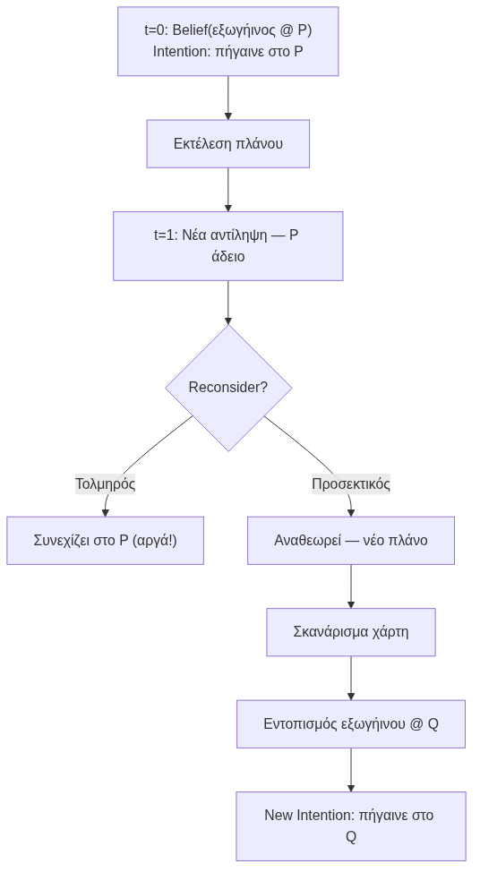

**Βασική αρχή:**
> Η **αναθεώρηση πεποιθήσεων** είναι κρίσιμη: αν οι beliefs αποδειχθούν λανθασμένες, ο πράκτορας πρέπει να αναθεωρήσει τις intentions — αλλιώς σπαταλά πόρους για μη-επιτεύξιμο στόχο.

</div>
</div>

---

<!-- _class: xsmall -->
# Πράκτορες που Μαθαίνουν — Αρχιτεκτονική

<div class="columns">
<div>

**Βασική Ιδέα:**
Ο πράκτορας **βελτιώνει** την απόδοσή του μέσω εμπειρίας, χρησιμοποιώντας μηχανισμούς μηχανικής μάθησης.

**Δομικά στοιχεία:**

| Στοιχείο | Ρόλος |
|---|---|
| **Performance Element** | Το «κύριο» μέρος του πράκτορα — επιλέγει ενέργειες |
| **Critic (Κριτής)** | Αξιολογεί την απόδοση βάσει προτύπου |
| **Learning Element** | ML μηχανισμός — τροποποιεί το performance element |
| **Problem Generator** | Προτείνει εξερευνητικές ενέργειες για νέες εμπειρίες |

**Ανατροφοδότηση (Feedback):**
- **Άμεση (Direct):** Κριτήριο απόδοσης εφαρμόζεται αμέσως
- **Έμμεση (Indirect):** Ανταμοιβή μετά από ακολουθία ενεργειών → Reinforcement Learning

</div>
<div>

**Κύκλος Μάθησης:**

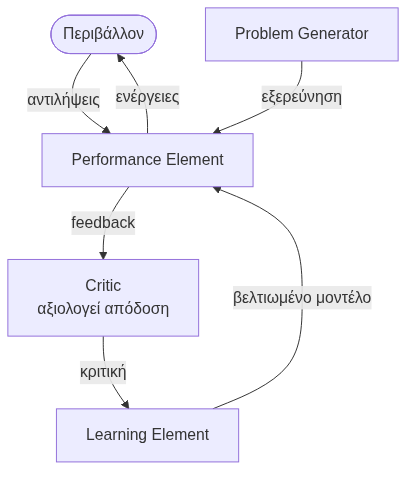

> **Κλειδί:** Ο Learning Element τροποποιεί διαρκώς το Performance Element βάσει ανατροφοδότησης από τον Critic, ενώ ο Problem Generator εξασφαλίζει εξερεύνηση νέων καταστάσεων.

</div>
</div>

---

<!-- _class: small -->
# Μηχανική Μάθηση Ενισχυτική (Reinforcement Learning)

<div class="columns">
<div>

**Η Βασική Ιδέα (Δοκιμή & Λάθος):**
Σε αντίθεση με την Κλασική Μηχανική Μάθηση, δεν δίνουμε στον πράκτορα "σωστά παραδείγματα". Τον αφήνουμε να αλληλεπιδράσει με το περιβάλλον και τον **βαθμολογούμε**:
- 🟢 **Ανταμοιβή (Reward, $r > 0$):** «Καλή κίνηση!» → Ενίσχυση συμπεριφοράς.
- 🔴 **Ποινή (Penalty, $r < 0$):** «Κακή κίνηση!» → Αποθάρρυνση συμπεριφοράς.

**Το Δίλημμα Exploration vs. Exploitation:**
- **Εκμετάλλευση (Exploit):** Επιλέγω την ενέργεια που *ήδη ξέρω* ότι δίνει την υψηλότερη ανταμοιβή.
- **Εξερεύνηση (Explore):** Επιλέγω μια *άγνωστη* ενέργεια, ελπίζοντας να ανακαλύψω μια ακόμα καλύτερη στρατηγική!

</div>
<div>

**Εφαρμογές Πρακτόρων RL:**
- 🤖 **Ρομποτική & Αυτόνομη Οδήγηση:** Το όχημα μαθαίνει να μένει στη λωρίδα του (reward) και να αποφεύγει συγκρούσεις (penalty).
- ♟️ **Game AI (π.χ. AlphaGo):** Το πρόγραμμα παίζει εκατομμύρια παρτίδες εναντίον του εαυτού του (self-play) μαθαίνοντας στρατηγικές.
- 📈 **Trading Agents:** Ο πράκτορας αγοράζει/πουλάει μετοχές, μαθαίνοντας να μεγιστοποιεί το κέρδος χαρτοφυλακίου.
- 🛒 **Δυναμική Τιμολόγηση:** Αναπροσαρμογή τιμών σε e-shop.

> 💡 **Αναλογία:** Το RL είναι ο τρόπος που εκπαιδεύουμε έναν σκύλο: του δίνουμε λιχουδιά όταν κάθεται (reward) και τον μαλώνουμε όταν κάνει ζημιά (penalty).

</div>
</div>

<!--
Η Ενισχυτική Μάθηση (RL) είναι ο πιο φυσικός τρόπος μάθησης. Είναι ακριβώς όπως εκπαιδεύουμε ένα κατοικίδιο ή όπως μαθαίνει ένα μωρό να περπατάει. Κάνει μια δοκιμή, πέφτει (αρνητική ανταμοιβή/πόνος), προσαρμόζει την κίνησή του.

Εδώ πρέπει να σταθούμε στο Δίλημμα Exploration vs. Exploitation. Φανταστείτε ότι θέλετε να πάτε για φαγητό. "Exploitation" (Εκμετάλλευση) σημαίνει να πάτε στο αγαπημένο σας εστιατόριο: ξέρετε ότι θα φάτε καλά (σίγουρη ανταμοιβή). "Exploration" (Εξερεύνηση) σημαίνει να δοκιμάσετε ένα ολοκαίνουργιο μαγαζί. Μπορεί να είναι χάλια (ποινή), αλλά μπορεί να ανακαλύψετε το νέο σας αγαπημένο στέκι! Ένας καλός πράκτορας (όπως και ένας άνθρωπος) πρέπει να ισορροπεί ανάμεσα στα δύο: αν μόνο εξερευνά, χάνει ενέργεια. Αν μόνο εκμεταλλεύεται όσα ξέρει, δεν βελτιώνεται ποτέ.
-->
---

<!-- _class: small -->
# Υβριδικοί & Κινητοί Πράκτορες

<div class="columns">
<div>

**Γ) Υβριδικοί Πράκτορες (Hybrid)**
Συνδυάζουν τα καλύτερα δύο κόσμων: την ταχύτητα των **Αντιδραστικών** (ένστικτο) και τη νοημοσύνη των **BDI** (λογική/σχεδιασμός).

**Πώς δομούνται (Επίπεδα / Layers):**
- **Οριζόντια Αρχιτεκτονική:** Όλα τα επίπεδα βλέπουν αισθητήρες/κινητήρες. Ένα σύστημα ελέγχου αποφασίζει ποιο επίπεδο θα αναλάβει δράση κάθε στιγμή. *(π.χ. TouringMachines)*
- **Κάθετη Αρχιτεκτονική:** Οι πληροφορίες περνούν ιεραρχικά από το ένα επίπεδο στο άλλο (bottom-up / top-down). Έχει λιγότερο "χάος" συγκρούσεων, αλλά κινδυνεύει από καθυστερήσεις (bottleneck). *(π.χ. InteRRaP)*

</div>
<div>

**Δ) Κινητοί Πράκτορες (Mobile Agents)**
Ένα πρόγραμμα που **αναστέλλει** την εκτέλεσή του σε έναν υπολογιστή, ταξιδεύει μέσω δικτύου σε έναν άλλον, και **συνεχίζει** ακριβώς από εκεί που σταμάτησε!
*(Μεταφέρει: τον κώδικά του, τα δεδομένα του και το πού ακριβώς βρισκόταν η εκτέλεση - program counter).*

**Γιατί να "ταξιδέψει"; (Τοπική Επεξεργασία)**
Αντί να κατεβάσει 1 Terabyte δεδομένων από έναν server (τεράστιο κόστος & καθυστέρηση δικτύου), ο πράκτορας πάει **στον server που έχει τα δεδομένα**, τα επεξεργάζεται *τοπικά* και επιστρέφει πίσω μόνο το αποτέλεσμα (π.χ. 1 Kilobyte).

**Προκλήσεις Ασφαλείας:** 
- Πώς ξέρει ο host server ότι ο πράκτορας δεν είναι κακόβουλος ιός; 
- Πώς ξέρει ο πράκτορας ότι ο host δεν θα του "κλέψει" τα δεδομένα;
*(Κλασικές υλοποιήσεις: Java Aglets, TELESCRIPT)*

</div>
</div>

<!--
Οι Υβριδικοί πράκτορες λύνουν το πρόβλημα του "ή γρήγορος ή έξυπνος". Έχουν ένα υποσύστημα που αντιδρά ακαριαία (π.χ. το αυτόνομο όχημα πατάει φρένο αν δει εμπόδιο) και ένα που σκέφτεται μακροπρόθεσμα (π.χ. υπολογίζει την καλύτερη διαδρομή στο GPS).

Οι Κινητοί πράκτορες είναι μια φανταστική, αλλά παρεξηγημένη έννοια. Δεν στέλνουμε απλά ένα αρχείο (όπως κάνουμε με το FTP) ούτε κάνουμε remote execution. Ο πράκτορας κυριολεκτικά "παγώνει", πακετάρει όλη τη μνήμη του και τον εαυτό του, μεταφέρεται σε έναν άλλον υπολογιστή και συνεχίζει να τρέχει!
Το μεγάλο όφελος είναι η εξοικονόμηση δικτύου: αντί να φέρουμε τα δεδομένα στον υπολογισμό, στέλνουμε τον υπολογισμό στα δεδομένα. Βέβαια, το να αφήνεις ξένα προγράμματα να τρέχουν αυθαίρετα στον server σου δημιουργεί τεράστια θέματα ασφαλείας, γι' αυτό και ιστορικά τέτοια συστήματα περιορίστηκαν σε κλειστά, ελεγχόμενα εταιρικά δίκτυα.
-->

---

<!-- _class: xxsmall -->
# 6. Πολυπρακτορικά Συστήματα (Multi-Agent Systems - MAS)

Όταν πολλά συστήματα πρακτόρων συνυπάρχουν, επικοινωνούν και αλληλεπιδρούν στο ίδιο περιβάλλον, έχουμε ένα **Πολυπρακτορικό Σύστημα (MAS)**.

<div class="columns">
<div>

**Βασικά χαρακτηριστικά MAS:**
- Κάθε πράκτορας έχει **ελλιπή πληροφορία** — δεν υπάρχει παντογνώστης
- **Δεν υπάρχει κεντρικός έλεγχος** — αποκεντρωμένη λήψη αποφάσεων
- Υπολογισμοί γίνονται **ασύγχρονα**
- Κάθε πράκτορας έχει **αυτόνομες δυνατότητες** επίλυσης προβλήματος

**Γιατί να χρησιμοποιήσουμε MAS;**
- **Αποκέντρωση:** Δεδομένα και έλεγχος κατανεμημένα (ιδανικό για IoT, supply chain)
- **Ανθεκτικότητα:** Αν ένας πράκτορας αποτύχει, οι υπόλοιποι συνεχίζουν
- **Επεκτασιμότητα:** Εύκολη προσθήκη νέων πρακτόρων
- **Εξειδίκευση:** Κάθε πράκτορας = «ειδικός» σε υπο-πρόβλημα

</div>
<div>

**Προκλήσεις στα MAS:**
- Πώς συντονίζουμε αυτόνομες οντότητες και αποφεύγουμε τα deadlocks;
- Πώς σχεδιάζουμε το σύστημα ώστε να έχει θετική **Αναδυόμενη Συμπεριφορά (Emergent Behavior)**;
- **Εμπιστοσύνη & Φήμη (Trust & Reputation):** Πώς ξέρει ένας πράκτορας ότι μπορεί να εμπιστευτεί πληροφορίες από έναν άγνωστο πράκτορα;

> 💡 **Σύνδεση με Ενότητα 8:** Τα μοντέλα "Νοημοσύνης Σμήνους" (Ant Colony, Particle Swarm) είναι ακριβώς μορφές Πολυπρακτορικών Συστημάτων, όπου απλοί πράκτορες, χωρίς κεντρικό έλεγχο, λύνουν περίπλοκα προβλήματα βελτιστοποίησης!

**Πρωτόκολλα αλληλεπίδρασης:**
- **Συνεργασία:** Κοινοί στόχοι — μοιρασμός πληροφοριών & πόρων
- **Ανταγωνισμός:** Μεγιστοποίηση ατομικού οφέλους (δημοπρασίες)
- **Διαπραγμάτευση:** Αμοιβαία αποδεκτή συμφωνία

> **Σύνδεση με DSS:** Σε Supply Chain DSS, MAS με πράκτορες Αποθήκης, Μεταφοράς & Πωλήσεων — κάθε ένας βελτιστοποιεί το τμήμα του αλλά πρέπει να αλληλεπιδρά.

</div>
</div>

---

<!-- _class: xsmall -->
# Μοντέλα Διασύνδεσης MAS

<div class="columns">
<div>

**Α) Σύστημα Μαυροπίνακα (Blackboard System)**

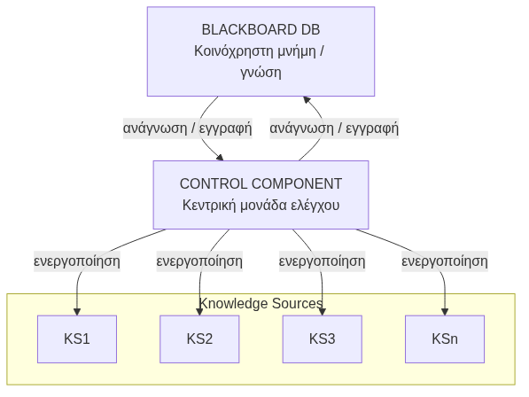

**Χαρακτηριστικά:**
- Κεντρική κοινόχρηστη βάση δεδομένων (Blackboard DB)
- Πηγές γνώσης (KS) γράφουν/διαβάζουν από τον μαυροπίνακα
- Control component επιλέγει ποια KS ενεργοποιείται
- Κατάλληλο για: ιατρική διάγνωση, αναγνώριση φωνής (HEARSAY)

</div>
<div>

**Β) Σύστημα Ανταλλαγής Μηνυμάτων (Message Passing)**

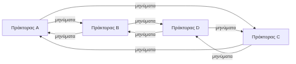

**Χαρακτηριστικά:**
- **Χωρίς** κεντρικό έλεγχο
- Επικοινωνία μέσω μηνυμάτων υψηλού επιπέδου
- Ευέλικτο, κλιμακωτό, αποκεντρωμένο

**Σύγκριση:**

| | Blackboard | Message Passing |
|---|---|---|
| Κεντρ. Έλεγχος | ✓ | ✗ |
| Κοινή μνήμη | ✓ | ✗ |
| Ευελιξία | Μεσαία | Υψηλή |
| Κλιμακωσιμότητα | Περιορισμένη | Υψηλή |

</div>
</div>

---

<!-- _class: xsmall -->
# Επικοινωνία Πρακτόρων

<div class="columns">
<div>

**Βασικές διαστάσεις επικοινωνίας:**

| Διάσταση | Τύπος | Χαρακτηριστικό |
|---|---|---|
| **Χρονισμός** | Σύγχρονη | Αποστολέας αναμένει απάντηση |
| | Ασύγχρονη | Αποστολέας συνεχίζει εκτέλεση |
| **Πληθικότητα** | 1:1 (Unicast) | Ένας σε έναν |
| | 1:N (Multicast) | Ένας σε πολλούς |
| | N:N (Broadcast) | Πολλοί σε πολλούς |

</div>
<div>

**Γλώσσες Επικοινωνίας:**

**KQML** (Knowledge Query & Manipulation Language):
```
(ask-one
  :sender  Agent_A
  :receiver Agent_B
  :content  (price IBM ?x)
  :reply-with  q1)
```

</div>
</div>

---

<!-- _class: xsmall -->
# Επικοινωνία Πρακτόρων *(συνέχεια)*

<div class="columns">
<div>

**FIPA ACL** (Agent Communication Language):
```xml
(inform
  :sender Agent_A
  :receiver Agent_B
  :content "price(IBM, 150)"
  :language SL
  :ontology StockMarket)
```

</div>
<div>

**Πρωτόκολλα Αλληλεπίδρασης FIPA:**

| Πράξη | Περιγραφή |
|---|---|
| **Propose** | Υποβολή πρότασης |
| **Accept-proposal** | Αποδοχή |
| **Reject-proposal** | Απόρριψη |
| **Withdraw** | Ανάκληση πρότασης |
| **Counter-proposal** | Αντιπρόταση |

> Τα πρωτόκολλα FIPA ACL αποτελούν το **διεθνές πρότυπο** για επικοινωνία πρακτόρων σε εμπορικές εφαρμογές.

</div>
</div>

---

<!-- _class: xsmall -->
# 7. Αλληλεπίδραση: Συνεργασία, Ανταγωνισμός & Διαπραγμάτευση

Σε ένα MAS, οι πράκτορες αναπτύσσουν περίπλοκες κοινωνικές συμπεριφορές για να πετύχουν τους στόχους τους.

<div class="columns">
<div>

**1. Συνεργασία (Cooperation / Coordination)**
Οι πράκτορες έχουν **κοινό στόχο** — μοιράζονται πληροφορίες & πόρους για να λύσουν πρόβλημα που κανείς δεν μπορεί μόνος (Distributed Problem Solving).

**2. Ανταγωνισμός (Competition)**
Μεγιστοποίηση ατομικού οφέλους (Self-interested agents) σε παιγνία μηδενικού αθροίσματος, διεκδικώντας περιορισμένους πόρους.
*Παράδειγμα: Πράκτορες δημοπρασιών (Auction agents).*

</div>
<div>

**3. Διαπραγμάτευση (Negotiation)**
Οι πράκτορες καταλήγουν σε **αμοιβαία αποδεκτή συμφωνία**. Περιλαμβάνει:
- **Πρωτόκολλα:** Κανόνες συνομιλίας (π.χ. Εναλλασσόμενες προσφορές, Δημοπρασίες)
- **Στρατηγικές:** Πώς αποφασίζει ο πράκτορας τι θα προσφέρει (Time-dependent, Concession)
- **Συμφωνίες:** Αποτέλεσμα που ικανοποιεί ελάχιστο όφελος (Reservation value)

</div>
</div>

---

<!-- _class: xsmall -->
# Διαπραγμάτευση — Παράδειγμα Concession Strategy

**Εναλλασσόμενες Προσφορές:** Οι πράκτορες κάνουν διαδοχικές υποχωρήσεις (concessions) καθώς πλησιάζει το deadline.

```
Α → Β: «Αγοράζω σε 100€»              (Αρχική προσφορά)
Β → Α: «Πουλώ σε 140€»               (Αντιπροσφορά)
Α → Β: «Αγοράζω σε 115€»             (Concession: deadline πλησιάζει)
Β → Α: «Πουλώ σε 120€»              (Concession: ελάχιστο Reservation value)
→ Συμφωνία: 117,50€ (midpoint)
```

| Έννοια | Επεξήγηση |
|---|---|
| **Reservation Value** | Η ελάχιστη/μέγιστη τιμή κάτω/πάνω από την οποία ο πράκτορας δεν συμφωνεί |
| **Concession** | Εκούσια υποχώρηση από την αρχική θέση για να κλείσει συμφωνία |
| **ZOPA** | Zone Of Possible Agreement — το εύρος τιμών αποδεκτό και από τους δύο |

---

<!-- _class: xxsmall -->
# Contract Net Protocol — Πρωτόκολλο Κατανομής Εργασιών

Το **CNP** (Smith, 1980) είναι το κλασικό πρωτόκολλο **συνεργατικής κατανομής εργασιών** σε MAS — εμπνέεται από επιχειρηματικές διαδικασίες ανάθεσης έργων.

<div class="columns">
<div>

**Ρόλοι:**
- **Manager:** Έχει εργασία T που αναθέτει εξωτερικά
- **Contractor:** Έχει ικανότητα εκτέλεσης

**Βήματα πρωτοκόλλου:**

```
1. ANNOUNCEMENT  Manager → broadcast:
                 «Εργασία T, απαιτήσεις, deadline»
2. BIDDING       Contractor → «Εκτελώ με κόστος C»
                 (μόνο αν έχει τις ικανότητες)
3. AWARDING      Manager → Best Contractor: ανάθεση
4. REPORT        Contractor εκτελεί → αποτέλεσμα
```

> **Παράδειγμα:** Πράκτορας Παραγγελίας εκδίδει CNP → Πράκτορες Μεταφοράς υποβάλλουν προσφορές → ανάθεση βάσει κόστους & διαθεσιμότητας.

</div>
<div>

**Διάγραμμα ροής:**

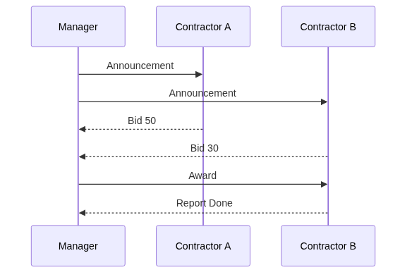

**Χαρακτηριστικά CNP:**

| Ιδιότητα | Τιμή |
|---|---|
| Αποκέντρωση | Υψηλή — χωρίς κεντρ. έλεγχο |
| Ευελιξία | Δυναμική ανάθεση βάσει ικανοτήτων |
| Δικτυακό κόστος | Μεσαίο (broadcasting) |
| Εφαρμογές | Supply chain, grid computing, robotics |


</div>
</div>

---

<!-- _class: xsmall -->
# 7 (β). Εφαρμογές Πρακτόρων

<div class="columns">
<div>

**Πράκτορες Διεπαφής (Interface Agents)**
- Βοηθούν χρήστες σε εκτέλεση εργασιών
- Μαθαίνουν προτιμήσεις χρήστη
- *Παράδειγμα: Calendar Agent* — διαχείριση ημερολογίου, ανίχνευση συγκρούσεων, πρόταση βέλτιστης ώρας συνάντησης

**Πράκτορες Ελέγχου Εναέριας Κυκλοφορίας (ATC)**
- Παρακολούθηση εκατοντάδων πτήσεων ταυτόχρονα
- Ανίχνευση πιθανών συγκρούσεων
- Αυτόματη πρόταση εναλλακτικών διαδρομών
- Συντονισμός με άλλους ATC πράκτορες

**Αγοραστικοί Πράκτορες (Buyer / Shopping Bots)**
- Αναζήτηση τιμών σε πολλά καταστήματα
- Σύγκριση ποιότητας & τιμής
- Εκτέλεση αγοράς αυτόματα (όταν εντοπιστεί βέλτιστη τιμή)
- *Παράδειγμα: Amazon price tracker, flight fare bots*

</div>
<div>

**Προσωπικοί/Χρήστη Πράκτορες (User/Personal Agents)**
- Φιλτράρισμα email, προγραμματισμός ταξιδιών
- Εξατομικευμένες προτάσεις περιεχομένου
- *Παράδειγμα: Siri, Google Assistant*

**Πράκτορες Παρακολούθησης (Monitoring/Predictive Agents)**
- Παρακολούθηση συστημάτων σε πραγματικό χρόνο
- Ανίχνευση ανωμαλιών & προγνωστική συντήρηση
- *Παράδειγμα: Network monitoring, predictive maintenance σε βιομηχανία*

**Πράκτορες Εξόρυξης Δεδομένων (Data-Mining Agents)**
- Αυτόματη αναζήτηση patterns σε μεγάλες βάσεις
- Συνδυασμός πολλαπλών πηγών δεδομένων
- Συνεχής (online) μάθηση από νέα δεδομένα
- *Παράδειγμα: Fraud detection, recommendation engines*

</div>
</div>

---

<!-- _class: xxsmall -->
# Case Study: Γνωστά Πολυπρακτορικά Συστήματα στη Βιομηχανία

<div class="columns">
<div>

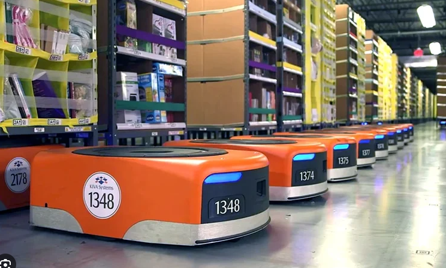
**1. Amazon Robotics (Kiva Systems)**
*Πεδίο: Logistics & Αυτοματοποίηση Αποθήκης*

Χιλιάδες αυτόνομα ρομπότ (AGVs) κινούνται στον ίδιο χώρο για να φέρουν τα ράφια στους εργαζομένους.

- **Αρχιτεκτονική (Υβριδικό MAS):** Ένας κεντρικός *Orchestrator* αναθέτει τους συνολικούς στόχους (π.χ. "Φέρε το ράφι Α"). Ωστόσο, κάθε ρομπότ λειτουργεί ως αυτόνομος πράκτορας, χρησιμοποιώντας **Αντιδραστικούς (Reactive)** μηχανισμούς για πλοήγηση και αποφυγή συγκρούσεων σε πραγματικό χρόνο.
- **Συντονισμός:** Τα ρομπότ επικοινωνούν τοπικά στις διασταυρώσεις για να διαπραγματευτούν προτεραιότητες, χωρίς να περιμένουν έγκριση από τον κεντρικό server (αποφυγή latency).
- **Αξία:** Αν ένα ρομπότ χαλάσει, ο στόχος του "επαναδημοπρατείται" δυναμικά σε άλλο ρομπότ.

</div>
<div>

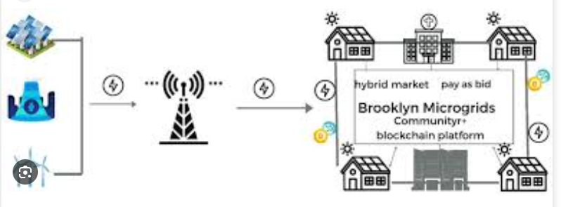

**2. Smart Grids (Έξυπνα Ενεργειακά Δίκτυα)**
*Πεδίο: Διαχείριση Ενέργειας & Κατανεμημένος Έλεγχος*

Δίκτυα όπου "prosumers" (παραγωγοί-καταναλωτές με φωτοβολταϊκά) ανταλλάσσουν ρεύμα δυναμικά.

- **Αρχιτεκτονική (BDI & Message Passing):** Κάθε σπίτι ελέγχεται από έναν Software Agent (συχνά αρχιτεκτονικής BDI). *Beliefs* = επίπεδο μπαταρίας/καιρός, *Desires* = μείωση κόστους, *Intentions* = αγορά ρεύματος στα επόμενα 10 λεπτά.
- **Συντονισμός:** Χρησιμοποιούν **Πρωτόκολλα Διαπραγμάτευσης** (όπως το Contract Net). Ο πράκτορας-παραγωγός ανακοινώνει πλεόνασμα ενέργειας, και οι πράκτορες-καταναλωτές υποβάλλουν προσφορές (bidding).
- **Αξία:** Αποκεντρωμένη εξισορρόπηση φορτίου και αποτροπή blackouts, χωρίς την ανάγκη ενός βαριού, ευάλωτου κεντρικού συστήματος.

</div>
</div>

<!--
Πώς υλοποιούνται αυτές οι λύσεις; Η Τεχνική Delphi είναι ένα κλασικό παράδειγμα: Στέλνουμε ανώνυμα ερωτηματολόγια στους ειδικούς, τα συγκεντρώνουμε, τους δείχνουμε τον μέσο όρο και τους ζητάμε να ξαναψηφίσουν. Επειδή δεν βλέπονται, δεν επηρεάζονται από την 'αυθεντία' του διπλανού τους.

Τα μεγάλα όπλα του GDSS είναι η Ανωνυμία και η Παράλληλη Επικοινωνία. Σε ένα τραπέζι, αν μιλάνε όλοι μαζί γίνεται χάος. Σε ένα GDSS (όπως το Miro ή εξειδικευμένα voting tools), όλοι γράφουν ιδέες ταυτόχρονα. Παράγονται 10 φορές περισσότερες ιδέες στον ίδιο χρόνο, και το σύστημα κρατάει πλήρες αρχείο (Group Memory) για το πώς καταλήξαμε στην τελική απόφαση.
-->

<!--
Για να καταλάβουμε πώς η θεωρία των MAS γίνεται πράξη, ας δούμε δύο διάσημα παραδείγματα.
Στις αποθήκες της Amazon, δεν υπάρχει ένας "υπερ-υπολογιστής" που να ελέγχει 10.000 ρομπότ σαν μαριονέτες λεπτό προς λεπτό — το σύστημα θα κατέρρεε από την καθυστέρηση (latency). Έχουμε ένα Υβριδικό MAS! Το σύστημα αναθέτει στόχους, αλλά τα ρομπότ έχουν αυτόνομη τοπική συμπεριφορά. Στις διασταυρώσεις, τα ρομπότ επικοινωνούν μεταξύ τους σαν "έξυπνοι οδηγοί" και λύνουν τη σύγκρουση τοπικά.

Το δεύτερο παράδειγμα είναι τα Smart Grids. Ένα από τα πιο διάσημα πραγματικά έργα είναι το **PowerMatcher** στην Ολλανδία ή το **Brooklyn Microgrid** στη Νέα Υόρκη. Εκεί, το κάθε σπίτι έχει έναν δικό του Software Agent. Όταν ο ήλιος λάμπει και η μπαταρία σας γεμίζει, ο πράκτορας σας "συνομιλεί" με τον πράκτορα του γείτονα. Χρησιμοποιώντας πρωτόκολλα διαπραγμάτευσης, του πουλάει το πλεόνασμα ρεύματος αυτόματα, εντελώς αποκεντρωμένα, χωρίς να μεσολαβεί η κεντρική εταιρεία ενέργειας (Peer-to-Peer Trading). Αυτή είναι η δύναμη των Πολυπρακτορικών Συστημάτων!
-->

---

<!-- _class: xsmall -->
# 8. Group DSS (GDSS) — Εισαγωγή & Επίπεδα

Τα **GDSS (Group Decision Support Systems)** είναι διαδραστικά συστήματα που διευκολύνουν την επίλυση μη-δομημένων προβλημάτων από ομάδες ληπτών απόφασης. Στόχος τους είναι να εξαλείψουν την αναποτελεσματικότητα των παραδοσιακών συναντήσεων.


**Γιατί χρειαζόμαστε τα GDSS;**
- **Φαινόμενο "Groupthink":** Η ομάδα συμφωνεί πρόωρα για να αποφύγει τις συγκρούσεις, αγνοώντας καλύτερες εναλλακτικές.
- **Κυριαρχία Ισχυρών:** Άτομα με δυνατή φωνή ή ιεραρχική ισχύ επιβάλλουν την άποψή τους.
- **Φόβος Κριτικής:** Χαμηλόβαθμα στελέχη διστάζουν να εκφέρουν αντίθετη γνώμη από φόβο.
- **Χάος & Χρόνος:** Αναποτελεσματικές συζητήσεις χωρίς σαφές αποτέλεσμα ή ατζέντα.


**Επίπεδα Παρέμβασης GDSS (DeSanctis & Gallupe):**

| Επίπεδο | Εστίαση | Τι προσφέρει | Παράδειγμα |
|---|---|---|---|
| **Level 1** | **Επικοινωνία** | Αίρει τα φυσικά/κοινωνικά εμπόδια, προσφέρει **ανωνυμία** και παράλληλη υποβολή ιδεών. | Mentimeter, Κοινόχρηστα Whiteboards |
| **Level 2** | **Ανάλυση / Μοντέλα** | Παρέχει μαθηματικά εργαλεία για αντικειμενική στάθμιση και βαθμολόγηση εναλλακτικών. | Συστήματα AHP / TOPSIS |
| **Level 3** | **Διαδικασία (Ροή)** | Επιβάλλει αυστηρούς κανόνες στη συνάντηση (machine-driven facilitation). | Συστήματα ελέγχου μεθόδου Delphi / NGT |


<!--
Όλοι έχουμε βρεθεί σε μια «κακή» συνάντηση (meeting). Κάποιος με δυνατή φωνή, ή απλά ο Διευθυντής (το λεγόμενο φαινόμενο HiPPO - Highest Paid Person's Opinion), προτείνει κάτι και οι υπόλοιποι απλά συμφωνούν από φόβο ή βαρεμάρα. Αυτό ονομάζεται Groupthink και σκοτώνει την καινοτομία. Τα GDSS σχεδιάστηκαν ακριβώς για να λύσουν αυτά τα προβλήματα.

Οι DeSanctis και Gallupe τα χώρισαν σε 3 επίπεδα, ανάλογα με το πόσο "παρεμβαίνει" το λογισμικό:
1. Το Level 1 απλώς "ανοίγει τα στόματα": δίνει ανωνυμία. Ξαφνικά, ο ασκούμενος μπορεί να προτείνει κάτι ριζοσπαστικό χωρίς να φοβάται την κριτική του CEO.
2. Το Level 2 φέρνει τα Μαθηματικά: τώρα που έχουμε 50 ιδέες, πώς θα διαλέξουμε την καλύτερη; Εδώ το σύστημα εισάγει μοντέλα Πολυκριτηριακής Ανάλυσης (AHP, MCDA) για να τις βαθμολογήσουμε αντικειμενικά.
3. Το Level 3 φέρνει την απόλυτη Τάξη: το ίδιο το λογισμικό υπαγορεύει τους κανόνες της συνάντησης ("Τώρα γράφετε ιδέες, τώρα ψηφίζετε, τώρα βλέπετε αποτελέσματα"), δρώντας ως ψηφιακός συντονιστής (facilitator)!
-->

---

<!-- _class: casestudy xsmall -->
# GDSS στην Πράξη — Τεχνικές & Case Study

<div class="columns">
<div>

**Τεχνικές GDSS:**
- **Τεχνική Delphi:** Επαναληπτικές, ανώνυμες εκτιμήσεις εμπειρογνωμόνων. Οι ειδικοί απαντούν, βλέπουν τον μέσο όρο των υπολοίπων και αναθεωρούν, οδηγώντας σταδιακά σε σύγκλιση.
- **NGT (Nominal Group Technique):** Σιωπηλή παραγωγή ιδεών, ακολουθούμενη από συζήτηση διευκρινίσεων και τελική, μυστική ψηφοφορία.
- **Brainstorming Ηλεκτρονικά:** Ανώνυμη, παράλληλη υποβολή ιδεών σε ψηφιακό καμβά.

**Πώς λύνει τα προβλήματα το GDSS:**
- **Ανωνυμία (Anonymity):** Μειώνει κοινωνικές πιέσεις — οι ιδέες αξιολογούνται για την ουσία τους, όχι για το "ποιος" τις είπε.
- **Παράλληλη Επικοινωνία:** Όλοι «μιλούν» ταυτόχρονα. Δεν υπάρχει η αναμονή και ο εκτροχιασμός (production blocking) της λεκτικής συζήτησης.
- **Μνήμη Ομάδας (Group Memory):** Καταγραφή όλης της διαδικασίας (ιδέες, ψήφοι, πρακτικά) για μελλοντική ανάλυση και λογοδοσία.

</div>
<div>

**Case Study: Πρόβλεψη Τεχνολογίας (Delphi)**

*Σενάριο:* Μια εταιρεία ενέργειας θέλει να προβλέψει πότε το υδρογόνο θα γίνει εμπορικά βιώσιμο, για να κατευθύνει τις επενδύσεις R&D της.

*Η Λύση GDSS:* Αντί να βάλει 15 κορυφαίους επιστήμονες σε ένα τραπέζι (όπου ο πιο διάσημος/φωνητικός θα επέβαλε την άποψή του), χρησιμοποιεί λογισμικό Delphi. 
1. Γύρος 1: Ανώνυμες προβλέψεις (π.χ. από 2030 έως 2050).
2. Το σύστημα δείχνει τα στατιστικά και ζητά από τα "άκρα" να αιτιολογήσουν *ανώνυμα* την άποψή τους.
3. Γύρος 2: Με τα νέα δεδομένα, οι ειδικοί ξαναψηφίζουν.
*Αποτέλεσμα:* Εξαιρετικά ακριβής, αμερόληπτη πρόβλεψη.

</div>
</div>

<!--
Πώς υλοποιούνται αυτές οι λύσεις; Η Τεχνική Delphi είναι το κλασικό παράδειγμα χρήσης GDSS (Level 3). Το μεγάλο της "όπλο" είναι η ανωνυμία. Αν βάλεις έναν Νομπελίστα και έναν νέο ερευνητή στο ίδιο δωμάτιο, ο νέος δεν θα τολμήσει να διαφωνήσει. Μέσω του λογισμικού Delphi όμως, βλέπουν μόνο τα δεδομένα, όχι τα ονόματα. 
Επιπλέον, η Παράλληλη Επικοινωνία. Σε ένα τραπέζι, αν μιλάνε όλοι μαζί γίνεται χάος. Σε ένα GDSS (όπως το Miro ή εξειδικευμένα voting tools), όλοι γράφουν ιδέες ταυτόχρονα. Παράγονται 10 φορές περισσότερες ιδέες στον ίδιο χρόνο!
-->

---

<!-- _class: xxsmall -->
# 9. Σύγχρονοι AI Agents — Η Αναγέννηση του BDI (1/2)

Τα **LLMs** (GPT-4, Claude, Gemini) δεν είναι απλά chatbots. Αποτελούν πλέον τον "εγκέφαλο" (reasoning engine) των σύγχρονων Λογισμικών Πρακτόρων, δίνοντας ζωή στην κλασική θεωρία της Τεχνητής Νοημοσύνης!


**Ανατομία ενός Σύγχρονου AI Agent:**

| Στοιχείο | Ο Ρόλος του | Κλασικό Ισοδύναμο |
|---|---|---|
| **LLM (Εγκέφαλος)** | Λαμβάνει αποφάσεις, κατανοεί φυσική γλώσσα. | Inference Engine |
| **Memory (Μνήμη)** | Κρατάει ιστορικό (short-term) και αναζητά έγγραφα/γνώση (long-term RAG). | Knowledge Base / **Beliefs** |
| **Persona / Goal** | Οι οδηγίες (System Prompt) που του δίνουμε. | **Desires** |
| **Tools / APIs** | Μηχανισμοί δράσης (Εκτέλεση κώδικα, Web Search, αποστολή email). | **Actuators** |
| **Planning** | Ο τρόπος που "σπάει" το πρόβλημα σε υπο-βήματα. | **Intentions / Plans** |


**Το Πλαίσιο ReAct (Reason + Act):**
Ένα LLM από μόνο του απλώς "προβλέπει λέξεις". Για να γίνει *Πράκτορας*, πρέπει να του δώσουμε έναν **βρόγχο ελέγχου (loop)** που συνδυάζει Σκέψη και Δράση.

```
Στόχος: «Τιμή μετοχής AAPL;»
Thought: Αναζητώ online
Act:     search("AAPL stock price")
Obs:     «Apple: $189.50»
Answer:  «Η AAPL είναι $189.50»
```

Ο agent εναλλάσσει **σκέψη** (reasoning) και **δράση** (tool use) έως ότου φτάσει στην απάντηση — αντί να δώσει μια απευθείας απάντηση χωρίς επαλήθευση.


---

<!-- _class: xsmall -->
# 9. LLM-based Agents — Η Αναβίωση του BDI (2/2)

Η θεωρία **BDI (Belief-Desire-Intention)** της δεκαετίας του '90 αποτελεί πλέον τον αρχιτεκτονικό χάρτη για την κατασκευή σύγχρονων AI Agents.


**Σύνδεση BDI με την Πραγματικότητα των LLMs:**

| Θεωρία BDI | Υλοποίηση σε LLM Agent | Επεξήγηση |
|---|---|---|
| **Beliefs** (Πεποιθήσεις) | **Context + RAG** | Η μνήμη του και τα έγγραφα που ανακτά. Είναι η τρέχουσα «αλήθεια» του για τον κόσμο. |
| **Desires** (Επιθυμίες) | **System Prompt / Task**| Ο τελικός στόχος που του αναθέτουμε (π.χ. *«Λύσε αυτό το πρόβλημα στον κώδικα»*). |
| **Intentions** (Προθέσεις)| **Chain-of-Thought** | Ο σχεδιασμός βημάτων. Ο πράκτορας δεσμεύεται σε ένα πλάνο εκτέλεσης. |
| **Actions** (Δράσεις) | **Tool Use / APIs** | Η εκτέλεση! Ο πράκτορας καλεί εξωτερικά εργαλεία (Python, Web Search). |


**Σύγχρονα Πλαίσια Ανάπτυξης (Frameworks):**

- **LangChain / LlamaIndex:** Τα βασικά εργαλεία για τη δημιουργία *μεμονωμένων* πρακτόρων (σύνδεση LLM με μνήμη και εργαλεία).
- **CrewAI / LangGraph:** Πλαίσια για *Πολυπρακτορικά Συστήματα (MAS)*. Δημιουργούν ομάδες (π.χ. Manager, Coder, Tester) που συνεργάζονται.
- **AutoGPT:** Πλήρως αυτόνομοι (πειραματικοί) πράκτορες που κυνηγούν ανοιχτούς, μακροπρόθεσμους στόχους με ελάχιστη καθοδήγηση.

> ⚠️ **Προκλήσεις Υλοποίησης:** Παρότι ισχυροί, οι πράκτορες υποφέρουν από **Hallucinations** (ψευδαισθήσεις), **Prompt Injection** (ευπάθειες σε κακόβουλες εντολές), υψηλό **κόστος API** και δυσκολία στην **επαναληψιμότητα** (συχνά εγκλωβίζονται σε άπειρους βρόγχους).


<!--
Εδώ βλέπουμε πώς η θεωρία του BDI "ζωντανεύει" μέσα από τα σύγχρονα LLMs. Πρακτικά, όταν ένας Software Engineer γράφει έναν Agent, υλοποιεί το BDI: Η βάση δεδομένων RAG που τροφοδοτεί τον πράκτορα είναι τα Beliefs του. Η εντολή του χρήστη είναι το Desire του. Και ο τρόπος που το μοντέλο συλλογίζεται (π.χ. "Πρώτα θα ψάξω στο Internet και μετά θα γράψω κώδικα") είναι το Intention του.

Για να μη γράφουμε τα πάντα από το μηδέν, η αγορά έχει δημιουργήσει πανίσχυρα Frameworks. Το LangChain είναι ίσως το πιο γνωστό. Όταν όμως θέλουμε να στήσουμε μια ψηφιακή 'εταιρεία' με πολλούς πράκτορες που μιλάνε μεταξύ τους, χρησιμοποιούμε το CrewAI ή το LangGraph. Βέβαια, το τοπίο δεν είναι αγγελικά πλασμένο. Η ασφάλεια (όπως το Prompt Injection - όταν ο χρήστης προσπαθεί να ξεγελάσει το AI για να του δώσει κωδικούς) και το υψηλό κόστος των API calls παραμένουν τεράστια εμπόδια.
-->

---

<!-- _class: casestudy xxsmall -->
# 9. Από τα Copilots στους Αυτόνομους Πράκτορες (Case Study)


**Το Φάσμα Αυτονομίας της Τεχνητής Νοημοσύνης:**

| Επίπεδο | Ονομασία | Περιγραφή & Χαρακτηριστικά |
|---|---|---|
| **L1** | **Βοηθός / Copilot** | **Αντιδραστικό (Reactive).** Ο άνθρωπος έχει τον έλεγχο (Human-in-the-loop). Ο χρήστης ζητά μια ενέργεια (π.χ. *«γράψε αυτή τη συνάρτηση»*) και το AI εκτελεί. *(π.χ. GitHub Copilot).* |
| **L2** | **Ημι-Αυτόνομος** | **Προνοητικό (Proactive).** Ο άνθρωπος θέτει τον στόχο. Ο Agent φτιάχνει το πλάνο, χρησιμοποιεί εργαλεία, αλλά σταματά και ζητά *έγκριση* πριν εκτελέσει (Human-on-the-loop). |
| **L3** | **Πλήρως Αυτόνομος** | Λαμβάνει έναν υψηλού επιπέδου στόχο (π.χ. *«Λύσε αυτό το GitHub Issue»*), δουλεύει στο παρασκήνιο, διορθώνει τα λάθη του και παραδίδει το έργο. |


**Case Study: Devin (Ο Πρώτος AI Software Engineer)**

<div class="columns">
<div>

Πώς λειτουργεί ένας **L3** αυτόνομος πράκτορας στην πράξη:
- **Είσοδος:** Του δίνεις ένα πρόβλημα (bug/issue).
- **Εργαλεία (Tools):** Διαθέτει δικό του Terminal, Code Editor και Web Browser!
- **Ο Αυτόνομος Βρόγχος (Self-Repair Loop):**
  1. Γράφει τον κώδικα και πάει να τον τρέξει στο terminal.
  2. Το terminal βγάζει *Error*! 💥
  3. Αντί να τα παρατήσει, **διαβάζει** το Error (Observation), **αναλύει** τι έκανε λάθος (Reflection), **διορθώνει** τον κώδικα και ξαναδοκιμάζει.

 </div> 

<div>

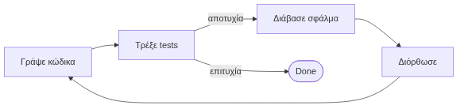

</div>
</div>


<!--
Ποια είναι η πραγματική διαφορά ενός Copilot από έναν Agent; Ο Copilot (όπως το κλασικό ChatGPT) είναι "αντιδραστικός" — περιμένει την εντολή σου (prompt). 
Ο Agent είναι "προνοητικός" (proactive). Του λες: "Φτιάξε μου ένα παιχνίδι Tetris" και πας για καφέ. Ο Agent (όπως το Devin ή το AutoGPT) θα γράψει τον κώδικα, θα τον δοκιμάσει, θα δει ότι δεν παίζει, θα ψάξει στο Google για να βρει πού είναι το λάθος (self-repair loop), θα το διορθώσει και θα στο παραδώσει έτοιμο! 
Αυτή η ικανότητα διόρθωσης (Reflection) μέσω του βρόγχου ανατροφοδότησης (που βλέπετε στην εικόνα) είναι το σημείο όπου τα LLMs μετατρέπονται από απλά εργαλεία κειμένου σε πραγματικά Ευφυή Συστήματα!
-->

---

<!-- _class: xsmall -->
# Microsoft Magentic-One — Αρχιτεκτονική (1/2)

**Magentic-One** (Microsoft, 2024): Γενικής χρήσης multi-agent σύστημα, χτισμένο πάνω στο AutoGen, για σύνθετες εργασίες Web & αρχείων.

<div class="columns">
<div>

**5 Εξειδικευμένοι Πράκτορες:**

| Agent | Ρόλος |
|---|---|
| **Orchestrator** | Κεντρικός σχεδιασμός, ανάθεση, επανα-σχεδιασμός αν κολλήσει |
| **WebSurfer** | Πλοήγηση & αλληλεπίδραση με ιστοσελίδες |
| **FileSurfer** | Διαχείριση τοπικών αρχείων (PDF, PPTX, WAV…) |
| **Coder** | Συγγραφή & ανάλυση κώδικα |
| **ComputerTerminal** | Εκτέλεση κώδικα, εγκατάσταση βιβλιοθηκών |

**Βασικά χαρακτηριστικά:**
- **Open-source** στο Microsoft AutoGen framework
- **Modular:** Προσθαφαίρεση agents χωρίς διακοπή
- **Model-agnostic:** GPT-4o by default, αλλά αντικαταστάσιμο

</div>
<div>

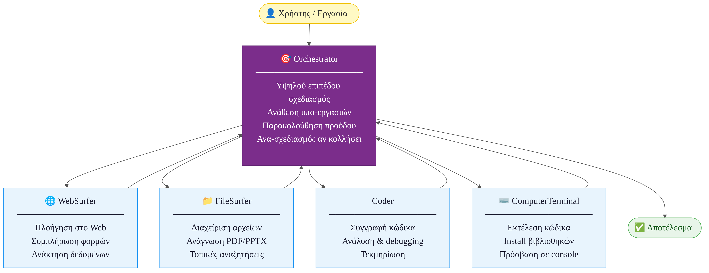

</div>
</div>

---

<!-- _class: xsmall -->
# Magentic-One — Ροή Εργασίας & Αξιολόγηση (2/2)

<div class="columns">
<div>

**Orchestrator: Task & Progress Ledger**

| Ledger | Περιεχόμενο |
|---|---|
| **Task Ledger** | Γνωστά γεγονότα, υποθέσεις, εκτιμήσεις, σχέδιο εργασίας |
| **Progress Ledger** | Εκκρεμή βήματα, επόμενος πράκτορας, έλεγχος ολοκλήρωσης |

**Stall Detection:** Αν δεν υπάρχει πρόοδος για >2 κύκλους → Orchestrator αναθεωρεί το σχέδιο.

**Benchmarks:** GAIA · AssistantBench · WebArena *(αξιολόγηση μέσω AutoGenBench)*

**Σύνδεση με κλασικά MAS:**
- Orchestrator ↔ Contract Net Protocol
- Αμοιβαία κριτική agents ↔ Argumentation-based reasoning

</div>
<div>

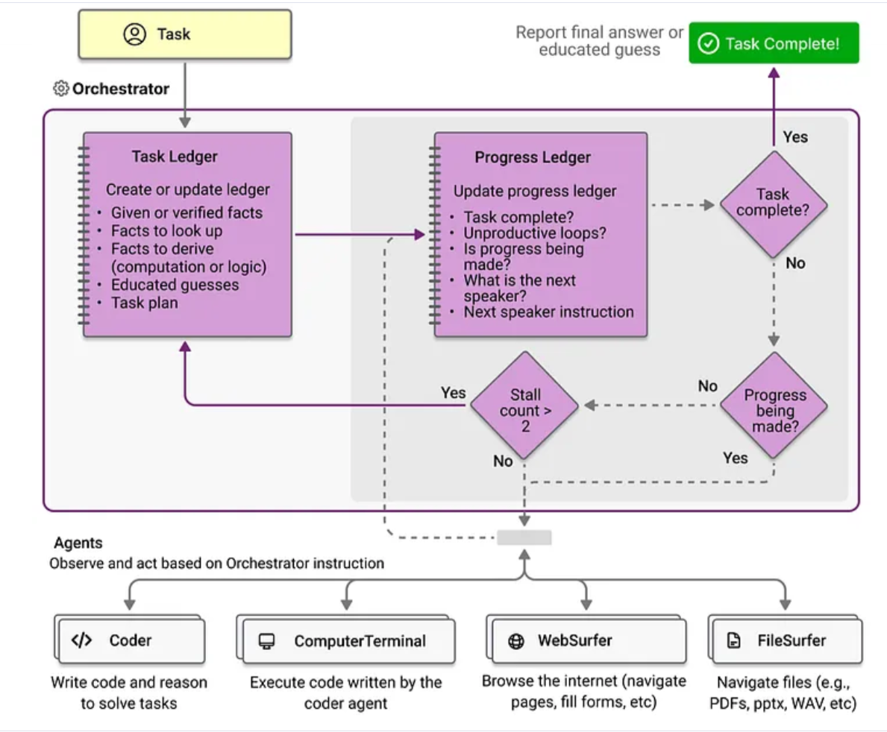

> **Τάση:** Η γραμμή μεταξύ «εργαλείου AI» και «αυτόνομου agent» διαρκώς θολώνει. Το Magentic-One φέρνει το μοντέλο BDI στην πράξη με Task/Progress Ledger ≈ Beliefs/Intentions.

</div>
</div>

---

<!-- _class: xsmall -->
# Agentic Workflows & Μοτίβα Ενορχήστρωσης (1/2)

<div class="columns">
<div>

**4 Θεμελιώδη Μοτίβα (Andrew Ng, 2024):**

| Μοτίβο | Τι κάνει |
|---|---|
| **Reflection** | Ο agent επανεξετάζει & βελτιώνει την έξοδό του πριν την παραδώσει |
| **Tool Use** | Κλήση εξωτερικών APIs, εργαλείων, βάσεων δεδομένων |
| **Planning** | Διάσπαση στόχου: CoT · ReAct · Tree-of-Thoughts |
| **Multi-agent** | Εξειδικευμένοι agents σε ρόλους — peer review |

**Δύο Μοτίβα Ενορχήστρωσης:**
- **Router / Orchestrator:** Κεντρικός agent δρομολογεί δυναμικά αιτήματα — χωρίς hardcoded if-else
- **Swarm (Αγέλη):** Αποκεντρωμένο — agents κάνουν handoffs απευθείας μεταξύ τους

</div>
<div>

**Swarm — Ροή Handoffs:**

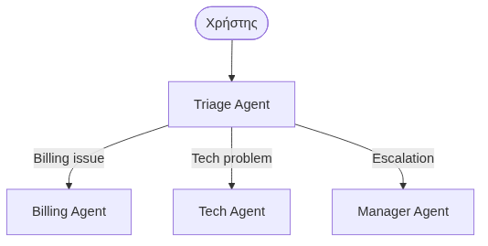

</div>
</div>


---

<!-- _class: xsmall -->
# Agentic Workflows — GraphRAG & Συνδυασμός Μοτίβων (2/2)

<div class="columns">
<div>

**GraphRAG (Microsoft, 2024):**

| | Παραδοσ. RAG | GraphRAG |
|---|---|---|
| **Αποθήκευση** | Vector chunks | Γράφος γνώσης |
| **Αναζήτηση** | Semantic similarity | Graph traversal |
| **Κατάλληλο** | Spot queries | Σύνθεση πηγών |

Αντί για απλή αναζήτηση παρόμοιων κειμένων, ο γράφος επιτρέπει **συλλογισμό πάνω σε σχέσεις** μεταξύ οντοτήτων — ιδανικό για ερωτήσεις που απαιτούν σύνθεση πολλών πηγών.

> **Κλειδί:** Orchestrator + Reflection + Tool Use + Peer Review συνδυάζονται για μέγιστη αξιοπιστία.

</div>
<div>

**Συνδυασμός Μοτίβων σε Πράξη:**

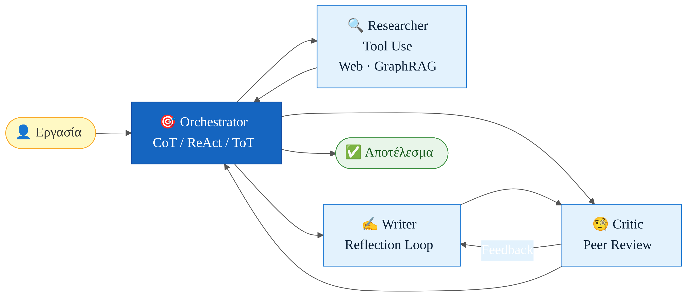

</div>
</div>

---

<!-- _class: xsmall -->
# 10. Επίλυση Συγκρούσεων σε GDSS & MAS

Η σύγκρουση είναι αναπόφευκτη σε πολυπρακτορικά & ομαδικά περιβάλλοντα. Οι μηχανισμοί επίλυσης είναι κοινοί για MAS και GDSS:

<div class="columns">
<div>

**1. Ψηφοφορία (Voting / Polling)**
- *GDSS:* Πλειοψηφία, ranking, ή scoring εναλλακτικών
- *MAS:* Κατανεμημένη λήψη απόφασης (π.χ. Byzantine fault tolerance)

**2. Ανάλυση Πολλαπλών Κριτηρίων (MCDA)**
- Αντικειμενική σύγκριση εναλλακτικών με σταθμισμένα κριτήρια
- Μέθοδοι: **AHP** (Analytic Hierarchy Process), **TOPSIS** — αντιστοιχούν στο GDSS Level 2

</div>
<div>

**3. Argumentation (Επιχειρηματολογία)**
- Ανταλλαγή επιχειρημάτων — κάθε επιχείρημα μπορεί να **επιτεθεί** (attack) ή να **υποστηρίξει** (support) άλλο
- Εύρεση λογικά συνεπούς υποσυνόλου (Argumentation Frameworks)

**4. Συναίνεση (Consensus Building)**
- Αντί «νικητών/ηττημένων» → το σύστημα προτείνει **συμβιβασμούς** βάσει προτιμήσεων όλων
- Μειώνει την απόσταση απόψεων σε επαναληπτικές γύρους

</div>
</div>

---

<!-- _class: xxsmall -->
# 11. Σύνοψη & Συμπεράσματα Ενότητας 9

<div class="columns">
<div>

| Θέμα | Κύριο Μήνυμα |
|---|---|
| **Ταξινόμηση** | Βιολογικοί / Τεχνητοί → Ρομποτικοί / Softbots / Τεχν. Ζωής |
| **Ορισμοί & PEAS** | Russell & Norvig, Maes, Hayes-Roth, Coen — PEAS |
| **Χαρακτηριστικά** | Αυτονομία, κοινωνικότητα, αντιδραστ., προνοητικότητα |
| **Ορθολογικοί** | Βάση γνώσης + κανόνες συμπερασμού → βέλτιστη ενέργεια |
| **Περιβάλλοντα** | 6 διαστάσεις: παρατηρησιμότητα, αιτιοκρατία, επεισοδ., δυναμισμός… |
| **Αντιδραστικοί** | Απλός / Με μοντέλο / Βασ. σε στόχο |
| **BDI** | Beliefs + Desires + Intentions — τολμηροί vs προσεκτικοί |
| **Μαθαίνουν** | Performance / Critic / Learning / Problem generator |

</div>
<div>

| Θέμα | Κύριο Μήνυμα |
|---|---|
| **Υβριδικοί/Κινητοί** | Πολυεπίπεδα / μεταφορά κώδικα & κατάστασης |
| **MAS** | Ελλιπής πληροφορία, αποκέντρωση, ασύγχρονη εκτέλεση |
| **Μοντέλα MAS** | Blackboard (DB + KS) vs Message Passing (KQML/FIPA) |
| **Επικοινωνία** | Σύγχρ./ασύγχρ., 1:1/1:N/N:N, KQML & FIPA ACL |
| **Αλληλεπίδραση** | Contract Net Protocol, Διαπραγμάτευση — ATC, bots |
| **AI Agents** | LLMs, ReAct, Agentic Workflows — Router, Swarm, GraphRAG |
| **GDSS** | Ανωνυμία, παράλληλη επικ., Delphi/NGT, μνήμη ομάδας |
| **Συγκρούσεις** | Ψηφοφορία, MCDA, Argumentation, Συναίνεση |

</div>
</div>
