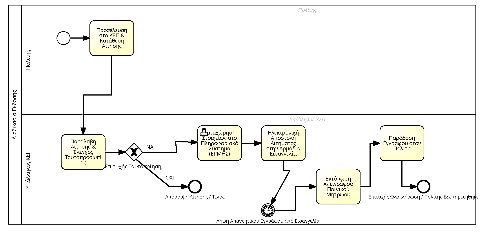

# Οδηγός Μοντελοποίησης BPMN: Αντίγραφο Ποινικού Μητρώου στο Signavio

Αυτός ο οδηγός περιγράφει πώς να μεταφέρεις τη διαδικασία έκδοσης Αντιγράφου Ποινικού Μητρώου (όπως περιγράφεται στο [mitos.gov.gr](https://mitos.gov.gr/index.php/%CE%94%CE%94:%CE%91%CE%BD%CF%84%CE%AF%CE%B3%CF%81%CE%B1%CF%86%CE%BF_%CE%A0%CE%BF%CE%B9%CE%BD%CE%B9%CE%BA%CE%BF%CF%8D_%CE%9C%CE%B7%CF%84%CF%81%CF%8E%CE%BF%CF%85)) σε ένα διάγραμμα BPMN 2.0 χρησιμοποιώντας το SAP Signavio, καθώς και πώς να εισάγεις τις κατάλληλες παραμέτρους για την κοστολόγηση και ανάλυση της διαδικασίας.

---

## 🛠️ Προετοιμασία: Δημιουργία Νέου Διαγράμματος
1. Συνδέσου στο Signavio Workspace σου.
2. Κάνε κλικ στο **New** (Νέο) και επίλεξε **Business Process Diagram (BPMN 2.0)**.
3. Δώσε τίτλο στο διάγραμμα: `Έκδοση Αντιγράφου Ποινικού Μητρώου`.

---

## 🏊‍♂️ Βήμα 1: Στήσιμο της "Πισίνας" (Pool) και των "Διαδρομών" (Lanes)

Η διαδικασία έχει δύο βασικούς "παίκτες": Τον Πολίτη (που κάνει την αίτηση) και το ΚΕΠ (που την εξυπηρετεί).

1. Από το αριστερό μενού (Shape Repository), σύρε ένα **Pool** στον καμβά.
2. Ονόμασε το Pool: `Υπουργείο Δικαιοσύνης / ΚΕΠ` (ή απλά `Διαδικασία Έκδοσης`).
3. Σύρε δύο **Lanes** (Διαδρομές) μέσα στο Pool.
4. Ονόμασε το πάνω Lane: `Πολίτης` (ή `Ενδιαφερόμενος`).
5. Ονόμασε το κάτω Lane: `Υπάλληλος ΚΕΠ`.

---

## 🚦 Βήμα 2: Έναρξη & Ρυθμός Αφίξεων Πολιτών

Κάθε διαδικασία χρειάζεται ένα σημείο εκκίνησης. Εδώ ορίζουμε και πόσοι πολίτες ξεκινούν τη διαδικασία ανά έτος.

1. Στο Lane του `Πολίτη`, πρόσθεσε ένα **Start Event** (ένας απλός λεπτός πράσινος κύκλος).
2. Κάνε διπλό κλικ στον κύκλο και ονόμασέ τον: `Ανάγκη για Αντίγραφο Ποινικού Μητρώου`.
3. **Ρύθμιση για την Ανάλυση:** Επιλέγοντας το Start Event, πήγαινε στο δεξί πάνελ των Attributes, βρες την ενότητα **Cost & Resource Analysis** και συμπλήρωσε:
   *   **Frequency (per Year):** Εισάγετε τον συνολικό αριθμό πολιτών που εξυπηρετούνται ανά έτος (π.χ. `12000`).
   *   Βεβαιώσου ότι το κουτάκι **Apply in calculation** είναι επιλεγμένο ($\checkmark$).

---

## 📝 Βήμα 3: Τα Πρώτα Βήματα (Αίτηση & Ταυτοποίηση)

Ο πολίτης πηγαίνει στο ΚΕΠ και υποβάλλει την αίτηση.

1. Από το Start Event, τράβηξε ένα βελάκι (Sequence Flow) προς ένα νέο **Task** (Ορθογώνιο) μέσα στο Lane του `Πολίτη`.
2. Ονόμασε το Task: `Προσέλευση στο ΚΕΠ & Κατάθεση Αίτησης`.
3. Τράβηξε βελάκι από αυτό το Task προς το Lane του `Υπαλλήλου ΚΕΠ` και δημιούργησε ένα νέο **Task**.
4. Ονόμασε αυτό το Task: `Παραλαβή Αίτησης & Έλεγχος Ταυτοπροσωπίας`.
7. **Ρύθμιση Χρόνου & Κόστους:** Επίλεξε το Task αυτό και στο δεξί πάνελ (**Cost & Resource Analysis**) συμπλήρωσε:
   *   **Execution time (min):** `00:05:00` (5 λεπτά).
   *   **Execution costs:** Εισάγετε το σταθερό resource cost (π.χ. `2.50`).
   *   Βεβαιώσου ότι το **Apply in calculation** είναι επιλεγμένο ($\checkmark$).

---

## 🔀 Βήμα 4: Η Πύλη Απόφασης (Gateway) - Πιθανότητες Διακλάδωσης

Ο υπάλληλος ελέγχει αν η ταυτότητα του πολίτη είναι έγκυρη. Αν δεν είναι, η διαδικασία διακόπτεται.

1. Μετά τον "Έλεγχο Ταυτοπροσωπίας", πρόσθεσε ένα **Exclusive Gateway** (έναν ρόμβο με ένα 'X' στη μέση, XOR).
2. Ονόμασε το Gateway: `Επιτυχής Ταυτοποίηση;`.
3. Από τον ρόμβο, τράβηξε **δύο** βελάκια:
   * **Βελάκι 1 (ΟΧΙ):** Πήγαινέ το προς ένα **End Event** (Κόκκινος παχύς κύκλος) και ονόμασε το End Event: `Απόρριψη Αίτησης / Τέλος`. Πάνω στο βελάκι, γράψε τη λέξη `ΟΧΙ`.
   * **Βελάκι 2 (ΝΑΙ):** Πήγαινέ το προς ένα νέο **Task** στο Lane του `Υπαλλήλου ΚΕΠ` και γράψε στο βελάκι τη λέξη `ΝΑΙ`.

---

## 💻 Βήμα 5: Καταχώρηση και Αποστολή μέσω Συστήματος

Αν η ταυτοποίηση πετύχει, ο υπάλληλος προχωράει τη διαδικασία στο σύστημα.

1. Το νέο Task που έφτιαξες (από το βελάκι ΝΑΙ) ονόμασέ το: `Καταχώρηση Στοιχείων στο Πληροφοριακό Σύστημα (ΕΡΜΗΣ)`.
   * *Tip:* Στο Signavio, επίλεξε το Task, πήγαινε στο πάνελ `Attributes` (συνήθως δεξιά), επέλεξε `Main Attributes` και από το πεδίο `Task Type` διάλεξε `User Task` (καθώς ένας υπάλληλος καταχωρεί στοιχεία σε σύστημα). Ένα `Service Task` χρησιμοποιείται όταν το σύστημα εκτελεί αυτόματα την ενέργεια χωρίς ανθρώπινη παρέμβαση.
2. Τράβηξε βελάκι σε επόμενο **Task** (πάντα στο Lane του υπαλλήλου).
3. Ονόμασε το νέο Task: `Ηλεκτρονική Αποστολή Αιτήματος στην Αρμόδια Εισαγγελία`.

---

## ⏳ Βήμα 6: Ενδιάμεσο Γεγονός Χρόνου - Αναμονή για Απάντηση

Για να αποτυπωθεί σωστά ο χρόνος καθυστέρησης (waiting time) μέχρι να απαντήσει η Εισαγγελία απευθείας στα Attributes του διαγράμματος, χρησιμοποιούμε ένα γεγονός χρόνου.

1. Από το Shape Repository, βρες την κατηγορία **Catching Intermediate Events** και σύρε ένα **Intermediate Timer Event** (ο κύκλος με το ρολόι 🕒) στο Lane του `Υπαλλήλου ΚΕΠ`.
2. Σύνδεσε με βελάκι το Task `Ηλεκτρονική Αποστολή...` με αυτό το ρολόι.
3. Ονόμασέ το: `Αναμονή Απαντητικού Εγγράφου από Εισαγγελία`.
4. **Ρύθμιση Χρόνου Αναμονής:** Επίλεξε το ρολόι, πήγαινε στο δεξί πάνελ στην ενότητα **Cost & Resource Analysis**, βρες το πεδίο **Time duration** και συμπλήρωσε τον χρόνο που μεσολαβεί (π.χ. `01:00:00` για 1 ώρα ή ανάλογα με το σενάριό σας).

---

## 🖨️ Βήμα 7: Ολοκλήρωση Διαδικασίας (Εκτύπωση & Παράδοση)

Η απάντηση ήρθε, οπότε ο υπάλληλος την δίνει στον πολίτη.

1. Από το γεγονός λήψης, τράβηξε βελάκι σε νέο **Task** (Lane Υπαλλήλου ΚΕΠ).
2. Ονόμασέ το: `Εκτύπωση Αντιγράφου Ποινικού Μητρώου`.
3. Τράβηξε βελάκι σε ένα τελευταίο **Task** (Lane Υπαλλήλου ΚΕΠ).
4. Ονόμασέ το: `Παράδοση Εγγράφου στον Πολίτη`.
5. Τέλος, τράβηξε βελάκι σε ένα **End Event** (Κόκκινος παχύς κύκλος) και ονόμασέ το: `Επιτυχής Ολοκλήρωση / Πολίτης Εξυπηρετήθηκε`.
8. Τέλος, σύνδεσε το Task παράδοσης με ένα End Event (κίτρινος/κόκκινος παχύς κύκλος) και ονόμασέ το: `Επιτυχής Ολοκλήρωση / Πολίτης Εξυπηρετήθηκε`.

---

## 🚀 Βήμα 8: Αποθήκευση, Έλεγχος & Εξαγωγή Αναφοράς (Simulation)

Επειδή το ακαδημαϊκό περιβάλλον δεν εμφανίζει το standalone κουμπί "Simulation" στο πάνω μενού, η ανάλυση και η προσομοίωση κόστους/χρόνου εκτελούνται μέσω της μηχανής Reporting του Signavio.

### 8.1 Αποθήκευση του Διαγράμματος
1. Στο πάνω αριστερό μέρος του Editor, κάνε κλικ στο εικονίδιο της Δισκέτας (**Save**) για να αποθηκεύσεις τις αλλαγές σου.
2. Επίστρεψε στην κεντρική οθόνη των αρχείων σου (κλείνοντας την καρτέλα ή επιλέγοντας Explorer από το μενού του προφίλ σου).

### 8.2 Εκτέλεση της Αναφοράς
1. Μέσα στον Explorer, βρες το διάγραμμα `Έκδοση Αντιγράφου Ποινικού Μητρώου` και κάνε κλικ μία φορά πάνω του για να επιλεγεί (θα γίνει μπλε).
2. Στην επάνω πορφυρή/μωβ μπάρα εργαλείων, κάνε κλικ στο dropdown μενού **Reporting**.
3. Επίλεξε **Process Cost Analysis** (Ανάλυση Κόστους Διαδικασίας) ή **Resource Consumption** (Κατανάλωση Πόρων).

### 8.3 Ανάλυση Αποτελεσμάτων
Το Signavio θα επεξεργαστεί τον ρυθμό εισόδου πολιτών (**Frequency**), τις χρονικές διάρκειες (**Execution time** & **Time duration**) και τις πιθανότητες της πύλης (**90% / 10%**) για να παράγει μια αναλυτική αναφορά (συνήθως σε μορφή Excel ή PDF). Εκεί θα μπορέσετε να δείτε:
*   **Total Cycle Time:** Πόση ώρα διαρκεί κατά μέσο όρο η διαδικασία για τον πολίτη.
*   **Total Costs per Year:** Το συνολικό ετήσιο κόστος λειτουργίας της συγκεκριμένης διαδικασίας για το ΚΕΠ.
*   **Path Analysis:** Πώς επιμερίζεται το κόστος και ο φόρτος εργασίας με βάση το 90/10 split της πύλης XOR.

---

## ✨ Βήμα 9: Έλεγχος & Βελτίωση (Best Practices)

Για να πάρεις "άριστα" στο διάγραμμα, έλεγξε τα εξής:
* Βεβαιώσου ότι **όλα** τα Tasks έχουν ένα "ρήμα" (π.χ. "Καταχώρηση", "Εκτύπωση").
* Βεβαιώσου ότι δεν υπάρχουν βελάκια που "κρέμονται" στον αέρα (όλα πρέπει να συνδέουν κάτι με κάτι άλλο).
* Εάν θέλεις, μπορείς να προσθέσεις ένα *Data Object* (εικονίδιο εγγράφου) που να λέει "Αντίγραφο Ταυτότητας" και να το συνδέσεις με το Task "Έλεγχος Ταυτοπροσωπίας".

🎉 **Συγχαρητήρια!** Μόλις μοντελοποίησες μια πραγματική διοικητική διαδικασία του Ελληνικού Δημοσίου!

