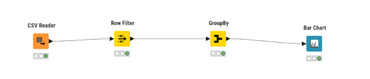
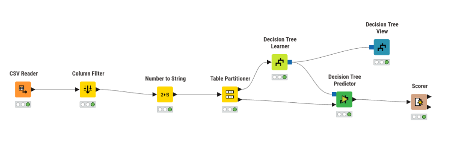
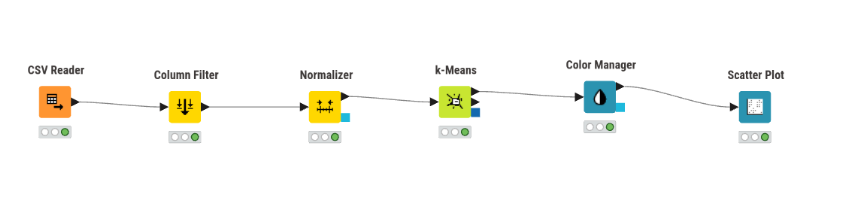
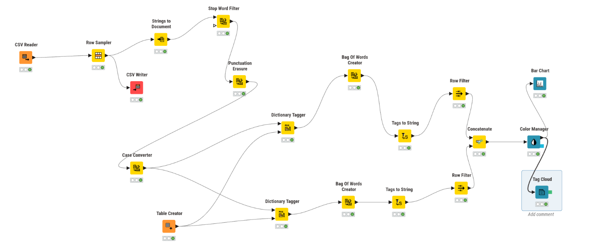

# KNIME Analytics Platform

## Τι είναι το KNIME

Το **KNIME** (Konstanz Information Miner) είναι μια ανοιχτού κώδικα πλατφόρμα ανάλυσης δεδομένων και μηχανικής μάθησης. Επιτρέπει την οπτική κατασκευή ροών εργασίας (*workflows*) μέσω ενός γραφικού περιβάλλοντος drag-and-drop, χωρίς απαραίτητα να απαιτείται γνώση προγραμματισμού.

Βασικά χαρακτηριστικά:

- **Visual workflow editor**: κατασκευή pipelines με σύνδεση κόμβων (*nodes*)
- **Πλούσια βιβλιοθήκη κόμβων**: εισαγωγή δεδομένων, μετασχηματισμός, οπτικοποίηση, machine learning, deep learning
- **Επεκτασιμότητα**: ενσωμάτωση κώδικα Python, R, Java και SQL
- **Δωρεάν χρήση**: η βασική έκδοση (KNIME Analytics Platform) είναι ελεύθερη

---

## Γιατί χρησιμοποιούμε το KNIME;

Η πλατφόρμα έχει κερδίσει τεράστια δημοφιλία σε ακαδημαϊκό και επιχειρηματικό επίπεδο για τους εξής λόγους:

- **Εκδημοκρατισμός της Επιστήμης Δεδομένων (No-Code / Low-Code)**: Επιτρέπει σε χρήστες χωρίς ισχυρό υπόβαθρο προγραμματισμού (π.χ. business analysts, domain experts) να εκτελούν περίπλοκες αναλύσεις, από απλό καθαρισμό δεδομένων (ETL) μέχρι Machine Learning και Deep Learning.
- **Ενοποίηση Ετερογενών Δεδομένων (Data Blending)**: Μπορεί να διαβάσει, να συνδυάσει και να ενώσει δεδομένα από διαφορετικές πηγές ταυτόχρονα (Excel, CSV, SQL Databases, MongoDB, REST APIs, Cloud Storage) μέσα στο ίδιο περιβάλλον.
- **Αναπαραγωγιμότητα και Τεκμηρίωση (Reproducibility)**: Αντί για κρυφά macros στο Excel ή πολύπλοκα, ασύνδετα scripts, το workflow οπτικοποιεί ξεκάθαρα τη λογική βήμα προς βήμα. Αν αλλάξουν τα αρχικά δεδομένα, αρκεί ένα "Execute All" για να ανανεωθεί όλη η ανάλυση ομοιόμορφα.
- **Γέφυρα μεταξύ τεχνολογιών**: Δεν "ανταγωνίζεται" γλώσσες όπως η Python ή η R, αλλά τις **αγκαλιάζει**. Αν μια ομάδα έχει Data Scientists που γράφουν κώδικα και Data Analysts που προτιμούν οπτικά εργαλεία, το KNIME τους επιτρέπει να συνεργάζονται στενά στο ίδιο pipeline.
- **Ανοιχτή Καινοτομία**: Όντας ανοιχτού κώδικα (στην Desktop έκδοσή του), διαθέτει μια τεράστια και ενεργή κοινότητα (KNIME Hub) που προσφέρει έτοιμα workflows, λύσεις και επεκτάσεις.

---

## Φιλοσοφία του KNIME

### "Open for Innovation"

Το KNIME χτίστηκε γύρω από τρεις αρχές:

1. **Διαφάνεια** (*Transparency*): κάθε βήμα της ανάλυσης είναι ορατό ως κόμβος στο workflow. Δεν υπάρχει "μαύρο κουτί" — ο χρήστης βλέπει ακριβώς τι συμβαίνει στα δεδομένα σε κάθε στάδιο.

2. **Επαναχρησιμοποίηση** (*Reusability*): ένα workflow μπορεί να αποθηκευτεί, να μοιραστεί και να εκτελεστεί ξανά σε νέα δεδομένα χωρίς αλλαγές. Αυτό προάγει την αναπαραγωγιμότητα της ανάλυσης.

3. **Ανοιχτότητα** (*Openness*): το KNIME ενσωματώνει εργαλεία από το ευρύτερο οικοσύστημα (Python, R, Spark, H2O, TensorFlow) αντί να τα αντικαθιστά.

---

## Βασικές Έννοιες & Συστατικά Στοιχεία

Στο KNIME, η ανάλυση δεδομένων αντιμετωπίζεται ως ένας **κατευθυνόμενος γράφος μετασχηματισμών** (οπτικός προγραμματισμός μέσω κόμβων). Αυτό στηρίζεται στα εξής δομικά στοιχεία:

### 1. Κόμβοι (Nodes)
Ο κόμβος είναι το βασικό δομικό στοιχείο. Κάθε κόμβος εκτελεί **μία και μόνο συγκεκριμένη λειτουργία** (π.χ. διαβάζει ένα αρχείο, αφαιρεί κενές γραμμές, εκπαιδεύει ένα μοντέλο κ.λπ.). Το πιο σημαντικό χαρακτηριστικό τους είναι το **"Φανάρι Κατάστασης" (Traffic Light System)** που βρίσκεται στο κάτω μέρος τους:
- 🔴 **Κόκκινο (Not Configured)**: Ο κόμβος μπήκε στον καμβά, αλλά λείπουν βασικές ρυθμίσεις (π.χ. δεν επιλέξατε ποιο αρχείο να διαβάσει).
- 🟡 **Κίτρινο (Configured)**: Ο κόμβος έχει ρυθμιστεί σωστά και είναι έτοιμος να τρέξει.
- 🟢 **Πράσινο (Executed)**: Η λειτουργία εκτελέστηκε επιτυχώς και τα δεδομένα εξόδου είναι διαθέσιμα για το επόμενο βήμα.
- ❌ **Κόκκινος Σταυρός (Error)**: Η εκτέλεση απέτυχε (π.χ. το αρχείο διεγράφη ή δημιουργήθηκε σφάλμα μνήμης).

### 2. Θύρες (Ports) και Ακμές (Connections)
Οι κόμβοι επικοινωνούν μεταξύ τους μέσω θυρών (ports) που συνδέονται με ακμές (connections).
- **Θύρες Εισόδου (αριστερά)**: Δέχονται δεδομένα/μοντέλα από προηγούμενους κόμβους.
- **Θύρες Εξόδου (δεξιά)**: Παρέχουν τα αποτελέσματα στον επόμενο κόμβο.

*Το σχήμα και το χρώμα της θύρας υποδηλώνει τον τύπο της πληροφορίας:*
- **Λευκό/Μαύρο Τρίγωνο**: Πίνακας Δεδομένων (Data Table) - ο πιο συνηθισμένος τύπος.
- **Κυανό/Μπλε Τετράγωνο**: Μοντέλο Μηχανικής Μάθησης (π.χ. PMML Model).
- **Σκούρο Κόκκινο Τετράγωνο**: Σύνδεση Βάσης Δεδομένων (Database Connection).

```
[CSV Reader] ──► [Row Filter] ──► [Normalizer] ──► [Random Forest Learner] ──► [Predictor]
```

Αυτή η προσέγγιση κάνει το pipeline:
- **Ευανάγνωστο**: ακόμα και μη τεχνικοί χρήστες καταλαβαίνουν τη ροή
- **Εύκολα επεξεργάσιμο**: αλλαγή ενός βήματος δεν επηρεάζει τα υπόλοιπα
- **Αυτοτεκμηριούμενο**: το ίδιο το διάγραμμα λειτουργεί ως τεκμηρίωση

### Κατηγορίες Κόμβων (Node Categories)

Στο Node Repository, οι κόμβοι είναι οργανωμένοι σε κατηγορίες ανάλογα με τη λειτουργία τους. Παρακάτω παρατίθενται οι βασικές κατηγορίες με ενδεικτικούς κόμβους:

- **IO (Input/Output)**: Ανάγνωση και αποθήκευση δεδομένων.
  - *CSV / Excel Reader & Writer*: Διαχείριση αρχείων CSV και Excel.
  - *DB Reader / DB Writer*: Απευθείας σύνδεση και εκτέλεση ερωτημάτων σε Βάσεις Δεδομένων (SQL).
- **Manipulation (Μετασχηματισμός Δεδομένων)**: Καθαρισμός και προετοιμασία των δεδομένων.
  - *Row Filter / Column Filter*: Αφαίρεση γραμμών ή στηλών βάσει συνθηκών.
  - *Joiner*: Ένωση δύο πινάκων (αντίστοιχο του VLOOKUP ή SQL JOIN).
  - *GroupBy*: Ομαδοποίηση και συνάθροιση δεδομένων (π.χ. άθροισμα πωλήσεων ανά μήνα).
  - *Math Formula / String Manipulation*: Υπολογισμοί και επεξεργασία κειμένου.
- **Analytics & Statistics (Στατιστική και Ανάλυση)**: Εξαγωγή στατιστικών μετρικών.
  - *Statistics*: Υπολογισμός βασικών στατιστικών (μέσος όρος, διάμεσος κ.λπ.).
  - *Linear Correlation*: Εύρεση συσχετίσεων μεταξύ αριθμητικών μεταβλητών.
- **Machine Learning (Μηχανική Μάθηση)**: Εκπαίδευση (Learners) και εφαρμογή (Predictors) μοντέλων.
  - *Random Forest Learner / Predictor*: Εκπαίδευση μοντέλων δέντρων απόφασης.
  - *K-Means*: Αλγόριθμος ομαδοποίησης (clustering) χωρίς επίβλεψη.
  - *Scorer*: Αξιολόγηση ακρίβειας μοντέλου ταξινόμησης (Confusion Matrix, Accuracy).
- **Visualization (Οπτικοποίηση)**: Δημιουργία διαγραμμάτων.
  - *Bar Chart, Scatter Plot, Line Plot*: Κλασικά και διαδραστικά γραφήματα.
- **Scripting**: Ενσωμάτωση εξωτερικού κώδικα.
  - *Python Script / R Snippet / Java Snippet*: Εκτέλεση προσαρμοσμένου κώδικα απευθείας πάνω στα δεδομένα του workflow.

---

## Πιθανά Σενάρια Χρήσης (Τι άλλο μπορούμε να κάνουμε εκτός από Excel)

Το KNIME δεν αντικαθιστά απλώς το Excel, αλλά ανοίγει την πόρτα σε προχωρημένες αναλύσεις. Ορισμένα χαρακτηριστικά σενάρια περιλαμβάνουν:

- **Αυτοματοποίηση ETL (Extract, Transform, Load)**: Αυτόματη άντληση δεδομένων κάθε πρωί από μια βάση SQL, καθαρισμός τους (αφαίρεση διπλοεγγραφών, διαχείριση κενών τιμών) και αποστολή μιας τελικής αναφοράς μέσω email, χωρίς καμία ανθρώπινη παρέμβαση.
- **Προβλεπτική Αναλυτική (Machine Learning)**: Πρόβλεψη του ποιοι πελάτες είναι πιθανό να ακυρώσουν τη συνδρομή τους (Customer Churn) εκπαιδεύοντας αλγορίθμους όπως Random Forest ή XGboost σε ιστορικά δεδομένα πελατών.
- **Ανάλυση Κειμένου (Text Mining & NLP)**: Συλλογή κριτικών πελατών από το διαδίκτυο ή από έγγραφα και αυτόματη εξαγωγή συναισθήματος (Sentiment Analysis) για να δούμε αν μιλάνε θετικά ή αρνητικά για ένα προϊόν.
- **Διασύνδεση με Web APIs**: Κλήση ενός εξωτερικού REST API (π.χ. για δεδομένα καιρού, νομισματικές ισοτιμίες ή τραπεζικά δεδομένα) και άμεση ενσωμάτωση αυτών με τα εσωτερικά δεδομένα πωλήσεων της επιχείρησης.
- **Γεωχωρική Ανάλυση (Geospatial Analysis)**: Επεξεργασία δεδομένων τοποθεσίας (π.χ. συντεταγμένες GPS από στόλο οχημάτων, καταστήματα) και οπτικοποίησή τους σε διαδραστικούς χάρτες για βελτιστοποίηση σημείων εξυπηρέτησης.
- **Ανάλυση Χρονοσειρών (Time Series)**: Πρόβλεψη μελλοντικής ζήτησης ή πωλήσεων (Demand Forecasting) βασισμένη σε ιστορικά δεδομένα μέσω στατιστικών μοντέλων (ARIMA) ή νευρωνικών δικτύων (LSTMs).
- **Επεξεργασία Big Data**: Αν τα δεδομένα είναι υπερβολικά μεγάλα για τη μνήμη (RAM) του υπολογιστή σας, το KNIME μπορεί να στείλει οπτικά τις εντολές σας σε ένα cluster (π.χ. Apache Spark ή Hadoop) για κατανεμημένη επεξεργασία.

---

## Εγκατάσταση

### Απαιτήσεις συστήματος

- Λειτουργικό: Windows 10/11, macOS 12+, Linux (64-bit)
- RAM: ελάχιστο 4 GB (συνιστώνται 8 GB+)
- Java: περιλαμβάνεται στο πακέτο εγκατάστασης (δεν απαιτείται ξεχωριστή εγκατάσταση)

### Βήματα εγκατάστασης

1. Μεταβείτε στη σελίδα λήψης: [https://www.knime.com/downloads](https://www.knime.com/downloads)
2. Επιλέξτε **KNIME Analytics Platform** για το λειτουργικό σας σύστημα
3. Κατεβάστε και εκτελέστε τον installer (Windows: `.exe`, macOS: `.dmg`, Linux: `.tar.gz`)
4. Ακολουθήστε τις οδηγίες του οδηγού εγκατάστασης
5. Εκκινήστε το KNIME και ορίστε έναν φάκελο ως *workspace* (εκεί αποθηκεύονται τα workflows σας)

### Επίσημη τεκμηρίωση

- [KNIME Installation Guide](https://docs.knime.com/latest/analytics_platform_installation_guide/)
- [KNIME Learning Hub](https://www.knime.com/learning)
- [KNIME Node Repository](https://nodepit.com/)

---

## Πρώτα βήματα

Μετά την εγκατάσταση, το KNIME ανοίγει στο **KNIME Analytics Platform** με τα εξής κύρια τμήματα:

| Τμήμα | Περιγραφή |
|---|---|
| **Workflow Editor** | Ο κεντρικός καμβάς όπου χτίζετε το workflow σας |
| **Node Repository** | Κατάλογος όλων των διαθέσιμων κόμβων |
| **KNIME Explorer** | Διαχείριση των αποθηκευμένων workflows |
| **Console / Node Monitor** | Πληροφορίες εκτέλεσης και αποτελέσματα |

Ένα απλό workflow αποτελείται από:
1. Έναν κόμβο **εισόδου** (π.χ. CSV Reader)
2. Κόμβους **επεξεργασίας** (π.χ. Row Filter, Column Rename)
3. Έναν κόμβο **εξόδου** ή οπτικοποίησης (π.χ. Bar Chart, Table View)

---

## Tutorial: Το Πρώτο σας Workflow στο KNIME

Για αυτό το πρακτικό παράδειγμα, μπορείτε να κατεβάσετε ένα γνωστό dataset από το Kaggle (π.χ. το [**Superstore Sales Dataset**](https://www.kaggle.com/datasets/rohitsahoo/sales-forecasting)). Στόχος μας είναι να διαβάσουμε τα δεδομένα πωλήσεων, να φιλτράρουμε μια συγκεκριμένη κατηγορία, να υπολογίσουμε τα έσοδα και να τα οπτικοποιήσουμε.

### Βήμα 1: Προετοιμασία
1. Κατεβάστε το αρχείο CSV από το Kaggle στον υπολογιστή σας.
2. Εκκινήστε το KNIME Analytics Platform και δημιουργήστε ένα νέο, άδειο workflow (από τον KNIME Explorer κάντε δεξί κλικ στο *Local Workspace* ➔ *New KNIME Workflow*).

### Βήμα 2: Ανάγνωση Δεδομένων (CSV Reader)
1. Στο πάνελ **Node Repository** (συνήθως κάτω αριστερά), γράψτε στην αναζήτηση `CSV Reader` (ή `Excel Reader` αν έχετε αρχείο Excel).
2. Σύρετε (drag & drop) τον κόμβο **CSV Reader** στον κεντρικό καμβά.
3. Κάντε διπλό κλικ στον κόμβο (ή δεξί κλικ ➔ *Configure*) για να ανοίξουν οι ρυθμίσεις του. 
4. Στο πεδίο "File", επιλέξτε το αρχείο CSV που κατεβάσατε. Το KNIME θα σας δείξει αυτόματα μια προεπισκόπηση των στηλών. Πατήστε **OK**.
5. Κάντε δεξί κλικ στον κόμβο και επιλέξτε **Execute**. Το "φανάρι" στο κάτω μέρος του κόμβου θα γίνει **πράσινο**, υποδηλώνοντας ότι τα δεδομένα φορτώθηκαν επιτυχώς.

### Βήμα 3: Φιλτράρισμα Δεδομένων (Row Filter)
Ας υποθέσουμε ότι θέλουμε να αναλύσουμε **μόνο** τις πωλήσεις της κατηγορίας "Technology".
1. Αναζητήστε τον κόμβο **Row Filter** στο Node Repository και σύρετέ τον στον καμβά.
2. Ενώστε τη θύρα εξόδου (δεξί τριγωνάκι) του *CSV Reader* με τη θύρα εισόδου (αριστερό τριγωνάκι) του *Row Filter*.
3. Κάντε διπλό κλικ στο *Row Filter*. 
4. Επιλέξτε τη στήλη `Category` (ή αντίστοιχη στήλη κατηγορίας).
5. Στο πεδίο *Pattern matching* γράψτε `Technology`. Πατήστε **OK**.
6. Εκτελέστε τον κόμβο (Δεξί κλικ ➔ Execute).

### Βήμα 4: Μετασχηματισμός & Σύνοψη (GroupBy)
Τώρα θέλουμε να υπολογίσουμε τις συνολικές πωλήσεις (Sales) ανά Υπο-Κατηγορία (Sub-Category).
1. Προσθέστε τον κόμβο **GroupBy** και συνδέστε τον μετά το *Row Filter*.
2. Στις ρυθμίσεις του κόμβου, θα βρείτε δύο βασικές καρτέλες:
   - **Groups (Ομαδοποίηση):** Επιλέξτε τη στήλη `Sub-Category` και περάστε τη στο δεξί πλαίσιο.
   - **Manual Aggregation (Συνάθροιση):** Προσθέστε τη στήλη `Sales` και ορίστε τη συνάρτηση (Aggregation function) σε **Sum**.
3. Πατήστε **OK** και εκτελέστε τον κόμβο. Αν κάνετε δεξί κλικ και επιλέξετε *Grouped table*, θα δείτε τον νέο συμπυκνωμένο πίνακα!

### Βήμα 5: Οπτικοποίηση (Bar Chart)
Ήρθε η ώρα να δούμε τα αποτελέσματα οπτικά.
1. Αναζητήστε τον κόμβο **Bar Chart** και συνδέστε τον στο *GroupBy*.
2. Κάντε διπλό κλικ στις ρυθμίσεις του:
   - Ως *Category Column* (άξονας Χ) επιλέξτε το `Sub-Category`.
   - Ως *Frequency Column* (άξονας Υ) βεβαιωθείτε ότι είναι επιλεγμένο το `Sum(Sales)`.
3. Πατήστε **OK** και εκτελέστε τον κόμβο.
4. Κάντε δεξί κλικ στον κόμβο και επιλέξτε **Interactive View: Bar Chart**. Ένα νέο παράθυρο θα ανοίξει με το διαδραστικό σας ραβδόγραμμα!

> 🎉 **Συγχαρητήρια!** Μόλις ολοκληρώσατε το πρώτο σας αυτοματοποιημένο ETL και Data Visualization pipeline στο KNIME, χωρίς να χρειαστεί να γράψετε ούτε μία γραμμή κώδικα! Αν τα αρχικά δεδομένα αλλάξουν, το μόνο που έχετε να κάνετε είναι να πατήσετε το κουμπί **Execute All** και το γράφημά σας θα ανανεωθεί άμεσα.




---

## Tutorial 2: Κατασκευή Δέντρου Απόφασης (Machine Learning)

Για το δεύτερο παράδειγμα, θα χρησιμοποιήσουμε το διάσημο **Titanic Dataset** https://www.kaggle.com/competitions/titanic/data από το Kaggle για να φτιάξουμε ένα μοντέλο πρόβλεψης επιβίωσης (Predictive Analytics). Στόχος μας είναι να δούμε πώς το KNIME εκπαιδεύει και αξιολογεί ένα μοντέλο Μηχανικής Μάθησης (Decision Tree).

### Βήμα 1: Εισαγωγή και Προετοιμασία
1. Κατεβάστε το αρχείο `train.csv` από το Kaggle (**Titanic - Machine Learning from Disaster**) και φορτώστε το με έναν κόμβο **CSV Reader**. *(Σημείωση: Από τα 3 αρχεία που δίνει το Kaggle, χρειαζόμαστε το `train.csv` καθώς είναι το μόνο που περιέχει τη στήλη-στόχο `Survived` για να αξιολογήσουμε το μοντέλο μας).*
2. Προσθέστε έναν κόμβο **Column Filter** για να αφαιρέσετε στήλες που δεν έχουν προγνωστική αξία ή προσθέτουν υπερβολικό "θόρυβο" (π.χ. `PassengerId`, `Name`, `Ticket`, `Cabin`). Κρατήστε τις: `Survived` (ο στόχος μας), `Pclass`, `Sex`, `Age` και `Fare`.
3. **Κρίσιμο βήμα (Μετατροπή Τύπου):** Στο αρχικό αρχείο, η στήλη `Survived` είναι αριθμητική (0 ή 1). Για να καταλάβει το KNIME ότι πρόκειται για κατηγορίες (Ναι/Όχι) και να μας επιτρέψει τον διαχωρισμό (Stratified sampling) αλλά και την ταξινόμηση, προσθέστε έναν κόμβο **Number to String** μετά το *Column Filter*. Στις ρυθμίσεις του, επιλέξτε τη στήλη `Survived` (προαιρετικά και την `Pclass`) και εκτελέστε τον.

### Βήμα 2: Διαχωρισμός Δεδομένων (Table Partitioner)
Για να αξιολογήσουμε σωστά το μοντέλο μας και να αποφύγουμε το overfitting, πρέπει να χωρίσουμε τα δεδομένα σε σύνολο εκπαίδευσης (Train) και σύνολο δοκιμής (Test).
1. Αναζητήστε τον κόμβο **Table Partitioner** (Προσοχή: επιλέξτε τον κόμβο `Table Partitioner` και ΟΧΙ τον `X-Partitioner` που χρησιμοποιείται για Cross Validation ή τον `DB Table Partitioner` που αφορά βάσεις δεδομένων) και συνδέστε τον στο *Number to String*.
2. Στις ρυθμίσεις του κόμβου:
   - Ορίστε το μέγεθος του πρώτου συνόλου (Relative [%]) στο **80%**.
   - Επιλέξτε την επιλογή **Stratified sampling** και επιλέξτε από κάτω τη στήλη `Survived`. Έτσι εξασφαλίζετε ότι και τα δύο σύνολα θα έχουν την ίδια αναλογία επιζώντων/θανόντων.
3. Εκτελέστε τον κόμβο. Η *πάνω θύρα* εξάγει το 80% (Train Data) και η *κάτω θύρα* το 20% (Test Data).

### Βήμα 3: Εκπαίδευση του Μοντέλου (Decision Tree Learner)
1. Αναζητήστε τον κόμβο **Decision Tree Learner** και συνδέστε την **πάνω θύρα (μαύρο τρίγωνο)** του *Table Partitioner* στην είσοδό του.
2. Στις ρυθμίσεις του:
   - Στο πεδίο **Class column** επιλέξτε τη στήλη-στόχο που θέλουμε να προβλέψουμε: `Survived`.
   - Στις προαιρετικές ρυθμίσεις, μπορείτε να δείτε το κριτήριο ποιότητας του split (π.χ. Gini index) και το όριο βάθους.
3. Πατήστε **OK** και εκτελέστε τον (Execute). Το μοντέλο εκπαιδεύτηκε! (Η έξοδός του είναι πλέον ένα μπλε τετράγωνο που περιέχει το εκπαιδευμένο μοντέλο).
4. *(Προαιρετικά)* Στις νεότερες εκδόσεις του KNIME, η οπτικοποίηση γίνεται με ξεχωριστό κόμβο. Αναζητήστε τον κόμβο **Decision Tree View**, συνδέστε το εκπαιδευμένο μοντέλο (το μπλε τετράγωνο του *Learner*) στην είσοδό του, εκτελέστε τον και ανοίξτε το **Interactive View** για να δείτε το διαδραστικό δέντρο.

### Βήμα 4: Εφαρμογή του Μοντέλου (Decision Tree Predictor)
Ήρθε η ώρα να τεστάρουμε το μοντέλο μας στα «άγνωστα» δεδομένα που κρατήσαμε στην άκρη.
1. Προσθέστε τον κόμβο **Decision Tree Predictor**.
2. Παρατηρήστε ότι έχει **δύο θύρες εισόδου**: 
   - Στην **πάνω θύρα (μπλε τετράγωνο)** συνδέστε την έξοδο του *Decision Tree Learner* (αυτό μεταφέρει το εκπαιδευμένο μοντέλο).
   - Στην **κάτω θύρα (μαύρο τρίγωνο)** συνδέστε την **κάτω θύρα (μαύρο τρίγωνο)** του *Table Partitioner* (το 20% των test δεδομένων).

> ⚠️ **Προσοχή στα χρώματα και σχήματα των θυρών:** Ένα από τα πιο συνηθισμένα λάθη είναι η προσπάθεια σύνδεσης του *Table Partitioner* απευθείας στην πάνω θύρα του *Predictor*. Θυμηθείτε: Το **μαύρο τρίγωνο** μεταφέρει πίνακες δεδομένων, ενώ το **μπλε τετράγωνο** μεταφέρει αλγόριθμους/μοντέλα. Επομένως, το μπλε τετράγωνο του Predictor πρέπει να συνδεθεί αποκλειστικά με το μπλε τετράγωνο του Learner!

3. Πατήστε **OK** και εκτελέστε τον κόμβο. Αν ελέγξετε τον πίνακα εξόδου, θα δείτε ότι στο τέλος του πίνακα προστέθηκε μια νέα στήλη `Prediction (Survived)`.

### Βήμα 5: Αξιολόγηση (Scorer)
1. Αναζητήστε τον κόμβο **Scorer** και συνδέστε τον στην έξοδο του *Predictor*.
2. Στις ρυθμίσεις του, ορίστε ως *First column* την πραγματική στήλη (`Survived`) και ως *Second column* την πρόβλεψη (`Prediction (Survived)`).
3. Πατήστε **OK** και εκτελέστε τον.
4. Κάντε δεξί κλικ και επιλέξτε **View: Confusion Matrix**. Εδώ θα δείτε τον κλασικό Πίνακα Σύγχυσης (True Positives, False Negatives κ.λπ.) καθώς και τη συνολική **Ακρίβεια (Accuracy)** του μοντέλου σας!



> 💡 **Σύνοψη Machine Learning Pipeline:** `CSV Reader` ➔ `Column Filter` ➔ `Number to String` ➔ `Table Partitioner` ➔ (`Learner` & `Test data`) ➔ `Predictor` ➔ `Scorer`.

---

## Εναλλακτική Προσέγγιση: Δύο Λεξικά & Tag Cloud

Μια εναλλακτική και πιο ευέλικτη προσέγγιση είναι η δημιουργία δύο ξεχωριστών λεξικών (ένα για θετικές λέξεις, ένα για αρνητικές) και η παράλληλη επεξεργασία τους. Αυτή η μέθοδος είναι ιδιαίτερα χρήσιμη αν θέλετε να δημιουργήσετε πιο προχωρημένες οπτικοποιήσεις όπως ένα **Tag Cloud**, όπου η συχνότητα κάθε μεμονωμένης λέξης έχει σημασία.

1.  **Δύο Λεξικά (Table Creators):**
    - Δημιουργήστε έναν **Table Creator** για τις θετικές λέξεις (π.χ. στήλη `Word` και στήλη `Sentiment` με τιμή "Positive").
    - Δημιουργήστε έναν δεύτερο **Table Creator** για τις αρνητικές λέξεις (με τιμή "Negative" στη στήλη `Sentiment`).

2.  **Δύο Ροές Επεξεργασίας (Parallel Streams):**
    - **Ροή 1 (Θετικές):** Συνδέστε την έξοδο του `Case Converter` σε έναν `Dictionary Tagger`. Στη δεύτερη θύρα του, συνδέστε το λεξικό με τις θετικές λέξεις.
    - **Ροή 2 (Αρνητικές):** Αντιγράψτε (Copy-Paste) τον `Dictionary Tagger` για να δημιουργήσετε μια δεύτερη, παράλληλη ροή. Συνδέστε πάλι την έξοδο του `Case Converter` στην είσοδό του, αλλά αυτή τη φορά συνδέστε το λεξικό με τις αρνητικές λέξεις.

3.  **Επεξεργασία κάθε ροής:**
    - Μετά από κάθε `Dictionary Tagger`, προσθέστε την ακολουθία: `Bag of Words Creator` ➔ `Tags to String` ➔ `Row Filter` (για να κρατήσετε μόνο τις γραμμές που έχουν ετικέτα `Sentiment`).

4.  **Συνένωση (Concatenate):**
    - Προσθέστε έναν κόμβο **Concatenate** και συνδέστε τις εξόδους των δύο `Row Filter` στις εισόδους του. Τώρα έχετε έναν ενιαίο πίνακα με όλες τις θετικές και αρνητικές λέξεις και την ετικέτα τους.

5.  **Οπτικοποίηση (Color Manager & Tag Cloud):**
    - **Color Manager:** Συνδέστε τον στο `Concatenate`. Στις ρυθμίσεις, επιλέξτε τη στήλη `Tag` και αντιστοιχίστε χρώματα (π.χ. Πράσινο για "Positive", Κόκκινο για "Negative").
    - **Tag Cloud:** Συνδέστε τον κόμβο **Tag Cloud** στην έξοδο του `Color Manager`. Στις ρυθμίσεις του, επιλέξτε ως στήλη λέξεων το `Term`.
    - **Bar Chart:** Μπορείτε επίσης να συνδέσετε έναν `GroupBy` (για να μετρήσετε τις ετικέτες) και μετά έναν `Bar Chart` για να έχετε και τα δύο γραφήματα.

Αυτή η δομή, αν και πιο πολύπλοκη, προσφέρει μεγαλύτερο έλεγχο και επιτρέπει τη δημιουργία πιο πλούσιων οπτικοποιήσεων.

!

## Tutorial 3: Μη Εποπτευόμενη Μάθηση - Τμηματοποίηση Πελατών (K-Means)

Σε αυτό το παράδειγμα, θα χρησιμοποιήσουμε τον αλγόριθμο **K-Means** για να ομαδοποιήσουμε πελάτες ενός εμπορικού κέντρου σε διακριτές κατηγορίες (segments) με βάση το εισόδημα και τη βαθμολογία δαπανών τους. Ο στόχος είναι να ανακαλύψουμε "κρυμμένα" μοτίβα συμπεριφοράς χωρίς να έχουμε προκαθορισμένες ετικέτες.

### Βήμα 1: Εισαγωγή Δεδομένων
1. Κατεβάστε το dataset **Mall Customer Segmentation Data** https://www.kaggle.com/datasets/vjchoudhary7/customer-segmentation-tutorial-in-python  από το Kaggle.
2. Χρησιμοποιήστε έναν κόμβο **CSV Reader** για να φορτώσετε το αρχείο `Mall_Customers.csv`.
3. *(Προαιρετικά)* Χρησιμοποιήστε έναν κόμβο **Column Filter** για να κρατήσετε μόνο τις στήλες `Age`, `Annual Income (k$)` και `Spending Score (1-100)`.

### Βήμα 2: Προεπεξεργασία (Κανονικοποίηση)
Ο αλγόριθμος K-Means βασίζεται σε μετρικές απόστασης (Euclidean distance). Αν οι στήλες έχουν πολύ διαφορετικές κλίμακες (π.χ. το εισόδημα είναι σε χιλιάδες, ενώ η ηλικία σε δεκάδες), η στήλη με τις μεγαλύτερες τιμές θα "κυριαρχήσει" στον υπολογισμό. Για να το αποφύγουμε, πρέπει να κάνουμε **κανονικοποίηση (Normalization)**.

1. Αναζητήστε τον κόμβο **Normalizer** και συνδέστε τον μετά το *Column Filter*.
2. Στις ρυθμίσεις του, επιλέξτε τις αριθμητικές στήλες που θέλετε να κανονικοποιήσετε (π.χ. `Age`, `Annual Income`, `Spending Score`).
3. Ως *Normalization Method*, επιλέξτε **Min-Max Normalization** για να φέρετε όλες τις τιμές στην κλίμακα [0, 1].
4. Πατήστε **OK** και εκτελέστε τον κόμβο.

### Βήμα 3: Εκπαίδευση Μοντέλου (K-Means)
1. Προσθέστε τον κόμβο **K-Means** και συνδέστε την **πάνω θύρα εξόδου (μαύρο τρίγωνο)** του *Normalizer* στην είσοδό του. Αυτή η θύρα περιέχει τον πίνακα με τα κανονικοποιημένα δεδομένα.
2. Στις ρυθμίσεις του:
   - Στο πεδίο **Number of clusters (k)**, ορίστε τον αριθμό των ομάδων που θέλετε να βρει ο αλγόριθμος. Για αυτό το dataset, μια καλή τιμή είναι το `5`.
   - Βεβαιωθείτε ότι στο πλαίσιο *Include* βρίσκονται οι κανονικοποιημένες στήλες που θα χρησιμοποιηθούν για την ομαδοποίηση.
3. Πατήστε **OK** και εκτελέστε τον κόμβο (βεβαιωθείτε ότι το "φανάρι" του έγινε πράσινο).
4. **Έλεγχος (Debugging):** Κάντε δεξί κλικ στον εκτελεσμένο κόμβο `K-Means` και επιλέξτε την πρώτη επιλογή **Clustered Data** (ή *Labeled Input*). Θα ανοίξει ένας πίνακας με τα δεδομένα σας. Σκρολάρετε τέρμα δεξιά. **Πρέπει** να υπάρχει μια νέα στήλη με το όνομα `Cluster` (με τιμές όπως "cluster_0", "cluster_1"). Αν η στήλη λείπει, ελέγξτε ξανά τις ρυθμίσεις του K-Means!

### Βήμα 4: Διαχείριση Χρωμάτων (Color Manager)
Για να έχουμε σταθερά και πιο ευανάγνωστα χρώματα για κάθε ομάδα στο γράφημά μας, θα χρησιμοποιήσουμε τον κόμβο `Color Manager`.
1. Αναζητήστε τον κόμβο **Color Manager** και συνδέστε την **πάνω θύρα εξόδου (⚫)** του κόμβου *K-Means* στην είσοδό του.
2. Κάντε διπλό κλικ στις ρυθμίσεις του. Στο πεδίο "Select column", επιλέξτε τη στήλη `Cluster`.
3. Το KNIME θα αναγνωρίσει αυτόματα τις μοναδικές τιμές (π.χ. "cluster_0", "cluster_1", ...) και θα τους αντιστοιχίσει χρώματα. Μπορείτε να αλλάξετε κάθε χρώμα κάνοντας κλικ πάνω του.
4. Πατήστε **OK** και εκτελέστε τον κόμβο.

### Βήμα 5: Οπτικοποίηση των Clusters (Scatter Plot)
Τώρα θα οπτικοποιήσουμε τις χρωματισμένες ομάδες.
1. Αναζητήστε τον κόμβο **Scatter Plot** και συνδέστε την έξοδο του *Color Manager* στην είσοδό του.
2. Κάντε διπλό κλικ στις ρυθμίσεις του:
   - **X-axis column:** Επιλέξτε την κανονικοποιημένη στήλη του εισοδήματος (`Annual Income (k$) (normalized)`).
   - **Y-axis column:** Επιλέξτε την κανονικοποιημένη στήλη της βαθμολογίας δαπανών (`Spending Score (1-100) (normalized)`).
3. Στην καρτέλα **Properties**, θα παρατηρήσετε ότι το πεδίο **Color Dimension** είναι απενεργοποιημένο με το μήνυμα "Colors are controlled by Color Manager". Αυτό είναι το σωστό.
4. Πατήστε **OK**, εκτελέστε τον κόμβο και ανοίξτε το **Interactive View**.

> 💡 **Οι 3 Έξοδοι του K-Means:** Ο κόμβος K-Means έχει 3 θύρες εξόδου:
> 1. **Πάνω (⚫):** Τα δεδομένα με την προσθήκη της στήλης `Cluster`. Αυτή χρησιμοποιούμε για οπτικοποίηση.
> 2. **Μέση (⚫):** Οι συντεταγμένες των κέντρων (centroids) κάθε cluster.
> 3. **Κάτω (🟦):** Το εκπαιδευμένο μοντέλο (PMML), για να εφαρμοστεί σε νέα δεδομένα με τον κόμβο `Cluster Assigner`.

### Βήμα 6: Ερμηνεία των Αποτελεσμάτων
Θα δείτε ένα διάγραμμα διασποράς με 5 χρωματιστές ομάδες πελατών. Τώρα μπορείτε να δώσετε ένα "επιχειρηματικό" όνομα σε κάθε ομάδα:
- **Πράσινο Cluster (πάνω δεξιά):** Υψηλό Εισόδημα, Υψηλές Δαπάνες → **Οι VIPs / Ιδανικοί Πελάτες**.
- **Κόκκινο Cluster (κάτω δεξιά):** Υψηλό Εισόδημα, Χαμηλές Δαπάνες → **Οι Προσεκτικοί / Σπαγκοραμμένοι Πλούσιοι**.
- **Μπλε Cluster (κέντρο):** Μέτριο Εισόδημα, Μέτριες Δαπάνες → **Ο Μέσος Όρος / Standard Πελάτες**.
- **Πορτοκαλί Cluster (πάνω αριστερά):** Χαμηλό Εισόδημα, Υψηλές Δαπάνες → **Οι Παρορμητικοί / Ριψοκίνδυνοι**.
- **Μωβ Cluster (κάτω αριστερά):** Χαμηλό Εισόδημα, Χαμηλές Δαπάνες → **Οι Συντηρητικοί**.

> 🎯 **Επιχειρηματική Αξία:** Η ομάδα Marketing μπορεί τώρα να δημιουργήσει στοχευμένες καμπάνιες για κάθε segment. Για παράδειγμα, να στείλει πολυτελείς προσφορές στους VIPs και εκπτωτικά κουπόνια στους "Προσεκτικούς" για να τους δελεάσει.




---

## Tutorial 4: Text Mining & Sentiment Analysis

Σε αυτό το παράδειγμα, θα εξερευνήσουμε τις δυνατότητες του KNIME στην ανάλυση κειμένου (Text Mining). Θα χρησιμοποιήσουμε ένα dataset με κριτικές πελατών από το Kaggle για να εκτελέσουμε ανάλυση συναισθήματος (Sentiment Analysis), δηλαδή να ανακαλύψουμε αυτόματα ποιες κριτικές είναι θετικές και ποιες αρνητικές.

> ⚠️ **Σημαντικό Προαπαιτούμενο (Εγκατάσταση Επέκτασης):** Οι κόμβοι που διαχειρίζονται κείμενο δεν υπάρχουν στη βασική εγκατάσταση του KNIME. Για να τους βρείτε:
> 1. Πηγαίνετε στο μενού **File** ➔ **Install KNIME Extensions...**
> 1. Πηγαίνετε στο μενού **File** (στο Classic UI) ή στο κεντρικό **Μενού** (στο Modern UI, πάνω αριστερά) και επιλέξτε **Install KNIME Extensions...**.
> 2. Στο πλαίσιο αναζήτησης γράψτε `Textprocessing`.
> 3. Επιλέξτε το **KNIME Textprocessing** (από την κατηγορία KNIME & Extensions), πατήστε *Next* και ολοκληρώστε την εγκατάσταση. Το KNIME θα κάνει επανεκκίνηση.

### Βήμα 1: Εισαγωγή και Δειγματοληψία
1.  **Dataset:** Κατεβάστε το dataset **Amazon Fine Food Reviews** από το Kaggle: [https://www.kaggle.com/datasets/snap/amazon-fine-food-reviews](https://www.kaggle.com/datasets/snap/amazon-fine-food-reviews). Το αρχείο `Reviews.csv` είναι μεγάλο (πάνω από 500.000 κριτικές).
2.  **CSV Reader:** Φορτώστε το αρχείο `Reviews.csv`.
3.  **Row Sampler:** Για να κάνουμε την επεξεργασία πιο γρήγορη για τις ανάγκες του tutorial, προσθέστε έναν κόμβο **Row Sampler**. Στις ρυθμίσεις του, επιλέξτε **Absolute** για το μέγεθος του δείγματος και ορίστε τον αριθμό των γραμμών σε `500`. Βεβαιωθείτε ότι είναι επιλεγμένο το "Draw randomly".

### Βήμα 2: Η "Γραμμή Παραγωγής" του Text Mining (Preprocessing)
Η επεξεργασία κειμένου απαιτεί μια σειρά από διαδοχικούς μετασχηματισμούς για να "καθαριστεί" το κείμενο και να γίνει κατανοητό από τους αλγορίθμους.

1.  **Strings To Document:** Συνδέστε το *Row Sampler* σε έναν κόμβο **Strings To Document**.
    - **Ρύθμιση:** Κάντε διπλό κλικ στον κόμβο. Στο παράθυρο που θα ανοίξει, βεβαιωθείτε ότι στο πεδίο **"Select document column"** έχετε επιλέξει τη στήλη που περιέχει το κείμενο των κριτικών (στο dataset μας ονομάζεται `Text`).
    - **Προσοχή:** Αφήστε την επιλογή **"Use title from column"** **απενεργοποιημένη** (χωρίς τικ). Αν την ενεργοποιήσετε χωρίς να επιλέξετε στήλη, θα προκύψει σφάλμα.
    - Πατήστε **OK**. Αυτός ο κόμβος μετατρέπει το απλό κείμενο σε έναν ειδικό τύπο δεδομένων "Document". Στην έξοδο του κόμβου, θα δείτε μια νέα στήλη με το όνομα `Document`. **Αυτή είναι η στήλη που θα χρησιμοποιούμε σε όλα τα επόμενα βήματα επεξεργασίας κειμένου.**
2.  **Stop Word Filter:** Συνδέστε τον επόμενο κόμβο, **Stop Word Filter**.
    - **Ρύθμιση:** Κάντε διπλό κλικ. Στο πεδίο **"Document column"**, επιλέξτε τη στήλη `Document` (που δημιουργήθηκε στο προηγούμενο βήμα). Στο πεδίο **"Word list"**, επιλέξτε **English**. Για να κρατήσετε το workflow καθαρό, επιλέξτε **"Replace selected column"**. Πατήστε **OK**.
    - > 💡 **Βέλτιστη Πρακτική:** Η επιλογή **"Replace selected column"** είναι πολύ σημαντική. Εξασφαλίζει ότι κάθε κόμβος επεξεργασίας τροποποιεί την ίδια στήλη `Document` αντί να δημιουργεί νέες στήλες σε κάθε βήμα (π.χ. `Document`, `Document (filtered)`, `Document (filtered) (no punctuation)`), κάτι που θα έκανε το workflow σας πολύπλοκο και δυσανάγνωστο.
3.  **Punctuation Erasure:** Προσθέστε τον κόμβο **Punctuation Erasure** για να αφαιρέσετε σημεία στίξης (κόμματα, τελείες).
    - **Ρύθμιση:** Στις ρυθμίσεις του, βεβαιωθείτε ότι στο "Document column" είναι επιλεγμένη η στήλη `Document` και τσεκάρετε το "Replace selected column". Πατήστε **OK**.
4.  **Case Converter:** Χρησιμοποιήστε τον κόμβο **Case Converter** για να μετατρέψετε όλο το κείμενο σε πεζά (lowercase).
    - **Ρύθμιση:** *(Προσοχή: επιλέξτε τον κόμβο που ανήκει στην κατηγορία Textprocessing)*. Κάντε διπλό κλικ, βεβαιωθείτε ότι η στήλη `Document` είναι επιλεγμένη, τσεκάρετε το "Replace selected column", και επιλέξτε **To Lowercase**. Πατήστε **OK**. Αυτό διασφαλίζει ότι λέξεις όπως "Good" και "good" θα αντιμετωπίζονται ως ίδιες.

### Βήμα 3: Ανάλυση Συναισθήματος (Sentiment Analysis)
Τώρα που το κείμενο είναι καθαρό, θα του δώσουμε ένα λεξικό για να "μαρκάρουμε" λέξεις ως θετικές ή αρνητικές.

1.  **Table Creator (Λεξικό):** Προσθέστε έναν κόμβο **Table Creator**. Δημιουργήστε δύο στήλες: `Word` (για λέξεις όπως "good", "bad", "tasty") και `Sentiment` (για τιμές όπως "Positive", "Negative", "Positive"). Γεμίστε μερικές ενδεικτικές λέξεις.
2.  **Dictionary Tagger:** Αναζητήστε τον κόμβο **Dictionary Tagger**. Συνδέστε την έξοδο του *Case Converter* στην **πάνω θύρα** (έγγραφα) και την έξοδο του *Table Creator* στην **κάτω θύρα** (λεξικό).
    - > ⚠️ **Συχνό Σφάλμα:** Αν προσπαθήσετε να ανοίξετε τις ρυθμίσεις και δείτε το σφάλμα *"No column in spec compatible to DocumentValue"*, σημαίνει ότι έχετε συνδέσει τα καλώδια ανάποδα. Βεβαιωθείτε ότι τα έγγραφα πάνε στην πάνω θύρα και το λεξικό στην κάτω.
3.  **Ρύθμιση:** Κάντε διπλό κλικ στον κόμβο.
    - Στην καρτέλα **Dictionary**, επιλέξτε τη στήλη `Word` από το λεξικό σας.
    - Στο πεδίο **Tag type**, επιλέξτε `Sentiment`.
    - Στο πεδίο **Tag value**, επιλέξτε τη στήλη που περιέχει την τιμή του συναισθήματος από το λεξικό σας (π.χ. `Sentiment`).
    - **Matching options:** Απενεργοποιήστε το **Case sensitive** (αφού έχουμε ήδη μετατρέψει τα πάντα σε πεζά) και αφήστε ενεργοποιημένο το **Exact match**.
    - Πατήστε **OK** και εκτελέστε τον κόμβο.

### Βήμα 4: Εξαγωγή Ετικετών & Οπτικοποίηση Αποτελεσμάτων
Για να μετρήσουμε τις λέξεις που "μαρκαρίστηκαν" (tagged), πρέπει να "σπάσουμε" τα έγγραφα ξανά σε λέξεις.

1.  **Bag Of Words Creator:** Προσθέστε τον κόμβο **Bag Of Words Creator** και συνδέστε τον στην έξοδο του *Dictionary Tagger*. Εκτελέστε τον κόμβο.
2.  **Tags To String:** Συνδέστε τον κόμβο **Tags To String** στην έξοδο του *Bag Of Words Creator*.
    - **Ρύθμιση:** Στις ρυθμίσεις του, βεβαιωθείτε ότι ως **Document column** είναι επιλεγμένη η στήλη `Document` και ως **Term column** η στήλη `Term`. Στο πεδίο **Tag type(s) to include**, επιλέξτε `Sentiment`.
    - Εκτελέστε τον. Θα δείτε μια νέα στήλη `Tag` που περιέχει τις ετικέτες (όσες λέξεις δεν βρέθηκαν στο λεξικό θα έχουν το σύμβολο `?` - missing value).
    - > ⚠️ **Συχνό Σφάλμα:** Το όνομα του Tag Type πρέπει να είναι **ακριβώς το ίδιο** (με κεφαλαία/μικρά) με αυτό που ορίσατε στον `Dictionary Tagger`. Αν εκεί γράψατε `sentiment` (με μικρό 's'), πρέπει και εδώ να επιλέξετε `sentiment`.
3.  **Row Filter:** Προσθέστε ένα **Row Filter** για να διώξετε τις άσχετες λέξεις. Επιλέξτε τη στήλη `Tag`, τσεκάρετε το "Exclude rows by attribute value" και τσεκάρετε το κουτάκι "only missing values match". Εκτελέστε τον.
4.  **GroupBy:** Προσθέστε το **GroupBy**. Στην καρτέλα **Groups**, επιλέξτε τη στήλη `Tag`. Στην καρτέλα **Manual Aggregation**, επιλέξτε πάλι το `Tag` με συνάρτηση **Count**. Εκτελέστε τον!
5.  **Bar Chart:** Συνδέστε το *GroupBy* στο **Bar Chart**. Επιλέξτε `Tag` (στον άξονα Χ) και `Count*(Tag)` (στον άξονα Υ). Ανοίξτε το **Interactive View** για να δείτε το γράφημά σας!

> 💡 **Συνοπτικό Workflow:** `CSV Reader` ➔ ... ➔ `Case Converter` ➔ `Dictionary Tagger` ➔ `Bag Of Words Creator` ➔ `Tags To String` ➔ `Row Filter` ➔ `GroupBy` ➔ `Bar Chart`.

