<div style="text-align:center; margin-bottom:16px;">


</div>

# Συστήματα Αποφάσεων, Διαχείριση Διεργασιών και Επιχειρηματική Ανάλυση
**Ενότητα 1: Οργάνωση Επιχειρήσεων, Θεωρία Διοίκησης & Ανθρώπινοι Πόροι**
Πανεπιστήμιο Δυτικής Αττικής

**Διδάσκων:** Ανάργυρος Τσαδήμας (<tsadimas@uniwa.gr>)

<!--
«Σε αυτό το εξάμηνο, θα δούμε πώς ακριβώς δουλεύουν οι σύγχρονες επιχειρήσεις κάτω από το "καπό". Στη σημερινή, πρώτη μας διάλεξη, θα βάλουμε τα θεμέλια. Θα δούμε πώς οργανώνεται μια επιχείρηση, πώς διαβάζει το περιβάλλον της για να επιβιώσει και πώς διοικείται το πιο πολύτιμο κεφάλαιό της: οι άνθρωποι.»
-->

---

<!-- _class: xxsmall -->
# Συνολικό Πλάνο Μαθήματος (5 Διαλέξεις)

| # | Διάλεξη | Θεματικές Ενότητες |
|---|---|---|
| **1** | **Οργάνωση, Διοίκηση & Στρατηγική** | Επιχείρηση & Περιβάλλον (PESTEL, SWOT) · 5 Δυνάμεις Porter · Οργανωτικές Δομές · Λειτουργίες Management (Fayol / Mintzberg) · Θεωρίες Management · HRM, Ηγεσία & Παρακίνηση |
| **2** | **Διοίκηση Επιχειρησιακών Λειτουργιών & Παραγωγής** *(Operations Management)* | Αλυσίδα Αξίας (Value Chain) · Σχεδίαση Παραγωγής · Capacity Planning & Forecasting · SCM & Αποθέματα · MRP/ERP · Lean / Six Sigma / TQM · KPIs Απόδοσης |
| **3** | **Διαχείριση Επιχειρησιακών Διεργασιών** *(BPM & BPMN)* | Τι είναι BPM · Μοντελοποίηση BPMN 2.0 (Events, Activities, Gateways, Pools) · Ανάλυση Διεργασιών & Bottlenecks · BPR & Αυτοματοποίηση Ροής Εργασιών |
| **4** | **Business Analytics, Big Data & Process Mining** | ERP ως κεντρικός «εγκέφαλος» · Big Data & Data Science · Descriptive → Predictive → Prescriptive Analytics · Process Mining: από event logs στο πραγματικό BPMN |
| **5** | **Ψηφιακός Μετασχηματισμός & Καινοτόμα Οικοσυστήματα** | Industry 4.0 (IoT, Digital Twins) · e-Business · e-Governance & Ευρωπαϊκό Πλαίσιο Διαλειτουργικότητας (EIF) · Smart Cities |

<!--
«Για να ξέρετε πού βρισκόμαστε στον χάρτη, αυτό είναι το ταξίδι μας για τις επόμενες 5 διαλέξεις. Σήμερα, είμαστε στο βήμα 1: Οργάνωση, Διοίκηση και Στρατηγική. Χτίζουμε τον "σκελετό". Στις επόμενες εβδομάδες, θα περάσουμε στο "πώς παράγουμε" (Operations), πώς σχεδιάζουμε τις διαδικασίες μας (BPM), και πώς τα δεδομένα (Big Data) και τα πληροφοριακά συστήματα έρχονται να κουμπώσουν πάνω σε αυτόν τον σκελετό για να φέρουν τον ψηφιακό μετασχηματισμό.»
-->

---

<!-- _class: xsmall -->
# Ενότητα 1 — Περίγραμμα

1. **Η Επιχείρηση ως Οικονομικός Οργανισμός και το Περιβάλλον της**
   — 1.1 Ορισμός, Τύποι & Εξωτερικό Περιβάλλον
   — 1.2 Στρατηγική Ανάλυση: PESTEL
   — 1.3 Στρατηγική Ανάλυση: SWOT
   — 1.4 Ανταγωνιστική Ανάλυση: 5 Δυνάμεις Porter
2. **Δομικά Σχήματα και Μορφές Επιχειρήσεων**
   — 2.1 Νομικές Μορφές & Ευθύνη
   — 2.2 Οργανωτικές Δομές
   — 2.3 Οργανογράμματα & Σχεδίαση Δομής
3. **Ορισμός & Λειτουργίες του Μάνατζμεντ — Ρόλοι & Επίπεδα Διοίκησης**
   — 3.1 Ορισμός, 4 Λειτουργίες (Fayol) & Ρόλοι (Mintzberg)
   — 3.2 Case Study «Μια Μέρα στη Ζωή ενός Manager» & Επίπεδα Διοίκησης
4. **Θεωρίες και Έννοιες του Management**
   — 4.1 Κλασικές Σχολές Διοίκησης
   — 4.2 Σχολή Ανθρωπίνων Σχέσεων & Σύγχρονες Προσεγγίσεις
5. **Προγραμματισμός, Οργάνωση & Έλεγχος**
   — 5.1 Προγραμματισμός, MBO & OKRs
   — 5.2 Έλεγχος
6. **Οργάνωση και Διοίκηση Ανθρωπίνων Πόρων (HRM)**
   — 6.1 Στρατηγικός Ρόλος HRM & Επιλογή Προσωπικού
   — 6.2 Ηγεσία & Παρακίνηση
   — 6.3 Εργασιακές Ομάδες

<!--
«Το σημερινό μενού είναι πλούσιο. Δεν θα σας διαβάσω τα bullets, αλλά κρατήστε το εξής: Θα ξεκινήσουμε κοιτώντας "έξω" από την εταιρεία – το περιβάλλον και τον ανταγωνισμό. Μετά θα κοιτάξουμε το "κουφάρι", δηλαδή τα οργανογράμματα και τις δομές. Και θα κλείσουμε με την "ψυχή" της επιχείρησης, δηλαδή το πώς οι managers ηγούνται και πώς παρακινούν τις ομάδες τους.»
-->

---

# 1.1 Η Επιχείρηση ως Δυναμικό Οικονομικό Σύστημα

<!-- _class: small -->

> **Επιχείρηση:** Οργανωμένη ομάδα ατόμων που, υπό **συντονιστική ηγεσία**, αξιοποιεί υλικούς & άυλους πόρους για την **επίτευξη έργου** — διέπεται από την **οικονομική αρχή**: μεγιστοποίηση αποτελέσματος με βέλτιστη χρήση πόρων.

**Το Μοντέλο Μετασχηματισμού (IPO Model):**

<div class="ipo-row">
<div class="ipo-box ipo-input">

**📥 Εισροές (Inputs)**

- **Κεφάλαιο:** Χρηματοδότηση & Εξοπλισμός
- **Εργασία:** Ανθρώπινο Δυναμικό & Δεξιότητες
- **Τεχνογνωσία:** Δεδομένα & Πληροφορίες

</div>
<div class="ipo-sep">→</div>
<div class="ipo-box ipo-process">

**⚙️ Μετασχηματισμός**

- **Παραγωγική Διαδικασία:** Συναρμολόγηση & Επεξεργασία
- **Καινοτομία:** Εφαρμογή νέων ιδεών & μεθόδων
- **Διαχείριση:** Συντονισμός ενεργειών

</div>
<div class="ipo-sep">→</div>
<div class="ipo-box ipo-output">

**📤 Εκροές (Outputs)**

- **Προϊόντα:** Υλικά αγαθά
- **Υπηρεσίες:** Άυλες παροχές
- **Προστιθέμενη Αξία:** Κέρδος για πελάτη & κοινωνία

</div>
</div>

> 💡 **Ο Ρόλος της Διοίκησης:** Δεν είναι ένα απλό βήμα — είναι το «λειτουργικό σύστημα» που **κυβερνά ολόκληρο τον οργανισμό**, διασφαλίζοντας μέγιστη **αποδοτικότητα** (σωστή χρήση πόρων) και **αποτελεσματικότητα** (επίτευξη σωστών στόχων).

<!--
«Ας ξεκινήσουμε από τα βασικά. Τι είναι τελικά μια επιχείρηση; Δεν είναι απλώς ένα ΑΦΜ. Είναι μια οργανωμένη ομάδα ανθρώπων που παίρνει κάποιους πόρους (κεφάλαιο, γνώση, εργασία) και τους μετατρέπει σε κάτι που έχει μεγαλύτερη αξία για τον πελάτη (προϊόντα ή υπηρεσίες). Αυτό ονομάζεται Μοντέλο Μετασχηματισμού.

Και πού μπαίνει το Μάνατζμεντ σε αυτό; Το μάνατζμεντ είναι το "λειτουργικό σύστημα", το software που τρέχει από πίσω και φροντίζει να μην σπαταλάμε πόρους (αυτό είναι η αποδοτικότητα) και να πετυχαίνουμε τον σωστό στόχο (αυτό είναι η αποτελεσματικότητα).»
-->

---

# 1.1 Κερδοσκοπικοί & Μη Κερδοσκοπικοί Οργανισμοί

<!-- _class: small -->

Οι αρχές management δεν αφορούν μόνο εταιρείες — εφαρμόζονται σε **κάθε οργανισμό** που χρησιμοποιεί πόρους για να επιτύχει στόχους.

| | Κερδοσκοπικοί (For-profit) | Μη Κερδοσκοπικοί (ΜΚΟ / Non-profit) |
|---|---|---|
| **Κύριος στόχος** | Κέρδος & αξία μετόχων | Κοινωνική αποστολή |
| **Χρηματοδότηση** | Πωλήσεις, επενδυτές | Επιχορηγήσεις, δωρεές, κράτος |
| **Μέτρηση επιτυχίας** | ROI, EBITDA, μερίδιο αγοράς | Κοινωνικός αντίκτυπος, δείκτες αποτελεσματικότητας |
| **Παραδείγματα (GR)** | ΟΠΑΠ, Skroutz, Viohalco | MSF Ελλάδας, ActionAid |

**Τι είναι κοινό:** Και οι δύο χρειάζονται **προγραμματισμό, οργάνωση, ηγεσία και έλεγχο** — SWOT, οργανόγραμμα, HRM, KPIs εφαρμόζονται και στις δύο κατηγορίες.

> **Σημείωση για αυτό το μάθημα:** Εστιάζουμε σε κερδοσκοπικές επιχειρήσεις — αλλά τα εργαλεία που μαθαίνουμε είναι **μεταφέρσιμα**.

> **ROI** (Return on Investment) – Απόδοση Επένδυσης
> **EBITDA** (Earnings Before Interest, Taxes, Depreciation, and Amortization) - Κέρδη προ Τόκων, Φόρων και Αποσβέσεων.

<!--
«Αυτοί οι κανόνες δεν ισχύουν μόνο για εταιρείες που βγάζουν λεφτά. Είτε διοικείς το Skroutz (κερδοσκοπικός), είτε τους Γιατρούς Χωρίς Σύνορα (ΜΚΟ), τα εργαλεία είναι τα ίδια. Πρέπει να οργανώσεις ομάδες, να κάνεις έλεγχο και να βάλεις στόχους.

Η διαφορά τους είναι στο πώς μετράνε την επιτυχία. Στο μάθημά μας θα εστιάσουμε κυρίως σε κερδοσκοπικές εταιρείες, οι οποίες μιλάνε τη γλώσσα των αριθμών. Δύο βασικοί δείκτες που θα ακούτε συχνά στην αγορά είναι το ROI και το EBITDA.

Το ROI (Return on Investment) μας δείχνει, σε ποσοστό, πόσα λεφτά βγάλαμε για κάθε ένα ευρώ που επενδύσαμε.

Το EBITDA είναι τα κέρδη που βγάζει η εταιρεία από την κύρια δουλειά της, πριν πληρώσει φόρους, πριν πληρώσει τόκους στις τράπεζες και πριν υπολογίσει τις λογιστικές αποσβέσεις. Είναι ο καθρέφτης της λειτουργικής της υγείας.»
-->

---

<!-- _class: small -->
# 1.1 Εσωτερικό και Εξωτερικό Περιβάλλον

<div class="columns">
<div>

**Macro Environment (Μακρο-περιβάλλον)**
- Ευρύτεροι κοινωνικο-οικονομικοί παράγοντες που επηρεάζουν το σύνολο του κλάδου
- Οικονομικό, Νομικό, Τεχνολογικό, Κοινωνικό, Πολιτικό, Οικολογικό περιβάλλον

**Micro Environment (Μικρο-περιβάλλον / Εσωτερικό)**
- Εισροές, μετασχηματισμός, εκροές, έργο διοίκησης
- Ανταγωνιστές, Προμηθευτές, Πελάτες, Τράπεζες, Συνδικάτα

> Η επιχείρηση λειτουργεί ως **ανοιχτό σύστημα** — αλληλεπιδρά συνεχώς με το περιβάλλον της.

</div>

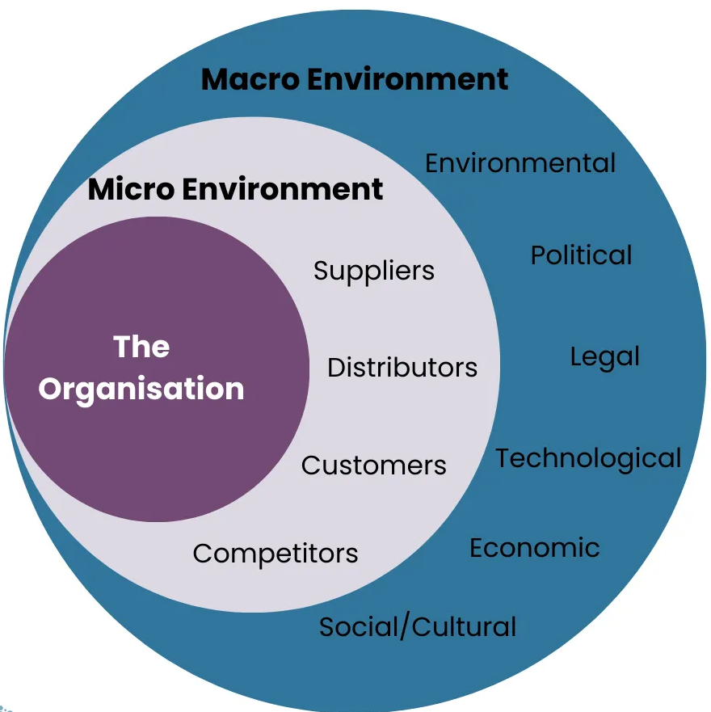

<div>
</div>
</div>

<!--
«Είπαμε πριν ότι η επιχείρηση είναι ανοιχτό σύστημα. Φανταστείτε την σαν ένα κρεμμύδι με επίπεδα. Στο κέντρο είμαστε εμείς (η οργάνωση). Γύρω μας είναι το Μικρο-περιβάλλον: πελάτες, προμηθευτές, ανταγωνιστές. Με αυτούς παλεύουμε καθημερινά. Και στο εξωτερικό στρώμα είναι το Μακρο-περιβάλλον: τα νομοσχέδια, η οικονομία, η τεχνολογία. Αυτά είναι τα "μεγάλα κύματα". Δεν μπορούμε να τα ελέγξουμε, αλλά αν δεν τα δούμε να έρχονται, θα μας πνίξουν.»
-->

---

# 1.1 Από το Περιβάλλον στη Στρατηγική

<!-- _class: diagram  xsmall -->

Η κατανόηση του περιβάλλοντος δεν είναι αυτοσκοπός — τροφοδοτεί τη **στρατηγική απόφαση**.

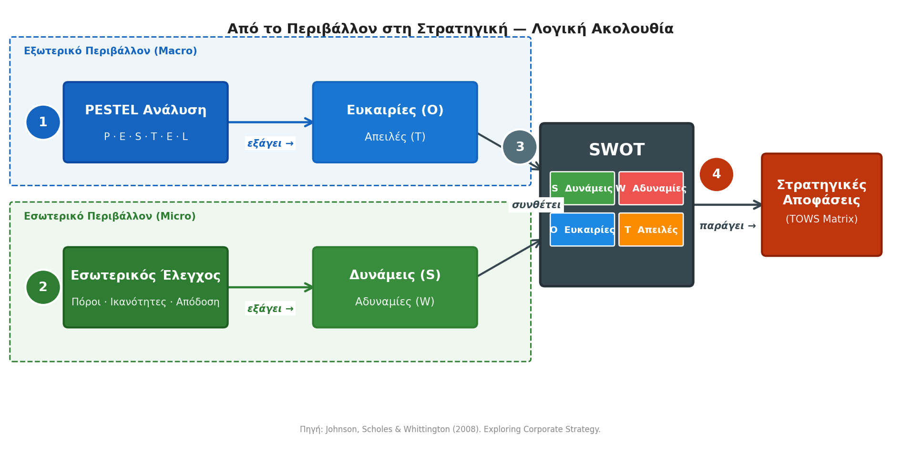

> **Λογική ακολουθία:** ① Σαρώνω εξωτερικό (PESTEL → O/T) → ② Αξιολογώ εσωτερικό (S/W) → ③ Συνθέτω (SWOT) → ④ Αποφασίζω (TOWS)

<!--
«Πώς λοιπόν "διαβάζουμε" αυτά τα κύματα; Ακολουθούμε μια πολύ συγκεκριμένη λογική ακολουθία, η οποία είναι η ραχοκοκαλιά της στρατηγικής ανάλυσης.

Βήμα 1: Σαρώνουμε το "έξω" με το εργαλείο PESTEL. Από εκεί εντοπίζουμε Ευκαιρίες και Απειλές.
Βήμα 2: Σαρώνουμε το "μέσα" (τους πόρους μας) και βρίσκουμε τις Δυνάμεις και τις Αδυναμίες μας.
Βήμα 3: Τα ενώνουμε όλα μαζί σε έναν πίνακα, στο περίφημο SWOT.
Βήμα 4: Αποφασίζουμε. Το SWOT από μόνο του είναι μια φωτογραφία. Εμείς θέλουμε δράση, γι' αυτό περνάμε στο TOWS για να πάρουμε στρατηγικές αποφάσεις. Ας τα δούμε ένα-ένα.»
-->

---

# 1.2 Στρατηγική Ανάλυση: PESTEL

<!-- _class: small -->

Εργαλείο ανάλυσης **Μακρο-περιβάλλοντος** (Johnson, Scholes & Whittington, 2008):

| Παράγοντας | Βασικές Ερωτήσεις | Παραδείγματα |
|---|---|---|
| **P**olitical | Πόσο σταθερό είναι το πολιτικό περιβάλλον; | Κυβερνητικές πολιτικές, φορολογία, εμπορικές συμφωνίες, κρατικές επιδοτήσεις |
| **E**conomic | Πού βρίσκεται ο οικονομικός κύκλος; | ΑΕΠ, πληθωρισμός, επιτόκια, ανεργία, συναλλαγματικές ισοτιμίες |
| **S**ocial | Πώς αλλάζει η κοινωνία; | Δημογραφία, lifestyle, εκπαίδευση, εργασιακές αξίες, αστικοποίηση |
| **T**echnological | Ποιες τεχνολογίες αναδύονται; | AI/Automation, R&D δαπάνες, ψηφιακός μετασχηματισμός, κυβερνοασφάλεια |
| **E**nvironmental | Ποιοι περιβαλλοντικοί κανόνες ισχύουν; | Κλιματική αλλαγή, Carbon footprint, νομοθεσία αποβλήτων, ανανεώσιμες πηγές |
| **L**egal | Ποιο ρυθμιστικό πλαίσιο διέπει τον κλάδο; | Εργατικό δίκαιο, GDPR, προστασία καταναλωτή, ανταγωνιστικό δίκαιο |

> Η PESTEL τροφοδοτεί τη **SWOT** με δεδομένα εξωτερικού περιβάλλοντος — οι **Ευκαιρίες & Απειλές** προκύπτουν από εδώ.

<!--
«Το PESTEL είναι ένα αρκτικόλεξο. Μας αναγκάζει να κοιτάξουμε 6 συγκεκριμένους τομείς του Μακρο-περιβάλλοντος: Πολιτικό, Οικονομικό, Κοινωνικό, Τεχνολογικό, Περιβαλλοντικό και Νομικό.

Για παράδειγμα, αν φτιάχνεις μια εφαρμογή, δεν σε νοιάζει μόνο τι κάνει ο ανταγωνιστής σου. Σε νοιάζει το Νομικό περιβάλλον, όπως το GDPR. Σε νοιάζει το Οικονομικό, όπως το αν υπάρχει πληθωρισμός και ο κόσμος έχει λιγότερα χρήματα να ξοδέψει. Ό,τι βρούμε εδώ, θα τροφοδοτήσει αργότερα τις Ευκαιρίες και τις Απειλές μας στο SWOT.»
-->

---

# 1.2 PESTEL: Πότε & Πώς Χρησιμοποιείται;

<!-- _class: small -->

<div class="columns">
<div>

**Πότε το χρειαζόμαστε;**

- 🌍 **Είσοδος σε νέα αγορά** — πριν επενδύσουμε σε άλλη χώρα ή κλάδο
- 📈 **Στρατηγικός Σχεδιασμός** — για τον καθορισμό μακροπρόθεσμου πλάνου
- 💰 **Αξιολόγηση Επενδύσεων** — για την κατανόηση του ρίσκου
- 🚨 **Σενάρια Κρίσης** — για προετοιμασία απέναντι σε απρόβλεπτες αλλαγές

</div>
<div>

**Η Μεθοδολογία 3 Βημάτων:**

🔍 **Scan** — Αναγνώρισε όλους τους εξωτερικούς παράγοντες που επηρεάζουν τον κλάδο σου σήμερα και στο μέλλον.

⚖️ **Assess** — Ιεράρχησε με τον τύπο:
**Σημαντικότητα = Επίδραση (1–5) × Πιθανότητα (1–5)**

🎬 **Act** — Μετέφερε μόνο τους κρίσιμους παράγοντες (υψηλότερο σκορ) στη SWOT ως **Ευκαιρίες (O)** ή **Απειλές (T)**.

</div>
</div>

**⚠️ Κοινές Παγίδες:**
- **Αοριστολογία:** όχι «η οικονομία είναι κακή» — αλλά «πληθωρισμός στο 9%»
- **Στατικότητα:** το PESTEL ανανεώνεται τουλάχιστον **ετήσια**
- **Απομόνωση:** μην αγνοείς αλληλεπιδράσεις (π.χ. νέα τεχνολογία AI → άμεσοι νέοι νομικοί κανόνες)

> *Πηγή: Johnson, Scholes & Whittington (2008). Exploring Corporate Strategy.*

<!--
«Το PESTEL δεν το κάνουμε κάθε μέρα. Το κάνουμε όταν σχεδιάζουμε τη στρατηγική μας για τα επόμενα χρόνια, όταν σκεφτόμαστε να μπούμε σε μια νέα αγορά, ή για να αξιολογήσουμε ένα μεγάλο ρίσκο.

Πώς γίνεται σωστά; Δεν γράφουμε απλώς μια λίστα. Αξιολογούμε (Assess). Πρέπει να βαθμολογήσουμε κάθε παράγοντα. Πόσο μεγάλη επίδραση θα έχει πάνω μας και πόσο πιθανό είναι να συμβεί;

Προσοχή στις παγίδες: Μην γράφετε αοριστίες όπως "η οικονομία είναι χάλια". Πρέπει να λέμε "ο πληθωρισμός είναι 9%". Επίσης, πρέπει να θυμάστε να το ανανεώνετε τακτικά, ο κόσμος αλλάζει.»
-->

---

# 1.2 PESTEL: Case Study — Tesla στην Ευρώπη (~2023)

<!-- _class: casestudy xxsmall -->


| Παράγοντας | Δεδομένο / Τάση | Επίδραση στην Tesla | O/T | Σημ. (1–5) |
|---|---|---|---|---|
| **Political** | EU Green Deal → κρατικές επιδοτήσεις EV | Αυξάνει ζήτηση & μειώνει τιμή αγοράς | O | 5 |
| **Political** | Εμπορικές εντάσεις EU–China (BYD, NIO) | Φθηνός ανταγωνισμός εισέρχεται στην EU | T | 4 |
| **Economic** | Υψηλά επιτόκια 2023–24 | Μικρότερη αγοραστική δύναμη, λιγότερα leasing | T | 4 |
| **Economic** | Ενεργειακή κρίση → κόστος παραγωγής | Πίεση margins στο Βερολίνο Gigafactory | T | 3 |
| **Social** | Αύξηση περιβαλλοντικής συνείδησης Gen Z/Millennials | Ευνοϊκή αντίληψη brand | O | 3 |
| **Social** | Ανησυχίες privacy (data collection οχημάτων) | Εμπόδιο αποδοχής σε EU αγορές | T | 3 |
| **Technological** | Εξέλιξη solid-state batteries (Toyota, ορίζοντας 2027–28) | Απειλή τεχνολογικής υπεροχής | T | 4 |
| **Technological** | EU charging infrastructure mandate 2025 | Μειώνει "range anxiety" — αφαιρεί εμπόδιο αγοράς | O | 3 |
| **Environmental** | EU: τέλος πωλήσεων ICE το **2035** | Νομοθετικό tailwind — αναπόφευκτη στροφή σε EV | O | 5 |
| **Environmental** | Carbon credits → έσοδο από παραδοσιακούς κατασκευαστές | Πρόσθετη έσοδα (πχ από Stellantis, Toyota) | O | 3 |
| **Legal** | GDPR: δεδομένα οδήγησης & cameras | Κόστος συμμόρφωσης, κίνδυνος προστίμων | T | 3 |
| **Legal** | AI Act EU: επηρεάζει Autopilot/FSD ως «high-risk AI» | Περιορισμοί ανάπτυξης autonomous features | T | 4 |

**Μεταφορά στο SWOT — επιλέγουμε τους παράγοντες με τη μεγαλύτερη σημαντικότητα:**
Ευκαιρίες: EU Green Deal (5), τέλος ICE 2035 (5) · Απειλές: BYD/NIO (4), επιτόκια (4), solid-state (4), AI Act (4)
*Η κατώφλι (εδώ: ≥ 4) είναι επιλογή της ομάδας — δεν υπάρχει καθολικός κανόνας.*
Τώρα που έχουμε τα **O και T** από το PESTEL, το επόμενο βήμα είναι να κοιτάξουμε **μέσα** στην εταιρεία — Δυνάμεις και Αδυναμίες. Αυτό κάνει το **SWOT**.

<!--
«Ας δούμε ένα πραγματικό, σύγχρονο παράδειγμα. Ας υποθέσουμε ότι είμαστε το Διοικητικό Συμβούλιο της Tesla και αναλύουμε την Ευρώπη για το 2023.

Κοιτάξτε τον πίνακα. Στο Περιβαλλοντικό/Πολιτικό περιβάλλον, η Ευρωπαϊκή Ένωση απαγορεύει τις πωλήσεις συμβατικών αυτοκινήτων από το 2035 και δίνει τεράστιες επιδοτήσεις για ηλεκτρικά (Green Deal). Αυτό για την Tesla είναι η απόλυτη Ευκαιρία (O), βαθμολογείται με 5 στα 5.

Από την άλλη, στο Τεχνολογικό και Νομικό, βλέπουμε Απειλές. Οι Κινέζοι, όπως η BYD, φέρνουν φθηνά ηλεκτρικά (βαθμός 4). Παράλληλα, το AI Act της Ευρώπης απειλεί να βάλει φρένο στην αυτόνομη οδήγηση (Autopilot) (βαθμός 4).

Τι κρατάμε από όλο αυτό; Στο τέλος, θα "μαζέψουμε" μόνο τα βαριά χαρτιά, τα 4άρια και τα 5άρια, και θα τα μεταφέρουμε στο SWOT. Τα πιο χαμηλά τα αγνοούμε προσωρινά για να εστιάσουμε στα κρίσιμα.»
-->

---

# 1.2 PESTEL — Γράφημα

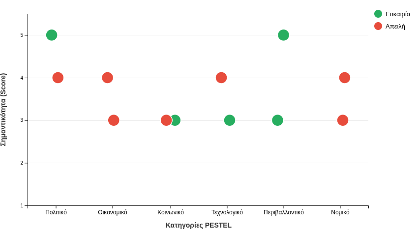

<!--
«Αν πάτε αυτόν τον πίνακα της προηγούμενης διαφάνειας σε ένα Διοικητικό Συμβούλιο, οι μισοί θα βαρεθούν. Η στρατηγική θέλει οπτικοποίηση. Εδώ έχουμε μετατρέψει την ανάλυσή μας για την Tesla σε ένα γράφημα διασποράς (scatter plot). Βλέποντας αυτό το γράφημα, ο εγκέφαλός μας αρχίζει αμέσως να αναγνωρίζει μοτίβα. Ας δούμε πώς διαβάζεται.»
-->

---

# 1.2 Πώς Διαβάζουμε το Γράφημα PESTEL;

**Οι κανόνες του παιχνιδιού**

- **Οριζόντιος Άξονας (X):** Πηγή του εξωτερικού παράγοντα — οι 6 κατηγορίες PESTEL
- **Κάθετος Άξονας (Y):** Σημαντικότητα / Βαθμός Επίδρασης (1–5) — όσο πιο ψηλά, τόσο πιο άμεση προσοχή απαιτείται από τη διοίκηση
- 🟢 **Πράσινο (Ευκαιρία):** "Ούριος άνεμος" — μας σπρώχνει μπροστά
- 🔴 **Κόκκινο (Απειλή):** "Αντίθετος άνεμος" — απαιτεί προσοχή ή άμυνα

<!--
«Οι κανόνες είναι απλοί. Στον οριζόντιο άξονα (Χ) έχουμε τις 6 κατηγορίες μας. Στον κάθετο άξονα (Υ) έχουμε τη βαθμολογία (1 έως 5). Ο κανόνας είναι: Όσο πιο ψηλά βρίσκεται μια τελεία, τόσο πιο "επείγουσα" είναι για τη Διοίκηση. Τα πράσινα είναι ο "ούριος άνεμος" – οι Ευκαιρίες που μας σπρώχνουν μπροστά. Τα κόκκινα είναι οι Απειλές – ο "αντίθετος άνεμος" που απαιτεί άμυνα.»
-->

---

**Τι παρατηρούμε στην Tesla με μια γρήγορη ματιά**

| Παρατήρηση | Ερμηνεία |
|---|---|
| Πολιτικό & Περιβαλλοντικό → 🟢 στο 5 | Ισχυρότεροι σύμμαχοι: κλιματική νομοθεσία + επιδοτήσεις |
| Οικονομικό & Νομικό → μόνο 🔴 (3–4) | "Τοξικές ζώνες": μόνο κίνδυνοι, καμία ευκαιρία |
| Τεχνολογικό → 🔴 στο 4 επισκιάζει 🟢 στο 3 | Ο ανταγωνισμός στις μπαταρίες απειλεί περισσότερο απ' ό,τι ωφελεί η τεχνολογική πρόοδος |

<!--
«Κοιτώντας το γράφημα της Tesla, βγάζουμε τρία άμεσα συμπεράσματα μέσα σε 5 δευτερόλεπτα.

Πρώτον: Οι τελείες στο "Πολιτικό" και το "Περιβαλλοντικό" χτυπάνε ταβάνι (στο 5) και είναι πράσινες. Εκεί είναι οι μεγαλύτεροι σύμμαχοί μας.

Δεύτερον: Το "Οικονομικό" και το "Νομικό" είναι τοξικές ζώνες. Έχουν μόνο κόκκινες τελείες, στο 3 και στο 4. Δεν υπάρχει καμία ευκαιρία εκεί, μόνο κίνδυνοι.

Τρίτον: Στο "Τεχνολογικό" έχουμε μια ευκαιρία στο 3 (φορτιστές), αλλά επισκιάζεται από μια ισχυρότερη απειλή στο 4 (μπαταρίες ανταγωνιστών).»
-->

---

**3 Στρατηγικά Patterns που ψάχνουμε**

| Pattern | Σήμα | Αντίδραση |
|---|---|---|
| **Risk Cluster** | Στήλη γεμάτη 🔴 ψηλά | Στρατηγική άμυνας — θωράκιση κόστους |
| **Growth Engine** | Στήλη με 🟢 ψηλά | Επένδυση / R&D για να εκμεταλλευτείς πριν τον ανταγωνισμό |
| **Tension Zone** | 🟢 και 🔴 ψηλά στην ίδια στήλη | "Καζάνι που βράζει" — καθημερινή παρακολούθηση |

> **Κανόνας για τη SWOT:** Παίρνουμε **μόνο τις τελείες στο επίπεδο 4–5** (πάνω μισό) και τις μεταφέρουμε ως **(O)** και **(T)**. Τα επίπεδα 1–3 αγνοούνται προσωρινά — δεν έχουν αρκετή στρατηγική βαρύτητα.

<!--
«Αυτό που μόλις κάναμε ονομάζεται αναγνώριση προτύπων (patterns). Ψάχνουμε 3 πράγματα:

Το Risk Cluster: μια στήλη γεμάτη απειλές. Εκεί ετοιμάζουμε άμυνα.

Τη Growth Engine: μια στήλη γεμάτη ευκαιρίες. Εκεί ρίχνουμε τα λεφτά μας για ανάπτυξη.

Το Tension Zone: όταν στην ίδια στήλη έχουμε και μεγάλη απειλή και μεγάλη ευκαιρία. Αυτό είναι ένα "καζάνι που βράζει" και απαιτεί καθημερινή προσοχή.

Ο χρυσός κανόνας πριν πάμε παρακάτω: Στο SWOT θα μεταφέρουμε μόνο τις τελείες που είναι στο πάνω μισό του γραφήματος (στο 4 και στο 5). Τα υπόλοιπα είναι "θόρυβος" και τα αγνοούμε προσωρινά.»
-->

---

# 1.3 Στρατηγική Ανάλυση: SWOT

Ανάλυση **εσωτερικών δυνατοτήτων** + σύνθεση με τα δεδομένα του PESTEL:

|  | Θετικά | Αρνητικά |
|---|---|---|
| **Εσωτερικά** (Παρούσα κατάσταση) | **S**trengths (Δυνάμεις) | **W**eaknesses (Αδυναμίες) |
| **Εξωτερικά** (Μελλοντική κατάσταση) | **O**pportunities (Ευκαιρίες) | **T**hreats (Απειλές) |

**Δύο χρήσεις:**
- Ανάλυση ανταγωνιστικής θέσης προϊόντος/υπηρεσίας
- Διάγνωση & αξιολόγηση συνολικής επιχείρησης

> Δυνάμεις/Αδυναμίες αναγνωρίζονται **από τον πελάτη** — Ευκαιρίες/Απειλές υπάρχουν στο **περιβάλλον**, όχι επειδή υπάρχουμε εμείς.

<!--
«Τώρα που "σαρώσαμε" το εξωτερικό περιβάλλον, ήρθε η ώρα να κοιτάξουμε τον καθρέφτη. Αυτό είναι το περίφημο SWOT.

Χωρίζεται σε δύο κόσμους. Τα θετικά και τα αρνητικά, τα εσωτερικά και τα εξωτερικά.

Οι Δυνάμεις και οι Αδυναμίες αφορούν το "Μέσα" μας – το τι κάνουμε εμείς σήμερα. Οι Ευκαιρίες και οι Απειλές αφορούν το "Έξω" – το τι υπάρχει εκεί έξω στο μέλλον, ανεξάρτητα από το αν εμείς υπάρχουμε ή όχι.»
-->

---

# 1.3 Οδηγός 5 Βημάτων για μια Επιτυχημένη Ανάλυση SWOT

<!-- _class: small -->

**5 βήματα:**

1. **Στοχοθέτηση & Ορισμός**: Προσδιορίστε με ακρίβεια το αντικείμενο της ανάλυσης. Είναι ένα νέο προϊόν, ένα συγκεκριμένο τμήμα ή ολόκληρος ο οργανισμός;
2. **Εσωτερική Χαρτογράφηση (Internal Audit)**: Καταγράψτε πόρους και ικανότητες. Εστιάστε στα οικονομικά μεγέθη, το ανθρώπινο δυναμικό, την τεχνολογική υποδομή και την αποδοτικότητα των διαδικασιών.
3. **Ακτινογραφία Περιβάλλοντος**: Συνδυάστε την ανάλυση PESTEL (για το μακρο-περιβάλλον) με τις 5 Δυνάμεις του Porter (για τον άμεσο ανταγωνισμό στον κλάδο).
4. **Φιλτράρισμα & Ιεράρχηση**: Μην καταγράφετε τα πάντα. Επιλέξτε τα 4–6 πιο κρίσιμα στοιχεία ανά τεταρτημόριο και ιεραρχήστε τα βάσει πιθανότητας και επίδρασης.
5. **Στρατηγική Σύνθεση (TOWS Matrix)**: Μετατρέψτε τη διάγνωση σε δράση συνδυάζοντας τα τεταρτημόρια.

| | **Ευκαιρίες (O)** | **Απειλές (T)** |
|---|---|---|
| **Δυνάμεις (S)** | SO: Αξιοποίησε δυνάμεις για ευκαιρίες | ST: Χρησιμοποίησε δυνάμεις για αποφυγή απειλών |
| **Αδυναμίες (W)** | WO: Βελτίωσε αδυναμίες για ευκαιρίες | WT: Ελαχιστοποίησε έκθεση σε κινδύνους |

<!--
«Ένα SWOT δεν είναι απλώς ένα brainstorming της στιγμής. Είναι μια διαδικασία 5 βημάτων.

Ορίζουμε τι ψάχνουμε (Βήμα 1). Κάνουμε τον εσωτερικό μας έλεγχο (Βήμα 2). Κάνουμε το PESTEL που είδαμε πριν (Βήμα 3). Φιλτράρουμε τα πιο σημαντικά (Βήμα 4).

Και φτάνουμε στο Βήμα 5: το TOWS Matrix. Το SWOT είναι η "διάγνωση" (σου λέει τι έχεις). Το TOWS είναι η "συνταγή του γιατρού" (σου λέει τι πρέπει να κάνεις). Εδώ παντρεύουμε τα τεταρτημόρια για να βγάλουμε δράσεις.»
-->

---

<!-- _class: casestudy xsmall -->

# 1.3 Case Study: SWOT — Tesla στην Ευρώπη (~2023)


<div class="swot-grid">
<div class="swot-box swot-s">
<div class="swot-label swot-s-label">💪 Δυνάμεις (Strengths) — Εσωτερικά</div>

- Ισχυρό brand name & φανατικό κοινό
- Gigafactory Βερολίνου → μειωμένα κόστη logistics
- Υπεροχή software & δίκτυο Superchargers
- Υψηλά περιθώρια κέρδους ανά όχημα

</div>
<div class="swot-box swot-o">
<div class="swot-label swot-o-label">🌟 Ευκαιρίες (Opportunities) — Εξωτερικά</div>

- **[5/5]** EU Green Deal: επιδοτήσεις & αύξηση ζήτησης EV
- **[5/5]** Νομοθεσία ΕΕ: τέλος πωλήσεων ICE το 2035

</div>
<div class="swot-box swot-w">
<div class="swot-label swot-w-label">📉 Αδυναμίες (Weaknesses) — Εσωτερικά</div>

- Περιορισμένη / «γερασμένη» γκάμα μοντέλων
- Ζητήματα quality control σε ορισμένες παρτίδες
- Εξάρτηση από την εικόνα του CEO (Elon Musk)
- Υψηλές τιμές ανταλλακτικών & περιορισμένο service

</div>
<div class="swot-box swot-t">
<div class="swot-label swot-t-label">⚠️ Απειλές (Threats) — Εξωτερικά</div>

- **[4/5]** Κινεζικός ανταγωνισμός στην Ευρώπη (BYD, NIO)
- **[4/5]** Υψηλά επιτόκια → μειωμένη αγοραστική δύναμη
- **[4/5]** Solid-state μπαταρίες ανταγωνιστών (π.χ. Toyota)
- **[4/5]** AI Act ΕΕ: περιορισμοί στο Autopilot / FSD

</div>
</div>

> ↑ Τα **[4/5] & [5/5]** πέρασαν αυτόματα από το PESTEL ως **(O) & (T)** — τα [1–3] αγνοήθηκαν.

<!--
«Ας δούμε το SWOT της Tesla συμπληρωμένο. Στις Δυνάμεις (S) βάλαμε το φοβερό λογισμικό της και το νέο εργοστάσιο στο Βερολίνο. Στις Αδυναμίες (W) βάλαμε τη "γερασμένη" γκάμα των μοντέλων της και κάποια θέματα ποιότητας κατασκευής.

Προσέξτε τις Ευκαιρίες (Ο) και τις Απειλές (Τ). Δίπλα τους βλέπετε τους αριθμούς [4/5] και [5/5]. Είναι τα στοιχεία που πήραμε "έτοιμα" από το γράφημα PESTEL που φτιάξαμε νωρίτερα! Έτσι τα εργαλεία συνδέονται μεταξύ τους.»
-->

---

<!-- _class: casestudy xxsmall -->

# 1.3 Case Study: Στρατηγική Σύνθεση TOWS — Tesla στην Ευρώπη


> Η **SWOT** μας λέει *πού βρισκόμαστε*. Η **TOWS** μας λέει *τι πρέπει να κάνουμε* — συνδυάζει τα τεταρτημόρια για να παράγει στρατηγικές δράσεις.

|  | 🌟 **Ευκαιρίες (O)**<br>EU Green Deal, Τέλος ICE 2035 | ⚠️ **Απειλές (T)**<br>BYD/NIO, Υψηλά Επιτόκια, AI Act |
|---|---|---|
| 💪 **Δυνάμεις (S)**<br>Gigafactory Βερολίνου, Υψηλά Περιθώρια, Software | **SO — Επίθεση / Ανάπτυξη**<br>Αξιοποίηση του Gigafactory για μαζική παραγωγή που καλύπτει την τεράστια ζήτηση που δημιουργεί το τέλος ICE το 2035 | **ST — Αξιοποίηση Δυνάμεων**<br>Χρήση υψηλών περιθωρίων για μείωση τιμών — χτυπά τον κινεζικό ανταγωνισμό (BYD) και αντισταθμίζει την πτώση αγοραστικής δύναμης λόγω επιτοκίων |
| 📉 **Αδυναμίες (W)**<br>Γερασμένη Γκάμα, Quality Control, Υψηλές Τιμές Service | **WO — Βελτίωση / Ευθυγράμμιση**<br>Νέο «budget» μοντέλο (π.χ. Model 2) για να αξιοποιηθούν οι κρατικές επιδοτήσεις Green Deal που στοχεύουν στη μάζα | **WT — Άμυνα / Επιβίωση**<br>Ριζική βελτίωση Quality Control στο Βερολίνο + αυστηρή προσαρμογή λογισμικού στον AI Act για αποφυγή προστίμων |

> 💡 **Παρατηρήστε:** μια αδυναμία (Γερασμένη Γκάμα) **μετατρέπεται σε project ανάπτυξης** (Νέο budget μοντέλο) όταν συνδυαστεί με μια ευκαιρία (EU Green Deal) — αυτή είναι η δύναμη της TOWS.

<!--
«Και εδώ γίνεται η μαγεία της στρατηγικής. Δεν κοιτάμε απλώς τα κουτάκια. Τα διασταυρώνουμε!

Ας πάρουμε τη στρατηγική WO (Βελτίωση). Έχουμε μια Αδυναμία (W): τα μοντέλα μας πάλιωσαν. Και έχουμε μια Ευκαιρία (Ο): το κράτος δίνει επιδοτήσεις (Green Deal) για να αγοράσει η μάζα ηλεκτρικά.

Ποια είναι η Στρατηγική Απόφαση; Σχεδιάζουμε ένα νέο, φθηνό "budget" μοντέλο (π.χ. το φημολογούμενο Model 2). Παίρνουμε δηλαδή μια αδυναμία και, χάρη στην ευκαιρία του περιβάλλοντος, τη μετατρέπουμε σε κινητήριο μοχλό ανάπτυξης!»
-->

---

# 1.4 Ανταγωνιστική Ανάλυση: 5 Δυνάμεις Porter

<!-- _class: xsmall -->

Ο **Porter (1980)** περιέγραψε τις 5 δυνάμεις που καθορίζουν την **ελκυστικότητα (κερδοφορία) ενός κλάδου** — εργαλείο για να εντοπίσουμε κυρίως τις **Απειλές (T)** στη SWOT, αλλά και **Ευκαιρίες (O)** όταν οι δυνάμεις είναι αδύναμες (ελκυστικός κλάδος).

<div class="columns">
<div>

**① Απειλή Νέων Εισερχομένων**
Πόσο εύκολα μπορεί να μπει νέος ανταγωνιστής και να μας πάρει μερίδιο;
*Εμπόδια εισόδου:* κεφάλαιο, πατέντες, νομικές άδειες, brand loyalty
*Παράδειγμα:* Είσοδος στην αυτοκινητοβιομηχανία (π.χ. Tesla) → τεράστιο αρχικό κεφάλαιο

**② Διαπραγματευτική Δύναμη Αγοραστών**
Μπορούν οι πελάτες να πιέσουν για χαμηλότερες τιμές ή καλύτερη ποιότητα;
*Καθορίζεται από:* Συγκέντρωση πελατών & κόστος αλλαγής προμηθευτή
*Παράδειγμα:* Supermarket chains επιβάλλουν τους όρους τους σε μικρούς, τοπικούς παραγωγούς

**③ Διαπραγματευτική Δύναμη Προμηθευτών**
Μπορούν οι προμηθευτές να επιβάλουν υψηλότερες τιμές ή σκληρούς όρους;
*Καθορίζεται από:* Αριθμός διαθέσιμων προμηθευτών & μοναδικότητα υλικών
*Παράδειγμα:* TSMC ελέγχει την παγκόσμια αγορά μικροτσίπ → τεράστια δύναμη vs. Apple & Nvidia

</div>
<div>

**④ Απειλή Υποκατάστατων Προϊόντων**
Υπάρχουν εναλλακτικές λύσεις (εκτός κλάδου) που καλύπτουν την ίδια ανάγκη του πελάτη;
*Καθορίζεται από:* Σχέση τιμής/απόδοσης & ευκολία μετάβασης
*Παράδειγμα:* Netflix & YouTube (streaming) ως άμεσα υποκατάστατα παραδοσιακών κινηματογράφων

**⑤ Ένταση Ανταγωνισμού (Rivalry)**
Πόσο σκληρά «χτυπιούνται» οι ήδη υπάρχοντες παίκτες μεταξύ τους;
*Καθορίζεται από:* Αριθμός ανταγωνιστών, ρυθμός ανάπτυξης αγοράς & πόλεμοι τιμών
*Παράδειγμα:* Αεροπορικές εταιρείες & πάροχοι τηλεπικοινωνιών

> 💡 **Χρυσός Κανόνας:** Όσο πιο ισχυρές οι 5 δυνάμεις συνολικά, τόσο **μικρότερο το περιθώριο κέρδους**. Αν όλες είναι υψηλές, ο κλάδος **δεν είναι ελκυστικός** για νέες επενδύσεις.

</div>
</div>

<!-- Όταν ψάχνουμε για Απειλές (Τ), το PESTEL δεν φτάνει. Πρέπει να κοιτάξουμε και τους άμεσους παίκτες γύρω μας. Ο Michael Porter μάς έδωσε το 1980 τις '5 Δυνάμεις'.
Είναι οι Νέοι Εισερχόμενοι, οι Αγοραστές, οι Προμηθευτές, τα Υποκατάστατα και ο Ανταγωνισμός.
Ο 'Χρυσός Κανόνας' του Porter είναι ένας: Όσο πιο ισχυρές είναι αυτές οι 5 δυνάμεις, τόσο λιγότερα λεφτά θα βγάλεις. Αν οι πελάτες εκβιάζουν για χαμηλές τιμές, οι προμηθευτές για υψηλές και μπαίνουν διαρκώς νέοι παίκτες (όπως π.χ. στις αεροπορικές εταιρείες), ο κλάδος δεν είναι ελκυστικός, όσο καλός manager κι αν είσαι. -->

---

# 1.4 Case Study: Netflix

<!-- _class: casestudy xsmall -->


<div class="columns">
<div>

**Strengths (Δυνάμεις)**
- Παγκόσμια αναγνωρισιμότητα & 260M+ συνδρομητές
- Δεδομένα συμπεριφοράς → εξατομίκευση
- Πρωτότυπο περιεχόμενο (Squid Game, Stranger Things)
- Τεχνολογική υποδομή (streaming, compression)

**Weaknesses (Αδυναμίες)**
- Υψηλό χρέος & υποχρεώσεις περιεχομένου (≈ $14B, 2022) για χρηματοδότηση originals
- Ιστορική εξάρτηση από έσοδα συνδρομών — περιορισμένη διαφοροποίηση εσόδων
- Κορεσμός αγοράς στη Δ. Ευρώπη & ΗΠΑ

</div>
<div>

**Opportunities (Ευκαιρίες)**
- Αναδυόμενες αγορές (Ασία, Αφρική, Λ. Αμερική)
- Επέκταση σε gaming & live events
- Επέκταση live sports & events (νέα κατηγορία συνδρομητών)

**Threats (Απειλές)**
- Έντονος ανταγωνισμός (Disney+, Amazon Prime, Apple TV+, HBO Max)
- Αύξηση κόστους παραγωγής περιεχομένου
- Ρυθμιστικές παρεμβάσεις σε δεδομένα χρηστών (GDPR)

</div>
</div>

> **SO στρατηγική:** Χρησιμοποίησε δεδομένα συμπεριφοράς (S) για να παράγεις στοχευμένο τοπικό περιεχόμενο στις αναδυόμενες αγορές (O).

*Snapshot: ~2022. Το SWOT αλλάζει με τον χρόνο — π.χ. το ad-supported tier που ήταν Opportunity τότε, σήμερα είναι ήδη υλοποιημένο.*

<!-- Ας δούμε ένα γρήγορο SWOT για το Netflix, περίπου το 2022. Δύναμή του (S) τα τεράστια δεδομένα που έχει για το τι βλέπουμε, και το πρωτότυπο περιεχόμενο (όπως το Squid Game). Αδυναμία του (W) τα τεράστια χρέη για να γυρίζει αυτές τις σειρές.
Ευκαιρία του (Ο) είναι οι αγορές της Ασίας και της Λ. Αμερικής που τώρα αναπτύσσονται.
Τι μας λέει η Στρατηγική SO (Δύναμη + Ευκαιρία); Μας λέει: 'Χρησιμοποίησε τον αλγόριθμό σου (Δύναμη) για να δεις τι αρέσει στους Ασιάτες, και φτιάξε τοπικές παραγωγές για να κυριαρχήσεις σε αυτές τις νέες αγορές (Ευκαιρία)'. Αυτό ακριβώς έκαναν -->

---

# 1.4 Case Study: Skroutz

<!-- _class: casestudy xsmall -->


<div class="columns">
<div>

**Strengths (Δυνάμεις)**
- Ηγετική θέση στην ελληνική αγορά σύγκρισης τιμών
- Ισχυρή αναγνωρισιμότητα & εμπιστοσύνη καταναλωτών
- Μεγάλος κατάλογος (~25M προϊόντα)
- Skroutz Marketplace & Skroutz Last Mile (logistics)

**Weaknesses (Αδυναμίες)**
- Γεωγραφική συγκέντρωση (κυρίως Ελλάδα/Κύπρος)
- Εξάρτηση από retailers — δεν ελέγχει αποθέματα/παράδοση
- Περιορισμένη διεθνής παρουσία

</div>
<div>

**Opportunities (Ευκαιρίες)**
- Ταχεία ανάπτυξη e-commerce στην Ελλάδα
- Επέκταση σε Βαλκάνια & Ν.Α. Ευρώπη
- Fintech: Skroutz Pay, BNPL υπηρεσίες
- Δεδομένα τιμών → B2B analytics υπηρεσίες

**Threats (Απειλές)**
- Είσοδος Amazon & Temu στην ελληνική αγορά
- Οικονομική αστάθεια → μείωση καταναλωτικής δαπάνης
- Αύξηση κόστους logistics & ενέργειας

</div>
</div>

> **WO στρατηγική:** Ανάπτυξη ισχυρών logistics (W) για να εκμεταλλευτεί την ανάπτυξη του e-commerce (O) πριν εισέλθει η Amazon.


<!--
Κλείνοντας με την ανάλυση SWOT, ας δούμε ένα παράδειγμα από την ελληνική αγορά: το Skroutz. Μια ξεκάθαρη δύναμή του είναι η ηγετική του θέση στην αναζήτηση. Όμως, είχε μια μεγάλη αδυναμία: δεν ήλεγχε την παράδοση, καθώς εξαρτιόταν από ανεξάρτητες εταιρείες κούριερ και τα καταστήματα. Με το ηλεκτρονικό εμπόριο να 'εκρήγνυται' (Ευκαιρία) αλλά με την απειλή εισόδου κολοσσών όπως η Amazon, τι έκαναν; Εφάρμοσαν μια στρατηγική WO: Πήραν την αδυναμία τους και επένδυσαν επιθετικά για να φτιάξουν το δικό τους δίκτυο logistics, το Skroutz Last Mile, 'κλειδώνοντας' έτσι τον πελάτη σε όλη την εμπειρία.
-->
---

# 1.4 Εργαλεία για SWOT Ανάλυση

<!-- _class: small -->

<div class="columns">
<div>

**Οπτικοποίηση & templates**
- **Canva** — έτοιμα SWOT templates, drag-and-drop
- **Miro / Mural** — collaborative online whiteboard, ομαδική ανάλυση σε πραγματικό χρόνο
- **Creately / Venngage** — specialized διαγράμματα

**Δομημένη συλλογή δεδομένων**
- **Google Sheets / Excel** — βαθμολόγηση & ιεράρχηση παραγόντων (weighted SWOT)
- **Notion / Confluence** — τεκμηρίωση & συνεργασία

</div>
<div>

**AI-υποστηριζόμενη ανάλυση**
- **ChatGPT / Claude** — brainstorming, πρόταση παραγόντων βάσει κλάδου
- **Perplexity** — γρήγορη αναζήτηση ανταγωνιστικών δεδομένων

**Ολοκληρωμένα frameworks**
- **TOWS Matrix** (επέκταση SWOT → στρατηγικές)
- **Balanced Scorecard** — σύνδεση SWOT με KPIs
- **Porter's 5 Forces** — τροφοδοτεί κυρίως τεταρτημόριο **Απειλών (T)**, δευτερευόντως Ευκαιριών (O)

</div>
</div>

> **Πρακτική συμβουλή:** Το SWOT είναι τόσο καλό όσο τα δεδομένα που το τροφοδοτούν. Ξεκίνα πάντα από PESTEL + εσωτερικό έλεγχο — όχι από εικασίες.

<!-- 
Στην πράξη, δεν σχεδιάζουμε αυτά τα μοντέλα σε χαρτοπετσέτες. Έχουμε σύγχρονα εργαλεία. Για την οπτικοποίηση και τη συνεργασία μιας απομακρυσμένης ομάδας, πλατφόρμες όπως το Canva, το Miro και το Mural είναι ιδανικές. Επίσης, εργαλεία Τεχνητής Νοημοσύνης, όπως το ChatGPT ή το Perplexity, μπορούν να κάνουν ένα εξαιρετικό αρχικό 'σκανάρισμα' της αγοράς και να προτείνουν παράγοντες. Ωστόσο, μην ξεχνάτε τον κανόνα: Το SWOT είναι τόσο καλό όσο τα δεδομένα που βάζετε μέσα. Αν ξεκινήσετε με εικασίες, θα καταλήξετε με λάθος στρατηγική
-->

---

# 2.1 Τι Σημαίνει «Ευθύνη» στις Εταιρείες;

<!-- _class: small -->

**Ευθύνη** = ποια περιουσία κινδυνεύει αν η εταιρεία αδυνατεί να πληρώσει τα χρέη της.

<div class="columns">
<div>

**Περιορισμένη Ευθύνη** ✅
*(ΑΕ, ΕΠΕ, ΙΚΕ)*

Ο εταίρος χάνει **μόνο** ό,τι έχει επενδύσει στην εταιρεία. Η **προσωπική περιουσία** (σπίτι, αυτοκίνητο, καταθέσεις) είναι **προστατευμένη**.

> **Παράδειγμα:** Βάζεις €10.000 σε μια ΙΚΕ. Η εταιρεία χρωστάει €100.000.
> Χάνεις τα €10.000 — **όχι** τα υπόλοιπα €90.000.

</div>
<div>

**Απεριόριστη Ευθύνη** ⚠️
*(ΟΕ — αλληλέγγυα και εις ολόκληρον)*

Οι πιστωτές μπορούν να στραφούν κατά της **προσωπικής περιουσίας** κάθε εταίρου για το σύνολο των χρεών.

> **Παράδειγμα:** ΟΕ με 2 εταίρους χρωστάει €50.000.
> Ο πιστωτής μπορεί να διεκδικήσει **ολόκληρα τα €50.000** από τον έναν εταίρο — ανεξάρτητα από το μερίδιό του.

</div>
</div>

> **Γιατί έχει σημασία:** Η επιλογή μορφής είναι πρωτίστως απόφαση **διαχείρισης κινδύνου** — πόσο από την προσωπική σου ζωή είσαι διατεθειμένος να βάλεις στο παιχνίδι.

<!-- 
Αφήνουμε τη στρατηγική και περνάμε στο πώς 'χτίζεται' πρακτικά μια εταιρεία. Η πιο κρίσιμη λέξη στη νομική μορφή είναι η 'Ευθύνη'. Αν η εταιρεία χρεοκοπήσει, ποιος πληρώνει τα σπασμένα; Στην Περιορισμένη Ευθύνη, ο επιχειρηματίας χάνει μόνο ό,τι κεφάλαιο έβαλε στην εταιρεία. Η προσωπική του περιουσία είναι νομικά προστατευμένη. Στην Απεριόριστη Ευθύνη, αντίθετα, οι δανειστές μπορούν να στραφούν κατά της προσωπικής περιουσίας των εταίρων (π.χ. σπίτια, καταθέσεις) για να καλύψουν τα χρέη της επιχείρησης.
-->

---

# 2.1 Νομικές Μορφές Επιχειρήσεων

<!-- _class: xxsmall -->

Κάθε νομική μορφή απαντά στο ίδιο ερώτημα: **«Ποιος ευθύνεται, για πόσο, και πώς χρηματοδοτείται η επιχείρηση;»** - **Κλειδί:** ΑΕ & ΕΠΕ & ΙΚΕ = «ασπίδα» περιουσίας (limited liability) · ΟΕ = «ανοιχτή» ευθύνη · ΕΕ = ενδιάμεσος συνδυασμός.

| Συντ. | Πλήρης Ονομασία | Τι σημαίνει στην πράξη | Ευθύνη εταίρων | Ελάχ. Κεφάλαιο | Παραδείγματα |
|---|---|---|---|---|---|
| **ΑΕ** | Ανώνυμη Εταιρεία | Το κεφάλαιο διαιρείται σε **μετοχές** που μπορούν να πωληθούν ελεύθερα. Οι μέτοχοι δεν χρειάζεται να γνωρίζονται μεταξύ τους («ανώνυμοι»). Διοικείται από **ΔΣ** και υποχρεούται σε δημοσίευση ισολογισμών. | Περιορισμένη — μόνο ως ύψος της μετοχής | €25.000 | ΔΕΗ ΑΕ, ΟΠΑΠ ΑΕ, Folli Follie |
| **ΕΠΕ** | Εταιρεία Περιορισμένης Ευθύνης | Το κεφάλαιο χωρίζεται σε **εταιρικά μερίδια** (όχι μετοχές). Κατάλληλη για μεσαίες επιχειρήσεις με **λίγους γνωστούς εταίρους** — λιγότερη γραφειοκρατία από ΑΕ. | Περιορισμένη — ως ύψος μεριδίου | €1 | Μεσαίες οικογενειακές επιχειρ. |
| **ΙΚΕ** | Ιδιωτική Κεφαλαιουχική Εταιρεία | Η **νεότερη μορφή** (Ν. 4072/2012). Ιδρύεται σε μία ημέρα online, με ελάχιστο κόστος. Εξαιρετική ευελιξία — ιδανική για **startups και ψηφιακές επιχειρήσεις**. | Περιορισμένη — ως ύψος εισφοράς | €1 | Startups, freelancers, tech SMEs |
| **ΟΕ** | Ομόρρυθμη Εταιρεία | «Ομόρρυθμη» = **όλοι οι εταίροι ευθύνονται με τον ίδιο (όμοιο) τρόπο**: προσωπικά, αλληλέγγυα και απεριόριστα. Αν η εταιρεία χρεωκοπήσει, ο πιστωτής μπορεί να πληρωθεί από **οποιονδήποτε** εταίρο. | **Απεριόριστη & αλληλέγγυα** — ολόκληρη η προσωπική περιουσία | — | Μικρές οικογενειακές επιχειρ. |
| **ΕΕ** | Ετερόρρυθμη Εταιρεία | «Ετερόρρυθμη» = **διαφορετική ευθύνη** για διαφορετικούς εταίρους. Τουλάχιστον ένας **ομόρρυθμος** (απεριόριστη ευθύνη, διαχειρίζεται) + τουλάχιστον ένας **ετερόρρυθμος** (περιορισμένη ευθύνη, μόνο επενδύει). | Μικτή — εξαρτάται από τον ρόλο | — | Παραδοσιακές εμπορικές επιχειρ. |


<!-- Στην Ελλάδα έχουμε συγκεκριμένες νομικές μορφές. Η Ανώνυμη Εταιρεία (ΑΕ) και η Εταιρεία Περιορισμένης Ευθύνης (ΕΠΕ) παρέχουν, όπως λέει και το όνομα, περιορισμένη ευθύνη. Η πιο σύγχρονη και ευέλικτη μορφή σήμερα, ειδικά για τον κλάδο της τεχνολογίας, είναι η ΙΚΕ. Ιδρύεται ταχύτατα ηλεκτρονικά, απαιτεί ελάχιστο κεφάλαιο (από 1 ευρώ) και παρέχει ασπίδα προστασίας. Στον αντίποδα, η Ομόρρυθμη Εταιρεία (ΟΕ) ενέχει απεριόριστη και αλληλέγγυα ευθύνη για όλους τους συνεταίρους. -->
---

# 2.1 Πότε Επιλέγω Ποια Μορφή;

<!-- _class: small -->

> Η επιλογή νομικής μορφής δεν είναι τυπική διαδικασία — είναι **στρατηγική απόφαση** που εξαρτάται από τους στόχους της επιχείρησης.

<div class="columns">
<div>

**Επιλέξτε ΑΕ όταν:**
- Θέλετε να **εισάγετε επενδυτές** ή να μπείτε στο χρηματιστήριο
- Η επιχείρηση έχει πολλούς μετόχους και **υψηλό κύκλο εργασιών**
- Χρειάζεστε **κύρος** απέναντι σε τράπεζες και μεγάλους πελάτες
- *Παράδειγμα:* Startup που στοχεύει σε venture capital χρηματοδότηση

**Επιλέξτε ΕΠΕ όταν:**
- Είστε 2–5 συνεταίροι με **σαφή συμφωνία** μεταξύ τους
- Θέλετε προστασία προσωπικής περιουσίας αλλά **λιγότερη γραφειοκρατία** από ΑΕ
- *Παράδειγμα:* Συνεταιρισμός δύο αρχιτεκτόνων

</div>
<div>

**Επιλέξτε ΙΚΕ όταν:**
- Είστε **νέος επιχειρηματίας** ή solopreneur με χαμηλό startup κόστος
- Θέλετε **ευελιξία** και γρήγορη ίδρυση (ηλεκτρονικά, 1 ημέρα)
- *Παράδειγμα:* Freelance developer που θέλει να τιμολογεί ως εταιρεία

**Επιλέξτε ΟΕ/ΕΕ όταν:**
- Πρόκειται για **μικρή οικογενειακή επιχείρηση** με απόλυτη εμπιστοσύνη μεταξύ εταίρων
- Δεν υπάρχει σημαντικός **επιχειρηματικός κίνδυνος** (π.χ. μικρό παντοπωλείο)
- ⚠️ Αποφύγετε αν υπάρχει ρίσκο χρεών

</div>
</div>

<!-- Η επιλογή δεν είναι θέμα λογιστή, είναι καθαρά στρατηγική απόφαση της διοίκησης. Αν στήνετε μια tech startup, η ΙΚΕ είναι η απόλυτη επιλογή λόγω ευελιξίας. Αν θέλετε να προσελκύσετε μεγάλα venture capitals, να εκδώσετε μετοχές ή να μπείτε στο χρηματιστήριο, ο δρόμος οδηγεί μονόδρομα στην ΑΕ. Η ΟΕ ταιριάζει κυρίως σε μικρές οικογενειακές επιχειρήσεις, όπου υπάρχει απόλυτη εμπιστοσύνη μεταξύ των μελών και ελάχιστο οικονομικό ρίσκο απέναντι σε τρίτους. -->

---

# 2.2 Οργανωτικά Σχήματα: Ορισμός & Τύποι

<!-- _class: xxsmall -->

**Οργανόγραμμα** = γραφική απεικόνιση της επίσημης δομής της επιχείρησης. Αποτυπώνει τρία βασικά στοιχεία: **ιεραρχία**, **γραμμές αναφοράς** και **καταμερισμός εξουσίας**.

*(Κατά Robbins & Coulter, 2018 · Daft, 2016 · Mintzberg, 1979)*

| # | Τύπος Δομής | Κεντρική Αρχή Οργάνωσης | Κατάλληλη για… |
|---|---|---|---|
| 1 | **Λειτουργική** (Functional) | Ομαδοποίηση βάσει **ειδικότητας** (π.χ. Δ/νση Marketing, Δ/νση HR) | Σταθερά περιβάλλοντα & βαθιά εξειδίκευση |
| 2 | **Τμηματική** (Divisional) | Αυτόνομες μονάδες (divisions) ανά **προϊόν, αγορά ή γεωγραφία** | Μεγάλες επιχειρήσεις με ποικιλία προϊόντων |
| 3 | **Μητρωική** (Matrix) | Διπλή γραμμή αναφοράς: **Τμήμα ειδικότητας + Project** | Πολύπλοκα έργα (π.χ. Κατασκευές, IT Consulting) |
| 4 | **Επίπεδη** (Flat) | Λίγα ιεραρχικά επίπεδα, ευρύ **span of control** | Ταχύτητα αποφάσεων (π.χ. Startups) |
| 5 | **Δικτυωτή** (Network) | Μικρός κεντρικός πυρήνας + δίκτυο **εξωτερικών συνεργατών** (outsourcing) | Μείωση σταθερών εξόδων & μέγιστη ευελιξία |
| 6 | **Ομαδική** (Team-based) | Αυτοδιαχειριζόμενες, **cross-functional** ομάδες χωρίς αυστηρή ιεραρχία | Καινοτομία & Agile περιβάλλοντα |

> 💡 **Θεωρία Ενδεχομενικότητας:** Δεν υπάρχει «ιδανική» δομή. Η επιλογή επηρεάζει **ταχύτητα απόκρισης**, **κόστος συντονισμού** και **ευελιξία** — εξαρτάται πάντα από την εκάστοτε κατάσταση *(situational approach, Burns & Stalker, 1961)*.

<!-- Αφού λύσαμε τα νομικά, πρέπει να οργανώσουμε τους ανθρώπους. Το οργανόγραμμα αποτυπώνει την ιεραρχία, τον καταμερισμό εργασίας και το ποιος αναφέρει σε ποιον. Υπάρχουν 6 βασικοί τύποι δομών: Λειτουργική, Τμηματική, Μητρωική, Επίπεδη, Δικτυωτή και Ομαδική. Ποιο είναι το καλύτερο; Σύμφωνα με τη Θεωρία της Ενδεχομενικότητας (Contingency Theory), το τέλειο οργανόγραμμα δεν υπάρχει. Η επιλογή εξαρτάται πάντα από το περιβάλλον, την αγορά και το αν ψάχνουμε ταχύτητα ή απόλυτο έλεγχο. -->
---

# 2.2 Λειτουργική Δομή (Functional)

<!-- _class: small -->

**Αρχή:** Κάθε τμήμα ομαδοποιεί εργαζόμενους με κοινή **ειδικότητα** (π.χ. Διεύθυνση Πωλήσεων, Διεύθυνση IT).

| Διάσταση | Ανάλυση |
|---|---|
| ✅ **Πλεονεκτήματα** | Βαθιά εξειδίκευση, οικονομίες κλίμακας, σαφής επαγγελματική εξέλιξη |
| ❌ **Μειονεκτήματα** | Δημιουργία «Silos» (στεγανά), αργή απόκριση στην αγορά, δυσκολία συντονισμού cross-department |
| 🎯 **Κατάλληλη για** | Σταθερό περιβάλλον, επιχειρήσεις με ένα ή λίγα βασικά προϊόντα |

**Παράδειγμα:** Δημόσιες υπηρεσίες, Παραδοσιακές Τράπεζες (π.χ. Εθνική Τράπεζα: Δ/νση Πιστοδοτήσεων, Δ/νση IT, Δ/νση HR).

> *Πηγή: Fayol (1916) — αρχή εξειδίκευσης · Robbins & Coulter (2018), Management, 14th ed.*

<!-- Η Λειτουργική δομή είναι η πιο κλασική. Ομαδοποιεί τους ανθρώπους βάσει της ειδικότητάς τους. Όλοι οι προγραμματιστές σε ένα τμήμα, όλοι οι πωλητές σε άλλο. Το μεγάλο πλεονέκτημα είναι η βαθιά εξειδίκευση  – γίνεσαι άριστος σε αυτό που κάνεις. Το μεγάλο μειονέκτημα είναι τα λεγόμενα 'Στεγανά' ή Silos. Το τμήμα marketing δεν μιλάει με το ΙΤ, ο συντονισμός είναι δύσκολος και η εταιρεία αργεί να βγάλει κάτι νέο στην αγορά -->
---

<!-- _class: diagram -->

# 2.2 Λειτουργική Δομή — Οργανόγραμμα: Apple Inc.

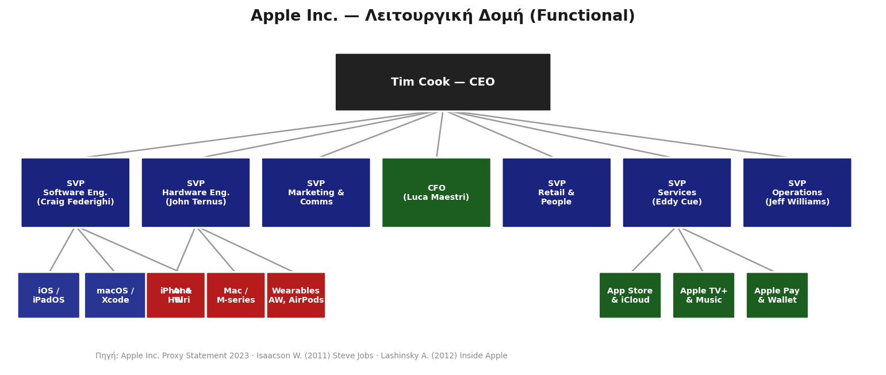

<!-- _class: xxsmall-->
**Χαρακτηριστικά Λειτουργικής Δομής Apple**

- Ο CEO λαμβάνει τελικές αποφάσεις σε όλες τις λειτουργίες
- Κάθε SVP ελέγχει μία λειτουργία παγκοσμίως (όχι ανά προϊόν)
- Δεν υπάρχουν «divisions» — το iPhone δεν έχει δικό του P&L
- Ευνοεί βαθιά τεχνολογική εξειδίκευση & ενιαία εμπειρία χρήστη

> 💡 **P&L** *(Profit & Loss)*: Κατάσταση αποτελεσμάτων ενός τμήματος — **Έσοδα − Κόστη = Κέρδος/Ζημία**. «Έχει δικό του P&L» σημαίνει ότι το τμήμα λογοδοτεί αυτόνομα για τα κέρδη και τις ζημίες του.

<!-- Αν νομίζετε ότι η Λειτουργική Δομή είναι μόνο για παλιές τράπεζες, κοιτάξτε την Apple. Ο Tim Cook δεν έχει έναν Διευθυντή για το iPhone και έναν για το Mac. Έχει Αντιπροέδρους (SVPs) που ελέγχουν οριζόντια τις λειτουργίες παγκοσμίως – για παράδειγμα, έναν για όλο το Software και έναν για όλο το Hardware. Αυτό επιτρέπει στην Apple να διατηρεί ενιαία τεχνολογική εμπειρία σε όλες της τις συσκευές, ενώ ο CEO είναι ο μόνος που έχει τη συνολική εικόνα κερδών και ζημιών -->
---

# 2.2 Τμηματική Δομή (Divisional)

<!-- _class: small -->

**Αρχή:** Κάθε τμήμα (division) λειτουργεί ως μια μικρή, **αυτόνομη επιχείρηση** με τις δικές της υπο-λειτουργίες.

**Οι 3 Παραλλαγές Τμηματοποίησης:**

| Βάση | Παράδειγμα Εφαρμογής |
|---|---|
| **Προϊόν** | Samsung: Mobile, Semiconductors, Home Appliances |
| **Γεωγραφία** | McDonald's: US, Europe, APMEA, International |
| **Πελάτης/Αγορά** | Microsoft: Consumer, Enterprise, Government |

| Διάσταση | Ανάλυση |
|---|---|
| ✅ **Πλεονεκτήματα** | Υψηλή ευελιξία, απόλυτη εστίαση σε αγορά/προϊόν, σαφής ευθύνη κερδών/ζημιών (P&L) ανά τμήμα |
| ❌ **Μειονεκτήματα** | Αλληλεπικάλυψη λειτουργιών (διπλά κόστη), εσωτερικός ανταγωνισμός μεταξύ divisions |

> *Πηγή: Chandler (1962), Strategy and Structure · Daft (2016), Organization Theory & Design, 12th ed.*

<!-- Στον αντίποδα, έχουμε την Τμηματική Δομή. Εδώ, 'σπάμε' τη μεγάλη εταιρεία σε αυτόνομες μονάδες (divisions), σαν μικρές εταιρείες μέσα στη μεγάλη. Μπορεί να χωριστεί με βάση το Προϊόν (π.χ. κινητά, οικιακές συσκευές), με βάση τη Γεωγραφία (π.χ. Ευρώπη, Ασία), ή βάσει Πελάτη. Κάθε division έχει δικό του P&L, είναι υπεύθυνο για τα δικά του κέρδη. Αυτό προσφέρει φοβερή εστίαση, αλλά κοστίζει, γιατί διπλοπληρώνεις λειτουργίες. Κάθε division έχει π.χ. δικό του ξεχωριστό τμήμα HR ή Λογιστήριο. -->
---

<!-- _class: diagram -->

# 2.2 Τμηματική Δομή — Οργανόγραμμα: Samsung Electronics

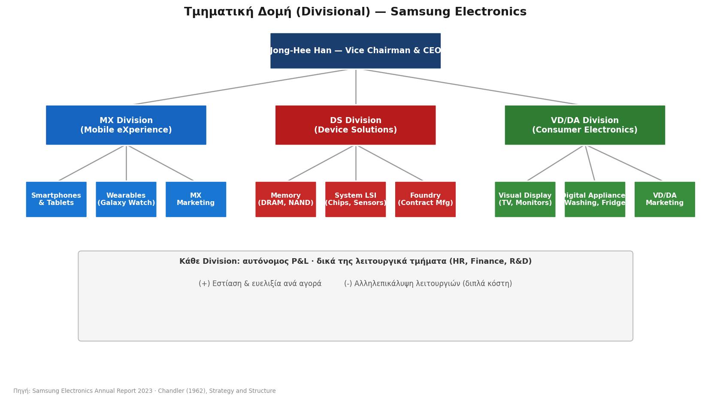

<!-- _class: xxsmall-->
**Κάθε Division: αυτόνομος P&L · δικά της λειτουργικά τμήματα (HR, Finance, R&D)**

- **(+)** Εστίαση & ευελιξία ανά αγορά
- **(-)** Αλληλεπικάλυψη λειτουργιών (διπλά κόστη)

<!-- Το τέλειο παράδειγμα τμηματικής δομής είναι η Samsung. Χωρίζεται σε εντελώς διαφορετικές μονάδες: MX (Κινητά) , DS (Ημιαγωγοί/Τσιπ) και VD/DA (Οικιακές Συσκευές). Το τμήμα που φτιάχνει smartphones (MX) έχει δικό του marketing και δικούς του στόχους, εντελώς ανεξάρτητα από το τμήμα που φτιάχνει τηλεοράσεις και ψυγεία. Αν η αγορά των τηλεοράσεων 'πέσει', δεν θα συμπαρασύρει τη λειτουργία και τις αποφάσεις του τμήματος κινητής τηλεφωνίας. -->
---

# 2.2 Μητρωική Δομή (Matrix)

<!-- _class: small -->

**Αρχή:** Διπλή γραμμή αναφοράς. Κάθε εργαζόμενος αναφέρεται σε **δύο προϊστάμενους ταυτόχρονα** (έναν λειτουργικό και έναν υπεύθυνο έργου).

| Διάσταση | Ανάλυση |
|---|---|
| ✅ **Πλεονεκτήματα** | Άριστη αξιοποίηση ειδικοτήτων, ευελιξία σε projects, ταχεία ροή πληροφορίας |
| ❌ **Μειονεκτήματα** | Σύγκρουση εξουσίας, σύγχυση ρόλων, αυξημένη γραφειοκρατία |
| 🎯 **Κατάλληλη για** | Aerospace, IT consulting, διαφημιστικές εταιρείες |

**Παράδειγμα:** NASA (1960s), McKinsey & Company, Accenture.

> *Πηγή: Davis & Lawrence (1977), Matrix · Mintzberg (1979), The Structuring of Organizations*

<!--  Αν η Λειτουργική δομή έχει ένα αφεντικό και η Τμηματική δημιουργεί μικρές 'αυτοκρατορίες', η Μητρωική Δομή έρχεται να τα περιπλέξει όλα – εσκεμμένα. Εδώ, ο βασικός κανόνας του παραδοσιακού management σπάει: Κάθε εργαζόμενος έχει δύο αφεντικά. Αναφέρεται σε έναν Λειτουργικό Διευθυντή (π.χ. Διευθυντή Προγραμματιστών) και ταυτόχρονα σε έναν Project Manager για το συγκεκριμένο έργο που δουλεύει. Είναι ιδανική για εταιρείες που δουλεύουν αποκλειστικά με projects, όπως οι εταιρείες πληροφορικής, η NASA ή μεγάλες συμβουλευτικές όπως η McKinsey. -->
---

<!-- _class: diagram -->

# 2.2 Μητρωική Δομή — Οργανόγραμμα (McKinsey style)

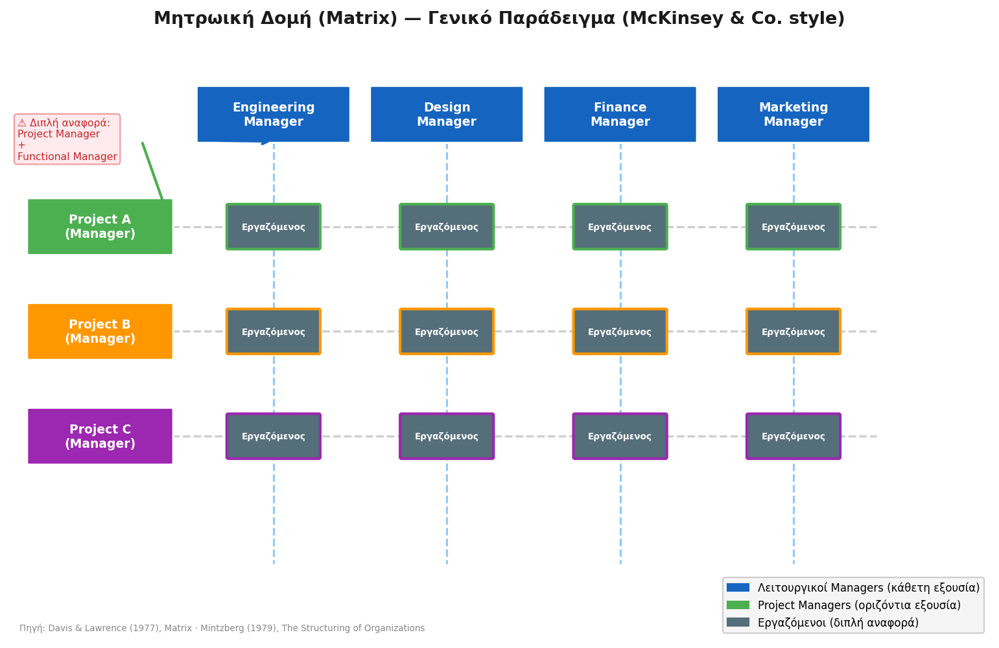

<!-- Κοιτάξτε πώς αποτυπώνεται αυτό οπτικά. Φανταστείτε ότι είστε ένας εργαζόμενος στο κέντρο αυτού του πλέγματος (Matrix). Κάθετα, ανήκετε στο τμήμα Design. Αν έχετε απορία για την καριέρα σας ή την άδειά σας, πάτε στον Design Manager. Οριζόντια, όμως, δουλεύετε στο 'Project A'. Εκεί, παίρνετε εντολές για την καθημερινή δουλειά από τον Project Manager. Αυτό προσφέρει τεράστια ευελιξία, αλλά κρύβει έναν τεράστιο κίνδυνο: Τη σύγκρουση εξουσίας. Αν ο ένας ζητάει το 'Α' και ο άλλος το 'Β', ο εργαζόμενος μπερδεύεται και η γραφειοκρατία εκτοξεύεται. -->
---

# 2.2 Επίπεδη & Δικτυωτή Δομή

<!-- _class: small -->

<div class="columns">
<div>

### Α. Επίπεδη Δομή (Flat)

**Αρχή:** Ελάχιστα ιεραρχικά επίπεδα, ευρύ εύρος ελέγχου (**span of control**).

- ✅ **Πλεονεκτήματα:** Ταχεία λήψη αποφάσεων, χαμηλό κόστος διοίκησης, υψηλή ενεργοποίηση εργαζομένων
- ❌ **Μειονεκτήματα:** Δυσκολία εφαρμογής σε μεγάλους οργανισμούς, κίνδυνος υπερφόρτωσης managers
- 🎯 **Παράδειγμα:** Valve (game studio), Spotify (Squad model), Startups

</div>
<div>

### Β. Δικτυωτή Δομή (Network)

**Αρχή:** Μικρός κεντρικός πυρήνας διοίκησης + εκτεταμένο δίκτυο **εξωτερικών συνεργατών** (outsourcing).

- ✅ **Πλεονεκτήματα:** Μέγιστη ευελιξία, πολύ χαμηλό σταθερό κόστος λειτουργίας
- ❌ **Μειονεκτήματα:** Εξάρτηση από τρίτους, δυσκολία άμεσου ελέγχου ποιότητας
- 🎯 **Παράδειγμα:** Nike (σχεδιασμός εσωτερικά, παραγωγή outsourced), Airbnb

</div>
</div>

> *Πηγή: Miles & Snow (1986), "Organizations: New Concepts for New Forms" · Castells (1996), The Rise of the Network Society*

<!-- Ας πάμε τώρα στα πιο σύγχρονα, 'ακραία' μοντέλα.
Από τη μία έχουμε την Επίπεδη Δομή (Flat). Εδώ, 'σκοτώνουμε' τη μεσαία διοίκηση. Δεν υπάρχουν προϊστάμενοι, υποδιευθυντές και τμηματάρχες. Λίγα ιεραρχικά επίπεδα, τεράστια αυτονομία.
Από την άλλη έχουμε τη Δικτυωτή Δομή (Network). Εδώ, 'σκοτώνουμε' τα περιουσιακά στοιχεία. Η εταιρεία είναι ένας μικρός εγκέφαλος στο κέντρο, και απολύτως όλα τα άλλα –από την παραγωγή μέχρι τη διανομή– γίνονται outsource (ανάθεση σε τρίτους). Τεράστια ευελιξία, μηδενικά πάγια κόστη. -->
---

<!-- _class: diagram-sm -->

# 2.2 Επίπεδη Δομή — Οργανόγραμμα: Valve Corporation

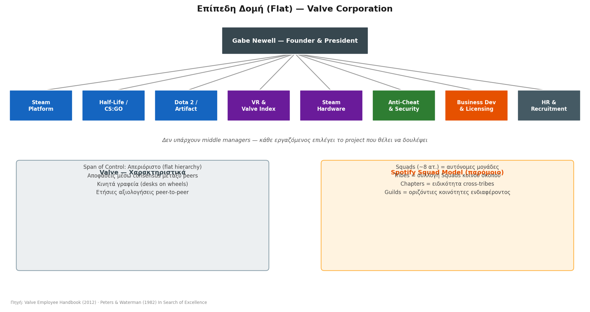

*Δεν υπάρχουν middle managers — κάθε εργαζόμενος επιλέγει το project που θέλει να δουλέψει*

<!-- _class: xxsmall -->
<div class="columns">
<div>

**Valve — Χαρακτηριστικά**

- Span of Control: Απεριόριστο (flat hierarchy)
- Αποφάσεις μέσω consensus μεταξύ peers
- Κινητά γραφεία (desks on wheels)
- Ετήσιες αξιολογήσεις peer-to-peer

</div>
<div>

**Spotify Squad Model (παρόμοιο)**

- Squads (~8 ατ.) = αυτόνομες μονάδες
- Tribes = συλλογή Squads κοινού σκοπού
- Chapters = ειδικότητα cross-tribes
- Guilds = οριζόντιες κοινότητες ενδιαφέροντος

</div>
</div>

<!-- Αν παίζετε βιντεοπαιχνίδια, σίγουρα ξέρετε τη Valve και το Steam. Η Valve είναι ίσως το πιο διάσημο παράδειγμα επίπεδης δομής. Υπάρχει ο ιδρυτής, Gabe Newell, και από κάτω... όλοι οι άλλοι. Δεν υπάρχουν τίτλοι. Τα γραφεία των προγραμματιστών έχουν ρόδες. Όταν κάποιος θέλει να δουλέψει σε ένα νέο project (π.χ. στο Half-Life), απλώς σπρώχνει το γραφείο του δίπλα στην ομάδα που το φτιάχνει. Αποφασίζουν τα πάντα ομαδικά. Παρόμοιο είναι και το περίφημο Squad Model του Spotify, όπου μικρές, αυτόνομες ομάδες δρουν σαν mini-startups μέσα στην ίδια την εταιρεία. -->

---

<!-- _class: diagram -->

# 2.2 Δικτυωτή Δομή — Οργανόγραμμα: Nike, Inc.

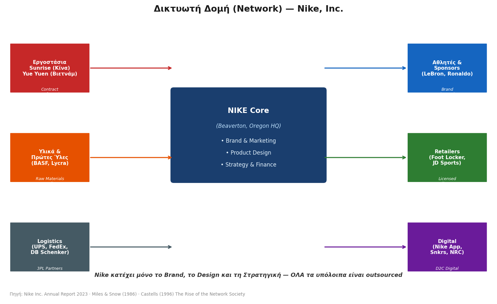

<!-- Πάμε στη Δικτυωτή Δομή. Πόσα παπούτσια νομίζετε ότι 'φτιάχνει' η ίδια η Nike; Η απάντηση είναι: μηδέν! Η Nike, στον πυρήνα της (στα κεντρικά της στο Oregon), κατέχει μόνο τρία πράγματα: το Brand, το Design και τη Στρατηγική. Τα υλικά τα αγοράζει από τη BASF. Τα ράβουν εργοστάσια στο Βιετνάμ. Τα μεταφέρει η UPS. Τα πουλάει το Foot Locker. Η Nike είναι απλώς ο 'μαέστρος' ενός τεράστιου παγκόσμιου δικτύου συνεργατών. -->
---

# 2.3 Συγκριτική Επισκόπηση Δομών

<!-- _class: small -->

| Δομή | Πηγή / Θεωρητικός | Ιδανική Συνθήκη | Παράδειγμα |
|---|---|---|---|
| **Λειτουργική** | Fayol (1916), Robbins & Coulter (2018) | Σταθερό περιβάλλον, ένα προϊόν | Δημόσιες υπηρεσίες, Εθνική Τράπεζα |
| **Τμηματική** | Chandler (1962), Daft (2016) | Πολλά προϊόντα/αγορές, ανάπτυξη | Samsung, McDonald's, Microsoft |
| **Μητρωική** | Davis & Lawrence (1977), Mintzberg (1979) | Projects, υψηλή εξειδίκευση | McKinsey, NASA, Accenture |
| **Επίπεδη** | Peters & Waterman (1982), Laloux (2014) | Startups, δημιουργικές βιομηχανίες | Valve, Spotify squads |
| **Δικτυωτή** | Miles & Snow (1986), Castells (1996) | Ευέλικτο μοντέλο, χαμηλό CAPEX | Nike, Airbnb, IKEA (μερικώς) |
| **Ομαδική** | Drucker (1988), Katzenbach & Smith (1993) | Καινοτομία, agile περιβάλλον | Amazon (two-pizza teams), Google |

> 💡 **Θεωρία Ενδεχομενικότητας:** Δεν υπάρχει «ιδανική» δομή. Η επιλογή εξαρτάται πάντα από τη στρατηγική, το μέγεθος, την τεχνολογία και το περιβάλλον *(Mintzberg, 1979 · Burns & Stalker, 1961)*.

<!-- Συνοψίζοντας: Ποια δομή είναι η καλύτερη; Η απάντηση, όπως μας λέει η Θεωρία της Ενδεχομενικότητας (Contingency Theory), είναι: Εξαρτάται. Αν είσαι μια παραδοσιακή τράπεζα σε σταθερό περιβάλλον, θες Λειτουργική (Fayol). Αν είσαι μια πολυεθνική με χιλιάδες προϊόντα όπως η Samsung, θες Τμηματική (Chandler). Αν είσαι μια ευέλικτη tech startup, πας σε Επίπεδη ή Ομαδική δομή. Το μυστικό είναι να ταιριάξεις τη δομή με το περιβάλλον. -->
---

<!-- _class: diagram -->

# 2.3 Οργανόγραμμα: Alphabet / Google — Holding Δομή

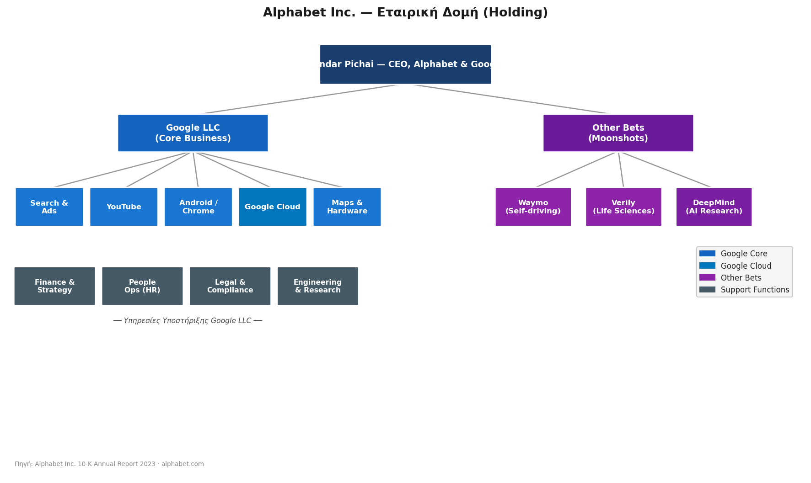

<!-- Και τι γίνεται όταν μια εταιρεία μεγαλώνει τόσο πολύ που δεν χωράει σε καμία κατηγορία; Δημιουργεί μια δομή 'Ομπρέλα', αυτό που λέμε Holding Company. Το 2015, η Google άλλαξε το όνομά της σε Alphabet. Ο Sundar Pichai είναι CEO της Alphabet. Από κάτω του, έχει 'σπάσει' την αυτοκρατορία σε δύο κόσμους. Τη 'Google LLC' που βγάζει τα χρήματα (Search, YouTube) και τα 'Other Bets', δηλαδή τα στοιχήματα του μέλλοντος (όπως τα αυτόνομα οχήματα της Waymo ή η Τεχνητή Νοημοσύνη της DeepMind). -->
---

# 2.3 Alphabet / Google — Holding Δομή

**Holding:** Η μητρική (Alphabet) κατέχει μετοχές των θυγατρικών αλλά **δεν παρεμβαίνει** στις καθημερινές λειτουργίες τους — κάθε θυγατρική έχει δικό της management και P&L. Το πλεονέκτημα: **απομόνωση ρίσκου** — αν αποτύχει μια θυγατρική (π.χ. Waymo), δεν «μολύνει» τα υπόλοιπα.

| Θυγατρική | Ρόλος |
|---|---|
| **Google LLC** | Κύρια εσοδογόνος (Search, YouTube, Cloud) |
| **Other Bets** | Μακροπρόθεσμες επενδύσεις υψηλού ρίσκου (Waymo, DeepMind, Verily) |

<!-- Γιατί η Google μπήκε σε αυτόν τον κόπο; Για έναν πολύ συγκεκριμένο λόγο: Την απομόνωση του ρίσκου. Τα projects όπως τα αυτόνομα αυτοκίνητα ή η έρευνα στην υγεία 'καίνε' δισεκατομμύρια και συχνά αποτυγχάνουν. Φτιάχνοντας ξεχωριστές εταιρείες κάτω από την ομπρέλα της Alphabet, η διοίκηση διασφαλίζει ότι αν η Waymo χρεοκοπήσει, δεν θα 'μολύνει' τα κέρδη και τη μετοχή της βασικής μηχανής αναζήτησης. Κάθε θυγατρική παλεύει μόνη της. -->
---

<!-- _class: diagram -->

# 2.3 Οργανόγραμμα: Amazon — Divisional + Two-Pizza Teams

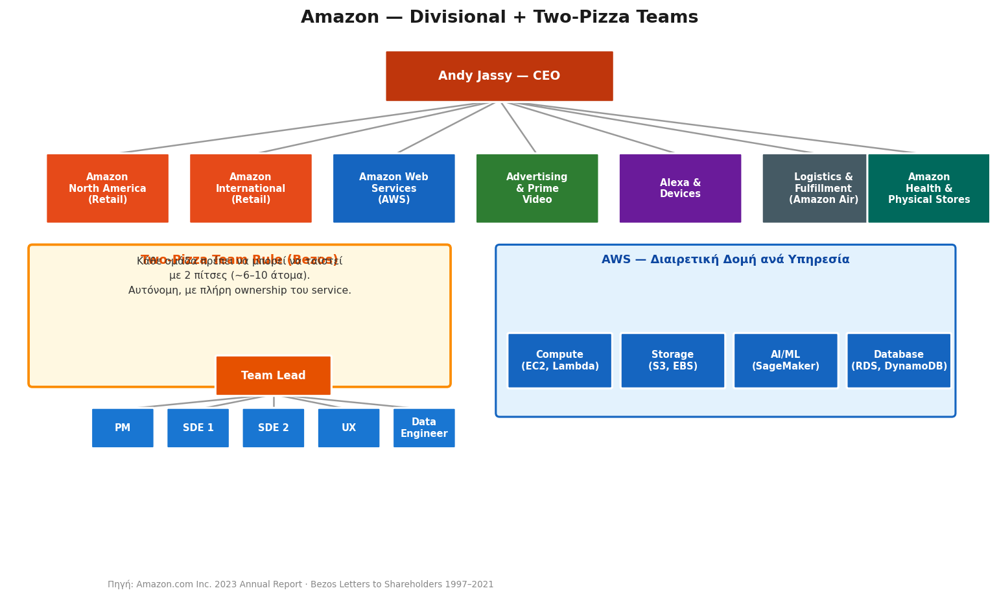

<!-- Η Amazon μάς δείχνει πώς μπορείς να συνδυάσεις τη μακρο-κλίμακα με τη μικρο-κλίμακα. Σε μακρο-επίπεδο, κάτω από τον CEO Andy Jassy, η Amazon έχει μια κλασική Τμηματική (Divisional) δομή: Άλλο τμήμα το e-commerce της Αμερικής, άλλο το AWS (Cloud), άλλο το Prime Video. Όμως, αν κάνουμε ζουμ μέσα στο AWS, θα δούμε το μυστικό της επιτυχίας τους... -->
---

# 2.3 Amazon — Divisional + Two-Pizza Teams

**Divisional:** Κάθε business unit (AWS, Retail, Advertising…) λειτουργεί αυτόνομα με δικό του P&L και management.


🍕 **Two-Pizza Rule (Bezos):** Κάθε ομάδα πρέπει να μπορεί να ταϊστεί με **2 πίτσες** (~6–10 άτομα). Μικρή ομάδα = γρήγορες αποφάσεις + πλήρες ownership του service — χωρίς γραφειοκρατία.

<!-- Το μυστικό αυτό είναι ο Κανόνας των Δύο Πιτσών (Two-Pizza Rule) του Jeff Bezos. Ο Bezos μισούσε τη γραφειοκρατία. Επέβαλε λοιπόν τον εξής κανόνα: Καμία ομάδα δεν πρέπει να είναι τόσο μεγάλη, ώστε να μην μπορούν να χορτάσουν τα μέλη της με 2 πίτσες. Μιλάμε για ομάδες 6 έως 10 ατόμων. Αυτές οι μικρές ομάδες έχουν πλήρη ευθύνη (ownership) του κομματιού τους, παίρνουν αποφάσεις αστραπιαία χωρίς να ρωτάνε 10 διευθυντές, και λειτουργούν σαν μικρές startups μέσα στον γίγαντα της Amazon. -->
---

# 2.3 Δύο Βασικές Μεταβλητές Οργανωτικής Δομής

<!-- _class: small -->

Κάθε οργανόγραμμα ορίζεται από δύο κρίσιμες παραμέτρους:

**① Εύρος Ελέγχου (Span of Control)**
Πόσους υφισταμένους ελέγχει **άμεσα** ένας manager;

| | Στενό Span | Ευρύ Span |
|---|---|---|
| **Επίπεδα ιεραρχίας** | Πολλά (tall structure) | Λίγα (flat structure) |
| **Εποπτεία** | Στενή, χαμηλή αυτονομία | Χαλαρή, υψηλή αυτονομία |
| **Κόστος** | Υψηλό (πολλοί managers) | Χαμηλό |
| **Παράδειγμα** | Στρατός, νοσοκομεία | Spotify squads, Valve |

**② Συγκεντρωτισμός vs Αποκέντρωση (Centralization / Decentralization)**
*Πού λαμβάνονται οι αποφάσεις;*

- **Συγκεντρωτισμός:** αποφάσεις στην κορυφή — ταχύτατη ευθυγράμμιση, λιγότερη ευελιξία
  *Παράδειγμα: Apple — ο CEO ελέγχει product direction*
- **Αποκέντρωση:** αποφάσεις στα επιμέρους τμήματα/ομάδες — ευελιξία, τοπική γνώση
  *Παράδειγμα: Amazon Two-Pizza Teams — κάθε ομάδα αποφασίζει για το δικό της service*

<!--  Κλείνοντας το κεφάλαιο των οργανωτικών δομών , πρέπει να θυμάστε ότι κάθε οργανόγραμμα, από το πιο απλό μέχρι το πιο περίπλοκο, ορίζεται από δύο μεταβλητές.
Η πρώτη είναι το Εύρος Ελέγχου (Span of Control). Πόσους υφισταμένους ελέγχεις άμεσα; Στον στρατό (στενό εύρος) ελέγχεις λίγους, έχεις αυστηρή ιεραρχία. Στη Valve ή το Spotify (ευρύ εύρος), ελέγχεις δεκάδες, δίνοντας τεράστια αυτονομία.
Η δεύτερη μεταβλητή είναι ο Συγκεντρωτισμός. Πού παίρνονται οι αποφάσεις; Στην κορυφή, όπως κάνει η Apple , ή στα κάτω κλιμάκια, όπως είδαμε με τις 'Δύο Πίτσες' της Amazon; Αυτές οι δύο επιλογές καθορίζουν το DNA της εταιρείας σας. -->
---

# 3.1 Ορισμός Μάνατζμεντ

> *«Μάνατζμεντ είναι η διαδικασία του **προγραμματισμού**, της **οργάνωσης**, της **ηγεσίας** και του **ελέγχου**, οι προσπάθειες των μελών της οργάνωσης και των άλλων παραγωγικών πόρων, για την επιτυχία των καθορισμένων στόχων της οργάνωσης.»*
> — Stoner & Wankel (1986)

**Δύο βασικές διαστάσεις επίδοσης:**

| Διάσταση | Ερώτηση | Εστίαση |
|---|---|---|
| **Αποδοτικότητα** (Efficiency) | Κάνουμε τα πράγματα **σωστά**; | Βέλτιστη χρήση πόρων |
| **Αποτελεσματικότητα** (Effectiveness) | Κάνουμε τα **σωστά** πράγματα; | Επιτυχία σωστών στόχων |

> **Παράδειγμα (Kodak):** Η Kodak κατασκεύαζε φωτογραφικό φιλμ με μηδενική σπατάλη — **άκρως αποδοτική**. Αλλά η αγορά στράφηκε στις ψηφιακές κάμερες. Το να είσαι υπερβολικά αποδοτικός σε κάτι που δεν έχει πλέον ζήτηση είναι άχρηστο: **αποδοτικότητα χωρίς αποτελεσματικότητα = καταστροφή**.

<!-- Και τώρα περνάμε στον πυρήνα. Τι είναι τελικά το Μάνατζμεντ; Είναι η προσπάθεια να πετύχουμε τους στόχους του οργανισμού μέσα από τον συντονισμό πόρων.
Υπάρχουν δύο λέξεις που συχνά τις μπερδεύουμε, αλλά η διαφορά τους είναι θέμα ζωής και θανάτου για την επιχείρηση: η Αποδοτικότητα (Efficiency) και η Αποτελεσματικότητα (Effectiveness).
Αποδοτικότητα είναι να κάνεις κάτι σωστά, χωρίς σπατάλες. Αποτελεσματικότητα είναι να κάνεις το σωστό πράγμα. Σκεφτείτε την Kodak: ήταν 100% αποδοτική στο να φτιάχνει φωτογραφικά φιλμ με μηδενικό κόστος. Αλλά δεν ήταν αποτελεσματική, γιατί η αγορά ήθελε ψηφιακές κάμερες. Το να είσαι άριστος σε κάτι που δεν θέλει κανείς, οδηγεί στην καταστροφή. -->
---

# 3.1 Οι 4 Λειτουργίες του Μάνατζμεντ

Ο **Henri Fayol** (1841–1925) ήταν ο πρώτος που περιέγραψε συστηματικά τις διοικητικές λειτουργίες:

| Λειτουργία | Περιεχόμενο |
|---|---|
| **Προγραμματισμός** (Planning) | Καθορισμός στόχων & επιλογή μέσων επίτευξής τους |
| **Οργάνωση** (Organizing) | Διαίρεση εργασίας, ανάθεση αρμοδιοτήτων, δομή |
| **Διεύθυνση/Ηγεσία** (Directing) | Παρακίνηση, επικοινωνία, ηγεσία ομάδων |
| **Έλεγχος** (Controlling) | Παρακολούθηση απόδοσης & διορθωτικές κινήσεις |

> Τα στελέχη διαφορετικών επιπέδων αφιερώνουν **διαφορετικό χρόνο** σε κάθε λειτουργία.

<!-- 
Πώς τα πετυχαίνει αυτά ένας manager; Ο Henri Fayol, πριν από έναν αιώνα, μας έδωσε τον χάρτη που ισχύει μέχρι σήμερα. Ένας manager κάνει 4 πράγματα:  


Προγραμματίζει: Βάζει τον στόχο.  


Οργανώνει: Μοιράζει τη δουλειά και τους πόρους.  


Ηγείται: Εμπνέει, παρακινεί και επικοινωνεί με τους ανθρώπους.  


Ελέγχει: Μετράει το αποτέλεσμα και διορθώνει τα λάθη.
Αν παραλείψεις έστω και ένα από αυτά, το σύστημα καταρρέει.
-->
---
<!-- _class: xsmall -->

# 3.2 Διοικητικοί Ρόλοι (Mintzberg)

<div class="columns">
<div>

Ο **Henry Mintzberg** περιέγραψε **10 ρόλους** διοίκησης οργανωμένους σε **3 κατηγορίες**, που επιβάλλονται από το εσωτερικό και εξωτερικό περιβάλλον:

<div class="columns">

**Διαπροσωπικοί**
- Βιτρίνα (Figurehead)
- Ηγέτης (Leader)
- Συνδετικός κρίκος (Liaison)

**Πληροφοριακοί**
- Δέκτης (Monitor)
- Πομπός (Disseminator)
- Εκπρόσωπος-Ομιλητής

</div>

**Λήψης Αποφάσεων**
- Επιχειρηματίας · Διαχειριστής Κρίσεων · Διαχειριστής Πόρων · Διαπραγματευτής

</div>
<div>


</div>

</div>

<!-- Αυτά έλεγε ο Fayol στη θεωρία. Όμως, αν ρωτήσετε έναν manager "τι έκανες σήμερα;", δεν θα σας πει "σήμερα το πρωί προγραμμάτιζα και το απόγευμα οργάνωνα". Η δουλειά του είναι χάος!
Ο Henry Mintzberg το κατάλαβε αυτό και είπε ότι ο manager είναι ουσιαστικά ένας ηθοποιός που αλλάζει 10 διαφορετικούς ρόλους μέσα στη μέρα. Χωρίζονται σε τρεις κατηγορίες: Διαπροσωπικοί (όταν λειτουργεί ως ηγέτης) , Πληροφοριακοί (όταν μαζεύει και μεταδίδει πληροφορίες) , και Λήψης Αποφάσεων (όταν σβήνει φωτιές και λύνει κρίσεις) -->
---

# 3.2 Μια Μέρα στη Ζωή ενός Manager

<!-- _class: casestudy xxsmall -->

**👤 Ελένη — Operations Manager** &nbsp;|&nbsp; E-commerce Startup &nbsp;|&nbsp; 15 άτομα &nbsp;|&nbsp; 2.000 παραγγελίες/ημέρα &nbsp;|&nbsp; Πρόκληση: Ταχύτητα, ακρίβεια & διαχείριση απροόπτων

| Ώρα | 🎯 Δράση | 🧠 Λειτουργία (Fayol) | 🎭 Ρόλος (Mintzberg) |
|---|---|---|---|
| **09:00** 🌅 | Εβδομαδιαία συνάντηση: θέτει στόχο Delivery SLA <95' | **ΠΡΟΓΡΑΜΜΑΤΙΣΜΟΣ** — Καθορίζει τι πρέπει να επιτευχθεί | **ΗΓΕΤΗΣ** — Δίνει κατεύθυνση & κίνητρο στην ομάδα |
| **10:30** 🚨 | Κρίση: ο 3PL συνεργάτης δεν παραδίδει λόγω απεργίας | **ΗΓΕΣΙΑ/ΔΙΕΥΘΥΝΣΗ** — Αναλαμβάνει δράση για επίλυση | **ΔΙΑΧΕΙΡΙΣΤΗΣ ΚΡΙΣΕΩΝ** — Πυροσβεστικός ρόλος |
| **12:00** 📧 | Email στον CEO με ανάλυση 3 εναλλακτικών λύσεων | **ΗΓΕΣΙΑ/ΔΙΕΥΘΥΝΣΗ** — Καθοδήγηση & λήψη απόφασης | **ΕΚΠΡΟΣΩΠΟΣ** — Μιλά εκ μέρους του τμήματός της |
| **14:00** 👋 | Briefing νέου Warehouse Coordinator (Onboarding) | **ΟΡΓΑΝΩΣΗ** — Εντάσσει τον πόρο στη δομή | **ΗΓΕΤΗΣ** — Εκπαιδεύει & καθοδηγεί |
| **16:00** 📊 | Ανασκόπηση KPIs: on-time %, επιστροφές, κόστος/παραγγελία | **ΕΛΕΓΧΟΣ** — Συγκρίνει στόχο <95' με πραγματικότητα | **ΔΕΚΤΗΣ ΠΛΗΡΟΦΟΡΙΩΝ (Monitor)** — Συλλέγει δεδομένα |
| **17:00** 🤝 | 1:1 με Data Analyst — βελτίωση reporting dashboard | **ΟΡΓΑΝΩΣΗ** — Διαμορφώνει τα εργαλεία | **ΣΥΝΔΕΣΜΟΣ (Liaison)** — Γεφυρώνει Operations & Data/IT |

<!-- Για να το κάνουμε απολύτως χειροπιαστό, ας δούμε την Ελένη. Είναι Operations Manager σε ένα e-shop που στέλνει 2.000 παραγγελίες τη μέρα.
Στις 09:00 το πρωί βάζει τον στόχο στην ομάδα της: "Θέλουμε οι παραδόσεις να γίνονται σε κάτω από 95 λεπτά". Εδώ ασκεί Προγραμματισμό (Fayol) και τον ρόλο του Ηγέτη (Mintzberg).
Στις 10:30 σκάει η βόμβα: τα βανάκια της κούριερ κάνουν απεργία. Τώρα αλλάζει καπέλο. Γίνεται Διαχειριστής Κρίσεων και πρέπει να βρει λύση στο δευτερόλεπτο (Ηγεσία/Διεύθυνση).
Στις 16:00 κοιτάζει τα δεδομένα για να δει αν έπιασαν τα 95 λεπτά. Εδώ κάνει Έλεγχο και λειτουργεί ως Δέκτης Πληροφοριών. -->
---

# 3.2 Εστίαση: Τι Σημαίνει «Delivery SLA <95'»;

<!-- _class: casestudy xsmall -->

**SLA = Service Level Agreement** — η «υπόσχεση» ποιότητας που δίνει η εταιρεία στους πελάτες της.

> Από τη στιγμή που ο πελάτης πατά **«Ολοκλήρωση Παραγγελίας»** μέχρι να χτυπήσει το κουδούνι ο διανομέας: **≤ 95 λεπτά**.

**Γιατί είναι σημαντικός — και δύσκολος — αυτός ο στόχος;**

| | |
|---|---|
| 🔗 **Απόλυτος συντονισμός** | Για 2.000 παραγγελίες/ημέρα πρέπει: παραγγελία στο σύστημα → picking & packing στην αποθήκη → παράδοση χωρίς καθυστέρηση — όλα σε σειρά και χωρίς κενά |
| 📏 **Είναι μετρήσιμος** | Δεν λέει «πηγαίνετε γρήγορα» — βάζει **ποσοτικό στόχο** που θα ελέγξει στις 16:00 (KPI review) |
| 🎯 **Δείχνει τον Προγραμματισμό** | Η δουλειά του manager στις 09:00 είναι να βάλει τον «πήχη» — αυτό ακριβώς λέει ο Fayol: **Planning = καθορισμός στόχων** |

> Το Delivery SLA είναι ο **«παλμός»** μιας εταιρείας διανομών. Αν ο μέσος χρόνος ανέβει στα 120', το SLA έχει **«σπάσει» (breached)** — και η Ελένη πρέπει να βρει τι πήγε στραβά στην αλυσίδα.

<!-- Ας σταθούμε λίγο στον στόχο που έβαλε η Ελένη: το "Delivery SLA <95 λεπτά". Το SLA είναι η υπόσχεσή μας στον πελάτη.
Γιατί είναι τόσο σωστός αυτός ο στόχος; Πρώτον, γιατί είναι απόλυτα μετρήσιμος. Δεν είπε στην ομάδα της "πηγαίνετε γρήγορα". Είπε "95 λεπτά". Δεύτερον, γιατί για να επιτευχθεί για 2.000 παραγγελίες, απαιτεί το τέλειο "συγχρονισμένο κολύμπι" σε όλα τα στάδια: από το κλικ του πελάτη, μέχρι το πακετάρισμα και την οδήγηση. Αυτή είναι η ουσία του σωστού Προγραμματισμού. -->
---

# 3.2 Εστίαση: Τι Είναι ο «3PL Συνεργάτης»;

<!-- _class: casestudy xsmall -->

**3PL = Third-Party Logistics** — εξωτερική εταιρεία στην οποία αναθέτουμε (outsource) μέρος ή ολόκληρη την αλυσίδα εφοδιασμού.

> Αντί το e-shop να έχει δικές αποθήκες, δικούς υπαλλήλους για πακετάρισμα και δικά βανάκια, **πληρώνει έναν 3PL** να τα κάνει όλα αυτά.

**Τι αναλαμβάνει ένας 3PL;**

| | Υπηρεσία | Τι σημαίνει |
|---|---|---|
| 🏭 | **Αποθήκευση (Warehousing)** | Κρατάει το στοκ στις δικές του αποθήκες |
| 📦 | **Εκτέλεση Παραγγελίας (Pick & Pack)** | Βρίσκει το προϊόν, το πακετάρει, κολλάει την ετικέτα |
| 🚚 | **Διανομή (Last Mile)** | Παραδίδει στην πόρτα του πελάτη |

**Γνωστά παραδείγματα στην Ελλάδα:** SARMED, Goldair Cargo, DHL, Skroutz Fulfillment/Last Mile, ACS, Γενική Ταχυδρομική

<div class="columns">
<div>

**Πίσω στο παράδειγμα της Ελένης (10:30 🚨)**

Ο 3PL (τα βανάκια που μεταφέρουν τα δέματα) **κάνει απεργία** → τα πακέτα κολλάνε στην αποθήκη → SLA breach αναπόφευκτο.

Ως **Διαχειριστής Κρίσεων**, η Ελένη πρέπει να βρει άμεσα εναλλακτικό στόλο (π.χ. ανεξάρτητους οδηγούς/courier) για να φύγουν οι παραγγελίες.

</div>
<div>

```
Αλυσίδα e-commerce παραγγελίας:

Πελάτης "Αγορά"
      ↓
  Σύστημα e-shop
      ↓
  3PL Αποθήκη
  (Pick & Pack)
      ↓
  3PL Διανομή
  (Last Mile)
      ↓
 Πόρτα πελάτη
 ── ≤ 95' ──
```

</div>
</div>

<!-- Και τι ήταν η κρίση που αντιμετώπισε στις 10:30; Τι είναι ο "3PL"; Είναι τα αρχικά του Third-Party Logistics. Στις μέρες μας, σπάνια ένα e-shop έχει δικές του αποθήκες και δικά του φορτηγά. Τα κάνει outsource, τα αναθέτει σε μια εξωτερική εταιρεία, όπως η DHL, η ACS ή το Skroutz Last Mile.
Ο 3PL αναλαμβάνει να κρατάει το στοκ, να βρίσκει το προϊόν (Pick & Pack) και να το πηγαίνει στην πόρτα σας (Last Mile). Όταν λοιπόν ο 3PL κάνει απεργία, το e-shop "νεκρώνει". Η Ελένη έπρεπε να βρει άμεσα εναλλακτικό στόλο ανεξάρτητων οδηγών για να σώσει την παρτίδα. -->
---

# 3.2 Μια Μέρα στη Ζωή — Το Μεγάλο Συμπέρασμα

<!-- _class: casestudy small -->

> **Σε μία μόλις εργάσιμη ημέρα, η Ελένη άσκησε και τις 4 λειτουργίες του Fayol και άλλαξε τουλάχιστον 5 ρόλους του Mintzberg.**

Το σύγχρονο Management **δεν είναι στατικό**.

Ένας Manager δεν «κάνει απλώς ένα πράγμα» — λειτουργεί ως **χαμαιλέοντας**, αλλάζοντας διαρκώς ρόλους ανάλογα με το αν μιλάει:

- 👥 στην **ομάδα** του
- 🏛️ στη **Διοίκηση** (CEO)
- 📈 στα **δεδομένα** (KPIs)
- 🚨 σε μια **κρίση**

<!-- Τι μας δείχνει αυτή η ιστορία; Το μεγάλο συμπέρασμα είναι ότι το σύγχρονο management δεν είναι στατικό.
Σε μόλις 8 ώρες, η Ελένη πέρασε και από τις 4 λειτουργίες του Fayol και άλλαξε 5 ρόλους του Mintzberg. Ένας καλός manager δεν είναι αυτός που απλώς κάθεται σε ένα γραφείο και δίνει διαταγές. Είναι ένας χαμαιλέοντας. Αλλάζει συμπεριφορά και ρόλο ανάλογα με το αν μιλάει με τους υπαλλήλους του, αν μιλάει στον CEO, ή αν έχει ξεσπάσει κρίση. -->
---

# 3.2 Επίπεδα Διοίκησης

<!-- _class: small -->

Οι επιχειρήσεις έχουν συνήθως **3 επίπεδα**:

| Επίπεδο | Ρόλος | Παραδείγματα τίτλων |
|---|---|---|
| **Ανώτερα Στελέχη** (Top Managers) | Καθορισμός στόχων, διατμηματική ευθύνη | ΓΔ, Αντιπρόεδρος Marketing |
| **Μεσαία Στελέχη** (Middle Managers) | Αξιοποίηση πόρων για επίτευξη στόχων | Δ/ντής Παραγωγής, Δ/ντής Κλινικής |
| **1ης Βαθμίδας Στελέχη** (First-line) | Καθημερινή εποπτεία εκτέλεσης | Προϊστάμενος Τμήματος, Εργοδηγός |

**Απαιτούμενες δεξιότητες ανά επίπεδο:**
- Ανώτερα: κυρίως **Διανοητικές** (conceptual)
- Μεσαία: ισορροπία **Ανθρώπινων** και Διανοητικών
- Κατώτερα: κυρίως **Τεχνικές** (technical)

<!-- Βέβαια, δεν κάνουν όλοι οι managers την ίδια ακριβώς δουλειά. Έχουμε 3 επίπεδα.
Στην κορυφή είναι τα Ανώτερα Στελέχη (Top Managers), όπως ο CEO. Αυτοί θέτουν το όραμα και χρειάζονται κυρίως Διανοητικές (στρατηγικές) δεξιότητες.
Στη μέση έχουμε τα Μεσαία Στελέχη (Middle Managers), που προσπαθούν να υλοποιήσουν το όραμα βρίσκοντας πόρους.
Και στη βάση είναι τα Στελέχη 1ης Βαθμίδας (First-line), όπως οι εργοδηγοί, που εποπτεύουν την καθημερινή δουλειά και χρειάζονται πολύ ισχυρές Τεχνικές δεξιότητες. Σε όλα τα επίπεδα, ωστόσο, οι ανθρώπινες δεξιότητες είναι αδιαπραγμάτευτες.» -->
---

# 4.1 Εξέλιξη της Θεωρίας Διοίκησης

<!-- _class: diagram -->

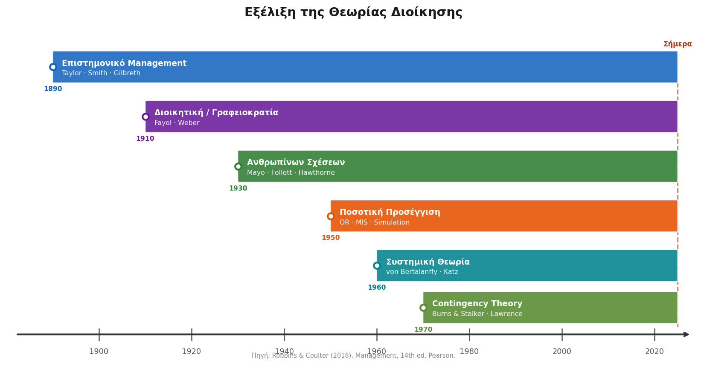

<!-- Πώς φτάσαμε όμως στο σημείο να ξέρουμε όλα αυτά για το Μάνατζμεντ; Δεν γεννήθηκαν τυχαία. Κοιτάζοντας αυτή τη χρονογραμμή, βλέπουμε την εξέλιξη της θεωρίας από τα τέλη του 19ου αιώνα. Ξεκινήσαμε αντιμετωπίζοντας τον άνθρωπο σαν "εξάρτημα μηχανής" με το Επιστημονικό Management του Taylor , περάσαμε στη Γραφειοκρατία του Weber , ανακαλύψαμε τη σημασία της Ψυχολογίας με τη Σχολή των Ανθρωπίνων Σχέσεων και καταλήξαμε σήμερα στη Θεωρία της Ενδεχομενικότητας. Πάμε να δούμε πώς ο κάθε "πατέρας" του Μάνατζμεντ έβαλε το λιθαράκι του. -->
---

# 4.1 Οι Σχολές Διοίκησης — Σύνοψη

<!-- _class: xxsmall -->

| Σχολή & Περίοδος | 🎯 Κεντρική Ιδέα | Βασικοί Θεμελιωτές | 💼 Κληρονομιά |
|---|---|---|---|
| ⚙️ **Επιστημονικό Management** (1890–1920) | Η εργασία μετριέται & βελτιστοποιείται. Υπάρχει ένας «καλύτερος τρόπος» για κάθε εργασία. | F.W. Taylor, F. & L. Gilbreth | Μελέτες χρόνου/κίνησης (Time & motion), βαθιά εξειδίκευση |
| 🏢 **Διοικητική / Γραφειοκρατία** (1910–1940) | Σαφής ιεραρχία, κανόνες & αξιοκρατία — τέλος στην οικογενειοκρατία. | H. Fayol, M. Weber | Οργανογράμματα, Job descriptions, 4 Λειτουργίες Management |
| 🤝 **Ανθρωπίνων Σχέσεων** (1924–1960) | Οι εργαζόμενοι δεν είναι μηχανές — κοινωνική δυναμική & προσοχή αυξάνουν την απόδοση. | E. Mayo, M.P. Follett | Θεωρίες Παρακίνησης, τμήματα HR, ομαδική εργασία |
| 📊 **Ποσοτική Προσέγγιση** (1940–1970) | Μαθηματικά μοντέλα & στατιστική για βέλτιστες αποφάσεις — ρίζες στον Β' Π.Π. | C.W. Churchman, R. Ackoff | Επιχειρησιακή Έρευνα (OR), Data Analytics, μοντέλα αποθεμάτων (EOQ) |
| 🔄 **Συστημική Θεωρία** (1960–σήμερα) | Η επιχείρηση είναι ανοιχτό σύστημα αλληλοεξαρτώμενων μερών — μια αλλαγή επηρεάζει τα πάντα. | L. von Bertalanffy, Katz & Kahn | Ολιστική σκέψη (Holistic thinking), συστήματα ERP |
| 🧭 **Θεωρία Ενδεχομενικότητας / Contingency** (1970–σήμερα) | Δεν υπάρχει «μία» τέλεια λύση — η σωστή δομή εξαρτάται από το πλαίσιο (μέγεθος, περιβάλλον). | Burns & Stalker, Lawrence & Lorsch | Περιστασιακή ηγεσία (Situational leadership), ευέλικτες δομές |

> **💡 Στρατηγικό Συμπέρασμα:** Οι σχολές **δεν αντικαθιστούν** η μία την άλλη — **συνυπάρχουν**. Ένας σύγχρονος manager δεν επιλέγει «στρατόπεδο», αλλά διαθέτει **εργαλειοθήκη** από όλες, εφαρμόζοντάς τες ανάλογα με την πρόκληση που έχει μπροστά του.

<!-- Είδαμε τη χρονογραμμή, ας δούμε τώρα την ουσία. Το πιο σημαντικό μάθημα εδώ είναι ότι καμία σχολή δεν 'ακυρώνει' την προηγούμενη. Το Επιστημονικό Management μας έδωσε τη μέτρηση και την εξειδίκευση. Η Γραφειοκρατία μάς έδωσε τους κανόνες και τα οργανογράμματα. Η Σχολή Ανθρωπίνων Σχέσεων μάς υπενθύμισε ότι δεν διοικούμε ρομπότ, αλλά ανθρώπους. Ένας σύγχρονος manager δεν διαλέγει 'στρατόπεδο'. Έχει μια εργαλειοθήκη και χρησιμοποιεί στοιχεία από όλες τις θεωρίες, ανάλογα με το πρόβλημα που έχει μπροστά του. -->
---

# 4.1 Ο Καταμερισμός της Εργασίας (Adam Smith)

<!-- _class: small -->

Στον 18ο αιώνα, ο **Adam Smith** παρατήρησε ότι η οργάνωση της εργασίας στην κατασκευή καρφίτσων μπορούσε να αλλάξει ριζικά την απόδοση μιας επιχείρησης:

| Μοντέλο Παραγωγής | Πώς Λειτουργεί; | Το Αποτέλεσμα |
|---|---|---|
| 🛠️ **Μέθοδος "Craft"** (Παραδοσιακή) | Ένας εργαζόμενος εκτελεί **όλα** τα βήματα μόνος του (κόβει, τεντώνει, ακονίζει, βάζει το κεφάλι) | Ελάχιστες καρφίτσες / ημέρα — **χαμηλή παραγωγικότητα** |
| 🏭 **Μέθοδος "Factory"** (Εργοστασιακή) | Η δουλειά σπάει σε διακριτά στάδια — κάθε εργαζόμενος εκτελεί **μόνο ένα βήμα** επαναλαμβανόμενα | Χιλιάδες καρφίτσες / ημέρα — **εκρηκτική παραγωγικότητα** |

> **💡 Συμπέρασμα:** Η διαίρεση μιας πολύπλοκης εργασίας σε μικρά εξειδικευμένα τμήματα (**Καταμερισμός Έργου**) μείωσε τον χρόνο εναλλαγής εργαλείων, αύξησε την επιδεξιότητα και αποτέλεσε το θεμέλιο της βιομηχανικής παραγωγής — και αργότερα της γραμμής συναρμολόγησης.

<!-- Όλα ξεκίνησαν τον 18ο αιώνα με τον Adam Smith και ένα εργοστάσιο που έφτιαχνε καρφίτσες. Παρατήρησε κάτι απλό: Στη μέθοδο 'Craft', όπου ένας εργάτης έφτιαχνε την καρφίτσα από την αρχή μέχρι το τέλος μόνος του, η παραγωγή ήταν ελάχιστη. Στη μέθοδο 'Factory', η δουλειά έσπασε σε μικρά βήματα. Ο ένας έκοβε, ο άλλος ακόνιζε, ο άλλος έβαζε το κεφάλι. Η παραγωγικότητα εκτοξεύτηκε. Αυτός ο καταμερισμός του έργου είναι το θεμέλιο της βιομηχανικής επανάστασης και κάθε σύγχρονης γραμμής παραγωγής. -->
---

# 4.1 Επιστημονική Διοίκηση (Frederick W. Taylor)

<!-- _class: small -->

**Frederick Taylor** (1856–1915) — Στόχος: συστηματική & επιστημονική μελέτη σχέσεων ανθρώπων–καθηκόντων για ανασχεδιασμό εργασίας με σκοπό την **απόλυτη αποδοτικότητα**.

**Οι 4 Αρχές για τη Μέγιστη Παραγωγικότητα:**

| Βήμα | Η Αρχή | Τι Σημαίνει στην Πράξη; |
|---|---|---|
| **1** | ⏱️ **Επιστημονική Μελέτη** | Τέλος στις «εμπειρικές» μεθόδους — συλλογή δεδομένων, μελέτη κίνησης & χρόνου (Time & Motion studies) για κάθε εργασία |
| **2** | 📜 **Τυποποίηση (Standardization)** | Κωδικοποίηση της βέλτιστης μεθόδου σε κανόνες (SOPs) & αυστηρή εκπαίδευση εργαζομένων |
| **3** | 🎯 **Σωστή Επιλογή (Matching)** | Επιλογή εργαζομένων αποκλειστικά με βάση τις ικανότητες που απαιτεί η θέση |
| **4** | 💰 **Σύστημα Ανταμοιβών** | Οικονομική ανταμοιβή (bonus) συνδεδεμένη άμεσα με την υψηλότερη παραγωγή |

> ⚠️ **Η Παγίδα στην Πράξη:** Τα στελέχη εφάρμοσαν μόνο την πίεση για υψηλότερη απόδοση, χωρίς να μοιράζονται τα κέρδη. Αποτέλεσμα: οι εργαζόμενοι εξαντλήθηκαν, ένιωσαν ότι αντιμετωπίζονται ως «γρανάζια μηχανής» και έχασαν την εμπιστοσύνη τους στη διοίκηση.

<!-- Μετά ήρθε ο Frederick Taylor. Ο Taylor πήρε ένα χρονόμετρο και άρχισε να μετράει τα πάντα. Στόχος του ήταν να βρει τον έναν, τέλειο τρόπο για να γίνεται κάθε δουλειά. Έφερε την τυποποίηση, την επιστημονική επιλογή του προσωπικού και τα bonus παραγωγικότητας. Ποια ήταν όμως η παγίδα; Οι εργοδότες πήραν το σύστημά του και το χρησιμοποίησαν μόνο για να πιέζουν τους εργάτες, χωρίς να μοιράζονται τα κέρδη. Το αποτέλεσμα; Οι άνθρωποι αντιμετωπίστηκαν σαν 'γρανάζια', εξαντλήθηκαν και δημιουργήθηκε τεράστιο χάσμα εμπιστοσύνης. -->
---

# 4.1 Η Γραφειοκρατία του Max Weber: Το Αντίδοτο στην Οικογενειοκρατία

<!-- _class: xsmall -->

> **Το Παράδοξο:** Σήμερα «γραφειοκρατία» παραπέμπει σε καθυστερήσεις. Το 1900, ο Weber την πρότεινε ως το απόλυτο εργαλείο **αξιοκρατίας και τάξης** — αντίδοτο στην οικογενειοκρατία (nepotism) όπου θέσεις δίνονταν σε «φίλους και συγγενείς» χωρίς κριτήρια.

**Οι 6 Αρχές — πώς μεταφράζονται στη σύγχρονη επιχείρηση:**

| # | Η Αρχή του Weber | Ιστορικός Στόχος (1900) | Σύγχρονη Εφαρμογή |
|---|---|---|---|
| 1 | **Η Θέση, όχι το Άτομο** | Σπάει την οικογενειοκρατία | Job Descriptions (η εξουσία ανήκει στον ρόλο) |
| 2 | **Απόδοση & Προσόντα** | Πρόσληψη βάσει γνώσεων | CVs, Συνεντεύξεις, KPIs |
| 3 | **Ξεκάθαρα Καθήκοντα** | Τερματίζει την ασάφεια | Org Charts, **RACI Matrix** |
| 4 | **Ιεραρχική Δομή** | Σαφής αλυσίδα διοίκησης | Reporting Lines (ποιος αναφέρει σε ποιον) |
| 5 | **Κανόνες & Διαδικασίες** | Ομοιόμορφη αντιμετώπιση | **SOPs** (Standard Operating Procedures) |
| 6 | **Δίκαιη Ανταμοιβή** | Σταθερότητα & ασφάλεια | Salary Scales & Παροχές |

> ⚠️ **Η Παγίδα του "Red Tape":** Όταν οι κανόνες γίνονται αυτοσκοπός και η δομή χάνει την ευελιξία της, η γραφειοκρατία μετατρέπεται σε εμπόδιο. 💡 Όπως διδάσκει η **Θεωρία Ενδεχομενικότητας**: δεν υπάρχει μία τέλεια δομή — η γραφειοκρατία είναι χρήσιμη μόνο όταν υπηρετεί τον σκοπό του οργανισμού χωρίς να τον **στραγγαλίζει**.

<!-- Σήμερα, όταν ακούμε 'γραφειοκρατία', σκεφτόμαστε ουρές σε δημόσιες υπηρεσίες. Το 1900 όμως, όταν την πρότεινε ο Max Weber, ήταν μια τεράστια καινοτομία. Γιατί; Διότι μέχρι τότε, τις δουλειές τις έπαιρναν τα ανίψια και οι φίλοι του αφεντικού (οικογενειοκρατία). Ο Weber είπε: 'Τέλος! Η εξουσία ανήκει στη θέση, όχι στο άτομο'. Έφερε τα βιογραφικά, τις ξεκάθαρες περιγραφές θέσεων εργασίας (Job Descriptions) και την αξιοκρατία. Ο κίνδυνος φυσικά είναι το "Red Tape", δηλαδή όταν οι κανόνες γίνονται πιο σημαντικοί από το ίδιο το αποτέλεσμα. -->
---

# 4.1 Οι Αρχές του Henri Fayol: Οι 4 που Αντέχουν στον Χρόνο

<!-- _class: small -->

> **Ο Άνθρωπος πίσω από τη Θεωρία:** Ο Fayol δεν ήταν ακαδημαϊκός — ήταν μηχανικός που έφτασε να γίνει CEO ορυχείου. Έγραψε τις 14 αρχές του αφού **τις εφάρμοσε πρώτα** στην πράξη.

Από τις 14 αρχές, αυτές οι **4 παραμένουν ο απόλυτος πυρήνας** της σύγχρονης επιχείρησης:

| Η Αρχή | Κλασική Έννοια (Τότε) | Σύγχρονη Εφαρμογή (Σήμερα) |
|---|---|---|
| 👤 **Ενότητα Εντολής** | Κάθε εργαζόμενος παίρνει εντολές από **έναν μόνο** προϊστάμενο | Το βλέπουμε όταν παραβιάζεται: η Μητρωική δομή (Matrix) προκαλεί σύγχυση & συγκρούσεις εξουσίας |
| 🧩 **Καταμερισμός Εργασίας** | Η εξειδίκευση αυξάνει κατακόρυφα την παραγωγικότητα | Θεμέλιο κάθε σύγχρονου οργανογράμματος |
| ⚖️ **Ισότητα (Equity)** | Δίκαιη, αντικειμενική & με σεβασμό αντιμετώπιση προσωπικού | Βάση σύγχρονου HR και πολιτικών **DEI** (Diversity, Equity & Inclusion) |
| 🤝 **Esprit de Corps** | Δημιουργία κλίματος ενότητας, αφοσίωσης & «πνεύματος ομάδας» | Σήμερα: εταιρική κουλτούρα, **team cohesion**, Employer Branding |

<!-- Ο Fayol, αντίθετα με τους άλλους, ήταν CEO. Έγραψε θεωρία μέσα από την εμπειρία του. Από τις 14 αρχές που διατύπωσε, οι 4 είναι το Ευαγγέλιο του σημερινού management:

Η Ενότητα Εντολής: Ξέρουμε πόσο κακό είναι να έχεις δύο αφεντικά (όπως είδαμε στη Μητρωική δομή).

Ο Καταμερισμός της Εργασίας.

Η Ισότητα και η δίκαιη αντιμετώπιση (η βάση του σημερινού HR).

Το Esprit de Corps: το πνεύμα της ομάδας, αυτό που σήμερα ονομάζουμε εταιρική κουλτούρα. -->>
---

# 4.2 Σχολή Ανθρωπίνων Σχέσεων — Hawthorne

<!-- _class: small -->

**Μελέτες Hawthorne** (Western Electric Co., 1924–1932 — E. Mayo):

- Μέτρηση παραγωγικότητας εργατών σε **διάφορα επίπεδα φωτισμού**
- Αποτέλεσμα: η παραγωγικότητα αυξήθηκε **ανεξάρτητα** από το φωτισμό

**Ερμηνεία:** Οι εργάτες απολάμβαναν την **προσοχή** που τους έδιναν ως μέρος του πειράματος και γίνονταν πιο παραγωγικοί.

> **Hawthorne Effect:** Το **στυλ διοίκησης** και η **συμπεριφορά του προϊστάμενου** επηρεάζουν την απόδοση του εργαζόμενου.

**Mary Parker Follett:** Πρότεινε τη συμμετοχή των ίδιων των εργαζομένων στην ανάλυση της δουλειάς τους για βελτιώσεις — *«ο εργαζόμενος γνωρίζει τον καλύτερο τρόπο βελτίωσης της δουλειάς του»*.

<!-- Και φτάνουμε στη στιγμή που το Management ανακαλύπτει την Ψυχολογία. Στα πειράματα του Hawthorne, ο Elton Mayo προσπαθούσε να δει αν ο φωτισμός επηρεάζει την απόδοση των εργατών. Ανέβαζαν τα φώτα, η απόδοση ανέβαινε. Κατέβαζαν τα φώτα, η απόδοση... πάλι ανέβαινε! Τι συνέβαινε; Οι εργάτες δεν αντιδρούσαν στον φωτισμό. Αντιδρούσαν στο γεγονός ότι, για πρώτη φορά, κάποιος τους έδινε σημασία. Αυτό είναι το 'Hawthorne Effect': Η ψυχολογία και η προσοχή του manager αυξάνουν την απόδοση περισσότερο από τις φυσικές συνθήκες. -->
---

# 4.2 Σύγχρονες Προσεγγίσεις Management

**Συστημική Θεωρία**
- Η επιχείρηση ως **ανοιχτό σύστημα** που αλληλεπιδρά με το περιβάλλον
- Αλλαγές σε ένα τμήμα επηρεάζουν το σύνολο
- Αναγνωρίζεται η ανάγκη **διεπιστημονικότητας**

**Θεωρία Ενδεχομενικότητας (Contingency Theory)**
- *"Δεν υπάρχει μία τέλεια λύση για όλα"*
- Η αποτελεσματική διοίκηση εξαρτάται από την **κατάσταση και το πλαίσιο**
- Παράγοντες: μέγεθος οργανισμού, τεχνολογία, περιβάλλον, στρατηγική

<!-- Κάπως έτσι φτάνουμε στο σήμερα. Η Συστημική Θεωρία μας λέει ότι η επιχείρηση είναι ένας ζωντανός οργανισμός: αν αλλάξεις κάτι στο τμήμα πωλήσεων, θα επηρεαστεί το λογιστήριο. Και η Θεωρία της Ενδεχομενικότητας (Contingency) συνοψίζει τα πάντα σε μία φράση: 'Εξαρτάται'. Δεν υπάρχει μια τέλεια λύση για όλα τα προβλήματα, όλα εξαρτώνται από το περιβάλλον και την τεχνολογία. -->
---

# 5.1 Προγραμματισμός (Planning)

> **Προγραμματισμός** = η διαδικασία καθορισμού των στόχων της επιχείρησης και η επιλογή των μέσων για την επίτευξή τους σε συγκεκριμένους χρόνους, με το αντίστοιχο προβλεπόμενο κόστος και ωφέλεια.

**3 Βήματα για σωστό σχεδιασμό:**
1. Ποιοι **στόχοι** πρέπει να τεθούν;
2. Πώς πρέπει να **επιτευχθούν** οι στόχοι;
3. Πώς πρέπει να **κατανεμηθούν** οι επιχειρησιακοί πόροι;

**Αναγκαιότητα προγραμματισμού:**
- Το περιβάλλον της επιχείρησης είναι **δυναμικό**
- Δείχνει κατεύθυνση & παρέχει **αίσθημα ευθύνης**
- Από αυτόν εξαρτώνται **όλες οι άλλες** δραστηριότητες διοίκησης

<!-- Έχοντας δει πώς σκέφτεται το Management, ας δούμε την πρώτη και σημαντικότερη από τις 4 λειτουργίες του Fayol: Τον Προγραμματισμό. Προγραμματισμός είναι να απαντάς σε 3 ερωτήσεις: Πού πάμε (στόχοι); Πώς θα πάμε (μέσα); Και τι θα μας κοστίσει (πόροι); Χωρίς προγραμματισμό, η εταιρεία είναι ένα καράβι χωρίς πυξίδα σε φουρτουνιασμένη θάλασσα. -->
---

# 5.1 Φάσεις Προγραμματισμού & Τύποι Στόχων

<!-- _class: small -->

**5 Φάσεις:**
1. Καθορισμός στόχων & αναγνώριση ευκαιριών/προβλημάτων
2. Προτάσεις Διοικητικών Στελεχών
3. Λήψη αποφάσεων
4. Εφαρμογή προγράμματος δράσης
5. Αξιολόγηση προγράμματος

**Ιδιότητες καλών στόχων:** Σαφήνεια · Ρεαλισμός · Ιεράρχηση · Συνέπεια

**Τύποι στόχων:**

| Τύπος | Παραδείγματα |
|---|---|
| **Παραγωγικοί** | Παραγωγή αγαθών/υπηρεσιών για καταναλωτές |
| **Οικονομικοί** | Κερδοφορία, παραγωγικότητα, οικονομικότητα |
| **Κοινωνικοί** | Ανάπτυξη προσωπικού, περιβαλλοντική ευαισθησία |

<!-- Ο σχεδιασμός αυτός έχει 5 φάσεις. Πρώτα βλέπουμε το πρόβλημα, μετά ακούμε τις προτάσεις των στελεχών, αποφασίζουμε, το εφαρμόζουμε και, το πιο σημαντικό, στο τέλος το αξιολογούμε. Ένας στόχος για να είναι καλός πρέπει να είναι ρεαλιστικός και ξεκάθαρος. Μπορεί να είναι στόχος οικονομικός (π.χ. αύξηση κερδών 10%), αλλά μπορεί να είναι και κοινωνικός (π.χ. μείωση αποτυπώματος άνθρακα). -->
---

# 5.1 Διοίκηση με Στόχους (MBO — Management by Objectives)

<!-- _class: small -->

> **Peter Drucker (1954):** Συστηματική, **συνεργατική** μέθοδος όπου διοίκηση & εργαζόμενοι καθορίζουν **από κοινού** ρεαλιστικούς στόχους — για να ευθυγραμμιστεί η ατομική προσπάθεια με το γενικό όραμα της εταιρείας.

**Ο Κύκλος των 5 Σταδίων:**

| Στάδιο | Η Διαδικασία στην Πράξη | Το Κλειδί της Επιτυχίας |
|---|---|---|
| **1ο** 🗣️ | **Καθορισμός Απαιτήσεων** — ανοιχτή συζήτηση manager & εργαζομένου για τον ρόλο | Ξεκαθάρισμα προσδοκιών |
| **2ο** ✍️ | **Πρόταση Στόχων** — ο ίδιος ο υφιστάμενος (όχι ο προϊστάμενος) αναπτύσσει και προτείνει τους στόχους | Αίσθημα ιδιοκτησίας (ownership) |
| **3ο** 🤝 | **Συμφωνία & Έγκριση** — συζήτηση, πιθανή διαπραγμάτευση, τελική δέσμευση | Αμοιβαία δέσμευση |
| **4ο** 📏 | **Καθορισμός Προτύπων** — ορισμός milestones & κριτηρίων μέτρησης | Πώς θα ξέρουμε ότι πετύχαμε; |
| **5ο** 🏆 | **Αξιολόγηση Αποτελεσμάτων** — σύγκριση πραγματικής απόδοσης με τους συμφωνημένους στόχους | Αντικειμενική αξιολόγηση, όχι βάσει «συμπάθειας» |

> 💡 **Paradigm Shift:** Από «πόσες ώρες δουλεύει» ή «πόσο προσπαθεί» → αποκλειστικά στα **πραγματικά αποτελέσματα** που φέρνει.

<!-- Πώς όμως βάζουμε αυτούς τους στόχους; Παλιά το αφεντικό διέταζε. Ο Peter Drucker το άλλαξε αυτό με τα MBOs (Management by Objectives). Το μυστικό εδώ είναι η συνεργασία. Ο προϊστάμενος κάθεται με τον υφιστάμενο και συμφωνούν μαζί τους στόχους. Έτσι, ο εργαζόμενος νιώθει ότι ο στόχος είναι 'δικός του' (ownership). Αυτό άλλαξε εντελώς τη νοοτροπία: Σταματήσαμε να μετράμε το 'πόσες ώρες κάθεσαι στο γραφείο' και αρχίσαμε να μετράμε αποκλειστικά το 'τι αποτέλεσμα έφερες'. -->
---

# 5.1 Από τα MBO στα OKRs: Η Νέα Γλώσσα της Επιτυχίας

<!-- _class: xxsmall -->

> **OKR (Objectives and Key Results):** Σύγχρονη μεθοδολογία στοχοθεσίας που βοηθά οργανισμούς & ομάδες να θέσουν **φιλόδοξους στόχους** και να μετρήσουν την πρόοδό τους. Αναπτύχθηκε στην **Intel** (Andy Grove, 1970s) και έγινε παγκοσμίως γνωστό όταν υιοθετήθηκε από την **Google** το 1999.

**MBO** (Peter Drucker, 1954) → **OKRs** (Andy Grove, Intel 1970s → Google, 1999 → παντού σήμερα)

<div class="columns">
<div>

**Συγκριτική Ανάλυση:**

| Κριτήριο | MBO | OKRs |
|---|---|---|
| **Φιλοδοξία** | Ρεαλιστικοί, εφικτοί στόχοι | Φιλόδοξα «Moonshots» |
| **Μέτρηση** | Ποσοτική ή ποιοτική | Key Results: αποκλειστικά **μετρήσιμα** |
| **Συχνότητα** | Ετήσια αξιολόγηση | Τριμηνιαία check-ins & προσαρμογή |
| **Μισθός/Bonus** | Άμεση σύνδεση (bonus-driven) | Συνήθως **όχι** — ώστε να μη φοβάται ο εργαζόμενος την αποτυχία |
| **Διαφάνεια** | Ιεραρχική & συχνά κρυφή | **Δημόσια** σε όλο τον οργανισμό |

</div>
<div>

**Παράδειγμα OKR — Google (Search):**

**Objective:** Βελτίωση εμπειρίας χρήστη στην αναζήτηση

- **KR1:** Μείωση latency: 220ms → 180ms
- **KR2:** Click-through rate top-3 αποτελεσμάτων ≥ 65%
- **KR3:** 0 κρίσιμα σφάλματα (P0 bugs) στο mobile UI έως 1/12

> 💡 **Ο Χρυσός Κανόνας του 70%:** Στα OKRs, το **70% επίτευξης = επιτυχία**. Αν πετυχαίνεις 100% σε κάθε τρίμηνο, οι στόχοι σου είναι πολύ εύκολοι — δεν «πιέζεις» για καινοτομία.

*Πηγή: Doerr, J. (2018). Measure What Matters.*

</div>
</div>

<!-- Από τα MBOs γεννήθηκαν τα OKRs (Objectives and Key Results), που έκαναν διάσημη την Google. Ποια η διαφορά τους; Στα MBOs βάζουμε ρεαλιστικούς στόχους και τους συνδέουμε με το μπόνους μας. Στα OKRs βάζουμε στόχους 'Moonshots' – εξωφρενικά φιλόδοξους – και είναι απόλυτα δημόσιοι σε όλη την εταιρεία. Το πιο εντυπωσιακό; Στα OKRs υπάρχει ο 'Κανόνας του 70%'. Αν πιάνεις το 100% των στόχων σου, η Google θεωρεί ότι απέτυχες, γιατί πολύ απλά έβαλες πολύ εύκολους στόχους και δεν πίεσες τον εαυτό σου να καινοτομήσει! -->
---

# 5.2 Έλεγχος (Controlling)

> **Έλεγχος** = μια συστηματική διαδικασία μέσα από την οποία καθορίζουμε **πρότυπα απόδοσης**, συγκρίνουμε την πραγματική απόδοση, εντοπίζουμε αποκλίσεις και κάνουμε τις απαραίτητες **διορθωτικές ενέργειες**.

**3 Φάσεις Διαδικασίας Ελέγχου:**

| Φάση | Περιεχόμενο |
|---|---|
| **1η** | Καθορισμός **προτύπων** απόδοσης |
| **2η** | Σύγκριση **καταμετρημένης** απόδοσης με τα πρότυπα |
| **3η** | Ενίσχυση επιτυχιών / **Διόρθωση** μειονεκτημάτων → Επαναπληροφόρηση |

**Αναγκαιότητα ελέγχου:** Προλαμβάνει προβλήματα · Αναπροσαρμόζει προγράμματα · Παίρνει διορθωτικά μέτρα

<!-- 
Είδαμε τον Προγραμματισμό, την Οργάνωση και την Ηγεσία. Τίποτα από αυτά δεν έχει αξία αν δεν έχουμε Έλεγχο. Προσοχή, όταν λέμε έλεγχο στο management δεν εννοούμε την αστυνόμευση. Εννοούμε το GPS του αυτοκινήτου. Η διαδικασία έχει 3 φάσεις: Βάζεις τον προορισμό (πρότυπο), βλέπεις πού βρίσκεσαι (σύγκριση πραγματικής απόδοσης), και αν έχεις βγει εκτός πορείας, κάνεις αναστροφή (διορθωτική ενέργεια).
-->
---

# 5.2 Χαρακτηριστικά Αποτελεσματικού Ελέγχου

<!-- _class: small -->

| # | Χαρακτηριστικό |
|---|---|
| 1 | **Αποτελεσματικότητα ως προς το κόστος** |
| 2 | Αποδοχή από εκείνους στους οποίους **εφαρμόζεται** |
| 3 | **Χρονική καταλληλότητα** |
| 4 | **Ακρίβεια** |
| 5 | Αντικειμενικότητα και **σαφήνεια** |
| 6 | Προσανατολισμός σε **στρατηγικά σημεία** ελέγχου |
| 7 | **Οικονομικός** ρεαλισμός |
| 8 | **Επιχειρησιακός** ρεαλισμός |
| 9 | Συντονισμός με τις **επιχειρησιακές λειτουργίες** |
| 10 | **Ευελιξία** |
| 11 | **Λειτουργικότητα** |
<!-- 
Ένα σύστημα ελέγχου για να δουλέψει δεν πρέπει να είναι απλώς αυστηρό. Πρέπει να έχει 11 συγκεκριμένα χαρακτηριστικά. Για παράδειγμα, πρέπει να είναι 'αποτελεσματικό ως προς το κόστος' – δεν μπορείς να ξοδεύεις 100 ευρώ για να ελέγξεις μια διαδικασία που σου γλιτώνει 10 ευρώ. Κυρίως, όμως, πρέπει να είναι αντικειμενικό και ακριβές. Τι γίνεται όταν αυτά τα δύο λείπουν; Ας δούμε ίσως το μεγαλύτερο εταιρικό σκάνδαλο της δεκαετίας.
-->
---

# 5.2 Όταν ο Έλεγχος Αποτυγχάνει: VW Dieselgate (2015)

<!-- _class: casestudy xsmall -->


**Τι Έγινε:** Η Volkswagen εγκατέστησε λογισμικό που ανίχνευε επίσημα tests εκπομπών και βελτίωνε τεχνητά τα αποτελέσματα. 11 εκ. αυτοκίνητα παγκοσμίως είχαν πλαστά δεδομένα.

<div class="columns">
<div>

**Ποια Χαρακτηριστικά Ελέγχου Απουσίαζαν;**

| Χαρακτηριστικό | Τι Πήγε Λάθος |
|---|---|
| **Ακρίβεια** | Δεδομένα εκπομπών ήταν πλαστά |
| **Αντικειμενικότητα** | Εσωτερικοί έλεγχοι από εξαρτημένους |
| **Στρατηγικά Σημεία** | Καμία ανεξάρτητη επαλήθευση |
| **Αποδοχή** | Κουλτούρα πίεσης → κανείς δεν ανέφερε |

</div>
<div>

**Συνέπειες:**
- Πρόστιμα **> $30 δισ.** παγκοσμίως
- CEO παραιτήθηκε σε **10 ημέρες**
- Μετοχή: **−40%** σε μία εβδομάδα
- Ποινικές διώξεις εκτελεστικών στελεχών

**Το Μάθημα:**
> Ο έλεγχος **αποτυγχάνει** όταν τα κίνητρα (στόχοι πωλήσεων, bonus, εσωτερική πίεση) είναι πιο ισχυρά από το σύστημα παρακολούθησης.

> *«What gets measured gets managed — but what gets gamed gets broken.»*

</div>
</div>
<!-- 
Το 2015, αποκαλύφθηκε ότι η Volkswagen είχε βάλει ένα 'έξυπνο' λογισμικό σε 11 εκατομμύρια αυτοκίνητα, το οποίο καταλάβαινε πότε το αυτοκίνητο περνούσε από έλεγχο καυσαερίων και έριχνε τεχνητά τους ρύπους. Γιατί απέτυχε εδώ ο έλεγχος; Διότι έλειπε η αντικειμενικότητα: αυτοί που έλεγχαν ήταν εξαρτημένοι από αυτούς που παρήγαγαν το αποτέλεσμα, ενώ η κουλτούρα της εταιρείας τιμωρούσε όποιον έφερνε κακά νέα. Το πρόστιμο; Πάνω από 30 δισεκατομμύρια δολάρια. Το μάθημα είναι απλό: Αν βάλεις τεράστια πίεση στους υπαλλήλους σου για αποτελέσματα, χωρίς να έχεις ανεξάρτητο έλεγχο, οι εργαζόμενοι θα 'κλέψουν' το σύστημα για να επιβιώσουν.
-->
---

# 6.1 Ο Στρατηγικός Ρόλος του HRM

Η Διοίκηση Ανθρωπίνων Πόρων δεν είναι απλώς διοικητική λειτουργία — είναι **στρατηγικός εταίρος** της επιχείρησης:

- Ευθυγράμμιση ανθρώπινου δυναμικού με εταιρικούς στόχους
- Δημιουργία ανταγωνιστικού πλεονεκτήματος μέσω ταλέντου
- Ανάπτυξη εταιρικής κουλτούρας και αξιών

**Κύριες λειτουργίες HR:**
- Προσέλκυση & Επιλογή (Recruitment & Selection)
- Εκπαίδευση & Ανάπτυξη
- Αξιολόγηση Απόδοσης
- Αμοιβές & Παροχές
- Διαχείριση Εργασιακών Σχέσεων
<!-- 
Περνάμε στην τελευταία μεγάλη ενότητα. Το HR (Διοίκηση Ανθρώπινων Πόρων). Παλιά το HR ήταν το γραφείο που απλά πλήρωνε τη μισθοδοσία και έδινε τις άδειες. Σήμερα, είναι ο πιο στρατηγικός εταίρος του CEO. Είναι το τμήμα που αναλαμβάνει να βρει τα ταλέντα, να τα εκπαιδεύσει, να τα αξιολογήσει και να φροντίσει ώστε η κουλτούρα της εταιρείας να είναι τέτοια που κανείς να μη θέλει να φύγει.
-->
---

# 6.1 Επιλογή Προσωπικού

> **Επιλογή προσωπικού** = η διαδικασία κατά την οποία η διοίκηση αποφασίζει, από ένα σύνολο υποψηφίων, ποιος/α είναι καλύτερος/η για την κάλυψη μιας συγκεκριμένης θέσης.

**6 Στάδια Επιλογής:**

| Στάδιο | Περιεχόμενο |
|---|---|
| **1ο** | Προκαταρτική συνέντευξη |
| **2ο** | Συμπλήρωση πληροφοριακού εντύπου (φόρμας) |
| **3ο** | Συνέντευξη εργασίας |
| **4ο** | Τεστ (δοκιμασία) για την επιλογή |
| **5ο** | Ιατρική εξέταση |
| **6ο** | Απόφαση επιλογής |
<!-- 
Πώς διαλέγουμε όμως τον κατάλληλο άνθρωπο; Δεν βασιζόμαστε στο ένστικτο. Είναι μια διαδικασία-'χωνί' με 6 στάδια: ξεκινάμε με ένα μεγάλο pool υποψηφίων, τους περνάμε από προκαταρκτικές συνεντεύξεις, κάνουμε τεστ δεξιοτήτων και στο τέλος παίρνουμε την τελική απόφαση. Το πιο κρίσιμο εργαλείο σε όλο αυτό είναι η Συνέντευξη, αρκεί να γίνεται σωστά.
-->
---

# 6.1 HR στην Πράξη: Δομημένη Συνέντευξη (STAR)

<!-- _class: xsmall -->

**Γιατί STAR;** Αντικαθιστά τις «gut feeling» συνεντεύξεις με δομημένες, συγκρίσιμες απαντήσεις που μετρούν **συμπεριφορά**, όχι εντυπώσεις.

**STAR = Situation · Task · Action · Result**

| Βήμα | Ερώτηση | Τι Ψάχνει ο Εργοδότης |
|---|---|---|
| **S**ituation | «Περιγράψτε μια κατάσταση όπου…» | Πλαίσιο — τι συνέβη; |
| **T**ask | «Ποια ήταν η ευθύνη/ο στόχος σας;» | Ρόλος & αρμοδιότητα |
| **A**ction | «Τι ακριβώς κάνατε;» | Δεξιότητες & συμπεριφορά |
| **R**esult | «Ποιο ήταν το αποτέλεσμα; Τι μετρήσατε;» | Αντίκτυπος & λογοδοσία |

**Παράδειγμα — ερώτηση & ισχυρή απάντηση:**
> *«Περιγράψτε μια φορά που αντιμετωπίσατε απρόσμενη αποτυχία σε project.»*

> *«Σε Q3 2023 έπρεπε να παραδώσω dashboard σε 2 εβδομάδες (S/T). Ο server κατέρρευσε 3 ημέρες πριν — αντικατέστησα τα live data με cached snapshots και ενημέρωσα τους stakeholders (A). Παρεδόθη με 1 ημέρα καθυστέρηση, ο πελάτης ικανοποιημένος (R).»*

> **Για εσάς ως managers:** Το STAR δεν είναι μόνο εργαλείο επιλογής — είναι και τρόπος **τεκμηρίωσης απόδοσης** στις ετήσιες αξιολογήσεις εργαζομένων.
<!-- 
Επειδή όλοι φαίνονται τέλειοι στο βιογραφικό τους, το σύγχρονο HR χρησιμοποιεί τη μέθοδο STAR (Situation, Task, Action, Result). Δεν ρωτάμε τον υποψήφιο "πόσο καλός είσαι στην πίεση;". Του ζητάμε να μας περιγράψει μια συγκεκριμένη Κατάσταση (Situation), ποιος ήταν ο Στόχος (Task) του, ποια Δράση (Action) πήρε και τι Αποτέλεσμα (Result) έφερε. Έτσι μετράμε πραγματική συμπεριφορά και όχι κενά λόγια.
-->
---

# 6.2 Ηγεσία (Leadership)

> **Ηγεσία** = η διαδικασία διεύθυνσης και επιρροής των σχετικών με την εργασία δραστηριοτήτων των μελών της ομάδας, για την επίτευξη των στόχων της.

**Ηγεσία στην πράξη:**
$$\text{Ηγεσία} = \text{Διάθεση} \times \text{Ικανότητα} \times \text{Ευκαιρία}$$

**Διαφορά Διευθυντή vs Ηγέτη:**

| | Διευθυντής | Ηγέτης |
|---|---|---|
| **Εξουσία** | Τυπική (από τη θέση) | Άτυπη (από ικανότητες) |
| **Ανάδειξη** | Διορισμός | Διορισμός ή αυθόρμητη ανάδυση |
| **Εργαλεία** | Ανταμοιβή & τιμωρία | Πειθώ, όραμα, επικοινωνία |
<!-- 
Αφού προσλάβουμε τους ανθρώπους, πρέπει να τους διοικήσουμε. Εδώ υπάρχει μια τεράστια διαφορά: Άλλο Manager και άλλο Ηγέτης. Ο Manager έχει τυπική εξουσία επειδή το γράφει η κάρτα του και χρησιμοποιεί την ανταμοιβή ή την τιμωρία. Ο Ηγέτης έχει άτυπη εξουσία. Τον ακολουθούν οι άνθρωποι επειδή τους εμπνέει, τους πείθει και τους δίνει όραμα, ακόμα κι αν δεν έχει τον τίτλο του διευθυντή.
-->
---

# 6.2 Η Διοικητική Σχάρα (Blake & Mouton): Ο Χάρτης του Ηγέτη

<!-- _class: xsmall -->

Ένας **χάρτης συντεταγμένων (1–9)** — κάθε manager τοποθετείται ανάλογα με το πώς ισορροπεί ανάμεσα σε δύο άξονες: **Παραγωγή (X)** και **Άνθρωπος (Y)**.

| Συντεταγμένες | Στυλ Διοίκησης | Προφίλ & Παράδειγμα |
|---|---|---|
| **[1, 1]** 👻 | **Αποδυναμωμένη** (Impoverished) | Χαμηλά και στα δύο — ελάχιστη προσπάθεια, ίσα-ίσα για να μη χάσει τη δουλειά του. *Π.χ. ο αδιάφορος γραφειοκράτης λίγο πριν τη σύνταξη.* |
| **[1, 9]** 🏖️ | **Της Λέσχης** (Country Club) | Υψηλά στον άνθρωπο, χαμηλά στη δουλειά — τέλειο κλίμα, καθόλου άγχος, μηδέν αποτέλεσμα. *Π.χ. ο «καλός φίλος» manager που χάνει συνεχώς τα deadlines.* |
| **[5, 5]** ⚖️ | **Των Ισορροπιών** (Middle-of-the-road) | Μέτρια και στα δύο — διαρκής συμβιβασμός. Κανείς δεν είναι ενθουσιασμένος, αλλά η δουλειά βγαίνει κουτσά-στραβά. |
| **[9, 9]** 🚀 | **Συνεργατική** (Team) | Υψηλά και στα δύο — εμπιστοσύνη, δέσμευση, καινοτομία. *Π.χ. επικεφαλής ομάδας R&D στη Google.* |
| **[9, 1]** ⚔️ | **Αυταρχική** (Produce or Perish) | Υψηλά στη δουλειά, χαμηλά στον άνθρωπο — το αποτέλεσμα μετράει, ο άνθρωπος είναι εργαλείο. *Π.χ. αυστηρός εργοδηγός σε εργοστάσιο.* |

> 💡 **Σύγχρονη Οπτική (Contingency Theory):** Τη δεκαετία του '60, το **[9,9]** θεωρούνταν το απόλυτο ιδανικό. Σήμερα γνωρίζουμε ότι **δεν υπάρχει τέλειο στυλ για κάθε περίσταση**: σε Startup χρειάζεσαι [9,9] για δημιουργικότητα· στα Επείγοντα ή σε κρίση, το **[9,1]** είναι αυτό που απαιτείται για αποφασιστικότητα, ταχύτητα και επιβίωση.
<!-- 
Για να καταλάβετε τι είδους manager είστε, οι Blake και Mouton έφτιαξαν αυτόν τον χάρτη. Στον άξονα Χ είναι το πόσο σας νοιάζει η Παραγωγή (η δουλειά). Στον Υ, το πόσο σας νοιάζει ο Άνθρωπος.
Αν είσαι [1,9], είσαι ο manager "Country Club" – όλοι περνάνε τέλεια αλλά δουλειά δεν βγαίνει. Αν είσαι [9,1], είσαι "Αυταρχικός" – βγάζεις τρομερή δουλειά αλλά οι υπάλληλοι φεύγουν με burnout. Το ιδανικό θεωρητικά είναι το [9,9], η "Συνεργατική" ηγεσία. Όμως θυμηθείτε τη Θεωρία της Ενδεχομενικότητας: Αν το κτίριο έχει πάρει φωτιά, δεν κάνουμε συνεργατικό κύκλο συζήτησης [9,9] – χρειαζόμαστε το αυταρχικό [9,1] για να βγούμε ζωντανοί!
-->
---

# 6.2 Παρακίνηση (Motivation): Τι Δίνει Κίνητρο στους Ανθρώπους;

<!-- _class: xsmall -->

| Θεωρία & Θεωρητικός | Η Κεντρική Ιδέα | Πώς Μεταφράζεται στην Πράξη |
|---|---|---|
| 🔺 **Ιεραρχία Αναγκών** (A. Maslow) | 5 επίπεδα αναγκών: από τις βασικές/φυσιολογικές (επιβίωση) μέχρι την Αυτοπραγμάτωση | *«Δεν μπορείς να παρακινήσεις με "όραμα" αν δεν καλύπτεις τον βασικό μισθό για να ζήσει κάποιος.»* |
| 🧠 **Θεωρία X & Y** (D. McGregor) | **X:** Οι άνθρωποι μισούν τη δουλειά → Έλεγχος. **Y:** Η δουλειά είναι φυσική ανάγκη → Αυτονομία | *«Αν τους φέρεσαι σαν να τεμπελιάζουν (X), θα τεμπελιάζουν. Αν τους δώσεις ευθύνες (Y), θα μεγαλουργήσουν.»* |
| ⚖️ **Δύο Παραγόντων** (F. Herzberg) | **Hygiene factors** (μισθός, ασφάλεια): αν λείπουν φέρνουν δυσαρέσκεια, αν υπάρχουν **δεν δίνουν** κίνητρο. **Motivators** (αναγνώριση, εξέλιξη): αυτά παρακινούν | *«Ο καλός μισθός απλώς αποτρέπει την παραίτηση. Η αναγνώριση και η εξέλιξη είναι αυτά που φέρνουν το πάθος.»* |
| 🎯 **Θεωρία Αναμονής** (V. Vroom) | Κίνητρο = **Προσδοκία × Μεσολάβηση × Αξία** | *«Αν κοπιάσω θα τα καταφέρω; Αν τα καταφέρω θα πάρω το bonus; Κι αυτό το bonus, το θέλω καν;»* |

> 💡 **Ο Αόρατος Κινητήρας — Εταιρική Κουλτούρα:** Οι θεωρίες δίνουν τα εργαλεία, αλλά η κουλτούρα (οι κοινές αξίες, οι άγραφοι κανόνες, οι καθημερινές συμπεριφορές) είναι το πραγματικό «καύσιμο». Η καλύτερη θεωρία παρακίνησης **καταρρέει** μέσα σε ένα τοξικό εργασιακό περιβάλλον.
<!-- 
Γιατί δουλεύουν οι άνθρωποι; Ο Maslow μάς είπε ότι αν δεν καλύψεις πρώτα τις βασικές ανάγκες (τον μισθό για να φάει), μην του μιλάς για όραμα. Ο McGregor είπε ότι αν φέρεσαι στους ανθρώπους σαν να είναι τεμπέληδες (Θεωρία Χ), θα γίνουν τεμπέληδες. Ο Herzberg έκανε τη μεγαλύτερη ανακάλυψη: Ο μισθός από μόνος του ΔΕΝ δίνει κίνητρο, απλώς αποτρέπει την παραίτηση. Το κίνητρο έρχεται από την αναγνώριση και την εξέλιξη. Ας το δούμε σε ένα case study.
-->
---

# 6.2 Case Study: Η Παρακίνηση σε Κρίση (1/3)

<!-- _class: casestudy small -->


**Το Σενάριο:** Fintech startup, Αθήνα, 45 άτομα. Σε 12 μήνες: **40% turnover** στους developers.

> 🗣️ *«Τους πληρώνουμε στο άνω άκρο της αγοράς (market rate). Γιατί φεύγουν;»* — CEO

**Η Διάγνωση μέσα από τις 4 Θεωρίες:**

| Θεωρία | Η Διάγνωση του Προβλήματος |
|---|---|
| ⚖️ **Herzberg** | Ο μισθός είναι **Hygiene factor** — αποτρέπει δυσαρέσκεια αλλά ΔΕΝ παρακινεί. Λείπουν οι **Motivators**: αναγνώριση, ανάπτυξη, ενδιαφέροντα projects |
| 🔺 **Maslow** | Βασικά επίπεδα καλύπτονται. Αποτυχία στα ανώτερα: **Ανήκειν** (team culture) & **Αυτοπραγμάτωση** (career growth) |
| 🧠 **McGregor** | Micromanagement = Theory **X**. Οι developers είναι knowledge workers (Theory **Y**): φεύγουν σε εταιρείες που τους εμπιστεύονται |
| 🎯 **Vroom** | Χαμηλή **Expectancy** («δεν βλέπω προαγωγή») + χαμηλή **Valence** («τα bonus δεν με αφορούν») |
<!-- 
Έχουμε μια startup στην Αθήνα. Πληρώνει εξαιρετικούς μισθούς στους προγραμματιστές της, κι όμως το 40% παραιτείται μέσα σε έναν χρόνο (turnover). Ο CEO τραβάει τα μαλλιά του. Τι μας λένε οι θεωρίες; Ο Herzberg λέει ότι αφού λύσαμε το θέμα του μισθού (hygiene factor), οι εργαζόμενοι έφυγαν γιατί δεν ένιωθαν ότι εξελίσσονται (motivators). Ο McGregor μας λέει ότι μάλλον υπήρχε micromanagement, κάτι που οι δημιουργικοί άνθρωποι απεχθάνονται.
-->
---

# 6.2 Case Study: Η Παρακίνηση σε Κρίση (2/3)

<!-- _class: casestudy small -->


**Το Σύγχρονο Τοπίο (Post-Pandemic 2020+):**

🏠 **Remote/Hybrid Work:** Οι εργαζόμενοι απαιτούν ευελιξία ως βασική ανάγκη ισορροπίας (Maslow). Η υποχρεωτική επιστροφή στο γραφείο «χωρίς λόγο» εκλαμβάνεται ως αφαίρεση αυτονομίας (Theory Y) — άμεσο έναυσμα παραίτησης.

🤫 **Quiet Quitting:** Εργαζόμενοι που «αποσύρονται ενώ παραμένουν» — κάνουν τα απολύτως ελάχιστα. Είναι η φυσική άμυνα στο micromanagement (Theory X) και στην έλλειψη αναγνώρισης (Herzberg).

**Η Θεραπεία — Στρατηγικές Παρεμβάσεις:**

| Παρέμβαση | Τι Λύνει |
|---|---|
| 📈 Career Paths (6 ξεκάθαρες βαθμίδες) | Vroom Expectancy |
| 🎯 Public OKRs & Peer Recognition | Maslow Ανήκειν + Herzberg Motivators |
| 💡 20% Innovation Time | Maslow Αυτοπραγμάτωση |
| 🌍 Hybrid Policy 3+2 | McGregor Theory Y αυτονομία |
<!-- 
Ειδικά στη μετά-covid εποχή, είδαμε φαινόμενα όπως το 'Quiet Quitting' – άνθρωποι που δεν παραιτούνται, αλλά κάνουν τα απολύτως ελάχιστα. Πώς θεράπευσε η εταιρεία το πρόβλημα; Σταμάτησε να ανεβάζει τυφλά τους μισθούς. Αντίθετα, έδωσε ξεκάθαρα Career Paths (ώστε οι άνθρωποι να βλέπουν το μέλλον τους), έδωσε υβριδική εργασία (ώστε να νιώσουν αυτονομία, κατά τη θεωρία Υ) και επέτρεψε το 20% του χρόνου τους να το αφιερώνουν σε δικά τους projects καινοτομίας (Αυτοπραγμάτωση κατά Maslow).
-->
---

# 6.2 Case Study: Η Παρακίνηση σε Κρίση (3/3)

<!-- _class: casestudy small -->


**Το Αποτέλεσμα:**

> Μέσα σε **18 μήνες**, το turnover έπεσε από το καταστροφικό **40%** στο υγιές **12%**.

Η εταιρεία σταμάτησε να «ρίχνει χρήματα στο πρόβλημα» και άλλαξε δομή.

> 💡 **Το Μεγάλο Μάθημα:** Δεν υπάρχει ΜΙΑ «σωστή» θεωρία. Οι θεωρίες λειτουργούν **συνδυαστικά** ως το απόλυτο διαγνωστικό εργαλείο για τον σύγχρονο Manager.
<!-- 
Το αποτέλεσμα ήταν εντυπωσιακό. Σε 18 μήνες, οι παραιτήσεις έπεσαν στο 12%. Το μάθημα εδώ είναι ότι οι θεωρίες του Management δεν είναι φιλοσοφία για τα βιβλία. Είναι το διαγνωστικό σας εργαλείο για να λύνετε πραγματικά προβλήματα που κοστίζουν χιλιάδες ευρώ στην εταιρεία σας.
-->
---

# 6.3 Εργασιακές Ομάδες: Η Δυναμική της Συνεργασίας

<!-- _class: small -->

> Κανένας στόχος δεν επιτυγχάνεται στο κενό. Σε κάθε επιχείρηση συνυπάρχουν δύο παράλληλοι «κόσμοι»:

<div class="columns">
<div>

**🏢 Τυπικές Ομάδες (Formal)**
Δημιουργούνται από τη **Διοίκηση** για την επίτευξη εταιρικών στόχων.

- **Λειτουργικές (Μόνιμες):** Υπάρχουν στο οργανόγραμμα.
  *Π.χ. Τμήμα Λογιστηρίου, Διεύθυνση Πωλήσεων*
- **Ομάδες Έργου (Προσωρινές/Cross-functional):** Δημιουργούνται για ένα project και μετά διαλύονται.
  *Π.χ. Task force για λανσάρισμα νέου προϊόντος*

</div>
<div>

**☕ Άτυπες Ομάδες (Informal)**
Δημιουργούνται από τους **ίδιους τους εργαζομένους** για κοινωνικές & ψυχολογικές ανάγκες.

- **Κοινού Συμφέροντος:** Ενώνονται για κοινό σκοπό εκτός δομής.
  *Π.χ. Εργαζόμενοι που διεκδικούν remote work*
- **Φιλικές:** Η παρέα του γραφείου.
  *Π.χ. Η ομάδα που τρώει μαζί μεσημεριανό ή η εταιρική ομάδα μπάσκετ*

</div>
</div>

> 💡 **Γιατί μας νοιάζει;** Οι κακοί managers κοιτούν μόνο το οργανόγραμμα. Στην πραγματικότητα, η πληροφορία, οι φήμες και η κουλτούρα ταξιδεύουν μέσα από τις **Άτυπες ομάδες**. Ένας έξυπνος manager δεν τις πολεμάει — τις αναγνωρίζει και χτίζει εμπιστοσύνη.
<!-- 
Μπαίνοντας στο κλείσιμο, να θυμάστε ότι οι άνθρωποι οργανώνονται σε ομάδες. Υπάρχουν οι 'Τυπικές Ομάδες', αυτές που φαίνονται στο οργανόγραμμα (π.χ. το λογιστήριο). Και υπάρχουν οι 'Άτυπες Ομάδες' (οι φίλοι, αυτοί που τρώνε μαζί, αυτοί που έχουν κοινά συμφέροντα). Ένας έξυπνος manager ξέρει ότι οι φήμες, η πραγματική κουλτούρα και οι αντιστάσεις στην αλλαγή, δημιουργούνται στις άτυπες ομάδες. Γι' αυτό δουλεύει μαζί τους, δεν τις πολεμάει.
-->
---

# 6.3 Στάδια Δημιουργίας Ομάδας

| Στάδιο | Συμπεριφορά Μελών |
|---|---|
| **1. Γνωριμίας** | Δοκιμάζουν τη συμπεριφορά — αβεβαιότητα |
| **2. Διερεύνησης & Αντιπαράθεσης** | Διερευνούν και αντιπαραθέτουν απόψεις |
| **3. Αποδοχής** | Αποδέχονται τον αρχηγό της ομάδας |
| **4. Λειτουργίας** | Συνεργάζονται και παράγουν έργο |
| **5. Ολοκλήρωσης** | Ολοκληρώνουν τον στόχο — μεταπηδούν σε άλλη ομάδα |

> **Οργανωσιακή Μάθηση:** Η ικανότητα της επιχείρησης να μαθαίνει και να αλλάζει πιο γρήγορα από τους ανταγωνιστές ίσως είναι το **μόνο ανταγωνιστικό πλεονέκτημα που δεν αντιγράφεται**.
<!-- 
Επίσης, αν ενώσεις 5 άριστους επαγγελματίες, δεν φτιάχνεις αυτόματα μια άριστη ομάδα. Υπάρχουν 5 στάδια: Στην αρχή γνωρίζονται (Γνωριμία). Μετά τσακώνονται για το ποιος θα έχει τον έλεγχο (Αντιπαράθεση). Μετά βρίσκουν τα πατήματά τους (Αποδοχή) και ΜΟΝΟ τότε αρχίζουν να παράγουν πραγματικό έργο (Λειτουργία). Η δουλειά του ηγέτη είναι να τους περάσει από τη φάση της σύγκρουσης στη φάση της παραγωγής όσο πιο γρήγορα γίνεται.
-->
---

<!-- _class: xsmall -->

# Ενότητα 1 — Σύνοψη

| Θέμα | Βασικές Έννοιες |
|---|---|
| Επιχείρηση & Περιβάλλον | Inputs→Process→Outputs, Micro/Macro, PESTEL, SWOT, 5 Δυνάμεις Porter |
| Μορφές & Δομές | ΑΕ/ΕΠΕ/ΙΚΕ, Functional/Divisional/Matrix, Τμηματοποίηση |
| Μάνατζμεντ | Ορισμός, 4 Λειτουργίες (Fayol), Αποδοτικότητα vs Αποτελεσματικότητα |
| Ρόλοι & Επίπεδα | Mintzberg (10 ρόλοι), Case Study Manager (Delivery SLA, 3PL), Top/Middle/First-line |
| Θεωρίες Management | Adam Smith, Taylor (4 αρχές), Weber (Γραφειοκρατία), Fayol (14 αρχές), Mayo/Hawthorne, Contingency |
| Προγραμματισμός | Planning, Στόχοι, MBO → OKRs (Google) |
| Έλεγχος | 3 Φάσεις, 11 Χαρακτηριστικά, VW Dieselgate (αποτυχία ελέγχου) |
| HRM | Recruitment + STAR method, Ηγεσία, Διοικητική Σχάρα, Motivation (case turnover), Εργασιακές Ομάδες |

<!-- Αυτά είχαμε για σήμερα. Είδαμε το περιβάλλον μέσα από το PESTEL και το SWOT. Αναλύσαμε πώς στήνεται η δομή μιας επιχείρησης, είδαμε τι πραγματικά κάνει ο Manager στο 8ωρό του, διατρέξαμε την ιστορία των θεωριών και, τέλος, είδαμε πώς η σωστή διαχείριση ανθρώπων δεν είναι θέμα χρημάτων, αλλά ψυχολογίας και δομής -->
---

<!-- _class: xsmall -->

# Ενότητα 1 — Βιβλιογραφία

**Κύριο Σύγγραμμα**

> **Robbins, S.P. & Coulter, M.** (2018). *Management*, 14th ed. Pearson.
> Το πλέον διαδεδομένο εγχειρίδιο διοίκησης παγκοσμίως — καλύπτει PESTEL, SWOT, οργανωτικές δομές, θεωρίες management, HRM, ηγεσία, κινητοποίηση.

**Συμπληρωματικές Πηγές**

| Συγγραφέας | Έργο | Θέμα |
|---|---|---|
| Chandler, A. | *Strategy and Structure* (1962). MIT Press | Τμηματική δομή |
| Mintzberg, H. | *The Structuring of Organizations* (1979). Prentice Hall | Δομές & ρόλοι |
| Porter, M.E. | *Competitive Strategy* (1980). Free Press | Ανταγωνιστική στρατηγική |
| Taylor, F.W. | *Principles of Scientific Management* (1911) | Επιστημονική Διοίκηση |
| Davis, S. & Lawrence, P. | *Matrix* (1977). Addison-Wesley | Μητρωική δομή |
| Katzenbach, J. & Smith, D. | *The Wisdom of Teams* (1993). Harvard Business Review Press | Εργασιακές ομάδες |
| Blake, R. & Mouton, J. | *The Managerial Grid* (1964). Gulf Publishing | Ηγεσία |
| Maslow, A. | *Motivation and Personality* (1954). Harper & Row | Ιεραρχία αναγκών |

