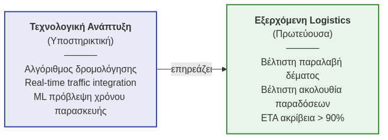
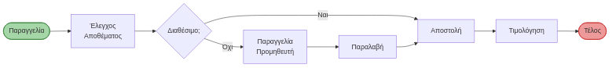
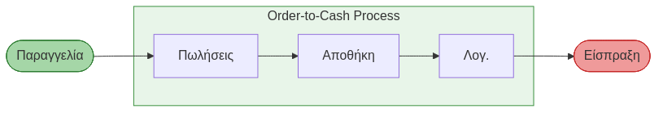
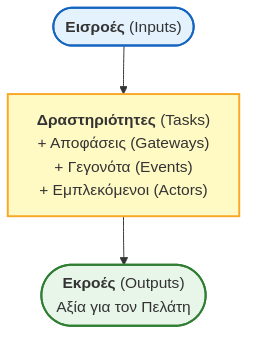
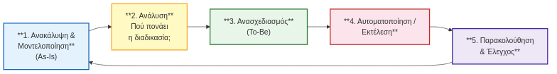
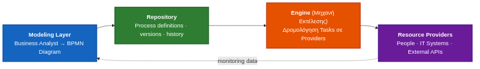

# Συστήματα Αποφάσεων, Διαχείριση Διεργασιών και Επιχειρηματική Ανάλυση
**Ενότητα 2: Στρατηγική και Διοίκηση Επιχειρησιακών Λειτουργιών**
Πανεπιστήμιο Δυτικής Αττικής

**Διδάσκων:** Ανάργυρος Τσαδήμας (<tsadimas@uniwa.gr>)

<!-- Καλωσορίσατε στη δεύτερη ενότητα. Σήμερα θα εστιάσουμε στη Στρατηγική και τη Διοίκηση Επιχειρησιακών Λειτουργιών (Operations Management), δηλαδή στο πώς οι εταιρείες οργανώνονται για να παράγουν και να διανέμουν αξία. -->

---

<!-- _class: xxsmall -->

# Ενότητα 2 — Σύνοψη

| Θέμα | Βασικές Έννοιες | Πηγή |
|---|---|---|
| Operations Management | Input-Process-Output, Goods vs. Services | Slack et al. (2019) |
| Αλυσίδα Αξίας | Primary/Support Activities, Margin | Porter (1985) |
| Στρατηγική Λειτουργιών | Alignment, 4 Ανταγωνιστικές Προτεραιότητες | Hayes & Wheelwright (1984) |
| Process Mapping | Flowchart, BPMN σύμβολα | Harrington (1991) |
| Τύποι Παραγωγής | Project, Job Shop, Batch, Assembly, Continuous | Chase et al. (2006) |

<!-- Εδώ βλέπουμε συνοπτικά τις βασικές έννοιες που θα καλύψουμε σήμερα και τις πηγές τους. Η διοίκηση λειτουργιών δεν είναι απλώς παραγωγή, είναι η καρδιά της ανταγωνιστικότητας μιας επιχείρησης. -->

---

<!-- _class: xsmall -->
# Ενότητα 2 — Περίγραμμα

1. Εισαγωγή στη Διοίκηση Λειτουργιών (Operations Management)
2. Στρατηγική Λειτουργιών & Αλυσίδα Αξίας (Porter)
3. Σχεδίαση Παραγωγής & Χαρτογράφηση Διεργασιών
4. Σχεδίαση Δυναμικότητας & Πρόβλεψη Ζήτησης
5. Διαχείριση Εφοδιαστικής Αλυσίδας (SCM)
6. Προγραμματισμός Παραγωγής: MRP/ERP & Διαχείριση Αποθεμάτων
7. Lean Production & Έξι Σίγμα (Six Sigma)
8. Διαχείριση Ποιότητας & KPIs Απόδοσης

<!-- Το μενού της σημερινής διάλεξης είναι αρκετά πρακτικό. Θα ξεκινήσουμε από τις βασικές έννοιες της παραγωγής, θα περάσουμε στη σχεδίαση και διαχείριση της εφοδιαστικής αλυσίδας, και θα κλείσουμε με πιο σύγχρονες προσεγγίσεις όπως το Lean, το Six Sigma και οι δείκτες απόδοσης. -->

---

# 1. Διοίκηση Λειτουργιών: Το Μοντέλο Input-Process-Output

<!-- _class: diagram-sm -->

<!-- Κάθε επιχείρηση, ανεξαρτήτως αν παράγει προϊόντα ή προσφέρει υπηρεσίες, λειτουργεί με το μοντέλο Input-Process-Output. Παίρνουμε πρώτες ύλες, ανθρώπινους και τεχνολογικούς πόρους (Εισροές), τους μετασχηματίζουμε προσθέτοντας αξία, και εξάγουμε το τελικό αποτέλεσμα (Εκροές). Η δουλειά μας είναι να κάνουμε αυτόν τον μετασχηματισμό όσο πιο αποδοτικό γίνεται. -->

---

# 1. Προϊόντα vs. Υπηρεσίες

| Διάσταση | Προϊόντα (Goods) | Υπηρεσίες (Services) |
|---|---|---|
| **Υλικότητα** | Tangible — χειροπιαστά | Intangible — άυλες |
| **Αποθήκευση** | Αποθηκεύσιμα (inventory) | Μη αποθηκεύσιμες |
| **Παραγωγή/Κατανάλωση** | Διαχωρισμένες | Ταυτόχρονες |
| **Τυποποίηση** | Υψηλή | Χαμηλή (εξατομίκευση) |
| **Μέτρηση ποιότητας** | Αντικειμενική | Υποκειμενική |

> Σήμερα πολλές επιχειρήσεις προσφέρουν **"product-service systems"** — μεικτά πακέτα.

<!-- Πρέπει να ξεκαθαρίσουμε τις διαφορές μεταξύ προϊόντων και υπηρεσιών. Τα προϊόντα είναι χειροπιαστά και μπορούν να αποθηκευτούν, ενώ οι υπηρεσίες καταναλώνονται τη στιγμή που παράγονται. Βέβαια, στη σύγχρονη οικονομία η γραμμή έχει θολώσει. Σκεφτείτε ένα καλό εστιατόριο: αγοράζετε το φαγητό (ως προϊόν) ή την εξυπηρέτηση (ως υπηρεσία); Η απάντηση είναι και τα δύο. -->

---

# 2. Ευθυγράμμιση Λειτουργιών με Εταιρική Στρατηγική

**Alignment:** Το τμήμα παραγωγής/λειτουργιών πρέπει να **υπηρετεί** τη γενική στρατηγική:

| Εταιρική Στρατηγική | Στόχος Operations |
|---|---|
| **Στρατηγική Κόστους** (Cost Leadership) | Μείωση κόστους παραγωγής, αποδοτικότητα |
| **Στρατηγική Διαφοροποίησης** (Differentiation) | Ποιότητα, καινοτομία, ευελιξία |
| **Στρατηγική Εστίασης** (Focus) | Εξειδίκευση σε τμήμα αγοράς |

<!-- Η παραγωγή δεν μπορεί να λειτουργεί στο κενό. Αν η εταιρεία έχει στρατηγική χαμηλού κόστους (όπως π.χ. μια budget αεροπορική), τα operations πρέπει να κόβουν κάθε περιττό έξοδο. Αν η στρατηγική είναι η διαφοροποίηση και η υψηλή ποιότητα (όπως η Apple), τότε οι λειτουργίες πρέπει να εστιάζουν στην καινοτομία και την τελειότητα, έστω κι αν αυτό κοστίζει παραπάνω. -->

---

# 2. Αλυσίδα Αξίας (Porter's Value Chain)

<!-- _class: small -->

Ο **Michael Porter (1985)** περιέγραψε την επιχείρηση ως αλυσίδα δραστηριοτήτων που **δημιουργούν αξία** για τον πελάτη:

**Πρωτεύουσες Δραστηριότητες**
1. **Εισερχόμενη Logistics** — παραλαβή, αποθήκευση υλικών
2. **Λειτουργίες (Operations)** — παραγωγή, συναρμολόγηση
3. **Εξερχόμενη Logistics** — αποθήκευση & διανομή
4. **Μάρκετινγκ & Πωλήσεις**
5. **Υπηρεσίες Μετά την Πώληση**

**Υποστηρικτικές Δραστηριότητες**
- **Υποδομή** (Διοίκηση, Χρηματοδότηση, IT)
- **Διαχείριση HR** (Πρόσληψη, Εκπαίδευση)
- **Τεχνολογική Ανάπτυξη** (R&D, Αυτοματισμός)
- **Προμήθειες** (Sourcing, Διαπραγμάτευση)

> **Περιθώριο (Margin)** = Αξία που αντιλαμβάνεται ο πελάτης − Συνολικό κόστος δραστηριοτήτων.
> *Πηγή: Porter, M.E. (1985). Competitive Advantage. Free Press.*

<!-- Ο Michael Porter μας έδωσε ίσως το πιο γνωστό εργαλείο για την αποτύπωση αυτού: την Αλυσίδα Αξίας. Μας δείχνει ποιες δραστηριότητες (οι πρωτεύουσες) φτιάχνουν και προωθούν άμεσα το προϊόν, και ποιες (οι υποστηρικτικές) τις βοηθούν από πίσω για να κάνουν τη δουλειά τους. Η διαφορά της αξίας που αντιλαμβάνεται ο πελάτης από το συνολικό μας κόστος είναι το περιθώριο κέρδους μας. -->

---

# 2. Value Chain: Παράδειγμα e-food

<!-- _class: xsmall -->

Πώς μια **Υποστηρικτική** δραστηριότητα επηρεάζει άμεσα μια **Πρωτεύουσα**:

| Δραστηριότητα | Χωρίς Τεχνολογία | Με Τεχνολογία |
|---|---|---|
| Χρόνος παράδοσης | ~50 λεπτά | ~28 λεπτά |
| Ακύρωση παραγγελιών | ~12% | ~3% |
| Κόστος/παράδοση | Υψηλό (αδρανής αναμονή) | Χαμηλό (συνεχής ροή) |

> **Συμπέρασμα:** Η τεχνολογία δεν είναι απλά IT υποδομή — είναι **πηγή ανταγωνιστικού πλεονεκτήματος** όταν βελτιώνει τις πρωτεύουσες δραστηριότητες.

<!-- Ας δούμε ένα πρακτικό παράδειγμα από την καθημερινότητά μας, το e-food. Πώς η τεχνολογική ανάπτυξη, που είναι υποστηρικτική δραστηριότητα, απογείωσε τη διανομή, που είναι πρωτεύουσα; Χωρίς τον αλγόριθμο, ένας διανομέας περιμένει. Με τον αλγόριθμο και τον εντοπισμό, η διαδρομή βελτιστοποιείται, ο χρόνος πέφτει στο μισό και τα λάθη ελαχιστοποιούνται. Εδώ βλέπουμε την τεχνολογία να φέρνει άμεσα ανταγωνιστικό πλεονέκτημα. -->

---

# 2. Ανταγωνιστικές Προτεραιότητες

<!-- _class: small -->

Οι λειτουργίες ανταγωνίζονται βάσει **4 διαστάσεων**:

| Προτεραιότητα | Ερώτηση | Παράδειγμα |
|---|---|---|
| **Κόστος** | Μπορούμε να παράγουμε φθηνότερα; | IKEA, Ryanair |
| **Ποιότητα** | Το προϊόν ανταποκρίνεται στις προσδοκίες; | Toyota, Apple |
| **Χρόνος** (Speed/Delivery) | Πόσο γρήγορα παραδίδουμε; | Amazon Prime, Domino's |
| **Ευελιξία** (Flexibility) | Μπορούμε να προσαρμοστούμε στη ζήτηση; | Zara (Fast Fashion) |

> Δεν μπορείς να τα κάνεις όλα τέλεια — **trade-offs** είναι αναπόφευκτα *(Hayes & Wheelwright, 1984)*.

<!-- Στον πραγματικό κόσμο, δεν μπορούμε να είμαστε τέλειοι σε όλα. Μια εταιρεία πρέπει να διαλέξει πού θα χτυπήσει τον ανταγωνισμό: Στο Κόστος, στην Ποιότητα, στο Χρόνο ή στην Ευελιξία. Αν θες να είσαι το πιο φθηνό προϊόν, ίσως χρειαστεί να θυσιάσεις την εξατομίκευση. Αν θες την απόλυτη ευελιξία, όπως η Zara στη γρήγορη μόδα, χρειάζεσαι εντελώς διαφορετική οργάνωση. Πρέπει να κάνουμε συμβιβασμούς (trade-offs). -->

---

# 3. Χαρτογράφηση Διεργασιών (Process Mapping)

<!-- _class: xsmall -->

**Ορισμός:** Οπτική αναπαράσταση των βημάτων μιας διεργασίας — αποκαλύπτει καθυστερήσεις, επαναλήψεις, σημεία ελέγχου.

**Βασικά σύμβολα (BPMN / Flowchart)**

| Σύμβολο | Σχήμα | Σημασία |
|---|---|---|
| Έναρξη / Λήξη | Ελλειψοειδές | Αρχή ή τέλος |
| Δραστηριότητα | Ορθογώνιο | Εκτέλεση εργασίας |
| Απόφαση | Ρόμβος | Διακλάδωση Ναι/Όχι |
| Ροή | Βέλος | Σειρά εκτέλεσης |
| Έγγραφο | Ορθογώνιο (κυματιστό) | Παραγόμενο έγγραφο |

**Παράδειγμα — Παραγγελία Πελάτη**

**Εργαλεία:** MS Visio, Lucidchart, draw.io

> *Πηγή: Harrington (1991), Business Process Improvement*

<!-- Για να βελτιώσουμε κάτι, πρέπει πρώτα να το δούμε ξεκάθαρα. Η χαρτογράφηση διεργασιών (Process Mapping) μας δίνει τα εργαλεία για να αποτυπώσουμε τα βήματα. Εδώ βλέπουμε τα βασικά σύμβολα που χρησιμοποιούνται στα διαγράμματα ροής και στο BPMN. Μια εικόνα, ειδικά σε περίπλοκες διαδικασίες, αξίζει πραγματικά όσο χίλιες λέξεις και αποκαλύπτει αμέσως πού γίνονται περιττά βήματα. -->

---

# 3. Τύποι Διαδικασιών Παραγωγής

<!-- _class: small -->

| Τύπος | Χαρακτηριστικά | Παράδειγμα |
|---|---|---|
| **Έργο (Project)** | Μοναδικό, πολύπλοκο, μεγάλης διάρκειας | Κατασκευή γέφυρας, ταινία |
| **Κατά Παραγγελία (Job Shop)** | Μικρές ποσότητες, υψηλή ποικιλία | Συνεργείο αυτοκινήτων, εκτύπωση |
| **Κατά Παρτίδες (Batch)** | Ομαδοποιημένη παραγωγή παρόμοιων προϊόντων | Αρτοποιία, φαρμακευτική |
| **Μαζική / Γραμμή Συναρμολόγησης** | Μεγάλοι όγκοι, χαμηλή ποικιλία | Αυτοκινητοβιομηχανία |
| **Συνεχής Ροή (Continuous Flow)** | Αδιάλειπτη παραγωγή, πλήρης αυτοματοποίηση | Διυλιστήριο, χαλυβουργία |

> Ο κατάλληλος τύπος εξαρτάται από: **ζήτηση, ποικιλία προϊόντων, επίπεδο αυτοματισμού**.

<!-- Υπάρχουν 5 βασικοί τρόποι να οργανώσεις την παραγωγή σου. Ξεκινάμε από το απόλυτα μοναδικό "Project" (όπως η κατασκευή μιας γέφυρας ή μιας ταινίας) και φτάνουμε στο άλλο άκρο, τη "Συνεχή Ροή", όπου το εργοστάσιο βγάζει ασταμάτητα, 24/7 το ίδιο πράγμα (όπως ένα διυλιστήριο). Στη μέση βρίσκουμε λύσεις όπως το Batch και το Job Shop, τα οποία καλύπτουν ενδιάμεσες ανάγκες σε όγκο και ποικιλία. -->

---

# 3. Product-Process Matrix

<!-- _class: xsmall -->

Οι **Hayes & Wheelwright (1979)** συνδέουν τον **τύπο προϊόντος** με τον **τύπο διαδικασίας**:

|  | ← Μεγάλη ποικιλία / Μικρός όγκος | | Μικρή ποικιλία / Μεγάλος όγκος → |
|---|---|---|---|
| **Στάδιο Διεργασίας** | **Job Shop** | **Batch** | **Assembly / Continuous** |
| Εξοπλισμός | Γενικής χρήσης | Μικτός | Εξειδικευμένος |
| Εργατικό | Υψηλής εξειδίκευσης | Μέσης | Χαμηλής (αυτοματισμός) |
| Κόστος/μονάδα | Υψηλό | Μέσο | Χαμηλό |
| Ευελιξία | Πολύ υψηλή | Μέτρια | Χαμηλή |

**Η «διαγώνιος»:** εταιρείες που βρίσκονται εκτός της φυσικής διαγωνίου αντιμετωπίζουν **ανταγωνιστικό μειονέκτημα**.

> **⚠️ Ερώτηση για σκέψη:** Τι θα συνέβαινε αν προσπαθούσαμε να κατασκευάσουμε ένα **πολυτελές, custom γιοτ** (Project/Job Shop) πάνω σε μια **κινούμενη γραμμή συναρμολόγησης** της Ford (Assembly Line);
>
> — Το γιοτ δεν θα χωράει · δεν μπορεί να "ρέει" στη γραμμή · κάθε γιοτ είναι διαφορετικό, αλλά η γραμμή απαιτεί πανομοιότυπα βήματα. Αποτέλεσμα: **τεράστιο κόστος, μηδενική ευελιξία, χαμένη επένδυση**.
>
> Αυτό ακριβώς είναι το «εκτός διαγωνίου» — λάθος διεργασία για το λάθος προϊόν.

> *Πηγή: Hayes, R. & Wheelwright, S. (1979). "Link Manufacturing Process and Product Life Cycles". HBR.*

<!-- Αυτός ο πίνακας (Product-Process Matrix) είναι πολύ κρίσιμος. Μας δείχνει ότι ο τύπος της παραγωγικής διαδικασίας ΠΡΕΠΕΙ να ταιριάζει με τον όγκο και την ποικιλία του προϊόντος. Αν βρίσκεσαι πάνω στη 'διαγώνιο', έχεις ευθυγραμμίσει σωστά τη στρατηγική σου. Αν φύγεις από αυτή, όπως στο παράδειγμα με το πολυτελές γιοτ στη γραμμή συναρμολόγησης της Ford, πας για καταστροφή: το κόστος θα εκτοξευθεί και η ευελιξία θα χαθεί. -->

---

# 3. Mass Customization — Η Εξαίρεση του Κανόνα

<!-- _class: xsmall -->

Η Toyota κατάφερε να συνδυάσει **Assembly Line** (χαμηλό κόστος) με **Ευελιξία** (ποικιλία μοντέλων) μέσω του **Toyota Production System (TPS)**:
- **SMED** (Single-Minute Exchange of Die): αλλαγή εργαλείων/καλουπιών σε < 10 λεπτά
- **Kanban**: «τραβάει» η ζήτηση, δεν «σπρώχνει» η παραγωγή

> Αυτό επέτρεψε στη Toyota να παράγει διαφορετικά μοντέλα στην **ίδια γραμμή** — χωρίς να θυσιάσει ούτε κόστος ούτε ευελιξία.

**Mass Customization** = η ικανότητα παραγωγής **εξατομικευμένων** προϊόντων σε **κόστος μαζικής παραγωγής**.

| Εταιρεία | Πώς το πετυχαίνει |
|---|---|
| **Toyota** | TPS, SMED — διαφορετικά μοντέλα στην ίδια γραμμή |
| **Dell** | Build-to-order: ο πελάτης διαμορφώνει το PC online |
| **Zara** | Μικρές παρτίδες + γρήγορος κύκλος σχεδιασμού (2 εβδομάδες) |

<!-- Υπάρχει βέβαια και μια σύγχρονη εξαίρεση στον κανόνα της διαγωνίου: το Mass Customization. Η Toyota, και αργότερα εταιρείες όπως η Dell και η Zara, κατάφεραν το ακατόρθωτο. Προσφέρουν μεγάλη ποικιλία (εξατομίκευση), αλλά κρατάνε το κόστος τόσο χαμηλά, σαν να έκαναν μαζική παραγωγή. Αυτό το πέτυχαν μέσα από απόλυτο συγχρονισμό, απλοποίηση, και δραστική μείωση των χρόνων αλλαγής εργαλείων (όπως το SMED). -->

---

# 3. Χωροταξικός Σχεδιασμός (Facility Layout)

Ο φυσικός σχεδιασμός του χώρου εργασίας ανάλογα με τον τύπο παραγωγής:

| Layout | Κατάλληλο για | Χαρακτηριστικό |
|---|---|---|
| **Process Layout** | Job Shop | Εξοπλισμός ομαδοποιημένος ανά τύπο λειτουργίας |
| **Product Layout** | Assembly Line | Εξοπλισμός στη σειρά κατά ροή παραγωγής |
| **Fixed Position Layout** | Projects | Το προϊόν μένει σταθερό, πόροι έρχονται σε αυτό |
| **Cellular Layout** | Batch | Ομάδες μηχανών για "οικογένειες" προϊόντων |

<!-- Ο τύπος παραγωγής επηρεάζει άμεσα και το πώς στήνουμε τον φυσικό χώρο (Facility Layout). Αν έχουμε γραμμή συναρμολόγησης, οι μηχανές μπαίνουν στη σειρά (Product Layout). Αν φτιάχνουμε ένα αεροπλάνο (Project), το προϊόν μένει προφανώς ακίνητο και οι εργάτες πηγαίνουν γύρω του (Fixed Position). Στα μηχανουργεία (Job Shop) ομαδοποιούμε τις μηχανές ανά λειτουργία. -->

---

# 4. Διαχείριση Δυναμικότητας (Capacity Planning)

<!-- _class: xsmall -->

**Ορισμός:** Ο καθορισμός της παραγωγικής ικανότητας που χρειάζεται η επιχείρηση για να ικανοποιήσει τη ζήτηση.

**Στρατηγικές προσαρμογής:**

| Στρατηγική | Λογική | Παράδειγμα | Κίνδυνος |
|---|---|---|---|
| **Lead** (Επίθεση) | Αύξηση *πριν* τη ζήτηση | TSMC: νέο εργοστάσιο chips για αναμενόμενη ζήτηση AI | Υποχρησιμοποίηση, δεσμευμένο κεφάλαιο |
| **Lag** (Άμυνα) | Αύξηση *μετά* επιβεβαίωση ζήτησης | Αγορά νέων φορτηγών μόνο αφού ξεμείνεις | Υπερφόρτωση, μη εξυπηρετούμενη ζήτηση |
| **Match** (Ισορροπία) | Σταδιακή προσαρμογή παράλληλα | Προσλήψεις μήνα-με-μήνα ανάλογα ζήτησης | Διαρκής παρακολούθηση και προσαρμογή |

<!-- To Capacity Planning είναι ίσως η πιο ακριβή απόφαση: 'πόσο μεγάλο εργοστάσιο/αποθήκη/στόλο χρειαζόμαστε;'. Έχουμε 3 στρατηγικές: Lead (χτίζω χωρητικότητα νωρίτερα, με ρίσκο να μη χρειαστεί), Lag (περιμένω να σιγουρευτώ για τη ζήτηση, με ρίσκο να χάσω πωλήσεις εντωμεταξύ) και Match (προσπαθώ να προσθέτω σιγά-σιγά χωρητικότητα). Κάθε μία έχει τα υπέρ και τα κατά της. -->

---

# 4. Πρόβλεψη Ζήτησης (Demand Forecasting)

<!-- _class: xsmall -->

**Γιατί χρειάζεται:** Η πρόβλεψη τροφοδοτεί το capacity planning, τα αποθέματα και τον προγραμματισμό παραγωγής.

**Ποιοτικές Μέθοδοι**
- **Delphi:** διαδοχικές εκτιμήσεις εμπειρογνωμόνων
- **Έρευνα Αγοράς:** ερωτηματολόγια, focus groups
- **Κρίση Στελεχών:** εσωτερική συλλογική εκτίμηση

*Χρήσιμες όταν:* δεν υπάρχουν ιστορικά δεδομένα (νέο προϊόν, νέα αγορά)

**Ποσοτικές Μέθοδοι**
- **Κινητός Μέσος Όρος (Moving Average):** εξομάλυνση βραχυπρόθεσμων διακυμάνσεων
- **Εκθετική Εξομάλυνση (Exponential Smoothing):** βάρος στα πρόσφατα δεδομένα
- **Παλινδρόμηση (Regression):** σχέση ζήτησης με εξωτερικές μεταβλητές
- **ARIMA / ML:** χρονοσειρές, machine learning

> **Κανόνας:** Καμία πρόβλεψη δεν είναι τέλεια — σχεδίασε πάντα για **εύρος** (range) και μέτρα απόκλισης (MAD, MAPE).
> *Πηγή: Chase, Aquilano & Jacobs (2006). Operations Management. McGraw-Hill.*

<!-- Για να ξέρουμε τι δυναμικότητα χρειαζόμαστε, πρέπει να προβλέψουμε το μέλλον. Χρησιμοποιούμε ποιοτικές μεθόδους, όπως γνώμες ειδικών, όταν βγάζουμε ένα εντελώς νέο προϊόν. Χρησιμοποιούμε ποσοτικές (μαθηματικά) όταν έχουμε ιστορικά δεδομένα. Ο χρυσός κανόνας όμως είναι ένας: καμία πρόβλεψη δεν θα βγει 100% ακριβής. Γι' αυτό ετοιμαζόμαστε πάντα για ένα εύρος αποκλίσεων. -->

---

# 5. Διαχείριση Εφοδιαστικής Αλυσίδας (SCM)

<!-- _class: xsmall -->

**Ορισμός:** Διαχείριση του δικτύου οργανισμών, δραστηριοτήτων και πόρων που μετατρέπουν πρώτες ύλες σε τελικά προϊόντα/υπηρεσίες *(Chopra & Meindl, 2007)*.

**5 Drivers of Supply Chain Performance (Chopra):**

| Driver | Ερώτηση |
|---|---|
| **Αποθέματα** | Πόσο να κρατάμε και πού; |
| **Μεταφορά** | Πώς να μετακινούμε προϊόντα; |
| **Εγκαταστάσεις** | Πού να παράγουμε/αποθηκεύουμε; |
| **Πληροφόρηση** | Πώς να μοιραζόμαστε δεδομένα στην αλυσίδα; |
| **Τιμολόγηση & Sourcing** | Make or Buy; Ποιοι προμηθευτές; |

<!-- Αφήνοντας τον στενό χώρο του εργοστασίου μας, πάμε στο Supply Chain Management, δηλαδή στη Διαχείριση Εφοδιαστικής Αλυσίδας. Εδώ κοιτάμε όλο το δίκτυο: από τη φάρμα που βγάζει την πρώτη ύλη, μέχρι το κατάστημα που πουλάει το τελικό προϊόν. Οι 5 οδηγοί (Drivers) του Chopra, από τα αποθέματα μέχρι την πληροφόρηση, καθορίζουν αν αυτό το δίκτυο θα είναι ευέλικτο και αποδοτικό. -->

---

# 5. Φαινόμενο Bullwhip

<!-- _class: xxsmall -->

**Ορισμός:** Μικρές διακυμάνσεις στη ζήτηση καταναλωτή **ενισχύονται** όσο ανεβαίνουμε στην αλυσίδα → υπερβολικές παραγγελίες/αποθέματα *(Lee et al., 1997)*.

**Beer Distribution Game — Αριθμητικό Σενάριο:**

| Επίπεδο | Πραγματική Ζήτηση | Παραγγελία (με buffer) | Απόκλιση |
|---|---|---|---|
| Καταναλωτής | 100 κιβώτια | — | 0% |
| Λιανέμπορος | 100 | 110 (+10% buffer) | +10% |
| Χονδρέμπορος | 110 | 132 (+20% buffer) | +32% |
| Διανομέας | 132 | 172 (+30% buffer) | +72% |
| Εργοστάσιο | 172 | **παράγει 240** | **+140%** |

> Αποτέλεσμα: Ο καταναλωτής ζήτησε 5% παραπάνω ένα μήνα. Το εργοστάσιο κατέληξε να παράγει **140% παραπάνω** — γεμίζοντας αποθήκες με αδύνατο να πουληθεί στοκ.

**Αιτίες:**
- Batch ordering · κερδοσκοπία λόγω εκπτώσεων
- Ο καθένας προσθέτει δικό του «buffer» χωρίς να βλέπει την πραγματική ζήτηση

**Αντιμετώπιση:** VMI, EDI, κοινές προβλέψεις (CPFR), JIT, διαμοιρασμός POS δεδομένων.

> *Πηγή: Lee et al. (1997), Sloan Management Review · Sterman, J. (1989), "Modeling Managerial Behavior", Management Science.*

<!-- Το πιο διάσημο, και επικίνδυνο, πρόβλημα στην Εφοδιαστική Αλυσίδα είναι το Bullwhip Effect (Φαινόμενο Μαστιγίου). Δείτε αυτόν τον πίνακα. Μια μικρή αύξηση της τάξης του 10% από τον καταναλωτή, μεταφράστηκε σε πανικό και 140% υπερπαραγωγή στο εργοστάσιο. Γιατί; Επειδή ο καθένας έβαζε το δικό του 'μαξιλαράκι' ασφαλείας χωρίς να μοιράζεται τα δεδομένα με τους άλλους. Αυτό λύνεται μόνο με ενοποίηση πληροφοριών. -->

---

# 6. MRP & ERP

<!-- _class: xsmall -->

**MRP — Material Requirements Planning**

Υπολογισμός *πότε* και *πόσα* υλικά χρειάζονται βάσει:
- **MPS** (Master Production Schedule) — τι θα παραχθεί
- **BOM** (Bill of Materials) — τι υλικά χρειάζεται κάθε προϊόν
- **Inventory Records** — τι έχουμε ήδη

**Εξέλιξη:**
- MRP → MRP II (+ capacity planning)
- MRP II → **ERP** (ενοποίηση όλων)

**ERP — Enterprise Resource Planning**

| Module | Λειτουργία |
|---|---|
| Production | MRP, scheduling |
| Finance | Λογιστική, budgeting |
| HR | Μισθοδοσία, αξιολόγηση |
| Sales (CRM) | Παραγγελίες, πελάτες |
| Procurement | Προμήθειες, αποθήκη |

**Συστήματα:** SAP, Oracle, MS Dynamics

> *Πηγή: Vollmann et al. (2005). Manufacturing Planning and Control Systems.*

<!-- Πώς λύνουμε λοιπόν την ασυνεννοησία; Με εξειδικευμένα πληροφοριακά συστήματα. Το MRP ξεκίνησε τις προηγούμενες δεκαετίες για να υπολογίζει με ακρίβεια πόσες βίδες, ρόδες κλπ. χρειαζόμαστε. Σήμερα, αυτό εξελίχθηκε στα ERP. Τα ERP (όπως το SAP ή της Oracle) είναι πλέον ο κεντρικός 'εγκέφαλος' μιας επιχείρησης που διαχειρίζεται τα πάντα: από υλικά, μέχρι πωλήσεις και HR. -->

---

# 6. MRP: Πώς Λειτουργεί στην Πράξη

<!-- _class: xsmall -->

**Σενάριο:** Εργοστάσιο ποδηλάτων θέλει να παράγει **100 ποδήλατα** την επόμενη εβδομάδα.

> Το MRP εξαλείφει το **«μαντεμένο» απόθεμα** — παραγγέλνει ακριβώς ό,τι λείπει, τη στιγμή που χρειάζεται (*time-phased requirements*).

<!-- Δείτε εδώ, πολύ απλοποιημένα, τη λογική του MRP. Δεν παραγγέλνουμε "περίπου 100 ρόδες" γενικά και αόριστα. Το σύστημα ξέρει πότε ακριβώς θα συναρμολογηθούν τα ποδήλατα σύμφωνα με το πλάνο παραγωγής, ελέγχει πόσες ρόδες έχουμε ήδη μέσα στην αποθήκη, και παραγγέλνει μόνο τη διαφορά. Έτσι τα υλικά φτάνουν "Just-In-Time" χωρίς να πληρώνουμε τζάμπα αποθήκες. -->

---

# 6. Διαχείριση Αποθεμάτων (Inventory Management)

<!-- _class: xxsmall -->

**Γιατί κρατάμε αποθέματα;**
- Ασφάλεια έναντι αβεβαιότητας ζήτησης/προμήθειας
- Εκμετάλλευση οικονομιών κλίμακας (bulk orders)
- Κάλυψη εποχικής ζήτησης

**Οικονομικό Μέγεθος Παραγγελίας (EOQ)**

**⚠️ Πριν τον τύπο — η λογική:**

> Υπάρχουν δύο αντίθετες δυνάμεις κόστους:
> - Αν **παραγγέλνεις συχνά** (μικρές ποσότητες): πολλά μεταφορικά, διοικητικό κόστος
> - Αν **παραγγέλνεις σπάνια** (μεγάλες ποσότητες): γεμάτη αποθήκη, ενοίκιο, φθορά, δεσμευμένο κεφάλαιο
>
> Το EOQ βρίσκει το **"γλυκό σημείο"** — την ποσότητα όπου τα δύο κόστη ισορροπούν.

$$EOQ = \sqrt{\frac{2 \cdot D \cdot S}{H}}$$

Όπου: **D** = ετήσια ζήτηση · **S** = κόστος/παραγγελία · **H** = κόστος διατήρησης/μονάδα/έτος

**Just-In-Time (JIT) / Lean Production**
- Ελαχιστοποίηση αποθεμάτων — παραγγελία *ακριβώς* όταν χρειάζεται
- Απαιτεί αξιόπιστους προμηθευτές και σταθερή ζήτηση

<!-- Τα αποθέματα κοστίζουν. Γιατί να τα κρατάμε; Κυρίως για ασφάλεια και για οικονομίες κλίμακας (έκπτωση αν πάρουμε πολλά μαζί). Το μεγάλο ερώτημα είναι: ποια είναι η σωστή ποσότητα παραγγελίας; Ο μαθηματικός τύπος EOQ (Economic Order Quantity) είναι το εργαλείο που βρίσκει τη χρυσή τομή ανάμεσα στο κόστος παραγγελίας (μεταφορικά) και το κόστος αποθήκευσης. -->

---

# 6. EOQ — Ανάλυση Μεταβλητών

<!-- _class: xsmall -->

| Μεταβλητή | Τι μετρά | Παράδειγμα | Επίδραση στο EOQ |
|---|---|---|---|
| **D** — Ετήσια Ζήτηση | Συνολικά τεμάχια/έτος | 10.000 μπουκάλια/έτος | ↑D → ↑EOQ (παραγγέλνουμε περισσότερα) |
| **S** — Setup cost | Κόστος/παραγγελία: μεταφορικά, εκτελωνισμός, διοικητικός χρόνος | 50€/παραγγελία | ↑S → ↑EOQ (σπανιότερα, μεγαλύτερες παρτίδες) |
| **H** — Holding cost | Κόστος αποθήκευσης/μονάδα/έτος: ενοίκιο, ασφάλιστρα, φθορές | 2€/μονάδα/έτος | ↑H → ↓EOQ (μικρότερες παρτίδες, λιγότερο στοκ) |

> **Παράδειγμα:** D=10.000, S=50€, H=2€ → $EOQ = \sqrt{\frac{2 \times 10.000 \times 50}{2}} = \sqrt{500.000} \approx 707$ μονάδες/παραγγελία

<!-- Αναλύοντας λίγο τον τύπο του EOQ: Αν τα μεταφορικά ή ο εκτελωνισμός (S) είναι πολύ ακριβά, σε συμφέρει να παραγγέλνεις σπανιότερα φέρνοντας μεγάλα φορτία, άρα το EOQ ανεβαίνει. Αν αντίθετα η αποθήκευση (H) είναι ακριβή (π.χ. αν χρειάζεσαι ψυγεία), θες να διώχνεις το εμπόρευμα γρήγορα, άρα κάνεις μικρότερες παραγγελίες (το EOQ κατεβαίνει). -->

---

# 7. Lean Production — Οι 7 Τύποι Σπατάλης (Muda)

<!-- _class: xxsmall -->

Η **Lean** φιλοσοφία (Toyota Production System, Ohno 1988) στοχεύει στην **εξάλειψη κάθε δραστηριότητας που δεν προσθέτει αξία**.

Απομνημονεύστε τις 7 Σπατάλες με το ακρωνύμιο **TIMWOOD**:

| Γράμμα | Τύπος Σπατάλης | Παράδειγμα |
|---|---|---|
| **T** | **Μεταφορά** (Transport) | Περιττές μετακινήσεις υλικών στο εργοστάσιο |
| **I** | **Αποθέματα** (Inventory) | Υπερβολικά αποθέματα σε WIP ή τελικά προϊόντα |
| **M** | **Κίνηση** (Motion) | Περιττές κινήσεις εργαζόμενων (εργονομία) |
| **W** | **Αναμονή** (Waiting) | Εργαζόμενοι/μηχανές αδρανούν περιμένοντας υλικά |
| **O** | **Υπερπαραγωγή** (Overproduction) | Παραγωγή πριν τη ζήτηση — δεσμεύει κεφάλαιο *(η χειρότερη σπατάλη)* |
| **O** | **Υπερεπεξεργασία** (Over-processing) | Βήματα που δεν ζητά/πληρώνει ο πελάτης |
| **D** | **Ελαττώματα** (Defects) | Επανεπεξεργασία, scrap, απόρριψη |

*(+1 Muda: **Αναξιοποίητο Ταλέντο** — προσθήκη Liker 2004)*

> *Πηγή: Ohno, T. (1988). Toyota Production System. Productivity Press · Liker, J. (2004). The Toyota Way.*

<!-- Ας περάσουμε στην καρδιά της Ιαπωνικής φιλοσοφίας παραγωγής (Lean και TPS). Ο στόχος είναι να 'κόψουμε το λίπος'. Οι Ιάπωνες εντόπισαν 7 συγκεκριμένους τύπους σπατάλης (Muda), που τους θυμόμαστε με το ακρωνύμιο TIMWOOD. Η χειρότερη όλων είναι ξεκάθαρα η υπερπαραγωγή, διότι δεσμεύει ρευστότητα και δημιουργεί την ανάγκη για όλες τις υπόλοιπες σπατάλες (χώρος, μετακίνηση, φθορές). -->

---

# 7. Six Sigma & DMAIC

<!-- _class: xsmall -->

**Six Sigma:** Μεθοδολογία βελτίωσης ποιότητας που στοχεύει σε ≤ 3,4 ελαττώματα ανά **εκατομμύριο ευκαιρίες** *(Motorola, 1986 · GE, Jack Welch)*.

**Κύκλος DMAIC:**

| Φάση | Ερώτηση | Εργαλεία |
|---|---|---|
| **D**efine | Ποιο πρόβλημα λύνουμε; | Project Charter, VOC, SIPOC |
| **M**easure | Πού βρισκόμαστε τώρα; | Ιστόγραμμα, Control Chart, MSA |
| **A**nalyze | Ποια είναι η αιτία; | Fishbone, 5 Whys, Pareto, Regression |
| **I**mprove | Πώς το διορθώνουμε; | DoE, Kaizen, Pilot |
| **C**ontrol | Πώς το διατηρούμε; | Control Plan, SPC, Standard Work |

**Lean Six Sigma:** Συνδυασμός Lean (ταχύτητα, εξάλειψη σπατάλης) + Six Sigma (ποιότητα, μειωμένη διακύμανση).

> *Πηγή: George, M. (2002). Lean Six Sigma. McGraw-Hill · Harry, M. & Schroeder, R. (2000). Six Sigma. Doubleday.*

<!-- Το Six Sigma (Έξι Σίγμα) είναι η αμερικανική απάντηση, από εταιρείες όπως η Motorola και η GE. Εδώ ο εχθρός δεν είναι απλά η σπατάλη, αλλά η ΔΙΑΚΥΜΑΝΣΗ. Θέλουμε τέλεια σταθερότητα: μόνο 3,4 ελαττώματα στο εκατομμύριο. Για να το πετύχουν, ακολουθούν αυστηρά τον κύκλο βελτίωσης DMAIC. Πλέον, οι περισσότερες σοβαρές εταιρείες συνδυάζουν Lean (για ταχύτητα) και Six Sigma (για αλάνθαστη ποιότητα). -->

---

# 8. Διαχείριση Ποιότητας

<!-- _class: small -->

**Διοίκηση Ολικής Ποιότητας (TQM — Total Quality Management)**

Βασικές αρχές:
- Εστίαση στον **πελάτη** (εσωτερικό & εξωτερικό)
- **Συνεχής βελτίωση** (Kaizen — ιαπωνική φιλοσοφία)
- Εμπλοκή **όλου του προσωπικού**
- Αποφάσεις βάσει **δεδομένων**

**Στατιστικός Έλεγχος Διεργασιών (SPC)**
- Παρακολούθηση και έλεγχος ποιότητας με στατιστικά εργαλεία
- Control Charts: οπτικοποίηση αποκλίσεων από τον κανόνα

> **Ποιότητα** δεν σημαίνει μόνο "ακριβό" — σημαίνει **καταλληλότητα για τον σκοπό** (fitness for purpose).

<!-- Η ποιότητα δεν αφορά μόνο το τμήμα ελέγχου στο τέλος της γραμμής. Το TQM (Διοίκηση Ολικής Ποιότητας) λέει ότι η ποιότητα είναι δουλειά ΟΛΩΝ στην εταιρεία, κάθε μέρα. Δεν είναι κάτι που το ελέγχεις στο τέλος, αλλά κάτι που το χτίζεις από την αρχή. Γι' αυτό χρησιμοποιούμε στατιστικά εργαλεία (SPC) για να βλέπουμε τις τάσεις και να προλαβαίνουμε τα λάθη πριν το προϊόν φτάσει στον πελάτη. -->

---

# 8. KPIs Λειτουργιών — Παραγωγικότητα & Χρόνος

<!-- _class: small -->

**Παραγωγικότητα & Ποιότητα**

| KPI | Τύπος / Ορισμός |
|---|---|
| **OEE** | Availability × Performance × Quality |
| **Defect Rate** | Ελαττώματα / Σύνολο παραγωγής |
| **First Pass Yield** | % μονάδων σωστές εκ πρώτης |
| **Scrap Rate** | Κόστος απόρριψης / Σύνολο κόστους |

**Χρόνος**

| KPI | Ορισμός |
|---|---|
| **Cycle Time** | Χρόνος από έναρξη έως παράδοση |
| **Lead Time** | Χρόνος από παραγγελία έως παράδοση |
| **Takt Time** | Διαθέσιμος χρόνος / Ζήτηση πελατών |

> **Takt Time** = ρυθμός με τον οποίο πρέπει να παράγεται ένα προϊόν για να ικανοποιηθεί η ζήτηση — θεμέλιο του Lean.

<!-- Τι μετράμε στις λειτουργίες μας (KPIs); Για την αποδοτικότητα του εξοπλισμού χρησιμοποιούμε το OEE, που συνδυάζει διαθεσιμότητα, απόδοση και ποιότητα. Όσον αφορά τον χρόνο, ο 'μετρονόμος' της γραμμής παραγωγής είναι το Takt Time. Είναι ο ρυθμός στον οποίο ΠΡΕΠΕΙ να παράγεις ένα προϊόν (π.χ. 1 κάθε λεπτό) προκειμένου να ικανοποιήσεις ακριβώς τη ζήτηση της αγοράς, χωρίς υπερπαραγωγή. -->

---

# 8. KPIs Λειτουργιών — Αποθέματα & Εφοδιαστική

<!-- _class: xsmall -->

**Αποθέματα & Κόστος**

| KPI | Ορισμός |
|---|---|
| **Inventory Turnover** | Πωλήσεις / Μέσο Απόθεμα |
| **Days of Inventory** | 365 / Inventory Turnover |
| **COGS %** | Κόστος πωληθέντων / Έσοδα |
| **Capacity Utilization** | Πραγματική παραγωγή / Μέγιστη δυναμικότητα |

**Εφοδιαστική Αλυσίδα**

| KPI | Ορισμός |
|---|---|
| **OTIF** | On Time In Full — % παραδόσεων έγκαιρα & πλήρεις |
| **Fill Rate** | % παραγγελιών που ικανοποιήθηκαν από απόθεμα |
| **Perfect Order Rate** | % παραγγελιών χωρίς κανένα σφάλμα |

> Στόχος: **Amazon** OTIF > 99% · Τυπικός κλάδος: 85–95%.

> *Πηγή: Slack, N., Brandon-Jones, A. & Johnston, R. (2019). Operations Management, 9th ed. Pearson.*

<!-- Στην εφοδιαστική αλυσίδα και τα αποθέματα, το πιο σκληρό αλλά δίκαιο KPI είναι το OTIF (On Time In Full). Παρέδωσες την παραγγελία στον σωστό χρόνο ΚΑΙ στη σωστή ποσότητα; Οτιδήποτε λιγότερο από 100% επιτυχία σε αυτά τα δύο, είναι απλά αποτυχία. Αν θέλεις να είσαι στο επίπεδο κολοσσών όπως η Amazon, το OTIF σου πρέπει πρακτικά να μην πέφτει ποτέ κάτω από το απόλυτο. -->

---

<!-- _class: xxsmall -->

# Ενότητα 2 — Σύνοψη

| Θέμα | Βασικές Έννοιες | Πηγή |
|---|---|---|
| Operations Management | Input-Process-Output, Goods vs. Services | Slack et al. (2019) |
| Αλυσίδα Αξίας | Primary/Support Activities, Margin | Porter (1985) |
| Στρατηγική Λειτουργιών | Alignment, 4 Ανταγωνιστικές Προτεραιότητες | Hayes & Wheelwright (1984) |
| Process Mapping | Flowchart, BPMN σύμβολα | Harrington (1991) |
| Τύποι Παραγωγής | Project, Job Shop, Batch, Assembly, Continuous | Chase et al. (2006) |
| Product-Process Matrix | Διαγώνιος: ποικιλία vs. όγκος | Hayes & Wheelwright (1979) |
| Πρόβλεψη Ζήτησης | Ποιοτικές / Ποσοτικές μέθοδοι | Chase et al. (2006) |
| SCM & Bullwhip | 5 Drivers, ενίσχυση διακύμανσης | Chopra & Meindl (2007) |
| MRP / ERP | BOM, MPS, ολοκληρωμένα συστήματα | Vollmann et al. (2005) |
| Capacity & Inventory | Lead/Lag/Match, EOQ, JIT | Slack et al. (2019) |
| Lean — 7 Muda | Εξάλειψη μη-αξίας (Toyota) | Ohno (1988), Liker (2004) |
| Six Sigma / DMAIC | Define-Measure-Analyze-Improve-Control | George (2002) |
| TQM | Πελάτης, Kaizen, Δεδομένα, SPC | Deming (1986) |
| KPIs Λειτουργιών | OEE, Cycle Time, OTIF, Inventory Turnover | Slack et al. (2019) |

<!-- Αυτή ήταν μια πολύ συμπυκνωμένη ματιά στον κόσμο του Operations Management. Ξεκινήσαμε από την στρατηγική ευθυγράμμιση, πήγαμε στον σχεδιασμό δυναμικότητας, μπήκαμε στην εφοδιαστική αλυσίδα, και κλείσαμε με τις σύγχρονες μεθοδολογίες Lean και Six Sigma για συνεχή βελτίωση. Όλα αυτά αποτελούν τη βάση για να μπορεί μια εταιρεία να επιβιώσει και να κερδίζει χρήματα. -->

---

<!-- _class: xxsmall -->

# Ενότητα 2 — Βιβλιογραφία

**Κύριο Σύγγραμμα**

> **Slack, N., Brandon-Jones, A. & Johnston, R.** (2019). *Operations Management*, 9th ed. Pearson.
> Θεμελιώδες εγχειρίδιο Διοίκησης Λειτουργιών — καλύπτει σχεδιασμό παραγωγής, capacity, αποθέματα, ποιότητα, SCM και KPIs.

**Συμπληρωματικές Πηγές**

| Συγγραφέας | Έργο | Θέμα |
|---|---|---|
| Porter, M.E. | *Competitive Advantage* (1985). Free Press | Αλυσίδα Αξίας |
| Hayes, R. & Wheelwright, S. | "Link Manufacturing Process and Product Life Cycles", *HBR* (1979) | Product-Process Matrix |
| Chopra, S. & Meindl, P. | *Supply Chain Management*, 5th ed. (2013). Pearson | SCM & 5 Drivers |
| Lee, H., Padmanabhan, V. & Whang, S. | "The Bullwhip Effect in Supply Chains", *Sloan Management Review* (1997) | Bullwhip Effect |
| Vollmann, T. et al. | *Manufacturing Planning & Control Systems*, 5th ed. (2005). McGraw-Hill | MRP/ERP |
| Ohno, T. | *Toyota Production System* (1988). Productivity Press | Lean / 7 Muda |
| Liker, J. | *The Toyota Way* (2004). McGraw-Hill | 14 Toyota Principles |
| George, M. | *Lean Six Sigma* (2002). McGraw-Hill | DMAIC |
| Chase, R., Aquilano, N. & Jacobs, R. | *Operations Management*, 11th ed. (2006). McGraw-Hill | Τύποι παραγωγής, Forecasting |
| Harrington, H.J. | *Business Process Improvement* (1991). McGraw-Hill | Process Mapping |

<!-- Εδώ συγκεντρώσαμε την κύρια βιβλιογραφία, με ναυαρχίδα το εξαιρετικό βιβλίο των Slack et al., καθώς και ορισμένες από τις πιο κλασικές πηγές και άρθρα που θεμελίωσαν τις έννοιες που συζητήσαμε. Σας ευχαριστώ. -->

---

**Ενότητα 3: Διαχείριση Επιχειρησιακών Διεργασιών (BPM) & Αυτοματοποίηση**
Πανεπιστήμιο Δυτικής Αττικής

*Από τη θεωρία των Λειτουργιών, στην πράξη των Διεργασιών (BPMN 2.0, Bottlenecks & BPR)*

<!-- Καλησπέρα σας! Στις προηγούμενες διαλέξεις είδαμε πώς οργανώνεται ένα οργανόγραμμα (τα τμήματα) και ποια είναι η στρατηγική μιας εταιρείας. Όμως, το οργανόγραμμα μας δείχνει ποιος είναι το αφεντικό, όχι πώς γίνεται η δουλειά. Σήμερα θα αφήσουμε τα 'στεγανά' των τμημάτων και θα δούμε το 'Πώς'. Θα μάθουμε να χαρτογραφούμε, να αναλύουμε και να αυτοματοποιούμε τις καθημερινές διαδικασίες μιας επιχείρησης. -->

---

# Λειτουργία (Function) vs. Διεργασία (Process)

<!-- _class: small -->

**Λειτουργία (Κάθετη Λογική)**

Εξειδικευμένο τμήμα — κάθετη ιεραρχία, εσωτερική εστίαση.

**Διεργασία (Οριζόντια Ροή)**

Σειρά αλληλένδετων ενεργειών που παράγουν **αξία για τον πελάτη**.

**Το Πρόβλημα:** Τα τμήματα δρουν ως **«Silos»** — ο πελάτης δεν νοιάζεται για τα τμήματα, νοιάζεται για το αποτέλεσμα.

<!-- Φανταστείτε έναν πελάτη που παραγγέλνει ένα laptop. Η παραγγελία ξεκινάει από τις Πωλήσεις, πάει στην Αποθήκη για έλεγχο, και καταλήγει στο Λογιστήριο για το τιμολόγιο. Ο πελάτης δεν νοιάζεται για τα τμήματά σας, νοιάζεται για το αποτέλεσμα! Αν τα τμήματα δεν επικοινωνούν (Silos), η παραγγελία καθυστερεί. Η Διεργασία είναι το οριζόντιο νήμα που τα ενώνει όλα. Είναι η διαδρομή από την ανάγκη του πελάτη, μέχρι την ικανοποίησή της. -->

---

# Τι είναι η Επιχειρησιακή Διεργασία;

<!-- _class: small -->

**Ορισμός *(Davenport, 1993)*:** Ένα σύνολο δομημένων, μετρήσιμων δραστηριοτήτων που εκτελούνται από **ανθρώπους ή συστήματα** για την παραγωγή συγκεκριμένου αποτελέσματος **αξίας για τον πελάτη ή τον οργανισμό**.

**Τα 4 Συστατικά Στοιχεία:**

| Συστατικό | Τι είναι | Παράδειγμα |
|---|---|---|
| **Γεγονότα (Events)** | Κάτι που συμβαίνει | «Ελήφθη παραγγελία» |
| **Δραστηριότητες (Tasks)** | Εργασία που εκτελείται | «Ετοιμασία δέματος» |
| **Αποφάσεις (Gateways)** | Διακλάδωση ροής | «Υπάρχει στοκ;» |
| **Εμπλεκόμενοι (Actors)** | Άνθρωποι ή συστήματα | Αποθηκάριος, ERP |

<!-- Πριν μιλήσουμε για BPM, πρέπει να ορίσουμε τι είναι μια Διεργασία. Ο Davenport το 1993 την όρισε ως ένα σύνολο δομημένων δραστηριοτήτων που παράγουν αξία. Κάθε διεργασία έχει Εισροές (π.χ. μια παραγγελία), περνάει μέσα από δραστηριότητες, αποφάσεις και γεγονότα, και παράγει μια Εκροή (π.χ. παρεδόθηκε το προϊόν). Πάντα υπάρχει κάποιος εμπλεκόμενος — άνθρωπος ή σύστημα. -->

---

<!-- _class: small -->

# Τι είναι Επιχειρηματική Διεργασία και τι Δραστηριότητα;

**Διεργασία (Business Process) – Η «Μεγάλη Εικόνα»**

Μια σειρά από αλληλένδετες ενέργειες που μετατρέπουν εισροές σε εκροές, με σκοπό να δημιουργήσουν ένα συγκεκριμένο αποτέλεσμα (αξία) για τον πελάτη (ή τον χρήστη).
Έχει ξεκάθαρη αρχή, μέση και τέλος, και συνήθως διαπερνά πολλά διαφορετικά τμήματα.

**Δραστηριότητα / Εργασία (Activity / Task) – Το «Επιμέρους Βήμα»**

Μια συγκεκριμένη, μεμονωμένη ενέργεια που εκτελείται από έναν άνθρωπο, ένα σύστημα ή μια μηχανή στα πλαίσια της διεργασίας.

**Παράδειγμα στο Πανεπιστήμιο:**

🔄 **Η Διεργασία:** «Διαχείριση Βαθμολογίας Εξαμήνου»
(Σκοπός: Να ενημερωθεί ο φοιτητής για την επίδοσή του με εγκυρότητα)

📝 **Οι Δραστηριότητες** (Τα βήματα της διεργασίας):
- Ο καθηγητής διορθώνει τα γραπτά (Χειροκίνητη δραστηριότητα).
- Ο καθηγητής καταχωρεί τους βαθμούς στο φοιτητολόγιο (User Task).
- Η Γραμματεία ελέγχει και κάνει οριστικοποίηση του βαθμολογίου (User Task).
- Το σύστημα (e-uni) δημοσιεύει τους βαθμούς στο προφίλ του φοιτητή (Automated Task).

<!-- Πριν πάμε να σχεδιάσουμε οτιδήποτε, πρέπει να ξεκαθαρίσουμε δύο βασικές έννοιες που συχνά μπερδεύονται: τη Διεργασία και τη Δραστηριότητα.

Φανταστείτε τη Διεργασία σαν μια σκάλα που σε πάει από το ισόγειο στον πρώτο όροφο. Σκοπός της είναι να σε ανεβάσει πάνω. Η Δραστηριότητα είναι το κάθε μεμονωμένο σκαλοπάτι που πατάς.

Ας πάρουμε ένα παράδειγμα που ζείτε όλοι εδώ στο Πανεπιστήμιο: Τη βαθμολόγηση. Η 'Διεργασία Διαχείρισης Βαθμολογίας' ξεκινάει τη μέρα που δίνετε εξετάσεις και τελειώνει τη μέρα που βλέπετε τον βαθμό σας στο σύστημα. Αυτή είναι η μεγάλη εικόνα.

Για να ολοκληρωθεί αυτή η Διεργασία, απαιτούνται συγκεκριμένες 'Δραστηριότητες'. Μια δραστηριότητα είναι το να καθίσω εγώ σπίτι να διορθώσω το γραπτό σας. Άλλη δραστηριότητα είναι να περάσω τον βαθμό στο σύστημα. Μια τρίτη είναι να πατήσει η Γραμματεία το κουμπί της οριστικοποίησης. Αν μια από αυτές τις δραστηριότητες κολλήσει, η συνολική Διεργασία καταρρέει και εσείς δεν παίρνετε τον βαθμό σας! -->

---

# Τι είναι το BPM (Business Process Management);

<!-- _class: small -->

**Ορισμός:** Η μεθοδολογία για τον σχεδιασμό, την εκτέλεση, την παρακολούθηση και τη βελτιστοποίηση των διεργασιών.

**Ο Κύκλος Ζωής του BPM:**

<!-- Το BPM (Business Process Management) δεν είναι λογισμικό. Είναι μια ολόκληρη διοικητική πρακτική. Είναι ο κύκλος ζωής της βελτίωσης. Δεν μπορείς να βελτιώσεις κάτι αν δεν το δεις. Πρώτα αποτυπώνουμε το πώς δουλεύουμε σήμερα (Το As-Is), βρίσκουμε τα λάθη, σχεδιάζουμε το πώς θα έπρεπε να δουλεύουμε (Το To-Be) και στο τέλος το αυτοματοποιούμε. -->

---

# Ιστορική Εξέλιξη του BPM

<!-- _class: xxsmall -->

| Εποχή | Ορόσημο | Βασική Ιδέα |
|---|---|---|
| **1750–1900** | Βιομηχανική Επανάσταση · Adam Smith | Καταμερισμός εργασίας, εξειδίκευση |
| **1900–1950** | F.W. Taylor · Henry Ford | Επιστημονική Διοίκηση, γραμμή παραγωγής |
| **1960–1980** | MIS, MRP | Πρώτα Πληροφοριακά Συστήματα στη Διαχείριση |
| **1990–2000** | Hammer & Champy (BPR) · Workflow Systems | Ριζικός ανασχεδιασμός, αυτοματοποίηση ροής |
| **2000–2010** | BPMN 1.0 / 2.0 · SOA · eBusiness | Τυποποιημένη μοντελοποίηση, web-services |
| **2010–σήμερα** | Cloud BPM · RPA · AI / Process Mining | Ευφυής αυτοματοποίηση, ανακάλυψη διεργασιών |

**Κοινός Παρονομαστής:** Κάθε εποχή αναζητά το ίδιο — **αποδοτικότερη ροή εργασίας** με λιγότερο κόστος, λιγότερα λάθη, περισσότερη ταχύτητα.

<!-- Ίσως εκπλαγείτε, αλλά το BPM δεν είναι σύγχρονη επινόηση. Ο Adam Smith το 1776 περιέγραφε τον καταμερισμό εργασίας στα εργοστάσια πινεζών — αυτό ήταν process thinking! Ο Taylor εισήγαγε Scientific Management, ο Ford τη γραμμή παραγωγής. Η ψηφιακή εποχή μας έδωσε νέα εργαλεία για το ίδιο πρόβλημα: πώς κάνουμε τη δουλειά πιο αποδοτικά. -->

---

# Αρχιτεκτονική Διεργασιών

<!-- _class: small -->

**Τρεις Κατηγορίες Διεργασιών** *(Porter, Osterlund)*:

| Κατηγορία | Παραδείγματα | Σκοπός |
|---|---|---|
| **Διοίκησης** | Στρατηγικός Σχεδιασμός, KPIs, Compliance | Κατεύθυνση |
| **Κύριες** | Παραγγελία→Αποστολή, Παραγωγή, Πώληση | Άμεσο έσοδο |
| **Υποστηρικτικές** | HR, IT Helpdesk, Λογιστήριο | Ενεργοποίηση |

> **MITOS.gov.gr** — Εθνικό Μητρώο Διαδικασιών: αποτυπώνει σε δομημένη, δημόσια προσβάσιμη βάση όλες τις διοικητικές διεργασίες του Ελληνικού κράτους.

<!-- Πριν χαρτογραφήσεις μεμονωμένες διεργασίες, πρέπει να ξέρεις πού εντάσσονται. Στην κορυφή οι Διοικητικές — Στρατηγική, Compliance. Στη μέση οι Κύριες — αυτές που φτιάχνουν ό,τι πληρώνει ο πελάτης. Και κάτω οι Υποστηρικτικές (HR, IT). Ένα πραγματικό ελληνικό παράδειγμα: το MITOS.gov.gr αποτυπώνει τις διεργασίες ολόκληρου του δημοσίου. -->

---

# Ρόλοι & Συμμετέχοντες στο BPM

<!-- _class: xsmall -->

| Ρόλος | Αρμοδιότητα | Ερώτηση που απαντά |
|---|---|---|
| **Process Owner** | Υπεύθυνος για αποτελέσματα & βελτίωση | «Ποιος ευθύνεται αν πάει στραβά;» |
| **Business Analyst** | Μοντελοποίηση & ανάλυση (As-Is / To-Be) | «Τι γίνεται σήμερα και τι αλλάζει;» |
| **Συμμετέχοντες (Participants)** | Εκτελούν τα Tasks της διεργασίας | «Ποιος κάνει τη δουλειά;» |
| **System Engineers / IT** | Υλοποίηση BPMS & αυτοματοποίηση | «Πώς θα τρέξει στο σύστημα;» |
| **BPM Group / CoE** | Μεθοδολογία, standards, εκπαίδευση | «Κάνουμε BPM με ενιαίο τρόπο;» |

**Κρίσιμος Κανόνας:** Κάθε διεργασία πρέπει να έχει έναν και μόνο **Process Owner** — χωρίς αυτόν, δεν υπάρχει υπευθυνότητα και η βελτίωση δεν εφαρμόζεται.

**Παραγωγικές Διεργασίες**
Άμεσα μετρήσιμες, επαναλαμβανόμενες
*(π.χ. παραγωγή προϊόντος)*

**Διοικητικές Διεργασίες**
Λιγότερο δομημένες, υποστηρικτικές
*(π.χ. έγκριση budget)*

<!-- Κάθε επιτυχημένο BPM project έχει σαφείς ρόλους. Το πιο κρίσιμο: ο Process Owner. Δεν είναι αυτός που κάνει τη δουλειά — είναι αυτός που 'κατέχει' τη διεργασία και ευθύνεται για τα αποτελέσματά της. Χωρίς Process Owner, κάθε βελτίωση πεθαίνει στα χαρτιά. Ο Business Analyst είναι ο 'μεταφραστής' — μιλάει τη γλώσσα του business ΚΑΙ του IT. -->

---

# Εισαγωγή στο BPMN 2.0

**Τι είναι:** Business Process Model and Notation — το παγκόσμιο, τυποποιημένο πρότυπο **(ISO 19510)** για τη χαρτογράφηση διεργασιών.

**Η «Γέφυρα»:** Μια κοινή γλώσσα κατανοητή από **τη Διοίκηση** (Business) **και** τους **Προγραμματιστές** (IT):

| Παλιά | Με BPMN 2.0 |
|---|---|
| 50 σελίδες κείμενο στο Word που κανείς δεν διαβάζει | Οπτικό διάγραμμα που όλοι καταλαβαίνουν |
| Ο IT κώδικας δεν αντιστοιχεί στις επιχειρηματικές ανάγκες | Το ίδιο διάγραμμα εκτελείται απευθείας από BPMS |

> Το BPMN 2.0 είναι **lingua franca** — τη διαβάζει ο CEO, την εκτελεί ο κώδικας.

<!-- Παλιά, οι managers έγραφαν διαδικασίες σε κείμενα 50 σελίδων στο Word που κανείς δεν διάβαζε, και το IT έφτιαχνε κώδικα που οι managers δεν καταλάβαιναν. Το BPMN 2.0 ήρθε για να λύσει αυτό το πρόβλημα. Είναι μια οπτική 'lingua franca'. Μια γλώσσα από σύμβολα που τη διαβάζει ο CEO και την καταλαβαίνει, και την παίρνει ο προγραμματιστής και την κάνει κώδικα αυτοματοποίησης. -->

---

# Το Αλφάβητο του BPMN — Pools & Lanes

<!-- _class: xsmall -->

**Pool (Πισίνα):** Αντιπροσωπεύει έναν ολόκληρο οργανισμό ή εξωτερικό συνεργάτη.

**Lane (Διαδρομή):** Ρόλος ή τμήμα μέσα στο Pool — καθορίζει **ποιος** είναι υπεύθυνος για κάθε Task.

> Κάθε Task μέσα σε ένα Lane «ανήκει» στον ρόλο εκείνου του Lane — εξαλείφει ασάφειες αρμοδιότητας.

<!-- Σκεφτείτε ένα κολυμβητήριο. Η μεγάλη πισίνα (Pool) είναι η εταιρεία μας. Μέσα στην πισίνα, για να μην χτυπήσουν οι κολυμβητές, έχουμε διαδρομές (Lanes). Κάθε Lane είναι και ένας ρόλος. Όταν μια δραστηριότητα (π.χ. 'Έκδοση Τιμολογίου') μπει στο Lane του Λογιστηρίου, όλοι ξέρουν αυτομάτως ποιος είναι υπεύθυνος να την κάνει. Ξεκαθαρίζουμε δηλαδή άμεσα το 'Ποιος κάνει Τι'. -->

---

# Το Αλφάβητο του BPMN — Events & Activities

<!-- _class: xsmall -->

**Events (Γεγονότα) — Κύκλοι**

| Σύμβολο | Τύπος | Σημασία |
|---|---|---|
| ○ (λεπτό περίγραμμα) | **Start** | Έναρξη διεργασίας |
| ◎ (διπλό περίγραμμα) | **Intermediate** | Κάτι συμβαίνει στη μέση |
| ● (παχύ/γεμάτο) | **End** | Λήξη διεργασίας |

Παραδείγματα: *«Ελήφθη email»*, *«Παρήλθε προθεσμία»*, *«Στάλθηκε τιμολόγιο»*

**Activities / Tasks — Ορθογώνια**

Η **εργασία** που εκτελείται — αυτό που κάνει ο άνθρωπος ή το σύστημα.

*Sub-process:* Ορθογώνιο με **[+]** στο κάτω μέρος — κρύβει λεπτομέρειες.

<!-- Τα Events είναι τα 'σημάδια' του χρόνου. Είναι οι κύκλοι μας. Όλα ξεκινούν από ένα Start Event (π.χ. Μόλις ήρθε ένα email) και τελειώνουν σε ένα End Event (π.χ. Η παραγγελία παραδόθηκε). Τα ορθογώνια είναι οι 'Δραστηριότητες' (Tasks). Είναι ο ιδρώτας! Εκεί πέφτει η πραγματική δουλειά: ο υπάλληλος ελέγχει τα χαρτιά, το σύστημα στέλνει ένα αρχείο, κ.λπ. -->

---

# Το Αλφάβητο του BPMN — Gateways (Πύλες)

<!-- _class: xsmall -->

| Σύμβολο | Τύπος | Λογική | Παράδειγμα |
|---|---|---|---|
| ◇ (άδειος ρόμβος) | **Exclusive — XOR** | **ΜΟΝΟ ΕΝΑ** μονοπάτι | «Εγκρίθηκε; ΝΑΙ ή ΟΧΙ» |
| ◇ με **+** | **Parallel — AND** | **ΟΛΑ** τα μονοπάτια ταυτόχρονα | «Πακετάρισμα ΚΑΙ Τιμολόγηση» |
| ◇ με **○** | **Inclusive — OR** | **ΕΝΑ Ή ΠΕΡΙΣΣΟΤΕΡΑ** | «Αν > 1.000€ ΚΑΙ/Ή νέος πελάτης» |

**Πότε χρησιμοποιώ τι;**

<!-- Εδώ κρύβεται η λογική της διεργασίας. Οι ρόμβοι (Gateways) είναι οι τροχονόμοι μας! Το XOR (Exclusive) είναι η απόλυτη επιλογή: Ή θα πας αριστερά, ή δεξιά. Π.χ. Ο πελάτης έχει πιστωτικό όριο; ΝΑΙ ή ΟΧΙ. Δεν γίνεται και τα δύο. Αντίθετα, το AND (Παράλληλο) σπάει τη δουλειά στα δύο για ταχύτητα. Ενώ εγώ πακετάρω το κουτί στην αποθήκη, το λογιστήριο ταυτόχρονα κόβει την απόδειξη. Γλιτώνουμε τον μισό χρόνο! -->

---

# Live Case Study: Έγκριση Άδειας (BPMN)

<!-- _class: xsmall -->

> Οποιοσδήποτε — CEO ή νέος υπάλληλος — μπορεί να διαβάσει αυτόν τον χάρτη **χωρίς καμία εκπαίδευση**.

<!-- Ας τα ενώσουμε όλα. Δείτε πόσο απλά διαβάζεται αυτή η διαδικασία. Ξεκινάμε από πάνω (Lane Υπαλλήλου). Υποβάλλει το αίτημα (Task). Το βέλος πάει κάτω, στο Lane του Manager. Φτάνουμε στο XOR Gateway. Εγκρίνεται; Αν Όχι, το βέλος γυρνάει στον υπάλληλο και η διαδικασία τερματίζει (Κόκκινος Κύκλος). Αν Ναι, προχωράει στο HR. Οποιοσδήποτε στην εταιρεία, χωρίς καμία εκπαίδευση, μπορεί να διαβάσει αυτόν τον χάρτη! -->

---

# Ανάλυση Διεργασιών: Το Φαινόμενο του Bottleneck

<!-- _class: small -->

**Ορισμός:** Το βήμα της διεργασίας με τη **μικρότερη δυναμικότητα**, που περιορίζει τη συνολική παραγωγή.

> **Βασικός Κανόνας:** «Η ταχύτητα μιας ολόκληρης αλυσίδας καθορίζεται αποκλειστικά από τον **πιο αργό της κρίκο**».

**Παράδειγμα:**

**Συμπτώματα:** Ουρές εργασίας (backlogs) · Καθυστερήσεις · Υπερφόρτωση συγκεκριμένου ατόμου/τμήματος

> Όσα άτομα κι αν προσλάβεις στην Αποθήκη, το αποτέλεσμα παραμένει **20/h** — αν δεν λυθεί το bottleneck.

<!-- Αφού χαρτογραφήσουμε τη διεργασία, αρχίζουμε να ψάχνουμε το πρόβλημα. Συνήθως, το πρόβλημα είναι ένα: Το Bottleneck ή 'Λαιμός του μπουκαλιού'. Ας πούμε ότι η Αποθήκη μπορεί να πακετάρει 100 δέματα την ώρα, το κούριερ μπορεί να μεταφέρει 100, αλλά το λογιστήριο μπορεί να κόψει μόνο 20 τιμολόγια την ώρα. Πόσα δέματα θα φύγουν συνολικά; Μόνο 20! Όσα άτομα κι αν προσλάβετε στην Αποθήκη, πετάτε τα λεφτά σας αν δεν βελτιώσετε το λογιστήριο. -->

---

# KPIs Μέτρησης Διεργασιών

<!-- _class: xsmall -->

**Τρεις Βασικές Διαστάσεις Απόδοσης:**

| Διάσταση | Τι Μετράμε | Παραδείγματα KPI |
|---|---|---|
| **Κόστος (Cost)** | Πόροι/χρήματα που καταναλώνονται | Κόστος ανά παραγγελία, % εκτός budget |
| **Χρόνος (Time)** | Διάρκεια ολοκλήρωσης | Cycle time, Lead time, Throughput |
| **Ποιότητα (Quality)** | Ορθότητα & συμμόρφωση αποτελέσματος | % σφαλμάτων, επιστροφές, NPS πελάτη |

**Βασικές Σχέσεις:**
- Μείωση κόστους → συχνά αυξάνει χρόνο ή μειώνει ποιότητα
- Αύξηση ταχύτητας → μπορεί να αυξήσει σφάλματα

> **Κανόνας Deming:** «You can't manage what you can't measure.» — Πριν «βελτιώσεις» μια διεργασία, **μέτρησέ την**.

<!-- Πώς ξέρουμε αν μια διεργασία λειτουργεί καλά; Μετράμε. Πάντα σε τρεις διαστάσεις: Κόστος, Χρόνος, Ποιότητα. Οι τρεις αυτοί άξονες είναι πάντα σε trade-off μεταξύ τους. Αν θέλεις φθηνότερα, ίσως πάρει περισσότερο χρόνο. Αν θέλεις πιο γρήγορα, ίσως αυξηθούν τα λάθη. Η βελτιστοποίηση σημαίνει βρίσκεις το σωστό ισοζύγιο για τους στόχους σου. -->

---

# BPR — Business Process Reengineering

<!-- _class: xsmall -->

**Ορισμός *(Hammer & Champy, 1993)*:** Ο **ριζικός** ανασχεδιασμός των επιχειρησιακών διεργασιών για τη **δραματική** βελτίωση της απόδοσης (κόστος, ποιότητα, ταχύτητα).

| Διάσταση | BPM / Kaizen | BPR |
|---|---|---|
| **Προσέγγιση** | Σταδιακή βελτίωση | Ριζικός ανασχεδιασμός |
| **Αποτέλεσμα** | ~10–20% βελτίωση | ~1000%+ βελτίωση |
| **Μεταφορά** | Βελτιώνω την **κάμπια** | Φτιάχνω **πεταλούδα** |
| **Κίνδυνος** | Χαμηλός | Υψηλός (αλλαγή κουλτούρας) |

**Ο Ρόλος του IT:** Δεν **μηχανογραφούμε** το πρόβλημα — **αλλάζουμε** τον τρόπο εργασίας.

> *«Αν ψηφιοποιήσεις μια κακή διαδικασία, απλά κάνεις τα λάθη πιο γρήγορα.»* — Hammer & Champy

<!-- Πώς λύνουμε τα μεγάλα προβλήματα; Εδώ μπαίνει το BPR (Ανασχεδιασμός Διεργασιών). Υπάρχει μια τεράστια διαφορά με την απλή βελτίωση. Η συνεχής βελτίωση (TQM/Kaizen) λέει 'ας κάνουμε το λογιστήριο να γράφει λίγο πιο γρήγορα'. Το BPR λέει: 'Γιατί να γράφουμε τιμολόγια; Ας βάλουμε το σύστημα ERP να τα εκδίδει αυτόματα μόλις φεύγει το δέμα!'. Όπως είπαν οι ιδρυτές του BPR: Αν ψηφιοποιήσεις μια κακή διαδικασία, απλά κάνεις τα λάθη πιο γρήγορα! -->

---

# Αυτοματοποίηση Ροής Εργασιών (Workflow Automation)

<!-- _class: xsmall -->

**Τι είναι:** Η χρήση τεχνολογίας για την εκτέλεση επαναλαμβανόμενων tasks **χωρίς ανθρώπινη παρέμβαση**.

| Τεχνολογία | Τι κάνει | Παραδείγματα |
|---|---|---|
| **BPMS** (Business Process Management Systems) | «Διαβάζει» το BPMN και το εκτελεί αληθινά | Camunda, Bizagi, Activiti |
| **iPaaS / No-code** | Ενώνει διαφορετικά apps χωρίς κώδικα | Zapier, Make.com, Power Automate |
| **RPA** (Robotic Process Automation) | «Ρομπότ» που μιμείται κλικ/copy-paste ανθρώπου | UiPath, Blue Prism, Automation Anywhere |

**Πότε χρησιμοποιώ τι;**
- **BPMS:** Νέα διεργασία, θέλω πλήρη εκτέλεση του BPMN
- **iPaaS:** Ενοποίηση υπαρχόντων apps (π.χ. Slack + Google Sheets)
- **RPA:** Παλιά συστήματα χωρίς API — το ρομπότ «βλέπει» την οθόνη

<!-- Και φτάνουμε στην κορυφή: Την αυτοματοποίηση. Το BPMN που είδαμε πριν, δεν είναι απλά μια ζωγραφιά. Σε σύγχρονα συστήματα BPMS (όπως η Camunda), πατάς 'Play' και η διαδικασία τρέχει αληθινά! Αν δεν έχετε μεγάλο budget, υπάρχουν no-code πλατφόρμες όπως το Zapier ή το Make. Και για τα παλιά συστήματα που δεν ενώνονται με τίποτα; Βάζουμε RPA. Ένα ρομποτάκι (software) που μιμείται τον άνθρωπο, κάνει κλικ στην οθόνη, κάνει copy-paste και συμπληρώνει φόρμες, δουλεύοντας 24/7 χωρίς να κουράζεται. -->

---

# Αρχιτεκτονική BPMS

<!-- _class: xsmall -->

**Τα 4 Επίπεδα ενός Γενικού BPMS** *(Weske, 2019)*:

**Ροή:** Business Analyst σχεδιάζει BPMN → αποθηκεύεται στο Repository → Engine «τρέχει» τη διεργασία → ανθρώπινοι/αυτόματοι Providers εκτελούν τα Tasks → δεδομένα επιστρέφουν για Monitoring.

> Παραδείγματα: **Camunda** (open-source), **Bizagi**, **IBM BPM**, **SAP Process Orchestration**, **Activiti**

<!-- Το BPMS δεν είναι μαύρο κουτί. Έχει αρχιτεκτονική. Ο Analyst σχεδιάζει στο επίπεδο Μοντελοποίησης. Το αρχείο BPMN αποθηκεύεται στο Repository — έχουμε και versioning, ξέρουμε πότε άλλαξε τι. Η Μηχανή Εκτέλεσης παίρνει αυτό το BPMN και το 'παίζει' σαν μουσική: στέλνει Tasks στους σωστούς χρήστες, ενεργοποιεί συστήματα, περιμένει αποφάσεις. Και τέλος, οι Πάροχοι Πόρων — άνθρωποι ή συστήματα — εκτελούν τα Tasks. -->

---

<!-- _class: xxsmall -->

# Ενότητα 3 — Σύνοψη

| Θέμα | Βασικές Έννοιες | Πηγή |
|---|---|---|
| Ορισμός Διεργασίας | Events/Tasks/Gateways/Actors → Αξία | Davenport (1993) |
| Function vs. Process | Κάθετη λογική vs. οριζόντια ροή αξίας, Silos | Dumas et al. (2018) |
| Ιστορική Εξέλιξη | Taylor → BPR → BPMN → RPA / AI | van der Aalst (2016) |
| BPM Lifecycle | As-Is → Ανάλυση → To-Be → Εκτέλεση → Έλεγχος | Dumas et al. (2018) |
| Αρχιτεκτονική Διεργασιών | Διοίκησης / Κύριες / Υποστηρικτικές · MITOS | Porter (1985) |
| Ρόλοι BPM | Process Owner, Analyst, Participants, IT, CoE | Dumas et al. (2018) |
| BPMN 2.0 — Pools & Lanes | Οργανισμός / Ρόλος, αρμοδιότητα Task | Silver (2011) |
| BPMN 2.0 — Events & Tasks | Start/Intermediate/End, Activity, Sub-process | Silver (2011) |
| BPMN 2.0 — Gateways | XOR (επιλογή), AND (παράλληλο), OR (περιεκτικό) | Silver (2011) |
| KPIs Διεργασιών | Κόστος / Χρόνος / Ποιότητα — trade-offs | Dumas et al. (2018) |
| Bottleneck | Πιο αργός κρίκος καθορίζει συνολική ταχύτητα | Dumas et al. (2018) |
| BPR | Ριζικός ανασχεδιασμός vs. σταδιακή βελτίωση | Hammer & Champy (1993) |
| Αρχιτεκτονική BPMS | Modeling → Repository → Engine → Providers | Weske (2019) |
| Workflow Automation | BPMS, iPaaS (Zapier/Make), RPA | Dumas et al. (2018) |

<!-- Συνοψίζοντας, αν θέλετε μια εταιρεία να λειτουργεί ρολόι, σταματήστε να κοιτάτε το Οργανόγραμμα και αρχίστε να χαρτογραφείτε τις Διεργασίες της. Βρείτε τα bottlenecks, ανασχεδιάστε τις διαδικασίες σας με BPMN, και χρησιμοποιήστε τα σύγχρονα IT εργαλεία για να αυτοματοποιήσετε όλη τη βαρετή, επαναλαμβανόμενη δουλειά. Σας ευχαριστώ πολύ, είμαι στη διάθεσή σας για ερωτήσεις. -->

---

<!-- _class: xsmall -->

# Ενότητα 3 — Βιβλιογραφία

**Κύριο Σύγγραμμα**

> **Dumas, M., La Rosa, M., Mendling, J., & Reijers, H.A.** (2018). *Fundamentals of Business Process Management*, 2nd ed. Springer.
> Η «Βίβλος» του BPM παγκοσμίως — καλύπτει BPMN 2.0, ανάλυση διεργασιών, bottlenecks, αυτοματοποίηση.

**Συμπληρωματικές Πηγές**

| Συγγραφέας | Έργο | Θέμα |
|---|---|---|
| Davenport, T.H. | *Process Innovation* (1993). Harvard Business School Press | Ορισμός & σχεδιασμός διεργασιών |
| Hammer, M. & Champy, J. | *Reengineering the Corporation* (1993). HarperBusiness | BPR |
| Silver, B. | *BPMN Method and Style* (2011). Cody-Cassidy Press | BPMN 2.0 σύμβολα & στυλ |
| Weske, M. | *Business Process Management: Concepts, Languages, Architectures* (2019). Springer | BPMS αρχιτεκτονική & εκτέλεση |
| van der Aalst, W. | *Process Mining* (2016). Springer | Ανακάλυψη διεργασιών από δεδομένα |
| MITOS | *Εθνικό Μητρώο Διαδικασιών* · mitos.gov.gr | Ελληνικό δημόσιο — αρχιτεκτονική διεργασιών |

<!-- Για όποιον θέλει να εμβαθύνει στο BPM, το βιβλίο των Dumas et al. θεωρείται παγκοσμίως η 'Βίβλος' του αντικειμένου. Κάπου εδώ ολοκληρώνουμε. Σας ευχαριστώ πολύ για την προσοχή σας. Είμαι στη διάθεσή σας για τυχόν ερωτήσεις. -->
