

# Συστήματα Αποφάσεων, Διαχείριση Διεργασιών και Επιχειρηματική Ανάλυση
**Ενότητα 2: Στρατηγική και Διοίκηση Επιχειρησιακών Λειτουργιών**
*Μέρος Α & Μέρος Β*
Πανεπιστήμιο Δυτικής Αττικής

**Διδάσκων:** Ανάργυρος Τσαδήμας (<tsadimas@uniwa.gr>)

<!-- Καλωσορίσατε στη δεύτερη ενότητα. Σήμερα θα εστιάσουμε στη Στρατηγική και τη Διοίκηση Επιχειρησιακών Λειτουργιών (Operations Management), δηλαδή στο πώς οι εταιρείες οργανώνονται για να παράγουν και να διανέμουν αξία. -->

---

# Ενότητα 2 — Δομή

**Μέρος Α — Στρατηγική & Διοίκηση Λειτουργιών**

1. Εισαγωγή στη Διοίκηση Λειτουργιών
2. Στρατηγική Λειτουργιών (Value Chain, Priorities)
3. Σχεδιασμός Παραγωγής (Process Types, Product-Process Matrix)
4. Διαχείριση Δυναμικότητας & Πρόβλεψη (Capacity & Forecasting)
5. Διαχείριση Εφοδιαστικής Αλυσίδας (SCM)
6. Προγραμματισμός & Διαχείριση Αποθεμάτων (MRP, ERP, EOQ)
7. Διαχείριση Ποιότητας & Συνεχής Βελτίωση (Lean, Six Sigma, TQM)
8. Μέτρηση Απόδοσης (KPIs)

**Μέρος Β — Διαχείριση Επιχειρησιακών Διεργασιών & Αυτοματοποίηση**

- BPMN 2.0 (Events, Tasks, Gateways)
- Ανάλυση Bottlenecks
- Business Process Reengineering (BPR)
- Workflow Automation & BPMS

<!-- Η ενότητα 2 χωρίζεται σε δύο μέρη. Στο Μέρος Α καλύπτουμε τη Στρατηγική και τη Διοίκηση Λειτουργιών — από τη στρατηγική ευθυγράμμιση ως την εφοδιαστική αλυσίδα, την ποιότητα και τους δείκτες απόδοσης. Στο Μέρος Β εμβαθύνουμε στη Διαχείριση Επιχειρησιακών Διεργασιών και την Αυτοματοποίηση με BPMN 2.0. -->

---

<!-- _class: xxsmall -->

# Μέρος Α — Περίγραμμα

1.  **Εισαγωγή στη Διοίκηση Λειτουργιών** (Operations Management)
2.  **Στρατηγική Λειτουργιών** (Value Chain, Priorities)
3.  **Σχεδιασμός Παραγωγής** (Process Types, Product-Process Matrix)
4.  **Διαχείριση Δυναμικότητας** (Capacity Planning)
5.  **Πρόβλεψη Ζήτησης** (Demand Forecasting)
6.  **Διαχείριση Εφοδιαστικής Αλυσίδας (SCM)**
7.  **Προγραμματισμός & Διαχείριση Αποθεμάτων** (MRP, ERP, EOQ)
8.  **Διαχείριση Ποιότητας & Συνεχής Βελτίωση** (Lean, Six Sigma, TQM, DevOps)
9.  **Μέτρηση Απόδοσης (KPIs)**

<!-- Στο Μέρος Α καλύπτουμε τη Στρατηγική και τη Διοίκηση Λειτουργιών: ξεκινάμε από τις βασικές έννοιες της παραγωγής, περνάμε στη στρατηγική ευθυγράμμιση, τον σχεδιασμό παραγωγής, την εφοδιαστική αλυσίδα, και κλείνουμε με τις σύγχρονες μεθοδολογίες ποιότητας και τους δείκτες απόδοσης. -->

---

# 1. Εισαγωγή στη Διοίκηση Λειτουργιών

---

# 1.1 Το Μοντέλο Input-Process-Output

<!-- _class: diagram-sm -->

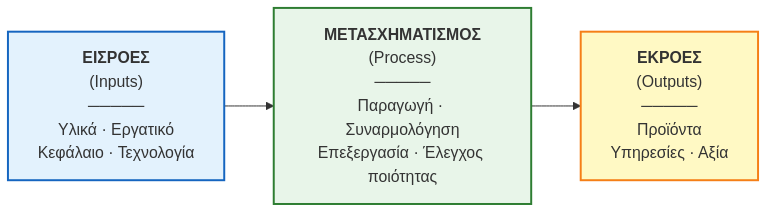

<!-- Κάθε επιχείρηση, ανεξαρτήτως αν παράγει προϊόντα ή προσφέρει υπηρεσίες, λειτουργεί με το μοντέλο Input-Process-Output. Παίρνουμε πρώτες ύλες, ανθρώπινους και τεχνολογικούς πόρους (Εισροές), τους μετασχηματίζουμε προσθέτοντας αξία, και εξάγουμε το τελικό αποτέλεσμα (Εκροές). Η δουλειά μας είναι να κάνουμε αυτόν τον μετασχηματισμό όσο πιο αποδοτικό γίνεται. -->

---

# 1.2 Προϊόντα vs. Υπηρεσίες

| Διάσταση | Προϊόντα (Goods) | Υπηρεσίες (Services) |
|---|---|---|
| **Υλικότητα** | Tangible — χειροπιαστά | Intangible — άυλες |
| **Αποθήκευση** | Αποθηκεύσιμα (inventory) | Μη αποθηκεύσιμες, υψηλή αλλοίωση |
| **Ιδιοκτησία** | Μεταβιβάσιμη | Μη μεταβιβάσιμη |
| **Παραγωγή/Κατανάλωση** | Διαχωρισμένες | Ταυτόχρονες |
| **Τυποποίηση** | Υψηλή | Χαμηλή (εξατομίκευση) |
| **Μέτρηση ποιότητας** | Αντικειμενική | Υποκειμενική |

> Σήμερα πολλές επιχειρήσεις προσφέρουν **"product-service systems"** — μεικτά πακέτα προϊόντων και υπηρεσιών. Για παράδειγμα, σε ένα εστιατόριο, ο πελάτης αγοράζει τόσο το φαγητό (προϊόν) όσο και την εμπειρία εξυπηρέτησης (υπηρεσία). Αυτή η σύγκλιση απαιτεί ολοκληρωμένη διαχείριση λειτουργιών που λαμβάνει υπόψη και τις δύο διαστάσεις.

<!-- Πρέπει να ξεκαθαρίσουμε τις διαφορές μεταξύ προϊόντων και υπηρεσιών. Τα προϊόντα είναι χειροπιαστά και μπορούν να αποθηκευτούν, ενώ οι υπηρεσίες καταναλώνονται τη στιγμή που παράγονται. Βέβαια, στη σύγχρονη οικονομία η γραμμή έχει θολώσει. Σκεφτείτε ένα καλό εστιατόριο: αγοράζετε το φαγητό (ως προϊόν) ή την εξυπηρέτηση (ως υπηρεσία); Η απάντηση είναι και τα δύο. -->

---

# 2. Στρατηγική Λειτουργιών

---

# 2.1 Ευθυγράμμιση με Εταιρική Στρατηγική

**Alignment:** Το τμήμα παραγωγής/λειτουργιών πρέπει να **υπηρετεί** τη γενική στρατηγική:

| Εταιρική Στρατηγική | Στόχος Operations |
|---|---|
| **Στρατηγική Κόστους** (Cost Leadership) | Μείωση κόστους παραγωγής, αποδοτικότητα |
| **Στρατηγική Διαφοροποίησης** (Differentiation) | Ποιότητα, καινοτομία, ευελιξία |
| **Στρατηγική Εστίασης** (Focus) | Εξειδίκευση σε τμήμα αγοράς |

<!-- Η παραγωγή δεν μπορεί να λειτουργεί στο κενό. Αν η εταιρεία έχει στρατηγική χαμηλού κόστους (όπως π.χ. μια budget αεροπορική), τα operations πρέπει να κόβουν κάθε περιττό έξοδο. Αν η στρατηγική είναι η διαφοροποίηση και η υψηλή ποιότητα (όπως η Apple), τότε οι λειτουργίες πρέπει να εστιάζουν στην καινοτομία και την τελειότητα, έστω κι αν αυτό κοστίζει παραπάνω. -->

---

# 2.2 Αλυσίδα Αξίας (Porter's Value Chain)

<!-- _class: xxsmall -->

Ο **Michael Porter (1985)** περιέγραψε την επιχείρηση ως αλυσίδα δραστηριοτήτων που **δημιουργούν αξία** για τον πελάτη:

**Πρωτεύουσες Δραστηριότητες**
1. **Εισερχόμενη Logistics** — Δραστηριότητες που σχετίζονται με την παραλαβή, αποθήκευση, διαχείριση αποθεμάτων και προγραμματισμό παράδοσης πρώτων υλών, εξαρτημάτων και άλλων εισροών από τους προμηθευτές.
2. **Λειτουργίες (Operations)** — Δραστηριότητες μετατροπής των εισροών σε τελικά προϊόντα ή υπηρεσίες, συμπεριλαμβανομένης της παραγωγής, της συναρμολόγησης, της διαχείρισης διαδικασιών και του ποιοτικού ελέγχου.
3. **Εξερχόμενη Logistics** — Δραστηριότητες που αφορούν τη συλλογή, αποθήκευση, διανομή και παράδοση των τελικών προϊόντων ή υπηρεσιών στους πελάτες, συμπεριλαμβανομένης της εκπλήρωσης παραγγελιών και των μεταφορών.
4. **Μάρκετινγκ & Πωλήσεις** — Δραστηριότητες που σχετίζονται με την προώθηση, τιμολόγηση, πώληση και διανομή των προϊόντων ή υπηρεσιών στους πελάτες, καθώς και τη διαχείριση των καναλιών πώλησης.
5. **Υπηρεσίες Μετά την Πώληση** — Δραστηριότητες που παρέχουν υποστήριξη στους πελάτες μετά την πώληση, όπως εγκατάσταση, επισκευές, συντήρηση, εξυπηρέτηση πελατών και διαχείριση εγγυήσεων.

**Υποστηρικτικές Δραστηριότητες**
- **Υποδομή** — Γενική διοίκηση, σχεδιασμός, χρηματοδότηση, λογιστική, νομικές υπηρεσίες και διαχείριση πληροφοριακών συστημάτων (IT) που υποστηρίζουν όλες τις δραστηριότητες.
- **Διαχείριση Ανθρώπινου Δυναμικού (HR)** — Πρόσληψη, εκπαίδευση, ανάπτυξη, αξιολόγηση, αποζημίωση και διαχείριση των σχέσεων με τους εργαζομένους.
- **Τεχνολογική Ανάπτυξη** — Έρευνα και ανάπτυξη (R&D), σχεδιασμός προϊόντων, βελτίωση διαδικασιών και αυτοματισμοί που ενισχύουν την αξία.
- **Προμήθειες** — Δραστηριότητες αγοράς πρώτων υλών, προμηθειών και άλλων εισροών, συμπεριλαμβανομένης της επιλογής προμηθευτών και των διαπραγματεύσεων.

> **Περιθώριο (Margin)** = Αξία που αντιλαμβάνεται ο πελάτης − Συνολικό κόστος δραστηριοτήτων.
> *Πηγή: Porter, M.E. (1985). Competitive Advantage. Free Press.*

<!-- Ο Michael Porter μας έδωσε ίσως το πιο γνωστό εργαλείο για την αποτύπωση αυτού: την Αλυσίδα Αξίας. Μας δείχνει ποιες δραστηριότητες (οι πρωτεύουσες) φτιάχνουν και προωθούν άμεσα το προϊόν, και ποιες (οι υποστηρικτικές) τις βοηθούν από πίσω για να κάνουν τη δουλειά τους. Η διαφορά της αξίας που αντιλαμβάνεται ο πελάτης από το συνολικό μας κόστος είναι το περιθώριο κέρδους μας. -->

---

# 2.3 Value Chain: Παράδειγμα e-food

<!-- _class: casestudy xsmall -->

Πώς μια **Υποστηρικτική** δραστηριότητα επηρεάζει άμεσα μια **Πρωτεύουσα**:

| Δραστηριότητα | Χωρίς Τεχνολογία | Με Τεχνολογία |
|---|---|---|
| Χρόνος παράδοσης | ~50 λεπτά | ~28 λεπτά |
| Ακύρωση παραγγελιών | ~12% | ~3% |
| Κόστος/παράδοση | Υψηλό (αδρανής αναμονή) | Χαμηλό (συνεχής ροή) |

> **Συμπέρασμα:** Η τεχνολογία δεν είναι απλά IT υποδομή — είναι **πηγή ανταγωνιστικού πλεονεκτήματος** όταν βελτιώνει τις πρωτεύουσες δραστηριότητες.

<!-- Ας δούμε ένα πρακτικό παράδειγμα από την καθημερινότητά μας, το e-food. Πώς η τεχνολογική ανάπτυξη, που είναι υποστηρικτική δραστηριότητα, απογείωσε τη διανομή, που είναι πρωτεύουσα; Χωρίς τον αλγόριθμο, ένας διανομέας περιμένει. Με τον αλγόριθμο και τον εντοπισμό, η διαδρομή βελτιστοποιείται, ο χρόνος πέφτει στο μισό και τα λάθη ελαχιστοποιούνται. Εδώ βλέπουμε την τεχνολογία να φέρνει άμεσα ανταγωνιστικό πλεονέκτημα. -->

---

# 2.4 Ανταγωνιστικές Προτεραιότητες

<!-- _class: small -->

Οι λειτουργίες ανταγωνίζονται βάσει **4 διαστάσεων**:

| Προτεραιότητα | Ερώτηση | Παράδειγμα |
|---|---|---|
| **Κόστος** | Μπορούμε να παράγουμε φθηνότερα; | IKEA, Ryanair |
| **Ποιότητα** | Το προϊόν ανταποκρίνεται στις προσδοκίες; | Toyota, Apple |
| **Χρόνος** (Speed/Delivery) | Πόσο γρήγορα παραδίδουμε; | Amazon Prime, Domino's |
| **Ευελιξία** (Flexibility) | Μπορούμε να προσαρμοστούμε στη ζήτηση; | Zara (Fast Fashion) |

> Δεν μπορείς να τα κάνεις όλα τέλεια — **trade-offs** είναι αναπόφευκτα *(Hayes & Wheelwright, 1984)*.

<!-- Στον πραγματικό κόσμο, δεν μπορούμε να είμαστε τέλειοι σε όλα. Μια εταιρεία πρέπει να διαλέξει πού θα χτυπήσει τον ανταγωνισμό: Στο Κόστος, στην Ποιότητα, στο Χρόνο ή στην Ευελιξία. Αν θες να είσαι το πιο φθηνό προϊόν, ίσως χρειαστεί να θυσιάσεις την εξατομίκευση. Αν θες την απόλυτη ευελιξία, όπως η Zara στη γρήγορη μόδα, χρειάζεσαι εντελώς διαφορετική οργάνωση. Πρέπει να κάνουμε συμβιβασμούς (trade-offs). -->

---

# 3. Σχεδιασμός Παραγωγής

---

# 3.1 Τύποι Διαδικασιών Παραγωγής

<!-- _class: xsmall -->

| Τύπος | Χαρακτηριστικά | Παράδειγμα |
|---|---|---|
| **Έργο (Project)** | Μοναδικό, μη επαναλαμβανόμενο, με σαφή αρχή και τέλος, υψηλή πολυπλοκότητα και συνήθως μεγάλης διάρκειας. Απαιτεί εξειδικευμένο συντονισμό πόρων. | Κατασκευή γέφυρας, παραγωγή κινηματογραφικής ταινίας, ανάπτυξη νέου λογισμικού. |
| **Κατά Παραγγελία (Job Shop)** | Παραγωγή μικρών ποσοτήτων (ή και ενός μόνο τεμαχίου) εξατομικευμένων προϊόντων. Υψηλή ευελιξία, αλλά χαμηλή τυποποίηση και υψηλό κόστος ανά μονάδα. | Συνεργείο επισκευής αυτοκινήτων, εργαστήριο κοσμημάτων κατά παραγγελία, τυπογραφείο για ειδικές εκτυπώσεις. |
| **Κατά Παρτίδες (Batch)** | Παραγωγή προϊόντων σε συγκεκριμένες παρτίδες (ομάδες), όπου κάθε παρτίδα περνά από τα ίδια στάδια παραραγωγής. Προσφέρει ισορροπία μεταξύ ποικιλίας και όγκου. | Αρτοποιία (π.χ. παραγωγή διαφορετικών τύπων ψωμιού σε παρτίδες), παραγωγή φαρμακευτικών σκευασμάτων, βιοτεχνία επίπλων. |
| **Μαζική / Γραμμή Συναρμολόγησης** | Παραγωγή μεγάλων όγκων τυποποιημένων προϊόντων, με διαδοχικά στάδια σε μια γραμμή συναρμολόγησης. Χαμηλό κόστος ανά μονάδα, αλλά περιορισμένη ευελιξία. | Αυτοκινητοβιομηχανία (π.χ. παραγωγή ενός συγκεκριμένου μοντέλου), παραγωγή οικιακών συσκευών, εμφιάλωση αναψυκτικών. |
| **Συνεχής Ροή (Continuous Flow)** | Αδιάλειπτη, 24/7 παραγωγή ενός ενιαίου, τυποποιημένου προϊόντος, με πλήρη αυτοματοποίηση και ελάχιστη ανθρώπινη παρέμβαση. Υψηλό αρχικό κόστος, αλλά εξαιρετικά χαμηλό μεταβλητό κόστος. | Διυλιστήριο πετρελαίου, χαλυβουργία, παραγωγή χημικών, ηλεκτροπαραγωγή. |

> Ο κατάλληλος τύπος εξαρτάται από: **ζήτηση, ποικιλία προϊόντων, επίπεδο αυτοματισμού**.

<!-- Υπάρχουν 5 βασικοί τρόποι να οργανώσεις την παραγωγή σου. Ξεκινάμε από το απόλυτα μοναδικό "Project" (όπως η κατασκευή μιας γέφυρας ή μιας ταινίας) και φτάνουμε στο άλλο άκρο, τη "Συνεχή Ροή", όπου το εργοστάσιο βγάζει ασταμάτητα, 24/7 το ίδιο πράγμα (όπως ένα διυλιστήριο). Στη μέση βρίσκουμε λύσεις όπως το Batch και το Job Shop, τα οποία καλύπτουν ενδιάμεσες ανάγκες σε όγκο και ποικιλία. -->

---

# 3.2 Product-Process Matrix

<!-- _class: xxsmall -->

Οι **Hayes & Wheelwright (1979)** συνδέουν τον **τύπο προϊόντος** με τον **τύπο διαδικασίας**:

| **Τύπος Προϊόντος (Όγκος/Ποικιλία)** | **Project** | **Job Shop** | **Batch** | **Assembly Line** | **Continuous Flow** |
|---|:---:|:---:|:---:|:---:|:---:|
| **Χαμηλός Όγκος / Υψηλή Ποικιλία** | ✅ | ✅ | ⚠️ | ❌ | ❌ |
| **Μέτριος Όγκος / Μέτρια Ποικιλία** | ⚠️ | ⚠️ | ✅ | ⚠️ | ⚠️ |
| **Υψηλός Όγκος / Χαμηλή Ποικιλία** | ❌ | ❌ | ⚠️ | ✅ | ✅ |

**Η «διαγώνιος» (✅):** Αντιπροσωπεύει την ιδανική ευθυγράμμιση. Οι εταιρείες που βρίσκονται πάνω σε αυτή τη διαγώνιο έχουν **ευθυγραμμίσει σωστά** τις λειτουργίες τους, επιτυγχάνοντας βέλτιστη αποδοτικότητα.
*   **Εκτός διαγωνίου (⚠️/❌):** Η επιλογή λάθος διαδικασίας για το λάθος προϊόν οδηγεί σε αναποτελεσματικότητα και απώλεια ανταγωνιστικότητας.

> **⚠️ Ερώτηση για σκέψη:** Τι θα συνέβαινε αν προσπαθούσαμε να φτιάξουμε ένα **χειροποίητο, custom κοστούμι** (που απαιτεί διαδικασία τύπου Project/Job Shop) πάνω σε μια **γραμμή μαζικής παραγωγής ενδυμάτων** (που είναι διαδικασία τύπου Assembly Line);
>
> — Το κοστούμι, ως μοναδικό και εξατομικευμένο προϊόν, απαιτεί ατομικές μετρήσεις, πολλαπλές πρόβες και εξειδικευμένη ραπτική. Μια γραμμή μαζικής παραγωγής είναι σχεδιασμένη για τυποποιημένα μεγέθη, υψηλή ταχύτητα και ελάχιστη προσαρμογή. Το αποτέλεσμα θα ήταν: **τεράστιο κόστος, κακή ποιότητα και ένα προϊόν που δεν θα ανταποκρινόταν στις απαιτήσεις του πελάτη**.
>
> Αυτό ακριβώς είναι το «εκτός διαγωνίου» — η επιλογή **λάθος διεργασίας για το λάθος προϊόν**, οδηγώντας σε αναποτελεσματικότητα και απώλεια ανταγωνιστικότητας.

> *Πηγή: Hayes, R. & Wheelwright, S. (1979). "Link Manufacturing Process and Product Life Cycles". HBR.*

<!-- Αυτός ο πίνακας (Product-Process Matrix) είναι πολύ κρίσιμος. Μας δείχνει ότι ο τύπος της παραγωγικής διαδικασίας ΠΡΕΠΕΙ να ταιριάζει με τον όγκο και την ποικιλία του προϊόντος. Αν βρίσκεσαι πάνω στη 'διαγώνιο', έχεις ευθυγραμμίσει σωστά τη στρατηγική σου. Αν φύγεις από αυτή, όπως στο παράδειγμα με το χειροποίητο κοστούμι στη γραμμή μαζικής παραγωγής, πας για καταστροφή: το κόστος θα εκτοξευθεί και η ευελιξία θα χαθεί. -->

---

# 3.3 Mass Customization — Η Εξαίρεση του Κανόνα

<!-- _class: casestudy xsmall -->

**Mass Customization** = η ικανότητα παραγωγής **εξατομικευμένων** προϊόντων σε **κόστος μαζικής παραγωγής**. Η Toyota, μέσω του **Toyota Production System (TPS)**, συνδύασε **Assembly Line** (χαμηλό κόστος) με **Ευελιξία** (ποικιλία μοντέλων) χρησιμοποιώντας δύο βασικές τεχνικές:

- **SMED (Single-Minute Exchange of Die):** Μια μέθοδος για τη δραστική μείωση του χρόνου που απαιτείται για την αλλαγή μιας γραμμής παραγωγής από ένα προϊόν σε άλλο (π.χ. από ένα μοντέλο αυτοκινήτου σε άλλο). Στόχος είναι η αλλαγή να γίνεται σε μονοψήφιο αριθμό λεπτών. Αυτό επιτρέπει την παραγωγή σε **μικρότερες παρτίδες**, αυξάνοντας την ευελιξία και μειώνοντας τα αποθέματα.
- **Kanban:** Ένα οπτικό σύστημα σηματοδότησης που λειτουργεί ως "pull system" (σύστημα έλξης). Αντί η παραγωγή να "σπρώχνει" προϊόντα στην αποθήκη, η κατανάλωση ενός προϊόντος στο επόμενο στάδιο "τραβάει" την παραγωγή του προηγούμενου. Αυτό αποτρέπει την **υπερπαραγωγή** (τη χειρότερη από τις 7 σπατάλες του Lean).

> Αυτές οι τεχνικές επέτρεψαν στη Toyota να παράγει διαφορετικά μοντέλα στην **ίδια γραμμή** — χωρίς να θυσιάσει ούτε κόστος ούτε ευελιξία.

| Εταιρεία | Πώς το πετυχαίνει |
|---|---|
| **Toyota** | TPS, SMED — διαφορετικά μοντέλα στην ίδια γραμμή |
| **Dell** | Build-to-order: ο πελάτης διαμορφώνει το PC online |
| **Zara** | Μικρές παρτίδες + γρήγορος κύκλος σχεδιασμού (2 εβδομάδες) |

<!-- Υπάρχει βέβαια και μια σύγχρονη εξαίρεση στον κανόνα της διαγωνίου: το Mass Customization. Η Toyota, και αργότερα εταιρείες όπως η Dell και η Zara, κατάφεραν το ακατόρθωτο: προσφέρουν μεγάλη ποικιλία, αλλά κρατούν το κόστος χαμηλά. Πώς; Το SMED είναι σαν το pit stop της Formula 1: αλλάζεις τα 'λάστιχα' (καλούπια) της γραμμής παραγωγής σε δευτερόλεπτα, όχι σε ώρες. Αυτό σου επιτρέπει να φτιάχνεις μικρές παρτίδες από διαφορετικά μοντέλα χωρίς να χάνεις χρόνο. Το Kanban είναι σαν το ράφι του σούπερ μάρκετ: παράγεις ένα νέο προϊόν μόνο όταν ο 'πελάτης' (το επόμενο στάδιο) πάρει το προηγούμενο. Έτσι, αποφεύγεις την υπερπαραγωγή και τα περιττά αποθέματα. -->

---

# 3.4 Χωροταξικός Σχεδιασμός (Facility Layout)

<!-- _class: small -->

Ο φυσικός σχεδιασμός του χώρου εργασίας ανάλογα με τον τύπο παραγωγής:

| Layout | Κατάλληλο για | Χαρακτηριστικό |
|---|---|---|
| **Process Layout** | Job Shop | Εξοπλισμός ομαδοποιημένος ανά τύπο λειτουργίας |
| **Product Layout** | Assembly Line | Εξοπλισμός στη σειρά κατά ροή παραγωγής |
| **Fixed Position Layout** | Projects | Το προϊόν μένει σταθερό, πόροι έρχονται σε αυτό |
| **Cellular Layout** | Batch | Ομάδες μηχανών για "οικογένειες" προϊόντων |

<!-- Ο τύπος παραγωγής επηρεάζει άμεσα και το πώς στήνουμε τον φυσικό χώρο (Facility Layout). Αν έχουμε γραμμή συναρμολόγησης, οι μηχανές μπαίνουν στη σειρά (Product Layout). Αν φτιάχνουμε ένα αεροπλάνο (Project), το προϊόν μένει προφανώς ακίνητο και οι εργάτες πηγαίνουν γύρω του (Fixed Position). Στα μηχανουργεία (Job Shop) ομαδοποιούμε τις μηχανές ανά λειτουργία. Ακόμα και σε εταιρείες λογισμικού, ο σχεδιασμός του γραφείου επηρεάζει την παραγωγικότητα και τη συνεργασία. -->

---

# 4. Διαχείριση Δυναμικότητας (Capacity Planning)

<!-- _class: xsmall -->

**Ορισμός:** Ο καθορισμός της παραγωγικής ικανότητας που χρειάζεται η επιχείρηση για να ικανοποιήσει τη ζήτηση.

|Ορισμός:** Ο καθορισμός της παραγωγικής ικανότητας που χρειάζεται η επιχείρηση για να ικανοποιήσει τη ζήτηση. Περιλαμβάνει την ευθυγράμμιση των διαθέσιμων πόρων (ανθρώπινο δυναμικό, εξοπλισμός, υποδομές) με τις προβλεπόμενες ανάγκες, ώστε να διασφαλιστεί η ομαλή λειτουργία και η ικανοποίηση των πελατών.

---

## 4.1 Τύποι Διαχείρισης Δυναμικότητας

| Τύπος | Περιγραφή |
|---|---|
| **Δυναμικότητα Πόρων (Resource Capacity Planning)** | Εστιάζει στο ανθρώπινο δυναμικό, τις δεξιότητες και τη διαθεσιμότητά του. |
| **Δυναμικότητα Έργων (Project Capacity Planning)** | Κατανομή πόρων σε συγκεκριμένα έργα, διασφαλίζοντας ότι υπάρχουν επαρκείς πόροι για την ολοκλήρωσή τους. |
| **Δυναμικότητα Προϊόντων (Product Capacity Planning)** | Διασφάλιση επαρκούς παραγωγικής ικανότητας για την κατασκευή προϊόντων. |
| **Δυναμικότητα Υπηρεσιών (Service Capacity Planning)** | Εξασφάλιση της ικανότητας παροχής υπηρεσιών, π.χ. αριθμός εξυπηρετητών σε ένα τηλεφωνικό κέντρο. |

---

## 4.2 Τεχνικές & Εργαλεία

| Τεχνική | Περιγραφή |
|---|---|
| **Ανάλυση "Τι θα συμβεί αν..." (What-if Analysis)** | Προσομοίωση διαφορετικών σεναρίων (π.χ. αύξηση ζήτησης, αλλαγή διαθεσιμότητας πόρων) για την κατανόηση των πιθανών επιπτώσεων στη δυναμικότητα και την απόδοση. |
| **Σχεδιασμός Σεναρίων (Scenario Planning)** | Ευρύτερη προσέγγιση που εξετάζει πολλαπλές μεταβλητές και τις αλληλεπιδράσεις τους, για την προετοιμασία για διάφορα πιθανά μέλλοντα. |
| **Προσομοίωση (Simulation)** | Χρήση μοντέλων για την αναπαράσταση πραγματικών διεργασιών και τη δοκιμή αλλαγών στη δυναμικότητα χωρίς διακοπή της λειτουργίας. |
| **Εξομάλυνση Πόρων (Resource Leveling)** | Προσαρμογή χρονοδιαγραμμάτων έργων για τη βελτιστοποίηση της κατανομής πόρων και την αποφυγή υπερφόρτωσης. |
| **Μέθοδος Κρίσιμης Διαδρομής (Critical Path Method - CPM)** | Εντοπισμός της μακρύτερης ακολουθίας εργασιών σε ένα έργο για τον προσδιορισμό του ελάχιστου χρόνου ολοκλήρωσης, επηρεάζοντας τις ανάγκες σε πόρους. |

<!-- To Capacity Planning είναι ίσως η πιο ακριβή απόφαση: 'πόσο μεγάλο εργοστάσιο/αποθήκη/στόλο χρειαζόμαστε;'. Έχουμε 3 στρατηγικές: Lead (χτίζω χωρητικότητα νωρίτερα, με ρίσκο να μη χρειαστεί), Lag (περιμένω να σιγουρευτώ για τη ζήτηση, με ρίσκο να χάσω πωλήσεις εντωμεταξύ) και Match (προσπαθώ να προσθέτω σιγά-σιγά χωρητικότητα). Κάθε μία έχει τα υπέρ και τα κατά της. -->

---

## 4.3 Στρατηγικές προσαρμογής:

| Στρατηγική | Λογική | Παράδειγμα | Κίνδυνος |
|---|---|---|---|
| **Lead** (Επίθεση) | Αύξηση *πριν* τη ζήτηση | TSMC: νέο εργοστάσιο chips για αναμενόμενη ζήτηση AI | Υποχρησιμοποίηση, δεσμευμένο κεφάλαιο |
| **Lag** (Άμυνα) | Αύξηση *μετά* επιβεβαίωση ζήτησης | Αγορά νέων φορτηγών μόνο αφού ξεμείνεις | Υπερφόρτωση, μη εξυπηρετούμενη ζήτηση |
| **Match** (Ισορροπία) | Σταδιακή προσαρμογή παράλληλα | Προσλήψεις μήνα-με-μήνα ανάλογα ζήτησης | Διαρκής παρακολούθηση και προσαρμογή |

---

# 5. Πρόβλεψη Ζήτησης (Demand Forecasting)

<!-- _class: xsmall -->

**Γιατί χρειάζεται:** Η πρόβλεψη τροφοδοτεί το capacity planning, τα αποθέματα και τον προγραμματισμό παραγωγής.

**Ποιοτικές Μέθοδοι**
- **Delphi:** διαδοχικές εκτιμήσεις εμπειρογνωμόνων
- **Έρευνα Αγοράς:** ερωτηματολόγια, focus groups
- **Κρίση Στελεχών:** εσωτερική συλλογική εκτίμηση

*Χρήσιμες όταν:* δεν υπάρχουν ιστορικά δεδομένα (νέο προϊόν, νέα αγορά)

**Ποσοτικές Μέθοδοι**
- **Κινητός Μέσος Όρος (Moving Average):** εξομάλυνση βραχυπρόθεσμων διακυμάνσεων
- **Εκθετική Εξομάλυνση (Exponential Smoothing):** βάρος στα πρόσφατα δεδομένα
- **Παλινδρόμηση (Regression):** σχέση ζήτησης με εξωτερικές μεταβλητές
- **ARIMA / ML:** χρονοσειρές, machine learning

> **Κανόνας:** Καμία πρόβλεψη δεν είναι τέλεια — σχεδίασε πάντα για **εύρος** (range) και μέτρα απόκλισης (MAD, MAPE).
> *Πηγή: Chase, Aquilano & Jacobs (2006). Operations Management. McGraw-Hill.*

<!-- Για να ξέρουμε τι δυναμικότητα χρειαζόμαστε, πρέπει να προβλέψουμε το μέλλον. Χρησιμοποιούμε ποιοτικές μεθόδους, όπως γνώμες ειδικών, όταν βγάζουμε ένα εντελώς νέο προϊόν. Χρησιμοποιούμε ποσοτικές (μαθηματικά) όταν έχουμε ιστορικά δεδομένα. Ο χρυσός κανόνας όμως είναι ένας: καμία πρόβλεψη δεν θα βγει 100% ακριβής. Γι' αυτό ετοιμαζόμαστε πάντα για ένα εύρος αποκλίσεων. -->

---

# 6. Διαχείριση Εφοδιαστικής Αλυσίδας (SCM)

---

# 6.1 Διαχείριση Εφοδιαστικής Αλυσίδας (SCM)

<!-- _class: xxsmall -->

**Ορισμός:** Η συστηματική διαχείριση του δικτύου οργανισμών, ανθρώπων, τεχνολογίας, δραστηριοτήτων και πόρων που εμπλέκονται στη μετατροπή πρώτων υλών σε τελικά προϊόντα ή υπηρεσίες, καθώς και στη διανομή τους στον τελικό καταναλωτή. Περιλαμβάνει τη ροή αγαθών, πληροφοριών και κεφαλαίων *(Chopra & Meindl, 2007)*.

**5 Drivers of Supply Chain Performance (Chopra):**

| Driver | Περιγραφή |
|---|---|
| **Αποθέματα** | Διαχείριση των πρώτων υλών, ημιτελών και τελικών προϊόντων. Αφορά το πότε, πόσο και πού διατηρούνται τα αποθέματα για να εξισορροπηθεί το κόστος διατήρησης με την εξυπηρέτηση της ζήτησης. |
| **Μεταφορά** | Η κίνηση των προϊόντων από το ένα σημείο της αλυσίδας στο άλλο. Περιλαμβάνει την επιλογή μέσων (οδικές, θαλάσσιες, αεροπορικές), δρομολόγηση και βελτιστοποίηση κόστους/χρόνου. |
| **Εγκαταστάσεις** | Οι φυσικοί χώροι όπου παράγονται, αποθηκεύονται ή διανέμονται τα προϊόντα (π.χ. εργοστάσια, αποθήκες, κέντρα διανομής). Αφορά την τοποθεσία, το μέγεθος και τη χωρητικότητά τους. |
| **Πληροφόρηση** | Η ροή δεδομένων και πληροφοριών σε όλη την αλυσίδα. Περιλαμβάνει προβλέψεις ζήτησης, παρακολούθηση αποθεμάτων, κατάσταση παραγγελιών και ανταλλαγή δεδομένων με προμηθευτές/πελάτες. |
| **Τιμολόγηση & Sourcing** | Οι αποφάσεις σχετικά με την προμήθεια υλικών (αγορά ή παραγωγή εσωτερικά) και την επιλογή προμηθευτών. Περιλαμβάνει επίσης τη δομή τιμολόγησης των προϊόντων και υπηρεσιών. |

<!-- Αφήνοντας τον στενό χώρο του εργοστασίου μας, πάμε στο Supply Chain Management, δηλαδή στη Διαχείριση Εφοδιαστικής Αλυσίδας. Εδώ κοιτάμε όλο το δίκτυο: από τη φάρμα που βγάζει την πρώτη ύλη, μέχρι το κατάστημα που πουλάει το τελικό προϊόν. Οι 5 οδηγοί (Drivers) του Chopra, από τα αποθέματα μέχρι την πληροφόρηση, καθορίζουν αν αυτό το δίκτυο θα είναι ευέλικτο και αποδοτικό. -->

---

# 6.2 Φαινόμενο Bullwhip

<!-- _class: casestudy xxsmall -->

**Ορισμός:** Όπως ένα μικρό τίναγμα του καρπού δημιουργεί ένα τεράστιο κύμα στο άκρο του μαστιγίου, έτσι και μια μικρή αλλαγή στη ζήτηση του καταναλωτή **ενισχύεται** σε τεράστιες διακυμάνσεις παραγγελιών καθώς ανεβαίνουμε στην εφοδιαστική αλυσίδα (λιανέμπορος → χονδρέμπορος → παραγωγός). *(Lee et al., 1997)*.

**Beer Distribution Game — Αριθμητικό Σενάριο:**

| Επίπεδο | Ζήτηση που βλέπει | Παραγγελία (με buffer) | Απόκλιση |
|---|---|---|---|
| Καταναλωτής | — | 100 κιβώτια | 0% |
| Λιανέμπορος | 100 | 110 (+10%) | +10% |
| Χονδρέμπορος | 110 | 132 (+20%) | +32% |
| Διανομέας | 132 | 172 (+30%) | +72% |
| Εργοστάσιο | 172 | **Παράγει 240** | **+140%** |

> **Αποτέλεσμα:** Μια αρχική αύξηση ζήτησης 10% από τον καταναλωτή, μεταφράστηκε σε πανικό και 140% υπερπαραγωγή στο εργοστάσιο, γεμίζοντας τις αποθήκες με στοκ που είναι αδύνατο να πουληθεί.

**Αιτίες:**
- **Έλλειψη ορατότητας & Πληροφοριακά «Silos»:** Κάθε κρίκος βλέπει μόνο την παραγγελία του αμέσως επόμενου, όχι την πραγματική τελική ζήτηση.
- **Παραγγελίες σε παρτίδες (Batching):** Παραγγελίες σε μεγάλες ποσότητες για μείωση κόστους μεταφοράς, δημιουργώντας τεχνητές αιχμές.
- **Παιχνίδια τιμών & Κερδοσκοπία:** Αγορά μεγαλύτερων ποσοτήτων λόγω προσφορών ή αναμενόμενων αυξήσεων τιμών.
- **Αποθέματα ασφαλείας (Safety Stock):** Κάθε κρίκος προσθέτει το δικό του «μαξιλαράκι» για να προστατευτεί από καθυστερήσεις.

**Αντιμετώπιση:**
- **Διαμοιρασμός δεδομένων πώλησης (POS data):** Ο παραγωγός βλέπει την πραγματική ζήτηση σε πραγματικό χρόνο.
- **Συνεργατικός σχεδιασμός (CPFR):** Κοινές προβλέψεις και σχεδιασμός μεταξύ των εταίρων.
- **Διαχείριση αποθεμάτων από τον προμηθευτή (VMI):** Ο προμηθευτής αναλαμβάνει την ευθύνη αναπλήρωσης.

> *Πηγή: Lee et al. (1997), Sloan Management Review · Sterman (1989), Management Science.*

<!-- Το πιο διάσημο, και επικίνδυνο, πρόβλημα στην Εφοδιαστική Αλυσίδα είναι το Bullwhip Effect. Φανταστείτε ένα μαστίγιο: ένα μικρό, ανεπαίσθητο τίναγμα του καρπού σας, δημιουργεί ένα τεράστιο, βίαιο κύμα στην άκρη του. Ακριβώς το ίδιο συμβαίνει και εδώ.
Δείτε το παράδειγμα του Beer Game. Ο καταναλωτής ζήτησε 100 κιβώτια. Ο λιανέμπορος, για να έχει ένα απόθεμα ασφαλείας, παραγγέλνει 110. Ο χονδρέμπορος βλέπει μια παραγγελία για 110 και, φοβούμενος αύξηση, παραγγέλνει 132. Αυτή η νευρικότητα μεταδίδεται και ενισχύεται σε κάθε βήμα, με αποτέλεσμα το εργοστάσιο να παράγει 240 κιβώτια — 140% πάνω από την πραγματική ζήτηση!
Η ρίζα του κακού είναι μία: η έλλειψη ορατότητας. Κανείς δεν βλέπει την πραγματική ζήτηση, παρά μόνο την παραγγελία του αμέσως προηγούμενου. Η λύση; Διαφάνεια. Να μοιραζόμαστε όλοι τα ίδια δεδομένα, από το ταμείο του καταστήματος μέχρι τη γραμμή παραγωγής. -->

---

# 7. Προγραμματισμός & Διαχείριση Αποθεμάτων

---

# 7.1 MRP & ERP

<!-- _class: xsmall -->

**MRP (Material Requirements Planning)**

Ένα σύστημα **MRP** υπολογίζει *πότε* και *πόσα* υλικά και εξαρτήματα απαιτούνται για την παραγωγή ενός προϊόντος, διασφαλίζοντας τη διαθεσιμότητα και ελαχιστοποιώντας τα αποθέματα. Βασίζεται σε:
- **MPS (Master Production Schedule):** Το κύριο πρόγραμμα παραγωγής, δηλαδή τι τελικά προϊόντα θα παραχθούν και πότε.
- **BOM (Bill of Materials):** Η «συνταγή» του προϊόντος, δηλαδή ποια και πόσα υλικά/εξαρτήματα χρειάζεται κάθε προϊόν.
- **Inventory Records:** Τα τρέχοντα αποθέματα πρώτων υλών και ημιτελών προϊόντων.

Η εξέλιξη του MRP οδήγησε στο MRP II (που ενσωμάτωσε και τον προγραμματισμό δυναμικότητας), και τελικά στα **ERP (Enterprise Resource Planning)** συστήματα.

**ERP — Enterprise Resource Planning**

| Module | Λειτουργία |
|---|---|
| **Production** | Διαχείριση παραγωγής, MRP, προγραμματισμός, έλεγχος ποιότητας. |
| **Finance** | Λογιστική, διαχείριση ταμείου, προϋπολογισμός, αναφορές. |
| **HR** | Μισθοδομία, προσλήψεις, εκπαίδευση, διαχείριση επιδόσεων. |
| **Sales (CRM)** | Διαχείριση παραγγελιών, πελατών, πωλήσεων, μάρκετινγκ. |
| **Procurement** | Διαχείριση προμηθειών, αποθεμάτων, σχέσεων με προμηθευτές. |

**Συστήματα:** SAP, Oracle, MS Dynamics

> *Πηγή: Vollmann et al. (2005). Manufacturing Planning and Control Systems.*

<!-- Ας μιλήσουμε για τα πληροφοριακά συστήματα που οργανώνουν όλη αυτή την πολυπλοκότητα. Το MRP, ή Material Requirements Planning, ήταν η πρώτη επανάσταση. Σκεφτείτε το σαν μια έξυπνη λίστα για ψώνια: του λες 'θέλω να φτιάξω 100 ποδήλατα' (αυτό είναι το Master Production Schedule), του δίνεις τη 'συνταγή' για κάθε ποδήλατο (το Bill of Materials), και αυτό ελέγχει τι έχεις ήδη στην αποθήκη και σου λέει ακριβώς τι και πότε να παραγγείλεις.

Αυτό όμως έλυνε μόνο το πρόβλημα των υλικών. Τι γίνεται με τα οικονομικά, τις πωλήσεις, το προσωπικό; Έτσι, το MRP εξελίχθηκε στο ERP, το Enterprise Resource Planning. Το ERP είναι ο κεντρικός 'εγκέφαλος' ολόκληρης της επιχείρησης. Δεν κοιτάει μόνο την παραγωγή, αλλά ενσωματώνει τα πάντα: από το λογιστήριο και το HR, μέχρι τις πωλήσεις και τις προμήθειες, σε μία ενιαία βάση δεδομένων. Συστήματα όπως το SAP ή το Oracle είναι τα 'λειτουργικά συστήματα' των σύγχρονων επιχειρήσεων. -->

---

# 7.2 MRP: Πώς Λειτουργεί στην Πράξη

<!-- _class: xsmall -->

**Σενάριο:** Εργοστάσιο ποδηλάτων θέλει να παράγει **100 ποδήλατα** την επόμενη εβδομάδα.

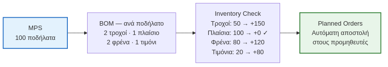

**Η Λογική του Υπολογισμού:**
1.  **Ακαθάριστες Απαιτήσεις (Gross Requirements):** Από το MPS και το BOM, το σύστημα υπολογίζει ότι για 100 ποδήλατα χρειάζονται 100 σκελετοί και 200 ρόδες.
2.  **Διαθέσιμο Απόθεμα (On-Hand Inventory):** Ελέγχει τα αρχεία αποθήκης και βρίσκει 30 σκελετούς και 120 ρόδες.
3.  **Καθαρές Απαιτήσεις (Net Requirements):** Υπολογίζει τη διαφορά: $100 - 30 = 70$ σκελετοί και $200 - 120 = 80$ ρόδες.
4.  **Εντολές Αγοράς (Purchase Orders):** Δημιουργεί αυτόματα παραγγελίες για ακριβώς 70 σκελετούς και 80 ρόδες.

> Το MRP εξαλείφει το **«μαντεμένο» απόθεμα** — παραγγέλνει ακριβώς ό,τι λείπει, τη στιγμή που χρειάζεται (time-phased requirements).

<!-- Ας δούμε πώς δουλεύει το MRP στην πράξη, βήμα-βήμα.
Βήμα 1: Το σύστημα διαβάζει το πλάνο παραγωγής (MPS) και τη 'συνταγή' (BOM) και λέει: 'Για 100 ποδήλατα, χρειαζόμαστε 100 σκελετούς και 200 ρόδες'. Αυτές είναι οι ακαθάριστες απαιτήσεις.
Βήμα 2: Μετά, κοιτάει την αποθήκη. Βρίσκει 30 σκελετούς και 120 ρόδες.
Βήμα 3: Κάνει την αφαίρεση. Μας λείπουν 70 σκελετοί και 80 ρόδες. Αυτές είναι οι καθαρές απαιτήσεις.
Βήμα 4: Το σύστημα δημιουργεί αυτόματα εντολές αγοράς για ακριβώς αυτές τις ποσότητες.
Το αποτέλεσμα; Τέλος η μαντεψιά. Παραγγέλνουμε ακριβώς ό,τι χρειαζόμαστε, ακριβώς τη στιγμή που το χρειαζόμαστε. -->

---

# 7.3 Διαχείριση Αποθεμάτων (Inventory Management)

<!-- _class: xxsmall -->

**Γιατί κρατάμε αποθέματα;**
- Ασφάλεια έναντι αβεβαιότητας ζήτησης/προμήθειας
- Εκμετάλλευση οικονομιών κλίμακας (bulk orders)
- Κάλυψη εποχικής ζήτησης

**Οικονομικό Μέγεθος Παραγγελίας (EOQ)**

**⚠️ Πριν τον τύπο — η λογική:**
> Υπάρχουν δύο αντίθετες δυνάμεις κόστους:
> 1.  **Κόστος Παραγγελίας (Ordering Cost):** Κόστος μεταφορικών, επεξεργασίας τιμολογίων, εκτελωνισμού. Μειώνεται όσο αυξάνεται η ποσότητα παραγγελίας (λιγότερες παραγγελίες).
> 2.  **Κόστος Διατήρησης (Holding Cost):** Κόστος αποθήκης (ενοίκιο), ασφάλιστρα, φθορές, κόστος δεσμευμένου κεφαλαίου. Αυξάνεται όσο αυξάνεται η ποσότητα.
>
> Το EOQ βρίσκει το **"γλυκό σημείο"** — την ποσότητα όπου το συνολικό κόστος (άθροισμα των δύο) ελαχιστοποιείται.

$$EOQ = \sqrt{\frac{2 \cdot D \cdot S}{H}}$$

Όπου: **D** = ετήσια ζήτηση · **S** = κόστος/παραγγελία · **H** = κόστος διατήρησης/μονάδα/έτος

**Just-In-Time (JIT) / Lean Production**
- Ελαχιστοποίηση αποθεμάτων — παραγγελία *ακριβώς* όταν χρειάζεται
- Απαιτεί αξιόπιστους προμηθευτές και σταθερή ζήτηση

<!-- Γιατί μια εταιρεία κρατάει αποθέματα, αφού κοστίζουν; Για ασφάλεια, για να καλύψει την εποχική ζήτηση, ή για να πετύχει καλύτερες τιμές αγοράζοντας μεγάλες ποσότητες.
Το μεγάλο ερώτημα είναι: ποια είναι η ιδανική ποσότητα παραγγελίας; Εδώ μπαίνει το EOQ. Φανταστείτε το σαν μια ζυγαριά. Από τη μία πλευρά, έχουμε το Κόστος Παραγγελίας: κάθε φορά που παραγγέλνουμε, πληρώνουμε μεταφορικά, εκτελωνισμό, κλπ. Αν παραγγέλνουμε συχνά μικρές ποσότητες, αυτό το κόστος ανεβαίνει.
Από την άλλη, έχουμε το Κόστος Διατήρησης: αν παραγγείλουμε μια τεράστια ποσότητα, χρειαζόμαστε μεγάλη αποθήκη, πληρώνουμε ενοίκιο, ασφάλεια, και δεσμεύουμε κεφάλαιο που θα μπορούσε να επενδυθεί αλλού.
Το EOQ είναι ο μαθηματικός τύπος που βρίσκει το 'γλυκό σημείο', την ποσότητα που ελαχιστοποιεί το συνολικό κόστος. -->

---

# 7.4 EOQ — Ανάλυση Μεταβλητών

<!-- _class: xsmall -->

| Μεταβλητή | Τι μετρά | Παράδειγμα | Επίδραση στο EOQ |
|---|---|---|---|
| **D** — Ετήσια Ζήτηση | Συνολικά τεμάχια/έτος | 10.000 μπουκάλια/έτος | ↑D → ↑EOQ (Όσο αυξάνεται η ζήτηση, τόσο μεγαλύτερες παραγγελίες κάνουμε) |
| **S** — Κόστος Παραγγελίας | Κόστος/παραγγελία: μεταφορικά, εκτελωνισμός, διοικητικός χρόνος | 50€/παραγγελία | ↑S → ↑EOQ (Αν κάθε παραγγελία κοστίζει πολύ, κάνουμε λιγότερες και μεγαλύτερες) |
| **H** — Κόστος Διατήρησης | Κόστος αποθήκευσης/μονάδα/έτος: ενοίκιο, ασφάλιστρα, φθορές | 2€/μονάδα/έτος | ↑H → ↓EOQ (Αν η αποθήκευση κοστίζει πολύ, κάνουμε περισσότερες και μικρότερες) |

> **Παράδειγμα:** D=10.000, S=50€, H=2€ → $EOQ = \sqrt{\frac{2 \times 10.000 \times 50}{2}} = \sqrt{500.000} \approx 707$ μονάδες/παραγγελία

<!-- Ας δούμε πώς οι μεταβλητές του τύπου επηρεάζουν την απόφασή μας.
Αν το κόστος παραγγελίας (S) είναι υψηλό — π.χ. φέρνουμε κοντέινερ από την Κίνα με ακριβά μεταφορικά — τότε μας συμφέρει να κάνουμε λιγότερες και μεγαλύτερες παραγγελίες. Άρα το EOQ αυξάνεται.
Αντίθετα, αν το κόστος διατήρησης (H) είναι υψηλό — π.χ. πουλάμε παγωτά και χρειαζόμαστε ακριβές ψυκτικές αποθήκες — τότε θέλουμε να ξεφορτωνόμαστε το στοκ γρήγορα. Κάνουμε συχνότερες και μικρότερες παραγγελίες, άρα το EOQ μειώνεται.
Ο τύπος απλά ποσοτικοποιεί αυτή τη διαίσθηση. -->

---

# 8. Διαχείριση Ποιότητας & Συνεχής Βελτίωση

---

# 8.1 Lean Production — Οι 7 Τύποι Σπατάλης (Muda)

<!-- _class: xxsmall -->

Η **Lean** φιλοσοφία (Toyota Production System, Ohno 1988) στοχεύει στην **εξάλειψη κάθε δραστηριότητας που δεν προσθέτει αξία**.

Απομνημονεύστε τις 7 Σπατάλες με το ακρωνύμιο **TIMWOOD**:

| Γράμμα | Τύπος Σπατάλης | Παράδειγμα |
|---|---|---|
| **T** | **Μεταφορά** (Transport) | Περιττές μετακινήσεις υλικών μεταξύ σταθμών εργασίας. |
| **I** | **Αποθέματα** (Inventory) | Υπερβολικά αποθέματα σε πρώτες ύλες, ημιτελή (WIP) ή τελικά προϊόντα που δεσμεύουν κεφάλαιο. |
| **M** | **Κίνηση** (Motion) | Περιττές κινήσεις εργαζομένων (π.χ. σκύψιμο, ψάξιμο για εργαλεία). |
| **W** | **Αναμονή** (Waiting) | Εργαζόμενοι ή μηχανές που αδρανούν περιμένοντας υλικά, οδηγίες ή την ολοκλήρωση προηγούμενου βήματος. |
| **O** | **Υπερπαραγωγή** (Overproduction) | Παραγωγή περισσότερων προϊόντων από όσα ζητά η αγορά — θεωρείται η χειρότερη σπατάλη γιατί προκαλεί όλες τις άλλες. |
| **O** | **Υπερεπεξεργασία** (Over-processing) | Εκτέλεση βημάτων που δεν προσθέτουν αξία για τον πελάτη (π.χ. γυάλισμα επιφάνειας που δεν φαίνεται). |
| **D** | **Ελαττώματα** (Defects) | Παραγωγή ελαττωματικών προϊόντων που απαιτούν επανεπεξεργασία, απόρριψη (scrap) ή επιστροφές. |

*(+1 Muda: **Αναξιοποίητο Ταλέντο** — προσθήκη Liker 2004)*

> *Πηγή: Ohno, T. (1988). Toyota Production System. Productivity Press · Liker, J. (2004). The Toyota Way.*

<!-- Ας περάσουμε στην καρδιά της Ιαπωνικής φιλοσοφίας παραγωγής (Lean και TPS). Ο στόχος είναι να 'κόψουμε το λίπος'. Οι Ιάπωνες εντόπισαν 7 συγκεκριμένους τύπους σπατάλης (Muda), που τους θυμόμαστε με το ακρωνύμιο TIMWOOD. Η χειρότερη όλων είναι ξεκάθαρα η υπερπαραγωγή, διότι δεσμεύει ρευστότητα και δημιουργεί την ανάγκη για όλες τις υπόλοιπες σπατάλες (χώρος, μετακίνηση, φθορές). -->

---

# 8.2 Six Sigma & DMAIC

<!-- _class: xsmall -->

**Six Sigma:** Μια μεθοδολογία βελτίωσης ποιότητας που χρησιμοποιεί στατιστικά εργαλεία για τη μείωση της **διακύμανσης (variation)** σε μια διαδικασία, με απώτερο στόχο την επίτευξη ≤ 3,4 ελαττωμάτων ανά **εκατομμύριο ευκαιρίες** (DPMO). Το «Σίγμα» αναφέρεται στην τυπική απόκλιση, υποδηλώνοντας την ακρίβεια και τη σταθερότητα. *(Motorola, 1986 · GE, Jack Welch)*.

**Κύκλος DMAIC:** Ένας δομημένος, πενταφασικός κύκλος για την επίλυση προβλημάτων και τη βελτίωση διεργασιών.

| Φάση | Ερώτηση | Εργαλεία |
|---|---|---|
| **D**efine (Ορισμός) | Ποιο είναι το πρόβλημα, ποιος ο πελάτης και ποιοι οι στόχοι; | Project Charter, Voice of Customer (VOC), SIPOC |
| **M**easure (Μέτρηση) | Πώς μετράμε την τρέχουσα απόδοση της διαδικασίας; | Ιστόγραμμα, Control Chart, Measurement System Analysis (MSA) |
| **A**nalyze (Ανάλυση) | Ποιες είναι οι ριζικές αιτίες (root causes) του προβλήματος; | Fishbone Diagram, 5 Whys, Pareto Chart, Regression Analysis |
| **I**mprove (Βελτίωση) | Πώς μπορούμε να εξαλείψουμε τις ριζικές αιτίες; | Design of Experiments (DoE), Kaizen, Pilot Implementation |
| **C**ontrol (Έλεγχος) | Πώς διασφαλίζουμε ότι η βελτίωση θα διατηρηθεί μακροπρόθεσμα; | Control Plan, Statistical Process Control (SPC), Standard Work |

**Lean Six Sigma:** Συνδυασμός Lean (ταχύτητα, εξάλειψη σπατάλης) + Six Sigma (ποιότητα, μειωμένη διακύμανση) για ολοκληρωμένη βελτίωση.

> *Πηγή: George, M. (2002). Lean Six Sigma. McGraw-Hill · Harry, M. & Schroeder, R. (2000). Six Sigma. Doubleday.*

<!-- Το Six Sigma (Έξι Σίγμα) είναι η αμερικανική απάντηση, από εταιρείες όπως η Motorola και η GE. Εδώ ο εχθρός δεν είναι απλά η σπατάλη, αλλά η **ΔΙΑΚΥΜΑΝΣΗ (variation)**. Δεν θέλουμε απλά να είμαστε καλοί, θέλουμε να είμαστε προβλέψιμα, βαρετά, αλάνθαστα καλοί. Ο στόχος είναι σχεδόν εξωπραγματικός: λιγότερα από 3,4 ελαττώματα ανά εκατομμύριο ευκαιρίες. Αυτό σημαίνει ότι μια διαδικασία είναι τόσο σταθερή που παράγει σχεδόν τέλεια αποτελέσματα.

Για να το πετύχουν αυτό, ακολουθούν μια αυστηρή, επιστημονική μεθοδολογία 5 βημάτων, τον κύκλο DMAIC. Σκεφτείτε το σαν την επίσκεψη στον γιατρό:
Define: 'Πονάει το κεφάλι μου'. (Ορισμός του προβλήματος)
Measure: 'Πόσο συχνά; Πόσο δυνατά;' (Μέτρηση της τρέχουσας κατάστασης)
Analyze: 'Γιατί πονάει; Φταίει η πίεση; Το άγχος;' (Ανάλυση των ριζικών αιτιών)
Improve: 'Πάρε αυτό το χάπι'. (Βελτίωση της διαδικασίας)
Control: 'Έλα σε ένα μήνα να δούμε αν έπιασε'. (Έλεγχος για τη διατήρηση της βελτίωσης)

Σήμερα, οι περισσότερες εταιρείες συνδυάζουν το Lean (για ταχύτητα και εξάλειψη σπατάλης) με το Six Sigma (για ποιότητα και μειωμένη διακύμανση) σε αυτό που ονομάζεται Lean Six Sigma, για μια πιο ολοκληρωμένη προσέγγιση στη βελτίωση των λειτουργιών. -->

---

# 8.3 Διαχείριση Ποιότητας (TQM & SPC)

<!-- _class: small -->

**Διοίκηση Ολικής Ποιότητας (TQM)**

Μια φιλοσοφία διοίκησης όπου η ποιότητα είναι ευθύνη **όλων** στην επιχείρηση και ο απώτερος στόχος είναι η ικανοποίηση του πελάτη. Βασικές αρχές (Deming, Juran):
- **Εστίαση στον πελάτη:** Κατανόηση των αναγκών του (εσωτερικού & εξωτερικού).
- **Συνεχής βελτίωση (Kaizen):** Μικρές, συνεχείς βελτιώσεις από όλους.
- **Εμπλοκή όλου του προσωπικού:** Η ποιότητα είναι δουλειά όλων, όχι μόνο ενός τμήματος.
- **Αποφάσεις βάσει δεδομένων:** Χρήση στατιστικών μεθόδων για τη λήψη αποφάσεων.

**Στατιστικός Έλεγχος Διεργασιών (SPC)**
- Παρακολούθηση και έλεγχος ποιότητας με στατιστικά εργαλεία
- **Control Charts:** Οπτικοποιούν την απόδοση μιας διαδικασίας στον χρόνο, δείχνοντας αν οι αποκλίσεις είναι εντός των στατιστικά αναμενόμενων ορίων (UCL/LCL) ή αν υπάρχει κάποια ειδική αιτία που χρήζει διερεύνησης.

> **Ποιότητα** δεν σημαίνει μόνο "ακριβό" — σημαίνει **καταλληλότητα για τον σκοπό** (fitness for purpose).

<!-- Η ποιότητα δεν αφορά μόνο το τμήμα ελέγχου στο τέλος της γραμμής. Το TQM (Διοίκηση Ολικής Ποιότητας) λέει ότι η ποιότητα είναι δουλειά ΟΛΩΝ στην εταιρεία, κάθε μέρα. Δεν είναι κάτι που το ελέγχεις στο τέλος, αλλά κάτι που το χτίζεις από την αρχή.
Γι' αυτό χρησιμοποιούμε στατιστικά εργαλεία (SPC) και διαγράμματα ελέγχου (Control Charts). Φανταστείτε το σαν τον έλεγχο της πίεσης ενός ασθενούς. Αν η πίεση είναι σταθερά μέσα στα όρια, όλα καλά. Αν ξαφνικά μια μέτρηση βγει εκτός ορίων, δεν το αγνοούμε. Ψάχνουμε να βρούμε την 'ειδική αιτία' που το προκάλεσε.
Και μην ξεχνάτε: ποιότητα δεν σημαίνει 'ακριβό'. Σημαίνει 'κατάλληλο για τον σκοπό που το θέλει ο πελάτης'. -->

---

# 8.4 Case Study: DevOps στην Ανάπτυξη Λογισμικού

<!-- _class: casestudy small -->

Το **DevOps** είναι μια φιλοσοφία που γεφυρώνει την **Ανάπτυξη (Dev)**, τον **Έλεγχο Ποιότητας (QA)** και τις **Λειτουργίες (Ops)** λογισμικού, με στόχο την ταχύτερη, ποιοτικότερη και πιο αξιόπιστη παράδοση προϊόντων. Εφαρμόζει τις αρχές της Διοίκησης Λειτουργιών (Lean, TQM) στον κόσμο του software.

**Βασικοί Πυλώνες:**
1.  **Agile Μεθοδολογίες:** Μικροί, επαναλαμβανόμενοι κύκλοι ανάπτυξης.
2.  **CI/CD Pipelines:** Αυτοματοποίηση ενσωμάτωσης και παράδοσης.
3.  **Μείωση Lead Time:** Από την ιδέα στην παραγωγή, όσο το δυνατόν γρηγορότερα.

> Το DevOps δεν είναι απλά εργαλεία — είναι μια **αλλαγή κουλτούρας** που προάγει τη συνεργασία, την αυτοματοποίηση και τη συνεχή βελτίωση.

<!-- Το DevOps είναι η εφαρμογή των αρχών της Διοίκησης Λειτουργιών, όπως το Lean και το TQM, στον κόσμο της ανάπτυξης λογισμικού. Αντί να έχουμε τους προγραμματιστές (Dev) να πετάνε τον κώδικα στους ελεγκτές ποιότητας (QA) και αυτοί με τη σειρά τους στους υπεύθυνους λειτουργίας (Ops) δημιουργώντας "σιλό", το DevOps ενώνει όλες αυτές τις ομάδες. Ο στόχος είναι να παραδίδουμε λογισμικό πιο γρήγορα, με καλύτερη ποιότητα και μεγαλύτερη αξιοπιστία. -->

---

# 8.4.1 Επεκτάσεις του DevOps: DevSecOps, MLOps, AIOps

<!-- _class: casestudy small -->

Η φιλοσοφία του DevOps έχει επεκταθεί για να ενσωματώσει και άλλες κρίσιμες λειτουργίες:

| Έννοια | Περιγραφή | Στόχος |
|---|---|---|
| **DevSecOps** | **Dev**elopment + **Sec**urity + **Op**eration**s** | Ενσωμάτωση της ασφάλειας σε **κάθε στάδιο** του κύκλου ζωής του λογισμικού, αντί να είναι ένας έλεγχος στο τέλος ("Shift-Left Security"). |
| **MLOps** | **M**achine **L**earning + **Op**eration**s** | Εφαρμογή αρχών DevOps για την αυτοματοποίηση της ανάπτυξης, εκπαίδευσης, και παρακολούθησης μοντέλων Machine Learning. |
| **AIOps** | **A**rtificial **I**ntelligence for **IT Op**eration**s** | Χρήση AI για την αυτοματοποίηση της παρακολούθησης, ανίχνευσης και επίλυσης προβλημάτων στα συστήματα IT σε πραγματικό χρόνο. |

> Αυτές οι επεκτάσεις δείχνουν τη μετάβαση από την απλή συνεργασία Dev και Ops σε μια ολιστική, αυτοματοποιημένη προσέγγιση που καλύπτει ασφάλεια, δεδομένα και λειτουργίες.

<!-- Το DevOps δεν σταμάτησε στην ένωση προγραμματιστών και system administrators. Η φιλοσοφία του επεκτάθηκε.
Το DevSecOps λέει κάτι απλό: Η ασφάλεια δεν είναι κάτι που ελέγχουμε στο τέλος, πριν βγούμε live. Είναι ευθύνη όλων, από την πρώτη γραμμή κώδικα. Ενσωματώνουμε ελέγχους ασφαλείας μέσα στην CI/CD pipeline.
Το MLOps είναι το DevOps για τον κόσμο του Machine Learning. Αντί να εκπαιδεύουμε μοντέλα χειροκίνητα, αυτοματοποιούμε όλη τη διαδικασία: από τη συλλογή δεδομένων, μέχρι την εκπαίδευση, την αξιολόγηση και την παρακολούθηση του μοντέλου στην παραγωγή.
Και το AIOps είναι το αντίστροφο: χρησιμοποιούμε την Τεχνητή Νοημοσύνη για να αυτοματοποιήσουμε τις ίδιες τις λειτουργίες του IT, προβλέποντας προβλήματα πριν καν συμβούν. -->

---

# 8.4.2 DevOps: Agile Μεθοδολογίες & Συνεχής Βελτίωση

<!-- _class: casestudy small -->

Οι **Agile** μεθοδολογίες (π.χ. Scrum, Kanban) αποτελούν το θεμέλιο του DevOps, αντικαθιστώντας το παραδοσιακό μοντέλο "waterfall".

| Χαρακτηριστικό | Παραδοσιακό (Waterfall) | Agile (Scrum/Kanban) |
|---|---|---|
| **Κύκλος Ανάπτυξης** | Μεγάλος, γραμμικός (μήνες/χρόνια) | Μικρός, επαναλαμβανόμενος (εβδομάδες) |
| **Ανατροφοδότηση** | Στο τέλος του κύκλου | Συνεχής |
| **Προσαρμογή** | Δύσκολη, ακριβή | Εύκολη, ενσωματωμένη |
| **Εστίαση** | Στο πλάνο | Στην αξία για τον πελάτη |

> **Σύνδεση με Lean/TQM:** Η Agile φιλοσοφία ενσωματώνει την **Kaizen** (συνεχή βελτίωση) και την **εστίαση στον πελάτη** του TQM, επιτρέποντας την ταχεία προσαρμογή στις μεταβαλλόμενες ανάγκες.

<!-- Στον παραδοσιακό τρόπο ανάπτυξης λογισμικού (waterfall), σχεδιάζαμε τα πάντα στην αρχή, μετά προγραμματίζαμε, μετά τεστάραμε, και στο τέλος παραδίδαμε. Αν υπήρχε λάθος, το βρίσκαμε στο τέλος και ήταν πολύ ακριβό να το διορθώσουμε.
Οι Agile μεθοδολογίες, όπως το Scrum ή το Kanban, άλλαξαν αυτό. Δουλεύουμε σε μικρούς, επαναλαμβανόμενους κύκλους (sprints), παίρνουμε συνεχή ανατροφοδότηση και προσαρμοζόμαστε. Αυτό είναι η εφαρμογή του Kaizen (συνεχής βελτίωση) και της εστίασης στον πελάτη του TQM στον κόσμο του software. -->

---

# 8.4.3 DevOps: CI/CD Pipelines — Ο Αυτοματισμός της Παράδοσης

<!-- _class: casestudy small -->

Οι **CI/CD Pipelines** (Continuous Integration / Continuous Delivery ή Deployment) είναι η αυτοματοποιημένη ραχοκοκαλιά του DevOps.

**Continuous Integration (CI):**
*   **Τι είναι:** Κάθε φορά που ένας προγραμματιστής κάνει μια αλλαγή στον κώδικα, αυτή ενσωματώνεται αυτόματα με τον κώδικα των άλλων προγραμματιστών.
*   **Διαδικασία:** Αυτόματη μεταγλώττιση (build), εκτέλεση tests (unit, integration), έλεγχος ποιότητας κώδικα.
*   **Όφελος:** Ταχεία ανίχνευση σφαλμάτων και συγκρούσεων κώδικα, διασφάλιση σταθερότητας.

**Continuous Delivery (CD):**
*   **Τι είναι:** Ο κώδικας που έχει περάσει το CI είναι πάντα έτοιμος για παράδοση σε παραγωγή, με το πάτημα ενός κουμπιού.
*   **Διαδικασία:** Αυτόματη δημιουργία πακέτων (artifacts), δοκιμές σε περιβάλλοντα staging.

**Continuous Deployment (CD):**
*   **Τι είναι:** Ο κώδικας που έχει περάσει το CI/CD παραδίδεται **αυτόματα** σε παραγωγή, χωρίς ανθρώπινη παρέμβαση.
*   **Όφελος:** Άμεση διάθεση νέων λειτουργιών στους χρήστες, μηδενικός χρόνος downtime.

> **Σύνδεση με SPC:** Οι CI/CD pipelines λειτουργούν ως **Στατιστικός Έλεγχος Διεργασιών (SPC)** για τον κώδικα. Κάθε test είναι ένα σημείο ελέγχου που διασφαλίζει ότι η διαδικασία ανάπτυξης παραμένει εντός των ορίων ποιότητας.

<!-- Οι CI/CD pipelines είναι η καρδιά της αυτοματοποίησης στο DevOps. Φανταστείτε το σαν μια γραμμή παραγωγής για τον κώδικα.
Κάθε φορά που ένας προγραμματιστής γράφει μια γραμμή κώδικα, αυτή περνάει αυτόματα από μια σειρά ελέγχων (CI): μεταγλώττιση, tests, έλεγχος ποιότητας. Αν κάτι σπάσει, το βρίσκουμε αμέσως, όχι μετά από μέρες.
Μόλις ο κώδικας είναι σταθερός, είναι πάντα έτοιμος να παραδοθεί (Continuous Delivery). Και αν έχουμε πλήρη εμπιστοσύνη, μπορεί να παραδίδεται αυτόματα σε παραγωγή (Continuous Deployment), χωρίς κανένας να πατήσει κουμπί.
Αυτό είναι σαν τον Στατιστικό Έλεγχο Διεργασιών (SPC) για το λογισμικό. Κάθε test είναι ένα σημείο ελέγχου που διασφαλίζει ότι η διαδικασία ανάπτυξης παραμένει εντός των ορίων ποιότητας. -->

---

# 8.4.3 DevOps: CI/CD Pipelines

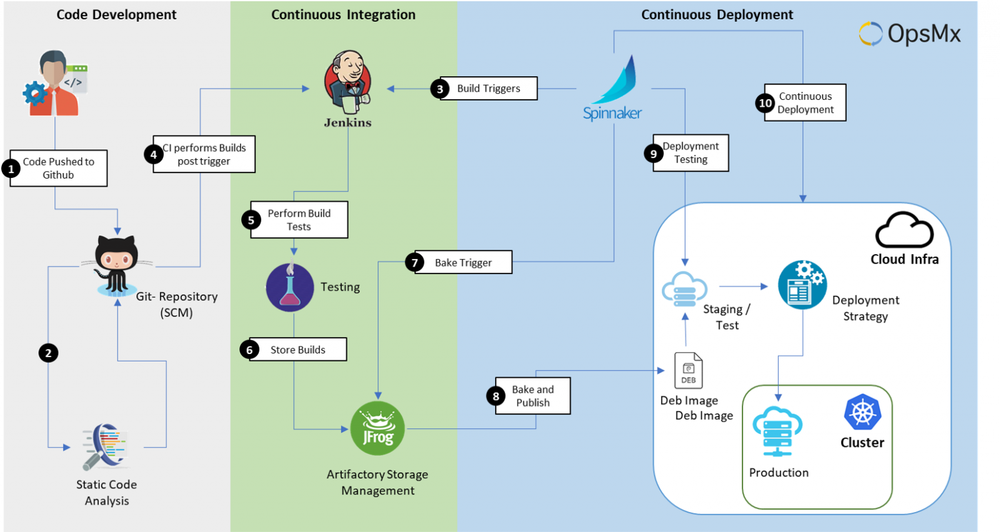

---

# 8.4.4 DevOps: Μείωση Lead Time στην Ανάπτυξη Λογισμικού

<!-- _class: casestudy small -->

Ένας από τους βασικούς στόχους του DevOps είναι η δραστική μείωση του **Lead Time** — του χρόνου από τη στιγμή που γεννιέται μια ιδέα μέχρι να φτάσει στα χέρια του τελικού χρήστη.

**Πώς το DevOps μειώνει το Lead Time:**
*   **Μείωση Waiting Time (Queue Time):** Οι αυτοματοποιημένες pipelines εξαλείφουν τις αναμονές μεταξύ των σταδίων (π.χ. αναμονή για manual testing, αναμονή για deployment).
*   **Μείωση Cycle Time:** Η αυτοματοποίηση των tasks (build, test, deploy) μειώνει τον χρόνο που απαιτείται για την εκτέλεση κάθε βήματος.
*   **Μικρότερες παρτίδες (Batch Size):** Οι Agile μεθοδολογίες και το CI/CD ενθαρρύνουν την παράδοση μικρών, συχνών αλλαγών, αντί για μεγάλες, σπάνιες εκδόσεις. Αυτό μειώνει τον κίνδυνο και επιταχύνει την ανατροφοδότηση.

> **Όφελος:** Γρηγορότερη ανταπόκριση στις ανάγκες της αγοράς, ταχύτερη καινοτομία και βελτιωμένη ικανοποίηση πελατών.

<!-- Το Lead Time, όπως είδαμε, είναι ο συνολικός χρόνος από την ιδέα μέχρι την παράδοση στον πελάτη. Στην ανάπτυξη λογισμικού, αυτό μπορεί να είναι μήνες ή και χρόνια. Το DevOps στοχεύει να το μειώσει δραστικά.
Πώς; Εξαλείφοντας τις αναμονές (waiting time) μεταξύ των σταδίων. Δεν περιμένουμε πια για manual testing ή για να γίνει το deployment. Όλα είναι αυτοματοποιημένα. Επίσης, μειώνουμε τον χρόνο που χρειάζεται για κάθε βήμα (cycle time) μέσω της αυτοματοποίησης.
Και το πιο σημαντικό: αντί να παραδίδουμε ένα τεράστιο πακέτο λογισμικού κάθε 6 μήνες, παραδίδουμε μικρές, συχνές αλλαγές κάθε λίγες μέρες. Αυτό μειώνει τον κίνδυνο και επιταχύνει την καινοτομία. -->

---

# 8.4.5 Συμπέρασμα: DevOps & Διοίκηση Λειτουργιών

<!-- _class: casestudy small -->

Το DevOps αποτελεί ένα χαρακτηριστικό παράδειγμα του πώς οι αρχές της Διοίκησης Λειτουργιών μπορούν να εφαρμοστούν με επιτυχία σε ένα φαινομενικά διαφορετικό πεδίο, όπως η ανάπτυξη λογισμικού.

**Βασικά σημεία:**
*   **Lean:** Εξάλειψη σπατάλης (waiting time, defects) μέσω αυτοματοποίησης και μικρών παρτίδων.
*   **TQM:** Εστίαση στην ποιότητα (μέσω tests) και συνεχή βελτίωση (Agile, ανατροφοδότηση).
*   **SPC:** Οι CI/CD pipelines λειτουργούν ως στατιστικός έλεγχος της διαδικασίας ανάπτυξης.
*   **KPIs:** Δραστική βελτίωση σε Lead Time, Defect Rate, Time-to-Market.

> Η υιοθέτηση του DevOps οδηγεί σε **ανταγωνιστικό πλεονέκτημα** για τις επιχειρήσεις, επιτρέποντάς τους να καινοτομούν ταχύτερα και να ανταποκρίνονται πιο αποτελεσματικά στις απαιτήσεις της αγοράς.

<!-- Συνοψίζοντας, το DevOps είναι ένα εξαιρετικό case study για το πώς οι αρχές της Διοίκησης Λειτουργιών, που γεννήθηκαν στα εργοστάσια, μπορούν να εφαρμοστούν και στον κόσμο του λογισμικού.
Εφαρμόζει το Lean για να εξαλείψει τις σπατάλες, το TQM για να διασφαλίσει την ποιότητα και την εστίαση στον πελάτη, και το SPC για να ελέγχει τη διαδικασία ανάπτυξης.
Το αποτέλεσμα είναι επιχειρήσεις που καινοτομούν ταχύτερα, παραδίδουν ποιοτικότερο λογισμικό και αποκτούν ένα σαφές ανταγωνιστικό πλεονέκτημα. -->

---

# 9. Μέτρηση Απόδοσης (KPIs)

---

# 9.1 KPIs Μέτρησης Διεργασιών

<!-- _class: xsmall -->

**Τρεις Βασικές Διαστάσεις Απόδοσης:**

| Διάσταση | Τι Μετράμε | Παραδείγματα KPI |
|---|---|---|
| **Κόστος (Cost)** | Πόροι/χρήματα που καταναλώνονται | Κόστος ανά παραγγελία, % εκτός budget |
| **Χρόνος (Time)** | Διάρκεια ολοκλήρωσης | Cycle time, Lead time, Throughput |
| **Ποιότητα (Quality)** | Ορθότητα & συμμόρφωση αποτελέσματος | % σφαλμάτων, επιστροφές, NPS πελάτη |

> **Κανόνας Deming:** «You can't manage what you can't measure.» — Πριν «βελτιώσεις» μια διεργασία, **μέτρησέ την**.

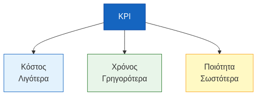

<!-- Πώς ξέρουμε αν μια διεργασία λειτουργεί καλά; Μετράμε. Πάντα σε τρεις διαστάσεις: Κόστος, Χρόνος, Ποιότητα. Ο Deming, ένας από τους πατέρες της ποιότητας, είπε: "Δεν μπορείς να διαχειριστείς αυτό που δεν μπορείς να μετρήσεις". Αυτές οι τρεις διαστάσεις είναι πάντα σε trade-off μεταξύ τους. Αν θέλεις φθηνότερα, ίσως πάρει περισσότερο χρόνο. Αν θέλεις πιο γρήγορα, ίσως αυξηθούν τα λάθη. Η βελτιστοποίηση σημαίνει βρίσκεις το σωστό ισοζύγιο για τους στόχους σου. -->

---

# 9.2 KPIs Λειτουργιών — Παραγωγικότητα & Ποιότητα

<!-- _class: xxsmall -->

**Παραγωγικότητα & Ποιότητα**

| KPI | Ορισμός |
|---|---|
| **OEE (Overall Equipment Effectiveness)** | Μετρά τη συνολική αποδοτικότητα του εξοπλισμού: Διαθεσιμότητα × Απόδοση × Ποιότητα. |
| **Defect Rate** | Ποσοστό ελαττωματικών προϊόντων επί του συνόλου της παραγωγής. |
| **First Pass Yield (FPY)** | Ποσοστό των μονάδων που ολοκληρώνονται σωστά με την πρώτη προσπάθεια, χωρίς να χρειαστούν επανεπεξεργασία. |
| **Scrap Rate** | Ποσοστό του κόστους των κατεστραμμένων/απορριφθέντων υλικών επί του συνολικού κόστους παραγωγής. |

<!-- Ας δούμε μερικά συγκεκριμένα KPIs.
Για την παραγωγικότητα και την ποιότητα, το OEE (Overall Equipment Effectiveness) είναι ο βασιλιάς. Συνδυάζει τη διαθεσιμότητα του εξοπλισμού, την απόδοσή του και την ποιότητα των προϊόντων που παράγει σε έναν ενιαίο δείκτη.
Το Defect Rate είναι απλό: πόσα ελαττωματικά βγάζουμε.
Το First Pass Yield (FPY) είναι πιο απαιτητικό: πόσα προϊόντα βγήκαν σωστά με την πρώτη, χωρίς να χρειαστούν καμία διόρθωση ή επανεπεξεργασία.
Και το Scrap Rate μετράει το κόστος των υλικών που πετάμε. -->

---

# 9.3 KPIs Λειτουργιών — Χρόνος

<!-- _class: xxsmall -->

**Χρόνος**

| KPI | Ορισμός |
|---|---|
| **Cycle Time** | Ο συνολικός χρόνος που απαιτείται για την ολοκλήρωση της παραγωγής ενός προϊόντος, από την έναρξη της πρώτης εργασίας έως το τέλος της τελευταίας. |
| **Lead Time** | Ο συνολικός χρόνος από τη στιγμή που ο πελάτης κάνει την παραγγελία μέχρι τη στιγμή που την παραλαμβάνει. (Lead Time ≥ Cycle Time) |
| **Takt Time** | Ο ρυθμός με τον οποίο πρέπει να παράγεται ένα προϊόν για να ικανοποιηθεί η ζήτηση των πελατών. (Διαθέσιμος χρόνος / Ζήτηση πελατών) |

> **Takt Time** = ρυθμός με τον οποίο πρέπει να παράγεται ένα προϊόν για να ικανοποιηθεί η ζήτηση — θεμέλιο του Lean.

<!-- Τι μετράμε στις λειτουργίες μας (KPIs);
Για την αποδοτικότητα του εξοπλισμού, το OEE είναι ο βασιλιάς. Συνδυάζει διαθεσιμότητα, απόδοση και ποιότητα σε έναν αριθμό.
Για την ποιότητα, το First Pass Yield είναι κρίσιμο: πόσα προϊόντα βγήκαν σωστά με την πρώτη, χωρίς να χρειαστούν διόρθωση;
Στον χρόνο, πρέπει να ξεχωρίσουμε το Cycle Time από το Lead Time. Το Cycle Time είναι ο χρόνος που δουλεύουμε πάνω στο προϊόν. Το Lead Time είναι ο χρόνος που περιμένει ο πελάτης από τη στιγμή που πατάει 'αγορά'.
Και τέλος, το Takt Time. Είναι ο 'μετρονόμος' της γραμμής παραγωγής. Είναι ο ρυθμός στον οποίο ΠΡΕΠΕΙ να παράγεις ένα προϊόν (π.χ. 1 κάθε λεπτό) προκειμένου να ικανοποιήσεις ακριβώς τη ζήτηση της αγοράς, χωρίς υπερπαραγωγή. -->

---

# 9.3.1 KPIs Χρόνου: Lead Time & Cycle Time

<!-- _class: diagram-sm -->

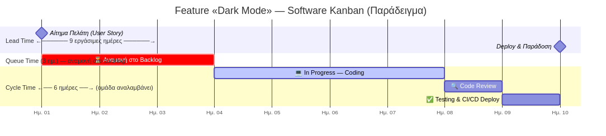

> **Lead Time** = Queue Time + Cycle Time. Ο πελάτης βιώνει το Lead Time — η ομάδα ελέγχει το Cycle Time.

<!-- Κοιτάτε το Gantt. Η User Story «Dark Mode» δημιουργήθηκε στο backlog (Day 1). Αλλά η ομάδα δεν την άρπαξε αμέσως — 3 μέρες έμεινε εκεί να περιμένει. Αυτό είναι το Queue Time ή Waiting Time. Η «πραγματική δουλειά» — coding, review, testing — είναι το Cycle Time (6 μέρες). Ο πελάτης όμως δεν βλέπει αυτή τη διάκριση. Βλέπει 9 μέρες από αίτημα μέχρι παράδοση: το Lead Time. Το Lean στοχεύει να μειώσει κυρίως το Queue Time — τον χρόνο που το έργο «κάθεται» χωρίς να δουλεύεται. -->

---

# 9.3.2 KPIs Χρόνου: Takt Time — Ο Μετρονόμος του Sprint

<!-- _class: diagram -->

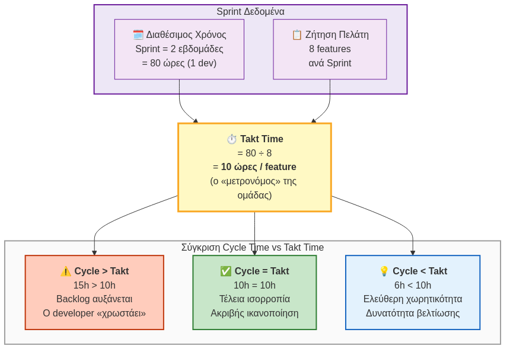

<!-- Το Takt Time είναι ο ρυθμός που ΠΡΕΠΕΙ να έχεις για να καλύψεις τη ζήτηση ακριβώς — ούτε παραπάνω, ούτε λιγότερο. Αν ο developer κάνει 15 ώρες ανά feature αλλά ο πελάτης θέλει 1 κάθε 10 ώρες, το backlog θα αναπτύσσεται ασταμάτητα. Αν κάνει 6 ώρες, υπάρχει ελεύθερη χωρητικότητα που μπορεί να πάει σε τεχνικό χρέος, documentation ή νέα features. Το Takt Time είναι ο στόχος-ρυθμός που συγχρονίζει παραγωγή και ζήτηση. -->

---

# 9.4 KPIs Λειτουργιών — Αποθέματα & Εφοδιαστική

<!-- _class: xxsmall -->

**Αποθέματα & Κόστος**

| KPI | Ορισμός |
|---|---|
| **Inventory Turnover** | Πόσες φορές «ανανεώνεται» το απόθεμα σε μια περίοδο. (Κόστος Πωληθέντων / Μέσο Απόθεμα) |
| **Days of Inventory** | Για πόσες ημέρες επαρκεί το τρέχον απόθεμα. (365 / Inventory Turnover) |
| **COGS %** | Το ποσοστό των εσόδων που αναλώνεται στο κόστος παραγωγής των πωληθέντων αγαθών. |
| **Capacity Utilization** | Το ποσοστό της μέγιστης παραγωγικής δυναμικότητας που χρησιμοποιείται πραγματικά. |

**Εφοδιαστική Αλυσίδα**

| KPI | Ορισμός |
|---|---|
| **OTIF (On Time In Full)** | Το ποσοστό των παραδόσεων που έφτασαν στον πελάτη **έγκαιρα** ΚΑΙ **πλήρεις** (σωστά προϊόντα, σωστή ποσότητα). |
| **Fill Rate** | Το ποσοστό των παραγγελιών (ή των γραμμών παραγγελίας) που ικανοποιήθηκαν άμεσα από το διαθέσιμο απόθεμα, χωρίς καθυστερήσεις. |
| **Perfect Order Rate** | Το ποσοστό των παραγγελιών που ολοκληρώθηκαν τέλεια σε όλα τα στάδια: χωρίς λάθη, χωρίς ζημιές, με σωστή τιμολόγηση και έγκαιρη παράδοση. |

> Στόχος: **Amazon** OTIF > 99% · Τυπικός κλάδος: 85–95%.

> *Πηγή: Slack, N., Brandon-Jones, A. & Johnston, R. (2019). Operations Management, 9th ed. Pearson.*

<!-- Στην εφοδιαστική αλυσίδα και τα αποθέματα, το πιο σκληρό αλλά δίκαιο KPI είναι το OTIF (On Time In Full). Παρέδωσες την παραγγελία στον σωστό χρόνο ΚΑΙ στη σωστή ποσότητα; Οτιδήποτε λιγότερο από 100% επιτυχία σε αυτά τα δύο, είναι απλά αποτυχία. Αν θέλεις να είσαι στο επίπεδο κολοσσών όπως η Amazon, το OTIF σου πρέπει πρακτικά να μην πέφτει ποτέ κάτω από το απόλυτο. -->

---

<!-- _class: xxsmall -->

# Μέρος Α — Σύνοψη

| Θέμα | Βασικές Έννοιες |
|---|---|
| **Εισαγωγή** | Input-Process-Output, Goods vs. Services |
| **Στρατηγική** | Αλυσίδα Αξίας, 4 Ανταγωνιστικές Προτεραιότητες |
| **Σχεδιασμός Παραγωγής** | Τύποι Παραγωγής, Product-Process Matrix, Mass Customization |
| **Δυναμικότητα & Πρόβλεψη** | Capacity Planning (Τύποι, Τεχνικές), Demand Forecasting, MRP/ERP, EOQ |
| **Εφοδιαστική Αλυσίδα** | SCM, Bullwhip Effect |
| **Ποιότητα & Βελτίωση** | Lean (7 Muda), Six Sigma (DMAIC), TQM, DevOps |
| **KPIs** | OEE, Cycle Time, Lead Time, Takt Time, OTIF |

<!-- Αυτή ήταν μια πολύ συμπυκνωμένη ματιά στον κόσμο του Operations Management — από τη στρατηγική ευθυγράμμιση, τον σχεδιασμό δυναμικότητας, την εφοδιαστική αλυσίδα, ώς τις σύγχρονες μεθοδολογίες Lean και Six Sigma. Η Διαχείριση Επιχειρησιακών Διεργασιών (BPM) καλύπτεται αναλυτικά στο Μέρος Γ. -->

---

<!-- _class: xxsmall -->

# Μέρος Α — Βιβλιογραφία

**Κύρια Συγγράμματα**

| Συγγραφέας | Έργο | Κάλυψη |
|---|---|---|
| Slack, Brandon-Jones & Johnston | *Operations Management*, 9th ed. Pearson (2019) | Παραγωγή, capacity, αποθέματα, SCM, KPIs |
| Dumas, La Rosa, Mendling & Reijers | *Fundamentals of BPM*, 2nd ed. Springer (2018) | BPMN 2.0, bottlenecks, αυτοματοποίηση |

**Συμπληρωματικές Πηγές**

| Συγγραφέας | Θέμα |
|---|---|
| Porter (1985) | Αλυσίδα Αξίας |
| Hayes & Wheelwright (1979) | Product-Process Matrix |
| Chopra & Meindl (2013) | SCM & 5 Drivers |
| Lee et al. (1997) | Bullwhip Effect |
| Vollmann et al. (2005) | MRP/ERP |

| Συγγραφέας | Θέμα |
|---|---|
| Ohno (1988) | Lean / 7 Muda |
| Liker (2004) | 14 Toyota Principles |
| George (2002) | Lean Six Sigma / DMAIC |
| Chase et al. (2006) | Τύποι παραγωγής |
| Harrington (1991) | Process Mapping |

<!-- Εδώ συγκεντρώσαμε την κύρια βιβλιογραφία, με ναυαρχίδα το εξαιρετικό βιβλίο των Slack et al., καθώς και ορισμένες από τις πιο κλασικές πηγές και άρθρα που θεμελίωσαν τις έννοιες που συζητήσαμε. Σας ευχαριστώ. -->

---

<!-- _class: small -->

# Μέρος Β — Περίγραμμα

1.  **Λειτουργία vs. Διεργασία** (Function vs. Process, Silos)
2.  **Εξέλιξη BPM** (Taylor → BPR → BPMN → RPA / AI)
3.  **BPM Lifecycle** (As-Is → Ανάλυση → To-Be → Εκτέλεση → Έλεγχος)
4.  **Αρχιτεκτονική Διεργασιών** (Διοίκησης / Κύριες / Υποστηρικτικές)
5.  **BPMN 2.0** (Pools & Lanes, Events, Tasks, Gateways)
6.  **Ανάλυση Απόδοσης** (KPIs Διεργασιών, Bottlenecks)
7.  **Business Process Reengineering (BPR)**
8.  **Workflow Automation** (BPMS, iPaaS, RPA)

<!-- Στο Μέρος Β αφήνουμε τα 'στεγανά' των τμημάτων και βλέπουμε το 'Πώς'. Θα μάθουμε να χαρτογραφούμε, να αναλύουμε και να αυτοματοποιούμε τις καθημερινές διαδικασίες μιας επιχείρησης — από τη θεωρία των Λειτουργιών, στην πράξη των Διεργασιών. -->

---

# Λειτουργία (Function) vs. Διεργασία (Process)

<!-- _class: small -->

**Λειτουργία (Κάθετη Λογική)**
Εξειδικευμένο τμήμα — κάθετη ιεραρχία, εσωτερική εστίαση.

**Διεργασία (Οριζόντια Ροή)**
Σειρά αλληλένδετων ενεργειών που παράγουν **αξία για τον πελάτη**.

**Το Πρόβλημα:** Τα τμήματα δρουν ως **«Silos»** — ο πελάτης δεν νοιάζεται για τα τμήματα, νοιάζεται για το αποτέλεσμα.

<!-- Φανταστείτε έναν πελάτη που παραγγέλνει ένα laptop. Η παραγγελία ξεκινάει από τις Πωλήσεις, πάει στην Αποθήκη για έλεγχο, και καταλήγει στο Λογιστήριο για το τιμολόγιο. Ο πελάτης δεν νοιάζεται για τα τμήματά σας, νοιάζεται για το αποτέλεσμα! Αν τα τμήματα δεν επικοινωνούν (Silos), η παραγγελία καθυστερεί. Η Διεργασία είναι το οριζόντιο νήμα που τα ενώνει όλα. Είναι η διαδρομή από την ανάγκη του πελάτη, μέχρι την ικανοποίησή της. -->

---

# Τι είναι η Επιχειρησιακή Διεργασία;

<!-- _class: small -->

**Ορισμός *(Davenport, 1993)*:** Ένα σύνολο δομημένων, μετρήσιμων δραστηριοτήτων που εκτελούνται από **ανθρώπους ή συστήματα** για την παραγωγή συγκεκριμένου αποτελέσματος **αξίας για τον πελάτη ή τον οργανισμό**.

**Τα 4 Συστατικά Στοιχεία:**

| Συστατικό | Τι είναι | Παράδειγμα |
|---|---|---|
| **Γεγονότα (Events)** | Κάτι που συμβαίνει | «Ελήφθη παραγγελία» |
| **Δραστηριότητες (Tasks)** | Εργασία που εκτελείται | «Ετοιμασία δέματος» |
| **Αποφάσεις (Gateways)** | Διακλάδωση ροής | «Υπάρχει στοκ;» |
| **Εμπλεκόμενοι (Actors)** | Άνθρωποι ή συστήματα | Αποθηκάριος, ERP |

<!-- Πριν μιλήσουμε για BPM, πρέπει να ορίσουμε τι είναι μια Διεργασία. Ο Davenport το 1993 την όρισε ως ένα σύνολο δομημένων δραστηριοτήτων που παράγουν αξία. Κάθε διεργασία έχει Εισροές (π.χ. μια παραγγελία), περνάει μέσα από δραστηριότητες, αποφάσεις και γεγονότα, και παράγει μια Εκροή (π.χ. παρεδόθηκε το προϊόν). Πάντα υπάρχει κάποιος εμπλεκόμενος — άνθρωπος ή σύστημα. -->

---

<!-- _class: small -->

# Τι είναι Επιχειρηματική Διεργασία και τι Δραστηριότητα;

**Διεργασία (Business Process) – Η «Μεγάλη Εικόνα»**

Μια σειρά από αλληλένδετες ενέργειες που μετατρέπουν εισροές σε εκροές, με σκοπό να δημιουργήσουν ένα συγκεκριμένο αποτέλεσμα (αξία) για τον πελάτη (ή τον χρήστη).
Έχει ξεκάθαρη αρχή, μέση και τέλος, και συνήθως διαπερνά πολλά διαφορετικά τμήματα.

**Δραστηριότητα / Εργασία (Activity / Task) – Το «Επιμέρους Βήμα»**

Μια συγκεκριμένη, μεμονωμένη ενέργεια που εκτελείται από έναν άνθρωπο, ένα σύστημα ή μια μηχανή στα πλαίσια της διεργασίας.

**Παράδειγμα στο Πανεπιστήμιο:**

🔄 **Η Διεργασία:** «Διαχείριση Βαθμολογίας Εξαμήνου»
(Σκοπός: Να ενημερωθεί ο φοιτητής για την επίδοσή του με εγκυρότητα)

📝 **Οι Δραστηριότητες** (Τα βήματα της διεργασίας):
- Ο καθηγητής διορθώνει τα γραπτά (Χειροκίνητη δραστηριότητα).
- Ο καθηγητής καταχωρεί τους βαθμούς στο φοιτητολόγιο (User Task).
- Η Γραμματεία ελέγχει και κάνει οριστικοποίηση του βαθμολογίου (User Task).
- Το σύστημα (e-uni) δημοσιεύει τους βαθμούς στο προφίλ του φοιτητή (Automated Task).

<!-- Πριν πάμε να σχεδιάσουμε οτιδήποτε, πρέπει να ξεκαθαρίσουμε δύο βασικές έννοιες που συχνά μπερδεύονται: τη Διεργασία και τη Δραστηριότητα.

Φανταστείτε τη Διεργασία σαν μια σκάλα που σε πάει από το ισόγειο στον πρώτο όροφο. Σκοπός της είναι να σε ανεβάσει πάνω. Η Δραστηριότητα είναι το κάθε μεμονωμένο σκαλοπάτι που πατάς.

Ας πάρουμε ένα παράδειγμα που ζείτε όλοι εδώ στο Πανεπιστήμιο: Τη βαθμολόγηση. Η 'Διεργασία Διαχείρισης Βαθμολογίας' ξεκινάει τη μέρα που δίνετε εξετάσεις και τελειώνει τη μέρα που βλέπετε τον βαθμό σας στο σύστημα. Αυτή είναι η μεγάλη εικόνα.

Για να ολοκληρωθεί αυτή η Διεργασία, απαιτούνται συγκεκριμένες 'Δραστηριότητες'. Μια δραστηριότητα είναι το να καθίσω εγώ σπίτι να διορθώσω το γραπτό σας. Άλλη δραστηριότητα είναι να περάσω τον βαθμό στο σύστημα. Μια τρίτη είναι να πατήσει η Γραμματεία το κουμπί της οριστικοποίησης. Αν μια από αυτές τις δραστηριότητες κολλήσει, η συνολική Διεργασία καταρρέει και εσείς δεν παίρνετε τον βαθμό σας! -->

---

# Τι είναι το BPM (Business Process Management);

<!-- _class: xsmall -->

**Ορισμός:** Η μεθοδολογία για τον σχεδιασμό, την εκτέλεση, την παρακολούθηση και τη βελτιστοποίηση των διεργασιών.

**Ο Κύκλος Ζωής του BPM (6 Στάδια):**
1. **Αναγνώριση** — Ολιστική εικόνα & επιλογή της σωστής διεργασίας
2. **Μοντελοποίηση** — Αναπαράσταση του As-Is μοντέλου
3. **Ανάλυση** — Εντοπισμός αδυναμιών & bottlenecks
4. **Ανασχεδιασμός** — Σχεδιασμός του βέλτιστου To-Be μοντέλου
5. **Υλοποίηση** — Αυτοματοποίηση & οργανωσιακή αλλαγή
6. **Παρακολούθηση** — Συνεχής αξιολόγηση απόδοσης

<!-- Το BPM (Business Process Management) δεν είναι λογισμικό. Είναι μια ολόκληρη διοικητική πρακτική. Είναι ο κύκλος ζωής της βελτίωσης. Δεν μπορείς να βελτιώσεις κάτι αν δεν το δεις. Πρώτα αποτυπώνουμε το πώς δουλεύουμε σήμερα (Το As-Is), βρίσκουμε τα λάθη, σχεδιάζουμε το πώς θα έπρεπε να δουλεύουμε (Το To-Be) και στο τέλος το αυτοματοποιούμε. -->

---

# Πώς επιλέγουμε ποια διαδικασία θα ανασχεδιάσουμε;

<!-- _class: small -->

Δεν μπορούμε να αλλάξουμε τα πάντα ταυτόχρονα — πρέπει να **θέσουμε προτεραιότητες**.

**Κριτήρια Αξιολόγησης:**

- **«Υγεία» της διεργασίας:** Υπάρχουν πολλά σφάλματα; Αργεί υπερβολικά; Έχει υψηλό κόστος;
- **Ευθυγράμμιση με στρατηγικούς στόχους:** Βοηθά στην εκπλήρωση της στρατηγικής της επιχείρησης;
- **Εφικτότητα:** Είναι ρεαλιστικό να αλλάξει; Υπάρχουν διαθέσιμοι πόροι και βούληση αλλαγής;
- **Κουλτούρα & Ρίσκο:** Είναι ο οργανισμός έτοιμος να αλλάξει τον τρόπο εργασίας του;

<!-- Ένα κλασικό λάθος στα BPM projects: θέλουμε να φτιάξουμε τα πάντα ταυτόχρονα και δεν φτιάχνουμε τίποτα. Πρέπει να διαλέξουμε τη σωστή διαδικασία για να ξεκινήσουμε. Πρώτα κοιτάμε: ποια διαδικασία πονάει περισσότερο; Ποια κοστίζει, αργεί, κάνει τα περισσότερα λάθη; Μετά: αν τη φτιάξουμε, βοηθά την εταιρεία να πετύχει τους στρατηγικούς της στόχους; Και τρίτον: είναι ρεαλιστικό; Έχουμε τον προϋπολογισμό, τους ανθρώπους, και κυρίως — έχουμε τη βούληση της ηγεσίας; Χωρίς αυτά, κανένα BPM project δεν ζει. -->

---

# Competency Questions: Οδηγός Σχεδιασμού Διεργασίας

<!-- _class: small -->

Οι **Ερωτήσεις Επάρκειας (Competency Questions)** είναι ερωτήσεις σε φυσική γλώσσα που η (βελτιωμένη) διεργασία πρέπει να μπορεί να απαντήσει.

**Γιατί είναι θεμελιώδεις;**
1.  **Καθορίζουν το Scope:** Μας βοηθούν να αποφασίσουμε τι θα μετρήσουμε και τι θα αγνοήσουμε. Αν μια μέτρηση δεν απαντά σε καμία ερώτηση, είναι περιττή.
2.  **Λειτουργούν ως Test Cases:** Αποτελούν τα κριτήρια επιτυχίας. Πώς θα ξέρουμε ότι το έργο πέτυχε αν δεν μπορούμε να απαντήσουμε στις αρχικές ερωτήσεις;

**Παράδειγμα (Διεργασία "Order-to-Cash"):**
*   *«Πόσος είναι ο μέσος χρόνος από την παραγγελία μέχρι την πληρωμή;»* (Μέτρηση: Cycle Time)
*   *«Ποιο το ποσοστό σφαλμάτων στα τιμολόγια;»* (Μέτρηση: Ποιότητα)
*   *«Ποιο βήμα προκαλεί τη μεγαλύτερη καθυστέρηση;»* (Ανάλυση: Bottleneck)

> Οι CQs μετατρέπουν τους αφηρημένους στόχους σε **μετρήσιμα KPIs** και καθοδηγούν ολόκληρο το έργο ανασχεδιασμού.

<!-- Πριν καν σχεδιάσουμε την πρώτη γραμμή στο BPMN, πρέπει να απαντήσουμε στο 'Γιατί το κάνουμε αυτό;'. Οι Competency Questions μας αναγκάζουν να σκεφτούμε σαν τον τελικό χρήστη ή τον manager. Τι ερωτήσεις θέλουν να απαντηθούν; 'Πόσο κοστίζει;', 'Πόσο γρήγορα γίνεται;'. Αυτές οι ερωτήσεις γίνονται τα KPIs μας και ο οδηγός μας για το τι πρέπει να μετρήσουμε και να βελτιώσουμε. -->

---

# Ιστορική Εξέλιξη του BPM

<!-- _class: xxsmall -->

| Εποχή | Ορόσημο | Βασική Ιδέα |
|---|---|---|
| **1750–1900** | Βιομηχανική Επανάσταση · Adam Smith | Καταμερισμός εργασίας, εξειδίκευση |
| **1900–1950** | F.W. Taylor · Henry Ford | Επιστημονική Διοίκηση, γραμμή παραγωγής |
| **1960–1980** | MIS, MRP | Πρώτα Πληροφοριακά Συστήματα στη Διαχείριση |
| **1990–2000** | Hammer & Champy (BPR) · Workflow Systems | Ριζικός ανασχεδιασμός, αυτοματοποίηση ροής |
| **2000–2010** | BPMN 1.0 / 2.0 · SOA · eBusiness | Τυποποιημένη μοντελοποίηση, web-services |
| **2010–σήμερα** | Cloud BPM · RPA · AI / Process Mining | Ευφυής αυτοματοποίηση, ανακάλυψη διεργασιών |

**Κοινός Παρονομαστής:** Κάθε εποχή αναζητά το ίδιο — **αποδοτικότερη ροή εργασίας** με λιγότερο κόστος, λιγότερα λάθη, περισσότερη ταχύτητα.

<!-- Ίσως εκπλαγείτε, αλλά το BPM δεν είναι σύγχρονη επινόηση. Ο Adam Smith το 1776 περιέγραφε τον καταμερισμό εργασίας στα εργοστάσια πινεζών — αυτό ήταν process thinking! Ο Taylor εισήγαγε Scientific Management, ο Ford τη γραμμή παραγωγής. Η ψηφιακή εποχή μας έδωσε νέα εργαλεία για το ίδιο πρόβλημα: πώς κάνουμε τη δουλειά πιο αποδοτικά. -->

---

# Αρχιτεκτονική Διεργασιών

<!-- _class: small -->

**Τρεις Κατηγορίες Διεργασιών** *(Porter, Osterlund)*:

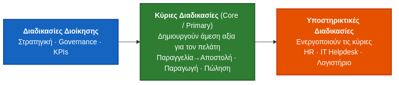

| Κατηγορία | Παραδείγματα | Σκοπός |
|---|---|---|
| **Διοίκησης** | Στρατηγικός Σχεδιασμός, KPIs, Compliance | Κατεύθυνση |
| **Κύριες** | Παραγγελία→Αποστολή, Παραγωγή, Πώληση | Άμεσο έσοδο |
| **Υποστηρικτικές** | HR, IT Helpdesk, Λογιστήριο | Ενεργοποίηση |

> **MITOS.gov.gr** — Εθνικό Μητρώο Διαδικασιών: αποτυπώνει σε δομημένη, δημόσια προσβάσιμη βάση όλες τις διοικητικές διεργασίες του Ελληνικού κράτους.

<!-- Πριν χαρτογραφήσεις μεμονωμένες διεργασίες, πρέπει να ξέρεις πού εντάσσονται. Στην κορυφή οι Διοικητικές — Στρατηγική, Compliance. Στη μέση οι Κύριες — αυτές που φτιάχνουν ό,τι πληρώνει ο πελάτης. Και κάτω οι Υποστηρικτικές (HR, IT). Ένα πραγματικό ελληνικό παράδειγμα: το MITOS.gov.gr αποτυπώνει τις διεργασίες ολόκληρου του δημοσίου.

Για να καταλάβετε πώς φαίνεται μια πραγματική αποτύπωση διαδικασιών σε επίπεδο κράτους, αρκεί να επισκεφθείτε το mitos.gov.gr — το Εθνικό Μητρώο Διαδικασιών. Εκεί, το Ελληνικό Δημόσιο έχει καταγράψει βήμα-βήμα χιλιάδες διαδικασίες (όπως π.χ. η Δήλωση Κλοπής Διαβατηρίου), αναφέροντας ακριβώς ποιος είναι ο αρμόδιος υπάλληλος, τι δικαιολογητικά χρειάζονται και ποια είναι η ροή. Αυτό είναι η επιτομή της διαχείρισης διαδικασιών στην πράξη! -->

---

# Ρόλοι & Συμμετέχοντες στο BPM

<!-- _class: xsmall -->

| Ρόλος | Αρμοδιότητα | Ερώτηση που απαντά |
|---|---|---|
| **Process Owner** | Υπεύθυνος για αποτελέσματα & βελτίωση | «Ποιος ευθύνεται αν πάει στραβά;» |
| **Business Analyst** | Μοντελοποίηση & ανάλυση (As-Is / To-Be) | «Τι γίνεται σήμερα και τι αλλάζει;» |
| **Συμμετέχοντες (Participants)** | Εκτελούν τα Tasks της διεργασίας | «Ποιος κάνει τη δουλειά;» |
| **System Engineers / IT** | Υλοποίηση BPMS & αυτοματοποίηση | «Πώς θα τρέξει στο σύστημα;» |
| **BPM Group / CoE** | Μεθοδολογία, standards, εκπαίδευση | «Κάνουμε BPM με ενιαίο τρόπο;» |

**Κρίσιμος Κανόνας:** Κάθε διεργασία πρέπει να έχει έναν και μόνο **Process Owner** — χωρίς αυτόν, δεν υπάρχει υπευθυνότητα και η βελτίωση δεν εφαρμόζεται.

**Παραγωγικές Διεργασίες**
Άμεσα μετρήσιμες, επαναλαμβανόμενες
*(π.χ. παραγωγή προϊόντος)*

**Διοικητικές Διεργασίες**
Λιγότερο δομημένες, υποστηρικτικές
*(π.χ. έγκριση budget)*

<!-- Κάθε επιτυχημένο BPM project έχει σαφείς ρόλους. Το πιο κρίσιμο: ο Process Owner. Δεν είναι αυτός που κάνει τη δουλειά — είναι αυτός που 'κατέχει' τη διεργασία και ευθύνεται για τα αποτελέσματά της. Χωρίς Process Owner, κάθε βελτίωση πεθαίνει στα χαρτιά. Ο Business Analyst είναι ο 'μεταφραστής' — μιλάει τη γλώσσα του business ΚΑΙ του IT. -->

---

# Οι Εμπλεκόμενοι (Stakeholders) στην Αλλαγή

<!-- _class: small -->

- **Process Owner (Ιδιοκτήτης Διαδικασίας):** Το στέλεχος με την τελική ευθύνη για τα αποτελέσματα και τη βελτίωση — απαντά στην ερώτηση «Ποιος χάνει αν αυτό πάει στραβά;».
- **Business Analyst (Αναλυτής):** Καταγράφει απαιτήσεις, σχεδιάζει το BPMN και προτείνει αλλαγές που φέρνουν μετρήσιμη αξία.
- **Process Participants (Συμμετέχοντες):** Οι εργαζόμενοι που εκτελούν τα καθημερινά βήματα — η φωνή τους είναι κρίσιμη στη φάση ανάλυσης.
- **System Engineers (IT):** Αναλαμβάνουν την τεχνική υλοποίηση και αυτοματοποίηση της διεργασίας μέσω BPMS/RPA.

> **Κανόνας:** Κανένα BPM project δεν επιτυγχάνει χωρίς **δέσμευση της ηγεσίας** και **συμμετοχή των εργαζομένων** — η τεχνολογία είναι το τελευταίο κομμάτι, όχι το πρώτο.

<!-- Εδώ βρίσκεται η καρδιά της αποτυχίας πολλών BPM projects: αγνοούν τους ανθρώπους. Ο Process Owner δεν είναι γραφειοκρατικός τίτλος — είναι αυτός που σηκώνει το τηλέφωνο όταν κάτι πάει στραβά. Οι Participants είναι αυτοί που γνωρίζουν καλύτερα από όλους τα προβλήματα — αλλά συχνά δεν τους ρωτάμε. Και το IT έρχεται τελευταίο, αφού πρώτα έχουμε καταλάβει τι θέλουμε να φτιάξουμε. -->

---

# Εισαγωγή στο BPMN 2.0

**Τι είναι:** Business Process Model and Notation — το παγκόσμιο, τυποποιημένο πρότυπο **(ISO 19510)** για τη χαρτογράφηση διεργασιών.

**Η «Γέφυρα»:** Μια κοινή γλώσσα κατανοητή από **τη Διοίκηση** (Business) **και** τους **Προγραμματιστές** (IT):

| Παλιά | Με BPMN 2.0 |
|---|---|
| 50 σελίδες κείμενο στο Word που κανείς δεν διαβάζει | Οπτικό διάγραμμα που όλοι καταλαβαίνουν |
| Ο IT κώδικας δεν αντιστοιχεί στις επιχειρηματικές ανάγκες | Το ίδιο διάγραμμα εκτελείται απευθείας από BPMS |

> Το BPMN 2.0 είναι **lingua franca** — τη διαβάζει ο CEO, την εκτελεί ο κώδικας.

<!-- Παλιά, οι managers έγραφαν διαδικασίες σε κείμενα 50 σελίδων στο Word που κανείς δεν διάβαζε, και το IT έφτιαχνε κώδικα που οι managers δεν καταλάβαιναν. Το BPMN 2.0 ήρθε για να λύσει αυτό το πρόβλημα. Είναι μια οπτική 'lingua franca'. Μια γλώσσα από σύμβολα που τη διαβάζει ο CEO και την καταλαβαίνει, και την παίρνει ο προγραμματιστής και την κάνει κώδικα αυτοματοποίησης.

Να σημειώσουμε εδώ ότι το BPMN είναι τέλειο για διαδικασίες που μοιάζουν με 'γραμμή παραγωγής' — επαναλαμβανόμενες και δομημένες, όπως η έγκριση άδειας. Αν όμως έχουμε μια διαδικασία ανθρωποκεντρική, που αλλάζει συνεχώς ανάλογα με την κρίση του υπαλλήλου — π.χ. η διαχείριση ενός ασθενούς στα Επείγοντα ή η εκδίκαση μιας μήνυσης — τότε χρησιμοποιούμε μια άλλη γλώσσα μοντελοποίησης: το CMMN (Case Management Model and Notation). -->

---

# Το Αλφάβητο του BPMN — Pools & Lanes

<!-- _class: small -->

**Pool (Πισίνα):** Αντιπροσωπεύει έναν ολόκληρο οργανισμό ή εξωτερικό συνεργάτη.

**Lane (Διαδρομή):** Ρόλος ή τμήμα μέσα στο Pool — καθορίζει **ποιος** είναι υπεύθυνος για κάθε Task.

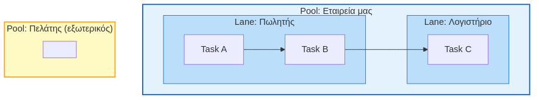

> Κάθε Task μέσα σε ένα Lane «ανήκει» στον ρόλο εκείνου του Lane — εξαλείφει ασάφειες αρμοδιότητας.

<!-- Σκεφτείτε ένα κολυμβητήριο. Η μεγάλη πισίνα (Pool) είναι η εταιρεία μας. Μέσα στην πισίνα, για να μην χτυπήσουν οι κολυμβητές, έχουμε διαδρομές (Lanes). Κάθε Lane είναι και ένας ρόλος. Όταν μια δραστηριότητα (π.χ. 'Έκδοση Τιμολογίου') μπει στο Lane του Λογιστηρίου, όλοι ξέρουν αυτομάτως ποιος είναι υπεύθυνος να την κάνει. Ξεκαθαρίζουμε δηλαδή άμεσα το 'Ποιος κάνει Τι'. -->

---

# Το Αλφάβητο του BPMN — Events & Activities

<!-- _class: xsmall -->

**Events (Γεγονότα) — Κύκλοι**

| Σύμβολο | Τύπος | Σημασία |
|---|---|---|
| ○ (λεπτό περίγραμμα) | **Start** | Έναρξη διεργασίας |
| ◎ (διπλό περίγραμμα) | **Intermediate** | Κάτι συμβαίνει στη μέση |
| ● (παχύ/γεμάτο) | **End** | Λήξη διεργασίας |

Παραδείγματα: *«Ελήφθη email»*, *«Παρήλθε προθεσμία»*, *«Στάλθηκε τιμολόγιο»*

**Activities / Tasks — Ορθογώνια**

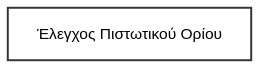

Η **εργασία** που εκτελείται — αυτό που κάνει ο άνθρωπος ή το σύστημα.

*Sub-process:* Ορθογώνιο με **[+]** στο κάτω μέρος — κρύβει λεπτομέρειες.

<!-- Τα Events είναι τα 'σημάδια' του χρόνου. Είναι οι κύκλοι μας. Όλα ξεκινούν από ένα Start Event (π.χ. Μόλις ήρθε ένα email) και τελειώνουν σε ένα End Event (π.χ. Η παραγγελία παραδόθηκε). Τα ορθογώνια είναι οι 'Δραστηριότητες' (Tasks). Είναι ο ιδρώτας! Εκεί πέφτει η πραγματική δουλειά: ο υπάλληλος ελέγχει τα χαρτιά, το σύστημα στέλνει ένα αρχείο, κ.λπ. -->

---

# Το Αλφάβητο του BPMN — Gateways (Πύλες)

<!-- _class: xsmall -->

| Σύμβολο | Τύπος | Λογική | Παράδειγμα |
|:---:|---|---|---|
| <svg width="38" height="38" viewBox="0 0 38 38"><polygon points="19,3 35,19 19,35 3,19" fill="white" stroke="#555" stroke-width="2.5"/><line x1="12" y1="12" x2="26" y2="26" stroke="#555" stroke-width="2.5"/><line x1="26" y1="12" x2="12" y2="26" stroke="#555" stroke-width="2.5"/></svg> | **Exclusive — XOR** | **ΜΟΝΟ ΕΝΑ** μονοπάτι | «Εγκρίθηκε; ΝΑΙ ή ΟΧΙ» |
| <svg width="38" height="38" viewBox="0 0 38 38"><polygon points="19,3 35,19 19,35 3,19" fill="white" stroke="#555" stroke-width="2.5"/><line x1="19" y1="11" x2="19" y2="27" stroke="#555" stroke-width="2.5"/><line x1="11" y1="19" x2="27" y2="19" stroke="#555" stroke-width="2.5"/></svg> | **Parallel — AND** | **ΟΛΑ** τα μονοπάτια ταυτόχρονα | «Πακετάρισμα ΚΑΙ Τιμολόγηση» |
| <svg width="38" height="38" viewBox="0 0 38 38"><polygon points="19,3 35,19 19,35 3,19" fill="white" stroke="#555" stroke-width="2.5"/><circle cx="19" cy="19" r="6" fill="none" stroke="#555" stroke-width="2.5"/></svg> | **Inclusive — OR** | **ΕΝΑ Ή ΠΕΡΙΣΣΟΤΕΡΑ** | «Αν > 1.000€ ΚΑΙ/Ή νέος πελάτης» |

**Πότε χρησιμοποιώ τι;**

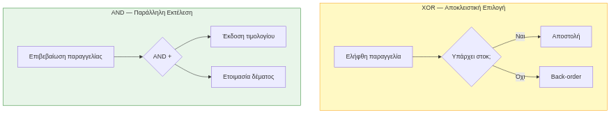

<!-- Εδώ κρύβεται η λογική της διεργασίας. Οι ρόμβοι (Gateways) είναι οι τροχονόμοι μας! Το XOR (Exclusive) είναι η απόλυτη επιλογή: Ή θα πας αριστερά, ή δεξιά. Π.χ. Ο πελάτης έχει πιστωτικό όριο; ΝΑΙ ή ΟΧΙ. Δεν γίνεται και τα δύο. Αντίθετα, το AND (Παράλληλο) σπάει τη δουλειά στα δύο για ταχύτητα. Ενώ εγώ πακετάρω το κουτί στην αποθήκη, το λογιστήριο ταυτόχρονα κόβει την απόδειξη. Γλιτώνουμε τον μισό χρόνο! -->

---

# Live Case Study: Έγκριση Άδειας (BPMN)

<!-- _class: casestudy xsmall -->

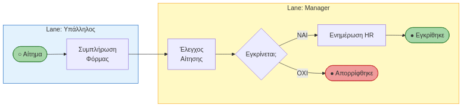

> Οποιοσδήποτε — CEO ή νέος υπάλληλος — μπορεί να διαβάσει αυτόν τον χάρτη **χωρίς καμία εκπαίδευση**.

<!-- Ας τα ενώσουμε όλα. Δείτε πόσο απλά διαβάζεται αυτή η διαδικασία. Ξεκινάμε από πάνω (Lane Υπαλλήλου). Υποβάλλει το αίτημα (Task). Το βέλος πάει κάτω, στο Lane του Manager. Φτάνουμε στο XOR Gateway. Εγκρίνεται; Αν Όχι, το βέλος γυρνάει στον υπάλληλο και η διαδικασία τερματίζει (Κόκκινος Κύκλος). Αν Ναι, προχωράει στο HR. Οποιοσδήποτε στην εταιρεία, χωρίς καμία εκπαίδευση, μπορεί να διαβάσει αυτόν τον χάρτη! -->

---

# Case Study: Μοντελοποίηση από το mitos.gov.gr

<!-- _class: casestudy xxsmall -->

Ας μοντελοποιήσουμε μια πραγματική δημόσια διεργασία: την **«Έκδοση Αντιγράφου Ποινικού Μητρώου»** μέσω του gov.gr, όπως περιγράφεται στο Εθνικό Μητρώο Διαδικασιών (Μίτος).

**Ροή Διεργασίας (BPMN):**

| Lane (Ρόλος) | Βήμα | Τύπος BPMN | Περιγραφή |
|---|---|---|---|
| **Πολίτης** | 1 | Start Event | Ο πολίτης έχει ανάγκη για το έγγραφο. |
| **Πολίτης** | 2 | User Task | Συνδέεται στο gov.gr με κωδικούς Taxisnet και υποβάλλει την αίτηση. |
| **gov.gr (Σύστημα)** | 3 | Service Task | Το σύστημα παραλαμβάνει, πρωτοκολλεί και προωθεί την αίτηση στην αρμόδια υπηρεσία. |
| **Αρμόδια Υπηρεσία** | 4 | User Task | Ο υπάλληλος ελέγχει την αίτηση για πληρότητα και ορθότητα. |
| **Αρμόδια Υπηρεσία** | 5 | Exclusive Gateway | Η αίτηση είναι έγκυρη; (Ναι/Όχι) |
| **Αρμόδια Υπηρεσία** | 6 (Ναι) | User Task | Ο υπάλληλος εκδίδει το αντίγραφο μέσω του συστήματος του Εθνικού Ποινικού Μητρώου. |
| **gov.gr (Σύστημα)** | 7 | Service Task | Το σύστημα τοποθετεί το έγγραφο στη Θυρίδα Πολίτη και στέλνει ειδοποίηση (SMS/Email). |
| **Πολίτης** | 8 | User Task | Ο πολίτης λαμβάνει την ειδοποίηση και ανακτά το έγγραφο από τη Θυρίδα του. |
| **Πολίτης** | 9 | End Event | Η διεργασία ολοκληρώνεται επιτυχώς. |
| **Αρμόδια Υπηρεσία** | 10 (Όχι) | End Event | Η διεργασία τερματίζει με απόρριψη. |

> Αυτό το παράδειγμα δείχνει πώς το BPMN μπορεί να αποτυπώσει με απόλυτη σαφήνεια μια πραγματική, δια-οργανωσιακή διαδικασία. Βλέπουμε καθαρά **ποιος κάνει τι** (Lanes), **πότε παίρνονται αποφάσεις** (Gateways) και πώς τα **συστήματα** (Service Tasks) συνεργάζονται με τους **ανθρώπους** (User Tasks).

<!-- Αυτό το παράδειγμα δείχνει πώς το BPMN μπορεί να αποτυπώσει με απόλυτη σαφήνεια μια πραγματική, δια-οργανωσιακή διαδικασία. Βλέπουμε καθαρά ποιος κάνει τι (Lanes), πότε παίρνονται αποφάσεις (Gateways) και πώς τα συστήματα (Service Tasks) συνεργάζονται με τους ανθρώπους (User Tasks). Το mitos.gov.gr είναι γεμάτο τέτοια παραδείγματα που περιμένουν να μοντελοποιηθούν! -->

---

# Πέρα από τη Ροή: BPMN & Γράφοι Γνώσης

<!-- _class: xxsmall -->

| | BPMN | Knowledge Graph |
|---|---|---|
| **Μοντελοποιεί** | Ροή — το *Πώς;* | Δεδομένα & Σχέσεις — το *Τι;* |
| **Γνώση** | Διαδικαστική | Δηλωτική (OWL / RDF) |
| **Ερώτηση** | «Ποιο βήμα ακολουθεί;» | «Είναι ο πελάτης υψηλού ρίσκου;» |

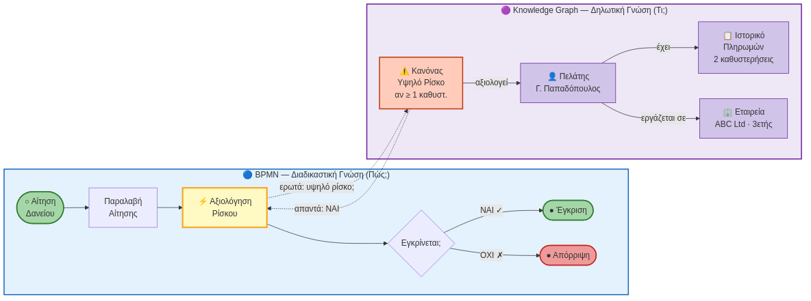

> Ένα σύγχρονο BPMS ρωτά δυναμικά τον Knowledge Graph σε κάθε κρίσιμο βήμα — συνδυάζοντας **Διαδικαστική** με **Δηλωτική Γνώση**.

<!-- Το BPMN μας δείχνει τη 'χορογραφία', τα βήματα. Αλλά τι δεδομένα χρησιμοποιεί κάθε βήμα; Εδώ έρχονται οι Οντολογίες και οι Γράφοι Γνώσης. Φανταστείτε μια διαδικασία έγκρισης δανείου. Το BPMN δείχνει τα βήματα. Αλλά ένα βήμα, το 'Αξιολόγηση Ρίσκου', δεν είναι απλό. Ρωτάει έναν Γράφο Γνώσης που περιέχει όλα τα δεδομένα του πελάτη, τις σχέσεις του, το ιστορικό του, και κανόνες για το ρίσκο. Το BPMN μοντελοποιεί τη ροή, και ο Γράφος Γνώσης παρέχει την 'εξυπνάδα' σε κάθε βήμα. -->

---

# Case Study: Διάγραμμα BPMN — Ποινικό Μητρώο

<!-- _class: casestudy diagram -->

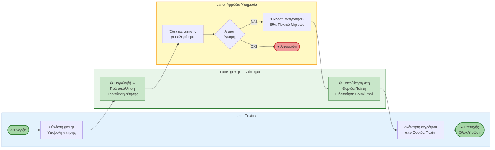

---

# Ανάλυση Διεργασιών: Το Φαινόμενο του Bottleneck

<!-- _class: small -->

**Ορισμός:** Το βήμα της διεργασίας με τη **μικρότερη δυναμικότητα**, που περιορίζει τη συνολική παραγωγή.

> **Βασικός Κανόνας:** «Η ταχύτητα μιας ολόκληρης αλυσίδας καθορίζεται αποκλειστικά από τον **πιο αργό της κρίκο**».

**Συμπτώματα:** Ουρές εργασίας (backlogs) · Καθυστερήσεις · Υπερφόρτωση συγκεκριμένου ατόμου/τμήματος

> Όσα άτομα κι αν προσλάβεις στην Αποθήκη, το αποτέλεσμα παραμένει **20/h** — αν δεν λυθεί το bottleneck.

**Παράδειγμα:**

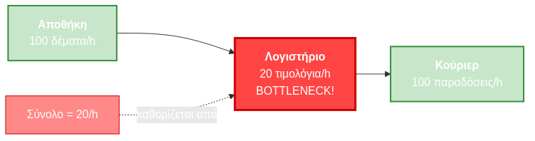

<!-- Αφού χαρτογραφήσουμε τη διεργασία, αρχίζουμε να ψάχνουμε το πρόβλημα. Συνήθως, το πρόβλημα είναι ένα: Το Bottleneck ή 'Λαιμός του μπουκαλιού'. Ας πούμε ότι η Αποθήκη μπορεί να πακετάρει 100 δέματα την ώρα, το κούριερ μπορεί να μεταφέρει 100, αλλά το λογιστήριο μπορεί να κόψει μόνο 20 τιμολόγια την ώρα. Πόσα δέματα θα φύγουν συνολικά; Μόνο 20! Όσα άτομα κι αν προσλάβετε στην Αποθήκη, πετάτε τα λεφτά σας αν δεν βελτιώσετε το λογιστήριο. -->

---

# KPIs Μέτρησης Διεργασιών

<!-- _class: xsmall -->

**Τρεις Βασικές Διαστάσεις Απόδοσης:**

| Διάσταση | Τι Μετράμε | Παραδείγματα KPI |
|---|---|---|
| **Κόστος (Cost)** | Πόροι/χρήματα που καταναλώνονται | Κόστος ανά παραγγελία, % εκτός budget |
| **Χρόνος (Time)** | Διάρκεια ολοκλήρωσης | Cycle time, Lead time, Throughput |
| **Ποιότητα (Quality)** | Ορθότητα & συμμόρφωση αποτελέσματος | % σφαλμάτων, επιστροφές, NPS πελάτη |

**Βασικές Σχέσεις:**
- Μείωση κόστους → συχνά αυξάνει χρόνο ή μειώνει ποιότητα
- Αύξηση ταχύτητας → μπορεί να αυξήσει σφάλματα

> **Κανόνας Deming:** «You can't manage what you can't measure.» — Πριν «βελτιώσεις» μια διεργασία, **μέτρησέ την**.

<!-- Πώς ξέρουμε αν μια διεργασία λειτουργεί καλά; Μετράμε. Πάντα σε τρεις διαστάσεις: Κόστος, Χρόνος, Ποιότητα. Οι τρεις αυτοί άξονες είναι πάντα σε trade-off μεταξύ τους. Αν θέλεις φθηνότερα, ίσως πάρει περισσότερο χρόνο. Αν θέλεις πιο γρήγορα, ίσως αυξηθούν τα λάθη. Η βελτιστοποίηση σημαίνει βρίσκεις το σωστό ισοζύγιο για τους στόχους σου. -->

---

# BPR — Business Process Reengineering

<!-- _class: xsmall -->

**Ορισμός *(Hammer & Champy, 1993)*:** Ο **ριζικός** ανασχεδιασμός των επιχειρησιακών διεργασιών για τη **δραματική** βελτίωση της απόδοσης (κόστος, ποιότητα, ταχύτητα).

| Διάσταση | BPM / Kaizen | BPR |
|---|---|---|
| **Προσέγγιση** | Σταδιακή βελτίωση | Ριζικός ανασχεδιασμός |
| **Αποτέλεσμα** | ~10–20% βελτίωση | ~1000%+ βελτίωση |
| **Μεταφορά** | Βελτιώνω την **κάμπια** | Φτιάχνω **πεταλούδα** |
| **Κίνδυνος** | Χαμηλός | Υψηλός (αλλαγή κουλτούρας) |

**Ο Ρόλος του IT:** Δεν **μηχανογραφούμε** το πρόβλημα — **αλλάζουμε** τον τρόπο εργασίας.

> *«Αν ψηφιοποιήσεις μια κακή διαδικασία, απλά κάνεις τα λάθη πιο γρήγορα.»* — Hammer & Champy

<!-- Πώς λύνουμε τα μεγάλα προβλήματα; Εδώ μπαίνει το BPR (Ανασχεδιασμός Διεργασιών). Υπάρχει μια τεράστια διαφορά με την απλή βελτίωση. Η συνεχής βελτίωση (TQM/Kaizen) λέει 'ας κάνουμε το λογιστήριο να γράφει λίγο πιο γρήγορα'. Το BPR λέει: 'Γιατί να γράφουμε τιμολόγια; Ας βάλουμε το σύστημα ERP να τα εκδίδει αυτόματα μόλις φεύγει το δέμα!'. Όπως είπαν οι ιδρυτές του BPR: Αν ψηφιοποιήσεις μια κακή διαδικασία, απλά κάνεις τα λάθη πιο γρήγορα! -->

---

# Αυτοματοποίηση Ροής Εργασιών (Workflow Automation)

<!-- _class: xsmall -->

**Τι είναι:** Η χρήση τεχνολογίας για την εκτέλεση επαναλαμβανόμενων tasks **χωρίς ανθρώπινη παρέμβαση**.

| Τεχνολογία | Τι κάνει | Παραδείγματα |
|---|---|---|
| **BPMS** (Business Process Management Systems) | «Διαβάζει» το BPMN και το εκτελεί αληθινά | Camunda, Bizagi, Activiti |
| **iPaaS / No-code** | Ενώνει διαφορετικά apps χωρίς κώδικα | Zapier, Make.com, Power Automate |
| **RPA** (Robotic Process Automation) | «Ρομπότ» που μιμείται κλικ/copy-paste ανθρώπου | UiPath, Blue Prism, Automation Anywhere |

**Πότε χρησιμοποιώ τι;**
- **BPMS:** Νέα διεργασία, θέλω πλήρη εκτέλεση του BPMN
- **iPaaS:** Ενοποίηση υπαρχόντων apps (π.χ. Slack + Google Sheets)
- **RPA:** Παλιά συστήματα χωρίς API — το ρομπότ «βλέπει» την οθόνη

<!-- Και φτάνουμε στην κορυφή: Την αυτοματοποίηση. Το BPMN που είδαμε πριν, δεν είναι απλά μια ζωγραφιά. Σε σύγχρονα συστήματα BPMS (όπως η Camunda), πατάς 'Play' και η διαδικασία τρέχει αληθινά! Αν δεν έχετε μεγάλο budget, υπάρχουν no-code πλατφόρμες όπως το Zapier ή το Make. Και για τα παλιά συστήματα που δεν ενώνονται με τίποτα; Βάζουμε RPA. Ένα ρομποτάκι (software) που μιμείται τον άνθρωπο, κάνει κλικ στην οθόνη, κάνει copy-paste και συμπληρώνει φόρμες, δουλεύοντας 24/7 χωρίς να κουράζεται. -->

---

# Αρχιτεκτονική BPMS

<!-- _class: xsmall -->

**Τα 4 Επίπεδα ενός Γενικού BPMS** *(Weske, 2019)*:
1.  **Επίπεδο Μοντελοποίησης (Modeling):** Γραφικά εργαλεία για τον σχεδιασμό του BPMN.
2.  **Αποθετήριο (Repository):** Βάση δεδομένων που αποθηκεύει τα μοντέλα διεργασιών.
3.  **Μηχανή Εκτέλεσης (Execution Engine):** Ο "εγκέφαλος" που διαβάζει το μοντέλο και συντονίζει την εκτέλεση.
4.  **Πάροχοι Πόρων (Resource Providers):** Οι άνθρωποι (User Tasks) ή τα συστήματα (Service Tasks) που εκτελούν τις δραστηριότητες.

**Ροή:** Business Analyst σχεδιάζει BPMN → αποθηκεύεται στο Repository → Engine «τρέχει» τη διεργασία → ανθρώπινοι/αυτόματοι Providers εκτελούν τα Tasks → δεδομένα επιστρέφουν για Monitoring.

> Παραδείγματα: **Camunda** (open-source), **Bizagi**, **IBM BPM**, **SAP Process Orchestration**, **Activiti**

<!-- Το BPMS δεν είναι μαύρο κουτί. Έχει αρχιτεκτονική. Ο Analyst σχεδιάζει στο επίπεδο Μοντελοποίησης. Το αρχείο BPMN αποθηκεύεται στο Repository — έχουμε και versioning, ξέρουμε πότε άλλαξε τι. Η Μηχανή Εκτέλεσης παίρνει αυτό το BPMN και το 'παίζει' σαν μουσική: στέλνει Tasks στους σωστούς χρήστες, ενεργοποιεί συστήματα, περιμένει αποφάσεις. Και τέλος, οι Πάροχοι Πόρων — άνθρωποι ή συστήματα — εκτελούν τα Tasks. -->

---

<!-- _class: xxsmall -->

# Μέρος Β — Σύνοψη

| Θέμα | Βασικές Έννοιες | Πηγή |
|---|---|---|
| Ορισμός Διεργασίας | Events/Tasks/Gateways/Actors → Αξία | Davenport (1993) |
| Function vs. Process | Κάθετη λογική vs. οριζόντια ροή αξίας, Silos | Dumas et al. (2018) |
| Ιστορική Εξέλιξη | Taylor → BPR → BPMN → RPA / AI | van der Aalst (2016) |
| BPM Lifecycle | As-Is → Ανάλυση → To-Be → Εκτέλεση → Έλεγχος | Dumas et al. (2018) |
| Αρχιτεκτονική Διεργασιών | Διοίκησης / Κύριες / Υποστηρικτικές · MITOS | Porter (1985) |
| Ρόλοι BPM | Process Owner, Analyst, Participants, IT, CoE | Dumas et al. (2018) |
| BPMN 2.0 — Pools & Lanes | Οργανισμός / Ρόλος, αρμοδιότητα Task | Silver (2011) |
| BPMN 2.0 — Events & Tasks | Start/Intermediate/End, Activity, Sub-process | Silver (2011) |
| BPMN 2.0 — Gateways | XOR (επιλογή), AND (παράλληλο), OR (περιεκτικό) | Silver (2011) |
| KPIs Διεργασιών | Κόστος / Χρόνος / Ποιότητα — trade-offs | Dumas et al. (2018) |
| Bottleneck | Πιο αργός κρίκος καθορίζει συνολική ταχύτητα | Dumas et al. (2018) |
| BPR | Ριζικός ανασχεδιασμός vs. σταδιακή βελτίωση | Hammer & Champy (1993) |
| Αρχιτεκτονική BPMS | Modeling → Repository → Engine → Providers | Weske (2019) |
| Workflow Automation | BPMS, iPaaS (Zapier/Make), RPA | Dumas et al. (2018) |

<!-- Συνοψίζοντας, αν θέλετε μια εταιρεία να λειτουργεί ρολόι, σταματήστε να κοιτάτε το Οργανόγραμμα και αρχίστε να χαρτογραφείτε τις Διεργασίες της. Βρείτε τα bottlenecks, ανασχεδιάστε τις διαδικασίες σας με BPMN, και χρησιμοποιήστε τα σύγχρονα IT εργαλεία για να αυτοματοποιήσετε όλη τη βαρετή, επαναλαμβανόμενη δουλειά. Σας ευχαριστώ πολύ, είμαι στη διάθεσή σας για ερωτήσεις. -->

---

<!-- _class: xsmall -->

# Μέρος Β — Βιβλιογραφία

**Κύριο Σύγγραμμα**

> **Dumas, M., La Rosa, M., Mendling, J., & Reijers, H.A.** (2018). *Fundamentals of Business Process Management*, 2nd ed. Springer.
> Η «Βίβλος» του BPM παγκοσμίως — καλύπτει BPMN 2.0, ανάλυση διεργασιών, bottlenecks, αυτοματοποίηση.

**Συμπληρωματικές Πηγές**

| Συγγραφέας | Έργο | Θέμα |
|---|---|---|
| Davenport, T.H. | *Process Innovation* (1993). Harvard Business School Press | Ορισμός & σχεδιασμός διεργασιών |
| Hammer, M. & Champy, J. | *Reengineering the Corporation* (1993). HarperBusiness | BPR |
| Silver, B. | *BPMN Method and Style* (2011). Cody-Cassidy Press | BPMN 2.0 σύμβολα & στυλ |
| Weske, M. | *Business Process Management: Concepts, Languages, Architectures* (2019). Springer | BPMS αρχιτεκτονική & εκτέλεση |
| van der Aalst, W. | *Process Mining* (2016). Springer | Ανακάλυψη διεργασιών από δεδομένα |
| MITOS | *Εθνικό Μητρώο Διαδικασιών* · mitos.gov.gr | Ελληνικό δημόσιο — αρχιτεκτονική διεργασιών |

<!-- Για όποιον θέλει να εμβαθύνει στο BPM, το βιβλίο των Dumas et al. θεωρείται παγκοσμίως η 'Βίβλος' του αντικειμένου. Κάπου εδώ ολοκληρώνουμε. Σας ευχαριστώ πολύ για την προσοχή σας. Είμαι στη διάθεσή σας για τυχόν ερωτήσεις. -->
