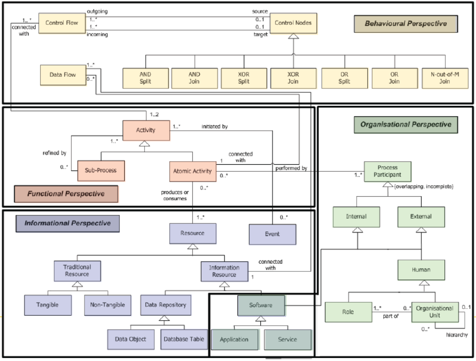
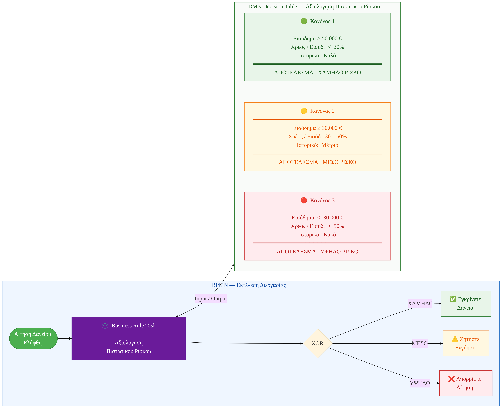
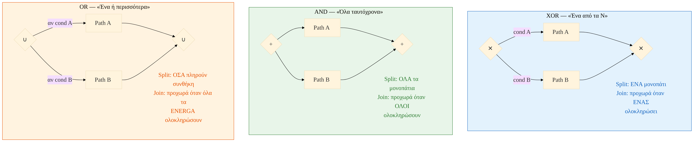
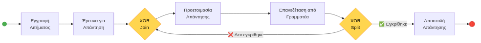
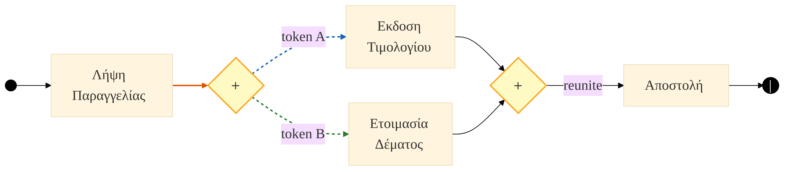
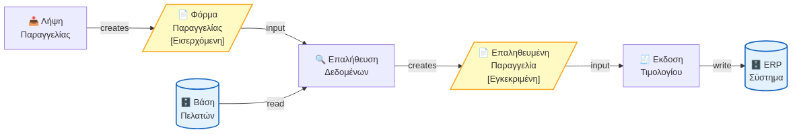
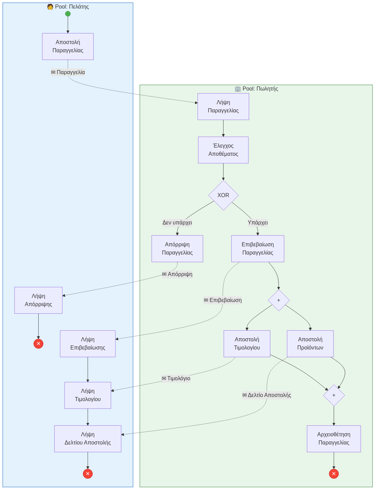
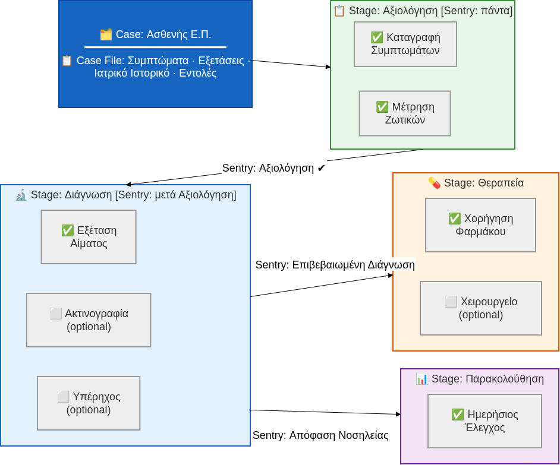
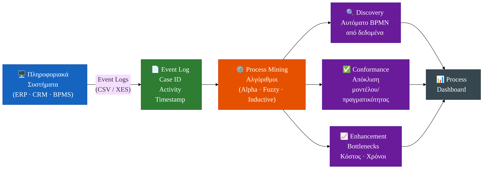

# Συστήματα Αποφάσεων, Διαχείριση Διεργασιών και Επιχειρηματική Ανάλυση
**Ενότητα 3: Διαχείριση Επιχειρησιακών Διεργασιών (BPM) & Μοντελοποίηση**
Πανεπιστήμιο Δυτικής Αττικής

**Διδάσκων:** Ανάργυρος Τσαδήμας (<tsadimas@uniwa.gr>)

<!--
Καλωσορίσατε στην 3η ενότητα του μαθήματος. Σήμερα θα εμβαθύνουμε στη Διαχείριση Επιχειρησιακών Διεργασιών (BPM), εστιάζοντας στις προχωρημένες έννοιες της μοντελοποίησης, το CMMN για αδόμητες διεργασίες και τη μετάβαση στην αυτοματοποίηση.
-->
---

<!-- _class: xxsmall -->
# Ενότητα 3 — Περίγραμμα

1. **Ανασκόπηση** — 4 Προοπτικές · Τι είναι Μοντέλο Διεργασίας · Σκοπός & Αποδέκτες
2. **BPMN 2.0 Εμβάθυνση** — Tasks · Events · Sub-processes · Gateways · Loop · Token · Δεδομένα · Message Flow
3. **Μεθοδολογία Σχεδιασμού** — 4 Φάσεις · Top-Down BPMN · Τεχνικές Συλλογής Πληροφοριών
4. **CMMN** — Φάσμα Διεργασιών · KIPs · Στοιχεία CMMN
5. **Από τη Μοντελοποίηση στην Αυτοματοποίηση** — Executable BPMN · Camunda · RPA
6. **Process Mining** — Event Logs · Conformance Checking
7. **Εργαστηριακός Οδηγός** — Signavio · Camunda.io
8. **Σύνοψη & Βιβλιογραφία**

<!--
Το σημερινό μας πρόγραμμα χωρίζεται σε θεωρητικό και πρακτικό κομμάτι. Θα ξεκινήσουμε με μια σύντομη υπενθύμιση, θα πάμε στα βαθιά του BPMN, θα γνωρίσουμε το CMMN, το Process Mining, και θα κλείσουμε με πρακτική εφαρμογή στο Signavio.
-->
---

<!-- _class: small -->

# 1. Ανασκόπηση από Ενότητα 2

**Βασικές Αρχές**
- **Λειτουργία (Function):** Κάθετη, ιεραρχική οργάνωση (π.χ. Τμήμα Πωλήσεων).
- **Διεργασία (Process):** Οριζόντια ροή αξίας που διαπερνά τμήματα για να εξυπηρετήσει τον πελάτη.
- **BPM Lifecycle:** Ο κύκλος συνεχούς βελτίωσης (As-Is → Analyze → To-Be → Implement → Monitor).

**BPMN 2.0 — Τα Θεμέλια**
- **Pools & Lanes:** Ποιος κάνει τι; (Οργανισμός & Ρόλος)
- **Events (Κύκλοι):** Τι συμβαίνει; (Start, Intermediate, End)
- **Activities (Ορθογώνια):** Η δουλειά που γίνεται.
- **Gateways (Ρόμβοι):** Οι αποφάσεις που διακλαδίζουν τη ροή.

> 💡 **Υπενθύμιση:** Το BPMN είναι η **κοινή γλώσσα** που γεφυρώνει το Business με το IT.

<!--
Ας θυμηθούμε τα βασικά από την προηγούμενη διάλεξη. Η ειδοποιός διαφορά είναι η στροφή από την κάθετη οργάνωση των τμημάτων (Silos) στην οριζόντια ροή αξίας. Το BPMN 2.0 μας δίνει τα βασικά εργαλεία (Pools, Events, Tasks, Gateways) για να οπτικοποιήσουμε αυτή τη ροή με τρόπο κατανοητό τόσο από τη διοίκηση όσο και από τους προγραμματιστές.
-->
---

<!-- _class: small -->

# 1.1 Τέσσερις Προοπτικές Μοντελοποίησης Διεργασιών

Κάθε επιχειρησιακή διεργασία μπορεί να αναλυθεί από **4 συμπληρωματικές οπτικές γωνίες**. Ένα ολοκληρωμένο μοντέλο καλύπτει και τις 4.

**1. Συμπεριφορική (Behavioural)** — *Πότε; Πώς;*
Εστιάζει στη **ροή ελέγχου**: ακολουθία βημάτων, γεγονότα, αποφάσεις.
→ Εργαλεία BPMN: Gateways, Sequence Flows, Events

**2. Λειτουργική (Functional)** — *Τι;*
Εστιάζει στις **δραστηριότητες** και τους μετασχηματισμούς δεδομένων.
→ Εργαλεία BPMN: Tasks, Sub-processes

**3. Πληροφοριακή (Informational)** — *Ποια δεδομένα;*
Εστιάζει στα **έγγραφα και αντικείμενα δεδομένων** που χρησιμοποιούνται ή παράγονται.
→ Εργαλεία BPMN: Data Objects, Data Stores

**4. Οργανωτική (Organisational)** — *Ποιος; Πού;*
Εστιάζει σε **ρόλους και τμήματα** — ποιος εκτελεί τι και πού.
→ Εργαλεία BPMN: Pools, Lanes, Ρόλοι

> 💡 Ένα σωστό BPMN διάγραμμα καλύπτει ταυτόχρονα: *τι* γίνεται (Functional), *πότε/πώς* (Behavioural), *από ποιον* (Organisational) και *με ποια δεδομένα* (Informational).

<!--
Οι 4 προοπτικές είναι σαν τις 4 πλευρές ενός τετραέδρου. Κάθε μια εστιάζει σε διαφορετική πτυχή της ίδιας πραγματικότητας. Ένα καλό μοντέλο καλύπτει και τις 4: δείχνει ΤΙ γίνεται, ΠΟΤΕ, ΑΠΟ ΠΟΙΟΝ και με ΠΟΙΑ ΔΕΔΟΜΕΝΑ.
-->

---

# 1.2 Το Μετα-μοντέλο (Metamodel) μιας Διεργασίας

<!--
Το μετα-μοντέλο δείχνει πώς συνδέονται οι βασικές έννοιες. Ένα μοντέλο διεργασίας αποτελείται από δραστηριότητες (Activities) οι οποίες εκτελούνται από ρόλους/πόρους (Resources) και χρησιμοποιούν ή παράγουν δεδομένα (Artifacts). Αυτό το εννοιολογικό σχήμα είναι η ραχοκοκαλιά κάθε προτύπου μοντελοποίησης, συμπεριλαμβανομένου του BPMN.
-->
---

<!-- _class: xsmall -->

# 1.3 Τι είναι ένα Μοντέλο Διεργασίας;

> _"A model is a representation of a thing or process used to describe or explain it"_ — Oxford Dictionary

| Ιδιότητα | Εξήγηση |
|---|---|
| **Απεικόνιση (Mapping)** | Αφαίρεση από τον πραγματικό κόσμο — αναπαράσταση επιλεγμένων πτυχών |
| **Αφαίρεση (Abstraction)** | Μόνο ό,τι είναι **σχετικό** με το σκοπό του μοντέλου — τα υπόλοιπα αγνοούνται |

**3 Βασικά Συστατικά Μοντέλου Διεργασίας**

| Συστατικό | Τι αποτυπώνει |
|---|---|
| **Ροή Ελέγχου (Control Flow)** | Τι γίνεται, πότε και με ποια σειρά |
| **Αντικείμενα (Artifacts)** | Με τι δουλεύουν — φυσικά ή ηλεκτρονικά |
| **Πόροι (Resources)** | Ποιος το κάνει — άνθρωποι ή λογισμικό |

**Επιπλέον Συστατικά:** Στόχοι (Goals), Κίνδυνοι (Risks), Πολιτικές/Κανόνες (Policies/Rules), Γνώση (Knowledge)

<!--
Κάθε μοντέλο είναι μια απλοποίηση της πραγματικότητας. Δεν στοχεύει να αναπαραστήσει τα πάντα — αλλά τα σχετικά. Τρία είναι τα βασικά συστατικά: τι γίνεται (control flow), με τι δουλεύουν (artifacts) και ποιος το κάνει (resources). Πολλές φορές προστίθενται και στόχοι, κίνδυνοι, κανόνες ή γνώση.
-->
---

<!-- _class: xsmall -->

# 1.4 Σκοπός Μοντελοποίησης & Ενδιαφερόμενα Μέρη

**Γιατί Μοντελοποιούμε;**

Τεκμηρίωση (As-Is) · Επικοινωνία μεταξύ τμημάτων · Προσομοίωση "what-if" · Benchmarking · Αυτοματοποίηση (Workflow) · Ανάπτυξη λογισμικού · Ενσωμάτωση & Testing

**Ποιος Ενδιαφέρεται;**

| Αποδέκτης | Χρήση |
|---|---|
| **Επιχειρησιακοί stakeholders** | KPIs, προσομοίωση, στρατηγική |
| **IT stakeholders** | Εκτελέσιμα μοντέλα, αυτοματοποίηση, τύποι δεδομένων |

**Δύο Βασικοί Ρόλοι Μοντελοποίησης**

| Ρόλος | Εξειδίκευση |
|---|---|
| **Process Analyst** | Δεξιότητες μοντελοποίησης, μεθοδολογία |
| **Domain Expert** | Γνώση διεργασίας, επιχειρησιακό πλαίσιο |

> ⚠️ Ο Analyst ξέρει *πώς* να μοντελοποιήσει — ο Expert ξέρει *τι* πρέπει να μοντελοποιηθεί.

<!--
Ο σκοπός καθορίζει ΤΙ θα συμπεριληφθεί στο μοντέλο. Ένα μοντέλο για documentation διαφέρει από ένα για automation. Και φυσικά, ο Process Analyst και ο Domain Expert έχουν συμπληρωματικές δεξιότητες — ούτε ο ένας ούτε ο άλλος από μόνος του μπορεί να φτιάξει ένα καλό μοντέλο.
-->
---

# 2. BPMN 2.0 — Εμβάθυνση

<!--
Ας περάσουμε τώρα στο κύριο μέρος της σημερινής μας διάλεξης, εμβαθύνοντας στις έννοιες του BPMN 2.0.
-->
---

<!-- _class: xsmall -->

# 2.1 Ονοματολογία BPMN: Κανόνες Ονομασίας

> 📐 **Τι είναι ένα μοντέλο;** Ένα μοντέλο είναι **αφαίρεση** — απεικονίζει μόνο ό,τι είναι σχετικό με **έναν συγκεκριμένο σκοπό** και **κοινό**. Το ίδιο process μπορεί να έχει διαφορετικά μοντέλα για IT-αρχιτέκτονα, διευθυντή και υπάλληλο.

Ένα συνεπές σύστημα ονομασίας κάνει τα διαγράμματα BPMN **άμεσα κατανοητά** από επιχειρηματικούς και τεχνικούς χρήστες.

**Activities (Tasks & Sub-processes)**
Χρησιμοποιούμε **[Ρήμα] + [Αντικείμενο]** — ενεργητική φωνή

- ✅ "Έλεγξε Πιστωτικό Ιστορικό"
- ✅ "Αποστολή Τιμολογίου"
- ❌ "Τιμολόγιο" — λείπει το ρήμα
- ❌ "Γίνεται Έλεγχος" — παθητική / ασαφές ποιος κάνει

**Events**
Χρησιμοποιούμε **[Αντικείμενο] + [Κατάσταση]** — παθητική φωνή

- ✅ "Παραγγελία Ελήφθη" *(Start Event)*
- ✅ "Πληρωμή Ολοκληρώθηκε" *(End Event)*
- ❌ "Ξεκινάμε" — ασαφές τι ξεκίνησε

**Όνομα Μοντέλου (Process)**
Χρησιμοποιούμε **[Ουσιαστικό] + [Επίθετο/Συμπλήρωμα]**

- ✅ "Εγγραφή Φοιτητή"
- ✅ "Διαχείριση Παραγγελίας"
- ❌ "Process 1" / "NewDiagram"

**Παράδειγμα (Εγγραφή Φοιτητή):**

| Στοιχείο | Λάθος | Σωστό |
|---|---|---|
| Activity | "Αίτηση" | "Υποβολή Αίτησης" |
| Start Event | "Αρχή" | "Αίτηση Ελήφθη" |
| End Event | "Τέλος" | "Εγγραφή Ολοκληρώθηκε" |

> 💡 **Κανόνας:** Activity = τι **γίνεται**, Event = τι **συνέβη**. Η διάκριση κάνει το διάγραμμα να "αφηγείται μια ιστορία" από αρχή ως τέλος.

<!--
Η ονοματολογία δεν είναι απλή τυπικότητα, είναι η ουσία της επικοινωνίας. Αν τα Tasks δεν έχουν ρήμα, κανείς δεν ξέρει ποια ακριβώς ενέργεια πρέπει να γίνει. Αν τα Events δεν είναι σε παθητική φωνή, μπερδεύονται με τα Tasks. Ένα καλό μοντέλο διαβάζεται σαν ιστορία.
-->
---

<!-- _class: xsmall -->

# 2.2 Τύποι Tasks: Πέρα από το Απλό "Task"

Το BPMN μας επιτρέπει να ορίσουμε **πώς ακριβώς** εκτελείται μια εργασία.

| Σύμβολο | Τύπος | Τι Σημαίνει | Παράδειγμα |
|---|---|---|---|
| 👤 | **User Task** | Εκτελείται από **άνθρωπο** με τη βοήθεια συστήματος | Υπάλληλος εγκρίνει αίτημα σε φόρμα |
| ⚙️ | **Service Task** | Εκτελείται **αυτόματα** από σύστημα (π.χ. κλήση API) | Σύστημα στέλνει αυτόματο email επιβεβαίωσης |
| 📜 | **Script Task** | Εκτελείται από τη μηχανή BPMN (π.χ. υπολογισμός) | Υπολογισμός τελικής τιμής με ΦΠΑ |
| ✋ | **Manual Task** | Εκτελείται από **άνθρωπο** χωρίς βοήθεια συστήματος | Υπάλληλος αρχειοθετεί φυσικά έγγραφα |
| ⚖️ | **Business Rule Task** | Η απόφαση λαμβάνεται από μια μηχανή κανόνων (DMN) | Αξιολόγηση πιστοληπτικού ρίσκου |

> 💡 Η σωστή χρήση των τύπων Task κάνει το διάγραμμα **εκτελέσιμο** από μια μηχανή BPMN.

<!--
Προχωρώντας, βλέπουμε ότι ένα Task δεν είναι απλά ένα κουτάκι. Ανάλογα με το εικονίδιο πάνω αριστερά, δηλώνουμε στη μηχανή εκτέλεσης πώς θα γίνει η δουλειά. Ένα Service Task για παράδειγμα θα κληθεί μέσω κάποιου API, ενώ ένα User Task θα περιμένει άνθρωπο να πατήσει ένα κουμπί σε μια οθόνη.
-->
---

<!-- _class: small -->

# 2.2.1 DMN — Decision Model and Notation

Το **Business Rule Task** παραπέμπει σε μια μηχανή κανόνων. Το πρότυπο που ορίζει πώς γράφεται η λογική αυτών των κανόνων ονομάζεται **DMN (OMG DMN 1.5)**.

**Τι είναι το DMN;**
- Συμπλήρωμα του BPMN: το BPMN περιγράφει **τη ροή**, το DMN περιγράφει **την απόφαση** σε κάθε κόμβο.
- Η απόφαση εκφράζεται ως **Decision Table** — ένας πίνακας με συνθήκες εισόδου και αποτέλεσμα.
- Υποστηρίζεται από εργαλεία: Camunda Modeler, Signavio, Drools.

**Πότε χρησιμοποιείται;**
Όταν η λογική μιας απόφασης είναι **σύνθετη, αλλάξιμη ή ελέγξιμη** — π.χ. τιμολόγηση, πιστωτικός έλεγχος, κανονιστική συμμόρφωση.

**Παράδειγμα — Αξιολόγηση Πιστωτικού Ρίσκου:**

| Εισόδημα | Χρέος/Εισόδημα | Ιστορικό | Αποτέλεσμα |
|---|---|---|---|
| ≥ 50.000€ | < 30% | Καλό | **ΧΑΜΗΛΟ** |
| ≥ 30.000€ | 30–50% | Μέτριο | **ΜΕΣΟ** |
| < 30.000€ | > 50% | Κακό | **ΥΨΗΛΟ** |

<!--
Το DMN είναι το "αδερφάκι" του BPMN. Όταν έχουμε περίπλοκη λογική που αλλάζει συχνά (π.χ. τιμολογιακή πολιτική ή όρους δανείων), δεν βάζουμε δεκάδες IF-THEN Gateways στο BPMN. Αντίθετα, χρησιμοποιούμε ένα Business Rule Task που καλεί έναν πίνακα DMN, διατηρώντας το διάγραμμα μας καθαρό. Αξίζει να σημειωθεί ότι κατά την προσομοίωση (Simulation) στο εργαστήριο, η μηχανή δεν αξιολογεί πραγματικούς κανόνες DMN. Το αποτέλεσμα της απόφασης το προσομοιώνουμε βάζοντας απλώς στατιστικές πιθανότητες στο Gateway που ακολουθεί αμέσως μετά!
-->
---

<!-- _class: diagram-sm -->

# 2.2.1 DMN — Παράδειγμα: Αξιολόγηση Πιστωτικού Ρίσκου

> **Σύνδεση:** Το Business Rule Task (§2.2) καλεί τη μηχανή DMN → η μηχανή αξιολογεί τον πίνακα → επιστρέφει αποτέλεσμα στη ροή BPMN.

<!--
Εδώ βλέπετε πώς φαίνεται ένας πραγματικός DMN πίνακας σε ένα εργαλείο μοντελοποίησης. Οι μπλε στήλες είναι οι είσοδοι (συνθήκες) και η γκρι/πορτοκαλί στήλη είναι η έξοδος (η απόφαση). Κάθε γραμμή είναι κι ένας κανόνας.
-->
---

<!-- _class: xsmall -->

# 2.3 Τύποι Events: Τι Πυροδοτεί τη Διεργασία;

Τα Events δεν είναι μόνο "Start" και "End". Μπορούν να αντιδρούν σε συγκεκριμένα ερεθίσματα.

| Σύμβολο | Τύπος | Τι Σημαίνει | Παράδειγμα |
|---|---|---|---|
| 🕒 | **Timer Event** | Πυροδοτείται όταν περάσει συγκεκριμένος χρόνος | "Αν ο πελάτης δεν πληρώσει σε 3 ημέρες, στείλε υπενθύμιση" |
| ✉️ | **Message Event** | Πυροδοτείται από την άφιξη ενός μηνύματος (π.χ. email, API call) | "Όταν έρθει η παραγγελία από το e-shop, ξεκίνα τη διαδικασία" |
| 📝 | **Conditional Event** | Πυροδοτείται όταν μια συνθήκη γίνει αληθής | "Όταν το απόθεμα πέσει κάτω από 10, δημιούργησε παραγγελία" |
| 📡 | **Signal Event** | "Broadcast" σε πολλαπλές διεργασίες ταυτόχρονα | "Η κεντρική αποθήκη έκλεισε" → όλες οι παραγγελίες παγώνουν |
| ⚡ | **Error Event** | Διαχειρίζεται εξαιρέσεις και σφάλματα στη ροή | "Αν η πληρωμή αποτύχει, πήγαινε σε βήμα επανελέγχου" |

<!--
Τα Events δίνουν ζωή και αντιδραστικότητα στη διεργασία μας. Για παράδειγμα, τα Timer Events είναι κρίσιμα για τα SLAs. Αν μια έγκριση δεν γίνει σε 3 μέρες, το Timer Event μπορεί να πυροδοτήσει μια διαδικασία κλιμάκωσης (escalation) στον διευθυντή. Πρακτικό tip: Κατά την προσομοίωση, σε αντίθεση με τα Tasks που χρησιμοποιούν "Wait Time", η καθυστέρηση στα Timer Events ορίζεται απευθείας στα κύρια χαρακτηριστικά τους (Time duration), καθορίζοντας την ακριβή περίοδο αναμονής.
-->
---

<!-- _class: small -->

# 2.4 Sub-processes: Διαχείριση Πολυπλοκότητας

Όταν μια διεργασία γίνεται πολύ μεγάλη, χρησιμοποιούμε **υπο-διεργασίες (sub-processes)** για να την "σπάσουμε" σε διαχειρίσιμα κομμάτια.

**Collapsed Sub-process (Συμπτυγμένη)**
- Ένα Task με ένα **[+]** στο κάτω μέρος.
- Κρύβει τη λεπτομέρεια. Κάνοντας κλικ, ανοίγει ένα νέο, ξεχωριστό διάγραμμα.
- **Χρήση:** Για να απλοποιήσουμε το κυρίως διάγραμμα.

**Expanded Sub-process (Ανεπτυγμένη)**
- Ένα μεγάλο, στρογγυλεμένο ορθογώνιο που περιέχει άλλα στοιχεία BPMN.
- Η λεπτομέρεια είναι **ορατή** μέσα στο κυρίως διάγραμμα.
- **Χρήση:** Για να ομαδοποιήσουμε λογικά σχετικά βήματα.

> 💡 Και οι δύο τύποι βοηθούν στην **ιεραρχική μοντελοποίηση**, κάνοντας τα μεγάλα διαγράμματα πιο ευανάγνωστα.

<!--
Όταν το διάγραμμα σας αρχίζει να μοιάζει με "μακαρονάδα", ήρθε η ώρα για Sub-processes. Η συμπτυγμένη μορφή είναι εξαιρετική για παρουσιάσεις σε C-level στελέχη που θέλουν μόνο τη μεγάλη εικόνα, ενώ η ανεπτυγμένη μορφή βοηθά τους αναλυτές να βλέπουν τη λεπτομέρεια επιτόπου.
-->
---

<!-- _class: xsmall -->

# 2.5 Gateways: Τυπική Σημασιολογία (Split & Join)

Κάθε gateway έχει δύο ρόλους: **split** (διαχωρισμός ροής) και **join** (επανένωση ροής).

| Τύπος | **Split** | **Join** | Σύμβολο |
|---|---|---|---|
| **XOR (Exclusive)** | Ακριβώς **ΕΝΑ** εξερχόμενο μονοπάτι (συνθήκη) | Προχωρά όταν **ΕΝΑ** εισερχόμενο ολοκληρωθεί | ✕ |
| **AND (Parallel)** | **ΟΛΑ** τα εξερχόμενα μονοπάτια ταυτόχρονα | Περιμένει να ολοκληρωθούν **ΟΛΑ** τα εισερχόμενα | + |
| **OR (Inclusive)** | **Ένα ή περισσότερα** μονοπάτια (όσα πληρούν συνθήκη) | Περιμένει τα **ενεργά** εισερχόμενα (synchronizing merge) | ∪ |
| **Event-Based** | Το μονοπάτι καθορίζεται από **ποιο γεγονός θα συμβεί πρώτο** | — | ⬡ |

> ⚠️ Στο BPMN 2.0 ο ρόμβος με **κύκλο** (Ο) συμβολίζει το OR (Inclusive). Τα Gateways Split πρέπει να έχουν όνομα ερώτησης — τα Join μένουν ανώνυμα.

**Ποιον Join να χρησιμοποιήσω; (Πρακτικός Κανόνας)**

1. **XOR-join** — προχωρά όταν ΕΝΑ εισερχόμενο ολοκληρωθεί. Χρησιμοποίησε το αν το μοντέλο είναι σωστό.
2. **AND-join** — προχωρά όταν ΟΛΑ ολοκληρωθούν.
3. **OR-join** — πάντα ορθό, αλλά πολυπλοκότερο.

<!--
Τα Gateways αποτελούν κρίσιμα σημεία απόφασης στη ροή. Το πιο συχνό λάθος είναι η σύγχυση μεταξύ XOR και OR.
-->
---

<!-- _class: xsmall -->

# 2.5 Gateways — Παραδείγματα OR & Event-Based

**OR-split — Διανομή Παραγγελίας**

Εταιρεία με 2 αποθήκες. Ανάλογα με το προϊόν, ίσως χρειαστεί η αποθήκη Α, ή η Β, ή **και οι δύο**. Ούτε XOR (αμοιβαία αποκλειστικό) ούτε AND (πάντα και οι δύο) δεν αρκεί → **OR-split**.

**Event-Based Gateway — Αναμονή Απάντησης**

Μετά την αποστολή προσφοράς, περιμένουμε:
- Ή την **αποδοχή** του πελάτη *(Message Event)*
- Ή την **παρέλευση 7 ημερών** *(Timer Event)*

Όποιο συμβεί πρώτο καθορίζει την επόμενη κίνηση. Η απόφαση δεν βασίζεται σε δεδομένα αλλά σε **ποιο εξωτερικό γεγονός θα συμβεί πρώτο**.

> 💡 Το Event-Based Gateway εισάγει **ασύγχρονη λογική** — κατάλληλο για διεργασίες που "περιμένουν" εξωτερική ανταπόκριση.

<!--
Ιδιαίτερη προσοχή χρειάζεται στο Event-Based Gateway: εδώ η απόφαση δεν λαμβάνεται βάσει δεδομένων, αλλά περιμένουμε να δούμε ποιο εξωτερικό γεγονός θα συμβεί πρώτο, εισάγοντας έτσι ασύγχρονη λογική.
-->
---

<!-- _class: diagram -->

# 2.5 Gateways — Σύγκριση: XOR / AND / OR

<!--
Σε αυτό το διάγραμμα βλέπουμε ξεκάθαρα τη διαφορά συμπεριφοράς τους. Στο XOR το token ακολουθεί μόνο ένα δρόμο. Στο AND το token πολλαπλασιάζεται σε όλα τα μονοπάτια και πρέπει να περιμένει στο Join για να επανενωθεί. Το OR ενεργοποιεί όσα μονοπάτια ικανοποιούν τη συνθήκη και συγχρονίζει τα ενεργά tokens κατά την επανένωση. Μια καλή πρακτική στα XOR Gateways με πολλές εξόδους είναι να ορίζουμε το ένα βέλος ως προεπιλεγμένη ροή (Default Flow), ώστε το token να μην "κολλήσει" αν δεν ικανοποιείται καμία συνθήκη.
-->
---

<!-- _class: small -->

# 2.5.1 Μοντελοποίηση Επανάληψης (Loop / Iteration)

Πολλές διεργασίες επαναλαμβάνουν ένα βήμα μέχρι να ικανοποιηθεί κάποια συνθήκη. Το BPMN μοντελοποιεί αυτό με **XOR-join** ως **σημείο εισόδου** βρόγχου και **XOR-split** ως **σημείο εξόδου**.

**Πώς λειτουργεί ο βρόγχος:**
1. **XOR-join** (entry): συγκεντρώνει ροή από την αρχή ΚΑΙ από την επανάληψη
2. Εκτελούνται τα tasks του βρόγχου
3. **XOR-split** (exit): αν συνθήκη ΝΑΙ → επιστροφή στο XOR-join · αν ΟΧΙ → συνέχεια

**Παράδειγμα: Διαχείριση Αλληλογραφίας Υπουργείου**

> Ο υπάλληλος **προετοιμάζει απάντηση** και ο γραμματέας **την επανεξετάζει**. Αν δεν εγκριθεί, ο βρόγχος επαναλαμβάνεται. Τελειώνει μόνο όταν η απάντηση **εγκριθεί**.

<!--
Στο BPMN δεν έχουμε έτοιμο σύμβολο "for loop" όπως στον προγραμματισμό. Επομένως, για να μοντελοποιήσουμε επαναλήψεις, δημιουργούμε έναν βρόγχο με Gateways. Το πρώτο Gateway (Join) λειτουργεί ως σημείο επανεισόδου και το δεύτερο (Split) ως συνθήκη εξόδου από τον βρόγχο. Είναι εξαιρετικά κρίσιμο να προβλέπετε πάντα μια σαφή "βαλβίδα διαφυγής" (π.χ. ακύρωση μετά από 15 μέρες) στο Split εξόδου. Χωρίς αυτή, διακινδυνεύετε τη δημιουργία ενός άπειρου βρόγχου (infinite loop) που θα εγκλωβίσει τη διεργασία σας.
-->
---

<!-- _class: diagram-sm -->

# 2.5.1 Παράδειγμα: Αλληλογραφία Υπουργείου

> ⚠️ **Σημαντικό:** Το τέλος κάθε επαναληπτικού μπλοκ **πρέπει** να είναι σημείο απόφασης (XOR-split). Χωρίς αυτό, η διεργασία δεν έχει σαφή έξοδο.

<!--
Δείτε οπτικά το παράδειγμα. Ο υπάλληλος και ο γραμματέας βρίσκονται σε μια λούπα. Ο ρόμβος στα δεξιά κρίνει αν το έγγραφο είναι οκ. Αν όχι, το βελάκι επιστρέφει στον ρόμβο αριστερά. Είναι κρίσιμο να χρησιμοποιήσετε XOR Join αριστερά, όχι απλή συνένωση γραμμών.
-->
---

<!-- _class: small -->

# 2.6 Token & Process Instance: Μοντέλο vs. Εκτέλεση

Υπάρχει κρίσιμη διάκριση μεταξύ του **ορισμού (design-time)** μιας διεργασίας και της **εκτέλεσής (run-time)** της.

**1. Process Definition (Μοντέλο)**
- Το BPMN διάγραμμα: ο **γενικός χάρτης / ορισμός**.
- Ορίζεται **μία φορά**, αλλά εκτελείται πολλές.
- 🎂 *Αναλογία:* Η **συνταγή** για ένα κέικ ή το αρχιτεκτονικό **σχέδιο** ενός σπιτιού.

**2. Process Instance (Στιγμιότυπο Εκτέλεσης)**
- Η "ζωντανή" εκτέλεση της διεργασίας για **μία συγκεκριμένη περίπτωση**.
- Έχει τα δικά της δεδομένα (π.χ. Παραγγελία #105), κατάσταση και ιστορικό.
- 🍰 *Αναλογία:* Το **συγκεκριμένο κέικ** που μόλις βγήκε από τον φούρνο.

**3. Token (Μάρκα / Σήμα Εκτέλεσης)**
- Εννοιολογικό "πιόνι" που δείχνει **πού ακριβώς** βρισκόμαστε στον χάρτη.
- Ξεκινά από το **Start Event**, "ταξιδεύει" στα βέλη και καταστρέφεται στο **End Event**.
- Σε **Parallel (AND):** το token *κλωνοποιείται* σε πολλά, που πρέπει να **επανενωθούν**.
- Σε **Exclusive (XOR):** το token ακολουθεί *αυστηρά ένα* μονοπάτι.

> 🏎️ **Παράδειγμα:** Αν έχουμε 200 παραγγελίες σήμερα, έχουμε 200 instances = 200 "αυτοκίνητα" (tokens) που κινούνται **ταυτόχρονα** στον ίδιο χάρτη!

<!--
Αυτή η έννοια είναι θεμελιώδης για να καταλάβετε πώς "τρέχουν" τα BPMS (όπως η Camunda). 
Φανταστείτε το BPMN μοντέλο σαν τον χάρτη μιας πόλης. Ο χάρτης σχεδιάζεται μία φορά (Process Definition). Όταν όμως ένας πελάτης κάνει μια νέα παραγγελία, δημιουργείται ένα "αυτοκίνητο" που αρχίζει να διασχίζει τους δρόμους αυτού του χάρτη. Η συγκεκριμένη διαδρομή του είναι το Process Instance. Το ίδιο το αυτοκίνητο —που μας δείχνει σε ποιο φανάρι ή ποιο στενό βρισκόμαστε ακριβώς— είναι το Token!
Κάθε token κουβαλάει "στο πορτ-μπαγκάζ του" τα δεδομένα της συγκεκριμένης περίπτωσης (π.χ. "Παραγγελία Πελάτη Γιώργου"). Σε μια στιγμή, χιλιάδες tokens μπορεί να βρίσκονται σε διαφορετικά Tasks του ίδιου διαγράμματος ταυτόχρονα. Στα σταυροδρόμια (Gateways), το token είτε διαλέγει αυστηρά μία κατεύθυνση (XOR), είτε "κλωνοποιείται" και πάει ταυτόχρονα σε πολλούς δρόμους (AND), περιμένοντας να ενωθεί ξανά στο τέλος!
-->
---

<!-- _class: diagram-sm -->

# 2.6 Παράδειγμα: Token σε Parallel Gateway (AND)

> Στο **AND Split** ένα token γίνεται δύο (πορτοκαλί / μπλε). Και τα δύο πρέπει να φτάσουν στο **AND Join** πριν παραχθεί το επόμενο ενιαίο token. Αν ένα καθυστερήσει, το άλλο **περιμένει**.

<!--
Το AND Gateway κλωνοποιεί τα tokens. Αν η ροή της διεργασίας πρέπει να συνεχιστεί, το AND-Split πρέπει να συναντά ένα AND-Join για να συγχρονιστούν τα tokens. Αν δεν το βάλετε, τα διπλά tokens θα συνεχίσουν ανεξέλεγκτα και θα εκτελέσουν τα επόμενα κοινά Tasks πολλαπλές φορές. Προσοχή όμως στο σφάλμα "Deadlock": όταν χρησιμοποιείτε AND-Join, πρέπει να είστε σίγουροι ότι τα tokens από όλους τους κλάδους θα φτάσουν τελικά εκεί. Αν κάποιο μονοπάτι μπορεί να τερματίσει πρόωρα (π.χ. σε μια ακύρωση), το άλλο token θα περιμένει στο AND-Join αιώνια! Σε τέτοια σενάρια με πιθανό πρόωρο τερματισμό, παρακάμπτουμε τον κανόνα και αφήνουμε τους κλάδους να τερματίσουν εντελώς ανεξάρτητα σε ξεχωριστά End Events.
-->
---

<!-- _class: xsmall -->

# 2.7 Δεδομένα στο BPMN: Data Objects & Data Stores

Πέρα από τη **ροή ελέγχου**, το BPMN μπορεί να αναπαραστήσει και τη **ροή δεδομένων**.

| Στοιχείο | Συμβολισμός | Τι Αναπαριστά | Παράδειγμα |
|---|---|---|---|
| **Data Object** | Σελίδα με διπλωμένη γωνία | Δεδομένα που δημιουργούνται/χρησιμοποιούνται από Task | "Τιμολόγιο [Εκκρεμές]" |
| **Data Store** | Κύλινδρος | Μόνιμη αποθήκη (βάση δεδομένων, αρχείο) | "Βάση Πελατών (ERP)" |
| **Data Association** | Διακεκομμένο βέλος (→) | Σύνδεση Task ↔ Δεδομένα | Task "Καταχώρηση" → Data Store "ERP" |

**Data Object vs. Data Store**

- **Data Object:** Προσωρινό — υπάρχει μόνο κατά την εκτέλεση του instance (π.χ. το PDF τιμολόγιο που παράγεται).
- **Data Store:** Μόνιμο — ανεξάρτητο από το instance (π.χ. το σύστημα ERP).

<!--
Τα δεδομένα είναι το "αίμα" της διεργασίας.
-->
---

<!-- _class: xsmall -->

# 2.7 Κατάσταση Data Object (State)

Ένα Data Object μπορεί να έχει **κατάσταση** — ορίζεται μέσα σε αγκύλες `[ ]` δίπλα στο όνομά του και δείχνει πού βρίσκεται ένα έγγραφο στον κύκλο ζωής του.

| Παράδειγμα | Σημασία |
|---|---|
| `Παραγγελία [εκκρεμής]` | Δημιουργήθηκε, δεν επεξεργάστηκε |
| `Παραγγελία [επιβεβαιωμένη]` | Εγκρίθηκε από τον πωλητή |
| `Τιμολόγιο [εκδοθέν]` | Εστάλη στον πελάτη |

**Πότε να χρησιμοποιείς Data Objects & Stores;**

- Για να δείξεις ποια **έγγραφα/δεδομένα** απαιτούνται ή παράγονται.
- Όταν η **μεταφορά πληροφορίας** μεταξύ τμημάτων είναι κρίσιμη.
- Σε **εκτελέσιμα** μοντέλα όπου η μηχανή BPMN διαχειρίζεται μεταβλητές.

<!--
Η κατάσταση Data Object (State) μας δείχνει πού βρίσκεται ένα έγγραφο στον κύκλο ζωής του. Για παράδειγμα η Παραγγελία αρχίζει ως [εκκρεμής], γίνεται [επιβεβαιωμένη] μετά τον έλεγχο, και τελικά [παραδοθείσα] στο τέλος.
-->
---

<!-- _class: diagram-sm -->

# 2.7 Παράδειγμα: Ροή Δεδομένων — Επεξεργασία Παραγγελίας

> **Data Object** (χαρτί με γωνία): προσωρινό — ζει μόνο κατά το instance. **Data Store** (κύλινδρος): μόνιμο — ανεξάρτητο από το instance.

<!--
Στο διάγραμμα αυτό φαίνεται ξεκάθαρα πώς το Τιμολόγιο, που είναι Data Object, παράγεται και μετά αποθηκεύεται μόνιμα στο Data Store (ERP). Έτσι ο ΙΤ αρχιτέκτονας καταλαβαίνει πότε και πού πρέπει να γράψει κώδικα για αποθήκευση δεδομένων.
-->
---

<!-- _class: xsmall -->

# 2.7.1 Data Association: Κατεύθυνση & Επίδραση στο Token

**Κατεύθυνση Data Association**

| Σύνδεση | Σημασία |
|---|---|
| Data Object **→** Task | Input: το task χρειάζεται το αντικείμενο |
| Task **→** Data Object | Output: το task παράγει/ενημερώνει το αντικείμενο |
| Και τα δύο | Read/Write: το task διαβάζει και ενημερώνει |

**Blocking από Input Data Object**

Ακόμη κι αν ένα **token** φτάσει στο task, η εκτέλεση δεν ξεκινά αν το απαιτούμενο input data object **δεν είναι διαθέσιμο**. Λειτουργεί ως άτυπη προϋπόθεση εκτέλεσης.

**Shorthand Συμβολισμός**

Το data object μπορεί να τοποθετηθεί **πάνω στη ροή ακολουθίας** μεταξύ δύο διαδοχικών tasks — σύντομος τρόπος να δειχτεί ότι παράγεται από το πρώτο task και καταναλώνεται από το επόμενο.

**Πότε να χρησιμοποιείτε Data Associations**

- Μόνο όταν η ύπαρξη ή κατάσταση δεδομένων **έχει επιχειρηματική σημασία**
- Αποφύγετε την υπερβολική χρήση — **αυξάνει την πολυπλοκότητα** του διαγράμματος
- Προτιμήστε τα για δεδομένα που μεταφέρονται μεταξύ **διαφορετικών lanes ή pools**

<!--
Εδώ βλέπουμε πώς τα Data Objects μπορούν να επηρεάσουν την ίδια την εκτέλεση (Token). Αν ένα Task έχει ως "Input" ένα Data Object, η μηχανή δεν θα ξεκινήσει το Task αν το έγγραφο δεν είναι έτοιμο. Ωστόσο, η υπερβολική χρήση data objects γεμίζει το διάγραμμα. Ο χρυσός κανόνας: βάλτε τα μόνο όταν μεταφέρεται πληροφορία από το ένα τμήμα στο άλλο.
-->
---

<!-- _class: small -->

# 2.7.2 Text Annotations: Σχολιασμός Διαγράμματος

**Τι είναι**

Το **Text Annotation** είναι ένα ανοιχτό ορθογώνιο ([ σχήμα) που συνδέεται με **διακεκομμένη γραμμή σύνδεσης** (association) με οποιοδήποτε στοιχείο του διαγράμματος.

**Σημαντική Διαφορά από Data Association**

Το Text Annotation **δεν επηρεάζει** τη ροή token και δεν έχει σημασιολογική επίδραση στην εκτέλεση της διαδικασίας. Είναι αμιγώς **επεξηγηματικό**.

**Πότε να το χρησιμοποιείτε**

- Διευκρίνιση **επιχειρηματικών κανόνων** που δεν αποτυπώνονται στη ροή
- Αναφορά **συμπεριλαμβανόμενων βημάτων** μέσα σε ένα task
- Επισήμανση **εξαιρέσεων** ή ιδιαίτερων συνθηκών

**Παραδείγματα**

| Στοιχείο | Annotation |
|---|---|
| Task "Συσκευασία" | _"Περιλαμβάνει έλεγχο ποιότητας"_ |
| Task "Τιμολόγηση" | _"Μόνο για εκκρεμή τιμολόγια"_ |
| Gateway | _"Βάσει SLA 48 ωρών"_ |

<!--
Τα Text Annotations είναι τα "σχόλια" του κώδικα στο BPMN. Σε αντίθεση με τα Data Objects, τα annotations είναι 100% αόρατα στη μηχανή εκτέλεσης (BPMS). Δεν μπλοκάρουν κανένα token. Είναι εκεί αποκλειστικά για να βοηθήσουν τον άνθρωπο που διαβάζει το διάγραμμα να καταλάβει τους επιχειρησιακούς κανόνες ή εξαιρέσεις που δεν μπορούν να σχεδιαστούν.
-->
---

<!-- _class: xsmall -->

# 2.8 Message Flow: Επικοινωνία μεταξύ Οργανισμών

Μέχρι τώρα μοντελοποιούσαμε **εσωτερικές** διεργασίες (ένας οργανισμός). Το BPMN επιτρέπει να δείχνουμε και την **ανταλλαγή μηνυμάτων μεταξύ δύο ή περισσότερων οργανισμών** με Pools και Message Flows.

**Βασικές Έννοιες**

| Έννοια | Ορισμός |
|---|---|
| **Pool** | Αναπαριστά ένα **resource class** — συνήθως έναν οργανισμό ή επιχειρηματικό μέρος |
| **Lane** | Υπο-κατηγορία Pool (τμήμα, ρόλος, σύστημα) |
| **Message Flow** | Ροή πληροφορίας **μεταξύ** δύο Pools (διακεκομμένο βέλος ✉) |

**Κανόνες Σύνταξης (3 Βασικοί)**

| # | Κανόνας |
|---|---|
| 1 | **Sequence Flow** δεν διασχίζει τα όρια Pool (παραμένει εντός) |
| 2 | **Message Flow** δεν συνδέει στοιχεία *εντός* του ίδιου Pool |
| 3 | Και τα δύο **επιτρέπεται** να διασχίζουν τα όρια Lane |

> **Message Start Event:** Όταν ένα Pool ξεκινά αντιδρώντας σε μήνυμα από άλλο Pool, το Start Event φέρει το σύμβολο φακέλου ✉ (Message Start Event) — όχι απλό κύκλο.

**Παράδειγμα: Order-to-Cash (Πελάτης ↔ Πωλητής)**

Ο πελάτης στέλνει παραγγελία. Ο πωλητής ελέγχει απόθεμα:
- Αν δεν υπάρχει → στέλνει **απόρριψη**
- Αν υπάρχει → στέλνει **επιβεβαίωση**, έπειτα **τιμολόγιο** και **δελτίο αποστολής** παράλληλα (AND-split)

<!--
Μέχρι τώρα κοιτούσαμε μόνο το "εσωτερικό" μας. Με το Message Flow μπορούμε να δούμε πώς επικοινωνούμε με εξωτερικούς φορείς, όπως πελάτες ή προμηθευτές. Είναι σημαντικό να θυμόμαστε τον κανόνα: Sequence Flow εντός της πισίνας, Message Flow μεταξύ διαφορετικών πισινών. Ποτέ το αντίστροφο! Ένα πολύ συχνό συντακτικό λάθος είναι να βάζουμε τα βελάκια των μηνυμάτων μέσα στο εσωτερικό ενός Black-Box Pool (όπως του Πελάτη). Το εσωτερικό του είναι αόρατο, επομένως τα Message Flows πρέπει να ακουμπούν αυστηρά μόνο στο εξωτερικό του περίγραμμα (boundary).
-->
---

<!-- _class: diagram-sm -->

# 2.8 Παράδειγμα: Order-to-Cash — Πελάτης ↔ Πωλητής

> ✉ Τα διακεκομμένα βέλη = **Message Flows**. Η εσωτερική ακολουθία κάθε Pool παραμένει **Sequence Flow** (συνεχής γραμμή).

<!--
Δείτε πώς ο Πελάτης (πάνω Pool) και ο Πωλητής (κάτω Pool) επικοινωνούν. Το BPMN δεν μας επιτρέπει να δούμε τις εσωτερικές διεργασίες του Πελάτη (γι' αυτό είναι συχνά "Black Box" Pool), αλλά βλέπουμε ξεκάθαρα τα μηνύματα (παραγγελία, τιμολόγιο) που ανταλλάσσονται.
-->
---

<!-- _class: xsmall -->

# 3. Μεθοδολογία Σχεδιασμού Διεργασιών

**4 Φάσεις Σχεδιασμού**

1. **Ορισμός πλαισίου** — ποιος, τι, γιατί, πού, πότε
2. **Συλλογή πληροφοριών** — συνεντεύξεις, έγγραφα, παρατήρηση
3. **Εκτέλεση μοντελοποίησης** — δημιουργία του μοντέλου
4. **Διασφάλιση ποιότητας** — επαλήθευση (verification) και επικύρωση (validation)

**5 Βήματα Top-Down Σχεδιασμού BPMN**

1. **Καθορισμός πεδίου εφαρμογής** (Scope)
2. **High-level χάρτης** διεργασιών
3. **Top-level διάγραμμα** — ένας pool, βασική ροή
4. **Επέκταση σε child-level** — sub-processes / refinements
5. **Ορισμός Message Flows** μεταξύ pools

> 💡 Πάντα από το **γενικό στο ειδικό** — το scope πρώτα, οι λεπτομέρειες μετά.

<!--
Η μεθοδολογία μας προστατεύει από τη συνήθη παγίδα: να ξεκινάμε να ζωγραφίζουμε χωρίς να έχουμε κατανοήσει πρώτα το σκοπό και το πλαίσιο. Η φάση 1 (πλαίσιο) και η φάση 4 (ποιότητα) συχνά παραλείπονται — και αυτό οδηγεί σε μοντέλα που κανείς δεν εμπιστεύεται.
-->
---

<!-- _class: xsmall -->

# 3.1 Τεχνικές Συλλογής Πληροφοριών Διεργασίας

| Κατηγορία | Τεχνική | Περιγραφή |
|---|---|---|
| **Παραδοσιακές** | Ανάλυση Εγγράφων | Μελέτη υφιστάμενης τεκμηρίωσης |
| | Συνεντεύξεις | 1-1 με domain experts |
| | Ερωτηματολόγια | Συλλογή δεδομένων σε κλίμακα |
| **Συνεργατικές** | Focus Groups | Ομαδική συζήτηση με stakeholders |
| | JAD Sessions | Joint Application Development |
| | Participatory Design | Χρήστες ως συν-σχεδιαστές |
| **Πλαισιακές** | Participant Observation | Ο αναλυτής παρατηρεί on-site |
| **Αυτοματοποιημένες** | **Process Mining** | Εξαγωγή μοντέλου από event logs |

> ⚙️ Το **Process Mining** εξάγει αυτόματα το πραγματικό μοντέλο από τα δεδομένα — αντίθετα από τις άλλες τεχνικές που βασίζονται σε ανθρώπινη γνώση.

<!--
Κάθε τεχνική έχει τα πλεονεκτήματα και μειονεκτήματά της. Στην πράξη χρησιμοποιούμε συνδυασμό — π.χ. αρχικά ανάλυση εγγράφων, μετά συνεντεύξεις, και επαλήθευση με process mining αν υπάρχουν διαθέσιμα logs.
-->
---

<!-- _class: xsmall -->

# 3.2 Συνεντεύξεις: Η Βασική Τεχνική

Η **συνέντευξη** είναι η πιο διαδεδομένη τεχνική — ο αναλυτής μιλά 1-1 με έναν ή περισσότερους domain experts για να κατανοήσει την τρέχουσα ή επιθυμητή διεργασία.

**Πριν τη συνέντευξη**
- Μελέτη διαθέσιμης τεκμηρίωσης (έντυπα, πολιτικές, οργανογράμματα)
- Προετοιμασία ερωτήσεων — ανοιχτές ("Πώς γίνεται αυτό;") αντί κλειστών ("Γίνεται αυτό;")
- Ορισμός σκοπού και χρονικού πλαισίου

**Κατά τη διάρκεια**
- Ακολουθήστε τη ροή του interviewee — μην διακόπτετε
- Ζητήστε **παραδείγματα** και **εξαιρέσεις** ("Τι γίνεται αν…;")
- Καταγράψτε τόσο τον κανονικό κύκλο (happy path) όσο και τα alternative paths

**Μετά τη συνέντευξη**
- Σύνταξη πρώτου draft διαγράμματος
- **Επαλήθευση με τον interviewee** — ο expert επιβεβαιώνει αν το μοντέλο αντικατοπτρίζει την πραγματικότητα

<!--
Η πιο συχνή παγίδα: ο αναλυτής δημιουργεί το μοντέλο μόνος και ποτέ δεν το επαληθεύει. Χωρίς επαλήθευση, το μοντέλο απεικονίζει αυτό που νομίζουμε ότι γίνεται — όχι αυτό που πραγματικά γίνεται.
-->
---

<!-- _class: xsmall -->

# 3.3 Ροή Συλλογής Πληροφοριών στην Πράξη

Στην πράξη οι τεχνικές συνδυάζονται σε μια τυπική ακολουθία:

| Βήμα | Τεχνική | Αποτέλεσμα |
|---|---|---|
| 1. Προκαταρκτική κατανόηση | Ανάλυση Εγγράφων | Πρώτη εικόνα της διεργασίας |
| 2. Εκμαίευση γνώσης | Συνεντεύξεις / Focus Groups | Draft διάγραμμα BPMN |
| 3. Επαλήθευση | Walkthrough με domain experts | Διορθωμένο μοντέλο |
| 4. Επικύρωση | Participant Observation ή Process Mining | Τελικό επικυρωμένο μοντέλο |

**Συχνά λάθη που πρέπει να αποφύγετε**

- Μοντελοποίηση χωρίς **ορισμό σκοπού** — τι θέλουμε να αποφασίσουμε με αυτό το μοντέλο;
- Εστίαση μόνο στον **happy path** — οι εξαιρέσεις είναι εξίσου σημαντικές
- Παράλειψη **επαλήθευσης** — το μοντέλο πρέπει να εγκριθεί από τους experts

> 💡 Ένα μοντέλο που δεν έχει επαληθευτεί από τον domain expert **δεν αξίζει την εμπιστοσύνη κανενός**.

<!--
Η ακολουθία αυτή δεν είναι αυστηρά γραμμική — συχνά επιστρέφουμε σε προηγούμενα βήματα καθώς ανακαλύπτουμε νέες πληροφορίες. Αλλά η λογική παραμένει: πρώτα καταλαβαίνουμε, μετά μοντελοποιούμε, μετά επαληθεύουμε.
-->
---

# 4. CMMN — Case Management Model and Notation

<!--
Αλλάζουμε τελείως λογική τώρα. Αφήνουμε το αυστηρά δομημένο BPMN και περνάμε στο CMMN, ένα πρότυπο σχεδιασμένο για υποθέσεις που απαιτούν ευελιξία και ανθρώπινη κρίση.
-->
---

<!-- _class: small -->

# 4.1 Φάσμα Επιχειρησιακών Διεργασιών

Οι επιχειρησιακές διεργασίες κυμαίνονται σε ένα **φάσμα** — από πλήρως δομημένες ως πλήρως αδόμητες.

**Πλήρως Δομημένες / Επαναλαμβανόμενες**
- Τραπεζικές συναλλαγές, τυπικές ασφαλιστικές αιτήσεις
- Σαφείς κανόνες, η ίδια ακολουθία κάθε φορά
- → **BPMN / Workflow Engines**

**Μεσαίο Φάσμα**
- Αιτήσεις υγειονομικής κάλυψης, τηλεφωνικά κέντρα
- Ορισμένη ευελιξία, αλλά γνωστό πλαίσιο

**Πλήρως Αδόμητες / Μη Επαναλαμβανόμενες**
- Διερεύνηση ασφαλιστικής απάτης
- Σύνθετες ιατρικές περιπτώσεις
- Έρευνα εγκλήματος
- Η πορεία καθορίζεται από γνώση και κρίση ειδικού
- → **ACM / CMMN** (Adaptive Case Management)

> 💡 **Συνέπεια:** Δεν υπάρχει ένα "σωστό" εργαλείο — υπάρχει το **κατάλληλο** για κάθε τύπο διεργασίας.

<!--
Το φάσμα αυτό μας βοηθά να επιλέξουμε ποιο εργαλείο χρησιμοποιούμε. Η τραπεζική συναλλαγή είναι πάντα ίδια — BPMN. Η διερεύνηση απάτης αλλάζει με κάθε νέο στοιχείο — εκεί χρειαζόμαστε κάτι πιο ευέλικτο όπως το CMMN.
-->
---

<!-- _class: small -->

# 4.2 Γιατί το BPMN δεν Αρκεί Πάντα;

Το BPMN είναι εξαιρετικό για **δομημένες, προβλέψιμες διεργασίες** (όπως μια γραμμή παραγωγής).

**Τι γίνεται όμως με τις αδόμητες, απρόβλεπτες διεργασίες;**
- **Διαχείριση ασθενούς στα επείγοντα:** Η σειρά των εξετάσεων εξαρτάται από την κρίση του γιατρού.
- **Επίλυση ενός IT support ticket:** Τα βήματα δεν είναι προκαθορισμένα.
- **Διερεύνηση ασφαλιστικής απάτης:** Η πορεία της έρευνας αλλάζει με κάθε νέο στοιχείο.

Σε αυτές τις περιπτώσεις, η ροή είναι **καθοδηγούμενη από γεγονότα (event-driven)** και **γνώση (knowledge-driven)**, όχι από μια αυστηρή ακολουθία.

> 💡 Εδώ χρειαζόμαστε το **CMMN (Case Management Model and Notation)**, ένα πρότυπο σχεδιασμένο για ευέλικτες, ανθρωποκεντρικές διεργασίες.

<!--
Αν προσπαθήσετε να μοντελοποιήσετε τη νοσηλεία ενός ασθενούς με BPMN, θα γεμίσετε το διάγραμμα με άπειρα Gateways προσπαθώντας να προβλέψετε κάθε πιθανή εξέλιξη, κάτι που είναι πρακτικά αδύνατο. Σε τέτοια "Knowledge-driven" σενάρια, το BPMN "σπάει". Εκεί μπαίνει το CMMN.
-->
---

<!-- _class: xsmall -->

# 4.3 Διεργασίες Έντασης Γνώσης (KIPs)

**Ορισμός:** Διεργασίες η εκτέλεση των οποίων εξαρτάται κυρίως από τη **γνώση των ανθρώπινων συμμετεχόντων** (knowledge workers) — κάθε περίπτωση είναι μοναδική και δεν μπορεί να προκαθοριστεί εξαντλητικά.

| Χαρακτηριστικό | Περιγραφή |
|---|---|
| **Καθοδηγούμενη από τη Γνώση** *(Knowledge-driven)* | Απαιτεί εξειδικευμένη γνώση πεδίου (π.χ. ιατρική, νομική) |
| **Προσανατολισμένη στη Συνεργασία** *(Collaboration-oriented)* | Εμπλέκει πολλούς ειδικούς που συνεργάζονται στενά |
| **Απρόβλεπτη** *(Unpredictable)* | Το μονοπάτι εκτέλεσης δεν μπορεί να καθοριστεί εκ των προτέρων |
| **Αναδυόμενη** *(Emergent)* | Νέες καταστάσεις, ενέργειες και ανάγκες αναδύονται δυναμικά κατά την εκτέλεση |
| **Στοχοκεντρική** *(Goal-oriented)* | Κατευθύνεται από την επίτευξη υψηλόβαθμων στόχων, όχι από μια άκαμπτη ροή βημάτων |
| **Καθοδηγούμενη από Γεγονότα** *(Event-driven)* | Η πορεία της ενεργοποιείται και κατευθύνεται από εξωτερικά/εσωτερικά γεγονότα |
| **Βασισμένη σε Περιορισμούς** *(Constraint-driven)* | Διέπεται από κανόνες, νομικές υποχρεώσεις και περιορισμούς αντί για αυστηρές ακολουθίες |
| **Μη επαναλαμβανόμενη** *(Non-repeatable)* | Κάθε περίπτωση (case) είναι μοναδική — δεν υπάρχει "τυπική" ροή εκτέλεσης |

> **Παραδείγματα KIPs:** Διαχείριση ιατρικής υπόθεσης · Νομική αντιδικία · Έρευνα ασφαλιστικής απάτης · IT service management

<!--
Τα KIPs (Διεργασίες Έντασης Γνώσης) είναι οι διεργασίες που "σπάνε" τα εργαλεία τύπου BPMN. Δεν μπορείς να προκαθορίσεις τι θα κάνεις γιατί η εξέλιξη εξαρτάται από το τι ανακαλύπτεις στην πορεία. Σε ένα KIP (όπως η ιατρική διάγνωση), ο πρωταγωνιστής είναι ο "Knowledge Worker" (Εργάτης Γνώσης). Αυτός πρέπει να έχει τον έλεγχο των αποφάσεων. Το CMMN δημιουργήθηκε ακριβώς γι' αυτό: δίνει το "τιμόνι" στον άνθρωπο αντί να τον αναγκάζει να ακολουθεί τυφλά τα βέλη ενός συστήματος.
-->
---

<!-- _class: xsmall -->

# 4.4 Βασικά Στοιχεία CMMN

Το CMMN (OMG standard) ορίζει συγκεκριμένα δομικά στοιχεία για την αναπαράσταση ευέλικτων υποθέσεων:

| Στοιχείο | Τι Είναι | Παράδειγμα |
|---|---|---|
| **Case** | Η "υπόθεση" που διαχειριζόμαστε — ο φάκελος | Νοσηλεία ασθενούς |
| **Case File Item** | Δεδομένα/έγγραφα της υπόθεσης (έγγραφο, URL, φάκελος) | Αποτελέσματα εξετάσεων |
| **Stage** | Φάση που ομαδοποιεί συναφή Tasks | "Διάγνωση", "Θεραπεία" |
| **Task** | Εργασία (Human, Process, Case, Decision) | "Κάνε ακτινογραφία" |
| **Milestone** | Στόχος/συνθήκη που σηματοδοτεί πρόοδο | "Διάγνωση Επιβεβαιώθηκε" |
| **Event Listener** | Αντιδρά σε χρονικά (Timer) ή χρηστικά (User) γεγονότα | "Μετά 24h, ανανέωσε εκτίμηση" |
| **Sentry** | Συνθήκη **Entry** (◇) ή **Exit** (◇) που ελέγχει ενεργοποίηση/απενεργοποίηση | "Αν πυρετός > 39°, ξεκλείδωσε το Task 'Αντιβίωση'" |
| **Discretionary Item** | Task ή Stage που ο knowledge worker επιλέγει **προαιρετικά** | Γιατρός επιλέγει ποιες επιπλέον εξετάσεις |

> **Κρίσιμη Διαφορά από BPMN:** Τα Tasks είναι **διαθέσιμα** — δεν εκτελούνται αυτόματα. Ο knowledge worker αποφασίζει *ποιο* και *πότε*, με βάση την εξέλιξη της υπόθεσης.

<!--
Αντί για βέλη ροής, το CMMN έχει Sentries (συνθήκες) και Discretionary Items (προαιρετικά βήματα). Ο γιατρός βλέπει ποια Tasks είναι διαθέσιμα και επιλέγει. Τα Milestones βοηθούν να καταλάβουμε πού βρισκόμαστε στην υπόθεση χωρίς να ορίζουν ακολουθία.
-->
---

<!-- _class: xsmall -->

# 4.5 Χαρτογράφηση KIPs — CMMN

Κάθε χαρακτηριστικό KIP καλύπτεται από συγκεκριμένα **στοιχεία CMMN**:

| Χαρακτηριστικό KIP | Πώς το καλύπτει το CMMN |
|---|---|
| **Καθοδηγούμενη από τη Γνώση** | Discretionary Items — ο knowledge worker επιλέγει ποια Tasks θα εκτελεστούν |
| **Προσανατολισμένη στη Συνεργασία**| Human Tasks με ανάθεση σε ρόλους/ομάδες μέσα στο Case |
| **Απρόβλεπτη** | Δεν υπάρχει προκαθορισμένη ακολουθία — Tasks ξεκλειδώνονται δυναμικά |
| **Αναδυόμενη** | Νέα Tasks/Stages μπορούν να προστεθούν ad-hoc κατά τη διάρκεια του Case |
| **Στοχοκεντρική** | Milestones ορίζουν στόχους — όχι ακολουθίες |
| **Καθοδηγούμενη από Γεγονότα** | Sentries αντιδρούν σε γεγονότα (Entry/Exit Criteria) |
| **Βασισμένη σε Περιορισμούς** | Κανόνες εκφράζονται ως Sentries και περιορισμοί (Case File constraints) |
| **Μη επαναλαμβανόμενη** | Κάθε Case instance έχει διαφορετικό Case File και εξέλιξη |

> 💡 **Συμπέρασμα:** Το CMMN δεν αντικαθιστά το BPMN — τα **συμπληρώνει**. Δομημένες διεργασίες → BPMN · Αδόμητες υποθέσεις → CMMN.

<!--
Αυτή η χαρτογράφηση δείχνει ότι το CMMN δεν σχεδιάστηκε τυχαία. Κάθε χαρακτηριστικό των KIPs έχει συγκεκριμένη αντιστοίχιση με στοιχείο CMMN. Αυτό είναι το ισχυρό θεωρητικό υπόβαθρο του προτύπου.
-->
---

<!-- _class: casestudy small -->

# Case Study: Διαχείριση Ασθενούς στα Επείγοντα (CMMN)

**Γιατί αποτυγχάνει το BPMN εδώ;**
- Ο γιατρός δεν ακολουθεί **αυστηρή ακολουθία** βημάτων
- Μια νέα εξέταση αλλάζει εντελώς την πορεία
- Κάποια Tasks εκτελούνται **πολλές φορές**, άλλα καθόλου

**Το Case & το Case File**
- **Case:** Ο φάκελος νοσηλείας κάθε ασθενούς
- **Case File:** Εξετάσεις, ιστορικό, διαγνώσεις, εντολές φαρμάκων

**Stages & Sentries (Ενεργοποιητές)**

| Stage | Sentry (Συνθήκη) |
|---|---|
| Αξιολόγηση | Πάντα — αμέσως κατά την εισαγωγή |
| Διάγνωση | Μόλις ολοκληρωθεί η Αξιολόγηση |
| Θεραπεία | Όταν υπάρξει επιβεβαιωμένη διάγνωση |
| Παρακολούθηση | Μόνο αν αποφασιστεί νοσηλεία |

**Διαθέσιμα Tasks (ο γιατρός επιλέγει):**
- *Αξιολόγηση:* Καταγραφή Συμπτωμάτων, Μέτρηση Ζωτικών
- *Διάγνωση:* Εξέταση Αίματος, Ακτινογραφία, Υπέρηχος
- *Θεραπεία:* Χορήγηση Φαρμάκου, Χειρουργείο

> **Κλειδί:** Το CMMN παρέχει τη **δομή** (stages, tasks, sentries) αλλά αφήνει την **ευελιξία** στον knowledge worker. Το σύστημα ενεργοποιεί δυνατότητες — δεν επιβάλλει ακολουθία.

<!--
Φανταστείτε τον φάκελο του ασθενούς. Έχουμε στάδια: Αξιολόγηση, Διάγνωση, Θεραπεία. Στη Διάγνωση υπάρχουν διαθέσιμες εξετάσεις (αιματολογική, υπέρηχος). Ο γιατρός επιλέγει ποιες θα γίνουν. Δεν υπάρχει ένα "τέλειο" path, η πορεία δημιουργείται δυναμικά (ad-hoc).
-->
---

<!-- _class: casestudy diagram -->

# Case Study: CMMN — Διάγραμμα Διαχείρισης Ασθενούς

<!--
Στο διάγραμμα CMMN (το οποίο συμβολίζεται με έναν μεγάλο φάκελο), δεν βλέπετε συνεχή βέλη ροής από το ένα Task στο άλλο. Αντίθετα, βλέπετε διαμάντια (Sentries) που ορίζουν πότε ενεργοποιούνται οι διάφορες φάσεις (Stages) ή εργασίες. Το σύστημα παρουσιάζει τις επιλογές στον γιατρό.
-->
---

# 5. Από τη Μοντελοποίηση στην Αυτοματοποίηση

<!--
Τώρα που ξέρουμε πώς να σχεδιάζουμε σωστά τις διεργασίες μας, το επόμενο φυσικό βήμα είναι να βάλουμε τις μηχανές να κάνουν τη δουλειά για εμάς. Πάμε να δούμε πώς περνάμε στην αυτοματοποίηση.
-->
---

<!-- _class: small -->

# 5.1 Εκτελέσιμα Μοντέλα BPMN

Ένα διάγραμμα BPMN δεν είναι απλώς μια εικόνα. Αν σχεδιαστεί σωστά (με Service Tasks, Script Tasks, κ.λπ.), μπορεί να γίνει **άμεσα εκτελέσιμο** από μια **Μηχανή Ροής Εργασιών (Workflow Engine)**.

**Πώς λειτουργεί:**
1.  **Σχεδιασμός:** Ο Business Analyst σχεδιάζει το BPMN διάγραμμα (π.χ. στο Signavio ή Camunda Modeler).
2.  **Υλοποίηση:** Ο Developer "συνδέει" τα Service Tasks με πραγματικό κώδικα (π.χ. Java, Python) που καλεί APIs, στέλνει emails, κ.λπ.
3.  **Deployment:** Το `.bpmn` αρχείο (που είναι XML) ανεβαίνει στη μηχανή BPMN.
4.  **Εκτέλεση:** Η μηχανή "διαβάζει" το διάγραμμα και ενορχηστρώνει τη ροή:
    - Όταν φτάνει σε User Task, δημιουργεί μια εργασία για έναν χρήστη.
    - Όταν φτάνει σε Service Task, καλεί τον αντίστοιχο κώδικα.
    - Όταν φτάνει σε Timer Event, περιμένει.

> 💡 Αυτό επιτρέπει την **πλήρη αυτοματοποίηση** και παρακολούθηση της διεργασίας, μειώνοντας τα λάθη και αυξάνοντας την ταχύτητα.

<!--
Το μεγάλο πλεονέκτημα του BPMN 2.0 είναι ότι είναι ταυτόχρονα εικόνα (για τον άνθρωπο) και κώδικας XML (για τον υπολογιστή). Αντί να γράψουμε ένα custom πρόγραμμα από το μηδέν, φορτώνουμε το αρχείο XML σε μια μηχανή (Engine), δένουμε τον κώδικα στα Service Tasks και η εφαρμογή είναι έτοιμη!
-->
---

<!-- _class: small -->

# 5.2 Μηχανές Ροής Εργασιών & BPMS

> Η αρχιτεκτονική BPMS (επίπεδα Modeling → Repository → Engine → Providers) και η εφαρμογή Camunda καλύφθηκαν αναλυτικά στην Ενότητα 2. Εδώ εστιάζουμε στη **βιομηχανία υπό φορτίο**: πώς η μηχανή διαχειρίζεται χιλιάδες instances ταυτόχρονα.

| Λειτουργία Ενεργού | Πρακτική Εφαρμογή (Camunda) |
|---|---|
| **Δρομολόγηση User Tasks** | Tasklist UI — ανάθεση task σε χρήστη/ομάδα |
| **Αυτόματοι Service Tasks** | Zeebe job workers (Java, Python, JS, REST) |
| **Timer Events** | Μηχανή χρονοδιαγραμμάτων (cron expressions, durations) |
| **Horizontal scaling** | Το Zeebe engine κλιμακώνεται ως Kubernetes pods |
| **Monitoring** | Operate + Optimize dashboard — KPIs ανά instance |

*Άλλα open-source: **Flowable**, **jBPM** · Enterprise: **IBM BPM**, **SAP BTP**, **Bizagi***

> 💡 Με τη σωστή μηχανή, ο Developer «τρέχει» κατευθείαν το μοντέλο του Business Analyst — **μηδενική απώλεια** στη μετάφραση επιχειρηματικής λογικής σε κώδικα.

<!--
Τα σύγχρονα BPMS όπως η Camunda μπορούν να διαχειριστούν τεράστιο φόρτο. Αναθέτουν αυτόματα tasks στους σωστούς χρήστες, καλούν API σε κλάσματα δευτερολέπτου, και σας δίνουν real-time dashboards (όπως το Operate) για να βλέπετε πού ακριβώς υπάρχουν καθυστερήσεις (bottlenecks).
-->
---

<!-- _class: small -->

# 5.3 Σύνδεση BPMN με RPA (Robotic Process Automation)

> Το RPA και η λειτουργία του (bot που μιμείται κλικ χρήστη, εργαλεία UiPath/Blue Prism) αναλύθηκαν αναλυτικά στην Ενότητα 2. Εδώ εστιάζουμε στο **πώς το RPA εντάσσεται σε μια εκτελέσιμη BPMN διεργασία**.

| Επίπεδο | Τεχνολογία | Ρόλος |
|---|---|---|
| **Ενορχήστρωση** | BPMN Engine | «Ποιο βήμα τώρα;» |
| **Εκτέλεση (API)** | Service Task | Σύγχρονα συστήματα |
| **Εκτέλεση (UI)** | RPA Bot | Legacy συστήματα χωρίς API |
| **Απόφαση** | DMN / Gateway | «Ποιο μονοπάτι;» |
| **Ανθρώπινη Εμπλοκή** | User Task | Εγκρίσεις / εξαιρέσεις |

**Παράδειγμα:** BPMN engine ενορχηστρώνει: API κλήση σε νέο ERP → RPA bot που συμπληρώνει φόρμα σε legacy σύστημα → User Task για τελική έγκριση.

> 💡 Το BPMN Engine είναι ο **«αρχιμάστορας»** — αποφασίζει πότε να καλέσει API, πότε να εκκινήσει RPA bot, πότε να αναθέσει σε άνθρωπο.

<!--
Το RPA (Ρομποτική Αυτοματοποίηση Διεργασιών) είναι φοβερό εργαλείο, αλλά τα bots είναι "τυφλά". Αν τους βάλεις να πάρουν πολύπλοκες αποφάσεις, καταρρέουν. Γι' αυτό παντρεύουμε το BPMN με το RPA. Το BPMN Engine είναι ο εγκέφαλος που ενορχηστρώνει, και το RPA bot είναι τα "χέρια" που εκτελούν κλικ σε παλιά συστήματα χωρίς APIs.
-->
---

<!-- _class: casestudy small -->

# Case Study: BPMN στο Πεδίο — Διακυβέρνηση Cloud σε Φαρμακευτική Εταιρεία

**Το Πρόβλημα ("Governance Vacuum")**
- Κόστος cloud ανακαλυπτόταν μόνο στον **μηνιαίο λογαριασμό**
- Terraform, Shopping Cart, AWS Console λειτουργούσαν **χωρίς έλεγχο προϋπολογισμού**
- Πόροι χωρίς ετικέτες → αδύνατη παρακολούθηση & καθυστερημένη απόσυρση

**Η Λύση με Εκτελέσιμο BPMN**
- **4 BPMN workflows** καλύπτουν τους 3 FinOps pillars (Inform / Optimize / Operate) — ο πυλώνας **Operate** αποσπάται σε 2 ξεχωριστές ροές (provisioning & decommissioning)
- Τα 3 ανομοιόμορφα μονοπάτια provisioning ενοποιούνται σε **μια τυποποιημένη ροή**
- Αυτόματοι **guardrails** (cost tags, budget checks) σε κάθε κόμβο απόφασης
- Νέοι ρόλοι: IT System Owner (ITSO), Cloud Center of Excellence (CoE) Engineer

> **Αποτέλεσμα:** Η οικονομική ευθύνη γίνεται **λειτουργική προεπιλογή** — όχι μεταγενέστερη αναφορά.

*Filiopoulou, Tsadimas, Dede et al. — "FinOps on AWS: A Model-Driven Cloud Sourcing Governance Framework", BMSD 2026*

<!--
Ας δούμε ένα πραγματικό ερευνητικό Case Study. Το πρόβλημα ήταν ότι οι developers "άνοιγαν" servers στο AWS ανεξέλεγκτα και ο λογαριασμός έβγαινε τεράστιος. Η λύση; Εφαρμόσαμε ένα εκτελέσιμο BPMN μοντέλο ως Governance Framework. Τώρα, καμία ενέργεια δεν προχωράει αν δεν περάσει τους απαραίτητους αυτοματοποιημένους ελέγχους και εγκρίσεις.
-->
---

<!-- _class: casestudy xsmall -->

# Case Study: Τα BPMN Στοιχεία στην Πράξη

Στο ενοποιημένο workflow provisioning αναγνωρίζεις τα ίδια στοιχεία που μελετήσαμε:

| BPMN Στοιχείο | Χρήση στο Case Study |
|---|---|
| **Pools & Lanes** | Διαχωρισμός ρόλων: Tech Lead, IR Architect, IAI Engineer, DevOps Engineer |
| **XOR Gateway** | Επιλογή μεθόδου: Terraform (IaC) / Shopping Cart / AWS Console |
| **User Task** | Ανθρώπινες εγκρίσεις: Security Review, Stakeholder Notification |
| **Service Task** | Αυτόματοι έλεγχοι: Integration Guardrails, εφαρμογή Cost Management Tags |
| **End Event** | Ο πόρος εντάσσεται επίσημα στον κύκλο ζωής του συστήματος |

**Γιατί είναι "εκτελέσιμο";**
- Τα Service Tasks συνδέονται με **AWS APIs** (tag enforcement, budget alerts)
- Η μηχανή BPMN **αδυνατεί** να προχωρήσει χωρίς οικονομική έγκριση
- Κάθε instance καταγράφεται → **event log** για Process Mining (§5)

**Σύνδεση με τη θεωρία (§4.1):**
1. Business Analyst σχεδίασε τα BPMN διαγράμματα
2. Developer "συνέδεσε" Service Tasks με AWS APIs
3. Μηχανή BPMN ενορχηστρώνει τη ροή σε πραγματικό χρόνο

<!--
Σε αυτό το έργο είδαμε στην πράξη όλα όσα μάθαμε: Τα Lanes χώρισαν τις ευθύνες μεταξύ DevOps και Tech Leads. Τα Service Tasks ανέλαβαν να επιβάλλουν ετικέτες (tags) στο AWS, και η μηχανή BPMN εγγυάται ότι αν ο προϋπολογισμός έχει ξεπεραστεί, το XOR Gateway δεν θα επιτρέψει τη δημιουργία του πόρου.
-->
---

# 6. Εισαγωγή στο Process Mining

<!--
Τι γίνεται όμως όταν νομίζουμε ότι έχουμε μια διεργασία, αλλά στην πραγματικότητα οι υπάλληλοι κάνουν άλλα; Εδώ έρχεται το Process Mining (Εξόρυξη Διεργασιών).
-->
---

<!-- _class: xsmall -->

# 6.1 Ανακαλύπτοντας την Πραγματικότητα

Συχνά, το «επίσημο» BPMN διάγραμμα (As-Is) διαφέρει δραματικά από το **πώς πραγματικά δουλεύουν οι άνθρωποι**.

**Process Mining:** Αναλύει τα **event logs** από πληροφοριακά συστήματα (ERP, CRM, BPMS) για να **ανακαλύψει, παρακολουθήσει και βελτιώσει** τις πραγματικές διεργασίες.

**Ορισμός: Event Log**

| Case ID | Activity | Timestamp | Resource |
|---|---|---|---|
| ORD-001 | Λήψη Παραγγελίας | 2026-01-10 09:01 | Σύστημα |
| ORD-001 | Έλεγχος Αποθέματος | 2026-01-10 09:05 | Αννα |
| ORD-001 | Έγκριση Manager | 2026-01-10 09:47 | Κώστας |
| ORD-002 | Λήψη Παραγγελίας | 2026-01-10 09:12 | Σύστημα |
| ORD-002 | Έλεγχος Αποθέματος | 2026-01-10 11:30 | Αννα |
| ORD-002 | **Εσωτερική Έγκριση** | 2026-01-10 14:02 | Μαρία |
| ORD-002 | Έγκριση Manager | 2026-01-10 15:55 | Κώστας |

> Το ORD-002 περνάει από **ένα επιπλέον βήμα** που δεν υπάρχει στο επίσημο BPMN!

**Τι κάνει το Process Mining;**
1. **Discovery:** Δημιουργεί αυτόματα BPMN από τα logs (κύριοι αλγόριθμοι: **Alpha Miner**, **Heuristic Miner**, **Inductive Miner**)
2. **Conformance:** Εντοπίζει αποκλίσεις από το ιδανικό μοντέλο
3. **Enhancement:** Βελτιώνει με δεδομένα απόδοσης

**Εργαλεία Process Mining:**

| Εργαλείο | Τύπος | Χαρακτηριστικά |
|---|---|---|
| **Celonis** | Commercial | Αγοράιο ηγέτης, SAP/Oracle integration |
| **SAP Signavio PI** | Commercial | Ενσωματωμένο στο Signavio Suite |
| **Disco (Fluxicon)** | Commercial | Απλό και γρήγορο, πανεπιστημιακή χρήση |
| **PM4Py** | Open-source | Python library για custom analysis |
| **ProM** | Open-source | Ακαδημαϊκό, Eindhoven |

<!--
Το Process Mining είναι η "ακτινογραφία" του συστήματος. Αντί να ρωτάμε τους υπαλλήλους "πώς κάνετε τη δουλειά;", παίρνουμε τα ψηφιακά ίχνη (Event Logs) από το ERP. Το Process Mining διαβάζει τα Case IDs και τα Timestamps, και "ανακαλύπτει" αυτόματα το πραγματικό BPMN διάγραμμα, αναδεικνύοντας τις παρακάμψεις (bypasses) και τα κρυφά βήματα.
-->
---

<!-- _class: diagram-sm -->

# 6.2 Pipeline: Από Event Log σε Γνώση

<!--
Το pipeline είναι απλό: Εξάγουμε το Log. Το φορτώνουμε σε ένα εργαλείο (όπως Celonis ή PM4Py). Εφαρμόζουμε αλγορίθμους ανακάλυψης. Το αποτέλεσμα είναι ένα διάγραμμα "Spaghetti" που δείχνει όλο το χάος της πραγματικότητας. Στη συνέχεια, συγκρίνουμε αυτό το χαοτικό μοντέλο με το ιδανικό μας BPMN για να δούμε πού υπάρχει πρόβλημα συμμόρφωσης (conformance checking).
-->
---

# 7. Εργαστηριακός Οδηγός: Signavio & Camunda.io

<!--
Στο πρακτικό μέρος του μαθήματος, θα χρησιμοποιήσουμε το SAP Signavio για να μοντελοποιήσουμε και να αναλύσουμε διεργασίες.
-->
---

<!-- _class: xsmall -->

# 7.1 Μετρικές Απόδοσης: Τι Μετράμε στο Signavio;

> Τα τρία επίπεδα (Cost / Time / Quality) και η γενική δομή KPIs καλύφθηκαν στην Ενότητα 2. Εδώ εστιάζουμε στις μετρικές που ορίζουμε απευθείας στο Signavio για να τρέξουμε ανάλυση κόστους και προσομοίωση.

| Παράμετρος Signavio | Πού Ορίζεται | Τι Υπολογίζεται Αυτόματα | Παράδειγμα |
|---|---|---|---|
| **Execution Time** | Σε κάθε Task | Cycle time διεργασίας | Σύνταξη Αίτησης: 10 min |
| **Wait Time** | Σε κάθε Task | Χρόνος αναμονής μεταξύ βημάτων | Αναμονή έγκρισης: 2 ημέρες |
| **Cost per Instance** | Σε κάθε Task | Κόστος ανά εκτέλεση | 150€/ώρα × 10min = 25€ |
| **Frequency** | Στη διεργασία | Ετήσιο κόστος | 500 εκτελέσεις/έτος |
| **Branching Probability** | Σε Gateway | Ποσοστό ανά |μονοπάτι | 80% Εγκρίνεται / 20% Απορρίπτεται |

**Ουσιαστικές Μετρικές για Προσομοίωση:**

| Μετρική | Υπολογισμός | Ερώτηση που απαντά |
|---|---|---|
| **Avg. Cycle Time** | Συνολ. Exec. Time / Συνολ. instances | Πόσο διαρκεί μία εκτέλεση; |
| **Bottleneck %** | Waiting Time / Total Cycle Time | Πού χάνεται ο χρόνος; |
| **Value-Added Ratio** | Exec. Time / (Exec. + Wait) | Πόσος χρόνος προσθέτει αξία; |
| **Annual Process Cost** | Cost/instance × Frequency | Πόσο κοστίζει συνολικά η διεργασία ετησίως; |

*Πηγή: Bardaki, K. — Διαχείριση Επιχειρησιακών Διαδικασιών, Χαροκόπειο Πανεπιστήμιο*

<!--
Το Signavio δεν είναι απλά εργαλείο σχεδίασης, είναι εργαλείο ανάλυσης. Για να κάνουμε προσομοίωση, πρέπει να τροφοδοτήσουμε τα Tasks με δεδομένα. Τα δύο πιο σημαντικά είναι ο Χρόνος Εκτέλεσης (Execution Time) και ο Χρόνος Αναμονής (Wait Time). Όταν τα βάλουμε όλα αυτά, το σύστημα θα μας βρει αυτόματα πού υπάρχει συμφόρηση (bottleneck) και ποιο είναι το ετήσιο κόστος.
-->
---

<!-- _class: xsmall -->

# 7.2 Οδηγός Signavio Σταδιακά

**Στόχος:** Μοντελοποίηση διεργασίας, ορισμός παραμέτρων κόστους/χρόνου, ανάλυση και προσομοίωση.

**Βήμα 1: Μοντελοποίηση**
- Process Manager → New Model → BPMN 2.0
- Pool με 2 Lanes: **Αιτητής** / **Διευθυντής HR**
- Start Event → «Υποβολή Αίτησης» → XOR Gateway → End Events

**Βήμα 2: Ορισμός Παραμέτρων**

| Στοιχείο | Παράμετρος | Τιμή |
|---|---|---|
| Διεργασία | Frequency | 200/year |
| Task «Υποβολή» | Exec. Time | 15 min |
| Task «Υποβολή» | Cost | 25 € |
| Task «Έλεγχος HR» | Exec. Time | 30 min |
| Task «Έλεγχος HR» | Wait Time | 2 days |
| XOR Gateway | Branch (ΝΑΙ) | 80% |

**Βήμα 3: Cost Analysis**
- Explorer → αρχείο → **Reporting → Process Cost Analysis → Run**
- Αποτέλεσμα: Συνολικό Ετήσιο Κόστος + Μέσος Cycle Time

**Βήμα 4: Προσομοίωση**
- Editor → **Edit → Simulate BPMN diagram**
- Τρέξτε σενάριο (Cases: 5000) → εντοπίστε bottleneck (Task «Έλεγχος HR», λόγω Wait Time)
- Σενάριο βελτίωσης: μειώστε Wait Time HR σε 4h → παρατηρήστε επίπτωση στο Cycle Time

<!--
Αυτά είναι τα βήματα που θα ακολουθήσετε στο εργαστήριο. Αφού στήσετε το μοντέλο, θα περάσετε τις παραμέτρους (Execution Time, Wait Time, Cost, Frequency). Αν το μοντέλο σας παραβιάζει κανόνες του BPMN, το Signavio θα σας βγάλει σφάλμα εγκυρότητας (Check model). Μόλις το διορθώσετε, θα τρέξετε την προσομοίωση για να εντοπίσετε οπτικά τα bottlenecks και να βελτιστοποιήσετε τη διεργασία.
-->

---

<!-- _class: xxsmall -->

# 7.3 Εκτελέσιμο BPMN στην Πράξη: Camunda.io

Στο δεύτερο μέρος του εργαστηρίου θα δούμε πώς ένα BPMN διάγραμμα **"ζωντανεύει"** — σχεδιάζουμε και το τρέχουμε online χωρίς εγκατάσταση λογισμικού.

**Εργαλεία (όλα στο browser)**
- **Web Modeler** — σχεδίαση BPMN διαγράμματος
- **Camunda 8 Cloud** (Free Tier) — μηχανή εκτέλεσης
- **Tasklist** — χρήστης βλέπει, αναλαμβάνει ("Assign to me") και ολοκληρώνει User Tasks
- **Operate** — παρακολούθηση εκτελούμενων instances σε πραγματικό χρόνο

**"Assign to me" / Claim**

Ένα User Task ανατίθεται συνήθως σε **ρόλο ή ομάδα** (π.χ. "managers") — όχι σε συγκεκριμένο άτομο. Όλοι οι χρήστες του ρόλου βλέπουν το task στη λίστα τους. Το **"Assign to me"** (ή *Claim*) σημαίνει ότι ένας χρήστης **αναλαμβάνει αποκλειστικά** το task — το κλειδώνει για τον εαυτό του ώστε κανείς άλλος να μην το επεξεργαστεί παράλληλα.

**Ροή που θα υλοποιήσουμε:**
1. **Start Event** → υπάλληλος υποβάλλει αίτηση *(User Task + Φόρμα)*
2. **XOR Gateway** → ο manager εγκρίνει ή απορρίπτει
3. **Slack Connector** → αυτόματη ειδοποίηση *(Service Task)*
4. **End Event**

**Τι θα κατανοήσουμε μέσα από την άσκηση:**
- Η διαφορά **μοντέλου** (BPMN XML) και **instance** (εκτέλεση) σε πραγματικό περιβάλλον
- Πώς ο **Web Modeler** εξάγει το μοντέλο ως `.bpmn` και το αναπτύσσει στο **Zeebe engine**
- Πώς τα **User Tasks** εμφανίζονται αυτόματα στο Tasklist για ανθρώπινη ολοκλήρωση
- Πώς ένα **Connector** (π.χ. Slack) καλεί εξωτερική υπηρεσία χωρίς κώδικα

> 💡 Αναλυτικός οδηγός βήμα-βήμα: `camunda.md`

<!--
Εδώ περνάμε από τη θεωρία στην πράξη. Στο Signavio είδαμε την ανάλυση — εδώ βλέπουμε την εκτέλεση. Ο φοιτητής θα δει live πώς ο browser γίνεται το "tasklist" του, θα πατήσει Claim, θα συμπληρώσει φόρμα, και θα δει το επόμενο Task να εμφανίζεται αυτόματα στον manager. Αυτό κάνει απτό το abstract concept του Token που μελετήσαμε στο §2.6.
-->

---

<!-- _class: small -->
# 8. Σύνοψη & Βιβλιογραφία

**Βασικά Συμπεράσματα:**
- Το **BPMN** είναι το πρότυπο για δομημένες, προβλέψιμες διεργασίες.
- Το **CMMN** είναι το πρότυπο για αδόμητες, ευέλικτες υποθέσεις (case management).
- Τα σύγχρονα διαγράμματα δεν είναι απλές εικόνες, αλλά **εκτελέσιμα μοντέλα** που οδηγούν την αυτοματοποίηση.
- Το **Process Mining** μας επιτρέπει να δούμε τι πραγματικά συμβαίνει, αντί για αυτό που νομίζουμε ότι συμβαίνει.

**Προτεινόμενη Βιβλιογραφία:**
- Dumas, M., La Rosa, M., Mendling, J., & Reijers, H. A. (2018). *Fundamentals of Business Process Management*. Springer.
- Silver, B. (2011). *BPMN Method and Style*. Cody-Cassidy Press.
- van der Aalst, W. (2016). *Process Mining: Data Science in Action*. Springer.
- Filiopoulou, E., Tsadimas, A., Dede, G., Kalogirou, A., Karanikolas, N., & Nikolaidou, M. (2026). *FinOps on AWS: A Model-Driven Cloud Sourcing Governance Framework*. BMSD 2026.

<!--
Κλείνοντας, είδαμε ότι η διαχείριση διεργασιών δεν είναι απλώς η ζωγραφική σχημάτων. Είναι η τυποποίηση, η αυτοματοποίηση και η συνεχής βελτίωση μέσω δεδομένων. Το BPMN προσφέρει τη δομή, το CMMN την ευελιξία και το Process Mining την αλήθεια. Για όσους θέλουν να εμβαθύνουν, το βιβλίο των Dumas et al. είναι η 'Βίβλος' του αντικειμένου.
-->