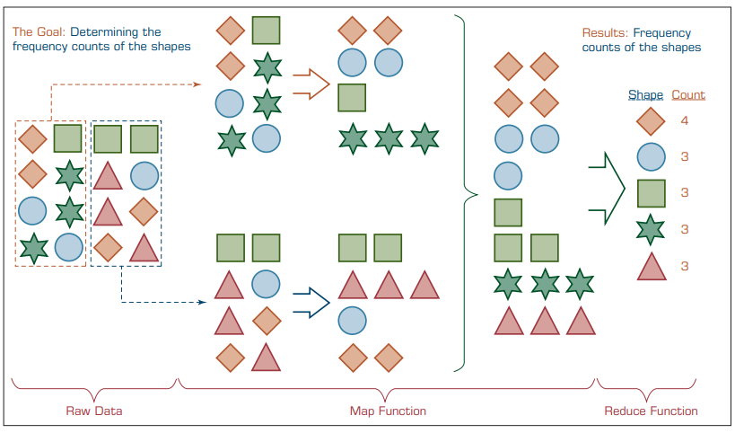
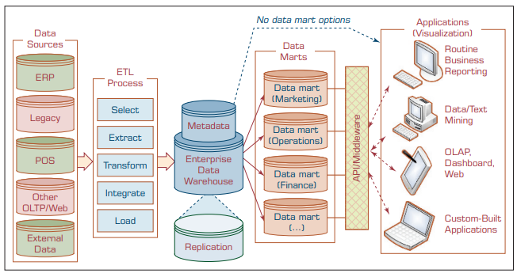
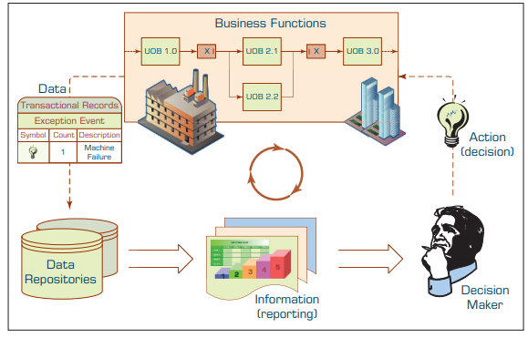
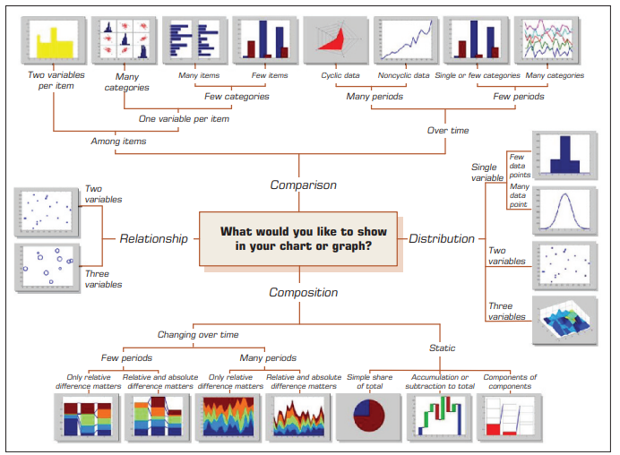
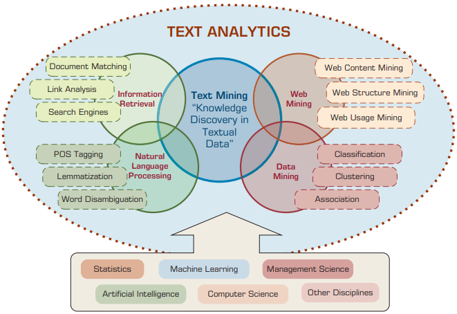
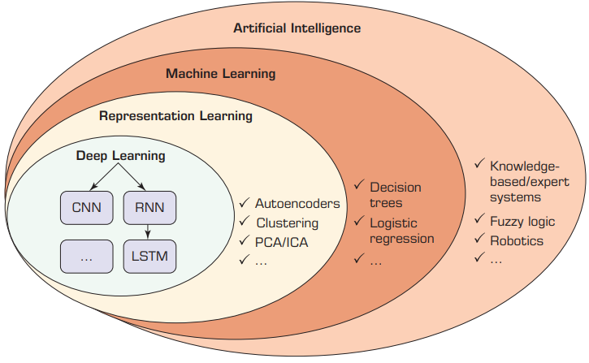

# Συστήματα Αποφάσεων, Διαχείριση Διεργασιών και Επιχειρηματική Ανάλυση
**Ενότητα 4: Business Analytics & Big Data**

Πανεπιστήμιο Δυτικής Αττικής

**Διδάσκων:** Ανάργυρος Τσαδήμας (<tsadimas@uniwa.gr>)

---

<!-- _class: xsmall -->
# Ενότητα 4 — Περίγραμμα

1. **Εισαγωγή & Θεμέλια** — Από τα MIS & DSS στη Σύγχρονη Τεχνητή Νοημοσύνη
2. **Η Πρώτη Ύλη: Δεδομένα & Υποδομές**
   — 2.1–2.4 Φύση & Προετοιμασία Δεδομένων
   — 2.5–2.10 Αποθήκες Δεδομένων (DW) & Big Data
3. **Η Αναλυτική (The Analytics)**
   — 3.1 Ταξινομία: Descriptive, Predictive, Prescriptive
   — 3.2 Περιγραφική (Reporting & Visualization)
   — 3.3 Προβλεπτική (Data Mining, CRISP-DM)
   — 3.4 Καθοδηγητική (Prescriptive Analytics)
   — 3.5 Text Mining & NLP (Predictive Analytics II)
   — 3.6 Deep Learning & Cognitive Computing
4. **Η Σύγκλιση (Convergence)**
   — AI, Automated Decision Making & RPA

---

<!-- _class: small -->
# 1. Εισαγωγή & Θεμέλια

---

<!-- _class: xxsmall -->
# 1.1 Η Ιστορική Εξέλιξη: Από το Reporting στην Τεχνητή Νοημοσύνη

* **1970s — Θεμέλια (MIS & DSS):** 
  Μετάβαση από τις απλές αναφορές ρουτίνας στα Πληροφοριακά Συστήματα Διοίκησης (MIS) και στα πρώτα Συστήματα Υποστήριξης Αποφάσεων (DSS). Εστίαση σε ημι-δομημένα προβλήματα και μαθηματικά μοντέλα Επιχειρησιακής Έρευνας (OR).
* **1980s — Ενοποίηση & Έμπειρα Συστήματα:** 
  Εγκατάλειψη των απομονωμένων αρχείων χάρη στα Συστήματα Σχεσιακών Βάσεων Δεδομένων (RDBMS) και τα πρώτα ERP (ενιαία πηγή αλήθειας). Εμφάνιση των Έμπειρων Συστημάτων (Rule-based Expert Systems).
* **1990s — Αποθήκες Δεδομένων (DW) & EIS:** 
  Δημιουργία Data Warehouses για να μην επιβαρύνονται τα transactional συστήματα (ERP) από τις αναλύσεις. Ανάπτυξη Executive Information Systems (EIS) με γραφικά Dashboards και Scorecards.

* **2000s — Business Intelligence (BI):** 
  Τα συστήματα μετονομάζονται σε BI. Άνθιση της εξόρυξης δεδομένων και κειμένου (Data & Text Mining) για ανακάλυψη γνώσης. Ανάπτυξη μοντέλων Cloud / SaaS, κάνοντας την ανάλυση προσιτή σε μικρομεσαίες επιχειρήσεις.
* **2010s — Η Έκρηξη των Big Data:** 
  Νέες πηγές μη-δομημένων δεδομένων (Social Media, RFID, IoT). Εισαγωγή νέων τεχνολογιών υλισμικού και λογισμικού (όπως Hadoop, MapReduce, NoSQL, MPP) για τη διαχείριση του τεράστιου όγκου και της πολυπλοκότητας.
* **2020s+ — AI, Deep Learning & Αυτοματοποίηση:** 
  Streaming Analytics, ενσωμάτωση του IoT με Deep Learning (αναγνώριση εικόνας/φωνής), Smart Assistants (π.χ. Alexa) και παραγωγική ΤΝ (ChatGPT) που αλλάζουν ριζικά τον τρόπο αλληλεπίδρασης και λήψης αποφάσεων.

---

<!-- _class: xsmall -->
# 1.2 Επιχειρηματική Ευφυΐα (Business Intelligence - BI)

Η **Επιχειρηματική Ευφυΐα (BI)** είναι ένας όρος-ομπρέλα που συνδυάζει αρχιτεκτονικές, εργαλεία, βάσεις και μεθοδολογίες για τη διαδραστική **μετατροπή δεδομένων σε πληροφορία, αποφάσεις και δράσεις**.

**Εξέλιξη & Κινητήριες Δυνάμεις**
* **Ιστορία:** Ξεκίνησε από τα στατικά MIS (70s) και τα EIS (80s). Ο όρος καθιερώθηκε από την Gartner (90s). Από το 2005+ ενσωματώνει δυνατότητες AI.
* **Ανάγκη για Ταχύτητα:** Οι εξαιρετικά συμπιεσμένοι επιχειρηματικοί κύκλοι απαιτούν τη "σωστή πληροφορία, τη σωστή στιγμή, στο σωστό μέρος".
* **Κανονιστική Συμμόρφωση:** Νομοθετικές απαιτήσεις (π.χ. Sarbanes-Oxley Act) υποχρεώνουν τις διοικήσεις να τεκμηριώνουν τις αποφάσεις τους με αξιόπιστα δεδομένα.

**Η Αρχιτεκτονική του BI (4 Πυλώνες)**

1. 🗄️ **Αποθήκη Δεδομένων (Data Warehouse - DW):** Η κεντρική, ενοποιημένη πηγή των ιστορικών και τρεχόντων δεδομένων.
2. ⚙️ **Business Analytics:** Εργαλεία για επεξεργασία, εξόρυξη (data mining) και βαθιά ανάλυση των δεδομένων.
3. 📈 **BPM (Business Performance Management):** Συστήματα για την παρακολούθηση και ανάλυση της επιχειρησιακής απόδοσης.
4. 💻 **Διεπαφή Χρήστη (User Interface):** Διαδραστικά εργαλεία οπτικοποίησης (π.χ. Dashboards & Scorecards) για άμεση πρόσβαση από τους decision makers.

---

<!-- _class: xsmall -->
# 1.3 Κινητήριες Δυνάμεις Ανάπτυξης των DSS και της Αναλυτικής

Πέρα από την προφανή εξέλιξη σε υλισμικό (Hardware), λογισμικό (Software) και δίκτυα, οι παρακάτω παράγοντες έχουν επιταχύνει καθοριστικά τη χρήση Συστημάτων Υποστήριξης Αποφάσεων (DSS) και Business Analytics:

* 🤝 **Ομαδική Επικοινωνία & Συνεργασία:** Απομακρυσμένη λήψη αποφάσεων από ομάδες, εργαλεία συνεργασίας και άμεσος διαμοιρασμός δεδομένων σε πραγματικό χρόνο στην εφοδιαστική αλυσίδα.
* 🗄️ **Βελτιωμένη Διαχείριση Δεδομένων:** Γρήγορη, οικονομική και ασφαλής αποθήκευση/μετάδοση πολύπλοκων και ετερογενών δεδομένων (κείμενο, ήχος, βίντεο) εντός και εκτός οργανισμού.
* 🐘 **Διαχείριση Big Data & Data Warehouses:** Νέες τεχνολογίες (Cloud, Hadoop/Spark, παράλληλη επεξεργασία) ρίχνουν το κόστος και επιτρέπουν την ανάλυση τεράστιων όγκων δεδομένων.
* 🧠 **Υπέρβαση Γνωστικών Ορίων (Cognitive Limits):** Ο ανθρώπινος εγκέφαλος έχει περιορισμένη ικανότητα επεξεργασίας (Simon, 1977). Τα συστήματα ξεπερνούν αυτά τα όρια εξαλείφοντας τα λάθη.

* 📈 **Ενισχυμένη Αναλυτική Υποστήριξη:** Γρήγορη αξιολόγηση εναλλακτικών, βελτιωμένες προβλέψεις, ανάλυση ρίσκου και εκτέλεση πολύπλοκων προσομοιώσεων και σεναρίων.
* 📚 **Διαχείριση Γνώσης (Knowledge Management):** Αξιοποίηση εσωτερικής πληροφορίας και αλληλεπιδράσεων (π.χ. μέσω Text Analytics) για την παραγωγή αξίας και υποστήριξης των managers.
* 📱 **Υποστήριξη Παντού & Πάντα (Anywhere, Anytime):** Mobile τεχνολογίες επιτρέπουν την άμεση πρόσβαση σε δεδομένα και την ταχύτατη λήψη αποφάσεων εν κινήσει.
* 🤖 **Καινοτομία & Τεχνητή Νοημοσύνη (AI):** Η πολυπλοκότητα απαιτεί καινοτομία. Η ΤΝ ενσωματώνεται στην αναλυτική, δημιουργώντας ισχυρές συνέργειες σε κάθε βήμα λήψης αποφάσεων.

---

<!-- _class: xsmall -->
# 1.4 Ο Ρόλος της Τεχνητής Νοημοσύνης (AI) στη Λήψη Αποφάσεων

Η ΤΝ δεν υποστηρίζει απλώς, αλλά συχνά **αυτοματοποιεί πλήρως** τη λήψη αποφάσεων, λειτουργώντας ασύγκριτα πιο γρήγορα και με μεγαλύτερη συνέπεια από τον άνθρωπο.

**Υποστήριξη στα Στάδια της Απόφασης**
* **Αναγνώριση Προβλήματος:** Αυτόματη διάγνωση δυσλειτουργιών (π.χ. μέσω αισθητήρων IoT) και εντοπισμός τάσεων ή απειλών.
* **Εύρεση Εναλλακτικών:** Παραγωγή επιλογών μέσω Chatbots ή Έμπειρων Συστημάτων βάσει βέλτιστων πρακτικών.
* **Επιλογή Λύσης:** Πρόβλεψη του μελλοντικού αντικτύπου (Predictive Analysis) και ταχύτατη αξιολόγηση ρίσκου / σεναρίων.
* **Πλήρης Αυτοματοποίηση:** Ιδανική για ρουτινές, ταχύτατες αποφάσεις (π.χ. έγκριση μικροδανείων, αρχικό φιλτράρισμα βιογραφικών, δυναμική τιμολόγηση & συστήματα συστάσεων της Amazon).

**Κρίσιμοι Παράγοντες Επιτυχίας**
* **Φύση της Απόφασης & Ταχύτητα:** Αποφάσεις ρουτίνας που απαιτούν ταχύτητα κλασμάτων δευτερολέπτου (split-second) είναι οι πρώτες υποψήφιες για αυτοματοποίηση.
* **Τεχνολογική Εξέλιξη:** Μετάβαση από τα παραδοσιακά Rule-based συστήματα στη μηχανική/βαθιά μάθηση (ML/DL) και την αναγνώριση προτύπων (π.χ. βιομετρικά).
* **Ποιότητα Αλγορίθμων & Κανόνων:** Η "εξυπνάδα" του συστήματος εξαρτάται άμεσα από τους αλγόριθμους και τους επιχειρηματικούς κανόνες που το τροφοδοτούν.
* **Ανάλυση Κόστους-Οφέλους:** Είναι συχνά δύσκολη η μέτρηση της απόδοσης επένδυσης (ROI) και των υποκείμενων ρίσκων των μοντέλων ΤΝ σε μεγάλη κλίμακα.

---

<!-- _class: small -->
# 2. Η Πρώτη Ύλη: Δεδομένα & Υποδομές

---

<!-- _class: xsmall -->
# 2.1 Η Φύση των Δεδομένων στην Αναλυτική (Nature of Data Analytics)

Τα δεδομένα αποτελούν την **πρώτη ύλη** (raw material) για κάθε πρωτοβουλία BI, Business Analytics και Data Science. Χωρίς αυτά, η παραγωγή πληροφορίας και γνώσης είναι αδύνατη. 

**Βασικά Χαρακτηριστικά:**
* **Μορφή:** Μπορούν να είναι δομημένα (οργανωμένα για επεξεργασία) ή μη-δομημένα (π.χ. ελεύθερο κείμενο).
* **Ροή & Όγκος:** Από μικρά batches έως συνεχή ροή μεγάλων δεδομένων (Big Data) μέσω αισθητήρων (IoT) και web.

Για να είναι τα δεδομένα έτοιμα για ανάλυση (**analytics ready**), δεν αρκεί να είναι απλώς διαθέσιμα. Πρέπει να συμμορφώνονται με συγκεκριμένα **μετρικά ποιότητας**:

* 🛡️ **Αξιοπιστία Πηγής (Reliability):** Εγγυημένη προέλευση και καταλληλότητα της πηγής (αποφυγή αλλοιώσεων κατά τη μεταφορά).
* 🎯 **Ακρίβεια (Accuracy):** Τα δεδομένα αντικατοπτρίζουν σωστά την πραγματική κατάσταση, χωρίς σφάλματα.
* 🔓 **Προσβασιμότητα (Accessibility):** Εύκολη και άμεση διάθεση των δεδομένων στους αναλυτές, όταν τα χρειάζονται.
* 🔒 **Ασφάλεια & Ιδιωτικότητα (Security & Privacy):** Προστασία από μη εξουσιοδοτημένη πρόσβαση και τήρηση της νομοθεσίας (π.χ. HIPAA, GDPR).
* 💎 **Πλούτος (Richness):** Πληρότητα διαστάσεων και μεταβλητών για σωστή και ολιστική μοντελοποίηση.

* 🔄 **Συνέπεια (Consistency):** Απουσία συγκρούσεων κατά τη συγχώνευση (merge) δεδομένων από διαφορετικές πηγές.
* ⏱️ **Επικαιρότητα (Timeliness / Currency):** Τα δεδομένα είναι ενημερωμένα και συλλέγονται όσο πιο κοντά γίνεται στο χρόνο του γεγονότος.
* 🔬 **Λεπτομέρεια (Granularity):** Δεδομένα στο κατώτατο απαιτούμενο επίπεδο (κοκκοποίηση), ώστε να μην είναι απλώς γενικά αθροίσματα.
* ✅ **Εγκυρότητα (Validity):** Οι καταγεγραμμένες τιμές ανήκουν στα προκαθορισμένα αποδεκτά όρια και μορφότυπα.
* 📌 **Σχετικότητα (Relevancy):** Περιέχονται μόνο οι μεταβλητές που είναι πραγματικά σχετικές με το εκάστοτε πρόβλημα ανάλυσης.

---

<!-- _class: small -->
# 2.2 A Data to Knowledge Continuum
*(Το συνεχές από τα Δεδομένα στη Γνώση)*

Η εικόνα αυτή απεικονίζει οπτικά όσα συζητήσαμε για τη **Φύση των Δεδομένων**: το πώς η "ακατέργαστη πρώτη ύλη" (από ετερογενείς πηγές όπως IoT, Social Media, ERP) μετασχηματίζεται σταδιακά σε στρατηγική γνώση.

> 💡 **Σύνδεση:** Για να διασχίσουν τα δεδομένα με επιτυχία αυτό το "συνεχές" (pipeline) και να παράξουν αξιόπιστα μοτίβα (Patterns) και Γνώση (Knowledge), πρέπει απαραιτήτως να πληρούν τις **μετρικές ποιότητας (Analytics Readiness)** της προηγούμενης διαφάνειας!

---

<!-- _class: xsmall -->
# 2.3 Ταξινομία των Δεδομένων (Data Taxonomy)

Τα δεδομένα είναι το κατώτερο επίπεδο αφαίρεσης. Στο ανώτερο επίπεδο χωρίζονται σε **Δομημένα** (Structured) και **Μη Δομημένα** (Unstructured). Η Αναλυτική και το Data Mining εστιάζουν κυρίως στα δομημένα δεδομένα, τα οποία ταξινομούνται ως εξής:

**1. Κατηγορικά (Categorical) / Διακριτά**
Διαχωρίζουν τις μεταβλητές σε διακριτές ομάδες.

* **Ονομαστικά (Nominal):** Απλές ετικέτες ή κωδικοί *χωρίς ιεραρχία/τάξη*.
  * *Παράδειγμα:* Φύλο (Άρρεν/Θήλυ), Οικογενειακή κατάσταση. Μπορούν να είναι διωνυμικά (Binomial - Ναι/Όχι) ή πολυωνυμικά.
* **Τακτικά (Ordinal):** Ετικέτες που εμπεριέχουν *φυσική σειρά ή κατάταξη*.
  * *Παράδειγμα:* Πιστωτική βαθμολογία (Χαμηλή/Μεσαία/Υψηλή), Επίπεδο εκπαίδευσης. Μπορούν να βελτιώσουν την απόδοση μοντέλων (π.χ. ordinal logistic regression).

**2. Αριθμητικά (Numeric) / Συνεχή**
Μετρήσεις σε κλίμακα, με πραγματικούς ή ακέραιους αριθμούς (αναπαριστούν συνεχείς μετρήσεις).

* **Διαστήματος (Interval):** Κλίμακες *χωρίς* απόλυτο (φυσικό) μηδέν. 
  * *Παράδειγμα:* Θερμοκρασία σε Κελσίου (το 0 δεν σημαίνει απόλυτη απουσία ενέργειας).
* **Αναλογίας (Ratio):** Κλίμακες που διαθέτουν *απόλυτο μηδέν*.
  * *Παράδειγμα:* Μάζα, Απόσταση, Χρόνος, Θερμοκρασία σε Kelvin. Επιτρέπει τον υπολογισμό αναλογιών.

> ⚙️ **Data Transformation:** Η επιλογή αλγορίθμου υπαγορεύει τη μορφή. Π.χ. τα **Νευρωνικά Δίκτυα** απαιτούν *αριθμητικά* δεδομένα (άρα τα Nominal μετατρέπονται μέσω *Pseudo-variables / One-Hot Encoding*), ενώ παλαιότεροι αλγόριθμοι όπως ο **ID3** (Decision Trees) απαιτούν *κατηγορικά* δεδομένα, καθιστώντας απαραίτητο τον μετασχηματισμό/διακριτοποίηση.

---

<!-- _class: diagram-sm -->
# 2.3α Οπτική Αναπαράσταση Ταξινομίας Δεδομένων

---

<!-- _class: xsmall -->
# 2.4 Η Τέχνη και Επιστήμη της Προετοιμασίας Δεδομένων

Τα πραγματικά δεδομένα (raw data) είναι συχνά "βρώμικα", ασύμβατα και ανακριβή. Η προετοιμασία τους (**Data Preprocessing**) είναι η πιο χρονοβόρα αλλά και πιο κρίσιμη φάση πριν την εφαρμογή αλγορίθμων ανάλυσης. Περιλαμβάνει 4 κύρια στάδια:

**1. Ενοποίηση (Data Consolidation / Blending)**
*   Επιλογή σχετικών εγγραφών και φιλτράρισμα μη απαραίτητης πληροφορίας.
*   **Data Blending:** Συγχώνευση (merge) δεδομένων από πολλαπλές και ετερογενείς πηγές (π.χ. RDBMS, NoSQL, Cloud, Web Services, Social Media).

**2. Καθαρισμός (Data Cleaning / Scrubbing)**
*   **Ελλείπουσες τιμές (Missing values):** Εκτίμηση / συμπλήρωση με την πιο πιθανή τιμή (imputation) ή απόρριψη της εγγραφής.
*   **Ακραίες τιμές (Outliers) & Θόρυβος:** Εντοπισμός και εξομάλυνση (smoothing).
*   Αντιμετώπιση **ασυνεπειών** με χρήση της γνώσης του εκάστοτε πεδίου (domain knowledge).

**3. Μετασχηματισμός (Data Transformation)**
*   **Κανονικοποίηση (Normalization):** Κλιμάκωση (π.χ. min-max) ώστε καμία μεταβλητή να μην "επισκιάζει" άλλες (π.χ. το εισόδημα έναντι των ετών προϋπηρεσίας).
*   **Διακριτοποίηση / Άθροιση:** Μετατροπή αριθμητικών τιμών σε κατηγορικές (π.χ. χαμηλό, μεσαίο, υψηλό) ή ιεραρχική συμπύκνωση (π.χ. περιοχές αντί για πόλεις).
*   Δημιουργία **νέων παράγωγων μεταβλητών** (π.χ. `blood_match` αντί για χωριστούς τύπους αίματος).

**4. Μείωση Δεδομένων (Data Reduction)**
*   **Μείωση Διαστάσεων (Variables):** Επιλογή μόνο των σημαντικότερων μεταβλητών (PCA) για αποφυγή υπερβολικής πολυπλοκότητας.
*   **Δειγματοληψία εγγραφών (Cases):** Τυχαία ή διαστρωματωμένη (stratified) δειγματοληψία όταν τα δεδομένα είναι αχανή.
*   **Εξισορρόπηση (Balancing):** Υπερδειγματοληψία (oversampling) ή υποδειγματοληψία (undersampling) σε ασύμμετρα (skewed) δεδομένα για καλύτερα μοντέλα.

---

<!-- _class: xxsmall -->
# 2.4α Οπτικοποίηση της Διαδικασίας Προετοιμασίας

Η εικόνα αυτή συνοψίζει οπτικά τα 4 στάδια της προετοιμασίας δεδομένων:

1.  **Consolidation (Ενοποίηση):**
    *   Συλλογή, επιλογή και ενοποίηση (blending) δεδομένων από πολλαπλές πηγές.

2.  **Cleaning (Καθαρισμός):**
    *   Διόρθωση σφαλμάτων, συμπλήρωση ελλειπουσών τιμών (imputation) και εξομάλυνση ακραίων τιμών (outliers).

3.  **Transformation (Μετασχηματισμός):**
    *   Κανονικοποίηση (Normalization) για να έχουν οι μεταβλητές παρόμοια κλίμακα.
    *   Δημιουργία νέων, παράγωγων μεταβλητών (feature engineering).

4.  **Reduction (Μείωση):**
    *   Μείωση του αριθμού των μεταβλητών (π.χ. μέσω PCA) ή των εγγραφών (δειγματοληψία) για να γίνει η ανάλυση πιο αποδοτική.

---

<!-- _class: small -->
# 2.5 Ορισμός των Big Data (Μεγάλα Δεδομένα)

Ο όρος **Big Data** είναι *σχετικός*: το τι θεωρείται "μεγάλο" εξαρτάται από το μέγεθος του εκάστοτε οργανισμού. Δεν πρόκειται για εντελώς νέα έννοια (τα data warehouses υπάρχουν από τα 90s), αλλά για μια ραγδαία εξέλιξη στην κλίμακα (από Terabytes σε Exabytes) και στη μορφή.

> 💡 **Ορισμός:** Τα Big Data είναι δεδομένα που **ξεπερνούν τις δυνατότητες** των παραδοσιακών συστημάτων (υλικού και λογισμικού) να τα συλλέξουν, να τα διαχειριστούν και να τα επεξεργαστούν σε αποδεκτό χρονικό διάστημα.

**Από πού προέρχονται;**
Πρακτικά από παντού. Πηγές που παλαιότερα αγνοούνταν λόγω τεχνικών περιορισμών πλέον θεωρούνται "χρυσωρυχεία":

*   Web logs & Internet search indexes
*   Αισθητήρες, RFID & GPS (Internet of Things)

*   Κοινωνικά δίκτυα (Social Networks)
*   Αρχεία βίντεο, φωτογραφιών, κειμένου & ιατρικά αρχεία

⚠️ **Παρεξηγημένος όρος (Misnomer):** Η λέξη επικεντρώνεται μόνο στον "όγκο" (Big). Στην πραγματικότητα, τα Big Data δεν είναι απλώς "μεγάλα". Ορίζονται από πολλά περισσότερα χαρακτηριστικά...

---

<!-- _class: small -->
# 2.6 Τα Βασικά "V"s των Big Data (Volume, Velocity, Variety)

Τα παραδοσιακά συστήματα έφτασαν στα όριά τους. Αρχικά τα Big Data ορίστηκαν από τα τρία βασικά "V":

*   **Volume (Όγκος):** Εκθετική αύξηση από συναλλαγές, IoT, social media και GPS. Η πρόκληση πλέον δεν είναι το κόστος αποθήκευσης, αλλά ο **εντοπισμός της σχετικότητας** και η δημιουργία αξίας. Οι κλίμακες πέρασαν από τα Petabytes (PB) στα Zettabytes (ZB).
*   **Variety (Ποικιλία):** Το 80-85% των δεδομένων είναι μη-δομημένα ή ημι-δομημένα (κείμενα, βίντεο, audio, XML), ακατάλληλα για παραδοσιακά RDBMS, αλλά κρύβουν τεράστια αξία.
*   **Velocity (Ταχύτητα):** Η ταχύτητα παραγωγής και επεξεργασίας. Καθώς ο χρόνος περνά, η αξία της πληροφορίας μειώνεται. Απαιτείται μετάβαση από την ανάλυση ιστορικών δεδομένων (*at-rest analytics*) στην ανάλυση ροών σε πραγματικό χρόνο (*in-motion / data stream analytics*).

---

<!-- _class: small -->
# 2.6.1 Οι Νέες Διαστάσεις των Big Data

Εταιρείες κολοσσοί στο χώρο της αναλυτικής επέκτειναν τον ορισμό προσθέτοντας νέα "V":

*   **Veracity (Αξιοπιστία):** Όρος της IBM. Αφορά την ακρίβεια, την ποιότητα και την ειλικρίνεια των δεδομένων. Πώς διαχειριζόμαστε τον "θόρυβο" μετατρέποντάς τα σε αξιόπιστη γνώση.
*   **Variability (Μεταβλητότητα):** Όρος της SAS. Πέρα από τον όγκο και την ταχύτητα, οι ροές δεδομένων είναι συχνά **ασυνεπείς** με απότομες κορυφώσεις (peaks) λόγω γεγονότων, εποχικότητας ή social media trends.
*   🏆 **Value Proposition (Αξία):** Η κινητήριος δύναμη! Υπάρχει η αντίληψη ότι τα Big Data κρύβουν περισσότερα μοτίβα και ανωμαλίες από τα "μικρά" δεδομένα. Τα "Big Analytics" οδηγούν σε βαθύτερη γνώση και καλύτερες στρατηγικές αποφάσεις.

---

<!-- _class: small -->
# 2.6.2 Εννοιολογική Αρχιτεκτονική Big Data
*(A High-Level Conceptual Architecture)*

Η παρακάτω εικόνα απεικονίζει πώς τα ακατέργαστα Big Data (αριστερά) μετατρέπονται σταδιακά σε **επιχειρηματική γνώση (Business Insight)** μέσω συνδυασμού εργαλείων προηγμένης αναλυτικής, και διανέμονται σε διαφορετικούς χρήστες και ρόλους για ταχύτερη και καλύτερη λήψη αποφάσεων.

---

<!-- _class: xsmall -->
# 2.6.3 Βασικές Αρχές Big Data Analytics

Τα Big Data είναι άχρηστα αν δεν παράγουν αξία. Η μετάβαση στα **"Big Analytics"** απαιτείται όταν οι τρέχουσες πλατφόρμες δεν επαρκούν, όταν προστίθενται νέες ετερογενείς πηγές και όταν απαιτείται ταχύτατη ενσωμάτωση με ευέλικτα σχήματα (schema-on-demand).

**Παράγοντες Επιτυχίας (Critical Success Factors)**
1. 🎯 **Επιχειρηματική Ανάγκη:** Ξεκάθαρη στόχευση που υπηρετεί τη στρατηγική, όχι απλώς την τεχνολογία.
2. 🤝 **Ισχυρή Υποστήριξη (Sponsorship):** Δέσμευση από τα κορυφαία διοικητικά στελέχη.
3. ⚖️ **Ευθυγράμμιση Business & IT:** Η αναλυτική πρέπει να διευκολύνει το business plan.
4. 📊 **Κουλτούρα δεδομένων (Fact-based):** Αποφάσεις με βάση τους αριθμούς και όχι το ένστικτο.
5. 🏗️ **Ισχυρή Υποδομή:** Αρμονικός συνδυασμός των Data Warehouses με τις νέες Big Data τεχνολογίες.

**Τεχνολογίες Υψηλής Απόδοσης**
* **In-memory analytics:** Επεξεργασία δεδομένων απευθείας στη μνήμη RAM για real-time ταχύτητα.
* **In-database analytics:** Ενσωμάτωση των αλγορίθμων εντός της βάσης για αποφυγή μεταφοράς δεδομένων.
* **Grid computing & Appliances:** Διαμοιρασμός πόρων και εξειδικευμένα συστήματα (hardware+software).

**Βασικές Προκλήσεις (Challenges)**
* **Όγκος (Data Volume):** Ταχεία συλλογή, αποθήκευση και διαθεσιμότητα των δεδομένων τη στιγμή που χρειάζονται.
* **Ενοποίηση (Data Integration):** Συνδυασμός ανομοιογενών πηγών γρήγορα και με λογικό κόστος.
* **Επεξεργασία (Processing):** Ανάγκη ανάλυσης τη στιγμή της παραγωγής των δεδομένων (*Stream Analytics*).
* **Διακυβέρνηση (Data Governance):** Διαχείριση ιδιωτικότητας, ασφάλειας και ποιότητας των δεδομένων.
* **Διαθέσιμες Δεξιότητες:** Έλλειψη εξειδικευμένου προσωπικού στην αγορά (*Data Scientists*).
* **Κόστος (Solution Cost):** Εξασφάλιση θετικού ROI (Return on Investment) σε σχέση με το κόστος των εργαλείων.

---

<!-- _class: xsmall -->
# 2.6.4 Τεχνολογίες Big Data (Hadoop, Spark, NoSQL)

Τα συστήματα Big Data βασίζονται σε *commodity hardware*, *παράλληλη επεξεργασία* και *μη-σχεσιακή αποθήκευση* για να διαχειριστούν τεράστιους όγκους δεδομένων με χαμηλό κόστος.

**1. Apache Hadoop (Batch Processing)**
Το οικοσύστημα που καθιέρωσε τα Big Data. Τεμαχίζει τα δεδομένα και τα επεξεργάζεται παράλληλα (scale-out).
*   **HDFS (Hadoop Distributed File System):** Κατανεμημένο σύστημα αρχείων (η αποθήκευση).
*   **MapReduce:** Το μοντέλο προγραμματισμού (η επεξεργασία σε 2 φάσεις: Map/διαχωρισμός & Reduce/σύνθεση).
*   *Χρήση:* Φθηνή αποθήκευση σε δίσκους, τεράστια ιστορικά αρχεία, διεργασίες που δεν απαιτούν real-time απόκριση.

**2. Apache Spark (In-Memory Processing)**
Η εξέλιξη για ταχύτητα. Αντί να γράφει/διαβάζει συνεχώς από τους δίσκους όπως το Hadoop, εκτελεί την επεξεργασία απευθείας στη μνήμη (RAM).
*   *Χρήση:* Real-time data streams, επαναληπτικοί αλγόριθμοι και Machine Learning (MLlib).
*   *Κόστος:* Πιο ακριβό σε υποδομή (λόγω RAM), αλλά ταχύτατο. *Δεν αντικαθιστά το Hadoop*, συχνά συνεργάζονται.

**3. NoSQL Βάσεις Δεδομένων (Not Only SQL)**
Δημιουργήθηκαν για να προσφέρουν ταχύτατη πρόσβαση σε μη δομημένα ή ημι-δομημένα δεδομένα, σε κλίμακες που τα παραδοσιακά RDBMS αδυνατούν να υποστηρίξουν.
*   **Λειτουργία:** Θυσιάζουν την αυστηρή συμμόρφωση **ACID** (ατομικότητα, συνέπεια, απομόνωση, ανθεκτικότητα) υπέρ της τεράστιας κλιμάκωσης και της υψηλής απόδοσης.
*   **Οικοσύστημα:** Το *HBase* "κάθεται" πάνω στο HDFS του Hadoop για γρήγορα lookups. Άλλα γνωστά εργαλεία: *Cassandra, MongoDB, DynamoDB, CouchDB*.

> 💡 **Συνοπτικά:** Το **Hadoop** αποθηκεύει φθηνά και επεξεργάζεται μαζικά (batch). Το **Spark** δίνει αστραπιαία ταχύτητα (RAM & ML). Οι **NoSQL** δίνουν τη δυνατότητα γρήγορης εγγραφής/ανάγνωσης για real-time εφαρμογές.

---

<!-- _class: small -->
# 2.6.5 Πώς λειτουργεί το MapReduce

Το **MapReduce** είναι ένα μοντέλο προγραμματισμού για την παράλληλη επεξεργασία τεράστιων συνόλων δεδομένων (Big Data) σε συστοιχίες υπολογιστών (clusters).

* **1. Φάση Map (Χαρτογράφηση):** Το σύστημα "σπάει" τα ακατέργαστα δεδομένα εισόδου σε μικρότερα τμήματα και τα μοιράζει σε πολλαπλούς κόμβους. Κάθε κόμβος τα επεξεργάζεται παράλληλα.
* **2. Shuffle & Sort (Ταξινόμηση):** Τα ενδιάμεσα αποτελέσματα ανακατεύονται, ομαδοποιούνται και ταξινομούνται.
* **3. Φάση Reduce (Σύνθεση):** Τα ομαδοποιημένα δεδομένα προωθούνται στους κόμβους Reduce, οι οποίοι τα "συμπυκνώνουν" (π.χ. αθροίζοντας τις τιμές) για να παράξουν το τελικό συνοπτικό αποτέλεσμα.

---

<!-- _class: xsmall -->
# 2.6.6 Big Data & Stream Analytics (Ανάλυση Ροών)

Η ταχύτητα (Velocity) των Big Data καθιστά την παραδοσιακή ανάλυση "δεδομένων σε ηρεμία" (*data-at-rest*) ανεπαρκή. Παράλληλα, η αντίληψη "αποθήκευσέ τα όλα" (*store-everything*) καθίσταται τεχνικά και οικονομικά ανέφικτη λόγω του τεράστιου όγκου.

> 🌊 **Stream Analytics (ή Data-in-Motion Analytics):** Η διαδικασία εξαγωγής άμεσα αξιοποιήσιμης πληροφορίας από **συνεχείς ροές δεδομένων** σε πραγματικό χρόνο. Αντί για στατικούς πίνακες, χρησιμοποιούνται κυλιόμενα "χρονικά παράθυρα" (*time windows*) για την ανάλυση των δεδομένων τη στιγμή ακριβώς που παράγονται (π.χ. επιτρέποντας time-to-action σε κλάσματα δευτερολέπτου).

**Κύριες Εφαρμογές ανά Κλάδο:**

* 🛒 **e-Commerce (Λιανεμπόριο):** Ανάλυση κλικ (clickstream) σε πραγματικό χρόνο για άμεσες, εξατομικευμένες προτάσεις προϊόντων, μετατρέποντας τους απλούς επισκέπτες σε αγοραστές.
* ⚡ **Ενέργεια (Smart Grids):** Συνεχής παρακολούθηση έξυπνων μετρητών για πρόβλεψη ζήτησης, βελτιστοποίηση παραγωγής από ανανεώσιμες πηγές και αποτροπή μπλακάουτ.
* 🏥 **Υγεία (Health Sciences):** Ανάλυση δεδομένων από ιατρικούς αισθητήρες (π.χ. καρδιακός ρυθμός) για ακαριαία ανίχνευση ανωμαλιών και άμεση παρέμβαση.

* 📞 **Τηλεπικοινωνίες:** Ανάλυση CDRs (Call Detail Records) και social media για άμεση αποτροπή φυγής πελατών (churn) και εντοπισμό επιδραστικών χρηστών (influencers).
* 💸 **Χρηματοοικονομικά:** Αξιολόγηση συναλλαγών σε milliseconds για αλγοριθμικό trading (HFT) και άμεσο εντοπισμό απάτης (fraud detection).
* 🏛️ **Κυβέρνηση & Ασφάλεια:** Έξυπνη διαχείριση κυκλοφορίας (κάμερες/GPS), πρόληψη κυβερνοεπιθέσεων (network logs) και διαχείριση φυσικών καταστροφών.

# 2.7 Αποθήκη Δεδομένων (Data Warehouse — DW)

Η **Αποθήκη Δεδομένων (Data Warehouse)** είναι το κεντρικό αποθετήριο ενοποιημένων, ιστορικών δεδομένων που τροφοδοτεί τα εργαλεία BI και Analytics.

**Θεμελιώδη Χαρακτηριστικά (Inmon, 2005)**
*   **Θεματικά Προσανατολισμένη (Subject-Oriented):** Οργανώνεται γύρω από θέματα (π.χ. πελάτες, πωλήσεις, προϊόντα), όχι γύρω από λειτουργίες.
*   **Ολοκληρωμένη (Integrated):** Ενοποιεί δεδομένα από ετερογενείς πηγές (π.χ. ERP, CRM, Excel) σε μια συνεπή μορφή, λύνοντας ασυνέπειες.
*   **Μεταβλητή στο Χρόνο (Time-Variant):** Διατηρεί ιστορικότητα (π.χ. πωλήσεις τελευταίων 5 ετών), επιτρέποντας την ανάλυση τάσεων.
*   **Μη-Πτητική (Nonvolatile):** Τα δεδομένα δεν διαγράφονται ούτε αλλάζουν. Οι αλλαγές καταγράφονται ως νέες εγγραφές, διατηρώντας την ιστορικότητα.

**Τεχνικά Χαρακτηριστικά**
*   **Relational/Multidimensional:** Χρησιμοποιεί σχεσιακή ή πολυδιάστατη δομή (OLAP) για γρήγορες αναλυτικές ερωτήσεις.
*   **Metadata:** Περιέχει "δεδομένα για τα δεδομένα", που εξηγούν την προέλευση, την οργάνωση και τη σημασία τους.

**Τύποι DW**
*   **Enterprise Data Warehouse (EDW):** Αποθήκη μεγάλης κλίμακας για ολόκληρο τον οργανισμό.
*   **Data Marts (DM):** Μικρότερα, εστιασμένα υποσύνολα για συγκεκριμένα τμήματα (π.χ. Marketing). Μπορεί να είναι *εξαρτημένα* (από EDW) ή *ανεξάρτητα*.
*   **Operational Data Store (ODS):** «Βραχυπρόθεσμη μνήμη» — ενημερώνεται συνεχώς και εξυπηρετεί near-real-time αποφάσεις.

---

<!-- _class: xsmall -->
# 2.8 Η Διαδικασία ETL & Υποδομή Αποθήκης Δεδομένων

* 📥 **Πηγές Δεδομένων (Data Sources):** 
  Δεδομένα αντλούνται από πολλαπλά, ανεξάρτητα λειτουργικά συστήματα (π.χ. ERP, παλαιά/legacy συστήματα), logs ιστοσελίδων, καθώς και από εξωτερικούς παρόχους πληροφοριών.
* 🔄 **Εξαγωγή & Μετασχηματισμός (Extraction & Transformation):** 
  Η εξαγωγή και ο κατάλληλος μετασχηματισμός των δεδομένων γίνεται μέσω εξειδικευμένου λογισμικού (ETL).
* ⏳ **Φόρτωση (Data Loading):** 
  Τα δεδομένα μεταφέρονται αρχικά σε έναν ενδιάμεσο χώρο (staging area) για καθαρισμό, πριν φορτωθούν οριστικά στην αποθήκη δεδομένων ή/και στα Data Marts.

* 🗄️ **Περιεκτική Βάση (Comprehensive Database / EDW):** 
  Η κεντρική αποθήκη (EDW) που υποστηρίζει την ανάλυση αποφάσεων, παρέχοντας λεπτομερή και συνοπτική πληροφορία από όλες τις πηγές.
* 🏷️ **Μεταδεδομένα (Metadata):** 
  Κανόνες και πληροφορίες για την οργάνωση των δεδομένων που βοηθούν το IT και τους χρήστες στην εύκολη ευρετηρίαση και αναζήτηση.
* 🛠️ **Εργαλεία Ενδιάμεσου Λογισμικού (Middleware tools):** 
  Επιτρέπουν την πρόσβαση στο DW. Περιλαμβάνουν από τη χρήση SQL ερωτημάτων μέχρι προηγμένα εργαλεία OLAP, Data Mining, Reporting και Data Visualization.

---

<!-- _class: small -->
# 2.9 Εννοιολογική Αρχιτεκτονική Αποθήκης Δεδομένων
*(A High-Level Conceptual Architecture)*

Η παρακάτω εικόνα οπτικοποιεί τη ροή της πληροφορίας: από την άντληση δεδομένων (Εσωτερικές/Εξωτερικές Πηγές) και τον καθαρισμό τους (διαδικασία **ETL**), μέχρι την κεντρική αποθήκευση (EDW / Data Marts) και την τελική ανάλυση από τους χρήστες μέσω **εργαλείων BI** (Middleware).

---

<!-- _class: xsmall -->
# 2.10 Αρχιτεκτονικές Αποθηκών Δεδομένων (DW Architectures)

Οι αρχιτεκτονικές των DW βασίζονται συνήθως σε μοντέλα n-tier (κυρίως 2-tier και 3-tier), διαχωρίζοντας τα τρία βασικά μέρη του συστήματος: 1) την ίδια την αποθήκη, 2) το λογισμικό απόκτησης δεδομένων (back-end ETL) και 3) το λογισμικό του πελάτη (front-end BI).

**Αρχιτεκτονική 3-Tier (Three-Tier)**
*   **Tier 1:** Λειτουργικά συστήματα & απόκτηση δεδομένων (ETL).
*   **Tier 2:** Η ίδια η αποθήκη δεδομένων (Data Warehouse).
*   **Tier 3:** Η μηχανή BI/Analytics και ο client.
*   *Πλεονέκτημα:* Σαφής διαχωρισμός λειτουργιών, καλύτερη απόδοση και ευκολία στη δημιουργία Data Marts.

**Αρχιτεκτονική 2-Tier (Two-Tier)**
*   Η μηχανή BI/Analytics τρέχει στην **ίδια πλατφόρμα** με το Data Warehouse.
*   *Πλεονέκτημα:* Πιο οικονομική λύση.
*   *Μειονέκτημα:* Πιθανά προβλήματα απόδοσης σε μεγάλες αποθήκες δεδομένων με απαιτητικές εφαρμογές.

**Web-Based Αρχιτεκτονική**
*   Μια παραλλαγή της 3-tier αρχιτεκτονικής που χρησιμοποιεί το Internet/Intranet ως μέσο επικοινωνίας (PC Client → Web Server → Application Server & DW).
*   *Πλεονεκτήματα:* Ευκολία πρόσβασης, ανεξαρτησία πλατφόρμας, χαμηλότερο κόστος.

**Βασικές Αποφάσεις Υλοποίησης**
*   **DBMS:** Επιλογή του κατάλληλου συστήματος βάσης δεδομένων (π.χ. Oracle, SQL Server, DB2).
*   **Παράλληλη Επεξεργασία:** Χρήση πολλαπλών CPUs για ταυτόχρονη εκτέλεση ερωτημάτων (scalability).
*   **Εργαλεία Μεταφοράς (ETL):** Ανάπτυξη in-house ή αγορά έτοιμων εργαλείων για τη διαδικασία Extract-Transform-Load.

---

---

# 3. Η Αναλυτική (The Analytics)

---

<!-- _class: xsmall -->
# 3.1 Η Ταξινομία της Αναλυτικής (Analytics Taxonomy)

Ο όρος **Αναλυτική (Analytics)** αντικαθιστά σταδιακά το BI. Σύμφωνα με την INFORMS, είναι ο συνδυασμός τεχνολογίας, διοικητικής επιστήμης και στατιστικής για την εξαγωγή στοχευμένων δράσεων. Χωρίζεται σε **3 αλληλένδετα επίπεδα**:

📊 **1. Περιγραφική Αναλυτική (Descriptive)**
* **Ερωτήσεις:** *Τι συνέβη; Τι συμβαίνει τώρα;*
* **Σκοπός:** Κατανόηση της τρέχουσας κατάστασης και των τάσεων μέσω της ενοποίησης ιστορικών δεδομένων (από DWs).
* **Εργαλεία:** Αναφορές, Dashboards, Οπτικοποίηση Δεδομένων.
* **Case Study (Silvaris):** Χρησιμοποίησε το Tableau για real-time οπτικοποίηση των logistics της, γλιτώνοντας 100άδες σελίδες αναφορών και βελτιώνοντας την στόχευση πελατών.

🎯 **2. Προβλεπτική Αναλυτική (Predictive)**
* **Ερωτήσεις:** *Τι θα συμβεί; Γιατί θα συμβεί;*
* **Σκοπός:** Ακριβείς προβλέψεις για το μέλλον (π.χ. customer churn, ανταπόκριση σε προσφορές, πιστωτικό ρίσκο).
* **Εργαλεία:** Data/Text Mining, Forecasting, Machine Learning (Αλγόριθμοι ταξινόμησης & ομαδοποίησης).

🚀 **3. Καθοδηγητική Αναλυτική (Prescriptive)**
* **Ερωτήσεις:** *Τι πρέπει να κάνω;*
* **Σκοπός:** Λήψη των βέλτιστων δυνατών αποφάσεων (actionable insights) βάσει των προβλέψεων.
* **Εργαλεία:** Βελτιστοποίηση (Optimization), Προσομοίωση, Έμπειρα Συστήματα.

---

<!-- _class: xsmall ---

<!-- _class: xsmall -->
# 3.2 Περιγραφική Αναλυτική — Επιχειρηματικές Αναφορές

---

<!-- _class: xsmall -->
# 3.2.1 Επιχειρηματικές Αναφορές (Business Reporting)

Οι υπεύθυνοι λήψης αποφάσεων χρειάζονται πληροφορίες (δηλαδή δεδομένα ενταγμένα στο σωστό πλαίσιο) για να δράσουν εγκαίρως. Μια αναφορά (report) είναι ένα τεχνούργημα επικοινωνίας που μετατρέπει τα δεδομένα σε εύπεπτη μορφή (αφηγηματική, γραφική ή πινακοποιημένη).

**Βασικές Λειτουργίες**
* Διασφάλιση ορθής λειτουργίας των τμημάτων.
* Παροχή πληροφοριών και αποτελεσμάτων ανάλυσης.
* Πειθώ για ανάληψη δράσης (persuasion).
* Δημιουργία **οργανωσιακής μνήμης** (ως μέρος του Knowledge Management).

**Ο Κύκλος της Απόφασης**
Τα δεδομένα (από OLTP/Εξωτερικές Πηγές) περνούν από **ETL** σε μια Αποθήκη Δεδομένων (DW). Η ροή είναι κυκλική:
> `Απόκτηση Δεδομένων → Παραγωγή Πληροφορίας (Reporting) → Λήψη Απόφασης → Δράση (Βελτίωση Διαδικασιών)`

**Κλειδιά Επιτυχίας μιας Αναφοράς**
Η δημιουργία αναφορών (συχνά συνώνυμο του OLAP ή του BI) πρέπει να διέπεται από 4 αρχές:
*   **Σαφήνεια (Clarity):** Κατανοητή από τον αποδέκτη.
*   **Συντομία (Brevity):** Εστίαση στην ουσία.
*   **Πληρότητα (Completeness):** Περιέχει όλα τα απαραίτητα δεδομένα.
*   **Ορθότητα (Correctness):** Ακριβή και επαληθευμένα στοιχεία.

Οι αναφορές μπορεί να είναι εσωτερικές (π.χ. για managers) ή εξωτερικές (π.χ. αναφορές προς κρατικούς και ρυθμιστικούς φορείς).

---

<!-- _class: xsmall -->
# 3.2.2 Κατηγορίες Επιχειρηματικών Αναφορών

Παρότι υπάρχει τεράστια ποικιλία, οι αναφορές που χρησιμοποιούνται για διοικητικούς σκοπούς (managerial purposes) χωρίζονται σε 3 κύριες κατηγορίες (Hill, 2016):

**1. Αναφορές Διαχείρισης Μετρικών (Metric Management Reports)**
* Βασίζονται σε μετρικές που εστιάζουν στο αποτέλεσμα.
* **Εσωτερικά:** Key Performance Indicators (KPIs).
* **Εξωτερικά:** Service-Level Agreements (SLAs).
* Συχνά εντάσσονται σε ευρύτερες στρατηγικές διοίκησης, όπως το Six Sigma ή η Διοίκηση Ολικής Ποιότητας (TQM).

**2. Αναφορές τύπου Πίνακα Ελέγχου (Dashboard-Type Reports)**
* Οπτική παρουσίαση πολλαπλών δεικτών σε **μία μόνο σελίδα** (όπως το ταμπλό ενός αυτοκινήτου).
* Επιτρέπουν την προσαρμογή (customization) των γραφικών στοιχείων (widgets) και τον ορισμό στόχων.
* Χρησιμοποιούν συχνά **χρωματική κωδικοποίηση** (φανάρια: κόκκινο, πορτοκαλί, πράσινο) για να τραβήξουν άμεσα την προσοχή της διοίκησης στα προβληματικά σημεία.

**3. Αναφορές Ισορροπημένης Στοχοθεσίας (Balanced Scorecard-Type Reports)**
* Μια μεθοδολογία που αναπτύχθηκε από τους Kaplan & Norton.
* Παρέχει μια **ολοκληρωμένη (integrated) εικόνα** της επιτυχίας ενός οργανισμού.
* Δεν περιορίζεται μόνο σε *οικονομικούς* δείκτες, αλλά ενσωματώνει και 3 άλλες προοπτικές: 1) Πελάτες, 2) Εσωτερικές Επιχειρηματικές Διαδικασίες, 3) Μάθηση & Ανάπτυξη (Learning & Growth).

---

<!-- _class: small -->
# 3.2.3 Ο Ρόλος των Αναφορών στη Λήψη Αποφάσεων

Η εικόνα αυτή απεικονίζει τον συνεχή κύκλο: `Απόκτηση Δεδομένων → Παραγωγή Πληροφορίας → Λήψη Απόφασης → Δράση`.

Η δημιουργία αναφορών (reporting) είναι το πιο κρίσιμο βήμα σε αυτόν τον κύκλο, καθώς μετατρέπει τα ακατέργαστα δεδομένα από διαφορετικές πηγές σε **αξιοποιήσιμη πληροφορία (actionable information)**, επιτρέποντας στους managers να λαμβάνουν τεκμηριωμένες αποφάσεις που οδηγούν σε βελτιώσεις των επιχειρησιακών διαδικασιών (Business Process Management).

---

<!-- _class: xsmall -->
# 3.2.4 Οπτικοποίηση Δεδομένων (Data Visualization)

Η οπτικοποίηση δεδομένων ορίζεται ως **«η χρήση οπτικών αναπαραστάσεων για την εξερεύνηση, την κατανόηση και την επικοινωνία δεδομένων»** (Few, 2007). Αποτελεί αναπόσπαστο κομμάτι της επιχειρηματικής αναλυτικής.

**Δεδομένα vs. Πληροφορία**
* Επειδή η πληροφορία είναι η άθροιση, συνοψοποίηση και πλαισίωση των ακατέργαστων δεδομένων (raw facts), στην πραγματικότητα **αυτό που οπτικοποιούμε είναι η πληροφορία** (Information Visualization).
* Στη βιομηχανία, ωστόσο, οι όροι "Data Visualization" και "Information Visualization" χρησιμοποιούνται πλέον ως ταυτόσημοι.

**Βασικές Μορφές και Σχέσεις**
* Η οπτικοποίηση συνδέεται στενά με τα *information graphics (infographics)* και τα *statistical graphics*.
* Παραδοσιακά περιλαμβάνει: **Διαγράμματα (Charts) και Γραφήματα (Graphs)**.
* Αποτελεί τον βασικό δομικό λίθο για τη δημιουργία **Scorecards** και **Dashboards** στις σύγχρονες εφαρμογές BI.

---

<!-- _class: xsmall -->
# 3.2.5α Η Ιστορική Εξέλιξη της Οπτικοποίησης

Παρότι η οπτικοποίηση αναγνωρίστηκε ευρέως ως επιστημονικός κλάδος πρόσφατα, τα θεμέλιά της τέθηκαν αιώνες πριν:

**Οι Πρωτοπόροι (18ος - 19ος Αιώνας)**
* **William Playfair (1786 & 1801):** Ο «εφευρέτης» του σύγχρονου διαγράμματος. Δημιούργησε τα πρώτα γραφήματα γραμμής (line charts), ράβδων (bar) και πίτας (pie charts).
* **Charles Joseph Minard (1812):** Οπτικοποίησε την εκστρατεία του Ναπολέοντα στη Ρωσία. Ο E. Tufte το χαρακτηρίζει «ίσως το καλύτερο στατιστικό γράφημα που σχεδιάστηκε ποτέ» (αποτυπώνει ταυτόχρονα μέγεθος στρατού, κατεύθυνση, γεωγραφία, θερμοκρασία και χρόνο).
* **Jacques Bertin (1960s):** Έθεσε το θεωρητικό υπόβαθρο (*Semiologie Graphique*).

**Η Εποχή του Διαδικτύου (2000s - Σήμερα)**
* **Εκδημοκρατισμός:** Φθηνοί αισθητήρες (IoT) και νέες βιβλιοθήκες κώδικα έκαναν τα δεδομένα προσβάσιμα σε όλους.
* **Διαδραστικότητα:** Εργαλεία όπως το Google Maps καθιέρωσαν παγκόσμια πρότυπα αλληλεπίδρασης (click to pan, double-click to zoom).
* **Τεχνολογίες:** Μετάβαση από το Flash σε Web-native πρότυπα (HTML5, Canvas, SVG) για dynamic cross-platform προβολές.

🚀 **Το Μέλλον:** Προχωράμε σε τρισδιάστατες (3D) οπτικοποιήσεις, εμβυθιστικά περιβάλλοντα **Εικονικής Πραγματικότητας (VR)** και **Ολογραφικές αναπαραστάσεις** πολυδιάστατων δεδομένων.

---

<!-- _class: xsmall -->
# 3.2.5β Βασικοί Τύποι Γραφημάτων

Κάθε τύπος γραφήματος εξυπηρετεί διαφορετικό σκοπό και απαντά σε διαφορετικά επιχειρηματικά ερωτήματα (Abela, 2008).

* 📈 **Γράφημα Γραμμής (Line Chart):** Ιδανικό για δεδομένα χρονοσειρών. Συνδέει σημεία δεδομένων για να αναδείξει **τάσεις διαχρονικά** (π.χ. τιμές μετοχών, κλήσεις εξυπηρέτησης ανά μήνα).
* 📊 **Ραβδόγραμμα (Bar Chart):** Συγκρίνει δεδομένα μεταξύ διαφορετικών κατηγοριών. Μπορεί να είναι κάθετο, οριζόντιο ή "στοιβαγμένο" (stacked) για να δείξει πολλαπλές διαστάσεις.
* 🥧 **Γράφημα Πίτας (Pie Chart):** Δείχνει **σχετικές αναλογίες και ποσοστά**. *Προσοχή:* Πρέπει να χρησιμοποιείται μόνο όταν οι κατηγορίες είναι ελάχιστες (συνήθως 4 ή λιγότερες), διαφορετικά το ραβδόγραμμα είναι πιο καθαρό.

* 🌌 **Διάγραμμα Διασποράς (Scatter Plot):** Εξερευνά τη σχέση μεταξύ 2 (ή 3) μεταβλητών. Αποκαλύπτει συσχετίσεις, τάσεις, συγκεντρώσεις και ακραίες τιμές (outliers). Συχνά προστίθεται μια γραμμή τάσης (trend line).
* 🫧 **Διάγραμμα Φουσκών (Bubble Chart):** Μια εμπλουτισμένη μορφή του Scatter Plot. Μεταβάλλοντας το **μέγεθος** ή/και το **χρώμα** των κύκλων (φουσκών), μπορούμε να οπτικοποιήσουμε 3η ή και 4η διάσταση δεδομένων ταυτόχρονα.

---

<!-- _class: xxsmall -->
# 3.2.5γ Εξειδικευμένα Γραφήματα & Χάρτες

Αποτελούν εξέλιξη των βασικών γραφημάτων ή εξυπηρετούν πολύ ειδικούς σκοπούς (π.χ. διαχείριση έργων, γεωχωρική ανάλυση).

* 📊 **Ιστόγραμμα (Histogram):** Μοιάζει με ραβδόγραμμα, αλλά απεικονίζει την **κατανομή συχνοτήτων** μιας μεταβλητής (π.χ. ηλικιακή κατανομή). Δείχνει αν τα δεδομένα έχουν κανονική κατανομή.
* 📅 **Γράφημα Gantt:** Απεικονίζει χρονοδιαγράμματα έργων, διάρκειες εργασιών και επικαλύψεις. Απαραίτητο εργαλείο στο Project Management.
* 🕸️ **Διάγραμμα PERT:** Απεικονίζει τις σχέσεις προτεραιότητας μεταξύ εργασιών ενός έργου μέσω κόμβων και βελών (network diagram).
* 🗺️ **Γεωγραφικός Χάρτης (Geographic Map / GIS):** Απαραίτητος όταν υπάρχουν δεδομένα τοποθεσίας. Συχνά συνδυάζεται με άλλα γραφήματα (π.χ. πίτες πάνω στον χάρτη ανά περιοχή).

* 🎯 **Γράφημα Σφαίρας (Bullet Graph):** Δείχνει την πρόοδο προς έναν **στόχο**. Αντικαθιστά τα "κοντέρ" (gauges / meters) στα Dashboards εξοικονομώντας πολύτιμο χώρο.
* 🌡️ **Χάρτης Θερμότητας (Heat Map):** Απεικονίζει συνεχείς τιμές ανάμεσα σε δύο κατηγορίες χρησιμοποιώντας **χρωματικές διαβαθμίσεις** για γρήγορο εντοπισμό "ισχυρών/ασθενών" σημείων.
* 🔢 **Πίνακας Επισήμανσης (Highlight Table):** Συνδυάζει το Heat Map με **αριθμητικές τιμές** μέσα στα κελιά για να προσφέρει επιπλέον λεπτομέρεια.
* 🌳 **Χάρτης Δέντρου (Tree Map):** Απεικονίζει ιεραρχικά δεδομένα ως **φωλιασμένα ορθογώνια**. Εξαιρετικά αποδοτικό για την ταυτόχρονη προβολή χιλιάδων στοιχείων σε περιορισμένο χώρο.

---

<!-- _class: xsmall -->
# 3.2.5δ Ταξινομία Γραφημάτων: Ποιο να επιλέξω;

Δεν υπάρχει "καλύτερο" γράφημα γενικά, παρά μόνο το **καταλληλότερο για τη συγκεκριμένη εργασία**. 
> 💡 **Χρυσός Κανόνας:** Επιλέγετε πάντα το πιο *απλό* γράφημα μεταξύ των εναλλακτικών, ώστε το κοινό να το κατανοήσει άμεσα.

**Η Ταξινομία του Abela (2008)**
Οργανώνει τα γραφήματα γύρω από το κεντρικό ερώτημα: *"Τι θέλετε να δείξετε;"*. Χωρίζεται σε 4 βασικούς άξονες:
1. ⚖️ **Σύγκριση (Comparison):** Συγκρίσεις μεταξύ στοιχείων ή διαχρονικά (π.χ. Bar chart, Line chart).
2. 🧩 **Σύνθεση (Composition):** Πώς τα μέρη συνθέτουν το όλον (π.χ. Pie chart, Stacked bar, Tree map).
3. 📊 **Κατανομή (Distribution):** Πώς κατανέμονται τα δεδομένα (π.χ. Histogram, Scatter plot).
4. 🔗 **Συσχέτιση (Relationship):** Σχέσεις μεταξύ 2 ή 3 μεταβλητών (π.χ. Scatter plot, Bubble chart).

*Σύγχρονη Τάση:* Ο συνδυασμός και η προσθήκη **κίνησης (animation)** πολυδιάστατων δεδομένων στο χρόνο (π.χ. τα διαδραστικά Bubble Charts του Gapminder).

---

# 3.3 Προβλεπτική Αναλυτική (Predictive Analytics)

---

<!-- _class: xsmall -->
# 3.3.1 Τι είναι η Εξόρυξη Δεδομένων (Data Mining);

Η **Εξόρυξη Δεδομένων (Data Mining)** είναι η διαδικασία ανακάλυψης κρυφών, άγνωστων και δυνητικά χρήσιμων μοτίβων (patterns) σε μεγάλα σύνολα δεδομένων.

**Βασικά Χαρακτηριστικά:**
* Χρησιμοποιεί μαθηματικά, στατιστική και αλγορίθμους Μηχανικής Μάθησης (Machine Learning).
* Ο στόχος είναι η **Προβλεπτική Αναλυτική (Predictive Analytics)**, δηλαδή η εξαγωγή κανόνων για μελλοντικές συμπεριφορές.
* Το Data Mining *δεν* είναι απλή αναζήτηση στη βάση (π.χ. "Βρες τους πελάτες στην Αθήνα"), αλλά ανακάλυψη **μη προφανών** συσχετίσεων.

**Τι είδους μοτίβα αναζητούμε;**
* **Συσχετίσεις (Associations):** Προϊόντα που αγοράζονται συχνά μαζί (Market Basket Analysis).
* **Προβλέψεις (Predictions):** Εκτίμηση μελλοντικών συμπεριφορών (π.χ. θα ακυρώσει ο πελάτης;).
* **Ομαδοποιήσεις (Clusters):** Φυσικές ομάδες δεδομένων (π.χ. τμηματοποίηση πελατών).
* **Ακολουθίες (Sequences):** Γεγονότα που συμβαίνουν με χρονική σειρά.

---

<!-- _class: small -->
# 3.3.2 Η Διαδικασία CRISP-DM

Η εξόρυξη δεδομένων δεν είναι απλώς εκτέλεση αλγορίθμων, αλλά μια δομημένη διαδικασία. Το **CRISP-DM** (Cross-Industry Standard Process for Data Mining) είναι η πιο δημοφιλής μεθοδολογία:

1. **Κατανόηση του Business:** Ποιος είναι ο στρατηγικός στόχος; (π.χ. μείωση του churn πελατών).
2. **Κατανόηση των Δεδομένων:** Τι δεδομένα έχουμε; Υπάρχουν προβλήματα ποιότητας;
3. **Προετοιμασία Δεδομένων:** Καθαρισμός, μετασχηματισμός και επιλογή μεταβλητών (απορροφά το 80% του χρόνου!).

4. **Μοντελοποίηση (Modeling):** Επιλογή και εφαρμογή αλγορίθμων (π.χ. Δέντρα Απόφασης, Νευρωνικά Δίκτυα).
5. **Αξιολόγηση (Evaluation):** Αξιολόγηση του μοντέλου ως προς τον επιχειρηματικό στόχο (όχι μόνο βάσει στατιστικής ακρίβειας).
6. **Υλοποίηση (Deployment):** Ενσωμάτωση του μοντέλου στο Πληροφοριακό Σύστημα της επιχείρησης για καθημερινή χρήση.

> 💡 **Κυκλική Διαδικασία:** Το CRISP-DM δεν είναι γραμμικό. Συχνά επιστρέφουμε σε προηγούμενες φάσεις αν τα δεδομένα δεν επαρκούν ή το μοντέλο αστοχεί!

---

<!-- _class: xsmall -->
# 3.3.3 Εναλλακτικές Μεθοδολογίες: KDD & SEMMA

Εκτός από το CRISP-DM, υπάρχουν και άλλες γνωστές μεθοδολογίες για τη διαχείριση έργων Προβλεπτικής Αναλυτικής:

**KDD (Knowledge Discovery in Databases)**
Η ακαδημαϊκή προσέγγιση της ανακάλυψης γνώσης.
1. Επιλογή δεδομένων (Selection)
2. Προετοιμασία (Preprocessing)
3. Μετασχηματισμός (Transformation)
4. **Data Mining** (Το KDD θεωρεί το data mining ως *ένα μόνο* βήμα της όλης διαδικασίας)
5. Ερμηνεία/Αξιολόγηση (Interpretation/Evaluation)

**SEMMA (αναπτύχθηκε από τη SAS)**
Εστιάζει στα τεχνικά βήματα της ανάλυσης:
* **S**ample (Δειγματοληψία δεδομένων)
* **E**xplore (Εξερεύνηση/Οπτικοποίηση)
* **M**odify (Τροποποίηση & Καθαρισμός)
* **M**odel (Μοντελοποίηση με αλγορίθμους)
* **A**ssess (Αξιολόγηση του μοντέλου)

> 📊 **Σύγκριση:** Το **CRISP-DM** παραμένει κυρίαρχο στον επιχειρηματικό κόσμο γιατί ξεκινά και τελειώνει με την **Κατανόηση του Business** (Business Understanding & Deployment), ενώ το SEMMA εστιάζει καθαρά στο data science κομμάτι.

---

<!-- _class: small -->
# 3.3.4 Βασικές Μέθοδοι (Εργασίες) Εξόρυξης Δεδομένων

Οι αλγόριθμοι της Προβλεπτικής Αναλυτικής χωρίζονται σε 3 μεγάλες κατηγορίες, ανάλογα με το πρόβλημα:

**1. Ταξινόμηση (Classification) - Εποπτευόμενη**
* Κατατάσσει τα δεδομένα σε προκαθορισμένες κατηγορίες. Εκπαιδεύεται από ιστορικά δεδομένα (labels).
* *Παράδειγμα:* Το email είναι "Spam" ή "Όχι"; 
* *Αλγόριθμοι:* Δέντρα Απόφασης, Random Forests.

**2. Ανάλυση Συσχετίσεων (Association Rules)**
* Βρίσκει μοτίβα συνύπαρξης αντικειμένων (A $\rightarrow$ B).
* *Παράδειγμα:* Αν αγοράσει "Ψωμί και Βούτυρο", έχει 80% πιθανότητα να αγοράσει "Γάλα".
* *Αλγόριθμοι:* Apriori (χρήση στο Market Basket).

**3. Ομαδοποίηση (Clustering) - Μη Εποπτευόμενη**
* Διαχωρίζει τα δεδομένα σε φυσικές ομάδες, *χωρίς* να ξέρουμε από πριν τις κατηγορίες. Τα μέλη της ίδιας ομάδας μοιάζουν μεταξύ τους.
* *Παράδειγμα:* Market Segmentation (τμηματοποίηση πελατών με βάση τη συμπεριφορά).
* *Αλγόριθμοι:* K-Means.

---

<!-- _class: xsmall -->
# 3.3.5 Πρακτικές Εφαρμογές στην Αγορά

Η Προβλεπτική Αναλυτική προσφέρει τεράστια επιχειρηματική αξία (ROI) σε όλους τους κλάδους:

| Κλάδος | Εφαρμογές |
|---|---|
| 🛒 **Λιανεμπόριο (Retail)** | Ανάλυση Καλαθιού (Market Basket Analysis) για τοποθέτηση ραφιών. Συστήματα συστάσεων (Cross-selling / Up-selling). Πρόβλεψη ζήτησης. |
| 🏦 **Τραπεζικός (Banking)** | Πρόβλεψη Πιστωτικού Κινδύνου (Credit Scoring). Ανίχνευση απάτης (Fraud Detection) σε πιστωτικές κάρτες σε πραγματικό χρόνο. |
| 📞 **Τηλεπικοινωνίες** | Πρόβλεψη Αποχώρησης Πελατών (Customer Churn Prediction) και στοχευμένες καμπάνιες διατήρησης (Retention). |
| 🏥 **Υγεία (Healthcare)** | Πρόβλεψη πιθανότητας επανεισαγωγής ασθενών. Ανακάλυψη μοτίβων αποτελεσματικότητας φαρμάκων ή θεραπειών. |
| ✈️ **Μεταφορές / Logistics** | Πρόβλεψη βλαβών σε στόλους οχημάτων (Predictive Maintenance). Βελτιστοποίηση δρομολογίων με βάση ιστορικά δεδομένα κίνησης. |

---

# 3.4 Καθοδηγητική Αναλυτική (Prescriptive Analytics)

---

<!-- _class: xsmall -->
# 3.4.1 Τι είναι η Καθοδηγητική Αναλυτική;

Η Καθοδηγητική Αναλυτική αποτελεί το **τρίτο και πιο προχωρημένο επίπεδο** της αναλυτικής. Ενώ η Περιγραφική απαντά *«Τι έγινε;»* και η Προβλεπτική *«Τι θα γίνει;»*, η Καθοδηγητική απαντά: **«Τι πρέπει να κάνω;»**

**Βασικά Χαρακτηριστικά**
* Παράγει **συγκεκριμένες προτάσεις δράσης** (recommended actions), όχι μόνο προβλέψεις.
* Λαμβάνει υπόψη **περιορισμούς** (constraints), **στόχους** και **αβεβαιότητα**.
* Αξιοποιεί αποτελέσματα Προβλεπτικής Αναλυτικής ως είσοδο.

**Κύρια Εργαλεία**
* **Βελτιστοποίηση (Optimization):** Γραμμικός & ακέραιος προγραμματισμός για μεγιστοποίηση/ελαχιστοποίηση αντικειμενικής συνάρτησης.
* **Προσομοίωση (Simulation):** Monte Carlo, Discrete Event Simulation — δοκιμή σεναρίων "what-if".
* **Έμπειρα Συστήματα & Κανόνες (Expert Systems / Rules):** Αυτοματοποιημένη λήψη αποφάσεων βάσει κανόνων.
* **Reinforcement Learning:** Μηχανές που μαθαίνουν από αποτελέσματα για να βελτιστοποιήσουν μελλοντικές αποφάσεις.

**Παραδείγματα Εφαρμογών**
* 🚚 **Supply Chain:** Βέλτιστη κατανομή αποθεμάτων σε πολλαπλές αποθήκες για ελαχιστοποίηση κόστους & ελλείψεων.
* ✈️ **Revenue Management:** Δυναμική τιμολόγηση αεροπορικών θέσεων & δωματίων ξενοδοχείων για μεγιστοποίηση εσόδων.
* 🏥 **Κλινικές Αποφάσεις:** Σύστημα που προτείνει βέλτιστο θεραπευτικό πρωτόκολλο για ασθενή βάσει προφίλ κινδύνου.
* ⚡ **Ενέργεια:** Βέλτιστος προγραμματισμός παραγωγής ενέργειας (unit commitment) με ελαχιστοποίηση κόστους & εκπομπών.

**Η Αξία του Prescriptive**
Ο συνδυασμός Predictive + Prescriptive επιτρέπει: Πρόβλεψη αύξησης ζήτησης → Αυτόματη προσαρμογή παραγγελιών → **Μέγιστο ROI** χωρίς ανθρώπινη παρέμβαση.

---

# 3.5 Εξόρυξη Κειμένου & NLP

---

<!-- _class: xsmall -->
# 3.5.1 Τι είναι η Εξόρυξη Κειμένου (Text Mining);

Η **Εξόρυξη Κειμένου (Text Mining / Text Analytics)** είναι η διαδικασία ανακάλυψης κρυμμένων, άγνωστων και χρήσιμων μοτίβων μέσα από μεγάλα σύνολα **μη δομημένων (unstructured)** κειμενικών δεδομένων.

**Το Πρόβλημα των Μη Δομημένων Δεδομένων**
* Εκτιμάται ότι το **80-85%** των εταιρικών δεδομένων βρίσκεται σε μορφή ελεύθερου κειμένου (emails, αναφορές, social media, άρθρα, transcripts κλήσεων).
* Οι παραδοσιακοί αλγόριθμοι Data Mining απαιτούν πίνακες με γραμμές/στήλες.
* Το Text Mining γεφυρώνει αυτό το χάσμα, μετατρέποντας το αδόμητο κείμενο σε ποσοτικά, αναλύσιμα δεδομένα.

**Text Mining vs. Data Mining**
* **Data Mining:** Επεξεργάζεται *δομημένα* δεδομένα (αριθμούς, κατηγορίες) που βρίσκονται σε βάσεις (RDBMS).
* **Text Mining:** Επεξεργάζεται λέξεις, συντάξεις και νοήματα (ανθρώπινη γλώσσα).
* **Web Mining:** Μια υποκατηγορία που εστιάζει στην εξόρυξη δεδομένων από το διαδίκτυο (Web Content, Web Structure, Web Usage mining).

---

# 3.5.1α Η Διαδικασία της Εξόρυξης Κειμένου (Text Analytics Process)

Η παρακάτω εικόνα συνοψίζει οπτικά τη διαδικασία του Text Mining. Ουσιαστικά, είναι η γέφυρα που μετατρέπει το χάος του **αδόμητου κειμένου** (αριστερά) σε **δομημένα, ποσοτικά δεδομένα** (δεξιά), πάνω στα οποία μπορούν να εφαρμοστούν οι αλγόριθμοι Data Mining που ήδη γνωρίζουμε.

> 💡 **Σύνδεση:** Το βήμα "Structure" στην εικόνα υλοποιείται μέσω των τεχνικών **NLP** (π.χ. tokenization, stop-words) και οδηγεί στη δημιουργία του **Term-Document Matrix**, όπως θα δούμε στην επόμενη διαφάνεια.

---

<!-- _class: xsmall -->
# 3.5.2 Επεξεργασία Φυσικής Γλώσσας (NLP)

Το **NLP (Natural Language Processing)** είναι ο υποκλάδος της Τεχνητής Νοημοσύνης (AI) που επιτρέπει στους υπολογιστές να «κατανοούν» την ανθρώπινη γλώσσα, όχι απλώς ως ακολουθίες χαρακτήρων, αλλά ως προς τη γραμματική και το νόημά της.

**Βασικές Τεχνικές Επεξεργασίας**
* **Tokenization:** Διάσπαση κειμένου σε μεμονωμένες λέξεις (tokens).
* **Stop-words filtering:** Αφαίρεση λέξεων χωρίς ουσιαστικό αναλυτικό νόημα (π.χ. "και", "το", "σε").
* **Stemming / Lemmatization:** Αναγωγή της λέξης στη ρίζα ή στο λήμμα της (π.χ. "έτρεξα" → "τρέχω").
* **TF-IDF:** Μετρική (Term Frequency-Inverse Document Frequency) που αναδεικνύει ποιες λέξεις είναι πραγματικά σημαντικές (κλειδιά) σε ένα έγγραφο.

**Κύριες Εφαρμογές NLP**
* **Ανάλυση Συναισθήματος (Sentiment Analysis):** Αυτόματη αξιολόγηση του αν ένα κείμενο (π.χ. review πελάτη) είναι θετικό, αρνητικό ή ουδέτερο.
* **Αναγνώριση Οντοτήτων (NER - Named Entity Recognition):** Αυτόματος εντοπισμός ονομάτων, εταιρειών, τοποθεσιών μέσα σε ελεύθερο κείμενο.
* **Κατηγοριοποίηση Κειμένου:** Π.χ. αυτόματη μεταφορά emails στον φάκελο "Spam" ή δρομολόγηση ενός αιτήματος στο σωστό τμήμα εξυπηρέτησης (Routing).

---

<!-- _class: xsmall -->
# 3.5.3 Η Διαδικασία του Text Mining στην Πράξη

Για να εφαρμόσουμε μοντέλα Πρόβλεψης σε κείμενο, πρέπει να περάσουμε από 3 βασικά στάδια:

**Στάδιο 1: Δημιουργία του Corpus (Σώμα Κειμένων)**
Συλλογή και ψηφιοποίηση των εγγράφων από διάφορες πηγές (web scraping, XML, emails) και αρχικός καθαρισμός κειμένου.

**Στάδιο 2: Δημιουργία του Term-Document Matrix (TDM)**
Η κρίσιμη μετατροπή! Δημιουργείται ένας τεράστιος πίνακας όπου οι *γραμμές* είναι τα έγγραφα και οι *στήλες* είναι οι λέξεις. Τα κελιά περιέχουν συχνότητες (ή TF-IDF). 
*Πρόκληση:* Τεράστιος αριθμός στηλών. Λύνεται με μείωση διαστάσεων (Dimensionality reduction μέσω SVD/PCA).

**Στάδιο 3: Εξαγωγή Γνώσης (Εφαρμογή Αλγορίθμων)**
Τώρα που τα κείμενα έγιναν ένας δομημένος πίνακας αριθμών, εφαρμόζουμε τους γνωστούς αλγορίθμους:
* **Classification (Ταξινόμηση):** Πρόβλεψη της κατηγορίας του εγγράφου (συνήθως χρησιμοποιούνται *Naive Bayes*, *SVM*, *Decision Trees*).
* **Clustering (Ομαδοποίηση):** Αυτόματη ομαδοποίηση παρόμοιων άρθρων/θεμάτων (π.χ. K-Means).
* **Association:** Ανακάλυψη λέξεων ή εννοιών που εμφανίζονται συχνά ταυτόχρονα.

---

# 3.6 Βαθιά Μάθηση & Γνωστική Υπολογιστική

---

<!-- _class: xsmall -->
# 3.6.1 Βαθιά Μάθηση (Deep Learning)

Η **Βαθιά Μάθηση (Deep Learning)** αποτελεί υποκατηγορία της Μηχανικής Μάθησης που βασίζεται σε Τεχνητά Νευρωνικά Δίκτυα με πολλαπλά «κρυφά» επίπεδα (hidden layers).

**Από το Machine Learning στο Deep Learning**
* **Παραδοσιακό ML:** Απαιτεί χειροκίνητη εξαγωγή χαρακτηριστικών (Feature Engineering) από ειδικούς (domain experts) πριν την εφαρμογή του αλγορίθμου.
* **Deep Learning:** Πραγματοποιεί **αυτόματη εξαγωγή χαρακτηριστικών (Automated Feature Extraction)**. Το δίκτυο "μαθαίνει" μόνο του ποια χαρακτηριστικά είναι σημαντικά, απευθείας από τα ακατέργαστα δεδομένα.

**Γιατί "άνθισε" τώρα;**
Η επιτυχία της βαθιάς μάθησης οφείλεται κυρίως σε 3 παράγοντες:
1. **Big Data:** Τεράστιος όγκος διαθέσιμων, επισημειωμένων δεδομένων (labeled data).
2. **Υπολογιστική Ισχύς:** Η χρήση GPUs (Graphics Processing Units) που επιταχύνουν δραματικά τους παράλληλους υπολογισμούς.
3. **Αλγοριθμική Πρόοδος:** Καλύτερες συναρτήσεις ενεργοποίησης (π.χ. ReLU) και εξελιγμένες αρχιτεκτονικές (CNNs, Transformers).

---

<!-- _class: xsmall -->
# 3.6α Η Σχέση AI, Machine Learning & Deep Learning

Η παρακάτω απεικόνιση (Venn Diagram) ξεκαθαρίζει τη συχνή σύγχυση μεταξύ των όρων, δείχνοντας πώς η Βαθιά Μάθηση αποτελεί το πιο εξειδικευμένο υποσύνολο της Τεχνητής Νοημοσύνης.

* 🧠 **Artificial Intelligence (AI):** Η ευρύτερη έννοια. Οποιαδήποτε τεχνική επιτρέπει στους υπολογιστές να μιμούνται την ανθρώπινη συμπεριφορά (π.χ. Έμπειρα Συστήματα με κανόνες).
* ⚙️ **Machine Learning (ML):** Υποσύνολο της AI. Στατιστικές μέθοδοι που επιτρέπουν στις μηχανές να "μαθαίνουν" μοτίβα από δεδομένα χωρίς ρητό προγραμματισμό (π.χ. Δέντρα Απόφασης).
* 🕸️ **Deep Learning (DL):** Υποσύνολο της ML. Βασίζεται σε πολυεπίπεδα νευρωνικά δίκτυα για την **αυτόματη** εξαγωγή χαρακτηριστικών.

> 💡 **Σύνδεση:** Όπως είδαμε, το DL υπερτερεί επειδή καταργεί την ανάγκη για ανθρώπινη (χειροκίνητη) παρέμβαση στα δεδομένα, ανοίγοντας τον δρόμο για τις πολύπλοκες εφαρμογές (αναγνώριση εικόνας, LLMs) της επόμενης διαφάνειας.

---

<!-- _class: xsmall -->
# 3.6.2 Εφαρμογές και Περιορισμοί του Deep Learning

Το Deep Learning αριστεύει στη διαχείριση **μη δομημένων δεδομένων** (unstructured data), όπου οι παραδοσιακοί αλγόριθμοι δυσκολεύονται ή αποτυγχάνουν πλήρως.

**Βασικές Αρχιτεκτονικές & Χρήσεις:**
* **Συνελικτικά Νευρωνικά Δίκτυα (CNNs):** Εξειδικεύονται στην **επεξεργασία εικόνας και βίντεο** (π.χ. αναγνώριση προσώπου, ιατρική απεικόνιση / αυτόματη διάγνωση, αυτόνομα οχήματα).
* **Επαναλαμβανόμενα Νευρωνικά Δίκτυα (RNNs) & Transformers:** Ιδανικά για **ακολουθίες δεδομένων**, όπως η αναγνώριση ομιλίας, η ανάλυση κειμένου και η μετάφραση σε πραγματικό χρόνο (π.χ. Large Language Models / ChatGPT).

**Περιορισμοί (Deep Learning Challenges)**
* **Ανάγκη Δεδομένων:** Απαιτεί τεράστια ποσότητα δεδομένων για να εκπαιδευτεί σωστά χωρίς overfitting.
* **Black-Box:** Είναι πολύ δύσκολο να εξηγηθεί το *πώς* ή το *γιατί* το δίκτυο κατέληξε σε μια συγκεκριμένη απόφαση, κάτι κρίσιμο σε νομικά και ιατρικά θέματα (έλλειψη εξηγησιμότητας).
* Υψηλό υπολογιστικό, ενεργειακό και περιβαλλοντικό κόστος εκπαίδευσης.

---

<!-- _class: small -->
# 3.6.3 Γνωστική Υπολογιστική (Cognitive Computing)

Η **Γνωστική Υπολογιστική** αφορά τη δημιουργία συστημάτων που «μαθαίνουν σε κλίμακα, συλλογίζονται με σκοπό και αλληλεπιδρούν με τους ανθρώπους φυσικά» (βλ. IBM Watson). 

**Τι κάνει ένα σύστημα «Γνωστικό»;**
1. **Προσαρμοστικότητα (Adaptive):** Μαθαίνει συνεχώς από νέες πληροφορίες που προκύπτουν σε πραγματικό χρόνο.
2. **Διαδραστικότητα (Interactive):** Επικοινωνεί άνετα με τον άνθρωπο (μέσω NLP και φωνής) και θυμάται προηγούμενες αλληλεπιδράσεις.
3. **Διαχείριση Πλαισίου (Contextual):** Αντιλαμβάνεται το πλαίσιο, την τοποθεσία, το χρόνο και τον τόνο (π.χ. αναγνωρίζει τον σαρκασμό σε ένα κείμενο).

**AI vs. Cognitive Computing**
* Ενώ η αυστηρή **Τεχνητή Νοημοσύνη (AI)** συχνά στοχεύει να *αυτοματοποιήσει / αντικαταστήσει* τον άνθρωπο σε μια συγκεκριμένη εργασία...
* Η **Γνωστική Υπολογιστική (Cognitive Computing)** στοχεύει στην **ενίσχυση (augmentation)** της ανθρώπινης ευφυΐας. Λειτουργεί ως "σύμβουλος" που βοηθά τους επαγγελματίες (π.χ. γιατρούς, νομικούς) να παίρνουν ταχύτερες και καλύτερες αποφάσεις (Knowledge-Driven DSS).

---

# 4. Η Σύγκλιση (Convergence)

---

<!-- _class: xsmall -->
# 4.1 Η Σύγκλιση: AI, Data Science & Αυτοματοποίηση

Το τελικό στάδιο του ψηφιακού μετασχηματισμού:

* **Cognitive Analytics & AI:** Συστήματα που μαθαίνουν από τα δεδομένα και κατανοούν πλαίσιο (context).
* **Από τη Γνώση στη Δράση (Actionable Insights):**
  * Όταν το Predictive μοντέλο προβλέψει ένα bottleneck στη διαδικασία, τι γίνεται;
  * Το σύστημα πυροδοτεί **Αυτοματοποιημένες Αποφάσεις (Automated Decision Making)**.
* **RPA (Robotic Process Automation):** Ψηφιακά «ρομποτάκια» που αναλαμβάνουν αυτόματα τα επαναλαμβανόμενα βήματα που εντοπίζονται αναλυτικά από τα μοντέλα Predictive/Prescriptive, δουλεύοντας 24/7.

---

<!-- _class: xsmall -->
# Ενότητα 4 — Σύνοψη

| Θέμα | Βασικές Έννοιες |
|---|---|
| **Ιστορική Εξέλιξη & BI** | MIS, DSS, Data Warehouses, Business Intelligence, 4 Πυλώνες BI |
| **Οικοσύστημα & DSS** | Κινητήριες δυνάμεις (Συνεργασία, Cognitive limits, Cloud, Big Data, AI) |
| **Big Data** | Τα 5 V's: Volume, Velocity, Variety, Veracity, Value |
| **Analytics Taxonomy** | Descriptive (Τι έγινε;), Predictive (Τι θα γίνει;), Prescriptive (Τι να κάνω;) |
| **Prescriptive Analytics** | Βελτιστοποίηση, Προσομοίωση, Αυτοματοποιημένη Λήψη Αποφάσεων, Έμπειρα Συστήματα |
| **Text Mining & NLP** | Εξόρυξη γνώσης από αδόμητο κείμενο, Sentiment Analysis, NER, TF-IDF |
| **Deep Learning & Cognitive** | Νευρωνικά δίκτυα, CNNs, Transformers/LLMs, Cognitive Computing |
| **Σύγκλιση (Convergence)**| Συνδυασμός AI, Predictive Models και RPA για αυτοματοποίηση αποφάσεων |

---

<!-- _class: xsmall -->
# Ενότητα 4 — Βιβλιογραφία

**Κύρια Συγγράμματα:**
* **Sharda, R., Delen, D., & Turban, E.** (2023). *Analytics, Data Science, & Artificial Intelligence: Systems for Decision Support* (11th ed.). Pearson.

**Συμπληρωματικές Πηγές:**
* **Simon, H. A.** (1977). *The New Science of Management Decision*. Prentice-Hall. (Γνωστικά όρια στη λήψη αποφάσεων)
* **Gorry, G. A., & Scott-Morton, M. S.** (1971). *A Framework for Management Information Systems*. Sloan Management Review.
* **Keen, P. G. W., & Scott-Morton, M. S.** (1978). *Decision Support Systems: An Organizational Perspective*. Addison-Wesley.