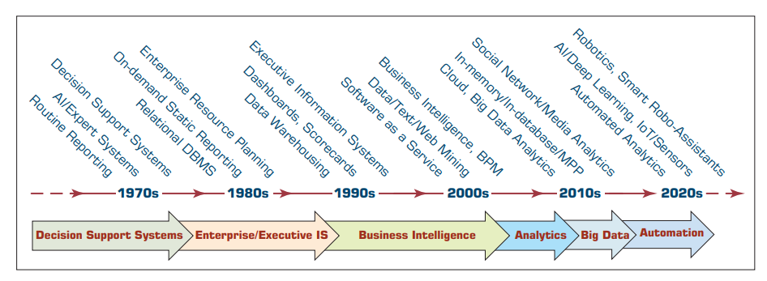
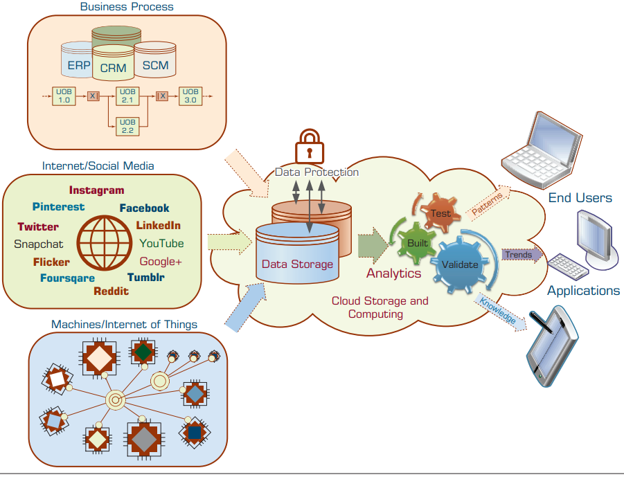
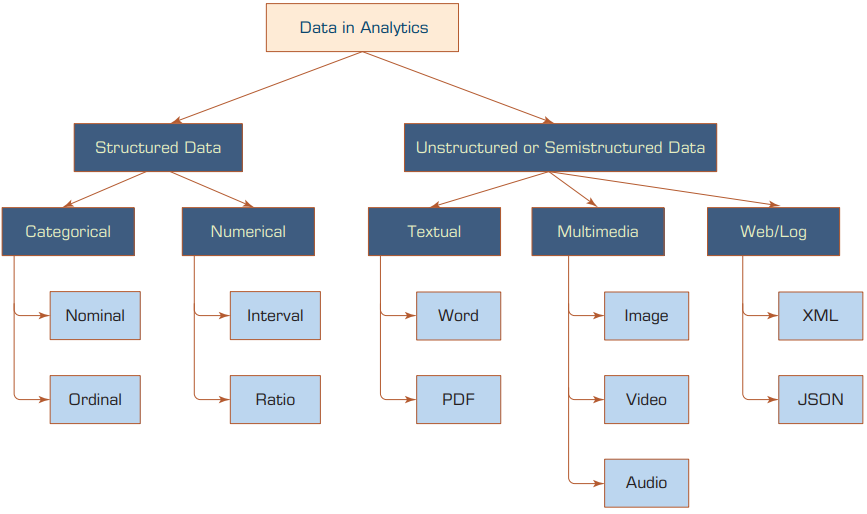
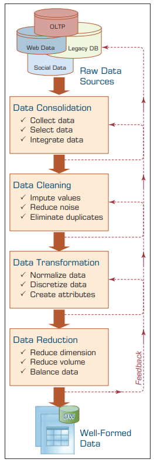
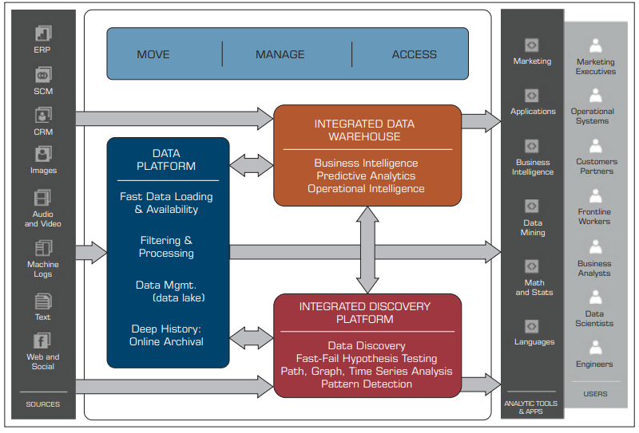

# Συστήματα Αποφάσεων, Διαχείριση Διεργασιών και Επιχειρηματική Ανάλυση
**Ενότητα 4: Business Analytics, Big Data & Process Mining**

Πανεπιστήμιο Δυτικής Αττικής

**Διδάσκων:** Ανάργυρος Τσαδήμας (<tsadimas@uniwa.gr>)

---

<!-- _class: xsmall -->
# Ενότητα 4 — Περίγραμμα

1. **Εισαγωγή & Ιστορική Εξέλιξη** — Από τα MIS & DSS στη Σύγχρονη Τεχνητή Νοημοσύνη
2. **Το Οικοσύστημα των Δεδομένων** — Data Warehouses, ERP & Κινητήριες Δυνάμεις DSS
3. **Από τα RDBMS στα Big Data** — Τα 5 V's των Μεγάλων Δεδομένων
4. **Ταξινομία της Αναλυτικής** — Descriptive, Predictive & Prescriptive Analytics
5. **Process Mining** — Ανακάλυψη, Συμμόρφωση & Βελτίωση (Ξυπνώντας τα Δεδομένα)
6. **Η Σύγκλιση (Convergence)** — AI, Data Science & Robotic Process Automation (RPA)

---

<!-- _class: xxsmall -->
# Η Ιστορική Εξέλιξη: Από το Reporting στην Τεχνητή Νοημοσύνη

Η ορολογία και οι δυνατότητες των συστημάτων υποστήριξης αποφάσεων εξελίχθηκαν ραγδαία τα τελευταία 50 χρόνια:

* **1970s — Θεμέλια (MIS & DSS):** 
  Μετάβαση από τις απλές αναφορές ρουτίνας στα Πληροφοριακά Συστήματα Διοίκησης (MIS) και στα πρώτα Συστήματα Υποστήριξης Αποφάσεων (DSS). Εστίαση σε ημι-δομημένα προβλήματα και μαθηματικά μοντέλα Επιχειρησιακής Έρευνας (OR).
* **1980s — Ενοποίηση & Έμπειρα Συστήματα:** 
  Εγκατάλειψη των απομονωμένων αρχείων χάρη στα Συστήματα Σχεσιακών Βάσεων Δεδομένων (RDBMS) και τα πρώτα ERP (ενιαία πηγή αλήθειας). Εμφάνιση των Έμπειρων Συστημάτων (Rule-based Expert Systems).
* **1990s — Αποθήκες Δεδομένων (DW) & EIS:** 
  Δημιουργία Data Warehouses για να μην επιβαρύνονται τα transactional συστήματα (ERP) από τις αναλύσεις. Ανάπτυξη Executive Information Systems (EIS) με γραφικά Dashboards και Scorecards.

* **2000s — Business Intelligence (BI):** 
  Τα συστήματα μετονομάζονται σε BI. Άνθιση της εξόρυξης δεδομένων και κειμένου (Data & Text Mining) για ανακάλυψη γνώσης. Ανάπτυξη μοντέλων Cloud / SaaS, κάνοντας την ανάλυση προσιτή σε μικρομεσαίες επιχειρήσεις.
* **2010s — Η Έκρηξη των Big Data:** 
  Νέες πηγές μη-δομημένων δεδομένων (Social Media, RFID, IoT). Εισαγωγή νέων τεχνολογιών υλισμικού και λογισμικού (όπως Hadoop, MapReduce, NoSQL, MPP) για τη διαχείριση του τεράστιου όγκου και της πολυπλοκότητας.
* **2020s+ — AI, Deep Learning & Αυτοματοποίηση:** 
  Streaming Analytics, ενσωμάτωση του IoT με Deep Learning (αναγνώριση εικόνας/φωνής), Smart Assistants (π.χ. Alexa) και παραγωγική ΤΝ (ChatGPT) που αλλάζουν ριζικά τον τρόπο αλληλεπίδρασης και λήψης αποφάσεων.

---

<!-- _class: xsmall -->
# Επιχειρηματική Ευφυΐα (Business Intelligence - BI)

Η **Επιχειρηματική Ευφυΐα (BI)** είναι ένας όρος-ομπρέλα που συνδυάζει αρχιτεκτονικές, εργαλεία, βάσεις και μεθοδολογίες για τη διαδραστική **μετατροπή δεδομένων σε πληροφορία, αποφάσεις και δράσεις**.

**Εξέλιξη & Κινητήριες Δυνάμεις**
* **Ιστορία:** Ξεκίνησε από τα στατικά MIS (70s) και τα EIS (80s). Ο όρος καθιερώθηκε από την Gartner (90s). Από το 2005+ ενσωματώνει δυνατότητες AI.
* **Ανάγκη για Ταχύτητα:** Οι εξαιρετικά συμπιεσμένοι επιχειρηματικοί κύκλοι απαιτούν τη "σωστή πληροφορία, τη σωστή στιγμή, στο σωστό μέρος".
* **Κανονιστική Συμμόρφωση:** Νομοθετικές απαιτήσεις (π.χ. Sarbanes-Oxley Act) υποχρεώνουν τις διοικήσεις να τεκμηριώνουν τις αποφάσεις τους με αξιόπιστα δεδομένα.

**Η Αρχιτεκτονική του BI (4 Πυλώνες)**

1. 🗄️ **Αποθήκη Δεδομένων (Data Warehouse - DW):** Η κεντρική, ενοποιημένη πηγή των ιστορικών και τρεχόντων δεδομένων.
2. ⚙️ **Business Analytics:** Εργαλεία για επεξεργασία, εξόρυξη (data mining) και βαθιά ανάλυση των δεδομένων.
3. 📈 **BPM (Business Performance Management):** Συστήματα για την παρακολούθηση και ανάλυση της επιχειρησιακής απόδοσης.
4. 💻 **Διεπαφή Χρήστη (User Interface):** Διαδραστικά εργαλεία οπτικοποίησης (π.χ. Dashboards & Scorecards) για άμεση πρόσβαση από τους decision makers.

---

# 1. Το Οικοσύστημα των Δεδομένων

* **Από το ERP στις Αποθήκες Δεδομένων (Data Warehouses):**
  * Το ERP (π.χ. SAP) καταγράφει τις συναλλαγές (OLTP). 
  * Για να κάνουμε ανάλυση, τα δεδομένα μεταφέρονται σε **Data Warehouses** και **Data Lakes**, όπου καθαρίζονται και ενοποιούνται.
* **Το «Ψηφιακό Αποτύπωμα» (Digital Footprint):**
  * Κάθε δραστηριότητα στο σύστημα αφήνει ίχνη. Απαραίτητα στοιχεία για ανάλυση:
    1. **Ποια υπόθεση;** (Case ID / π.χ. Αρ. Παραγγελίας)
    2. **Τι έγινε;** (Activity / π.χ. Έγκριση)
    3. **Πότε έγινε;** (Timestamp)

---

<!-- _class: xsmall -->
# 1.1 Κινητήριες Δυνάμεις Ανάπτυξης των DSS και της Αναλυτικής

Πέρα από την προφανή εξέλιξη σε υλισμικό (Hardware), λογισμικό (Software) και δίκτυα, οι παρακάτω παράγοντες έχουν επιταχύνει καθοριστικά τη χρήση Συστημάτων Υποστήριξης Αποφάσεων (DSS) και Business Analytics:

* 🤝 **Ομαδική Επικοινωνία & Συνεργασία:** Απομακρυσμένη λήψη αποφάσεων από ομάδες, εργαλεία συνεργασίας και άμεσος διαμοιρασμός δεδομένων σε πραγματικό χρόνο στην εφοδιαστική αλυσίδα.
* 🗄️ **Βελτιωμένη Διαχείριση Δεδομένων:** Γρήγορη, οικονομική και ασφαλής αποθήκευση/μετάδοση πολύπλοκων και ετερογενών δεδομένων (κείμενο, ήχος, βίντεο) εντός και εκτός οργανισμού.
* 🐘 **Διαχείριση Big Data & Data Warehouses:** Νέες τεχνολογίες (Cloud, Hadoop/Spark, παράλληλη επεξεργασία) ρίχνουν το κόστος και επιτρέπουν την ανάλυση τεράστιων όγκων δεδομένων.
* 🧠 **Υπέρβαση Γνωστικών Ορίων (Cognitive Limits):** Ο ανθρώπινος εγκέφαλος έχει περιορισμένη ικανότητα επεξεργασίας (Simon, 1977). Τα συστήματα ξεπερνούν αυτά τα όρια εξαλείφοντας τα λάθη.

* 📈 **Ενισχυμένη Αναλυτική Υποστήριξη:** Γρήγορη αξιολόγηση εναλλακτικών, βελτιωμένες προβλέψεις, ανάλυση ρίσκου και εκτέλεση πολύπλοκων προσομοιώσεων και σεναρίων.
* 📚 **Διαχείριση Γνώσης (Knowledge Management):** Αξιοποίηση εσωτερικής πληροφορίας και αλληλεπιδράσεων (π.χ. μέσω Text Analytics) για την παραγωγή αξίας και υποστήριξης των managers.
* 📱 **Υποστήριξη Παντού & Πάντα (Anywhere, Anytime):** Mobile τεχνολογίες επιτρέπουν την άμεση πρόσβαση σε δεδομένα και την ταχύτατη λήψη αποφάσεων εν κινήσει.
* 🤖 **Καινοτομία & Τεχνητή Νοημοσύνη (AI):** Η πολυπλοκότητα απαιτεί καινοτομία. Η ΤΝ ενσωματώνεται στην αναλυτική, δημιουργώντας ισχυρές συνέργειες σε κάθε βήμα λήψης αποφάσεων.

---

<!-- _class: xsmall -->
# 1.2 Ο Ρόλος της Τεχνητής Νοημοσύνης (AI) στη Λήψη Αποφάσεων

Η ΤΝ δεν υποστηρίζει απλώς, αλλά συχνά **αυτοματοποιεί πλήρως** τη λήψη αποφάσεων, λειτουργώντας ασύγκριτα πιο γρήγορα και με μεγαλύτερη συνέπεια από τον άνθρωπο.

**Υποστήριξη στα Στάδια της Απόφασης**
* **Αναγνώριση Προβλήματος:** Αυτόματη διάγνωση δυσλειτουργιών (π.χ. μέσω αισθητήρων IoT) και εντοπισμός τάσεων ή απειλών.
* **Εύρεση Εναλλακτικών:** Παραγωγή επιλογών μέσω Chatbots ή Έμπειρων Συστημάτων βάσει βέλτιστων πρακτικών.
* **Επιλογή Λύσης:** Πρόβλεψη του μελλοντικού αντικτύπου (Predictive Analysis) και ταχύτατη αξιολόγηση ρίσκου / σεναρίων.
* **Πλήρης Αυτοματοποίηση:** Ιδανική για ρουτινές, ταχύτατες αποφάσεις (π.χ. έγκριση μικροδανείων, αρχικό φιλτράρισμα βιογραφικών, δυναμική τιμολόγηση & συστήματα συστάσεων της Amazon).

**Κρίσιμοι Παράγοντες Επιτυχίας**
* **Φύση της Απόφασης & Ταχύτητα:** Αποφάσεις ρουτίνας που απαιτούν ταχύτητα κλασμάτων δευτερολέπτου (split-second) είναι οι πρώτες υποψήφιες για αυτοματοποίηση.
* **Τεχνολογική Εξέλιξη:** Μετάβαση από τα παραδοσιακά Rule-based συστήματα στη μηχανική/βαθιά μάθηση (ML/DL) και την αναγνώριση προτύπων (π.χ. βιομετρικά).
* **Ποιότητα Αλγορίθμων & Κανόνων:** Η "εξυπνάδα" του συστήματος εξαρτάται άμεσα από τους αλγόριθμους και τους επιχειρηματικούς κανόνες που το τροφοδοτούν.
* **Ανάλυση Κόστους-Οφέλους:** Είναι συχνά δύσκολη η μέτρηση της απόδοσης επένδυσης (ROI) και των υποκείμενων ρίσκων των μοντέλων ΤΝ σε μεγάλη κλίμακα.

---

<!-- _class: xsmall -->
# 1.3 Η Φύση των Δεδομένων στην Αναλυτική (Nature of Data Analytics)

Τα δεδομένα αποτελούν την **πρώτη ύλη** (raw material) για κάθε πρωτοβουλία BI, Business Analytics και Data Science. Χωρίς αυτά, η παραγωγή πληροφορίας και γνώσης είναι αδύνατη. 

**Βασικά Χαρακτηριστικά:**
* **Μορφή:** Μπορούν να είναι δομημένα (οργανωμένα για επεξεργασία) ή μη-δομημένα (π.χ. ελεύθερο κείμενο).
* **Ροή & Όγκος:** Από μικρά batches έως συνεχή ροή μεγάλων δεδομένων (Big Data) μέσω αισθητήρων (IoT) και web.

Για να είναι τα δεδομένα έτοιμα για ανάλυση (**analytics ready**), δεν αρκεί να είναι απλώς διαθέσιμα. Πρέπει να συμμορφώνονται με συγκεκριμένα **μετρικά ποιότητας**:

* 🛡️ **Αξιοπιστία Πηγής (Reliability):** Εγγυημένη προέλευση και καταλληλότητα της πηγής (αποφυγή αλλοιώσεων κατά τη μεταφορά).
* 🎯 **Ακρίβεια (Accuracy):** Τα δεδομένα αντικατοπτρίζουν σωστά την πραγματική κατάσταση, χωρίς σφάλματα.
* 🔓 **Προσβασιμότητα (Accessibility):** Εύκολη και άμεση διάθεση των δεδομένων στους αναλυτές, όταν τα χρειάζονται.
* 🔒 **Ασφάλεια & Ιδιωτικότητα (Security & Privacy):** Προστασία από μη εξουσιοδοτημένη πρόσβαση και τήρηση της νομοθεσίας (π.χ. HIPAA, GDPR).
* 💎 **Πλούτος (Richness):** Πληρότητα διαστάσεων και μεταβλητών για σωστή και ολιστική μοντελοποίηση.

* 🔄 **Συνέπεια (Consistency):** Απουσία συγκρούσεων κατά τη συγχώνευση (merge) δεδομένων από διαφορετικές πηγές.
* ⏱️ **Επικαιρότητα (Timeliness / Currency):** Τα δεδομένα είναι ενημερωμένα και συλλέγονται όσο πιο κοντά γίνεται στο χρόνο του γεγονότος.
* 🔬 **Λεπτομέρεια (Granularity):** Δεδομένα στο κατώτατο απαιτούμενο επίπεδο (κοκκοποίηση), ώστε να μην είναι απλώς γενικά αθροίσματα.
* ✅ **Εγκυρότητα (Validity):** Οι καταγεγραμμένες τιμές ανήκουν στα προκαθορισμένα αποδεκτά όρια και μορφότυπα.
* 📌 **Σχετικότητα (Relevancy):** Περιέχονται μόνο οι μεταβλητές που είναι πραγματικά σχετικές με το εκάστοτε πρόβλημα ανάλυσης.

---

<!-- _class: small -->
# 1.4 A Data to Knowledge Continuum
*(Το συνεχές από τα Δεδομένα στη Γνώση)*

Η εικόνα αυτή απεικονίζει οπτικά όσα συζητήσαμε για τη **Φύση των Δεδομένων**: το πώς η "ακατέργαστη πρώτη ύλη" (από ετερογενείς πηγές όπως IoT, Social Media, ERP) μετασχηματίζεται σταδιακά σε στρατηγική γνώση.

> 💡 **Σύνδεση:** Για να διασχίσουν τα δεδομένα με επιτυχία αυτό το "συνεχές" (pipeline) και να παράξουν αξιόπιστα μοτίβα (Patterns) και Γνώση (Knowledge), πρέπει απαραιτήτως να πληρούν τις **μετρικές ποιότητας (Analytics Readiness)** της προηγούμενης διαφάνειας!

---

<!-- _class: xsmall -->
# 1.5 Ταξινομία των Δεδομένων (Data Taxonomy)

Τα δεδομένα είναι το κατώτερο επίπεδο αφαίρεσης. Στο ανώτερο επίπεδο χωρίζονται σε **Δομημένα** (Structured) και **Μη Δομημένα** (Unstructured). Η Αναλυτική και το Data Mining εστιάζουν κυρίως στα δομημένα δεδομένα, τα οποία ταξινομούνται ως εξής:

**1. Κατηγορικά (Categorical) / Διακριτά**
Διαχωρίζουν τις μεταβλητές σε διακριτές ομάδες.

* **Ονομαστικά (Nominal):** Απλές ετικέτες ή κωδικοί *χωρίς ιεραρχία/τάξη*.
  * *Παράδειγμα:* Φύλο (Άρρεν/Θήλυ), Οικογενειακή κατάσταση. Μπορούν να είναι διωνυμικά (Binomial - Ναι/Όχι) ή πολυωνυμικά.
* **Τακτικά (Ordinal):** Ετικέτες που εμπεριέχουν *φυσική σειρά ή κατάταξη*.
  * *Παράδειγμα:* Πιστωτική βαθμολογία (Χαμηλή/Μεσαία/Υψηλή), Επίπεδο εκπαίδευσης. Μπορούν να βελτιώσουν την απόδοση μοντέλων (π.χ. ordinal logistic regression).

**2. Αριθμητικά (Numeric) / Συνεχή**
Μετρήσεις σε κλίμακα, με πραγματικούς ή ακέραιους αριθμούς (αναπαριστούν συνεχείς μετρήσεις).

* **Διαστήματος (Interval):** Κλίμακες *χωρίς* απόλυτο (φυσικό) μηδέν. 
  * *Παράδειγμα:* Θερμοκρασία σε Κελσίου (το 0 δεν σημαίνει απόλυτη απουσία ενέργειας).
* **Αναλογίας (Ratio):** Κλίμακες που διαθέτουν *απόλυτο μηδέν*.
  * *Παράδειγμα:* Μάζα, Απόσταση, Χρόνος, Θερμοκρασία σε Kelvin. Επιτρέπει τον υπολογισμό αναλογιών.

> ⚙️ **Data Transformation:** Η επιλογή αλγορίθμου υπαγορεύει τη μορφή. Π.χ. τα **Νευρωνικά Δίκτυα** απαιτούν *αριθμητικά* δεδομένα (άρα τα Nominal μετατρέπονται μέσω *Pseudo-variables / One-Hot Encoding*), ενώ παλαιότεροι αλγόριθμοι όπως ο **ID3** (Decision Trees) απαιτούν *κατηγορικά* δεδομένα, καθιστώντας απαραίτητο τον μετασχηματισμό/διακριτοποίηση.

---

<!-- _class: diagram-sm -->
# 1.5α Οπτική Αναπαράσταση Ταξινομίας Δεδομένων

---

<!-- _class: xsmall -->
# 1.6 Η Τέχνη και Επιστήμη της Προετοιμασίας Δεδομένων

Τα πραγματικά δεδομένα (raw data) είναι συχνά "βρώμικα", ασύμβατα και ανακριβή. Η προετοιμασία τους (**Data Preprocessing**) είναι η πιο χρονοβόρα αλλά και πιο κρίσιμη φάση πριν την εφαρμογή αλγορίθμων ανάλυσης. Περιλαμβάνει 4 κύρια στάδια:

**1. Ενοποίηση (Data Consolidation / Blending)**
*   Επιλογή σχετικών εγγραφών και φιλτράρισμα μη απαραίτητης πληροφορίας.
*   **Data Blending:** Συγχώνευση (merge) δεδομένων από πολλαπλές και ετερογενείς πηγές (π.χ. RDBMS, NoSQL, Cloud, Web Services, Social Media).

**2. Καθαρισμός (Data Cleaning / Scrubbing)**
*   **Ελλείπουσες τιμές (Missing values):** Εκτίμηση / συμπλήρωση με την πιο πιθανή τιμή (imputation) ή απόρριψη της εγγραφής.
*   **Ακραίες τιμές (Outliers) & Θόρυβος:** Εντοπισμός και εξομάλυνση (smoothing).
*   Αντιμετώπιση **ασυνεπειών** με χρήση της γνώσης του εκάστοτε πεδίου (domain knowledge).

**3. Μετασχηματισμός (Data Transformation)**
*   **Κανονικοποίηση (Normalization):** Κλιμάκωση (π.χ. min-max) ώστε καμία μεταβλητή να μην "επισκιάζει" άλλες (π.χ. το εισόδημα έναντι των ετών προϋπηρεσίας).
*   **Διακριτοποίηση / Άθροιση:** Μετατροπή αριθμητικών τιμών σε κατηγορικές (π.χ. χαμηλό, μεσαίο, υψηλό) ή ιεραρχική συμπύκνωση (π.χ. περιοχές αντί για πόλεις).
*   Δημιουργία **νέων παράγωγων μεταβλητών** (π.χ. `blood_match` αντί για χωριστούς τύπους αίματος).

**4. Μείωση Δεδομένων (Data Reduction)**
*   **Μείωση Διαστάσεων (Variables):** Επιλογή μόνο των σημαντικότερων μεταβλητών (PCA) για αποφυγή υπερβολικής πολυπλοκότητας.
*   **Δειγματοληψία εγγραφών (Cases):** Τυχαία ή διαστρωματωμένη (stratified) δειγματοληψία όταν τα δεδομένα είναι αχανή.
*   **Εξισορρόπηση (Balancing):** Υπερδειγματοληψία (oversampling) ή υποδειγματοληψία (undersampling) σε ασύμμετρα (skewed) δεδομένα για καλύτερα μοντέλα.

---

<!-- _class: xxsmall -->
# 1.7 Οπτικοποίηση της Διαδικασίας Προετοιμασίας

Η εικόνα αυτή συνοψίζει οπτικά τα 4 στάδια της προετοιμασίας δεδομένων:

1.  **Consolidation (Ενοποίηση):**
    *   Συλλογή, επιλογή και ενοποίηση (blending) δεδομένων από πολλαπλές πηγές.

2.  **Cleaning (Καθαρισμός):**
    *   Διόρθωση σφαλμάτων, συμπλήρωση ελλειπουσών τιμών (imputation) και εξομάλυνση ακραίων τιμών (outliers).

3.  **Transformation (Μετασχηματισμός):**
    *   Κανονικοποίηση (Normalization) για να έχουν οι μεταβλητές παρόμοια κλίμακα.
    *   Δημιουργία νέων, παράγωγων μεταβλητών (feature engineering).

4.  **Reduction (Μείωση):**
    *   Μείωση του αριθμού των μεταβλητών (π.χ. μέσω PCA) ή των εγγραφών (δειγματοληψία) για να γίνει η ανάλυση πιο αποδοτική.

---

<!-- _class: small -->
# 2. Ορισμός των Big Data (Μεγάλα Δεδομένα)

Ο όρος **Big Data** είναι *σχετικός*: το τι θεωρείται "μεγάλο" εξαρτάται από το μέγεθος του εκάστοτε οργανισμού. Δεν πρόκειται για εντελώς νέα έννοια (τα data warehouses υπάρχουν από τα 90s), αλλά για μια ραγδαία εξέλιξη στην κλίμακα (από Terabytes σε Exabytes) και στη μορφή.

> 💡 **Ορισμός:** Τα Big Data είναι δεδομένα που **ξεπερνούν τις δυνατότητες** των παραδοσιακών συστημάτων (υλικού και λογισμικού) να τα συλλέξουν, να τα διαχειριστούν και να τα επεξεργαστούν σε αποδεκτό χρονικό διάστημα.

**Από πού προέρχονται;**
Πρακτικά από παντού. Πηγές που παλαιότερα αγνοούνταν λόγω τεχνικών περιορισμών πλέον θεωρούνται "χρυσωρυχεία":

*   Web logs & Internet search indexes
*   Αισθητήρες, RFID & GPS (Internet of Things)

*   Κοινωνικά δίκτυα (Social Networks)
*   Αρχεία βίντεο, φωτογραφιών, κειμένου & ιατρικά αρχεία

⚠️ **Παρεξηγημένος όρος (Misnomer):** Η λέξη επικεντρώνεται μόνο στον "όγκο" (Big). Στην πραγματικότητα, τα Big Data δεν είναι απλώς "μεγάλα". Ορίζονται από πολλά περισσότερα χαρακτηριστικά...

---

<!-- _class: small -->
# 2.1 Τα Βασικά "V"s των Big Data (Volume, Velocity, Variety)

Τα παραδοσιακά συστήματα έφτασαν στα όριά τους. Αρχικά τα Big Data ορίστηκαν από τα τρία βασικά "V":

*   **Volume (Όγκος):** Εκθετική αύξηση από συναλλαγές, IoT, social media και GPS. Η πρόκληση πλέον δεν είναι το κόστος αποθήκευσης, αλλά ο **εντοπισμός της σχετικότητας** και η δημιουργία αξίας. Οι κλίμακες πέρασαν από τα Petabytes (PB) στα Zettabytes (ZB).
*   **Variety (Ποικιλία):** Το 80-85% των δεδομένων είναι μη-δομημένα ή ημι-δομημένα (κείμενα, βίντεο, audio, XML), ακατάλληλα για παραδοσιακά RDBMS, αλλά κρύβουν τεράστια αξία.
*   **Velocity (Ταχύτητα):** Η ταχύτητα παραγωγής και επεξεργασίας. Καθώς ο χρόνος περνά, η αξία της πληροφορίας μειώνεται. Απαιτείται μετάβαση από την ανάλυση ιστορικών δεδομένων (*at-rest analytics*) στην ανάλυση ροών σε πραγματικό χρόνο (*in-motion / data stream analytics*).

---

<!-- _class: small -->
# 2.2 Οι Νέες Διαστάσεις των Big Data

Εταιρείες κολοσσοί στο χώρο της αναλυτικής επέκτειναν τον ορισμό προσθέτοντας νέα "V":

*   **Veracity (Αξιοπιστία):** Όρος της IBM. Αφορά την ακρίβεια, την ποιότητα και την ειλικρίνεια των δεδομένων. Πώς διαχειριζόμαστε τον "θόρυβο" μετατρέποντάς τα σε αξιόπιστη γνώση.
*   **Variability (Μεταβλητότητα):** Όρος της SAS. Πέρα από τον όγκο και την ταχύτητα, οι ροές δεδομένων είναι συχνά **ασυνεπείς** με απότομες κορυφώσεις (peaks) λόγω γεγονότων, εποχικότητας ή social media trends.
*   🏆 **Value Proposition (Αξία):** Η κινητήριος δύναμη! Υπάρχει η αντίληψη ότι τα Big Data κρύβουν περισσότερα μοτίβα και ανωμαλίες από τα "μικρά" δεδομένα. Τα "Big Analytics" οδηγούν σε βαθύτερη γνώση και καλύτερες στρατηγικές αποφάσεις.

---

<!-- _class: small -->
# 2.3 Εννοιολογική Αρχιτεκτονική Big Data
*(A High-Level Conceptual Architecture)*

Η παρακάτω εικόνα απεικονίζει πώς τα ακατέργαστα Big Data (αριστερά) μετατρέπονται σταδιακά σε **επιχειρηματική γνώση (Business Insight)** μέσω συνδυασμού εργαλείων προηγμένης αναλυτικής, και διανέμονται σε διαφορετικούς χρήστες και ρόλους για ταχύτερη και καλύτερη λήψη αποφάσεων.

---

<!-- _class: xsmall -->
# 3. Η Ταξινομία της Αναλυτικής (Analytics Taxonomy)

Ο όρος **Αναλυτική (Analytics)** αντικαθιστά σταδιακά το BI. Σύμφωνα με την INFORMS, είναι ο συνδυασμός τεχνολογίας, διοικητικής επιστήμης και στατιστικής για την εξαγωγή στοχευμένων δράσεων. Χωρίζεται σε **3 αλληλένδετα επίπεδα**:

📊 **1. Περιγραφική Αναλυτική (Descriptive)**
* **Ερωτήσεις:** *Τι συνέβη; Τι συμβαίνει τώρα;*
* **Σκοπός:** Κατανόηση της τρέχουσας κατάστασης και των τάσεων μέσω της ενοποίησης ιστορικών δεδομένων (από DWs).
* **Εργαλεία:** Αναφορές, Dashboards, Οπτικοποίηση Δεδομένων.
* **Case Study (Silvaris):** Χρησιμοποίησε το Tableau για real-time οπτικοποίηση των logistics της, γλιτώνοντας 100άδες σελίδες αναφορών και βελτιώνοντας την στόχευση πελατών.

🎯 **2. Προβλεπτική Αναλυτική (Predictive)**
* **Ερωτήσεις:** *Τι θα συμβεί; Γιατί θα συμβεί;*
* **Σκοπός:** Ακριβείς προβλέψεις για το μέλλον (π.χ. customer churn, ανταπόκριση σε προσφορές, πιστωτικό ρίσκο).
* **Εργαλεία:** Data/Text Mining, Forecasting, Machine Learning (Αλγόριθμοι ταξινόμησης & ομαδοποίησης).

🚀 **3. Καθοδηγητική Αναλυτική (Prescriptive)**
* **Ερωτήσεις:** *Τι πρέπει να κάνω;*
* **Σκοπός:** Λήψη των βέλτιστων δυνατών αποφάσεων (actionable insights) βάσει των προβλέψεων.
* **Εργαλεία:** Βελτιστοποίηση (Optimization), Προσομοίωση, Έμπειρα Συστήματα.

---

# 4. Process Mining: Ξυπνώντας τα Δεδομένα

Η Επιστήμη Δεδομένων συναντά το BPM. Το Process Mining διαβάζει τα Event Logs και παράγει *αυτόματα* τα διαγράμματα:

* 🔍 **Discovery (Ανακάλυψη):** Το εργαλείο ανακαλύπτει τη *στυγνή αλήθεια*. Παράγει το "Spaghetti Model" – βλέπουμε παρακάμψεις που δεν υπάρχουν σε κανένα οργανόγραμμα.
* ⚖️ **Conformance Checking (Έλεγχος Συμμόρφωσης):** 
* Συγκρίνουμε το "Ιδανικό" BPMN με τα Πραγματικά Δεδομένα.
  * *Στόχος:* Εντοπισμός απάτης, Maverick Buying (αγορές εκτός διαδικασίας) και παραβιάσεων κανονισμών.
* ⏱️ **Enhancement (Βελτίωση & Ανάλυση Αιτιών):**
  * Εισαγωγή χρόνου και κόστους στο μοντέλο. Εντοπισμός των πραγματικών **Bottlenecks**.

---

# 5. Η Σύγκλιση: AI, Data Science & Process Automation

Το τελικό στάδιο του ψηφιακού μετασχηματισμού:

* **Cognitive Analytics & AI:** Συστήματα που μαθαίνουν από τα δεδομένα και κατανοούν πλαίσιο (context).
* **Από τη Γνώση στη Δράση (Actionable Insights):**
  * Όταν το Predictive μοντέλο προβλέψει ένα bottleneck στη διαδικασία, τι γίνεται;
  * Το σύστημα πυροδοτεί **Αυτοματοποιημένες Αποφάσεις (Automated Decision Making)**.
* **RPA (Robotic Process Automation):** Ψηφιακά «ρομποτάκια» που αναλαμβάνουν αυτόματα τα επαναλαμβανόμενα βήματα της διαδικασίας που εντοπίστηκαν μέσω του Process Mining, δουλεύοντας 24/7.

---

<!-- _class: xsmall -->
# Ενότητα 4 — Σύνοψη

| Θέμα | Βασικές Έννοιες |
|---|---|
| **Ιστορική Εξέλιξη & BI** | MIS, DSS, Data Warehouses, Business Intelligence, 4 Πυλώνες BI |
| **Οικοσύστημα & DSS** | Κινητήριες δυνάμεις (Συνεργασία, Cognitive limits, Cloud, Big Data, AI) |
| **Big Data** | Τα 5 V's: Volume, Velocity, Variety, Veracity, Value |
| **Analytics Taxonomy** | Descriptive (Τι έγινε;), Predictive (Τι θα γίνει;), Prescriptive (Τι να κάνω;) |
| **Process Mining** | Εξαγωγή γνώσης από Event Logs, Discovery, Conformance, Enhancement |
| **Σύγκλιση (Convergence)**| Συνδυασμός AI, Predictive Models και RPA για αυτοματοποίηση αποφάσεων |

---

<!-- _class: xsmall -->
# Ενότητα 4 — Βιβλιογραφία

**Κύρια Συγγράμματα:**
* **Sharda, R., Delen, D., & Turban, E.** (2023). *Analytics, Data Science, & Artificial Intelligence: Systems for Decision Support* (11th ed.). Pearson.

**Συμπληρωματικές Πηγές:**
* **Simon, H. A.** (1977). *The New Science of Management Decision*. Prentice-Hall. (Γνωστικά όρια στη λήψη αποφάσεων)
* **van der Aalst, W.** (2016). *Process Mining: Data Science in Action*. Springer.
* **Gorry, G. A., & Scott-Morton, M. S.** (1971). *A Framework for Management Information Systems*. Sloan Management Review.
* **Keen, P. G. W., & Scott-Morton, M. S.** (1978). *Decision Support Systems: An Organizational Perspective*. Addison-Wesley.