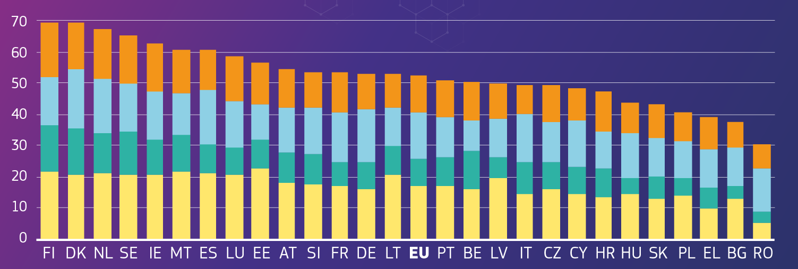
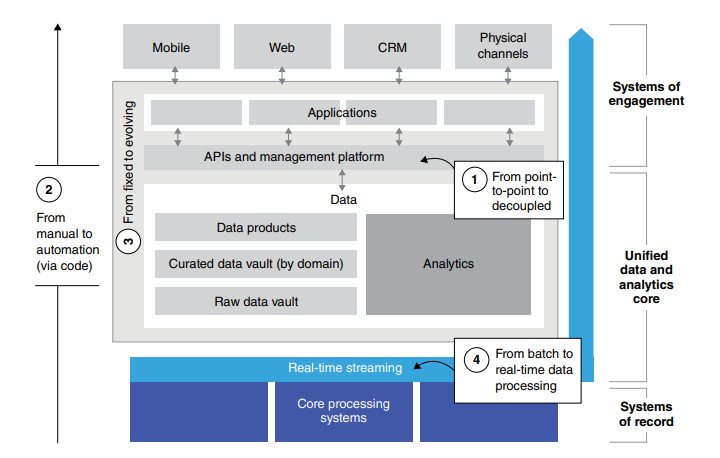
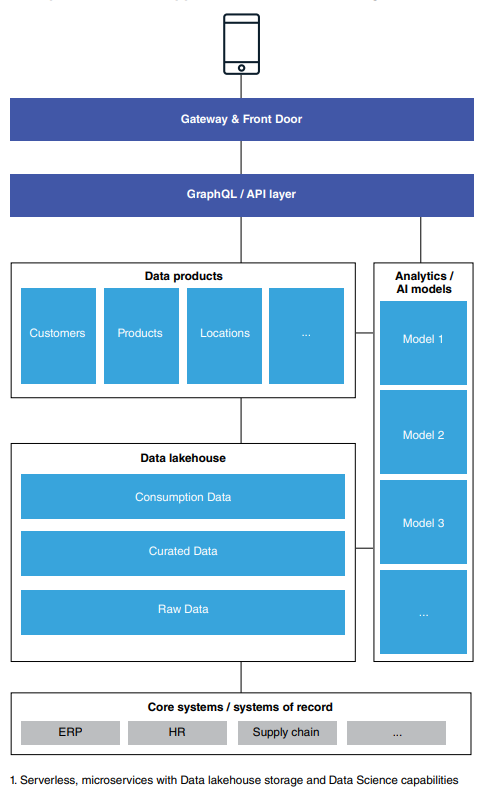
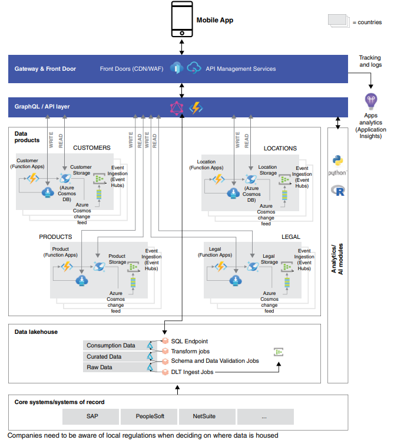
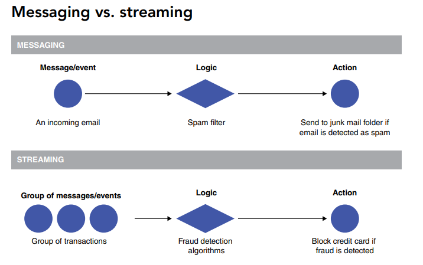
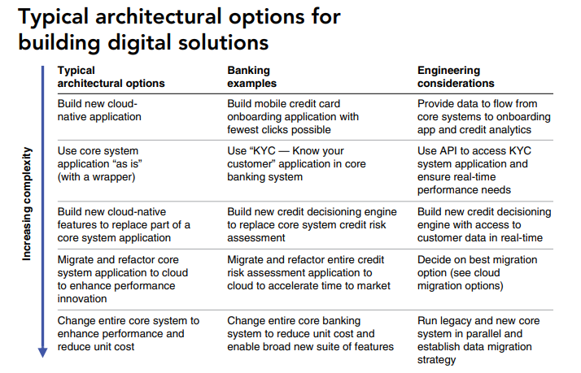
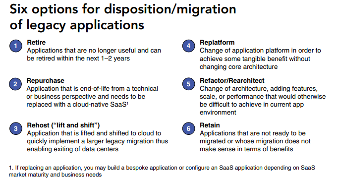
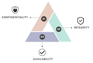

<div style="text-align:center; margin-bottom:16px;">


</div>

# Συστήματα Αποφάσεων, Διαχείριση Διεργασιών και Επιχειρηματική Ανάλυση
**Ενότητα 5: Ψηφιακός Μετασχηματισμός & Καινοτόμα Οικοσυστήματα**
Πανεπιστήμιο Δυτικής Αττικής

**Διδάσκων:** Ανάργυρος Τσαδήμας (<tsadimas@uniwa.gr>)

<!--
🗣️ **Καλωσόρισμα:**
Η ενότητα αυτή κλείνει τον κύκλο του μαθήματος: αφού αναλύσαμε πώς λαμβάνονται αποφάσεις, πώς μοντελοποιούνται διεργασίες και πώς αξιοποιούνται τα δεδομένα, τώρα εξετάζουμε το **ευρύτερο οικοσύστημα** μέσα στο οποίο λειτουργούν οι σύγχρονοι οργανισμοί — επιχειρήσεις, κράτη και πόλεις.

💡 **Σημείο έμφασης:**
Ο ψηφιακός μετασχηματισμός δεν είναι μόνο τεχνολογία. Είναι αλλαγή νοοτροπίας, οργάνωσης και στρατηγικής. Τα θέματα που θα δούμε (Industry 4.0, e-Business, e-Governance, Smart Cities) αποτελούν τον τρόπο με τον οποίο αυτή η αλλαγή εκφράζεται σε διαφορετικά επίπεδα.
-->

---

<!-- _class: small -->
# Ενότητα 5 — Περίγραμμα

0. **Ψηφιακός Μετασχηματισμός — Θεμέλια & Ορισμοί**
 — Ορισμός · Επίπεδα (Digitization → DT) · Παράγοντες Επιτυχίας · 5 Πεδία (Rogers, 2016)
1. **Industry 4.0 & Τεχνολογίες Εφαρμογής**
 — IoT · Digital Twins · Smart Factory · CPS · Smart Connected Products · Ψηφιακή Ωριμότητα
2. **e-Business: Ψηφιακός Μετασχηματισμός Επιχειρήσεων**
 — Μοντέλα e-Commerce · Disruptive Μοντέλα · BPR
3. **e-Governance & Ευρωπαϊκό Πλαίσιο Διαλειτουργικότητας (EIF)**
 — e-Government vs. e-Governance · Στάδια Ωριμότητας · EIF · Δείκτες (DESI, GDI, IDI)
4. **Smart Cities (Έξυπνες Πόλεις)**
 — Πυλώνες · Αρχιτεκτονική · Εφαρμογές · Προκλήσεις
5. **Οικοσύστημα Εργαλείων & Τεχνολογιών Ψηφιακού Μετασχηματισμού**
 — BPM & Hyperautomation · Data & Analytics · Cloud Native · IoT Platforms · Digital Twins · CRM/ERP & Collaboration
6. **McKinsey Rewired — Τεχνολογική Αρχιτεκτονική**
 — 6 Πυλώνες · Αποσυνδεδεμένη Αρχιτεκτονική · Στρατηγική Cloud · Kubeflow MLOps Platform
7. **Ασφάλεια Πληροφοριών (Information Security)**
 — CIA Triad · Περιουσιακά Στοιχεία Πληροφορίας · Απειλές & MOA · Αρχές Ασφάλειας · Ταξινόμηση · Social Engineering · Κωδικοί & MFA · Τηλεργασία · Διαχείριση Περιστατικών · ISO 27001 · GDPR · ITSRM

<!--
🗣️ **Επισκόπηση:**
Παρατηρήστε τη λογική ιεράρχηση: ξεκινάμε από το επίπεδο της **παραγωγής** (Industry 4.0), ανεβαίνουμε στο επίπεδο της **επιχείρησης** (e-Business), έπειτα στο επίπεδο του **κράτους** (e-Governance) και τελικά στο επίπεδο της **πόλης** (Smart Cities). Στο τέλος ενοποιούμε όλα αυτά στο **οικοσύστημα εργαλείων** (Ενότητα 5) και στο **McKinsey πλαίσιο** (Ενότητα 6). Κάθε ενότητα χτίζει πάνω στην προηγούμενη.
-->

---

<!-- _class: small -->
# 0. Ψηφιακός Μετασχηματισμός — Θεμέλια & Ορισμοί

<!--
🗣️ **Εισαγωγή ενότητας:**
Ξεκινάμε με τη θεωρητική βάση — τι σημαίνει πραγματικά «ψηφιακός μετασχηματισμός» και γιατί διαφέρει από την απλή ψηφιοποίηση. Πολλές εταιρείες νομίζουν ότι αγοράζοντας cloud ή software κάνουν ψηφιακό μετασχηματισμό. Δεν είναι έτσι. Ο DX είναι αλλαγή στρατηγικής, κουλτούρας και μοντέλου λειτουργίας — η τεχνολογία είναι το μέσο, όχι ο σκοπός.
-->

---

<!-- _class: xsmall -->
# 0.1 Τι είναι ο Ψηφιακός Μετασχηματισμός

**Ψηφιακός μετασχηματισμός:** ενσωμάτωση ψηφιακών τεχνολογιών σε όλες τις πτυχές ενός οργανισμού με σκοπό τη ριζική αλλαγή του τρόπου λειτουργίας και δημιουργίας αξίας.

**Τρεις βασικές διαστάσεις**

* ⚙️ **Διαδικασίες** — επανεξέταση & αυτοματοποίηση
* 🏛️ **Κουλτούρα** — καινοτομία, συνεργασία, ανοιχτή επικοινωνία
* 🎯 **Στρατηγική** — ευθυγράμμιση επένδυσης με επιχειρηματικούς στόχους

> ⚠️ Δεν αρκεί η υιοθέτηση νέων εργαλείων — απαιτείται αλλαγή νοοτροπίας.

<!--
🗣️ **Βασικό μήνυμα:** Δεν είναι "αγορά νέου λογισμικού". Πολλές επιχειρήσεις αποτυγχάνουν γιατί επενδύουν σε τεχνολογία αλλά παραλείπουν την αλλαγή κουλτούρας και στρατηγικής.
-->

---

<!-- _class: xxsmall -->
# 0.1 — Βασικές Τεχνολογίες Ψηφιακού Μετασχηματισμού

| Τεχνολογία | Ρόλος στον ΨΜ |
|-----------|--------------|
| ☁️ Cloud | Ευέλικτη, επεκτάσιμη υποδομή χωρίς κόστος εγκατάστασης |
| 🔗 IoT | Σύνδεση φυσικού & ψηφιακού κόσμου, real-time δεδομένα |
| 🤖 AI / ML | Αυτοματοποίηση αποφάσεων, πρόβλεψη, εξατομίκευση |
| 📊 Big Data | Ανάλυση μεγάλου όγκου δεδομένων για στρατηγικές αποφάσεις |
| ⛓️ Blockchain | Αμετάβλητο κατανεμημένο αρχείο — **smart contracts**, **supply chain** tracking, **ψηφιακή ταυτότητα**, **DeFi** |
| 📡 5G | Υψηλής ταχύτητας συνδεσιμότητα — ενεργοποιεί IoT & αυτόνομα οχήματα |
| 🖥️ Edge Computing | Επεξεργασία στην πηγή δεδομένων (χαμηλή καθυστέρηση) |
| 🥽 AR / VR | Εκπαίδευση, απομακρυσμένη συντήρηση, εμπειρία πελάτη |
| 🔐 Cybersecurity | Προϋπόθεση εμπιστοσύνης σε κάθε ψηφιακή υποδομή |

<!--
🗣️ **Συνδεδεμένες τεχνολογίες:** Καμία δεν λειτουργεί μεμονωμένα. Παράδειγμα: ένα αυτόνομο όχημα συνδυάζει *IoT* (αισθητήρες), *Edge Computing* (επεξεργασία επί τόπου), *5G* (επικοινωνία), *AI/ML* (αποφάσεις οδήγησης) και *Cybersecurity* (ασφαλής επικοινωνία V2V/V2I). Όλα ταυτόχρονα, σε <10ms.

💡 **Blockchain πέρα από crypto:** Ρωτήστε: "Τι γνωρίζετε για blockchain εκτός από bitcoin?" Η πραγματική επιχειρηματική αξία είναι η *αμετάβλητη καταγραφή συναλλαγών* — supply chain traceability, έγγραφα ιδιοκτησίας, ψηφιακές ταυτότητες, smart contracts χωρίς μεσάζοντες.

⚡ **Edge vs Cloud latency:** Γιατί χρειαζόμαστε edge αν έχουμε cloud; Το round-trip σε cloud είναι 30–80ms. Ένα χειρουργικό ρομπότ ή αυτόνομο όχημα χρειάζεται απόφαση <5ms — άρα η επεξεργασία γίνεται *τοπικά, στη συσκευή*. Το cloud λαμβάνει μόνο τα aggregated αποτελέσματα.
-->

---

<!-- _class: xsmall -->
# 0.1 — Πεδία Εφαρμογής Ψηφιακού Μετασχηματισμού

| Τομέας | Παραδείγματα |
|--------|-------------|
| 🏭 Επιχειρήσεις | Αυτοματοποίηση, νέα επιχ. μοντέλα |
| 🏛️ Δημόσιος | e-Government, ψηφιακές υπηρεσίες |
| 🎓 Εκπαίδευση | e-Learning, εξ αποστάσεως |
| 🏥 Υγεία | Τηλεϊατρική, ηλ. αρχεία |
| 🏙️ Κοινωνία | Smart Cities, ψηφιακή συμμετοχή |

<!--
🗣️ **Επιτάχυνση λόγω COVID-19:** Η πανδημία επιτάχυνε τον ψηφιακό μετασχηματισμό κατά εκτιμώμενα 3–5 χρόνια (McKinsey, 2020). Η τηλεϊατρική αυξήθηκε 50x σε εβδομάδες. Το e-learning συγκράτησε 1,6 δισ. μαθητές σε lockdown. Αυτό αποδεικνύει ότι ο ΨΜ είναι *στρατηγική ανάγκη*, όχι επιλογή.

🏛️ **Ελληνικό πλαίσιο:** gov.gr (ενιαίο σημείο εξυπηρέτησης), ΑΑΔΕ myDATA (real-time φορολογικά δεδομένα), ηλεκτρονική συνταγογράφηση (100% ψηφιακή από 2014), KEP digital. Η Ελλάδα βελτιώθηκε αισθητά στον DESI Index 2023 αλλά παραμένει κάτω του μέσου ΕΕ στις ψηφιακές δεξιότητες.

💬 **Ερώτηση για διάλογο:** "Ποιον τομέα θεωρείτε πιο πίσω στον ψηφιακό μετασχηματισμό στην Ελλάδα;" — Ανοίγει συζήτηση για εμπόδια: νομοθεσία, κουλτούρα, ψηφιακές δεξιότητες, υποδομή.
-->

---

<!-- _class: xsmall -->
# 0.2 Digitization & Digitalization

Τρεις συγγενείς αλλά διαφορετικές έννοιες — συχνά χρησιμοποιούνται εναλλακτικά, **λανθασμένα**.

<div class="columns">
<div>

**1. Ψηφιοποίηση (Digitization)**
Μετατροπή **αναλογικών δεδομένων σε ψηφιακή μορφή**.
* Σάρωση εγγράφου → PDF
* Αποθήκευση δεδομένων σε ψηφιακή βάση
* Διευκολύνει την εργασία: ταχύτερη αναζήτηση, ελαχιστοποίηση χρόνου διαχείρισης
* ⚠️ Δεν αλλάζει τη διαδικασία — απλώς τη μεταφέρει σε ψηφιακό μέσο

🛠️ **Εργαλεία:** Object storage ([MinIO](https://min.io/), Amazon S3), σαρωτές, OCR (Tesseract, Adobe Acrobat)

</div>
<div>

**2. Ψηφιακή Εξειδίκευση (Digitalization)**
Χρήση ψηφιακών τεχνολογιών για **βελτίωση υπαρχουσών διαδικασιών**.
* Αυτοματοποίηση ροής εγκρίσεων (workflow)
* Εφαρμογή νέων εργαλείων παρακολούθησης
* Βελτιώνει την αποδοτικότητα χωρίς ριζική αλλαγή

🛠️ **Εργαλεία:** BPM/Workflow ([Camunda](https://camunda.com/), [SAP Signavio](https://www.signavio.com/)), RPA (UiPath, Automation Anywhere), Παρακολούθηση διαδικασιών ([Grafana](https://grafana.com/), [Prometheus](https://prometheus.io/), Kibana)

</div>
</div>

<!--
🗣️ **Κοινό λάθος — "Digitization Theater":** Πολλοί οργανισμοί αντικαθιστούν χάρτινα έντυπα με PDF αλλά εξακολουθούν να τα στέλνουν με email και να τα επεξεργάζονται χειροκίνητα. Αποτέλεσμα: ίδια διαδικασία, ψηφιακό μέσο. Αυτό είναι *digitization χωρίς digitalization* — η παγίδα.

⚠️ **Παράδειγμα παγίδας:** Νοσοκομείο σκανάρει ιατρικούς φακέλους (✅ digitization) αλλά ο γιατρός εξακολουθεί να τους ψάχνει χειροκίνητα στο αρχείο γιατί δεν υπάρχει indexing/search (❌ δεν έγινε digitalization). Επένδυση χωρίς αξία.

🎯 **Άσκηση 2 λεπτών:** "Δώστε ένα παράδειγμα και για τα τρία επίπεδα από έναν τομέα που γνωρίζετε" (τράπεζα, νοσοκομείο, σχολείο, logistics). Βοηθά στην εμπέδωση των διαφορών.
-->

---

<!-- _class: xsmall -->
# 0.2 — Digital Transformation & Σύγκριση

**3. Ψηφιακός Μετασχηματισμός (Digital Transformation)**
**Ριζική, ολιστική προσέγγιση** — πλήρης επανεξέταση επιχειρηματικών διαδικασιών, μοντέλων & τρόπων δημιουργίας αξίας. Απαιτεί **στρατηγική προσαρμογή** και **αλλαγή κουλτούρας**.

| Επίπεδο | Παράδειγμα | Τεχνολογίες |
|---------|-----------|-------------|
| **Digitization** | Σκανάρισμα τιμολογίων σε PDF | MinIO/S3, OCR (Tesseract) |
| **Digitalization** | Αυτόματη ροή έγκρισης τιμολογίων | Camunda, Signavio, Grafana |
| **Digital Transformation** | Πλήρως αυτόματη αλυσίδα προμηθειών με AI — αλλαγή επιχειρηματικού μοντέλου | AI/ML platforms, ERP, Data Lakes |

<div class="columns">
<div>

🛠️ **Εργαλεία DT:**
* Cloud (AWS, Azure, GCP)
* Data platforms (Databricks, Snowflake)
* AI/ML (MLflow, Kubeflow)

</div>
<div>

> 💡 Παροχή laptop στους υπαλλήλους ≠ ψηφιακός μετασχηματισμός. Ο μετασχηματισμός **αναθεωρεί ριζικά** διαδικασίες, μοντέλα & τρόπους δημιουργίας αξίας.

</div>
</div>

<!--
🗣️ **Αναλογία:**
Digitization: Φωτογράφιση ενός βιβλίου. Digitalization: Δημιουργία e-book με clickable links. Digital Transformation: Αντικατάσταση του βιβλίου με διαδραστική πλατφόρμα μάθησης που προσαρμόζεται στον αναγνώστη — εντελώς διαφορετικό μοντέλο.
-->

---

<!-- _class: xsmall -->
# 0.3 Παράγοντες Επιτυχίας Ψηφιακού Μετασχηματισμού

Η επιτυχία εξαρτάται από την **ταυτόχρονη παρουσία** πολλών κρίσιμων παραγόντων — η τεχνολογία μόνη της δεν αρκεί.

<div class="columns">
<div>

🏛️ **Οργανωτική Κουλτούρα**
Προάγει καινοτομία, ανοιχτή επικοινωνία, συνεργασία και προσαρμοστικότητα. Οι οργανισμοί πρέπει να ενθαρρύνουν τη **διαρκή μάθηση** και να εξοπλίζουν τους εργαζομένους με κατάλληλα εργαλεία & δεξιότητες.

🎯 **Στρατηγική Ευθυγράμμιση**
Σαφές όραμα για το πώς οι ψηφιακές τεχνολογίες συμβάλλουν στους επιχειρηματικούς στόχους. Συνεχής αναπροσαρμογή καθώς εξελίσσονται τεχνολογίες & αγορά.

💰 **Επένδυση σε Νέες Τεχνολογίες**
Αναβάθμιση υποδομών, υιοθέτηση νέων λύσεων, αξιοποίηση τεχνολογιών για βελτίωση διαδικασιών & υπηρεσιών.

🎓 **Ανάπτυξη Δεξιοτήτων**
Εξειδικευμένες γνώσεις σε πληροφορική, διαχείριση δεδομένων, ασφάλεια πληροφοριών και καινοτομία. Συνεχής εκπαίδευση & upskilling.

</div>
<div>


👑 **Ηγεσία**
Η κρίσιμη "ανθρώπινη" διάσταση — αναγνώριση ευκαιριών, διαχείριση αλλαγής, ενθάρρυνση καινοτομίας.

**Σύνοψη:**

| Παράγοντας | Χωρίς αυτόν… |
|-----------|--------------|
| 🏛️ Κουλτούρα | Η τεχνολογία δεν αξιοποιείται |
| 🎯 Στρατηγική | Οι επενδύσεις διασκορπίζονται |
| 💰 Επένδυση | Ο μετασχηματισμός σταματά |
| 🎓 Δεξιότητες | Τα εργαλεία παραμένουν αναξιοποίητα |
| 👑 Ηγεσία | Ο μετασχηματισμός δεν ξεκινά ποτέ |

> 📖 *Πηγή: Τερροβίτη Ι. (2024). «Ο ψηφιακός μετασχηματισμός και η χρήση της τεχνητής νοημοσύνης στα τμήματα προμηθειών». ΠΑΟΕΣ/AUEB. CC BY 4.0.*

</div>
</div>

<!--
🗣️ **McKinsey connection:**
Αυτοί οι παράγοντες επιτυχίας αντιστοιχούν άμεσα στους 6 πυλώνες του McKinsey Rewired (ενότητα 5): talent, operating model, technology, data, adoption, business roadmap. Ο κόκκινος νήτος είναι ο ίδιος.
-->

---

<!-- _class: small -->
# 1. Industry 4.0 & Τεχνολογίες Εφαρμογής

<!--
🗣️ **Εισαγωγή ενότητας:**
Η ενότητα αυτή εξετάζει την 4η Βιομηχανική Επανάσταση και τις τεχνολογίες που την υλοποιούν: IoT, Digital Twins, Smart Factories, Blockchain, CPS. Βασικό μήνυμα: το Industry 4.0 δεν αφορά μόνο τη βιομηχανία — αφορά κάθε οργανισμό που χρησιμοποιεί φυσικές συσκευές ή παραγωγικές διεργασίες.
-->

---

<!-- _class: xsmall -->
# 1.1 Τι είναι το Industry 4.0; Η 4η Βιομηχανική Επανάσταση

Ο όρος **Industry 4.0** επινοήθηκε στη Γερμανία (2011) για να περιγράψει τη **4η Βιομηχανική Επανάσταση**: τη σύγκλιση του φυσικού κόσμου παραγωγής με ψηφιακές τεχνολογίες, δικτύωση και ανάλυση δεδομένων σε πραγματικό χρόνο.

<div class="columns">
<div>

**Οι Τέσσερις Βιομηχανικές Επαναστάσεις**

* **1η (1760–1840):** Ατμός & μηχανοποίηση. Μετάβαση από χειροποίητη στη μηχανική παραγωγή. (π.χ. υφαντουργεία).
* **2η (1870–1914):** Ηλεκτρισμός, ατσάλι, εργοστασιακή γραμμή παραγωγής (π.χ. Ford). Mass production.
* **3η (1960–2000):** Ηλεκτρονική, αυτοματισμός, ρομπότ και πρώτα πληροφοριακά συστήματα (ERP, CNC).
* **4η (2011–σήμερα):** Ψηφιοποίηση, IoT, AI, Big Data, Cloud, Cyber-Physical Systems (CPS). Τα εργοστάσια "σκέφτονται".

</div>
<div>

**Βασικές Αρχές του Industry 4.0**

* 🔗 **Διασυνδεσιμότητα (Interconnection):** Μηχανές, αισθητήρες, εργαζόμενοι και συστήματα επικοινωνούν μεταξύ τους μέσω IoT και IIoT (Industrial IoT).
* 🌐 **Διαφάνεια Πληροφορίας (Information Transparency):** Τα ψηφιακά συστήματα δημιουργούν ένα "ψηφιακό αντίγραφο" (shadow) του φυσικού κόσμου μέσω αισθητήρων.
* 🤝 **Τεχνική Βοήθεια (Technical Assistance):** Τα συστήματα υποστηρίζουν τους ανθρώπους σε δύσκολες ή επικίνδυνες εργασίες (cobots, AR).
* 🧠 **Αποκεντρωμένες Αποφάσεις (Decentralized Decisions):** Τα Cyber-Physical Systems παίρνουν αποφάσεις αυτόνομα και κοινοποιούν αποτελέσματα.

</div>
</div>

<!-- 
🗣️ **Η αναλογία για τη 4η Επανάσταση:**
Η 1η Επανάσταση έδωσε στον άνθρωπο τεχνητούς μυς (ατμός). Η 2η, ατομική δύναμη (ηλεκτρισμός). Η 3η, την πρώτη "μνήμη" (ψηφιακή αποθήκευση). Η 4η **δίνει στις μηχανές νοημοσύνη**: η γραμμή παραγωγής δεν απλώς παράγει, αλλά ανιχνεύει αποκλίσεις, προβλέπει βλάβες και αυτό-βελτιστοποιεί τις ρυθμίσεις της.

💡 **Παράδειγμα:** Ένα "έξυπνο" εργοστάσιο αυτοκινήτων (π.χ. BMW Group Werk 4.0) χρησιμοποιεί εκατοντάδες αισθητήρες που στέλνουν δεδομένα σε πραγματικό χρόνο, Digital Twins για την παρακολούθηση της γραμμής συναρμολόγησης και AI για την πρόβλεψη βλαβών 72 ώρες πριν συμβούν.
-->

---

<!-- _class: xxsmall -->
# 1.2 Internet of Things (IoT): Η Νευρική Στοά του Ψηφιακού Κόσμου

Το **Internet of Things (IoT)** είναι το δίκτυο φυσικών αντικειμένων ("πραγμάτων") ενσωματωμένων με αισθητήρες, λογισμικό και δικτυακές συνδέσεις που τους επιτρέπουν να **συλλέγουν και να ανταλλάσσουν δεδομένα** χωρίς ανθρώπινη παρέμβαση.

<div class="columns">
<div>

**Δομή Ενός IoT Συστήματος**

1. 📡 **Αισθητήρες & Επενεργητές (Sensors & Actuators):** Συλλέγουν δεδομένα από το περιβάλλον (θερμοκρασία, πίεση, κίνηση, GPS) ή εκτελούν εντολές (άνοιγμα βαλβίδας, αλλαγή ταχύτητας).
2. 🌐 **Δικτύωση (Connectivity):** Πρωτόκολλα μεταφοράς δεδομένων: Wi-Fi, Bluetooth, LoRaWAN, Zigbee, 5G. Το 5G είναι καθοριστικό για το IIoT λόγω χαμηλής καθυστέρησης (latency).
3. ☁️ **Πλατφόρμα & Cloud:** Αποθήκευση, επεξεργασία και ανάλυση στο cloud (AWS IoT, Azure IoT Hub, Google Cloud IoT).
4. 🖥️ **Εφαρμογές & Διεπαφές:** Dashboards, mobile apps, αυτοματισμοί και API για ενσωμάτωση με ERP/CRM.

</div>
<div>

**Κλάδοι Εφαρμογής IoT**

* 🏭 **IIoT — Industrial IoT (Βιομηχανία):** Υποσύνολο IoT για βιομηχανικά περιβάλλοντα — υψηλές απαιτήσεις αξιοπιστίας, ασφάλειας και πραγματικού χρόνου. Βασίζεται στη σύγκλιση **OT** (Operational Technology: PLC, SCADA) με **IT** (ERP, cloud). Πρωτόκολλα: **MQTT, OPC-UA, Modbus**. Εφαρμογές: predictive maintenance, έλεγχος γραμμών παραγωγής, ποιοτικός έλεγχος με computer vision.
* 🏥 **Healthcare IoT:** Wearables (smartwatches), remote patient monitoring, έξυπνα νοσοκομεία.
* 🌾 **Γεωργία (AgriTech):** Έξυπνη άρδευση, δρόνοι καλλιεργειών, αισθητήρες εδάφους.
* 🏠 **Έξυπνο Σπίτι (Smart Home):** Θερμοστάτες (Nest), ηχεία AI (Alexa/Google Home), ασφάλεια.
* 🚗 **Αυτόνομα Οχήματα:** V2V (vehicle-to-vehicle) και V2I (vehicle-to-infrastructure) επικοινωνία.
* 🏙️ **Smart Cities:** Έξυπνα φανάρια, διαχείριση απορριμμάτων, παρακολούθηση ποιότητας αέρα.

</div>
</div>

> ⚠️ **Ασφάλεια IoT:** Αποτελεί τον #1 κίνδυνο. Εκατομμύρια συσκευές με default passwords, ευπάθειες firmware και έλλειψη κρυπτογράφησης. Η αρχιτεκτονική Zero-Trust είναι πλέον απαραίτητη για IIoT αναπτύξεις.

<!-- 
💡 **Αριθμοί που εντυπωσιάζουν:**
Σύμφωνα με την Gartner, υπάρχουν ήδη πάνω από **15 δισεκατομμύρια** IoT συσκευές συνδεδεμένες στο internet (2024). Μέχρι το 2030 αναμένεται να φτάσουν τα **30 δισ.**. Για να γίνει κατανοητό αυτό το νούμερο, αναλογεί σε ~3,7 συσκευές ανά άνθρωπο στον πλανήτη.

🗣️ **Ερώτηση για διάλογο:**
"Έχετε smartwatch ή smart TV στο σπίτι σας; Τι δεδομένα νομίζετε ότι στέλνει;" (Heartrate, ώρες ύπνου, τι βλέπετε, πότε είστε σπίτι). Αυτό εισάγει φυσικά τη συζήτηση για ασφάλεια και GDPR.

⚡ **5G & IIoT:**
Το 5G δεν είναι απλώς "γρήγορο internet". Η καθυστέρηση (latency) <1ms του 5G επιτρέπει την **ανεξάρτητη λήψη αποφάσεων σε πραγματικό χρόνο** σε βιομηχανικά ρομπότ, κάτι που με το 4G ήταν αδύνατο λόγω 30-50ms καθυστέρησης.
-->

---

<!-- _class: small -->
# 1.3 Digital Twins (Ψηφιακά Δίδυμα)

Ένα **Digital Twin** είναι μια **ζωντανή ψηφιακή αναπαράσταση** ενός φυσικού αντικειμένου, διεργασίας ή συστήματος, που τροφοδοτείται σε πραγματικό χρόνο από δεδομένα IoT και παρέχει τη δυνατότητα προσομοίωσης, ανάλυσης και βελτιστοποίησης.

> 💡 **Η Ουσία:** Δεν είναι απλώς ένα 3D μοντέλο ή σχέδιο. Είναι ένα ψηφιακό αντίγραφο που **ζει και αναπνέει** μαζί με το πραγματικό του αντίστοιχο.

<div class="columns">
<div>

**Τρεις Τύποι Digital Twins**

* 🔩 **Product Twin:** Αναπαράσταση ενός συγκεκριμένου προϊόντος (π.χ. κινητήρας αεροπλάνου). Παρακολουθεί φθορά, κόπωση υλικών, θερμοκρασία.
* 🏭 **Process Twin:** Αναπαράσταση μιας παραγωγικής διεργασίας ή εφοδιαστικής αλυσίδας. Βελτιστοποιεί παράμετρους σε πραγματικό χρόνο.
* 🏢 **System / Facility Twin:** Αναπαράσταση ολόκληρου κτιρίου, εργοστασίου ή πόλης. Διαχείριση ενέργειας, HVAC, ασφάλεια.

</div>
<div>

**Αξία & Εφαρμογές**

* 🔮 **Predictive Maintenance:** Πρόβλεψη βλαβών πριν συμβούν, εξαλείφοντας το unplanned downtime (π.χ. Rolls-Royce για κινητήρες αεροπλάνων).
* 🧪 **Virtual Testing:** Δοκιμή νέων σχεδίων/σεναρίων στο ψηφιακό αντίγραφο πριν την υλική υλοποίηση, εξοικονόμηση κόστους R&D.
* ⚡ **Βελτιστοποίηση Ενέργειας:** Ψηφιακά δίδυμα κτιρίων μειώνουν την κατανάλωση ενέργειας κατά 20-30%.
* 🏗️ **Urban Planning:** Ψηφιακό δίδυμο ολόκληρης πόλης (π.χ. Σιγκαπούρη Virtual Singapore) για πολεοδομικό σχεδιασμό, αντίκτυπο κατασκευών και διαχείριση καταστροφών.

</div>
</div>

<!-- 
🗣️ **Παράδειγμα που "αγγίζει":**
Η Siemens και η NASA χρησιμοποιούν Digital Twins για να παρακολουθούν κάθε κινητήρα αεροπλάνου σε πτήση. Χιλιάδες αισθητήρες στέλνουν δεδομένα στο ψηφιακό δίδυμο, που συγκρίνει συνεχώς την πραγματική κατάσταση με το "ιδανικό" μοντέλο. Αν εντοπίσει απόκλιση (ανωμαλία), ειδοποιεί τους μηχανικούς **ενώ το αεροπλάνο ακόμα πετάει**, ώστε η συντήρηση να ετοιμαστεί πριν γίνει η προσγείωση.

💡 **Σύνδεση με Big Data & AI:**
Ένα Digital Twin είναι ουσιαστικά η σύγκλιση τριών τεχνολογιών: IoT (συλλογή δεδομένων), Big Data (αποθήκευση/επεξεργασία) και AI/ML (πρόβλεψη & βελτιστοποίηση). Χωρίς τα εργαλεία που μελετήσαμε στις προηγούμενες ενότητες, ένα Digital Twin δεν θα μπορούσε να υπάρξει.
-->

---

<!-- _class: casestudy xxsmall -->
# 🏙️ Case Study: Virtual Singapore

<div class="columns">
<div>


</div>
<div>

**Το πρώτο εθνικό Digital Twin στον κόσμο** (2015 —, Singapore Land Authority)

**Τι είναι:**
Τρισδιάστατο, δεδομενοκεντρικό ψηφιακό αντίγραφο ολόκληρης της Σιγκαπούρης — κτίρια, δρόμοι, πράσινοι χώροι, **υπόγεια υποδομή** (δίκτυα, σωλήνες).

**Τεχνολογία:**
* Laser-scanning αεροσκαφών & οχημάτων → υψηλής ανάλυσης 3D μοντέλο
* Real-time δεδομένα IoT (κίνηση πληθυσμού, περιβάλλον)
* AI/ML για προσομοίωση σεναρίων

**Εφαρμογές:**
* Αστικός σχεδιασμός & διαχείριση πλημμυρικού κινδύνου
* Βελτιστοποίηση μεταφορικών ροών
* Σχεδιασμός έκτακτης ανάγκης
* Συνεργασία κυβέρνησης, επιχειρήσεων, ερευνητών

> 🌐 Μέρος του εθνικού προγράμματος **Smart Nation** — μοντέλο για άλλες πόλεις παγκοσμίως.

</div>
</div>

<!--
🗣️ **Κλειδί — Κλίμακα:** Το Virtual Singapore είναι το πρώτο *εθνικό* Digital Twin στον κόσμο. Δεν είναι ένα εργοστάσιο ή γέφυρα — είναι ολόκληρη χώρα με 733 km², 5,9 εκατ. κατοίκους και πλήρης υπόγεια υποδομή μοντελοποιημένη.

📊 **Δεδομένα εισόδου:** LiDAR από αεροσκάφη & οχήματα, IoT αισθητήρες πόλης, δορυφορικές εικόνες, πληθυσμιακά δεδομένα, υπόγεια δίκτυα (σωλήνες, καλώδια, υπόγειες γραμμές metro).

💡 **"Simulate before you build":** Πριν εγκριθεί νέο κτίριο, προσομοιώνεται στο Virtual Singapore — έλεγχος σκίασης γειτονικών κτιρίων, αερισμός, κίνδυνος πλημμύρας, κυκλοφοριακή επιβάρυνση. Ακυρωμένα έργα σώζουν δεκάδες εκατ. ευρώ.

🌍 **Αντίστοιχα παραδείγματα:** Digital Twin Ελσίνκι (Helsinki 3D+), Smart Dubai, Ψηφιακό Δίδυμο Μπολόνια (EU Horizon). Η ΕΕ χρηματοδοτεί το **Destination Earth** (DestinE) — Digital Twin ολόκληρου του πλανήτη για κλιματική πρόβλεψη.

🔗 **Πηγή:** [OECD OPSI](https://oecd-opsi.org/innovations/virtual-twin-singapore/)
-->

---

<!-- _class: small -->
# ☁️ Azure Digital Twins — Αρχιτεκτονική Πλατφόρμας

<div class="columns">
<div>


</div>
<div>

* 🔗 **Ενοποιημένο γράφο σχέσεων:** Η πλατφόρμα της Microsoft μοντελοποιεί ολόκληρα περιβάλλοντα — εργοστάσια, κτίρια, πόλεις — ως γράφο ψηφιακών διδύμων που συνδέει IoT Hub, αισθητήρες και επιχειρηματικά συστήματα (ERP, SCADA) σε **ένα ενιαίο ψηφιακό αντίγραφο πραγματικού χρόνου**.

* 📊 **Real-time ροή & ανάλυση:** Τα δεδομένα IoT ενημερώνουν αυτόματα το μοντέλο και εξάγονται σε downstream υπηρεσίες (Azure Synapse Analytics, Power BI, Azure Maps) για **predictive maintenance, ενεργειακή βελτιστοποίηση και προσομοίωση σεναρίων** πριν εφαρμοστούν στον φυσικό κόσμο.

</div>
</div>

<!--
🗣️ **Παράδειγμα χρήσης:** Η Siemens χρησιμοποιεί Azure Digital Twins για να μοντελοποιεί εργοστάσια παραγωγής — κάθε μηχανή, γραμμή παραγωγής και κτίριο αναπαρίσταται ως κόμβος στο γράφο. Το σύστημα ανιχνεύει ανωμαλίες σε πραγματικό χρόνο και ενεργοποιεί αυτόματα εντολές συντήρησης.

💡 **Βασικό χαρακτηριστικό:** Χρησιμοποιεί το πρότυπο DTDL (Digital Twins Definition Language) για να ορίσει μοντέλα — επαναχρησιμοποιήσιμα schemas που περιγράφουν τις ιδιότητες και τις σχέσεις κάθε ψηφιακού διδύμου.
-->

---

<!-- _class: xsmall -->
# 1.4 Ψηφιοποιημένη Βιομηχανική Παραγωγή

Στόχος των μεταποιητικών επιχειρήσεων στην εποχή της 4ης Βιομηχανικής Επανάστασης είναι η **ελαχιστοποίηση χρόνου μεταξύ της εμφάνισης ενός γεγονότος και της ανάληψης δράσης** για την αντιμετώπισή του — η ουσία της «έξυπνης μεταποίησης» (smart manufacturing).

**Η Διαδρομή Γεγονότος → Δράσης (5 Βήματα)**

| Βήμα | Περιγραφή | Καθυστέρηση | Τεχνολογίες Industry 4.0 |
|------|-----------|-------------|--------------------------|
| **1** | Το γεγονός λαμβάνει χώρα | — | — |
| **2** | Τα δεδομένα γίνονται διαθέσιμα | Συγκέντρωση δεδομένων | Sensors, RTLS, RFID, συνδεδεμένα συστήματα |
| **3** | Ανάλυση δεδομένων ολοκληρώνεται | Ανάλυση δεδομένων | Big Data Analytics, Machine Learning, AI |
| **4** | Απόφαση ανταπόκρισης λαμβάνεται | Λήψη απόφασης | DSS, Visualization, Αυτοματοποιημένη λήψη αποφάσεων |
| **5** | Δράση αναλαμβάνεται & υλοποιείται | Υλοποίηση απόφασης | Cyber-physical systems, AI robots & cobots, ευέλικτες διαδικασίες |

> 💡 Η αύξηση **ταχύτητας** και **ευελιξίας** (π.χ. αλλαγές σε γραμμή παραγωγής) μαζί με **προληπτική δράση** (πρόγνωση γεγονότος πριν εμφανιστεί) αποτελούν τη βάση του ψηφιακού μετασχηματισμού της παραγωγής.

> ⚠️ Ο Ψηφιακός Μετασχηματισμός παρουσιάζει ταυτόχρονα **ευκαιρίες** αλλά και **πολυδιάστατες απειλές** — επηρεάζει τον τρόπο παραγωγής και αλλάζει με ταχείς ρυθμούς τη σχέση επιχειρήσεων–καταναλωτών.

<!--
🗣️ **Ερώτηση για τάξη:**
"Ποιο βήμα νομίζετε ότι είναι το πιο δύσκολο να μειωθεί;" — Συνήθως η απόφαση (βήμα 4) γιατί απαιτεί εμπιστοσύνη στις αυτόματες αποφάσεις των συστημάτων, πράγμα που δεν έχουν ακόμα αποδεχτεί όλοι οι οργανισμοί.
-->

---

<!-- _class: xsmall -->
# 1.5 Smart Factory (Έξυπνο Εργοστάσιο)

Σύγκλιση εικονικού & φυσικού κόσμου μέσω **Κυβερνο-Φυσικών Συστημάτων (CPS)** — το λεγόμενο **Industry 4.0**.

<div class="columns">
<div>

**Ορισμός** — ένα **ευέλικτο σύστημα** που:
* Αυτο-βελτιστοποιεί την απόδοση εντός της ψηφιακής εφοδιαστικής αλυσίδας
* Προσαρμόζεται σε νέες συνθήκες σε **πραγματικό χρόνο**
* Εκτελεί αυτόνομα αποφάσεις & διαδικασίες παραγωγής

**Κύκλος Φυσικός ↔ Ψηφιακός:**
1. 📥 **Συλλογή:** Δεδομένα από εργοστάσιο & εφοδιαστική αλυσίδα
2. 🧠 **Ανάλυση:** Real-time επικοινωνία μηχανών, αυτόματη λήψη αποφάσεων
3. ⚡ **Δράση:** Αλγόριθμοι & αυτοματισμοί μετατρέπουν αποφάσεις σε κίνηση

</div>
<div>

**5 Χαρακτηριστικά Smart Factory**

| | Χαρακτηριστικό | Περιγραφή |
|-|----------------|-----------|
| 🔗 | **Connected** | Συστήματα, μηχανές & εργαζόμενοι real-time |
| ⚙️ | **Optimized** | Αυτοματοποίηση, ελαχιστοποίηση κόστους & σφαλμάτων |
| 🏃 | **Agile** | Ευελιξία & γρήγορη προσαρμογή προϊόντος |
| 👁️ | **Transparent** | Εντοπισμός θέσης, παρακολούθηση end-to-end |
| 🛡️ | **Proactive** | Predictive maintenance, αυτόματη αναπλήρωση |

</div>
</div>

<!--
🗣️ **Συνδυασμός τεχνολογιών:**
Το Smart Factory δεν είναι μία τεχνολογία αλλά η σύγκλιση πολλών: IoT για τη συλλογή δεδομένων, AI για τη λήψη αποφάσεων, Cyber-physical systems για την εκτέλεση, Digital Twins για την προσομοίωση.
-->

---

<!-- _class: xsmall -->
# 1.5 Smart Factory — Αρχιτεκτονική, Οφέλη & Προκλήσεις

<div class="columns">
<div>

**4 Τεχνολογικοί Πυλώνες**
1. 📊 **Δεδομένα, υπολογιστική ισχύς & συνδεσιμότητα**
2. 🧠 **Ευφυία** — AI/ML για αυτόνομη λήψη αποφάσεων
3. 🤝 **Αλληλεπίδραση ανθρώπου–μηχανής** — Cobots, AR
4. 🔄 **Ψηφιοποίηση φυσικών διαδικασιών** — Digital Twins

**Δομικά Στοιχεία Υλοποίησης**
* **Στρατηγική:** I4.0 roadmap, υποστήριξη Διοίκησης
* **Εξοπλισμός:** Cyber-physical μηχανήματα, 3D printing, robots
* **Πληροφοριακά συστήματα:** ERP + PLM + MES πλήρως διασυνδεδεμένα
* **Άνθρωποι:** Ψηφιακές δεξιότητες, data scientists, κουλτούρα αλλαγής
* **Οργάνωση:** Agile processes, συλλογή & αξιοποίηση δεδομένων

</div>
<div>

**Οφέλη**
✅ Μείωση χρόνου προετοιμασίας & αποστολής παραγγελίας
✅ Αυτοματοποίηση διακίνησης — αποφυγή λαθών
✅ Ανταγωνιστικό πλεονέκτημα μέσω ψηφιακού μετασχηματισμού

**Προκλήσεις**
⚠️ **Έλλειψη εξειδικευμένου προσωπικού** για υλοποίηση & συντήρηση
⚠️ **Τεχνικά προβλήματα** → δαπανηρές διακοπές παραγωγής
⚠️ **Αντικατάσταση θέσεων εργασίας** — κοινωνικές & ηθικές διαστάσεις
⚠️ **Cybersecurity** στη σύγκλιση OT/IT δικτύων

> 💡 Norsk Hydro (2019): ransomware σε OT δίκτυο → **$71 εκατ.** ζημία από downtime

</div>
</div>

<!--
💡 **Γιατί η ασφάλεια είναι μεγάλη πρόκληση:**
Τα παραδοσιακά εργοστάσια είχαν "air gap" — τα βιομηχανικά συστήματα δεν ήταν συνδεδεμένα στο internet. Το Smart Factory τα συνδέει όλα, αλλά τα OT (Operational Technology) συστήματα δεν σχεδιάστηκαν με cybersecurity στο μυαλό. Η επίθεση στη Norsk Hydro (2019) κόστισε 71 εκατ. δολάρια σε downtime.
-->

---

<!-- _class: xxsmall -->
# 1.6 Κύριες Ψηφιακές Τεχνολογίες του Industry 4.0

| Τεχνολογία | Ρόλος στο Industry 4.0 |
|-----------|------------------------|
| ☁️ **Cloud Computing** | Ευέλικτη αποθήκευση & επεξεργασία δεδομένων παραγωγής |
| 📡 **IIoT** | Συλλογή δεδομένων από αισθητήρες & μηχανές real-time |
| 📈 **Advanced Analytics** | Ανάλυση δεδομένων για patterns & insights |
| 🧠 **Artificial Intelligence** | Αυτόματη λήψη αποφάσεων, computer vision, NLP |
| 🤖 **Robots, Cobots & Drones** | Εκτέλεση εργασιών, συνεργασία ανθρώπου–μηχανής |
| 🔮 **Machine Learning** | Predictive maintenance, ποιοτικός έλεγχος |
| 🔗 **Blockchain** | Εφοδιαστική αλυσίδα, traceability, smart contracts |
| 🪞 **Digital Twin** | Ψηφιακή αναπαράσταση για προσομοίωση & βελτιστοποίηση |
| 🥽 **AR/VR/Mixed Reality** | Εκπαίδευση, συντήρηση, HMI interfaces |

> 💡 **Σύγκλιση:** IIoT + ML + Digital Twin → predictive maintenance που προβλέπει βλάβη **48h πριν**, μηδενίζοντας το unplanned downtime.

<!--
🗣️ **Συνδυαστική αξία:**
Κάθε τεχνολογία μόνη της έχει αξία, αλλά ο συνδυασμός τους δημιουργεί εκθετική αξία. Υπογραμμίστε ότι το IoT έχει ήδη αναλυθεί (1.2), το Digital Twin (1.3) — εδώ βλέπουμε το πλαίσιο που τα ενώνει.
-->

---

<!-- _class: xxsmall -->
# 🔗 Blockchain — Πώς Λειτουργεί & Γιατί Αλλάζει τα Πάντα

<div class="columns">
<div>

**Πώς Λειτουργεί**

Κατανεμημένο, αμετάβλητο αρχείο (*distributed ledger*) — συναλλαγές σε αλυσίδα από *blocks*:

1. 🆕 **Νέα συναλλαγή** → μεταδίδεται στο δίκτυο
2. 🔎 **Επαλήθευση** από κόμβους με consensus (PoW / PoS)
3. 📦 **Νέο block** με hash προηγούμενου → δεσμός αλυσίδας
4. 🔒 **Αμετάβλητο** — αλλαγή ενός block αναιρεί την αλυσίδα

**Τύποι:**
| Τύπος | Πρόσβαση | Παράδειγμα |
|-------|----------|------------|
| **Public** | Όλοι | Bitcoin, Ethereum |
| **Private** | Ελεγχόμενη | Hyperledger Fabric |
| **Consortium** | Ομάδα εταιρειών | R3 Corda |

</div>
<div>

**Γιατί είναι Χρήσιμο στον Ψηφιακό Μετασχηματισμό**

| Εφαρμογή | Αξία |
|----------|------|
| 📦 **Supply Chain** | Farm-to-shelf traceability σε δευτερόλεπτα (Walmart) |
| 📜 **Smart Contracts** | Αυτόματη εκτέλεση χωρίς μεσάζοντες |
| 🪪 **Digital Identity** | Αποκεντρ. e-KYC (βλ. Norbloc/ΗΑΕ) |
| 🏭 **IIoT Compliance** | Αμετάβλητο log αισθητήρων & audit trail |
| 🏛️ **e-Government** | Μητρώα γης, πιστοποιητικά (Εσθονία) |
| 💊 **Pharma** | Anti-counterfeiting, cold-chain (FDA DSCSA) |

> 💡 **Κλειδί:** Blockchain αξίζει όταν υπάρχουν **πολλά μη-εμπιστευόμενα μέρη** που χρειάζονται κοινή αλήθεια — χωρίς κεντρικό διαιτητή.

</div>
</div>

<!--
🗣️ **Ξεκινήστε με την ερώτηση:**
«Αν η Amazon παραγγείλει ρεσεβουάρ από προμηθευτή στην Κίνα, πώς ξέρει ότι τα εξαρτήματα είναι αυθεντικά και δεν έχουν αλλοιωθεί;» — το blockchain λύνει αυτό το πρόβλημα εμπιστοσύνης.

💡 **Blockchain ≠ Bitcoin:**
Το Bitcoin είναι μια *εφαρμογή* blockchain. Η τεχνολογία blockchain έχει εκατοντάδες άλλες χρήσεις χωρίς κρυπτονομίσματα. Π.χ. η Walmart χρησιμοποιεί Hyperledger Fabric (IBM) για να추 ιχνηλατεί μαρούλια — από 7 ημέρες (manual) → 2,2 δευτερόλεπτα (blockchain).

📌 **Smart Contracts — παράδειγμα:**
Ασφάλεια καλλιεργειών: αν ο καιρικός σταθμός καταγράψει ξηρασία > 30 ημέρες, το smart contract **αυτόματα** μεταφέρει αποζημίωση στον αγρότη. Δεν χρειάζεται έρευνα, γραφειοκρατία, μεσίτης.

⚠️ **Πότε ΔΕΝ χρειάζεται blockchain:**
Αν υπάρχει ένας έμπιστος κεντρικός φορέας (π.χ. τράπεζα), μια απλή βάση δεδομένων είναι πιο αποδοτική. Blockchain έχει overhead — consensus, αποθήκευση, ταχύτητα.
-->

---

<!-- _class: xsmall -->
# 1.7 Cyber-Physical Systems (CPS)

Τα **Κυβερνο-Φυσικά Συστήματα (CPS)** αποτελούν τον πυρήνα του Industry 4.0 — υπολογιστικά συστήματα ενσωματωμένα σε φυσικά συστήματα, που με τη βοήθεια αισθητήρων **παρακολουθούν, συλλέγουν δεδομένα και δρουν** στον φυσικό κόσμο.

<div class="columns">
<div>

**Τι Κάνουν τα CPS**

* Ενεργοποιούν βιομηχανικά συστήματα και επιτρέπουν τη **μεταξύ τους σύνδεση**
* Μια μηχανή επικοινωνεί με τα υπόλοιπα εξαρτήματα & συνδράμει στην έξυπνη γραμμή παραγωγής
* Συνδέουν **φυσικό ↔ ψηφιακό** κόσμο σε αμφίδρομη ροή

**Παραδείγματα CPS**

* 🏭 Έξυπνες γραμμές παραγωγής (αυτόνομη προσαρμογή παραμέτρων)
* 🤖 AI robots & cobots που αλληλεπιδρούν με ανθρώπους
* 🚗 Αυτόνομα οχήματα (αισθητήρες + υπολογιστική + ακτουατόρες)
* ⚡ Smart Grid (ευφυές ηλεκτρικό δίκτυο)
* 🏥 Ρομποτική χειρουργική (Da Vinci System)

</div>
<div>

**CPS vs. Παραδοσιακά Συστήματα**

| Χαρακτηριστικό | Παραδοσιακό | CPS |
|----------------|-------------|-----|
| Επικοινωνία | Απομονωμένο | Δικτυωμένο (IoT) |
| Αποφάσεις | Ανθρώπινη επέμβαση | Αυτόνομο / ημι-αυτόνομο |
| Δεδομένα | Batch, εκ των υστέρων | Real-time, συνεχή |
| Προσαρμοστικότητα | Σταθερή λειτουργία | Δυναμική προσαρμογή |
| Σύνδεση | Κλειστό σύστημα | Ανοιχτό, cloud-connected |

> 🔑 **Η διαφορά από το IoT:** Το IoT *συλλέγει* δεδομένα. Το CPS *συλλέγει, επεξεργάζεται και δρα* αυτόνομα στον φυσικό κόσμο.

</div>
</div>

<!--
🗣️ **Αναλογία για τα CPS:**
Αν το IoT είναι τα "αισθητήρια όργανα" (μάτια, αυτιά), τότε τα CPS είναι ολόκληρο το νευρικό σύστημα + εγκέφαλος + μύες μαζί. Δεν απλώς "βλέπουν" — αντιδρούν, αποφασίζουν και εκτελούν.
-->

---

<!-- _class: xsmall -->
# 1.8 Smart Connected Products & Έξυπνες Μεταφορές

<div class="columns">
<div>

**Smart Connected Products**

**"Έξυπνα", διασυνδεμένα προϊόντα** είναι συσκευές που διασυνδέονται μέσω έξυπνων εφαρμογών, εκμεταλλευόμενες το διαδίκτυο και βάσεις δεδομένων.

*Παραδείγματα:* Wearables, smart clothing, έξυπνοι λαμπτήρες (Philips Hue), connected appliances, βιομηχανικός εξοπλισμός με remote monitoring.

**Πλεονεκτήματα:**
* ⏱️ Λιγότερος χρόνος για αυτοματισμό διεργασιών λειτουργίας
* ✅ Μειωμένο ποσοστό σφάλματος
* 🔢 Δυνατότητα πολυπαραγοντικών διεργασιών αδύνατων για έναν άνθρωπο
* 👥 Λιγότερο δεσμευμένο ανθρώπινο δυναμικό
* 💰 Βελτιωμένη διαχείριση πόρων & μειωμένο κόστος λειτουργίας

</div>
<div>

**Έξυπνες Μεταφορές**

Η σύνδεση οχημάτων με το Internet δημιουργεί νέες δυνατότητες — συνδέοντας **Internet of Vehicles** με **Internet of Energy**.

**Εφαρμογές στη Βιομηχανία:**
* 📦 Μείωση κόστους μεταφοράς εμπορευμάτων μέσω προηγμένων ηλεκτρονικών & επικοινωνιακών τεχνολογιών
* 📍 Πληροφορίες βάρους οχήματος, θέσης στο δίκτυο, χρόνων άφιξης
* 🚛 Διαχείριση μεταφορικού στόλου σε πραγματικό χρόνο

**Οφέλη Έξυπνων Μεταφορών:**

| Όφελος | Αποτέλεσμα |
|--------|-----------|
| ⛽ Μειωμένη κατανάλωση καυσίμου | Χαμηλότερο λειτουργικό κόστος |
| 🎯 Αυξημένη αξιοπιστία | Μείωση καθυστερήσεων & βλαβών |
| 🦺 Βελτιωμένη ασφάλεια | Λιγότερα ατυχήματα |
| 📈 Αυξημένη παραγωγικότητα | Βελτιστοποίηση δρομολογίων |

</div>
</div>

<!--
🗣️ **Σύνδεση με εφοδιαστική αλυσίδα:**
Smart Connected Products και Έξυπνες Μεταφορές, μαζί με το Smart Factory, διαμορφώνουν ολόκληρη τη **Ψηφιακή Αλυσίδα Αξίας**: από την παραγωγή έως τον τελικό πελάτη.

🛻 **Παράδειγμα έξυπνων μεταφορών:** Η DHL χρησιμοποιεί IoT αισθητήρες σε παλέτες που μετρούν θερμοκρασία, υγρασία, κραδασμούς και GPS σε πραγματικό χρόνο. Αν φάρμακα βγουν εκτός θερμοκρασιακού εύρους κατά τη μεταφορά, ειδοποίηση γίνεται αυτόματα — *πριν* φτάσουν στο νοσοκομείο.

💡 **Αλλαγή επιχειρηματικού μοντέλου — Rolls-Royce:** Η RR δεν πουλά κινητήρες αεροπλάνων — πουλά «ώρες πτήσης» (Power by the Hour). Αισθητήρες στον κινητήρα μετρούν συνεχώς φθορά και θερμοκρασία, η RR κάνει predictive maintenance προληπτικά. Ο πελάτης δεν ανησυχεί για βλάβες — πληρώνει μόνο για λειτουργία. Αυτό είναι Product-as-a-Service (PaaS) χάρη σε Smart Connected Products.
-->

---

<!-- _class: xxsmall -->
# 1.9 Ψηφιακή Αλυσίδα Αξίας & Digital Supply Chain Networks

**Ψηφιακή Αλυσίδα Αξίας → Digital Supply Chain Networks (DSNs)**
Η σύνδεση όλων των σταδίων παραγωγής & διανομής σε ένα ενιαίο, ψηφιακό οικοσύστημα με real-time ορατότητα end-to-end.

| Στάδιο | Παραδοσιακό | → | Ψηφιακό | Τεχνολογίες |
|--------|-------------|---|---------|-------------|
| Ανάπτυξη | CAD/χαρτί | → | **Ψηφιακή Ανάπτυξη Προϊόντων** | PLM, Digital Twin, Co-design |
| Προγραμματισμός | Excel/ERP silos | → | **Συγχρονισμένος Προγραμματισμός** | S&OP platforms, AI demand forecasting |
| Προμήθεια | Fax/email | → | **Έξυπνες Προμήθειες** | e-Procurement, blockchain traceability |
| Παραγωγή | MRP/manual | → | **Smart Factory** | IIoT, CPS, MES, Cobots |
| Διανομή | 3PL/phone | → | **Δυναμική Εξυπηρέτηση** | WMS, route optimization, drones |
| Υποστήριξη | Call center | → | **Διασύνδεση Πελατών** | CRM, IoT after-sales, chatbots AI |

> 💡 Το DSN δεν είναι απλώς γρηγορότερη εφοδιαστική αλυσίδα — είναι **αλλαγή αρχιτεκτονικής**: από γραμμική αλυσίδα σε δίκτυο που αυτο-ρυθμίζεται, αισθάνεται διαταραχές και ανταποκρίνεται αυτόνομα.

<!--
🗣️ **Παράδειγμα DSN:** Η Zara ανανεώνει σχέδια σε 2 εβδομάδες (vs 6 μήνες της βιομηχανίας) χάρη σε real-time δεδομένα από καταστήματα → ψηφιακό σχεδιασμό → άμεση παραγωγή.
-->

---

<!-- _class: xxsmall -->
# 1.9 Ψηφιακή Ωριμότητα (Digital Maturity)

<div class="columns">
<div>

**5 Επίπεδα Ψηφιακής Ωριμότητας**

| # | Επίπεδο | Τι σημαίνει στην πράξη |
|---|---------|------------------------|
| **1** | 🌱 **Αρχάριο** | Πιλοτικές πρωτοβουλίες, αποσπασματικές λύσεις, χαμηλή γνώση I4.0 |
| **2** | 📈 **Ενδιάμεσο** | Μία I4.0 πρωτοβουλία ενταγμένη στη στρατηγική, τοπική εφαρμογή |
| **3** | 🔧 **Έμπειρο** | Στρατηγική & επενδύσεις σε πολλούς τομείς, cross-functional συνεργασία |
| **4** | 🏆 **Ειδικό** | KPIs παρακολούθησης, επενδύσεις σε όλο τον οργανισμό, data-driven αποφάσεις |
| **5** | 🚀 **Κορυφαίο** | Πλήρης I4.0 ενσωμάτωση, καινοτομία ως συνεχής διαδικασία |

</div>
<div>

**6 Διαστάσεις Αξιολόγησης** *(Poor → World Class)*

| Διάσταση | Τι αξιολογείται |
|----------|----------------|
| 🎯 **Strategy** | Όραμα, roadmap, δέσμευση Διοίκησης |
| 📦 **Product** | Ψηφιακά χαρακτηριστικά προϊόντων/υπηρεσιών |
| ⚙️ **Technology** | Υιοθέτηση I4.0 τεχνολογιών (IIoT, AI, Cloud) |
| 📊 **Data** | Διαχείριση, ποιότητα & αξιοποίηση δεδομένων |
| 🚚 **Logistics** | Ψηφιοποίηση εφοδιαστικής αλυσίδας |
| 👥 **People** | Ψηφιακές δεξιότητες & κουλτούρα αλλαγής |

> ⚠️ Δεν υπάρχει «άλμα» στο I4.0 — είναι ταξίδι με σαφή βήματα και **ταυτόχρονη αξιολόγηση και στις 6 διαστάσεις**.

</div>
</div>

<!--
🗣️ **Πρακτική αξία:**
Η αξιολόγηση ωριμότητας επιτρέπει σε μια επιχείρηση να "δει πού βρίσκεται" και να σχεδιάσει τον δρόμο προς υψηλότερο επίπεδο. Δεν υπάρχει "άλμα" στο I4.0 — είναι ταξίδι με σαφή βήματα και με αξιολόγηση και στις 6 διαστάσεις ταυτόχρονα.
-->

---

<!-- _class: small -->
# 2. e-Business: Ψηφιακός Μετασχηματισμός Επιχειρήσεων

<!--
🗣️ **Εισαγωγή ενότητας:**
Από το Industry 4.0 (παραγωγή & υποδομές) μεταβαίνουμε στον ψηφιακό μετασχηματισμό των επιχειρήσεων: e-Business, e-Commerce, πλατφόρμες, BPR. Ερώτηση εκκίνησης: «Ποια επιχείρηση σήμερα μπορεί να λειτουργήσει χωρίς ψηφιακά κανάλια;» — σχεδόν καμία. Αυτή η ενότητα εξηγεί γιατί.
-->

---

<!-- _class: xsmall -->
# 2.1 Ορισμός & Ιστορική Εξέλιξη

Το **e-Business (Ηλεκτρονική Επιχείρηση)** αναφέρεται στη χρήση ψηφιακών τεχνολογιών και δικτύων (κυρίως διαδικτύου) για τον μετασχηματισμό **όλων** των επιχειρηματικών διεργασιών: από πωλήσεις και αγορές έως logistics, HR, CRM και στρατηγική.

> ⚠️ **e-Business ≠ e-Commerce:** Το **e-Commerce** (ηλεκτρονικό εμπόριο) είναι **υποσύνολο** του e-Business και αφορά ειδικά τις ηλεκτρονικές συναλλαγές (αγοραπωλησίες). Το e-Business είναι πιο ολιστικό.

<div class="columns">
<div>

**Ιστορική Εξέλιξη**

* **1960s–70s (EDI Era):** Πρώτες ηλεκτρονικές ανταλλαγές δεδομένων (Electronic Data Interchange - EDI) μεταξύ επιχειρήσεων μέσω ιδιωτικών δικτύων (VANs). Αντικατέστησε παραγγελίες με fax/post.
* **1990s (Web 1.0):** Άνοδος του WWW. Πρώτα εταιρικά sites (brochureware). Εμφάνιση Amazon (1994), eBay (1995). Καθαρά παρουσίαση, όχι αλληλεπίδραση.
* **2000s (Dot-Com & Aftermath):** Κατάρρευση φούσκας (2000-01) αλλά και εμπέδωση βιώσιμων μοντέλων (Amazon, Google).
* **2010s (Mobile & Platform Economy):** App stores, mobile payments (Apple Pay), πλατφόρμες (Airbnb, Uber). Κυριαρχία cloud.
* **2020s (AI-driven Business):** Generative AI στο e-commerce (εξατομίκευση, chatbots), omnichannel στρατηγικές, headless commerce.

</div>
<div>

**Βασικά Χαρακτηριστικά e-Business**

* 🌍 **Παγκόσμια Εμβέλεια (Global Reach):** Μια ΜΜΕ μπορεί να πωλεί σε 180 χώρες χωρίς φυσική παρουσία.
* ⏱️ **Διαθεσιμότητα 24/7:** Δεν υπάρχουν ώρες λειτουργίας. Η αγορά γίνεται ανά πάσα στιγμή.
* 🔄 **Διαδραστικότητα (Interactivity):** Ζωντανή επικοινωνία, reviews, προσωποποιημένες προτάσεις (Netflix, Amazon).
* 📊 **Δυνατότητα Ανάλυσης:** Κάθε κλικ, αγορά και εγκατάλειψη καλαθιού καταγράφεται και αναλύεται.
* 💰 **Μειωμένο Κόστος Συναλλαγής:** Αυτοματοποίηση παραγγελιών, τιμολόγησης και logistics μειώνει τα διοικητικά κόστη κατά 40–70%.

</div>
</div>

<!-- 
🗣️ **Η διαφορά e-Business vs e-Commerce με παράδειγμα:**
Φανταστείτε μια εφοδιαστική αλυσίδα σούπερμάρκετ. Η **online παραγγελία** του πελάτη είναι e-Commerce. Αλλά το σύστημα που αυτόματα ειδοποιεί τον προμηθευτή να αναπληρώσει το stock, βελτιστοποιεί τις διαδρομές delivery και στέλνει αυτόματο τιμολόγιο — αυτό είναι e-Business. Η πλήρης ψηφιοποίηση του κύκλου εφοδιασμού.
-->

---

<!-- _class: xxsmall -->
# 2.2 Μοντέλα e-Commerce

Τα μοντέλα e-Commerce διακρίνονται ανάλογα με τα **εμπλεκόμενα μέρη** της συναλλαγής:

<div class="columns">
<div>

**Κύρια Μοντέλα Συναλλαγής**

| Μοντέλο | Περιγραφή | Παραδείγματα |
|---------|-----------|--------------|
| **B2C** (Business-to-Consumer) | Επιχείρηση → Τελικός Καταναλωτής | Amazon, Skroutz, ΑΒ Online |
| **B2B** (Business-to-Business) | Επιχείρηση → Επιχείρηση | Alibaba, SAP Ariba, Coupa |
| **B2G** (Business-to-Government) | Επιχείρηση → Δημόσιο | Ηλεκτρονικές Δημοπρασίες (ΕΣΗΔΗΣ), EU Tender |
| **C2C** (Consumer-to-Consumer) | Καταναλωτής → Καταναλωτής | eBay, OLX, Facebook Marketplace |
| **C2B** (Consumer-to-Business) | Καταναλωτής → Επιχείρηση | Upwork, Freelancer, Stock Photos |
| **G2C** (Government-to-Citizen) | Κράτος → Πολίτης | gov.gr, TAXISnet, ΕΦΚΑ Online |

</div>
<div>

**Μοντέλα Επιχειρηματικής Λογικής**

* 🛒 **e-Tailing (Online Retail):** Άμεση διάθεση προϊόντων (π.χ. Skroutz, Public.gr). Βασίζεται σε ισχυρή logistics πλατφόρμα.
* 📣 **Διαφήμιση & Subscription:** Δωρεάν πρόσβαση, έσοδα από διαφημίσεις (Google, Facebook) ή συνδρομές (Netflix, Spotify).
* 🔗 **Affiliate Marketing:** Πλατφόρμα αποζημιώνει τρίτους για παραπομπές (Amazon Associates, Booking.com).
* 🌐 **Πλατφόρμες / Marketplaces:** Διαμεσολαβητές που συνδέουν αγοραστές & πωλητές χωρίς να κατέχουν αποθέματα (Airbnb, Uber, Etsy).
* 📦 **Drop-shipping:** Ο πωλητής δεν κατέχει αποθέματα. Η παραγγελία προωθείται απευθείας στον κατασκευαστή.

</div>
</div>

<!-- 
🎤 **Ερώτηση για τάξη:**
"Ποιο μοντέλο χρησιμοποιεί η Amazon;"
Σωστή απάντηση: **Και τα τέσσερα!** Η Amazon είναι B2C (Amazon.com), B2B (Amazon Business), Marketplace/C2C (τρίτοι πωλητές), και B2G (AWS - cloud στο Υπουργείο Άμυνας ΗΠΑ). Αυτό εξηγεί γιατί είναι μια από τις πιο ισχυρές εταιρείες στον κόσμο.

💡 **Η Πλατφόρμα ως Μοντέλο:**
Υπογραμμίστε ότι η μεγαλύτερη καινοτομία των τελευταίων 15 ετών είναι το platform model (Uber, Airbnb). Δεν χρειάζεσαι να κατέχεις τα assets (ταξί, ξενοδοχεία) για να είσαι η μεγαλύτερη εταιρεία στον κλάδο. Αυτό ανέτρεψε ολόκληρες βιομηχανίες.

📚 Για κριτική ανάλυση της platform economy: Srnicek, *Platform Capitalism* (2017) — ελλ. μτφρ. Τόπος 2018. Αναφερθείτε στο βιβλίο στην επόμενη διαφάνεια.
-->

---

<!-- _class: xsmall -->
# 📚 Βιβλίο Αναφοράς: Ο Καπιταλισμός της Πλατφόρμας

<div class="columns">
<div>


</div>
<div>

**Nick Srnicek** · *Ο Καπιταλισμός της Πλατφόρμας*
Εκδ. **Τόπος** (Μοτίβο Εκδοτική) · ISBN 978-960-499-490-8

Ποιος κατέχει την πλατφόρμα, κατέχει την αγορά. Ο Srnicek αναλύει πώς εταιρείες όπως Google, Amazon, Uber και Facebook οικοδόμησαν πλατφόρμες που **εξάγουν αξία από δεδομένα** — τη νέα «πρώτη ύλη» του σύγχρονου καπιταλισμού.

**Βασικές ιδέες:**
* 📊 Τα δεδομένα ως πρώτη ύλη του 21ου αιώνα
* 🏭 **5 τύποι πλατφορμών:** διαφήμισης (Google), cloud (AWS), βιομηχανική (GE Predix), προϊόντος (Spotify), **λιτή** *(lean: μηδέν ιδιόκτητα assets — Uber, Airbnb)*
* 🔒 Platform lock-in & εξάρτηση χρηστών
* ⚖️ Η πολιτική οικονομία της ψηφιακής οικονομίας

[📖 politeianet.gr](https://www.politeianet.gr/el/products/9789604994908-nik-sernitsk-sernik-motibo-ekdotikh-topos-o-kapitalismos-ths-platformas)

</div>
</div>

<!--
📌 **Srnicek — Platform Capitalism (2017):**
Κριτική πολιτικοοικονομική ανάλυση — ενδιαφέρουσα αντίθεση με τις «ουδέτερες» επιχειρηματικές αναλύσεις. Ο Srnicek επισημαίνει ότι οι πλατφόρμες δεν απλώς «διαμεσολαβούν» αλλά ελέγχουν δεδομένα και επιβάλλουν κανόνες στους χρήστες τους.

🗣️ **Παράδειγμα για συζήτηση:**
Η Amazon γνωρίζει ποια προϊόντα πωλούν καλύτερα τρίτοι πωλητές στην πλατφόρμα της — και δημιουργεί τη δική της εκδοχή («Amazon Basics»). Αυτό ονομάζεται **data advantage**. Το ίδιο κάνει η Google με τα αποτελέσματα αναζήτησης.

💡 **Ερώτηση για τάξη:** «Αν ανοίξετε το δικό σας shop στο Amazon ή την Airbnb, σε ποιον ανήκουν οι πελάτες σας;» — Η απάντηση ανοίγει τη συζήτηση για εξάρτηση από πλατφόρμες.
-->

---

<!-- _class: xsmall -->
# 2.3 Κύρια Χαρακτηριστικά & Επιχειρηματικά Οφέλη του e-Business

Η υιοθέτηση e-Business μετασχηματίζει τον τρόπο λειτουργίας, τη δομή κόστους και τις δυνατότητες ανάπτυξης κάθε οργανισμού.

<div class="columns">
<div>

**Τεχνολογικοί Πυλώνες**

* ☁️ **Cloud Computing:** Scalable υποδομή χωρίς κεφαλαιουχικό κόστος (CAPEX). Ευελιξία ανάπτυξης.
* 🔐 **Ηλεκτρονικές Πληρωμές:** Payment gateways (Stripe, PayPal, Viva Wallet), PSD2, open banking, BNPL.
* 📱 **Mobile Commerce (m-Commerce):** Πάνω από το 70% των online αγορών γίνεται πια από smartphone.
* 🤖 **AI & Personalization:** Recommender Systems (Netflix, Spotify), chatbots, dynamic pricing, fraud detection.
* 🔗 **API Economy:** Ενσωμάτωση υπηρεσιών τρίτων (logistics, payments, CRM) μέσω APIs.

</div>
<div>

**Κύρια Οφέλη & Προκλήσεις**

✅ **Οφέλη:**
* Δραματική μείωση κόστους διαμεσολάβησης (disintermediation)
* Νέα κανάλια εσόδων & πρόσβαση σε παγκόσμιες αγορές
* Βελτιωμένη εξυπηρέτηση πελατών (24/7, self-service)
* Ανταγωνιστική ισότητα: ΜΜΕ vs. μεγάλες εταιρείες

⚠️ **Προκλήσεις:**
* Ασφάλεια συναλλαγών & προστασία δεδομένων (GDPR, PCI-DSS)
* Εμπιστοσύνη καταναλωτών & ψηφιακό χάσμα
* Πολυπλοκότητα logistics & last-mile delivery
* Αυξανόμενος ανταγωνισμός & τιμοπόλεμος

</div>
</div>

> 💡 **Omnichannel:** Ενιαία, συνεχής εμπειρία πελάτη σε **όλα τα κανάλια** (web, app, φυσικό κατάστημα, τηλέφωνο) με κοινή βάση δεδομένων — σε αντίθεση με το **multichannel** όπου κάθε κανάλι λειτουργεί ανεξάρτητα σε silos.

<!-- 
💡 **Disintermediation (Αφαίρεση διαμεσολαβητών):**
Παλαιότερα: Κατασκευαστής → Χονδρέμπορος → Λιανέμπορος → Καταναλωτής. Κάθε βήμα προσθέτει κόστος και χρόνο.
Σήμερα: Κατασκευαστής → Καταναλωτής (Direct-to-Consumer, D2C). Παράδειγμα: Η Nike κλείνει λιανοπωλητές και πουλά απευθείας μέσω nike.com και εφαρμογής.

🗣️ **Ψηφιακό χάσμα:**
Σημαντική κοινωνική πτυχή. Το 35% του πληθυσμού σε αναπτυσσόμενες χώρες δεν έχει αξιόπιστη πρόσβαση στο internet. Ακόμα και στην ΕΕ, ηλικιωμένοι και αγροτικές περιοχές αντιμετωπίζουν εμπόδια. Το e-Business χωρίς digital inclusion είναι ατελές.
-->

---

<!-- _class: xsmall -->
# 2.4 Παραδοσιακά vs. Disruptive Ψηφιακά Μοντέλα

<div class="columns">
<div>

**Κύριοι Τύποι Ψηφιακών Μοντέλων**
* 📅 **Subscription:** Μηνιαία συνδρομή για συνεχή πρόσβαση (π.χ. Netflix).
* 🎁 **Freemium:** Δωρεάν βασική έκδοση, χρέωση για premium (π.χ. LinkedIn, Dropbox).
* 📢 **Free ("The User is the Product"):** Έσοδα από διαφήμιση & data (Google ~77%, Facebook ~97%).
* 🚗 **On-Demand / Access over Ownership:** Πληρωμή για πρόσβαση χωρίς ιδιοκτησία (Uber, Airbnb).
* 🌐 **Ecosystem:** Αλληλένδετα προϊόντα — αυξάνουν αξία όσο περισσότερα κατέχεις (Apple, Google).

</div>
<div>

**Παραδοσιακό vs. Disruptive**

| Διάσταση | Παραδοσιακό | Disruptive |
| :--- | :--- | :--- |
| **Πηγή Εσόδων** | Εφάπαξ πώληση | Επαναλαμβανόμενα / Data / Πλατφόρμα |
| **Asset Ownership** | Η εταιρεία κατέχει assets | Πρόσβαση έναντι Ιδιοκτησίας |
| **Κλιμακωσιμότητα** | Περιορισμένη από φυσικά assets | Άπειρη ψηφιακή κλιμάκωση |
| **Lock-in Πελάτη** | Χαμηλό κόστος αλλαγής | Ecosystem lock-in (Apple, Google) |

</div>
</div>

<!-- 
🗣️ **Η αλλαγή παραδείγματος:**
Τονίστε ότι η ψηφιοποίηση δεν σημαίνει απλώς να πουλάμε το ίδιο προϊόν μέσω ενός site. Αλλάζει το πώς βγάζουμε χρήματα. Το Spotify δεν πουλάει CD, πουλάει πρόσβαση. Η Uber δεν έχει ταξί, έχει την πλατφόρμα.

💡 **Σημείο έμφασης:**
Στα παραδοσιακά μοντέλα πουλάς ένα προϊόν και η σχέση με τον πελάτη τελειώνει εκεί. Στα ψηφιακά μοντέλα (π.χ. συνδρομητικά), η πώληση είναι μόνο η αρχή της σχέσης. 
-->

---

<!-- _class: xsmall -->
# 2.5 Business Process Reengineering (BPR)

Το **Business Process Reengineering (BPR)** είναι ο ριζικός ανασχεδιασμός των βασικών διεργασιών μιας επιχείρησης με σκοπό την επίτευξη εντυπωσιακών βελτιώσεων σε απόδοση, κόστος και ταχύτητα. Δεν πρόκειται για μικρές, σταδιακές διορθώσεις, αλλά για θεμελιώδη αναθεώρηση από το μηδέν.

<div class="columns">
<div>

**Γιατί το BPR είναι κεντρικό στον Ψηφιακό Μετασχηματισμό;**
* Αποτελεί τον **επιχειρησιακό κινητήρα** (operational engine).
* Μόλις οριστεί η στρατηγική και το ψηφιακό επιχειρηματικό μοντέλο, το BPR είναι η μεθοδολογία που θα επανασχεδιάσει τις διεργασίες, ώστε οι τεχνολογίες (ERP, CRM, AI, cloud) να αναπτυχθούν αποτελεσματικά.
* **Μετατρέπει την ψηφιακή φιλοδοξία σε επιχειρησιακή πραγματικότητα**.

</div>
<div>

**Τα 8 Στάδια του Κύκλου BPR (McKinsey/BPR Model)**
1. Ανάπτυξη Οράματος & Στόχων (*Define success*) 
2. Κατανόηση Υπαρχουσών Διεργασιών (*Map AS-IS*) 
3. Αναγνώριση Διεργασιών για Ανασχεδιασμό (*Find bottlenecks*) 
4. Προσδιορισμός Μοχλών Αλλαγής (*Select technologies: AI, chatbots*) 
5. Υλοποίηση Νέας Διεργασίας (*Redesign & deploy TO-BE*) 
6. Επιχειρησιακή Λειτουργία (*Test and go live*) 
7. Αξιολόγηση Νέας Διεργασίας (*Measure against KPIs*) 
8. Εκτέλεση Συνεχούς Βελτίωσης (*Keep refining over time*) 

</div>
</div>

<!-- 
🗣️ **BPR vs Συνεχής Βελτίωση:**
Εξηγήστε τη διαφορά μεταξύ της βελτίωσης μιας υπάρχουσας διαδικασίας (Kaizen/TQM) και του BPR. Το BPR ρωτάει: "Αν χτίζαμε αυτή την εταιρεία σήμερα από το μηδέν με τα σημερινά ψηφιακά δεδομένα, πώς θα λειτουργούσε;". Είναι ριζικός ανασχεδιασμός.

💡 **Η σημασία του βήματος 2 & 3:**
Δεν μπορούμε να αλλάξουμε κάτι αν δεν ξέρουμε πώς δουλεύει τώρα. Η χαρτογράφηση των υπαρχουσών διεργασιών (As-Is) και ο εντοπισμός των προβλημάτων (bottlenecks) είναι το θεμέλιο πριν εισάγουμε νέες τεχνολογίες (To-Be).
-->

---


<!-- _class: small -->
# 3. e-Governance & Ευρωπαϊκό Πλαίσιο Διαλειτουργικότητας

<!--
🗣️ **Εισαγωγή ενότητας:**
Από τις επιχειρήσεις στο δημόσιο τομέα. Το e-Governance δεν είναι απλώς «κυβέρνηση με υπολογιστές» — είναι επανασχεδιασμός της σχέσης κράτους-πολίτη. Το EIF παρέχει το κοινό πλαίσιο για ολόκληρη την ΕΕ ώστε οι ψηφιακές υπηρεσίες να «μιλούν» μεταξύ τους. Σύνδεση με Subsidiarity: κάθε χώρα επιλέγει πώς το υλοποιεί.
-->

---

<!-- _class: xsmall -->
# 3.1 e-Government vs. e-Governance

Συχνά οι όροι χρησιμοποιούνται εναλλακτικά, αλλά έχουν σημαντική διαφορά:

<div class="columns">
<div>

**e-Government (Ηλεκτρονική Κυβέρνηση)**

Αναφέρεται στη χρήση ΤΠΕ για τη **βελτίωση εσωτερικών διοικητικών διεργασιών** και την ψηφιακή παροχή υπηρεσιών προς πολίτες, επιχειρήσεις και άλλους φορείς.

* **G2C:** Ψηφιακές υπηρεσίες προς πολίτες (φορολογικές δηλώσεις, πιστοποιητικά, ΑΜΚΑ).
* **G2B:** Ψηφιακές υπηρεσίες προς επιχειρήσεις (αδειοδότηση, ΓΕΜΗ, ηλεκτρονικές δημοπρασίες).
* **G2G:** Διακυβερνητικές συναλλαγές (ανταλλαγή δεδομένων μεταξύ υπουργείων, μητρώα).
* *Εστίαση:* Αποδοτικότητα, μείωση γραφειοκρατίας, 24/7 υπηρεσίες.

</div>
<div>

**e-Governance (Ηλεκτρονική Διακυβέρνηση)**

Αναφέρεται στη χρήση ΤΠΕ για τη **διεύρυνση της δημοκρατικής συμμετοχής** και τη βελτίωση της σχέσης κράτους-κοινωνίας πολιτών.

* **Διαφάνεια (Transparency):** Open Data, ανοιχτά δεδομένα δημόσιου τομέα, budget visualization.
* **Συμμετοχή (Participation):** Ηλεκτρονικές διαβουλεύσεις (opengov.gr), e-petitions, citizen panels.
* **Λογοδοσία (Accountability):** Ψηφιακά ίχνη (audit trails) αποφάσεων, e-procurement.
* *Εστίαση:* Δημοκρατία, εμπιστοσύνη πολιτών, ενεργός πολίτης.

> 💡 **Σύνοψη:** e-Government = "Κάνω τα ίδια πράγματα ψηφιακά". e-Governance = "Αλλάζω τον τρόπο που κυβερνώ χρησιμοποιώντας ψηφιακά εργαλεία".

</div>
</div>

<!-- 
🗣️ **Ελληνικά παραδείγματα:**
- **e-Government:** TAXISnet (φορολογικές δηλώσεις), ΑΜΚΑ, gov.gr (ενιαία ψηφιακή πύλη), e-ΔΑΑΤ, ΕΣΗΔΗΣ (ηλεκτρονικές δημοπρασίες), e-Prescriptions (e-συνταγές).
- **e-Governance:** opengov.gr (ανοιχτές διαβουλεύσεις νόμων), diavgeia.gov.gr (διαφάνεια αποφάσεων), data.gov.gr (ανοιχτά δεδομένα). Η Ελλάδα βαθμολογείται στο μεσαίο επίπεδο της ΕΕ στους δείκτες e-Government (DESI Index).
-->

---

<!-- _class: xsmall -->
# 3.2 Στάδια Ωριμότητας Ηλεκτρονικής Διακυβέρνησης

Η εξέλιξη της ηλεκτρονικής διακυβέρνησης ακολουθεί ένα μοντέλο ωριμότητας 5 σταδίων:

| Στάδιο | Ονομασία | Χαρακτηριστικά | Παράδειγμα |
|--------|----------|----------------|------------|
| **1** | **Παρουσία (Presence)** | Στατικό website, παρουσίαση οργανισμού, έντυπα για download | Βασικό site υπουργείου |
| **2** | **Αλληλεπίδραση (Interaction)** | Email, φόρμες επικοινωνίας, αναζήτηση | Online φόρμα αίτησης |
| **3** | **Συναλλαγή (Transaction)** | Πλήρεις ηλεκτρονικές συναλλαγές (πληρωμές, αιτήσεις) | TAXISnet, e-ΕΦΚΑ |
| **4** | **Μετασχηματισμός (Transformation)** | Ολοκλήρωση υπηρεσιών (interoperability), no-wrong-door | gov.gr (ενιαία πύλη) |
| **5** | **Συμμετοχή (Participation)** | e-Democracy, open data, citizen co-creation | opengov.gr, data.gov.gr |

> 📊 **DESI Index:** Η Ευρωπαϊκή Επιτροπή μετρά ετησίως την πρόοδο κρατών μελών μέσω του **Digital Economy and Society Index (DESI)**. Περιλαμβάνει 5 διαστάσεις: Connectivity, Human Capital, Use of Internet, Integration of Digital Technology, Digital Public Services.

<!-- 
🗣️ **Ερώτηση προς τάξη:**
"Σε ποιο στάδιο βρίσκεται σήμερα η Ελλάδα;"
Η Ελλάδα βρίσκεται κυρίως μεταξύ 3ου και 4ου σταδίου. Η εκκίνηση του gov.gr (2019) και η ψηφιακή ταυτότητα (2023) είναι ισχυρά βήματα προς το 4ο στάδιο. Ωστόσο παραμένουν προκλήσεις σε interoperability μεταξύ φορέων (π.χ. ΗΔΙΚΑ - ΑΔΕ - ΕΦΚΑ).

💡 **No-wrong-door αρχή (4ο στάδιο):**
Ο πολίτης μπαίνει από οποιοδήποτε σημείο εισόδου και το σύστημα τον κατευθύνει στη σωστή υπηρεσία, χωρίς να χρειάζεται να ξέρει ποιο υπουργείο είναι αρμόδιο. Αυτό απαιτεί διαλειτουργικότητα — ακριβώς αυτό που ορίζει το EIF.
-->

---

<!-- _class: xxsmall -->
# 3.3 Ευρωπαϊκό Πλαίσιο Διαλειτουργικότητας (EIF)

Το **European Interoperability Framework (EIF)** είναι ένα κοινό πλαίσιο κατευθύνσεων της Ευρωπαϊκής Επιτροπής (τελευταία έκδοση: EIF 2017, νέα αναθεώρηση 2024) για την ανάπτυξη ψηφιακών δημόσιων υπηρεσιών που επικοινωνούν αποτελεσματικά μεταξύ τους **εντός και μεταξύ κρατών μελών**.

<div class="columns">
<div>

**4 Επίπεδα Διαλειτουργικότητας**

1. 🔧 **Τεχνική (Technical):** Κοινά πρωτόκολλα, interfaces και formats για ανταλλαγή δεδομένων (π.χ. REST APIs, XML, JSON).
2. 📄 **Σημασιολογική (Semantic):** Κοινή έννοια των ανταλλασσόμενων δεδομένων (π.χ. τι σημαίνει "διεύθυνση" ή "ΑΦΜ" σε κάθε χώρα).
3. 🏛️ **Οργανωτική (Organisational):** Ευθυγράμμιση διεργασιών και ευθυνών μεταξύ φορέων.
4. ⚖️ **Νομική (Legal):** Αρμονισμένο νομικό πλαίσιο που επιτρέπει τη διαμοιρασμό δεδομένων (π.χ. GDPR, eIDAS).

</div>
<div>

**12 Αρχές του EIF**

* **Subsidiarity** & Αναλογικότητας *(αποφάσεις στο χαμηλότερο ικανό επίπεδο — ΕΕ παρεμβαίνει μόνο αν τα κράτη-μέλη δεν επαρκούν)*
* **Ανοιχτότητα** (Open Standards, Open Source)
* **Διαφάνεια** των αλγορίθμων & αποφάσεων
* **Επαναχρησιμοποίηση** (Once-Only Principle)
* **Τεχνολογική Ουδετερότητα** & Φορητότητα
* **Εστίαση στον χρήστη** & Ένταξη (Inclusion)
* **Ασφάλεια & Ιδιωτικότητα** by design
* **Πολυγλωσσία** (Multilingualism)
* **Διοικητική Απλότητα** (Once-Only Principle)
* **Αποτελεσματικότητα & Αποδοτικότητα**
* **Διαχείριση Δεδομένων** (Data Governance)
* **Αξιολόγηση Επιπτώσεων** (Impact Assessment)

</div>
</div>

> 🌍 **Πρακτική Εφαρμογή:** Το **Once-Only Principle** είναι μια από τις σημαντικότερες αρχές: ο πολίτης/επιχείρηση παρέχει μια πληροφορία **μόνο μία φορά** στο δημόσιο (π.χ. ΑΦΜ, διεύθυνση) και το σύστημα τη διαμοιράζει εσωτερικά σε όλους τους εμπλεκόμενους φορείς.

<!-- 
� **Αρχή Subsidiarity (Επικουρικότητα):**
Ορίζει ότι κάθε απόφαση πρέπει να λαμβάνεται από το **χαμηλότερο δυνατό επίπεδο εξουσίας** που είναι ικανό να τη διαχειριστεί — ανώτερες αρχές παρεμβαίνουν μόνο όταν τα κατώτερα επίπεδα δεν επαρκούν.
Προέλευση: Καθολική κοινωνική διδασκαλία (Quadragesimo Anno, 1931) → ενσωματώθηκε στο **Άρθρο 5 ΣΕΕ**.
Επίπεδα στην ΕΕ: Πολίτης → Δήμος → Κράτος-μέλος → ΕΕ (μόνο για ενιαία αγορά, κλίμα κλπ.)
Στο e-Governance: κάθε κράτος-μέλος διατηρεί αρχιτεκτονική αυτονομία· η ΕΕ παρέχει κοινά πρότυπα (eIDAS, GDPR) μόνο για ό,τι δεν λύνεται σε εθνικό επίπεδο.

�💡 **Γιατί χρειαζόμαστε το EIF;**
Φανταστείτε ένα ελληνικό startup που θέλει να δραστηριοποιηθεί στη Γερμανία. Χωρίς EIF, το γερμανικό εμπορικό επιμελητήριο δεν "αναγνωρίζει" ψηφιακά τα πιστοποιητικά του ΓΕΜΗ. Με το EIF (και το eIDAS), τα ψηφιακά αποδεικτικά είναι αμοιβαία αναγνωρίσιμα σε όλη την ΕΕ.

🗣️ **Σύνδεση με SEMIC & Joinup:**
Η ΕΕ έχει δημιουργήσει πλατφόρμες συνεργασίας για την εφαρμογή του EIF: το SEMIC.eu για σημασιολογική διαλειτουργικότητα και το Joinup.ec.europa.eu για ανοιχτό λογισμικό δημόσιου τομέα.
-->

---

<!-- _class: xxsmall -->
# 3.4 Δείκτες Ψηφιακής Ανάπτυξης & Η Θέση της Ελλάδας




Οι χώρες αξιολογούνται διεθνώς με βάση σύνθετους δείκτες που μετρούν πόσο προηγμένες είναι οι οικονομίες, οι κυβερνήσεις και οι κοινωνίες τους.

* 🇪🇺 **[DESI](https://digital-strategy.ec.europa.eu/en/policies/desi) (Digital Economy and Society Index — EU):**
 * Η Ελλάδα κατατάσσεται στην **25η θέση** εντός της ΕΕ με σκορ **38.9** (κάτω από τον ευρωπαϊκό μέσο όρο). 
 * Οι πυλώνες που προσμετρώνται είναι: *Human Capital, Connectivity, Integration of Digital Technology,* και *Digital Public Services*.
 * 📌 Από το 2023 ενσωματώθηκε στο [Digital Decade Policy Programme 2030](https://digital-decade.ec.europa.eu/progress-and-key-metrics_en)
* 🌐 **[GDI](https://carrier.huawei.com/en/gdi) (Global Digitalization Index — Huawei):**
 * Χωρίζει τις χώρες σε *Frontrunners* (USA, Singapore), *Adopters* (Spain, Italy, Greece) και *Starters* (Vietnam, Bangladesh).
 * Η Ελλάδα βρίσκεται στο cluster των **Adopters** με σκορ **49.9** (με άριστα το 100).
* 📞 **[IDI](https://www.itu.int/en/ITU-D/Statistics/Pages/IDI/default.aspx) (ICT Development Index — ITU):**
 * Μετρά την *Universal Connectivity* (πρόσβαση/κόστος) και την *Meaningful Connectivity* (ποιότητα/ψηφιακές δεξιότητες).
 * Η Ελλάδα καταλαμβάνει την **27η θέση** ανάμεσα σε 164 οικονομίες παγκοσμίως.

<!-- 
🗣️ **Πώς μετράμε την πρόοδο:**
Δεν αρκεί να λέμε "είμαστε ψηφιακοί". Πρέπει να το μετράμε. Ο δείκτης DESI είναι το βασικό εργαλείο της ΕΕ. Η Ελλάδα έχει κάνει τεράστια άλματα τα τελευταία χρόνια (π.χ. gov.gr), αλλά υστερεί ακόμα σε συνδεσιμότητα (ταχύτητες/κόστος internet) και ψηφιακές δεξιότητες του γενικού πληθυσμού.

💡 **Συζήτηση:**
Ρωτήστε τους φοιτητές γιατί πιστεύουν ότι η Ελλάδα, παρότι έφτιαξε το gov.gr, παραμένει χαμηλά. Η απάντηση κρύβεται στο ότι οι δείκτες μετρούν *και* το ανθρώπινο κεφάλαιο, όχι μόνο τις κρατικές πλατφόρμες.
-->

---

<!-- _class: casestudy xsmall -->
# 📋 Case Study: e-KYC ΗΑΕ & Norbloc — Πλαίσιο & Αρχιτεκτονική (1/2)

<div class="columns">
<div>

### Πρόβλημα
Κάθε τράπεζα στα ΗΑΕ διενεργούσε **ξεχωριστά** KYC/KYB:
* Πολλαπλές, επαναλαμβανόμενες διαδικασίες due diligence
* Υψηλό λειτουργικό κόστος για τράπεζες & FinTech
* Αργό onboarding → αρνητική εμπειρία πελάτη
* Αδυναμία κεντρικού ελέγχου AML/CFT

**Πρωτοβουλία:** *Financial Infrastructure Transformation (FIT) Programme* — **CBUAE**

### Λύση
🏛️ **Εθνική Ενιαία Πλατφόρμα e-KYC**
* Τεχνολογικός εταίρος: **Norbloc AB** (Σουηδία)
* DLT-based federated identity platform
* Αρχιτεκτονική **Privacy-by-Design**
* Αυτοματοποίηση KYC & KYB workflows

</div>
<div>

### Τεχνολογική Αρχιτεκτονική

| Στοιχείο | Τεχνολογία / Αρχή |
|---|---|
| **Data Sharing** | DLT (Distributed Ledger) — federated |
| **Identity** | Privacy-by-Design, consent-based |
| **Compliance** | AML/CFT automated checks |
| **Integration** | APIs → τράπεζες, FinTech, κυβ. μητρώα |
| **Governance** | CBUAE κεντρικός ρυθμιστής |

### Βασικές Αρχές
* 🔐 Τα δεδομένα **παραμένουν αποκεντρωμένα** — κανείς δεν τα "κατέχει"
* ✋ Πρόσβαση **μόνο με ρητή συγκατάθεση** πελάτη
* 🔗 Σύνδεση με κυβερνητικές πηγές δεδομένων σε **real-time**
* 🛡️ Δεν υπάρχει single point of failure ή central privacy risk

</div>
</div>

<!--
🗣️ **Πλαίσιο:**
Το πρόβλημα του KYC στα ΗΑΕ ήταν τυπικό του χρηματοπιστωτικού τομέα παγκοσμίως: κάθε τράπεζα κάνει τη δική της due diligence από μηδέν, ακόμα και για τον ίδιο πελάτη. Η Norbloc λύνει αυτό με DLT — τα δεδομένα μένουν στις τράπεζες που τα έχουν, αλλά μπορούν να μοιραστούν ασφαλώς με τη συγκατάθεση του πελάτη.
-->

---

<!-- _class: casestudy xsmall -->
# 📋 Case Study: e-KYC ΗΑΕ & Norbloc — Αποτελέσματα & Αντίκτυπος (2/2)

<div class="columns">
<div>

### Αποτελέσματα
* ✅ Εξάλειψη **αλληλεπικαλυπτόμενων** KYC διαδικασιών σε εθνικό επίπεδο
* ✅ **Ταχύτερο** digital onboarding φυσικών & νομικών προσώπων
* ✅ Μειωμένο λειτουργικό κόστος για χρηματοπιστωτικά ιδρύματα
* ✅ Ενίσχυση AML/CFT ανθεκτικότητας — automated compliance checks
* ✅ ΗΑΕ ως **κόμβος ψηφιακής ρυθμιστικής καινοτομίας** παγκοσμίως

### Σύνδεση με Ψηφιακό Μετασχηματισμό
| Διάσταση ΨΜ | Παράδειγμα στο case |
|---|---|
| **e-Governance** | Κεντρική ρύθμιση από CBUAE |
| **BPR** | Επανασχεδιασμός KYC διεργασίας |
| **Διαλειτουργικότητα** | APIs μεταξύ τραπεζών & κράτους |
| **Privacy** | Consent-based, GDPR-aligned |

</div>
<div>

### Quote

> *"The development of the e-KYC Platform represents a strategic transformation towards a more efficient and resilient financial ecosystem."*
> — H.E. Saif Humaid Al Dhaheri, CBUAE

> *"We will enable financial institutions to access trusted and secure data in real time from multiple sources, enhancing operational efficiency while adhering to the highest international standards."*
> — Astyanax Kanakakis, CEO Norbloc AB

📌 **Πηγή:** FinTech Global, Απρίλιος 2026

</div>
</div>

<!--
🗣️ **Γιατί αυτό το case study:**
Αυτό το παράδειγμα δείχνει πώς ο ΨΜ λειτουργεί σε κυβερνητικό επίπεδο: δεν αρκεί να ψηφιοποιήσεις μια υπηρεσία — πρέπει να επανασχεδιάσεις ολόκληρο το οικοσύστημα. Η CBUAE δεν έφτιαξε μια εφαρμογή: επανασχεδίασε τον τρόπο που ολόκληρος ο χρηματοπιστωτικός τομέας επαληθεύει ταυτότητες.
-->

---

<!-- _class: small -->
# 4. Smart Cities (Έξυπνες Πόλεις)

<!--
🗣️ **Εισαγωγή ενότητας:**
Ολα τα προηγούμενα — IoT, Digital Twins, e-Governance, data analytics — συγκλίνουν στη Smart City. Είναι ο πιο σύνθετος τομέας εφαρμογής γιατί αφορά υποδομές, πολίτες, δήμους, εταιρείες και κυβερνήσεις ταυτόχρονα. Βασικό ερώτημα: «Ποιος ωφελείται και ποιος πληρώνει;»
-->

---

<!-- _class: xsmall -->
# 4.1 Ορισμός & Βασικοί Πυλώνες

Μια **Έξυπνη Πόλη (Smart City)** είναι ένα αστικό περιβάλλον που χρησιμοποιεί **ΤΠΕ, IoT, δεδομένα και συμμετοχή πολιτών** για τη βελτιστοποίηση της λειτουργίας, της ποιότητας ζωής και της βιωσιμότητας, προωθώντας παράλληλα την οικονομική ανάπτυξη.

> 💡 **Δεν είναι μόνο τεχνολογία:** Η "έξυπνη" πόλη δεν είναι αυτή που έχει τους περισσότερους αισθητήρες. Είναι αυτή που χρησιμοποιεί δεδομένα για να **βελτιώνει τη ζωή των πολιτών της** και να αντιμετωπίζει αποτελεσματικά σύνθετες προκλήσεις.

<div class="columns">
<div>

**6 Πυλώνες Έξυπνης Πόλης (EU Model)**

1. 🏛️ **Smart Governance:** Συμμετοχή πολιτών, διαφάνεια, e-democracy, open data.
2. 💡 **Smart Economy:** Καινοτομία, επιχειρηματικότητα, ψηφιακές δεξιότητες, startups.
3. 🚌 **Smart Mobility:** Έξυπνες μεταφορές, αυτόνομα οχήματα, multimodal routing.
4. 🌱 **Smart Environment:** Διαχείριση ενέργειας & αποβλήτων, κλιματική ανθεκτικότητα.
5. 🏠 **Smart Living:** Υγεία, ασφάλεια, πολιτισμός, ποιότητα ζωής.
6. 👥 **Smart People:** Ψηφιακή εκπαίδευση, ενεργός πολίτης, κοινωνική ένταξη.

</div>
<div>

**Γιατί Smart Cities Τώρα;**

* 🌍 Το **55% του παγκόσμιου πληθυσμού** ζει σε πόλεις (2018) — αναμένεται **68% έως 2050** (UN).
* ⚡ Οι πόλεις καταναλώνουν **75% της παγκόσμιας ενέργειας** και παράγουν **80% των εκπομπών CO₂**.
* 🔄 Αστική διαχείριση: Κυκλοφοριακό, διαχείριση απορριμμάτων, υποδομές, νερό — όλα σε κρίση κλιμάκωσης.
* 📱 Για πρώτη φορά στην ιστορία, **τα εργαλεία (IoT, AI, 5G, Big Data)** είναι αρκετά ώριμα για να υλοποιηθεί το όραμα.

</div>
</div>

<!-- 
🗣️ **Ερώτηση για συζήτηση:**
"Τι θεωρείτε ότι κάνει μια πόλη 'έξυπνη'; Η Αθήνα θεωρείτε ότι είναι smart city;"
Η Αθήνα κάνει βήματα: Athens Digital Lab, Smart Parking, ηλεκτρονική διαχείριση πάρκων, κοινόχρηστα ποδήλατα, ψηφιακές αιτήσεις στον Δήμο. Αλλά παραμένει μακριά από leading smart cities λόγω χρηματοδοτικών και θεσμικών εμποδίων.
-->

---

<!-- _class: xsmall -->
# 4.2 Αρχιτεκτονική & Τεχνολογική Υποδομή Smart City

Μια Smart City λειτουργεί ως ένα ολοκληρωμένο σύστημα συστημάτων (System of Systems), οργανωμένο σε στρώματα (layers):

<div class="columns">
<div>

**Τα 4 Στρώματα Αρχιτεκτονικής**

1. 📡 **Στρώμα Αντίληψης (Perception Layer):** Αισθητήρες, κάμερες, RFID, smart meters, περιβαλλοντικές σταθμοί. Συλλέγουν τα δεδομένα της πόλης σε πραγματικό χρόνο.
2. 🌐 **Στρώμα Δικτύωσης (Network Layer):** Optical fiber, 5G, LoRaWAN, Wi-Fi 6. Μεταφέρει τα δεδομένα αδιάλειπτα. Αποτελεί τη "νευρική στοά" της πόλης.
3. ☁️ **Στρώμα Πλατφόρμας (Platform Layer):** City OS / Urban Data Platform (π.χ. Fiware, Cisco Kinetic City). Αποθήκευση, ενσωμάτωση & επεξεργασία δεδομένων από όλες τις υπηρεσίες.
4. 🖥️ **Στρώμα Εφαρμογών (Application Layer):** Dashboard διαχείρισης πόλης, mobile apps πολιτών, APIs για τρίτους developers, IoC (Integrated Operations Center).

</div>
<div>

**Βασικές Τεχνολογίες Ενεργοποίησης**

* 🧠 **AI & Machine Learning:** Πρόβλεψη κυκλοφοριακής συμφόρησης, βελτιστοποίηση δρομολογίων, ανίχνευση έκτακτης ανάγκης.
* 🏙️ **Digital Twin Πόλης:** Ψηφιακό δίδυμο ολόκληρης της πόλης για πολεοδομικό σχεδιασμό και αντίκτυπο κατασκευών. (π.χ. Helsinki City Model, Virtual Singapore).
* 🔗 **Blockchain:** Αμετάβλητα μητρώα ιδιοκτησίας, διαφανείς ψηφοφορίες, ασφαλής ανταλλαγή δεδομένων μεταξύ φορέων.
* 🌐 **Open Data Portals:** Δεδομένα της πόλης ανοιχτά σε πολίτες και developers για καινοτομία (π.χ. data.amsterdam.nl, opendata.paris.fr).
* ⚡ **Smart Grid:** Έξυπνα δίκτυα ηλεκτροδότησης που ισορροπούν ζήτηση-παροχή σε πραγματικό χρόνο.

</div>
</div>

<!-- 
💡 **Integrated Operations Center (IOC):**
Φανταστείτε ένα "κέντρο ελέγχου" για ολόκληρη την πόλη — σαν το κέντρο ελέγχου αεροσκαφών, αλλά για τον αστικό ιστό. Ο Ρίο ντε Τζανέιρο έχτισε έναν τέτοιο IOC (σε συνεργασία με IBM) πριν τους Ολυμπιακούς Αγώνες. Αξιοποιεί 560 κάμερες, 30 πηγές δεδομένων σε πραγματικό χρόνο (καιρός, κυκλοφορία, ανθρωποπλημμύρες) και επιτρέπει την άμεση συντονισμένη αντίδραση. Μετά τον IOC, η πόλη μείωσε τον χρόνο απόκρισης σε κακοκαιρίες κατά 30%.
-->

---

<!-- _class: xxsmall -->
# 🛠️ ThingsBoard — Ανοιχτή Πλατφόρμα IoT για Smart Cities

<div class="columns">
<div>

**Τι είναι το [ThingsBoard](https://thingsboard.io/);**

Ανοιχτού κώδικα (Apache 2.0) **IoT platform** για συλλογή, επεξεργασία, οπτικοποίηση & διαχείριση συσκευών σε πραγματικό χρόνο. Ανταποκρίνεται στο **Platform Layer** της αρχιτεκτονικής Smart City.

**Βασικά Χαρακτηριστικά**

* 📡 **Πρωτόκολλα:** MQTT, CoAP, HTTP, LwM2M — συνδέεται με οποιοδήποτε IoT device
* 🔄 **Rule Engine:** Οπτικός σχεδιαστής ροών (drag-and-drop) για alerts, μετασχηματισμό & προώθηση δεδομένων
* 📊 **Dashboards:** Δυναμικά, παραμετροποιήσιμα με widgets (γραφήματα, χάρτες, gauges)
* 🏢 **Multi-tenancy:** Απομόνωση δεδομένων ανά φορέα/δήμο σε κοινή υποδομή
* 🔓 **Self-hosted ή Cloud:** On-premise (Docker/K8s) ή [ThingsBoard Cloud](https://thingsboard.cloud/)

</div>
<div>

**Χρήσεις σε Smart City**

| Τομέας | Εφαρμογή |
|---|---|
| 🚦 **Traffic** | Αισθητήρες κυκλοφορίας → real-time dashboard |
| 💧 **Water** | Smart meters → ανίχνευση διαρροών |
| ⚡ **Energy** | Smart grid monitoring, EV charging |
| 🌡️ **Περιβάλλον** | Αέρας, θόρυβος, θερμοκρασία |
| 🏗️ **Υποδομές** | Παρακολούθηση γεφυρών/κτιρίων (CPS) |

**Community vs. Professional**

| | CE (δωρεάν) | PE |
|---|---|---|
| Συσκευές | Απεριόριστες | Απεριόριστες |
| White-labeling | ✗ | ✓ |
| Advanced analytics | ✗ | ✓ |
| SLA support | ✗ | ✓ |

</div>
</div>

> 🏛️ **Ελληνικό παράδειγμα:** Το [Χαροκόπειο Πανεπιστήμιο](https://www.hua.gr/%CF%84%CE%BF-%CF%87%CE%B1%CF%81%CE%BF%CE%BA%CF%8C%CF%80%CE%B5%CE%B9%CE%BF-%CF%80%CE%B1%CE%BD%CE%B5%CF%80%CE%B9%CF%83%CF%84%CE%AE%CE%BC%CE%B9%CE%BF-%CF%84%CE%BF-%CF%80%CF%81%CF%8E%CF%84%CE%BF-smart-cam/) είναι το **πρώτο Smart Campus** στην Ελλάδα — αξιοποιεί IoT πλατφόρμα για monitoring ενέργειας, περιβάλλοντος και υποδομών.

<!--
💡 **Γιατί ThingsBoard για Smart Cities;**
Η πλειονότητα των IoT πλατφορμών cloud (AWS IoT, Azure IoT Hub) απαιτούν υψηλά κόστη και lock-in. Το ThingsBoard ανταποκρίνεται στην αρχή της **Technological Neutrality** του EIF — δήμοι μπορούν να το τρέξουν on-premise, να ελέγχουν τα δεδομένα τους και να αποφύγουν vendor lock-in.

🗣️ **Παράδειγμα για συζήτηση:**
Ένας δήμος με 50 smart κάδους (αισθητήρες πληρότητας, MQTT) και 100 smart street lights συνδέει όλες τις συσκευές στο ThingsBoard. Ο διαχειριστής βλέπει σε έναν χάρτη ποιοι κάδοι χρειάζονται αδειασμα (πάνω από 80%) και δημιουργεί αυτόματα βελτιστοποιημένο δρομολόγιο για τα απορριμματοφόρα — εξοικονόμηση καυσίμων 35-40%.
-->

---

<!-- _class: xxsmall -->
# 4.3 Εφαρμογές & Παραδείγματα Smart Cities


**Τομείς Εφαρμογής**

* 🚦 **Smart Traffic Management:** Αυτόνομη ρύθμιση φαναριών βάσει πραγματικού traffic flow (π.χ. Siemens SCOOT). Μείωση εκπομπών CO₂ σε κόμβους έως 12%.
* 🗑️ **Έξυπνη Διαχείριση Αποβλήτων:** Κάδοι με αισθητήρες πληρότητας → βελτιστοποίηση δρομολογίων απορριμματοφόρων (π.χ. Bigbelly). Εξοικονόμηση καυσίμων 40%.
* 💡 **Smart Street Lighting:** Φωτισμός LED με αισθητήρες κίνησης & φωτεινότητας. Εξοικονόμηση ενέργειας έως 70%. (π.χ. Copenhagen, Eindhoven).
* 🅿️ **Smart Parking:** Αισθητήρες κενών θέσεων, πλοήγηση στο πλησιέστερο διαθέσιμο χώρο. Μείωση κυκλοφοριακής συμφόρησης λόγω αναζήτησης στάθμευσης κατά 30% (SFPark, San Francisco).
* 💧 **Smart Water Networks:** Ανίχνευση διαρροών σε πραγματικό χρόνο, βελτιστοποίηση κατανάλωσης (π.χ. Barcelone ανακτά 25% απώλειας νερού).


**Πρωτοπόρες Smart Cities Παγκοσμίως**

| Πόλη | Χαρακτηριστική Εφαρμογή |
|------|-------------------------|
| **Σιγκαπούρη** | Virtual Singapore Digital Twin, έξυπνα φανάρια ΤΝ, e-Government 100% |
| **Αμστερνταμ** | Smart Grid, Open Data Portal, ηλεκτρικά canal boats |
| **Μπαρτσελόνα** | Superilles (ελεύθερα τετράγωνα από αυτοκίνητα), Smart Water, αισθητήρες θορύβου |
| **Εσπόο (Φινλανδία)** | District heating digital twin, smart energy grid, open city data |
| **Σεούλ** | 5G-enabled city services, AI κέντρο ελέγχου, ψηφιακός δίδυμος ποταμού Cheonggyecheon |
| **Τάλιν (Εσθονία)** | Αναφορά ανωμαλιών από πολίτες (Bürokratt AI), ψηφιακή κατοικία (e-Residency) |


<!-- 
🗣️ **Σιγκαπούρη — η πιο προχωρημένη Smart City:**
Η Σιγκαπούρη έχει χτίσει ένα ψηφιακό δίδυμο ολόκληρης της πόλης-κράτους (Virtual Singapore). Χρησιμοποιείται για: σχεδιασμό νέων κτιρίων και τον αντίκτυπό τους σε σκιά/αέρα/θόρυβο, οργάνωση αντίδρασης σε έκτακτα γεγονότα, βελτιστοποίηση τοποθέτησης ηλιακών πανέλων στις στέγες. 

💡 **Εσθονία — το digital governance benchmark:**
Η Εσθονία είναι ο "πρωταθλητής" του e-Governance στην ΕΕ. Έχει ψηφιοποιήσει 99% των κυβερνητικών υπηρεσιών (μόνο οι γάμοι, τα διαζύγια και η πώληση ακινήτων απαιτούν φυσική παρουσία). Η ψηφιακή ταυτότητα (X-Road system) είναι η ραχοκοκαλιά όλης της διακυβέρνησης.
-->

---

<!-- _class: xsmall -->
# 4.4 Προκλήσεις & Αρχές Σχεδίασης

Η ανάπτυξη Smart Cities δεν είναι χωρίς εμπόδια. Η τεχνολογία είναι συχνά το ευκολότερο κομμάτι.

<div class="columns">
<div>

**Κύριες Προκλήσεις**

* 🔒 **Ασφάλεια & Privacy:** Μαζική συλλογή δεδομένων πολιτών εγείρει ζητήματα mass surveillance. Πώς εξασφαλίζεται GDPR-compliance σε εκατοντάδες IoT sources; "Ποιος κατέχει τα δεδομένα της πόλης;"
* 🏛️ **Governance & Διακυβέρνηση:** Ποιος είναι υπεύθυνος; Δήμαρχος, ΥΠΕΣ, ιδιωτική εταιρεία; Κατακερματισμός αρμοδιοτήτων μεταξύ φορέων.
* 💰 **Χρηματοδότηση:** Υψηλό αρχικό CAPEX. Δύσκολη αξιολόγηση ROI σε "soft" αποτελέσματα (ποιότητα ζωής).
* 🌐 **Vendor Lock-in:** Κίνδυνος εξάρτησης από τεχνολογίες/πλατφόρμες συγκεκριμένων εταιρειών.
* 🤝 **Ψηφιακή Ένταξη (Digital Inclusion):** Μη αποκλεισμός ηλικιωμένων, ΑμεΑ και χαμηλότερων εισοδηματικών στρωμάτων.

</div>
<div>

**Βασικές Αρχές Σχεδίασης (Design Principles)**

* 👤 **Human-Centric Design:** Ο πολίτης είναι το κέντρο, όχι η τεχνολογία. Ξεκινάμε από τις ανάγκες, όχι από τις δυνατότητες.
* 🔓 **Open Standards & Interoperability:** Αποφυγή vendor lock-in, χρήση ανοιχτών προτύπων (FIWARE NGSI, [ISO 37122](https://www.iso.org/standard/69763.html)).
* 🌱 **Sustainability by Design:** Περιβαλλοντικά, οικονομικά και κοινωνικά βιώσιμη ανάπτυξη (Triple Bottom Line).
* 📐 **Data Governance Framework:** Σαφής πολιτική για ιδιοκτησία, πρόσβαση, χρήση και ασφάλεια δεδομένων της πόλης.
* 🔬 **Living Labs & Pilot-First:** Πιλοτικές εφαρμογές σε μικρή κλίμακα πριν τη μαζική ανάπτυξη (fail fast, learn fast).
* 🤝 **Public-Private Partnership (PPP):** Συνεργασία δήμων, κρατικών φορέων, ιδιωτικού τομέα και πανεπιστημίων.

</div>
</div>

> ⚠️ **Αντι-παράδειγμα — [Sidewalk Toronto](https://www.sidewalktoronto.ca/):** Ακυρώθηκε (2020) λόγω αντίδρασης πολιτών & NGOs για data governance — *«Ποιος κατέχει τα δεδομένα της πόλης;»*

<!-- 
⚠️ **Το "[Sidewalk Toronto](https://www.sidewalktoronto.ca/)" ως αντι-παράδειγμα:**
Η Google/Sidewalk Labs ανακοίνωσε (2017) σχέδιο για μια smart neighborhood στο Toronto, με πλήρη ψηφιακή υποδομή. Το 2020 ανακοίνωσε ακύρωση λόγω "αβεβαιότητας post-COVID" — αλλά η πραγματική αιτία ήταν η έντονη αντίδραση πολιτών και NGOs για data governance: Ποιος ελέγχει τα δεδομένα που συλλέγει η Google στον δημόσιο χώρο; Αυτό είναι ίσως το σημαντικότερο μάθημα για το σχεδιασμό Smart Cities.

🗣️ **[ISO 37122](https://www.iso.org/standard/69763.html):**
Ένα διεθνές πρότυπο με >100 δείκτες (KPIs) για την αξιολόγηση μιας Smart City. Καλύπτει τομείς από ενέργεια και μεταφορές έως υγεία, εκπαίδευση και governance. Χρησιμοποιείται ως benchmark από πόλεις παγκοσμίως για να μετρήσουν και να συγκρίνουν την πρόοδό τους.
-->

---

<!-- _class: xxsmall -->
# Σύνοψη Ενότητας 5

<div class="columns">
<div>

**Τι Καλύψαμε**

🏭 **Industry 4.0:**
Η 4η Βιομηχανική Επανάσταση φέρνει την ευφυΐα στην παραγωγή μέσω IoT, Cyber-Physical Systems και Digital Twins. Η κεντρική αρχή: φυσικός κόσμος + ψηφιακή ανάλυση = αυτόματη βελτιστοποίηση.

💼 **e-Business:**
Ο ψηφιακός μετασχηματισμός επιχειρήσεων πηγαίνει πολύ πέρα από το online κατάστημα. Αλλάζει μοντέλα εσόδων, ανταγωνιστική δυναμική και σχέσεις με πελάτες σε όλη την αλυσίδα αξίας.

🏛️ **e-Governance & EIF:**
Το κράτος μετασχηματίζεται ψηφιακά με στόχο τη διαφάνεια, τη συμμετοχή πολιτών και τη διαλειτουργικότητα μεταξύ φορέων. Το EIF παρέχει το κοινό πλαίσιο για ολόκληρη την ΕΕ.

🌆 **Smart Cities:**
Οι πόλεις αξιοποιούν IoT, AI και Big Data για να βελτιστοποιήσουν ενέργεια, κυκλοφορία, διακυβέρνηση και ποιότητα ζωής — πάντα με επίκεντρο τον πολίτη.

🛠️ **Οικοσύστημα Εργαλείων ΨΜ:**
Τα εργαλεία οργανώνονται σε 5 πυλώνες: **BPM & Hyperautomation** (SAP Signavio, Camunda, UiPath), **Data & Analytics** (Snowflake, Power BI), **Cloud Native** (containers, microservices, K8s, CI/CD, observability), **IoT & Digital Twins** (ThingWorx, NVIDIA Omniverse), **CRM/ERP & Collaboration** (Salesforce, Microsoft 365).

</div>
<div>

**Κεντρικό Μάθημα**

> Ο **ψηφιακός μετασχηματισμός** δεν είναι τεχνολογικό ζήτημα — είναι στρατηγικό, κοινωνικό και οργανωτικό.

Κάθε επίπεδο (παραγωγή, επιχείρηση, κράτος, πόλη) χρησιμοποιεί τις **ίδιες θεμελιώδεις τεχνολογίες** που αναλύσαμε στις προηγούμενες ενότητες:

* **Δεδομένα** (Data & Big Data → Ενότητα 4)
* **Αναλυτική** (Business Analytics → Ενότητα 4)
* **Διεργασίες** (BPM → Ενότητα 3)
* **Αποφάσεις** (DSS → Ενότητα 2)
* **Εργαλεία** (Cloud Native, BPM tools, BI → Ενότητα 5)

…σε **διαφορετικές κλίμακες** και **πλαίσια εφαρμογής**, ενωμένα από το **McKinsey Rewired** πλαίσιο.

> 💡 **Η Μεγάλη Εικόνα:** Δεν κατασκευάζουμε απλώς "έξυπνα" εργαλεία. Χτίζουμε **ψηφιακά οικοσυστήματα** που αλλάζουν τον τρόπο που ζούμε, εργαζόμαστε και κυβερνόμαστε.

</div>
</div>

<!--
🎤 **Κλείσιμο ενότητας:**
Ρωτήστε: "Αν έπρεπε να διαλέξετε μία μόνο τεχνολογία από αυτές που καλύψαμε σήμερα που θα έχει τη μεγαλύτερη επίδραση στη δουλειά σας τα επόμενα 5 χρόνια, ποια θα ήταν;" Αφήστε 2-3 φοιτητές να απαντήσουν. Δεν υπάρχει λάθος απάντηση — η συζήτηση αυτή δείχνει πόσο ευρύ και διεπιστημονικό είναι το πεδίο.
-->


---

<!-- _class: small -->
# 5. Οικοσύστημα Εργαλείων & Τεχνολογιών Ψηφιακού Μετασχηματισμού

Τα εργαλεία του ΨΜ οργανώνονται σε **5 βασικούς πυλώνες** — κατηγορίες που μεταμορφώνουν επιχειρηματικά μοντέλα, διεργασίες και εμπειρία πελάτη.

| # | Πυλώνας | Επίκεντρο |
|---|---------|-----------|
| 1 | ⚙️ **BPM & Hyperautomation** | Μοντελοποίηση, εκτέλεση & ρομποτική αυτοματοποίηση διεργασιών |
| 2 | 📊 **Data & Analytics Core** | Υποδομές δεδομένων, data science & BI dashboards |
| 3 | ☁️ **Cloud & Modern Tech Stack** | On-demand υποδομή, APIs, DevOps & IaC |
| 4 | 🌐 **IoT & Digital Twins** | Σύνδεση φυσικού/ψηφιακού κόσμου & virtual testing |
| 5 | 🤝 **Customer Engagement & Workplace** | CRM/ERP, omnichannel & ψηφιακή συνεργασία |

> 💡 Βλ. πλαίσιο McKinsey *Rewired* & μοντέλα επιχειρησιακής αρχιτεκτονικής (TOGAF, ArchiMate).

<!--
🗣️ **Εισαγωγή στο Οικοσύστημα:**
Είδαμε τη στρατηγική και τα θεωρητικά μοντέλα. Ποια είναι όμως τα πραγματικά εργαλεία που κάνουν τον ψηφιακό μετασχηματισμό πράξη; Μπαίνουμε τώρα στον τεχνολογικό πυρήνα.

💡 **Οπτική γωνία:**
Δεν χρειάζεται να γίνετε προγραμματιστές, αλλά ως σύμβουλοι, analysts ή managers πρέπει να γνωρίζετε αυτές τις 5 κατηγορίες και τι επιχειρηματικό πρόβλημα λύνει η καθεμία.
-->

---

<!-- _class: xsmall -->
# 5.1 BPM & Hyperautomation — Ο Επιχειρησιακός Κινητήρας

Η τεχνολογία δεν αποδίδει αξία πάνω σε προβληματικές διεργασίες — αυτά τα εργαλεία είναι ο πρακτικός βραχίονας του BPR (βλ. §2.5).

| Κατηγορία | Κατεξοχήν Εργαλεία | Χρήση |
|-----------|-------------------|-------|
| **Business BPM** (Μοντελοποίηση & Ανάλυση) | SAP Signavio, ARIS, Bizagi | Χαρτογράφηση AS-IS, εντοπισμός bottlenecks, προσομοιώσεις κόστους/χρόνου πριν από επένδυση σε κώδικα |
| **Technical BPM** (Workflow Engines) | Camunda, Bonita, jBPM | Executable BPMN: ενορχήστρωση User Tasks (άνθρωποι) & Service Tasks (συστήματα) σε εκτελέσιμο λογισμικό |
| **RPA** (Ρομποτική Αυτοματοποίηση) | UiPath, Automation Anywhere, Microsoft Power Automate | Software bots που μιμούνται ανθρώπινες κινήσεις — αυτοματοποίηση επαναλαμβανόμενων εργασιών σε legacy συστήματα |

<!--
🗣️ **Σύνδεση με προηγούμενα:**
Θυμάστε το BPR (Business Process Reengineering) που συζητήσαμε; Εδώ είναι τα εργαλεία υλοποίησής του. Τα BPMS (π.χ. Camunda) είναι ο "εγκέφαλος" που ενορχηστρώνει τη διεργασία και το RPA τα "χέρια".

💡 **Πρακτικό παράδειγμα RPA:**
Αν μια τράπεζα έχει ένα παλιό legacy σύστημα (π.χ. AS400) που δεν διαθέτει σύγχρονα APIs, δεν το πετάει αμέσως. Εγκαθιστά ένα RPA bot να "διαβάζει" την οθόνη και να κάνει copy-paste τα δεδομένα στο νέο CRM, εξοικονομώντας χιλιάδες εργατοώρες και μειώνοντας τα λάθη.
-->

---

<!-- _class: xsmall -->
# 5.2 Πλατφόρμες Δεδομένων & Επιχειρηματικής Αναλυτικής

Τα δεδομένα είναι το καύσιμο για real-time αποφάσεις και εκπαίδευση μοντέλων AI.

| Κατηγορία | Κατεξοχήν Εργαλεία | Χρήση |
|-----------|-------------------|-------|
| **Data Lakehouses & Warehouses** | Snowflake, Databricks, Google BigQuery, AWS Redshift | Ενοποίηση data silos από ERP/CRM/IoT σε ενιαία «Data Products» έτοιμα για κατανάλωση |
| **No-Code / Low-Code Data Science** | KNIME, Alteryx, RapidMiner | Οπτικά pipelines για Text/Sentiment Mining & predictive μοντέλα (Decision Trees, Clustering) χωρίς κώδικα |
| **BI & Data Visualization** | Microsoft Power BI, Tableau, Qlik | Ζωντανά dashboards με KPIs για τη διοίκηση — από raw data σε actionable insights |

<!--
🗣️ **Τα δεδομένα ως καύσιμο:**
Τα δεδομένα είναι το πετρέλαιο της νέας εποχής, αλλά χρειάζονται "διυλιστήρια". Τα σύγχρονα Cloud Data Warehouses (όπως Snowflake, BigQuery) έλυσαν το πρόβλημα των "σιλό", συγκεντρώνοντας όλα τα δεδομένα (ERP, CRM, Web) σε ένα σημείο (Single Source of Truth).

💡 **No-Code / Low-Code Revolution:**
Τονίστε τη σημασία εργαλείων όπως το KNIME. Πλέον, ένας Business Analyst μπορεί να αναπτύξει μοντέλα πρόβλεψης (π.χ. customer churn) οπτικά, χωρίς να γράψει γραμμή κώδικα σε Python, εκδημοκρατίζοντας την Επιστήμη Δεδομένων.
-->

---

<!-- _class: xsmall -->
# 5.3 Cloud Υποδομές & Αποσυνδεδεμένη Αρχιτεκτονική

Η μετάβαση στο Cloud προσφέρει ευελιξία και κλιμακωσιμότητα για disruptive επιχειρηματικά μοντέλα.

| Κατηγορία | Κατεξοχήν Εργαλεία | Χρήση |
|-----------|-------------------|-------|
| **Cloud Service Providers (CSPs)** | Amazon Web Services (AWS), Microsoft Azure, Google Cloud Platform (GCP) | On-demand υπολογιστική ισχύς, αποθήκευση & cloud-native υπηρεσίες (SaaS / PaaS / IaaS) |
| **API Management** | Apigee (Google), MuleSoft, Kong, Azure API Management | Ραχοκοκαλιά αποσυνδεδεμένης αρχιτεκτονικής — ασφαλής επικοινωνία microservices, σπάζοντας μονολιθικά συστήματα |
| **Infrastructure as Code (IaC) & DevOps** | Terraform, OpenTofu, Ansible, Kubernetes | Αυτοματοποίηση δημιουργίας & διαχείρισης υποδομής μέσω config files — εξάλειψη ανθρώπινων λαθών, πολλαπλά releases/ημέρα |

<!--
🗣️ **Η μετάβαση στο Cloud:**
Το Cloud δεν είναι απλά "ο υπολογιστής κάποιου άλλου". Είναι η δυνατότητα να νοικιάζεις υπολογιστική ισχύ και υπηρεσίες on-demand, μετατρέποντας το κεφαλαιουχικό κόστος (CAPEX) σε λειτουργικό κόστος (OPEX).

💡 **API Economy & Αποσύνδεση:**
Εδώ κρύβεται η λέξη "αποσυνδεδεμένη". Όταν τα συστήματα μιλάνε αποκλειστικά μέσω APIs (π.χ. μέσω MuleSoft), μπορώ να αλλάξω εντελώς το backend ERP μου χωρίς να "σπάσει" το e-shop (frontend). Είναι η λογική των Lego.
-->

---

<!-- _class: xsmall -->
# 5.3α Cloud Native — Η Φιλοσοφία Πίσω από τα Εργαλεία

Το **Cloud Native** δεν είναι απλώς "εκτέλεση στο cloud" — είναι φιλοσοφία σχεδιασμού λογισμικού που αξιοποιεί πλήρως τα χαρακτηριστικά της σύγχρονης cloud υποδομής.

> *"Cloud native technologies empower organizations to build and run scalable applications in modern, dynamic environments."*
> — CNCF (Cloud Native Computing Foundation)

| Χαρακτηριστικό | Περιγραφή |
|----------------|-----------|
| 📦 **Containers** | Ελαφριά, φορητά πακέτα λογισμικού — εκτελούνται παντού ομοιόμορφα |
| 🔬 **Microservices** | Κατανεμημένη αρχιτεκτονική: μικρά, ανεξάρτητα services αντί για monolith |
| 🎛️ **Dynamic Orchestration** | Αυτόματη κλιμάκωση, self-healing & διαχείριση πόρων (Kubernetes) |
| 🔄 **CI/CD & DevSecOps** | Αυτοματοποιημένα pipelines: από τον κώδικα στην παραγωγή σε λεπτά |
| 🔍 **Observability** | Πλήρης ορατότητα μέσω Logs, Metrics & Distributed Tracing |

<!--
🗣️ **Cloud Native Philosophy:**
Πολλές επιχειρήσεις παίρνουν τις παλιές τους εφαρμογές και απλώς τις μεταφέρουν σε έναν cloud server ("lift and shift"). Αυτό ΔΕΝ είναι Cloud Native και συνήθως κοστίζει ακριβά χωρίς να δίνει ευελιξία.

💡 **Σημείο έμφασης:**
Cloud Native σημαίνει ότι η εφαρμογή σχεδιάστηκε *εξαρχής* για να ζει στο cloud: σπάει σε μικρά, ανεξάρτητα κομμάτια (microservices), "πακετάρεται" σε containers και έχει την ικανότητα να ανακάμπτει αυτόματα από βλάβες (self-healing).
-->

---

<!-- _class: xsmall -->
# 5.3β Containers & Docker

Ένα **container** είναι ένα ελαφρύ, αυτόνομο πακέτο κώδικα μαζί με όλες τις εξαρτήσεις του — εκτελείται ομοιόμορφα σε οποιοδήποτε περιβάλλον.

<div class="columns">
<div>

**Γιατί Containers;**

* ⚠️ Πρόβλημα: *"Τρέχει στο μηχάνημά μου"* — ασυμβατότητα περιβαλλόντων dev/test/prod
* ✅ Λύση: Ένα container είναι **αμετάβλητο** (immutable) — ό,τι τρέχει locally, τρέχει ακριβώς το ίδιο στο cloud

**Βασικές Έννοιες:**
* **Image**: Στατικό πρότυπο — σαν "εκμαγείο"
* **Container**: Τρέχουσα εκτέλεση ενός image
* **Dockerfile**: Ορισμός περιεχομένων σε κώδικα
* **Registry**: Αποθετήριο images (Docker Hub, GHCR)

</div>
<div>

**Κατεξοχήν Εργαλεία**

| Εργαλείο | Ρόλος |
|---------|-------|
| **Docker** | De-facto standard για build & run |
| **Podman** | Daemonless, rootless εναλλακτικό |
| **Docker Compose** | Πολυ-container εφαρμογές σε YAML |
| **OCI** | Ανοιχτό πρότυπο φορητότητας containers |

> 💡 **VM vs Container**: Ένα VM εικονικοποιεί hardware. Ένα container εικονικοποιεί μόνο το OS user space — εκκινεί σε **δευτερόλεπτα**, όχι λεπτά.

</div>
</div>

<!--
🗣️ **Το πρόβλημα που λύνει το Docker:**
Ο κλασικός εφιάλτης στο IT: "Στον δικό μου υπολογιστή δούλευε!". Το container πακετάρει την εφαρμογή ΜΑΖΙ με το περιβάλλον της, τις βιβλιοθήκες και τις ρυθμίσεις της. Όπου και να μεταφερθεί, θα τρέξει ακριβώς το ίδιο.

💡 **Αναλογία με τα εμπορευματοκιβώτια (Shipping Containers):**
Πριν τα ISO containers, τα πλοία φόρτωναν βαρέλια, σακιά, κουτιά — με τεράστιο χρόνο φορτοεκφόρτωσης. Το shipping container τυποποίησε τη μεταφορά παγκοσμίως. Το Docker έκανε ακριβώς το ίδιο για το λογισμικό.
-->

---

<!-- _class: xsmall -->
# 5.3γ Microservices Architecture

Η **αρχιτεκτονική microservices** διαιρεί μια εφαρμογή σε μικρές, ανεξάρτητες υπηρεσίες που επικοινωνούν μέσω APIs.

<div class="columns">
<div>

**Monolith vs Microservices**

| | Monolith | Microservices |
|-|---------|--------------|
| Ανάπτυξη | Ένα μεγάλο codebase | Ανεξάρτητα services |
| Deploy | Ολόκληρη η εφαρμογή | Μόνο το αλλαγμένο service |
| Κλιμάκωση | Κλιμακώνεται ολόκληρη | Μόνο το bottleneck |
| Αποτυχία | Κρασάρει ολόκληρη | Απομονωμένη αποτυχία |
| Πολυπλοκότητα | Χαμηλή αρχικά | Υψηλή (distributed) |

</div>
<div>

**Αρχές Microservices**
* **Single Responsibility**: Κάθε service κάνει ένα πράγμα καλά
* **Loose Coupling**: Ανεξάρτητη ανάπτυξη & deployment
* **API-First**: Επικοινωνία μόνο μέσω REST / gRPC

**⚠️ Προκλήσεις:**
* Distributed tracing & debugging
* Data consistency (κάθε service έχει δικό του DB)
* Network latency & αποτυχίες δικτύου

> 💡 Netflix, Uber, Amazon χρησιμοποιούν εκατοντάδες microservices — login, πληρωμή, σύσταση περιεχομένου είναι ξεχωριστά, ανεξάρτητα συστήματα.

</div>
</div>

<!--
🗣️ **Η διάσπαση του Μονόλιθου:**
Φανταστείτε ένα κλασικό e-shop (monolith) όπου το καλάθι αγορών, η πληρωμή και η αναζήτηση είναι στον ίδιο κώδικα. Αν πέσει η υπηρεσία αναζήτησης λόγω φόρτου, συμπαρασύρει και ρίχνει όλο το site. 

💡 **Γιατί οι "μεγάλοι" τα χρησιμοποιούν:**
Με microservices, αν "πέσει" το σύστημα "Προτάσεις Ταινιών" στο Netflix, το σύστημα "Αναπαραγωγή Βίντεο" συνεχίζει να λειτουργεί αδιάλειπτα. Ο χρήστης μπορεί να δει την ταινία του, απλά δεν βλέπει προτάσεις. Απόλυτη απομόνωση αποτυχιών.
-->

---

<!-- _class: xsmall -->
# 5.3δ Kubernetes — Ενορχήστρωση Containers

Το **Kubernetes (K8s)** αυτοματοποιεί την ανάπτυξη, κλιμάκωση και διαχείριση containerized εφαρμογών σε παραγωγικό περιβάλλον.

<div class="columns">
<div>

**Βασικές Έννοιες**

| Έννοια | Ορισμός |
|--------|---------|
| **Pod** | Η μικρότερη μονάδα — 1+ containers |
| **Deployment** | Ορισμός επιθυμητής κατάστασης |
| **Service** | Σταθερό endpoint για πρόσβαση σε Pods |
| **Namespace** | Λογική απομόνωση πόρων |
| **Node** | Server που τρέχει Pods |
| **Cluster** | Σύνολο Nodes υπό K8s |

</div>
<div>

**Τι Κάνει Αυτόματα το K8s**
* 🔄 **Self-healing**: Επανεκκινεί αποτυχημένα containers
* 📈 **Auto-scaling**: Κλιμάκωση βάσει CPU/memory
* 🚀 **Rolling updates**: Zero-downtime deployments
* ⚖️ **Load balancing**: Κατανομή traffic μεταξύ Pods

**Managed Kubernetes Services:**

| | |
|-|-|
| ☁️ AWS | EKS — Elastic Kubernetes Service |
| 🔵 Azure | AKS — Azure Kubernetes Service |
| 🟡 GCP | GKE — Google Kubernetes Engine |

> 💡 Αναλογία: Αν τα containers είναι "πλοία", το Kubernetes είναι το **λιμάνι** — αποφασίζει πού ελλιμενίζεται κάθε πλοίο, πότε κινείται, πόσο χώρο παίρνει.

</div>
</div>

<!--
🗣️ **Ο ρόλος του K8s:**
Αν έχετε 5 containers, τα διαχειρίζεστε χειροκίνητα. Αν όμως έχετε 5.000 containers σε εκατοντάδες servers, χρειάζεστε έναν "μαέστρο". Αυτό ακριβώς κάνει το Kubernetes (K8s).

💡 **Auto-scaling στην πράξη:**
Είναι Black Friday. Ξαφνικά μπαίνουν 10.000 χρήστες στο e-shop. Το Kubernetes το αντιλαμβάνεται και "σηκώνει" αυτόματα 50 νέα pods (αντίγραφα του e-shop container) για να αντέξουν το φορτίο. Το βράδυ που πέφτει η κίνηση, τα "σκοτώνει" ώστε να μην χρεώνεται άσκοπα η εταιρεία στο cloud.
-->

---

<!-- _class: xsmall -->
# 5.3ε CI/CD & DevSecOps — Συνεχής Παράδοση Λογισμικού

Τα **CI/CD pipelines** αυτοματοποιούν το ταξίδι κώδικα από τον developer ως την παραγωγή — γρήγορα, με ασφάλεια, χωρίς χειροκίνητες εργασίες.

<div class="columns">
<div>

**Τα Στάδια ενός Pipeline**

| Στάδιο | Τι γίνεται |
|--------|-----------|
| **CI** — Continuous Integration | Αυτόματο build & tests σε κάθε commit |
| **CD** — Continuous Delivery | Αυτόματο deploy σε test/staging |
| **CD** — Continuous Deployment | Αυτόματο deploy στην παραγωγή |
| **DevSecOps** | SAST/DAST, dependency & secrets scanning |

**GitOps Αρχή**: Η υποδομή ορίζεται ως κώδικας σε Git — κάθε αλλαγή μέσω pull request, αυτόματη εφαρμογή, πλήρης audit trail.

</div>
<div>

**Κατεξοχήν Εργαλεία**

| Εργαλείο | Ρόλος |
|---------|-------|
| **GitHub Actions** | CI/CD ενσωματωμένο στο GitHub |
| **GitLab CI/CD** | Full DevSecOps platform |
| **ArgoCD** | GitOps CD για Kubernetes |
| **Jenkins** | Κλασικό open-source CI/CD |
| **Tekton** | Cloud-native pipelines για K8s |

> 💡 Πριν CI/CD: deploy κάθε 3 μήνες, χειροκίνητα. Μετά: **Amazon κάνει deploy κάθε 11 δευτερόλεπτα** — αυτή είναι η δύναμη της αυτοματοποίησης.

</div>
</div>

<!--
🗣️ **Ταχύτητα & Ποιότητα (CI/CD):**
Το CI/CD είναι η "γραμμή συναρμολόγησης" (assembly line) του λογισμικού. Ο προγραμματιστής κάνει commit τον κώδικα, το σύστημα τον ελέγχει (test), κάνει σάρωση για κενά ασφαλείας (DevSecOps) και τον ανεβάζει live, χωρίς ανθρώπινη παρέμβαση.

💡 **Το παράδειγμα της Amazon:**
Τονίστε το στατιστικό: Η Amazon κάνει deploy νέο κώδικα κάθε 11 δευτερόλεπτα. Στο παραδοσιακό μοντέλο, αυτό θα απαιτούσε χιλιάδες ανθρώπους να ελέγχουν χειροκίνητα (QA). Με το CI/CD, ο χρόνος από την "ιδέα" στην "παραγωγή" (Lead Time) εκμηδενίζεται.
-->

---

<!-- _class: casestudy xxsmall -->
# 🔐 Case Study: CyberArk — Εξουσιοδοτημένη Πρόσβαση σε Cloud Υπηρεσία

<div class="columns">
<div>

**Σενάριο: Έκτακτη Πρόσβαση DBA σε Production Database**

Ένας DBA χρειάζεται να αποκτήσει πρόσβαση στην παραγωγική βάση δεδομένων AWS RDS (PostgreSQL) για να διορθώσει κρίσιμο incident. Χωρίς PAM: παίρνει password από συνάδελφο στο Slack — **κανένα audit trail, κανέναν έλεγχο**.

**Η Ροή με CyberArk (Just-in-Time Access)**

```
[1] DBA → CyberArk Portal: "Χρειάζομαι πρόσβαση σε prod-db-eu"
         Αιτιολογία: "Incident #4821 — query timeout"

[2] CyberArk → Manager: email/Slack για έγκριση  (2 λεπτά)
         ✅ Έγκριση από: ops-lead@company.com

[3] CyberArk → AWS IAM: δημιουργία temporary credentials
         Access Key: ASIA... (TTL: 60 λεπτά)

[4] DBA συνδέεται — CyberArk καταγράφει ολόκληρη τη συνεδρία (video)

[5] Μετά από 60 λεπτά: credentials ανακαλούνται αυτόματα
```

</div>
<div>

**Τι παρέχει η πλατφόρμα**

| Χαρακτηριστικό | Τι σημαίνει |
|----------------|-------------|
| **Vaulting** | Κεντρική, κρυπτογραφημένη αποθήκη credentials |
| **JIT Access** | Πρόσβαση μόνο όταν χρειάζεται, για συγκεκριμένο χρόνο |
| **Session Recording** | Video + keystroke logging κάθε privileged session |
| **Credential Rotation** | Αυτόματη εναλλαγή passwords/keys χωρίς ανθρώπινη παρέμβαση |
| **Audit Trail** | Πλήρες log: ποιος, πότε, σε τι, γιατί |

**Αρχή Zero Standing Privileges (ZSP)**

> Κανένας χρήστης δεν έχει **μόνιμη** πρόσβαση σε privileged resources. Η πρόσβαση δίνεται **on-demand, με έγκριση, για περιορισμένο χρόνο** — και κάθε κίνηση καταγράφεται.

**Σύνδεση με DevSecOps:** Το CyberArk ενσωματώνεται στα CI/CD pipelines ώστε τα secrets (API keys, DB passwords) να μην υπάρχουν ποτέ σε plaintext μέσα στον κώδικα ή στις μεταβλητές περιβάλλοντος.

</div>
</div>

<!--
🗣️ **Γιατί χρειαζόμαστε PAM:**
Η πιο συνηθισμένη αιτία παραβίασης cloud συστημάτων δεν είναι η εκμετάλλευση zero-day vulnerabilities — είναι κλεμμένα ή μόνιμα ενεργά credentials. Ο developer που έφυγε από την εταιρεία αλλά το access key του στο AWS δεν ανακλήθηκε. Ο DevOps που έβαλε το production password σε ένα .env αρχείο που ανέβηκε κατά λάθος στο GitHub.

💡 **Πρακτικό παράδειγμα κόστους:** Μια τράπεζα στις ΗΠΑ ανακάλυψε ότι 340 πρώην υπάλληλοι είχαν ακόμα ενεργά privileged credentials σε production systems. Με CyberArk αυτό εντοπίζεται και κλείνει αυτόματα.

🔗 **Σύνδεση με Compliance:** GDPR, PCI-DSS, SOC2, ISO 27001 απαιτούν όλα audit trail για privileged access. Το CyberArk παράγει αυτόματα τα απαραίτητα reports για τους ελεγκτές.
-->

---

<!-- _class: xsmall -->
# 5.3στ Observability — Ορατότητα σε Distributed Systems

Σε ένα σύστημα με δεκάδες microservices, το παραδοσιακό monitoring δεν αρκεί. **Observability** = η ικανότητα να κατανοείς την εσωτερική κατάσταση ενός συστήματος από τα εξωτερικά σήματά του.

<div class="columns">
<div>

**Οι 3 Πυλώνες (CNCF)**

| Πυλώνας | Τι Μετρά | Εργαλεία |
|---------|---------|---------|
| 📋 **Logs** | Ακριβή γεγονότα & σφάλματα | Elasticsearch, Loki, Splunk |
| 📈 **Metrics** | Αριθμητικά μεγέθη (CPU, req/s, latency) | **Prometheus** + **Grafana** |
| 🔍 **Distributed Tracing** | Πορεία ενός request μέσα από όλα τα services | **Jaeger**, Zipkin, Tempo |

**OpenTelemetry (OTel)**: Ανοιχτό CNCF πρότυπο για ενιαία συλλογή Logs, Metrics & Traces από οποιοδήποτε σύστημα.

</div>
<div>

**Google SRE "Golden Signals"**

Τέσσερις μετρικές που καλύπτουν κάθε παραγωγικό σύστημα:

* ⏱️ **Latency**: Πόσο αργά απαντά;
* 🌊 **Traffic**: Πόσα requests/sec δέχεται;
* ❌ **Errors**: Ποιο % αποτυγχάνει;
* 💾 **Saturation**: Πόσο "γεμάτη" είναι η υποδομή;

> 💡 Αναλογία: Αν τα microservices είναι τα τμήματα ενός νοσοκομείου, η observability είναι το κεντρικό ταμπλό που δείχνει ποιος ασθενής (request) βρίσκεται σε ποιο δωμάτιο, πόσο περιμένει και αν έχει επείγον πρόβλημα.

</div>
</div>

<!--
🗣️ **Από το Monitoring στο Observability:**
Το Monitoring (Παρακολούθηση) σου λέει: "Ο server έπεσε" (το βλέπεις απ' έξω). Το Observability (Ορατότητα) σου λέει: "Το σύστημα αργεί επειδή η βάση δεδομένων κλείδωσε στο query #45 λόγω αυξημένου traffic" (καταλαβαίνεις τι γίνεται μέσα).

💡 **Distributed Tracing:**
Είναι το "X-Ray" των microservices. Όταν μια πληρωμή αποτυγχάνει περνώντας μέσα από 15 διαφορετικά services, το Tracing (π.χ. Jaeger) σου δείχνει ακριβώς τη διαδρομή και σε ποιο από τα 15 services "κόλλησε" το αίτημα ή υπήρξε καθυστέρηση.
-->

---

<!-- _class: xxsmall -->
# 5.4 IoT & Digital Twins — Φυσικός & Ψηφιακός Κόσμος

Γεφυρώνουν τον φυσικό κόσμο (παραγωγή, logistics, πόλεις) με ψηφιακά συστήματα ανάλυσης.

| Κατηγορία | Κατεξοχήν Εργαλεία | Χρήση |
|-----------|-------------------|-------|
| **IoT Platforms** | PTC ThingWorx, AWS IoT Core, Siemens MindSphere, FIWARE (ανοιχτό πρότυπο Smart Cities) | Διαχείριση εκατ. αισθητήρων, συλλογή streaming δεδομένων & σύνδεση με Predictive Maintenance |
| **Digital Twins** | Azure Digital Twins, NVIDIA Omniverse, Siemens Xcelerator | Ζωντανά ψηφιακά αντίγραφα εργοστασίων/πόλεων για virtual testing & βελτιστοποίηση διεργασιών |

<!--
🗣️ **Γέφυρα Φυσικού-Ψηφιακού:**
Νωρίτερα στο μάθημα είδαμε τη θεωρία των Digital Twins (Ψηφιακά Δίδυμα) και του IoT. Εδώ βλέπουμε τις εμπορικές πλατφόρμες (όπως το Azure Digital Twins ή το NVIDIA Omniverse) που κάνουν τη θεωρία πράξη: λαμβάνουν τα data από τους αισθητήρες σε πραγματικό χρόνο και χτίζουν τα 3D και λογικά μοντέλα προσομοίωσης.
-->

---

<!-- _class: xxsmall -->
# 5.5 Οικοσυστήματα Εμπειρίας Πελάτη & Ψηφιακής Συνεργασίας

Μετασχηματίζουν τα κανάλια επικοινωνίας με την αγορά και τον εσωτερικό τρόπο εργασίας.

| Κατηγορία | Κατεξοχήν Εργαλεία | Χρήση |
|-----------|-------------------|-------|
| **Enterprise CRM & ERP** | Salesforce, SAP S/4HANA, Microsoft Dynamics 365 | Ενοποίηση πωλήσεων, marketing, εξυπηρέτησης & οικονομικών σε omnichannel εμπειρία πελάτη |
| **Digital Workplace & Collaboration** | Microsoft 365, Google Workspace, Atlassian (Jira / Confluence), Slack | Υποστήριξη agile ομάδων, κατάργηση σιλό-δομής, real-time & ασύγχρονη συνεργασία |

<!--
🗣️ **Το τελικό σημείο επαφής (Front-end):**
Όλα τα backend συστήματα που αναφέραμε (cloud, K8s, data lakes) δεν έχουν καμία αξία αν δεν καταλήγουν στη βελτίωση της εμπειρίας του τελικού πελάτη (Customer Experience) και του ίδιου του εργαζομένου (Digital Workplace).

💡 **Omnichannel & CRM:**
Ένα σύγχρονο CRM (π.χ. Salesforce) επιτρέπει στον πελάτη να ξεκινήσει μια συνομιλία στο chat, να τη συνεχίσει στο τηλέφωνο και να την ολοκληρώσει στο φυσικό κατάστημα, με τον πωλητή να βλέπει όλο το ιστορικό απρόσκοπτα σαν να ήταν μία ενιαία εμπειρία.
-->

---

<!-- _class: small -->
# Οι 6 Πυλώνες του Ψηφιακού Μετασχηματισμού

Σύμφωνα με το McKinsey *Rewired* (2023), κάθε επιτυχημένος ψηφιακός μετασχηματισμός απαιτεί και τους **6 πυλώνες** — η απουσία έστω και ενός οδηγεί σε αποτυχία.

| # | Πυλώνας | Σκοπός |
|---|---|---|
| 1 | 🗺️ **Ψηφιακός Οδικός Χάρτης** | Ευθυγράμμιση ηγεσίας σε όραμα, αξία και roadmap μετασχηματισμού |
| 2 | 🧑‍💻 **Ταλέντο** | Ανάπτυξη ψηφιακών δεξιοτήτων και δημιουργία περιβάλλοντος που προσελκύει εξειδικευμένα στελέχη |
| 3 | ⚙️ **Λειτουργικό Μοντέλο** | Ταχύτερη οργάνωση με agile ομάδες που συνδυάζουν business, IT και operations |
| 4 | 🖥️ **Τεχνολογία** | Σύγχρονη αρχιτεκτονική (cloud, APIs, DevSecOps, MLOps) που επιτρέπει κλιμακούμενη καινοτομία |
| 5 | 📊 **Δεδομένα** | Συνεχής εμπλουτισμός και εύκολη κατανάλωση δεδομένων ώστε να αποδεσμευτεί η δύναμη της AI |
| 6 | 🚀 **Υιοθέτηση & Κλιμάκωση** | Μεγιστοποίηση αξίας μέσω υιοθέτησης από χρήστες και επέκτασης σε επίπεδο επιχείρησης |

> *"No digital and AI transformation can be successful without addressing all of them."* — Lamarre et al. (2023)

<!-- 
🗣️ **Εισαγωγή στο Rewired:**
Περνάμε τώρα σε ένα πολύ πρακτικό πλαίσιο, βασισμένο στο βιβλίο Rewired της McKinsey. Εδώ βλέπουμε γιατί το 70% των ψηφιακών μετασχηματισμών αποτυγχάνει. Αποτυγχάνουν γιατί εστιάζουν ΜΟΝΟ στην τεχνολογία (Πυλώνας 4). 

💡 **Ολιστική προσέγγιση:**
Αν έχεις τέλεια τεχνολογία (4) αλλά δεν έχεις ταλέντο (2) ή οι χρήστες δεν την υιοθετούν (6), η επένδυση πάει χαμένη. Οι 6 πυλώνες είναι αλληλένδετοι. Αν σπάσει ένας, καταρρέει το εγχείρημα.
-->

---

<!-- _class: xsmall -->
# Πυλώνας 4α — Αποσυνδεδεμένη Αρχιτεκτονική για Ευελιξία & Κλιμάκωση

> *"We shape our buildings; thereafter they shape us."*
> — Winston Churchill

**Από το βιβλίο:** Lamarre, Smaje & Zemmel — *Rewired: The McKinsey Guide to Outcompeting in the Age of Digital and AI* (2023)

Μια **πλατφόρμα αρχιτεκτονικής** υποστηρίζει:
* **Systems of Engagement** (front end) — mobile apps, web, branches
* **Systems of Record** (back end) — ERP, CRM, core banking
* **Data & Analytics** — AI/ML μοντέλα, real-time insights

**Πρόβλημα με παλαιές αρχιτεκτονικές:**
* Στενά συνδεδεμένα συστήματα (tightly coupled) → αλλαγή σε ένα επηρεάζει τα υπόλοιπα
* Αδυναμία εκατοντάδων agile ομάδων να εργαστούν ανεξάρτητα
* Αργή κύκλοι ανάπτυξης (months to deploy, weeks to test)

**Λύση:** Κατανεμημένη και **αποσυνδεδεμένη αρχιτεκτονική** — modular, επαναχρησιμοποιήσιμα components.

<!-- 
🗣️ **Το πρόβλημα του Monolith:**
Εξηγήστε την έννοια του "Tightly coupled". Όταν όλα τα συστήματα μιας τράπεζας είναι ένα τεράστιο μπλοκ (monolith), αν θες να αλλάξεις το χρώμα σε ένα κουμπί στο app, ίσως χρειαστεί να "κατεβάσεις" όλο το σύστημα πληρωμών. 

💡 **Η Λύση:**
Η αποσυνδεδεμένη αρχιτεκτονική επιτρέπει σε μικρές ομάδες να δουλεύουν ταυτόχρονα. Το front-end (αυτό που βλέπει ο πελάτης) μιλάει με το back-end (το core σύστημα) μόνο μέσα από αυστηρά καθορισμένα "συμβόλαια", τα APIs.
-->

---

<!-- _class: xxsmall -->
# Οι 4 Θεμελιώδεις Μετατοπίσεις Αρχιτεκτονικής





| # | Από → Προς | Σκοπός |
|---|---|---|
| 1 | Point-to-point → **Αποσυνδεδεμένη** | Ανεξάρτητη εξέλιξη εφαρμογών |
| 2 | Manual → **Αυτοματοποιημένη (as code)** | Ταχύτητα, αξιοπιστία, επαναληψιμότητα |
| 3 | Σταθερή → **Εξελισσόμενη** | Ευελιξία αντικατάστασης τεχνολογιών |
| 4 | Batch → **Real-time** | Άμεσες αποφάσεις βάσει ροών δεδομένων |

</div>
</div>

<!-- 
🗣️ **Οι αλλαγές παραδείγματος:**
Αυτές οι 4 μετατοπίσεις είναι ο πυρήνας του σύγχρονου ΙΤ:
1. APIs αντί για καλωδιώσεις point-to-point.
2. Κώδικας αντί για "κλικ" (αυτοματοποίηση).
3. Αποδοχή ότι η τεχνολογία θα αλλάξει, άρα χτίζουμε αρθρωτά (modular).
4. Δεδομένα τη στιγμή που συμβαίνουν (streaming), όχι στο τέλος της ημέρας (batch).
-->

---

<!-- _class: small -->
# Μετατόπιση 1: Point-to-Point → Αποσυνδεδεμένη (APIs)

**Αποσύνδεση:** Κάθε ομάδα εκθέτει δεδομένα & λειτουργικότητα μέσω **API** — τα μεγάλα monolithic συστήματα διασπώνται σε **microservices**.

<div class="columns">

<div>

### APIs & Microservices
* Κανένας δεν έχει άμεση πρόσβαση στα δεδομένα άλλης ομάδας
* Κάθε service εξελίσσεται ανεξάρτητα
* External APIs → ecosystem innovation

**Ο κανόνας του Bezos (Amazon):**
> *"All teams will expose their data and functionality through service interfaces. There will be no other form of interprocess communication allowed. Anyone who doesn't do this will be fired."*

</div>

<div>

### API Management Platform
* Δημιουργία & δημοσίευση APIs
* Πολιτικές χρήσης, έλεγχος πρόσβασης
* Μέτρηση χρήσης & επιδόσεων
* **Developer portal** για ανακάλυψη & επαναχρησιμοποίηση

⚠️ **Κίνδυνος:** Υπερπολλαπλασιασμός APIs — εξίσου κακός με point-to-point. Απαιτείται governance & taxonomy.

**Παράδειγμα:** Φαρμακευτική εταιρεία → εσωτερικό "data marketplace" μέσω APIs → επιτάχυνση AI/analytics innovations.

</div>

</div>

<!-- 
🗣️ **Η εντολή του Bezos:**
Αναφέρετε την περίφημη εσωτερική εντολή του Jeff Bezos (The API Mandate, 2002). Ανάγκασε όλες τις ομάδες της Amazon να επικοινωνούν ΜΟΝΟ μέσω APIs. Όποιος δεν το έκανε, θα απολυόταν. Αυτή η αυστηρή αρχιτεκτονική απόφαση είναι ο λόγος που δημιουργήθηκε το AWS (Amazon Web Services), καθώς τα εσωτερικά τους APIs έγιναν προϊόντα προς τα έξω!
-->

---

<!-- _class: small -->

# Σύγχρονη Αρχιτεκτονική Εφαρμογής — Overview

<div class="columns">

<div>





</div>

<div>

> Όλοι οι business leaders πρέπει να κατανοούν αυτό το επίπεδο abstraction · οι architects & engineers το λεπτομερές σχέδιο (Exhibit 17.3).


</div>

</div>

<!-- 
🗣️ **Η Αρχιτεκτονική σε υψηλό επίπεδο:**
Δείξτε πώς η πληροφορία ρέει από τα Core Systems (κάτω) προς τα κανάλια των χρηστών (πάνω) μέσω των APIs. Τα δεδομένα δεν είναι πλέον εγκλωβισμένα, αλλά "σερβίρονται" με ασφάλεια όπου χρειάζεται, διευκολύνοντας την omnichannel εμπειρία.
-->

---

<!-- _class: small -->


# Σύγχρονη Αρχιτεκτονική — Λεπτομερές Σχέδιο


<div class="columns">

<div>





</div>

<div>

> ⚖️ *Οι εταιρείες πρέπει να λαμβάνουν υπόψη τους τοπικούς κανονισμούς για το πού αποθηκεύονται τα δεδομένα.*

</div>

</div>

<!--
🗣️ **Λεπτομερές Αρχιτεκτονικό Σχέδιο (Exhibit 17.3 — McKinsey Rewired):**
Αυτό είναι το «πλήρες» διάγραμμα που οι architects & engineers πρέπει να κατανοούν σε βάθος. Δείξτε τα στρώματα από κάτω προς τα πάνω: Core Systems (ERP, legacy) → Integration Layer (APIs, ESB) → Data Layer (Data Lake, Analytics) → Experience Layer (web, mobile, omnichannel). Η σημείωση για data residency είναι κρίσιμη στο πλαίσιο GDPR: δεδομένα ΕΕ-πολιτών δεν μπορούν να αποθηκεύονται ελεύθερα εκτός ΕΕ.
-->

---

<!-- _class: xsmall -->
# Μετατόπιση 2 & 3: Αυτοματοποίηση & Εξελισσόμενη Αρχιτεκτονική

<div class="columns">

<div>

### Μετατόπιση 2: Manual → Automated (as Code)
**Infrastructure as Code (IaC):**
* Κωδικοποίηση όλων των υποδομών σε config files
* "Single source of truth" — audit trail + rollback
* Επαναχρησιμοποιήσιμα code blocks για κοινές ρυθμίσεις
* *Εργαλεία:* Terraform, Ansible, Pulumi, CloudFormation

**CI/CD pipelines:**
* Αυτόματο build → test → validate → deploy
* Από 1 release/μήνα → πολλαπλά releases/ημέρα με χαμηλότερο ρίσκο

> *"The cost of manually provisioning infrastructure cannot be underestimated — it is slow, cumbersome, and error prone."*

</div>

<div>

### Μετατόπιση 3: Fixed → Evolving
Δεν υπάρχει "τέλεια" αρχιτεκτονική — επιχειρηματικές ανάγκες και τεχνολογίες αλλάζουν. Η αρχιτεκτονική πρέπει να **εξελίσσεται χωρίς διακοπή λειτουργίας**.

**Βασικές Πρακτικές:**
* 🌿 **Strangler Fig Pattern:** Σταδιακή αντικατάσταση legacy — νέες λειτουργίες στο νέο σύστημα, παλαιές "μεταναστεύουν" τμηματικά (χωρίς "big bang")
* 🧩 **Modular Architecture:** Best-of-breed & open-source components με σαφή, σταθερά interfaces
* 📋 **ADRs (Architecture Decision Records):** Τεκμηρίωση αποφάσεων — *"γιατί επιλέξαμε X αντί Y"* (audit trail σχεδιασμού)
* 🤝 **Architects in Teams:** Enterprise architects **ενσωματωμένοι** στις agile ομάδες — όχι ivory tower

> *"Any organization that designs a system produces a design whose structure mirrors its own communication structure."* — **Conway's Law**

</div>

</div>

<!-- 
🗣️ **Infrastructure as Code (IaC):**
Εξηγήστε ότι παλιά ένας sysadmin έστηνε έναν server κάνοντας χειροκίνητα κλικ και ρυθμίσεις. Αν ο server "έσκαγε", έπρεπε να θυμηθεί τι έκανε για να τον ξαναστήσει. Με το IaC (π.χ. Terraform), ολόκληρη η υποδομή γράφεται σε κώδικα. Αν πέσει ο server, τρέχεις το script και σηκώνεται ακριβώς ο ίδιος σε 2 λεπτά.

💡 **Συνεχής Εξέλιξη:**
Η αρχιτεκτονική δεν γράφεται σε πέτρα. Πρέπει να είναι έτοιμη να υποδεχθεί την επόμενη τεχνολογία που θα βγει σε 2 χρόνια.
-->

---

<!-- _class: casestudy xxsmall -->
# 💰 Case Study: Infracost — Κόστος Cloud Πριν το Deploy

<div class="columns">
<div>

**Το Πρόβλημα**

Ένας developer γράφει Terraform code για να δημιουργήσει νέο cloud περιβάλλον (EC2, RDS, S3 κ.λπ.). Το deploy τρέχει, η υποδομή ανεβαίνει, και **2 εβδομάδες αργότερα** φτάνει λογαριασμός AWS €18.000/μήνα αντί για €2.000 — λόγω λανθασμένου instance type.

**Τι είναι το Infracost**

Το **[Infracost](https://www.infracost.io/)** είναι open-source εργαλείο που **αναλύει Terraform plans** και εμφανίζει εκτίμηση κόστους cloud *πριν* εκτελεστεί οποιοδήποτε deploy.

```bash
# Απλή χρήση
infracost breakdown --path .
```

**Πώς ενσωματώνεται στο CI/CD**

1. Developer ανοίγει Pull Request με Terraform αλλαγές
2. GitHub Actions / GitLab CI τρέχει `infracost diff`
3. Bot σχολιάζει αυτόματα στο PR: **"+€340/μήνα"**
4. Reviewer εγκρίνει ή απορρίπτει *με πλήρη οικονομική εικόνα*

</div>
<div>

**Παράδειγμα Εξόδου**

```
Name                         Monthly Qty  Unit   Monthly Cost

aws_instance.web_server
├─ Instance usage (t3.large)         730  hours        $60.74
└─ root_block_device (20 GB gp3)     730  hours         $1.60

aws_db_instance.postgres
└─ Database instance (db.r5.2xlarge) 730  hours       $487.36

OVERALL TOTAL                                          $549.70
```

**Το κλειδί: FinOps στο Pipeline**

| Παραδοσιακά | Με Infracost |
|-------------|--------------|
| Κόστος γνωστό μετά το deploy | Κόστος γνωστό **στο PR review** |
| Surprise λογαριασμοί | Budget guardrails ανά team |
| Finance ↔ Dev: αντιπαλότητα | Finance ↔ Dev: συνεργασία |

> 💡 Αυτή η πρακτική ονομάζεται **FinOps** (Financial Operations) — εφαρμογή DevOps αρχών στη διαχείριση cloud κόστους.

</div>
</div>

<!--
🗣️ **Γιατί αυτό είναι σημαντικό:**
Το IaC (Terraform) δίνει την ευκολία να δημιουργείς υποδομή "με μια γραμμή κώδικα". Αλλά αυτή η ευκολία κρύβει κίνδυνο: είναι εξίσου εύκολο να δημιουργήσεις λάθος υποδομή — ακριβή, υπερδιαστασιολογημένη. Το Infracost κλείνει αυτό το "τυφλό σημείο".

💡 **FinOps ως πρακτική:**
Το FinOps δεν είναι εργαλείο — είναι κουλτούρα. Σημαίνει ότι κάθε developer γνωρίζει και νοιάζεται για το κόστος της υποδομής που γράφει, ακριβώς όπως νοιάζεται για performance ή security. Το Infracost είναι ένα εργαλείο που κάνει αυτή την κουλτούρα εφαρμόσιμη.

📊 **Πραγματικό παράδειγμα:** Startup SaaS με 5 developers χρησιμοποιεί Infracost στο CI/CD. Ένας developer άλλαξε κατά λάθος `db.t3.micro` σε `db.r5.2xlarge` στο Terraform. Το Infracost εντόπισε αύξηση κόστους +€450/μήνα και ο reviewer απέρριψε το PR — αποτρέποντας ετήσια "ζημιά" ~€5.400.
-->

---

<!-- _class: xsmall -->
# Μετατόπιση 4: Batch → Real-Time Επεξεργασία Δεδομένων

**Εφαρμογές real-time:** 🚕 ακριβής πρόβλεψη άφιξης ταξί · 🏥 εξατομικευμένα ασφάλιστρα από smart devices · 🏭 πρόβλεψη βλαβών από sensor data

<div class="columns">

<div>



</div>
<div>

| | **Messaging** | **Streaming** |
|---|---|---|
| **Μονάδα** | Μεμονωμένο event | Ροή ομάδων events |
| **Χρήση** | Triggers, ειδοποιήσεις, decoupled actions | Analytics, fraud detection, IoT |
| **Εργαλεία** | Kafka, RabbitMQ, Amazon SQS | Kafka, Kinesis, Apache Spark, Flink |

> ⚠️ Το real-time processing έχει σημαντικό κόστος για μεγάλα datasets — απαιτείται προσεκτική αξιολόγηση.

</div>
</div>

<!-- 
🗣️ **Batch vs Real-Time:**
Το Batch είναι σαν να διαβάζεις την εφημερίδα την επόμενη μέρα. Το Real-time (Streaming) είναι σαν να βλέπεις live feed στο Twitter.
Όταν μια πιστωτική κάρτα κλαπεί, δεν μας ενδιαφέρει να το μάθουμε αύριο το πρωί (batch). Θέλουμε το σύστημα να μπλοκάρει τη συναλλαγή εκείνη τη στιγμή (real-time). Γι' αυτό τεχνολογίες όπως ο Apache Kafka είναι σήμερα ανάρπαστες.
-->

---

<!-- _class: casestudy xsmall -->
# 📋 Case Study: Emirates NBD — API Transformation

**Πλαίσιο:** Τράπεζα στο Ντουμπάι (MENAT), πλήρης αρχιτεκτονικός μετασχηματισμός μέσω APIs από το 2017.

**Τα βήματα:**
1. Ιεράρχηση υπαρχόντων services σε **banking domains** και **non-banking** (campaigns, OCR)
2. Αξιολόγηση προτεραιότητας βάσει **σχετικότητας με roadmap** και **πολυπλοκότητας**
3. Ορισμός **operating model, governance, API taxonomy** και standards
4. Επιλογή **API management platform** + proof of concept
5. 3 **agile squads** αποκλειστικά για APIs ανά domain
6. **Developer portal** με τεκμηρίωση και δυνατότητες αναζήτησης

**Αποτέλεσμα:** ~**800 microservices** · διπλασιασμός API output με DevOps automation

> *"Completely redesigning the integration architecture, setting up an API management platform and developer portal are very complex tasks. We needed both experienced engineers and experienced product owners."*
> — Saud Al Dhawyani, CTO, Emirates NBD

📎 *Πηγή: McKinsey, Jan 2022 — [APIs: The secret ingredient for one company's massive tech leap](https://www.mckinsey.com/capabilities/tech-and-ai/our-insights/apis-the-secret-ingredient-for-one-companys-massive-tech-leap)*

<!--
📌 **Emirates NBD — Βασικά μαθήματα:**
Τρία σημεία αξίζει να τονιστούν: (1) Ξεκίνησαν με **ιεράρχηση** — δεν προσπάθησαν να μετασχηματίσουν τα πάντα ταυτόχρονα. (2) Χρησιμοποίησαν **agile squads** ανά domain — αντί για κεντρικό IT project. (3) Ο **developer portal** είναι κλειδί — χωρίς τεκμηρίωση, τα APIs είναι άχρηστα.

🗣️ **Σύνδεση με θεωρία:**
Αυτό το case study ενσαρκώνει και τις 4 Μετατοπίσεις: Point-to-point → APIs · Manual → CI/CD automation · Fixed → Evolving microservices · Batch → Real-time banking data.
-->

---


<!-- _class: small -->
# Σύνοψη: Αποσυνδεδεμένη Αρχιτεκτονική

| Μετατόπιση | Τεχνική | Επιχειρηματικό Όφελος |
|---|---|---|
| **Point-to-point → Decoupled** | APIs, Microservices, API Gateway | Παράλληλη εργασία εκατοντάδων ομάδων |
| **Manual → Automated** | IaC, CI/CD | Πολλαπλά releases/ημέρα, χαμηλότερο ρίσκο |
| **Fixed → Evolving** | Modular, open-source | Αντικατάσταση τεχνολογιών χωρίς "big bang" |
| **Batch → Real-time** | Messaging & Streaming | Fraud detection, IoT, personalization |

**Βασικές αρχές:**
* Η αρχιτεκτονική δεν είναι μόνο τεχνική απόφαση — είναι **επιχειρηματική στρατηγική**
* Χωρίς decoupling, οι agile ομάδες δεν μπορούν να κινηθούν γρήγορα
* Τα APIs πρέπει να **διαχειρίζονται** (governance) — ο υπερπολλαπλασιασμός τους είναι εξίσου πρόβλημα με τα silos
* Enterprise architects ανήκουν **μέσα** στις agile ομάδες, όχι σε silos

> *(Lamarre, Smaje & Zemmel, McKinsey "Rewired", 2023, Κεφάλαιο 17)*

<!-- 
🗣️ **Ανακεφαλαίωση:**
Συνοψίστε ότι η αρχιτεκτονική IT δεν είναι πλέον "πρόβλημα των τεχνικών". Είναι στρατηγικό εργαλείο του CEO. Αν η αρχιτεκτονική είναι αργή, η επιχείρηση θα είναι αργή στην αγορά (Time-to-market).
-->

---

<!-- _class: xsmall -->
# Πυλώνας 4β — Χειρουργική Στρατηγική Cloud

> *"Revelations are found in clouds."* — Serge King

**Βασική θέση:** Τα αποτελέσματα μεγάλης κλίμακας cloud migrations συχνά **απογοητεύουν** — υψηλά κόστη, παρατεταμένες υλοποιήσεις, περιορισμένη αξία.

**Γιατί αποτυγχάνουν οι μεγάλες migrations:**
* Μετακίνηση εφαρμογών που δεν συνδέονται με τις επιχειρηματικές προτεραιότητες
* "Lift and shift" χωρίς εκμετάλλευση cloud-native δυνατοτήτων
* Απουσία FinOps — πληρώνεις για capacity που δεν χρησιμοποιείς

**Σωστή προσέγγιση — 3 αρχές:**
1. **Ξεκίνα από την αξία** — ποιοι business domains είναι προτεραιότητα στο digital roadmap;
2. **Επανασχεδίασε domain & τεχνολογία ταυτόχρονα** — δύο παράλληλα workstreams
3. **Χειρουργική μετακίνηση** — μόνο οι εφαρμογές που χρειάζεται, με τη σωστή στρατηγική

> *Παράδειγμα:* Ασφαλιστική εταιρεία → παράλληλο redesign onboarding process + cloud modernization → από χαρτί & silos σε ενιαίο omnichannel digital onboarding.

<!-- 
🗣️ **Το Cloud δεν είναι απλά "ξένοι servers":**
Πολλές εταιρείες νόμιζαν ότι μεταφέροντας τα προγράμματά τους στο Cloud θα γλίτωναν λεφτά. Αντιθέτως, τα κόστη τους εκτοξεύτηκαν! Το "Lift and shift" (να παίρνεις δηλαδή μια παλιά εφαρμογή όπως είναι και να τη βάζεις στο AWS) είναι συνήθως κακή ιδέα. 

💡 **Η Λύση:**
Η μετάβαση στο Cloud πρέπει να γίνεται "χειρουργικά". Μεταφέρουμε μόνο ό,τι έχει επιχειρηματική αξία, και ιδανικά το ξαναγράφουμε (refactor) για να εκμεταλλευτεί τις πραγματικές δυνατότητες του Cloud (auto-scaling, serverless).
-->

---

<!-- _class: xxsmall -->
# Αρχιτεκτονικές Επιλογές για Digital Solutions

<div class="columns">
<div>





</div>
<div>

| Επιλογή | Παράδειγμα (Banking) | Πότε να επιλεγεί |
|---|---|---|
| **Χρήση as-is** (wrapper) | KYC application μέσω API | Λειτουργεί καλά, χαμηλή αξία migration |
| **Νέο cloud-native feature** | Credit decisioning engine | Αντικατάσταση τμήματος core system |
| **Migrate & refactor** | Credit risk assessment | Επιτάχυνση time-to-market |
| **Αντικατάσταση core system** | Νέο core banking σύστημα | Μείωση unit cost + νέες δυνατότητες |

> Όλες οι αρχιτεκτονικές επιλογές για ένα domain πρέπει να αποφασιστούν **ταυτόχρονα** — όχι τμηματικά — για να κατανοηθούν οι εξαρτήσεις και η βέλτιστη αλληλουχία.

</div>
</div>

<!-- 
🗣️ **Επιλογές Αρχιτεκτονικής:**
Δείξτε ότι δεν υπάρχει μία λύση για όλα. Κάποιες εφαρμογές απλώς τις "τυλίγουμε" (wrapper) με ένα API για να μιλάνε με τα νέα συστήματα. Άλλες, που είναι κρίσιμες για τον ανταγωνισμό (π.χ. η μηχανή εγκρίσεων δανείων), τις φτιάχνουμε από την αρχή στο Cloud (Cloud-native).
-->

---

<!-- _class: xxsmall -->
# Οι 6 Επιλογές Migration — «The 6 R's»

<div class="columns">
<div>




</div>
<div>

| # | Επιλογή | Περιγραφή | Αξία |
|---|---|---|---|
| 1 | **Retire** | Εφαρμογές που δεν χρειάζονται πλέον | Μείωση κόστους |
| 2 | **Repurchase** | Αντικατάσταση με cloud-native SaaS | Μοντέρνες δυνατότητες χωρίς dev |
| 3 | **Rehost** ("lift & shift") | Μετακίνηση χωρίς αλλαγές κώδικα | Γρήγορη πρόοδος, **χαμηλή αξία** |
| 4 | **Replatform** | Αλλαγή data layer, χωρίς rearchitect | Γρήγορη αξία από cloud capabilities |
| 5 | **Refactor/Rearchitect** | Cloud-native αρχιτεκτονική | **Μέγιστη αξία**, υψηλό κόστος |
| 6 | **Retain** | Παραμένει on-premise | Όταν migration δεν αποδίδει |

> ⚠️ Η απλή μετακίνηση (Rehost) **δεν αρκεί** — χρειάζεται Replatform ή Refactor για να αξιοποιηθούν τα οφέλη του cloud.

</div>
</div>

<!-- 
🗣️ **Τα 6 R του Cloud Migration:**
Αυτό είναι ίσως το πιο διάσημο πλαίσιο για μετάβαση στο Cloud. 
Το πιο εύκολο είναι το Rehost (Lift & Shift), αλλά δίνει τη μικρότερη αξία. 
Το πιο δύσκολο αλλά πολύτιμο είναι το Refactor (να ξαναγράψεις τον κώδικα για το Cloud). 
Και μην ξεχνάτε το Retire: πολλές εφαρμογές απλώς πρέπει να σβηστούν γιατί δεν τις χρησιμοποιεί κανείς πλέον!
-->

---

<!-- _class: small -->
# Cloud Foundation & FinOps

<div class="columns">

<div>

### 3 Θεμελιώδη Στοιχεία Cloud Foundation
Απαιτούνται **εξειδικευμένοι cloud architects** για σωστή κατασκευή:

**1. Base Cloud Capabilities**
Network connectivity, firewall, identity management, enterprise logging & monitoring (ELMA), security enforcement

**2. Isolation Zones (Landing Zones)**
Cloud περιβάλλοντα όπου ζουν οι εφαρμογές — παρέχουν redundancy. Κρίσιμη απόφαση: πόσα zones; Πολλά → πολυπλοκότητα · Ένα → κίνδυνος επηρεασμού όλων.

**3. Application Patterns**
Επαναχρησιμοποιήσιμα code artifacts για standardized deployment. *Παράδειγμα:* Μία τράπεζα με **10 patterns** κάλυψε το **95%** των use cases.

📊 **Αποτέλεσμα:** **8x** επιτάχυνση migration · **50%** μείωση κόστους μακροπρόθεσμα

</div>

<div>

### FinOps — Πλήρης Έλεγχος Cloud Κόστους
> *"Πλήρωσε μόνο για capacity που χρειάζεσαι."*

**Τι κάνει η FinOps ομάδα:**
* Εντοπισμός compute & network αναγκών (analytics για demand forecasting)
* Μετάφραση αναγκών σε βέλτιστα cloud offerings & τιμολόγηση
* Αυτόματα dashboards για tracking cloud spend
* Enterprise-wide financial discipline

**Σύνθεση:** Technical + Financial + Sourcing talent

**Αποταμιεύσεις:** έως **20%** μείωση cloud spend

> *"A top-notch team of cloud architects and FinOps experts can navigate the necessary choices and tradeoffs — and pay for themselves many times over."*
> — Lamarre et al. (2023)

</div>

</div>

<!-- 
🗣️ **Τι είναι τα FinOps:**
Είναι μια νέα πειθαρχία που ενώνει τα Οικονομικά (Finance) με τα Operations (DevOps). Στο παραδοσιακό IT, αγόραζες έναν server και τέλος. Στο Cloud, κάθε δευτερόλεπτο που τρέχει ένα πρόγραμμα χρεώνεσαι. Αν ένας προγραμματιστής ξεχάσει έναν server ανοιχτό το Σαββατοκύριακο, η εταιρεία χάνει χιλιάδες ευρώ. Η ομάδα FinOps βάζει τα όρια και ελέγχει τα κόστη.
-->


---

<!-- _class: xsmall -->
# FinOps — Κύκλος Ζωής, Τεχνικές & Μοντέλο Ομάδας (1/2)

<div class="columns">
<div>

### Κύκλος Ζωής FinOps *(FinOps Foundation)*

| Φάση | Στόχος | Παραδείγματα |
|---|---|---|
| 📊 **Inform** | Ορατότητα & κατανομή κόστους | Tagging, dashboards, unit economics |
| ⚙️ **Optimize** | Μείωση δαπανών | Rightsizing, Reserved Instances, Spot |
| 🔄 **Operate** | Αυτοματοποίηση & governance | Budgets, alerts, policies, automation |

> Οι τρεις φάσεις επαναλαμβάνονται σε συνεχή κύκλο. Η ωριμότητα μετριέται στο πόσο γρήγορα τον διανύεις.

</div>
<div>

### Τεχνικές Εξοικονόμησης
* 🏷️ **Cost Tagging** — resource → team / product / environment
* 📏 **Rightsizing** — αυτόματη μείωση oversized instances
* 🔒 **Reserved Instances / Savings Plans** — έως **72%** vs on-demand
* 🎯 **Spot / Preemptible Instances** — έως **90%** για fault-tolerant workloads
* 🗑️ **Waste Elimination** — zombie VMs, idle DBs, orphaned snapshots

</div>
</div>

### Μοντέλο Ομάδας
| Μοντέλο | Χαρακτηριστικό |
|---|---|
| Κεντρικό | FinOps ομάδα ελέγχει όλα |
| Ομοσπονδιακό | Κάθε team έχει FinOps champion |
| **Υβριδικό** ✅ | Κεντρικά standards + τοπική ευθύνη |


<!--
🗣️ **FinOps Lifecycle:**
Η FinOps Foundation (finops.org) ορίζει τρεις φάσεις: Inform (ορατότητα), Optimize (μείωση), Operate (αυτοματοποίηση). Παράδειγμα: μια τράπεζα ανακάλυψε ότι 30% των cloud resources ήταν "zombies" — με FinOps τα εξάλειψε σε 3 μήνες.
-->

---

<!-- _class: xsmall -->
# FinOps — Εργαλεία, KPIs & Μοντέλα Χρέωσης (2/2)

<div class="columns">
<div>

### Εργαλεία ανά Πλατφόρμα

| Cloud | Native Tool | 3rd Party |
|---|---|---|
| **AWS** | Cost Explorer, Savings Plans, Trusted Advisor | Apptio Cloudability |
| **Azure** | Cost Management + Billing, Advisor | CloudHealth (VMware) |
| **GCP** | Cloud Billing, Recommender | Spot.io (Flexera) |
| **Multi-cloud** | — | Harness Cloud Cost, Finout |

</div>
<div>

### Βασικά KPI FinOps
| Μετρική | Τι μετράει |
|---|---|
| **Cloud Waste %** | % δαπανών χωρίς παραγόμενη αξία |
| **RI Coverage %** | % workloads σε reserved capacity |
| **Unit Cost** | Κόστος ανά customer / transaction |
| **Forecast Accuracy** | % απόκλιση budget vs actual |


</div>
</div>

### Show-back vs Charge-back
| Μοντέλο | Περιγραφή |
|---|---|
| **Show-back** | Ενημέρωση ομάδων για το κόστος τους — χωρίς εσωτερική χρέωση |
| **Charge-back** | Χρέωση budget από εσωτερικό P&L κάθε ομάδας |

<!--
🗣️ **Show-back vs Charge-back:**
Το Show-back είναι το πρώτο βήμα: δείχνεις στις ομάδες τι κοστίζουν χωρίς να τις χρεώνεις — αυτό αλλάζει συμπεριφορά. Το Charge-back πηγαίνει ένα βήμα παραπέρα: κάθε ομάδα πληρώνει από τον δικό της budget, άρα έχει άμεσο κίνητρο να ελέγξει τα cloud costs.

🌱 **GreenOps:** Μια άκρως σύγχρονη εξέλιξη του FinOps είναι το GreenOps. Πλέον οι εταιρείες δεν βελτιστοποιούν μόνο το κόστος σε €, αλλά και το **Carbon Footprint** τους. Οι Cloud Providers προσφέρουν ειδικά metrics (Carbon Footprint Dashboards) για τις εκπομπές CO2 των servers, διευκολύνοντας τα κριτήρια ESG των επιχειρήσεων.
-->
---

<!-- _class: small -->
# Σύνοψη: Cloud με Χειρουργική Ακρίβεια

| Αρχή | Πρακτική Εφαρμογή |
|---|---|
| **Ξεκίνα από αξία** | Προτεραιοποίηση domains βάσει digital roadmap |
| **Ταυτόχρονος σχεδιασμός** | Business redesign + tech migration παράλληλα |
| **Σωστή επιλογή migration** | Rehost → γρήγορο · Refactor → μέγιστη αξία |
| **Cloud Foundation πρώτα** | Base capabilities + Isolation zones + App patterns |
| **FinOps** | Continuous cost optimization, έως 20% εξοικονόμηση |

**Βασικά μαθήματα:**
* Το cloud δεν είναι φθηνότερο data center — είναι **force multiplier για καινοτομία**
* Αξιολόγησε και μοντερνοποίησε **όλες** τις εφαρμογές ενός domain ταυτόχρονα — όχι τμηματικά
* Επιλογή CSP: **εταιρικό standard**, όχι αποφάσεις ανά ομάδα

> *(Lamarre, Smaje & Zemmel, McKinsey "Rewired", 2023, Κεφάλαιο 18)*

<!-- 
🗣️ **Τελικό Συμπέρασμα για το Cloud:**
Κλείστε την ενότητα τονίζοντας ότι το Cloud είναι πολλαπλασιαστής ισχύος (force multiplier). Επιτρέπει σε μια εταιρεία να καινοτομεί ταχύτατα, αρκεί να υπάρχει σωστό foundation και αυστηρός έλεγχος κόστους (FinOps). 
-->

---

<!-- _class: xsmall -->
# Kubeflow — MLOps Platform on Kubernetes

**Kubeflow** είναι η κορυφαία open-source πλατφόρμα για ανάπτυξη, εκπαίδευση και ανάπτυξη μοντέλων ML σε παραγωγή, βασισμένη σε **Kubernetes**.

<div class="columns">
<div>

**Γιατί Kubeflow;**

* Αφαιρεί την επιχειρησιακή πολυπλοκότητα — οι ομάδες ML εστιάζουν στην ML εργασία
* Φορητές αναπτύξεις σε οποιοδήποτε Kubernetes cluster (on-prem, GKE, EKS, AKS)
* **Modular:** επιλέγεις μόνο τα components που χρειάζεσαι
* Δημιουργήθηκε από εσωτερικά TensorFlow workflows της Google · σήμερα CNCF project

**Βασικά Components**

| Component | Λειτουργία |
|-----------|-----------|
| **Kubeflow Pipelines** | Ορχήστρωση ML workflows end-to-end |
| **Kubeflow Trainer** | Distributed training (PyTorch, JAX, XGBoost) |
| **Kubeflow Notebooks** | Interactive Jupyter περιβάλλοντα |
| **Katib** | Hyperparameter tuning & AutoML |
| **Central Dashboard** | Ενιαία διεπαφή πλατφόρμας |

</div>
<div>


</div>
</div>

<!--
🗣️ **Hook:**
Ρωτήστε: "Ένας data scientist εκπαίδευσε μοντέλο σε laptop — πώς το κάνει scale σε 100 GPUs και το βάζει σε παραγωγή;" Αυτό ακριβώς λύνει το Kubeflow: το χάσμα μεταξύ ML experimentation και production deployment.

💡 **Βασικό μήνυμα:**
Το Kubeflow είναι ο "συνδετικός ιστός" ενός ML platform — συνδέει data scientists (που γράφουν code) με ML engineers (που τρέχουν production workloads) σε ένα Kubernetes-native περιβάλλον. Χωρίς κάτι τέτοιο, η μετάβαση από notebook σε production μπορεί να πάρει εβδομάδες.

📌 **Για τη σύνδεση με Kubernetes:**
Kubernetes παρέχει scheduling, scaling, fault tolerance. Το Kubeflow χτίζει πάνω ML-specific abstractions: training jobs, pipeline steps, notebook servers. Αποτέλεσμα: elastic scaling (200 GPUs για 2 ώρες, μετά 0), pay-per-use υπολογιστική ισχύς.

📌 **Για τα Pipelines:**
Κάθε ML pipeline step (data prep → training → evaluation → serving) τρέχει ως ανεξάρτητο container. Αν αποτύχει ένα βήμα — επανεκκίνηση μόνο αυτού. Κάθε run τεκμηριώνεται αυτόματα: reproducibility by design.

📌 **Για τον Katib:**
Hyperparameter tuning αυτοματοποιημένο — αντί ο data scientist να δοκιμάζει χειροκίνητα 100 combinations, ο Katib τα εκτελεί παράλληλα στο cluster χρησιμοποιώντας Bayesian optimization ή grid search.

🔗 **Σύνδεση:**
"Το Kubeflow είναι χαρακτηριστικό παράδειγμα του πώς το cloud και το Kubernetes ενεργοποιούν νέες δυνατότητες στην AI/ML — ακριβώς η 'force multiplier' λογική που μόλις είδαμε."
-->

---

<!-- _class: small -->
# 7. Ασφάλεια Πληροφοριών (Information Security)

<!--
🗣️ **Εισαγωγή ενότητας:**
Η ασφάλεια είναι το «αόρατο θεμέλιο» κάθε ψηφιακού μετασχηματισμού. Μπορείτε να έχετε τέλεια αρχιτεκτονική, microservices, real-time data — και να τα χάσετε όλα σε μία παραβίαση. Βασικό μήνυμα: η ασφάλεια δεν είναι τεχνικό πρόβλημα — είναι επιχειρηματικός κίνδυνος.

💡 **Σύνδεση με προηγούμενες ενότητες:**
Τα APIs (Μετατόπιση 1) αυξάνουν την attack surface. Το cloud (Μετατόπιση 2) απαιτεί νέο μοντέλο ασφάλειας (shared responsibility). Το IoT & Smart Cities (ενότητες 1 & 4) εισάγουν νέα endpoints. Το GDPR (e-Governance) ορίζει τις νομικές υποχρεώσεις.
-->

---

<!-- _class: xsmall -->
# 7.1 Γιατί μας αφορά η Ασφάλεια Πληροφοριών;

> *"Υπάρχουν μόνο δύο τύποι εταιρειών: αυτές που έχουν παραβιαστεί και αυτές που θα παραβιαστούν."*
> **Robert Mueller, πρώην Διευθυντής FBI**

<div class="columns">
<div>

**Πραγματικά Περιστατικά**

* 🔒 **Ransomware:** Ξυπνάτε και ολόκληρο το σύστημα της εταιρείας είναι κλειδωμένο. Κάθε αρχείο κρυπτογραφημένο. Hackers ζητούν 1 εκατ. € για να το ξεκλειδώσουν.
* 📱 **Facebook (Απρίλιος 2021):** 533 εκατ. αριθμοί τηλεφώνου και προσωπικά στοιχεία διέρρευσαν δημόσια. Αρχή: ένα κενό ασφαλείας σε ένα API.
* 📊 **T-Mobile (Αύγουστος 2021):** 50 εκατ. αρχεία πελατών κλάπηκαν. Ο εισβολέας είπε ότι ήταν "εύκολο".

</div>
<div>

**Αριθμοί που σοκάρουν**

| Μετρική | Τιμή |
|---------|------|
| Αύξηση κυβερνοεγκλημάτων μετά COVID-19 | **+400%** |
| Μέσο κόστος παραβίασης δεδομένων (2025) | **$4,88 εκατ.** |
| Παραβιάσεις λόγω **ανθρώπινου λάθους** | **88%** |

> ⚠️ Η πιο ισχυρή "ψηφιακή επένδυση" χάνει αξία αν δεν προστατεύεται σωστά.

</div>
</div>

<!--
🗣️ **Εισαγωγικό hook:**
Ξεκινήστε ρωτώντας: "Πόσοι από εσάς έχετε λάβει ύποπτο email την τελευταία εβδομάδα;" Σχεδόν όλοι θα σηκώσουν χέρι. Αυτό ανοίγει φυσικά τη συζήτηση.

💡 **Βασικό μήνυμα που πρέπει να "κολλήσει":**
Η ασφάλεια πληροφοριών δεν είναι θέμα μόνο για τεχνικούς. Είναι θέμα για κάθε εργαζόμενο, κάθε manager, κάθε CEO. Το 88% των παραβιάσεων ξεκινούν από ανθρώπινο λάθος — το κλικ σε λάθος email, ο αδύναμος κωδικός, η ξεχασμένη οθόνη. Ακόμα και ο καλύτερος firewall δεν μπορεί να σε σώσει από τον ίδιο σου τον εαυτό.

📌 **Για το ransomware παράδειγμα:**
Ο τρόπος εισόδου στο 70%+ των ransomware επιθέσεων είναι ένα phishing email. Δεν χρειάζεται κάποιος να είναι "hacker" — υπάρχουν έτοιμα Ransomware-as-a-Service εργαλεία στο dark web που πουλιούνται με subscription για λίγες εκατοντάδες δολάρια.

📌 **Για το Facebook:**
Η παραβίαση ξεκίνησε από μια λειτουργία "Find Friends by Phone Number" που δεν είχε rate limiting. Ένας αυτοματισμός δοκίμαζε εκατομμύρια αριθμούς και επέστρεφε τα profiles. Ένα μόνο κενό σε ένα API, 533 εκατομμύρια εγγραφές.

🔗 **Μετάβαση:**
"Για να κατανοήσουμε πώς να προστατευτούμε, πρέπει πρώτα να καταλάβουμε τι ακριβώς προστατεύουμε — και γιατί. Αυτό μας οδηγεί στους τρεις πυλώνες κάθε στρατηγικής ασφάλειας."
-->

---

<!-- _class: xsmall -->
# 7.2 Τι είναι η Ασφάλεια Πληροφοριών — Το CIA Triad

**Ασφάλεια Πληροφοριών** είναι το σύνολο πρακτικών που στοχεύουν στην προστασία τριών θεμελιωδών ιδιοτήτων πληροφορίας:

<div class="columns">
<div>

**Οι 3 Πυλώνες (CIA Triad)**

🔒 **Εμπιστευτικότητα (Confidentiality)**
Μόνο εξουσιοδοτημένες οντότητες έχουν πρόσβαση στην πληροφορία, βάσει των αρχών *need-to-know* και *least privilege*.
> ❌ *Παραβίαση:* Ιατρικός φάκελος ασθενή προσπελάστηκε από μη εξουσιοδοτημένο υπάλληλο.

✅ **Ακεραιότητα (Integrity)**
Η πληροφορία είναι ακριβής και δεν έχει τροποποιηθεί χωρίς άδεια.
> ❌ *Παραβίαση:* Το ποσό ενός τιμολογίου άλλαξε κρυφά από hacker.

🌐 **Διαθεσιμότητα (Availability)**
Τα συστήματα και δεδομένα είναι προσβάσιμα όταν χρειάζονται.
> ❌ *Παραβίαση:* Το σύστημα νοσοκομείου κατέρρευσε κατά τη διάρκεια έκτακτης ανάγκης.

</div>
<div>

**Παραδείγματα Ανά Πυλώνα**

| Πυλώνας | Απειλή | Αντίμετρο |
|---------|--------|-----------|
| Εμπιστευτικότητα | Διαρροή δεδομένων | Κρυπτογράφηση, ACL |
| Ακεραιότητα | Αλλοίωση δεδομένων | Checksums, audit logs |
| Διαθεσιμότητα | DDoS, Ransomware | Backup, redundancy |

> 💡 Οι τρεις πυλώνες είναι αλληλεξαρτώμενοι. Η ισορροπία μεταξύ τους είναι η βάση κάθε στρατηγικής ασφάλειας.




</div>
</div>

<!--
🗣️ **Hook:**
Σχεδιάστε στον πίνακα ένα τρίγωνο με τρεις γωνίες: C, I, A. Ρωτήστε: "Αν μια τράπεζα σας δίνει 100% εμπιστευτικότητα — κρύβει τα χρήματά σας τόσο καλά που ούτε εσείς δεν μπορείτε να τα βρείτε — είναι αυτή 'ασφαλής' τράπεζα;" Η απάντηση ανοίγει τη συζήτηση για το trade-off.

💡 **Βασικό μήνυμα:**
Το CIA Triad δεν είναι απλώς ορολογία — είναι ο φακός μέσα από τον οποίο κάθε επαγγελματίας ασφάλειας αξιολογεί ΚΑΘΕ απειλή, ΚΑΘΕ έλεγχο, ΚΑΘΕ σύστημα. Μαθαίνοντας αυτό το τρίγωνο, έχετε ήδη μάθει τη βασική "γλώσσα" της ασφάλειας.

📌 **Για κάθε πυλώνα:**
- **Εμπιστευτικότητα:** Παράδειγμα need-to-know: γιατρός βλέπει τα ιατρικά αρχεία των δικών του ασθενών, όχι όλα του νοσοκομείου. Τεχνικό: το κλείδωμα Windows διασφαλίζει εμπιστευτικότητα όταν φεύγετε από την καρέκλα.
- **Ακεραιότητα:** Αναλογία: ένας συμβολαιογράφος που επικυρώνει υπογραφή διασφαλίζει ακεραιότητα ενός εγγράφου. Στο digital κόσμο, checksums και digital signatures κάνουν το ίδιο πράγμα.
- **Διαθεσιμότητα:** Το 2021, η Colonial Pipeline (αγωγός καυσίμων ΗΠΑ) υπέστη ransomware — δεν κλάπηκαν δεδομένα, αλλά το σύστημα έπαψε να λειτουργεί. Ζημιά $4,4 εκατ. σε λύτρα + εβδομάδες διακοπής.

📌 **Για το trade-off:**
"Air-gapped" συστήματα (πλήρης εμπιστευτικότητα, μηδενική διαθεσιμότητα online). Νοσοκομεία: πρέπει να είναι 100% διαθέσιμα (ασθενείς) αλλά και εμπιστευτικά (ιατρικά αρχεία) — αυτή η ισορροπία είναι η μεγαλύτερη πρόκληση στο healthcare cybersecurity. Κανένα σύστημα δεν μεγιστοποιεί και τους τρεις ταυτόχρονα.

🔗 **Μετάβαση:**
"Τώρα που ξέρουμε τι προστατεύουμε (CIA), ας δούμε τι ακριβώς έχει αξία για έναν οργανισμό — τι ονομάζουμε 'περιουσιακό στοιχείο πληροφορίας'."
-->

---

<!-- _class: xsmall -->
# 7.3 Περιουσιακά Στοιχεία Πληροφορίας (Information Assets)

**Περιουσιακό Στοιχείο Πληροφορίας** είναι οτιδήποτε έχει αξία για τον οργανισμό και χρειάζεται προστασία.

<div class="columns">
<div>

**Τρεις Κατηγορίες Περιουσιακών Στοιχείων**

💾 **Ψηφιακά Στοιχεία**
Βάσεις δεδομένων, emails, πηγαίος κώδικας, συμβόλαια, οικονομικά αρχεία

🖨️ **Φυσικά Στοιχεία**
Εκτυπωμένα έγγραφα, USB drives, laptops, servers, αρχεία χαρτιού

👤 **Ανθρώπινα Στοιχεία**
Εργαζόμενοι που φέρουν γνώση και έχουν πρόσβαση σε συστήματα

</div>
<div>

**Κρίσιμη Παρατήρηση**

> ⚠️ Η Ασφάλεια Πληροφοριών **ΔΕΝ** αφορά μόνο υπολογιστές!

Κάθε ένα από τα παρακάτω αποτελεί κίνδυνο ασφάλειας:
* Ένα εκτυπωμένο συμβόλαιο αφημένο σε γραφείο
* Μια συνομιλία για πελάτες σε ανελκυστήρα
* Ένα USB stick που βρέθηκε στο πάρκινγκ

**Ερώτηση για σκέψη:** Αν ένα στέλεχος φύγει από την εταιρεία — τι "παίρνει μαζί του";

</div>
</div>

<!--
🗣️ **Hook:**
Ρωτήστε: "Αν ο server της εταιρείας κλαπεί, ποια είναι η ζημιά;" Απαντήσεις: το hardware (€5.000). "Αλλά αν ο server έχει 5 χρόνια customer data, source code, και business strategy — ποια είναι η ΠΡΑΓΜΑΤΙΚΗ ζημιά;" Αυτή η συνομιλία δείχνει γιατί τα data είναι πολύτιμα — όχι το κουτί.

💡 **Βασικό μήνυμα:**
Η φράση "ασφάλεια πληροφορίας" δεν σημαίνει "ασφάλεια υπολογιστών". Μια εκτυπωμένη σύμβαση σε γραφείο, μια συνομιλία σε lift, ένα sticky note με κωδικό στην οθόνη — είναι εξίσου κρίσιμες απειλές.

📌 **Για τα ψηφιακά στοιχεία:**
Το email είναι συχνά το πιο υποτιμημένο digital asset. Ένα εταιρικό inbox περιέχει ενδεχομένως: στρατηγικά πλάνα, προσφορές σε πελάτες, credentials από IT, οικονομικές καταστάσεις. Αν ένας hacker αποκτήσει πρόσβαση στο email του CEO — έχει ουσιαστικά πρόσβαση σε όλα τα παραπάνω.

📌 **Για τα φυσικά στοιχεία — Stuxnet:**
Το "baiting attack": ένας hacker αφήνει μολυσμένα USB sticks στο χώρο στάθμευσης. Το 45% των εργαζομένων που τα βρίσκουν τα συνδέουν από περιέργεια. Αυτή ακριβώς η μέθοδος χρησιμοποιήθηκε στο Stuxnet (2010): ΗΠΑ & Ισραήλ διείσδυσαν σε air-gapped πυρηνικές εγκαταστάσεις του Ιράν αφήνοντας μολυσμένα USB στο χώρο. Κανείς δεν είχε hacking skills — αρκούσε η ανθρώπινη περιέργεια.

📌 **Για τα ανθρώπινα στοιχεία:**
Η "γνώση" είναι asset. Αν ο senior developer (που ξέρει όλη την αρχιτεκτονική) φύγει στον ανταγωνιστή; Αν ο CTO με πρόσβαση σε cloud credentials παραιτηθεί άμεσα; Αυτός είναι ο λόγος που υπάρχουν "offboarding procedures" και αυτόματη ανάκληση credentials.

🔗 **Μετάβαση:**
"Αφού ξέρουμε τι έχει αξία, ας σκεφτούμε: ποιος θα ήθελε να το κλέψει — και γιατί;"
-->

---

<!-- _class: xsmall -->
# 7.4 Ποιοι Επιτίθενται και Γιατί — Το Μοντέλο MOA

<div class="columns">
<div>

**Κατηγορίες Επιτιθέμενων**

| Τύπος | Παράδειγμα |
|-------|-----------|
| 🏴 **Κράτη-Εθνικοί Φορείς** | Ρωσική GRU — επιθέσεις σε υποδομές Ουκρανίας |
| 💰 **Κυβερνοεγκληματίες** | Ransomware groups που ζητούν λύτρα |
| ✊ **Hacktivists** | Anonymous — επιθέσεις σε κυβερνητικά sites |
| 💣 **Τρομοκράτες** | Στόχευση κρίσιμων υποδομών |
| 👤 **Εσωτερικές Απειλές** | Απολυμένος υπάλληλος που διαρρέει δεδομένα πελατών |

</div>
<div>

**Το Μοντέλο MOA**

Μια επίθεση απαιτεί ταυτόχρονα και τα τρία:

* 🎯 **Κίνητρο (Motivation):** Ο επιτιθέμενος έχει λόγο να δράσει
* 🕳️ **Ευκαιρία (Opportunity):** Υπάρχει κενό που μπορεί να εκμεταλλευτεί
* 🛠️ **Ικανότητα (Ability):** Έχει τις δεξιότητες ή εργαλεία

> 💡 **Αφαιρέστε έστω ένα** από τα τρία και η επίθεση αποτυγχάνει.
>
> Η ασφάλεια εστιάζει στην **εξάλειψη ευκαιριών** — δεν μπορούμε να ελέγξουμε τα κίνητρα ή τις ικανότητες των εξωτερικών επιτιθέμενων.

</div>
</div>

<!--
🗣️ **Hook:**
Ρωτήστε: "Φανταστείτε ότι κάποιος θέλει να κλέψει τα δεδομένα σας. Τι μπορείτε να κάνετε;" Phishing training, MFA, access control. "Τι αν ο επιτιθέμενος είναι ήδη μέσα στον οργανισμό — απολυμένος υπάλληλος με ακόμα ενεργό access;" Το MOA μοντέλο εξηγεί γιατί η ασφάλεια δεν είναι μόνο "κλείδωμα της εξωτερικής πόρτας".

💡 **Βασικό μήνυμα:**
Το MOA είναι ο λόγος που η ασφάλεια εστιάζει στην εξάλειψη ευκαιριών. Δεν μπορούμε να αλλάξουμε το γιατί κάποιος θέλει να επιτεθεί — αλλά μπορούμε να κάνουμε αδύνατο να το πετύχει, ή τουλάχιστον πολύ δύσκολο και κοστοβόρο.

📌 **Για τους τύπους επιτιθέμενων:**
- **Κράτη-φορείς (APT):** Απεριόριστοι πόροι, απεριόριστη υπομονή. Ο "APT" (Advanced Persistent Threat) μπορεί να κάθεται αθόρυβα σε ένα δίκτυο για μήνες πριν δράσει.
- **Κυβερνοεγκληματίες:** Ransomware groups λειτουργούν σαν επιχειρήσεις — με HR, customer support (βοηθούν θύματα να πληρώσουν λύτρα!) και bug bounty προγράμματα.
- **Εσωτερικές απειλές:** Πιο επικίνδυνες γιατί έχουν ήδη Ευκαιρία. 60% των εταιρειών έχει βιώσει τουλάχιστον μία εσωτερική παραβίαση.

📌 **Για την εφαρμογή MOA:**
- Αφαιρέστε **Κίνητρο:** Αδύνατο για εξωτερικούς — δεν ελέγχουμε τι θέλουν.
- Αφαιρέστε **Ευκαιρία:** Εφικτό! Patches, MFA, access control κλείνουν παράθυρα. Αν κλειδώνω πάντα τον υπολογιστή (Win+L), ακόμα και αν ο συνάδελφος έχει Κίνητρο και Ικανότητα — δεν μπορεί να δράσει.
- Αφαιρέστε **Ικανότητα:** Μερικώς εφικτό — monitoring εντοπίζει επιθέσεις χαμηλών δεξιοτήτων.

🔗 **Μετάβαση:**
"Γνωρίζουμε τώρα τον εχθρό. Ποιες είναι οι αρχές που χτίζουν συστηματική άμυνα;"
-->

---

<!-- _class: xsmall -->
# 7.5 Τέσσερις Βασικές Αρχές Ασφάλειας

<div class="columns">
<div>

**1. Ελάχιστο Προνόμιο (Least Privilege)**
Οι χρήστες πρέπει να έχουν πρόσβαση **αποκλειστικά** σε ό,τι χρειάζονται για την εργασία τους — τίποτα παραπάνω.
> *Ο λογιστής δεν χρειάζεται πρόσβαση στον πηγαίο κώδικα.*

**2. Ανάγκη Γνώσης (Need to Know)**
Ακόμα και αν δύο άτομα έχουν το ίδιο επίπεδο εκκαθάρισης ασφάλειας, βλέπουν μόνο όσα αφορούν τη **δική τους** εργασία.
> *Δύο project managers του ίδιου επιπέδου δεν βλέπουν αναγκαστικά τα έργα του άλλου.*

</div>
<div>

**3. Διαχωρισμός Καθηκόντων (Separation of Duties)**
Κρίσιμες ενέργειες απαιτούν **περισσότερα από ένα άτομα** για να ολοκληρωθούν. Αποτρέπει απάτη και ακούσια λάθη.
> *Αυτός που εγκρίνει μια πληρωμή δεν μπορεί να είναι ο ίδιος που την εκτελεί.*

**4. Ιδιοκτησία & Ταξινόμηση Πληροφορίας**
Κάθε πληροφορία πρέπει να έχει **υπεύθυνο ιδιοκτήτη** και να ταξινομηθεί βάσει ευαισθησίας.
> *"Ποιος είναι υπεύθυνος αν διαρρεύσουν τα δεδομένα αυτά;"*

</div>
</div>

<!--
🗣️ **Hook:**
Ρωτήστε: "Πόσοι από εσάς έχουν admin rights στον εταιρικό υπολογιστή;" Αν πολλοί, εξηγήστε: "Αυτό σημαίνει ότι ένας hacker που παίρνει τον κωδικό σας — έχει επίσης admin rights. Ό,τι μπορείτε να κάνετε, το κάνει και εκείνος." Αυτό είναι κλασική παραβίαση της αρχής Least Privilege.

💡 **Βασικό μήνυμα:**
Και οι τέσσερις αρχές έχουν έναν κοινό στόχο: **περιορισμός της ζημιάς όταν κάτι πάει στραβά**. Δεν εμποδίζουν μόνο επιθέσεις — μειώνουν τον αντίκτυπο λαθών, ατυχημάτων, και κακόβουλων εσωτερικών.

📌 **Least Privilege — πρακτικά:**
"Just-in-time" access: sysadmin δεν έχει μόνιμα admin rights — τα ζητά για συγκεκριμένη εργασία και λήγουν αυτόματα μετά. Χρησιμοποιείται από AWS, Google, Microsoft ως standard πρακτική.

📌 **Need-to-Know — παρεξηγήσεις:**
Πολλοί νομίζουν ότι αφορά μόνο κρατικά μυστικά. Στην πράξη: HR manager πρέπει να βλέπει μισθούς — αλλά μόνο των τμημάτων που διαχειρίζεται, όχι ολόκληρης της εταιρείας.

📌 **Separation of Duties — γιατί αποτρέπει απάτη:**
Σε τράπεζα: ο ένας δημιουργεί τη μεταφορά, ο άλλος εγκρίνει, ο τρίτος εκτελεί. Αν ήταν ένα άτομο, θα μπορούσε να "εξαφανίσει" χρήματα ανεξέλεγκτα. Αληθινό παράδειγμα: εργαζόμενος δημιούργησε ψεύτικους "phantom vendors" και ενέκρινε μόνος πληρωμές. Αν υπήρχε separation — αδύνατο.

📌 **Ταξινόμηση — το πιο αγνοημένο:**
Σε πολλές εταιρείες, κανείς δεν ξέρει ποια δεδομένα είναι κρίσιμα ώσπου να γίνει παραβίαση. Ρωτήστε: "Αν έπρεπε σήμερα να δηλώσετε σε εποπτική αρχή ποια δεδομένα έχετε — θα μπορούσατε;"

🔗 **Μετάβαση:**
"Η τέταρτη αρχή — Ταξινόμηση — ανοίγει μια ολόκληρη επόμενη ερώτηση: αν δεν ξέρετε τι έχετε, δεν μπορείτε να το προστατεύσετε."
-->

---

<!-- _class: xxsmall -->
# 7.6 Ταξινόμηση Πληροφοριών — Δεν Είναι Όλα Ίδια

**Η ταξινόμηση απαντά στην ερώτηση:** "Πόσο άσχημα θα ήταν αν αυτό γινόταν γνωστό;"

**Είναι υποχρεωτική απαίτηση** — όλες οι πληροφορίες εταιρείας πρέπει να ταξινομηθούν.

| Επίπεδο | Εμπιστευτικότητα | Παραδείγματα | Ποιος Έχει Πρόσβαση |
|---------|------------------|--------------|----------------------|
| 🟢 **Normal** | Δημόσια | Website, αγγελίες θέσεων | Όλοι |
| 🟡 **Sensitive** | Εσωτερική χρήση | Κανονισμοί εργαζομένων, οργανόγραμμα | Όλο το προσωπικό |
| 🟠 **Critical** | Υπό σύμβαση/νόμο | Προσωπικά δεδομένα, συμβόλαια πελατών | Περιορισμένο προσωπικό (need-to-know) |
| 🔴 **Strategic** | Υψηλότερη ευαισθησία | Επιχειρηματικά σχέδια, product roadmap | Μόνο ανώτατη διοίκηση |

**Ταξινόμηση βάσει CIA (Μήτρα):**

| Εμπιστευτικότητα ↓ / Ακεραιότητα-Διαθεσιμότητα → | Χαμηλή | Μέση | Υψηλή | Πολύ Υψηλή |
|-------|--------|------|-------|------------|
| **Δημόσια** | 🟢 Normal | | | |
| **Εσωτερική** | | 🟡 Sensitive | | |
| **Περιορισμένη** | | | 🟠 Critical | |
| **Εμπιστευτική** | | | | 🔴 Strategic |

<!--
🗣️ **Hook:**
Παρουσιάστε σενάριο: "Λαμβάνετε email από συνάδελφο με attachment 'Στρατηγικό Πλάνο 2025'. Το κάνετε forward στον λογιστή επειδή αφορά budget. Παραβιάσατε ταξινόμηση;" Η απάντηση: εξαρτάται — αν το έγγραφο ήταν Strategic, ο λογιστής ενδέχεται να μην έχει clearance. Η ταξινόμηση καθορίζει ποιος βλέπει τι.

💡 **Βασικό μήνυμα:**
Η ταξινόμηση δεν είναι γραφειοκρατία — είναι ο μηχανισμός που κάνει το access control να έχει νόημα. Χωρίς ταξινόμηση, δεν ξέρετε ποιο email να κρυπτογραφήσετε, ποιο αρχείο να μην στείλετε στο cloud, ποιον να ρωτήσετε πριν μοιραστείτε πληροφορία.

📌 **Για τον πίνακα επιπέδων:**
- **Normal:** Ιστοσελίδα, αγγελίες. Αν διαρρεύσει — κανένα πρόβλημα, ήδη δημόσια.
- **Sensitive:** Κανονισμοί, οργανόγραμμα. Αν διαρρεύσει — ενοχλητικό αλλά όχι καταστροφικό.
- **Critical:** Προσωπικά δεδομένα, συμβόλαια. Αν διαρρεύσει — GDPR πρόστιμα, απώλεια πελάτη, νομικές ευθύνες.
- **Strategic:** Roadmap, M&A, εμπορικά μυστικά. Αν διαρρεύσει — ανταγωνιστικό πλεονέκτημα χαμένο, ενδεχομένως χρηματιστηριακές επιπτώσεις.

📌 **Για τη μήτρα CIA:**
Παράδειγμα: οικονομικές εκθέσεις πριν ανακοινωθούν είναι Strategic για εμπιστευτικότητα ΚΑΙ πολύ υψηλής ακεραιότητας (δεν μπορεί να αλλοιωθεί ένα νούμερο). Αυτή η 2D ανάλυση είναι πιο ακριβής από ένα μονό label.

📌 **Ταξινόμηση 5 παραδειγμάτων (αν υπάρχει χρόνος):**
"email πελάτη", "πηγαίος κώδικας νέου προϊόντος", "κατάλογος υπαλλήλων", "ιατρικός φάκελος", "τιμοκατάλογος". Ζητήστε ταξινόμηση. Η συζήτηση αποκαλύπτει ότι δεν είναι πάντα προφανές — π.χ. τιμοκατάλογος: Critical αν αφορά τιμή εξαγοράς, Normal αν είναι public.

🔗 **Μετάβαση:**
"Έχουμε δει τι πρέπει να προστατεύσουμε και πώς να το κατηγοριοποιήσουμε. Ας δούμε τώρα ποια είναι η πιο συχνή αιτία παραβίασης — και δεν είναι bug λογισμικού."
-->

---

<!-- _class: xsmall -->
# 7.7 Ο Ανθρώπινος Παράγοντας — Social Engineering

> ⚠️ **Η πιο τρομακτική αλήθεια της κυβερνοασφάλειας:** Το ισχυρότερο εργαλείο hacking δεν είναι λογισμικό. Είναι η **χειραγώγηση ανθρώπων**.

**Social Engineering** = εξαπάτηση ανθρώπων ώστε να αποκαλύψουν πρόσβαση ή πληροφορία. Δεν χρειάζεται τεχνική γνώση — μόνο ψυχολογία.

<div class="columns">
<div>

**Κοινές Επιθέσεις**

🎣 **Phishing**
Ψεύτικα emails που προσποιούνται αξιόπιστη πηγή (τράπεζα, CEO, Microsoft) και ζητούν κλικ ή κωδικό.

🎯 **Spear Phishing**
Στοχευμένο phishing. Ο hacker έχει ερευνήσει το θύμα. Το email αναφέρει συναδέλφους, έργα, τον προϊστάμενό σου. Φαίνεται πολύ αληθινό.

📞 **Vishing (Voice Phishing)**
Τηλεφωνική κλήση που προσποιείται IT support ή τράπεζα, ζητώντας κωδικούς.

🎭 **Pretexting**
Δημιουργία ψεύτικου σεναρίου: *"Γεια, είμαι από το IT, χρειαζόμαστε τα στοιχεία σύνδεσής σας για επείγον πρόβλημα."*

</div>
<div>

**Γεγονότα για email επιθέσεις**

* 📧 **15 δισεκατομμύρια** spam emails αποστέλλονται ημερησίως
* 🎣 **93%** των κοινωνικών επιθέσεων σχετίζονται με phishing
* 👁️ **30%** των phishing μηνυμάτων ανοίγονται
* 🦠 **66%** του malware εγκαθίσταται μέσω κακόβουλων συνημμένων email

> 💡 **Πώς να αναγνωρίσεις phishing:** Ασυνήθιστος αποστολέας · Επείγοντα γλώσσα · Ύποπτα links · Ζητά credentials · Γραμματικά λάθη

</div>
</div>

<!--
🗣️ **Hook:**
Αφηγηθείτε: "Ο Kevin Mitnick, ο πιο διάσημος hacker στην ιστορία, έλεγε ότι ποτέ δεν χρειάστηκε να 'σπάσει' σύστημα. Απλώς τηλεφωνούσε και ζητούσε πρόσβαση — και την έπαιρνε." Ρωτήστε: "Γιατί νομίζετε ότι αυτό λειτουργούσε;" Ανοίγει συζήτηση για ψυχολογία: trust, authority, urgency.

💡 **Βασικό μήνυμα:**
Κανένα firewall, IDS, ή AV δεν μπορεί να αποτρέψει έναν εργαζόμενο που πιστεύει ότι μιλά με τον IT manager. Η ψυχολογία — το "θέλω να βοηθήσω", ο φόβος του αφεντικού, η αίσθηση επείγοντος — είναι το πιο εκμεταλλεύσιμο vulnerability σε κάθε οργανισμό.

📌 **Για κάθε τύπο επίθεσης:**
- **Phishing:** Κοινά σημάδια: urgent tone ("Ο λογαριασμός σας κλείνει σε 24 ώρες!"), hover στο link αποκαλύπτει λάθος domain (paypa1.com αντί paypal.com), αίτημα για credentials ή payment.
- **Spear Phishing:** Ο hacker ερευνά LinkedIn, Instagram, εταιρικό website. Ξέρει το όνομά σου, τον προϊστάμενο σου, το project που τρέχεις. Το email φαίνεται 100% αληθινό.
- **Vishing:** Κλασικό σενάριο: "Γεια, είμαι από την Τράπεζα. Υπάρχει ύποπτη συναλλαγή. Μπορείτε να επιβεβαιώσετε τον κωδικό;" Η urgency και η authority αφοπλίζουν την κριτική σκέψη.
- **Pretexting:** Hacker εμφανίζεται σωματικά ντυμένος ως τεχνικός, courier, ακόμα και "νέος υπάλληλος" — και ζητά πρόσβαση.

📌 **Twitter 2020 — αληθινό περιστατικό:**
Hackers τηλεφώνησαν σε υπαλλήλους Twitter προσποιούμενοι εσωτερικό IT. Είπαν ότι υπάρχει πρόβλημα VPN. Ζήτησαν credentials για να "διορθώσουν" πρόσβαση. Μέσα σε ώρες παραβιάστηκαν λογαριασμοί Obama, Bezos, Biden — εστάλησαν crypto scam tweets. Κέρδος: $120.000 σε Bitcoin.

📌 **Για τα στατιστικά:**
Σε εταιρεία 100 ατόμων που δέχεται ένα phishing campaign — αν 30% ανοίξει (μέσος όρος), αρκεί ένας να κάνει κλικ για να ξεκινήσει η παραβίαση. Ο αριθμός 15 δισ. spam emails/ημέρα σημαίνει ότι κάθε δευτερόλεπτο αποστέλλονται 173.000 κακόβουλα emails παγκοσμίως.

🔗 **Μετάβαση:**
"Ο ανθρώπινος παράγοντας είναι το ασθενέστερο κρίκο. Αλλά υπάρχει κάτι που ο καθένας μπορεί να κάνει σήμερα για να μειώσει δραστικά τον κίνδυνο: ισχυρά passwords και MFA."
-->

---

<!-- _class: xsmall -->
# 7.8 Ασφάλεια Κωδικών & Πολυπαραγοντική Ταυτοποίηση (MFA)

<div class="columns">
<div>

**Το Πρόβλημα**

* "123456" ήταν ο πιο συχνά χρησιμοποιούμενος κωδικός το 2024 — **6η χρονιά στη σειρά**
* Οι hackers χρησιμοποιούν **dictionary attacks** (εκατομμύρια κοινές λέξεις) και **brute force** (κάθε συνδυασμός)
* Ένας 8-χαρακτήρων κωδικός με μικρά γράμματα σπάει σε **λιγότερο από 3 εβδομάδες** με σύγχρονες κάρτες γραφικών

**Κανόνες Ισχυρού Κωδικού**

* ✅ Τουλάχιστον **12 χαρακτήρες**
* ✅ Συνδυασμός κεφαλαία, πεζά, αριθμοί, σύμβολα
* ✅ Χωρίς λεξικογραφικές λέξεις, ονόματα ή ημερομηνίες γέννησης
* ✅ **Διαφορετικός κωδικός για κάθε λογαριασμό**
* ✅ Χρήση **Password Manager** (π.χ. Bitwarden, 1Password)

</div>
<div>

**Χρόνος Brute Force (2025)**

| Χαρακτήρες | Μόνο πεζά | Πεζά+Κεφαλαία | +Αριθμοί+Σύμβολα |
|-----------|-----------|---------------|-------------------|
| 8 | 3 εβδομάδες | 15 χρόνια | 164 χρόνια |
| 10 | 40 χρόνια | 41k χρόνια | 803k χρόνια |
| 12 | 27k χρόνια | 111M χρόνια | 3 δισ. χρόνια |

*Hardware: 12× RTX 5090 · Hash: bcrypt(10)*

**Πολυπαραγοντική Ταυτοποίηση (MFA)**

Προσθέτει ένα δεύτερο επίπεδο επαλήθευσης. Ακόμα και αν κλαπεί ο κωδικός, ο hacker δεν μπορεί να εισέλθει χωρίς τον 2ο παράγοντα (συνήθως κωδικός στο κινητό).

> 🔐 Το MFA μειώνει τον κίνδυνο παραβίασης κατά **99,9%** σύμφωνα με τη Microsoft.

</div>
</div>

<!--
🗣️ **Hook:**
Ρωτήστε: "Πόσοι χρησιμοποιείτε κωδικό λιγότερο από 10 χαρακτήρες σε εταιρικό σύστημα;" Στη συνέχεια: "Πόσοι χρησιμοποιείτε τον ίδιο κωδικό σε παραπάνω από ένα accounts;" Σχεδόν πάντα χέρια σηκώνονται. Χωρίς κατηγορία — "Αυτά τα δύο λάθη μαζί αρκούν για να παραβιαστεί ένα account σε λίγα λεπτά."

💡 **Βασικό μήνυμα:**
Το password είναι η πρώτη γραμμή άμυνας — αλλά από μόνο του δεν αρκεί. Το MFA αλλάζει εντελώς το παιχνίδι: ακόμα και αν ο κωδικός κλαπεί σε data breach, ο hacker δεν μπορεί να μπει χωρίς τον 2ο παράγοντα. Δεν είναι επιλογή — είναι ανάγκη.

📌 **Για τον πίνακα brute force:**
Τονίστε το "jump": 8 χαρακτήρες + μόνο πεζά → 3 εβδομάδες (σχεδόν τίποτα). 12 χαρακτήρες + mix → 3 δισεκατομμύρια χρόνια. Το hardware: 12 RTX 5090 κοστίζει ~$60.000, αλλά εκμισθώνεται στο cloud για <$100/ώρα — άρα η επίθεση είναι προσβάσιμη σε οποιονδήποτε έχει κίνητρο.

📌 **Για credential stuffing:**
Credentials από παραβιάσεις πωλούνται σε dark web markets για $1–10 ανά λογαριασμό. Hackers αγοράζουν εκατομμύρια, τα δοκιμάζουν αυτόματα σε Netflix, Amazon, εταιρικά portals. Αν ο κωδικός είναι ο ίδιος παντού — μία παραβίαση αρκεί για όλα.

📌 **Για Password Managers:**
Πολλοί ανησυχούν: "Αν παραβιαστεί ο password manager — χάνω τα πάντα." Αλτερνατίβα: ίδιος κωδικός παντού (πολύ χειρότερο). Καλοί managers (Bitwarden, 1Password) χρησιμοποιούν zero-knowledge architecture — ούτε η ίδια η εταιρεία δεν γνωρίζει τους κωδικούς σας.

📌 **Για MFA — τύποι:**
SMS (βολικό, αλλά ευάλωτο σε SIM swapping), Authenticator App (Google Authenticator, Authy — ιδανικό), Hardware Key (YubiKey — ανώτατη ασφάλεια). Το 99,9% reduction (Microsoft) αφορά αυτοματοποιημένες επιθέσεις.

🔗 **Μετάβαση:**
"Αλλά και στο σπίτι η ασφάλεια πρέπει να συνεχίζεται. Ειδικά τώρα που η τηλεργασία είναι πλέον συνηθισμένη, το εταιρικό δίκτυο επεκτάθηκε στα σπίτια όλων μας."
-->

---

<!-- _class: xsmall -->
# 7.9 Ασφάλεια Τηλεργασίας

Από το COVID-19, η τηλεργασία έγινε standard — και **δραματικά επέκτεινε την επιφάνεια επίθεσης** για τους οργανισμούς.

<div class="columns">
<div>

**Κίνδυνοι Τηλεργασίας**

* 🏠 Οικιακά Wi-Fi δίκτυα είναι πολύ λιγότερο ασφαλή από εταιρικά
* 💻 Προσωπικές συσκευές συχνά δεν έχουν εταιρικούς ελέγχους ασφάλειας
* 👨‍👩‍👧 Μέλη οικογένειας ενδέχεται να χρησιμοποιήσουν το εταιρικό laptop
* ☕ Δημόσιο Wi-Fi σε café μπορεί να παρακολουθείται από επιτιθέμενους

</div>
<div>

**Βέλτιστες Πρακτικές**

* 🔐 Χρήση **VPN** (Virtual Private Network) για σύνδεση με εταιρικά συστήματα — κρυπτογραφεί την κυκλοφορία
* 🔒 Ποτέ μη αφήνετε laptop αφύλακτο ή ξεκλείδωτο — **Win+L** για άμεσο κλείδωμα
* 🚫 Να μη αποθηκεύετε αρχεία εργασίας σε προσωπικές συσκευές, USB ή personal cloud (Google Drive, Dropbox)
* 📡 Μη χρησιμοποιείτε δημόσιο Wi-Fi χωρίς VPN
* ⚠️ Να είστε εξαιρετικά καχύποπτοι σε emails για "επείγοντα θέματα" — οι επιτιθέμενοι εκμεταλλεύονται τη μειωμένη εποπτεία

</div>
</div>

**Εργαλεία Συνεργασίας: Ναι & Όχι**

| ✅ Αποδεκτά | ❌ Μη Αποδεκτά |
|------------|----------------|
| MS Teams (συσκέψεις), SharePoint, Corporate OneDrive, WebEx | Προσωπικό Skype, Zoom (εκτός αν ζητά πελάτης), Dropbox, WeTransfer, προσωπικό Google Drive, Trello |

<!--
🗣️ **Hook:**
Ρωτήστε: "Πόσοι έχετε δουλέψει από café ή δημόσιο Wi-Fi;" Σχεδόν όλοι. "Γνωρίζατε ότι σε δημόσιο δίκτυο ένας hacker μπορεί να δει όλη την κυκλοφορία σας χωρίς να έχει κάνει τίποτα ιδιαίτερο — απλώς να είναι στο ίδιο δίκτυο;" Αυτό ανοίγει τη συζήτηση για Man-in-the-Middle.

💡 **Βασικό μήνυμα:**
Η τηλεργασία δεν είναι ούτε ασφαλής ούτε ανασφαλής από μόνη της — εξαρτάται από το αν εφαρμόζετε τα σωστά μέτρα. Το πρόβλημα δεν είναι ότι δουλεύετε από σπίτι, αλλά ότι χρησιμοποιείτε δίκτυα και συσκευές που δεν ελέγχει η εταιρεία.

📌 **Για το VPN:**
Αναλογία: χωρίς VPN, τα δεδομένα σας ταξιδεύουν ανοιχτά σαν κάρτα. Με VPN, ταξιδεύουν μέσα σε κλειστό κρυπτογραφημένο φάκελο. Σημαντικό: εταιρικό VPN ≠ εμπορικό VPN (NordVPN κλπ). Το εταιρικό συνδέει με εταιρικά συστήματα — δεν αρκεί ένα random VPN app.

📌 **Για τον CIA Triad και το δημόσιο Wi-Fi:**
Δημόσιο Wi-Fi χωρίς VPN απειλεί και τους τρεις πυλώνες: Εμπιστευτικότητα (κάποιος βλέπει τα δεδομένα), Ακεραιότητα (Man-in-the-Middle μπορεί να αλλοιώσει το content), Διαθεσιμότητα (session hijacking). Το VPN τα αντιμετωπίζει και τα τρία.

📌 **Για τα αποδεκτά εργαλεία:**
WeTransfer, Dropbox, personal Gmail χρησιμοποιούν servers εκτός εταιρικού ελέγχου. Αν ανεβάσετε ευαίσθητο αρχείο σε Dropbox, η εταιρεία δεν έχει τρόπο να το ανακαλέσει αν παραβιαστεί ο δικός σας λογαριασμός.

📌 **Για το κλείδωμα οθόνης:**
Win+L (Windows), Cmd+Ctrl+Q (Mac) — δείξτε τους live. Αληθινό σενάριο: εργαζόμενος άφησε laptop ξεκλείδωτο σε open space. Επισκέπτης φωτογράφισε ευαίσθητη αναφορά που ήταν ανοιχτή στην οθόνη. Δεν χρειαζόταν καμία τεχνική γνώση.

📌 **Για τις οικογενειακές συσκευές:**
Αληθινό σενάριο: παιδί χρησιμοποίησε εταιρικό laptop για gaming, κατέβασε "free game" με keylogger που έστελνε εταιρικά credentials. Λύση: separate user accounts ή dedicated εταιρική συσκευή μόνο για εργασία.

🔗 **Μετάβαση:**
"Ακόμα και με όλες αυτές τις προφυλάξεις, περιστατικά μπορεί να συμβούν. Αυτό που έχει σημασία είναι πώς αντιδράτε όταν συμβεί."
-->

---

<!-- _class: xsmall -->
# 7.10 Διαχείριση Περιστατικών Ασφάλειας

**Ανεξάρτητα από πόσο προσεκτικοί είστε, περιστατικά συμβαίνουν.** Αυτό που έχει σημασία είναι πόσο γρήγορα και σωστά αντιδράτε.

<div class="columns">
<div>

**Τύποι Περιστατικών**

* 📧 Λήψη ύποπτου email (πιθανό phishing)
* 🖱️ Τυχαίο κλικ σε ύποπτο σύνδεσμο
* 🐌 Ασυνήθιστη συμπεριφορά υπολογιστή (αργός, pop-ups, άγνωστες διεργασίες)
* 💻 Κλοπή ή απώλεια laptop
* 📤 Τυχαία αποστολή εμπιστευτικών δεδομένων σε λάθος παραλήπτη
* 🚪 Μη εξουσιοδοτημένη πρόσβαση σε σύστημα

</div>
<div>

**Ο Χρυσός Κανόνας: ΑΝΑΦΕΡΕ ΑΜΕΣΩΣ**

Πολλοί καθυστερούν επειδή αισθάνονται ντροπή ή φόβο για συνέπειες. Αυτό είναι **το χειρότερο που μπορούν να κάνουν**.

Όσο περισσότερο παραμένει αναφέρτο ένα περιστατικό:
* Η ζημιά εξαπλώνεται στο δίκτυο
* Γίνεται δυσκολότερο να περιοριστεί
* Το κόστος αποκατάστασης αυξάνεται

**Τι κάνετε όταν υποπτεύεστε περιστατικό:**
1. ❌ **ΜΗΝ** προσπαθήσετε να το λύσετε μόνοι
2. 🔌 Αποσυνδέστε τη συσκευή από το δίκτυο (βγάλτε ethernet, απενεργοποιήστε Wi-Fi)
3. ❌ **ΜΗΝ** κλείσετε τη συσκευή — μπορεί να καταστρέψετε αποδεικτικά στοιχεία
4. 📞 Καλέστε/στείλτε email στο IT Security team αμέσως
5. 📝 Καταγράψτε τι είδατε και πότε

</div>
</div>

<!--
🗣️ **Hook:**
Αφηγηθείτε: "Ένας υπάλληλος κάνει κλικ σε phishing link. Βλέπει ότι ο υπολογιστής αρχίζει να συμπεριφέρεται περίεργα. Σκέφτεται: 'Μάλλον δεν έγινε τίποτα. Θα αποφύγω τον κόπο.' Αυτή η απόφαση 2 δευτερολέπτων κοστίζει την εταιρεία €2 εκατ." Ρωτήστε: "Τι έπρεπε να κάνει;"

💡 **Βασικό μήνυμα:**
Η αναφορά ενός περιστατικού δεν είναι "ομολογία" — είναι επαγγελματική ευθύνη. Οι εταιρείες με ωριμότητα ασφάλειας δεν τιμωρούν για αναφορά λαθών — τιμωρούν για απόκρυψή τους. Η "blame-free" κουλτούρα ασφάλειας είναι η μόνη αποτελεσματική.

📌 **Για τους τύπους περιστατικών:**
Διαβάστε κάθε σενάριο και ρωτήστε live: "Τι κάνετε τώρα;" Η "τυχαία αποστολή σε λάθος παραλήπτη" είναι συχνότατη και αποτελεί GDPR incident ακόμα κι αν ο παραλήπτης δεν χρησιμοποίησε τα δεδομένα.

📌 **Για τα 5 βήματα:**
- **Μην προσπαθείτε να λύσετε μόνοι:** Ο φόβος "θα φανώ ηλίθιος" κάνει ανθρώπους να ψάχνουν στο Google "πώς να αφαιρέσω virus" — και συχνά χειροτερεύουν την κατάσταση.
- **Αποσύνδεση, ΌΧΙ κλείσιμο:** Η μνήμη RAM περιέχει ίχνη malware. Κλείνοντας, χάνετε forensic evidence. Βγάλτε το ethernet ή απενεργοποιήστε Wi-Fi — αφήστε τη συσκευή ενεργή.
- **Καταγραφή:** Τι είδατε, πότε, τι έκανε το σύστημα. Βοηθά τη forensic ανάλυση να αναπαραστήσει τι έγινε.

📌 **Για το κόστος χρόνου:**
Ransomware κρυπτογραφεί 100+ GB ανά ώρα. Αν ο υπάλληλος περιμένει 6 ώρες να αναφέρει — πιθανόν ολόκληρη η εταιρεία έχει κρυπτογραφηθεί. Αν αναφέρει αμέσως: isolation της συσκευής, ζημιά περιορισμένη σε αυτή.

🔗 **Μετάβαση:**
"Βλέπουμε ότι η αντίδραση σε περιστατικά απαιτεί διαδικασία. Τα διεθνή πρότυπα βοηθούν τους οργανισμούς να χτίσουν αυτές τις διαδικασίες συστηματικά."
-->

---

<!-- _class: xsmall -->
# 7.11 Πρότυπα & Συμμόρφωση — ISO/IEC 27001

> 💡 Τα πρότυπα ασφάλειας είναι σαν τους **οικοδομικούς κανονισμούς**: δεν σχεδιάζεις κάθε φορά από μηδέν — ακολουθείς εγκατεστημένους κανόνες που εγγυώνται ελάχιστη ασφάλεια.

<div class="columns">
<div>

**Τι είναι το ISO/IEC 27001**

Το σημαντικότερο διεθνές πρότυπο για **Διαχείριση Ασφάλειας Πληροφοριών (ISMS)**. Παρέχει πλαίσιο για:
* Αναγνώριση κινδύνων
* Εφαρμογή ελέγχων
* Παρακολούθηση & βελτίωση ασφάλειας
* Απόδειξη αξιοπιστίας σε πελάτες & εταίρους

**93 Έλεγχοι** (έκδοση 2022) σε 4 κατηγορίες:

| Κατηγορία | Παράδειγμα |
|-----------|-----------|
| 🏛️ Οργανωτική | Γραπτή πολιτική ασφάλειας |
| 👥 Ανθρώπινη | Εκπαίδευση νέων εργαζομένων |
| 🏢 Φυσική | Πρόσβαση με κάρτα στον server room |
| 💻 Τεχνολογική | Κρυπτογράφηση & remote wipe laptops |

</div>
<div>

**Γιατί να Πιστοποιηθείτε;**

1. **Νομική Υποχρέωση:** Το GDPR απαιτεί "κατάλληλα τεχνικά & οργανωτικά μέτρα". Το ISO 27001 αποδεικνύει συμμόρφωση.
2. **Απαίτηση Πελατών:** Τράπεζες, νοσοκομεία, κυβερνητικοί φορείς απαιτούν ISO 27001 ως προϋπόθεση σύμβασης.
3. **Οικονομική Προστασία:** Κόστος πιστοποίησης: €15.000–50.000. Κόστος παραβίασης: $4,88 εκατ. Τα μαθηματικά είναι απλά.
4. **Ανταγωνιστικό Πλεονέκτημα:** Αν ο ανταγωνιστής σας είναι πιστοποιημένος και εσείς δεν — χάνετε τη σύμβαση.

**Διαδικασία Πιστοποίησης:**
Gap Analysis → Risk Assessment → Εφαρμογή Ελέγχων → Εξωτερικός Έλεγχος → Πιστοποιητικό (ισχύς 3 ετών, ετήσιοι έλεγχοι)

</div>
</div>

<!--
🗣️ **Hook:**
Αναλογία: "Φανταστείτε ότι χτίζετε κτίριο χωρίς αρχιτέκτονα — απλώς χτίζετε. Αλλά αν δεν ακολουθεί τον οικοδομικό κανονισμό, δεν παίρνει άδεια. Το ISO 27001 είναι ο 'οικοδομικός κανονισμός' της ασφάλειας πληροφορίας." Ρωτήστε: "Τι νομίζετε ότι κοστίζει ένα data breach σε σύγκριση με μια πιστοποίηση;"

💡 **Βασικό μήνυμα:**
Το ISO 27001 δεν είναι ακαδημαϊκό βραβείο — είναι εισιτήριο για enterprise deals, νομική απόδειξη συμμόρφωσης, και προστασία σε περίπτωση παραβίασης. Δεν εγγυάται ότι δεν θα γίνει ποτέ incident — αποδεικνύει ότι έχετε κάνει ό,τι "reasonable" για να το αποτρέψετε.

📌 **Για τα 4 domains (93 controls):**
- **Οργανωτική:** Γραπτή πολιτική ασφάλειας — δεν είναι "document for the shelf". Καθορίζει τι επιτρέπεται, τι αναφέρεται, ποιος είναι υπεύθυνος.
- **Ανθρώπινη:** Phishing simulation training — εταιρείες στέλνουν ψεύτικα phishing emails στους εργαζόμενους για να δουν ποιος κάνει κλικ, και τους εκπαιδεύουν.
- **Φυσική:** CCTV, card access, clean desk policy (δεν αφήνεις χαρτιά εκτεθειμένα), shredder για καταστροφή εγγράφων.
- **Τεχνολογική:** Patch management, encryption, remote wipe — πρέπει να τεκμηριώνονται, όχι απλώς να υπάρχουν.

📌 **Case Study (TechSoft):**
Μικρή εταιρεία λογισμικού φτιάχνει εφαρμογές για νοσοκομεία. Χρησιμοποιούσε Gmail για δεδομένα ασθενών, χωρίς πολιτική για χαμένα laptops. Developer laptop κλάπηκε σε café — είχε μη κρυπτογραφημένους ιατρικούς φακέλους. Αποτέλεσμα: τερματισμός σύμβασης, GDPR πρόστιμο, απώλεια €400.000/έτος. Μετά ISO 27001: κρυπτογράφηση + remote wipe, πολιτική Acceptable Use, MFA everywhere. Επόμενη πρόσκληση: "Έχετε ISO 27001;" → "Ναι."

📌 **Business case:**
- Κόστος πιστοποίησης: €15.000–50.000 (εφάπαξ + ετήσια ανανέωση).
- Μέσο κόστος data breach (IBM 2024): $4,88 εκατ.
- ROI: ένα αποτραπέν incident = κέρδος 100× του κόστους πιστοποίησης.

🔗 **Μετάβαση:**
"Το ISO 27001 είναι το πιο διαδεδομένο πρότυπο, αλλά δεν είναι το μόνο. Ανάλογα με τον κλάδο — τράπεζα, SaaS startup, ή multinational — μπορεί να χρειαστείτε και άλλα frameworks."
-->

---

<!-- _class: xsmall -->
# 7.12 GDPR & Άλλα Κρίσιμα Πρότυπα

<div class="columns">
<div>

**GDPR — Η Νομική Υποχρέωση**

Ο **Γενικός Κανονισμός Προστασίας Δεδομένων** (ΕΕ) δεν είναι προαιρετικός. Αν συλλέγετε, αποθηκεύετε ή επεξεργάζεστε προσωπικά δεδομένα ΕΕ πολιτών (όνομα, email, IP, ιατρικά αρχεία, τοποθεσία), το GDPR ισχύει — **ακόμα κι αν η εταιρεία εδρεύει εκτός ΕΕ**.

**Βασικές Απαιτήσεις:**
* Ενημέρωση για ποια δεδομένα συλλέγονται και γιατί
* Συλλογή **μόνο** των δεδομένων που χρειάζονται (*data minimization*)
* Δικαίωμα διαγραφής — "δικαίωμα στη λήθη"
* Υποχρεωτική ειδοποίηση αρχών εντός **72 ωρών** μετά παραβίαση
* Υπεύθυνος Προστασίας Δεδομένων (DPO) αν επεξεργάζεστε μεγάλους όγκους ευαίσθητων δεδομένων

**Πρόστιμα:** Έως €20 εκατ. ή **4% του παγκόσμιου ετήσιου κύκλου εργασιών** (όποιο είναι μεγαλύτερο).

</div>
<div>

**SOC 2 — Για Cloud & SaaS Εταιρείες**

Πρότυπο του AICPA για παρόχους cloud/SaaS. Επαληθεύει ότι η εταιρεία διαχειρίζεται δεδομένα πελατών ασφαλώς στο cloud.

**5 Trust Service Criteria:**
* Security · Availability · Processing Integrity · Confidentiality · Privacy

> "Έχετε SOC 2;" Χωρίς αυτό, χάνετε enterprise deals.

**NIST CSF — Πλαίσιο Διαχείρισης Κινδύνου**

Εθελοντικό (αλλά ευρέως υιοθετημένο) πλαίσιο από το US NIST. Δεν λέει ακριβώς τι να κάνετε — δίνει δομημένο τρόπο να σκεφτείτε τον κίνδυνο:

| Λειτουργία | Ερώτηση |
|-----------|---------|
| **Identify** | Τι assets έχω; Ποιοι κίνδυνοι υπάρχουν; |
| **Protect** | Ποια μέτρα εφαρμόζω; |
| **Detect** | Πώς θα καταλάβω αν κάτι πήγε στραβά; |
| **Respond** | Τι κάνω όταν συμβεί περιστατικό; |
| **Recover** | Πώς επαναφέρω κανονική λειτουργία; |

</div>
</div>

<!--
🗣️ **Hook:**
Ρωτήστε: "Αν η εταιρεία σας σήμερα πάθει data breach και διαρρεύσουν emails 10.000 πελατών — τι υποχρεώσεις έχετε;" Απαντήσεις: ειδοποίηση πελατών. Σωστό! Αλλά το GDPR προσθέτει: εντός 72 ωρών πρέπει να ειδοποιήσετε την ΑΠΔΠΧ. Αν δεν το κάνετε — το πρόστιμο μπορεί να είναι πιο ακριβό από την ίδια την παραβίαση.

💡 **Βασικό μήνυμα:**
Το GDPR δεν είναι επιλογή για εταιρείες που χειρίζονται δεδομένα Ευρωπαίων — ανεξαρτήτως όπου εδρεύουν. Είναι νόμος με δόντια. Η συμμόρφωση απαιτεί τεχνικά μέτρα (κρυπτογράφηση, access control) ΚΑΙ οργανωτικά (διαδικασίες, εκπαίδευση, DPO).

📌 **Για τις GDPR απαιτήσεις:**
- **72 ώρες:** Πολλές εταιρείες ανακαλύπτουν παραβίαση μετά από εβδομάδες (μέσος χρόνος ανίχνευσης: 194 ημέρες το 2024). Χωρίς monitoring, δεν ξέρετε τι συμβαίνει.
- **Data minimization:** Συχνά παραβιάζεται σε ελληνικές επιχειρήσεις — ζητούν ημερομηνία γέννησης για newsletter, ΑΦΜ για loyalty card. Αν δεν το χρειάζεστε — μην το συλλέγετε.
- **DPO:** Απαιτείται αν επεξεργάζεστε δεδομένα σε μεγάλη κλίμακα ή ευαίσθητα δεδομένα (υγεία, πολιτικές πεποιθήσεις, βιομετρικά).

📌 **Αληθινά πρόστιμα GDPR:**
- **Meta 2023:** €1,2 δισ. — μεταφορά δεδομένων σε ΗΠΑ χωρίς επαρκείς εγγυήσεις.
- **Amazon 2021:** €746 εκατ. — cookies χωρίς σωστή συναίνεση.
- **TIM Ιταλία 2020:** €27,8 εκατ. — τηλεφωνικό marketing χωρίς συναίνεση.
Σε ελληνική εταιρεία μεσαίου μεγέθους: €50.000–200.000 είναι ρεαλιστικό πρόστιμο για σοβαρή παραβίαση.

📌 **Για SOC 2:**
Το SOC 2 είναι το "ISO 27001 του cloud κόσμου" — κυρίως για αμερικανικές SaaS εταιρείες. Αν ο enterprise πελάτης σας είναι αμερικανική τράπεζα — θα ζητήσει SOC 2, όχι ISO 27001.

📌 **Για NIST CSF:**
NIST δεν λέει "εγκαταστήστε αυτό το εργαλείο" — δίνει δομημένο τρόπο σκέψης: Identify → Protect → Detect → Respond → Recover. Δεν είναι τεχνικό manual — είναι management framework.

🔗 **Μετάβαση:**
"Τα πρότυπα μας δίνουν framework. Αλλά πώς αποφασίζουμε ΠΟΥ να επενδύσουμε πρώτα; Αυτή είναι η ερώτηση της Διαχείρισης Κινδύνου."
-->

---

<!-- _class: xsmall -->
# 7.13 Διαχείριση Κινδύνου IT Ασφάλειας (ITSRM)

**ITSRM (IT Security Risk Management)** = δομημένη διαδικασία αναγνώρισης & μείωσης κινδύνων ασφάλειας πληροφοριών.

> 🎯 **Ο στόχος δεν είναι μηδενικός κίνδυνος — είναι τεκμηριωμένη & ενημερωμένη μείωση κινδύνου.**

<div class="columns">
<div>

**Βασικές Έννοιες**

* **Περιουσιακό Στοιχείο (Asset):** Ό,τι έχει αξία — δεδομένα, λογισμικό, hardware, προσωπικό, τοποθεσίες
* **Απειλή (Threat):** Κάτι που μπορεί να προκαλέσει βλάβη (phishing, σεισμός, αποτυχία hardware)
* **Κίνδυνος (Risk):** Η πιθανότητα μια απειλή να εκμεταλλευτεί αδυναμία & να ζημιώσει τον οργανισμό

**Τύποι Απειλών:**
* 🎯 **Εκούσιες:** Hacker, κατάσκοπος, δυσαρεστημένος υπάλληλος
* ⚡ **Ακούσιες:** Φυσικές καταστροφές, αποτυχία εξοπλισμού, ανθρώπινο λάθος

</div>
<div>

**Η Διαδικασία ITSRM (3 Βήματα)**

**01 Κατανόηση Συστήματος**
Ποιος είναι ο ιδιοκτήτης, τι κάνει, ποια δεδομένα χειρίζεται, ποιοι περιορισμοί ισχύουν;

**02 Αναγνώριση Αξίας**
Πρωτεύοντα περιουσιακά στοιχεία (data sets, business functions) & υποστηρικτικά (software, hardware, δίκτυο, προσωπικό)

**03 Υπολογισμός & Μείωση Κινδύνου**

$$\text{Risk Level (RL)} = \text{Likelihood (LH)} \times \text{Consequence (CSQ)}$$

* **Consequence (CSQ):** Επιχειρηματικός αντίκτυπος από απώλεια Εμπιστευτικότητας, Ακεραιότητας ή Διαθεσιμότητας → βαθμολογείται από το επίπεδο ταξινόμησης του asset
* **Likelihood (LH):** Πιθανότητα να συμβεί → υπολογίζεται διαφορετικά για εκούσιες vs. ακούσιες απειλές

Αφού εκτιμηθεί το RL, επιλέγονται **ελέγχοι (controls)** για μείωσή του.

</div>
</div>

<!--
🗣️ **Hook:**
"Είστε CISO με €100.000 budget για ασφάλεια. Μπορείτε να αγοράσετε: (α) νέο firewall, (β) phishing training για 500 υπαλλήλους, (γ) penetration testing, (δ) antivirus για όλα τα endpoints. Τι επιλέγετε;" Αφήστε συζήτηση. Η σωστή απάντηση: εξαρτάται από την αξιολόγηση κινδύνου — χωρίς ITSRM, η επιλογή είναι τυχαία.

💡 **Βασικό μήνυμα:**
Το ITSRM δεν στοχεύει στο μηδενικό κίνδυνο — στοχεύει στη συνειδητή απόφαση: ποιους κινδύνους αποδέχομαι και ποιους μειώνω. Κάθε απόφαση τεκμηριώνεται: "Γνωρίζαμε αυτόν τον κίνδυνο, επιλέξαμε αυτόν τον έλεγχο."

📌 **Για τη φόρμουλα RL = LH × CSQ:**
Παράδειγμα 1 — SQL Injection:
- Asset: CRM database → Classification: Critical
- Threat: SQL Injection → CSQ: Υψηλή → LH: Υψηλή (αν δεν γίνεται input validation)
- RL = Υψηλή × Υψηλή = ΚΡΙΣΙΜΟ
- Controls: parameterized queries (αφαιρεί LH), WAF (μειώνει LH), encryption at rest (μειώνει CSQ αν γίνει breach)

Παράδειγμα 2 — Φωτιά server room:
- Threat: Φωτιά → CSQ: Πολύ Υψηλή (full outage) → LH: Χαμηλή (σπάνιο)
- RL = Πολύ Υψηλή × Χαμηλή = Μέτριο/Υψηλό
- Controls: fire suppression, cloud backup, disaster recovery plan

📌 **Για τους τύπους απειλών:**
- **Εκούσιες:** Likelihood υπολογίζεται βάσει κινήτρου + ικανότητας επιτιθέμενου (συνδέεται πίσω στο MOA!).
- **Ακούσιες:** Likelihood βάσει ιστορικών δεδομένων (πόσες φορές απέτυχε το hardware τα τελευταία 5 χρόνια;).

📌 **Σύνδεση με CIA:**
Η Consequence εξαρτάται από ποιο C, I, ή A επηρεάζεται. Παραβίαση εμπιστευτικότητας ιατρικών δεδομένων = GDPR + ηθική βλάβη (CSQ: πολύ υψηλή). Website outage = παραβίαση διαθεσιμότητας = χαμένες πωλήσεις (CSQ: μέτρια αν ανακάμψει γρήγορα).

📌 **Κλείνοντας την ενότητα:**
Ο πίνακας σύνοψης που ακολουθεί συνοψίζει ολόκληρη την ενότητα. Καλή ερώτηση κατακλείδας: "Ποιο από αυτά τα 11 θέματα πιστεύετε ότι είναι το πιο κρίσιμο για έναν νέο επαγγελματία;" — δίνει χώρο για συζήτηση.

🔗 **Κλείσιμο ενότητας:**
"Η ασφάλεια πληροφορίας δεν είναι τεχνικό πρόβλημα που λύνεται με software. Είναι συνδυασμός τεχνολογίας, διαδικασιών, και — πάνω από όλα — ανθρώπινης συμπεριφοράς. Την επόμενη φορά που λαμβάνετε ύποπτο email, θυμηθείτε: εσείς είστε η τελευταία γραμμή άμυνας."
-->

---

<!-- _class: small -->
# 7. Σύνοψη — Ασφάλεια Πληροφοριών

| Θέμα | Βασικό Μήνυμα |
|------|--------------|
| **CIA Triad** | Εμπιστευτικότητα · Ακεραιότητα · Διαθεσιμότητα — οι 3 πυλώνες κάθε στρατηγικής ασφάλειας |
| **Περιουσιακά Στοιχεία** | Δεν είναι μόνο ψηφιακά — φυσικά & ανθρώπινα στοιχεία έχουν εξίσου αξία |
| **Επιτιθέμενοι & MOA** | Αφαιρέστε Κίνητρο, Ευκαιρία ή Ικανότητα — η επίθεση αποτυγχάνει |
| **4 Αρχές** | Least Privilege · Need-to-Know · Separation of Duties · Ταξινόμηση |
| **Social Engineering** | Το 88% των παραβιάσεων ξεκινά από ανθρώπινο λάθος — όχι από τεχνική επίθεση |
| **Κωδικοί & MFA** | 12+ χαρακτήρες, μοναδικοί ανά λογαριασμό, Password Manager, MFA πάντα |
| **Τηλεργασία** | VPN, κλείδωμα οθόνης, εγκεκριμένα εργαλεία μόνο |
| **Περιστατικά** | ΑΝΑΦΕΡΑ ΑΜΕΣΩΣ — μη αποσυνδέσετε, μη κλείσετε, επικοινωνήστε IT |
| **ISO 27001** | Διεθνές πρότυπο ISMS — νομική & εμπορική αναγκαιότητα |
| **GDPR** | Νόμος ΕΕ — 72 ωρών ειδοποίηση, data minimization, DPO, έως €20 εκατ. πρόστιμο |
| **ITSRM** | RL = LH × CSQ · Στόχος: τεκμηριωμένη μείωση κινδύνου, όχι μηδενικός κίνδυνος |

> *(Πηγή: Filiopoulou E., "Information Security", Εκπαιδευτικό Υλικό ΜΠΣ)*

<!--
📌 **Σύνοψη για τον διδάσκοντα:**
Αυτή η διαφάνεια λειτουργεί ως «cheat sheet» της ενότητας. Χρησιμοποιήστε την για ανακεφαλαίωση: διαβάστε κάθε γραμμή και ζητήστε από φοιτητές να επεξηγήσουν το βασικό μήνυμα με δικά τους λόγια.

🗣️ **Τελικό μήνυμα:**
Η ασφάλεια δεν είναι «ευθύνη του IT» — είναι ευθύνη κάθε ατόμου στον οργανισμό. Η αλυσίδα είναι τόσο ισχυρή όσο ο πιο αδύναμος κρίκος της — και ο πιο αδύναμος κρίκος είναι σχεδόν πάντα ο άνθρωπος, όχι το σύστημα.
-->
